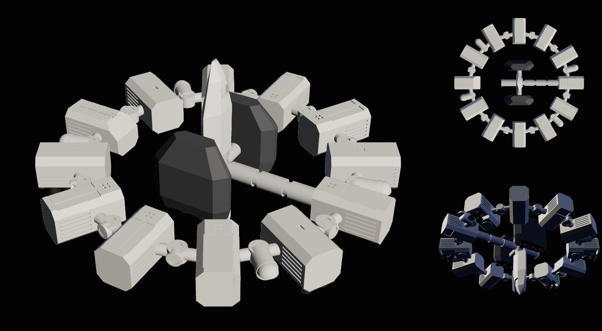

# ENDURANCE

A parametric CAD model of the **Endurance** from *Interstellar* (2014): the
64 m ring of twelve modules, its hub and single spoke, with both Rangers and
both landers docked. It exports a STEP file for CAD and a watertight STL for
printing. The default scale is **1:300**, which makes the ring 213 mm across
and the whole ship 140 mm along its axis.

Live viewer: https://daxjdavis526.github.io/Projects/endurance/



## Files

| file | what |
|---|---|
| `models/endurance_1-300_step.zip` | The CAD model, zipped. Named, coloured bodies: `ring`, `engine_nozzles`, `hub`, `ranger`, `landers`, `lander_nozzles`. Units mm. |
| `models/endurance_1-300.stl` | The print model: everything unioned into one watertight body (checked with manifold3d, 0 non-manifold edges). |
| `models/endurance.glb` | The CAD model tessellated for `index.html`. |
| `build_model.py` | The generator. Every file above comes out of it. |
| `index.html` | A three.js viewer, with download links. |

## Building

```
pip install cadquery manifold3d
python3 endurance/build_model.py               # 1:300 into endurance/models/
python3 endurance/build_model.py --scale 250   # 1:250, 256 mm across
python3 endurance/build_model.py --shell 0     # solid modules
```

It takes about fifteen seconds.

Axes: the ring lies in the XY plane and +Z is forward, so the engines fire
toward −Z. Azimuth runs clockwise from +Y as seen from the front. The spoke
points at 3 o'clock (+X).

## Printing

- Print it flat on its aft face, or on its forward face if you want the
  nozzle bays on top. The docked Rangers stick out 18 m (60 mm) forward and
  aft of the ring, so support the hub stack or print the Rangers upright as
  a column.
- The twelve ring modules are hollow, with 1/8 in (3.175 mm) walls and closed
  cavities. That is fine for FDM. For resin, drill a drain hole into each
  module, or trapped resin will cure inside and crack them.
- At 1:300 the thinnest parts are the tunnels (6.7 mm across) and the
  radiator louvres (1.3 mm grooves). Everything prints on a 0.4 mm nozzle.

## What is in the model

**The ring.** Twelve straight, radially pointing modules, 30° apart, running
from 19.8 m to 32 m out. They are 7 m deep along the axis. Each has 1.2 m
chamfers on its four long edges and radiator louvres down both sides. In
order clockwise from 12 o'clock, seen from the front:

| azimuth | module | details |
|---|---|---|
| 0° | habitat A | two long face panels, window cluster, window bay on the aft face |
| 30°, 150°, 210°, 330° | landing pods | two long face panels, window cluster |
| 60°, 120°, 240°, 300° | engines | aft nozzle bay with three bells in a triangle, a large round fitting, a hatch |
| 90° | habitat B | two face panel rows; the spoke lands on its inner end |
| 180° | cryo-lab / sick bay | as the pods |
| 270° | command | a 3 m sloped panel across the forward inner end, a 2 × 3 panel grid, windows, a dark strip |

Between the modules are twelve connector nodes, short cylinders with round
hatches forward, aft and outboard. Tunnels run from each node to its
neighbours' side faces. Four Ranger docking capsules stand out from the nodes
at 75°, 135°, 255° and 315°.

**The hub.** A node on the axis carries four things:
- Forward and aft docking ports, the forward one with a ribbed collar.
- One spoke to habitat B, made of three sections with narrower collars.
- A short stub toward the command module, which stops well short of it.
- Two arms, up and down, carrying the landers.

**Docked craft.**
- Two Rangers, 18 m long, sit tail-first on the axial ports, one forward and
  one aft, with their wings toward the landers.
- Two landers (14.4 × 4.8 × 14 m, faceted, four engines aft) lie along the
  axis on the arms.

## What is accurate and what is not

The Endurance is a film spacecraft, so there are no measurements of a real
vehicle. "Accurate" here means faithful to the film's own sources:
- New Deal Studios' 1/15 shooting miniature, which was 14 ft across (so 64 m
  full size).
- Film frames.
- The labelled forward-view plan in Kip Thorne's *The Science of
  Interstellar*, reproduced by space.com.

**Stated by a source, used as given:**
- 64 m ring diameter.
- Twelve modules, and their types and order: two habitats, a cryo-lab, a
  command module, four landing pods and four engines.
- Four ring airlocks.
- Two landers and two Rangers.
- The 1/15 miniature.

**Measured from the plan and photographs.** These are right in proportion,
not to the centimetre; typical error is ±0.5 m:
- Module length (12 m) and width (6.6 m; engines 7 m).
- Node and tunnel positions and sizes.
- The spoke, stub and arms.
- The engine bays and nozzles (three per engine, 12 in all).
- Face panels and windows.

**Least certain:**
- **Ring thickness (7 m).** No clean edge-on view exists. The one film frame
  that shows it gives 5.5–8.5 m.
- **The docked craft.** Sizes come from the plan's end-on outlines and model
  kits: the Ranger is 18 m long from the 1/5 pyro model and the 1/72 kit, and
  the lander is 14 m long. The second Ranger's aft position is inferred; the
  plan draws two Rangers, the film mostly shows one.
- **Details on the aft faces,** from one miniature photo.

**Simplified or left out:**
- The quilted, weathered surface textures.
- The small triangular RCS blocks at module corners.
- The triangular vent cut-outs on the command module's slope.
- The miniature's panel lines.
- The Ranger and landers are faceted outlines, not detailed craft.

## Sources

- [fxguide: the miniature effects behind Interstellar](https://www.fxguide.com/fxfeatured/real-and-raw-the-miniature-fx-behind-interstellar/)
- [Art of VFX: New Deal Studios interview](https://www.artofvfx.com/?p=11161)
- [space.com: Spaceships of Interstellar (infographic)](https://www.space.com/27694-interstellar-movie-spaceships-infographic.html)
- [Interstellar wiki: Endurance](https://interstellarfilm.fandom.com/wiki/Endurance)
- [IPMS review of the Moebius 1/72 Ranger](https://reviews.ipmsusa.org/comment/25)

`vendor/three/` is three.js r180 (the minified core, `OrbitControls`, and
`GLTFLoader` with the one utility it imports), copied from `starship/`.
