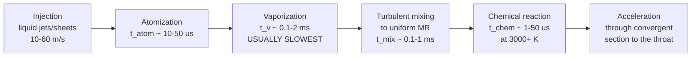

# Module 06 — Combustion Chambers
Part II · Prerequisites: modules 03, 04, 05 · Estimated time: 7 h

A combustion chamber looks like the easiest part of a rocket engine. It is a
can. It has no moving parts. Every hard thing — the pumps, the valves, the
injector, the cooling circuit — bolts onto it or runs through it, and the can
itself just sits there and contains pressure. That impression survives exactly
until the first time you are handed a hot-fire record showing 94 % $c^*$
efficiency and asked whether the fix is a longer chamber, a finer spray, or a
different mixture-ratio split, and you realise that all three change the answer
and only one of them is affordable. The chamber is where the propellant is
converted from two cold liquids into a hot gas at a known composition and a
known stagnation pressure, and every quantity you computed in Module 03 —
$c^*$, $C_F$, $I_{sp}$ — silently assumed that conversion was complete and
lossless before the throat. It never is. This module is about how far from
complete it is, what sets that, and what it costs to close the gap.

---

## 1. Learning objectives

After this module you should be able to:

1. State the three physical jobs a combustion chamber performs and give the
   characteristic time of each.
2. Derive the relation between characteristic chamber length $L^*$, chamber
   volume, and mean gas residence time, and compute residence time for a given
   engine in milliseconds.
3. Size a chamber — volume, cylinder length, convergent section, total
   injector-to-throat length — from a required thrust, chamber pressure,
   $L^*$ and contraction ratio.
4. Compute the subsonic Mach number at the end of the cylindrical section from
   the contraction ratio, and from it the Rayleigh (heat-addition) stagnation
   pressure loss between the injector face and the nozzle stagnation station.
5. Explain, quantitatively, why injector-end and nozzle-stagnation chamber
   pressures differ, and estimate the difference for a given contraction ratio.
6. Argue the chamber-pressure trade in both directions: what $I_{sp}$, envelope
   and mass are gained, and what heat flux, pump power, cycle complexity and
   life are paid.
7. Define $\eta_{c^*}$, compute it from hot-fire data, and diagnose whether a
   shortfall is vaporization-limited, mixing-limited, or an artefact of film
   cooling.
8. Estimate a droplet vaporization time and compare it to residence time to
   decide whether a chamber is long enough.
9. Name the chamber design choice made by each of the V-2, F-1, RS-25, RL10 and
   BE-4, and state the constraint that forced it.

---

## 2. Terminology

| term | symbol | SI unit | definition |
|---|---|---|---|
| Throat area | $A_t$ | m² | geometric minimum flow area of the nozzle |
| Chamber (barrel) area | $A_c$ | m² | cross-sectional area of the cylindrical section |
| Contraction ratio | $\varepsilon_c$ | — | $A_c/A_t$ |
| Nozzle expansion ratio | $\varepsilon$ | — | $A_e/A_t$ (Module 09) |
| Chamber volume | $V_c$ | m³ | volume from the injector face to the throat plane |
| Characteristic length | $L^*$ | m | $V_c/A_t$; an empirical residence-time proxy |
| Cylinder length | $L_{cyl}$ | m | injector face to the start of the convergent section |
| Convergent half-angle | $\theta_c$ | rad (quoted in °) | wall angle of the convergent cone to the axis |
| Throat upstream radius | $R_u$ | m | radius of curvature of the wall just upstream of the throat |
| Throat downstream radius | $R_d$ | m | radius of curvature just downstream of the throat |
| Chamber diameter | $D_c$ | m | $2\sqrt{A_c/\pi}$ |
| Throat diameter | $D_t$ | m | $2\sqrt{A_t/\pi}$ |
| Injector-end chamber pressure | $p_{c,\mathrm{inj}}$ | Pa | stagnation pressure at the injector face |
| Nozzle stagnation pressure | $p_{c,\mathrm{ns}}$ | Pa | stagnation pressure of the fully-burned gas entering the nozzle |
| Chamber temperature | $T_c$ | K | stagnation temperature of the combustion products |
| Chamber gas density | $\rho_c$ | kg/m³ | $p_{c}/(R T_c)$ at stagnation conditions |
| Mixture ratio | $\mathrm{MR}$ (O/F) | — | oxidizer mass flow / fuel mass flow |
| Mass flow | $\dot m$ | kg/s | total propellant mass flow |
| Chamber mass flux | $G$ | kg/(m²·s) | $\dot m / A_c$ |
| Ratio of specific heats | $\gamma$ | — | $c_p/c_v$ of the combustion products |
| Molar mass | $\mathcal{M}$ | kg/kmol | mean molar mass of the products |
| Specific gas constant | $R$ | J/(kg·K) | $R_u/\mathcal{M}$ |
| Vandenkerckhove function | $\Gamma$ | — | $\sqrt{\gamma}\,\left(\tfrac{2}{\gamma+1}\right)^{\frac{\gamma+1}{2(\gamma-1)}}$ |
| Characteristic velocity | $c^*$ | m/s | $p_{c,\mathrm{ns}} A_t/\dot m$ |
| $c^*$ efficiency | $\eta_{c^*}$ | — | $c^*_{\mathrm{delivered}}/c^*_{\mathrm{theoretical}}$ |
| Mach number | $\mathrm{Ma}$ | — | local velocity / local sound speed |
| Sound speed | $a$ | m/s | $\sqrt{\gamma R T}$ |
| Gas residence (stay) time | $t_s$ | s | mean time a gas element spends in $V_c$ |
| Droplet vaporization time | $t_v$ | s | time to fully vaporize a drop of initial diameter $d_0$ |
| Initial drop diameter (SMD) | $d_0$ | m | Sauter mean diameter of the injected spray |
| Evaporation constant | $K$ | m²/s | slope of the $d^2$-law, $d^2 = d_0^2 - Kt$ |
| Spalding transfer number | $B$ | — | driving potential for evaporation |
| Wall heat flux | $q''$ | W/m² | local heat flux into the chamber wall |
| Gas-side film coefficient | $h_g$ | W/(m²·K) | Bartz coefficient (Module 10) |
| Injector pressure drop | $\Delta p_{inj}$ | Pa | injector face to chamber static pressure difference |
| First tangential frequency | $f_{1T}$ | Hz | lowest transverse acoustic mode of the barrel |
| Allowable wall stress | $\sigma_{all}$ | Pa | design allowable of the pressure-containing wall |

---

## 3. Theory

### 3.1 What the chamber is actually for

Module 03 wrote thrust as $F = C_F\, p_{c}\, A_t$ and $c^* = p_c A_t/\dot m$, and
Module 04 gave you $T_c$, $\gamma$ and $\mathcal{M}$ from CEA. Both assumed a
gas — homogeneous, chemically equilibrated, at a single stagnation state,
arriving at the throat. What is actually injected is two liquids at 100–300 K
moving at 10–60 m/s. The chamber's job is to close that gap, and it has to close
it in about a millisecond.

The conversion is a chain of four processes, and each has a characteristic time:



Three observations follow immediately, and they organise the entire module.

**[F] The reaction is never the bottleneck at chamber conditions.** At 3000–3700 K
and 50–300 bar, the characteristic chemical time for hydrogen–oxygen or for the
final CO → CO₂ step in a hydrocarbon flame is microseconds. If the propellants
are gaseous, premixed and hot, they burn essentially instantaneously. Chambers
are long not because the chemistry is slow but because getting the reactants
into the gas phase and next to each other is slow.

**[F] Vaporization is usually the slowest step for a liquid–liquid engine.** A
100 μm kerosene droplet takes a few tenths of a millisecond to disappear; a
300 μm droplet takes milliseconds, which is longer than it will be in the
chamber. This single fact explains the whole $L^*$ table in §3.3 and most of
the difference between a hydrogen engine and a kerosene engine.

**[F] The chamber must finish the job upstream of the throat, not at it.** Any
heat released downstream of the throat contributes almost nothing to thrust,
because the gas is already supersonic and the added enthalpy cannot be expanded
against a converging area. Combustion that "finishes in the nozzle" is
combustion you paid for and did not get.

The design consequence is a single inequality that you should be able to write
from memory:

$$t_s \;\gtrsim\; 3\,\bigl(t_{v} + t_{mix}\bigr)$$

> **Eq. 3.1** — variables: $t_s$ mean gas residence time [s]; $t_v$ droplet
> vaporization time [s]; $t_{mix}$ turbulent mixing time [s]. Meaning: the
> chamber must hold the propellant for several times longer than the slowest
> preparation process, because these are distributions, not single values, and
> the tail of the drop-size distribution sets the last percent of $c^*$.
> Assumes: vaporization and mixing proceed in parallel with reaction, and the
> factor of ~3 is an engineering allowance, not a theorem. Fails when: the
> spray contains a coarse tail (a plugged or eroded element), when film cooling
> deliberately puts unburned fuel at the wall, or when the propellants are
> injected supercritically and "vaporization" is not a phase change at all.
> **[J]** on the factor 3; [F] on the structure.

### 3.2 The chamber as a control volume

Start from mass conservation. In steady state the mass of gas held in the
chamber is constant, so the mean residence time of a gas element is the
inventory divided by the throughput:

$$t_s = \frac{m_{gas}}{\dot m} = \frac{\rho_c V_c}{\dot m}$$

> **Eq. 3.2** — variables: $m_{gas}$ mass of gas resident in the chamber [kg];
> $\rho_c$ chamber gas density [kg/m³]; $V_c$ chamber volume [m³]; $\dot m$
> total mass flow [kg/s]. Meaning: the definition of mean residence time for a
> steady flow through a fixed volume. Assumes: the chamber contains only gas at
> stagnation density — which is exactly what is false near the injector, where
> the volume is occupied by liquid ligaments and droplets at 500–1200 kg/m³
> rather than gas at 5–15 kg/m³. Fails as a *physical* stay time near the
> injector face; it remains an exact bookkeeping identity for the gas phase.
> [F] as an identity, [A] as a physical stay time.

That last caveat matters and is routinely glossed over. Near the injector the
control volume is mostly liquid. A droplet moving at 30 m/s in a gas stream
moving at 200 m/s stays in the chamber far longer than Eq. 3.2 suggests, which
is fortunate, because it is the droplet that needs the time. Eq. 3.2 is
therefore a *conservative* proxy: if the nominal gas residence time is adequate,
the droplet residence time certainly is.

Now bring in choked flow from Module 02. The throat is choked, so

$$\dot m = \frac{p_{c,\mathrm{ns}} A_t}{c^*}, \qquad c^* = \frac{\sqrt{R T_c}}{\Gamma}, \qquad \Gamma = \sqrt{\gamma}\left(\frac{2}{\gamma+1}\right)^{\frac{\gamma+1}{2(\gamma-1)}}$$

> **Eq. 3.3** — variables: $p_{c,\mathrm{ns}}$ nozzle stagnation pressure [Pa];
> $A_t$ throat area [m²]; $c^*$ characteristic velocity [m/s]; $R$ specific gas
> constant [J/(kg·K)]; $T_c$ chamber stagnation temperature [K]. Meaning: the
> choked-throat mass-flow law, rearranged as the definition of $c^*$.
> Assumes: one-dimensional, calorically perfect, chemically frozen or fully
> equilibrated flow with the throat sonic. Fails when: the throat is not choked
> (start-up, deep throttling below ~10 % with a fixed throat), or when
> two-phase or strongly non-equilibrium flow makes a single $\gamma$ meaningless.
> [F]. Derived in Module 03.

### 3.3 Characteristic length $L^*$ and residence time

The design parameter the industry actually uses is not residence time but
**characteristic length**:

$$L^* \equiv \frac{V_c}{A_t}$$

> **Eq. 3.4** — variables: $V_c$ chamber volume from the injector face to the
> throat plane [m³]; $A_t$ throat area [m²]. $L^*$ has units of length but is
> not a physical length; it is the length the chamber would have if it were a
> constant-area duct of throat cross-section holding the same volume.
> Meaning: a normalised measure of how much volume is provided per unit of
> throughput. Assumes: nothing — it is a definition. Fails as a *design rule*
> when compared across propellant combinations, injector types, or chamber
> pressures far outside the data set it was tabulated from. [E] as a design
> rule; a definition otherwise.

Two conventions bite here and both are worth stating out loud. First, $V_c$
conventionally includes the convergent section up to the throat plane, not just
the barrel — a chamber quoted with barrel volume only will look 8–12 % smaller.
Second, $L^*$ is quoted in inches in every source older than about 1990, and the
numbers 30, 40 and 50 are burned into a generation of engineers' memory as
inches, not centimetres.

Combine Eq. 3.2, 3.3 and 3.4 with $\rho_c = p_c/(R T_c)$:

$$t_s = \frac{\rho_c V_c}{\dot m} = \frac{p_c}{R T_c}\cdot \frac{L^* A_t}{p_c A_t/c^*} = \frac{L^* c^*}{R T_c}$$

and since $c^{*2} = R T_c/\Gamma^2$, i.e. $R T_c = \Gamma^2 c^{*2}$:

$$\boxed{\;t_s = \frac{L^*}{\Gamma^2\, c^*}\;}$$

> **Eq. 3.5** — variables: $t_s$ mean gas residence time [s]; $L^*$ [m];
> $\Gamma$ Vandenkerckhove function of $\gamma$ [—]; $c^*$ characteristic
> velocity [m/s]. Meaning: **chamber pressure cancels out completely.** For a
> given propellant combination and a given $L^*$, the residence time is fixed
> regardless of chamber pressure or engine size. This is the single most useful
> result in the module and the reason $L^*$ survived as a design parameter for
> seventy years. Assumes: gas at chamber stagnation density throughout $V_c$
> (Eq. 3.2's assumption), choked throat, single $\gamma$. Fails: as a physical
> stay time near the injector, and across propellants — a large $c^*$ (hydrogen)
> gives a *shorter* residence time at the same $L^*$. [F], derived above.

The cancellation deserves a moment. Raising $p_c$ at fixed thrust shrinks $A_t$,
which shrinks $V_c$ at fixed $L^*$ — but it raises $\rho_c$ in exact proportion,
so the resident gas mass per unit mass flow is unchanged. Residence time is a
property of $L^*$ and the propellant, full stop. What raising $p_c$ *does*
change is the vaporization time, which shortens with pressure, so a high-$p_c$
engine can and does use a smaller $L^*$ than a low-$p_c$ engine on the same
propellants. That is an effect on the numerator of Eq. 3.1, not the denominator.

For $\gamma = 1.20$, $\Gamma = 0.6485$ and $\Gamma^2 = 0.4206$. So

$$t_s \approx \frac{2.38\,L^*}{c^*} \quad (\gamma = 1.20)$$

Typical values, computed from Eq. 3.5:

| combination | $c^*$ (m/s, ideal) | typical $L^*$ (m) | $t_s$ (ms) |
|---|---|---|---|
| LOX / RP-1 | ~1800 | 1.15 | 1.52 |
| LOX / LH2 | ~2280 | 0.90 | 0.94 |
| N₂O₄ / MMH | ~1720 | 0.75 | 1.04 |

Every flying liquid engine sits in the range **0.7–2.5 ms**. That is the number
to carry in your head.

#### The classical $L^*$ table

These are the tabulated ranges from the Rocketdyne design lineage
[SP-125 §4.4], [HH §4], reproduced in [SB Table 8-1]. They are **[E] empirical**,
fitted to 1950s–1960s hardware with impinging or coaxial injectors, and they are
what a first cut uses before any test data exists.

| propellant combination | $L^*$ (m) | $L^*$ (in) |
|---|---|---|
| GOX / GH₂ (both gaseous) | 0.56 – 0.66 | 22 – 26 |
| LOX / GH₂ (gaseous hydrogen injection) | 0.56 – 0.71 | 22 – 28 |
| LF₂ / hydrazine | 0.61 – 0.71 | 24 – 28 |
| N₂O₄ / hydrazine-type (MMH, UDMH, A-50) | 0.60 – 0.89 | 25 – 35 |
| ClF₃ / hydrazine-type | 0.76 – 0.89 | 30 – 35 |
| HNO₃ / hydrazine-type | 0.76 – 0.89 | 30 – 35 |
| LOX / LH₂ | 0.76 – 1.02 | 30 – 40 |
| LOX / NH₃ | 0.76 – 1.02 | 30 – 40 |
| LOX / RP-1 | 1.02 – 1.27 | 40 – 50 |
| H₂O₂ / RP-1 | 1.52 – 1.78 | 60 – 70 |

Read the table as a *vaporization* table and it stops being a list to memorise.
The ordering is almost exactly the ordering of "how hard is it to get both
propellants into the gas phase":

- **Both gaseous** (GOX/GH₂): nothing to vaporize, only mixing. Shortest.
- **One gaseous** (LOX/GH₂): only the oxidizer must vaporize, and LOX drops
  sheared off a coaxial post are fine and sit in a hydrogen-rich gas with very
  high thermal conductivity. Short.
- **Both cryogenic liquids** (LOX/LH₂): the hydrogen flashes essentially on
  contact; LOX is still the limiter. Moderate.
- **Storable hypergols**: ignition is instantaneous on contact, which removes
  the ignition-delay contribution entirely, and the fuels are volatile. Short
  for a liquid–liquid combination.
- **LOX / RP-1**: kerosene is a heavy, low-volatility, multi-component fuel with
  a boiling range of 150–250 °C. It is the slowest common propellant to
  vaporize and it gets the longest chambers.
- **H₂O₂ / RP-1**: the peroxide must first *decompose* on a catalyst bed or
  thermally before there is any oxygen to burn with, and that decomposition
  length is inside the quoted $L^*$. Longest by a wide margin, and a good
  reminder that $L^*$ is a bookkeeping bucket for everything slow.

Two gaps in this table are worth naming. **LOX/CH₄ does not appear** — the
tabulation predates methalox engines by decades. Modern methalox practice
appears to sit around 0.8–1.1 m, between hydrogen and kerosene, which is what
methane's volatility would suggest, but the flying engines do not publish $L^*$
and this should be treated as **[J], low confidence**. And the whole table
assumes *subcritical* injection. Above the critical pressure of the fuel
(RP-1 ≈ 22 bar, CH₄ ≈ 46 bar, H₂ ≈ 13 bar, O₂ ≈ 50 bar) there is no surface
tension, no droplet, and no latent heat — the jet undergoes turbulent mixing of
a dense fluid rather than atomization and evaporation [LRTC ch. 9], [OY93]. Every
modern engine above ~60 bar is injecting at least one propellant supercritically,
and the fact that the 1960s $L^*$ table still works reasonably well for them is
a happy accident of the physics being *faster*, not evidence that the model is
right. **[M]**

#### What $L^*$ is not

$L^*$ says nothing about *shape*. A 0.030 m³ chamber can be a short fat barrel
or a long thin one, and those two have very different heat loads, wall
residence times, acoustic mode frequencies and structural masses. $L^*$ fixes
one number; you need the contraction ratio to fix the second. Nor does $L^*$
transfer across injector designs: an engine with a modern fine-atomizing
injector will reach the same $\eta_{c^*}$ at a smaller $L^*$ than the tables
suggest, and the correct response to a good injector is to *shorten the chamber*
and bank the mass and heat-load saving. Rocketdyne's own practice through the
1960s was to build a chamber at the tabulated $L^*$, then trim it in test until
$c^*$ started to drop — the "$L^*$ trim" — and modern programmes do the same
thing in CFD first and test second. **[H]/[M]**

### 3.4 Contraction ratio, chamber Mach number and mass flux

The contraction ratio $\varepsilon_c = A_c/A_t$ fixes the barrel diameter once
the throat is known. It is bounded on both sides:

**Lower bound — the flow must stay comfortably subsonic.** By the end of the
cylindrical section combustion is complete and the flow is (to a good
approximation) isentropic from there to the throat, so the subsonic branch of
the area–Mach relation applies with $A/A^* = \varepsilon_c$:

$$\varepsilon_c = \frac{1}{\mathrm{Ma}}\left[\frac{2}{\gamma+1}\left(1+\frac{\gamma-1}{2}\mathrm{Ma}^2\right)\right]^{\frac{\gamma+1}{2(\gamma-1)}}$$

> **Eq. 3.6** — variables: $\varepsilon_c$ contraction ratio [—]; $\mathrm{Ma}$
> Mach number at the end of the barrel [—]; $\gamma$ [—]. Meaning: the
> isentropic area relation, evaluated on the subsonic root. Assumes: isentropic,
> one-dimensional, calorically perfect flow between the barrel exit and the
> throat, with combustion already complete. Fails: upstream of combustion
> completion, where heat addition makes the flow non-isentropic (that is §3.5),
> and in the boundary layer. [F], from Module 02.

For $\gamma = 1.20$:

| $\varepsilon_c$ | $\mathrm{Ma}$ at barrel exit |
|---|---|
| 1.5 | 0.438 |
| 1.8 | 0.352 |
| 2.0 | 0.312 |
| 2.5 | 0.245 |
| 3.0 | 0.202 |
| 4.0 | 0.150 |
| 6.0 | 0.099 |

**Upper bound — mass, heat load and acoustics.** A larger $\varepsilon_c$ means
a bigger, heavier barrel with more cooled surface area, and a lower first
tangential acoustic frequency (§3.12), which moves the chamber's transverse
modes down toward the frequencies at which combustion responds most strongly.

Real practice, [SB §8.1], [HH §4], [SP-8087]:

- **Large engines** ($D_t \gtrsim 0.15$ m): $\varepsilon_c \approx 1.3$–$2.5$.
- **Small engines** ($D_t \lesssim 0.05$ m): $\varepsilon_c \approx 3$–$6$.

The size dependence is not arbitrary. As the engine shrinks, the injector face
needs a minimum area to fit a sensible number of elements of a manufacturable
size, and the throat shrinks faster than the element does. A 100 N thruster with
$\varepsilon_c = 2$ would have a chamber a few millimetres across with room for
one element. **[E]**

The derived quantity that actually matters for injector design is the
**chamber mass flux**:

$$G = \frac{\dot m}{A_c} = \frac{p_{c}}{c^*\,\varepsilon_c}$$

> **Eq. 3.7** — variables: $G$ chamber mass flux [kg/(m²·s)]; $\dot m$ [kg/s];
> $A_c$ [m²]; $p_c$ [Pa]; $c^*$ [m/s]; $\varepsilon_c$ [—]. Meaning: the
> propellant throughput each square metre of injector face must handle, which
> sets element density and hence element size. Assumes: choked throat, uniform
> flow across the face. Fails: with a deliberately non-uniform face (a fuel-rich
> outer row, a baffled centre), where the local flux differs substantially from
> the mean. [F], from Eq. 3.3.

Note $G \propto p_c/\varepsilon_c$: doubling chamber pressure doubles the
throughput per unit face area, which is why high-$p_c$ engines have dense,
small, high-velocity injector elements and why the injector problem gets harder
faster than the chamber problem as $p_c$ rises. Module 07 picks this up.

Finally, a point of vocabulary that trips people. The **gas velocity at the
injector face is essentially zero** — the propellant there is liquid. The
velocity implied by $\varepsilon_c$ is the velocity at the *end* of the barrel,
where combustion is complete. "Injector-face velocity" in the older literature
means the nominal $\dot m/(\rho_c A_c)$ computed as though the gas were already
formed, and is used as a proxy for how hard the emerging gas scours the face. It
is a bookkeeping number, not a measured one.

### 3.5 Heat addition in a duct: the Rayleigh stagnation pressure loss

Here is the part that explains the single most persistent inconsistency in
published engine data.

Consider the barrel as a constant-area duct. Propellant enters at the injector
face with negligible velocity; heat is released along the duct; gas leaves the
barrel at Mach $\mathrm{Ma}$. This is **Rayleigh flow**: constant area, with heat
addition, no friction. Apply momentum conservation between the injector face
(station 1, $u \approx 0$) and the barrel exit (station 2):

$$p_1 A_c = p_2 A_c + \dot m u_2 \;\Longrightarrow\; p_1 = p_2 + \rho_2 u_2^2$$

and since $\rho u^2 = \gamma p \,\mathrm{Ma}^2$ for a perfect gas,

$$\frac{p_{1}}{p_{2}} = 1 + \gamma\,\mathrm{Ma}_2^2$$

> **Eq. 3.8** — variables: $p_1$ static pressure at the injector face [Pa];
> $p_2$ static pressure at the barrel exit [Pa]; $\mathrm{Ma}_2$ barrel-exit
> Mach number [—]; $\gamma$ [—]. Meaning: accelerating the gas from rest costs
> static pressure, by exactly the momentum flux it acquires. Assumes: constant
> area, no wall friction, negligible inlet velocity, perfect gas. Fails: where
> the area changes (the convergent section), and where wall friction is
> significant (it adds a further, usually smaller, loss). [F], derived above.

The static pressure drop is not itself the problem — what the nozzle sees is the
**stagnation** pressure. Convert:

$$\frac{p_{0,2}}{p_{0,1}} = \frac{p_2}{p_1}\cdot\frac{\left(1+\frac{\gamma-1}{2}\mathrm{Ma}_2^2\right)^{\frac{\gamma}{\gamma-1}}}{1} = \frac{\left(1+\frac{\gamma-1}{2}\mathrm{Ma}_2^2\right)^{\frac{\gamma}{\gamma-1}}}{1+\gamma\,\mathrm{Ma}_2^2}$$

$$\boxed{\;\frac{p_{c,\mathrm{ns}}}{p_{c,\mathrm{inj}}} = \frac{\left(1+\frac{\gamma-1}{2}\mathrm{Ma}_2^2\right)^{\frac{\gamma}{\gamma-1}}}{1+\gamma\,\mathrm{Ma}_2^2}\;}$$

> **Eq. 3.9** — variables: $p_{c,\mathrm{ns}}$ nozzle stagnation pressure [Pa];
> $p_{c,\mathrm{inj}}$ injector-end stagnation pressure [Pa] (equal to the static
> pressure there, since $u\approx 0$); $\mathrm{Ma}_2$ barrel-exit Mach number.
> Meaning: **heat addition in a duct destroys stagnation pressure.** This is a
> genuine thermodynamic loss, not a bookkeeping artefact: the entropy rise from
> adding heat to a moving gas is irreversible in the sense that the stagnation
> pressure cannot be recovered. Assumes: constant area, frictionless, perfect
> gas, all heat added upstream of station 2, $\mathrm{Ma}_1 \approx 0$.
> Fails when: a large fraction of the heat is released in the convergent section
> (a badly under-length chamber), or when the barrel is short enough that
> friction and heat-transfer losses are comparable. [F].

Evaluate it, $\gamma = 1.20$:

| $\mathrm{Ma}_2$ | $\varepsilon_c$ giving it | static loss $1-p_2/p_1$ | **stagnation loss $1-p_{0,2}/p_{0,1}$** |
|---|---|---|---|
| 0.10 | 6.0 | 1.19 % | **0.59 %** |
| 0.15 | 4.0 | 2.63 % | **1.31 %** |
| 0.20 | 3.0 | 4.58 % | **2.27 %** |
| 0.25 | 2.5 | 6.98 % | **3.43 %** |
| 0.30 | 2.1 | 9.75 % | **4.76 %** |
| 0.40 | 1.6 | 16.1 % | **7.73 %** |
| 0.50 | 1.35 | 23.1 % | **10.8 %** |

Now several things fall into place at once.

**(a) Why contraction ratios below about 1.5 are rare.** At $\varepsilon_c = 1.35$
you have thrown away 10.8 % of your chamber pressure before the nozzle sees it —
and since $F = C_F p_{c,\mathrm{ns}} A_t$, that is very nearly 10.8 % of thrust
for a pump that is still working against the injector-end pressure. No amount of
nozzle design recovers it. The pumps must deliver $p_{c,\mathrm{inj}}$; the
thrust is set by $p_{c,\mathrm{ns}}$; the difference is pure loss.

**(b) Why the same engine has two chamber pressures.** [_verify-liquid §18]
records this as the single largest recurring source of apparent disagreement in
the engine literature: **American Apollo-era practice quotes injector-end
pressure; Soviet and Russian practice quotes nozzle stagnation pressure.** Eq. 3.9
tells you the size of the gap — for realistic contraction ratios of 1.6–3.0, it
is **2–8 %**. That is comfortably larger than the precision to which engine
tables are usually printed, and it means:

- The F-1's circulating values of 965 / 982 / 1,015 / 1,125 psia
  (66.5 / 67.7 / 70.0 / 77.6 bar) span 17 %. Part of that spread is
  measurement station, part is programme phase (development peak versus flight
  nominal). [_verify-liquid §1] recommends printing **≈ 70 bar (1,015 psia) at
  the injector end** and footnoting the range, and that is what this course does.
- Comparing the RD-180's 267 bar with the RS-25's 206.4 bar is a comparison of
  numbers whose measurement stations are not stated in either source.
  [_verify-liquid §18] flags this explicitly and recommends a standing note on
  the convention. **You cannot resolve that comparison to better than a few
  percent without knowing the station for each engine, and the direction of the
  correction depends on which convention each figure follows.** Do not let
  anyone in an interview push you into a two-significant-figure comparison of
  two engines from different national traditions.

**(c) Why $c^*$ must be defined at the nozzle stagnation station.** $c^* =
p_c A_t/\dot m$ is only equal to $\sqrt{RT_c}/\Gamma$ if $p_c$ is the stagnation
pressure of the fully burned gas. Using the injector-end pressure inflates the
measured $c^*$ — and hence the reported $\eta_{c^*}$ — by the same 2–8 %. A
test stand that measures injector-end pressure (which is easy: a tap in the dome
sees a near-stagnant fluid and survives) and reports $c^*$ without correcting to
the nozzle stagnation station will report combustion efficiencies above 100 %,
which happens, and which is always this. **[F]**

Eq. 3.9 is an idealisation. Real chambers add friction (small, ~0.5 % of $p_c$
for a short barrel), and release some heat inside the convergent section (which
reduces the loss below the Rayleigh value, since the area change partly offsets
the acceleration). The Rayleigh number is therefore a **conservative upper
bound** on the injector-end-to-nozzle-stagnation drop, typically within a factor
of 1.2 of measurement. **[A]**

### 3.6 Choosing the chamber pressure

Chamber pressure is the master variable of liquid engine design. It sets engine
size, cycle, cooling architecture, pump power, mass and cost, and it is the
first number on any engine's spec sheet. Here is the trade in full.

#### What you gain

**(i) Thrust coefficient.** At a fixed nozzle area ratio,

$$C_F = C_{F,\mathrm{vac}}(\gamma,\varepsilon) - \frac{p_a\,\varepsilon}{p_c}$$

> **Eq. 3.10** — variables: $C_F$ thrust coefficient [—]; $C_{F,\mathrm{vac}}$
> its vacuum value, a function of $\gamma$ and $\varepsilon$ only [—]; $p_a$
> ambient pressure [Pa]; $\varepsilon$ nozzle area ratio [—]; $p_c$ chamber
> (nozzle stagnation) pressure [Pa]. Meaning: the ambient back-pressure penalty
> scales as $1/p_c$, so raising chamber pressure directly buys back sea-level
> thrust. Assumes: attached, isentropic nozzle flow. Fails when: the nozzle
> separates, which is precisely what limits $\varepsilon$ at low $p_c$
> (Module 09). [F], from Module 03.

But that is the smaller effect. The larger one is that **raising $p_c$ raises the
area ratio you can use without separating at sea level**, and area ratio is
where the $I_{sp}$ lives. Computed for LOX/RP-1 ($\gamma=1.20$, $\mathcal{M}=22$,
$T_c=3600$ K, ideal $c^*=1799$ m/s), sea level:

| $p_c$ (bar) | $C_F$ at fixed $\varepsilon = 16$ | ideal $I_{sp,SL}$ (s) | optimum $\varepsilon$ at SL | $I_{sp,SL}$ at that $\varepsilon$ (s) |
|---|---|---|---|---|
| 15.2 (V-2 class) | 0.731 | 134 | 2.97 | 248 |
| 21.9 (Redstone) | 1.057 | 194 | 3.83 | 261 |
| 70 (F-1) | 1.566 | 287 | 8.97 | 293 |
| 97 (Merlin 1D) | 1.630 | 299 | 11.5 | 301 |
| 140 (BE-4) | 1.681 | 308 | 15.2 | 308 |
| 206 (RS-25) | 1.718 | 315 | 20.5 | 316 |
| 300 (Raptor 2, claimed) | 1.743 | 320 | 27.4 | 322 |

Read the right-hand column. Going from 70 bar to 206 bar buys **23 seconds**, about
8 %. Going from 206 bar to 300 bar buys **7 more seconds**, about 2 %. The returns
are strongly diminishing and the costs, below, are not.

**(ii) Reduced dissociation.** Higher pressure shifts the equilibrium of the
dissociation reactions (H₂O ⇌ OH + ½H₂, CO₂ ⇌ CO + ½O₂, and the H, O, OH radical
pool) back toward the fully-recombined products. Less energy is tied up in
dissociated species, so $T_c$ rises — and although the mean molar mass rises too,
$\sqrt{T_c/\mathcal{M}}$ and hence $c^*$ rise on balance. The magnitude is
**of order 1–2 % on $c^*$ for a factor-of-three pressure increase**, larger for
hot hydrogen–oxygen (which dissociates heavily) than for a cooler storable
combination. **[E], and this is a number you compute in CEA, not one you quote
from a rule of thumb** [CEA], [RP-1311]. Module 04 gives the method.

**(iii) Envelope and vehicle integration.** $A_t = F/(C_F p_c)$, so throat area —
and with it the whole engine's diameter — scales as $1/p_c$. Fitting seven BE-4s
or nine Merlins onto a booster base, or three RS-25s into an orbiter aft
fuselage, is a chamber-pressure problem before it is anything else. This is
often the *actual* reason a programme picks a high $p_c$, and it is rarely the
reason given in the press release. **[J]**

**(iv) Chamber structural mass — which falls.** This one surprises people. For a
thin-walled cylinder, hoop stress gives wall thickness $t = p_c R_c/\sigma_{all}$,
so the barrel mass is

$$m_{barrel} = \rho_m\,(2\pi R_c L_{cyl})\,t = \frac{2\pi \rho_m\, p_c R_c^2 L_{cyl}}{\sigma_{all}}$$

At fixed thrust and geometric similarity, $L_{cyl} \propto R_c \propto R_t
\propto \sqrt{A_t} \propto p_c^{-1/2}$, so

$$m_{barrel} \;\propto\; p_c \cdot p_c^{-1}\cdot p_c^{-1/2} \;=\; p_c^{-1/2}$$

> **Eq. 3.11** — variables: $m_{barrel}$ pressure-containing barrel mass [kg];
> $\rho_m$ wall material density [kg/m³]; $\sigma_{all}$ allowable stress [Pa].
> Meaning: at fixed thrust, the chamber pressure vessel gets *lighter* as
> chamber pressure rises, because the shrinkage in size beats the growth in wall
> thickness. Assumes: thin-wall hoop stress governs, geometric similarity,
> constant $\sigma_{all}$ and $L^*$. Fails when: the wall thickness is set by
> the thermal gradient and low-cycle fatigue rather than by hoop stress — which
> is the case for every regeneratively cooled chamber above ~100 bar, where the
> hot-gas wall is 0.6–1.0 mm thick because of the temperature drop it must
> sustain, not because of pressure. [F] as derived; [A] in application.

The engine as a whole still gets heavier per unit thrust at very high $p_c$,
because the turbomachinery, preburners and hot-gas manifolds grow faster than
the chamber shrinks. The BE-4's ~46:1 thrust-to-weight at 140 bar versus the
Merlin's ~184:1 at 97 bar is that trade, plus a deliberate reuse-life margin,
plus a staged-combustion powerhead.

#### What you pay

**(i) Heat flux.** The Bartz correlation (Module 10, [Bartz57]) gives the
gas-side film coefficient as

$$h_g \propto \left(\frac{p_c}{c^*}\right)^{0.8}$$

so at fixed propellant, **$q'' \propto p_c^{0.8}$**. This is the dominant cost
and it never goes away:

| $p_c$ (bar) | $q''$ relative to 70 bar |
|---|---|
| 15.2 | 0.29 |
| 70 | 1.00 |
| 97 | 1.30 |
| 117.3 | 1.51 |
| 140 | 1.74 |
| 206.4 | 2.38 |
| 267 | 2.92 |
| 300 | 3.20 |

Tripling the chamber pressure from the F-1 to the RS-25 more than doubles the
throat heat flux, and it must be removed through a wall that is *thinner* (to
keep the temperature drop tolerable) and *smaller* (less area). This is why the
RS-25 has a NARloy-Z copper-alloy liner with 390 milled channels and the F-1 has
178 brazed Inconel tubes — the F-1's architecture simply cannot pass that flux.
Modules 10 and 11 are almost entirely a consequence of this one exponent.

**(ii) Pump power.** Pump discharge pressure must exceed $p_{c,\mathrm{inj}}$ by
the injector drop plus the cooling-jacket drop plus line and valve losses,
typically $p_{disch} \approx 1.25$–$1.5\,p_c$. Specific pump work is
$w = \Delta p/(\rho\,\eta_p)$, linear in $p_c$:

| $p_c$ (bar) | specific pump work, $\Delta p = 1.3 p_c$, $\rho = 1000$, $\eta_p = 0.7$ |
|---|---|
| 15.2 | 2.8 kJ/kg |
| 70 | 13.0 kJ/kg |
| 206 | 38.3 kJ/kg |
| 300 | 55.7 kJ/kg |

That work has to come from a turbine, and the turbine has to be fed. In an
open cycle (gas generator) the feed is propellant dumped overboard at low $I_{sp}$,
so the *cycle* $I_{sp}$ penalty grows with $p_c$ and eventually eats the $C_F$
gain — which is exactly why every engine above about 130 bar is staged
combustion or a closed expander, and why the gas-generator Merlin stops at
97 bar. **[F]/[M]**

**(iii) Cycle closure and turbine temperature.** Staged combustion means a
preburner, which means hot gas at 700–1000 K flowing through turbines and a
hot-gas manifold, which means superalloys, which means cost and inspection. It
also means the turbine pressure ratio is bounded by $p_{preburner}/p_c$, and as
$p_c$ rises the preburner pressure must rise faster still. At the RS-25's
206 bar the HPFTP delivers about 480 bar (7,000 psi).

**(iv) Life.** Every thermal cycle drives the hot-gas wall into plastic strain
(Module 16). Low-cycle fatigue life falls steeply with wall $\Delta T$, which
tracks $q''$. Blue Origin has been explicit that the BE-4's 140 bar — low for an
oxidizer-rich staged-combustion engine, against the RD-180's 267 bar — is a
**life and reusability choice, not a limitation** [_verify-liquid, BE-4 block].
That is the clearest public statement anywhere of the $p_c$-versus-life trade,
and it is a genuinely modern position: a 1965 programme would have taken the
performance.

#### The historical trend

| engine | first flight | propellants | $p_c$ (bar) | note |
|---|---|---|---|---|
| V-2 | 1942 | LOX/ethanol-water | **15.2** (220 psia) | pressure capped by the 18-pot injector |
| Redstone A-7 | 1953 | LOX/ethanol | **21.9** (318 psia) | XLR43 lineage; barely moved from the V-2 |
| H-1 | 1961 | LOX/RP-1 | **43.6–48.3** | across uprate blocks |
| J-2 | 1966 | LOX/LH₂ | **52.6** (763 psia) | GG cycle, upper stage |
| F-1 | 1967 | LOX/RP-1 | **≈70** (1,015 psia, injector end) | contested 66.5–77.6; see §3.5(b) |
| RL10A-3-3A | 1962/1986 | LOX/LH₂ | **32.8** (475 psia) | closed expander — heat-balance limited |
| RS-25 | 1981 | LOX/LH₂ | **206.4** (2,994 psia) at 109 % | fuel-rich staged combustion |
| Vulcain 2 | 2005 | LOX/LH₂ | **117.3** | GG cycle at the top of its practical range |
| Merlin 1D | 2013 | LOX/RP-1 | **97** (company figure) | GG cycle |
| RD-180 | 2000 | LOX/RP-1 | **267** | ox-rich staged combustion |
| Vinci | 2024 | LOX/LH₂ | **60** | closed expander, highest-thrust of its kind |
| BE-4 | 2024 | LOX/CH₄ | **140** | ORSC, low by choice for life |
| Raptor 2 | — | LOX/CH₄ | **300** — *company claim* | full-flow staged combustion |
| Raptor 3 | 2026 | LOX/CH₄ | **330** — *company claim* | operational figure, claimed |

**Every Raptor figure in this course is a SpaceX claim.** [_verify-liquid §4]
records that thrust, chamber pressure, $I_{sp}$, dry mass and thrust-to-weight
for Raptor originate from company statements — several from social-media posts —
and that **no independent verification of the chamber pressure exists at all**.
Thrust is corroborated indirectly through FAA licensing documents and
third-party telemetry analysis; nothing else is. Treat 300 and 330 bar as
plausible and unaudited. The same caution applies to BE-3U, BE-4, Archimedes and
Prometheus. Note also that several engines in this table simply **do not publish
a chamber pressure** — the RL10B-2, RL10C-1, BE-3PM, BE-3U and Rutherford are all
"not reliably published", and inventing a number for them is worse than leaving
the cell empty.

The shape of the trend is not a smooth march. It is a step at the F-1 (a factor
of three over the V-2, bought with tube-wall regenerative cooling), a much larger
step at the RS-25 and the Soviet ORSC engines (a factor of three again, bought
with staged combustion and, on the Russian side, with an inert enamel coating
that made oxygen-rich turbine gas survivable [_verify-liquid, RD-180 block]),
and then — for sixty years — very little. Between 1981 and 2020 nobody flew a
higher chamber pressure than the RD-180. The current claimed frontier at
300–330 bar is the first movement in four decades, and it is not yet independently
confirmed.

### 3.7 Chamber temperature and mixture ratio

Chamber temperature is not a free variable; it is what CEA hands you once you
choose the propellants, the mixture ratio and the pressure (Module 04). Two
points belong here rather than there.

**Engines run fuel-rich of the temperature peak, and further fuel-rich of it
than $I_{sp}$ alone would suggest.** Since $c^* \propto \sqrt{T_c/\mathcal{M}}$,
and $\mathcal{M}$ falls faster than $T_c$ on the fuel-rich side, the $c^*$
optimum sits fuel-rich of the $T_c$ optimum. Real engines then go *further*
fuel-rich still, for three reasons: wall heat flux falls with $T_c$; the coolant
is usually the fuel, so a richer mixture means more coolant; and turbine-drive
gas in GG and fuel-rich staged-combustion cycles must be fuel-rich to stay below
turbine material limits.

| combination | stoichiometric O/F | flown O/F | engines |
|---|---|---|---|
| LOX / LH₂ | 8.0 | 5.5 – 6.1 | J-2 5.5, RS-25 6.03, Vulcain 2 6.1, RL10A 5.0 |
| LOX / RP-1 | ~3.4 | 2.2 – 2.8 | F-1 2.27, H-1 2.23, RD-180 2.72, Merlin ~2.34 (not published) |
| LOX / CH₄ | 4.0 | ~3.6 | Raptor 3.6 (claim) |
| LOX / ethanol-water 75/25 | ~1.7 | ~1.18 | V-2 |

**Mixture ratio is a vehicle-level optimum, not an engine-level one.**
Vulcain 2 runs 6.1:1 where Vulcain 1 ran 5.3:1, and its vacuum $I_{sp}$ is
*lower* (429 s versus 431 s) despite a higher chamber pressure — because the
richer oxidizer ratio raises bulk propellant density, shrinks the tanks, and
raises thrust. The stage wins what the engine loses [_verify-liquid, Vulcain
block]. Any argument about mixture ratio that stops at the engine boundary is
incomplete. **[F]/[J]**

The V-2 row deserves a note of its own. The 25 % water in the "B-Stoff" fuel is
there **as a temperature moderator**, not as a diluent forced by supply. Water
carries a large latent heat and a large $c_p$, drops $T_c$ substantially, and
lowers the wall heat flux to something a mild-steel double wall with a modest
alcohol jacket could survive. It costs a large amount of $I_{sp}$ and it was
worth it in 1942, because the alternative was a chamber that burned through.
**[H]**

### 3.8 Chamber geometry

The conventional chamber is a cylinder, a convergent cone, and a rounded throat:

```
    injector face
    |
    v
    +---------------------------+                     .
    |                           |\                    .
    |        cylinder           | \  convergent       .
    |        (barrel)           |  \  half-angle      .
 Dc |          L_cyl            |   \  theta_c        . Dt
    |                           |    \___             .
    |                           |     R_u \___        .
    +---------------------------+----------( )---     throat
                                             R_d
    |<--------- L_cyl --------->|<-- h -->|
    |<------------- injector-to-throat length ------->|
    V_c = A_c L_cyl + V_convergent  (throat plane)
    L* = V_c / A_t
```

Design rules, from [SP-8087], [SP-8120], [HH §4], [SB §8.1]:

| feature | typical | range | why |
|---|---|---|---|
| Convergent half-angle $\theta_c$ | 25–35° | 20–45° | Steeper is shorter and lighter but risks flow separation off the barrel-to-cone corner and concentrates heat flux; shallower adds cooled length and mass. |
| Upstream throat radius $R_u/R_t$ | 1.5 | 0.5–2.0 | Sets the throat discharge coefficient and, via Bartz's $(D_t/R_u)^{0.1}$ term, the throat heat flux. Tight curvature raises $q''$ and lowers $C_d$. |
| Downstream throat radius $R_d/R_t$ | 0.382 | 0.2–0.8 | The Rao bell-nozzle initial expansion [Rao58]; Module 09. |
| Barrel-to-cone fillet | generous | — | A sharp corner is a heat-flux and stress concentration and a favourite crack initiation site. |
| Contraction ratio $\varepsilon_c$ | 1.6–2.5 large, 3–6 small | 1.3–6 | §3.4 |

The convergent-cone volume follows from the frustum formula. With
$R_c = R_t\sqrt{\varepsilon_c}$ and height $h = (R_c-R_t)/\tan\theta_c$:

$$V_{conv} = \frac{\pi h}{3}\left(R_c^2 + R_c R_t + R_t^2\right) = \frac{\pi R_t^3\left(\varepsilon_c^{3/2}-1\right)}{3\tan\theta_c}$$

and therefore, using $R_t = \sqrt{A_t/\pi}$,

$$\boxed{\;L^* = L_{cyl}\,\varepsilon_c \;+\; \frac{1}{3}\sqrt{\frac{A_t}{\pi}}\;\cot\theta_c\left(\varepsilon_c^{3/2}-1\right)\;}$$

> **Eq. 3.12** — variables: $L^*$ [m]; $L_{cyl}$ cylindrical section length [m];
> $\varepsilon_c$ contraction ratio [—]; $A_t$ throat area [m²]; $\theta_c$
> convergent half-angle [rad]. Meaning: the explicit link between the design
> parameter $L^*$ and the physical geometry, so that a chosen $L^*$ and
> $\varepsilon_c$ produce a barrel length. Assumes: a pure conical convergent
> section with a sharp throat corner. Fails: by a small amount (typically 1–3 %
> of $V_c$) because the real throat is rounded with radius $R_u$, which removes
> a sliver of volume; for a first cut this is inside the uncertainty on $L^*$
> itself. [F] as derived; [A] against real hardware.

Rearranged for the quantity you actually want:

$$L_{cyl} = \frac{1}{\varepsilon_c}\left[L^* - \frac{1}{3}\sqrt{\frac{A_t}{\pi}}\cot\theta_c\left(\varepsilon_c^{3/2}-1\right)\right]$$

Note that the convergent section is usually only 8–12 % of $V_c$ for typical
contraction ratios, so the barrel dominates — but it is *not* negligible, and a
designer who forgets it builds a chamber 10 % long.

**Non-cylindrical chambers.** The V-2's chamber is a truncated sphere, not a
cylinder. A sphere has the smallest surface area for a given volume, which
minimises the cooled area (and hence the coolant flow and the jacket pressure
drop) for a given $L^*$, and it is the strongest shape per unit wall thickness.
Against that, it cannot accept a flat injector face, its convergent section is
awkward, and it is much harder to manufacture and to fit a regenerative jacket
around. Once the flat-face impinging injector arrived with the XLR43 in 1950,
the cylinder won and has not been seriously challenged since. **[H]**

### 3.9 The chamber pressure budget

Walk the pressure from the pump discharge to the throat and you have the entire
feed-system sizing problem in one line:

$$p_{disch} = p_{c,\mathrm{ns}} + \underbrace{\Delta p_{\mathrm{Rayleigh}}}_{2-8\%\ p_c} + \underbrace{\Delta p_{inj}}_{15-25\%\ p_c} + \underbrace{\Delta p_{jacket}}_{10-30\%\ p_c} + \underbrace{\Delta p_{lines,valves}}_{2-5\%\ p_c}$$

> **Eq. 3.13** — variables: $p_{disch}$ pump discharge pressure [Pa]; the
> remaining terms as labelled. Meaning: the pump works against the sum of every
> loss between it and the nozzle, and the chamber contributes two of them.
> Assumes: a regeneratively cooled, pump-fed engine; a pressure-fed engine
> replaces $p_{disch}$ with tank pressure and the arithmetic is otherwise the
> same. Fails: for expander cycles, where the jacket drop is not a loss but the
> power source, and for tap-off and staged-combustion cycles where the turbine
> drop enters differently. [F]/[E] on the ranges. Module 12.

$\Delta p_{inj}$ is not waste. It is what decouples the chamber from the feed
system: a chamber pressure oscillation of amplitude $\delta p$ perturbs the
injection flow by roughly $\delta p/(2\Delta p_{inj})$ in fractional terms, so a
large injector drop buys stiffness against **chug** (low-frequency
feed-system-coupled instability). The classical rule is
$\Delta p_{inj}/p_c \ge 0.15$–$0.20$, with 0.10 the practical floor
[SP-8089], [SP-194]. This is one of the very few places in engine design where a
loss is deliberately purchased, and the reason is in §3.12.

### 3.10 Thermal loading distribution

The chamber is not thermally uniform. Along the axis, the gas-side heat flux
follows Bartz's $(A_t/A)^{0.9}$ dependence — flux scales roughly inversely with
local area:

| station | $A/A_t$ | relative $q''$ (Bartz $(A_t/A)^{0.9}$, ignoring the $\sigma$ correction) |
|---|---|---|
| barrel, $\varepsilon_c=2$ | 2.0 | 0.54 |
| mid-convergent | 1.4 | 0.74 |
| **throat** | **1.0** | **1.00** |
| $\varepsilon = 2$ downstream | 2.0 | 0.54 |
| $\varepsilon = 10$ | 10 | 0.13 |

So the throat sees roughly twice the barrel's flux and about eight times the flux
at $\varepsilon=10$. Add the property-variation factor $\sigma$ and the local
recovery temperature, and the throat is worse still. The throat is where the
wall is hottest, thinnest, most highly stressed and most curved, all at once —
and it is where regenerative cooling channels are narrowest and fastest. Every
regeneratively cooled chamber that has ever failed, failed at or near the throat.

Around the circumference and across the face, the picture is set by the injector,
not the chamber. **Streaking** — a local hot stripe caused by an outer-row element
spraying oxidizer-rich toward the wall — is the classic chamber-wall killer, and
it is an injector defect diagnosed on the chamber. Module 07 and Module 10 carry
this properly; the point to take from here is that chamber wall temperature is
an *injector* output.

### 3.11 Combustion efficiency

Define it from the measurement:

$$\eta_{c^*} = \frac{c^*_{\mathrm{delivered}}}{c^*_{\mathrm{theoretical}}} = \frac{p_{c,\mathrm{ns}}\,A_t/\dot m}{\sqrt{R T_c}/\Gamma}$$

> **Eq. 3.14** — variables: $\eta_{c^*}$ characteristic velocity efficiency [—];
> $p_{c,\mathrm{ns}}$ nozzle stagnation pressure [Pa]; $A_t$ throat area, at
> temperature and pressure, not the cold drawing dimension [m²]; $\dot m$ total
> flow including any film-cooling flow [kg/s]; the denominator from CEA at the
> *overall* mixture ratio and chamber pressure. Meaning: the fraction of the
> theoretically available chamber energy release the engine actually achieves.
> Assumes: you know all four measured quantities to better than the ~1 % you are
> trying to resolve. Fails: catastrophically, if $p_c$ is measured at the
> injector end (inflates $\eta_{c^*}$ by 2–8 %, §3.5), if $A_t$ is the cold
> value (throat grows with thermal expansion and erodes with time), or if $\dot m$
> omits film coolant. [F].

Typical values, **[E]**:

| class | $\eta_{c^*}$ |
|---|---|
| Well-developed modern engine, no film cooling | 0.98 – 0.995 |
| Typical production engine with modest film cooling | 0.96 – 0.98 |
| Heavily film-cooled or ablative chamber | 0.92 – 0.96 |
| V-2 (18-pot injector, ~10 % film cooling) | **~0.94** |

The V-2's ~94 % is documented [_verify-liquid, V-2 block] and it is instructive.
About 10 % of the fuel was injected through four rings of film-cooling holes
along the wall, at essentially zero local mixture ratio. That fuel contributes
its mass to $\dot m$ but very little of its chemical energy to $p_c$. A crude
estimate: if 10 % of the fuel (about 4.5 % of total flow at O/F 1.18) burns at a
mixture ratio far off optimum and delivers, say, 60 % of its potential $c^*$
contribution, that alone costs ~2 % of $\eta_{c^*}$. The 18-pot injector's poor
atomization and the resulting incomplete vaporization cost the rest.

#### What limits $\eta_{c^*}$: three regimes

**(a) Vaporization-limited.** The residence time is short compared to the drop
lifetime; some liquid reaches the throat unburned or burns in the nozzle. The
signature: $\eta_{c^*}$ improves when you lengthen the chamber, improves when you
raise chamber pressure (which shortens $t_v$), and improves when you reduce
element size. This is the regime the classical $L^*$ tables were built for, and
it is the regime Priem and Heidmann formalised — their *Propellant Vaporization
as a Design Criterion for Rocket-Engine Combustion Chambers*
[Priem60, NASA TR R-67] computed the vaporized fraction of a spray along a
chamber as a function of a **generalised length parameter** that lumps chamber
length, pressure, drop size and gas properties into a single correlating group,
and showed that $\eta_{c^*}$ collapses onto one curve against it for a wide
range of propellants and hardware. The practical use of Priem–Heidmann is not
its absolute predictions, which are dated, but its structure: *combustion
efficiency is a function of the fraction of the spray that has vaporized, and
that fraction is a function of one dimensionless group.* **[H]/[E]**

**(b) Mixing-limited.** Vaporization is complete but the gas is not uniform in
mixture ratio. Every element produces a local plume with its own O/F, and the
chamber never fully homogenises them in a millisecond. Since $c^*(\mathrm{MR})$
is a concave function near its peak, **any** mixture-ratio non-uniformity costs
$c^*$ — averaging over a distribution of MR always gives less than the value at
the mean MR. The signature: $\eta_{c^*}$ does **not** improve when you lengthen
the chamber, but does improve when you change the element pattern, the momentum
ratio, or the element spacing. This is the regime nearly every modern engine is
in, which is why chambers have got shorter, not longer, over sixty years while
efficiency has gone up.

The distinction is diagnostically decisive and it is the question an engineer
actually asks in a review: *is the deficit in the injector or in the chamber?*
The test that separates them is an $L^*$ sweep — build two or three chambers of
different barrel length behind the same injector and plot $\eta_{c^*}$ against
$L^*$. A rising curve that has not plateaued is vaporization-limited; a flat
curve is mixing-limited and a longer chamber is wasted mass. **[M]**

**(c) Deliberately sacrificed.** Film cooling, barrier cooling, and a
fuel-rich outer row all trade $c^*$ for wall temperature on purpose. This is not
a deficiency; it is a design choice with a known price, and it must be booked
separately from the other two before anyone concludes the injector is bad.
Typical cost: **0.5–1 % of $\eta_{c^*}$ per 1 % of total flow used as film
coolant**, [E], strongly dependent on how far off-ratio the film is.

### 3.12 Combustion stability — preview

Full treatment is Module 15. Three things belong here because they are chamber
*geometry* consequences.

**Chug (low frequency, 50–500 Hz)** is a feed-system coupled oscillation: chamber
pressure rises, back-pressures the injector, reduces flow, chamber pressure
falls, flow surges. The chamber's contribution is its volume — it is the
capacitance in the circuit — and its residence time is the delay. Large $L^*$
and small $\Delta p_{inj}$ both destabilise. Fix: raise the injector pressure
drop (§3.9).

**$L^*$ instability** is a distinct low-frequency mode, seen mostly in
low-pressure chambers with large $L^*$, where the coupling is between chamber
volume and the vaporization rate rather than the feed system. It is why "make
the chamber bigger" is not a universally safe fix. **[H]**, [SP-194].

**Acoustic (transverse) modes, 1–15 kHz** are the dangerous ones. The chamber is
a short, wide, hot cylinder, and its transverse acoustic modes have frequencies
set by the barrel diameter and the speed of sound in the combustion gas. The
first tangential mode of a cylinder of diameter $D_c$ is

$$f_{1T} = \frac{1.8412\,a}{\pi D_c}, \qquad a = \sqrt{\gamma R T_c}$$

> **Eq. 3.15** — variables: $f_{1T}$ first tangential mode frequency [Hz];
> $a$ speed of sound in the chamber gas [m/s]; $D_c$ chamber diameter [m];
> 1.8412 is the first zero of $J_1'$, the derivative of the first-order Bessel
> function. Meaning: the lowest transverse acoustic resonance a rigid-walled
> cylindrical chamber can support. Assumes: rigid walls, uniform gas properties,
> no mean flow, a cylinder much shorter than a wavelength axially. Fails: badly,
> in the sense that the real chamber has a strong axial temperature gradient, a
> convergent end, and mean flow — expect the real mode within 10–20 % of this,
> which is close enough to tell you which frequency band to instrument. [F]/[A],
> [SP-194], [LRECI].

The design consequence is that **the contraction ratio sets the acoustic
frequency**. A larger $\varepsilon_c$ means a larger $D_c$ means a lower $f_{1T}$,
and moving a chamber mode down toward the frequency where the combustion process
responds most strongly (roughly the inverse of the vaporization time — order
1–5 kHz) is how a stability problem gets designed in. The F-1's 13-compartment
copper baffle assembly exists to break up exactly these transverse modes; the
RS-25 uses acoustic resonator cavities in the injector face instead
[_verify-liquid, F-1 and RS-25 blocks].

---

## 4. Typical engineering ranges

| quantity | typical | range | extremes and who sits there |
|---|---|---|---|
| $L^*$ | 0.8–1.2 m | 0.5–1.8 m | GOX/GH₂ at 0.56 m; H₂O₂/RP-1 at 1.78 m |
| Gas residence time $t_s$ | 1.0–1.5 ms | 0.7–2.5 ms | LOX/LH₂ short end; H₂O₂/RP-1 long end |
| Contraction ratio $\varepsilon_c$ | 1.6–2.5 (large engines) | 1.3–6 | small storable thrusters at 4–6 |
| Barrel Mach number | 0.20–0.35 | 0.10–0.45 | — |
| Rayleigh $p_0$ loss | 2–5 % | 0.6–10 % | low-$\varepsilon_c$ chambers at the high end |
| Convergent half-angle | 25–35° | 20–45° | — |
| $R_u/R_t$ | 1.5 | 0.5–2.0 | — |
| Chamber pressure | 60–130 bar | 15–330 bar | V-2 at 15.2; Raptor 3 at 330 (claimed) |
| Chamber temperature | 3300–3700 K | 2600–3800 K | V-2 ~2900 K (water-moderated); LOX/LH₂ at 6:1 ~3550 K |
| Injector $\Delta p / p_c$ | 0.15–0.25 | 0.10–0.35 | — |
| Chamber mass flux $G$ | 1500–4000 kg/(m²·s) | 800–7000 | rises linearly with $p_c$ |
| $\eta_{c^*}$ | 0.96–0.99 | 0.92–0.995 | V-2 at ~0.94; modern uncooled-wall research chambers at 0.995 |
| Throat $q''$ | tens of MW/m² | — | scales as $p_c^{0.8}$; Module 10 |
| $f_{1T}$ | 2–6 kHz | 1–15 kHz | scales as $1/D_c$; small thrusters highest |

---

## 5. Worked examples

Throughout, the **Module 03 reference engine (RE-500)** is used. Its parameters,
carried forward from Module 03:

| parameter | value |
|---|---|
| Propellants | LOX / RP-1 |
| Sea-level thrust $F$ | 500 kN |
| Nozzle stagnation pressure $p_{c,\mathrm{ns}}$ | 100 bar = 10.0 MPa |
| Nozzle area ratio $\varepsilon$ | 16 |
| $T_c$ | 3600 K |
| $\gamma$ | 1.20 |
| $\mathcal{M}$ | 22.0 kg/kmol |
| $\eta_{c^*}$ assumed | 0.96 |

Derived in Module 03 and used here: $R = 8314.46/22.0 = 377.93$ J/(kg·K);
$\Gamma(1.20) = 0.64853$; $c^*_{ideal} = \sqrt{RT_c}/\Gamma = 1798.6$ m/s;
$C_{F,SL}(\varepsilon=16) = 1.6350$; $A_t = F/(C_F p_c) = 0.030582$ m²;
$D_t = 197.3$ mm; $\dot m = p_c A_t/c^* = 170.03$ kg/s.

Note the convention: this engine's $p_c$ is quoted at the **nozzle stagnation
station**, which is where it must be to make $c^*$, $C_F$ and $A_t$ consistent.
The injector-end value is derived in WE2.

### WE1 — Chamber volume, barrel length and total length

**Given.** RE-500 with $L^* = 1.15$ m (upper-middle of the LOX/RP-1 band,
appropriate for a conventional impinging injector), $\varepsilon_c = 2.0$,
$\theta_c = 30°$.

**Step 1 — chamber volume.**
$$V_c = L^* A_t = 1.15 \times 0.030582\ \mathrm{m^2} = 0.035169\ \mathrm{m^3} = 35.17\ \mathrm{L}$$

**Step 2 — barrel diameter.**
$$A_c = \varepsilon_c A_t = 2.0 \times 0.030582 = 0.061164\ \mathrm{m^2}$$
$$R_c = \sqrt{A_c/\pi} = \sqrt{0.061164/3.14159} = 0.13953\ \mathrm{m},\qquad D_c = 279.1\ \mathrm{mm}$$
$$R_t = \sqrt{A_t/\pi} = 0.098663\ \mathrm{m},\qquad D_t = 197.3\ \mathrm{mm}$$

**Step 3 — convergent-section volume.** With $\cot 30° = 1.73205$:
$$V_{conv} = \frac{A_t}{3}R_t \cot\theta_c\left(\varepsilon_c^{3/2}-1\right)
= \frac{0.030582}{3}\times 0.098663 \times 1.73205 \times (2.82843-1)$$
$$= 0.010194 \times 0.098663 \times 1.73205 \times 1.82843 = 3.1852\times10^{-3}\ \mathrm{m^3}$$

That is **9.06 %** of $V_c$ — small, and not negligible.

**Step 4 — barrel length.**
$$L_{cyl} = \frac{V_c - V_{conv}}{A_c} = \frac{0.035169 - 0.0031852}{0.061164} = \frac{0.031984}{0.061164} = \mathbf{0.5229\ m}$$

**Step 5 — convergent height and total length.**
$$h = \frac{R_c - R_t}{\tan\theta_c} = \frac{0.13953 - 0.098663}{0.57735} = \frac{0.040868}{0.57735} = 0.07079\ \mathrm{m}$$
$$L_{inj\to throat} = L_{cyl} + h = 0.5229 + 0.0708 = \mathbf{0.5937\ m}$$

**Step 6 — chamber mass flux.**
$$G = \dot m / A_c = 170.03/0.061164 = 2780\ \mathrm{kg/(m^2\,s)}$$

> **Sanity check.** A 500 kN LOX/RP-1 engine at 100 bar with a 197 mm throat,
> a 279 mm barrel and a 0.59 m injector-to-throat length. The Merlin 1D is
> 845 kN at 97 bar; scaling by $F/p_c$ gives it a throat area 1.74× larger,
> i.e. $D_t \approx 260$ mm and a chamber a little over 0.7 m long. Both are the
> right size for a hand-liftable thrust chamber that fits nine-across on a
> 3.7 m booster. Mass flux of 2780 kg/(m²·s) sits mid-range. Nothing here is
> surprising, which is the point of a sanity check.

### WE2 — Rayleigh loss at barrel Mach 0.2 versus 0.4

**Given.** $\gamma = 1.20$. Two candidate contraction ratios producing barrel-exit
Mach numbers of 0.20 and 0.40 respectively (from Eq. 3.6: $\varepsilon_c = 3.03$
and $\varepsilon_c = 1.61$).

**Case A, $\mathrm{Ma} = 0.20$.**

Static ratio:
$$\frac{p_2}{p_1} = \frac{1}{1+\gamma \mathrm{Ma}^2} = \frac{1}{1+1.20(0.04)} = \frac{1}{1.048} = 0.95420$$
so the static pressure falls **4.58 %** along the barrel.

Isentropic stagnation factor:
$$\left(1+\tfrac{\gamma-1}{2}\mathrm{Ma}^2\right)^{\frac{\gamma}{\gamma-1}} = (1+0.1\times0.04)^{6} = 1.004^{6} = 1.024241$$

Stagnation ratio:
$$\frac{p_{c,\mathrm{ns}}}{p_{c,\mathrm{inj}}} = \frac{1.024241}{1.048} = 0.97733 \;\Rightarrow\; \textbf{2.27 \% stagnation loss}$$

**Case B, $\mathrm{Ma} = 0.40$.**
$$\frac{p_2}{p_1} = \frac{1}{1+1.20(0.16)} = \frac{1}{1.192} = 0.83893 \quad (\textbf{16.1 \% static})$$
$$(1+0.1\times0.16)^{6} = 1.016^{6} = 1.099923$$
$$\frac{p_{c,\mathrm{ns}}}{p_{c,\mathrm{inj}}} = \frac{1.099923}{1.192} = 0.92275 \;\Rightarrow\; \textbf{7.73 \% stagnation loss}$$

**What it costs.** For RE-500 at $p_{c,\mathrm{ns}} = 100$ bar, the injector-end
pressure the pumps must supply is:

| case | $\varepsilon_c$ | $p_{c,\mathrm{inj}}$ needed | extra pump work at $\dot m = 170$ kg/s, $\rho \approx 1030$, $\eta_p = 0.7$ |
|---|---|---|---|
| A ($\mathrm{Ma}=0.2$) | 3.03 | 102.3 bar | — (reference) |
| B ($\mathrm{Ma}=0.4$) | 1.61 | 108.4 bar | $170 \times (108.4-102.3)\times10^5/(1030\times0.7) = \mathbf{144\ kW}$ |

Alternatively, hold the pump fixed at 102.3 bar injector-end: case B then
delivers $p_{c,\mathrm{ns}} = 102.3 \times 0.92275 = 94.4$ bar, and since
$F \approx C_F p_{c,\mathrm{ns}} A_t$, thrust drops by **5.6 %** — about 28 kN.

> **Sanity check.** A 5.6 % thrust loss for choosing $\varepsilon_c = 1.6$ over
> 3.0 is enormous, and it is why nobody builds $\varepsilon_c = 1.35$ chambers.
> It also directly sizes the injector-end-versus-nozzle-stagnation ambiguity in
> the literature: **2–8 %**, which is precisely the band that separates the F-1's
> four published chamber pressures and that makes the RS-25/RD-180 comparison
> unresolvable at two significant figures [_verify-liquid §1, §18]. The cost of
> going the other way — $\varepsilon_c = 3.03$ instead of 2.0 — is a barrel
> 342 mm in diameter instead of 279 mm, about 50 % more cooled barrel surface
> area, and $f_{1T}$ dropped from 2.68 to 2.19 kHz. That is the real trade.

### WE3 — Residence time versus vaporization time

**Given.** RE-500, $L^* = 1.15$ m, $V_c = 0.035169$ m³ from WE1.

**Step 1 — chamber gas density.**
$$\rho_c = \frac{p_c}{R T_c} = \frac{10.0\times10^6}{377.93 \times 3600} = \frac{10.0\times10^6}{1.36055\times10^6} = 7.350\ \mathrm{kg/m^3}$$

**Step 2 — residence time, two ways.**

By definition (Eq. 3.2):
$$t_s = \frac{\rho_c V_c}{\dot m} = \frac{7.350 \times 0.035169}{170.03} = \frac{0.25849}{170.03} = 1.520\times10^{-3}\ \mathrm{s} = \mathbf{1.52\ ms}$$

By Eq. 3.5, which should give the identical answer and does:
$$t_s = \frac{L^*}{\Gamma^2 c^*} = \frac{1.15}{0.42059 \times 1798.6} = \frac{1.15}{756.5} = 1.520\ \mathrm{ms}\;\checkmark$$

**Step 3 — evaporation constant.** Use the quiescent $d^2$-law constant

$$K_0 = \frac{8 k_g}{\rho_\ell c_{p,g}}\ln(1+B)$$

with $k_g = 0.30$ W/(m·K) (combustion gas at ~3000 K), $c_{p,g} = 2000$ J/(kg·K),
$\rho_\ell = 800$ kg/m³ (RP-1), and Spalding transfer number $B = 5$:

$$K_0 = \frac{8 \times 0.30}{800 \times 2000}\ln 6 = \frac{2.4}{1.6\times10^6}\times 1.7918 = 2.69\times10^{-6}\ \mathrm{m^2/s}$$

A droplet in a rocket chamber is not quiescent; it is being blown through a gas
moving at 100–300 m/s. The Ranz–Marshall convective correction,
$\mathrm{Nu} = 2 + 0.6\,\mathrm{Re}_d^{1/2}\mathrm{Pr}^{1/3}$, gives an
enhancement of roughly **5–20×** at chamber Reynolds numbers. Take **10×**:

$$K \approx 2.7\times10^{-5}\ \mathrm{m^2/s}$$

**Step 4 — vaporization time versus drop size.** From $d^2 = d_0^2 - Kt$,
$t_v = d_0^2/K$:

| $d_0$ (SMD) | $t_v$ | $t_s/t_v$ | verdict against Eq. 3.1 ($t_s \gtrsim 3 t_v$) |
|---|---|---|---|
| 50 μm | 0.093 ms | 16.3 | comfortable |
| 100 μm | 0.372 ms | 4.09 | **acceptable** |
| 150 μm | 0.837 ms | 1.82 | marginal — expect $\eta_{c^*}$ loss |
| 200 μm | 1.49 ms | 1.02 | fails — significant unburned liquid at the throat |
| 300 μm | 3.35 ms | 0.45 | fails badly |

**Step 5 — the design statement.** With $L^* = 1.15$ m the chamber is long
enough **if and only if** the injector delivers a Sauter mean diameter below
roughly 120 μm. Above that, the correct fix is a finer injector, not a longer
chamber: to accommodate a 200 μm SMD you would need $t_s \ge 4.5$ ms, i.e.
$L^* \ge 3.4$ m — a chamber three times the volume, with three times the cooled
area, at a chamber pressure that would then have to rise to hold the thrust.
No one has ever won that argument.

> **Sanity check and honest caveats.** The 1.52 ms residence time is squarely in
> the 0.7–2.5 ms band every flying engine occupies. The SMD threshold of ~120 μm
> is in the right place: impinging-doublet and coaxial-shear injectors at these
> pressures are generally credited with SMDs of 50–150 μm [LM], [SP-8089], which
> is exactly why the classical LOX/RP-1 $L^*$ of 1.0–1.3 m works. **But**: $K$
> here carries at least a factor-of-two uncertainty from the convective
> enhancement and another from $B$ and $k_g$; the $d^2$-law assumes a
> single-component liquid, and RP-1 is a mixture that distils progressively; and
> above RP-1's critical pressure of ~22 bar there is arguably no droplet at all
> [LRTC ch. 9]. Use this calculation to decide *whether you have a vaporization
> problem*, not to predict $\eta_{c^*}$ to a decimal place. **[A]**

The three examples are registered in `tools/examples/06.py` and can be rerun
against `tools/rocket.py`.

---

## 6. Real engines — why did they design it that way?

### 6.1 V-2 (1942) — a sphere full of pots

**The choice.** A near-spherical steel chamber at 15.2 bar (220 psia), fed by
**18 pre-mixing "burner cup" injection heads** on two concentric circles of a
domed head, regeneratively cooled by alcohol in a double wall and — decisively —
film-cooled by about **10 % of the fuel** through four rings of wall holes.
Fuel was 75 % ethanol / 25 % water, the water present as a temperature moderator.
$\eta_{c^*}$ was about **0.94** [_verify-liquid, V-2 block].

**The alternatives available in 1940.** Essentially none. Thiel's team had no
prior art for a large flat-face injector, no experience with what atomization
quality was achievable from drilled orifices at scale, and no materials better
than mild steel. A single large chamber with a flat injector had been tried and
produced combustion so rough it destroyed hardware.

**Why it made sense.** Each burner cup is a small, well-characterised chamber
that had been developed and tested individually at ~1.5 kN scale; the 18-pot head
is 18 known-good small engines discharging into one big volume. The spherical
chamber gives the maximum volume — hence the maximum $L^*$ and residence
time — per unit of cooled surface, which is exactly what you want when your
atomization is poor (large drops, long $t_v$) and your cooling is weak
(mild steel, modest alcohol flow). The film cooling is a direct admission that
the regenerative jacket alone was insufficient, and the 25 % water is a second
admission of the same thing. Every one of these choices trades $I_{sp}$ for
survivability, and in 1942 survivability was the binding constraint.

**Would a modern engineer choose it?** No, in every particular. The 18-pot head
caps chamber pressure (the pots' own pressure drop and manufacturing tolerance
stack make higher $p_c$ impractical), it is a manufacturing nightmare, and the
combination of 10 % film cooling plus water dilution plus poor atomization costs
perhaps 25–30 s of $I_{sp}$. The XLR43 replaced the whole architecture with a
single flat-face impinging-triplet injector on a *cylindrical* chamber in 1950,
and delivered 34 % more thrust at 60 % of the mass [_verify-liquid, XLR43 block].
That is the correct verdict on the V-2 chamber: it worked, and its successor
made every one of its choices obsolete within eight years.

### 6.2 Redstone A-7 (1953) — the cylinder arrives, the physics does not move

**The choice.** Cylindrical chamber, flat-face impinging injector, still
$p_c = 21.9$ bar (318 psia), still $\varepsilon = 3.61$, still regenerative
double wall plus film cooling. Isp 235 s SL / ~265 s vac.

**Why it made sense.** The A-7's innovation was not thermodynamic; it was
*reliability*. Rocketdyne cut the pneumatic system from **31 components to 10**,
and that is why it was man-rated and why it flew Shepard. The programme
deliberately did not chase chamber pressure, because at 1953 there was no
demonstrated cooling architecture for it and the mission (a 155 s burn to a
ballistic trajectory) did not need it.

**Would a modern engineer choose it?** The chamber, no — 21.9 bar and $\varepsilon
= 3.61$ leave enormous performance unclaimed. The *philosophy*, absolutely: the
A-7 is the earliest clean example of trading performance for demonstrable
reliability on a crewed vehicle, and it is the same argument Blue Origin makes
for the BE-4's 140 bar seventy years later.

### 6.3 F-1 (1967) — **why such a large $L^*$?**

**The choice.** LOX/RP-1 at ~70 bar with a large $L^*$, sitting at or above the
top of the classical 1.02–1.27 m band; 178 brazed Inconel tubes for regenerative
cooling; gas-generator exhaust dumped into the nozzle extension as a film curtain;
a flat-face mixed doublet/triplet injector in the "5U(f)" pattern, divided into
**13 compartments by a copper baffle assembly**.

**Why the chamber is that big.** Four reasons stack, and they all point the same
way.

1. **RP-1 is the slowest-vaporizing common propellant.** WE3 shows that at
   $L^* = 1.15$ m you need an SMD below ~120 μm. The F-1 injects
   2,577 kg/s — 1,789 kg/s LOX and 788 kg/s RP-1 — through a face roughly a metre
   across. Element sizes scale with total flow per element, and at that scale the
   orifices are large and the drops are correspondingly coarse. Coarse drops
   demand a longer chamber. This is the dominant reason.
2. **The baffles consume chamber length.** Thirteen compartments of copper baffle
   projecting from the injector face occupy a substantial axial length in which
   the flow is being organised rather than mixed and burned. That volume counts
   in $V_c$ and therefore in $L^*$ without contributing full value to residence
   time — so the *effective* $L^*$ is smaller than the geometric one.
3. **70 bar is a low chamber pressure by the standard of later engines**, and
   vaporization rates rise with pressure. A 1960s LOX/RP-1 chamber at 70 bar
   genuinely needs more length than a 2010s one at 100+ bar would.
4. **Combustion stability was the programme's central problem, and volume is
   conservative.** "Project Go" ran roughly **2,000 tests across 210 injector
   designs, 15 baffle designs and 14 injector configurations** between 1962 and
   1964, and qualification required the engine to damp a **bomb detonated near
   the injector centre at full thrust within 45 ms**. When that is your acceptance
   criterion, you do not shave chamber volume to save 2 % of engine mass. **[H]**

**The counter-argument, stated fairly.** A large $L^*$ costs cooled surface area
(more coolant flow, more jacket pressure drop, more mass), it *lowers* the
Rayleigh loss only insofar as it comes with a larger $\varepsilon_c$ (it does
not have to), and a larger chamber has lower acoustic mode frequencies — which is
not obviously good, since it can move a mode *toward* the combustion response
band rather than away from it. The F-1's answer to that last point was baffles,
not geometry.

**Would a modern engineer choose it?** Not the $L^*$. A modern LOX/RP-1 booster
engine would use a finer, denser injector at higher chamber pressure and a
shorter chamber, and would demonstrate stability with pulse-gun testing plus CFD
and acoustic-resonator design rather than by iterating 210 injector patterns.
But note what is *not* obsolete: the bomb test itself is still the accepted
stability-rating method, and the F-1's real legacy is that protocol, not the
thrust number.

> **Sanity check on the F-1 geometry.** You can verify the throat size yourself
> without any published dimension. At $F_{SL} = 6,770$ kN, $p_c = 70$ bar,
> $\varepsilon = 16$, $\gamma \approx 1.22$: $C_{F,SL} = 1.551$, so
> $A_t = 6.77\times10^6/(70\times10^5 \times 1.551) = 0.624$ m² and
> $D_t = 0.891$ m ≈ **35 inches**. That matches the well-photographed hardware.
> If your chamber-pressure assumption were 1,125 psia instead of 1,015 psia, you
> would get $D_t \approx 0.85$ m — a 5 % difference, which is exactly the size of
> the ambiguity §3.5(b) describes. The geometry is a check on the pressure, not
> the other way round.

### 6.4 J-2 and RL10 — hydrogen changes the arithmetic

**J-2 (1966).** LOX/LH₂ at 52.6 bar with a **coaxial shear injector: 614 hollow
oxidizer posts with concentric hydrogen annuli**, through a **porous sintered
stainless faceplate** transpiration-cooled by hydrogen. Tube-wall regenerative
chamber. This is the archetype every subsequent hydrogen engine copies.

**Why coaxial and not impinging?** Because with hydrogen there is nothing to
impinge. The fuel arrives essentially gaseous (or supercritical) and at very high
velocity; the oxidizer is a liquid. A coaxial element uses the enormous
velocity ratio — hydrogen at 200–400 m/s past LOX at 20–40 m/s — to shear the
LOX jet apart aerodynamically. That is a fundamentally different and, at these
conditions, more effective atomization mechanism than jet-on-jet impingement.
It is also why hydrogen chambers get away with $L^*$ around 0.76–1.02 m against
kerosene's 1.02–1.27 m: only one propellant has to vaporize, and the gas it
vaporizes into has a very high thermal conductivity, which raises $K$ in the
$d^2$-law directly.

**RL10 (1962/1986), $p_c = 32.8$ bar.** Low, and the low value is the whole
lesson. The RL10 is a **closed expander**: the turbine is driven by hydrogen
heated in the chamber cooling jacket. The available turbine power is therefore
proportional to the heat picked up, which is proportional to the *cooled surface
area*, roughly $\propto D^2$, while the thrust it must feed is proportional to
$A_t \propto D^2$ as well — but the heat flux per unit area only rises as
$p_c^{0.8}$ while the required pump work rises as $p_c^{1}$. Scale up, and the
cycle runs out of power. **This is the expander-cycle thrust and pressure
ceiling**, and it is why the RL10 sits at 32.8 bar and Vinci — the highest-thrust
closed expander ever flown, at 180 kN — sits at 60 bar. A chamber designer on an
expander engine is not free to pick $p_c$; the heat balance picks it.

Note what that does to chamber geometry: an expander engine *wants* surface
area, so the incentive that pushes every other engine toward compactness is
reversed. Vinci uses a smooth-wall chamber with high-aspect-ratio milled cooling
channels to maximise heat pickup per unit length.

### 6.5 RS-25 (1981) — **why 206 bar?**

**The choice.** Fuel-rich staged combustion at **206.4 bar (2,994 psia) at
109 % power level** — the highest-chamber-pressure fuel-rich staged-combustion
engine ever flown. Main combustion chamber liner of **NARloy-Z** (Cu–Ag–Zr) with
**390 milled cooling channels** and an electroformed-nickel closeout; a
**1,080-tube brazed nozzle**; a **600-element coaxial shear injector** with
acoustic-resonator cavities in the face and an augmented spark igniter at the
centre; and a hot-gas manifold routing both preburners' exhaust into the injector.

**Why not lower?** Three constraints, all binding.

1. **The nozzle had to work from sea level to vacuum on a single fixed bell.**
   The Shuttle's SSMEs ignite on the pad and burn to MECO. A fixed
   $\varepsilon = 69$ nozzle at sea level requires an exit pressure high enough
   not to separate — Summerfield's criterion puts the limit near
   $p_e \gtrsim 0.4 p_a$ — and $p_e \approx p_c/(\text{expansion factor})$. Only a
   very high $p_c$ makes a 69:1 nozzle survivable at sea level. Lower the chamber
   pressure and either the nozzle separates on the pad or you must give up area
   ratio and with it vacuum $I_{sp}$. **This is the dominant reason.**
2. **Vacuum $I_{sp}$ of 452.3 s was a hard requirement.** The Shuttle stack's
   performance closure depended on it; there was no third stage.
3. **Envelope.** Three engines plus their gimbal envelopes had to fit in the
   orbiter's aft fuselage, and $A_t \propto 1/p_c$.

**What it cost.** Everything downstream. At 206 bar the throat heat flux is
**2.4× the F-1's**, which forced the copper-alloy milled-channel liner — a
brazed tube wall cannot pass that flux with an acceptable wall temperature. The
HPFTP delivers ~480 bar and 53 MW from a package the size of a car engine. The
preburners run fuel-rich hot gas through turbines that require between-flight
inspection. The stated verdict from history is blunt: the engine is now flown
**expendably** on SLS, "which is a fair verdict on the reusability premise"
[_verify-liquid, RS-25 block].

**Would a modern engineer choose it?** For a reusable sea-level-to-vacuum
hydrogen engine with a fixed nozzle, yes — the constraint chain above has not
changed. For anything else, the modern answer has drifted the other way, and the
clearest evidence is the **BE-4 at 140 bar**, an oxidizer-rich staged-combustion
engine deliberately run at roughly half the RD-180's 267 bar with hydrostatic
bearings, explicitly for **engine life and reusability**. That is the same trade
the RS-25 made, decided the other way, with forty more years of low-cycle-fatigue
data. **[M]**

### 6.6 Merlin 1D, Rutherford, Raptor — the modern spread

**Merlin 1D**: LOX/RP-1, gas generator, **97 bar**, milled-channel
regeneratively cooled chamber, **pintle injector** traced directly to the Apollo
LM descent engine, $\varepsilon = 16$, 282 s SL. The chamber is unremarkable
by design; what is remarkable is that it is manufactured by the hundred. A
pintle is inherently stable (a single annular element cannot support the same
transverse coupling as a face full of discrete elements) and inherently
throttleable, so the chamber is relieved of two of the three problems that made
the F-1 hard. 97 bar is about the ceiling for a gas-generator cycle before the
overboard dump eats the $C_F$ gain (§3.6).

**Rutherford**: the entire chamber, injector, pumps and main valves are
**3D-printed** by laser powder-bed fusion — the first engine to fly with
essentially the whole primary structure additively manufactured. **Chamber
pressure is not published**, and neither is the expansion ratio or the mixture
ratio [_verify-liquid, Rutherford block]. What additive manufacturing changes
for a chamber designer is that cooling-channel geometry stops being constrained
to what can be milled or drawn as a tube: variable cross-section, curved, and
locally optimised channels become free [Gradl18], [GradlAM]. The corollary is a
new failure mode — internal channel surface roughness and unremoved powder are
now the manufacturing defects to inspect for.

**Raptor**: full-flow staged combustion, claimed **300 bar (Raptor 2)** and
**330 bar (Raptor 3)**, coaxial swirl injector from Raptor 2, methane-cooled
milled channels, and — a genuinely interesting chamber-level detail — Raptor 2
**eliminated the main-chamber igniter entirely**, relying on the preburner torch
igniters and hot preburner gas to light the main chamber. In a full-flow cycle
both propellants arrive at the main injector already hot and gaseous, which
removes vaporization from the chamber's job list almost completely and makes the
main chamber closer to a gas–gas mixer than a spray combustor. If the claims
hold, that is the strongest argument for FFSC that exists: not the modest
$I_{sp}$ gain, but the fact that the combustion chamber's hardest task has been
moved upstream into the preburners where it can be done at leisure.

**And the standing caveat.** Every Raptor number above is a company claim with
no independent verification of chamber pressure at all [_verify-liquid §4].
An engineer who quotes 330 bar in a design review without that attribution has
made a citation error, not a technical one, and it is the kind that ends badly.

---

## 7. Design trade-offs, failure modes, materials, manufacturing, testing

### 7.1 The four-way trade

Every chamber decision trades among the same four currencies:

| lever | buys | costs |
|---|---|---|
| ↑ $L^*$ | vaporization margin, $\eta_{c^*}$ in the vaporization-limited regime | cooled area, mass, jacket $\Delta p$, lower acoustic frequencies, chug susceptibility |
| ↑ $\varepsilon_c$ | lower Rayleigh loss, lower barrel heat flux, more injector face area | chamber diameter and mass, lower $f_{1T}$, more cooled area |
| ↑ $p_c$ | $C_F$, area ratio, compactness, lighter barrel | $q'' \propto p_c^{0.8}$, pump power $\propto p_c$, cycle complexity, LCF life |
| ↑ film cooling | wall life, margin against streaking | direct $\eta_{c^*}$ loss, ~0.5–1 % per 1 % of flow |

### 7.2 Failure modes

**Throat erosion / burn-through.**
*Mechanism*: local $q''$ exceeds what the coolant can remove; hot-gas wall
temperature climbs, the copper (or nickel) loses strength, the wall thins under
coolant-side pressure and creeps into the gas stream, then melts.
*Symptom*: rising coolant outlet temperature; falling $c^*$ as $A_t$ grows;
in the worst case a plume streak visible on high-speed video before the failure.
*Evidence*: post-test throat measurement showing local wall thinning, a
characteristic "dog-house" bulge into the gas path on the cooled-channel side.
*Fix*: increase coolant velocity locally (narrower channels at the throat),
add film cooling upstream, reduce $p_c$, or change the liner alloy.

**Wall streaking.**
*Mechanism*: an outer-row injector element sprays oxidizer-rich toward the wall,
or an element is misdrilled, plugged or eroded, so a local jet of near-stoichiometric
gas impinges on the liner.
*Symptom*: a single axial stripe of discoloration or erosion, sharply bounded.
*Evidence*: the stripe lines up with a specific element; thermocouples in that
azimuth read high.
*Fix*: it is an **injector** fix — canted outer elements, a fuel-rich outer row,
or a film-cooling ring. Do not fix a streak by thickening the wall.

**Blanching and channel closure.**
*Mechanism*: copper-alloy liners in oxidizing/reducing thermal cycling lose
surface material and roughen ("blanching"); repeated thermal cycling ratchets the
hot wall plastically until channels bulge, thin and eventually split (the
"dog-house" failure).
*Symptom*: falling coolant $\Delta p$ across the jacket over many cycles, rising
wall temperature.
*Evidence*: cut-up inspection; this is the classic RS-25 reusable-hardware
finding. Module 16.
*Fix*: liner coatings, reduced $\Delta T$ across the wall, fewer or gentler
cycles, or accepting a life limit.

**Chug.** *Mechanism, symptom, fix* — §3.9 and §3.12; the fix is nearly always
injector pressure drop, not chamber geometry.

**High-frequency (acoustic) instability.**
*Mechanism*: combustion heat release couples to a transverse acoustic mode; the
mode grows until wall heat flux rises by an order of magnitude and destroys the
chamber in tens of milliseconds.
*Symptom*: a sharp spike in a high-response chamber-pressure transducer at
$f_{1T}$ or $f_{1R}$; frequently no warning in low-response instrumentation.
*Evidence*: this is why you instrument for it — a 50 kHz-capable transducer, and
a bomb or pulse-gun test to prove the engine damps a deliberate disturbance.
*Fix*: baffles (F-1), acoustic resonator cavities (RS-25), or an inherently
stable element (pintle, Merlin). Module 15.

### 7.3 Materials

- **Mild steel, double wall** (V-2, Redstone): cheap, weldable, adequate at
  15–22 bar with heavy film cooling. Thermal conductivity ~50 W/(m·K) — an order
  of magnitude below copper — which is why they needed the film cooling.
- **Brazed nickel-alloy tube wall** (F-1: 178 Inconel X-750/Hastelloy tubes;
  H-1, J-2, RL10, Atlas, Vulcain): the Neu patent architecture from the Navaho
  programme, 1950. Each tube is a cooling channel and a structural member; a
  brazed jacket and steel bands take the hoop load. Workable to roughly 70–120 bar.
- **Copper-alloy milled-channel liner** (RS-25: NARloy-Z, Cu–Ag–Zr, 390 channels,
  electroformed nickel closeout; also GRCop-84 and GRCop-42 in modern work
  [GRCop]): thermal conductivity 300–350 W/(m·K), which is what makes 206 bar
  survivable. The trade is strength — copper alloys are weak and creep-prone, so
  the closeout carries the pressure and the liner carries only the thermal load.
- **Additively manufactured** (Rutherford; RS-25 and RL10 components; NASA's
  RAMPT work): GRCop-42/84 and bimetallic liner-plus-jacket prints
  [Gradl18], [GradlAM], [RAMPT]. Enables channel geometries no other process can
  make; introduces surface-roughness and residual-powder inspection problems.
- **Ablative and radiation-cooled** chambers for small storable engines
  [SP-8124]: no cooling circuit at all, a silica-phenolic liner that chars and
  recedes, or a refractory-metal (Nb–Si, C-103) wall glowing at 1500 K. The
  chamber is a consumable; $L^*$ tends to be generous because there is no
  cooled-area penalty.

### 7.4 Manufacturing

What the process allows determines what the chamber can be.

- **Brazed tube wall**: 178 (F-1) to 1,080 (RS-25 nozzle) individually formed
  tubes, tapered along their length, furnace-brazed in one operation. Enormous
  skill, long lead time, and the failure mode is a braze void that becomes a
  leak. It scales to very large chambers, which is why the F-1 uses it.
- **Milled channels plus closeout**: mill the coolant channels into a solid
  liner, then close them out by electroforming nickel or by brazing/welding a
  jacket. Better dimensional control, higher pressure capability, and the
  standard for high-$p_c$ engines. The J-2X programme explicitly listed
  "channel-walled combustion chamber rather than tube-welded" as one of its four
  changes from the J-2.
- **Laser-welded sandwich construction**: the Vulcain 2.1 nozzle achieved
  **90 % fewer parts, 40 % lower cost and 30 % faster production** than the
  Vulcain 2 nozzle by this route [_verify-liquid, Vulcain block]. The best
  documented example in European propulsion of a redesign driven purely by
  manufacturing.
- **Additive**: whole-chamber printing (Rutherford), or printed liners with
  directed-energy-deposition jackets. Removes the parts count, moves the risk
  into powder chemistry, build orientation, surface roughness and post-processing.

### 7.5 Testing

What you measure on a chamber, with what, and what it looks like when it is wrong:

| measurement | instrument | healthy | unhealthy |
|---|---|---|---|
| Chamber pressure (steady) | dome-tap strain-gauge transducer at the injector end | steady, matches predicted $p_{c,\mathrm{inj}}$ | drifting low → throat erosion or $\eta_{c^*}$ loss |
| Chamber pressure (dynamic) | high-response piezoelectric, ≥50 kHz | broadband noise, <3 % of $p_c$ rms | discrete peak at $f_{1T}$ → instability |
| Throat area | pre/post-test bore gauge or CMM | unchanged | grown → erosion; the single most common cause of a "falling $c^*$" trend |
| Coolant $\Delta T$ and $\Delta p$ | inlet/outlet RTDs and transducers | matched to prediction | rising $\Delta T$ → local hot spot; falling $\Delta p$ → channel bulge |
| Wall temperature | back-side thermocouples, IR on uncooled sections | axially smooth | one azimuth hot → streak |
| $\eta_{c^*}$ | computed from $p_{c,\mathrm{ns}}$, $A_t$, $\dot m$ | 0.96–0.99 | >1.00 → you measured $p_c$ at the injector end (§3.5) |
| Stability rating | bomb or pulse gun at full thrust | disturbance damps in <45 ms (the F-1 criterion) | sustained or growing oscillation |

The $L^*$ sweep described in §3.11 is the definitive diagnostic experiment for
this module and is worth stating as a procedure: fire the same injector behind
two or three barrels of different length, plot $\eta_{c^*}$ against $L^*$, and
read the regime off the slope.

---

## 8. Misconceptions and what engineers actually care about

**"$L^*$ is a length, so a chamber with $L^* = 1.15$ m is 1.15 m long."**
No. $L^*$ is a *volume* normalised by throat area. WE1's chamber has
$L^* = 1.15$ m and is 0.59 m long, because the barrel is twice the throat area.
The physical length is $L^*/\varepsilon_c$ plus the convergent correction.

**"A bigger chamber always burns better."**
Only in the vaporization-limited regime. Once mixing limits you, extra volume
adds cooled area, mass and chug susceptibility and buys nothing. It can also
lower $f_{1T}$ into the combustion response band and *create* a stability problem.
Run the $L^*$ sweep before you assume.

**"Chamber pressure and injector-end pressure are the same thing."**
They differ by 2–8 % for realistic contraction ratios (§3.5, WE2), and the choice
of station is the single largest recurring source of apparent disagreement in
published engine data [_verify-liquid §18]. It is also the reason test stands
occasionally report $\eta_{c^*} > 1$.

**"Higher chamber pressure means higher $I_{sp}$, so more is always better."**
The gain is real but strongly diminishing: 70 → 206 bar buys ~8 % on ideal
sea-level $I_{sp}$; 206 → 300 bar buys ~2 %. Meanwhile heat flux rises as
$p_c^{0.8}$ throughout, with no diminishing return at all. The BE-4 exists
because someone did that arithmetic and stopped at 140 bar.

**"The combustion chamber has to be strong, so it should be thick."**
The hot-gas wall of a regeneratively cooled chamber is 0.6–1.0 mm thick, and
thinner is *better*, because the temperature drop across it — and hence the
thermal strain that drives low-cycle fatigue — is proportional to thickness. The
pressure load is carried by the closeout or jacket, not by the hot wall.

**"Residence time depends on chamber pressure."**
It does not (Eq. 3.5). $p_c$ cancels exactly. What depends on $p_c$ is the
*vaporization* time, which shortens — so a high-$p_c$ engine can use a smaller
$L^*$ for a different reason than the one people usually give.

**"Combustion efficiency below 100 % means the injector is bad."**
It might mean the injector is bad, the chamber is short, or the engineer
deliberately dumped 5 % of the fuel down the wall to keep the throat alive. Book
the film-cooling cost separately before blaming anyone.

**"The chamber is the simple part."**
The chamber is where the injector's defects, the cooling circuit's limits, the
cycle's pressure budget and the acoustic environment all land simultaneously.
It has no moving parts and no free variables either.

### What engineers actually care about

1. **$\eta_{c^*}$, and which of the three regimes the deficit is in.** A 1 %
   $c^*$ shortfall is 1 % of thrust and roughly 3 s of $I_{sp}$; on a launch
   vehicle that is payload. Answering "vaporization, mixing, or film cooling"
   determines whether the fix is hardware, a redesign, or nothing.
2. **Throat heat flux and wall life.** Everything about materials, cooling and
   chamber pressure resolves into "how hot does the hot wall get, and for how
   many cycles". Module 10 and 11 exist for this question.
3. **The pressure budget from pump discharge to throat.** Every percent of
   $p_c$ spent on Rayleigh loss, injector drop or jacket drop is a percent of
   pump discharge pressure someone has to buy. It is the number that gets
   re-argued at every design review.
4. **Stability margin, demonstrated not calculated.** No one accepts an analysis
   that says the engine is stable. They accept a bomb test that shows a
   deliberately disturbed engine returning to steady state.
5. **Manufacturability and inspectability of the cooling channels.** The chamber
   that cannot be built repeatably, or whose channels cannot be inspected after
   the twentieth flight, is not a chamber.

---

## 9. Mastery levels

**Level 1 — Familiarity.** You can state that the chamber's job is to atomize,
vaporize, mix and react the propellants to near equilibrium upstream of the
throat; define $L^*$ and contraction ratio in words; say that residence time is
of order 1 ms; state that heat flux rises with chamber pressure and that
efficiency loss comes from vaporization, mixing or film cooling; and name two
engines at opposite ends of the chamber-pressure range (V-2 at 15.2 bar, RS-25 at
206 bar) and say why.

**Level 2 — Working engineering knowledge.** Given $F$, $p_c$, $\varepsilon$,
$\gamma$, $T_c$ and $\mathcal{M}$, you can size a complete chamber — $A_t$, $V_c$,
$D_c$, $L_{cyl}$, total length, $G$ — and compute residence time two independent
ways that agree. You can compute the barrel Mach number from $\varepsilon_c$ and
the Rayleigh stagnation loss from that Mach number, and state the resulting
injector-end pressure. You can quote the $L^*$ table by propellant class from
memory to within a factor of 1.3, state the assumptions behind the $d^2$-law and
where it fails, and compute $\eta_{c^*}$ correctly from hot-fire data including
the station correction.

**Level 3 — Interview mastery.** Given an unfamiliar engine's published
parameters, you can reason to whether its chamber is vaporization- or
mixing-limited and say what test would settle it; argue the chamber-pressure
choice both ways with numbers; identify from a described $\eta_{c^*}$ trend,
coolant $\Delta T$ trend or dynamic-pressure spectrum which failure mode is
developing; explain why a published chamber pressure might be 5 % different from
another source's and which is more likely correct; and name the historical
programme that faced the same problem — the F-1 for stability at scale, the RL10
for the expander ceiling, the BE-4 for pressure-versus-life — and say what they
did and whether you would do the same.

---

## 10. Problems

*(Answers in `06-combustion-chambers-key.md`. Use $g_0 = 9.80665$ m/s²,
$R_u = 8314.46$ J/(kmol·K). Where an engine number is needed, take it from
§3.6, §6, or `reference/engine-database.md`.)*

### Conceptual

**C1.** Eq. 3.5 shows that residence time is independent of chamber pressure at
fixed $L^*$. Explain physically why, in one paragraph, without algebra. Then
explain why high-$p_c$ engines nevertheless tend to use smaller $L^*$ than
low-$p_c$ engines on the same propellants.

**C2.** Two chambers have the same $L^*$. One has $\varepsilon_c = 1.6$, the
other $\varepsilon_c = 3.0$. List four quantities that differ between them and
say which chamber is better for each. Then state which you would build for a
sea-level booster engine and why.

**C3.** The $L^*$ table gives H₂O₂/RP-1 the largest value of any combination,
about 50 % larger than LOX/RP-1. What physical process is being paid for, and
why does it show up in $L^*$ rather than somewhere else in the design?

**C4.** A test stand reports $\eta_{c^*} = 1.03$. Give the most likely
explanation and two others, and state the measurement you would ask for to
distinguish them.

**C5.** Why is combustion that "finishes in the nozzle" nearly worthless for
thrust, while combustion that finishes in the convergent section is nearly fully
useful? Frame the answer in terms of what the added enthalpy can and cannot be
converted into.

**C6.** The V-2 used ~10 % of its fuel as film coolant and 25 % water in the
remainder, and achieved $\eta_{c^*} \approx 0.94$. Explain how each of those two
choices contributes to the efficiency shortfall, and say which one you would
remove first if you were given a better cooling jacket and nothing else.

**C7.** Explain why the contraction ratio, which is chosen for pressure-loss and
packaging reasons, ends up being a *combustion stability* parameter. Give the
governing relation.

### Calculation

**N1.** An upper-stage LOX/LH₂ engine has $F_{vac} = 180$ kN, $p_{c,\mathrm{ns}} =
60$ bar, $\varepsilon = 240$, $\gamma = 1.20$, $T_c = 3450$ K,
$\mathcal{M} = 13.8$ kg/kmol. Compute $c^*$, $C_{F,vac}$, $A_t$, $D_t$ and
$\dot m$. Then, taking $L^* = 0.90$ m and $\varepsilon_c = 2.5$, compute $V_c$,
$D_c$, $L_{cyl}$ (with $\theta_c = 30°$) and the total injector-to-throat length.
Compare your $c^*$ and thrust to Vinci's published figures and comment.

**N2.** For the engine of N1, compute the mean gas residence time by both
Eq. 3.2 and Eq. 3.5 and confirm they agree. Compare to the RE-500 value of
1.52 ms and explain the difference in one sentence.

**N3.** A chamber has $\varepsilon_c = 1.8$ and $\gamma = 1.21$. Compute the
barrel-exit Mach number, the static pressure ratio and the stagnation pressure
ratio between the injector face and the barrel exit. If the engine is quoted at
"110 bar chamber pressure" with no station stated, what is the range of possible
nozzle stagnation pressures?

**N4.** RE-500 is to be re-optimised at $p_c = 200$ bar with the same 500 kN
sea-level thrust and the same propellants. Compute the new $A_t$ and $D_t$
(use $C_{F,SL}$ at $\varepsilon = 16$), and the new $V_c$ and $L_{cyl}$ if
$L^* = 1.00$ m and $\varepsilon_c = 2.0$ are used. By what factor does the
throat heat flux change relative to the 100 bar design? By what factor does the
barrel pressure-vessel mass change, per Eq. 3.11?

**N5.** A LOX/RP-1 injector produces a spray with SMD $= 160$ μm. Using the
evaporation constant from WE3 ($K = 2.7\times10^{-5}$ m²/s), compute $t_v$ and
the minimum $L^*$ required to satisfy $t_s \ge 3 t_v$, for $\gamma = 1.20$ and
$c^* = 1799$ m/s. Compare to the classical LOX/RP-1 range and comment on whether
this injector is acceptable.

**N6.** Compute $f_{1T}$ for (a) RE-500 as sized in WE1, and (b) the same engine
rebuilt with $\varepsilon_c = 3.0$. Take $\gamma = 1.20$, $R = 377.93$ J/(kg·K),
$T_c = 3600$ K. State the percentage change and say why a stability engineer
would care about the direction of the shift.

**N7.** An engine burns LOX/RP-1 at $\dot m = 250$ kg/s of which 12 kg/s is
injected as film coolant at the wall. Hot-fire data give
$p_{c,\mathrm{inj}} = 105$ bar, $A_t = 0.0400$ m², $\varepsilon_c = 2.2$,
$\gamma = 1.20$, and CEA gives $c^*_{theo} = 1810$ m/s at the overall mixture
ratio. Compute (a) $\eta_{c^*}$ as a naive engineer would, using
$p_{c,\mathrm{inj}}$; (b) $\eta_{c^*}$ done correctly with the station
correction; (c) the approximate $\eta_{c^*}$ the engine would achieve with the
film cooling removed, using the rule of 0.75 % efficiency per 1 % of flow.

**N8.** Using the pc-versus-$C_F$ table in §3.6, estimate the percentage
increase in ideal sea-level $I_{sp}$ from 97 bar (Merlin) to 267 bar (RD-180) at
each engine's own sea-level-optimum area ratio. Then compute the corresponding
increase in throat heat flux. Express the trade as "seconds of $I_{sp}$ per unit
of relative heat flux" and comment on whether it is a good deal.

### Engineering reasoning

**R1.** You are handed hot-fire data from three chambers built behind the same
injector, differing only in barrel length:

| $L^*$ (m) | $\eta_{c^*}$ |
|---|---|
| 0.75 | 0.938 |
| 1.05 | 0.967 |
| 1.35 | 0.971 |

Diagnose the regime. What is your recommendation for the flight chamber's $L^*$,
and what would you change if you needed 0.985?

**R2.** An engine's chamber pressure is quoted as 267 bar by its manufacturer
and as 254 bar in a Western technical summary. Both are described as "chamber
pressure". Without any further data, propose the most likely explanation, state
what contraction ratio it implies, and say what single piece of information
would settle it.

**R3.** During a 200 s qualification firing, the coolant outlet temperature rises
steadily by 40 K over the run while chamber pressure and mass flow hold constant
and $c^*$ falls by 1.2 %. Describe what is happening, in mechanism order, and
say what you would inspect first after shutdown.

**R4.** Compare the RL10's 32.8 bar and the RS-25's 206.4 bar. Both are LOX/LH₂
upper-atmosphere-capable engines from the same country and roughly the same
industrial base. Explain why the chamber pressures differ by a factor of six, in
terms of the cycle rather than the chamber, and say what the chamber designer's
freedom is in each case.

**R5.** A colleague proposes fixing a 2 % $\eta_{c^*}$ shortfall on a
LOX/methane engine by increasing $L^*$ from 0.95 m to 1.30 m. List the three
questions you would ask before agreeing, and say what data would make you
reject the proposal outright.

### Mini trade study

**T1.** You are designing the chamber for a **reusable methalox booster engine**:
2,000 kN sea-level thrust, 50 flights between overhauls, single fixed nozzle from
sea level to staging at ~60 km, seven engines per vehicle on a 7 m diameter base.
Four chamber-pressure options are on the table:

| option | $p_c$ | cycle implied | precedent |
|---|---|---|---|
| A | 100 bar | gas generator | Merlin-class |
| B | 140 bar | oxidizer-rich staged combustion | BE-4 |
| C | 210 bar | ORSC or FFSC | RS-25 pressure class |
| D | 300 bar | full-flow staged combustion | Raptor claim |

Constraints: the vehicle's payload closes at a delivered sea-level $I_{sp}$ of
at least 320 s; the programme requires 50 flights between chamber replacement;
first flight in five years; the company has never flown a staged-combustion
engine.

Recommend one option. Your answer must include: the $I_{sp}$ estimate for each
(you may use the §3.6 table scaled to methane), the relative throat heat flux for
each, an explicit statement of what drives the life requirement, the engine
diameter for each (does seven fit on 7 m?), and the risk you are accepting.
Say what would change your recommendation.

---

## 11. Quiz (100 points)

**Q1 (8).** $L^*$ is defined as:
(a) the length of the cylindrical section;
(b) the injector-to-throat distance;
(c) chamber volume divided by throat area;
(d) chamber volume divided by chamber cross-sectional area.

**Q2 (8).** A chamber has $L^* = 1.10$ m, $\gamma = 1.20$, and the propellant
combination gives $c^* = 1750$ m/s. Compute the mean gas residence time in
milliseconds.

**Q3 (10).** An engine has $\varepsilon_c = 2.0$ and $\gamma = 1.20$. The
injector-end chamber pressure is measured as 105.0 bar. Compute the nozzle
stagnation pressure. Show the two steps.

**Q4 (8).** Which of the following does **not** change when chamber pressure is
doubled at constant thrust, propellants and $L^*$?
(a) throat area; (b) chamber volume; (c) mean gas residence time;
(d) throat heat flux.

**Q5 (12).** A LOX/RP-1 engine delivers $\eta_{c^*} = 0.955$. An $L^*$ sweep
shows $\eta_{c^*}$ unchanged (±0.002) across $L^*$ from 0.95 m to 1.40 m. The
engine uses no film cooling. State the regime, state the fix, and state one
alternative diagnosis you should rule out first.

**Q6 (10).** Rank these by characteristic $L^*$, smallest first, and give the
physical reason for the ordering: LOX/RP-1; GOX/GH₂; N₂O₄/MMH; H₂O₂/RP-1.

**Q7 (12).** The RS-25 runs at 206.4 bar and the F-1 at approximately 70 bar,
both regeneratively cooled. Using $q'' \propto p_c^{0.8}$, compute the heat-flux
ratio, and name the specific chamber-wall architecture each engine uses and why
the F-1's could not be used at the RS-25's pressure.

**Q8 (12).** A 3,000 kN sea-level engine runs at $p_c = 150$ bar with
$C_{F,SL} = 1.69$. Compute $A_t$, $D_t$, and $D_c$ for $\varepsilon_c = 1.9$.
Then compute the barrel-exit Mach number and the Rayleigh stagnation pressure
loss for $\gamma = 1.21$.

**Q9 (10).** You are told an engine's combustion chamber uses a large $L^*$
"for stability". Is this good engineering reasoning? Answer in three sentences,
naming the two distinct low-frequency instabilities that large $L^*$ affects and
which direction it moves each.

**Q10 (10).** An engine datasheet lists a chamber pressure with no station
stated, and the engine is of Russian origin. A Western comparison table lists the
same engine 4 % higher. Explain in two sentences what has most likely happened
and which figure you would quote in a report, with the caveat you would attach.

---

## 12. Further reading

- **[SP-125 §4]** and **[HH §4]** — Huzel and Huang's thrust-chamber sizing
  procedure, worked end to end for a hypothetical engine family. This is the
  source of the $L^*$ tables, the contraction-ratio guidance and the convergent
  geometry rules used throughout this module. [SP-125] is free on NTRS; [HH] is
  the revised, more complete version.
- **[SP-8087]** *Liquid Rocket Engine Fluid-Cooled Combustion Chambers* — the
  design-criteria monograph for the cooled chamber: channel sizing, wall
  temperature and stress, low-cycle fatigue life. Read it alongside Module 11.
  Its materials coverage predates GRCop and additive manufacturing entirely.
- **[SP-8124]** *Liquid Rocket Engine Self-Cooled Combustion Chambers* — the
  ablative and radiation-cooled counterpart, which is what almost every small
  storable engine actually uses.
- **[SP-8089]** Gill and Nurick, *Liquid Rocket Engine Injectors* — read the
  chamber-compatibility and wall-streaking sections now, the rest with Module 07.
  It is the best free document on why chamber wall temperature is an injector
  output.
- **[SB §8]** Sutton and Biblarz, thrust chamber chapter — the standard textbook
  treatment, with the $L^*$ table and the geometry conventions. Read it for the
  breadth; this module derives more of it than Sutton does.
- **[LRTC]** Yang, Habiballah, Hulka and Popp, *Liquid Rocket Thrust Chambers* —
  the modern comprehensive treatment. Go here for supercritical injection and
  mixing, which is what every engine above ~60 bar is actually doing and which
  the 1960s literature does not cover at all.
- **[Priem60]** Priem and Heidmann, *Propellant Vaporization as a Design
  Criterion for Rocket-Engine Combustion Chambers*, NASA TR R-67 (1960) — the
  origin of the vaporization-limited framework and the generalised length
  parameter. Dated in its absolute predictions, still correct in its structure.
- **[Bartz57]** — the gas-side heat-transfer correlation that puts the
  $p_c^{0.8}$ exponent into every chamber-pressure argument in this module.
  Short paper; read it before Module 10.
- **[SP-194]** Harrje and Reardon, *Liquid Propellant Rocket Combustion
  Instability* — for §3.12, especially the $L^*$-instability and chug chapters
  and the bomb/pulse-gun stability-rating methods.
- **[SP-4206]** Bilstein, *Stages to Saturn* — for the F-1's "Project Go" and
  what 2,000 tests across 210 injector designs actually looked like as a
  programme.
- **[Gradl18]**, **[GradlAM]** — additive manufacturing for combustion devices:
  what channel geometries become possible, and the new defect population that
  comes with them.
