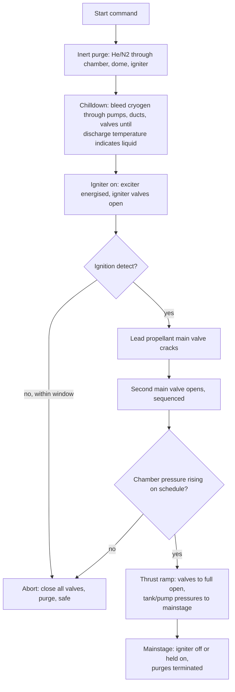

# Module 08 — Ignition systems
Part II · Prerequisites: modules 05, 06, 07 · Estimated time: 7 h

Ignition is the only part of engine operation where the failure mode is not
"degraded performance" but "the chamber is now shrapnel." An engine that runs a
percent low on $c^*$ costs you payload; an engine that takes 200 ms to light
instead of 20 ms has, in that time, filled its own combustion chamber with a
premixed cryogenic explosive and then set fire to it. The pressure that results
is not a few percent above chamber pressure — it is one to two *orders of
magnitude* above it, because a chamber sized to pass a steady mass flow through a
choked throat has nowhere near the vent area to pass the products of a
constant-volume explosion. Everything in this module — the lead selection, the
purge, the ignition-detect interlock, the igniter architecture — exists to
guarantee that the flame is present *before* the propellant is, and to shut the
engine down within milliseconds if it is not. The engineers who wrote the start
sequences you will read about learned this by losing hardware, and in the early
years by losing test stands.

---

## 1. Learning objectives

By the end of this module you should be able to:

1. Derive the peak chamber pressure produced by burning an accumulated mass of
   unignited propellant at constant volume, and correct it for venting through
   the throat over a finite burn time.
2. Convert a specified overpressure limit into a maximum permissible ignition
   delay for a given start-transient flow rate and chamber volume, and state
   which assumption in that chain is the weakest.
3. Explain the minimum-ignition-energy concept, why it is a property of a
   mixture and not of a propellant, and why MIE is a necessary but far from
   sufficient sizing criterion for a rocket igniter.
4. Lay out a complete start sequence for a pump-fed engine — inert purge,
   chilldown, igniter-on, ignition detect, lead valve, main valves, thrust ramp
   — and justify the ordering of every step.
5. Choose a fuel lead or an oxidizer lead for a stated propellant combination
   and chamber material, and defend the choice on wall-material, ignition-delay
   and accumulation grounds.
6. Compare pyrotechnic, hypergolic-slug, torch, spark/augmented-spark,
   catalytic, laser and resonance igniters on restart count, mass, parasitic
   flow, ground-handling burden and demonstrated flight heritage.
7. Size a torch or augmented-spark igniter's propellant flow and throat area for
   a given main engine, and state the two independent criteria the sizing must
   satisfy.
8. Estimate the propellant consumed by a restart — settling, hardware
   chilldown, igniter charge — and express it as a fraction of the burn it
   enables.
9. Explain the physical origin of the TEA-TEB green flash and give the systems
   argument for and against pyrophoric slug ignition on a reusable vehicle.
10. Diagnose a described start transient (chamber pressure trace, igniter
    pressure, valve position) as a normal start, a hangfire, a hard start, or a
    failure to detect.

---

## 2. Terminology

| term | symbol | SI unit | definition |
|---|---|---|---|
| Ignition delay | $\tau_d$ | s | time from first contact of the two propellants (or from igniter command) to the onset of self-sustaining heat release |
| Accumulated mass | $m_{acc}$ | kg | propellant that has entered the chamber and not yet burned or drained at the instant ignition occurs |
| Start-transient flow | $\dot m_{st}$ | kg/s | total propellant flow entering the chamber during the start, before mainstage |
| Start flow fraction | $\phi$ | — | $\dot m_{st}/\dot m$, the start-transient flow as a fraction of mainstage flow |
| Chamber volume | $V_c$ | m³ | free gas volume of the combustion chamber, injector face to throat |
| Throat area | $A_t$ | m² | nozzle throat cross-sectional area |
| Characteristic velocity | $c^*$ | m/s | $p_c A_t/\dot m$; here evaluated for the *transient* gas, not mainstage gas |
| Constant-volume peak pressure | $p_{CV}$ | Pa | pressure reached if $m_{acc}$ burns instantaneously in $V_c$ with no venting |
| Chamber vent time constant | $\tau_e$ | s | $V_c/(\Gamma^2 c^* A_t)$; e-folding time for the chamber to blow down through its own throat |
| Accumulation burn time | $t_b$ | s | time over which the accumulated mass releases its energy |
| Heat of combustion | $\Delta h_c$ | J/kg | net heat release per kilogram of *mixture* at the operating mixture ratio, after vaporization and dissociation |
| Constant-volume flame temperature | $T_v$ | K | temperature of products after constant-volume combustion from the initial state |
| Minimum ignition energy | MIE | J | smallest spark energy that will ignite a quiescent mixture at stated composition, pressure and temperature |
| Quenching distance | $d_q$ | m | smallest gap through which a flame will propagate; below it, wall heat loss extinguishes the kernel |
| Laminar flame speed | $S_L$ | m/s | speed of a planar laminar flame relative to unburned gas |
| Igniter flow fraction | $f_{ig}$ | — | igniter propellant flow divided by main engine flow |
| Igniter chamber pressure | $p_{ig}$ | Pa | stagnation pressure inside the igniter chamber |
| Lead | — | s | interval by which one propellant valve opens before the other |
| Purge | — | — | inert-gas (He or N₂) flow used to clear, dry or blanket a volume |
| Chilldown mass | $m_{ch}$ | kg | cryogenic propellant boiled off to bring hardware to operating temperature |
| Hardware thermal mass | $m_{hw}c_p$ | J/K | heat capacity of the metal that must be chilled |
| Settling acceleration | $a_s$ | m/s² | acceleration applied to a coasting stage to hold liquid over the tank outlet |
| Mainstage | — | — | the steady-state operating condition of the engine, after the start transient |
| Hangfire | — | — | a start in which ignition occurs but chamber pressure fails to build to mainstage |
| Hard start | — | — | a start in which peak chamber pressure substantially exceeds mainstage pressure |
| ROFI | — | — | radial outward firing igniter, a pyrotechnic used to burn off vented hydrogen below the nozzle |
| ASI | — | — | augmented spark igniter: a spark-ignited torch fed from the engine's own propellants |
| TEA-TEB | — | — | a triethylaluminium/triethylborane blend, pyrophoric in air and hypergolic with oxygen |

---

## 3. Theory

### 3.1 What ignition is, and what it is not

Ignition is not "adding heat until the propellant burns." It is the
establishment of a **self-sustaining flame**: a region in which the rate of heat
release by chemical reaction exceeds the rate of heat loss to the surroundings,
so that the reaction zone survives and propagates once the initiating source is
removed [F]. The three requirements are independent and all three must be met
simultaneously:

1. **A mixture within its flammability limits** at the point where the energy is
   deposited. In a rocket chamber during start this is a strong constraint,
   because the propellants are arriving as two separate liquid sprays and the
   locally mixed, locally vaporized, locally flammable region may be small,
   transient and in an unhelpful place.
2. **Enough energy deposited fast enough**, into a volume large enough that
   conduction to the surrounding cold gas does not quench it. This is what the
   minimum-ignition-energy concept quantifies (§3.3).
3. **A flow field that does not blow the kernel away** before it grows. A flame
   kernel convecting downstream at 50 m/s in a 0.4 m chamber has 8 ms to become
   self-sustaining, and if it does not, it leaves through the throat and the
   chamber is exactly as it was, except with 8 ms more propellant in it.

The distinction that matters for design: an igniter is not a heater. It does not
supply the energy that burns the propellant; it supplies the energy that starts
the process that burns the propellant. Worked Example 2 makes this quantitative
and shows that an igniter sized to actually *heat* the incoming flow to its
ignition temperature would need something like 17 % of the engine's flow, which
is absurd. Real igniters run at 0.1–2 % of main flow because they only have to
plant a kernel [E][J].

### 3.2 Why ignition is hard: the accumulation argument

Here is the central problem, and it deserves to be derived rather than asserted.

Between the instant propellant first enters the chamber and the instant the
flame is established, propellant accumulates. It accumulates as liquid films on
the injector face and chamber wall, as a spray cloud in the chamber volume, and
as vapour. None of it leaves: liquid does not choke at the throat, and until
there is combustion there is no hot gas to sweep it out. The accumulated mass is

$$m_{acc} = \dot m_{st}\,\tau_d = \phi\,\dot m\,\tau_d$$

> **Eq. 3.1** — variables: $m_{acc}$ [kg] accumulated propellant, $\dot m_{st}$
> [kg/s] total start-transient flow into the chamber, $\phi$ [—] its fraction of
> mainstage flow $\dot m$ [kg/s], $\tau_d$ [s] ignition delay measured from
> first propellant entry. Meaning: accumulation is linear in delay. Assumes:
> constant flow during the delay, and that nothing drains out. Fails when: the
> chamber has a large drain or the start flow is strongly time-varying — in a
> real pump-fed start $\dot m_{st}$ ramps, and $m_{acc}=\int\dot m_{st}\,dt$
> must be integrated from the actual valve schedule.

Now suppose that at $t=\tau_d$ a flame appears and consumes $m_{acc}$. Take the
products as a calorically perfect gas with ratio of specific heats $\gamma$ and
specific internal energy $e=c_vT$. For an ideal gas,

$$p = \rho R T = \rho(\gamma-1)c_vT = (\gamma-1)\rho e = (\gamma-1)\frac{E}{V_c}$$

where $E=m_{acc}\Delta h_c$ is the energy released. Hence the **constant-volume
explosion pressure**

$$\boxed{\;p_{CV} = \frac{(\gamma-1)\,m_{acc}\,\Delta h_c}{V_c} = \frac{m_{acc}RT_v}{V_c}\;}$$

> **Eq. 3.2** — variables: $p_{CV}$ [Pa], $\gamma$ [—] product ratio of specific
> heats, $\Delta h_c$ [J/kg] net heat release per kg of mixture, $V_c$ [m³] free
> chamber volume, $R$ [J/(kg·K)] product gas constant, $T_v=(\gamma-1)\Delta
> h_c/R$ [K] the constant-volume flame temperature measured from a cold initial
> state. Meaning: the pressure a chamber sees if its accumulated charge burns
> before anything can escape. Assumes: instantaneous combustion, no venting, no
> heat loss to walls, perfect gas with constant $\gamma$, and that all of
> $m_{acc}$ is at a burnable mixture ratio. Fails when: a substantial fraction
> of $m_{acc}$ is liquid film that burns slowly (reduces $p$), or when the
> accumulation detonates rather than deflagrates (raises the local pressure well
> above $p_{CV}$ through shock reflection).

The initial pressure and internal energy of the chamber gas have been dropped;
during a start the chamber is at ambient or below, and that contributes nothing
next to $p_{CV}$.

**Venting correction.** Real combustion takes a finite time $t_b$ and the throat
is open the whole time. Model the chamber as a lumped volume at fixed product
temperature $T_v$, filled at rate $\dot m_{in}=m_{acc}/t_b$ and choking out:

$$\frac{dm}{dt} = \dot m_{in} - \frac{p A_t}{c^*}, \qquad p=\frac{mRT_v}{V_c}$$

Differentiating the second and substituting the first, and using
$RT_v = \Gamma^2 c^{*2}$:

$$\frac{dp}{dt} = \frac{RT_v}{V_c}\dot m_{in} - \frac{p}{\tau_e},
\qquad \tau_e \equiv \frac{V_c}{\Gamma^2 c^* A_t}$$

With $p(0)=0$ and constant $\dot m_{in}$ the solution is
$p(t)=\dot m_{in}c^*/A_t\,\bigl(1-e^{-t/\tau_e}\bigr)$, and the peak is reached
at $t=t_b$:

$$\boxed{\;p_{peak} = p_{CV}\,\frac{\tau_e}{t_b}\Bigl(1-e^{-t_b/\tau_e}\Bigr)\;}$$

> **Eq. 3.3** — variables: $p_{peak}$ [Pa] peak chamber pressure during the
> accumulation burn, $\tau_e$ [s] chamber vent time constant, $t_b$ [s] time
> over which the accumulated mass releases its energy, $\Gamma$ [—] the
> Vandenkerckhove function $\sqrt{\gamma}\,(2/(\gamma+1))^{(\gamma+1)/2(\gamma-1)}$.
> Meaning: the throat relieves the overpressure only to the extent that
> combustion is slow compared with the chamber's own blowdown time. Assumes:
> lumped chamber, constant product temperature, choked throat from $t=0$,
> constant burn rate. Fails when: $t_b$ is so short that the process is a
> detonation (the lumped assumption dies with it), or when combustion is so slow
> that the chamber simply transitions into a normal start, which is the
> successful case.
>
> Two limits are worth memorising. $t_b\ll\tau_e$ gives
> $p_{peak}\to p_{CV}$ — the throat is irrelevant. $t_b\gg\tau_e$ gives
> $p_{peak}\to p_{CV}\tau_e/t_b = \dot m_{in}c^*/A_t$ — which is just the
> ordinary chamber-pressure equation, i.e. a normal start.

**The design consequence.** Invert Eq. 3.2 with a specified overpressure limit
to get the maximum permissible accumulation, then divide by the start flow to
get the maximum permissible ignition delay:

$$\tau_{d,max} = \frac{p_{lim}V_c}{\phi\,\dot m\,R\,T_v}\qquad\text{(unvented, conservative)}$$

> **Eq. 3.4** — variables as above, $p_{lim}$ [Pa] the peak chamber pressure the
> structure is qualified to. Meaning: the ignition-delay budget is set by
> structure, not by chemistry. Assumes: Eq. 3.2's assumptions plus constant
> start flow. Fails when: the structural limit is not a pressure but an impulse
> (thin-walled regen chambers can survive a very short spike above their static
> proof pressure, and this is sometimes credited — but only with test evidence).

Worked Example 1 puts numbers on this for a 100 kN methalox upper stage and gets
$\tau_{d,max}\approx 13$ ms on the conservative bound, 47 ms if you credit
venting with a 5 ms burn time. Both are *tens of milliseconds*. That single
result explains the entire architecture of every start sequence in this module:
you cannot afford to admit propellant and then look for a flame. The flame has
to be there first.

Three corollaries follow immediately [F][J]:

- **Minimise $\phi$.** Start at the lowest flow the feed system will give you.
  Pump-fed engines exploit this naturally: at the beginning of the start the
  pumps are barely turning, so $\phi$ is small. Pressure-fed engines do not get
  that help, which is one reason pressure-fed engines lean so heavily on
  hypergolic propellants.
- **Maximise the drain path.** Some engines are deliberately started with the
  chamber able to drain — vertical orientation, an open nozzle, no closure.
  Others cannot: a vacuum-start upper stage with a nozzle closure has no drain
  at all, which makes altitude ignition strictly harder than sea-level ignition
  (§3.13).
- **Detect and abort.** If ignition is not confirmed within the delay budget,
  close the valves. This is why "ignition detect" is a discrete interlock in
  every modern start sequence and not an afterthought (§3.6).

### 3.3 Ignition energy and the minimum-ignition-energy concept

The classical laboratory measurement is this: a quiescent, premixed, gaseous
mixture at known composition, pressure and temperature is sparked between two
electrodes, and the spark energy is reduced until ignition fails. The smallest
energy that still ignites is the **minimum ignition energy** [E].

The physics behind the number is a competition between chemical heat release in
the kernel and conductive loss out of it. Model the kernel as a sphere of radius
$r$ at the adiabatic flame temperature. Heat release scales with volume, $\propto
r^3$; conduction loss scales with surface area and temperature gradient,
$\propto r^2\cdot(T_f-T_u)/\delta$ where the flame thickness $\delta\sim
\alpha/S_L$. There is therefore a **critical radius** below which loss wins, of
order the quenching distance $d_q$, and the MIE is roughly the energy needed to
raise a sphere of that size to the flame temperature:

$$\mathrm{MIE} \sim \rho_u c_p (T_f-T_u)\,\frac{\pi}{6}d_q^3$$

> **Eq. 3.5** — variables: $\rho_u$ [kg/m³] unburned gas density, $c_p$
> [J/(kg·K)], $T_f,T_u$ [K] flame and unburned temperatures, $d_q$ [m] quenching
> distance. Meaning: MIE is a *geometric* statement — you must heat a critical
> volume, not deposit a critical energy density. Assumes: spherical kernel,
> constant properties, quenching distance as the critical scale. Fails when: the
> mixture is flowing (convection strips the kernel), when the mixture is
> two-phase (droplets absorb the spark energy in vaporization), or at high
> pressure where $d_q$ shrinks and the scaling breaks down against electrode
> geometry.

The scalings that matter are all in $d_q$, and $d_q\propto \alpha/S_L\propto
1/(p\,S_L)$ approximately, so:

- **MIE falls steeply with pressure**, roughly as $p^{-2}$ over modest ranges
  [E]. This is why a chamber that lights easily at sea level may not light at
  altitude, and why upper-stage igniters are qualified in an altitude cell.
- **MIE falls by one to two orders of magnitude going from air to pure
  oxygen**, because $S_L$ rises and $d_q$ collapses. Rocket chambers are pure
  oxidiser environments; laboratory air values are pessimistic by a large
  factor.
- **MIE is a strong function of mixture ratio**, minimised slightly rich of
  stoichiometric and rising without bound at the flammability limits.

Order-of-magnitude values for stoichiometric mixtures in **air** at 1 atm, as
standard handbook data [E]: hydrogen ≈ 0.017 mJ, methane ≈ 0.28 mJ, propane ≈
0.25 mJ, kerosene vapour ≈ 0.2–0.3 mJ. Hydrogen's value is the reason hydrogen
systems are designed to a completely different safety standard from hydrocarbon
systems — essentially any static discharge, any spark, any hot surface will light
it [G-095]. In oxygen these numbers drop by roughly a factor of 20–100.

**Why MIE does not size a rocket igniter.** Compare: a hydrogen/oxygen mixture
has an MIE of order microjoules; a flight spark exciter delivers 10–100 mJ per
spark at 20–100 sparks per second, i.e. four to five orders of magnitude more
[E][M]. That margin is not incompetence. It buys:

- **Two-phase penalty.** The chamber contains a cryogenic spray, not a premixed
  gas. Most of the spark energy goes into vaporizing droplets that then quench
  the kernel.
- **Convective loss.** The kernel is being swept downstream. A spark that would
  ignite a quiescent mixture will not ignite the same mixture at 50 m/s.
- **Composition uncertainty.** The local mixture ratio at the spark gap during a
  start is not known and not controlled. The spark must fire repeatedly so that
  *some* firing coincides with a locally flammable pocket. This is why exciters
  are specified in sparks per second and are run for the whole ignition window,
  not fired once.
- **Fouling and erosion.** Plug gaps grow, deposits form, and the exciter must
  still work at end of life.

The practical design statement is therefore not "deposit more than MIE" but
"establish and hold a pilot flame of a size that cannot be quenched by the flow
it must ignite" [J]. That is what a torch igniter is.

### 3.4 The start sequence

A start sequence is a timed, interlocked list of discrete events. Sequences
differ enormously between engines, but the logical skeleton is common to all
pump-fed cryogenic engines [M][HH §Start][SP-8097]:

Each step earns its place:

**Purge.** An inert gas — helium for cryogenic engines because it does not
freeze, nitrogen where temperatures allow — is flowed through the chamber,
manifolds and igniter cavity before propellant arrives. It does three things: it
removes air (and therefore removes the possibility of a combustible mixture
forming in a place you did not intend), it removes moisture that would freeze
into ice and block small orifices, and it establishes a positive outflow that
keeps propellant out of volumes it should not enter — most importantly, it keeps
oxidiser out of the fuel manifold and vice versa through an injector that leaks
slightly. Purge failure is a classic root cause: a wet igniter cavity is an
igniter that does not fire.

**Chilldown.** Treated in §3.14 and module 12. Its purpose here is that a pump
handed warm cryogen cavitates and delivers nothing, and an injector handed
two-phase oxidiser delivers an unknown mixture ratio. You cannot control a start
you cannot meter.

**Igniter on, then ignition detect, then propellant.** This ordering is the whole
lesson of §3.2. The igniter must be *verified burning* before the main valves
admit anything. The verification is a real measurement (§3.6), not an assumption
that the command was obeyed.

**Lead.** One propellant enters slightly before the other, deliberately (§3.5).

**Ramp.** Chamber pressure is brought to mainstage over a controlled interval.
The rate is bounded above by thermal shock to the chamber liner and by the
pressure spike the ramp itself can produce, and bounded below by the fact that a
long ramp is a long period spent at off-design mixture ratio, which for a
regeneratively cooled chamber can mean an oxidiser-rich excursion at the wall.
Pump-fed engines have a further constraint: the turbine must accelerate, and
turbopump acceleration is limited by bearing and seal transients and by the risk
of exceeding the pump's suction performance while tank pressure is still low.
Typical ramp times run from a few hundred milliseconds for a small pressure-fed
engine to several seconds for a large staged-combustion engine.

**Start energy for pump-fed engines.** A pump-fed engine has a bootstrapping
problem quite separate from ignition: the pumps need power to make pressure, and
the power comes from burning propellant that the pumps must supply. Solutions in
flight use [M][H]:

- **Solid start cartridge (spin-up grain).** A small solid grain whose gas spins
  the turbine to self-sustaining speed. Used widely on gas-generator engines; one
  cartridge per start, so restarts cost hardware.
- **Stored high-pressure gas start.** A helium or hydrogen start bottle spins the
  turbine. The J-2's restart used a separate ambient helium start tank, which is
  precisely why the number of J-2 restarts was a hardware count and not a
  software choice.
- **Tank-head (head-pressure) start.** Tank pressure alone pushes propellant
  through the chamber and cooling jacket; the resulting flow is enough to light
  the engine and begin turning the turbine, which then bootstraps. Expander-cycle
  engines do this naturally, and the RL10 is the canonical example. Blue Origin
  states that the BE-4 is relightable in flight via a head-pressure start with no
  separate start cartridge or spin system — a company statement, and the design
  logic is clear enough to take at face value.
- **Ground-supplied start.** Some first-stage engines are spun or supplied from
  the pad and simply cannot restart. This is a launch-vehicle architecture
  decision disguised as an engine decision.

### 3.5 Lead selection: which propellant goes first

Both propellants cannot arrive at exactly the same instant, and you would not
want them to. The **lead** is the deliberate choice of which one leads and by how
much. It is one of the highest-leverage decisions in the whole start design, and
it is made on three competing grounds [F][J]:

**1. Wall and hardware protection.** Whichever propellant leads is the one that
wets the chamber wall, the injector face and the nozzle first, in the presence of
an igniter flame. If the oxidiser leads in an oxygen engine, the first thing that
happens is a hot oxygen-rich environment against copper alloy, nickel and steel —
and hot oxygen burns metal. Oxygen-rich combustion is what killed hardware
repeatedly in early staged-combustion development, and it is the reason Russian
ORSC engines carry inert enamel coatings on every surface in contact with
oxygen-rich gas. If the fuel leads, the first environment is fuel-rich and
reducing, which every structural alloy tolerates.

**2. Accumulation risk.** The lead propellant accumulates alone, and a
single-propellant accumulation is not explosive by itself. The question is what
happens when the second one arrives: it arrives into a chamber already containing
a large mass of the first. A long lead therefore trades "no combustible mixture
during the lead" against "a very rich or very lean mixture at the moment of
mixing" — and a chamber full of liquid oxygen into which fuel is suddenly
injected is a much worse object than a chamber with a fuel film into which oxygen
is injected, because the fuel film burns from its surface at a rate limited by
diffusion whereas the fuel spray into a LOX pool mixes fast.

**3. Ignitability at the interface.** The mixture must pass through a flammable
composition at the igniter. A very heavy lead of either propellant can drive the
local composition outside the flammability limits at the igniter for long enough
that the igniter's flame is extinguished — and now you have neither ignition nor
detection.

**LOX/LH₂ engines use a fuel lead, essentially without exception** [M]. The
reasons stack:

- Hydrogen's flammability range in oxygen is enormous (roughly 4–94 % by volume),
  so a hydrogen-rich chamber is still ignitable when the oxygen arrives. A
  fuel-lead hydrogen engine cannot easily be driven outside the limits.
- Gaseous hydrogen leaving the regenerative jacket is warm, and it warms the
  chamber before the LOX arrives, reducing the thermal shock and the amount of
  oxygen that flash-boils on contact.
- Hydrogen has essentially no ignition delay against a torch, so accumulation
  during the lead is minimal.
- The alternative — an oxygen lead into a hydrogen engine — puts liquid oxygen
  against a copper-alloy liner and a nickel closeout with an igniter torch
  burning nearby. Nobody does this deliberately.

The cost of the hydrogen fuel lead is that hydrogen vents from the nozzle into
the atmosphere before ignition and accumulates under the vehicle. That is a real
hazard, and it is why the Shuttle and Delta IV both carried **radial outward
firing igniters (ROFIs)** below the engines to burn the hydrogen off deliberately
in a controlled, non-detonable diffusion flame before main ignition. The Delta
IV's spectacular pre-ignition fireball, which scorched the base of the vehicle on
every flight, is the same phenomenon less thoroughly tamed: the RS-68's start
released a large hydrogen bloom that was then lit [B14643].

**Kerolox engines frequently use an oxidiser lead**, which surprises students
[H][M]. The arguments:

- RP-1 and LOX are both liquids at injection, and a kerosene-rich chamber wetting
  a hot chamber wall is a *coking* problem: kerosene decomposes on hot metal into
  carbon deposits that block cooling channels and injector orifices. Starting
  fuel-rich into a hot (restarted) engine is how you foul it.
- A kerosene lead accumulates a pool of liquid fuel in the chamber, and kerosene
  has a much longer ignition delay against LOX than hydrogen does — so the
  accumulation is larger for a given lead.
- The kerolox oxidiser lead is also the natural pairing with hypergolic slug
  ignition: the TEA-TEB slug is injected into the fuel line and reaches the
  chamber *with* the fuel, so an oxygen-rich chamber is exactly what you want it
  to arrive into. This is how the F-1 and the Merlin both work: an oxidiser lead
  followed by fuel carrying its own hypergolic initiator.

The oxidiser lead is *not* universal for kerolox and is not free: the lead must
be short and the mass small, because oxygen-rich combustion against a copper
liner is still oxygen-rich combustion. Engines that use it accept a fraction of a
second, not a second.

**Storable hypergolic engines** have no igniter and, in the pure case, no lead
requirement — the propellants ignite on contact. In practice they still sequence:
a small oxidiser lead is common to avoid a fuel-rich accumulation, and the real
concern is the *ignition delay of the hypergolic pair itself*, which is a
chemical property that degrades at low temperature (§3.8, §3.15).

**Methalox** is the interesting modern case with no settled convention. Methane
does not coke like kerosene, its flammability range in oxygen is wide, and it can
be gasified in the cooling jacket the way hydrogen is. Both leads are defensible;
the ability to run a gas-gas torch on tapped, warmed main propellants is the more
important architectural fact (§3.9).

### 3.6 Ignition detection

An interlock is only as good as its measurement. Ignition detection has to
answer, within milliseconds and with no false positives, the question "is there a
flame in the right place right now?" The methods, with what each actually
measures [M]:

| method | what it senses | latency | failure mode |
|---|---|---|---|
| Igniter chamber pressure | pressure rise in the igniter's own small chamber | ms | senses igniter operation, not main-chamber ignition; a plugged igniter throat reads "good" |
| Main chamber pressure rise rate | $dp_c/dt$ above a threshold | ms | a hard start also produces $dp_c/dt$; and at vacuum start the initial $p_c$ signal is tiny |
| Thermocouple in igniter exhaust | gas temperature | 10s of ms | thermal lag; a bare-wire junction is fast but fragile |
| Optical / UV flame detector | OH* or CH* chemiluminescence through a sapphire window | sub-ms | window fouling; solar false positives on a pad; view-factor problems |
| Spark ionisation current | conductivity of the gas in the plug gap | sub-ms | senses local flame at the plug only |
| Fusible link / hot-wire | wire burns through | 10s of ms | single-use, historical |
| Coolant discharge temperature | jacket outlet temperature rise | 100s of ms | far too slow for the abort decision; used as a mainstage confirmation |

Real engines use more than one, and use them for different decisions. The fast
sensor gates "may I open the main valves"; the slow sensor confirms "mainstage
achieved" and gates the vehicle release or the throttle-up. The Shuttle's SSME
start is the canonical study in this: an intricately timed, largely open-loop
valve schedule with hard redlines, backed by a controller that will shut the
engine down inside the start if the measured chamber pressure, turbine speed or
temperature departs from the expected trajectory [Biggs89][SSME-Orient].

The design trap worth stating explicitly: **detecting the igniter is not
detecting ignition** [J]. An igniter that fires perfectly into a chamber whose
main injector is not delivering propellant reads as a good ignition. Programmes
have been burned by exactly this, and the mitigation is a second, independent
confirmation from the main chamber before commitment to mainstage.

### 3.7 Pyrotechnic igniters

The oldest architecture and still the most common for single-start engines. A
pyrotechnic igniter is a solid propellant charge — typically a metal/oxidiser
pyrotechnic composition in a case, fired by an electrically initiated squib —
that burns for a few hundred milliseconds to a few seconds and discharges hot gas
and burning particles into the chamber [H][SP-8051].

- **V-2.** The original was a "Zündkerze": a spinning pyrotechnic pinwheel
  lowered into the chamber on a wire from above, lit electrically, spraying
  burning material across the injector face. It was then followed by a
  gravity-fed preliminary stage at reduced flow (about 8 tonnes of thrust) and
  only then by turbopump mainstage. That two-stage start — light at low flow,
  then commit — is the accumulation argument of §3.2 solved empirically in 1942,
  and the reduced preliminary stage is exactly the "minimise $\phi$" corollary.
  The pinwheel itself was consumed and had to be replaced between firings.
- **Redstone A-7.** A pyrotechnic igniter, in an engine whose whole design
  philosophy was simplification for reliability — the A-7 famously cut its
  pneumatic system from 31 components to 10. A pyrotechnic is a single component
  with one electrical interface and no fluid interface, which is exactly what
  that philosophy wants.
- **Gas generators.** Even engines with sophisticated main-chamber ignition often
  light their gas generator pyrotechnically, because the GG is small, is started
  once, and does not need to be relit. The F-1 is the example: hypergolic
  cartridge in the main chamber, pyrotechnic igniter in the gas generator.
- **RD-107/RD-108.** The original Soviet R-7 engines used pyrotechnic ignition —
  in the well-known form of wooden staves carrying pyrotechnic torches inserted
  into the chamber nozzles on the pad. The RD-107A/108A modernisation replaced
  this with chemical (hypergolic) ignition.

**Strengths:** cheapest and simplest, no fluid system, high energy density,
insensitive to chamber conditions, decades of heritage. **Weaknesses:** one
charge per start (so restarts require a magazine of cartridges and a mechanism to
index them), a pyrotechnic device on the vehicle with its attendant handling and
safe-and-arm requirements, ageing and shelf life, and combustion products that
are hot solid particles — which can erode an injector face or lodge in a cooling
channel. Modern restartable engines have moved away from pyrotechnics for exactly
the restart-count reason, while single-start motors and gas generators have not.

### 3.8 Hypergolic slug and cartridge ignition

If the propellants are not hypergolic with each other, you can make the *start*
hypergolic by introducing a third fluid that is hypergolic with one of them.

**TEA-TEB.** The standard modern blend is triethylaluminium and triethylborane —
typically quoted as roughly 85/15 by mass, though the exact ratio is a vendor
matter and this course does not need it. Both compounds are **pyrophoric**: they
ignite spontaneously on contact with air, and violently with oxygen. A measured
slug is held behind a **burst diaphragm** in a cartridge plumbed into the fuel
line. On start, fuel pressure bursts the diaphragm, the slug is pushed ahead of
the fuel into the injector, and it ignites on contact with the oxygen already in
the chamber (hence the oxidiser lead). The fuel arrives immediately behind it and
is lit by the resulting flame.

- **F-1.** A TEA/TEB slug in a burst-diaphragm cartridge ignited the main
  chamber; a pyrotechnic lit the gas generator [F1-R3896]. The direct ancestor is
  the XLR43/Navaho lineage's triethylaluminium pyrophoric slug — the same trick,
  fifty years earlier.
- **Merlin 1D and Merlin Vacuum.** TEA-TEB, ground-fed on the first stage and
  **carried aboard for MVac restarts**. That last clause is the whole design
  argument: because each start consumes a slug, the number of relights the second
  stage can perform is set by the size of the TEA-TEB tank it carries, and the
  first stage's landing relights are the same constraint.

**The green flash.** Every Falcon 9 ignition shows a brief green flare before the
plume goes orange. It is not a coolant, a plasma effect, or copper. It is the
emission spectrum of **boron oxide radicals (BO₂)** produced by burning the
triethylborane component: BO₂ has strong emission bands in the green, near 518
and 546 nm, and they dominate the visible output for the few hundred milliseconds
the slug is burning [F]. Aluminium from the TEA contributes white Al₂O₃
incandescence. The flash is therefore a genuine, useful diagnostic: it tells a
range observer, from a kilometre away, that the slug reached the chamber.

**Why SpaceX moved away from it for Raptor.** The engine data file records that
Raptor uses torch igniters in the preburners and **no TEA-TEB**, and that Raptor 2
eliminated the main-chamber igniter entirely — the preburner torches and the hot
preburner gas light the main chamber. The systems argument [J]:

1. **Restart count.** TEA-TEB is consumable. A vehicle that must perform a
   landing burn, then be refuelled on orbit, then perform a trans-lunar
   injection, then a landing, then an ascent, is a vehicle whose restart count is
   not knowable in advance. A consumable igniter turns that into a tankage
   problem with a hard ceiling. A torch running on the engine's own main
   propellants has no ceiling at all as long as there is propellant.
2. **Ground operations.** TEA-TEB is pyrophoric and toxic; it demands inerted
   handling, dedicated ground equipment, and a servicing operation between
   flights. A vehicle whose entire economic premise is rapid turnaround cannot
   afford a hazardous fluid servicing step per engine per flight.
3. **Fluid count.** TEA-TEB is a third fluid with its own tank, lines, valves,
   burst diaphragms and purge. Methalox torch ignition needs no fluid the engine
   does not already have.
4. **Propellant chemistry cooperates.** Methane and oxygen can both be tapped
   and warmed to gas, and a gas/gas spark torch on those propellants is easy.
   Kerosene cannot be gasified cleanly — it cracks and cokes — which is precisely
   why kerolox engines reached for a pyrophoric slug in the first place.

Note the honest counter-argument: TEA-TEB is extremely reliable, has essentially
zero ignition delay, needs no electrical power at the chamber and no
gas-conditioning hardware, and has flown thousands of ignitions. It is the right
answer for an expendable kerolox engine and a defensible one for a
limited-restart stage. It is the wrong answer for an indefinitely restartable
vehicle.

**Hypergolic propellants proper.** If the main propellants are themselves
hypergolic — N₂O₄ with Aerozine 50, MMH or UDMH — there is no igniter at all. The
Titan LR87 and LR91, the Apollo SPS, the LM descent and ascent engines, the R-4D
and the SuperDraco all light on contact. The data file's line on the LR87 is
worth quoting as the design rationale: "Hypergolic — none required. This is the
whole point of the propellant choice." The LM ascent engine in particular had "no
igniter, no pumps, no gimbal, and no backup" — a single-start engine on which two
lives depended, made reliable by deleting everything that could fail.

That is not the same as saying hypergolic ignition is free. The **ignition delay
of the pair** is a real, measurable, temperature-dependent quantity, and when it
gets long you get exactly the accumulation of §3.2 in an engine with no igniter
to blame. Cold-soaked hypergolic thrusters are the classic hard-start risk, which
is why spacecraft thruster catalyst beds and valve bodies carry heaters and why
thruster qualification includes cold starts. [Clark] is the definitive readable
account of how the hypergolic combinations were selected and of the delays that
were found unacceptable.

**Soviet practice.** The distinction the data file draws is worth keeping: the
RD-107/108 used pyrotechnic ignition originally and **chemical (hypergolic)
starter fluid** on the modernised RD-107A/108A; the RD-170 family, RD-180 and
RD-191 all use chemical/hypergolic starter. The Russian practice is a starter
fluid in sealed ampoules in the propellant lines, which burst on start. It is the
same idea as TEA-TEB with different chemistry and different packaging, and it
carries the same consumable-per-start limitation.

### 3.9 Torch igniters

A torch igniter is a **small rocket engine** whose exhaust lights the big one. It
has its own injector, its own small combustion chamber, its own throat, and it is
fed with a small fraction of the main propellants — usually in the gas phase,
tapped from the engine and conditioned, or from small dedicated gas bottles.
Ignition inside the torch is by spark plug.

The architecture is now dominant for methalox and hydrolox engines that must
restart [M]:

- **Vulcain 2**: pyrotechnic/spark torch, ground-started only — Vulcain does not
  restart.
- **Vinci**: spark torch, with restart enabled by an auxiliary propulsion unit
  that repressurises the tanks and provides settling.
- **RL10 family**: spark torch, across six decades and every block.
- **BE-4**: methalox, relightable in flight via a head-pressure start.
- **Raptor**: torch igniters in the preburners; Raptor 2 removed the main-chamber
  igniter entirely. All Raptor figures are company claims.
- **RS-68**: pyrotechnic/spark with a large pre-ignition hydrogen bloom.

**Sizing.** Two criteria must both be satisfied, and they are independent [J]:

$$f_{ig} = \frac{\dot m_{ig}}{\dot m}\quad\text{typically}\quad 0.001\ \text{to}\ 0.02$$

> **Eq. 3.6** — variables: $f_{ig}$ [—] igniter flow fraction, $\dot m_{ig}$
> [kg/s] igniter propellant flow. Meaning: an empirical band, not a derivation —
> igniters that fall below it tend to be blown out and igniters above it are
> paying mass and complexity for nothing. Assumes: a torch whose jet is aimed
> into the main injector's flow field. Fails when: the main chamber is very large
> relative to the igniter's jet penetration, in which case penetration, not flow
> fraction, is binding, and multiple igniters or a centrally located one is
> required.

$$A_{t,ig} = \frac{\dot m_{ig}\,c^*_{ig}}{p_{ig}},\qquad p_{ig}\gtrsim 1.2\,p_c$$

> **Eq. 3.7** — variables: $A_{t,ig}$ [m²] igniter throat area, $c^*_{ig}$ [m/s]
> the igniter's own characteristic velocity at its (deliberately fuel-rich, hence
> cool) mixture ratio, $p_{ig}$ [Pa] igniter chamber pressure. Meaning: the
> igniter is a choked-flow device that must stay choked against main chamber
> pressure at every point in the start and, if it runs through mainstage, at full
> $p_c$. Assumes: choked igniter throat, steady flow. Fails when: the igniter is
> shut off at mainstage (then it need only exceed the chamber pressure at the
> moment of ignition), or when the igniter is fed from a blowdown bottle whose
> pressure decays.

Torch mixture ratio is chosen **far off stoichiometric, deliberately fuel-rich**,
for a temperature of order 1200–1500 K rather than 3500 K. The torch has no
regenerative cooling and a very small throat; at stoichiometric temperature it
would erode in a few seconds. A fuel-rich torch also produces a jet full of
unburned fuel that continues to react as it mixes with the main chamber's
oxidiser, which extends its effective ignition zone — a genuinely useful side
effect.

**Strengths:** unlimited restarts, no consumables, no pyrotechnics, no toxic
fluids, a hot gas jet with enough enthalpy and penetration to light a large
chamber, and a natural place to put ignition-detect instrumentation (the torch
chamber's own pressure). **Weaknesses:** a small, hot, high-cycle rocket engine
with its own valves, its own spark system, its own possible failure to light, and
its own start sequence — and the propellants must be conditioned to gas, which
means heat exchangers, accumulators, or dedicated gas bottles, all of which are
mass and complexity. Nothing about a torch igniter is trivial; it is simply the
architecture that pays off when restart count matters.

### 3.10 Spark and augmented spark igniters

A **direct spark igniter** places a spark plug in or at the wall of the main
chamber and lights the main propellants directly. It is attractive only for small
engines with gaseous or easily vaporized propellants at low chamber pressure,
because the kernel it produces is tiny and the flow it must ignite is not.

The **augmented spark igniter (ASI)** is the resolution: a spark plug lights a
small, deliberately fuel-rich propellant flow in a small chamber at the centre of
the main injector face, and *that* flame — orders of magnitude larger and more
robust than the spark kernel — lights the main chamber. An ASI is a torch igniter
integrated into the injector rather than bolted to the chamber wall. The
distinction between "torch" and "ASI" in the literature is mostly one of packaging
and of who wrote the document.

- **J-2.** The archetype: an augmented spark igniter with **dual spark plugs**, a
  small LOX/LH₂ torch at the centre of the coaxial injector, through the same
  porous sintered faceplate that transpiration-cools the face. Dual plugs are
  redundancy on the one component with a wear-out mechanism.
- **RS-25.** The same idea at 206 bar: an ASI at the centre of the 600-element
  coaxial face, **plus separate ASIs in each preburner**. A staged-combustion
  engine has to light three chambers, in the right order, and the two preburners
  are what actually spin the turbopumps.
- **RL10.** Spark torch, across the whole family.
- **LE-5B.** Spark ignition, in an engine qualified in its LE-5 form for up to
  16 starts.

The point about the RS-25 generalises: **in a staged-combustion engine the
preburner igniters are the engine's real igniters.** Once a preburner is lit, its
exhaust is a torrent of hot fuel-rich gas entering the main injector, and the
main chamber lights from that. Raptor 2's elimination of the main-chamber igniter
is the same logic taken to its conclusion — if the preburner gas will light the
chamber anyway, the main-chamber igniter is mass and a failure mode with no job.

### 3.11 Catalytic ignition

If one propellant will decompose exothermically over a catalyst, you can make the
catalyst bed the ignition system.

**High-test hydrogen peroxide.** HTP decomposed over a silver or silver-plated
nickel-gauze pack (or a permanganate, in early practice) yields steam and free
oxygen at roughly 600 °C at 85 % concentration. Inject kerosene into that stream
and it ignites spontaneously — the gas is above the fuel's autoignition
temperature and is an oxidiser. The **Bristol Siddeley Gamma** family made this
the defining feature of the design: there is no igniter and no hypergolic slug;
the catalyst pack *is* the ignition system. The record is remarkable — 128 Gamma
engines flew across 26 launches with zero failures, and Black Arrow put the UK in
orbit. The **Rocketdyne AR2-3** did the same thing with 90 % HTP and the host
aircraft's own JP-4, giving a rocket engine a pilot could start and throttle with
a lever.

**Why it did not take over.** HTP's specific impulse is poor (the Gamma family at
250–265 s, the AR2-3 at 245 s), it decomposes in storage, and it demands
scrupulous cleanliness because any contaminant is a catalyst — which is also a
statement about the catalyst pack's own life. Catalyst beds degrade, poison, and
have a limited number of cold starts in them; bed heaters exist for exactly this
reason on monopropellant hydrazine thrusters, which are the surviving mass
application of catalytic ignition.

**Where it still matters:** monopropellant hydrazine and HAN/ADN "green"
monopropellants (module 32 and Part IV context), gas generators of the
monopropellant-steam type — the V-2, Redstone, RD-107 and XLR99 all drove their
turbopumps this way — and any system where the ability to start with no
electrical energy and no separate igniter is worth an Isp penalty.

### 3.12 Laser and resonance ignition [R]

Two research architectures appear repeatedly in the literature and in student
questions, and both deserve an honest status statement.

**Laser ignition.** A pulsed laser is focused into the chamber through a window
or delivered by fibre, and the resulting optical breakdown creates a plasma
kernel at temperatures far above anything a spark achieves, in a location chosen
by optics rather than by where you could fit an electrode. The attractions are
real: no electrode to erode, kernel placement anywhere in the chamber volume, a
single laser potentially serving multiple ignition points through fibre, and
kernel energy delivered in nanoseconds rather than microseconds. European work,
including tests associated with the Vinci development and broader ESA-funded
programmes, has demonstrated laser ignition of LOX/LH₂ and LOX/CH₄ at
representative conditions. The obstacles are equally real: the window is a hot
optical surface in a soot- and deposit-forming environment, the laser and its
power conditioning are mass and reliability items, fibre delivery of the required
peak power is difficult, and — decisively — nobody has yet made the case that it
beats a torch on a flight vehicle. Status: demonstrated in test, not flown as
primary ignition on an operational engine [R].

**Resonance (Hartmann–Sprenger) igniters.** A supersonic gas jet directed into a
closed resonance cavity sets up a strong standing-wave oscillation; the
repeated compression at the closed end heats the gas to temperatures sufficient
to ignite a fuel injected into it, with **no electrical energy at all and no
moving parts**. The device is remarkable — it converts flow energy directly into
a hot spot — and it has been studied for decades for exactly the applications
where electrical power at the engine is expensive. Its problems are tuning
sensitivity (the cavity is tuned to a particular gas, pressure and temperature),
long heat-up times relative to a spark, and acoustic loads on the cavity itself.
Status: research and occasional niche use, not mainstream flight practice [R].

### 3.13 Altitude and vacuum ignition

Igniting at altitude is harder than igniting at sea level, and the reasons
compound [F][M]:

1. **MIE rises as pressure falls** (§3.3), roughly as $p^{-2}$. The mixture is
   simply harder to light.
2. **There is no back-pressure to hold the propellant in.** At sea level the
   ambient column resists the spray; at vacuum the chamber empties freely and the
   spray fans wider, thinning the mixture at the igniter.
3. **Cryogens flash.** LOX entering a chamber at 10 Pa is far above its
   saturation pressure and flashes to vapour, which changes the injector's
   discharge coefficient, the mixture ratio and the spray structure — none of
   which are the values the injector was designed for.
4. **The nozzle may be closed.** Many upper stages fly with a nozzle closure or
   diaphragm to keep the nozzle at ground pressure during ascent, protecting the
   engine from moisture and holding a helium blanket. That closure means the
   chamber cannot drain, which removes the accumulation escape route of §3.2.
5. **Everything is cold-soaked or sun-soaked**, and non-uniformly.
6. **There is no convection to remove heat from the igniter body**, so an igniter
   that runs happily on a test stand may overheat in vacuum.

The consequences for test are direct and expensive: an upper-stage engine's
ignition must be qualified in an **altitude test cell** — a facility with a
steam-ejector or diffuser system that pulls the cell to a representative pressure
while the engine runs. This is one of the most costly items in a propulsion test
programme, and it is not optional. A sea-level ignition test of a vacuum-start
engine demonstrates almost nothing about the thing that matters.

### 3.14 Restart

Restart converts ignition from an event into a *system requirement*, and it
brings four new problems that a single-start engine never faces.

**1. Settling.** In free fall, the propellant is not over the tank outlet. It is
wherever surface tension, residual acceleration and the last manoeuvre left it.
Before restart the stage must be accelerated — typically 0.01–0.1 $g_0$ for
several seconds — using small solid ullage motors, RCS thrusters, or a dedicated
low-thrust mode. The propellant cost is real (Worked Example 3), and it is the
reason Vinci's auxiliary propulsion unit exists: the APU repressurises the tanks
*and* provides low-thrust settling, and the data file's judgement that "the APU
is arguably more novel than the engine" is fair.

**2. Chilldown.** Cryogenic hardware warms during coast. The pump, its ducts, the
valves and the injector dome must be rechilled to near-saturation temperature
before the pump will produce head instead of vapour. The chilldown propellant is
boiled off and lost. For a long coast, this is one of the largest single
line-items in an upper stage's propellant budget, and it is the reason
multi-restart cryogenic stages carry more residual propellant than students
expect.

**3. Igniter reuse.** Discussed throughout §3.7–3.11. A consumable igniter caps
the restart count at hardware; a torch does not. The J-2's restart required a
separate ambient helium start tank, so its restart count was likewise a hardware
count.

**4. Thermal state uncertainty.** The engine restarts from a state that depends
on burn duration, coast duration, attitude and sun angle. A hot restart into a
soaked chamber and a cold restart after a six-hour coast are different ignition
problems with the same hardware, and both must be in the qualification envelope.

Public restart capability across the data file [M]:

| engine | restart capability | how it is enabled |
|---|---|---|
| RL10 (all blocks) | designed from the start for multiple restarts | spark torch; tank-head start; expander cycle needs no start cartridge |
| J-2 | S-IVB restart for translunar injection | ASI plus a separate ambient helium start tank and settling motors |
| Vinci | up to 3 restarts (some sources say 4+), burn time to 900 s | spark torch plus the APU for settling and tank repressurisation |
| Merlin Vacuum | multiple restarts | TEA-TEB carried aboard — count set by slug quantity |
| LE-5 | qualified for up to 16 starts | spark ignition; expander-bleed family with a 3 % idle mode used for settling |
| Aestus | multiple re-ignitions, 1,100 s burn time | hypergolic, no igniter |
| BE-4 | relightable in flight | head-pressure start, no start cartridge |
| Raptor | multi-start by design (company claims) | preburner torch igniters; no consumable |
| Vulcain 2 | **none** | ground-started only |
| HM7B | **none** — single burn only | this is the limitation that forced Ariane 5 ECA's architecture |
| F-1 | **none** — never restarted | expendable booster engine |

Read that table as an architecture map rather than a capability ranking. Vulcain
and the F-1 do not restart because their vehicles never asked them to; the cost
of adding restart to a booster engine buys nothing.

### 3.15 Hard starts, hangfires, and what the public record shows

**Hard start** — peak chamber pressure substantially above mainstage — is the
accumulation failure of §3.2. Its signature on a chamber-pressure trace is a
narrow spike, often before the normal rise, with a peak several times $p_c$ and a
width of milliseconds. Its signature on hardware is a bulged or split chamber, a
blown injector face, sheared injector-to-dome bolts, or a nozzle separated at a
weld.

**Hangfire** — ignition occurs but chamber pressure does not build — has the
opposite trace: a small rise that stalls. Its usual causes are an igniter that
lights but is blown out, a lead so heavy that the mixture at the igniter is
outside its limits, or a feed system that never reaches the pressure it needs.
A hangfire is dangerous in a different way: an engine that is *almost* running
continues to admit propellant, and a hangfire that then ignites is a hard start
with a much larger accumulation.

The public historical record has to be quoted carefully, because ignition
failures are frequently reported in the press with a level of certainty the
investigation did not have. Cases that are solidly documented in the engineering
literature:

- **Early development generally.** Hunley's history of US propulsion development
  and Sutton's history of liquid engines both record hard starts as a routine
  hazard of the 1940s–60s, with the pattern always the same: a delay in
  ignition, a chamber full of propellant, and a destroyed thrust chamber
  [Hunley07][SLPRE]. The V-2's staged start — pyrotechnic, then gravity-fed
  preliminary stage, then mainstage — is a mitigation designed in response.
- **SSME development.** Biggs's first-ten-years account documents the start
  transient as one of the programme's persistent problems, and the SSME's start
  remains the standard example of an engine whose start is a precisely
  choreographed open-loop sequence with hard redlines because closed-loop control
  is too slow for the events involved [Biggs89].
- **Hydrogen accumulation under the vehicle.** Not a chamber hard start, but the
  same physics one metre lower: the fuel lead vents unburned hydrogen into the
  boat-tail, and if it is allowed to accumulate and then find an ignition source,
  the result is a deflagration under the vehicle. The Shuttle's ROFIs and the
  Delta IV's characteristic pre-ignition fireball are the two ends of how this is
  handled [G-095].
- **Cold hypergolic starts.** Spacecraft thrusters that have cold-soaked show
  lengthened ignition delay and, in the limit, accumulate a slug of both
  propellants that then detonates. Mitigation is heaters and a documented minimum
  start temperature; this is standard qualification practice for storable
  thrusters, and [Clark] gives the chemistry background.

Where a specific flight failure is popularly attributed to ignition — and several
are — check whether the investigation actually said so. This course's engine data
file deliberately does not carry failure attributions that rest on press
statements, and neither should you.

---

## 4. Typical engineering ranges

| quantity | typical range | low end | high end |
|---|---|---|---|
| Ignition delay, torch/ASI to main chamber | 5–50 ms | gas-gas torch on H₂/O₂ | large kerolox chamber |
| Ignition delay, hypergolic pair at 20 °C | 2–10 ms | NTO/MMH warm | cold-soaked, can exceed 50 ms |
| Ignition delay budget from overpressure limit | 10–50 ms | small stiff chamber | large chamber with drain |
| Start-transient flow fraction $\phi$ | 0.05–0.3 | tank-head start, expander cycle | pressure-fed engine with fast valves |
| Igniter flow fraction $f_{ig}$ | 0.1–2 % | large chamber, well-placed torch | small engine, marginal placement |
| Igniter chamber temperature | 1000–1800 K | deliberately fuel-rich for hardware life | uncooled limit |
| Igniter chamber pressure | 1.1–1.5 × $p_c$ | shut off at mainstage | runs through mainstage |
| Spark exciter energy | 10–100 mJ/spark | small thruster | large chamber |
| Spark rate | 20–100 Hz | — | — |
| MIE, stoichiometric in air, 1 atm | 0.017–0.3 mJ | hydrogen | hydrocarbons |
| MIE in pure oxygen | 20–100 × lower | — | — |
| Start sequence duration, command to mainstage | 0.3–5 s | small pressure-fed hypergolic | large staged combustion |
| Thrust ramp 10 %→90 % | 0.1–3 s | pressure-fed | pump-fed cryogenic |
| Restart chilldown, cryogenic upper stage | 2–6 % of a nominal burn's propellant | short coast, small engine | long coast, large pump |
| Settling acceleration | 0.01–0.1 $g_0$ | — | — |
| Restart count, flown | 1 to ~16 | Vulcain, HM7B, F-1: 0 restarts | LE-5 qualified to 16 starts |
| Peak overpressure tolerated in a hard start | 1.5–2 × $p_c$ design margin | — | beyond this, structural failure |

The extremes worth remembering: **HM7B and Vulcain 2 do not restart at all**, and
that single fact shaped Ariane 5's entire upper-stage strategy; **LE-5 was
qualified for 16 starts**; and **Vinci's 900 s burn time with up to 3 restarts**
is what a modern European upper stage looks like once someone finally paid for
the capability, after a 26-year development.

---

## 5. Worked examples

All three examples use the same fictional reference engine, so that the numbers
compose. **RE-100**: a methalox (LOX/LCH₄) upper-stage engine, vacuum thrust
$F=100$ kN (22,500 lbf), $I_{sp}=370$ s vacuum, chamber pressure $p_c=60$ bar
(870 psia), mixture ratio 3.4, $c^*=1800$ m/s, $L^*=1.1$ m. It is not a real
engine; every real number in this module comes from the engine data file, and
this one is deliberately generic so the arithmetic is unencumbered.

Derived quantities used throughout:

$$\dot m = \frac{F}{I_{sp}g_0} = \frac{100{,}000}{370\times 9.80665} = 27.56\ \mathrm{kg/s}$$

$$A_t = \frac{\dot m c^*}{p_c} = \frac{27.56\times 1800}{60\times10^5} = 8.268\times10^{-3}\ \mathrm{m^2}\quad(D_t = 102.6\ \mathrm{mm})$$

$$V_c = L^*A_t = 1.1\times 8.268\times10^{-3} = 9.095\times10^{-3}\ \mathrm{m^3}\quad(9.1\ \mathrm{litres})$$

### WE1 — Accumulated propellant, energy release and overpressure

**Problem.** The RE-100's start admits propellant at $\phi=0.15$ of mainstage
flow. The igniter fails to establish a flame and ignition finally occurs
$\tau_d = 250$ ms after propellant first enters the chamber. Find the peak
chamber pressure, first with no venting credit and then with a 5 ms accumulation
burn time. Then find the maximum ignition delay consistent with a structural
limit of $1.5\,p_c$.

**Step 1 — accumulated mass (Eq. 3.1).**

$$\dot m_{st} = \phi\dot m = 0.15\times27.56 = 4.134\ \mathrm{kg/s}$$
$$m_{acc} = \dot m_{st}\tau_d = 4.134\times 0.250 = 1.033\ \mathrm{kg}$$

One kilogram of propellant, in a nine-litre chamber. That is a mean density of
114 kg/m³ — the chamber is roughly one part in eight full of liquid.

**Step 2 — product gas properties.** Take products at $M=22$ kg/kmol, so
$R = 8314.46/22 = 377.9$ J/(kg·K); $\gamma = 1.15$; net heat release
$\Delta h_c = 10.5$ MJ per kg of mixture at $MR=3.4$ [A]. The constant-volume
flame temperature follows from Eq. 3.2:

$$T_v = \frac{(\gamma-1)\Delta h_c}{R} = \frac{0.15\times 10.5\times10^6}{377.9} = 4167\ \mathrm{K}$$

Sanity: the constant-*pressure* flame temperature for methalox near this mixture
ratio is about 3500 K, and constant-volume combustion should land several
hundred kelvin above it. 4167 K is credible.

**Step 3 — constant-volume peak pressure (Eq. 3.2).**

$$p_{CV} = \frac{m_{acc}RT_v}{V_c} = \frac{1.033\times377.9\times4167}{9.095\times10^{-3}} = 1.790\times10^{8}\ \mathrm{Pa}$$

$$p_{CV} = 179\ \mathrm{MPa} = 1790\ \mathrm{bar} = \mathbf{29.8\times p_c}$$

**Step 4 — venting correction (Eq. 3.3).** For the transient gas,
$\Gamma(1.15) = 0.6386$ and

$$c^*_v = \frac{\sqrt{RT_v}}{\Gamma} = \frac{\sqrt{377.9\times4167}}{0.6386} = 1965\ \mathrm{m/s}$$

$$\tau_e = \frac{V_c}{\Gamma^2 c^*_v A_t} = \frac{9.095\times10^{-3}}{0.4079\times1965\times8.268\times10^{-3}} = 1.372\ \mathrm{ms}$$

With $t_b = 5$ ms:

$$\frac{\tau_e}{t_b}\left(1-e^{-t_b/\tau_e}\right) = \frac{1.372}{5}\left(1-e^{-3.644}\right) = 0.2744\times0.9738 = 0.267$$

$$p_{peak} = 0.267\times179\ \mathrm{MPa} = 47.8\ \mathrm{MPa} = 478\ \mathrm{bar} = \mathbf{8.0\times p_c}$$

And for a faster, 1 ms burn the factor is 0.710 and $p_{peak}=127$ MPa, i.e.
$21\times p_c$. Venting through the throat helps by a factor of a few. It does
not save the chamber.

**Step 5 — the ignition-delay budget.** Set $p_{lim}=1.5p_c = 9$ MPa.
Unvented (Eq. 3.4):

$$m_{acc,max} = \frac{p_{lim}V_c}{RT_v} = \frac{9\times10^6\times9.095\times10^{-3}}{377.9\times4167} = 0.0520\ \mathrm{kg}$$
$$\tau_{d,max} = \frac{0.0520}{4.134} = 12.6\ \mathrm{ms}$$

Crediting the 5 ms burn time (dividing by the 0.267 factor):
$m_{acc,max}=0.194$ kg, $\tau_{d,max}=47.0$ ms.

**Sanity check.** The budget is 13–47 ms depending on how much venting credit you
are willing to defend in a design review. Real start sequences act on exactly
this timescale: ignition-detect windows are tens of milliseconds and abort logic
closes the main valves inside that. Note also what the calculation says about
$\phi$: halving the start flow doubles the delay budget, which is the whole
argument for the V-2's gravity-fed preliminary stage and for the tank-head start.
The weakest assumption in the chain is $t_b$ — nobody measures it directly, and
if the accumulation transitions to detonation the lumped model in Eq. 3.3 is
simply wrong and the local pressure is higher than $p_{CV}$.

### WE2 — Sizing an augmented spark igniter

**Problem.** Size the ASI for RE-100. First test the naive "heat the incoming
propellant to its ignition temperature" criterion; then size on the empirical
flow-fraction criterion and find the igniter throat diameter.

**Step 1 — the naive criterion, and why it fails.** Ignition temperature of the
mixture $T_{ign}\approx900$ K. Per kilogram of each propellant, from injection
condition to 900 K of gas:

- LOX from 90 K: $h_{fg}=213$ kJ/kg, then $c_{p,g}\approx0.95$ kJ/(kg·K) over
  810 K → $213 + 770 = 982$ kJ/kg.
- LCH₄ from 111 K: $h_{fg}=510$ kJ/kg, then $c_{p,g}\approx2.5$ kJ/(kg·K) over
  789 K → $510 + 1973 = 2483$ kJ/kg.

Mass fractions at $MR=3.4$: oxidiser 0.7727, fuel 0.2273.

$$q_{mix} = 0.7727(982) + 0.2273(2483) = 1323\ \mathrm{kJ/kg}$$

The start flow is $\dot m_{st}=4.134$ kg/s, so the power to heat all of it is

$$P = 4.134\times1.323\times10^6 = 5.47\ \mathrm{MW}$$

A fuel-rich torch at 1400 K delivers usable enthalpy above the ignition
temperature of about $c_p(T_{torch}-T_{ign}) = 2.3\times10^3(1400-900) = 1.15$
MJ/kg. The required igniter flow would be

$$\dot m_{ig} = \frac{5.47\times10^6}{1.15\times10^6} = 4.76\ \mathrm{kg/s} = \mathbf{17\%\ of\ main\ flow}$$

That is not an igniter; it is a second engine. **Conclusion: ignition is not a
heating problem.** The igniter plants a kernel and the propellant's own
combustion supplies the rest.

**Step 2 — the empirical criterion.** Main chamber power for scale:
$\dot m\Delta h_c = 27.56\times10.5 = 289$ MW. Take $f_{ig}=1\%$, mid-band in
Eq. 3.6:

$$\dot m_{ig} = 0.01\times27.56 = 0.276\ \mathrm{kg/s},\qquad P_{ig} = 2.89\ \mathrm{MW}$$

**Step 3 — igniter throat.** The torch runs deliberately fuel-rich, at
$MR\approx0.5$; take its products at $M=15$ kg/kmol
($R = 554$ J/(kg·K)), $\gamma=1.3$, $T=1400$ K. Then

$$\Gamma(1.3)=0.6674,\qquad c^*_{ig} = \frac{\sqrt{554\times1400}}{0.6674} = 1320\ \mathrm{m/s}$$

Require $p_{ig}=1.2p_c = 72$ bar so the igniter stays choked through mainstage:

$$A_{t,ig} = \frac{\dot m_{ig}c^*_{ig}}{p_{ig}} = \frac{0.276\times1320}{7.2\times10^6} = 5.05\times10^{-5}\ \mathrm{m^2}$$

$$d_{t,ig} = \sqrt{4A_{t,ig}/\pi} = 8.0\ \mathrm{mm}$$

**Sanity check.** An 8 mm throat on a 2.9 MW torch mounted in the centre of a 103
mm throat engine — that is the right physical scale for an ASI, and it is why
the J-2 and RS-25 could put theirs at the centre of the injector face without
displacing meaningful element area. Check the flow fraction against the band in
Eq. 3.6: 1 % is mid-band. Check the temperature: 1400 K in an uncooled Inconel
igniter body is survivable for the seconds it must run; at stoichiometric
methalox temperature (3500 K) it would not be. And note the consequence of the
$p_{ig}>p_c$ requirement — if the igniter is fed from gas bottles rather than
from the engine, those bottles must be at well above 72 bar at end of blowdown,
which sizes the bottle.

### WE3 — Restart chilldown propellant

**Problem.** RE-100 sits on an upper stage that must restart after a coast during
which the engine hardware has soaked to 250 K. Estimate the propellant consumed
per restart by chilldown and by settling, and express it as a fraction of a 30 s
burn.

**Step 1 — oxidiser-side hardware.** Pump, ducts, valves and dome: $m_{hw}=95$
kg of stainless steel and Inconel. Specific heat falls steeply at cryogenic
temperature; take an integrated mean $\bar c_p = 300$ J/(kg·K) over 250→100 K
[A]. Target 100 K, just above the LOX saturation temperature at feed pressure.

$$Q_{ox} = m_{hw}\bar c_p \Delta T = 95\times300\times150 = 4.28\ \mathrm{MJ}$$

**Step 2 — what a kilogram of LOX can absorb.** Each kilogram vaporises
($h_{fg}=213$ kJ/kg) and the vapour leaves warmed; take a mean exit temperature
of 170 K, so the vapour carries a further $c_{p,v}(170-90) = 950\times80 = 76$
kJ/kg:

$$h_{eff} = 213 + 76 = 289\ \mathrm{kJ/kg}$$

Not all of the flow contacts the hardware and some leaves as liquid. Take a
chilldown efficiency $\eta_{ch}=0.55$ [E][J]:

$$m_{ch,ox} = \frac{Q_{ox}}{\eta_{ch}h_{eff}} = \frac{4.28\times10^6}{0.55\times289\times10^3} = 26.9\ \mathrm{kg}$$

**Step 3 — fuel side.** $m_{hw}=70$ kg to 115 K:
$Q_f = 70\times300\times135 = 2.84$ MJ. Methane: $h_{fg}=510$ kJ/kg, vapour
$c_p\approx2.2$ kJ/(kg·K) leaving at a mean 185 K → $h_{eff,f} = 510 + 163 = 673$
kJ/kg. At the same efficiency:

$$m_{ch,f} = \frac{2.84\times10^6}{0.55\times673\times10^3} = 7.7\ \mathrm{kg}$$

$$m_{ch,total} = 26.9 + 7.7 = \mathbf{34.6\ kg\ per\ restart}$$

**Step 4 — settling.** A 25,000 kg stage settled at $0.02g_0$ for 8 s needs
$F = 0.02\times9.80665\times25{,}000 = 4.90$ kN, and at $I_{sp}=290$ s the RCS
burns $4900\times8/(290\times9.80665) = 13.8$ kg. At $0.05g_0$ it is 34.5 kg.
Settling is the same order as chilldown, and it is easy to forget.

**Step 5 — as a fraction of the burn.** A 30 s burn consumes
$27.56\times30 = 827$ kg. So chilldown alone is $34.6/827 = \mathbf{4.2\%}$, and
chilldown plus a conservative settling allowance is 6–8 %. Over four restarts,
chilldown alone is 138 kg of propellant that produces no impulse.

**Sanity check.** 4 % of a burn's propellant per restart is squarely inside the
2–6 % band in §4, and it explains a real design pattern: multi-restart cryogenic
stages either accept the penalty (and carry visible residuals), or attack it —
LE-5B's 3 % idle mode, which keeps the engine warm and the propellant settled
between burns, is exactly this attack, and Vinci's APU is another. It also
explains why storable hypergolic upper stages remained competitive for so long
against higher-$I_{sp}$ cryogenic ones on multi-burn missions: an Aestus does not
chill down, does not settle for ignition margin the same way, and does not carry
an igniter at all.

---

## 6. Real engines: why did they design it that way?

### 6.1 V-2 — pyrotechnic pinwheel and a preliminary stage (historical)

**The choice.** An electrically fired pyrotechnic pinwheel lowered into the
chamber, then a gravity-fed preliminary stage at roughly 8 tonnes of thrust, then
turbopump mainstage.

**The alternatives in 1942.** There were essentially none. Spark exciters of the
required energy and reliability did not exist in a form that could be flown;
hypergolic slug chemistry was known but not developed for this scale; catalytic
ignition of LOX/alcohol is not possible.

**Why it made sense.** The two-stage start is the important part, not the
pinwheel. Thiel's team could not compute Eq. 3.2, but they could observe that
lighting at full flow destroyed chambers and lighting at low flow did not. The
gravity-fed preliminary stage reduces $\phi$ by about a factor of three and
therefore the accumulated mass by the same factor, and it lets the ignition be
confirmed visually before the turbopump is committed.

**Would a modern engineer choose it?** No — the consumable pinwheel and the
manual insertion are operationally hopeless. But the *staged start at reduced
flow* is universal modern practice under other names.

### 6.2 F-1 — hypergolic cartridge in the chamber, pyrotechnic in the gas generator (historical)

**The choice.** A TEA/TEB slug behind a burst diaphragm for the main chamber; a
pyrotechnic igniter for the gas generator.

**The alternatives.** A pyrotechnic in the main chamber (too small an energy
source for a 2,577 kg/s engine, and solid particles across a 13-compartment
baffled injector face is an erosion problem); a torch (kerosene cannot be
gasified cleanly, so a torch would have needed a separate gaseous fuel supply).

**Why it made sense.** The F-1 starts once, on the pad, with ground support
available to install the cartridge; it is never restarted. The slug's zero
ignition delay is worth a great deal when $\dot m$ is 2,577 kg/s — Eq. 3.1 says
that at $\phi=0.1$ the engine accumulates 258 kg of propellant *per second* of
delay. The mixed architecture is also right: two chambers with different
requirements got different igniters, rather than one compromise igniter for both.

**Would a modern engineer choose it?** For an expendable kerolox booster, yes,
and SpaceX did exactly that with the Merlin fifty years later. For anything that
must restart on orbit, no.

### 6.3 J-2 — the augmented spark igniter, and restart as a hardware count (historical)

**The choice.** A dual-spark-plug LOX/LH₂ augmented spark igniter at the centre
of the 614-element coaxial injector, through the porous sintered faceplate.
Restart enabled by a separate ambient helium start tank plus settling motors.

**The alternatives.** A pyrotechnic (would have capped restarts and put particles
through a porous faceplate — an unacceptable combination); direct spark (kernel
far too small for a 1,033 kN chamber); a hypergolic slug (would have capped
restarts, and TEA-TEB with hydrogen is a poor pairing since hydrogen needs no
help igniting once a flame exists).

**Why it made sense.** The mission required exactly one restart, for translunar
injection, and required it to work. An ASI on the engine's own propellants has no
consumable and can be tested repeatedly on the ground — you can light a J-2 as
many times in a test stand as you have propellant for, which is the single most
valuable property an igniter can have during development. The dual plugs address
the one wear-out item. The helium start tank was the restart limiter, not the
igniter, which is the lesson: on a restartable engine, find the consumable.

**Would a modern engineer choose it?** Yes, and they do — the RL10, Vinci, LE-5B
and Raptor are all the same architecture with better packaging.

### 6.4 RS-25 — three chambers, three igniters (modern)

**The choice.** An ASI at the centre of the 600-element main injector, plus
separate ASIs in each of the two fuel-rich preburners.

**The alternatives.** One igniter and a light-across from preburner to chamber
(what Raptor 2 later claims to do); pyrotechnics (unacceptable on a reusable
engine).

**Why it made sense.** At 206 bar chamber pressure with a start sequence that
must bring two turbopumps from rest to 35,000 rpm without an oxygen-rich
excursion in either preburner, the RS-25 cannot afford ambiguity about where the
flame is. Three independent igniters give three independent ignition-detect
signals and three places where the sequence can be interlocked. The engine's
start is famously the most delicate part of its operation, and the design
response was more instrumentation and more interlocks, not fewer [Biggs89].

**Would a modern engineer choose it?** For a reusable staged-combustion engine
with a human-rated mission, yes. The Raptor approach of deleting the main-chamber
igniter is the cost-driven alternative and its validation is flight experience,
not analysis.

### 6.5 Merlin and Merlin Vacuum — TEA-TEB, and its ceiling (modern)

**The choice.** TEA-TEB pyrophoric slug: ground-fed for the first-stage engines,
carried aboard for MVac restarts.

**The alternatives.** A kerolox torch (needs gaseous fuel that kerosene will not
cleanly provide); pyrotechnic cartridges (no better on restart count and worse on
particles through a pintle).

**Why it made sense.** For a kerolox engine, TEA-TEB is close to optimal: zero
delay, no electrical power at the chamber, no gas conditioning, a proven
diagnostic in the green flash, and a design that had flown since the F-1. The
first-stage engines are ground-fed and so carry no slug mass to orbit. The
booster's landing relights and the MVac's orbital relights are what set the
carried quantity.

**Would a modern engineer choose it?** For this vehicle, yes — and SpaceX's own
verdict on the next vehicle is the interesting part. Raptor abandons it entirely
(§3.8), because Starship's mission set makes an unbounded restart count worth
more than TEA-TEB's simplicity.

### 6.6 Bristol Siddeley Gamma — the catalyst pack as the igniter (historical, and instructive)

**The choice.** 85 % HTP decomposed over a silver-plated nickel-gauze catalyst
pack; kerosene injected into the resulting 600 °C oxygen-rich steam, igniting
spontaneously. No igniter and no hypergolic slug anywhere in the engine.

**The alternatives.** Any of the igniters in §3.7–3.10, all of which would have
been additional hardware on an engine that did not need them.

**Why it made sense.** The propellant choice was made for storability and
non-toxicity; catalytic self-ignition came free with it, and the resulting
architecture had *no ignition system to fail*. The record — 128 engines, 26
launches, zero failures — is the strongest argument in this module for deleting
components rather than perfecting them.

**Would a modern engineer choose it?** For a launch vehicle, no: 250–265 s of
$I_{sp}$ is not competitive, HTP decomposes in storage and the cleanliness
requirement is punishing. But the *architecture* — an oxidiser that self-heats
into an ignition source — is exactly what keeps monopropellant hydrazine alive on
spacecraft sixty years later, and it is worth understanding for that reason.

---

## 7. Design trade-offs, failure modes, materials, manufacturing, testing

### 7.1 The governing trade-offs

| trade | one way | the other way | who decides |
|---|---|---|---|
| Consumable vs regenerable igniter | pyro/slug: simple, zero delay, no power | torch: unlimited restarts, no hazardous fluid | restart count in the mission profile |
| Fuel lead vs oxidiser lead | fuel: reducing environment, protects metal | ox: avoids coking, pairs with slug ignition | propellant chemistry and wall material |
| Long lead vs short lead | long: no combustible mixture during lead | short: less single-propellant accumulation | chamber volume and drain path |
| Fast ramp vs slow ramp | fast: less time at off-design MR | slow: less thermal shock, less spike | liner material and turbopump dynamics |
| Igniter through mainstage vs shut off | through: continuous relight capability, simpler logic | shut off: no parasitic flow, no $p_{ig}>p_c$ requirement | $I_{sp}$ budget vs restart philosophy |
| More interlocks vs fewer | more: catches faults before commitment | fewer: fewer false aborts, fewer sensors to fail | mission criticality |

### 7.2 Failure modes

**Hard start.** *Mechanism:* accumulation during ignition delay, then rapid
combustion (Eq. 3.2–3.3). *Symptom:* narrow $p_c$ spike of several times
mainstage, milliseconds wide, at or just before nominal ignition time.
*Evidence:* high-rate chamber pressure trace; bulged chamber, blown injector
face, sheared dome bolts, nozzle weld failure. *Fix:* reduce $\phi$ (staged
start, tank-head start), shorten $\tau_d$ (better igniter, better placement),
enforce ignition-detect before main valve open, add a chamber drain.

**Hangfire.** *Mechanism:* ignition occurs but is not sustained, or the feed
system fails to build. *Symptom:* $p_c$ rises to a fraction of mainstage and
stalls. *Evidence:* $p_c$ trace plateau, igniter pressure normal, main valve
positions normal. *Fix:* shutdown-on-timeout logic; a hangfire must never be
allowed to become a hard start.

**Igniter fails to light.** *Mechanism:* wet or contaminated igniter cavity, ice
in the igniter feed, fouled or eroded plug, exciter failure, purge failure.
*Symptom:* no igniter chamber pressure, no ionisation current. *Evidence:*
igniter-side instrumentation is flat. *Fix:* dual plugs (J-2), redundant
exciters, robust purge sequence, borescope inspection of the igniter cavity
between firings.

**Igniter blown out.** *Mechanism:* main flow arrives before the torch flame is
established or with a momentum flux that extinguishes it. *Symptom:* igniter
pressure drops when the main valve opens. *Evidence:* correlate igniter $p$ with
valve position. *Fix:* increase $f_{ig}$, raise $p_{ig}$, relocate the torch,
recess it, delay the main valve.

**False ignition detect.** *Mechanism:* the sensor confirms the igniter, not the
main chamber; or an optical detector sees the sun, or a hot surface. *Symptom:*
main valves open into a chamber with no flame — which is the hard-start
precondition. *Fix:* independent main-chamber confirmation before commit; two
dissimilar sensors in agreement.

**Oxidiser-rich excursion during start.** *Mechanism:* an oxidiser lead that is
too long, or a fuel valve that opens late. *Symptom:* localised burn-through, a
melted injector face, metal in the exhaust. *Evidence:* post-test hardware, and
a mixture-ratio reconstruction from flow measurements. *Fix:* valve sequencing,
sequence-valve interlocks (mechanical linkage that will not let the ox valve
travel until the fuel valve has), and — the Russian answer for ORSC — inert
coatings on every oxygen-wetted surface.

**Hydrogen accumulation under the vehicle.** *Mechanism:* fuel lead vents
unburned hydrogen into the boat-tail. *Symptom:* deflagration at ignition,
scorched base heat shield. *Fix:* ROFIs, base purge, and vent routing [G-095].

### 7.3 Materials

Igniter hardware is small, uncooled, and runs hot for short durations, so the
material logic is different from the main chamber's.

- **Igniter bodies:** nickel superalloys (Inconel 625, 718) and stainless steels.
  They are chosen for oxidation resistance and hot strength at 1200–1800 K
  without cooling, not for conductivity. A copper igniter body would conduct heat
  away nicely and then be attacked by hot oxygen.
- **Spark plugs:** the electrode must survive erosion and thermal cycling in a
  cryogenic-to-flame environment. Aviation-derived surface-gap plugs are common;
  the insulator is the fragile part.
- **Burst diaphragms:** thin metal (nickel, Inconel) scored to burst at a
  controlled pressure with a controlled petal pattern, so that no fragment
  detaches and travels downstream into an injector orifice. Burst-pressure
  repeatability is the qualification problem [SP-8080].
- **Oxygen-wetted surfaces:** anything that will see hot oxygen-rich gas during
  the start needs oxygen compatibility, not merely strength. Monel and nickel do
  well; aluminium and titanium are hazardous in oxygen and are avoided in
  oxygen-rich hot sections.
- **Pyrotechnic cases:** must contain the charge, direct the efflux, and not
  shed fragments. Ageing of the pyrotechnic composition sets a shelf life that
  becomes a vehicle-level logistics constraint.

### 7.4 Manufacturing

The igniter is small and geometrically awkward — a miniature injector, a small
chamber, a small throat, gas passages, an electrode boss and a mounting flange —
which historically meant several parts brazed or welded together, with the braze
joints as the leading defect. It is one of the clearest wins for additive
manufacturing: a torch igniter body with internal manifolds, an integral injector
and a contoured throat prints as a single part, and NASA MSFC and the vendor
community have printed and hot-fired many of them [GradlAM]. Two cautions apply
with unusual force here: the throat is a small feature whose as-built area sets
$\dot m_{ig}$ directly through Eq. 3.7, so it must be measured rather than
assumed; and internal passages of a few millimetres are exactly the geometry in
which unfused powder hides, and powder in an igniter is a blockage in the one
component that must work first.

### 7.5 Testing

- **Igniter-only tests**, in a bench fixture, at representative back-pressure —
  including vacuum for an upper stage. Measured: time from command to igniter
  chamber pressure, ignition energy delivered, flow rate, and the statistics of
  time-to-light over many cycles. What you are looking for is the *tail* of the
  distribution, not the mean; the failure that matters is the one light in 500
  that takes 200 ms.
- **Cold-flow sequencing tests**, with water or inert gas, to verify valve timing
  and lead intervals against the commanded sequence with real actuator dynamics
  [SP-8090][SP-8097].
- **Instrumented starts** on the main engine: high-rate (≥ 10 kHz) chamber
  pressure at the injector face, igniter chamber pressure, valve position LVDTs,
  turbine speed, and — where a window can be fitted — optical emission. The
  chamber pressure channel must be flush-mounted and high-bandwidth; a
  recessed transducer on a length of tubing has a Helmholtz response of its own
  and will misreport the spike you are trying to measure.
- **Altitude ignition tests** in a diffuser or ejector cell for anything that
  starts in vacuum (§3.13).
- **Cold and hot restart tests** at the extremes of the qualified thermal
  envelope, because §3.14's point 4 says these are different tests.
- **What the data looks like when it is wrong:** a normal start is a smooth,
  monotone $p_c$ rise to mainstage over the specified ramp, with igniter pressure
  established well before main valve motion. A hard start is a spike an order of
  magnitude taller and two orders shorter. A hangfire is a plateau. A blown-out
  igniter is an igniter pressure trace that collapses at main valve opening. A
  late light is a normal-shaped rise that begins tens of milliseconds late and
  overshoots — because by then there was accumulation.

---

## 8. Misconceptions and what engineers actually care about

**"Hypergolic propellants don't need an ignition system, so they can't have
ignition problems."** They have no *igniter*. They still have an ignition delay,
that delay is temperature-dependent, and a cold-soaked hypergolic engine can
accumulate enough propellant during a lengthened delay to hard-start. The
mitigation — heaters, minimum start temperatures, qualification cold starts — is
an ignition system by another name.

**"The igniter has to supply the energy to light the propellant."** No. Worked
Example 2 shows that an igniter sized to heat the incoming flow would be 17 % of
the engine. The igniter plants a kernel; the propellant supplies its own energy.

**"A bigger spark is a better igniter."** Above a few times MIE, spark energy
buys almost nothing. What buys reliability is kernel *size* relative to the
quenching distance, kernel *placement* in a locally flammable and locally slow
region, and *repetition* so that some spark coincides with a flammable pocket.
This is why augmented spark beats direct spark by so much.

**"TEA-TEB is a fuel."** It is an ignition initiator. The quantity is grams to
kilograms and it contributes nothing measurable to impulse. The green flash is
BO₂ emission from the triethylborane, not a propellant colour.

**"Vacuum ignition is the same as sea-level ignition without the air."** It is
harder in at least six independent ways (§3.13), starting with MIE rising roughly
as $p^{-2}$ and ending with the fact that a closed nozzle removes the chamber's
ability to drain.

**"Ignition detected means the engine is lit."** Only if you measured the main
chamber. An igniter pressure switch confirms the igniter. Programmes have opened
main valves on that signal into a chamber that was not going to light.

**"Restart is a software feature."** Restart is a hardware count until you prove
otherwise: cartridges, slugs, start-bottle charges, catalyst-bed life, chilldown
propellant. The J-2's restart limit was a helium tank; the Merlin Vacuum's is a
TEA-TEB tank.

**"A hard start is caused by too much igniter."** It is caused by too *little*
igniter, or too late — by a delay that let propellant accumulate. The igniter is
almost never the energy source of the overpressure; the accumulated main
propellant is.

### What engineers actually care about

1. **Time from command to confirmed ignition, and its distribution's tail.** Not
   the mean. The design case is the 99.9th percentile light, because that is the
   one that sets $m_{acc}$.
2. **The valve sequence, in milliseconds, with real actuator dynamics.** A
   sequence that works with ideal step-response valves and fails with a 40 ms
   actuator is a sequence that has not been designed.
3. **What $\phi$ actually is during the start**, which requires a transient model
   of the feed system, not a mainstage flow number.
4. **Whether the ignition-detect measurement can be fooled**, and what the second
   independent confirmation is.
5. **The restart budget**: how many starts, what consumable limits it, and how
   much propellant each restart costs in settling and chilldown before it
   produces any impulse.

---

## 9. Mastery levels

**Level 1 — Familiarity.** You can explain why ignition delay is dangerous in
plain language, name the six igniter families (pyrotechnic, hypergolic slug,
torch, spark/ASI, catalytic, and the research options), state what a fuel lead is
and why hydrogen engines use one, and name two engines for each of pyrotechnic,
slug and torch ignition.

**Level 2 — Working engineering knowledge.** You can compute $m_{acc}$ from a
start flow and delay, apply Eq. 3.2 and Eq. 3.3 to get a peak pressure, invert
them for an ignition-delay budget, size a torch igniter's flow and throat area,
estimate restart chilldown propellant, and read a chamber-pressure start trace and
say whether it is nominal, hard, hangfire or late. You can quote the typical
ranges in §4 from memory to within a factor of two and state the assumptions
behind each.

**Level 3 — Interview mastery.** Given an unfamiliar engine and mission, you can
select an igniter architecture and defend it against the three alternatives on
restart count, ground operations, mass, parasitic flow and demonstrated heritage;
construct a complete start sequence with justified lead direction and duration
and a defensible ignition-detect scheme; identify what you would measure to
confirm your delay budget; and name the historical programme that faced the same
problem and what it did. You can argue both sides of the TEA-TEB question and
say what would change your mind.

---

## 10. Problems

### Conceptual

**C1.** Explain, without equations, why the peak pressure in a hard start can be
an order of magnitude above mainstage chamber pressure when the same engine
running normally never exceeds mainstage pressure at all. What is different about
where the mass is and where it goes?

**C2.** An engineer proposes to eliminate the hard-start risk on a new engine by
making the chamber much larger, arguing that Eq. 3.2 has $V_c$ in the
denominator. Give two reasons this is a bad idea and one condition under which it
would actually help.

**C3.** Why do LOX/LH₂ engines use a fuel lead while kerolox engines often use an
oxidiser lead? Give the argument on wall material, on coking, and on ignition
delay, and say which of the three you consider decisive.

**C4.** A torch igniter is run deliberately fuel-rich at a mixture ratio far from
the value that would maximise its temperature. Give two independent reasons.

**C5.** Distinguish "the igniter fired" from "the engine ignited" as
measurements. Describe a plausible fault in which the first is true and the
second is false, and say what instrument you would add to catch it.

**C6.** Vacuum ignition is harder than sea-level ignition. List four independent
physical reasons and rank them by how much they would worry you on a LOX/methane
upper stage.

**C7.** SpaceX uses TEA-TEB on Merlin and a spark torch on Raptor. Both are
SpaceX engines built within two decades of each other. Explain the difference in
terms of the missions, not the technology, and then say what technology change
made the second choice available.

**C8.** A catalytic ignition system has no igniter, no electrical interface and
no consumable charge. Given that, why is catalytic ignition not the standard
solution for launch vehicle engines?

### Calculation

**P1.** A pressure-fed hypergolic thruster has $\dot m = 0.15$ kg/s, chamber
volume $V_c = 0.15$ litres, and its propellants have an ignition delay that
lengthens from 4 ms at 20 °C to 45 ms at −15 °C. Take products at
$M = 21$ kg/kmol, $\gamma = 1.2$, $\Delta h_c = 6.2$ MJ/kg, and take $\phi = 1$
(pressure-fed, valves open fast). Compute $p_{CV}$ at both temperatures. If the
chamber is qualified to 3 MPa and its mainstage pressure is 0.9 MPa, what is the
minimum start temperature you would certify, ignoring venting?

**P2.** For the RE-100 reference engine of §5, recompute WE1 with a tank-head
start that reduces $\phi$ from 0.15 to 0.04, and with an ignition delay of 60 ms.
Report $m_{acc}$, $p_{CV}$, and $p_{peak}$ for $t_b = 5$ ms. Compare with a
structural limit of $1.5p_c$ and state whether the design closes.

**P3.** Size an augmented spark igniter for a LOX/LH₂ engine with mainstage flow
$\dot m = 470$ kg/s and $p_c = 206$ bar (use the RS-25 row of the engine data
file for context, not for the answer). Take $f_{ig} = 0.3\%$, torch products at
$M = 6$ kg/kmol, $\gamma = 1.26$, $T = 1200$ K, and require
$p_{ig} = 1.2\,p_c$. Report the igniter flow, $c^*_{ig}$, throat area and throat
diameter. Then state the $I_{sp}$ penalty if the igniter runs continuously
through a 480 s burn and its flow contributes no thrust.

**P4.** An upper stage carries 12 kg of TEA-TEB-equivalent igniter fluid, and
each engine start consumes 1.8 kg. The mission profile requires: one ascent burn,
three orbit-raising burns, one deorbit burn, and a 30 % margin on start count.
Does the stage close? How many additional starts would the same mass buy if the
igniter were a torch consuming 0.28 kg/s of main propellant for 0.4 s per start?

**P5.** A LOX/LH₂ upper-stage engine must restart after a 5.5 hour coast. Its
oxidiser-side hardware is 140 kg at a mean $\bar c_p = 320$ J/(kg·K) and soaks to
270 K; it must be chilled to 100 K. Its fuel-side hardware is 60 kg soaking to
270 K and must be chilled to 25 K, with $\bar c_p = 180$ J/(kg·K) over that
range. Take $h_{eff} = 290$ kJ/kg for LOX and $h_{eff} = 620$ kJ/kg for LH₂, and
$\eta_{ch} = 0.5$. Compute the chilldown mass for each side. If the stage's
mixture ratio is 5.5 and it has 3,800 kg of usable propellant for a 400 s burn,
what fraction of the propellant load does one chilldown consume, and what does it
cost in $\Delta v$ at $I_{sp}=450$ s on a 6,000 kg final mass?

**P6.** Estimate the minimum ignition energy of a stoichiometric methane/oxygen
mixture at 0.5 bar and 200 K, given that the value in air at 1 bar and 300 K is
0.28 mJ, that MIE scales as $p^{-2}$, that switching from air to oxygen reduces
it by a factor of 50, and that $d_q\propto T^{0.7}$ over this range with
$\mathrm{MIE}\propto d_q^3$. State clearly which of these scalings you trust and
which you would insist on measuring.

**P7.** A start sequence commands: purge 3.0 s; igniter on at $t=0$; ignition
detect required by $t=0.10$ s; oxidiser main valve begins to open at $t=0.12$ s
reaching 20 % flow area at $t=0.18$ s; fuel main valve begins at $t=0.20$ s. The
oxidiser valve's actual actuator has a 35 ms dead time and a 90 ms stroke; the
fuel valve has a 15 ms dead time and a 40 ms stroke. Sketch (in a table of times)
the actual lead achieved, and state whether the commanded 80 ms oxidiser lead is
what the engine experiences.

**P8.** For the RE-100 engine, compute $\tau_e$ if the chamber were designed to
$L^* = 0.7$ m instead of 1.1 m, and recompute the $t_b = 5$ ms venting factor and
$p_{peak}$ for $m_{acc} = 0.2$ kg. Does a shorter chamber help or hurt in a hard
start, and by how much?

### Engineering reasoning

**R1.** You are shown two chamber-pressure traces from the same engine on
consecutive tests, sampled at 20 kHz. Trace A rises smoothly to 60 bar over
900 ms. Trace B shows a 430 bar spike 4 ms wide at $t=0.31$ s, then a rise to 60
bar over 900 ms, and the engine completed the test. Post-test inspection finds
no damage. What happened, what would you check next, and would you fly this
engine?

**R2.** An engine that has lit reliably 200 times on a sea-level stand fails to
light twice out of five attempts in an altitude cell. The igniter chamber
pressure is nominal on all five. Give three candidate explanations, and for each,
the measurement that would confirm or eliminate it.

**R3.** A methalox upper-stage programme proposes to delete the main-chamber
igniter and light the main chamber from the preburner, as Raptor 2 is claimed to
do. The engine is a gas-generator cycle, not staged combustion. Evaluate the
proposal.

**R4.** A vehicle integrator asks whether the second stage can be given "one more
relight" for a contingency disposal burn. The engine uses a hypergolic slug
cartridge system. Walk through everything that has to be checked, in order of how
likely it is to be the binding constraint.

**R5.** A test engineer reports that the engine "lit late" on three of twenty
starts, by 40–70 ms, with no damage. The programme manager wants to accept this
as within scatter and proceed to flight. Construct the argument against, using
Eq. 3.1–3.3 and the engine parameters of RE-100.

### Mini trade study

**T1 — Igniter selection for a restartable methalox upper-stage engine.**

You are the propulsion lead for a new 120 kN LOX/methane upper-stage engine.
Requirements: **eight** starts minimum (one ascent, up to five orbital
manoeuvres, one deorbit, one spare), coast durations from 3 minutes to 6 hours,
a 10-year production run at 40 engines per year, and a vehicle whose selling
point is rapid turnaround of the *booster* (the upper stage is expendable).
Chamber pressure 90 bar, mainstage flow 33 kg/s.

Options:

- **A — Pyrotechnic cartridge magazine.** Eight cartridges on an indexing
  mechanism. Mass 0.9 kg per cartridge plus 4 kg of mechanism.
- **B — Hypergolic slug (TEA-TEB) with a carried tank.** 0.5 kg of fluid per
  start plus 6 kg of tankage, valves and burst-diaphragm cartridges.
- **C — Gas-gas spark torch**, fed from tapped main propellants warmed in a small
  heat exchanger on the chamber jacket. 7 kg of igniter, valves, heat exchanger,
  exciter and harness; 0.3 kg of propellant per start; requires 60 W during the
  ignition window.
- **D — Gas-gas spark torch fed from dedicated GOX and GCH₄ bottles.** 11 kg
  including composite bottles at 300 bar; 0.25 kg per start; no heat exchanger.

Recommend one. Your answer must include: a mass comparison at eight starts and at
the alternative case of three starts; a statement of which option's failure modes
are correlated with the main engine's and which are independent; the effect of
each on ground operations and on the production cost of 400 engines; the sensitivity
of your recommendation to the coast duration requirement; and one explicit
statement of what evidence would change your mind.

---

## 11. Quiz (100 points)

**Q1 (8).** In Eq. 3.3, what does the limit $t_b \ll \tau_e$ physically
represent, and what does the equation reduce to?

**Q2 (8).** Which of the following most directly sets the maximum permissible
ignition delay for a given engine?
(a) the minimum ignition energy of the propellant combination;
(b) the chamber's structural pressure limit divided by the start-transient flow;
(c) the spark exciter's repetition rate;
(d) the igniter's flow fraction.
Justify in one sentence.

**Q3 (10).** An engine has $\dot m = 40$ kg/s, $\phi = 0.12$, $V_c = 22$ litres,
products at $R = 380$ J/(kg·K) and $T_v = 4000$ K. Compute the accumulated mass
and $p_{CV}$ for an ignition delay of 80 ms.

**Q4 (10).** Size the igniter for an engine with $\dot m = 300$ kg/s and
$p_c = 110$ bar at $f_{ig} = 0.5\%$, with torch products at $R = 500$ J/(kg·K),
$\gamma = 1.28$, $T = 1300$ K and $p_{ig} = 1.25 p_c$. Report $\dot m_{ig}$,
$c^*_{ig}$ and the throat diameter.

**Q5 (10).** True or false, with one sentence each:
(a) A spark with ten times the minimum ignition energy is roughly ten times more
likely to ignite a flowing two-phase spray.
(b) The green flash at Falcon 9 ignition comes from boron.
(c) An oxidiser lead is safer than a fuel lead for a LOX/LH₂ engine.
(d) The RL10 needs a start cartridge for each restart.

**Q6 (12).** You are given a start trace in which igniter chamber pressure rises
at $t=0$ and holds; the oxidiser main valve opens at $t=0.15$ s; igniter chamber
pressure collapses at $t=0.16$ s; main chamber pressure never exceeds 4 bar and
decays after the valves close at $t=0.60$ s. Diagnose the fault and give two
design changes that would address it.

**Q7 (12).** Why does a fuel lead on a LOX/LH₂ engine create a hazard *outside*
the engine, and what two mitigations are used on flown vehicles?

**Q8 (10).** A stage must restart four times. Chilldown costs 30 kg per restart,
settling costs 15 kg per restart, and each nominal burn is 700 kg. What fraction
of the stage's total propellant is spent on getting the engine ready to burn
rather than on burning? State one architectural change that would reduce it and
what it would cost.

**Q9 (10).** Two upper-stage engines have identical $I_{sp}$ and thrust. Engine X
is hypergolic (N₂O₄/MMH) with no igniter; Engine Y is methalox with a spark torch.
The mission needs six burns over 14 hours. Give the two strongest arguments for
each engine, and say which you would pick and why.

**Q10 (10).** Explain why "detecting the igniter" and "detecting ignition" are
different measurements, and give a specific instrument for each.

---

## 12. Further reading

- **[HH]** and **[SP-125]** — Huzel & Huang, the design texts. Read the
  engine-start and igniter sections for the sequencing logic and for the
  practical detail on burst diaphragms, hypergolic cartridges and start
  cartridges that no modern text repeats.
- **[SP-8097]** *Liquid Rocket Valve Assemblies* — main propellant valve
  sequencing, actuator dynamics, and water-hammer on opening. This is where the
  lead you command becomes the lead you get.
- **[SP-8090]** *Liquid Rocket Actuators and Operators* — sizing and response of
  the actuators that execute the start sequence; read it before trusting a
  millisecond valve schedule.
- **[SP-8051]** *Solid Rocket Motor Igniters* — nominally about solids, but the
  ignition-transient prediction logic, the hangfire/overpressure failure
  taxonomy and the igniter sizing method transfer directly to liquid igniters.
- **[SP-8089]** — the injector monograph. §3.5's lead argument and §3.11's
  face-protection material are inseparable from injector design; read it for what
  the injector does to the ignition environment.
- **[Clark]** *Ignition!* — the hypergolic chemistry, why the combinations that
  survived did, and a first-hand account of what ignition delay means when it is
  measured in a laboratory rather than assumed in a schedule. A memoir; do not
  cite its numbers.
- **[Biggs89]** *SSME: The First Ten Years* — the start transient as a
  development problem on a real programme, and the origin of the redline
  philosophy.
- **[SSME-Orient]** — the Rocketdyne orientation material for the RS-25: the
  ASI, the preburner igniters and the start sequence, laid out for people who had
  to operate the engine.
- **[SLPRE]** and **[Hunley07]** — Sutton's history of liquid engines and
  Hunley's US development history. Read for how igniter architecture actually
  evolved and for the hard-start record of the 1940s–60s.
- **[G-095]** *Guide to Safety of Hydrogen and Hydrogen Systems* — flammability
  limits, ignition energies, and the boat-tail accumulation hazard treated
  properly.
- **[LRTC]** and **[LRECI]** — the modern AIAA volumes; go here for combustion
  device physics behind ignition transients and for the coupling between ignition
  and stability.
