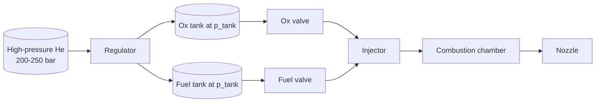
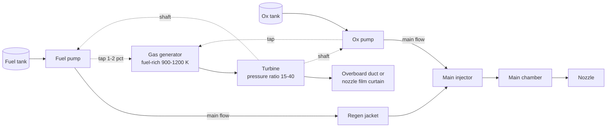
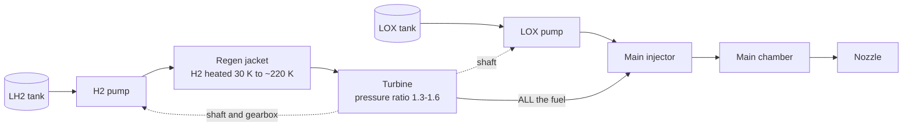
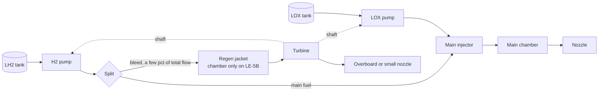
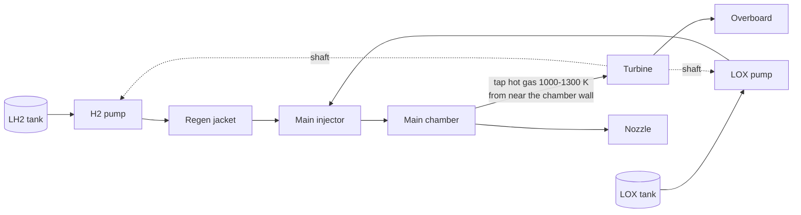
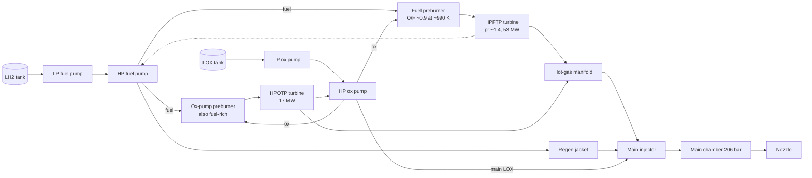
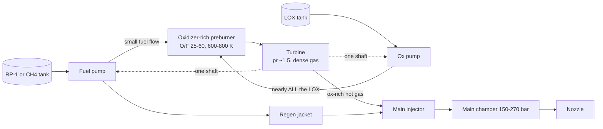
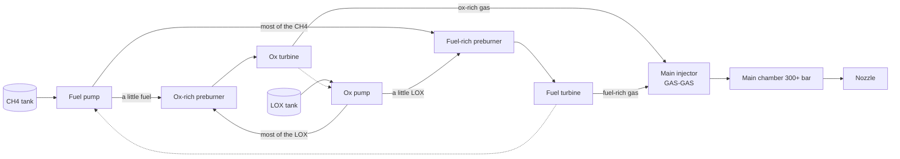
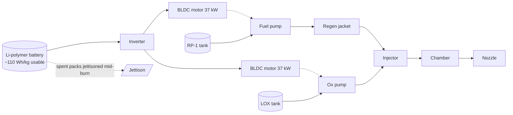

# Module 13 — Engine Cycles
Part II · Prerequisites: modules 05, 11, 12 · Estimated time: 10 h

An engine cycle is not a diagram. It is an answer to one question — *where does
the power to run the pumps come from, and what does it cost you?* — and every
other feature of the engine follows from that answer. Chamber pressure,
specific impulse, dry mass, throttle range, restart capability, the metallurgy
of the turbine, whether the engine can be reused, how long it takes to develop
and how much it costs are all downstream of the cycle choice. That is why the
cycle is frozen first and almost never revisited: the RS-25 programme spent
eight years and a decade's budget learning what fuel-rich staged combustion
demands, and by the time anyone understood the bill the architecture was
unchangeable. Choose the cycle badly and you will not discover it in analysis;
you will discover it three years later when the turbine blades crack, when the
jacket pressure drop eats the pump head you budgeted, or when the engine will
not start on the pad without a ground cart you cannot fly. This module derives
the one equation that governs all of it, then walks every architecture that has
flown, and tells you what each one costs.

---

## 1. Learning objectives

By the end of this module you should be able to:

1. Write the general turbomachinery power balance for a pump-fed engine from
   first principles, define every term, and state its assumptions.
2. Use that balance to explain quantitatively why open cycles cap out near
   100–120 bar chamber pressure while closed cycles reach 200–330 bar.
3. Classify any engine into one of nine cycles from a schematic or a
   description, and correctly distinguish the three architectures that the
   literature indiscriminately calls "expander".
4. Compute the gas-generator flow fraction for a given engine from pump power,
   turbine inlet temperature and turbine pressure ratio, and convert it into a
   specific-impulse penalty in seconds.
5. Perform an expander-cycle feasibility check — heat pickup available versus
   pump power required — and show why the answer degrades with engine size.
6. Explain why kerosene forces oxidizer-rich staged combustion, why methane
   does not, and what the oxygen-rich turbine materials problem actually is.
7. Size the battery mass for an electric-pump-fed stage and derive the
   battery-mass-to-propellant-mass ratio in closed form.
8. Describe the start and shutdown sequence for each cycle and name the
   specific failure each sequence step exists to prevent.
9. Build and defend a cycle trade study for a stated vehicle requirement,
   including throttle, restart, reuse and cost as first-class criteria.
10. Read a real engine's published chamber pressure, thrust-to-weight and
    specific impulse and infer, with reasons, which cycle it must be using.

---

## 2. Terminology

| term | symbol | SI unit | definition |
|---|---|---|---|
| Chamber pressure | $p_c$ | Pa | stagnation pressure at the injector face |
| Injector pressure drop | $\Delta p_{inj}$ | Pa | static drop across the injection elements |
| Jacket pressure drop | $\Delta p_j$ | Pa | pressure loss of the coolant through the regenerative circuit |
| Pump discharge pressure | $p_d$ | Pa | static pressure at the pump outlet flange |
| Pump pressure rise | $\Delta p_p$ | Pa | $p_d - p_{inlet}$ for one pump |
| Pump efficiency | $\eta_p$ | — | hydraulic power delivered divided by shaft power absorbed |
| Turbine efficiency | $\eta_t$ | — | actual shaft work divided by isentropic work over the same pressure ratio |
| Mechanical efficiency | $\eta_m$ | — | shaft/bearing/gearbox transmission efficiency, 0.96–0.99 |
| Turbine inlet temperature | $T_t$ | K | stagnation temperature of the drive gas entering the first stage |
| Turbine pressure ratio | $\pi_t$ | — | turbine inlet stagnation pressure over exit stagnation pressure |
| Turbine drive flow | $\dot m_t$ | kg/s | mass flow through the turbine |
| Drive-gas specific heat | $c_p$ | J/(kg·K) | constant-pressure specific heat of the turbine working fluid |
| Drive-gas specific-heat ratio | $\gamma_t$ | — | $c_p/c_v$ of the turbine working fluid |
| Turbine specific work | $w_t$ | J/kg | shaft work extracted per kilogram of drive gas |
| Gas-generator flow fraction | $f_{gg}$ | — | $\dot m_t/\dot m_{total}$ for an open cycle |
| Preburner mixture ratio | $r_{pb}$ | — | oxidizer-to-fuel mass ratio inside a preburner or gas generator |
| Bleed fraction | $f_b$ | — | fraction of fuel routed through an expander-bleed turbine and dumped |
| Effective exhaust velocity | $c$ | m/s | $F/\dot m_{total}$, including any secondary flow |
| Cycle specific-impulse penalty | $\Delta I_{sp}$ | s | flight $I_{sp}$ of the engine minus the $I_{sp}$ the main chamber alone would give |
| Coolant temperature rise | $\Delta T_{cool}$ | K | bulk temperature rise of the regenerative coolant |
| Heat pickup | $Q$ | W | total heat transferred into the coolant in the regenerative circuit |
| Throat area | $A_t$ | m² | nozzle throat cross-sectional area |
| Throat diameter | $D_t$ | m | $\sqrt{4A_t/\pi}$ |
| Wetted regen area | $A_w$ | m² | gas-side surface area of the regeneratively cooled circuit |
| Battery specific energy | $e_b$ | J/kg | *usable* electrical energy per kilogram of flight battery |
| Motor efficiency | $\eta_{mot}$ | — | electrical-to-shaft efficiency of an electric pump drive |
| Inverter efficiency | $\eta_{inv}$ | — | DC-to-AC conversion efficiency in an electric pump drive |
| Tank pressure | $p_{tank}$ | Pa | ullage pressure in a pressure-fed system |
| Net positive suction head | NPSH | m | pump inlet head above vapour pressure |

---

## 3. Theory

### 3.1 The problem a cycle solves

A liquid rocket engine burns propellant at some chamber pressure $p_c$. The
propellant has to get into the chamber, which means it must arrive at a
pressure higher than $p_c$ — higher by the injector drop, and, for whatever
fraction of the flow is used as regenerative coolant, higher again by the
jacket drop:

$$p_d \;=\; p_c + \Delta p_{inj} + \Delta p_j + \Delta p_{lines} + \Delta p_{valves}$$

> **Eq. 3.1** — variables: all pressures in Pa. Meaning: the pump (or the tank)
> must supply the chamber pressure plus every downstream loss. Assumes:
> steady state, no significant dynamic-head recovery at the injector. Fails
> when: the coolant is a two-phase or supercritical fluid whose density
> changes so much through the jacket that "a pressure drop" is not a single
> well-defined number, and when a turbine sits in the middle of the circuit —
> in which case its drop appears here too.

For a typical booster engine at $p_c = 100$ bar, $\Delta p_{inj} \approx
0.2 p_c = 20$ bar and $\Delta p_j = 15$–30 bar, so $p_d \approx 140$–155 bar.
Getting a few hundred kilograms per second of cryogenic liquid to 150 bar
takes megawatts. Somebody has to pay for those megawatts, and the whole
subject of engine cycles is the accounting of that payment.

There are exactly three ways to pay [F]:

1. **Do not pump at all.** Pressurise the tanks to $p_d$ with stored gas. The
   payment is tank wall mass and pressurant mass. This is the **pressure-fed**
   cycle.
2. **Burn some propellant to run a turbine, and throw the exhaust away.**
   The payment is the propellant that never reaches the main chamber, which
   shows up directly as lost $I_{sp}$. These are the **open cycles**: gas
   generator, expander bleed, and tap-off.
3. **Burn some propellant to run a turbine, then inject the turbine exhaust
   into the main chamber and burn it properly.** The payment is that the
   turbine must operate at high back-pressure, which forces enormous turbine
   flow, low pressure ratio, hostile working fluids and a great deal of
   complexity. These are the **closed cycles**: staged combustion in its
   fuel-rich, oxidizer-rich and full-flow variants, and the closed expander.

A fourth option appeared in 2017: **carry the energy as electricity** and run
the pumps on batteries. It is not a thermodynamic cycle at all in the sense of
the others — it moves the payment from propellant to stored electrochemical
energy — and its accounting is different in an instructive way (§3.13).

### 3.2 The general power balance

Every pump-fed engine obeys one statement: the turbine (or motor) must deliver
the shaft power the pumps absorb.

**Pump side.** For an incompressible liquid raised by $\Delta p_p$ at mass flow
$\dot m_p$, the ideal (isentropic) power is $\dot m_p \Delta p_p/\rho$. Real
pumps dissipate; divide by $\eta_p$:

$$P_{pump,j} = \frac{\dot m_{p,j}\,\Delta p_{p,j}}{\rho_j\,\eta_{p,j}}$$

> **Eq. 3.2** — variables: $\dot m_p$ [kg/s], $\Delta p_p$ [Pa], $\rho$ [kg/m³],
> $\eta_p$ [—]; $P$ in W. Meaning: shaft power absorbed by one pump. Assumes:
> incompressible liquid, single-phase, no leakage or axial-thrust-balance flow
> charged elsewhere. Fails when: the fluid is compressible over the pressure
> rise (liquid hydrogen at 500 bar is genuinely compressible, and the error is
> a few per cent), or when balance-piston and bearing-coolant bleeds are a
> significant fraction of the flow, which they are on hydrogen pumps.
> Implemented as `pump_power` in `tools/rocket.py`.

**Turbine side.** A turbine expanding a gas from $T_t$ through pressure ratio
$\pi_t$ extracts, per unit mass, at most the isentropic enthalpy drop
$c_p T_t \left[1-\pi_t^{-(\gamma_t-1)/\gamma_t}\right]$. Real turbines recover
a fraction $\eta_t$ of it:

$$w_t = \eta_t\, c_p\, T_t\left[1-\pi_t^{-(\gamma_t-1)/\gamma_t}\right]$$

**The balance.** Summing over all pumps and allowing a mechanical efficiency:

$$\boxed{\;\eta_t\,\dot m_t\,c_p\,T_t\left[1-\pi_t^{-\frac{\gamma_t-1}{\gamma_t}}\right] \;=\; \frac{1}{\eta_m}\sum_j \frac{\dot m_{p,j}\,\Delta p_{p,j}}{\rho_j\,\eta_{p,j}}\;}$$

> **Eq. 3.3 (the cycle equation)** — variables: $\eta_t$ turbine efficiency
> [—], $\dot m_t$ turbine drive flow [kg/s], $c_p$ [J/(kg·K)] and $\gamma_t$
> [—] of the drive gas, $T_t$ turbine inlet stagnation temperature [K],
> $\pi_t$ turbine pressure ratio [—], $\eta_m$ mechanical efficiency [—],
> and on the right one term per pump. Both sides in W. Meaning: **this single
> equation determines every cycle.** Assumes: steady state, calorically
> perfect drive gas, adiabatic turbine, one shaft (or, for multi-shaft
> engines, apply it per shaft). Fails when: the drive gas condenses or reacts
> across the turbine (it does — hot fuel-rich gas continues to react, which
> raises effective $c_p$ by several per cent), when $\gamma_t$ and $c_p$ vary
> strongly across the expansion (they do for hydrogen-rich gas), and when a
> gearbox loss is large enough that $\eta_m$ is not near unity (the RL10's
> gearbox runs 0.96–0.97). Implemented as `turbine_power` in
> `tools/rocket.py` [SP-8110][HH §6].

Read Eq. 3.3 as a market. The right-hand side is the bill: it grows linearly
with chamber pressure, because $\Delta p_p \approx p_c(1 + \text{losses})$, and
linearly with total flow, i.e. with thrust. So **pump power scales as
$F \times p_c$** at fixed propellants [F]. The left-hand side is the payment,
and a cycle is nothing more than a strategy for making the four factors
$\dot m_t$, $T_t$, $\pi_t$ and $\eta_t$ large enough to cover it.

Each cycle maximises a different factor, and each choice has a price:

| strategy | which factor | what it costs |
|---|---|---|
| Gas generator | large $\pi_t$ (15–40), moderate $T_t$ (900–1,200 K), tiny $\dot m_t$ | the drive flow is dumped: direct $I_{sp}$ loss |
| Closed expander | the *whole* fuel flow as $\dot m_t$, tiny $\pi_t$ (1.3–1.6), very low $T_t$ (150–250 K) | $T_t$ comes only from wall heat, which caps $p_c$ |
| Staged combustion | the whole flow of one propellant plus preburner ox as $\dot m_t$, small $\pi_t$ (1.3–1.6), high $T_t$ (600–1,100 K) | preburner, hot-gas manifold, exotic metallurgy |
| Tap-off | main-chamber gas at $T_t \approx 1{,}000$–1,300 K, high $\pi_t$ | the drive gas is at main-chamber mixture ratio — very hot and hard to control |
| Electric | no turbine; $P$ from a battery | battery mass, carried dead to burnout |

### 3.3 Why closed cycles reach higher chamber pressure

Now the central result. Take an open cycle. The turbine exhausts to something
near ambient, so $\pi_t$ is large and each kilogram of drive gas is worth a lot
of work — but every kilogram is lost. Write the flow fraction:

$$f_{gg} = \frac{\dot m_t}{\dot m_{tot}} = \frac{1}{\eta_t\eta_m\,c_p T_t\left[1-\pi_t^{-(\gamma_t-1)/\gamma_t}\right]}\cdot\frac{1}{\dot m_{tot}}\sum_j\frac{\dot m_{p,j}\Delta p_{p,j}}{\rho_j\eta_{p,j}}$$

The sum is proportional to $\dot m_{tot}\,p_c/\bar\rho$ where $\bar\rho$ is a
flow-weighted mean propellant density, so:

$$\boxed{\;f_{gg} \;\approx\; \frac{K\,p_c}{\bar\rho\;\eta_t\eta_m\eta_p\, c_p T_t\left[1-\pi_t^{-(\gamma_t-1)/\gamma_t}\right]}\;}$$

> **Eq. 3.4** — $K \approx 1.4$–1.6 is the dimensionless factor by which pump
> discharge exceeds $p_c$ (Eq. 3.1). Meaning: **the fraction of propellant an
> open cycle must throw away is directly proportional to chamber pressure and
> inversely proportional to propellant density.** Assumes: both pumps at
> similar $\Delta p$, one turbine. Fails when: the two circuits have very
> different discharge pressures (hydrogen engines, where the fuel jacket adds
> tens of bar), in which case use the full sum.

This is the whole story of the open-cycle ceiling [F]. At kerolox
$\bar\rho \approx 1000$ kg/m³, $c_p T_t \approx 2.1$ MJ/kg, $\pi_t = 20$,
$\eta_t\eta_p\eta_m \approx 0.45$: at $p_c = 100$ bar you get
$f_{gg} \approx 3\%$; at 200 bar, $6\%$; at 300 bar, $9\%$. Since the dumped
flow produces perhaps a third of the main chamber's $I_{sp}$, the penalty is
roughly $0.7 f_{gg}$ in fractional $I_{sp}$: 2 % at 100 bar, 6 % at 300 bar.
Nobody accepts an 18-second $I_{sp}$ loss to buy the 8 s that the extra
chamber pressure returns. **The open cycle stops being worth it somewhere
between 100 and 130 bar, and every flown gas-generator engine sits below that
line**: Merlin 1D at 97 bar, Vulcain 2 at 117.3 bar, RS-68A at 102.6 bar,
Prometheus targeting 100 bar [_verify-liquid]. That is not a coincidence and it
is not a manufacturing limit. It is Eq. 3.4.

Now close the cycle. Inject the turbine exhaust into the chamber and the
$I_{sp}$ penalty vanishes — but the turbine now exhausts at $p_c +
\Delta p_{inj}$ instead of at ambient, so $\pi_t$ collapses from ~20 to ~1.4.
The bracket $\left[1-\pi_t^{-(\gamma_t-1)/\gamma_t}\right]$ falls from ~0.45 to
~0.08, a factor of five and a half. To pay the same bill you must therefore
increase $\dot m_t c_p T_t$ by that factor — and because the exhaust is going
into the chamber anyway, you are free to put *all* of one propellant through
the turbine. Running the entire fuel flow instead of 3 % of the total is a
factor of ~20 in $\dot m_t$ for a hydrogen engine. That is more than enough
slack to absorb the pressure-ratio loss and keep climbing:

$$\frac{p_{c,\text{closed}}}{p_{c,\text{open}}} \;\sim\; \frac{\dot m_{t,c}\,T_{t,c}\left[1-\pi_{t,c}^{-\kappa}\right]}{\dot m_{t,o}\,T_{t,o}\left[1-\pi_{t,o}^{-\kappa}\right]},\qquad \kappa=\frac{\gamma_t-1}{\gamma_t}$$

> **Eq. 3.5** — Meaning: the chamber pressure a cycle can reach scales as the
> total turbine power it can generate. Assumes: same propellants, same
> efficiencies, pump discharge dominated by $p_c$. Fails when: the structural
> or thermal limit binds before the power limit does, which is the situation
> for the BE-4 (140 bar by choice, not by capability) [_verify-liquid].

The numbers confirm it. Fuel-rich staged combustion: RS-25 at 206.4 bar,
RD-0120 at 219 bar. Oxidizer-rich: RD-180 at 267 bar, RD-171 at 245.2 bar.
Full-flow: Raptor at a claimed 300–330 bar. Against a 100–120 bar open-cycle
ceiling, closed cycles buy a factor of two to three in chamber pressure — and
that buys nozzle size (a smaller throat for the same thrust, hence a bigger
area ratio inside the same envelope), thrust-to-weight, and a couple of
seconds of $I_{sp}$ from better expansion, on top of the 3–8 s recovered from
not dumping anything [SB §6.6][HH §1].

**The honest caveat [J].** Closed cycles are not "better". They cost roughly
two to three times as much to develop, they take longer, they impose materials
problems that took the West thirty years to solve for the oxidizer-rich case,
and their start transients are far harder. The RS-68 was deliberately designed
as an open-cycle engine with an ablative nozzle and 80 % fewer parts than the
RS-25, for reasons of cost — and it is the largest hydrogen engine ever built
[_verify-liquid]. Choosing a cycle is a systems decision, not a performance
decision.

### 3.4 The taxonomy, stated once, precisely

The secondary literature is unreliable here. In particular, **"expander cycle"
is used for three architectures with materially different thrust ceilings and
$I_{sp}$ penalties** [_verify-liquid §19]. The distinctions that matter:

| name | turbine drive gas | where the turbine exhaust goes | open/closed |
|---|---|---|---|
| Pressure-fed | none | — | — |
| Gas generator | separate combustor, own propellant taps | overboard (or into the nozzle as film) | open |
| **Closed expander** | fuel heated in the cooling jacket | into the main injector | **closed** |
| **Expander bleed** | a *portion* of fuel heated in the jacket | overboard | **open** |
| **Tap-off** | hot gas bled from the main chamber | overboard | open |
| Staged combustion, fuel-rich | fuel-rich preburner | into the main injector | closed |
| Staged combustion, ox-rich | oxidizer-rich preburner | into the main injector | closed |
| Full-flow staged combustion | two preburners, one of each | both into the main injector | closed |
| Electric pump | none (battery + motor) | — | — |

Learn the middle three by their engines, because that is how you will be asked:
**closed expander** = RL10, Vinci, RD-0146, YF-75D. **Expander bleed** = LE-5A,
LE-5B, LE-9, BE-3U. **Tap-off** = J-2S (tested, never flown operationally),
BE-3PM.

---

### 3.5 Pressure-fed

**Thermodynamics.** There is no power cycle. Stored gas does the work of
displacement; the energy came from a ground compressor. The relevant
thermodynamics is the *blowdown or regulated expansion of the pressurant*
(module 12), not a turbine cycle.

**Power balance.** Eq. 3.3 degenerates: there is no turbine and no pump. What
replaces it is a structural balance. Tank wall mass for a pressure vessel of
volume $V$, allowable stress $\sigma$ and material density $\rho_s$ is

$$m_{tank} \approx \frac{p_{tank}\,V\,\rho_s}{\sigma}\cdot\Phi$$

> **Eq. 3.6** — $V$ [m³] tank volume, $\Phi \approx 2$–3 a shape and
> safety-factor multiplier [—]. Meaning: **tank mass is proportional to
> pressure times volume**, so a pressure-fed system pays for chamber pressure
> in structure, linearly, over the whole propellant volume. Assumes: membrane
> stress, thin wall. Fails when: buckling rather than burst sizes the wall
> (large low-pressure tanks), or when a common bulkhead changes the geometry.

That single proportionality is the entire pressure-fed story. Doubling $p_c$
doubles tank mass *and* roughly doubles pressurant mass, for perhaps 2 % of
$I_{sp}$ from better expansion. So pressure-fed engines run low $p_c$: Aestus
at **11 bar**, OMS at **8.6 bar**, the LM ascent engine at **8.3 bar**, LMDE at
**7.6 bar** at full thrust, and the Apollo SPS at about 6.9 bar — the last
figure carrying low confidence in the source and needing verification against
Apollo primary documentation before anyone prints it as fact
[_verify-liquid]. The exception proves the rule: **SuperDraco at 69 bar** is
pressure-fed at booster-class chamber pressure, and it can be because it burns
for only ~25 s and because Crew Dragon's helium system was sized for an abort,
not for economy.

**Advantages.** No turbomachinery: no rotordynamics, no bearings, no seals, no
start transient worth the name, no shaft to fail. Restart is trivial — open a
valve. Throttling is comparatively easy. Reliability is the best of any
architecture; the Apollo SPS performed every lunar orbit insertion and
trans-Earth injection without a failure, and the LM ascent engine had no
igniter, no pumps, no gimbal and no backup, and worked every time
[_verify-liquid].

**Disadvantages.** Low $p_c$ means either a huge nozzle for good expansion or
poor $I_{sp}$; heavy tanks; heavy pressurisation hardware. Aestus carries
111 kg of engine plus a helium system to feed 29.6 kN.

**Complexity: lowest.** **Reliability record: the best.** **$I_{sp}$ penalty:
none from the cycle itself** — but a large indirect one through $p_c$, and a
large mass penalty that costs stage $\Delta v$ anyway.

**Start/shutdown.** Sequence: pressurise (or verify regulated pressure), open
the fuel valve a few tens of milliseconds before the oxidizer valve on
hypergols to avoid an oxidizer-rich hard start, confirm chamber pressure,
run. Shutdown is valve closure; the residual in the injector manifold
downstream of the valve sets the shutdown impulse repeatability, which is why
precision manoeuvring engines put the valve as close to the face as the
plumbing allows. There is no chill-down, no spin-up, no turbine to overspeed.

**Materials.** Tanks dominate: 6Al-4V titanium or filament-wound composite
overwrap on a metal liner. Chambers are usually ablative (SPS, LMDE, APS) or
radiatively cooled with a niobium or C-103 extension. SuperDraco is the
exception, a regeneratively cooled 3D-printed Inconel chamber, because it must
be restartable and reusable.

**Turbomachinery implications.** None, and that is the point. But note the
knock-on: with no pump there is no NPSH requirement, so tanks need no
antivortex or boost-pump provisions, and the propellant can be run to a much
lower residual.

**Engines:** Apollo SPS (AJ10-137, 91.19 kN, 314.5 s vac, 750 s maximum burn,
helium at 25 MPa in two tanks), LMDE (46.7 kN, throttleable 10–60 % with a
forbidden band between 60 % and 100 %, 311 s, supercritical-helium
pressurisation), LM APS (15.6 kN, 8.3 bar, 311 s), Shuttle OMS (AJ10-190,
26.7 kN, 8.6 bar, 316 s, certified for 1,000 starts and 100 missions), Aestus
(29.6 kN, 11 bar, 324 s at $\varepsilon = 84$, 1,100 s burn, multiple
re-ignitions), SuperDraco (71 kN, 69 bar, 235 s SL, 20–100 % throttle,
3D-printed Inconel), and SpaceX's Kestrel (Falcon 1 second stage, pressure-fed,
ablative, pintle-injected — its performance figures are not carried in this
course's verification file, so no numbers are quoted here) [_verify-liquid].

---

### 3.6 Gas generator (open cycle)

**Thermodynamics.** A small combustor burns a tapped fraction of both
propellants at a deliberately *off-stoichiometric* mixture ratio to hold the
gas temperature down to what turbine blades tolerate. The gas expands through
a high-pressure-ratio turbine to near-ambient and is dumped. It is a Brayton
arrangement bolted onto the side of the engine, thermodynamically independent
of the main chamber.

**Power balance.** Eq. 3.3 applies directly with $\pi_t$ large. Because
$\pi_t \gg 1$, the bracket is close to its asymptote and further increases in
$\pi_t$ buy little; there is no reason to exhaust below about 2–4 bar, and
doing so requires a bigger, heavier exhaust duct.

**Turbine inlet temperature is the binding constraint** [F]. Uncooled turbine
blades in a rocket-engine environment — no film cooling, no thermal barrier
coating in the classical designs, run times of minutes — are limited to
roughly **900–1,200 K** for the nickel superalloys used (Inconel 713C,
Waspaloy, René 41, Hastelloy) [SP-8110][HH §6]. Stoichiometric LOX/RP-1 is
about 3,600 K. So the gas generator must run far off-ratio.

**Fuel-rich versus oxidizer-rich gas generators.** Almost every flown GG is
**fuel-rich**, at $r_{pb} \approx 0.3$–0.4 for kerolox and 0.7–1.0 for
hydrolox. The reason is not aesthetic preference; it is that oxidizer-rich gas
at 1,000 K will burn the turbine [F]. Nickel superalloys in hot oxygen ignite —
the metal itself is the fuel — and the resulting failure is not a hot spot but
a self-propagating combustion of the hardware. The Soviets solved that problem
(§3.11), but only for *closed* cycles where the effort was worth it; nobody has
flown an ox-rich open gas generator, because the whole point of the open cycle
is cheapness. The price of running fuel-rich on kerosene is **coking**: at
900–1,100 K and $r_{pb} \approx 0.35$, kerosene pyrolyses and deposits carbon
on nozzle vanes and blade roots. The F-1's gas generator ran deliberately rich
and sooty and the deposits were accepted as a two-and-a-half-minute problem
[SP-8081][SLPRE].

The V-2 and the R-7 family are the standing exceptions to the whole
bipropellant discussion: they use a **monopropellant steam gas generator** —
hydrogen peroxide decomposed over a permanganate catalyst — which sidesteps the
temperature problem entirely at the cost of a third fluid to load and manage.
The V-2 did this in 1942 at 430 kW and 4,000 rpm, and the RD-107A/108A still
does it today, which means the Soyuz flies a 1940s power-cycle architecture in
2026 [_verify-liquid].

**Deriving the flow fraction.** Solve Eq. 3.3 for $\dot m_t$. For the module 03
reference engine (500 kN SL kerolox, $p_c = 100$ bar, $\dot m = 184.8$ kg/s at
$MR = 2.35$) this is worked completely in **WE1**: the answer is
$\dot m_t = 5.45$ kg/s, $f_{gg} = 2.87\%$ of total flow. **Typical values are
2–5 %** [E][SB §6.6]. Hydrogen engines sit at the low end by mass (hydrogen's
$c_p$ is enormous, so a little goes a long way) and kerolox at the high end.

**The $I_{sp}$ penalty.** If the dumped gas produced no thrust at all, the
penalty would be the full $f_{gg}$: $303.3 \times (1 - 0.0287) = 294.6$ s, an
**8.7 s** loss. Real dumps are given a small nozzle or ducted into the main
nozzle's divergent section, recovering perhaps 100–150 s of $I_{sp}$ on the
dumped mass, which brings the loss to **4.4–5.8 s**. **The 3–8 s range quoted
throughout the literature is exactly this calculation with different
assumptions about exhaust thrust recovery** [SB §6.6][HH §1]. The F-1 took the
recovery further by dumping the GG exhaust into the nozzle extension as a
**film-cooling curtain**, which does thermodynamic double duty: it protects the
extension so the extension needs no regenerative circuit, and it contributes
thrust [_verify-liquid]. That dark outer sheath in every Saturn V photograph is
the gas generator. The same effect shows up as a bookkeeping trap on the
Redstone A-7, whose "78,000 lbf" rating is the 75,000 lbf nameplate **plus
about 3,000 lbf of steam-generator exhaust thrust** — turbine exhaust is a real,
measurable thrust term and you must know whether a quoted thrust includes it
[_verify-liquid §8].

**Advantages.** The turbine is thermodynamically decoupled from the chamber, so
the engine is easy to start (spin the turbine, let $p_c$ follow), easy to
throttle (throttle the GG), tolerant of off-design operation, and cheap. Parts
count is low. Development is fast, and the turbopump can be developed as an
independent machine — an underrated advantage.

**Disadvantages.** The $I_{sp}$ penalty, the $p_c$ ceiling from Eq. 3.4, the
soot, and an exhaust duct that is a real structural and aerodynamic nuisance on
a clustered stage.

**Complexity: low-moderate.** **Reliability: excellent, and demonstrated at
enormous scale** — the SEP Viking family flew **958 engines across 144 launches
with 2 failures** [_verify-liquid]; the H-1 flew eight-engine clusters through
the entire Saturn I/IB programme without a cluster loss; Merlin has flown many
hundreds of engines.

**Start sequence** (turbopump-fed, generic) [HH §5]:

1. Chill-down of cryogenic pumps and lines, until inlet temperature and
   pressure prove the pump will not cavitate on the first revolution.
2. Turbine spin-up from a *separate* energy source: a solid-propellant gas
   generator cartridge (H-1), stored high-pressure helium or hydrogen (the J-2
   used an ambient helium start tank, and the S-IVB restart needed a second
   one), a ground start cart, or simply tank head (the BE-4's head-pressure
   start).
3. Main valves crack open in a scheduled sequence — fuel lead on most kerolox
   engines to wet and cool the chamber before oxygen arrives.
4. Ignition of the main chamber (TEA-TEB hypergolic slug on the H-1 and Merlin,
   augmented spark igniter on the J-2, pyrotechnic on the V-2 and Redstone).
5. The GG lights and the turbine accelerates; the engine "bootstraps" — more
   pump speed gives more GG flow gives more pump speed — until the control
   system catches it at the mainstage set point. **The bootstrap is the
   dangerous part**: it is a positive-feedback loop, and the whole art of the
   start sequence is arranging for it to converge rather than overshoot.

**Shutdown.** Close the GG valves first so the turbine decays, then the main
valves; a purge follows on kerolox to prevent coking of residual fuel in the
hot injector, and on hydrolox to prevent oxygen and hydrogen meeting in a cold
manifold. Shutdown transient thrust decay is a real payload-accuracy term for
upper stages.

**Materials.** Turbine blades in cast nickel superalloy; GG combustor in
Inconel; exhaust duct in stainless or Inconel with an expansion joint — the
duct sees 900–1,200 K and must accommodate gimbal motion, which is why it is
one of the more failure-prone lines on the engine.

**Turbomachinery implications.** High $\pi_t$ with small flow means a
**partial-admission or single-stage impulse turbine** at high blade speed —
efficient designs are hard because the volumetric flow is small and blade
heights are tiny. Efficiencies of $\eta_t = 0.55$–0.70 are normal, and *below
about 100 kN thrust they fall off a cliff*, which is a major reason small
pump-fed engines are rare and why the electric cycle is attractive there
(§3.13). Turbines and pumps can be geared (LR87, RL10, Atlas MA-5, H-1),
direct-drive (F-1), or split onto separate shafts in series (J-2).

**Engines:** V-2 (steam GG, 430 kW at 4,000 rpm, $p_c = 15.2$ bar), Redstone
A-7 (steam GG, 565 kW at 4,718 rpm), **F-1** (2,577 kg/s total flow, 41 MW
turbopump at 5,488 rpm, GG exhaust as nozzle film; $p_c \approx 70$ bar, itself
contested across 965/982/1,015/1,125 psia), **J-2** (52.6 bar, 421 s; separate
fuel and ox turbines **in series** on one GG flow — a series arrangement that
makes the mixture ratio self-regulating; 7-stage axial fuel pump at 27,000 rpm,
single-stage centrifugal ox pump at 8,600 rpm), **H-1** (43.6–48.3 bar,
solid-cartridge spin start, deliberately engineered cheap and built in the
hundreds), **RS-68/RS-68A** (102.6 bar, GG chosen explicitly over staged
combustion for cost, ~80 % fewer parts than the RS-25, T/W only 47.4:1),
**Merlin 1D** (97 bar, single-shaft dual-impeller pump at ~36,000 rpm and
~7.5 MW, T/W 184:1), **Vulcain 2** (117.3 bar, two separate turbopumps on one
GG, LH₂ pump ~36,500 rpm), **HM7B** (37 bar, 444.6 s — proof that upper-stage
$I_{sp}$ is dominated by area ratio, not $p_c$), **LR87/LR91** (Titan; the LR87
is a *two-chamber* engine on one geared turbopump, at 59.1 bar)
[_verify-liquid].

---

### 3.7 Closed expander

**Thermodynamics.** The cooling jacket is the heat source of a closed Brayton
cycle whose working fluid is the fuel itself. Hydrogen enters at ~30 K, absorbs
the chamber's rejected heat, leaves at 150–250 K, gives up 100–200 kJ/kg in the
turbine, and is then injected and burned. **Nothing is dumped and nothing is
combusted before the main chamber.** There is no preburner, no gas generator,
no hot-gas manifold, and no ignition source other than the main chamber's.

**Power balance.** Eq. 3.3, but with a second, harder constraint bolted on: the
turbine inlet temperature is not chosen, it is *computed* from the heat balance:

$$T_t \;=\; T_{in} + \frac{Q}{\dot m_f\,c_{p,f}},\qquad Q = \int_{A_w} q\,dA$$

> **Eq. 3.7** — $T_{in}$ pump discharge temperature [K], $Q$ total heat pickup
> [W], $\dot m_f$ fuel flow [kg/s], $c_{p,f}$ coolant specific heat
> [J/(kg·K)], $q$ local gas-side heat flux [W/m²], $A_w$ wetted regen area
> [m²]. Meaning: **the expander's turbine inlet temperature is a heat-transfer
> result, not a design choice.** Assumes: all fuel is the coolant, no bypass,
> single-phase supercritical hydrogen. Fails when: part of the fuel bypasses
> the jacket (a common trim), or when $c_p$ varies strongly across the
> pseudo-critical region — for hydrogen above ~15 bar it is well-behaved, for
> methane near its critical point it is not, which is one of the reasons a
> methane expander is hard.

**And why it scales badly.** From Bartz (module 10), throat heat flux
$q_t \propto p_c^{0.8} D_t^{-0.2}$, and for a geometrically similar engine
$A_w \propto D_t^2$. Therefore

$$Q \;\propto\; p_c^{0.8} D_t^{1.8}, \qquad \dot m \;\propto\; p_c D_t^{2}, \qquad \Rightarrow \qquad \Delta T_{cool} = \frac{Q}{\dot m_f c_p} \;\propto\; (p_c D_t)^{-0.2}$$

$$\text{available power} \;\propto\; \dot m_f\,\Delta T_{cool} \;\propto\; p_c^{0.8}D_t^{1.8}, \qquad \text{required power} \;\propto\; \dot m\,p_c \;\propto\; p_c^{2}D_t^{2}$$

$$\boxed{\;\frac{\text{available}}{\text{required}} \;\propto\; p_c^{-1.2}\,D_t^{-0.2}\;}$$

> **Eq. 3.8** — Meaning: the expander margin degrades **strongly with chamber
> pressure** and only weakly with engine diameter. Assumes: geometric
> similarity, Bartz scaling, constant efficiencies and constant jacket pressure
> drop. Fails when: the jacket pressure drop is *not* constant — and it is not,
> which is what turns a weak scaling into a hard wall.

Taken alone, Eq. 3.8 says that scaling from 100 kN to 1 MN at fixed $p_c$ costs
only $10^{-0.1} = 21\%$ of margin. That is not a ceiling, and the frequently
repeated claim that the expander cycle "cannot exceed 300 kN because heat
pickup scales as $D^2$ while thrust scales as $D^3$" is simply wrong — thrust
scales as $D^2$ too, at fixed $p_c$.

**The real mechanism is the jacket pressure drop** [F][J]. To keep the wall
alive you must hold the coolant-side heat-transfer coefficient, hence the
channel mass flux $G$, roughly constant. Channel count then scales with
$\dot m$, per-unit-length pressure drop stays put, but the circuit *length*
scales with $D_t$. So $\Delta p_j \propto D_t$. And here is the trap: the pump
must supply $p_c + \Delta p_{inj} + \Delta p_j + \Delta p_t$, where
$\Delta p_t$ is the turbine's own drop. Every bar of jacket loss is a bar the
pump must add and pay for, *and it is a bar that does not appear across the
turbine.* **WE2** solves the resulting fixed point exactly: a 100 kN LH₂
expander at 40 bar closes comfortably with a 103 bar pump discharge, and a
1 MN version of the same engine closes only at a **248 bar pump discharge to
feed a 40 bar chamber** — six times chamber pressure, a hydrogen pump in
staged-combustion territory feeding a chamber in upper-stage territory, with
all the mass, NPSH and jacket-structure consequences that implies.

**So the "≈300 kN expander ceiling" is real, but it is an economic wall, not a
mathematical one** [J]. The equations have a root; the root is an engine nobody
would build. The flown record supports the judgement: RL10A-3-3A 73.4 kN at
32.8 bar, RL10B-2 110.1 kN, RL10C-1 101.8 kN, RD-0146 68.6 kN at 59 bar
(tested, never flown), and **Vinci at 180 kN and 60 bar — the largest closed
expander ever flown, after a 26-year development** [_verify-liquid]. Nothing
larger has been built.

**Why hydrogen, in practice.** Look at Eq. 3.7. The available turbine power is
$\dot m_f c_p \Delta T$, and hydrogen's $c_p \approx 14.5$ kJ/(kg·K) is four to
six times methane's and seven times kerosene's. Worse, kerosene cannot be
heated past about 550–600 K without coking the channels shut, so its $\Delta T$
is bounded too, and it is a poor coolant at high heat flux. **Methane is the
only serious alternative** [R]: it has adequate $c_p$, it does not coke badly
below ~800 K, and it is dense. Methane closed-expander work exists at
demonstrator level, and the published analyses land at the same conclusion —
feasible below roughly 100–150 kN, at 40–60 bar, with the pseudo-critical $c_p$
excursion as the design headache. No methane closed expander has flown.

**Advantages.** Highest $I_{sp}$ of any cycle at a given $p_c$ — nothing is
dumped, and the fuel arrives at the injector warm, which improves atomisation
and combustion efficiency. Benign failure mode: if the chamber cools, the
turbine loses power and the engine throttles itself down rather than running
away. Fewest hot parts of any pump-fed engine. Restart is straightforward.

**Disadvantages.** The thrust and $p_c$ ceiling. Also a subtle one: the engine
cannot start without heat, and there is no heat until it is running.

**Complexity: low for a closed cycle** — no preburner, no igniter other than the
main-chamber torch, no hot-gas manifold. But the *thermal* design is
unforgiving: the jacket is a power plant, and a 10 % error in heat pickup is a
10 % error in shaft power.

**Reliability record: outstanding.** The RL10 has been in continuous production
since 1962 — over six decades, the longest service life of any rocket engine
ever — and is the standard American upper-stage engine [_verify-liquid].

**$I_{sp}$ penalty: none.** RL10B-2's **465.5 s** is the highest specific
impulse of any flown chemical rocket engine; RD-0146's 470 s is higher still
but is a test-stand figure for an engine that never flew, and should not be
listed alongside flight values [_verify-liquid §17].

**Start sequence.** The chicken-and-egg problem: no heat, no turbine; no
turbine, no flow; no flow, no heat. The solution is a **tank-head start**: open
the valves and let tank pressure alone push hydrogen through the jacket. Even a
trickle picks up heat from the ambient-temperature hardware, spins the turbine
a little, which raises flow, which raises heat pickup, and the engine
bootstraps itself over roughly one to three seconds. It works only because the
chamber and jacket start *warm* relative to 30 K hydrogen — the residual heat
capacity of the metal is the starter motor. This makes the expander uniquely
easy to restart in flight and uniquely sensitive to pre-start thermal
conditioning. Shutdown: close the oxidizer valve, then the fuel valve, and let
the turbine coast down; there is no hot gas to purge.

**Materials.** Brazed stainless-steel tube-wall chamber on the RL10, milled
channels on Vinci. The turbine sees 150–250 K hydrogen and is therefore in
*cryogenic* rather than high-temperature territory — the alloy problem is
hydrogen embrittlement and low-temperature toughness, not creep. Nickel alloys
in high-pressure hydrogen suffer severe embrittlement, which is why plated or
carefully selected alloys are used throughout the hydrogen circuit
[SP-4230][MMPDS].

**Turbomachinery implications.** Tiny $\pi_t$ (1.3–1.6) and cold, low-density
gas mean the turbine must pass a large *volumetric* flow for little work:
turbines are multi-stage reaction designs with long blades, and shaft speed is
extreme. RL10: a two-stage centrifugal hydrogen pump at ~31,000 rpm driving a
LOX pump through a **reduction gearbox** — one of the RL10's most distinctive
and most-copied features. RD-0146: separate turbopumps with the **fuel pump
above 120,000 rpm**, the highest published turbopump speed of any rocket engine
[_verify-liquid].

**Engines:** RL10 family (A-3-3A 73.4 kN / 32.8 bar / 444–445 s / geared single
shaft; B-2 110.1 kN / 465.5 s / 285:1 extendible carbon–carbon nozzle deployed
from 77:1, chamber pressure not published; **C-1 101.8 kN / 449.7 s / 130:1**,
the current production variant, chamber pressure not published by the
manufacturer), Vinci (180 kN, 60 bar, 457.2 s, $\varepsilon = 240$, up to
3 restarts, 900 s burn, 34.1 kg/s LOX and 5.59 kg/s LH₂), RD-0146 (68.6 kN,
59 bar, never flown), YF-75D (China's first closed expander; thrust and $I_{sp}$
unconfirmed in the source and therefore not quoted) [_verify-liquid].

---

### 3.8 Expander bleed (open expander)

**Thermodynamics.** Identical heat source to the closed expander — wall heat
into hydrogen — but the turbine now exhausts **overboard**, not into the
chamber. That one change removes the constraint that made the closed expander
scale badly: $\pi_t$ is no longer pinned near 1.4 but can be 5, 10 or more, so
each kilogram of bleed does five to ten times the work, so you need only a
small fraction of the fuel instead of all of it.

**Power balance.** Eq. 3.3 with $\pi_t$ free and $\dot m_t = f_b \dot m_f$.
Solve for $f_b$; realistic values are **a few per cent of the engine's total
flow** — which, because hydrogen is only 12–17 % of the mass on a hydrolox
engine, can be 10–25 % of the *fuel* flow. Problem N6 works this out for the
LE-9 and the answer is worth seeing before you assume "a bleed is small". The
jacket no longer has to pass the entire fuel flow, so $\Delta p_j$ decouples
from the main circuit and the fixed-point problem of §3.7 disappears.

**Advantages.** **No thrust ceiling.** The LE-9 makes **1,471 kN** — more than
eight times Vinci — from a cycle with no preburner and no gas generator, and is
by a wide margin the largest engine of the expander family ever flown
[_verify-liquid]. Simplicity is nearly that of the closed expander: no
preburner, no hot-gas manifold, no ox-rich metallurgy, no separate GG
propellant taps or GG igniter. Start is a tank-head bootstrap as before.

**Disadvantages.** A real, if small, $I_{sp}$ penalty — the LE-5A (bleed using
nozzle *and* chamber heat) delivered 452 s and the simplified LE-5B (chamber
only) delivers **446.8 s**, and the LE-9 delivers **426 s** at 100 bar where
staged combustion at that size would give 440+ [_verify-liquid]. And the
thermal margins are thin: LE-9 development found **combustion chamber wall
cracks and turbine blade fatigue cracks** in 2020, delaying H3 by about two
years.

**Complexity: low.** **Reliability: good but young.** LE-5A/5B have a long
clean record on H-II/H-IIA/H-IIB; the LE-9 first flew 7 March 2023 and
performed correctly on H3 TF1 (the failure on that flight was in the second
stage), with a fully successful second flight on 17 February 2024.

**$I_{sp}$ penalty: roughly 1–3 %** (≈5–15 s on a hydrogen engine), because
the bleed fraction of total flow is small and the dumped gas is warm hydrogen,
which is a surprisingly good propellant in its own right — a dumped-hydrogen
nozzle can reach 180–220 s, so much of the bleed's momentum is recovered.

**Materials and turbomachinery.** The same cryogenic-hydrogen problem set as the
closed expander, but with a higher-pressure-ratio, smaller turbine that is
easier to make efficient. The regenerative circuit is a *heat exchanger with a
duty specification*, which is the LE-9's crack story: it is being asked to
transfer a specific quantity of heat, not merely to survive.

**The taxonomy point, restated because it is the single most common error in
the secondary literature** [_verify-liquid §19]: the **BE-3U is an expander
bleed engine and the BE-3PM is a tap-off engine.** They share a name and very
little else in the power cycle. Blue Origin changed the cycle for the vacuum
variant. Do not let a table put them in the same row.

**Engines:** **LE-5A** (world's first operational expander bleed, H-II, 1994;
121.5 kN, 39.8 bar, 452 s, jacket *and nozzle* in the heat circuit), **LE-5B**
(137.2 kN, 35.8 bar, 446.8 s, chamber only — a deliberate simplification
trading ~5 s for cost and reliability; operates at 100 %, 60 %, 30 % and a 3 %
idle mode), **LE-9** (1,471 kN vacuum, 100 bar, 426 s, $\varepsilon = 37$,
2,400 kg), **BE-3U** (LOX/LH₂, 445 s claimed, thrust published variously as
711.5 / 889.5 / 941.5 kN — quote 710 kN as the design point and note the uprate
history; chamber pressure not published, dry mass not published, throttle
75–100 %) [_verify-liquid].

---

### 3.9 Tap-off

**Thermodynamics.** Bleed combustion gas directly out of the main chamber, near
the wall where the boundary layer is cool and fuel-rich, expand it through a
turbine, dump it. There is no separate combustor of any kind — the main chamber
*is* the gas generator. It is the minimum-part-count pump-fed cycle that
exists.

**Power balance.** Eq. 3.3 with $T_t$ set by wherever on the chamber wall you
tap, and $\pi_t$ set by $p_c$ over the dump pressure — so $\pi_t$ is large, like
a GG. The drive flow is 1–3 % of total.

**The hot-gas problem, which is why almost nobody uses it** [F][J]. In a gas
generator you *choose* $T_t$ by setting $r_{pb}$, and a control valve holds it
there. In a tap-off you get whatever the chamber's near-wall boundary layer is
doing. That gas is:

- **Hot.** Core chamber gas is 3,300–3,600 K. You are relying entirely on the
  wall boundary layer and any film cooling to hand you 1,000–1,300 K gas at the
  tap. The tap must be placed and sized so that the *mixing* between the cool
  wall layer and the core gives the right temperature — an inherently
  three-dimensional, hard-to-predict, and hard-to-scale problem.
- **At main-chamber mixture ratio, not at your chosen mixture ratio.** For
  hydrolox at $MR \approx 5.5$ the near-wall gas is fuel-rich and hence
  relatively benign. For kerolox it would be sooty; for anything ox-rich it
  would be fatal. **Tap-off is essentially a hydrogen-engine cycle.**
- **Uncontrollable, and coupled.** Chamber temperature varies with mixture
  ratio, throttle setting and injector wear. Every one of those variations
  propagates straight into turbine inlet temperature, which propagates into
  pump speed, which propagates back into mixture ratio. The tap-off engine has
  a **direct positive feedback path from the chamber to the pumps** with no
  independent control element in between. Startup is correspondingly difficult:
  there is nothing to tap until the chamber is lit, and the chamber cannot be
  fed until the pumps run — so tap-off engines need a substantial spin-start
  system.

**Advantages.** Lowest part count of any pump-fed cycle. No preburner, no GG,
no separate GG propellant valves or igniter. Very good throttling — the
BE-3PM's **18–100 %** range on a hydrogen engine is extraordinary and is what
makes single-engine propulsive landing possible [_verify-liquid].

**Disadvantages.** Everything in the paragraph above. Also a small $I_{sp}$
penalty like a GG, because the tapped gas is dumped.

**Complexity: lowest of the pump-fed cycles by part count, highest by
*integration* risk.** You cannot develop the turbine independently of the
injector.

**Reliability record: thin but clean.** The BE-3PM has flown New Shepard since
29 April 2015, including the first vertical landing and reflight of a
liquid-fuelled booster in November 2015. The J-2S was extensively tested
(1965–72) at 1,138.5 kN and 436 s and **never flew** [_verify-liquid].

**Materials.** The tap duct and turbine inlet see the least predictable
temperature in the engine, so they are sized with large margin in nickel
superalloys, and the tap port itself is a thermal-fatigue site on the chamber
wall.

**Engines:** **J-2S** (uprated J-2, tap-off replacing the gas generator,
1,138.5 kN, 436 s, 1,400 kg, tested 1965–72, never flown), **BE-3PM** (490 kN
SL at full power, minimum 89 kN, 18–100 % throttle; chamber pressure, $I_{sp}$,
$\varepsilon$, dry mass, injector and turbopump detail all **not published** —
say so rather than filling them in) [_verify-liquid].

---

### 3.10 Staged combustion, fuel-rich (FRSC)

**Thermodynamics.** A preburner burns *all* the fuel with a small part of the
oxidizer at $r_{pb} \approx 0.7$–1.0, producing a hydrogen-rich gas at
700–1,100 K. That gas drives the turbines and then goes into the main injector,
where the remaining oxidizer is added and combustion completes at
$MR \approx 6$. The cycle is genuinely a topping cycle: heat released in the
preburner is not wasted, it simply arrives in the chamber as enthalpy rather
than as chemical energy.

**Power balance.** Eq. 3.3, with the crucial structural difference from the GG:
$\pi_t$ is small because the turbine exhausts into the injector, but $\dot m_t$
is the *entire fuel flow plus the preburner oxidizer*, so the product
$\dot m_t c_p T_t$ is enormous. **WE3** does this for the RS-25: at the
documented preburner conditions and 70.4 MW of pump power, the required turbine
pressure ratio comes out at **$\pi_t \approx 1.38$**, against $\pi_t = 20$ for
the gas generator of WE1. Two engines, the same equation, pressure ratios a
factor of fifteen apart. That contrast is the single most useful thing to carry
out of this module.

**Why hydrogen-rich preburners, specifically.** Three reasons, in order of
importance [F]:

1. **Hydrogen-rich gas is the best turbine working fluid available.** At
   $r_{pb} = 0.9$ the gas is roughly 47 % H₂ and 53 % H₂O by mass, molar mass
   ~3.8 kg/kmol, $c_p \approx 8{,}200$ J/(kg·K). Compare a kerolox GG gas at
   ~2,100 J/(kg·K). Four times the specific heat means four times the specific
   work at the same temperature and pressure ratio, which is exactly the margin
   you need when $\pi_t$ has collapsed to 1.4.
2. **It is chemically benign to nickel alloys**, unlike oxygen-rich gas, which
   burns them.
3. **Hydrogen does not coke.** A fuel-rich hydrocarbon preburner at 900 K
   deposits carbon; a fuel-rich hydrogen preburner deposits nothing.

**Advantages.** Highest $p_c$ achievable on hydrogen, hence the best $I_{sp}$ of
any booster-class engine (RS-25 452.3 s vac, RD-0120 455 s vac), no cycle
$I_{sp}$ penalty at all, deep throttling (RS-25: 67–109 % RPL, ground-tested to
111 %), and — for the RS-25 — reusability.

**Disadvantages.** Cost and complexity, both extreme. The RS-25 has four pumps,
two preburners, augmented spark igniters in both preburners plus one in the
chamber, a hot-gas manifold that is a major structural casting, and a
controller that must schedule all of it. Between-flight inspection on Shuttle
was enormous, and the engine now flies **expendably** on SLS — which is a fair
verdict on the reusability premise [_verify-liquid].

**Complexity: very high.** **Reliability: excellent once mature** — the RS-25
never lost a crew, and the one in-flight shutdown (STS-51-F) was a false sensor
reading, i.e. a *sensor* failure. But maturity was expensive: a 1971 contract, a
1977 first complete engine test, a 1981 first flight, and a great deal of
hardware destroyed in between [Biggs89].

**$I_{sp}$ penalty: zero.**

**Start sequence** — the hardest in rocketry, and worth walking
[Biggs89][SSME-Orient]:

1. Chill-down of all four pumps and the entire LOX side.
2. Main fuel valve opens first — a **fuel lead** of several hundred
   milliseconds, so that hydrogen is flowing everywhere before any oxygen
   appears. An oxygen lead in a staged-combustion engine is not a hard start,
   it is a detonation in the hot-gas manifold.
3. Preburner igniters fire.
4. Preburner oxidizer valves ramp on a scheduled *open-loop* profile — open
   loop, because the closed-loop controller cannot yet trust its sensors.
5. Main oxidizer valve ramps; chamber pressure builds; the engine bootstraps
   through a carefully shaped trajectory in the $(p_c,\ \text{mixture ratio})$
   plane that must avoid preburner temperature spikes on one side and turbine
   stall on the other.
6. Closed-loop control assumes authority at about 90 % of rated $p_c$.

The RS-25 start takes roughly **4.4 s** and is one of the most heavily
instrumented four seconds in engineering.

**Shutdown.** Close the preburner ox valves to decay turbine power, then the
main ox valve, then the main fuel valve last, so the engine always shuts down
fuel-rich. Purge the hot-gas manifold with helium.

**Materials.** This is where FRSC bites [SB §8][GRCop]:

- **Turbine blades** in directionally solidified or single-crystal nickel
  superalloy, in a hydrogen-rich environment at 700–1,100 K where **hydrogen
  environment embrittlement** attacks the very alloys chosen for creep
  strength. The RS-25's HPFTP turbine was a recurring development problem and
  the Block II change was, precisely, a new HPFTP.
- **Main chamber liner** in **NARloy-Z** (Cu-Ag-Zr) with an electroformed nickel
  closeout — a high-conductivity copper alloy chosen so the wall runs cool
  enough to survive 206 bar heat flux, with 390 milled channels; the nozzle is a
  1,080-tube brazed tube wall.
- **Hot-gas manifold** in Inconel 718, a large complex weldment that is one of
  the most expensive single parts of the engine.

**Turbomachinery implications.** $\pi_t = 1.4$ with 139 kg/s of drive gas means
a **large, multi-stage, high-flow, low-pressure-ratio reaction turbine**
directly coupled to a pump absorbing tens of megawatts. RS-25 HPFTP:
three-stage centrifugal pump, **35,360 rpm, 71,140 hp (53.05 MW)**, discharge
~7,000 psi — 53 MW from a package the size of a car engine, the standard
power-density demonstration. HPOTP: two-stage centrifugal (main plus preburner
boost) on one shaft, 28,120 rpm, 23,260 hp (17.34 MW). Add low-pressure boost
pumps on both sides (LPFTP ~16,185 rpm, LPOTP ~5,150 rpm) because the
high-pressure pumps cannot meet their own NPSH requirement from tank pressure
alone [_verify-liquid].

**Engines:** **RS-25** (206.4 bar at 109 %, 2,279 kN vac, 452.3 s, dual-shaft,
**two** fuel-rich preburners — one per turbopump), **RD-0120** (219 bar,
1,961.3 kN vac at 106 %, 455 s, $\varepsilon = 85.7$ — and a **single-shaft
turbopump driving both pumps**, structurally simpler than the RS-25, which
proves the dual-shaft complexity was a choice and not a necessity; it also
achieved combustion stability without the acoustic resonance cavities the RS-25
requires, though that comparative claim rests on a single source and should be
corroborated), **LE-7A** (120 bar, 1,098 kN vac, 440 s; note that the LE-7A runs
at *lower* $p_c$ than the LE-7's 127 bar — the redesign after the 1999 H-II
Flight 8 LH₂ turbopump inducer failure traded performance for turbopump margin,
a clean case study in reliability-driven de-rating) [_verify-liquid].

---

### 3.11 Staged combustion, oxidizer-rich (ORSC)

**Thermodynamics.** The mirror image of FRSC. Nearly all the oxidizer is burned
with a small amount of fuel at $r_{pb}$ of roughly 25–60 (i.e. wildly
oxidizer-rich), producing an oxygen-rich gas at 600–800 K. That gas drives the
turbine and is then injected into the chamber, where the remaining fuel is
added.

**Why kerolox forces ox-rich** [F]. This is not an aesthetic choice. Consider
the alternative, a fuel-rich kerosene preburner in a *closed* cycle:

- To pay a bill of tens of megawatts at $\pi_t \approx 1.5$ you need the whole
  fuel flow through the turbine at 900–1,100 K.
- Kerosene at 900–1,100 K and $r_{pb} \approx 0.35$ pyrolyses. It produces
  **soot, tar and free carbon**. In an *open* gas generator running for 160 s
  and dumping overboard, that is tolerable — the F-1 did it for a decade. In a
  *closed* cycle the same deposits accumulate on turbine blades and, worse, are
  carried into the main injector where they plug elements.
- And the fuel flow is small: at $MR = 2.6$, kerosene is only 28 % of the total
  mass. Putting 28 % of the flow through the turbine at 2,100 J/(kg·K) buys far
  less power than putting 72 % through it — even at a lower temperature and a
  lower $c_p$ — because oxygen-rich gas at 700 K and $c_p \approx 1{,}100$
  J/(kg·K) at nearly three times the mass flow wins on the product
  $\dot m_t c_p T_t$.

Run the arithmetic in the opposite direction and it becomes obvious: put all
the *oxygen* through the turbine and you have 72 % of the engine's mass flow
available as drive gas. That is the ORSC insight, and it is why every flown
kerolox staged-combustion engine in history is oxidizer-rich.

**The oxygen-rich turbine materials problem.** Hot, high-pressure, oxygen-rich
gas will ignite nickel and iron alloys. Not oxidise slowly — **ignite**. Once a
metal surface ignites in high-pressure oxygen the reaction is self-sustaining
and consumes the part; a turbine blade becomes the fuel. Ignition is promoted by
particle impact, by rubbing, and by any local hot spot, and the threshold falls
sharply with oxygen partial pressure — at 250 bar and 700 K the margin against
ignition for a bare superalloy is small. This is precisely why the West did not
follow the Soviets for thirty years; American engineers believed ORSC was
impossible and said so in print [SLPRE].

**The Soviet metallurgy answer** [H][M]. Glushko's bureau solved it with a
combination that is still the state of the art: **an inert, passivating enamel
coating applied to every metal surface in contact with the oxygen-rich hot
gas** — a ceramic/glass barrier that separates the metal from the oxygen — over
carefully chosen substrate alloys, with meticulous cleanliness standards
because a single entrained particle can start the fire the coating exists to
prevent. The RD-180 documentation is explicit about the coating on *every*
wetted surface [_verify-liquid]. The associated discipline — oxygen
cleanliness, particulate control, no organic residues, controlled assembly
environments — is as much of the technology as the coating itself. It was
closely held, and it is the main reason no American ORSC engine flew until the
**BE-4 in January 2024**, sixty years after the RD-253.

**Advantages.** High $p_c$ (147–267 bar flown), excellent thrust-to-weight
(RD-253 **156:1**; NK-33 **137:1**), no $I_{sp}$ penalty, wide throttle range
(RD-191 **27–105 %**; NK-33 50–105 %; RD-180 47–100 %; BE-4 40–100 %), and
*dense* drive gas: oxygen-rich gas at 700 K and 300 bar is heavy, so the turbine
is physically small for the power it makes — which is exactly why the RD-253's
T/W is what it is.

**Disadvantages.** The materials and cleanliness problem, which is a
manufacturing-culture problem as much as an engineering one. A single-shaft
architecture with one preburner means one turbopump failure loses the whole
engine (and on the RD-170, all four chambers with it). Development cost is
high; the BE-4 ran roughly five years late and delayed two launch vehicles.

**Complexity: high**, though notably *lower* than FFSC and arguably lower than
the RS-25's dual-shaft dual-preburner FRSC — a single preburner and a single
shaft is a simpler machine than two of each.

**Reliability record: very good.** The RD-253 flew Proton from July 1965 to the
final flights in 2025. The RD-180 flew Atlas III and Atlas V for two decades
without an engine-caused loss. The one blemish in the family is instructive and
is *not* a cycle failure: the **Antares Orb-3 failure (28 October 2014)** was
traced to an AJ26 (NK-33) turbopump — a forty-year-old engine with corrosion and
manufacturing debris. The engines were superb when new and could not be
re-qualified as they aged [_verify-liquid].

**$I_{sp}$ penalty: zero.**

**Start sequence.** ORSC engines are usually started with **hypergolic starter
fluid** injected into the preburner and the chamber, because a torch igniter in
an oxygen-rich preburner is a liability. The sequence: chill and prime, admit
oxidizer to the preburner, inject starter fluid, let the preburner light and the
turbine spin, admit fuel, bootstrap. **The BE-4's head-pressure start** — tank
pressure alone spins the turbine up, with no cartridge and no spin system — is a
modern simplification worth noting, and it is what makes in-flight relight cheap
[_verify-liquid]. Shutdown must decay the preburner *before* the fuel, or the
last moments of the burn are the most oxidizer-rich the engine ever sees.

**Materials.** Enamel/ceramic coatings on all ox-rich wetted surfaces;
kerosene- or methane-cooled copper-alloy chamber liners; hydrostatic bearings on
the BE-4 rather than rolling-element bearings, a life-driven choice aimed at
reuse. The NK-33 runs its **bearings in the liquid oxygen flow** and requires
**subcooled LOX for bearing cooling**, which constrains ground operations — an
elegant solution with an operational bill attached.

**Turbomachinery implications.** Dense drive gas and low $\pi_t$ favour a
compact single- or two-stage turbine with very high power density on a single
shaft driving both pumps. The RD-170's turbopump is the most powerful ever
built at **approximately 170–190 MW** (the sources disagree: 170 MW in one place
and 192 MW in another within the same article; do not print one figure to two
significant figures) — about three times the RS-25's HPFTP [_verify-liquid §5].
Multi-chamber architectures (RD-107/108 four chambers plus verniers, RD-253 one,
RD-170 four, RD-180 two, RD-191 one) exist because Glushko could not solve
combustion instability in a single large chamber and made a virtue of it: the
RD-170/180/191 family is one chamber design assembled in fours, twos and ones,
which is unique in engine history.

**Engines:** **RD-253/275/275M** (Proton; N₂O₄/UDMH; 147 → 165 bar; **the first
ORSC engine ever flown**, 1965; T/W 156:1; $\varepsilon = 26.2$), **NK-33**
(148.3 bar, 1,510 kN SL, T/W **137:1** — Kuznetsov, not Energomash: an
*aircraft* engine bureau, which explains the mass obsession), **RD-170/171**
(245.2 bar, **7,250 kN SL / 7,900 kN vac — the highest-thrust liquid engine ever
flown, across four chambers**; the F-1 retains the single-chamber record and the
textbook must say which record it means every time), **RD-180** (267 bar,
3,830 kN SL, two chambers, 1,250 kg/s, the highest chamber pressure in regular
service before Raptor), **RD-191** (258 bar, single chamber, 27–105 % throttle,
and it also heats the tank pressurisation gas and generates vehicle hydraulic
power — an integration level that means the engine cannot be traded
independently of the stage), **BE-4** (LOX/methane, **140 bar — deliberately low
for life and reuse**, 2,460 kN SL as specified with a 2,847 kN uprate stated in
2025, 5,400 kg, ~56 MW turbopump, hydrostatic bearings, head-pressure start; the
first US-designed ORSC engine to fly), **YF-100** (180 bar, 1,200 kN SL, single
shaft with a single-stage ox pump and a two-stage kerosene pump; China is the
fourth entity to fly ORSC, ahead of the US) [_verify-liquid].

---

### 3.12 Full-flow staged combustion (FFSC)

**Thermodynamics.** Two preburners, one oxidizer-rich and one fuel-rich, each
driving its own turbopump, both exhausting into the main injector. **Every gram
of propellant passes through a turbine before it reaches the chamber**, hence
"full flow". The main injector is therefore a **gas–gas** injector: both streams
arrive as hot gas, not as liquid. Nothing is dumped.

**Power balance.** Two independent applications of Eq. 3.3, one per shaft. The
key consequence: because the *entire* flow of each propellant is available as
drive gas, $\dot m_t$ is maximal, so for a given power the required $T_t$ is
minimal. **FFSC turbines run cooler than any other staged-combustion turbine at
the same power** — that is the first of its two structural advantages.

**The two structural advantages** [F]:

1. **Lower turbine temperature for the same power.** More mass flow, less
   temperature. Lower turbine temperature means longer creep life, which means
   reuse. This is the argument that matters for a reusable booster.
2. **No interpropellant seal.** In every single-shaft cycle, one shaft carries
   both a fuel pump and an oxidizer pump, and between them sits a seal package
   whose job is to keep kerosene and liquid oxygen apart. That seal — usually a
   labyrinth with an inert purge between two drains — is a classic failure site,
   and it is why single-shaft kerolox engines carry helium purge systems. In
   FFSC each shaft handles **one propellant only**: the fuel turbopump sees fuel
   and fuel-rich gas end to end, the oxidizer turbopump sees oxygen and
   oxygen-rich gas end to end. There is nothing to keep apart. For an engine
   intended to fly dozens of times, deleting that seal is worth a great deal.

A third, softer advantage: gas–gas injection mixes far faster than
liquid–liquid, so combustion efficiency is high in a short chamber and
combustion stability is generally better behaved.

**Disadvantages.** Two preburners, two igniters, two turbopumps, two hot-gas
circuits, and — the killer — you need **both** the oxygen-rich metallurgy of
§3.11 *and* the fuel-rich turbine metallurgy of §3.10, in the same engine, at
the same time. Plus a control problem: two shafts whose speeds must be
coordinated to hold main-chamber mixture ratio, with a preburner mixture ratio
on each side to schedule. It is the most complex chemical rocket engine
architecture ever built.

**Complexity: highest.** **Reliability record: short and improving.**

**$I_{sp}$ penalty: zero.**

**Materials.** Everything in §3.10 and §3.11 simultaneously, plus a main
injector that must handle two hot gas streams at 300+ bar.

**Turbomachinery implications.** Two independent shafts, each optimised for its
own fluid — the oxidizer shaft can be short, stiff and comparatively slow (dense
fluid), the fuel shaft fast (light fluid), instead of both being compromised
onto one shaft. No interpropellant seal, no helium purge for it, and no
common-mode failure that takes both pumps at once.

**History, precisely** [_verify-liquid]:

- **RD-270** (Glushko, N₂O₄/UDMH, mid-1960s): the first FFSC engine ever
  designed and tested. Developed for the UR-700; **never flew**.
- **Integrated Powerhead Demonstrator (IPD)** (US, early 2000s): a hydrogen FFSC
  powerhead demonstrator; **test only, never an engine**.
- **Raptor** (SpaceX, LOX/subcooled liquid methane): **the first FFSC engine ever
  flown.** That is the single most important fact about it.

**The Raptor numbers, with the required caveat.** All Raptor figures are
**company claims**, several traceable to a single Musk post on Twitter/X rather
than to any document [_verify-liquid §4]:

| | Raptor 1 | Raptor 2 | Raptor 3 |
|---|---|---|---|
| Thrust SL | 1,814 kN | 2,256 kN | 2,452 kN |
| $p_c$ | 250 bar | 300 bar | 330 bar |
| $I_{sp}$ | 327 s SL / 350 s vac | 347 s SL | ~350 s |
| Dry mass | 2,080 kg | 1,630 kg | 1,525 kg |
| T/W | 88.9 | 141.1 | 163.9 |

Independent corroboration exists only for thrust, and only indirectly, through
FAA licensing and environmental documents and third-party analysis of flight
telemetry and acoustics. There is **no independent verification of Raptor
chamber pressure, $I_{sp}$, dry mass or thrust-to-weight at all.** Present
Raptor as the frontier *and* as an object lesson in the difference between
published data and verified data.

One design detail is worth extracting because it is a cycle consequence:
**Raptor 2 eliminated the main-chamber igniter entirely** — the preburner torch
igniters light the preburners, and the hot preburner gas lights the main
chamber. In a gas–gas FFSC engine the main chamber cannot fail to light if the
preburners are lit, so the igniter is redundant hardware. No TEA-TEB, which
matters for on-orbit relight.

---

### 3.13 Electric pump

**Thermodynamics.** None. There is no turbine, no drive gas, and no cycle
$I_{sp}$ penalty of any kind. The pump shaft power comes from a battery through
an inverter and a brushless DC motor.

**Power balance.** Replace the left-hand side of Eq. 3.3:

$$\eta_{inv}\,\eta_{mot}\,P_{elec} \;=\; \frac{1}{\eta_m}\sum_j\frac{\dot m_{p,j}\Delta p_{p,j}}{\rho_j \eta_{p,j}}$$

and integrate over the burn to get the energy, hence the battery mass:

$$m_{batt} \;=\; \frac{1}{e_b\,\eta_{inv}\eta_{mot}}\int_0^{t_b}\sum_j \frac{\dot m_{p,j}\Delta p_{p,j}}{\rho_j\eta_{p,j}}\,dt$$

**The closed-form result.** At constant flow and pressure rise the integrand is
constant and $\int \dot m\,dt = m_{prop}$, so the ratio of battery mass to
propellant mass collapses to a pure ratio of specific energies:

$$\boxed{\;\frac{m_{batt}}{m_{prop}} \;=\; \frac{\overline{\Delta p}}{\bar\rho\;\eta_p\,\eta_{inv}\eta_{mot}\,e_b}\;}$$

> **Eq. 3.9** — $\overline{\Delta p}$ flow-weighted mean pump pressure rise
> [Pa], $\bar\rho$ flow-weighted mean propellant density [kg/m³], $e_b$
> **usable** battery specific energy [J/kg]. Meaning: **an electric-pump stage
> pays a fixed fraction of its propellant mass in permanent dead battery mass,
> and that fraction is proportional to chamber pressure and inversely
> proportional to propellant density and battery specific energy.** Assumes:
> constant thrust and mixture ratio, one battery for the whole burn. Fails
> when: packs are jettisoned mid-burn (which is exactly what Rocket Lab does,
> and it changes the stage $\Delta v$ integral rather than this ratio), or when
> the battery is sized by *power* (C-rate) rather than by energy — which is the
> case for very short burns.

**Why it caps at small engines.** Eq. 3.9 has no thrust in it, which is the
surprise: the *ratio* is scale-free. What is not scale-free is the amount of
dead mass that ratio produces and how it interacts with the stage mass
fraction. **WE4** works both ends: a Rutherford-class engine at ~58 bar pump
$\Delta p$ needs about **2.3 % of propellant mass** in battery, ≈29 kg per
engine and ≈260 kg for a nine-engine Electron first stage — a real but
survivable bite out of a stage of order 950 kg dry. Scale to a 500 kN kerolox
engine at 100 bar and the same formula gives **4.9 %**, ≈1,490 kg of battery for
one engine's 165-second burn: **about 3.7 times the engine's own dry mass**, and
a stage $\Delta v$ that comes out ~500 m/s *worse* than the gas-generator
version even after crediting the recovered 8.7 s of $I_{sp}$.

The mechanism is that the GG's payment is **consumed** — the 900 kg of
propellant burned in the generator is gone by burnout and never has to be
accelerated to final velocity — whereas the battery's payment is **carried**
[F]. In the rocket equation, consumed mass appears in $m_0$ and carried mass
appears in $m_f$, and $m_f$ is far more expensive. That is the whole argument,
and it is why Rocket Lab jettisons spent battery packs in flight, and why Rocket
Lab itself moved to oxidizer-rich staged combustion (Archimedes) for Neutron
[_verify-liquid].

The countervailing argument, which is why the cycle exists at all [J]: **small
turbines are terrible.** At 25 kN thrust the turbine that a GG cycle needs has
blade heights of a few millimetres and $\eta_t$ well under 0.5, so $f_{gg}$
rises toward 4–5 % and you are burning hundreds of kilograms of propellant to do
the job. Electric motors do not care about size — a 37 kW brushless motor is as
efficient as a 37 MW one. **The crossover is set by turbine efficiency versus
battery specific energy**, and it currently sits somewhere in the 50–200 kN
class. Every doubling of battery specific energy moves it up.

**Advantages.** Zero cycle $I_{sp}$ penalty. No hot section anywhere: no
turbine, no gas generator, no preburner, no igniter for anything but the main
chamber. Instant and precise throttle response — pump speed is a commanded
variable, not a thermodynamic consequence — and restart is trivial. The start
sequence is: spin the motors, open the valves. The entire class of turbine
start-transient failures simply does not exist.

**Disadvantages.** Dead battery mass; battery thermal management; the batteries
are a new single-point failure with an ugly failure mode; and the approach does
not scale.

**Complexity: low mechanically, moderate electrically.** **Reliability: good** —
by April 2024, 369 Rutherford engines had flown across 47 Electron flights
[_verify-liquid].

**One claim to refuse to repeat.** Rocket Lab quotes ~95 % efficiency for the
electric pump drive versus ~50 % for a gas-generator turbine. Those are not
comparable quantities: 95 % is an electrical-to-shaft efficiency and 50 % is a
thermodynamic turbine efficiency, and the electric figure silently excludes the
energy cost of *making and carrying* the stored electricity. Eq. 3.9 is the
honest comparison [J].

**Engines:** **Rutherford** (24.9 kN SL / 25.8 kN vac, 311 s SL / 343 s vac,
35 kg, T/W 72.8:1 *excluding the batteries*, two brushless DC motors of 37 kW
each at 40,000 rpm, stage-1 pack supplying over 1 MW; chamber, injectors, pumps
and main valves all 3D-printed; chamber pressure, expansion ratio and mixture
ratio all not published; the first fundamentally new propellant-feed
architecture to reach orbit since the turbopump) [_verify-liquid].

---

### 3.14 Combined and less-common architectures

**Dual-expander.** Two separate expander circuits, one per propellant: the fuel
picks up heat in the chamber jacket and drives the fuel pump; the oxidizer picks
up heat in a separate exchanger (typically the nozzle, or a gas-side/ox-side
heat exchanger) and drives the oxidizer pump. The motivation is the same as
FFSC's — delete the interpropellant seal, and let each shaft be optimised for
its fluid. It also removes the RL10's gearbox. Studied repeatedly, never flown
[R].

**Augmented expander (expander cycle with a topping combustor).** A closed
expander that adds a small preburner *in series with* the jacket heat pickup, to
raise turbine inlet temperature above what the wall alone can supply, then
injects everything into the chamber. It buys back the chamber-pressure ceiling
of §3.7 at the cost of a preburner, landing between the closed expander and
FRSC. Several US and European upper-stage studies have converged on it as the
way to build a 200–500 kN hydrogen upper-stage engine without going to full
staged combustion [R].

**Mixed and dual-mode arrangements.** The Aestus II / RS-72 study (pump-fed
storable, ~55 kN, developed and tested but never flown) sits between
pressure-fed and gas generator; its figures are not verified in this course's
reference file and are not quoted here. Some vehicles use different cycles on
the same propellant in different stages, which is a systems answer, not an
engine one — the YF-75 (gas generator) and YF-75D (closed expander) share a
designation and not a design.

**Auxiliary power units as pseudo-cycles.** Vinci's restart capability comes
from an **auxiliary propulsion unit** with its own **3D-printed gas generator**
that heats propellant to re-pressurise the tanks and provides settling thrust —
arguably more novel than the engine [_verify-liquid]. The RD-191 similarly heats
tank pressurisation gas and generates vehicle hydraulic power from the engine.
Merlin taps RP-1 from the high-pressure side to drive the TVC actuators and
returns it to the pump inlet, so there is no separate hydraulic fluid to run
out — which is exactly the failure that has ended other vehicles. When you read
an engine's cycle diagram, look for these parasitic taps: they are where the
systems engineering lives.

---

### 3.15 The master comparison table

Ranges below are what has been *achieved in flight*, from
`reference/_verify-liquid.md`. "Complexity" is a judgement on a 1–5 scale [J].
The $I_{sp}$ penalty column is the cycle penalty only — the loss relative to what
the main chamber alone would deliver — and excludes the much larger indirect
effect of chamber pressure.

| cycle | $p_c$ achieved | $I_{sp}$ penalty | engine T/W | complexity | restart | throttling | engines |
|---|---|---|---|---|---|---|---|
| Pressure-fed | 7–69 bar | none (direct) | 16–27:1 | 1 | trivial | easy, 10–100 % | SPS, LMDE, APS, OMS, Aestus, SuperDraco, Kestrel |
| Gas generator | 15–120 bar | 3–8 s (1–3 %) | 38–184:1 | 2 | easy, needs a start source | good, 40–100 % | V-2, F-1, J-2, H-1, RS-68A, Merlin 1D, Vulcain 2, HM7B, LR87 |
| Closed expander | 33–60 bar | none | 33–55:1 | 2 | easy (tank-head) | good | RL10A-3-3A, RL10B-2, RL10C-1, Vinci, RD-0146 |
| Expander bleed | 36–100 bar | ~5–15 s (1–2 %) | 49–62:1 | 2 | easy (tank-head) | excellent, 3–100 % | LE-5A, LE-5B, LE-9, BE-3U |
| Tap-off | not published | ~3–8 s | not published | 2 | good | **18–100 %** | J-2S (unflown), BE-3PM |
| Staged comb., fuel-rich | 120–219 bar | none | 58–73:1 | 5 | hard | 67–109 % | RS-25, RD-0120, LE-7A |
| Staged comb., ox-rich | 140–267 bar | none | 46–156:1 | 4 | good | **27–105 %** | RD-253, NK-33, RD-170/180/191, BE-4, YF-100 |
| Full-flow staged comb. | 250–330 bar (claimed) | none | 89–164:1 (claimed) | 5 | good | deep (claimed) | Raptor 1/2/3; RD-270 and IPD never flew |
| Electric pump | not published (~40 bar inferred) | none | 73:1 (excl. batteries) | 2 | trivial | excellent | Rutherford |

**Four warnings about this table** [J]:

1. **Chamber-pressure conventions differ.** American Apollo-era practice quotes
   injector-end static pressure; Soviet and Russian practice quotes nozzle
   stagnation pressure, which is a few per cent lower. Comparing the RD-180's
   267 bar to the RS-25's 206 bar without that caveat slightly overstates the
   gap [_verify-liquid §18].
2. **Thrust-to-weight figures depend on which mass.** The RS-25 is quoted at
   73.1:1 on a 7,004 lb bare mass and ~66:1 on the manufacturer's 7,775 lb
   installed mass. Never quote a T/W without saying which mass it used
   [_verify-liquid §3]. Rutherford's 72.8:1 excludes the batteries, which is the
   honest criticism of the electric cycle.
3. **The Raptor row is company claims**, and so are the BE-3U, BE-4, Archimedes
   and Prometheus figures.
4. **T/W correlates with cycle only weakly.** Merlin's 184:1 is the highest of
   any flown orbital engine and it is a gas generator; the RS-68A's 47.4:1 is
   the lowest of any modern large booster engine and it is also a gas generator.
   Cycle sets the *ceiling* on $p_c$; design intent sets T/W.

---

## 4. Typical engineering ranges

| quantity | typical range | low extreme | high extreme |
|---|---|---|---|
| $p_c$, pressure-fed | 7–15 bar | LMDE 0.76 bar at 10 % throttle | SuperDraco 69 bar |
| $p_c$, gas generator | 40–120 bar | V-2 15.2 bar | Vulcain 2.1 120.8 bar |
| $p_c$, closed expander | 33–60 bar | RL10A-3-3A 32.8 bar | Vinci 60 bar |
| $p_c$, expander bleed | 36–100 bar | LE-5B 35.8 bar | LE-9 100 bar |
| $p_c$, staged combustion | 120–330 bar | LE-7A 120 bar | Raptor 3 330 bar (claimed) |
| GG flow fraction $f_{gg}$ | 2–5 % of total | hydrolox upper stages ~1.5 % | small kerolox engines ~5 % |
| GG $I_{sp}$ penalty | 3–8 s | with nozzle-dumped exhaust recovery | with pure overboard dump |
| Turbine inlet temp., GG | 900–1,200 K | steam GG (V-2, RD-107) ~650 K | modern GG ~1,250 K |
| Turbine inlet temp., FRSC | 700–1,100 K | — | RS-25 fuel preburner ~1,030 K |
| Turbine inlet temp., ORSC | 600–800 K | — | — |
| Turbine inlet temp., closed expander | 150–250 K | — | RL10 ~220 K |
| Turbine pressure ratio, open | 15–40 | — | — |
| Turbine pressure ratio, closed | 1.3–1.8 | RS-25 ≈1.4 | — |
| Turbine efficiency $\eta_t$ | 0.55–0.80 | small partial-admission impulse turbines <0.45 | large reaction turbines 0.80 |
| Pump efficiency $\eta_p$ | 0.65–0.85 | small pumps 0.60 | RS-25 HPFTP >0.80 |
| Turbopump shaft power | 0.4–190 MW | V-2 0.43 MW | RD-170 ~170–190 MW |
| Turbopump speed | 4,000–120,000 rpm | V-2 4,000 rpm | RD-0146 fuel pump >120,000 rpm |
| Battery specific energy, usable | 100–130 Wh/kg | — | cell rating 180–250 Wh/kg |
| Engine start duration | 0.5–5 s | pressure-fed <0.2 s | RS-25 ≈4.4 s |

---

## 5. Worked examples

### WE1 — Gas-generator flow fraction and $I_{sp}$ penalty for the module 03 engine

**Given** (module 03 §5, WE1): a 500 kN sea-level LOX/RP-1 engine,
$p_c = 100$ bar, $MR = 2.35$, $\dot m = 184.8$ kg/s of which
$\dot m_{ox} = 129.6$ kg/s and $\dot m_f = 55.2$ kg/s;
$I_{sp,vac} = 303.3$ s from the main chamber alone.

**Step 1 — pump discharge pressures.** From Eq. 3.1, with
$\Delta p_{inj} = 0.20 p_c = 20$ bar [E], a fuel-side jacket drop
$\Delta p_j = 15$ bar [E], and 5 bar of lines and valves on each side:

- Fuel: $p_{d,f} = 100 + 20 + 15 + 5 = 140$ bar; inlet 4 bar (tank plus boost
  pump) so $\Delta p_f = 136$ bar.
- Oxidizer (no jacket): $p_{d,o} = 100 + 20 + 5 = 125$ bar, so
  $\Delta p_o = 121$ bar.

**Step 2 — pump power.** $\rho_{RP\text{-}1} = 810$ kg/m³,
$\rho_{LOX} = 1141$ kg/m³, $\eta_p = 0.70$ for both [E]:

$$P_f = \frac{55.2 \times 136\times10^5}{810\times0.70} = 1.324\times10^6\ \mathrm{W}$$

$$P_o = \frac{129.6 \times 121\times10^5}{1141\times0.70} = 1.963\times10^6\ \mathrm{W}$$

$$P_{pump} = 3.287\ \mathrm{MW}, \qquad P_{shaft} = \frac{3.287}{0.98} = 3.355\ \mathrm{MW}$$

Note the oxidizer pump takes **60 % of the power** despite the lower pressure
rise, because it moves 2.35 times the mass. Students consistently guess the fuel
pump dominates; on kerolox it does not.

**Step 3 — turbine specific work.** A fuel-rich kerolox gas generator at
$r_{pb} \approx 0.35$: $T_t = 1{,}000$ K [E], $c_p = 2{,}100$ J/(kg·K),
$\gamma_t = 1.25$, $\eta_t = 0.65$, turbine inlet 60 bar exhausting to 3 bar so
$\pi_t = 20$:

$$w_t = 0.65 \times 2100 \times 1000\left[1 - 20^{-0.20}\right] = 0.65\times 2.1\times10^6 \times 0.4507 = 6.152\times10^5\ \mathrm{J/kg}$$

**Step 4 — drive flow and fraction.**

$$\dot m_t = \frac{3.355\times10^6}{6.152\times10^5} = \mathbf{5.45\ kg/s}$$

$$\dot m_{total} = 184.8 + 5.45 = 190.25\ \mathrm{kg/s}, \qquad f_{gg} = \frac{5.45}{190.25} = \mathbf{2.87\,\%}$$

**Step 5 — $I_{sp}$ penalty.** If the exhaust produced no thrust:

$$I_{sp} = 303.3\times\frac{184.8}{190.25} = 294.6\ \mathrm{s} \quad\Rightarrow\quad \Delta I_{sp} = \mathbf{8.7\ s}$$

With a small exhaust nozzle giving the dumped gas $I_{sp,gg} = 120$ s:

$$I_{sp} = \frac{184.8\times303.3 + 5.45\times120}{190.25} = 298.1\ \mathrm{s} \quad\Rightarrow\quad \Delta I_{sp} = \mathbf{5.2\ s}$$

**Sanity check.** $f_{gg} = 2.9\%$ sits squarely in the 2–5 % band, and the
5–9 s penalty brackets the 3–8 s that Sutton quotes [SB §6.6]. Cross-check
against the J-2, a gas-generator hydrolox engine whose documented cycle loss is
"2–3 % of propellant dumped overboard" [_verify-liquid] — the same order, lower
by mass because hydrogen's $c_p$ does more work per kilogram. And note the
sensitivity: had we assumed $\eta_t = 0.55$ instead of 0.65, $f_{gg}$ would be
3.4 % and the penalty 10.3 s. **Turbine efficiency is worth as much $I_{sp}$ as a
nozzle contour.**

*(Registered as `13.WE1a` (fuel pump), `13.WE1b` (ox pump) and `13.WE1c`
(turbine) in `tools/examples/13.py`.)*

---

### WE2 — Expander feasibility: heat pickup versus pump power at 100 kN and 1 MN

**Question.** Can a closed expander LOX/LH₂ engine be built at 100 kN? At 1 MN?
Same $p_c = 40$ bar, same $MR = 5.5$, same layout, same materials.

**Step 1 — flows and geometry.** $I_{sp} = 450$ s, $c^* = 2{,}300$ m/s:

| | 100 kN | 1 MN |
|---|---|---|
| $\dot m$ | 22.66 kg/s | 226.6 kg/s |
| $\dot m_f$ | 3.486 kg/s | 34.86 kg/s |
| $\dot m_{ox}$ | 19.17 kg/s | 191.7 kg/s |
| $A_t = \dot m c^*/p_c$ | 0.01303 m² | 0.13030 m² |
| $D_t$ | 0.1288 m | 0.4073 m |

**Step 2 — heat pickup.** Scale the throat flux from the RS-25 (≈160 MW/m² at
206 bar, $D_t = 0.262$ m) using Bartz, $q \propto p_c^{0.8}D_t^{-0.2}$:

$$q_{t,A} = 160 \times \left(\tfrac{40}{206}\right)^{0.8}\left(\tfrac{0.262}{0.1288}\right)^{0.2} = 160\times0.2695\times1.152 = 50\ \mathrm{MW/m^2}$$

$$q_{t,B} = 50\times\left(\tfrac{0.4073}{0.1288}\right)^{-0.2} = 39.7\ \mathrm{MW/m^2}$$

Integrating $q \propto (A_t/A)^{0.9}$ over a chamber with $\varepsilon_c = 3$, a
0.30 m cylinder and a bell out to $\varepsilon = 8$ gives a **flux-weighted
effective area of $15.4\,A_t$** [A] — that is, $Q = 15.4\,A_t\,q_t$:

$$Q_A = 15.4\times0.01303\times50\times10^6 = \mathbf{10.03\ MW},\qquad Q_B = 15.4\times0.13030\times39.7\times10^6 = \mathbf{79.7\ MW}$$

**Step 3 — turbine inlet temperature.** Eq. 3.7 with
$c_{p,H_2} = 14{,}500$ J/(kg·K) and a 30 K pump-discharge inlet:

$$T_{t,A} = 30 + \frac{10.03\times10^6}{3.486\times14500} = 30 + 198 = \mathbf{228\ K}$$

$$T_{t,B} = 30 + \frac{79.7\times10^6}{34.86\times14500} = 30 + 158 = \mathbf{188\ K}$$

The big engine's hydrogen comes out **40 K colder**, exactly as Eq. 3.8
predicts: $\Delta T \propto D_t^{-0.2}$, and $(3.162)^{-0.2} = 0.794$, so
$198\times0.794 = 157$ K. ✓

**Step 4 — the jacket pressure drop, which is the whole point.** Hold coolant
mass flux constant to hold the wall temperature; the circuit length scales with
$D_t$, so $\Delta p_j \propto D_t$. Take $\Delta p_{j,A} = 30$ bar [E]; then
$\Delta p_{j,B} = 30\times3.162 = 94.9$ bar.

**Step 5 — solve the fixed point.** The pump must supply
$p_{inj} + \Delta p_j + \Delta p_t$, where $p_{inj} = 1.20 p_c = 48$ bar and
$\Delta p_t$ is the turbine's own drop; the turbine sees
$\pi_t = (48 + \Delta p_t)/48$. Sweep $\Delta p_t$ until Eq. 3.3 closes, with
$\eta_p = 0.70$, $\eta_t = 0.70$, $\gamma_t = 1.4$, $\eta_m = 0.98$, pump inlet
3 bar:

**Case A (100 kN):** closes at $\Delta p_t = 25$ bar.

- $\pi_t = 73/48 = 1.521$
- Turbine delivers **0.913 MW**; pumps absorb **0.826 MW** (fuel 0.701 MW, ox
  0.108 MW) — a **10 % margin**.
- **Pump discharge: 103 bar for a 40 bar chamber.** Entirely reasonable. Build
  it.

**Case B (1 MN):** does not close until $\Delta p_t = 105$ bar.

- $\pi_t = 153/48 = 3.19$
- Turbine delivers 18.72 MW; pumps absorb 18.63 MW (fuel **17.18 MW**, ox
  1.08 MW) — a 0.5 % margin, i.e. no margin at all.
- **Pump discharge: 248 bar for a 40 bar chamber.** Six times chamber pressure.
  A hydrogen pump in RS-25 territory feeding an upper-stage chamber.

**Step 6 — read the answer.** The equations *close* at 1 MN. That is important,
and it is why "the expander cycle cannot exceed 300 kN" is a sloppy statement.
What actually happens is that the solution moves somewhere no engineer will
follow: a 248 bar hydrogen pump costs mass, needs a boost pump for NPSH, drives
a jacket that must be structurally designed for 250 bar internal pressure while
its walls are a fraction of a millimetre thick for heat transfer, and delivers
0.5 % power margin against a heat-pickup model that is good to ±25 %. **The
ceiling is economic and thermal, not algebraic** [J].

**Sanity check.** Case A resembles the real RL10: an engine of 73–110 kN at
33–60 bar with a turbine inlet temperature around 200 K, and the RL10 is
documented as tube-wall-cooled with the cooling circuit *being* the power cycle
[_verify-liquid]. Case B resembles nothing, because nothing like it exists — the
largest closed expander ever flown is Vinci at **180 kN**, and the response to
needing more was not a bigger closed expander but a *different cycle*: the LE-9
makes 1,471 kN as an expander **bleed**, precisely because opening the cycle
unpins $\pi_t$ and deletes the fixed point solved above.

*(Registered as `13.WE2a`–`13.WE2f` in `tools/examples/13.py`.)*

---

### WE3 — Preburner temperature and mixture ratio for RS-25-class pump power

**Given** [_verify-liquid]: the RS-25 at 109 % — $F_{vac} = 2{,}279$ kN,
$I_{sp,vac} = 452.3$ s, $MR = 6.03$, $p_c = 206.4$ bar. Published pump powers:
HPFTP **53.05 MW** (71,140 hp), HPOTP **17.34 MW** (23,260 hp).

**Step 1 — engine flows.**

$$\dot m = \frac{2.279\times10^6}{452.3\times9.80665} = 513.8\ \mathrm{kg/s},\quad \dot m_f = \frac{513.8}{7.03} = 73.1\ \mathrm{kg/s},\quad \dot m_{ox} = 440.7\ \mathrm{kg/s}$$

**Step 2 — check the published pump power.** HPFTP discharge is ~7,000 psi
(483 bar) with inlet from the LPFTP at ~20 bar. Invert Eq. 3.2 for the
efficiency implied by the published shaft power:

$$\eta_p = \frac{\dot m_f\,\Delta p}{\rho\,P} = \frac{73.1\times463\times10^5}{75\times53.05\times10^6} = 0.85$$

at $\rho_{LH_2} = 75$ kg/m³ (compressed, warmed hydrogen at pump discharge, not
the 71 kg/m³ of the saturated liquid). **0.85 is high but not impossible for a
three-stage centrifugal hydrogen pump**; at $\rho = 71$ it would be 0.90, which
is not credible, so the discrepancy tells us that either the discharge pressure
is a little lower than 483 bar or a meaningful balance-piston flow is missing
from our $\dot m_f$. Both are true. **This is what a first-order cycle check is
for: it does not confirm the number, it tells you which assumption is wrong.**

**Step 3 — preburner gas properties as a function of $r_{pb}$.** Per kilogram of
H₂ with $r$ kilograms of O₂, and stoichiometric $O/F = 8$, $r/8$ kg of H₂ burns
to $9r/8$ kg of H₂O and $(1-r/8)$ kg of H₂ survives:

$$Y_{H_2} = \frac{1-r/8}{1+r},\quad Y_{H_2O} = \frac{9r/8}{1+r},\quad c_p \approx 15{,}000\,Y_{H_2} + 2{,}300\,Y_{H_2O}$$

$$\mathcal{M} = \frac{1+r}{\frac{1-r/8}{2} + \frac{9r/8}{18}},\qquad T_t \approx T_{in} + \frac{(r/8)\times120.9\times10^6}{c_p\,(1+r)}$$

(120.9 MJ per kg of H₂ burned, from 241.8 MJ per kmol of H₂O; $T_{in} \approx
120$ K, the blended post-pump propellant temperature.)

| $r_{pb}$ | $c_p$ J/(kg·K) | $\mathcal{M}$ kg/kmol | $\gamma_t$ | $T_t$ |
|---|---|---|---|---|
| 0.7 | 9,117 | 3.40 | 1.367 | 803 K |
| 0.8 | 8,650 | 3.60 | 1.364 | 896 K |
| **0.9** | **8,232** | **3.80** | **1.362** | **990 K** |
| 1.0 | 7,856 | 4.00 | 1.360 | 1,082 K |

**Sanity check on the chemistry model:** the RS-25's fuel preburner is
documented at roughly 1,030 K (≈1,400 °F). Our model gives 990 K at
$r_{pb} = 0.9$ and 1,082 K at $r_{pb} = 1.0$, so the real value corresponds to
$r_{pb} \approx 0.95$ and the model is good to about 5 %. ✓

**Step 4 — the required turbine pressure ratio.** Take $r_{pb} = 0.9$. The total
preburner gas flow is all the fuel plus the preburner oxidizer:

$$\dot m_{pb} = 73.1\times(1+0.9) = 138.9\ \mathrm{kg/s}$$

Required shaft power is $(53.05 + 17.34)/0.98 = 71.83$ MW. Solve Eq. 3.3 for
$\pi_t$ at $\eta_t = 0.78$ [E], $\kappa = (\gamma_t-1)/\gamma_t = 0.2658$:

$$71.83\times10^6 = 0.78\times138.9\times8232\times990\left[1-\pi_t^{-0.2658}\right]$$

$$\Rightarrow\quad 1-\pi_t^{-0.2658} = 0.0805 \quad\Rightarrow\quad \boxed{\pi_t = 1.38}$$

**Step 5 — the point.** Put WE1 and WE3 side by side:

| | GG (WE1) | FRSC (WE3) |
|---|---|---|
| Turbine drive flow | 5.45 kg/s | 138.9 kg/s |
| Fraction of total flow | 2.9 % | **27 %** (and 100 % of the fuel) |
| Turbine pressure ratio | 20 | **1.38** |
| $c_p$ of drive gas | 2,100 J/(kg·K) | 8,232 J/(kg·K) |
| Specific work | 615 kJ/kg | 517 kJ/kg |
| Turbine exhaust | dumped | into the injector |
| $I_{sp}$ penalty | 5–9 s | 0 |

Two engines, one equation, pressure ratios a factor of fifteen apart. The closed
cycle buys back the pressure ratio by throwing mass flow and specific heat at
the problem, and it can afford to because the mass is not lost.

**Step 6 — and why ORSC is different again.** Repeat step 4 for the RD-180
architecture. There the drive gas is oxygen-rich at $T_t \approx 700$ K with
$c_p \approx 1{,}100$ J/(kg·K) — a factor of about 10 worse than hydrogen-rich
gas on the product $c_p T_t$. It compensates by putting **72 % of the engine's
total mass flow** (all the oxygen) through the turbine instead of 27 %, and by
running at higher $p_c$, so the pumps are being paid to do more work anyway.
That is the ORSC trade in one line: *cold, heavy, chemically vicious gas in very
large quantity.*

*(Registered as `13.WE3a` (pump check) and `13.WE3b` (turbine at the solved
$\pi_t$) in `tools/examples/13.py`.)*

---

### WE4 — Electric-pump battery mass: Rutherford class versus 500 kN

**Given.** Usable battery specific energy $e_b = 110$ Wh/kg
$= 3.96\times10^5$ J/kg [E] — flight lithium-polymer cells rate 180–250 Wh/kg,
but high discharge rate, depth-of-discharge limits, packaging, wiring and
thermal management cut the *usable* figure roughly in half. $\eta_{mot} = 0.95$,
$\eta_{inv} = 0.97$.

**Part A — Rutherford.** $F_{SL} = 24.9$ kN, $I_{sp,SL} = 311$ s, two motors of
37 kW so $P_{elec} = 74$ kW per engine, Electron stage-1 burn $t_b = 154$ s
[_verify-liquid].

$$\dot m = \frac{24{,}900}{311\times9.80665} = 8.16\ \mathrm{kg/s}, \qquad m_{prop} = 8.16\times154 = 1{,}257\ \mathrm{kg/engine}$$

$$E = 74{,}000\times154 = 11.40\ \mathrm{MJ} = 3.17\ \mathrm{kWh} \quad\Rightarrow\quad m_{batt} = \frac{11.40\times10^6}{3.96\times10^5} = \mathbf{28.8\ kg}$$

Nine engines: **259 kg** of battery on a first stage whose dry mass is of order
950 kg. Battery-to-propellant ratio $= 28.8/1257 = \mathbf{2.3\,\%}$.

**Cross-check the pump.** Working backwards, the hydraulic power is
$74{,}000\times0.95\times0.97\times0.70 = 47.7$ kW, so the specific pump work is
$47{,}700/8.16 = 5{,}847$ J/kg, implying $\overline{\Delta p} \approx 58$ bar at
$\bar\rho = 1000$ kg/m³ and hence $p_c \approx 40$ bar. Rutherford's chamber
pressure is **not published** [_verify-liquid], so this is an *inference*, not a
fact — but it is a self-consistent one, and it is the kind of inference a
propulsion engineer is expected to be able to make from an engine's power
budget.

**Part B — the module 03 engine, electrified.** From WE1, the hydraulic pump
power is 3.287 MW. Burn time 165 s:

$$P_{elec} = \frac{3.287}{0.95\times0.97} = 3.567\ \mathrm{MW},\qquad E = 3.567\times10^6\times165 = 588.6\ \mathrm{MJ} = 163.5\ \mathrm{kWh}$$

$$m_{batt} = \frac{588.6\times10^6}{3.96\times10^5} = \mathbf{1{,}486\ kg}$$

Propellant burned is $184.8\times165 = 30{,}492$ kg, so the ratio is
$1486/30492 = \mathbf{4.9\,\%}$ — exactly what Eq. 3.9 gives directly from
$\overline{\Delta p}/(\bar\rho\eta_p\eta_{inv}\eta_{mot}e_b)$ without any of the
intermediate steps. And 1,486 kg is roughly **3.7 times the engine's own dry
mass** for a 400 kg-class engine.

**Part C — the stage-level verdict.** Take a stage with 30,500 kg of propellant,
3,000 kg of inert mass excluding batteries, and 1,500 kg of payload. The
gas-generator version flies at $I_{sp} = 294.6$ s (WE1, no exhaust credit); the
electric version flies at 303.3 s but carries the batteries, less ~120 kg of
deleted turbomachinery:

| | GG | electric pump |
|---|---|---|
| $m_0$ | 34,992 kg | 36,358 kg |
| $m_f$ | 4,500 kg | 5,866 kg |
| $I_{sp}$ | 294.6 s | 303.3 s |
| **$\Delta v$** | **5,926 m/s** | **5,426 m/s** |

The electric stage gives up **500 m/s** despite the better specific impulse.

**Why the small engine wins and the big one loses.** The GG's payment is
*consumed* — the 900 kg burned in the generator over 165 s is gone by burnout
and never has to be accelerated to final velocity — while the battery's payment
is *carried* to burnout, and in the rocket equation carried mass sits in $m_f$
where it is far more expensive [F]. At Rutherford scale the comparison flips,
because a 25 kN gas-generator turbine would have millimetre blade heights and
$\eta_t$ below 0.45, pushing $f_{gg}$ to 4–5 % — several hundred kilograms of
propellant on that stage — while an electric motor is just as efficient at
37 kW as at 37 MW.

**Sanity check.** 259 kg of battery on Electron is consistent with the published
"over 1 MW" stage-1 electrical power and with Rocket Lab's practice of
**jettisoning spent battery packs mid-burn**, which only makes sense if the
packs are a meaningful fraction of stage mass. And the conclusion — that the
approach does not scale — is the one Rocket Lab itself reached: Neutron's
Archimedes is oxidizer-rich staged combustion [_verify-liquid].

*(Registered as `13.WE4a` and `13.WE4b` in `tools/examples/13.py`.)*

---

## 6. Real engines: why did they design it that way?

### 6.1 RL10 — closed expander, 1958 (historical)

**The choice.** The first flight LOX/LH₂ engine of any kind, and a closed
expander from the start: no gas generator, no preburner, the cooling jacket as
the power source [_verify-liquid].

**The alternatives available.** A gas generator, which everyone knew how to
build. Pressure feeding, which at 33 bar was conceivable but would have made the
Centaur tank impossibly heavy.

**Why the choice made sense.** Three constraints converged. First, hydrogen was
new and frightening; nobody had a hydrogen-rich gas generator, an ignition
system for one, or turbine materials qualified in hydrogen. The expander needs
*no* combustion device except the main chamber. Second, hydrogen is the only
propellant whose specific heat makes the expander close at all
(14.5 kJ/(kg·K)) — the cycle was, in a sense, *offered* by the propellant.
Third, Centaur needed multiple restarts, and the tank-head bootstrap start is
the easiest restart in rocketry: open the valves and let residual metal heat do
the rest.

**Would a modern engineer choose the same?** For a 70–180 kN hydrogen upper
stage, yes, and they do: Vinci is a closed expander and first flew in 2024.
Above ~200 kN, no — WE2 shows why, and the modern answer is expander bleed
(LE-9) or an augmented expander. The RL10's real vindication is not performance
but longevity: **over six decades in continuous production, the longest service
life of any rocket engine ever** [_verify-liquid].

### 6.2 F-1 — gas generator, 1959 (historical)

**The choice.** A fuel-rich bipropellant gas generator on a single
1.5-million-pound-thrust chamber, with the exhaust dumped into the nozzle
extension as a film-cooling curtain [_verify-liquid].

**The alternatives available.** Staged combustion was understood in principle by
1959, and the Soviets flew it (ox-rich) in 1965. Multiple smaller chambers, as
Glushko chose. Nothing else.

**Why the choice made sense.** The F-1's problem was never chamber pressure — at
~70 bar (contested: 965 / 982 / 1,015 / 1,125 psia circulate, and the spread is
a measurement-station and programme-phase artefact [_verify-liquid §1]) it is a
modest engine thermodynamically. Its problem was **combustion stability in a
single enormous chamber**, which consumed roughly 2,000 tests across 210
injector designs, 15 baffle designs and 14 injector configurations. Adding a
preburner, a hot-gas manifold and a closed power balance to that programme would
have been reckless. The GG cycle let the turbopump be developed as an
*independent* machine, which is the underrated advantage of open cycles. And the
film-cooling dump solved a second problem for free: the nozzle extension needs
no regenerative circuit.

**Would a modern engineer choose the same?** For an expendable Moon rocket on a
1960s schedule, unhesitatingly. For a reusable booster today, no — the F-1's
$\varepsilon = 16$ and $p_c \approx 70$ bar leave a great deal on the table, and
reuse rewards the closed cycles.

### 6.3 RS-25 — fuel-rich staged combustion, 1971 (historical, still flying)

**The choice.** Dual-shaft, dual-preburner fuel-rich staged combustion at
206.4 bar, throttleable 67–109 %, designed for 55 flights.

**The alternatives available.** A gas-generator hydrogen engine — which is
exactly what the RS-68 became twenty-five years later. Single-shaft staged
combustion — which is exactly what the RD-0120 became fifteen years later, at
*higher* chamber pressure (219 bar) and *higher* $I_{sp}$ (455 s) with lower
complexity [_verify-liquid].

**Why the choice made sense.** The Shuttle's mass budget was brutal and its main
engines had to deliver sea-level *and* vacuum performance across the whole
ascent while being reused. Only staged combustion gets 452.3 s vacuum $I_{sp}$
out of a sea-level-capable hydrogen engine. Dual preburners let each turbopump
be independently controlled, which is what makes 67–109 % throttling with
closed-loop mixture-ratio control possible.

**Would a modern engineer choose the same?** The cycle, yes. The *dual-shaft,
dual-preburner* implementation, probably not — the RD-0120 achieved the same
performance from a single-shaft turbopump driving both pumps, with materially
less complexity. That is a genuine, specific design finding, though the source
for the comparative claims is single and thin [_verify-liquid]. And the
reusability premise did not survive contact with the accountants: the RS-25 now
flies expendably on SLS.

### 6.4 RD-180 — oxidizer-rich staged combustion, 1990s (modern)

**The choice.** ORSC at **267 bar** — the highest chamber pressure of any engine
in regular service before Raptor — with one oxygen-rich preburner driving one
shaft that feeds two combustion chambers, derived by halving the RD-170
[_verify-liquid].

**The alternatives available.** For kerolox at that chamber pressure, none.
§3.11 shows why: fuel-rich kerosene at closed-cycle turbine temperatures cokes,
and kerosene is only ~27 % of the mass flow so it cannot carry the power anyway.

**Why the choice made sense.** Energomash had thirty years of ORSC practice
starting with the RD-253 in 1965 and, critically, **the enamel coating
technology and the oxygen-cleanliness discipline** that make oxygen-rich hot gas
survivable. That is an institutional asset, not a design decision, and it is
exactly why an American company could not have made the same choice in 1995 even
if the analysis said to.

**Would a modern engineer choose the same?** Yes, and they do: BE-4, YF-100 and
Archimedes are all ORSC. But note that the modern engines run *lower* chamber
pressure by choice — the BE-4 at **140 bar** — because they are designed for
reuse, and creep life is a strong function of temperature and stress. Peak
performance is no longer the objective function.

### 6.5 Raptor — full-flow staged combustion, 2016–present (modern; claims)

**The choice.** FFSC on subcooled methalox at a claimed 300–330 bar, the first
FFSC engine ever flown [_verify-liquid].

**The alternatives available.** ORSC, which is what everyone else building a
methalox booster engine chose (BE-4, Archimedes), and gas generator, which is
what Europe chose for Prometheus.

**Why the choice made sense.** Two reasons, both about reuse rather than
performance. **Turbine temperature**: putting the whole flow of each propellant
through its own turbine minimises $T_t$ for a given power, and creep life is
exponential in temperature. **No interpropellant seal**: each shaft handles one
propellant end to end, which deletes the single most maintenance-hungry item on
a reusable turbopump. Add the gas–gas injector's benign stability behaviour and
the elimination of the main-chamber igniter, and the architecture is coherent
if — and only if — your objective function is flights per engine.

Methane makes it possible where kerosene would not: methane does not coke at
fuel-rich preburner temperatures, so a **fuel-rich** preburner is available on
methalox and is not on kerolox. FFSC on kerosene is essentially unbuildable, for
the same reason FRSC on kerosene is.

**Would a modern engineer choose the same?** Only with SpaceX's flight rate. For
a vehicle flying five times a year, the second preburner and the dual metallurgy
buy nothing you could not get from ORSC. **And every performance figure above is
an unaudited company claim** [_verify-liquid §4].

### 6.6 BE-4 — oxidizer-rich staged combustion, deliberately de-rated (modern)

**The choice.** ORSC on methalox at **140 bar**, with **hydrostatic bearings
rather than rolling-element bearings**, and a **head-pressure start** — tank
pressure alone spins the turbine up, with no cartridge and no spin system
[_verify-liquid].

**Why.** Every one of those three choices is a life choice, not a performance
choice. 140 bar is roughly half the RD-180's 267 bar in the same cycle, which
drops turbine and chamber stress and temperature dramatically. Hydrostatic
bearings have no rolling elements to spall. Head-pressure start deletes a
consumable and makes relight nearly free. The bill is a thrust-to-weight of
about 46:1 — modest — and a development that ran roughly five years late.

**Would a modern engineer choose the same?** For a reusable booster, yes; Rocket
Lab reached the same conclusion for Archimedes and said so explicitly, citing
the need to hold performance "through all the throttle points that a reusable
rocket needs."

### 6.7 Merlin 1D — gas generator, for cost (modern)

**The choice.** An open gas-generator cycle at 97 bar on a kerolox engine
designed to be built by the hundred [_verify-liquid].

**The alternatives available.** ORSC, which SpaceX later demonstrated it could
build — Raptor is harder than an ORSC kerolox engine would have been.

**Why the choice made sense.** Merlin's design variable is cost per engine and
engines per year, not $I_{sp}$. The GG cycle's decisive advantage here is that
the turbopump is a *separable* development item: a single-shaft dual-impeller
pump at ~36,000 rpm and ~7.5 MW, developed once and uprated repeatedly. The
result — **T/W of 184:1, the highest of any flown orbital-class engine**, at an
$I_{sp}$ of 311 s vacuum — proves that cycle sets the $p_c$ ceiling but *design
intent* sets thrust-to-weight. Merlin gives up perhaps 10 s of $I_{sp}$ to a
hypothetical ORSC Merlin and wins on everything SpaceX was optimising.

**Would a modern engineer choose the same?** For a first stage that is recovered
and reflown but whose $I_{sp}$ is not the binding constraint on the mission,
yes. Note that SpaceX did *not* choose the same for Starship, where the mission
is much more demanding.

### 6.8 Rutherford — electric pump, 2013 (modern)

**The choice.** Two 37 kW brushless DC motors on lithium-polymer batteries; no
turbine of any kind; the first electric-pump-fed engine ever flown, and the
first fundamentally new propellant-feed architecture to reach orbit since the
turbopump [_verify-liquid].

**The alternatives available.** Pressure feeding, which at Electron's stage mass
fraction would have been fatal. A 25 kN gas-generator turbopump, which is
buildable but whose turbine would have $\eta_t < 0.45$ at those blade heights.

**Why the choice made sense.** WE4 gives the arithmetic: at 25 kN the battery
costs 2.3 % of propellant mass, while a poor small turbine would cost 4–5 % of
propellant *and* a development programme for a machine nobody has an
off-the-shelf design for. Meanwhile the electric pump gives instant throttle
response, trivial restart, and — because the whole engine is 3D-printed
anyway — a production process with no hot section to qualify.

**Would a modern engineer choose the same?** At 25 kN, yes. At 500 kN,
emphatically not, and Rocket Lab agrees: **Archimedes is ORSC.** The honest
framing of the electric cycle is that it is a *small-engine* technology whose
threshold moves upward with battery specific energy, not a general-purpose
alternative to turbomachinery.

---

## 7. Design trade-offs, failure modes, materials, manufacturing, testing

### 7.1 The trade-offs that actually decide a cycle

In roughly the order they bind, for a booster engine [J]:

1. **Reuse target.** Zero reflights and the cost argument wins, so you pick a gas
   generator (RS-68, Prometheus). Ten or more reflights and turbine temperature
   and bearing life dominate, so you pick a closed cycle at *de-rated* chamber
   pressure (BE-4, Archimedes, Raptor).
2. **Propellant.** Hydrogen offers every cycle. Methane offers every cycle.
   Kerosene offers gas generator or ORSC and nothing else.
3. **Throttle range.** Below ~50 % minimum thrust the cycle must hold turbine
   inlet temperature and pump operating point simultaneously across a wide
   range; ORSC and tap-off have the best flown records (RD-191 27 %, BE-3PM
   18 %).
4. **Restart.** Expander and electric are trivial; GG needs a start energy
   source per restart unless it can bootstrap from tank head; FRSC is the
   hardest.
5. **Development budget and schedule.** A factor of two to three between open
   and closed. This is not a soft criterion; it has killed more engines than any
   thermodynamic limit.

### 7.2 Failure modes, by mechanism

**Turbine overspeed on start.** *Mechanism:* the bootstrap loop diverges — more
GG flow gives more pump speed gives more GG flow — because the GG valve schedule
was wrong or an ignition delay let unburned propellant accumulate and then light
all at once. *Symptom:* pump speed and $p_c$ overshoot, then a blade or
containment failure. *Evidence:* a speed trace with a knee, and a GG chamber
pressure spike preceding the speed excursion. *Fix:* open-loop scheduled valve
ramps with a hard speed limit, and a ramp rate slow enough that ignition delay
cannot integrate.

**Oxidizer-rich excursion in a preburner or GG.** *Mechanism:* a fuel valve
lags, a fuel line unpacks slowly, or the mixture-ratio control saturates.
*Symptom:* a turbine inlet temperature spike, then rapid loss of turbine
hardware. *Evidence:* $T_t$ thermocouples, and metallurgy on the debris — an
oxygen-ignited superalloy has a characteristic melted-and-burned morphology
quite unlike creep or thermal fatigue. *Fix:* fuel lead in every sequence,
fuel-rich shutdown, and redundant $T_t$ measurement with shutdown authority.

**Coking of a fuel-rich hydrocarbon circuit.** *Mechanism:* kerosene above
~550–600 K in the jacket, or above ~900 K in a gas generator, pyrolyses and
deposits carbon. *Symptom:* rising jacket $\Delta p$ over a burn or across a
test series; falling turbine efficiency; blocked injector elements. *Evidence:*
borescope, and the jacket pressure-drop trend. *Fix:* limit bulk and film
coolant temperatures, post-run purge, and accept it on expendable engines.

**Hydrogen environment embrittlement of turbine hardware.** *Mechanism:* atomic
hydrogen ingress into nickel superalloys under stress at 300–900 K reduces
ductility and drives subcritical crack growth. *Symptom:* cracks at blade roots
and in hot-gas manifold welds, found at inspection rather than in flight.
*Evidence:* fractography showing intergranular fracture with no macroscopic
ductility. *Fix:* alloy selection, protective plating, reduced stress. This
drove the RS-25 Block II HPFTP redesign.

**Expander thermal roll-back (the benign one).** *Mechanism:* if the jacket picks
up less heat than designed — a fouled channel, a cold start, an uprated flow —
the turbine loses power, the pumps slow, $p_c$ falls, and heat pickup falls
further. *Symptom:* the engine quietly rolls back rather than running away. This
is a *feature*: the expander's feedback is negative, which is why it is the
safest cycle to restart in flight.

**Interpropellant seal failure.** *Mechanism:* on a single-shaft engine, the
labyrinth-and-drain package between the fuel and oxidizer pumps loses purge or
wears. *Symptom:* a fire inside the pump. *Evidence:* drain-line temperature and
pressure instrumentation, which exists precisely for this. *Fix:* helium purge
with monitored drains — or FFSC, which deletes the seal entirely.

**Battery thermal runaway (electric cycle).** *Mechanism:* high C-rate discharge
into a cell with an internal defect. *Symptom:* pack voltage collapse and a fire
adjacent to the propellant tanks. *Fix:* pack segmentation, cell screening, and
— as Rocket Lab does — jettison of packs once discharged.

### 7.3 Materials, by cycle

| cycle | the hard material problem | the answer |
|---|---|---|
| Pressure-fed | tank mass at pressure | Ti-6Al-4V, COPV; ablative or radiatively cooled chambers |
| Gas generator | turbine blades at 900–1,200 K, uncooled | cast Ni superalloys (Inconel 713C, Waspaloy, René 41) |
| Closed expander | hydrogen embrittlement from cryogenic to warm temperatures | plated or hydrogen-compatible alloys; brazed stainless tube walls |
| Expander bleed | the jacket as a duty-rated heat exchanger; thermal fatigue | as above; the LE-9's 2020 chamber-wall and turbine-blade cracks are the case study |
| FRSC | H₂ embrittlement and creep simultaneously; 206 bar heat flux | DS/SX Ni superalloy blades; NARloy-Z liner with electroformed nickel closeout |
| ORSC | **ignition of the metal in hot oxygen-rich gas** | inert passivating enamel on every ox-rich wetted surface, plus extreme cleanliness |
| FFSC | both of the above in one engine | both of the above |
| Electric pump | battery specific energy and C-rate | Li-polymer, aggressively derated |

### 7.4 Manufacturing

The cycle drives part count more than any other design decision, and part count
drives cost. The RS-68 was designed to an explicit "minimum cost" brief and
achieved roughly **80 % fewer parts than the RS-25** by choosing a gas generator
and an ablative nozzle [_verify-liquid]. Vulcain 2.1's nozzle achieved **90 %
fewer parts, 40 % lower cost and 30 % faster production** than Vulcain 2's by
laser-welded sandwich construction. Additive manufacturing has changed the
calculus at the small end especially: Rutherford's chamber, injectors, pumps and
main valves are all printed; Prometheus targets up to 50 % of the engine by
metal 3D printing at roughly one tenth of Vulcain 2's cost; SuperDraco's
3D-printed Inconel chamber was the first printed combustion chamber to fly on a
crewed spacecraft; and Vinci's restart APU uses a 3D-printed gas generator
[_verify-liquid][GradlAM]. Where printing helps most is exactly where cycles are
most complex — internal hot-gas passages and manifolds that were previously
weldments.

### 7.5 Testing

What you measure, on a cycle test:

- **Turbine inlet temperature**, with redundant thermocouples and a shutdown
  authority. This is the single most important cycle measurement and the one
  most likely to be wrong — thermocouple time constants in high-velocity gas are
  10–100 ms and the start transient is faster than that.
- **Pump speed**, from a magnetic or optical pickup: the primary indicator of
  bootstrap health. A speed trace with a knee during start is the signature of a
  divergent bootstrap.
- **Pump discharge and turbine inlet/outlet pressures**, to close Eq. 3.3 from
  measured data. If the measured pressures and speeds do not reproduce the
  predicted power balance, your $\eta_t$ or $\eta_p$ model is wrong, and you
  should find that out on the stand rather than in flight.
- **Jacket $\Delta p$ trended across a test series** — the coking and fouling
  detector.
- **Drain-line temperature and pressure** on interpropellant seals.
- **Preburner or GG mixture ratio**, inferred from the two flow meters, with a
  cross-check against $T_t$.

What the data looks like when it is wrong: a start in which $p_c$ leads pump
speed means the chamber lit before the pumps were up, i.e. a tank-head overfill;
a start in which $T_t$ spikes 200 K above prediction and then decays means an
ignition delay let propellant accumulate; a jacket $\Delta p$ that has risen
15 % over ten tests means you are looking at deposits, not at instrumentation
drift.

---

## 8. Misconceptions and what engineers actually care about

**"Staged combustion is more efficient because it burns the propellant twice."**
No — propellant is burned once. The gain is that *nothing is discarded*, so all
the propellant contributes to the main-chamber expansion. The gas generator's
loss is not incomplete combustion; it is that its exhaust expands through a
small dump nozzle instead of the main one.

**"The expander cycle is limited to 300 kN because heat scales with area and
thrust scales with volume."** Wrong twice: thrust scales with throat *area*, not
volume, and the scaling exponent that actually results (Eq. 3.8) is a weak
$D_t^{-0.2}$. The real limiter is the jacket pressure drop's feedback into pump
discharge, which is what WE2 solves — and it produces an *economic* wall, not a
mathematical one.

**"Expander bleed and closed expander are the same cycle."** They differ in
where the turbine exhausts, and that one difference changes the thrust ceiling
by an order of magnitude: Vinci 180 kN closed versus LE-9 1,471 kN bleed. It
also introduces an $I_{sp}$ penalty where the closed cycle has none. And
**tap-off is a third cycle again** — the BE-3PM (tap-off) and the BE-3U
(expander bleed) share a name and not a power cycle [_verify-liquid §19].

**"Oxidizer-rich staged combustion is used because oxygen-rich gas burns
cooler."** That is a consequence, not the reason. The reason is mass flow: on
kerolox at $MR = 2.6$, oxygen is 72 % of the flow, so putting oxygen through the
turbine gives you nearly three times the drive mass that fuel would — and a
fuel-rich kerosene preburner would coke a closed circuit shut regardless.

**"Full-flow staged combustion gives higher $I_{sp}$."** Only indirectly, via the
higher chamber pressure it permits. Its two real advantages are *lower turbine
temperature at a given power* and *no interpropellant seal*, and both are reuse
arguments.

**"Electric pumps have no cycle penalty, so they are strictly better."** They
have no $I_{sp}$ penalty and a large *mass* penalty, and the rocket equation
punishes carried mass much harder than consumed mass (WE4). The correct
statement is that the electric cycle wins below a thrust threshold set by
small-turbine efficiency and loses above it.

**"Pressure-fed engines have low $I_{sp}$."** Aestus delivers **324 s at 11 bar**
and HM7B delivers **444.6 s at 37 bar**, both by using very large area ratios. In
vacuum, $I_{sp}$ is dominated by $\varepsilon$, not by $p_c$. What pressure-fed
systems really cost is *tank and pressurant mass*.

**"The highest-thrust engine ever built is the RD-170 / is the F-1."** Both
claims are true of different quantities. The RD-170 produces more total thrust
(7,900 kN vacuum) but across **four** combustion chambers; the F-1 (7,770 kN
vacuum) remains the highest-thrust **single-chamber** engine ever flown. State
which you mean, every time [_verify-liquid §20].

### What engineers actually care about

1. **Does the power balance close, with margin, at every operating point?** Not
   just at the design point — at 40 % throttle, during the start transient, at
   end-of-life pump efficiency, with worst-case propellant temperatures.
   Eq. 3.3 with margin is the whole job.
2. **What is the turbine inlet temperature, and how well do I know it?** It sets
   blade life, which sets engine life, which sets whether the reuse business case
   exists. A 30 K error in $T_t$ is a large error in creep life.
3. **What does the start transient do?** More engines are lost in the first two
   seconds than in the remaining two hundred. Every valve schedule step exists
   because something once went wrong without it.
4. **What is the jacket pressure drop, and is it stable over life?** It is the
   quiet term that couples cooling, structures and the power cycle, and it is
   the one that drifts.
5. **How many parts, and how many of them are hot?** This is the cost question
   and, through inspection burden, the reuse question.

---

## 9. Mastery levels

**Level 1 — Familiarity.** You can name the nine cycles, draw a block diagram of
each showing where the turbine gets its gas and where the exhaust goes, and name
two flown engines for each. You can state which cycles have an $I_{sp}$ penalty
and roughly how big it is. You can explain in plain language why closed cycles
reach higher chamber pressure.

**Level 2 — Working engineering knowledge.** You can write Eq. 3.3 from memory
with correct units, solve it for the gas-generator flow fraction of a stated
engine, and convert that into seconds of $I_{sp}$. You can perform the expander
feasibility check of WE2, including the jacket-$\Delta p$ feedback, and say what
$p_c$ and thrust the cycle will support. You can quote typical turbine inlet
temperatures, pressure ratios and efficiencies for each cycle from memory, and
state the assumption behind each. You can read a published engine data sheet and
identify which cycle it must be, with reasons.

**Level 3 — Interview mastery.** Given an unfamiliar vehicle requirement, you can
construct a cycle trade study with the right criteria in the right order, defend
the recommendation against the two strongest alternatives, and name the
historical programme that made each choice and what happened to it. Given a
described engine failure — a turbine overspeed, a rising jacket $\Delta p$, an
oxidizer-rich excursion — you can name the mechanism, state what measurement
would confirm it, and prescribe the fix. You can explain precisely why kerolox
forces oxidizer-rich staged combustion, what the Soviet metallurgical answer
was, and why methane changes the answer. And you can say what you do *not* know:
which published numbers are company claims, which chamber pressures are quoted at
which station, and which thrust-to-weight figures used which mass.

---

## 10. Problems

### Conceptual

**C1.** An engine's turbine exhaust is ducted into the main nozzle's divergent
section at $\varepsilon = 6$ rather than dumped overboard. Is this now a closed
cycle? Explain what changes thermodynamically and what does not.

**C2.** Explain, using Eq. 3.3, why closing a cycle reduces the turbine pressure
ratio by roughly a factor of fifteen, and identify which two factors on the
left-hand side must increase to compensate.

**C3.** Why is there no flown oxidizer-rich *gas generator* engine, even though
oxidizer-rich *staged combustion* is a mature technology with sixty years of
service?

**C4.** The BE-3PM and BE-3U share a name, a manufacturer and a propellant
combination. State each one's cycle, and explain what physically differs between
them and what consequence that difference has for maximum thrust.

**C5.** A colleague proposes a closed expander cycle burning LOX/RP-1. Give three
independent reasons it will not work, ordered by how quickly each one kills the
design.

**C6.** The RD-0120 achieved higher chamber pressure and higher $I_{sp}$ than the
RS-25 with a single-shaft turbopump instead of two. What did the RS-25 buy with
its extra shaft, and was it worth it?

**C7.** Explain why an expander-cycle engine has a *negative* feedback loop
between chamber cooling and turbine power, while a gas-generator engine's
bootstrap during start is a *positive* feedback loop. What does each imply for
failure behaviour?

**C8.** Rocket Lab quotes ~95 % efficiency for its electric pump drive against
~50 % for a gas-generator turbine. State precisely why these two numbers are not
comparable, and write down the quantity that *is* comparable.

### Calculation

**N1.** A LOX/methane gas-generator engine delivers 900 kN at sea level with
$p_c = 110$ bar, $MR = 3.4$, a main-chamber flow of $\dot m = 300$ kg/s and a
main-chamber $I_{sp,vac} = 340$ s. Take
$\rho_{CH_4} = 423$ kg/m³, $\rho_{LOX} = 1141$ kg/m³, $\eta_p = 0.72$,
$\Delta p_{inj} = 0.2p_c$, $\Delta p_j = 20$ bar on the fuel side, 5 bar of
lines each side, 4 bar pump inlet. The GG runs at $T_t = 1{,}050$ K,
$c_p = 2{,}400$ J/(kg·K), $\gamma_t = 1.26$, $\pi_t = 18$, $\eta_t = 0.66$,
$\eta_m = 0.98$. Compute the pump powers, the GG flow fraction, and the $I_{sp}$
penalty assuming the dump produces 130 s.

**N2.** For the engine of N1, the programme proposes raising $p_c$ to 180 bar
while keeping the gas-generator cycle. Compute the new GG flow fraction and
$I_{sp}$ penalty (all efficiencies and temperatures unchanged, $\Delta p_j$
scaled with $p_c$). Compare the $I_{sp}$ gained from the higher $p_c$ — take
+4 s — against the cycle loss, and state whether the change is worth making.

**N3.** A closed expander LOX/LH₂ engine is to make 150 kN at $p_c = 55$ bar,
$MR = 5.8$, $c^* = 2{,}320$ m/s. Estimate $A_t$ and $D_t$. Using the WE2 heat
model ($q_t$ scaled from 160 MW/m² at 206 bar and $D_t = 0.262$ m; flux-weighted
area $15.4A_t$), compute the heat pickup and the turbine inlet temperature.
Then, with $\Delta p_j = 35$ bar, $\eta_p = \eta_t = 0.70$, $\eta_m = 0.98$,
pump inlet 3 bar and $\Delta p_{inj} = 0.2p_c$, find the turbine pressure drop
at which the cycle closes and state the required pump discharge pressure.

**N4.** An ORSC kerolox engine has $\dot m = 1{,}250$ kg/s at $MR = 2.72$ and
$p_c = 267$ bar (RD-180 class). Assume the pumps must deliver $1.45 p_c$,
$\eta_p = 0.75$, $\rho_{RP\text{-}1} = 810$, $\rho_{LOX} = 1141$,
$\eta_m = 0.98$, and a 4 bar pump inlet. Compute the total shaft power. Then,
taking oxidizer-rich preburner gas at $T_t = 720$ K, $c_p = 1{,}100$ J/(kg·K),
$\gamma_t = 1.33$, $\eta_t = 0.75$ and *all* the oxidizer as drive flow, find
the required turbine pressure ratio.

**N5.** Using Eq. 3.9, find the usable battery specific energy at which an
electric-pump version of the module 03 engine (WE1/WE4) would carry the same
mass penalty as the gas generator's 900 kg of consumed propellant. Comment on
whether any current or near-term battery chemistry reaches it.

**N6.** From the master table, the LE-9 makes 1,471 kN at 100 bar as an expander
bleed with $I_{sp,vac} = 426$ s. Estimate the bleed fraction required, assuming
pump discharge $= 1.5p_c$, a 3 bar pump inlet, $\rho_{LH_2} = 71$,
$\rho_{LOX} = 1141$, $MR = 5.9$, $\eta_p = 0.72$, $\eta_m = 0.98$, and bleed
hydrogen at $T_t = 400$ K, $c_p = 15{,}000$ J/(kg·K), $\gamma_t = 1.4$,
$\pi_t = 8$, $\eta_t = 0.68$. Convert the bleed into an $I_{sp}$ penalty
assuming the dumped hydrogen achieves 180 s.

**N7.** The F-1's turbopump delivered 41 MW at 5,488 rpm with a total flow of
2,577 kg/s at $MR = 2.27$ and $p_c \approx 70$ bar. Back out the implied mean
pump efficiency if the pumps delivered $1.45p_c$ from a 4 bar inlet
($\rho_{RP\text{-}1} = 810$, $\rho_{LOX} = 1141$, $\eta_m = 0.98$), and comment
on whether your answer is plausible for 1960s centrifugal pumps.

### Engineering reasoning

**R1.** A development gas-generator engine shows, across twelve consecutive
hot-fire tests, a jacket pressure drop rising from 18.2 bar to 21.4 bar while
$c^*$ efficiency falls from 0.962 to 0.951 and turbine inlet temperature is
unchanged. Diagnose. State the measurement that would confirm your diagnosis and
the design change that would fix it.

**R2.** You are shown a start trace from a staged-combustion engine: main fuel
valve opens at $t=0$; preburner igniter fires at $t=0.35$ s; pump speed rises
smoothly to 60 % of rated by $t=1.8$ s, then plateaus for 0.6 s, then rises
again; chamber pressure lags speed throughout; turbine inlet temperature shows a
180 K spike at $t=2.4$ s. Interpret the plateau and the spike, and say which is
more dangerous.

**R3.** Two proposals for a 200 kN hydrogen upper-stage engine land on your desk:
a closed expander at 45 bar delivering 462 s, and an expander bleed at 90 bar
delivering 455 s with a 2 % bleed. The stage has a fixed interstage diameter.
Argue both sides and recommend one, stating what additional information would
change your answer.

**R4.** An engine's published data sheet gives 1,340 kN vacuum thrust, 335 s
vacuum $I_{sp}$, 180 bar chamber pressure, LOX/kerosene propellants, and
65–105 % throttle. Deduce the cycle, giving the reasoning chain, and name the
engine.

**R5.** A programme manager argues that since staged combustion has no cycle
$I_{sp}$ penalty and gas generators lose 3–8 s, the staged-combustion engine must
give better vehicle performance. Construct the strongest counter-argument using
engine mass, development cost and schedule, and name a real programme that
decided each way.

### Mini trade study

**T1.** **Choose a cycle for a 1 MN methalox reusable booster engine.**

Requirements: sea-level thrust 1.0 MN; LOX/liquid methane; **25 flights between
overhauls**; throttle to 40 % for landing burns; in-flight restart at least
three times per flight; nine engines per vehicle; first flight in six years;
recurring cost per engine no more than 1.5× a Merlin-class gas-generator engine.

Candidate cycles: **(a)** gas generator, **(b)** oxidizer-rich staged
combustion, **(c)** full-flow staged combustion, **(d)** expander bleed on
methane.

Recommend one. Justify with the power balance where it matters, address each
requirement explicitly, name the strongest objection to your recommendation and
answer it, and identify the single piece of information you would most want
before freezing the choice.

---

## 11. Quiz (10 questions, 100 points)

**Q1 (8).** Name the three architectures that the literature calls "expander",
state where each one's turbine exhaust goes, and give one flown engine for each.

**Q2 (8).** In one sentence each, state (a) why a closed cycle's turbine pressure
ratio is small, and (b) why that does not prevent it from producing more power
than an open cycle's turbine.

**Q3 (12).** A LOX/RP-1 gas-generator engine needs 4.8 MW of pump shaft power.
Its gas generator produces gas at 1,020 K with $c_p = 2{,}050$ J/(kg·K) and
$\gamma_t = 1.24$; the turbine runs at $\pi_t = 16$ with $\eta_t = 0.62$, and
$\eta_m = 0.98$. Total engine flow (main chamber plus GG) is 260 kg/s. Compute
the GG flow fraction.

**Q4 (10).** For the engine of Q3, the main chamber alone would give
$I_{sp,vac} = 312$ s. Compute the delivered $I_{sp}$ if the GG exhaust is dumped
with no thrust recovery, and again if it is given a nozzle worth 140 s.

**Q5 (8).** Multiple choice. Kerolox staged-combustion engines are
oxidizer-rich because:
(a) oxygen-rich gas is cooler at the same mixture ratio;
(b) oxygen is ~72 % of the mass flow, so it carries far more turbine power, and
a fuel-rich kerosene preburner would coke a closed circuit shut;
(c) oxygen-rich turbines are cheaper to manufacture;
(d) Soviet designers preferred it and everyone copied them.
Justify your answer in two sentences.

**Q6 (12).** A closed expander at $p_c = 50$ bar has a turbine inlet temperature
of 210 K and a jacket pressure drop of 32 bar. If the engine is scaled up by a
factor of 2 in throat diameter at the same chamber pressure, estimate the new
turbine inlet temperature and the new jacket pressure drop, stating the scaling
law used for each.

**Q7 (10).** Multiple choice. The two primary advantages of full-flow staged
combustion over single-preburner staged combustion are:
(a) higher $I_{sp}$ and lower part count;
(b) lower turbine inlet temperature at a given power, and elimination of the
interpropellant seal;
(c) simpler start sequence and cheaper development;
(d) higher thrust-to-weight and better throttling.
Explain why each rejected option is wrong.

**Q8 (12).** An electric-pump stage burns 4,200 kg of propellant. The
flow-weighted mean pump pressure rise is 62 bar and the flow-weighted mean
propellant density is 1,020 kg/m³. With $\eta_p = 0.68$, $\eta_{mot} = 0.95$,
$\eta_{inv} = 0.96$ and a usable battery specific energy of 115 Wh/kg, compute
the battery mass and the battery-to-propellant mass ratio.

**Q9 (10).** Engineering judgement. Blue Origin runs the BE-4 at 140 bar when the
RD-180 runs the same cycle at 267 bar. Give the strongest argument that Blue
Origin left performance on the table, and the strongest argument that they did
not. Say which you find more persuasive and why.

**Q10 (10).** Engineering judgement. You are handed a data sheet for an unflown
engine claiming 470 s vacuum $I_{sp}$ on LOX/LH₂ from a preburner-free cycle at
59 bar. State (a) which cycle it must be, (b) two reasons the figure is
plausible, and (c) two reasons you would not print it in the same table as
flight-demonstrated values.

---

## 12. Further reading

- **[SB §6.1–6.7]** — Sutton & Biblarz, the standard cycle taxonomy with
  schematics and the classical power-balance treatment. Read §6.6 for the
  gas-generator $I_{sp}$ penalty and the open/closed comparison.
- **[HH §5–6]** — Huzel & Huang. The engineering treatment of turbopump-fed cycle
  design, including start sequencing, valve scheduling and the actual arithmetic
  of matching a turbine to two pumps. §6 for turbine materials and temperature
  limits.
- **[SP-125]** — Huzel & Huang's NASA original. Chapter 6 is the best freely
  available source for a cycle power balance worked in full.
- **[SP-8107]** — *Turbopump Systems for Liquid Rocket Engines*. The design
  criteria monograph; read it for what the cycle demands of the turbomachine.
- **[SP-8110]** — *Liquid Rocket Engine Turbines*. Turbine inlet temperature
  limits, partial admission, and efficiency versus specific speed — the data
  behind every $\eta_t$ assumption in this module.
- **[SP-8081]** — *Liquid Propellant Gas Generators*. Mixture-ratio selection,
  temperature control, coking, and the start behaviour of gas generators
  specifically.
- **[Biggs89]** — Biggs, "Space Shuttle Main Engine: The First Ten Years." The
  honest account of what fuel-rich staged combustion cost, written by someone who
  was there. Read it for the start sequence and the turbopump failures.
- **[SSME-Orient]** — Rocketdyne's SSME orientation training document. The
  clearest published schematic of a dual-preburner FRSC engine and its operating
  sequence.
- **[SLPRE]** — Sutton, *History of Liquid Propellant Rocket Engines*. The
  institutional history of why each bureau chose what it chose; essential for the
  ORSC story and the Glushko/Korolev split.
- **[SP-4230]** — *Taming Liquid Hydrogen*. The Centaur/RL10 programme history;
  read it for how the expander cycle came to be and what hydrogen cost to learn.
- **[_verify-liquid]** — this course's engine verification file. Read the
  "Contested figures" section before quoting any engine number, especially items
  4 (Raptor claims), 18 (chamber-pressure conventions), 19 (the three expander
  cycles) and 20 (thrust records).
