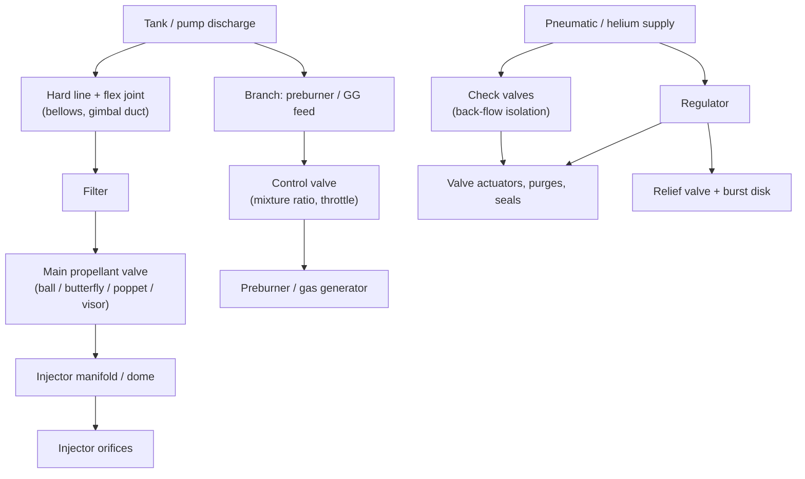

# Module 14 — Valves, Plumbing, and Engine Hardware
Part II · Prerequisites: modules 05, 12 · Estimated time: 8 h

Nobody puts the plumbing on the poster. The poster gets the nozzle, and if the marketing department is feeling technical, the turbopump. But look at what actually ends test campaigns. A main oxidiser valve that closed 40 ms early and left the chamber oxidiser-rich long enough to burn the injector face. A bellows in a gimbal duct that ran for eleven minutes of cumulative hot-fire and then shed a convolution because the flow was shedding vortices at 340 Hz and the shell mode was at 345 Hz. A B-nut on an instrumentation line, torqued correctly, on a joint that had been thermally cycled forty times and had relaxed. A check valve in a helium line that let a few grams of nitrogen tetroxide back upstream, where it sat until the next pressurisation drove it as a liquid slug into a titanium fitting, and the resulting explosion destroyed a crewed spacecraft on a test stand. Every one of those is a plumbing failure, and every one of them was, in retrospect, a component whose specification somebody wrote in an afternoon. This module is about the components that stand between the pump and the injector: what they are, what governs them, the five bits of physics that decide whether they work (flow coefficient, cavitation, water hammer, thermal contraction, material compatibility), and the specific ways they kill engines. Treat it as the most consequential unglamorous chapter in the course. [SP-8094], [SP-8097], [SP-8119] and [SP-8123] between them are several hundred pages of dry design criteria, and they were written because the alternative was writing more mishap reports.

---

## 1. Learning objectives

After this module you should be able to:

1. Derive the flow-coefficient definitions $C_v$ and $K_v$ from incompressible orifice flow, convert between them and to an equivalent $C_dA$ in SI, and size a main propellant valve to a stated pressure-drop budget.
2. Compute the cavitation index of a valve at a stated operating point, say whether it will cavitate, flash or run solid, and explain why the answer differs for a throttling valve and a full-open shutoff valve.
3. Derive the Joukowsky surge relation $\Delta p = \rho a \Delta v$ from a control volume moving with the pressure wave, compute the pipe wave speed including wall elasticity, and distinguish rapid from slow closure using the pipe period $2L/a$.
4. Size a valve closing schedule so the surge stays inside the line's proof pressure, and explain the interaction between surge, column separation and cavitation in a cryogenic line.
5. Compute the free contraction and the fully restrained load of a cryogenic line between fixed points, decide whether the line yields, buckles or survives, and specify the flexibility element that fixes it.
6. Select a valve type (ball, butterfly, poppet, visor, gate) and an actuation type (pneumatic, hydraulic, electromechanical, pyrotechnic) against requirements for response time, throttling, leakage, cycle life and fail-safe state, and defend the choice.
7. Reconstruct the reason for a start or shutdown sequence — fuel lead, oxidiser lead, ramp rates, valve overlap — from the combustion and thermal constraints it protects against.
8. Size a relief valve or burst disk for a stated single fault (regulator failed open), including the choked-flow relation and the set-point / reseat / accumulation stack-up.
9. Apply the manifold-to-orifice area rule quantitatively, and estimate the flow maldistribution a given manifold area produces.
10. State the material compatibility rules that actually get enforced — LOX cleanliness and impact sensitivity, titanium with oxidisers, hydrogen embrittlement, elastomers with MMH and with cryogens — and name the accident or the physics behind each.
11. Diagnose a bad instrumentation port from the data it produces: a lagged pressure trace, a thermocouple reading the wall, a Kulite with a recessed cavity ringing at its Helmholtz frequency.

---

## 2. Terminology

| term | symbol | SI unit | definition |
|---|---|---|---|
| Flow coefficient (US) | $C_v$ | — (US gpm at 1 psi) | Volumetric flow of 60 °F water in US gpm through the component at 1 psi pressure drop |
| Flow coefficient (metric) | $K_v$ | — (m³/h at 1 bar) | Volumetric flow of water in m³/h at 1 bar pressure drop; $C_v = 1.156\,K_v$ |
| Effective flow area | $C_dA$ | m² | Discharge coefficient times reference area; the SI-native flow-capacity measure |
| Discharge coefficient | $C_d$ | — | Actual mass flow divided by ideal one-dimensional flow at the same $\Delta p$ |
| Resistance (loss) coefficient | $K$ | — | $\Delta p / (\tfrac{1}{2}\rho v^2)$, referred to a stated reference velocity |
| Cavitation index | $\sigma$ | — | $(p_1 - p_v)/(p_1 - p_2)$; margin against vapour formation in a valve |
| Vapour pressure | $p_v$ | Pa | Saturation pressure of the liquid at its local temperature |
| Pressure wave speed | $a$ | m/s | Speed of a small pressure disturbance in the fluid–pipe system |
| Liquid bulk modulus | $K_f$ | Pa | $-V\,\partial p/\partial V$ of the liquid |
| Pipe period | $2L/a$ | s | Round-trip time of a pressure wave from valve to reflecting boundary and back |
| Joukowsky surge | $\Delta p_J$ | Pa | $\rho a \Delta v$; maximum surge for closure faster than the pipe period |
| Closure time | $t_c$ | s | Time from start of valve motion to full seat contact |
| Response time | $t_r$ | s | Command to a stated fraction of full stroke (state the fraction) |
| Cracking pressure | $p_{cr}$ | Pa | Differential at which a check or relief valve first passes flow |
| Reseat pressure | $p_{rs}$ | Pa | Falling pressure at which a relief valve closes and holds |
| Accumulation | — | Pa or % | Pressure rise above set point required for a relief valve to reach rated capacity |
| Maximum expected operating pressure | MEOP | Pa | Highest pressure in nominal service including transients |
| Maximum design pressure | MDP | Pa | Highest pressure achievable including a single credible fault |
| Droop | $\Delta p_{dr}$ | Pa | Fall in regulator outlet pressure from lockup to rated flow |
| Lockup | $p_{lock}$ | Pa | Regulator outlet pressure at zero flow after reseat |
| Internal leakage | $\dot V_{lk}$ | scc/s | Flow past a closed seat, referred to 273.15 K and 101 325 Pa |
| Manifold area ratio | $AR$ | — | Manifold cross-sectional area divided by total downstream orifice area |
| Bellows effective area | $A_{eff}$ | m² | Area on which internal pressure acts to produce axial thrust; based on mean convolution diameter |
| Squirm pressure | $p_{sq}$ | Pa | Internal pressure at which an unrestrained bellows buckles laterally |
| Convolution pitch | $q$ | m | Axial spacing of bellows convolutions |
| Strouhal number | $St$ | — | $f q / v$; governs vortex shedding off bellows convolutions |
| Coefficient of thermal expansion | $\bar\alpha$ | 1/K | Mean linear expansion coefficient over the stated temperature range |
| Free contraction | $\Delta L$ | m | $\bar\alpha L \Delta T$; unrestrained length change on chilldown |
| Restraint stress | $\sigma_r$ | Pa | $E\bar\alpha\Delta T$; stress in a fully restrained member |
| Euler buckling load | $P_{cr}$ | N | $\pi^2 EI/(KL)^2$; axial load at which a slender member bows |
| Hoop stress | $\sigma_\theta$ | Pa | $pD/(2t)$ for a thin-walled tube |
| Helmholtz frequency | $f_H$ | Hz | Resonant frequency of a cavity-and-neck pressure port |
| Geysering | — | — | Periodic violent expulsion of a cryogenic column by a rising vapour slug |
| Priming | — | — | Filling of an initially evacuated or gas-filled line with liquid propellant |

Symbols carried in from earlier modules: $\dot m$ (kg/s), $\rho$ (kg/m³), $p_c$ (Pa), $\Delta p_{inj}$ (Pa), $\varepsilon$, $\Gamma(\gamma)$, $g_0 = 9.80665$ m/s².

---

## 3. Theory

### 3.1 The plumbing is the engine's state machine

An engine at steady state is a fluid-mechanics problem. An engine starting or stopping is a *sequencing* problem, and the sequence is executed by valves. The chamber does not know what the controller commanded; it knows what arrived at the injector face and when. Every start-transient anomaly in the literature — hard start, spike, popping, burn-through, turbine overspeed, pump stall — reduces to one of two statements: something arrived in the wrong order, or something arrived at the wrong rate.

This has a design consequence students consistently underrate. The valve is not a device for admitting flow. It is a device for controlling the *time history* of flow, and its steady-state pressure drop is usually the least interesting thing about it. A main oxidiser valve whose full-open $\Delta p$ is 0.1 bar out of a 100 bar chamber pressure contributes 0.1 % to the pump head budget and essentially nothing to performance; but its opening profile between 20 % and 80 % of stroke, occupying perhaps 150 ms, determines whether the engine lights or detonates. [J] When you review a valve specification, read the stroke-versus-time requirement first and the $C_v$ second.

The fluid system of a large liquid engine, roughly in order of how much trouble each element causes per unit mass:

Note what the diagram does *not* show and what a real schematic does: every drain, every purge, every vent, every instrumentation tap, every bleed. On a large cryogenic engine the pneumatic and purge schematic is comparable in complexity to the propellant schematic, and it is the purge system that keeps the seals from icing and the interpropellant cavity from accumulating a combustible mixture.

### 3.2 Pressure drop and flow coefficient

#### 3.2.1 From orifice flow to $C_v$

Everything in this section descends from the incompressible orifice equation of Module 07. Apply Bernoulli between an upstream station where the velocity is negligible and the vena contracta, and lump every real effect — contraction, separation, non-uniformity, friction — into $C_d$:

$$\dot m = C_d A \sqrt{2\rho\,\Delta p}, \qquad Q = \frac{\dot m}{\rho} = C_d A \sqrt{\frac{2\Delta p}{\rho}}$$

> **Eq. 3.1** — variables: $\dot m$ mass flow (kg/s), $Q$ volumetric flow (m³/s), $C_d$ discharge coefficient (–), $A$ reference geometric area (m²), $\rho$ liquid density (kg/m³), $\Delta p$ pressure drop across the component (Pa). Meaning: a restriction converts pressure into kinetic energy, and the flow scales as the square root of the drop. Assumes: single-phase incompressible liquid, no cavitation, steady flow, $\Delta p$ measured between stations far enough from the restriction that the velocity heads are recovered or accounted for. Fails when: the fluid cavitates or flashes (flow chokes and becomes independent of downstream pressure, §3.3); when the fluid is a gas beyond the critical pressure ratio; or when the flow is transient on the timescale of the acoustic transit of the component.

$C_dA$ is the physically meaningful quantity: it has units of area, it adds in the obvious way for parallel paths, and it combines for series paths as

$$\frac{1}{(C_dA)_{tot}^2} = \sum_i \frac{1}{(C_dA)_i^2}$$

> **Eq. 3.2** — variables: $(C_dA)_i$ effective areas of components in series (m²). Meaning: series resistances add in *pressure drop* at fixed flow, and since $\Delta p \propto \dot m^2/(C_dA)^2$, the reciprocal squares add. Assumes: incompressible flow, no pressure-recovery interaction between adjacent components, each $C_d$ measured in a configuration resembling its installed one. Fails when: components are close-coupled so the downstream one sees a distorted profile (a valve immediately after an elbow can lose 20 % of its $C_d$), or when any component cavitates.

The valve industry does not speak in $C_dA$. It speaks in $C_v$, defined by a test: **$C_v$ is the flow of 60 °F water in US gallons per minute that the component passes at 1 psi differential.** So

$$C_v = Q_{[\mathrm{US\ gpm}]}\sqrt{\frac{SG}{\Delta p_{[\mathrm{psi}]}}}, \qquad K_v = Q_{[\mathrm{m^3/h}]}\sqrt{\frac{SG}{\Delta p_{[\mathrm{bar}]}}}$$

> **Eq. 3.3** — variables: $SG$ specific gravity relative to water at 60 °F ($\rho/999\ \mathrm{kg/m^3}$), $Q$ volumetric flow in the stated unit, $\Delta p$ in the stated unit. Meaning: a purely empirical capacity index, defined so the same number sizes any liquid by scaling with $\sqrt{SG}$. Assumes: fully turbulent, non-cavitating, incompressible flow, with the component in the standard straight-pipe test fixture. Fails when: the flow is laminar (very viscous propellant, small trim); when cavitation limits the flow; or when the installed piping differs from the test fixture — the honest correction is a piping-geometry factor $F_P$, which is where a lot of quiet error lives. [E]

The two are related by unit conversion alone:

$$C_v = 1.156\,K_v, \qquad K_v = 0.865\,C_v$$

and both map to an SI effective area:

$$C_dA = 1.698\times10^{-5}\,C_v = 1.963\times10^{-5}\,K_v \quad [\mathrm{m^2}]$$

> **Eq. 3.4** — derivation: equate Eq. 3.1's $Q = C_dA\sqrt{2\Delta p/\rho}$ with Eq. 3.3's $Q$ after unit conversion, giving $C_dA = K_v/\left(3600\sqrt{2\times10^5/999}\right)$. Meaning: a $C_v$ of 1000 is an effective area of 17.0 cm², about a 47 mm hole. Assumes: everything Eq. 3.1 and 3.3 assume. Fails: in the same places. **Use this to sanity-check vendor data** — if a quoted $C_v$ implies an effective area larger than the valve's own bore, the number is wrong or was measured with pressure recovery included.

A useful third form is the loss coefficient referred to line velocity, $K = \Delta p/(\tfrac12\rho v^2)$, because handbook values exist for every fitting:

| component | $K$ (referred to line velocity) | note |
|---|---|---|
| full-bore ball valve, open | 0.05–0.10 | essentially a piece of pipe |
| reduced-bore ball valve, open | 0.3–1.5 | depends strongly on bore ratio |
| butterfly valve, open | 0.2–0.6 | the disc is always in the flow |
| poppet valve, open | 2–10 | flow turns twice; this is the price of the geometry |
| visor/gate valve, open | 0.1–0.3 | clear bore when open |
| 90° long-radius elbow | 0.2–0.3 | |
| tee, flow through run | 0.2 | |
| tee, flow through branch | 1.0–1.4 | |
| sharp-edged entrance | 0.5 | |

[E] These are ranges from general fluid-mechanics practice; for flight hardware you measure your own, in your own installation, with your own fluid. [SP-8097] is explicit on this: valve $C_v$ measured on water and applied to LOX without a cavitation check has produced flight anomalies.

#### 3.2.2 Where the pressure-drop budget goes

For a pump-fed engine the feed-system budget is written backwards from the injector:

$$p_{pump,disch} = p_c + \Delta p_{inj} + \Delta p_{cool} + \Delta p_{valve} + \Delta p_{line} + \Delta p_{manifold} + \rho g h + \tfrac12\rho v^2$$

> **Eq. 3.5** — variables: all pressures in Pa; $\Delta p_{cool}$ the regenerative-jacket drop, $\rho g h$ static head (small in flight, not small on a test stand), $\tfrac12\rho v^2$ the dynamic head at the pump discharge station. Meaning: the pump must produce every one of these terms, and each one costs turbine power. Assumes: steady state, single-phase, one-dimensional. Fails: during transients, and in the coolant jacket wherever the fluid is supercritical and its density changes by a factor of three along the passage (Module 11).

Typical allocation for a 100 bar kerolox engine [E][J]:

| item | fraction of $p_c$ | comment |
|---|---|---|
| injector $\Delta p$ | 15–25 % | set by stability, not by hydraulics (Modules 07, 15) |
| regenerative jacket | 10–30 % | the biggest and least negotiable item |
| main valve, full open | 0.1–1 % | should be negligible; if it is not, the valve is wrong |
| lines and manifold | 2–5 % | |
| control/throttle valve | 3–15 % | *by design* — a throttle valve must have authority |

The main propellant valve is the item people over-design. A valve you can barely find in the budget is the correct outcome. The throttle valve is the opposite: it *must* dissipate pressure, because its control authority is exactly the pressure it is capable of throwing away.

### 3.3 Cavitation in valves

A valve accelerates liquid through its trim, so the static pressure at the vena contracta falls well below the downstream pressure. If it reaches $p_v$, vapour forms; the bubbles then collapse where pressure recovers, and the collapse is violent, local and repetitive. The standard non-dimensional group is the cavitation index

$$\sigma = \frac{p_1 - p_v}{p_1 - p_2}$$

> **Eq. 3.6** — variables: $p_1$ upstream static pressure (Pa), $p_2$ downstream static pressure (Pa), $p_v$ vapour pressure at the local liquid temperature (Pa). Meaning: the numerator is the available margin against boiling; the denominator is the pressure the valve is being asked to throw away. Large $\sigma$ is safe. Assumes: single-phase upstream, quasi-steady flow, and $p_v$ evaluated at the *actual* bulk temperature, which for a partially chilled line is not the tank temperature. Fails when: the liquid is near critical (LOX above ~50 bar, LH2 above ~13 bar) so surface tension collapses and the liquid/vapour distinction blurs; and for saturated propellants, where $p_1 - p_v \to 0$ by construction. Several definitions of $\sigma$ circulate — some use $(p_2-p_v)/(p_1-p_2)$, others the reciprocal. **State which you are using.** [E]

Practical thresholds, valve-dependent and to be confirmed by test [E][J]:

| $\sigma$ | regime | consequence |
|---|---|---|
| > 4 | no cavitation | design target for shutoff valves |
| 2–4 | incipient | audible, tolerable for short duration |
| 1.5–2 | constant cavitation | trim erosion in tens of minutes of running |
| 1–1.5 | damage | trim life measured in seconds to minutes |
| ≈ 1 | flashing / choked | flow no longer responds to $p_2$ |

Two consequences matter for engines.

**A cryogenic valve sits closer to cavitation than the same valve on water.** LOX at 90 K has $p_v \approx 1$ bar, so a pump-inlet line at 4 bar has only 3 bar of margin, and a heat leak that warms the liquid 3 K raises $p_v$ by roughly 0.4 bar. LH2 is worse: at 21 K, $p_v \approx 1$ bar and $dp_v/dT \approx 0.25$ bar/K, so a 2 K bulk rise eats half the margin. This is the same physics as pump NPSH (Module 12), and it is why the valve on the *suction* side is the one that cavitates.

**Cavitation in a valve is a choke, and a choke is a flow regulator you did not design.** Once the vena contracta reaches $p_v$, further reduction of $p_2$ does not increase flow: $\dot m \approx C_dA\sqrt{2\rho(p_1-p_v)}$. Module 07 makes the same point about injector orifices [Nurick76]. Sometimes this is exploited — a cavitating venturi is the classic passive flow limiter, immune to everything downstream, and it is used deliberately in gas-generator and small-thruster feeds. Most of the time it is a nasty surprise in a throttling valve, where the control loop finds that closing further does nothing until it closes a lot further, and then everything happens at once.

### 3.4 Water hammer: the Joukowsky surge

#### 3.4.1 Derivation

Take a line of constant area $A$ carrying liquid at velocity $v_0$, terminated by a valve. Close the valve instantaneously. The fluid adjacent to the valve stops; a compression wave propagates upstream at speed $a$ relative to the fluid, and behind it the fluid is at rest and at elevated pressure.

Work in the frame moving with the wave. In that frame the fluid approaches the wave at $a + v_0$ and leaves at $a$ (having come to rest in the lab frame, it moves at $a$ relative to the wave). For small density change the mass flux through the wave is $\rho a$ per unit area, so momentum conservation gives

$$p_2 - p_1 = \rho a\left[(a + v_0) - a\right] = \rho a v_0$$

and writing $\Delta v$ for the velocity *change* the valve imposes,

$$\Delta p_J = \rho\, a\, \Delta v$$

> **Eq. 3.7 (Joukowsky)** — variables: $\Delta p_J$ pressure rise at the valve (Pa), $\rho$ liquid density (kg/m³), $a$ pressure wave speed in the fluid–pipe system (m/s), $\Delta v$ change in mean line velocity (m/s). Meaning: stopping a liquid column converts its momentum into pressure through a wave, and the conversion factor is the acoustic impedance $\rho a$ — about $9.3\times10^5$ Pa per (m/s) for LOX in a thin steel line. Assumes: closure faster than the pipe period $2L/a$, rigid supports, no cavitation, no line friction, one-dimensional, small perturbation. Fails when: the reflected rarefaction would drive the pressure below $p_v$ — then the column separates, a vapour cavity forms, and its collapse produces a *second* surge that can exceed the first; when closure is slower than $2L/a$ (use Eq. 3.9); or when a large gas pocket is present, which cushions the event but makes it nonlinear.

The wave speed is *not* the acoustic speed of the free liquid, because the pipe wall stretches. For a thin-walled elastic pipe that is axially unrestrained (the usual rocket case, since bellows relieve axial restraint):

$$a = \frac{\sqrt{K_f/\rho}}{\sqrt{1 + \dfrac{K_f D}{E t}}}$$

> **Eq. 3.8 (Korteweg)** — variables: $K_f$ liquid bulk modulus (Pa), $\rho$ (kg/m³), $D$ pipe inside diameter (m), $E$ wall Young's modulus at the operating temperature (Pa), $t$ wall thickness (m). Meaning: the effective compressibility is the liquid's own plus the pipe's radial compliance in series; a thin, large-diameter, soft pipe slows the wave and reduces the surge. Assumes: thin wall ($D/t > 20$), linear elastic wall, axially unrestrained line, single-phase liquid. Fails when: the pipe is thick-walled or heavily reinforced (use the full Korteweg constraint factors); when the line is a bellows or a flexible hose (their radial compliance is enormous and $a$ can drop by half); or when even 0.1 % free gas is entrained, which can halve $a$ again.

Note the design lever hiding in Eq. 3.8: **flexible hose reduces water hammer.** That is a genuine, if secondary, reason flex sections appear where they do.

#### 3.4.2 Slow closure

If the valve takes longer than the pipe period $2L/a$ to close, the rarefaction reflected from the upstream reservoir returns and relieves the pressure before the valve is fully shut. To first order the peak surge is reduced in proportion:

$$\Delta p \approx \Delta p_J \cdot \frac{2L/a}{t_c} = \frac{2\rho L\,\Delta v}{t_c} \qquad (t_c > 2L/a)$$

> **Eq. 3.9 (Michaud / Allievi)** — variables: $L$ line length from valve to the nearest large-volume reflecting boundary (m), $t_c$ effective closure time (s). Meaning: for slow closure the surge is set by decelerating the *whole column* over $t_c$, i.e. $\rho L\,dv/dt$, with a factor 2 from the reflection bookkeeping. Assumes: linear valve closure characteristic in *flow* (not in stroke — see below), frictionless line, single reflecting boundary. Fails when: the valve's flow-versus-stroke characteristic is strongly nonlinear, which it always is — a ball valve passes most of its flow in the last 20 % of closure, so the *effective* $t_c$ can be a quarter of the mechanical stroke time. This is the most common error in surge analysis, and using the effective time is the conservative direction. [J]

Two engineering rules follow, and they are worth memorising:

- **Closure faster than the pipe period buys you nothing and costs you everything.** Below $t_c = 2L/a$ the surge is capped at $\Delta p_J$ and stops improving; above it, surge falls as $1/t_c$. The design target is always $t_c \gg 2L/a$, and the way to get there is to slow the *last* part of the stroke, where the flow actually changes.
- **The dangerous transient is often the opening, not the closing.** Priming an empty line (§3.17) drives a liquid front into a gas-filled volume; when that front hits a closed valve or a dead end it stops in millimetres, and the effective $\Delta v$ is the front velocity, which can be far higher than the steady-state line velocity. [SP-8097] treats this as a distinct load case, and it is the mechanism behind the Crew Dragon test-stand explosion discussed in §6.5.

### 3.5 Main propellant valves: the type choice

The main propellant valve (MPV, or MOV/MFV for oxidiser and fuel) is the largest, highest-consequence valve in the engine. Five architectures dominate.

**Ball valve.** A bored sphere rotated 90° between seats. Full-bore versions have essentially zero pressure drop when open ($K\approx0.06$), the seats are simple annular lands loaded by pressure and a spring, and the actuation torque is modest and roughly constant. Rotation makes the flow-versus-angle characteristic strongly nonlinear (approximately equal-percentage in the mid range), which is bad for throttling and very good for a start valve, because most of the opening stroke produces little flow and the ramp can therefore be shaped. **This is the dominant choice for large cryogenic engines** — all five of the RS-25's controlled valves are ball valves. [M]

**Butterfly valve.** A disc rotating on a diametral shaft. Lightest and most compact for a given line size, low open-position drop, but the disc sits permanently in the flow, and the aerodynamic torque on the disc is large and *reverses sign* with angle, which complicates actuator sizing and makes the valve want to slam. Sealing at cryogenic temperature requires either a metal seat with accepted leakage or a captured polymer seat. Common in medium-size lines and in prevalves at tank outlets.

**Poppet valve.** A plug that lifts off a seat, moving along the flow axis. The best sealing of any type — the seat load is direct and can be made as high as you like — and the flow-versus-lift characteristic is nearly linear at small lift, so it throttles well. The price is a high open-position $K$ (the flow turns twice) and an actuation force that scales with seat area times pressure, so it does not scale to large lines. Universal in small valves, control valves, check valves, relief valves and thruster valves; rare above about 50 mm.

**Visor (gate/blade) valve.** A flat plate or a cylinder segment that translates or swings across the bore. Full clear bore when open, so effectively no pressure drop, and the sealing surfaces are out of the flow when open. Heavier and slower than a ball valve, and sealing at high $\Delta p$ requires a wedge action or a pressure-energised seat. Used where a genuinely unobstructed bore matters.

**Pyrotechnic valve.** A single-use device: an explosive cartridge drives a ram that either shears a closure disc (normally closed) or shears a tube shut (normally open). Zero leakage in the closed state, no actuation power, no seat wear, no standby leakage over years. And it works once. See §6.4.

| type | open $K$ | throttles? | seals? | mass | speed | scales to large bore |
|---|---|---|---|---|---|---|
| ball, full bore | 0.05–0.10 | poorly | good with soft seat | medium | fast | yes |
| butterfly | 0.2–0.6 | fairly | fair | lowest | fast | yes |
| poppet | 2–10 | well | best | high per size | fast | no |
| visor/gate | 0.1–0.3 | no | fair to good | high | slow | yes |
| pyrotechnic | ~0.1 | no | perfect | low | ms | limited |

### 3.6 Actuation

The valve is one half of the problem; the operator is the other, and [SP-8090] is the volume that says so. Three families.

**Pneumatic.** Helium or nitrogen at 20–70 bar acting on a piston or diaphragm, usually with a spring return that defines the fail-safe state. Simple, light, fast, and it uses a fluid the vehicle already carries. It is also *soft*: gas is compressible, so the actuator is a spring in series with the load, position control is poor, and stroke time depends on supply pressure, on temperature, and on how much volume the pilot solenoid must fill and vent. Pneumatic actuation is therefore ideal for **two-position** valves and poor for modulating ones. The Merlin's main valves are pneumatically actuated [M]; so are essentially all main valves on smaller engines.

**Hydraulic.** An incompressible fluid at 100–350 bar acting on a piston, positioned by a servovalve inside a closed loop with a position transducer. Stiff, precise, high force density, and able to hold an intermediate position against a fluctuating load — exactly what a throttling engine needs. The costs are a hydraulic power supply, a hydraulic fluid inventory, and a whole second failure domain. The RS-25 uses hydraulic actuation on all five main valves, closed-loop from the engine controller. [M]

**Electromechanical.** A motor (usually brushless DC) driving a ball screw or harmonic drive. Modern, testable on the bench, no working fluid, arbitrary position profiles in software, and health monitoring for free from motor current. The costs are mass, power, and the need for an explicit fail-safe scheme, since the natural failure of a motor is "stays where it is". Increasingly the default for new engines; it is what lets a valve schedule be reprogrammed between tests rather than re-plumbed. [M][J]

**Solenoid** actuation (direct-acting or pilot-operated) is the small-valve case of electromechanical, treated in Module 30 for cold gas; the force scales as $(NI)^2/g^2$, which is why direct-acting solenoids do not scale past a few tens of millimetres of seat diameter without a pilot stage.

A fourth option is worth naming because it recurs: **propellant-actuated**. Use the engine's own high-pressure propellant as the working fluid, with a pilot solenoid, and delete a fluid system entirely. The Merlin does this for thrust vector control — TVC actuators run on RP-1 tapped from the pump's high-pressure side and returned to the low-pressure inlet, so there is no separate hydraulic fluid that can run out [_verify-liquid]. That precise failure — running out of hydraulic fluid — has ended other flights, and the fix here is architectural, not procedural.

**Response time** requires a definition before it means anything. State it as command-to-$X$-percent-stroke, and state whether the clock starts at the electrical command or at pilot-valve motion. A specification reading "opening time 250 ms" without those qualifiers is not a specification. Typical numbers [E]:

| valve class | response (10–90 % stroke) |
|---|---|
| small solenoid thruster valve | 2–10 ms |
| pneumatic pilot solenoid | 5–20 ms |
| large pneumatic main valve | 100–500 ms |
| hydraulic main valve, closed loop | 50–300 ms full stroke; bandwidth 5–20 Hz |
| electromechanical main valve | 100–500 ms, arbitrary profile |
| pyrotechnic valve | 3–15 ms |

### 3.7 Valve scheduling: start and shutdown

#### 3.7.1 What the schedule is protecting

Four constraints set every start sequence [F][J]:

1. **Do not accumulate unburned propellant.** A chamber that fills with a combustible mixture before ignition detonates on light. Hence: the ignition source is established *before* the main propellants arrive.
2. **Do not run the chamber or the turbine oxidiser-rich.** Metal burns in hot oxygen. Almost every engine therefore uses a **fuel lead** — fuel arrives first, so the transient mixture ratio sweeps from very fuel-rich toward nominal and never passes through oxidiser-rich. The exception proves the rule: an oxidiser lead is used where the oxidiser is the coolant or where the fuel is slow to arrive, and it is always a deliberate, defended choice.
3. **Do not overspeed the turbine or stall the pump.** In a pumped engine the discharge pressure at low speed is low, so the downstream valve must not be so far open that the pump runs out on its curve into stall or cavitation; and the turbine must not see a step of hot gas that spins it past its limit before the pump loads it.
4. **Do not thermally shock the hardware.** Cryogenic chilldown of a warm valve, pump and manifold takes seconds to minutes and must happen before liquid is demanded at rate.

Shutdown adds two more: purge the residual propellant out of the manifolds so it does not react, dribble or freeze; and close the valves in an order that leaves the chamber fuel-rich, not oxidiser-rich, on the way down. The classic shutdown fault is a fuel valve that closes first, leaving oxidiser flowing into a hot chamber for 100 ms — enough to torch the injector face.

#### 3.7.2 The RS-25's five valves

The RS-25 has five hydraulically actuated ball valves under closed-loop control from the engine controller, and the set is worth memorising because it is the canonical example of "the engine is its valve schedule" [M], [SSME-Orient], [Biggs89]:

| valve | function |
|---|---|
| **MFV** — main fuel valve | admits LH2 from the HPFTP to the coolant circuit and thence the injector |
| **MOV** — main oxidiser valve | admits LOX from the HPOTP main pump to the main injector |
| **FPOV** — fuel preburner oxidiser valve | meters LOX into the fuel preburner; **this is the throttle** |
| **OPOV** — oxidiser preburner oxidiser valve | meters LOX into the oxidiser preburner; **this trims mixture ratio** |
| **CCV** — chamber coolant valve | splits hydrogen between the chamber coolant circuit and the nozzle coolant circuit |

Two structural points about that list. First, **the two valves that control the engine in flight are not the main propellant valves.** Thrust is commanded through the FPOV, because opening it raises fuel-preburner power, spins the HPFTP faster, raises fuel flow and hence chamber pressure; mixture ratio is trimmed with the OPOV. The MFV and MOV are essentially on/off. That inversion — power control lives in the preburner oxidiser lines, not the main lines — is a general property of staged-combustion engines and is the reason their control problem is genuinely multivariable.

Second, the start is a *fuel-lead* start with staged valve motion: hydrogen flows well before ignition to chill the ducts and establish coolant flow; the augmented spark igniters are burning before any preburner oxidiser is admitted; and the preburner oxidiser valves are then ramped on a schedule that walks the turbomachinery up without overspeeding it or driving either preburner oxidiser-rich. The chamber coolant valve starts nearly open — maximum coolant flow into a cold, unfired chamber is harmless — and closes toward its run position as the chamber heats. The whole start occupies roughly five seconds, which for a machine that reaches 53 MW of fuel-turbine power [_verify-liquid] is a long, carefully shaped ramp, not a switch. [M]

*Caveat on numbers.* The millisecond-level valve schedule appears in several NASA and Rocketdyne documents with variations, because it differs by engine block, by power level, and by whether a ground start or a flight start is being described. Do not commit a specific table of times to memory or to a report; commit the *ordering* and the *reasons*, and read the schedule out of the document you have in hand. [SSME-Orient]

#### 3.7.3 Merlin, and the argument for simplicity

The Merlin 1D is a gas-generator kerolox engine with pneumatically actuated main valves, TEA-TEB pyrophoric ignition, and throttling from 40 % to 100 % [_verify-liquid]. It has no preburner, therefore no preburner oxidiser valves, therefore no multivariable control problem: throttle is a coordinated motion of the main valves and the gas-generator feed, and mixture ratio follows from the pump characteristics rather than being independently commanded. The comparison with the RS-25 is not "one is better" but "one has four independent control loops and one has roughly one", and the number of loops is set by the *cycle*, not by the valve technology. The consequence shows up in production: SpaceX builds hundreds of Merlins a year, and no complex hydraulic servo loop has to be qualified per engine.

There is a historical precedent for the same argument, from a program under a harder constraint. The Redstone A-7's real achievement was not performance — chamber pressure and expansion ratio barely moved from the V-2 — but a reduction of the pneumatic system **from 31 components to 10, by deleting check valves and consolidating regulators, relief and solenoid valves**, and that simplification is why the engine could be man-rated [_verify-liquid]. The number of things that can leak is a first-class design variable. [H]

### 3.8 Leakage

There is no such thing as a leak-free valve; there are leak rates and there are measurement thresholds. Quote leakage as a standard-condition volumetric rate of a stated gas at a stated differential and temperature, because that is what a mass spectrometer or a bubble meter actually reports:

| tier | internal leakage (He, scc/s at rated $\Delta p$) | where it is used |
|---|---|---|
| metal-to-metal, as-machined | $10^{0}$–$10^{2}$ | large cryogenic MPVs where downstream leakage is harmless |
| metal-to-metal, lapped | $10^{-2}$–$10^{0}$ | preburner and gas-generator valves |
| polymer seat (PTFE, PCTFE, Vespel) | $10^{-4}$–$10^{-2}$ | most engine valves, ambient and cryogenic |
| elastomer seat (fluorocarbon, EPDM) | $<10^{-5}$ | storable-propellant valves, warm service only |
| pyrotechnic / welded closure | $<10^{-8}$ | long-duration isolation |

[E][J] These are order-of-magnitude engineering practice; a program's actual allowables come from a system leak budget, exactly as in Module 30 §3.4.

Three things about leakage that people get wrong.

**Leakage is directional, and it matters which way.** A main oxidiser valve that weeps 1 scc/s of LOX into a chamber between firings is a nuisance. The same valve leaking oxidiser into an interpropellant cavity where fuel is also weeping is a bomb. This is why engines using hypergolic or high-energy propellant pairs use *interpropellant seals with an inert purge between them*: two seals in series with a vented, purged cavity, so that a leak of either propellant goes overboard rather than meeting the other.

**Cold changes everything.** An elastomer O-ring below its glass transition is not a seal; it is a plastic ring. Fluorocarbon (Viton) $T_g$ is around $-20$ °C, EPDM near $-50$ °C, silicone near $-100$ °C: none of them work at 90 K. Cryogenic static seals are therefore metal (C-seals, K-seals, spring-energised metal O-rings) or filled PTFE/PCTFE with a metal energiser, and the seal is made by *plastic deformation of a soft plating* — silver, gold or indium — on a hard substrate. The Challenger accident is the canonical case study in an O-ring stiffening past the point of resiliency at a temperature the design did not anticipate; the mechanism is joint rotation opening a gap faster than the ring could follow, and the ring's ability to follow is a strong function of temperature [Rogers86 ch. IV]. That is a solid-motor field joint, but the physics is identical to a cryogenic engine flange, and it is why every cryogenic seal specification carries a *temperature-dependent* resiliency requirement rather than a single squeeze number.

**A seat that has been through one contamination event is never the same again.** Particles under a seat plastically indent it, and the leak rate after the particle has been flushed away is permanently higher. This is the reason for filters immediately upstream of every valve that must seal (typically 10–40 μm absolute for engine service, finer for pilot stages), and the reason that a valve which has been leak-checked, flown and returned is re-checked rather than assumed good.

### 3.9 Check valves

A check valve permits flow one way and blocks the other, using no external power. The usual forms are a spring-loaded poppet, a swing flapper, or a lift disc.

**Cracking pressure** is the forward differential at which flow starts, set by the spring preload divided by the seat area plus any seal friction. It should be low enough not to matter in service and high enough that the valve is decisively shut when it should be. Typical 0.1–1 bar for engine service [E].

**Chatter** is the characteristic failure mode. A check valve is a mass on a spring with a fluid force that depends on flow, and the fluid force at low flow is *not monotonic*: the poppet lifts, the flow area increases, the local pressure recovers, the poppet drops, the flow re-accelerates, and the valve oscillates at its mechanical natural frequency — hundreds of hertz — hammering the seat. Symptoms: audible buzz, rapid seat wear, and a leak rate that climbs test by test. Fixes, in order of preference [J]: (a) size the valve so that at *minimum* system flow the poppet is fully lifted against its stop rather than floating — an oversized check valve is the usual cause of chatter, not an undersized one; (b) add damping, e.g. a dashpot orifice behind the poppet; (c) raise the spring rate so the equilibrium lift is stiffer; (d) accept a higher cracking pressure.

**Check valves are also the classic single-point contamination path between fluid systems**, and this is the failure that matters most in this module. A check valve in a helium pressurisation line into a propellant tank has propellant on one side and helium on the other, and it is *expected* to seal against a differential that reverses. Give it a particle, or a slightly out-of-round seat, and propellant vapour — then liquid — migrates upstream into the helium plumbing, where nobody is looking for it. The Crew Dragon static-fire explosion of April 2019 is exactly this: nitrogen tetroxide leaked past a check valve into a helium line, and the ensuing event destroyed the vehicle [_verify-liquid]. The publicly reported ignition mechanism is that a slug of the leaked NTO was driven at high velocity into a titanium component during pressurisation, and titanium in contact with NTO under impact is a known ignition pair (§3.18). The reported corrective action was to replace the check valves with **burst disks** — that is, to replace a component that seals with a component that cannot leak because it is a solid metal wall until the moment it is destroyed. [M] Whether or not every detail of the mechanism is confirmed in public documents, the design lesson is unambiguous and general: *a check valve is not an isolation device.* If you require isolation between two fluids, use a barrier, not a seat.

### 3.10 Control valves

**Flow control valves** modulate a flow to a commanded value. What makes them different from shutoff valves is that their *characteristic* — flow versus stroke — is a designed quantity. Linear trim gives constant gain and is used inside a tight control loop; equal-percentage trim gives constant *fractional* gain and is used where the valve must work over a wide range of flows. A ball valve has an approximately equal-percentage characteristic by accident of geometry, which is why it throttles acceptably in the middle of its range and terribly near the ends.

The loop gain of the valve is what matters: $\partial \dot m/\partial x$ at the operating point. If the valve is sized so that at nominal flow it is 90 % open, its gain there is nearly zero and the loop will hunt. **Sizing rule [E][J]: a modulating valve should sit between 25 % and 75 % of stroke at every commanded operating point, and should take at least 25–30 % of the circuit's total pressure drop at nominal flow.** A valve with 5 % of the circuit drop has almost no authority: closing it just shifts the drop elsewhere and barely changes the flow.

**Mixture-ratio control.** Two very different implementations, worth contrasting:

- *Gas generator / preburner oxidiser valve.* Metering oxidiser into the gas generator sets the GG mixture ratio and hence the turbine inlet temperature — which is the quantity you are actually protecting, since a fuel-rich GG at MR 0.3 runs at around 900 K and at MR 0.5 runs at around 1400 K and destroys the turbine. On the RS-25 the OPOV does this job for the oxidiser preburner. The gain is brutal: a few percent change in oxidiser flow moves turbine inlet temperature by hundreds of kelvin, so the valve's resolution requirement is severe and its failure modes are all thermal. [SP-8081]
- *Propellant utilisation valve.* The J-2 carried a PU valve that shifted engine mixture ratio between **4.5:1 and 5.5:1**, trading thrust (780–1000 kN) against $I_{sp}$, used both to burn the tanks dry simultaneously and to manage S-II acceleration [_verify-liquid]. This is a slow, outer-loop, vehicle-level function rather than an engine-protection function, and it is implemented as a bypass around the oxidiser pump discharge rather than as a valve in the main line — because moving 5 % of the flow is enough, and a small valve in a bypass is far cheaper than a large valve in the main line. That trick — **control the small stream, not the big one** — is worth generalising.

**Throttle valves.** Deep throttling is a system problem (Module 13), but the valve requirement is specific: authority over the full range; no cavitation at the maximum $\Delta p$ point, which is the *low*-flow end where the valve is nearly shut and $\sigma$ collapses; and a characteristic that keeps the loop gain roughly constant. The reason deep throttling so often uses a *variable-area injector* instead — the pintle of the LM descent engine, which held injection velocity roughly constant across a 10:1 chamber-pressure turndown [_verify-liquid] — is that a throttle valve upstream of a fixed injector must be able to dissipate enormous pressure at low flow, and at those conditions it will cavitate.

### 3.11 Regulators

A pressure regulator is a valve with an internal feedback loop: outlet pressure acts on a sensing element (diaphragm, piston or bellows) against a reference (a spring, or a gas-filled dome), and the resulting force balance positions the poppet. [SP-8080] is the reference.

**Force balance.** For a spring-loaded regulator with sensing area $A_s$, seat area $A_{seat}$, spring preload $F_0$ and rate $k$:

$$p_{out}A_s = F_0 - kx + p_{in}A_{seat} + F_{flow}(x)$$

> **Eq. 3.10** — variables: $x$ poppet lift (m), $F_{flow}$ the Bernoulli/jet reaction force on the poppet (N), other symbols as above. Meaning: the regulator holds outlet pressure by trading spring force against sensing force; opening the poppet compresses the spring, which *lowers* the equilibrium outlet pressure. Assumes: quasi-steady operation, no friction, incompressible or slowly varying flow. Fails when: the flow-force term becomes comparable to the spring term (large lift, high $\Delta p$); when friction and stiction dominate at small motions; or when the poppet dynamics couple with the downstream volume to produce oscillation.

**Droop** is the direct consequence of the $-kx$ term: to pass more flow the poppet must lift, which compresses the spring, which lowers the outlet pressure it will hold. Droop from lockup to rated flow is typically 5–15 % of set point for a spring-loaded regulator [E]. It is not a defect; it is the loop gain being finite. It matters because a pressurised feed system sized at lockup will under-deliver at flow, and one sized at flow will over-pressurise at lockup.

**The dome-loaded regulator** replaces the spring with a trapped gas volume. Because the dome gas has a very low effective rate (it is a large volume of gas, not a stiff spring), the $kx$ term nearly vanishes and droop collapses to 1–3 % [E]. The costs are a dome that must be charged and that leaks slowly, and a temperature sensitivity: dome pressure follows dome temperature, so the set point drifts with ambient. For high-flow, tight-tolerance service — large pressure-fed stages, test-stand supplies — the dome-loaded architecture wins anyway.

**Lockup and creep.** Lockup is the outlet pressure at zero flow after the regulator has reseated; it is above set point because the poppet must close hard enough to seal. Creep is the slow rise of outlet pressure at zero flow caused by seat leakage. Creep is the reason a regulator alone is never adequate protection for a downstream volume: given time, any regulator with a leaking seat will bring that volume to full supply pressure. **Every regulated volume needs relief protection, always.** [SP-8080]

**Regulator chatter** is the same physics as check-valve chatter: the poppet, its spring, the sensing element and the downstream volume form an oscillator, and if the loop gain is high enough at the resonant frequency it will limit-cycle. Symptoms are a buzzing regulator and a downstream pressure trace with a few-percent ripple at 50–500 Hz. Fixes: add downstream volume, add damping, reduce sensing area, or introduce a deliberate restriction to decouple the regulator from the load.

### 3.12 Relief valves and burst disks

**Relief valve.** A spring-loaded poppet that opens on overpressure and recloses. Three pressures define it: **set (cracking)**, at which it first flows; **full-flow**, at which it passes its rated capacity, typically 10 % above set (the "accumulation"); and **reseat (blowdown)**, at which it recloses, typically 5–15 % below set. The blowdown hysteresis is deliberate — a relief valve that recloses at exactly its set pressure will chatter itself to destruction — and it is a system cost, because the system is depressurised to the reseat pressure every time the valve operates.

**Burst disk.** A machined or scored metal diaphragm that ruptures at a design pressure. Zero leakage until it operates, no moving parts, very high flow capacity per unit mass, and no reseat: once it opens, the system is vented and the mission is over. Burst pressure tolerance is typically ±5 % for a good disk at a controlled temperature, and it *degrades with pressure cycling and with temperature*, so the specification must account for service history.

**The set-point stack-up** is where the engineering lives, and it is arithmetic people get wrong in both directions:

$$\mathrm{MDP} \ \ge\ p_{burst,max} \ =\ p_{burst,nom}(1+\tau) \ \ge\ \mathrm{MEOP}\,\frac{(1+\tau)}{(1-\tau)}$$

> **Eq. 3.11** — variables: $\tau$ the fractional tolerance on burst or relief set pressure, MEOP the highest nominal operating pressure, MDP the pressure the structure must be qualified to. Meaning: the disk must never open in nominal service (so its *minimum* burst is above MEOP) and the structure must survive its *maximum* burst. Assumes: symmetric tolerance band, same at hot and cold. Fails when: temperature shifts the burst pressure (it does), or when the disk has been pressure-cycled toward fatigue. With $\tau = 5\%$ this gives MDP $\ge$ 1.105 MEOP — the origin of the familiar "a burst disk costs you 10 % of your structural margin" rule. [E]

Combining both is standard practice and is the right answer for most systems: a **relief valve** to handle small, recoverable excursions (a thermal soak, a regulator with slight creep) without losing the mission, backed by a **burst disk** at a higher setting as the non-negotiable structural protection. The usual arrangement is parallel; putting a disk downstream of a relief valve requires you to have thought hard about the interaction.

**Sizing.** The governing case is almost always **regulator failed full open**, because that connects the full supply pressure to a volume rated for a fraction of it. The relief path must pass the entire flow the failed regulator can deliver, at a pressure no higher than the accumulation limit. For a gas this is a choked-flow problem:

$$\dot m = \Gamma(\gamma)\,\frac{C_dA\, p_0}{\sqrt{R T_0}}, \qquad \Gamma(\gamma) = \sqrt{\gamma}\left(\frac{2}{\gamma+1}\right)^{\frac{\gamma+1}{2(\gamma-1)}}$$

> **Eq. 3.12** — variables: $p_0$, $T_0$ stagnation pressure (Pa) and temperature (K) upstream of the throat, $R$ specific gas constant (J/kg·K), $C_dA$ effective throat area (m²). Meaning: a choked orifice passes mass in proportion to upstream pressure and inversely to $\sqrt{T_0}$; nothing downstream matters. Assumes: pressure ratio above critical (2.05 for helium, 1.89 for nitrogen), calorically perfect gas, adiabatic flow. Fails when: real-gas effects matter (helium at 25 MPa and 300 K has $Z\approx1.13$, so the ideal-gas mass flow is a few percent optimistic), or when the flow is not choked.

Because both the failed regulator and the relief valve are choked orifices fed by (different) stagnation states, the required area ratio has a clean closed form, which is the useful takeaway of §5 WE4:

$$\frac{(C_dA)_{relief}}{(C_dA)_{reg}} = \frac{p_{supply}}{p_{relief}}\sqrt{\frac{T_{relief}}{T_{supply}}}$$

> **Eq. 3.13** — meaning: **the relief valve must be bigger than the failed regulator's seat by roughly the pressure ratio it is protecting against.** Assumes: both flows choked, same gas, $C_d$ absorbed into each area. Fails when: the relief valve is not choked (low set pressures near ambient), or when the regulator's failure mode is a partial rather than a full opening — which is *not* conservative to assume, so use full open.

Equation 3.13 explains a design pattern you will see repeatedly: rather than carry an enormous relief valve, systems use **series-redundant regulators** — so that a single regulator failure does not connect supply to load — plus a modest relief valve sized for creep and thermal cases, plus a burst disk as the structural backstop. It is cheaper in mass to make the fault less credible than to relieve it.

### 3.13 Manifolds

The manifold's job is to take one incoming stream and distribute it to hundreds of injector orifices with an acceptable spread. The physics is one line long: **the manifold's own velocity head is an error in the injector's pressure drop.**

Consider a manifold of cross-sectional area $A_m$ feeding orifices of total area $\sum A_{or}$. Fluid entering at the inlet has velocity $v_m$ and dynamic head $\tfrac12\rho v_m^2$; at the far (dead) end that dynamic head has been recovered as static pressure. So the orifices at the dead end see up to $\tfrac12\rho v_m^2$ more driving pressure than those at the inlet. Since $\dot m_{or}\propto\sqrt{\Delta p}$,

$$\frac{\delta \dot m}{\dot m}\ \approx\ \frac12\frac{\tfrac12\rho v_m^2}{\Delta p_{inj}}\ =\ \frac{C_d^2}{2}\left(\frac{\sum A_{or}}{A_m}\right)^{2}\ =\ \frac{C_d^2}{2\,AR^2}$$

> **Eq. 3.14** — variables: $AR = A_m/\sum A_{or}$ the manifold area ratio, $C_d$ the orifice discharge coefficient, $\delta\dot m/\dot m$ the fractional spread in per-orifice flow between the dead end and the inlet. Derivation: substitute $v_m = C_d(\sum A_{or}/A_m)\sqrt{2\Delta p/\rho}$ from continuity into the dynamic head, then take half of the fractional pressure error because flow goes as $\sqrt{\Delta p}$. Assumes: full stagnation recovery at the dead end, none at the inlet, a one-dimensional manifold, uniform orifices. Fails when: the manifold is an annulus fed tangentially (there is then a swirl component and the problem is two-dimensional); when the manifold is short compared with its own diameter; or when the flow separates off the inlet.

With $C_d = 0.8$:

| $AR = A_m/\sum A_{or}$ | maldistribution |
|---|---|
| 2 | 8.0 % |
| 3 | 3.6 % |
| 4 | 2.0 % |
| 6 | 0.9 % |
| 8 | 0.5 % |

**This is the origin of the design rule "make the manifold at least four times the total orifice area."** [E] It is not a rule of thumb from nowhere; it is Eq. 3.14 evaluated at a 2 % target, and 2 % is chosen because it is comfortably below the mixture-ratio spread that produces a measurable $c^*$ loss or a hot streak. If you need better than 2 %, the correct fix is not a bigger manifold — it is a manifold with **two inlets on opposite sides**, which halves the effective flow length and quarters the dynamic head at the worst orifice, or a **tapered manifold** whose area falls along its length to hold velocity constant.

The other manifold failure mode is thermal, not hydraulic: a large LOX dome is a large thermal mass in contact with a hot injector face, and the dome's chilldown transient determines when the engine can be started after a hold. And a manifold with a dead leg is a place for gas to be trapped during priming, which produces exactly the transient of §3.4.2.

### 3.14 Flexible connections: bellows, flex hoses and gimbal joints

An engine that gimbals must have propellant ducts that accommodate angular motion under full pressure and full flow, thousands of times, at cryogenic temperature. A line between two structures at different temperatures must accommodate their relative motion. Both jobs are done by **bellows**: thin-walled, multi-ply, hydroformed or edge-welded convoluted shells. [SP-8123] is the volume.

**Effective area and pressure thrust.** A pressurised bellows pushes its ends apart with a force $pA_{eff}$, where $A_{eff}$ is based on the *mean* convolution diameter — roughly midway between root and crest. For a 100 mm line at 4 bar this is already ~3.5 kN; for a 250 mm gimbal duct at 40 bar it is ~200 kN. **Unless that force is reacted, the bellows will extend until it fails.** The reaction is provided by external tie rods, by a gimbal ring, or by a *balanced* (pressure-compensated) design with a second bellows in the opposite sense. Every large engine gimbal duct — the F-1's, the RS-25's — is a pressure-balanced or externally restrained assembly for this reason, not a bare bellows. [F]

**Squirm.** An unrestrained bellows under internal pressure is a column under compression: the pressure thrust acts as an axial load and the convolutions provide the bending stiffness. When the load exceeds the Euler load of the equivalent column, the bellows buckles laterally — "squirms" — and the convolutions on the inside of the bow are crushed:

$$p_{sq}\ \approx\ \frac{\pi^2 (EI)_{eq}}{(KL)^2\,A_{eff}}$$

> **Eq. 3.15** — variables: $(EI)_{eq}$ the equivalent bending stiffness of the convoluted shell (N·m²), $L$ the bellows live length (m), $K$ the end-fixity factor (1.0 pinned–pinned, 0.5 fixed–fixed), $A_{eff}$ the pressure-effective area (m²). Meaning: squirm is Euler buckling with the pressure thrust as the load. Assumes: symmetric convolutions, no lateral offset, no external axial load. Fails when: the bellows is already offset or angulated — any initial imperfection lowers the squirm pressure sharply — or when the convolutions are unequal, since a single soft convolution localises the deformation and produces *in-plane* squirm at much lower pressure. **The practical design rule: keep the live length short.** A long flexible bellows is a bad bellows; get flexibility from more, shallower convolutions or from a gimbal ring, not from length. [SP-8123]

**Fatigue.** Bellows convolutions work in bending, and the meridional bending stress at the convolution root is high by construction — that is what makes them flexible. Cycle life is therefore finite and strongly nonlinear in deflection per convolution: halving the deflection per convolution can multiply life by an order of magnitude. Standard practice is to design to a stated number of cycles with a large factor (4× on life, or 2× on deflection), to use **multi-ply** construction (several thin plies rather than one thick one, because bending stress scales with ply thickness), and to count *every* cycle, including chilldown cycles, proof cycles and shipping. Failure is a through-crack at a convolution root, usually starting at a weld or a forming defect, and the symptom is a slow external leak that appears after a specific number of cycles rather than on a specific test.

**Flow-induced vibration.** This is the mechanism that produces the failures people remember. Flow past the convolutions sheds vortices at $f_s = St\,v/q$, where $q$ is the convolution pitch and $St\approx0.2$–$0.5$. If $f_s$ coincides with one of the bellows' shell or beam modes, the bellows resonates, and because the excitation is broadband and self-sustaining the amplitude builds until the convolution root cracks — often within seconds to minutes of running. It is the classic "the part passed its fatigue qualification and then failed in three minutes of hot fire" story, because the qualification counted gimbal cycles and the flow put in a million cycles a minute.

$$f_s = St\,\frac{v}{q}$$

> **Eq. 3.16** — variables: $f_s$ shedding frequency (Hz), $St$ Strouhal number (–), $v$ mean flow velocity (m/s), $q$ convolution pitch (m). Meaning: the convolutions are a periodic cavity array and the shear layer over them oscillates at a frequency set by pitch and velocity. Assumes: fully developed turbulent flow, no internal liner. Fails when: an internal liner (a smooth sleeve inside the bellows) is fitted — which is precisely the fix, because it removes the flow from the convolutions altogether. [SP-8123]

The three fixes, in order: **fit an internal flow liner** (standard for any bellows in a high-velocity propellant line — this is why gimbal ducts have sleeves); detune by changing pitch or ply thickness; or reduce velocity by enlarging the duct.

*On attribution.* [SP-8123] exists because flow-induced-vibration and fatigue failures of bellows occurred in US launch-vehicle programmes in the 1960s and 1970s and were expensive enough to justify a design-criteria monograph. Specific vehicle-by-vehicle attributions circulate in the secondary literature; they are not reproduced here, because the primary documents were not read for this course and because the mechanism is what matters. Read [SP-8123] §2 for the case histories in the form NASA actually published them.

**Flexible hoses** — braided wire over a bellows, or convoluted PTFE — solve the same problem with more compliance and less life. The braid carries the pressure thrust; that is its function, not abrasion protection, and a hose whose braid is damaged is a hose that will extend and burst. Never use a hose to correct a misalignment: a hose installed with a permanent offset spends its whole life having already consumed part of its fatigue allowance.

### 3.15 Seals

**Static seals** close a joint that does not move. Ranked by capability:

- **Elastomer O-ring.** Cheapest, best sealing, easiest to install, and limited to roughly $-50$ °C to $+200$ °C depending on compound. Fails by *extrusion* into the clearance gap when pressure is high and the gap is large — the fix is a hard PTFE anti-extrusion backup ring on the low-pressure side and a tight diametral clearance. Fails by *compression set* after long static loading at temperature. Fails by *loss of resiliency* at low temperature, which is the Challenger mechanism [Rogers86]. Fails by *explosive decompression* if it has absorbed high-pressure gas that then expands inside it — a real issue for helium-side seals.
- **Filled PTFE / PCTFE seat and seal.** Works cryogenically, cold-flows under sustained load, and therefore needs a metal energiser (a canted coil spring or an internal C-spring) to maintain contact as it creeps.
- **Metal C-seal / K-seal / E-seal.** A thin-walled formed metal ring, usually Inconel 718, plated with silver, gold or indium. The spring-back of the section maintains contact and the soft plating conforms to the surface finish. This is *the* cryogenic and high-temperature static seal. It requires an excellent flange surface finish (typically 0.8 μm Ra or better), a controlled bolt load, and a groove machined to the seal maker's tolerance; it is unforgiving of flange rotation.
- **Welded or brazed joint.** Not a seal at all — a continuous pressure boundary. Zero leakage, infinite life, no maintenance, and no way to disassemble without a saw.

**Dynamic seals** close around something that moves.

- **Lip seals** (elastomer or PTFE) for reciprocating shafts and actuator rods; pressure-energised, so they seal better as pressure rises, and they fail by extrusion and by lip wear.
- **Face seals** (a stationary carbon or metal ring loaded against a rotating flat) for turbopump shafts — high sealing capability, but they run with a fluid film, generate heat, and are the component that most often defines turbopump overhaul life.
- **Labyrinth seals** — a series of close-clearance teeth that dissipate pressure by repeated expansion into cavities. They *do not seal*; they throttle. Non-contacting and therefore of essentially infinite life, which is why turbomachinery uses them. Leakage is proportional to clearance and falls with the number of teeth.
- **Purge (buffer) seals.** The essential turbopump architecture: between the oxidiser-side seal and the fuel-side seal, a cavity is fed with inert gas (helium or nitrogen) at a pressure *above* both propellant pressures, so that any leakage is inert gas into the propellant and never propellant into the interpropellant cavity. If the purge fails, the pump has fuel and oxidiser meeting in a confined space with a spinning shaft in it. **Loss of purge pressure is a mandatory abort condition, and the purge pressure switch is one of the small number of true redlines on a cryogenic engine.** [M]

### 3.16 Fittings, tubing and routing

**Threaded fittings** are the AN/MS flare family and their descendants: a 37° flared tube end compressed between a fitting nose and a sleeve by a B-nut. They are demountable, they work over a wide temperature range, and every one of them is a leak path whose sealing depends on installation torque, on the flare's concentricity, and on how many times the joint has been made and broken. They also *relax*: thermal cycling and vibration reduce the preload, which is why flight systems torque-stripe every B-nut and re-check after thermal cycling. Higher-integrity demountable joints (the dynamic-beam-seal families, and machined-boss O-ring fittings) improve on the flare, but they are still joints.

**Welded and brazed joints** — orbital-welded tube butts, brazed sleeves — remove the leak path entirely at the cost of removing the ability to disassemble. **Flight engines weld** wherever they can, and use flanges with metal seals only where a component must be removable for maintenance or where dissimilar materials meet. The rule of thumb is uncomfortable and correct [J]: *every demountable joint is a scheduled leak, so put them where you can inspect them and nowhere else.* Test stands, which are rebuilt constantly, go the other way and are full of flare fittings — which is why test stands leak and flight hardware does not, and why "it passed on the stand" is not evidence about the flight configuration.

**Tubing wall sizing** is thin-wall hoop stress:

$$\sigma_\theta = \frac{p D}{2t} \quad\Rightarrow\quad t \ge \frac{p_{MDP}\,D\,\mathrm{FS}}{2\,\sigma_{allow}}$$

> **Eq. 3.17** — variables: $p$ internal pressure (Pa), $D$ inside diameter (m), $t$ wall thickness (m), FS factor of safety, $\sigma_{allow}$ material allowable at temperature (Pa). Meaning: for a thin cylinder the hoop stress is twice the axial, so hoop governs. Assumes: $D/t > 10$, no bending, no external pressure, no stress concentration. Fails when: the tube is bent (the outer wall thins and the inner wall wrinkles — hence minimum bend-radius rules); at fittings and welds (apply a weld efficiency factor); and under external pressure or vacuum-jacket collapse, which is a *buckling* problem, not a strength problem. Factors of safety follow [STD-5001] and the applicable pressure-system standard; 1.5 on yield and 2.5 on ultimate for lines is representative, with 4.0 for hoses.

**Bend radius.** Minimum centreline bend radius is typically $3D$ for hard tube, sometimes $2D$ with mandrel bending — below that, ovality and outer-wall thinning become significant and the bend becomes the weak point. Bends are also where the wall thins *and* where the flow load is highest, so they are where erosion and vibration cracking start.

**Routing** is where thermal contraction is designed for. Three rules [J]:

1. Never run a hard line straight between two fixed points at different temperatures. Put in at least one out-of-plane offset (an expansion loop), or a bellows, or a slip joint.
2. Anchor the line at exactly one point and *guide* it elsewhere. Two anchors on the same run is how you get §5 WE3.
3. Support spacing is set by the line's natural frequency, not by its weight. A cryogenic line whose first bending mode sits inside the vehicle's vibration environment will fatigue at a bracket. Push the first mode above the environment, typically targeting > 100 Hz for engine-mounted lines. [E]

### 3.17 Chilldown, priming and geysering

**Chilldown** is the process of cooling a warm line, valve and pump to cryogenic temperature by flowing propellant through them and dumping the resulting two-phase mixture overboard. Physically it is a boiling-heat-transfer problem that walks backwards through the boiling curve: film boiling at first (poor heat transfer, a vapour blanket, the wall barely cools), then transition, then nucleate boiling (excellent heat transfer, the wall cools fast), then single-phase liquid. The consequence for the plumbing is that chilldown is *slow at first and then sudden*, and the thermal-shock loads occur at the end, not the beginning. Design consequences: bleed and recirculation lines and their valves, a chilldown flowrate specification, and a temperature sensor at the *pump inlet* that gates the start permissive.

**Priming** is filling a line that contains gas. The liquid front accelerates into the gas-filled volume, and when it arrives at a closed valve or a dead end it stops in millimetres, producing the surge of §3.4 with $\Delta v$ equal to the front velocity — which can be several times the steady-state line velocity because nothing was resisting the front. For storable-propellant spacecraft this is the standard "priming surge" analysis, and it routinely produces peaks of tens of bar in lines whose operating pressure is a few bar. Mitigations: prime through a deliberately restricted orifice; prime with a partially open valve; prime against a gas cushion; or accept the surge and design the line for it. **Never prime a line by snapping open a fast valve at the upstream end into an evacuated volume.**

**Geysering** is a cryogenic-specific instability in a long vertical line. Heat leak boils liquid low in the line; the vapour forms a slug; the slug rises, and as it rises the static head above it falls, so it expands, so it rises faster — and it eventually expels the liquid column above it violently out of the top. The line then refills, and the returning liquid column slams down onto the closed valve or the pump inlet, producing a large water-hammer event. The cycle repeats with a period of tens of seconds. Geysering has damaged real vehicles, and the standard fixes are **recirculation** (a small continuous flow that removes the heat before a slug can form), **helium injection** at the bottom of the line (which creates a continuous bubble flow and prevents slug formation), and **insulation**. Any long vertical LOX or LH2 downcomer needs an explicit anti-geysering provision. [E]

### 3.18 Material compatibility and cleanliness

This section is a set of hard rules. Each one exists because of a specific accident or a specific test result.

**LOX cleanliness.** Liquid oxygen plus almost any hydrocarbon plus an ignition source (mechanical impact, adiabatic compression of trapped gas, friction, particle impingement) is an explosion. LOX systems are therefore cleaned to a written specification — degreased, precision-cleaned, verified by a solvent-rinse particle count and a non-volatile-residue (NVR) measurement typically in the single mg/ft² class — and then sealed and kept clean. There is no "clean enough for a first test". [M]

**Adiabatic compression** is the ignition source people forget. Snapping open a valve into a dead-ended oxygen line compresses the trapped gas; from 1 bar and 293 K to 200 bar the ideal adiabatic temperature is

$$T_2 = T_1\left(\frac{p_2}{p_1}\right)^{(\gamma-1)/\gamma} = 293\times200^{0.286} \approx 1300\ \mathrm{K}$$

which will ignite any contaminant and several metals. **This is why oxygen valves are opened slowly**, and why a "slow-open" requirement appears on GOX system valves that has nothing to do with water hammer.

**Impact sensitivity.** Materials for LOX/GOX service are qualified by mechanical-impact testing — a striker is dropped on a sample immersed in LOX and reactions are counted. The outcomes are stark:

- **Never use titanium or titanium alloys in oxygen service, at any temperature or pressure.** Titanium ignites on impact in LOX essentially every time, and once ignited it burns. The same prohibition applies to titanium with **nitrogen tetroxide**, where the additional mechanism is stress-corrosion cracking that has been the subject of extensive spacecraft-propulsion work.
- **Aluminium** is acceptable in LOX at moderate velocities and is used widely for LOX tanks — but aluminium *burns* in oxygen once ignited, and particle-impingement ignition is credible at high gas velocities, so aluminium is avoided in high-velocity GOX passages.
- **Stainless steels (304L, 316L, 321), nickel alloys (Inconel 718, Monel) and copper alloys** are the workhorses. **Monel and copper are the best**, which is why GOX regulator trim and high-velocity oxygen components are so often Monel.
- **Fluoropolymers (PTFE, PCTFE/Kel-F, Vespel)** are the acceptable non-metals. Most other polymers, all hydrocarbon greases and all ordinary lubricants are not. LOX-service threads get a fluorinated lubricant (Krytox class) or nothing.

**Nitrogen tetroxide and iron nitrate.** NTO containing water forms nitric acid, which attacks steels and produces **iron nitrate** particulates. Those particles are the classic contaminant that clogs small thruster injector orifices and lodges under valve seats, and they are a large part of why spacecraft oxidiser is specified as **MON** (mixed oxides of nitrogen — NTO with 1–3 % nitric oxide) rather than as pure NTO: the NO suppresses the stress-corrosion mechanism in titanium and reduces acid formation. It is also why NTO systems are built from 304L/316L or aluminium with tight water specifications on the propellant, and why a long-stored NTO system is flushed and filtered before use.

**MMH, hydrazine and elastomers.** The hydrazines swell and degrade most elastomers. EPDM and butyl are the usual acceptable choices; fluorocarbon (Viton) is *not* compatible with hydrazine, though it is fine with NTO — a trap, because Viton is the default elastomer everywhere else. Hydrazine also decomposes catalytically on many metals — notably on molybdenum, on iron oxides and on some stainless surfaces — so long-term storage systems use aluminium or passivated 304L wetted surfaces. **Aluminium is the standard hydrazine tank material** for exactly this reason.

**Hydrogen embrittlement.** Atomic hydrogen diffuses into metals and reduces ductility and fracture toughness, especially in high-strength steels and nickel-base superalloys. Severity is worst near room temperature and at high hydrogen pressure, and it is *less* severe at 20 K — a genuine and counterintuitive point: the LH2 side of a cryogenic engine is less embrittlement-prone than the warm gaseous-hydrogen side. The mitigations are material selection (austenitic stainless 316L and 321, aluminium, copper, and low-strength rather than high-strength steels), avoiding high-strength martensitic steels entirely, and internal plating (copper or gold) where a susceptible alloy must be used. Inconel 718 is used ubiquitously in hydrogen engines, but with heat treatments and stress levels chosen specifically for hydrogen service. [G-095]

**A summary table** [E][J]:

| material | LOX/GOX | LH2 | RP-1 | N₂O₄ / MON | MMH / N₂H₄ |
|---|---|---|---|---|---|
| 304L/316L stainless | good | good | good | good (low-water) | good |
| 321 stainless | good | good | good | good | good |
| Inconel 718 | good | good (with care) | good | good | good |
| Monel | best | good | good | good | good |
| Copper / NARloy | best | good | good | poor | poor |
| Aluminium 6061/2219 | acceptable | good | good | good | best |
| **Titanium alloys** | **never** | good | good | **never** | acceptable |
| PTFE / PCTFE | good | good | good | good | good |
| Fluorocarbon (Viton) | limited soft goods | no (too cold) | good | good | **no** |
| EPDM / butyl | no | no | **no** (swells) | limited | good |

### 3.19 Instrumentation ports, and how a bad port lies

Every measurement in Module 18 arrives through a port that somebody drilled, and the port is part of the instrument.

**Pressure taps.** A static pressure tap should be a small hole (0.5–1.5 mm), drilled perpendicular to the wall, with no burr, no chamfer on the inside, and a depth of at least two diameters of straight bore before it opens into a larger passage. Every one of those requirements exists to stop the tap measuring something other than static pressure: a burr or an angled hole reads part of the dynamic head; too large a hole reads a locally distorted pressure; an internal chamfer causes local separation. [E]

The tap plus its sensing line and the sensor cavity is a **Helmholtz resonator**:

$$f_H = \frac{c}{2\pi}\sqrt{\frac{A}{V L_{eff}}}$$

> **Eq. 3.18** — variables: $c$ speed of sound in the fluid *in the line* (m/s), $A$ tap/line cross-sectional area (m²), $V$ the cavity volume at the transducer (m³), $L_{eff}$ the effective neck length including end corrections (m). Meaning: the tap line and transducer cavity resonate, amplifying pressure fluctuations near $f_H$ and attenuating those well above it. Assumes: lumped acoustic behaviour, $\lambda \gg L$. Fails when: the line is long enough to be an organ pipe instead (then use quarter-wave resonances), or when the fluid in the line is two-phase, in which case $c$ is unknowable and so is everything else.

Consequences you will see in data: a "combustion instability" at 1.5 kHz that is really the sensing line resonating; a chamber pressure trace that lags the true pressure by milliseconds because the sense line is 300 mm of 1/8-inch tube full of gas; and a start transient that looks smooth on a lagged tap and violent on a flush-mounted sensor. **If you want dynamic pressure, you must flush-mount.** A **Kulite**-class piezoresistive transducer with its diaphragm at the wall surface has a bandwidth of tens to hundreds of kHz and no cavity; recess it 5 mm behind a passage and you have thrown that away and added a resonance. The cost of flush mounting is that the diaphragm sees the thermal environment, which is why flush transducers in hot sections are water-cooled or else recess-mounted behind a *deliberately damped* cavity whose resonance has been characterised and reported.

**Thermocouple wells.** A thermocouple in a thermowell measures the *well*, which is thermally connected to the wall by conduction and to the fluid by convection. If the well conducts to the wall better than it convects to the fluid, the reading is the wall temperature with a fluid-shaped wobble on it. The fixes are a long thin well, a low-conductivity well material, and immersion of at least 5–10 well diameters into the flow. In a cryogenic line the error is often tens of kelvin, which is enough to make a chilldown permissive fire at the wrong time. Junction type matters too: an exposed junction is fast and fragile, a grounded junction is fast and electrically noisy, an ungrounded junction is slow and clean — and "slow" means a time constant of several seconds in gas, longer than most of the transients you care about.

**How a bad port lies, in four sentences you should recognise on a plot [J]:**

1. *Everything is smooth and slightly late* → sense line too long, cavity too big; you are looking at a low-pass filter, not at the engine.
2. *A clean, constant-frequency oscillation appears at the same frequency on every channel that shares a manifold* → sensing-line resonance, not combustion.
3. *A temperature reads between the fluid and the wall and responds slowly* → conduction-dominated thermowell.
4. *A pressure tap reads high by an amount that scales with flow squared* → the tap is not perpendicular, or it has a burr, and it is reading part of the dynamic head.

---

## 4. Typical engineering ranges

| quantity | typical range | extreme / who sits there |
|---|---|---|
| Main valve full-open $\Delta p$ | 0.05–1 % of $p_c$ | full-bore ball valves on large cryogenic lines are at the low end |
| Line velocity, liquid, pump-fed | 8–20 m/s | suction lines held to 5–10 m/s to protect NPSH |
| Line velocity, gas | 30–80 m/s | limited by erosion and by noise/vibration |
| Injector manifold area ratio $AR$ | 3–8 | below 3 the maldistribution shows up in wall temperature |
| Feed line pressure wave speed $a$ | 600–1200 m/s | LOX in thin steel ≈ 820; RP-1 in thin steel ≈ 1100; flex hose can halve it |
| Joukowsky impedance $\rho a$ | $5\times10^5$–$1.1\times10^6$ Pa/(m/s) | LOX ≈ 9.3×10⁵ |
| MPV closure time | 100–500 ms | pyrotechnic valves 3–15 ms; thruster valves 2–10 ms |
| Pipe period $2L/a$ | 5–40 ms | a 6 m LOX line at 817 m/s: 14.7 ms |
| Cavitation index $\sigma$, shutoff valve open | > 10 | a throttle valve at low flow can reach 1 |
| Check valve cracking pressure | 0.1–1 bar | |
| Regulator droop, spring-loaded | 5–15 % | dome-loaded: 1–3 % |
| Relief accumulation | 10 % of set | |
| Burst disk tolerance | ±5 % | degrades with pressure cycling |
| Internal leakage, engine MPV | $10^{-2}$–$10^{1}$ scc/s He | pyro valve $<10^{-8}$ |
| Bellows cycle life (design) | $10^3$–$10^5$ cycles | with a 4× factor on life |
| Bellows convolution pitch | 5–25 mm | shedding at 15 m/s and 10 mm pitch: 300–750 Hz |
| Filter rating, engine service | 10–40 μm absolute | pilot stages and small thrusters 2–10 μm |
| Cryo line free contraction, 293→90 K | 0.16 % (Ti) to 0.38 % (Al) | 304L: 0.284 %, i.e. 17 mm in 6 m |
| Fully restrained stress, 304L, 293→90 K | ≈ 570 MPa | far above yield — the line yields or buckles |
| Tube minimum bend radius | $3D$ | $2D$ with a mandrel |
| Line first bending mode target | > 100 Hz | engine-mounted hard lines |
| Pressure tap diameter | 0.5–1.5 mm | with ≥ 2 diameters of straight bore |
| LOX NVR cleanliness | single mg/ft² class | verified by solvent rinse |

Engine-specific anchors from [_verify-liquid]: the RS-25's five hydraulic ball valves; Merlin's pneumatic main valves and RP-1-actuated TVC; the Redstone A-7's 31→10 pneumatic component reduction; the J-2's PU valve spanning MR 4.5–5.5; the Apollo SPS's redundant series-parallel valve trains with *no valve that must move more than once*; Rutherford's 3D-printed main propellant valves.

---

## 5. Worked examples

### WE1 — Size the main LOX valve for the Module 03 engine

**The engine.** From Module 03 WE1: 500 kN sea level, LOX/RP-1, $p_c = 100$ bar, $MR = 2.35$, total flow 184.8 kg/s, of which **$\dot m_{ox} = 129.6$ kg/s**. LOX density at the valve, 90 K: $\rho = 1140$ kg/m³.

**Requirement.** Full-open pressure drop across the main oxidiser valve not to exceed **0.30 bar (30 kPa, 4.35 psi)** — 0.3 % of chamber pressure, a defensible allocation from the Eq. 3.5 budget. [J]

**Step 1 — volumetric flow.**

$$Q = \frac{\dot m_{ox}}{\rho} = \frac{129.6}{1140} = 0.11368\ \mathrm{m^3/s} = 113.7\ \mathrm{L/s} = 409.3\ \mathrm{m^3/h} = 1802\ \mathrm{US\ gpm}$$

**Step 2 — required $C_v$ and $K_v$.** $SG = 1140/999 = 1.141$; $\Delta p = 0.30$ bar $= 4.351$ psi.

$$C_v = 1802\sqrt{\frac{1.141}{4.351}} = 1802\times0.5121 = 923$$

$$K_v = 409.3\sqrt{\frac{1.141}{0.30}} = 409.3\times1.950 = 798$$

Check the conversion: $923/798 = 1.157$, against the exact 1.156. ✓

**Step 3 — the SI-native form.** From Eq. 3.1,

$$C_dA = \frac{\dot m}{\sqrt{2\rho\,\Delta p}} = \frac{129.6}{\sqrt{2\times1140\times30\,000}} = \frac{129.6}{8270} = 0.015670\ \mathrm{m^2} = 156.7\ \mathrm{cm^2}$$

Cross-check with Eq. 3.4: $1.698\times10^{-5}\times923 = 0.01567$ m². ✓ With $C_d = 0.90$ for a full-bore ball valve, the equivalent geometric area is 174.1 cm², i.e. a 149 mm bore.

**Step 4 — is that even sensible?** The engine's LOX line will be sized for about 15 m/s to protect the pump inlet:

$$A_{line} = \frac{Q}{v} = \frac{0.11368}{15} = 0.00758\ \mathrm{m^2} \Rightarrow D \approx 98\ \mathrm{mm}$$

so take a **100 mm ID line**, in which the actual velocity is $v = 0.11368/0.007854 = 14.47$ m/s. The required effective area (156.7 cm²) is **twice the line area** (78.5 cm²). That is a red flag in the useful direction: it says the $\Delta p$ requirement is far looser than the hardware naturally achieves.

**Step 5 — what a real valve actually does.** Take a full-bore 100 mm ball valve, $K = 0.07$ (table in §3.2.1). The dynamic head is

$$\tfrac12\rho v^2 = \tfrac12\times1140\times14.47^2 = 119.4\ \mathrm{kPa}$$

$$\Delta p = K\times119.4\ \mathrm{kPa} = 0.07\times119.4 = 8.4\ \mathrm{kPa} = 0.084\ \mathrm{bar}$$

**The valve costs 0.084 % of chamber pressure.** The $K$ required to hit the 0.30 bar budget was $30/119.4 = 0.25$, and the valve delivers 0.07: a 3.6× margin. Its implied $C_v$ is $923\sqrt{0.30/0.084} = 1745$.

**Step 6 — cavitation check.** Line pressure upstream of the MOV, downstream of the pump: take 45 bar. LOX vapour pressure at 90 K: 1.0 bar.

$$\sigma = \frac{p_1 - p_v}{p_1 - p_2} = \frac{45 - 1.0}{0.084} = 524$$

No cavitation, by three orders of magnitude. Now consider the same valve at 20 % open during the start ramp, where $K$ might be 40: the drop would be $40\times119.4$ kPa $= 4.8$ bar at full flow — but the flow is much lower at that point in the start, so the real check must be run along the actual start trajectory. The point to carry: **the cavitation check for a shutoff valve is done during the transient, not at steady state.**

**Sanity check.** A main oxidiser valve on a 500 kN engine being essentially free in the pressure budget is exactly right — the RS-25 and Merlin both use full-bore rotary main valves for this reason. If your MPV appears in the pressure budget at more than about 1 % of $p_c$, you have chosen a poppet where a ball belonged, or you have undersized the bore. Registered as `14.WE1` in `tools/examples/14.py`.

### WE2 — Joukowsky surge: a 100 ms closure versus a 10 ms closure

**The line.** The 100 mm ID LOX line from WE1, wall thickness $t = 2.0$ mm, 304L stainless, $E = 200$ GPa. Length from the valve back to the tank/pump volume that reflects the wave: $L = 6.0$ m. Steady velocity $v_0 = 14.47$ m/s. LOX at 90 K: $\rho = 1140$ kg/m³, $K_f = 0.94$ GPa.

**Step 1 — wave speed.** Free-liquid acoustic speed:

$$a_f = \sqrt{\frac{K_f}{\rho}} = \sqrt{\frac{0.94\times10^9}{1140}} = 908\ \mathrm{m/s}$$

Pipe compliance correction (Eq. 3.8):

$$\frac{K_f D}{E t} = \frac{0.94\times10^9\times0.100}{200\times10^9\times0.002} = 0.235
\quad\Rightarrow\quad
a = \frac{908}{\sqrt{1.235}} = 817\ \mathrm{m/s}$$

The steel line has slowed the wave by 10 %. In a flex hose the same correction can be a factor of two.

**Step 2 — pipe period.**

$$\frac{2L}{a} = \frac{2\times6.0}{817} = 0.0147\ \mathrm{s} = 14.7\ \mathrm{ms}$$

**Step 3 — the 10 ms closure.** $t_c = 10$ ms $< 14.7$ ms, so the reflected relief wave has not returned: this is **rapid closure**, and the full Joukowsky surge applies (Eq. 3.7):

$$\Delta p_J = \rho a\,\Delta v = 1140\times817\times14.47 = 1.348\times10^7\ \mathrm{Pa} = 134.8\ \mathrm{bar}$$

**Step 4 — the 100 ms closure.** $t_c = 100$ ms $\gg 14.7$ ms, so Eq. 3.9 applies:

$$\Delta p = \frac{2\rho L\,\Delta v}{t_c} = \frac{2\times1140\times6.0\times14.47}{0.100} = 1.98\times10^6\ \mathrm{Pa} = 19.8\ \mathrm{bar}$$

Equivalently, $134.8\times(14.7/100) = 19.8$ bar. ✓

**Step 5 — what each does to the line.** Static line pressure downstream of the pump is 45 bar; the line's MEOP is 60 bar, proof 1.5×, burst 2.5×.

| closure | peak pressure | hoop stress at $t = 2$ mm | verdict |
|---|---|---|---|
| 100 ms | $45 + 19.8 = 64.8$ bar | $pD/2t = 162$ MPa | 8 % over MEOP; inside proof; **acceptable with review** |
| 10 ms | $45 + 134.8 = 179.8$ bar | **450 MPa** | 3× MEOP; above 304L yield at 90 K (≈ 340 MPa); **the line yields** |

**Step 6 — and it is worse than that.** After the compression wave reflects off the tank as a rarefaction and returns, the pressure at the valve swings *below* the initial value by roughly the same amount. Starting at 45 bar, the 100 ms case dips to about 25 bar — fine. The 10 ms case would demand $45 - 134.8 = -90$ bar, which is impossible: the pressure clamps at the LOX vapour pressure of 1 bar, the liquid column separates from the valve, and a vapour cavity grows. When the column returns and that cavity collapses, the impact produces a *second* surge that can exceed the first, because the closing velocity of the two liquid faces is now constrained by nothing. **Column separation is the mechanism that turns a survivable water-hammer analysis into a burst line**, and it is specific to liquids near their vapour pressure — which is every cryogenic feed line.

**Sanity check.** The impedance $\rho a = 9.3\times10^5$ Pa per (m/s) is the number to carry: **roughly 9 bar of surge per m/s of velocity change in a LOX steel line.** At 14.5 m/s that is 135 bar, which is why nobody snaps a large cryogenic valve shut, and why [SP-8097] treats closure-rate scheduling as a primary requirement rather than a detail. Registered as `14.WE2`.

### WE3 — Thermal contraction load on a stainless LOX line between fixed points

**The problem.** The same 100 mm × 2 mm 304L line, 6.0 m long, installed at 293 K and rigidly anchored at both ends — one anchor at the tank, one at the engine, no bellows, no expansion loop. It is then chilled to 90 K.

**Step 1 — free contraction.** Mean linear expansion coefficient for 304L over 293→90 K: $\bar\alpha = 1.40\times10^{-5}$ /K [E]; $\Delta T = 203$ K.

$$\Delta L = \bar\alpha L \Delta T = 1.40\times10^{-5}\times6.0\times203 = 0.01705\ \mathrm{m} = 17.1\ \mathrm{mm}$$

Seventeen millimetres. Over 6 m that is a strain of $2.84\times10^{-3}$, i.e. 0.284 %.

**Step 2 — the fully restrained stress.**

$$\sigma_r = E\,\bar\alpha\,\Delta T = 200\times10^9\times2.84\times10^{-3} = 568\ \mathrm{MPa}$$

in *tension* — the line wants to shrink and cannot.

**Step 3 — the force.** Wall cross-sectional area at mean diameter 102 mm:

$$A_w = \pi D_m t = \pi\times0.102\times0.002 = 6.41\times10^{-4}\ \mathrm{m^2} = 6.41\ \mathrm{cm^2}$$

$$F_{elastic} = \sigma_r A_w = 568\times10^6\times6.41\times10^{-4} = 364\ \mathrm{kN}$$

**Thirty-seven tonnes on the anchors, from a temperature change.**

**Step 4 — what actually happens.** 304L's yield strength rises at cryogenic temperature, to roughly 340 MPa at 90 K [E, MMPDS-class data]. Since 568 MPa > 340 MPa, the line does not develop 364 kN: **it yields**, at

$$F_{yield} = 340\times10^6\times6.41\times10^{-4} = 218\ \mathrm{kN}$$

and it work-hardens as it does. On warm-up it is now too short, so it goes into compression; on the next chilldown it yields again in the other direction. That is a **thermal ratchet**, and it will crack the line in tens of cycles.

**Step 5 — the compression case is worse.** On warm-up the line is in compression, and a 6 m column of 100 mm tube buckles long before it yields:

$$I = \frac{\pi}{64}(D_o^4 - D_i^4) = \frac{\pi}{64}(0.104^4 - 0.100^4) = 8.34\times10^{-7}\ \mathrm{m^4}$$

$$P_{cr} = \frac{\pi^2 EI}{(KL)^2} = \frac{\pi^2\times200\times10^9\times8.34\times10^{-7}}{6.0^2} = 45.7\ \mathrm{kN}\qquad (K = 1)$$

The line buckles at 46 kN — one fifth of the yield force and one eighth of the elastic force. **The real failure mode is that the line bows sideways**, taking the brackets, the instrumentation leads and anything else attached to it with it. That is the signature you find on the stand: a permanently bowed line and sheared support clamps, and a team looking for a pressure event that never happened.

**Step 6 — the fix.** Put a single axial bellows in the run and let it absorb the 17.1 mm. A bellows with an axial rate of $k_b = 50$ kN/m produces

$$F_b = k_b \Delta L = 50\,000\times0.01705 = 853\ \mathrm{N}$$

— three orders of magnitude less than the restrained case, and negligible against everything else on the anchors. **But** the bellows now carries a pressure thrust. At 45 bar with a mean convolution diameter of 105 mm:

$$A_{eff} = \frac{\pi}{4}(0.105)^2 = 8.66\times10^{-3}\ \mathrm{m^2}, \qquad F_p = pA_{eff} = 45\times10^5\times8.66\times10^{-3} = 39.0\ \mathrm{kN}$$

39 kN trying to pull the bellows apart, which must be reacted by tie rods or by a pressure-balanced design (§3.14). Substituting a 39 kN unreacted pressure thrust for a 46 kN buckling load is not progress unless you *tie it out*. The correct assembly is: bellows for flexibility, tie rods for the pressure thrust, one anchor and guides elsewhere.

**Sanity check.** The characteristic number is **0.3 % contraction for stainless, room temperature to LOX**; aluminium is 0.38 %, Inconel 0.23 %, titanium 0.16 %. A 6 m line moves 17 mm and a 30 m vehicle-length line moves 85 mm, which is why launch-vehicle feed ducts have multiple bellows and why the gimbal duct on a large engine must accommodate thermal motion *and* gimbal angle simultaneously. Registered as `14.WE3` (arithmetic, described in the examples file rather than mapped to a library call).

### WE4 — Relief valve sizing for a regulator failed open

**The system.** A pressure-fed stage. Helium stored at **25 MPa (250 bar, 3625 psia)** and 300 K — the same class as the Apollo SPS's 3600 psi helium [_verify-liquid]. A regulator drops it to a propellant tank at **20 bar MEOP**. The regulator's seat has an effective area $C_dA_{reg} = 20$ mm² ($2.0\times10^{-5}$ m², a 5.05 mm equivalent orifice).

**Fault.** The regulator fails **full open**: the poppet is off the seat, and the trim is the only restriction between the 250 bar supply and the 20 bar tank.

**Step 1 — how much helium does the failed regulator pass?** The pressure ratio across the trim is 250/20 = 12.5, far above helium's critical ratio of 2.05, so the trim is choked. Helium: $\gamma = 1.667$, $\mathcal{M} = 4.0026$ kg/kmol, so $R = 8314.46/4.0026 = 2077$ J/(kg·K), and

$$\Gamma(1.667) = \sqrt{1.667}\left(\frac{2}{2.667}\right)^{2.0} = 1.2911\times0.5625 = 0.7263$$

$$\dot m = \Gamma\frac{C_dA\,p_0}{\sqrt{RT_0}} = 0.7263\times\frac{2.0\times10^{-5}\times25\times10^6}{\sqrt{2077\times300}} = \frac{363.1}{789.4} = 0.460\ \mathrm{kg/s}$$

This is the ideal-gas value; helium at 25 MPa and 300 K has $Z\approx1.13$, so the real flow is roughly 6 % lower. **Sizing the relief valve on the ideal-gas number is the conservative direction**, so keep 0.460 kg/s.

**Step 2 — the relieving condition.** MEOP 20 bar. Set the relief valve to crack at **22 bar** (10 % above MEOP, so thermal excursions and regulator lockup do not open it) and require full rated capacity at **24 bar** (10 % accumulation). The tank structure must therefore be qualified to MDP = 24 bar, i.e. 1.20 × MEOP. Ullage gas temperature at the relief valve: take **250 K**, since the tank gas is colder than the supply after expansion and contact with cold propellant.

**Step 3 — required relief area.** The relief valve exhausts to ambient or vacuum, so it is also choked. Invert Eq. 3.12:

$$C_dA_{relief} = \frac{\dot m\sqrt{RT}}{\Gamma\,p_0} = \frac{0.460\times\sqrt{2077\times250}}{0.7263\times24\times10^5} = \frac{0.460\times720.6}{1.743\times10^6} = 1.902\times10^{-4}\ \mathrm{m^2} = 190\ \mathrm{mm^2}$$

With $C_d = 0.85$ for a relief valve's nozzle, the geometric throat is 224 mm², i.e. a **16.9 mm diameter throat**.

**Step 4 — the ratio, and the lesson.** Compare the two areas:

$$\frac{C_dA_{relief}}{C_dA_{reg}} = \frac{190}{20} = 9.5$$

which is exactly Eq. 3.13:

$$\frac{p_{supply}}{p_{relief}}\sqrt{\frac{T_{relief}}{T_{supply}}} = \frac{250}{24}\sqrt{\frac{250}{300}} = 10.42\times0.9129 = 9.51\ \checkmark$$

**The relief valve must have nearly ten times the flow area of the regulator seat it is protecting against**, purely because it is relieving at one tenth of the supply pressure. A 17 mm relief valve on a small stage is a large, heavy component with a substantial vent duct, and the reaction force of 0.46 kg/s of helium leaving at sonic velocity (of order 200 N) has to go into the structure in a direction somebody has thought about.

**Step 5 — the alternative that programs actually pick.** Two regulators in series make "regulator failed open" a two-failure event; the relief valve then only has to handle creep and thermal expansion, which is a milliwatt-scale flow and a valve of a few millimetres. Add a burst disk set at, say, 30 bar as the structural backstop, sized generously because a disk of that flow area weighs a tenth of the equivalent relief valve. **The mass-optimal answer is almost always to reduce the credibility of the fault rather than to relieve it** — and that is the general form of the argument, not a helium-specific one.

**Sanity check.** The Apollo SPS carried 1.11 m³ of helium at 25 MPa in two tanks feeding a pressure-fed engine, with **redundant series-parallel valve trains throughout** [_verify-liquid] — exactly the architecture Step 5 argues for, arrived at sixty years earlier by people who had done this arithmetic. Registered as `14.WE4`.

---

## 6. Real engines: why did they design it that way?

### 6.1 RS-25 — five hydraulic ball valves and a five-second start [H][M]

**The choice.** Five hydraulically actuated, closed-loop, position-controlled ball valves (MFV, MOV, FPOV, OPOV, CCV), all commanded by a digital engine controller, executing a shaped start sequence lasting several seconds.

**The alternatives available in 1972.** Pneumatic two-position valves with mechanical sequencing (the F-1's approach, and every engine before it); hydraulic valves under analogue control; a fixed mechanical start sequence driven by a start tank and orifices.

**Why this made sense.** The RS-25 is a dual-shaft fuel-rich staged-combustion engine at 206 bar with a 67–109 % throttle range and reusability requirements [_verify-liquid]. Three things follow. First, a staged-combustion engine's power is set in the preburners, so you *must* have modulating valves in the preburner oxidiser lines — two-position valves cannot throttle a staged-combustion engine. Second, the coupling between the two shafts, the two preburners and the main chamber is strong enough that open-loop scheduling cannot hold mixture ratio and thrust simultaneously across the throttle range; closed-loop control with position feedback on four valves is the minimum viable architecture. Third, at 53 MW of fuel-turbine power, the *start* is the hardest part of the flight: the engine must walk from nothing to full power without over-temping a turbine or driving a preburner oxidiser-rich, and shaping that walk requires continuously variable valves. Hydraulics won over pneumatics because gas is compressible and cannot hold an intermediate position stiffly against a fluctuating load.

**Would a modern engineer choose the same?** The valve *types*, yes; the *actuation*, probably not. Electromechanical actuation is now capable of the same force and bandwidth, and it removes an entire hydraulic system and its failure modes — that is the direction new engines are going [M][J]. The five-valve architecture itself is not so much a choice as a consequence of the cycle, and any new fuel-rich staged-combustion engine will have something very like it.

### 6.2 Merlin 1D — pneumatic valves and propellant-actuated TVC [M]

**The choice.** Pneumatically actuated main valves, TEA-TEB ignition, and TVC actuators running on RP-1 tapped from the pump's high-pressure side and returned to the low-pressure inlet [_verify-liquid].

**The alternatives.** Hydraulic actuation with a dedicated hydraulic power unit and a fluid reservoir (the traditional approach on Atlas, Titan and Shuttle); electromechanical TVC; a helium-only pneumatic system for everything.

**Why this made sense.** A gas-generator engine has no preburner and therefore no independently modulated oxidiser valves, so throttling is achieved by coordinated motion of a small number of valves rather than by a multivariable loop — pneumatic actuation is adequate. For TVC, the reason for tapping RP-1 is stark: a dedicated hydraulic system has a finite fluid inventory, and **running out of hydraulic fluid has ended flights**. Tapping the engine's own fuel gives an actuator working fluid whose supply lasts exactly as long as the burn, with no reservoir, no accumulator, no separate fill, and no separate fluid to leak. It also deletes mass and parts count, which for an engine built in the hundreds per year is the dominant consideration.

**Would a modern engineer choose the same?** For a high-cadence gas-generator kerolox first stage, yes — this is close to a dominant solution. For a hydrogen engine it does not transfer (LH2 is a poor hydraulic fluid), and for a deep-throttling staged-combustion engine the pneumatic main valves would not be adequate.

### 6.3 Apollo SPS — the engine with no valve that moves twice [H]

**The choice.** A pressure-fed hypergolic engine with **no igniter, no turbopump, and no valve that must move more than once**, with redundant series-parallel valve trains throughout [_verify-liquid].

**The alternatives.** A pump-fed engine (higher performance, much better mass fraction); a single valve train with a redundant actuator; a restart-capable throttling system.

**Why this made sense.** The SPS was the only engine that could return the crew from lunar orbit; its failure-mode analysis had exactly one acceptable outcome. Every mechanism deleted is a failure mode deleted, and the series-parallel valve arrangement covers both failure directions: parallel paths cover fail-to-open, series elements cover fail-to-close. The result is an engine with a mediocre 314.5 s vacuum $I_{sp}$ and a perfect operational record across every lunar orbit insertion and trans-Earth injection ever flown.

**Would a modern engineer choose the same?** For a crewed return-from-the-Moon burn with no alternative, yes; this is the canonical example of *designing for single-string criticality by removing mechanisms rather than adding redundancy*. For anything with an abort mode, no — the mass penalty of pressure-feed is severe.

### 6.4 Soviet practice — pyrotechnic and single-use valves [H]

**The choice.** Widespread use of pyrotechnic (cartridge-actuated) valves and burst-diaphragm closures for functions that need to happen only once: propellant tank isolation, pressurisation initiation, engine start, stage separation.

**The alternatives.** Solenoid or pneumatic valves held closed by power or by spring.

**Why this made sense.** Three arguments, all of which survive scrutiny. **(1) Zero leakage over storage.** A missile sits fuelled, or ready to be fuelled, for years; a pyro valve's closed state is a solid metal barrier, not a seat, so its leak rate is that of the tube wall. **(2) No standby power and no standby pressure.** A pyro valve consumes nothing until it fires, so there is no pneumatic supply to maintain and no solenoid to hold energised. **(3) Mass and simplicity.** A pyro valve is a fraction of the mass of an equivalent pneumatic valve plus its actuator, pilot solenoid, supply plumbing and regulator — and, by the Redstone A-7 lesson, the components you delete are the ones that cannot leak.

The costs are equally clear: **you cannot test the flight article**, only lot samples; you cannot abort after firing; you cannot reuse. That trade is correct for an expendable single-start vehicle and wrong for a reusable one. The engines that flew this way were, almost without exception, single-start engines on expendable vehicles: the RD-107/108 family has flown a 1940s-derived architecture continuously since 1957 without ever needing to restart [_verify-liquid].

**Would a modern engineer choose the same?** For a single-use isolation function on an expendable vehicle, or on a spacecraft that must sit dormant for years — yes, absolutely, and Western spacecraft use pyrovalves for exactly these jobs. For anything reusable or requiring abort — no.

### 6.5 SuperDraco and Draco — check valves, burst disks, and one very expensive lesson [M]

**The choice as flown initially.** Crew Dragon's SuperDraco abort system: MMH/NTO, pressure-fed with helium, 69 bar chamber pressure, eight engines, throttleable 20–100 % [_verify-liquid]. Helium pressurisation lines protected from propellant backflow by **check valves**. The companion Draco thrusters (400 N, 300 s) share the propellant system.

**What happened.** In April 2019 a Crew Dragon vehicle was destroyed during a ground test. The cause was traced to **NTO leaking past a check valve into a helium line** [_verify-liquid]. The publicly reported ignition mechanism is that during subsequent pressurisation a slug of that leaked NTO was driven at high velocity into a titanium component, and titanium under impact in NTO ignites. The reported corrective action was to replace the check valves with burst disks.

**Why the original choice was defensible, and why it was still wrong.** Check valves in pressurisation lines are completely standard practice; every pressure-fed spacecraft has them. The failure requires three things to line up: a seat that leaks slightly in the reverse direction, time for the leaked propellant to accumulate, and a subsequent transient energetic enough to move it as a slug. Each is individually unremarkable. Together they are a detonation. Two independent lessons come out of it, and both are core material in this module: **§3.9 — a check valve is a throttle with a preference, not a barrier**; and **§3.18 — titanium is never acceptable in contact with NTO, and the fact that a titanium part is nominally on the *helium* side of a check valve does not exempt it, because the check valve is not a guarantee.**

**Would a modern engineer choose the same?** No. For an isolation function between an oxidiser and a pressurant where the consequence of migration is loss of vehicle, the correct component is a **barrier** — a burst disk, a pyro valve, or a welded boundary — not a seat. That is what the corrective action did, and it is the general design rule this module wants you to leave with.

### 6.6 Rutherford — printing the valve [M][R]

**The choice.** Rocket Lab prints the **main propellant valves** along with the chamber, injectors and pumps, by laser powder bed fusion [_verify-liquid].

**The alternatives.** Machined valve bodies from forged bar — the universal practice.

**Why this made sense.** Rutherford is a 25 kN electric-pump engine flown nine at a time, hundreds per year. At that scale and size, the dominant cost is machining and assembly hours, and printing collapses a multi-part valve body with internal passages into a single part with no joints — which also deletes the static seals at those joints and their leak paths. The size helps: valve bodies at this thrust class are small enough to print economically and to inspect fully.

**Would a modern engineer choose the same?** At this scale, yes, and it is spreading [Gradl18], [GradlAM]. At F-1 scale, no — the print volume does not exist, and the inspection problem for a large printed pressure boundary is unsolved. The remaining hard question is **surface finish inside flow passages and at seats**: printed surfaces are rough, rough seats leak, and post-processing an internal seat you cannot reach is the real limit on how much of a valve you can print. [R]

---

## 7. Design trade-offs, failure modes, materials, manufacturing, testing

### 7.1 The trade-offs, stated as trades

| trade | one side | other side | who decides |
|---|---|---|---|
| Valve type | ball: no $\Delta p$, poor throttling | poppet: throttles and seals, high $\Delta p$ | function: shutoff vs modulating |
| Actuation | pneumatic: light, fast, soft | hydraulic/EMA: stiff, precise, heavy | does it need to hold an intermediate position? |
| Closure speed | fast: cleaner shutdown, less dribble | slow: less surge | $2L/a$ and the line's proof pressure |
| Joints | welded: no leaks, no access | flanged: access, guaranteed leak path | maintainability requirement |
| Flexibility | bellows: absorbs motion, finite life | hard line: no fatigue mechanism, no motion | thermal + gimbal motion budget |
| Redundancy | parallel: covers fail-closed | series: covers fail-open | which failure kills you |
| Overpressure protection | relief: recoverable, heavy, leaks | burst disk: light, sealed, one-shot | is a vented system a lost mission? |
| Filtration | fine: protects seats | coarse: lower $\Delta p$, less clog risk | seat leakage allowable vs flow budget |

### 7.2 Failure modes

**Stuck valve.** *Mechanism*: galling of like-on-like metals in a bearing or a stem; ice in a cryogenic valve's actuator or stem cavity; contamination wedged in the trim; a hydraulic servovalve silted by fine particles; an EMA whose gearbox has cold-welded in vacuum. *Symptom*: commanded position not achieved; actuator pressure or motor current at limit; on a pneumatic valve, a stroke time that has crept up test by test. *Evidence*: position feedback versus command; actuator $\Delta p$; on teardown, galling scars or a witness particle. *Fix*: dissimilar materials and hard coatings at every sliding interface (chrome, nitride, DLC, or a hard-on-soft pair); purge the stem cavity with dry gas so moisture never enters; filter immediately upstream; and specify stroke time as a *trended* acceptance parameter so the creep is visible before the failure.

**Moisture ice in cryogenic valves.** *Mechanism*: humid ambient air enters a stem cavity, a vent or a bleed line; on chilldown the water freezes and locks the mechanism or holds a seat open. *Symptom*: a valve that works at ambient, works on the first cold cycle, and sticks on the third. *Evidence*: it frees itself on warm-up, which is the diagnostic signature — a contamination stick does not. *Fix*: continuous dry-gas purge of every cavity that can see ambient air; dew-point control on the purge; and a written purge-before-chilldown procedure. This is the single most common cryogenic valve failure on test stands.

**Seat leakage.** *Mechanism*: a particle indents the seat; a soft seat cold-flows; a metal seat galls; thermal cycling relaxes the seat load. *Symptom*: a leak rate that climbs monotonically across a test series and never recovers. *Evidence*: leak check before and after every run, trended. *Fix*: filter, filter, and a seat design with a defined contact stress rather than "as tight as the actuator can push".

**Bellows fatigue and squirm.** *Mechanism*: high meridional bending stress at convolution roots; flow-induced vibration locking onto a shell mode (Eq. 3.16); squirm under pressure thrust (Eq. 3.15). *Symptom*: fatigue is a slow external leak appearing at a repeatable cycle count; FIV is a sudden failure after minutes of hot fire; squirm is a permanently bowed bellows with crushed convolutions on one side. *Evidence*: accelerometers on the duct showing a narrowband peak near $St\,v/q$; a helium leak check finding a root crack; visual, for squirm. *Fix*: internal flow liner (the cure for FIV, and it should be the default); multi-ply construction; short live length and tie rods, for squirm; and count every cycle including chilldown.

**Seal extrusion.** *Mechanism*: an elastomer O-ring flows into the diametral clearance gap under pressure and is nibbled off. *Symptom*: leakage that appears only above a threshold pressure; on teardown, a ring with a shaved edge. *Evidence*: the pressure threshold itself, and the ring. *Fix*: anti-extrusion backup ring on the low-pressure side; tighter clearance; harder compound; or, above about 200 bar with any appreciable gap, stop using elastomers.

**Contamination.** *Mechanism*: anything from machining chips to weld spatter to a glove fibre. *Symptom*: depends entirely on where it lodges — a leaking seat, a stuck servovalve, a blocked injector orifice producing a hot streak, a blocked instrumentation port producing a plausible-looking wrong number. *Evidence*: filter element inspection is the highest-value routine inspection in the whole system, and a filter that has caught something interesting should stop the test. *Fix*: precision cleaning to a written spec, verified; filters upstream of every seat; and — this is the cultural one — treating every particle found as a signal rather than a nuisance.

**Water hammer damage.** *Mechanism*: §3.4. *Symptom*: a peak in the pressure trace at the valve at the closure event, with a decaying oscillation at $a/4L$; downstream, bent brackets, cracked instrumentation-tube welds, and occasionally a burst line. *Evidence*: a high-bandwidth flush-mounted transducer near the valve — a lagged sense line will not show it, which is exactly how surge damage goes undiagnosed for months. *Fix*: schedule the closure; increase $t_c$ in the *flow*-effective sense; add an accumulator; reduce line velocity.

### 7.3 Materials

**304L/316L/321 austenitic stainless** — the default for cryogenic lines and valve bodies: tough at 20 K (austenitic steels have no useful ductile–brittle transition), weldable, compatible with LOX, LH2 and NTO, cheap. Low strength, so lines are heavier than they could be. 321 is titanium-stabilised against weld sensitisation, which is why it is preferred where a lot of welding happens.

**Inconel 718** — the high-strength choice for valve bodies, poppets, bellows, C-seals and anything hot or highly loaded. Retains strength to 900 K, tough at cryogenic temperature, weldable, and reasonably hydrogen-tolerant *when heat-treated for it*. Expensive and hard to machine.

**Monel and copper alloys** — the safest metals in oxygen. Monel K-500 for oxygen valve trim, poppets and seats. This is not tradition; it is impact-test data.

**Aluminium 6061 / 2219** — light, thermally conductive, the default for hydrazine and MMH tankage and for manifolds where mass matters. Higher thermal contraction (0.38 % to 90 K) than steel, so mixed-material assemblies need the differential contraction analysed at every joint.

**Titanium 6Al-4V** — the best strength-to-weight and the lowest thermal contraction of the structural metals, and **forbidden in oxygen and in NTO**. Used freely for fuel-side and inert-gas structures.

**PTFE, PCTFE (Kel-F), Vespel** — the cryogenic and oxygen-compatible non-metals, for seats, seals and bearings. PCTFE is the better seat material (harder, less cold flow); PTFE is the better gasket. All of them creep, so all of them need a metallic energiser.

**Elastomers** — fluorocarbon for NTO and ambient service, EPDM/butyl for the hydrazines, silicone only where the temperature demands it and the fluid permits it. None of them below about $-50$ °C.

### 7.4 Manufacturing

Valve bodies are machined from forgings, because a casting has porosity, and porosity in a pressure boundary is a leak or a crack initiation site. Seats are ground and lapped, and lapping is a hand process on the highest-integrity valves, which is a schedule risk everyone underestimates. Bellows are hydroformed (multi-ply, from tube) or edge-welded (from stamped diaphragms, for high flexibility per unit length); the welded type is far more flexible and far more fragile.

Lines are bent on mandrel benders to controlled radii, and every bend is checked for ovality and wall thinning. Welds are orbital GTAW with purge gas on the inside — an unpurged weld's inside surface is oxidised and sheds particles into the system forever. Every weld on a flight pressure boundary is radiographed or dye-penetrant inspected, and the fact that this is expensive is a large part of why plumbing dominates engine cost.

Additive manufacturing is changing manifolds first (complex internal distribution passages with no joints), valve bodies second, and seats last, for the surface-finish reason in §6.6 [Gradl18], [GradlAM], [RAMPT].

**Cleanliness is a manufacturing operation, not an inspection.** Precision cleaning, verification by particle count and NVR, and then bagging under dry nitrogen, with the bags not opened until installation. A part that has sat uncovered on a bench is not clean, whatever the paperwork says.

### 7.5 Testing

| what | how | what a bad result looks like |
|---|---|---|
| Flow coefficient | water flow bench, $\Delta p$ vs $Q$, at several openings | $C_v$ below spec, or a $Q$–$\Delta p$ curve that flattens (cavitation) |
| Internal leakage | helium mass spectrometer or bubble meter at rated $\Delta p$, hot and cold | leakage that climbs across the cycle sequence |
| External leakage | helium leak check of the assembled boundary | a leak that appears only cold, or only after vibration |
| Response time | high-rate position transducer; command-to-$X$ % | stroke time creeping up across a cycle series (galling) |
| Cycle life | full-stroke cycling at pressure and temperature, 4× the required count | leakage or stroke-time degradation before the count |
| Proof and burst | hydrostatic to 1.5× and 2.5× MEOP | permanent set, or burst below the required factor |
| Water hammer | flush-mounted high-bandwidth transducer at the valve, closure at rated rate | peak above prediction, or a second peak (column separation) |
| Bellows FIV | flow test at maximum velocity with accelerometers on the duct | a narrowband peak that grows with velocity, near $St\,v/q$ |
| Cold shock | rapid chilldown cycles, leak check between | leakage stepping up at a specific cycle |
| Contamination sensitivity | inject a known particle load, then leak-check | a leak-rate step that does not recover after flushing |

Two testing principles worth stating flatly [J]. **Test at temperature.** A valve qualified at ambient tells you almost nothing about the same valve at 90 K, because every clearance, every seal squeeze and every material property has changed. **Test the transient, not the steady state.** The steady-state flow test is easy and nearly useless; the closure-surge test, the chilldown cycle test and the priming test are hard, and they are where the failures live.

---

## 8. Misconceptions and what engineers actually care about

**"The main valve's pressure drop matters for performance."** It should be so small you can barely find it in the budget — 0.1–1 % of $p_c$. If a main valve is a meaningful term in the feed-system pressure budget, it is the wrong type or the wrong size. What *does* matter for performance is the injector $\Delta p$ and the cooling-jacket $\Delta p$, and those are set by stability and heat transfer, not by hydraulics.

**"Closing a valve faster is safer because it stops the flow sooner."** Below the pipe period $2L/a$ the surge saturates at the full Joukowsky value and closing faster buys nothing at all, while every millisecond of closure time above that reduces the surge proportionally. WE2 makes it concrete: 10 ms gives 135 bar, 100 ms gives 20 bar, and the difference between them is a burst line.

**"Water hammer is a problem for water systems, not for rockets."** The impedance $\rho a$ for LOX in steel is about $9.3\times10^5$ Pa per (m/s), so a 15 m/s LOX line generates about 140 bar for an instantaneous stop. Cryogens are *worse* than water in the important respect, because the reflected rarefaction reaches vapour pressure almost immediately and the column separates.

**"$C_v$ is a property of the valve."** $C_v$ is a property of the valve *in the fixture it was measured in*, at a stated opening, in non-cavitating flow. Install it downstream of an elbow and it changes; run it near cavitation and it stops meaning anything; run it in a laminar regime and the definition does not apply.

**"A check valve prevents backflow."** A check valve *reduces* backflow to its seat leakage. Over weeks, seat leakage integrates into a real quantity of fluid in a place where it should not be. If the consequence of migration is severe, use a barrier.

**"Bellows failures are fatigue failures from gimballing."** Some are. The ones that surprise people are flow-induced vibration, which puts in millions of cycles per minute of hot fire and can destroy a bellows that passed its gimbal-cycle qualification with margin. The fix is a flow liner, and the reason liners exist is this failure mode.

**"O-rings are fine, they're just rubber."** Elastomers have a glass transition, and below it they are not seals. They extrude, they compression-set, they absorb high-pressure gas and blister on decompression, and their chemical compatibility with propellants follows a pattern with no intuition to it (Viton is fine with NTO and unacceptable with hydrazine). [Rogers86] is a very expensive lesson in what happens when an elastomer's temperature-dependent resiliency is treated as an acceptable-risk item.

**"Instrumentation reads what is there."** Instrumentation reads what arrives at the sensing element through the port you drilled. A recessed transducer with a 300 mm sense line is a low-pass filter with a resonance, and if you do not know its transfer function you do not know your data. A good fraction of the "instabilities" in a development program are in the plumbing to the transducer.

### What engineers in this area actually spend their day on

1. **Leak rates and their trend.** Not the absolute number — the *slope* across a test series. A component whose leakage is doubling every five cycles is telling you exactly when it will fail.
2. **Sequence and timing.** The valve schedule, the overlap, the purge timing, and the redlines that abort if any of it is off. This is what is argued about in every start-transient review.
3. **Transient pressures.** Surge on closure, surge on priming, geysering, chilldown thermal shock. Every one of them is a peak load case that appears nowhere in the steady-state analysis.
4. **Cleanliness and contamination control.** What was found on the filter, what it was made of, and where it came from. This is a genuinely large fraction of a real propulsion engineer's week.
5. **Motion budgets.** Thermal contraction plus gimbal angle plus vehicle deflection plus manufacturing tolerance, summed at every flexible element, with the answer compared against the bellows' allowable deflection per convolution.

---

## 9. Mastery levels

**Level 1 — familiarity.** You can name the five main valve types and say what each is good at; explain in plain language what $C_v$ means and why cryogenic valves cavitate more readily than water valves; state what water hammer is and why closing a valve slowly helps; say why a cryogenic line needs a bellows; name titanium-with-oxidiser and elastomers-when-cold as two compatibility rules; and describe the valve architecture of two engines (the RS-25's five hydraulic ball valves; Merlin's pneumatic valves and RP-1-actuated TVC).

**Level 2 — working engineering knowledge.** You can size a valve to a stated $\Delta p$ in $C_v$, $K_v$ and $C_dA$ and convert freely between them; compute a cavitation index and say what regime it implies; compute a pipe wave speed from Eq. 3.8, the pipe period, and the surge for both rapid and slow closure; compute free contraction, restraint stress, restraint force and buckling load for a cryogenic line and say which governs; size a relief valve for a failed-open regulator using choked flow; apply Eq. 3.14 to a manifold and state the resulting maldistribution; and read a valve or seal specification and identify what it fails to specify — which is usually the temperature, the leakage test gas, or the definition of response time.

**Level 3 — interview mastery.** Given an unfamiliar engine and its cycle, you can predict which valves it must have and which of them are the control effectors, and defend that from the cycle alone. Given a described anomaly — a bowed feed line, a bellows that failed in three minutes, a leak rate doubling every test, an oscillation at 340 Hz on every channel sharing a manifold, a hard start — you can name the two or three candidate mechanisms, say what measurement distinguishes them, and say what you would change. You can argue both sides of pneumatic-versus-hydraulic-versus-electromechanical actuation for a stated engine, both sides of relief-valve-versus-series-redundant-regulators, and both sides of check-valve-versus-burst-disk, and say which historical program made each choice and how it turned out.

---

## 10. Problems

*Constants and properties: $g_0 = 9.80665$ m/s², $R_u = 8314.46$ J/(kmol·K). LOX at 90 K: $\rho = 1140$ kg/m³, $p_v = 1.0$ bar, $K_f = 0.94$ GPa. RP-1: $\rho = 810$ kg/m³, $K_f = 1.3$ GPa. Helium: $\gamma = 1.667$, $\mathcal{M} = 4.0026$ kg/kmol. 304L: $E = 200$ GPa, $\bar\alpha = 1.40\times10^{-5}$/K over 293→90 K, yield 340 MPa at 90 K.*

### Conceptual

1. An engineer proposes a poppet-type main oxidiser valve for a 300 mm LOX line "because poppets seal better". Give three quantitative objections and one condition under which the proposal would be correct.
2. Explain why a staged-combustion engine's throttle valve is in the preburner oxidiser line rather than the main propellant line, and what this implies about the number of independent control loops the engine needs.
3. A valve's flow-versus-stroke curve is strongly nonlinear, so that 80 % of the flow change happens in the last 20 % of travel. The mechanical stroke time is 200 ms. Explain why using 200 ms in Eq. 3.9 is non-conservative, and estimate the effective closure time you should use instead.
4. Why does a cryogenic feed line's water-hammer analysis need to consider what happens *after* the first pressure peak, whereas an ambient-temperature hydraulic line's often does not?
5. A regulator is specified with 2 % droop, and the system engineer treats this as an accuracy specification. Explain in what sense it is not, and describe what the outlet pressure will actually do as flow varies from zero to rated.
6. Give the physical mechanism of check-valve chatter, and explain why *oversizing* a check valve makes it more likely rather than less.
7. State why titanium is prohibited in oxygen service, and explain why "the titanium part is on the helium side of a check valve" is not an adequate justification for using it in an oxidiser system.
8. A test engineer reports a 1.5 kHz oscillation on the chamber pressure channel and proposes an acoustic-mode combustion instability. What three measurements would you demand before accepting that diagnosis, and what would each rule out?

### Calculation

9. A LOX line carries 60 kg/s. The main valve is required to drop no more than 0.20 bar at full open. Compute the required $C_v$, $K_v$ and $C_dA$. Then, choosing a line velocity of 12 m/s, compute the line diameter and the loss coefficient $K$ the valve must achieve.
10. For the line in Problem 9 (wall thickness 2.0 mm, 304L), compute the wave speed, the pipe period for a 4.5 m run, and the Joukowsky surge for instantaneous closure. Then find the closure time required to hold the surge below 15 bar.
11. Repeat Problem 10 for RP-1 in the same geometry at the same *volumetric* flow. Which propellant produces the larger surge, and what are the two competing effects?
12. A 304L LOX line is 9.0 m long between anchors, 75 mm ID, 1.6 mm wall. Compute the free contraction on chilldown to 90 K, the fully restrained stress and force, and the Euler buckling load with $K = 1$. State which failure occurs first, and what you would install to prevent it.
13. A bellows in a 150 mm duct has a mean convolution diameter of 158 mm and operates at 30 bar. Compute the pressure thrust. If the bellows axial rate is 120 kN/m and it must absorb 14 mm of contraction, compute the spring force and comment on the relative magnitudes.
14. A helium regulator with a seat effective area of 12 mm² fails full open from a 31 MPa, 290 K supply into a tank whose MEOP is 15 bar. Size the relief valve throat for a 10 % accumulation, taking the relieving gas at 240 K and $C_d = 0.85$. Then compute the ratio of relief area to regulator area and check it against Eq. 3.13.
15. An injector has 320 orifices of 1.8 mm diameter with $C_d = 0.80$. Compute the total orifice area, then the manifold cross-sectional area required to hold the flow maldistribution below 1.5 %. Express the answer as an equivalent annular manifold height for a 250 mm diameter dome.
16. A bellows has a 12 mm convolution pitch and carries LOX at 18 m/s. Compute the vortex shedding frequency band for $St = 0.2$–$0.5$. If the bellows' lowest shell mode is measured at 480 Hz, is there a problem, and what would you change first?
17. Using the RS-25 entry in the engine data [_verify-liquid], estimate the LOX volumetric flow through the main oxidiser valve at 109 % power level, given $F_{vac} = 2279$ kN, $I_{sp,vac} = 452.3$ s and $MR = 6.03$. Take LOX density as 1140 kg/m³. Then compute the required $C_v$ for a 0.5 bar allowance.

### Engineering reasoning

18. A development engine passes its start sequence twenty times, then on the twenty-first attempt produces a hard start that damages the injector. Post-test inspection finds the main fuel valve reached full open 60 ms later than on previous runs. Construct at least three candidate mechanisms for the delay, say what data would distinguish them, and say which you would investigate first and why.
19. A feed duct's bellows fails after 4 minutes of cumulative hot-fire, having passed a 20 000-cycle gimbal fatigue qualification. Diagnose it. State the measurement that would have caught this before the failure, and the design change you would make.
20. Two teams argue about overpressure protection for a pressurised upper stage. Team A wants a relief valve sized for regulator-failed-open. Team B wants two regulators in series, a small relief valve for creep and thermal cases, and a burst disk. Compare the two on mass, on failure tolerance, and on what each does to the mission when it operates. State which you would choose for (a) an expendable upper stage and (b) a crewed vehicle, and say why the answers might differ.
21. You are handed a chamber pressure trace from a start transient. It rises smoothly over 400 ms with no overshoot. A second trace, from a flush-mounted transducer on the same chamber, shows a 90 bar spike at 180 ms lasting 4 ms. Explain the discrepancy, say which trace you believe, and say what you would change about the instrumentation and about the engine.

### Mini trade study

22. **Main oxidiser valve for a 1.2 MN LOX/methane staged-combustion engine.** Requirements: LOX flow 280 kg/s; line pressure at the valve 380 bar; valve full-open $\Delta p$ under 1.5 bar; commanded closed within 150 ms of an abort signal; must reopen for a second start after 30 minutes in space; must survive 50 flights with leak rate under $10^{-1}$ scc/s He; must fail closed on loss of electrical power. Four options:

   - **A.** Full-bore ball valve, pneumatic actuator with spring return, helium supply from the vehicle.
   - **B.** Full-bore ball valve, electromechanical actuator with a spring-loaded fail-closed clutch.
   - **C.** Visor valve, hydraulic actuator on an engine-mounted hydraulic power unit.
   - **D.** Butterfly valve, electromechanical actuator, with a parallel pyrotechnic shutoff valve for the abort function.

   Recommend one. Your answer must address: full-open $\Delta p$ and how you estimated it; actuator torque and how it scales with the 380 bar line pressure; the fail-closed mechanism and what happens if it fails; closure surge (compute it for a plausible line length and velocity, and state your closure schedule); the reusability and leakage requirements; and what you would test first.

---

## 11. Quiz (100 points)

**Q1 (8).** A valve has $C_v = 400$. What is its effective flow area $C_dA$ in cm², and what is its $K_v$?

**Q2 (8).** Multiple choice. A liquid line has $2L/a = 20$ ms. To minimise water-hammer surge, the valve closure time should be:
(a) as short as possible, ideally under 20 ms; (b) exactly 20 ms; (c) substantially longer than 20 ms; (d) it makes no difference, since the Joukowsky pressure depends only on velocity.

**Q3 (12).** A LOX line, 80 mm ID, 2.0 mm wall 304L, carries 11 m/s. Compute the wave speed and the Joukowsky surge for instantaneous closure. Show your working.

**Q4 (8).** Multiple choice. A regulator's droop is best described as:
(a) leakage past the seat at zero flow; (b) the fall in outlet pressure between lockup and rated flow, caused by the loading spring being compressed as the poppet lifts; (c) the slow rise of outlet pressure over time; (d) the pressure loss across the regulator body at rated flow.

**Q5 (12).** A 304L line 5.0 m long between rigid anchors is chilled from 293 K to 90 K. Compute the free contraction and the fully restrained stress. State, with a reason, whether the line yields, and name the failure mode you would actually expect to see on the stand.

**Q6 (8).** Multiple choice. Bellows in high-velocity propellant ducts are fitted with internal flow liners in order to:
(a) reduce the pressure drop; (b) protect the convolutions from particle erosion; (c) prevent flow-induced vibration by removing the convolutions from the flow path; (d) react the pressure thrust.

**Q7 (12).** A helium regulator with 15 mm² seat effective area fails full open from 28 MPa at 300 K into a 25 bar MEOP tank. Compute the escaping mass flow, then the relief valve effective area needed at a relieving pressure of 30 bar with the gas at 260 K.

**Q8 (10).** Engineering judgment. An engine's main fuel valve and main oxidiser valve both take 250 ms to close. During shutdown the fuel valve consistently reaches full closure 30 ms before the oxidiser valve. State the consequence, say whether it is acceptable, and say what you would change.

**Q9 (10).** An injector manifold has an area ratio $AR = 2.5$ and the orifices have $C_d = 0.78$. Compute the flow maldistribution. The chamber shows a hot streak on the wall opposite the manifold inlet — is this consistent with your number, and what is the cheapest fix that does not enlarge the manifold?

**Q10 (12).** Engineering judgment. You must isolate a hypergolic oxidiser from a helium pressurant line on a spacecraft that will sit in orbit for four years before its single burn. Argue for one of: (a) two check valves in series; (b) a burst disk; (c) a normally closed pyrotechnic valve; (d) a latching solenoid valve. Address leakage over four years, testability, single-fault tolerance, and what happens if the component fails in each direction.

---

## 12. Further reading

- **[SP-8097]** *Liquid Rocket Valve Assemblies.* The assembly-level volume: main propellant valve architectures, sequencing, water hammer and surge on opening and closing, and cryogenic chilldown effects. If you read one thing from this module's bibliography, read this.
- **[SP-8094]** *Liquid Rocket Valve Components.* The component level beneath SP-8097: seats, seals, poppets, bellows, springs, bearings. This is where valve leakage and galling actually come from, in the detail you need to write a specification.
- **[SP-8090]** *Liquid Rocket Actuators and Operators.* Pneumatic, hydraulic and electromechanical actuation: sizing, response, and failure modes. Read it alongside SP-8094 and SP-8097 — the three were written as a set.
- **[SP-8080]** *Liquid Rocket Pressure Regulators, Relief Valves, Check Valves, Burst Disks, and Explosive Valves.* Regulator droop, lockup, chatter and cracking-pressure behaviour treated properly, plus the pyrotechnic-valve material behind §6.4.
- **[SP-8119]** *Liquid Rocket Disconnects, Couplings, Fittings, Fixed Joints, and Seals.* Joint types, seal selection, leakage criteria, and cryogenic and vibration effects. Unglamorous, and responsible for a large share of real test failures.
- **[SP-8123]** *Liquid Rocket Lines, Bellows, Flexible Hoses, and Filters.* Line sizing, flow-induced vibration, bellows fatigue and squirm, and filtration. Its case histories are the primary source for the bellows failures discussed in §3.14.
- **[SP-8081]** *Liquid Propellant Gas Generators.* Read for mixture-ratio control and gas-generator start behaviour — the "why" behind the GG oxidiser valve's resolution requirement.
- **[HH]** *Modern Engineering for Design of Liquid-Propellant Rocket Engines*, Huzel & Huang. The chapters on engine control systems and on the design of interconnecting components are the best single readable treatment of valves and plumbing in a textbook, with real hardware drawings.
- **[Rogers86] ch. IV.** The Challenger technical account. Read it for O-ring resiliency versus temperature, and for what "managing a known problem" looks like from the inside.
- **[G-095]** *Guide to Safety of Hydrogen and Hydrogen Systems.* Read for hydrogen embrittlement, material selection for hydrogen service, and the systems-level hazard analysis that goes with them.
- **[SSME-Orient]** *Space Shuttle Main Engine Orientation.* The source for the RS-25's five-valve architecture and start sequence. Read the actual document rather than a secondary summary; the sequencing figures are the point.
