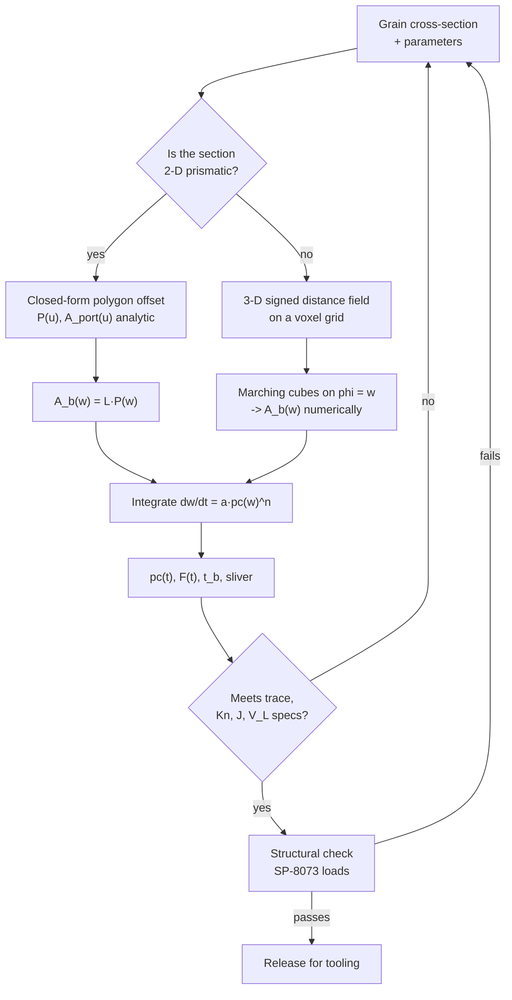

# Module 21 — Grain Geometry
Part III · Prerequisites: modules 03, 19, 20 · Estimated time: 7 h

A liquid engine has a throttle. A solid motor has a shape. Everything the
thrust curve will ever do was decided when someone drew the perforation, and
it was decided in a machine shop months before the motor lit. That is the
whole discipline: you are not designing a thrust-versus-time curve, you are
designing a *burning-surface-versus-burned-distance* curve, and then you are
living with the pressure it produces — amplified, because chamber pressure
goes as $A_b^{1/(1-n)}$ and $n$ is never zero. Get the grain 10 % wrong in
burning area and you get 15 % wrong in pressure, 15 % wrong in thrust, and
either a case you have overdesigned by 15 % or a case you have burst. I have
watched a program spend eight months and two static firings recovering from a
star-point fillet radius that was changed for stress reasons without anybody
recomputing the burn-back. The fillet is part of the ballistics. Everything
geometric is part of the ballistics.

---

## 1. Learning objectives

By the end of this module you should be able to:

1. Derive the relation between fractional burning-area error and fractional
   chamber-pressure error, and state why it is the central fact of grain design.
2. Classify a grain as progressive, neutral or regressive from $dA_b/dw$, and
   compute the resulting $p_c(t)$ and $F(t)$ from $K_n(w)$ and Vieille's law.
3. Compute web thickness, web fraction, volumetric loading, port-to-throat
   ratio and sliver fraction for a given cross-section, and say what each
   constrains.
4. Perform a burn-back analysis by parallel offset (level-set) reasoning,
   including the corner rules: a convex port corner opens into a circular
   fan of radius equal to the burned distance; a re-entrant port corner is
   consumed.
5. Derive $A_b(w)$ in closed form for a generic $N$-point star grain from its
   defining angles, and solve the resulting neutrality condition.
6. Choose among end-burner, CP tube, star, wagon wheel, dendrite, finocyl,
   slotted tube, conocyl and segmented architectures given a required thrust
   trace, burn time, envelope and mass fraction.
7. State the structural constraints on a grain — bond stress, thermal-cycling
   strain, cure shrinkage, slump, stress concentration at star tips — and
   explain why a fillet radius is simultaneously a stress and a ballistic
   design variable.
8. Compute the ignition surface area a grain presents and explain why the
   igniter is sized against grain geometry, not against propellant mass.
9. Argue case-bonded versus cartridge-loaded for a stated mission and
   temperature range.

---

## 2. Terminology

| term | symbol | SI unit | definition |
|---|---|---|---|
| Burning surface area | $A_b$ | m² | instantaneous area of propellant surface actively regressing |
| Burned distance (web burned) | $w$, $y$ | m | distance the surface has receded normal to itself |
| Web thickness | $w_f$ | m | burned distance at which the last *design* propellant is consumed |
| Web fraction | $w_f/R_o$ | — | web thickness normalised by grain outer radius |
| Grain outer radius | $R_o$ | m | radius of the propellant/liner interface (case bore, case-bonded) |
| Grain length | $L$ | m | axial length of the propellant charge |
| Port area | $A_{port}$ | m² | open flow area of the perforation at a station |
| Throat area | $A_t$ | m² | nozzle throat area |
| Klemmung (area ratio) | $K_n$ | — | $A_b/A_t$; the single ballistic number that sets $p_c$ |
| Port-to-throat ratio | $J$ | — | $A_{port}/A_t$, evaluated at the aft end of the grain |
| Volumetric loading | $V_L$ | — | propellant volume / available chamber volume |
| Sliver | — | m³ or % | propellant remaining after the web burns through at its thinnest point |
| Burn rate | $r$ | m/s | surface regression speed normal to the surface |
| Burn-rate coefficient | $a$ | m·s⁻¹·Pa⁻ⁿ | Vieille-law coefficient (units follow the pressure unit used) |
| Pressure exponent | $n$ | — | Vieille-law exponent |
| Propellant density | $\rho_p$ | kg/m³ | cast density |
| Characteristic velocity | $c^*$ | m/s | $p_c A_t/\dot m$ |
| Chamber pressure | $p_c$ | Pa | head-end stagnation pressure |
| Thrust coefficient | $C_F$ | — | $F/(p_c A_t)$ |
| Number of star points | $N$ | — | rotational symmetry order of a star/wagon-wheel port |
| Half-sector angle | $\beta$ | rad | $\pi/N$ |
| Star flank half-angle | $\theta$ | rad | angle between a star flank and the star-point centreline |
| Star point radius | $R_p$ | m | radius of the *sharp* (unfilleted) star-point apex |
| Star valley radius | $R_i$ | m | radius of the *sharp* valley where adjacent flanks meet |
| Fillet radius | $f$ | m | radius of the arc rounding a star-point tip |
| Total offset | $u$ | m | $u = f + y$; distance of the burning surface from the sharp reference polygon |
| Half-flank length | $s_0$ | m | length of one flank of the sharp reference polygon |
| Burning perimeter | $P$ | m | perimeter of the port cross-section, $A_b = PL$ for a 2-D grain |
| Mass flux | $G$ | kg·m⁻²·s⁻¹ | $\dot m/A_{port}$ in the port |
| Temperature sensitivity | $\sigma_p$ | K⁻¹ | $(\partial \ln r/\partial T_i)_p$ |
| Pressure sensitivity | $\pi_K$ | K⁻¹ | $\sigma_p/(1-n)$ |
| Bond stress | $\tau_b$ | Pa | shear/peel stress at the propellant–liner–insulator interface |
| Cure shrinkage strain | $\varepsilon_{cs}$ | — | volumetric shrinkage on cure, expressed as a linear strain |

---

## 3. Theory

### 3.1 Why grain design exists

From Module 20, the mass balance in a solid motor chamber under the
quasi-steady (lumped, no gas accumulation) assumption is

$$\rho_p A_b r \;=\; \frac{p_c A_t}{c^*}$$

> **Eq. 3.1** — variables: $\rho_p$ propellant density [kg/m³], $A_b$ burning
> area [m²], $r$ burn rate [m/s], $p_c$ chamber pressure [Pa], $A_t$ throat
> area [m²], $c^*$ characteristic velocity [m/s]. Meaning: gas generated by
> surface regression equals gas leaving a choked throat. Assumes: quasi-steady
> (the chamber gas mass is small compared with what flows through it in one
> characteristic filling time), uniform $p_c$ over the burning surface, no
> erosive burning, no throat erosion, complete and prompt combustion.
> Fails during ignition transient and tail-off, at high port mass flux
> (erosive burning), and when the throat erodes appreciably. [F]

Substituting Vieille's law $r = a p_c^{\,n}$ [E] and solving:

$$p_c \;=\; \left( a\,\rho_p\, c^*\, K_n \right)^{\frac{1}{1-n}}, \qquad K_n \equiv \frac{A_b}{A_t}$$

> **Eq. 3.2** — variables as above; $K_n$ dimensionless. Meaning: chamber
> pressure is set entirely by the *area ratio* $K_n$ and the propellant's
> ballistic constants. Assumes everything in Eq. 3.1 plus $n < 1$ (otherwise
> the equilibrium is unstable — see Module 20). Fails when $n \to 1$, when
> $a$ shifts with initial grain temperature, and whenever erosive burning
> makes $r$ a function of position. [F] (given [E] for the rate law)

And thrust, from Module 03:

$$F \;=\; C_F\, p_c\, A_t \;=\; C_F\, c^*\, \rho_p\, A_b\, r$$

> **Eq. 3.3** — $C_F$ thrust coefficient [—], $F$ thrust [N]. Meaning: with
> $A_t$, $C_F$ and the propellant fixed, thrust is proportional to $A_b r$,
> and since $r$ itself rises with $p_c$ which rises with $A_b$, thrust is a
> *superlinear* function of burning area. Assumes a fixed, attached nozzle
> flow. Fails on separation, and if throat erosion changes $A_t$ during burn. [F]

Take logarithms of Eq. 3.2 and differentiate:

$$\frac{\delta p_c}{p_c} \;=\; \frac{1}{1-n}\,\frac{\delta A_b}{A_b}
\qquad\text{and}\qquad
\frac{\delta F}{F} \;\approx\; \frac{1}{1-n}\,\frac{\delta A_b}{A_b}$$

> **Eq. 3.4** — Meaning: **the amplification law**. A fractional error or
> variation in burning area shows up in chamber pressure amplified by
> $1/(1-n)$. Assumes small perturbations, fixed $A_t$, $C_F$ weakly dependent
> on $p_c$. Fails for large excursions (use Eq. 3.2 directly) and for
> $n$ near 1. [F]

For a typical AP/HTPB/Al composite with $n = 0.35$ the amplification is
$1/0.65 = 1.538$. For a double-base or a high-$n$ composite with $n = 0.55$
it is 2.22. **This is the reason grain design is a discipline and not a
drafting exercise.** A 4 % error in burning area — which is roughly what a
2 mm mandrel-position error does to a slotted grain of ordinary size — is a
6.2 % pressure error at $n = 0.35$ and a 9.1 % pressure error at $n = 0.55$.
Case burst margins are not that large.

The same amplification applies to *anything* that moves $r$ at fixed $K_n$,
which is why initial grain temperature matters so much:
$\pi_K = \sigma_p/(1-n)$ [E]. With a representative $\sigma_p = 0.0022$ K⁻¹
and $n = 0.35$, $\pi_K = 0.0034$ K⁻¹, so a motor conditioned 30 K warmer runs
11 % higher in pressure. Grain design does not fix that, but grain design has
to leave room for it: **the neutral trace you draw is the mean of a family of
traces, and the case is sized against the hot end of the family.**

One scaling that is constantly got wrong: under a *temperature* change the
coefficient $a$ moves, and since $p_c \propto a^{1/(1-n)}$ and
$r = a p_c^{\,n}$, the rate scales as $r \propto a^{1/(1-n)} \propto p_c$ —
**rate and pressure move together, one for one.** Burn time therefore scales
as $1/p_c$, and $\bar p_c\,t_b$ is invariant, as it must be because the
propellant mass and $A_t$ have not changed. A hot/cold firing pair that shows
+12 % pressure must show −10.7 % duration; if it does not, something other
than temperature is also moving. (Contrast a change in $A_b$ at fixed
propellant, where $a$ is unchanged and $r \propto p_c^{\,n}$ only.) [F]

**The design statement.** Grain design is the inverse problem: given a
required $F(t)$, an envelope, a propellant, and a case, find a solid shape
whose parallel-offset family of surfaces has the burning area history
$A_b(w)$ that produces it. There is no general analytic inverse. What there
is: a catalogue of families whose $A_b(w)$ is known in closed form, a
parametric optimiser wrapped around a burn-back code, and judgment. [J]

### 3.2 Progressive, neutral, regressive

Classification is on the sign of $dA_b/dw$:

| class | $dA_b/dw$ | $p_c(t)$ | typical family |
|---|---|---|---|
| **progressive** | $> 0$ | rises | internal-burning tube (CP) with inhibited ends; internal star late in burn |
| **neutral** | $\approx 0$ | flat | end burner; correctly proportioned star, wagon wheel, finocyl, slotted tube |
| **regressive** | $< 0$ | falls | external-burning rod; internal–external burning tube; slivers, always |

"Neutral" in a specification is never $dA_b/dw = 0$ exactly; it is a
tolerance band. Common practice is to require the pressure to stay within
±5 % (sometimes ±3 %) of the mass-averaged value over the interval from 10 %
to 90 % of web-burned, with the ignition transient and tail-off excluded from
the requirement. [M] The exclusions matter: **every** grain is regressive at
the very end, because the last propellant to burn is by definition a
shrinking piece.

Why anyone wants each:

- **Neutral** is the default for a stage that has to deliver a fixed thrust
  against a fixed structural limit. A flat trace uses the case's design
  pressure for the whole burn instead of touching it once. Neutral maximises
  delivered impulse per kilogram of case.
- **Progressive** is wanted when the vehicle gets lighter fast and you want
  acceleration to stay bounded from below — or, more often, it is not wanted
  at all but is accepted because the geometry that gives high volumetric
  loading happens to be progressive.
- **Regressive** is wanted when the *load* falls with time: a first stage
  passing through max dynamic pressure, or a tactical motor that needs a
  large boost impulse followed by a low-thrust sustain. The Shuttle RSRM's
  forward star is a regressive element bought specifically to keep the
  vehicle inside its aerodynamic-load box (§6.1).

A useful sharpening: what the vehicle cares about is rarely $F(t)$ itself but
some integral or bound on it — total impulse, acceleration limit, dynamic
pressure limit, burn time. Grain design is therefore an *inequality*-driven
problem, and the flattest trace is not always the best answer. [J]

### 3.3 The four numbers that describe a grain

**Web thickness $w_f$.** The burned distance at which the design propellant
is gone. Burn time follows directly: $t_b = \int_0^{w_f} dw/r(p_c(w))$. Since
$r$ is a few millimetres per second for ordinary composites, **web thickness
is burn time**. A 120 s booster needs roughly a metre of web at 8 mm/s. This
single fact governs the whole architecture: you cannot make a long-burning
motor out of a thin-web geometry, no matter how clever the perforation.

**Web fraction $w_f/R_o$.** How much of the radius is web. A pure end burner
has web fraction $\gg 1$ (the web is the length). A CP tube has web fraction
up to 1. A neutral star typically lands at 0.25–0.40; a finocyl 0.4–0.6.
Low web fraction means short burn and a large port — that is the price of
perimeter.

**Volumetric loading $V_L$.** Propellant volume over available chamber
volume. Every point of $V_L$ is directly propellant mass and therefore
directly total impulse in a fixed envelope. End burners reach 0.90–0.95;
CP tubes 0.60–0.85; neutral stars 0.70–0.85; finocyls 0.85–0.92. It is
almost always in tension with neutrality: **perimeter costs port area, and
port area is propellant you did not load.** Worked Example 3 puts a number on
that trade.

**Sliver fraction.** After the web burns through at the thinnest section, the
propellant remaining elsewhere is the sliver. In a case-bonded motor the
sliver does burn — nothing is physically left behind — but it burns on a
rapidly shrinking surface, so it is delivered at falling pressure and falling
$C_F$-efficiency during tail-off. Practically it is inefficient impulse and,
worse, it is *unpredictable* impulse: tail-off dispersion is the largest
single contributor to total-impulse scatter in a well-made motor. [M]
Designers quote sliver as the mass fraction burned after the pressure leaves
the neutral band; 2–8 % is normal, above 10 % is a design smell.

A fifth number that is not about the grain but is set by it:

**Port-to-throat ratio $J = A_{port}/A_t$**, evaluated where the port flow is
fastest (usually the aft end of the grain). $J$ controls port Mach number and
therefore erosive burning. $J < 1.5$ is asking for trouble; $J \gtrsim 2$ is
the usual rule for a low-mass-flux design; the associated mass flux
$G = \dot m/A_{port}$ should be checked against the propellant's erosive
threshold, typically $G^* \sim 700$–1500 kg m⁻² s⁻¹ for composites. [E]
Erosive burning is a *grain-geometry* failure even though it presents as a
combustion phenomenon: the fix is almost always more port area at the aft
end, i.e. a tapered or slotted grain, not a different propellant.

### 3.4 Burn-back: the parallel-offset (level-set) principle

The physical statement is one sentence: **every point of the burning surface
moves along its own local normal, into the solid, at speed $r$.** [F] If $r$
is uniform (same propellant everywhere, uniform pressure, no erosive burning)
then the surface at burned distance $w$ is the set of points at distance $w$
from the initial surface — the *parallel offset*, or in the language of
computational geometry, the Minkowski sum of the port with a ball of radius
$w$.

Formally, let $\phi(\mathbf{x},t)$ be a signed distance function that is
negative in the unburned propellant and zero on the burning surface. Then

$$\frac{\partial \phi}{\partial t} + r\,\lvert \nabla \phi \rvert = 0$$

> **Eq. 3.5** — the eikonal/level-set form of surface regression.
> $\phi$ [m] signed distance, $r$ [m/s] local burn rate. Meaning: the zero
> level set of $\phi$ is the burning surface, and it propagates normal to
> itself. Assumes $r$ may depend on position and time but not on surface
> curvature. Fails where the surface meets an inert boundary (liner, inhibitor,
> case) — those are boundary conditions, not part of the PDE — and where the
> propellant is inhomogeneous at the scale of interest. [F]

For uniform $r$ the solution is trivially $\phi(\mathbf{x},t) =
\phi_0(\mathbf{x}) - \int r\,dt$, which is why the whole subject can be done
with a distance function and no time stepping: **compute $A_b$ as a function
of burned distance $w$ once, then integrate $dw/dt = r(p_c(w))$ afterwards.**
That decoupling is the single most useful structural fact in the module.
It fails the moment $r$ becomes position-dependent — erosive burning, a
dual-propellant grain, a temperature gradient through a large grain — and
then you are genuinely solving Eq. 3.5.

**The corner rules.** All the interesting behaviour is at corners, and there
are exactly two cases. Think of the *port* (the void) growing outward by $u$:

1. **Convex corner of the port** (a sharp point of the void poking into the
   propellant — a star-point tip, a slot tip, the apex of a fin). The two
   offset faces do not meet; the corner opens into a **circular arc of radius
   $u$ centred on the corner**, spanning an angle equal to $\pi$ minus the
   port's interior angle there. A sharp tip immediately becomes a round tip
   whose radius equals the distance burned. This is the "rarefaction fan" of
   the eikonal equation, and it is the reason star grains lose perimeter
   advantage as they burn.

2. **Re-entrant (reflex) corner of the port** (a sharp wedge of *propellant*
   poking into the void — the tip of a star spoke, a rib). The two offset
   faces intersect each other; boundary is destroyed, and the wedge apex
   retreats along its own bisector at speed $r/\sin\psi$, where $\psi$ is the
   wedge half-angle. This is the "shock". Sharp propellant wedges are
   consumed quickly and their contribution to $A_b$ dies fast.

A third case is not a corner at all but matters as much: **an inert boundary**
(liner, inhibitor, case wall). Where the burning surface reaches it, surface
is deleted. Web burnout at the star tips is exactly this.

Two consequences worth internalising:

- **A fillet is pre-burning.** If you round a sharp star tip with radius $f$
  before you cast, the resulting initial surface is *identical* to the surface
  the sharp grain would have had after burning a distance $f$. So the whole
  burn-back can be parameterised by the single variable $u = f + y$, where $y$
  is the actual distance burned. Adding a fillet does not change the family of
  surfaces at all; it only changes where you start on that family. This is
  the cleanest way to see why a stress-driven fillet change is a ballistic
  change, and it is used explicitly in §3.6.
- **Burn-back forgets detail.** Because sharp features round off at radius
  $u$, two grains that differ only at a scale smaller than a few millimetres
  produce identical $A_b(w)$ after a few millimetres of burn. That is why the
  ignition transient is where manufacturing detail shows up, and why the
  mid-burn trace is remarkably reproducible.

**How it is actually computed.** [M] Three methods, in ascending cost:



For a prismatic (constant cross-section) grain, method 1 is exact, instant,
and differentiable — which is why every star grain in the literature is
analysed this way and why §3.6 is worth deriving by hand. For finocyls,
conocyls, slotted tubes and anything with a domed end, method 2 (a voxel
distance field, or the equivalent CAD Boolean sweep) is the only practical
route. A modern shop runs the voxel method inside an optimiser over 10–20
geometric parameters. [M]

### 3.5 The grain families

Below, `@` is propellant, `.` is port, `#` is case/liner.

#### End burner (cigarette burner)

```
   #############################################
   #@@@@@@@@@@@@@@@@@@@@@@@@@@@@@@@@@@@@@@@@@@#\
   #@@@@@@@@@@@@@@@@@@@@@@@@@@@@@@@@@@@@@@@@@@# \____
   #@@@@@@@@@@@@@@@@@@@@@@@@@@@@@@@@@@@@@@@@@@# /
   #@@@@@@@@@@@@@@@@@@@@@@@@@@@@@@@@@@@@@@@@@@#/
   #############################################
    |<------------- web = L ------------------>|
    burning face  ---->  moves aft
```

$A_b = \pi D^2/4$, constant. Perfectly neutral, $V_L \approx 0.90$–0.95, the
highest of any family. Burn time is the grain length divided by the rate, so
end burners are the family for *long* burns: gas generators, sustainers,
low-thrust upper stages. Three problems, all severe:

1. **Thrust is tiny for the envelope.** $A_b$ is one case cross-section, so
   $K_n$ is small and $F$ is small. You cannot build a booster this way.
2. **The case is exposed progressively.** Behind the receding face the case
   wall sees combustion gas for the rest of the burn, so insulation mass grows
   with burn time. This eats the loading advantage.
3. **Coning.** The face does not stay flat. Heat conducted into the case wall
   and the small radial pressure and strain gradients make the edge burn
   slightly faster (or slower) than the centre, and the face turns into a cone
   over a long burn. A 5° cone is a 0.4 % area error; a 30° cone is 15 %.
   Long end burners are qualified by cutting motors apart mid-burn. [M]

#### Internal-burning tube (CP — "cylindrical perforate")

```
      cross-section                     longitudinal
     #################              #######################
    #@@@@@@@@@@@@@@@@@#             #@@@@@@@@@@@@@@@@@@@@@#\
   #@@@@@@.......@@@@@@#            #......................#/  (ends
   #@@@@.............@@#            #@@@@@@@@@@@@@@@@@@@@@#\    inhibited)
   #@@@@@@.......@@@@@@#            #######################
    #@@@@@@@@@@@@@@@@@#
     #################
```

$A_b = 2\pi (R_{i0} + w) L$ with inhibited ends: strictly linear in $w$, and
strongly **progressive** — $A_b$ grows by the ratio $R_o/R_{i0}$ over the
burn, and pressure by that ratio raised to $1/(1-n)$. Worked Example 1 shows
a 2:1 area ratio turning into a 2.9:1 pressure ratio. Nobody flies this in a
large motor with inhibited ends.

The variants exist to kill the progressivity:

- **Uninhibited (both-ends-burning) tube.** The two annular end faces burn
  too, and *their* area shrinks as the bore grows. Sum the two and the trace
  flattens; for the right $L/D$ it is nearly neutral. The cost is that the
  ends are unbonded surfaces, which is a structural and an insulation problem.
- **Tapered bore (conical port).** The bore is a truncated cone, larger at
  the aft end. This both flattens the trace and — much more importantly —
  gives the aft end the port area it needs to keep mass flux and erosive
  burning down. **This is the aft-segment geometry of the Shuttle RSRM**
  (§6.1), where the verification record describes the aft segments as a
  *double-truncated-cone* perforation. `[NASA-SRB]`
- **Internal–external burning tube (cartridge-loaded rod-and-tube).** Burns
  from both the bore and the outer surface. The outer surface is regressive
  and the bore progressive; net neutral. Requires a free-standing cartridge
  and a flow annulus, so it is a small-motor geometry.

#### Star

```
              8-point star at cast (u = f = 8 mm)         @ propellant
                                                          . port
                              ####@@@@@@@@@@@####         # case/liner
                       ##@@@@@@@@@@@@@@@@@@@@@@@@@@@@@##
                   ##@@@@@@@@@@@@@@@@@@@@@@@@@@@@@@@@@@@@@##
                #@@@@@@@@@@@@@@@@@@@@@@@@@@@@@@@@@@@@@@@@@@@@@#
             #@@@@@@@@@@@@@@@@@@@@@@@@@@@@@@@@@@@@@@@@@@@@@@@@@@@#
           #@@@@@@@@@@@@@@@@@@@@@@@@@@...@@@@@@@@@@@@@@@@@@@@@@@@@@#
         #@@@@@@@@@@@@@@@@@@@@@@@@@@@@...@@@@@@@@@@@@@@@@@@@@@@@@@@@@#
        #@@@@@@@@@@@@@@@@@@@@@@@@@@@@.....@@@@@@@@@@@@@@@@@@@@@@@@@@@@#
      #@@@@@@@@@@@@@@....@@@@@@@@@@@.......@@@@@@@@@@@....@@@@@@@@@@@@@@#
     #@@@@@@@@@@@@@@@@@.......@@@@@@.......@@@@@@.......@@@@@@@@@@@@@@@@@#
    #@@@@@@@@@@@@@@@@@@@..........@.........@..........@@@@@@@@@@@@@@@@@@@#
   #@@@@@@@@@@@@@@@@@@@@@.............................@@@@@@@@@@@@@@@@@@@@@#
   #@@@@@@@@@@@@@@@@@@@@@@@.........................@@@@@@@@@@@@@@@@@@@@@@@#
   @@@@@@@@@@@@@@@@@@@@@@@@@.......................@@@@@@@@@@@@@@@@@@@@@@@@@
  #@@@@@@@@@@@@@@@@.........................................@@@@@@@@@@@@@@@@#
  #@@@@@@@@@@.....................................................@@@@@@@@@@#
  #@@@@@@@@@@@@@@@@.........................................@@@@@@@@@@@@@@@@#
   @@@@@@@@@@@@@@@@@@@@@@@@@.......................@@@@@@@@@@@@@@@@@@@@@@@@@
   #@@@@@@@@@@@@@@@@@@@@@@@.........................@@@@@@@@@@@@@@@@@@@@@@@#
   #@@@@@@@@@@@@@@@@@@@@@.............................@@@@@@@@@@@@@@@@@@@@@#
    #@@@@@@@@@@@@@@@@@@@..........@.........@..........@@@@@@@@@@@@@@@@@@@#
     #@@@@@@@@@@@@@@@@@.......@@@@@@.......@@@@@@.......@@@@@@@@@@@@@@@@@#
      #@@@@@@@@@@@@@@....@@@@@@@@@@@.......@@@@@@@@@@@....@@@@@@@@@@@@@@#
        #@@@@@@@@@@@@@@@@@@@@@@@@@@@@.....@@@@@@@@@@@@@@@@@@@@@@@@@@@@#
         #@@@@@@@@@@@@@@@@@@@@@@@@@@@@...@@@@@@@@@@@@@@@@@@@@@@@@@@@@#
           #@@@@@@@@@@@@@@@@@@@@@@@@@@...@@@@@@@@@@@@@@@@@@@@@@@@@@#
             #@@@@@@@@@@@@@@@@@@@@@@@@@@@@@@@@@@@@@@@@@@@@@@@@@@@#
                #@@@@@@@@@@@@@@@@@@@@@@@@@@@@@@@@@@@@@@@@@@@@@#
                   ##@@@@@@@@@@@@@@@@@@@@@@@@@@@@@@@@@@@@@##
                       ##@@@@@@@@@@@@@@@@@@@@@@@@@@@@@##
                              ####@@@@@@@@@@@####
```

The same grain at web burnout, where the star tips have just reached the
liner and the remaining propellant is eight slivers under the case:

```
                              ####...........####
                       ##@@@@@@.................@@@@@@##
                   ##@@@@@@@@.....................@@@@@@@@##
                #..........@.......................@..........#
             #...................................................#
           #.......................................................#
         #...........................................................#
        #@...........................................................@#
      #@@@...........................................................@@@#
     #@@@@...........................................................@@@@#
    #@@@@@@.........................................................@@@@@@#
   #@@@.................................................................@@@#
   #@.....................................................................@#
   .........................................................................
  #.........................................................................#
  #.........................................................................#
  #.........................................................................#
   .........................................................................
   #@.....................................................................@#
   #@@@.................................................................@@@#
    #@@@@@@.........................................................@@@@@@#
     #@@@@...........................................................@@@@#
      #@@@...........................................................@@@#
        #@...........................................................@#
         #...........................................................#
           #.......................................................#
             #...................................................#
                #..........@.......................@..........#
                   ##@@@@@@@@.....................@@@@@@@@##
                       ##@@@@@@.................@@@@@@##
                              ####...........####
```

The star buys a large initial perimeter from a small port area, and the
perimeter loss from the star tips rounding off can be made to cancel the
perimeter gain from the mean circle growing. That cancellation is the
subject of §3.6, and it is exact, not approximate.

#### Wagon wheel

A star whose points are extended into thin radial *slots* with parallel walls
and a rounded tip, separated by narrow propellant spokes:

```
        #########################
      ##@@@@@@@@@@@|.|@@@@@@@@@@@##
    ##@@@@@@@@@@@@@|.|@@@@@@@@@@@@@##
   #@@@@@\...      |.|      .../@@@@@#
   #@@@@@@\.       |.|       ./@@@@@@#
   #-------..................--------#
   #@@@@@@/.       |.|       .\@@@@@@#
   #@@@@@/...      |.|      ...\@@@@@#
    ##@@@@@@@@@@@@@|.|@@@@@@@@@@@@@##
      ##@@@@@@@@@@@|.|@@@@@@@@@@@##
        #########################
```

Very high initial perimeter per unit port area, therefore very high $K_n$
from a short web: the family for **high-thrust, short-burn** motors — booster
stages, ejection and separation motors, gas generators that must come up fast.
The penalty is a large sliver (the spokes between slots leave substantial
residual mass) and severe stress concentration at the slot roots, which is
why wagon wheels are more common in cartridge-loaded or low-strain designs.
Because the slot walls are parallel, a wagon wheel is close to *neutral*
early — the slot walls translate without changing length — and then goes
sharply regressive as the spokes are consumed.

#### Dendrite

A wagon wheel whose slots branch, like a tree or a snowflake, so that the
burning perimeter per unit port area is pushed further still. Dendritic
grains reach the highest $K_n$ of any family and are used where an extremely
high thrust is needed for an extremely short time from a small volume. Every
disadvantage of the wagon wheel is worse: sliver, stress concentration,
tooling complexity, and a mandrel that must be extracted from a branching
cavity (which in practice means a collapsible or soluble mandrel, see
Module 25). [H][M]

#### Finocyl (fin-in-cylinder)

A cylindrical bore over most of the length, with radial *fins* cut into one
end — usually the forward end, sometimes both:

```
   longitudinal                          section A-A (through fins)
   ###########################              #############
   #@@@@|@|@@@@@@@@@@@@@@@@@@#\            #@@@@@|.|@@@@@#
   #....|.|..................#/           #@@\...|.|.../@@#
   #@@@@|@|@@@@@@@@@@@@@@@@@@#\           #---...........---#
   ###########################             #@@/...|.|...\@@#
        A A                                 #@@@@@|.|@@@@@#
     (fins, forward)                          #############
```

The fins supply extra perimeter at the start, where a plain bore is
deficient; they are consumed early, and their loss offsets the bore's growth.
The result is a nearly neutral trace at **volumetric loading in the high
0.80s** — much better than a star, because the fins occupy only part of the
length instead of the whole cross-section. This is the reason the finocyl and
the slotted tube displaced the star for large monolithic motors. Finocyls are
inherently three-dimensional, so their burn-back is a level-set computation,
not a polygon offset; that is a cost paid in analysis time, not in hardware. [M]

#### Slotted tube

A cylindrical bore with one or more circumferential **slots** cut through the
propellant at chosen axial stations:

```
   ##########################################
   #@@@@@@@@@|.....|@@@@@@@@|.....|@@@@@@@@@#\
   #........................................#/
   #@@@@@@@@@|.....|@@@@@@@@|.....|@@@@@@@@@#\
   ##########################################
              slot            slot
```

Each slot presents two annular faces whose area *shrinks* as they burn
radially outward and axially apart — regressive — while the bore is
progressive. Placing slots is a one-dimensional optimisation with a very
direct physical meaning, and it is the standard way to (a) flatten a long
motor's trace and (b) add port area at the aft end to fix erosive burning
without changing the bore everywhere. Slots are also the standard way to
build a **dual-thrust** trace: a slot region burns out at a chosen time and
$A_b$ steps down.

#### Conocyl (cone-in-cylinder) and spherical-case grains

A conical cavity blended into a cylindrical bore, used almost exclusively in
short, fat, high-mass-fraction upper-stage and apogee motors whose cases are
spherical or near-spherical:

```
      ############
    ##@@@@@@@@@@@@##
   #@@@@@.......@@@@#          the cone opens toward the nozzle;
  #@@@@.............@#         L/D ~ 1, so a cylindrical bore alone
  #@@@@..............#===      cannot supply enough perimeter and
  #@@@@.............@#         would leave a huge sliver at the domes
   #@@@@@.......@@@@#
    ##@@@@@@@@@@@@##
      ############
```

In a case with $L/D \approx 1$ there is no long bore to burn; the geometry has
to fill two domes and a short barrel, and it has to do so with a surface that
sweeps them out at roughly the same time. The conocyl (and its relatives, the
"spherical" and "toroidal" grains) is the family that does that. These motors
achieve propellant mass fractions above 0.93. [M]

#### Segmented and dual-grain architectures

- **Segmented.** The grain is cast in separate case segments that are joined
  at assembly. Each segment can have its *own* perforation. This is a design
  freedom, not just a manufacturing necessity: the forward segment can be
  regressive while the aft segments are progressive, and the vehicle sees the
  sum. It is also the source of the field joint, which is the single worst
  structural and thermal feature of a large solid motor (Module 22, and the
  RSRM case study in Module 34).
- **Dual-grain / dual-propellant.** Two propellants with different $a$, $n$,
  or $\rho_p$ cast in sequence — typically a fast, high-thrust boost
  propellant inboard and a slow sustain propellant outboard. Because the two
  regions burn at different rates, Eq. 3.5 no longer reduces to a distance
  offset and the burn-back is genuinely time-dependent.
- **Dual-thrust (boost–sustain) by geometry alone.** The same effect from a
  single propellant, using a high-$A_b$ boost geometry (slots, a star section,
  or a short wagon-wheel section) that burns out and leaves a low-$A_b$
  sustain geometry (a plain bore or an end-burning remnant). Because
  $A_b \propto p_c^{\,1-n}$ at fixed $A_t$, a boost-to-sustain **thrust** ratio
  of 7.5 needs a burning-area step of only $7.5^{0.65} = 3.7$ — the pressure
  exponent works in your favour here, for once. Concept level only; no
  tactical-motor dimensions appear in this course.

### 3.6 Analytical burn-back of a generic $N$-point star

This is the one grain family whose $A_b(w)$ can be derived in closed form in
under a page, and it repays doing by hand because the result is *exactly
linear* in burned distance, which makes the neutrality condition a single
transcendental equation in two integers-and-an-angle.

**Parameterisation.** Work in a transverse section, axis at the origin, and
exploit the $N$-fold symmetry. Let $\beta = \pi/N$ be the half-sector angle.
Measure polar angle $\varphi$ from a star-point centreline. Define a **sharp
reference polygon** — the star with no fillets — by:

- $R_p$: radius of the sharp star-point apex $A$ (at $\varphi = 0$);
- $\theta$: the half-angle between a flank and the point centreline, so the
  port's interior angle at $A$ is $2\theta$;
- the two flanks of adjacent points meet at the **valley** $V$ on the sector
  boundary $\varphi = \beta$.

```
            case bore, radius R_o
     ===========================================
                       |
                    A  |  <-- sharp star-point apex, radius R_p
                   /|\ |      port interior angle = 2*theta
        flank --> / | \ <-- flank
                 /  |  \
                /   |   \        propellant
               /    |    \
        V ----+     |     +---- V'     valley, radius R_i,
      (phi=-beta)   |    (phi=+beta)   propellant-spoke tip
                    |
                    O   motor axis          beta = pi/N
```

Everything else follows. In triangle $OAV$ the angle at $O$ is $\beta$ and the
angle at $A$ is $\theta$, so the angle at $V$ is $\pi - \beta - \theta$, and
the sine rule gives the flank length and the valley radius:

$$s_0 = \lvert AV\rvert = R_p\,\frac{\sin\beta}{\sin(\beta+\theta)},
\qquad
R_i = \lvert OV\rvert = R_p\,\frac{\sin\theta}{\sin(\beta+\theta)}$$

> **Eq. 3.6** — variables: $s_0$ flank length [m], $R_i$ valley radius [m],
> $R_p$ apex radius [m], $\beta = \pi/N$ [rad], $\theta$ flank half-angle
> [rad]. Meaning: the sharp star is fully determined by $(N, R_p, \theta)$.
> Assumes $\beta + \theta < \pi/2$, i.e. the propellant spokes actually point
> inward. Fails (gives a self-intersecting outline) otherwise. [F]

**The fillet is an offset.** A real grain rounds the star-point tips with a
fillet radius $f$ (§3.7 says why). By the parallel-offset principle the port
of the filleted grain *is* the sharp polygon offset outward by $f$. So define
the single geometric variable

$$u \;=\; f + y$$

where $y$ is the distance actually burned. The burning surface at any instant
is the sharp polygon offset by $u$. One variable, one family of curves.

**Perimeter.** Apply the corner rules of §3.4 to a half-sector,
$0 \le \varphi \le \beta$:

- *At the apex* $A$: convex port corner of interior angle $2\theta$. It opens
  into an arc of radius $u$ spanning $\pi - 2\theta$ in total, hence
  $\left(\tfrac{\pi}{2} - \theta\right)$ per half-sector. Arc length
  $u\left(\tfrac{\pi}{2}-\theta\right)$.
- *Along the flank*: the offset is a parallel line of the same direction. It
  starts at the foot of the perpendicular from $A$ (no length is lost at a
  convex corner), so it begins at the same station as the original flank.
- *At the valley* $V$: re-entrant port corner. The propellant spoke there is a
  wedge whose half-angle, measured from the outward radial at $\varphi=\beta$,
  is $\psi = \beta + \theta$. The two offset flanks intersect at distance
  $u/\sin\psi$ beyond $V$ along the bisector, which erases a length
  $u\cot\psi$ from each flank.

So the flank length at offset $u$ is $\ell(u) = s_0 - u\cot(\beta+\theta)$,
and the total burning perimeter — $2N$ half-sectors — is

$$\boxed{\;P(u) \;=\; 2N\,s_0 \;+\; 2N\left[\left(\frac{\pi}{2}-\theta\right)
- \cot(\beta+\theta)\right] u \;}$$

> **Eq. 3.7** — variables: $P$ burning perimeter [m], $u = f+y$ total offset
> [m], $N$ point count, $\theta$, $\beta$ as above, $s_0$ from Eq. 3.6.
> Meaning: **the burning perimeter of a star grain is exactly linear in
> burned distance**, with a slope that depends only on $N$ and $\theta$ —
> not on $R_p$, not on $f$, not on the case radius. Assumes: prismatic grain
> (constant section, inhibited ends), uniform burn rate, and Phase I
> (see below) — the flanks have not yet vanished and the tips have not yet
> reached the liner. Fails outside Phase I; use Eq. 3.9. [F]

With $A_b = P L$ for an end-inhibited prismatic grain, and since
$dA_{port}/du = P(u)$, the port area integrates immediately:

$$A_{port}(u) \;=\; A_0 + P_0\,u + \tfrac{1}{2}\,P'\,u^2,
\qquad A_0 = N R_p R_i \sin\beta, \quad P_0 = 2Ns_0, \quad P' = dP/du$$

> **Eq. 3.8** — $A_{port}$ port cross-sectional area [m²], $A_0$ area of the
> sharp reference polygon [m²]. Meaning: exact quadratic; gives volumetric
> loading and port-to-throat ratio at any web position. Assumes Phase I.
> Fails outside it. [F]

*(Both Eq. 3.7 and Eq. 3.8 were checked against a direct numerical Minkowski
sum of the polygon on a fine grid for three different $(N,\theta,R_p)$ sets;
agreement was better than 0.005 % in area. The check script is in
`tools/examples/21.py`.)*

**The neutrality condition.** Setting $P' = 0$ in Eq. 3.7:

$$\frac{\pi}{2} - \theta \;=\; \cot\!\left(\frac{\pi}{N} + \theta\right)$$

> **Eq. 3.9** — a single transcendental relation between the point count $N$
> and the flank half-angle $\theta$ [rad] for an exactly neutral star.
> Meaning: neutrality of a star grain is a property of its *angles alone*;
> the radii set the web, the burn time and the loading, but not the shape of
> the trace. Assumes Phase I throughout the burn. Fails otherwise. [F]

Solving numerically:

| $N$ | neutral $\theta$ | $u_1/R_p$ (Phase-I limit) |
|---|---|---|
| 4 | — (always progressive) | — |
| 5 | — (always progressive) | — |
| 6 | 3.53° | 0.600 |
| 7 | 9.84° | 0.533 |
| 8 | 14.81° | 0.481 |
| 9 | 18.84° | 0.439 |
| 10 | 22.20° | 0.405 |
| 11 | 25.06° | 0.376 |
| 12 | 27.52° | 0.351 |
| 16 | 34.84° | 0.281 |

Read this table carefully, because it contains most of the engineering:

- **A star with fewer than six points cannot be made neutral by angle alone.**
  At $N \le 5$ the tip-arc growth always beats the valley erosion, whatever
  $\theta$ you choose. Five- and six-point stars are progressive geometries;
  if you see one, the designer wanted progressivity or was solving a different
  problem (usually tooling).
- **Neutral $\theta$ grows with $N$**, which means the port gets fatter — the
  points get wider — as you add points. That is directly a volumetric-loading
  penalty. High-$N$ neutral stars are *expensive in loading*.
- **The Phase-I limit shrinks with $N$.** More on this next.

**Phase II, and where the linear result stops.** The flank length reaches zero
at $u_1 = s_0\tan(\beta+\theta) = R_p\sin\beta/\cos(\beta+\theta)$. After
that the boundary is nothing but $N$ arcs of radius $u$ centred on the sharp
apexes, and the perimeter becomes

$$P(u) \;=\; N u \left[\pi + 2\beta - 2\arccos\!\left(\frac{R_p\sin\beta}{u}\right)\right], \qquad u \ge u_1$$

> **Eq. 3.10** — Phase-II perimeter. Meaning: once the flat flanks are gone
> the star has forgotten it was a star; as $u\to\infty$ the bracket tends to
> $2\beta = 2\pi/N$ and $P \to 2\pi u$, a plain circular bore. Assumes the
> arcs have not reached the liner. It joins Eq. 3.7 continuously at $u_1$
> (substituting $u_1$ gives $\arccos[\cos(\beta+\theta)] = \beta+\theta$ and
> both reduce to $Nu_1(\pi-2\theta)$). Fails after the tips touch the liner. [F]

**Phase II is always progressive**, tending toward the circular-bore
behaviour. So a star grain's trace is: (neutral or regressive, by design) in
Phase I → progressive in Phase II → sharply regressive during sliver burnout.
If you want a genuinely flat motor you must arrange for the web to be gone
before Phase II gets going, i.e. size

$$R_o - R_p \;\lesssim\; u_1 \;=\; R_p\,\frac{\sin\beta}{\cos(\beta+\theta)}
\quad\Longrightarrow\quad
R_p \;\ge\; \frac{R_o}{1 + \sin\beta/\cos(\beta+\theta)}$$

> **Eq. 3.11** — the sizing rule that makes a star neutral over its whole web.
> Meaning: it forces the star points out toward the case, which thins the web
> and enlarges the port — this is the mechanism by which neutrality costs
> volumetric loading and burn time. [J] on the "$\lesssim$"; the equality is
> geometry.

Worked Example 3 evaluates both branches of this trade on the same case.

### 3.7 Structural constraints — why the shape is not free

A grain is a filled elastomer bonded to a stiff shell. It is weak (tensile
strengths of order 0.5–1.5 MPa for a case-bond-grade composite), it creeps,
it has a glass transition somewhere between −70 and −50 °C for HTPB systems,
and its modulus is a strong function of temperature and strain rate. The
authoritative public treatment of what has to be analysed is NASA
**SP-8073, *Solid Propellant Grain Structural Integrity Analysis*** — that
monograph is the reason this section exists and it should be read in full
before anyone signs a grain drawing. `[SP-8073]`

The load cases, in the order they actually bite:

**1. Cure shrinkage and cool-down (the big one).** The grain is cast and
cured hot — typically 50–70 °C — and then cooled to storage temperature.
The propellant's coefficient of thermal expansion is roughly an order of
magnitude larger than steel's and several times larger than a composite
case's. Bonded to the case at the outer surface, the grain cannot contract
freely, so it goes into **hoop tension**, with the largest strain at the
**innermost surface** — the bore, and above all the star-point tips. On top
of that sits the chemical shrinkage of the binder on cure, typically a few
percent by volume. A representative number: a 60 °C temperature drop with a
propellant/case CTE mismatch of order $8\times10^{-5}$ K⁻¹ puts several
percent of strain into the bore surface before the motor has done anything.
Grains are qualified to strain, not to stress. `[SP-8073]` [F]

**2. Stress concentration at star tips.** A sharp re-entrant notch in a
nearly-incompressible elastomer is the classic stress concentrator. The
elastic concentration factor at a notch of radius $f$ in a field of
characteristic dimension $c$ scales roughly as $1 + 2\sqrt{c/f}$ [A], so
$K_t$ climbs without bound as $f \to 0$. **This is why star points are
filleted, and it is why the fillet radius is chosen by the stress analyst,
not the ballistician.** And then, per §3.6, the fillet moves the whole
grain along the burn-back family by $f$ — which changes $A_{port}$, $V_L$,
$K_n$ at ignition, and the ignition transient. The two disciplines are
coupled through one number. The correct process is to iterate; the incorrect
process, which is common, is for one group to change $f$ and tell the other
afterwards. [J]

**3. Thermal cycling.** A motor that sits in a depot, on a wing pylon, or on
a pad through diurnal cycles accumulates damage at the bore surface and at
the bond line. The failure is *dewetting* — the binder separating from
oxidiser and aluminium particles — which shows up as whitening, a falling
modulus, and eventually a crack. Cracks are a ballistic catastrophe, not
merely a structural one: a crack is new burning surface, and per Eq. 3.4 new
burning surface is amplified pressure. A crack that opens 10 % of extra
$A_b$ raises pressure 15 % and can propagate faster than it burns back. This
is the standard mechanism behind "motor overpressurised and burst on
ignition after long storage". `[SP-8073]` [F]

**4. Bond stress.** The propellant–liner–insulation–case stack is a
multi-material bond, and the peak shear and peel stresses are at the ends of
the grain and at any geometric discontinuity — the ends of a slot, the
termination of a fin. Unbonded ends are stress-relieved deliberately with
**boot** (a release flap of rubber that lets the grain end move relative to
the case). A bond failure produces a gap that the flame front finds; the
result is case burn-through, and it is one of the few solid-motor failures
that is essentially always fatal.

**5. Slump.** A large grain is a heavy viscoelastic body in a gravity field
(and later in an acceleration field). Before cure, and during long horizontal
storage, it sags — the bore goes oval, the top web thins, the bottom
thickens. Slump changes $A_b$ at ignition and puts the thin section at risk.
Countermeasures: cast and cure vertically, rotate during store, design the
web so that the tolerable slump is a small fraction of it, and — the real
one — keep $L/D$ and grain mass within what the propellant's modulus can
carry. [M]

**6. Ignition pressurisation and flight loads.** The pressure rise on
ignition strains the case outward; the grain must follow it without
debonding. Axial acceleration compresses the grain against the aft closure.
Vehicle bending puts the grain in flexure. These are all in SP-8073's load
list; they are usually not the sizing case for a case-bonded grain, but they
are for a long, slender one.

The blunt summary a grain designer should carry: **the bore surface at the
coldest qualification temperature is the critical location, the star tip is
the critical point on it, and the fillet radius is the control.** [J]

### 3.8 Ignition surface requirements

The igniter's job is to raise the *entire* burning surface to ignition
temperature and to fill the free volume to a pressure at which the flame is
self-sustaining, both within a specified time (tens of milliseconds for a
tactical motor, a few hundred for a large booster). `[SP-8051]` Grain
geometry sets that job in three ways:

1. **Total surface to be ignited.** The igniter output is sized against
   $A_b(0)$ and the free volume, not against propellant mass. A wagon wheel
   and an end burner of the same mass differ by an order of magnitude in the
   surface an igniter must light.
2. **Line of sight and flow path.** Hot igniter gas and condensed particles
   must actually reach every surface. A deep, narrow star slot or a
   dendritic branch shadows itself. The standard consequence of failing this
   is **ignition delay followed by a pressure spike**: part of the surface
   lights, pressure rises, the rise drives the rest to light nearly at once,
   and the transient overshoots. A grain whose slots are shadowed can also
   suffer *hangfire* — a slow, low-pressure start with unpredictable
   impulse.
3. **Free volume.** Filling time scales with free volume over igniter mass
   flow. High-loading geometries (end burner, conocyl) have small free volume
   and light fast and hard; low-loading geometries (neutral star) have a large
   port and need more igniter mass. This is one of the few places where poor
   volumetric loading is an *advantage*: a large port is a forgiving port.

Head-end pyrogen igniters are the norm for large motors because they can be
aimed down the bore; the aft end of a long grain is the last thing to light,
which is why long slotted grains sometimes carry an igniter designed to throw
material a specific distance. [M]

### 3.9 Case-bonded versus cartridge-loaded

**Case-bonded**: the propellant is cast directly into the insulated, lined
case and cured in place; the outer surface is bonded and inert.

- Volumetric loading is high — nothing is wasted on a gap.
- The case is protected by propellant for most of the burn, so insulation is
  thinner over most of the length.
- The grain must survive the case's thermal strains for its whole storage
  life; the bond line is a life-limiting item.
- Almost universal for large motors. Every motor discussed in §6 is
  case-bonded.

**Cartridge-loaded**: the grain is cast (or extruded) separately, cured,
inspected, and then slid into a case, supported by traps or a rod.

- The grain is free to expand and contract, so **it survives a much wider
  temperature range** — this is the reason cartridge loading persists in
  tactical and very-cold-storage applications.
- The grain can be inspected on all surfaces before assembly, and rejected
  cheaply.
- Both inner and outer surfaces can burn, which enables the neutral
  internal–external tube.
- You pay: the annular gap is lost volume, the case must be insulated for the
  whole burn duration because gas washes the wall from $t=0$, and the grain
  needs mechanical support that does not itself become a stress riser.
- Practical for small and medium motors; the mass penalty is unacceptable at
  booster scale.

The decision rule [J]: if the mission is a launch vehicle with a controlled
thermal environment and mass fraction is the figure of merit, case-bond. If
the motor must be stored for years across a wide temperature range in an
uncontrolled environment and its mass fraction is not the binding constraint,
cartridge-load — or case-bond with a very carefully engineered stress-relief
boot and accept the qualification cost.

---

## 4. Typical engineering ranges

| quantity | typical range | low end | high end |
|---|---|---|---|
| $K_n = A_b/A_t$ | 150–450 | end burners and low-$p_c$ gas generators, 100–200 | wagon-wheel/dendrite boost motors, 500+ |
| Chamber pressure $p_c$ | 3–11 MPa | small sustainers ~3 MPa | RSRM ≈ 6.25 MPa nominal `[NASA-SRB]`; upper-stage motors run 4–7 MPa |
| Volumetric loading $V_L$ | 0.60–0.95 | CP tube with large port, 0.60 | end burner 0.90–0.95; conocyl upper stages 0.88–0.93 |
| Web fraction $w_f/R_o$ | 0.25–1.0 | neutral star 0.25–0.40 | CP tube up to 1.0; end burner not applicable |
| Sliver | 2–8 % of propellant | well-tuned finocyl, ~2 % | wagon wheel/dendrite, 10–15 % |
| Port-to-throat $J$ | 1.5–6 | high-$K_n$ boost motor, ~1.5 (erosive-burning risk) | long CP tube, 5–6 |
| Port mass flux $G$ | 300–1500 kg m⁻² s⁻¹ | end burner, negligible | aft end of a long, highly loaded grain |
| Burn rate $r$ | 2–20 mm/s | slow sustain propellants ~2 | fast boost/catalysed composites 15–20 |
| Neutrality band on $p_c$ | ±3 % to ±8 % of mass-averaged | tightly specified upper stage | tactical boost–sustain (not applicable) |
| Star point count $N$ | 5–12 | progressive 5–6 point designs | RSRM forward segment: **11-point star** `[NASA-SRB]` |
| Fillet radius $f$ | 3–15 mm | small motors | large boosters; set by strain, not ballistics |
| Burn time $t_b$ | 1 s – 300 s | separation and ejection motors | end-burning gas generators; RSRM ≈ 123–124 s `[NASA-SRB]`; SLS five-segment 126 s `[NASA-SLS-SRB]` |

**Generic propellant used throughout §5** (this is a *representative*
composite, not any specific formulation; Part III does not print
formulations beyond NASA fact-sheet level):

| property | value |
|---|---|
| designation in this module | **P-1770** |
| density $\rho_p$ | 1770 kg/m³ |
| burn-rate law | $r = 5.0\,(p_c/1\ \mathrm{MPa})^{0.35}$ mm/s |
| $a$ in SI | $3.9716\times10^{-5}$ m·s⁻¹·Pa⁻⁰·³⁵ |
| $n$ | 0.35 |
| delivered $c^*$ | 1580 m/s |
| $\sigma_p$ | 0.0022 K⁻¹ |

Sanity: $r(7\ \mathrm{MPa}) = 9.88$ mm/s — squarely in the range for an
AP/Al/HTPB composite.

---

## 5. Worked examples

### WE 21.1 — Internal-burning tube: $A_b(w)$, $K_n(w)$ and the pressure runaway

**Given.** Case-bonded CP tube, ends inhibited. Case bore radius
$R_o = 0.300$ m, initial port radius $R_{i0} = 0.150$ m, grain length
$L = 3.00$ m. Propellant P-1770. Size the throat for $p_c = 5.00$ MPa at
ignition, then tabulate the burn.

**Step 1 — geometry.**
Web $w_f = R_o - R_{i0} = 0.150$ m; web fraction $0.150/0.300 = 0.500$.
Volumetric loading $V_L = (R_o^2 - R_{i0}^2)/R_o^2 = (0.09-0.0225)/0.09 =
\mathbf{0.750}$.
Propellant mass $m_p = \rho_p \pi (R_o^2 - R_{i0}^2) L
= 1770 \times \pi \times 0.0675 \times 3.00 = \mathbf{1126}$ kg.

**Step 2 — initial burning area.**
$A_{b0} = 2\pi R_{i0} L = 2\pi(0.150)(3.00) = \mathbf{2.8274}$ m².

**Step 3 — required $K_n$ and throat.** Invert Eq. 3.2:
$$K_n = \frac{p_c^{\,1-n}}{a\rho_p c^*}
= \frac{(5.00\times10^6)^{0.65}}{3.9716\times10^{-5}\times 1770 \times 1580}
= \frac{22{,}615}{111.07} = 203.6$$
$A_t = A_{b0}/K_n = 2.8274/203.6 = 0.013889$ m² → $D_t = 0.1330$ m.
Take $D_t = 0.133$ m, $A_t = 0.0138929$ m².
Port-to-throat: $J_0 = \pi R_{i0}^2/A_t = 0.070686/0.0138929 = \mathbf{5.09}$
— comfortable, no erosive-burning concern at ignition.

**Step 4 — the table.** $A_b(w) = 2\pi(R_{i0}+w)L$, $K_n = A_b/A_t$,
$p_c$ from Eq. 3.2, $r = a p_c^{\,n}$, and $t$ from numerical integration of
$dt = dw/r$ (20 001 steps).

| $w$ [m] | port radius [m] | $A_b$ [m²] | $K_n$ | $p_c$ [MPa] | $r$ [mm/s] | $t$ [s] |
|---|---|---|---|---|---|---|
| 0.00 | 0.150 | 2.827 | 203.5 | 5.00 | 8.78 | 0.00 |
| 0.03 | 0.180 | 3.393 | 244.2 | 6.62 | 9.69 | 3.25 |
| 0.06 | 0.210 | 3.958 | 284.9 | 8.39 | 10.53 | 6.22 |
| 0.09 | 0.240 | 4.524 | 325.6 | 10.30 | 11.31 | 8.97 |
| 0.12 | 0.270 | 5.089 | 366.3 | 12.35 | 12.05 | 11.54 |
| 0.15 | 0.300 | 5.655 | 407.0 | 14.52 | 12.75 | 13.95 |

**Step 5 — read it.** $A_b$ doubles; $p_c$ rises by a factor
$2^{1/0.65} = 2.905$, from 5.0 to 14.5 MPa. The case would have to be
designed for 14.5 MPa (plus temperature and manufacturing margin, so call it
19 MPa) to fly a motor whose *average* pressure is about 9 MPa. That is
roughly a 60 % case-mass penalty relative to a neutral grain of the same
impulse. Note also that the burn is *accelerating*: half the web burns in the
first 6.2 s of a 13.95 s burn.

**Sanity check.** Nobody flies this. The RSRM's aft segments are
*tapered* CP precisely to avoid it, and the RSRM's actual chamber pressure is
≈6.25 MPa nominal with a peak near 6.4 MPa `[NASA-SRB]` — a ratio of 1.02,
not 2.9. Any time your CP tube shows a 3:1 pressure ratio, you have designed
a demonstration, not a motor.

### WE 21.2 — End-burner sizing for a specified thrust and burn time

**Given.** A vacuum sustainer must deliver $F = 2.00$ kN for $t_b = 120$ s.
Propellant P-1770. Nozzle $C_F = 1.55$ (vacuum, modest area ratio). Choose
$p_c = 4.00$ MPa. Size the grain.

**Step 1 — burn rate at the chosen pressure.**
$r = 5.0\,(4.00)^{0.35} = 5.0 \times 1.6245 = \mathbf{8.1225}$ mm/s.

**Step 2 — grain length is burn time.** For an end burner the web *is* the
length:
$$L = r\,t_b = 0.0081225 \times 120 = \mathbf{0.9747\ m}$$

**Step 3 — burning area from thrust.** Combining Eq. 3.3,
$F = C_F c^* \rho_p A_b r$:
$$A_b = \frac{F}{C_F c^* \rho_p r}
= \frac{2000}{1.55 \times 1580 \times 1770 \times 0.0081225}
= \mathbf{0.05680\ m^2}$$
$D = \sqrt{4A_b/\pi} = \mathbf{0.2689}$ m. Grain $L/D = 3.62$.

**Step 4 — throat.** $\dot m = F/(C_F c^*) = 2000/(1.55\times1580)
= 0.8167$ kg/s.
$A_t = \dot m c^*/p_c = 0.8167\times1580/4.00\times10^{6}
= 3.2256\times10^{-4}$ m², $D_t = \mathbf{20.3}$ mm.
$K_n = A_b/A_t = 0.05680/3.2256\times10^{-4} = \mathbf{176.1}$.
Check with `rocket.solid_equilibrium_pressure`: 4.0000 MPa. ✓

**Step 5 — mass and performance.**
$m_p = \rho_p A_b L = 1770\times0.05680\times0.9747 = \mathbf{98.0}$ kg.
$I_{tot} = F t_b = \mathbf{240}$ kN·s.
$I_{sp} = I_{tot}/(m_p g_0) = 240{,}000/(98.0\times9.80665) = \mathbf{249.7}$ s,
which equals $C_F c^*/g_0$ as it must.

**Sanity check.** $L/D = 3.6$ and $V_L \approx 0.9$: a long, slender,
high-loading motor delivering 2 kN. That is the correct shape for a
sustainer, and it is also why end burners are never boosters — to get
20 kN from the same propellant at the same pressure you would need
$A_b = 0.568$ m², a grain 0.85 m in diameter, and it would still burn for
only 120 s because burn time is set by length alone.

**Design note.** Insulation is the hidden cost. At $t = 0$ the case sees
nothing; at $t = t_b$ the whole 0.97 m of case wall has been exposed to
combustion gas, most of it for most of the burn. Sizing that insulation
(Module 23) can add more mass than the grain geometry saved.

### WE 21.3 — Star grain: neutrality demonstrated at five web positions, and what it costs

**Given.** The same case as WE 21.1: $R_o = 0.300$ m, $L = 3.00$ m, ends
inhibited, propellant P-1770. Design an **8-point star** with a fillet
$f = 8$ mm, sized for a flat trace at $p_c \approx 6.0$ MPa.

**Step 1 — choose the angles for neutrality.** From Eq. 3.9 with $N = 8$,
$\beta = \pi/8 = 22.500°$, the neutral half-angle is $\theta = 14.81°$.
Take $\theta = 15.00°$ (0.261799 rad) — within 0.2° of neutral, and a round
number for tooling. Then
$$P' = 2N\left[\left(\tfrac{\pi}{2}-\theta\right)-\cot(\beta+\theta)\right]
= 16\,[1.308997 - 1.303225] = \mathbf{0.09235}\ \text{m per m of web}$$
against a perimeter of order 2 m — i.e. 0.005 % per millimetre.

**Step 2 — size the radii from Eq. 3.11.**
$u_1/R_p = \sin\beta/\cos(\beta+\theta) = 0.382683/0.793353 = 0.48124$.
Setting the web at the tip equal to $u_1$:
$R_p = R_o/(1+0.48124) = 0.300/1.48124 = \mathbf{0.2024}$ m.
Then $u_1 = 0.09763$ m and $R_o - R_p = 0.09760$ m — **the flanks vanish at
the same instant the tips reach the liner**, so the entire burn is Phase I
and Eq. 3.7 is valid throughout. Web available to burn is
$y_{max} = 0.0976 - f = \mathbf{0.0896}$ m.

From Eq. 3.6:
$s_0 = 0.2024\times\sin22.5°/\sin37.5° = 0.127234$ m;
$R_i = 0.2024\times\sin15°/\sin37.5° = 0.086052$ m.
$P_0 = 2Ns_0 = 16\times0.127234 = 2.035743$ m (sharp reference polygon).
The *actual* initial valley radius, offset by the fillet, is
$R_i + f/\sin(\beta+\theta) = 0.086052+0.008/0.608761 = 0.09919$ m.
$A_0 = N R_p R_i \sin\beta = 8\times0.2024\times0.086052\times0.382683
= 0.053321$ m².

**Step 3 — throat.** $A_{b0} = L(P_0 + P'f) = 3.00\times2.03648 = 6.1094$ m².
For $p_c = 6.00$ MPa, $K_n = (6.00\times10^6)^{0.65}/111.07 = 229.2$, so
$A_t = 6.1094/229.2 = 0.026657$ m² → $D_t = 0.1842$ m. Take
$D_t = 0.184$ m, $A_t = 0.0265904$ m².

**Step 4 — the five web positions.** $u = f+y$, $P = P_0 + P'u$,
$A_b = PL$, $K_n = A_b/A_t$, $p_c$ from Eq. 3.2.

| $y$ [m] | $u$ [m] | $P$ [m] | $A_b$ [m²] | $K_n$ | $p_c$ [MPa] | $r$ [mm/s] |
|---|---|---|---|---|---|---|
| 0.0000 | 0.0080 | 2.03648 | 6.109 | 229.8 | **6.023** | 9.374 |
| 0.0224 | 0.0304 | 2.03855 | 6.116 | 230.0 | **6.032** | 9.379 |
| 0.0448 | 0.0528 | 2.04062 | 6.122 | 230.2 | **6.042** | 9.384 |
| 0.0672 | 0.0752 | 2.04269 | 6.128 | 230.5 | **6.051** | 9.389 |
| 0.0896 | 0.0976 | 2.04476 | 6.134 | 230.7 | **6.061** | 9.394 |

Total pressure excursion across the entire web: **+0.63 %**. That is
neutrality in the sense a specification means it, achieved by choosing two
angles.

**Step 5 — burn time and mass.** Integrating $dw/r$ over the web:
$t_b = \mathbf{9.55}$ s (a constant-rate estimate at 6.0 MPa gives 9.57 s —
the difference is the point).

$A_{port}(f) = A_0 + P_0 f + \tfrac12 P' f^2 = 0.053321+0.016286+0.000003
= 0.069610$ m². Case bore area $\pi R_o^2 = 0.282743$ m².
$$V_L = \frac{0.282743-0.069610}{0.282743} = \mathbf{0.754},
\qquad m_p = 1770\times0.213133\times3.00 = \mathbf{1132\ kg}$$
$J_0 = A_{port}/A_t = 0.069610/0.0265904 = 2.62$; port mass flux
$G = \dot m/A_{port} = (p_c A_t/c^*)/A_{port} = 1456$ kg m⁻² s⁻¹ — at the top
of the comfortable band, and worth a look at the aft end where the whole flow
passes. [J]

**Step 6 — the sliver.** At $u = 0.0976$ m the port area is
$A_{port} = 0.252449$ m², so the remaining propellant area is
$0.282743-0.252449 = 0.030294$ m², i.e. **14.2 % of the propellant** is still
present when the tips touch the liner. The farthest propellant from the port
is on the case at the spoke centreline, 0.137 m from the nearest star apex,
so the tail-off runs on for a further ~39 mm of web (about 40 % again of the
burn time) on a collapsing surface. That is a long, soft tail-off, and it is
the price of this particular neutrality.

**Step 7 — the alternative, and the trade.** Keep $N=8$ but push the points
in and widen them: $R_p = 0.140$ m, $\theta = 30°$, $f = 10$ mm. Now
$s_0 = 0.06753$ m, $P_0 = 1.08049$ m, $P' = 4.478$ m/m — strongly
progressive — and $u_1 = 0.0880$ m while the web at the tip is 0.160 m, so
most of the burn is Phase II.

| | neutral star ($R_p=0.2024$, $\theta=15°$) | deep star ($R_p=0.140$, $\theta=30°$) |
|---|---|---|
| $A_b$ at cast | 6.109 m² | 3.376 m² |
| $A_b$ at web burnout | 6.134 m² (+0.4 %) | 5.638 m² (**+67 %**) |
| $p_c$ excursion | +0.6 % | ≈ +130 % |
| $V_L$ | 0.754 | **0.827** |
| propellant mass | 1132 kg | **1242 kg** |
| web to tip | 0.0976 m | 0.160 m |

**Sanity check and the lesson.** The deep star carries 110 kg (9.7 %) more
propellant in the identical case and burns 64 % longer, and it does it at the
price of a pressure trace that more than doubles. In a fixed-envelope
mission where the case is not the binding constraint, the deep star wins on
impulse; where the case mass is the binding constraint, the neutral star
wins, because the case is sized by peak pressure and the deep star's peak is
2.3× the neutral star's. **This is the central trade of solid grain design
and it is why the finocyl exists** — it recovers most of the deep star's
loading while keeping most of the neutral star's flatness, by putting the
perimeter-generating features on only part of the length.

### WE 21.4 — Reading a trace backwards, and the amplification law in anger

**Given.** A development motor is expected to be neutral. The measured
head-end pressure rises from 5.2 MPa at 10 % web to 6.9 MPa at 90 % web.
The propellant is characterised at $n = 0.30$. What happened?

**Step 1 — invert Eq. 3.2.** At fixed $A_t$, $a$, $c^*$:
$$\frac{A_{b,2}}{A_{b,1}} = \left(\frac{p_2}{p_1}\right)^{1-n}
= \left(\frac{6.9}{5.2}\right)^{0.70} = 1.3269^{0.70} = \mathbf{1.219}$$
The burning area grew 21.9 %. A "neutral" grain did not.

**Step 2 — distinguish the two candidate causes.** Throat erosion produces
the *same* symptom: falling $A_t$ raises $K_n$. If $A_b$ were truly constant,
the same pressure rise would require
$A_t$ to fall by the factor $1/1.219$, i.e. **18 %** — a throat diameter loss
of 9.4 %, which for a 184 mm throat is 8.6 mm of radial erosion. That is
detectable: measure the throat after the firing. If the throat is intact, the
grain geometry is wrong; if the throat has eroded 8–9 mm, the grain may be
fine.

**Step 3 — the third candidate.** A crack. A crack that exposes 21.9 % more
area does exactly this, and unlike a design error it usually appears
*suddenly* rather than as a smooth ramp, and it does not repeat between
motors. Trace shape in time is the discriminator: a design error is smooth
and repeatable; erosion is smooth and correlates with throat measurements; a
crack is a step or a knee and is a one-off.

**Sanity check.** Note how small the pressure rise looks (33 %) and how large
the diagnosis is (22 % area, or 18 % throat). Because $1-n < 1$, pressure
*understates* area errors when you read it this way and *overstates* them
when you propagate forward. Both directions of Eq. 3.4 have to be at your
fingertips.

---

## 6. Real engines — why did they design it that way?

**A note on sourcing.** Everything in this section is taken from
`reference/_verify-solid-coldgas.md` with its confidence labels carried over.
Where that file does not record a grain geometry, this module says so rather
than guessing; public grain drawings for flight motors are rare, and a
plausible-sounding perforation is still an invention.

### 6.1 Space Shuttle RSRM — 11-point star forward, tapered CP aft (historical)

**What is recorded.** The forward segment carries an **11-point star**
perforation; the aft segments carry a **double-truncated-cone** perforation.
The star is there to tailor a head-end regressive-then-neutral trace that
limits max-Q loads. Confidence **A**. `[NASA-SRB]` Supporting architecture:
PBAN/AP/Al propellant, D6AC steel case, 4 flight segments and 3 field joints,
$p_c \approx 6.25$ MPa (906.8 psi) nominal with a peak near 6.4 MPa,
thrust ≈14.7 MN `/motor`, `max`, sea level at about t+20 s, falling to the
≈12.5 MN `/motor` class, burn time ≈123–124 s, propellant ≈500,000 kg
per motor. `[NASA-SRB]`, `[WP]` (conf **B** for masses and pressures).

**Why.** The Shuttle stack's binding constraint was not case mass, it was
**aerodynamic load through the transonic region**. Maximum dynamic pressure
occurs roughly 50–60 s into flight, and the airframe could not take full
booster thrust there — which is why the SSMEs also throttled down. The SRB
could not throttle. The only actuator available was the grain.

So: put a **regressive** element at the head end. An 11-point star has (from
the table in §3.6) a neutral half-angle near 25°; make the flanks *narrower*
than neutral and $P'$ goes negative — the star sheds perimeter as its tips
round off. Give the aft segments a **tapered** bore instead of a straight
one, which does three jobs at once: it adds progressive area to partially
offset the star, it puts the large port area at the aft end where the
accumulated mass flux is greatest (the whole motor's gas passes the aft
segment; erosive burning there would be a disaster), and it eases mandrel
extraction. The sum is a trace that peaks early, sags through max-Q, and
recovers — which is exactly the published shape of thrust rising to a maximum
near t+20 s and declining thereafter. `[NASA-SRB]`

**The alternative available at the time.** A single neutral perforation
throughout, plus an airframe strong enough for constant thrust through max-Q.
That is tens of tonnes of orbiter and ET structure to save a change in a
mandrel. The grain was overwhelmingly the cheaper actuator.

**Would a modern engineer do the same?** For a segmented motor, yes — the
segment-by-segment perforation freedom is the main compensation for the field
joints, and refusing to use it would be perverse. But a modern engineer would
be far more likely to avoid segmentation entirely (§6.2), in which case the
same shaping must be done with slots and fins along a monolithic grain.

### 6.2 P120C — monolithic case, monolithic grain (modern)

**What is recorded.** Carbon-fibre **filament-wound monolithic case** — one
piece, no segments, no field joints. Grain: **monolithic, single cast**,
HTPB 1912 propellant (Al 19 %, AP 69 %, HTPB 12 %). 141,400 kg propellant,
153,000 kg gross, 11,200 kg inert, **propellant mass fraction 0.924**,
13.5 m × 3.4 m, thrust ≈4,780 kN `/motor`, `max`, vacuum, $I_{sp}\approx 280$ s,
burn ≈130–140 s (conf **C** on burn time). `[WP]`, Avio material,
conf **B** unless noted. The verification file records the grain only as
"monolithic, single cast"; **the specific perforation is not recorded there
and is not printed here.** Avio's own data sheet — which would carry the
thrust trace and chamber pressure — could not be verified in that pass.

**Why the architecture forces the grain problem.** Compare with §6.1: the
RSRM's propellant mass fraction is ≈0.85, the P120C's is **0.924**. That
difference is the case, and it is the single most useful number-pair in
Part III. But a one-piece case removes the RSRM's design freedom: you cannot
give segment 1 a star and segment 3 a cone if there are no segments. All
trace shaping must be done *within one continuous grain*, over an $L/D$ of
about 4, with a mandrel that has to come out of one end.

That is precisely the problem statement the **finocyl** and **slotted tube**
families solve, and it is why they dominate modern monolithic boosters as a
class: fins at the head end supply the early perimeter a plain bore lacks,
circumferential slots supply local port area and local regressivity where the
trace needs it, and both are compatible with a single-piece collapsible or
withdrawable mandrel. Stating that P120C in particular uses a finocyl would
go beyond what this course's sources support; stating that a 13.5 m
monolithic booster must solve its trace with axially-varying features rather
than segment-by-segment perforations is simply geometry. [J]

**Would a modern engineer choose this?** Yes, and they do — the direction of
travel across the entire industry is monolithic filament-wound cases wherever
the motor can be transported in one piece. The RSRM was segmented because it
had to travel from Utah by rail. That is a logistics constraint that produced
a propulsion architecture, and it cost roughly 7 points of mass fraction.

### 6.3 Star 48B — the short, fat case and the conocyl family (historical/modern)

**What is recorded.** Thiokol Elkton → Northrop Grumman TE-M-711-9. Used as
the PAM-D upper stage on Delta II, on Shuttle-deployed satellites, and as the
**New Horizons** third stage. Propellant mass 2,009–2,011 kg, gross mass
≈2,137 kg, thrust ≈66.0–66.4 kN vacuum, burn ≈87 s. Two nozzles:
$I_{sp} = 286.2$ s at $\varepsilon\approx47.7$ (short) and 292.2 s at
$\varepsilon\approx54.8$–70.4 (long). Inert mass ≈128 kg (the 28 kg figure in
one catalogue is a dropped digit: $2137-2009 = 128$), giving a mass fraction
≈0.94. Case material recorded as titanium 6Al-4V at confidence **C**,
**NEEDS PRIMARY** — treat as unconfirmed. `[JM-LV]`, `[EA]`, `[WP]`.
**The grain geometry is not recorded in the verification file and is
therefore not stated here.**

**What the numbers do tell us.** The "48" is the nominal diameter in inches,
1.22 m, so the case bore area is about 1.17 m². Mean mass flow is
$2009/87 = 23.1$ kg/s, so $A_b r = \dot m/\rho_p \approx 0.0130$ m³/s. At a
plausible 6 mm/s for an upper-stage-rate composite, $A_b \approx 2.2$ m² —
roughly **1.9 times the case cross-section**. That rules out an end burner by
a factor of two, and it rules out a high-perimeter star or wagon wheel by a
factor of several. A modest internal-burning cavity in a short, fat case is
what closes. [J] [A] — the assumed $r$ and $\rho_p$ carry the uncertainty.

**Why that family.** An apogee-kick motor has an $L/D$ near 1 because the
case is pressure-vessel-optimal near-spherical and because the spacecraft
stack wants length back. With $L/D \approx 1$ there is no long bore to burn;
a cylindrical perforation would leave enormous slivers in the two domes. The
**conocyl** — a cone blended into a short cylindrical bore, opening toward
the nozzle — is the family that sweeps a short fat volume with a surface that
reaches both domes at roughly the same time, which is how a motor like this
reaches a 0.94 mass fraction. The same reasoning produces the "spherical" and
"toroidal" grains in the older literature. [M]

**The Star 48B's real teaching point** is not its grain but its nozzle: two
$I_{sp}$ figures, 286.2 s and 292.2 s, are both correct, for two different
expansion ratios. **Never quote a solid motor's $I_{sp}$ without its $\varepsilon$.**
The short-nozzle variant existed to fit the Shuttle PAM-D cradle — an
envelope constraint costing 6 s of specific impulse. `[JM-LV]`, `[EA]`

### 6.4 Tactical dual-thrust boost–sustain — concept only

Many tactical motors need a large thrust for a short time (accelerate off a
rail or out of a tube to flight speed) followed by a small thrust for a long
time (hold speed against drag). Three architectures do it, and the choice is
instructive even with no dimensions attached:

1. **Geometric dual-thrust, single propellant.** A high-$A_b$ boost
   perforation — slots, a short star or wagon-wheel section — burns out and
   leaves a low-$A_b$ sustain geometry. As computed in §3.5, a 7.5:1 thrust
   step needs only a 3.7:1 area step because
   $A_b \propto p_c^{1-n}$. Simple, one propellant, one cure. The cost is a
   discontinuity in the trace whose timing depends on burn rate, so it moves
   with grain temperature: $\pi_K = \sigma_p/(1-n)$ applies to the *timing* of
   the step as well as to the pressure level.
2. **Dual-grain / dual-propellant.** A fast boost propellant inboard, a slow
   sustain propellant outboard, cast in sequence and bonded to each other.
   Gives a much cleaner step and lets each phase run at its own optimum
   pressure. Costs a second propellant qualification, a propellant–propellant
   bond that is now a structural interface, and a burn-back that no longer
   reduces to a distance offset — the two regions regress at different speeds,
   so Eq. 3.5 must be solved with a spatially varying $r$.
3. **Two motors, or a pintle/valved nozzle.** Out of scope here; the point is
   that dual-thrust by grain shaping is nearly free in mass and complexity,
   which is why it is the default.

**What the trade turns on** [J]: if the required boost:sustain ratio is under
about 5:1 and the timing tolerance is loose, do it with geometry. If the ratio
is large, or the sustain phase must run at a very different pressure, or the
step must be sharp and temperature-insensitive, pay for the second propellant.
No further detail — this course does not print tactical-motor dimensions.

---

## 7. Design trade-offs, failure modes, materials, manufacturing, testing

### 7.1 The trade-offs, stated as they are argued

- **Neutrality versus volumetric loading.** Perimeter costs port area
  (WE 21.3: 0.754 versus 0.827 loading for the same case). You buy a flat
  trace with propellant mass. The exchange rate is worst for the star family
  and best for the finocyl.
- **Burn time versus perimeter.** Both are set by the same radius. A thick
  web means a small port, a small port means a short perimeter, a short
  perimeter means low $K_n$ and low thrust. **You cannot have long burn and
  high thrust in one small case**; that is not a design failure, it is the
  geometry of a cylinder.
- **Sliver versus neutrality.** The geometries that stay flat longest tend to
  leave the most residual mass near the case. Every percent of sliver is
  impulse delivered at falling pressure with the largest dispersion.
- **Fillet radius: strain versus ballistics.** Larger $f$ lowers the notch
  stress and raises the initial burning area, port area and $K_n$. There is
  no way to decouple them; the only correct answer is a joint iteration.
- **Aft port area versus loading.** Fixing erosive burning means opening the
  aft port, which is propellant removed from the fullest part of the motor.
  Tapered bores and aft slots are the cheap versions of this.

### 7.2 Failure modes — mechanism → symptom → evidence → fix

| failure | mechanism | symptom | evidence | fix |
|---|---|---|---|---|
| **Grain crack** | thermal cycling / cold-temperature strain exceeds capability at the bore, usually at a star tip or slot root | pressure above prediction, often a knee rather than a ramp; possible burst | X-ray/CT of the grain; post-fire case examination; correlate with storage history and conditioning temperature | larger fillet radius, lower-modulus propellant, stress-relief boot, tighter storage temperature limits `[SP-8073]` |
| **Bond separation (debond)** | peel/shear at propellant–liner or liner–insulation, worst at grain ends and slot terminations | local case heating, burn-through, asymmetric thrust | ultrasonic or X-ray bond-line inspection; post-fire insulation charring pattern | boot design, liner chemistry and cleanliness, reduce discontinuity at slot ends |
| **Erosive burning at the aft end** | port mass flux above threshold accelerates local $r$ | early pressure hump above prediction, decaying as port opens; aft-end web thinner than expected on a cut motor | segmented pressure taps; cut a static-fired motor; check $J$ and $G$ against threshold | taper the bore, add aft slots, raise $J$ above ~2 |
| **Sliver tail-off dispersion** | residual propellant burns on a collapsing surface at falling $p_c$ | long, variable, low tail on the trace; total-impulse scatter motor-to-motor | overlay traces from a lot; integrate the tail separately | reduce sliver by geometry; accept and characterise statistically |
| **Slump** | viscoelastic sag before/during cure or in horizontal storage | oval bore, thin web on one side, asymmetric burn-through risk | dimensional inspection of the cured bore; CT | vertical cast and cure, rotation during store, limit grain mass/$L$ |
| **Ignition overpressure / hangfire** | igniter cannot reach shadowed surface; part of grain lights late | spike or a slow, ragged rise on the head-end trace | high-rate head-end pressure trace; igniter development firings | reposition/resize igniter, open the slot mouths, avoid self-shadowing geometry `[SP-8051]` |
| **Mandrel-induced defect** | mandrel misplacement or damage during extraction leaves a gouge or an off-centre bore | small $A_b$ error at ignition; local hot spot | dimensional and CT inspection before liner cure-out | tooling tolerance, mandrel release agents, cast-in-place inspection `[SP-8075]` |

### 7.3 Materials

The grain is the material, and Module 19 covers it. What matters here:
grain *geometry* is limited by the propellant's mechanical properties far more
than by anything else. A propellant with a higher strain capability lets you
run a smaller fillet, a thinner web and a higher-perimeter perforation. That
is why binder chemistry (HTPB's large strain-to-failure over the older PBAN
and polysulphide systems) enabled star and finocyl geometries that were not
castable earlier. Liner and insulation choice sets the bond capability and
hence how aggressive a slot termination you can draw; asbestos-filled NBR was
the Shuttle-era insulation and the SLS five-segment booster moved to an
**asbestos-free** insulation with a new liner configuration `[NASA-SLS-SRB]`,
which is a materials change that had to be re-qualified against the same
grain.

### 7.4 Manufacturing

The perforation is made by a **mandrel** (core) that is placed in the case,
the propellant cast around it, cured, and then withdrawn. Everything about
grain geometry is subject to the question "can the mandrel come out?".

- A **star** mandrel is prismatic and pulls straight out — easy.
- A **finocyl** mandrel has fins that must clear the bore — they can, if the
  fins are radial and the bore is at least as wide as the fin envelope.
- A **wagon wheel** or **dendrite** mandrel generally cannot be withdrawn in
  one piece; these need **collapsible** mandrels (mechanical segments) or
  **soluble/meltable** cores. Both add cost and both add a failure mode
  (residue, incomplete collapse, dimensional drift).
- A **conocyl** or dome-filling grain pulls out along the axis if the cone
  opens toward the nozzle end — which is one reason it opens that way.

Mandrel position tolerance maps directly onto $A_b$ tolerance and therefore
onto pressure through Eq. 3.4. `[SP-8075]` Vertical casting under vacuum with
slow, bubble-free fill is the norm; entrapped voids are burning surface that
was not in the drawing. Module 25 covers the process; the design consequence
is simply that **a geometry your factory cannot demould reliably is not a
design**.

### 7.5 Testing

- **Dimensional and CT inspection** of the cured grain: bore diameter and
  roundness, fillet radii, slot positions, web at the thinnest section, void
  content. This is the direct check on $A_b(0)$.
- **Static firing with head-end pressure.** The $p_c(t)$ trace *is* the
  $A_b(w)$ measurement, read through Eq. 3.2. A trace that is 3 % high and
  flat is a burn-rate or throat issue; a trace with the wrong *shape* is a
  geometry issue. Learning to tell them apart is WE 21.4.
- **Multiple pressure taps** (head end and aft end) to detect erosive burning
  and axial pressure drop. A significant head-to-aft $\Delta p$ means high
  port Mach number and a grain that needs more aft port area.
- **Cut motors.** Extinguish or interrupt a firing and section the grain to
  measure the actual burned contour against the predicted offset family. This
  is the only direct validation of a burn-back code, and it is how end-burner
  coning and erosive-burning profiles are quantified. Expensive, and
  irreplaceable.
- **Lot acceptance by burn-rate strand and by subscale motor**, so the $a$
  used in the burn-back prediction matches the propellant actually cast.
- **Temperature-conditioned firings** at the qualification extremes: the same
  grain fired cold and hot bounds the $\pi_K$ family the case was designed
  against. `[SP-8039]`

---

## 8. Misconceptions and what engineers actually care about

**"The grain burns from the inside out, so a solid motor's thrust always
rises."** Only for an inhibited CP tube. The trace can be made to do almost
anything: the sign of $dA_b/dw$ is a design choice, and stars, slots, fins and
end faces are the ways of choosing it.

**"Neutral means the burning area is constant."** Neutral means the *pressure*
stays in a band, which means $K_n$ stays in a band, which means $A_b$ stays in
a band because $A_t$ is fixed — but $A_t$ is *not* fixed if the throat erodes.
A motor with a mildly progressive grain and a mildly eroding throat can
measure as beautifully neutral, and then the same grain in a motor with a
carbon–carbon throat insert will not be. Neutrality is a property of the
motor, not of the grain.

**"A bigger fillet just makes the star tip stronger."** A fillet of radius $f$
puts the grain exactly where a sharp grain would be after burning $f$. It
changes initial burning area, initial port area, $K_n$ at ignition, free
volume, and the ignition transient. It is a ballistic change with a structural
motive.

**"Slivers are propellant you lose."** In a case-bonded motor the sliver
burns; you do not lose the mass. What you lose is *efficiency and
predictability* — it is delivered at low, falling pressure with poor nozzle
performance and the largest motor-to-motor scatter of any part of the trace.

**"Erosive burning is a propellant problem."** It is a port-area problem. The
propellant sets the threshold; the geometry sets whether you cross it. The fix
is almost always aft port area.

**"Star grains are the standard high-performance geometry."** They were, in
the 1960s and 70s, because they can be analysed in closed form and demoulded
with a simple mandrel. Modern large monolithic motors are dominated by
finocyls and slotted tubes because those recover the volumetric loading a
neutral star throws away. The star survives where the closed form and the
simple tooling still matter.

**"You can design the grain and then hand it to the stress group."** Cure
shrinkage, cool-down strain, fillet radius and slot terminations couple
geometry to structural life so tightly that the two analyses are one
analysis. `[SP-8073]`

**"Burn time is set by the propellant."** Burn time is set by the *web*; the
propellant sets the rate. Doubling the web doubles the burn time; changing to
a propellant 20 % faster changes it by 20 %. The web is the bigger lever by
far.

### What engineers actually care about

1. **$K_n(w)$ — the whole curve, not a number.** It is the deliverable of a
   grain design and everything downstream (case pressure, nozzle sizing,
   insulation, TVC duty cycle) reads off it.
2. **The web at its thinnest point, and where that point is.** It sets burn
   time, and the location sets which piece of insulation gets exposed first.
3. **Volumetric loading**, because in a fixed envelope it is total impulse.
4. **Aft-end port area and mass flux**, because erosive burning is the most
   common way a grain design surprises a program.
5. **The strain at the bore at the cold qualification temperature**, because
   that is what cracks, and a crack is an overpressure.

---

## 9. Mastery levels

**Level 1 — Familiarity.** Explain why a solid motor's thrust curve is fixed
at manufacture. Sketch progressive, neutral and regressive traces and name a
grain family for each. Define web, sliver, volumetric loading and $K_n$ in
plain language. Sketch a star and an end-burner cross-section. Name two real
motors and their grain architectures at the level §6 states them.

**Level 2 — Working engineering knowledge.** Given a grain cross-section and
propellant data, compute $A_b(w)$, $K_n(w)$, $p_c(w)$, $t_b$, $V_L$, $J$ and
sliver fraction, with correct units. Apply the corner rules to sketch the
burn-back of an unfamiliar cross-section. Derive the star perimeter (Eq. 3.7)
and use the neutrality condition. State the amplification law and use it in
both directions. Quote the typical ranges in §4 from memory. Read a $p_c(t)$
trace and say whether the deviation is geometry, burn rate or throat.

**Level 3 — Interview mastery.** Given an unfamiliar mission — a required
thrust trace, an envelope, a temperature range, a storage life — propose a
grain family, defend it against two alternatives, and name what you would
compute or measure to confirm it. Argue the neutrality-versus-loading trade
with numbers. Explain why segmented boosters can shape a trace that
monolithic ones must shape differently, and why the industry moved to
monolithic anyway. Diagnose a described anomalous trace three ways and say
what test discriminates them. Explain why a fillet-radius change is a
ballistic change and describe the process failure that lets that surprise a
program.

---

## 10. Problems

### Conceptual

**P1.** A grain designer proposes to fix a slightly progressive trace by
enlarging the throat. Explain what this does and does not fix, and what it
costs.

**P2.** Explain, using the corner rules of §3.4, why a sharp internal corner
of *propellant* (a spoke tip) disappears quickly while a sharp corner of
*port* (a star tip) persists as a growing arc. Which one dominates the
perimeter history of a star grain, and when?

**P3.** Two motors have identical propellant, identical $A_t$, identical
initial $A_b$ and identical case. One is a neutral star, one is an end
burner of the same total impulse. Which has the longer burn time, which has
the heavier case, and which has the heavier insulation? Justify each
separately.

**P4.** Why does the neutrality condition Eq. 3.9 contain no radii? State
what the radii *do* control, and give a physical argument for why the shape
of the trace should be scale-free while the duration is not.

**P5.** A motor is qualified from −40 °C to +60 °C. Explain which end of that
range sizes the case and which end sizes the grain structural design, and why
they are different ends.

**P6.** Explain why increasing the number of star points to obtain a neutral
trace reduces volumetric loading. Use the table in §3.6.

**P7.** A colleague argues that since the sliver eventually burns, sliver
fraction does not affect delivered total impulse and can be ignored. Give
two independent reasons this is wrong.

**P8.** Why is an igniter sized against burning surface area and free volume
rather than against propellant mass? Give a case where the two sizings differ
by an order of magnitude.

### Calculation

Use propellant **P-1770** from §4 unless stated otherwise:
$\rho_p = 1770$ kg/m³, $r = 5.0\,(p_c/\mathrm{MPa})^{0.35}$ mm/s,
$c^* = 1580$ m/s, $\sigma_p = 0.0022$ K⁻¹.

**C1.** A case-bonded CP tube has $R_{i0} = 0.200$ m, $R_o = 0.320$ m,
$L = 4.00$ m, ends inhibited. The throat is sized for 4.50 MPa at ignition.
Compute: (a) web thickness, web fraction and volumetric loading;
(b) $A_{b0}$, the required $K_n$, $A_t$ and $D_t$; (c) $A_b$, $K_n$ and $p_c$
at web burnout, and the pressure ratio; (d) propellant mass; (e) the
port-to-throat ratio at ignition; (f) burn time (numerical integration
acceptable; state your method).

**C2.** Size an end burner for $F_{vac} = 1.20$ kN for $t_b = 200$ s with
$C_F = 1.60$ and $p_c = 3.00$ MPa. Report $r$, $A_b$, $D$, $L$, $L/D$,
$\dot m$, $A_t$, $D_t$, $K_n$, propellant mass, total impulse and $I_{sp}$.
Comment on whether the resulting $L/D$ is buildable.

**C3.** Design a neutral **10-point** star in a case of bore radius
$R_o = 0.250$ m, grain length $L = 2.00$ m, fillet $f = 6$ mm, ends
inhibited. (a) Solve Eq. 3.9 for $\theta$. (b) Size $R_p$ so that the flanks
vanish exactly as the tips reach the liner. (c) Compute $s_0$, $R_i$, $P_0$,
$A_0$, the actual initial valley radius, $A_{b0}$, $V_L$, propellant mass,
and the sliver fraction at tip contact. (d) State the available burn distance.

**C4.** A propellant lot is accepted with a burn rate 4 % above the nominal
$a$. (a) By what fraction does equilibrium chamber pressure change at
$n = 0.35$? (b) At $n = 0.55$? (c) The same motor is conditioned 30 K above
its nominal temperature with $\sigma_p = 0.0022$ K⁻¹ and $n = 0.35$: compute
$\pi_K$ and the pressure ratio. (d) If both effects occur together, what is
the total pressure ratio, and what does that imply for the case design
pressure?

**C5.** A motor expected to be neutral shows head-end pressure rising from
5.2 MPa to 6.9 MPa between 10 % and 90 % web. The propellant has $n = 0.30$.
(a) What fractional increase in $A_b$ would explain it? (b) What fractional
decrease in $A_t$ would explain it instead, and how much radial throat
erosion is that for a 184 mm throat? (c) Name the third candidate and give
the discriminating observation.

**C6.** For the neutral star of WE 21.3, the stress group asks to increase the
fillet from 8 mm to 14 mm. Recompute $A_{b0}$, $K_n$ at ignition, initial
$p_c$ (with $A_t$ unchanged), $A_{port}(0)$, $V_L$, and the available burn
distance. Express the pressure change as a percentage and say whether the
throat must be re-sized to hold 6.00 MPa.

**C7.** A tactical-class motor is required to produce a boost thrust 7.5 times
its sustain thrust from a single propellant with $n = 0.35$, at fixed $A_t$
and $C_F$. (a) What ratio of burning areas is required? (b) What is the ratio
of burn rates between the two phases? (c) If the sustain phase must last
10 times as long as the boost phase, what is the ratio of webs consumed in
each phase, and what does that tell you about where in the cross-section the
boost geometry must live?

**C8.** Using the table of typical ranges in §4 and the RSRM figures cited in
§6.1, estimate the mean burning area of one RSRM over its burn. State every
assumption, and state which of your inputs is the least trustworthy and why.

### Engineering reasoning

**R1.** You are shown two static-firing pressure traces from the same motor
design, fired at −30 °C and +50 °C. The hot trace is 12 % higher in pressure
throughout and 11 % shorter in duration. The cold trace has an additional
2 MPa spike in the first 80 ms that the hot trace does not. Explain each
observation, say which are expected and which are not, and state what you
would inspect.

**R2.** A monolithic booster shows a head-to-aft pressure difference of 8 %
in the first 15 s of burn, decaying to under 2 % by 40 s. Post-fire
sectioning shows the aft-end web is 6 mm thinner than the forward web.
Diagnose, and propose two geometric fixes with their loading penalties.

**R3.** A program changes from a 12.7 mm to a 6 mm star-tip fillet to reduce
the port area and gain propellant. Ballistics predicts a 1.5 % pressure
reduction and everyone signs. Two years into storage, three motors fail
acceptance X-ray. Explain the causal chain, and state what should have been
required before the change was approved.

**R4.** Compare a segmented four-segment motor and a monolithic motor of the
same total impulse and diameter, on: achievable trace shaping, mass fraction,
transport, inspection, and failure modes. Recommend one for a launcher that
must be shipped 2,000 km overland, and one for a launcher assembled adjacent
to its casting facility, and give the reasoning that differs between them.

**R5.** An upper-stage motor's total impulse varies ±1.8 % motor-to-motor,
which is twice the specification. The head-end traces overlay almost exactly
for the first 85 % of the burn and diverge afterwards. What is the most
likely cause, and what are the two design changes available? Which would you
choose for a motor already in production, and why?

### Mini trade study

**T1.** You must design the grain for a **fixed** case: 3.0 m long,
0.60 m bore diameter, case-bonded, propellant P-1770, ends inhibited, and a
case whose maximum expected operating pressure is 9.0 MPa. The mission needs
the **largest possible total impulse** subject to (i) $p_c \le 9.0$ MPa at all
times at the hot qualification temperature (+50 °C, $\sigma_p = 0.0022$ K⁻¹,
nominal conditioning +20 °C), (ii) burn time at least 12 s, (iii) aft-end
port-to-throat ratio at ignition $J \ge 2.0$.

Evaluate these four options, with numbers where §5 gives you the machinery:

- **A.** The neutral 8-point star of WE 21.3.
- **B.** The deep 8-point star of WE 21.3 Step 7.
- **C.** A CP tube, bore radius chosen by you.
- **D.** A slotted tube: a CP tube of your chosen bore with two
  circumferential slots, which you may model as adding a fixed extra burning
  area at $t=0$ that decays linearly to zero at 40 % of the web.

Recommend one, with the numbers that decide it, and state explicitly which
constraint binds for each option you reject.

---

## 11. Quiz (100 points)

**Q1 (8).** For a propellant with $n = 0.42$, a 5 % increase in burning area
produces what percentage increase in chamber pressure?
(a) 5.0 % (b) 7.2 % (c) 8.7 % (d) 11.9 %

**Q2 (8).** Which grain family gives the highest volumetric loading?
(a) neutral star (b) wagon wheel (c) end burner (d) internal-burning tube

**Q3 (10).** A sharp star-point tip is filleted to radius $f = 10$ mm.
Compared with the sharp grain, the filleted grain's burning surface at
burned distance $y$ is:
(a) unrelated to the sharp grain's family of surfaces
(b) identical to the sharp grain's surface at burned distance $y$, shifted in area
(c) identical to the sharp grain's surface at burned distance $y + 10$ mm
(d) identical to the sharp grain's surface at burned distance $y - 10$ mm
Explain your answer in one sentence.

**Q4 (12).** An internal-burning tube has $R_{i0} = 0.10$ m, $R_o = 0.25$ m,
$L = 2.5$ m, ends inhibited, propellant P-1770, and $A_t = 0.0090$ m².
Compute $p_c$ at ignition and at web burnout, and the ratio.

**Q5 (10).** Which of the following is *not* a valid reason to prefer a
regressive trace?
(a) the vehicle passes through max dynamic pressure mid-burn
(b) a tactical motor needs boost-then-sustain
(c) the case is sized by peak pressure and you want to minimise case mass
(d) the propellant's pressure exponent is close to 1

**Q6 (12).** A 9-point star is to be exactly neutral. Using Eq. 3.9 and the
table in §3.6, state $\theta$. If $R_o = 0.40$ m and you size $R_p$ so the
flanks vanish exactly at tip contact, compute $R_p$, the web at the tip, and
$s_0$.

**Q7 (10).** A grain design meets its neutrality specification on the first
static firing but the second motor, from the same lot, runs 4.1 % higher in
pressure and 3.9 % shorter in action time. The two motors were conditioned at
18 °C and 30 °C. Is this consistent with the propellant's
$\sigma_p = 0.0022$ K⁻¹ at $n = 0.35$? Show both calculations — the pressure
and the duration — and answer yes or no.

**Q8 (10).** Which statement about slivers is correct?
(a) sliver propellant is not burned and is expelled unburnt
(b) sliver mass is burned but at falling pressure, and it is the dominant
    contributor to tail-off dispersion
(c) slivers only occur in cartridge-loaded grains
(d) sliver fraction is independent of the number of star points

**Q9 (10).** You are handed a grain cross-section you have never seen: a
circular bore with six narrow radial slots whose walls are parallel and whose
tips are rounded. Without computing anything, state whether the perimeter is
initially progressive, neutral or regressive, and what happens to the trend
once the slot tips have burned back past the slot depth. Justify with the
corner rules.

**Q10 (10).** Give the single most likely diagnosis, and the single
discriminating measurement, for each: (a) measured pressure 6 % high, correct
trace shape, correct burn time ratio; (b) measured pressure correct at start,
25 % high at the end, smooth ramp; (c) measured pressure correct for 30 s then
a step up of 15 % with no change in trace shape thereafter.

---

## 12. Further reading

- **`[SP-8076]` NASA SP-8076, *Solid Propellant Grain Design and Internal
  Ballistics*.** The design-criteria monograph for exactly this module. Read
  it for the family catalogue, the design criteria, and the recommended
  practice on neutrality tolerances and sliver.
- **`[SP-8073]` NASA SP-8073, *Solid Propellant Grain Structural Integrity
  Analysis*.** The load cases, the material characterisation required, and
  the failure criteria. Read it before you draw a fillet radius. The single
  most important document behind §3.7.
- **`[SP-8039]` NASA SP-8039, *Solid Rocket Motor Performance Analysis and
  Prediction*.** How $A_b(w)$ becomes a predicted $p_c(t)$ including erosive
  burning, throat erosion and temperature sensitivity — the machinery that
  turns §3.6 into a flight prediction.
- **`[SP-8051]` NASA SP-8051, *Solid Rocket Motor Igniters*.** For §3.8:
  sizing against surface and free volume, shadowing, and the ignition
  transient.
- **`[SP-8075]` NASA SP-8075, *Solid Propellant Processing Factors in Rocket
  Motor Design*.** Mandrels, casting, tolerances — the reason some geometries
  are not manufacturable.
- **`[SB §12]` Sutton & Biblarz, *Rocket Propulsion Elements*, 9th ed.,
  ch. 12.** The standard textbook treatment of grain configuration with the
  classical star relations and the family diagrams. Read alongside §3.6 and
  compare parameterisations — several equivalent sets are in use.
- **`[Kubota]` Kubota, *Propellants and Explosives*.** For the combustion
  side of what the geometry is doing, and for the coupling between propellant
  formulation and achievable burn rates that sets the web/burn-time trade.
- **`[Davenas]` Davenas, *Solid Rocket Propulsion Technology*.** The European
  perspective, with more detail on case-bonded grain structural design and on
  the finocyl/slotted-tube families that dominate modern monolithic motors.
- **`[Ricciardi92]` Ricciardi, generalised burn-back analysis papers,
  *J. Propulsion and Power*, early 1990s.** For the analytical extension of
  §3.6 to tapered and non-prismatic star grains, and for the systematic
  treatment of phase transitions in the burn-back.
- **`reference/_verify-solid-coldgas.md`** in this course. Before quoting any
  real-motor number anywhere, read the entry and its confidence label.
