# Module 25 — Solid rocket manufacturing
Part III · Prerequisites: modules 19, 20, 21, 22, 23, 24 · Estimated time: 7 h

A solid rocket motor is not designed and then built; it is *cast*, and after
that it can never be taken apart. There is no equivalent of pulling an injector
and re-lapping a face. Once the mix is in the case and the cure has run, the
motor you have is the motor you fly, and everything you will ever know about
its interior you will know through a few centimetres of steel or carbon and a
photon beam. I have watched a programme lose eleven months because a liner
bondline was qualified on 150 mm coupons and the production article was 3.4 m
in diameter with a twelve-hour cast; the coupons cured in an hour at uniform
temperature and the real bondline did not. Nothing in the propellant chemistry
changed. The *process* changed, and in a solid motor the process **is** the
product. This module is about that: how motors are actually made, what limits
how fast you can make them, and why the quality-control philosophy for solids
looks nothing like the one for liquids.

---

## 1. Learning objectives

By the end of this module you should be able to:

1. Draw the production flow of a case-bonded composite solid motor from case
   stock to shipped article, and say what each step constrains downstream.
2. Compare roll-and-weld, flow-formed, and filament-wound case manufacture on
   cost, wall-thickness control, lead time, and what each does to the
   insulation process that follows.
3. Explain why solid propellant is mixed in batch vertical mixers, and compute
   how many mixers a line needs to cast one motor inside the propellant's
   working life.
4. Compute the throughput of a generic production line from batch size, cast
   time, cure time and station counts, identify the binding bottleneck, and
   say where the next dollar of capital should go.
5. Derive the bore hoop strain of a case-bonded grain caused by cure shrinkage
   and cool-down, and use it to argue against raising cure temperature to
   shorten cure time.
6. Convert a lot-to-lot burn-rate coefficient variation into chamber-pressure,
   thrust and burn-time variation using the Vieille law and the equilibrium
   pressure relation, and compare it with the temperature-sensitivity effect.
7. Select an NDE method for a named defect type, state its detection limit in
   physical units, and say why radiography of a large motor is far less
   sensitive than CT of a small one.
8. Explain the lot-acceptance philosophy — strand burners, mechanical property
   specimens, subscale motors, static-fired acceptance articles — and what
   each one is and is not evidence for.
9. Explain the logic of an aging surveillance programme and what justifies a
   service-life extension.
10. Name the real bottlenecks in solid motor rate production and explain why
    lead times run 12–36 months.

---

## 2. Terminology

| term | symbol | SI unit | definition |
|---|---|---|---|
| Propellant mass in one motor | $M_p$ | kg | mass of cast, cured propellant in the finished motor |
| Mixer working batch mass | $m_b$ | kg | usable propellant mass discharged from one mix cycle |
| Batches per motor | $N_b$ | — | $\lceil M_p/m_b \rceil$ |
| Mix cycle time | $t_{\rm mix}$ | s (h) | charge-to-clean wall-clock time for one batch in one mixer |
| Working life (pot life) | $t_{\rm pot}$ | s (h) | time after mix during which the propellant remains castable |
| Cast window | $t_{\rm cast}$ | s (h) | elapsed time from first to last batch entering one motor |
| Pit occupancy | $t_{\rm occ}$ | s (d) | time one motor ties up one cure pit, cast to pit-clear |
| Station count | $N_s$ | — | number of parallel units at a process station (mixers, pits, NDE cells) |
| Line availability | $\eta_a$ | — | fraction of calendar time the line actually produces |
| Burn rate | $r$ | m/s | linear regression rate of the propellant surface |
| Vieille coefficient | $a$ | m·s⁻¹·Pa⁻ⁿ | pre-exponential in $r = a p^n$ |
| Pressure exponent | $n$ | — | exponent in $r = a p^n$ |
| Klemmung | $K_n$ | — | burning-surface-to-throat-area ratio $A_b/A_t$ |
| Burning surface area | $A_b$ | m² | instantaneous area of regressing propellant surface |
| Throat area | $A_t$ | m² | nozzle throat area |
| Propellant density | $\rho_p$ | kg/m³ | cured bulk density |
| Characteristic velocity | $c^*$ | m/s | $p_c A_t/\dot m$ |
| Temperature sensitivity of burn rate | $\sigma_p$ | K⁻¹ | $(\partial \ln r/\partial T_i)_p$ |
| Temperature sensitivity of pressure | $\pi_K$ | K⁻¹ | $(\partial \ln p_c/\partial T_i)_{K_n} = \sigma_p/(1-n)$ |
| Linear CTE of propellant | $\alpha$ | K⁻¹ | coefficient of linear thermal expansion of the cured grain |
| Stress-free temperature | $T_{sf}$ | K | temperature at which the cured grain carries no thermal stress; ≈ cure temperature |
| Bore hoop strain | $\varepsilon_\theta$ | — | circumferential strain at the grain inner surface |
| Grain outer / inner radius | $b$, $a_i$ | m | case-bond radius and bore radius of a cylindrical grain |
| Linear attenuation coefficient | $\mu$ | m⁻¹ | X-ray attenuation, $I = I_0 e^{-\mu x}$ |
| Mass attenuation coefficient | $\mu/\rho$ | m²/kg | attenuation per unit areal density |
| Radiographic contrast | $\Delta I/I$ | — | fractional intensity change produced by a flaw |
| CT voxel edge | $v$ | m | reconstructed volume element size |
| Void diameter | $d_v$ | m | equivalent spherical diameter of a discrete void |
| Bulk porosity | $\phi$ | — | void volume fraction of the cast grain |
| Arrhenius activation energy | $E_a$ | J/mol | apparent activation energy of an aging mechanism |
| Universal gas constant | $R_u$ | J/(mol·K) | 8.31446 J/(mol·K) in this module's Arrhenius work |

---

## 3. Theory

### 3.1 The production flow, and why the order is forced

Every case-bonded composite solid motor built anywhere in the world goes
through the same sequence. The sequence is not a convention; each step
physically prevents the ones before it from being redone.

```mermaid
flowchart TD
    A[Case stock: plate, tube, or fibre + resin] --> B[Case forming<br/>roll-and-weld / flow form / filament wind]
    B --> C[Case heat treat or resin cure]
    C --> D[Case proof pressure + case NDE<br/>UT of welds, hydro, dimensional]
    D --> E[Case internal surface prep<br/>grit blast, prime]
    E --> F[Insulation application<br/>lay-up / strip wind / injection mould]
    F --> G[Insulation cure + bond NDE<br/>UT, tap, thickness map]
    G --> H[Liner application]
    H --> I[Mandrel / core installation<br/>release-coated, aligned]
    I --> J[Propellant mix<br/>batch vertical mixer, N batches]
    J --> K[Vacuum cast into case]
    K --> L[Cure in pit or oven<br/>days at controlled temperature]
    L --> M[Controlled cool-down]
    M --> N[Mandrel extraction]
    N --> O[Bore machining / trim / grain inspection]
    O --> P[Nozzle + igniter integration<br/>closure, safe-arm, TVC]
    P --> Q[Final NDE<br/>radiography or CT, bondline UT]
    Q --> R[Dimensional + mass properties<br/>weigh, CG, MOI]
    R --> S[Lot acceptance package<br/>strands, specimens, subscale, static test]
    S --> T[Ship / store / surveillance]
```

Three things about that diagram matter more than the boxes themselves.

**The bondline stack is built inside-out and can never be inspected from the
inside.** Case → insulation → liner → propellant is four materials and three
interfaces, and all three interfaces end up buried under the grain. Every one
of them is a candidate flame path to the case wall. This is why the process is
front-loaded with surface preparation and interface qualification: it is the
last chance. [F]

**Cure is irreversible and slow, and it is where the calendar goes.** A
motor sits in a cure pit for days while the mixers next door could produce
another motor's worth of propellant in hours. Any line that has been built by
people who costed the mixers and not the pits is pit-limited. §3.12 and Worked
Example 1 make this quantitative.

**Everything after cast is inspection and integration, not fabrication.** The
value of the article rises steeply through cast; after that you are only
finding out whether you have an asset or a disposal problem. That asymmetry
drives the whole quality philosophy in §3.8. [J]

`[SP-8075]` is the canonical statement of this flow at design-criteria level:
*Solid Propellant Processing Factors in Rocket Motor Design* exists precisely
because designers kept specifying grains that could not be cast, and cases that
could not be insulated, and then blaming the plant. Read §2 of it before you
draw a grain. `[Davenas ch. 5]` gives the European equivalent with more detail
on continuous processing.

### 3.2 Case manufacture

Module 22 covered case *structures*; here we care about what the manufacturing
route does to schedule, tolerance, and the insulation step that follows.

**Roll-and-weld steel.** Plate is rolled into a cylinder, the longitudinal seam
is welded, cylinders are girth-welded into a case, and domes are spun or forged
and welded on. Then the whole thing is heat treated to strength — for D6AC or
a maraging grade, that means a quench-and-temper or an age cycle in a furnace
big enough to hold the case, which for a booster segment is a substantial piece
of capital in its own right. Advantages: cheap stock, any size you can weld,
repairable, and the segment can be shipped and handled roughly. Disadvantages:
every weld is a fracture-critical feature requiring 100 % volumetric NDE and
proof pressure; heat treat distorts; and the wall is heavy because you must
carry weld-joint efficiency and a fracture-mechanics allowable rather than the
parent-metal strength. [F][H]

The RSRM is the reference article: D6AC steel, ≈ 12.7 mm (0.5 in) nominal wall,
eleven casting segments assembled into four flight segments joined by three
field joints `[NASA-SRB]`, `[WP]` (one secondary gives ≈ 2 cm wall; the
disagreement is unresolved and both figures are in circulation — treat the
half-inch figure as the one with better provenance). Its propellant mass
fraction is ≈ 0.85 `[CALC from NASA-SRB masses]`. That number is the price of
the steel and the joints.

**Flow forming (and its cousins, shear forming and spinning).** A thick short
preform is spun on a mandrel and rollers push material axially, thinning the
wall and lengthening the tube in one continuous operation. You get a seamless
cylinder with wall thickness controlled to a small fraction of a millimetre and
a work-hardened, aligned grain structure. There is no longitudinal weld to
inspect. Advantages: excellent thickness uniformity — which matters more than
it sounds, because a solid motor case is a pressure vessel whose mass is set by
its thinnest point and whose burst is set by its weakest; seamless removes an
entire NDE and fracture-control burden. Disadvantages: capital-intensive
machines, limited to diameters and lengths the machine will take, and the
preform is a forging with its own long lead. This is the standard route for
tactical and small upper-stage steel cases. [M]

**Filament winding.** Continuous fibre (carbon, or historically glass and
aramid) impregnated with resin is wound over a mandrel — often over the
insulation itself, or over a soluble/collapsible tooling mandrel — in helical
and hoop patterns computed to carry the netting-analysis load path, then oven
cured. The case is anisotropic by design, and its mass fraction is
transformative: the P120C reaches 0.924 `[CALC from WP/Avio figures]` against
0.85 for the segmented steel Shuttle booster. The Vega P80FW and the whole
Zefiro family, all the GEMs, and the SLS BOLE development booster are
filament-wound `[WP]`, `[NG-COMM]`, `[NG-BOLE]`.

What filament winding costs you is *time and process control*. Public material
on the P120C puts roughly 3,500 km of carbon fibre laid over about 33 days in a
climate-controlled hall (conf **C** — this figure comes from secondary sources
and should be re-sourced from Avio before it is quoted as fact). Thirty-three
days of winding is thirty-three days during which the article is a
work-in-progress that cannot be re-started, in a hall that cannot be used for
anything else, consuming fibre from a supply chain with its own two-year lead.
Resin cure adds days more. And unlike a weld, a winding defect — a dry band, a
fibre bridge over a dome knuckle, a wrinkle — is not repairable; you scrap a
case that already has a five-figure material cost in it. [J]

The three routes also differ in what they hand to the insulation step. A
roll-and-weld case arrives with weld beads and a scaled surface that must be
ground and grit-blasted. A flow-formed case arrives clean but with residual
forming lubricant that must be fully removed or the liner bond fails. A
filament-wound case may arrive with the insulation already inside it, because
it was wound *onto* the insulated mandrel — which reverses two boxes in the
flow diagram and eliminates the "get the insulation into a long closed tube"
problem entirely. That reversal is one of the underrated advantages of
composite cases. [M][J]

### 3.3 Insulation application

Insulation (module 23) is the sacrificial thermal barrier between the propellant
flame and the case. It must be applied to the inside of a long, closed or
nearly-closed vessel, to a controlled thickness that varies axially according to
the local exposure time, and it must bond to the case for the life of the motor.
Three routes dominate.

**Hand or automated lay-up.** Uncured rubber sheet stock — for composite motors
typically an ethylene-propylene-diene elastomer filled with aramid or silica; for
older large boosters a nitrile rubber filled with asbestos, since replaced — is
cut to developed patterns and laid up against the case wall or over a mandrel,
overlapped at the seams, then vacuum-bagged and cured. Advantages: any geometry,
tailored thickness by adding plies, easy to inspect ply by ply as you go.
Disadvantages: labour-intensive, operator-dependent, and every ply overlap is a
potential unbond or a resin-rich line. This is the historic and still-common
route for large motors. [H][M]

**Strip winding.** A continuous narrow strip of uncured insulation is wound
helically onto a rotating mandrel (or into a rotating case) by machine, with
programmed overlap to build up thickness where the axial exposure profile
demands it. Advantages: repeatable, fast, no developed patterns, thickness is a
programmed function of axial station rather than a stack of hand-cut plies, and
the machine records what it did. Disadvantages: the helical seam is continuous,
so a systematic overlap error is a systematic defect the length of the motor;
and the process wants a mandrel, which pushes you toward "insulate the mandrel,
then wind the case over it." [M]

**Injection or compression moulding.** For small tactical motors produced in
quantity, the insulation is moulded — either as a separate liner boot that is
inserted, or moulded directly into the case in a heated tool. Advantages:
seconds to minutes per part, dimensionally repeatable, no operator judgment.
Disadvantages: tooling cost per configuration, size limits, and knit lines where
flow fronts meet. Rate production of tactical motors lives here. [M]

**Bond qualification is a separate engineering activity from insulation
selection,** and it is where programmes get hurt. The bond you must qualify is
not "insulation to steel"; it is "this insulation lot, applied by this process,
to this case surface prepared this way, cured on this profile, aged for the
service life, at the coldest and hottest use temperature, under the peel and
shear loading the grain actually applies." The standard evidence set is:

- **Coupon tests** — lap shear and peel on flat panels, cheap, many replicates,
  used to screen surface preparations and to set process control limits.
- **Bond-in-tension / poker-chip specimens** — a thin propellant disc bonded
  between two platens, loaded in tension to failure. The specimen geometry
  produces a nearly hydrostatic tension field in the propellant, which is the
  loading a case-bonded grain actually sees at the bondline on cool-down. This
  is the specimen that decides whether the bondline or the propellant fails.
- **Subscale bonded motors** — the first article where the real cure
  temperature gradient, the real shrinkage, and the real geometry are present
  together.
- **Full-scale destructive teardown** on the first production articles.

The failure that coupons never predict is the one caused by *scale*: a coupon
cures isothermally in minutes, and a 3.4 m article does not. Cure exotherm plus
low thermal diffusivity means the interior of a thick grain runs hotter than the
oven, the bondline runs cooler than the interior, and the degree of cure at the
bondline at the moment the propellant gels is not the coupon's. [F][J]
`[SP-8075 §3]` says the same thing in 1971 language and it has not stopped being
true.

### 3.4 Liner

The liner is a thin, propellant-compatible adhesive layer — chemically a close
relative of the propellant binder, usually with the same curative family —
applied over the insulation to bond the grain. Its job is to be a *chemical*
transition rather than a mechanical one: the binder crosslinks across the liner
interface during propellant cure, so the finished bond is a gradient rather than
a butt joint. Two process facts follow, and they are the whole reason liner
gets its own step in the flow diagram:

1. There is a window between liner application and propellant cast. Too short
   and the liner is uncured and gets diluted or displaced by the incoming
   propellant; too long and its surface is fully crosslinked with no reactive
   sites left, and you get an adhesive butt joint that peels. This window is a
   controlled process parameter on every motor line in the world.
2. The liner is the only interface in the stack that is co-cured with the
   propellant. Everything upstream of it can be inspected as a finished
   article; the liner-to-propellant bond can only be inspected *after* it has
   been made, through the case, by ultrasonics. [F]

### 3.5 Propellant processing at the concept level

This section deliberately stays at the level of *why the process has the shape
it has*. Formulations, mixing recipes, and process set-points are outside the
scope of this course (see the scope boundary in the README); the engineering
content that matters for a designer is the physics of why these constraints
exist and what they cost.

#### Why batch vertical mixers

A composite propellant is a highly filled suspension: on the order of
85–90 % solids by mass — oxidiser crystals in two or three size cuts plus
metal powder — in a liquid prepolymer that will be crosslinked. Two facts
follow immediately.

*It is enormously viscous and it is shear-sensitive.* The mix must be worked
hard enough to wet every particle and break agglomerates, and no harder,
because the same shear that disperses also generates heat in a material whose
oxidiser is an energetic salt. Vertical planetary mixers — blades that both
spin and orbit, sweeping the entire bowl volume — give high shear at the blade
and complete bowl turnover, with the bowl itself jacketed for temperature
control and the whole assembly capable of being evacuated. Horizontal
sigma-blade mixers exist and are used, but the vertical planetary geometry wins
for large batches because it scrapes the bowl and because a vertical bowl can
be lifted out, transported, and discharged bottom-up into a casting fixture as
a unit. [F][M]

*It is a batch process because certification is a batch concept.* Every
kilogram of propellant in a motor must be traceable to a mix, the mix to its
raw-material lots, and the mix to its own acceptance samples. A batch is the
natural unit of that traceability, and the entire lot-acceptance apparatus in
§3.8 is built on it. Continuous processing (below) breaks that assumption and
has to replace it with something else. [J]

#### Mix size and the scaling problem

Here is the arithmetic that governs a solid motor plant. A large booster holds
$10^5$ kg of propellant. A very large vertical mixer holds a few tonnes. So a
single large motor is *tens to hundreds of mixes*, all of which must be
delivered into the same case, in sequence, before the first one stops being
castable.

$$N_b = \left\lceil \frac{M_p}{m_b} \right\rceil$$

> **Eq. 3.1** — variables: $N_b$ batches per motor (—), $M_p$ propellant mass
> per motor (kg), $m_b$ mixer working batch mass (kg). Meaning: the number of
> independent mixes that must be blended into one grain. Assumes each batch is
> fully discharged and no batch is shared between motors. Fails when the plant
> deliberately splits a batch across articles (tactical rate production does
> exactly this, and then the lot structure is inverted — one mix, many motors —
> see §3.15).

Scaling a mixer up is not free and not linear. Blade tip speed sets shear rate;
if you keep tip speed constant while growing the bowl, mixing time grows because
the bowl turnover time grows. If you keep mixing time constant, tip speed rises
and so does viscous heating in a bowl whose surface-to-volume ratio has fallen —
which is precisely the wrong direction for an energetic material. Heat generated
scales with volume; heat removed scales with jacket area. That is the scaling
problem in one sentence, and it is why mixer sizes plateaued: beyond a few cubic
metres you are managing an adiabatic-heating problem, not a mixing problem.
[F][J]

The consequence is structural: **you cannot buy your way out of a large-motor
plant by building one enormous mixer.** You build several, and you run them in
parallel into one cast. That parallelism is what Eq. 3.2 quantifies.

$$N_{\rm mixers} \ \ge\ \left\lceil \frac{N_b}{\left\lfloor t_{\rm pot}/t_{\rm mix} \right\rfloor} \right\rceil$$

> **Eq. 3.2** — variables: $N_{\rm mixers}$ mixers that must run in parallel
> (—), $N_b$ batches per motor (—), $t_{\rm pot}$ propellant working life (s),
> $t_{\rm mix}$ mix cycle time per batch per mixer (s). Meaning: the cast window
> is bounded by the working life of the *first* batch, so the plant must be able
> to produce all $N_b$ batches within $t_{\rm pot}$. Assumes mixers are
> identical, start staggered, and that the casting fixture can accept batches as
> fast as they arrive. Fails when the cast rate — not the mix rate — is limiting
> (very large motors, where the propellant flow into the case is the bottleneck),
> and when the working life is itself temperature-dependent enough that a hot day
> changes $N_{\rm mixers}$.

This is why a large-booster plant looks the way it does: a row of mixer bays
feeding a single casting pit, all of them dedicated to one article at a time.
It is also why such plants have terrible utilisation — the mixers are idle
most of the time, because the pit is full.

#### Vacuum casting, and why voids are not optional to avoid

Propellant is cast into the case under vacuum, through a casting fixture that
distributes the flow, usually with the case bore filled from the bottom or
through a distribution plate that keeps the free surface as small and as
quiescent as possible.

The reason is entrainment. A material this viscous does not release entrained
air by buoyancy on any useful timescale — a bubble's Stokes rise velocity in a
medium of ~$10^3$–$10^5$ Pa·s is essentially zero. Whatever air is folded into
the propellant during discharge stays there, cures in place, and becomes a void.
So you remove the air before it can be folded in: cast into an evacuated
chamber, so the gas that would have been entrained is not there. [F]

Voids matter for three separate reasons, which students routinely conflate:

1. **Ballistically, almost not at all.** A discrete void adds its own surface
   area to $A_b$ when the flame front reaches it. Worked Example 3 shows this is
   six orders of magnitude below anything measurable.
2. **Structurally, a great deal.** A void is a stress concentrator in a material
   with limited strain capability, at a location where the grain may already be
   near its strain limit on a cold day. The stress concentration factor for a
   spherical cavity in a nearly incompressible solid under uniaxial tension is
   about 2 `[E]`. Doubling local strain in a grain running at 60 % of capability
   is a crack initiation site.
3. **In bulk, on delivered impulse.** Distributed porosity is a density deficit.
   A grain that is 0.5 % porous carries 0.5 % less propellant mass in the same
   envelope, which is 0.5 % off total impulse — a far larger error than anything
   a ballistician is allowed. And bulk porosity is *not* found by radiography;
   it is found by weighing the motor and by density specimens from the mix.

That third point is the one to remember. **Radiography finds discrete defects;
the scale finds bulk defects.** They are not substitutes.

#### Cure, and the stress you build into the grain by curing it

Cure is a crosslinking reaction held at controlled temperature for a controlled
time, in a pit or oven, with the motor usually vertical. Two consequences.

*Cure time is the calendar.* Days, and for a thick grain many days, because the
reaction is temperature-controlled and a large grain has a thermal diffusivity
around $10^{-7}$ m²/s — the same order as rock. A 0.35 m web takes on the order
of $L^2/\alpha_{\rm th} \sim (0.35)^2/10^{-7} \approx 1.2\times10^6$ s ≈ 14 days
to equilibrate by conduction alone if you did nothing clever, which is why cure
profiles ramp slowly and why "just turn the oven up" heats the outside and not
the middle. [F][A]

*Cure temperature sets the stress-free temperature of the grain, and that
number follows the motor for its entire life.* At the moment the binder gels,
the grain is at cure temperature and carries no stress. Everything after that —
cool-down to ambient, cold soak in a magazine at −40 °C, the chemical shrinkage
of the crosslinking reaction itself — puts the grain into tension, because the
propellant wants to shrink by far more than the case does and it is bonded to
the case at its outer surface. The strain lands at the bore.

Derive it. Take a case-bonded cylindrical grain, inner radius $a_i$, outer
radius $b$, bonded to a case stiff enough to treat as rigid. Take the propellant
as mechanically incompressible (Poisson's ratio ≈ 0.4995 is typical for a filled
elastomer, so this is a good assumption) but subject to an imposed isotropic
free strain $\varepsilon_f$ from cooling and chemical shrinkage. Mechanical
volume change is zero; imposed volume change is $3\varepsilon_f$ per unit
volume. The outer radius cannot move. Therefore the entire volume change must be
taken up by motion of the bore. For an annulus of length $L$, a bore radius
change $\Delta a_i$ changes the volume by $-2\pi a_i \Delta a_i L$, so

$$-2\pi a_i \,\Delta a_i\, L = 3\varepsilon_f\, \pi (b^2 - a_i^2) L
\quad\Longrightarrow\quad
\varepsilon_\theta = \frac{\Delta a_i}{a_i} = \frac{3}{2}\,|\varepsilon_f|\left(\frac{b^2}{a_i^2} - 1\right)$$

$$\varepsilon_f = \alpha\,\Delta T + \tfrac{1}{3}\,\varepsilon_{\rm chem,vol}$$

> **Eq. 3.3** — variables: $\varepsilon_\theta$ bore hoop strain (—),
> $\varepsilon_f$ imposed isotropic free (stress-free) linear strain (—),
> $b$ grain outer radius (m), $a_i$ bore radius (m), $\alpha$ propellant linear
> CTE (K⁻¹), $\Delta T = T_{sf} - T_{\rm use}$ (K), $\varepsilon_{\rm chem,vol}$
> volumetric cure shrinkage (—). Meaning: all the shrinkage a case-bonded grain
> wants to do shows up as strain at the bore, amplified by the square of the
> web-to-bore ratio. Assumes rigid case, incompressible propellant, long
> cylinder (plane strain, no end effects), linear elasticity, uniform
> temperature. Fails at the grain ends and at any slot or fin (where the real
> answer needs finite elements and a stress concentration factor), for a
> compliant composite case (which relieves some strain), for a viscoelastic
> analysis over long hold times (stress relaxes, strain does not), and for
> thin-web grains where $b/a_i \to 1$ and the formula correctly but uselessly
> returns almost zero.

Put numbers in. Take $a_i = 0.15$ m, $b = 0.50$ m, $\alpha = 1.0\times10^{-4}$
K⁻¹, cure at 57 °C, cold-conditioned to −40 °C, so $\Delta T = 97$ K:

$$\frac{b^2}{a_i^2} - 1 = \frac{0.25}{0.0225} - 1 = 10.11,
\qquad \varepsilon_\theta = 1.5 \times 10.11 \times (1.0\times10^{-4})(97) = 0.147$$

Just under 15 % bore hoop strain from cool-down alone, against a propellant
strain capability that may be 20–30 % at −40 °C. Now raise the cure temperature
by 17 K to shorten the cure: $\Delta T = 114$ K and $\varepsilon_\theta = 0.173$.
You bought a shorter cure and paid 2.6 percentage points of bore strain — an
18 % increase in the demand side of a margin that was already only about 1.5.
Add 1 % volumetric chemical shrinkage and $\varepsilon_f$ rises by
$3.3\times10^{-3}$, taking the 57 °C case to $\varepsilon_\theta \approx 0.20$.

**This is the single most important manufacturing trade in solid motors, and it
is why cure ovens are the bottleneck rather than the mixers: the obvious fix —
cure hotter, cure faster — is paid for in grain structural margin at the cold
end of the qualification envelope.** [F][J] `[SP-8073]` is the design-criteria
document for the full analysis; Eq. 3.3 is the back-of-envelope version you
should be able to write from memory in an interview.

#### Continuous mixing

Continuous mixing — a twin-screw extruder fed by metered streams of oxidiser,
metal, prepolymer and curative, discharging a continuous ribbon of mixed
propellant directly into the case — has been pursued since the 1960s and
remains a research and limited-production technology rather than the standard
for large motors. `[R]` `[Davenas ch. 5]`

The attractions are real: the in-process inventory of energetic material at any
instant is kilograms rather than tonnes, which changes the hazard analysis and
therefore the plant layout, the standoff distances, and the capital cost of the
whole facility; there is no pot-life constraint, because the residence time in
the machine is minutes; throughput is set by screw speed, not by pit count; and
lot-to-lot variation is replaced by a continuously monitored process.

The obstacles are equally real and are mostly about *evidence*, not about
mixing. Certification of solid propellant is built on the batch: a mix has a
number, samples, a strand burn rate, and a mechanical property set. A continuous
process has none of those natural boundaries and must substitute in-line process
monitoring plus a defensible definition of what a "lot" now means — a shift? a
motor? a metre of ribbon? Regulators and customers have been slow to accept the
substitution, and the qualification cost of the change is charged against a
programme that was going to be built anyway on batch equipment that already
works. That is a business obstacle wearing a technical costume, and it is the
usual reason continuous mixing does not deploy. [J]

### 3.6 Mandrels and cores

The grain's internal geometry is produced by a mandrel (or core) installed
before cast and removed after cure. This is far more of a design constraint than
newcomers expect.

- **The mandrel must come out.** Every star point, fin, slot and taper must be
  extractable along one axis without dragging on the cured propellant. This is
  why so many production grains are tapered (a small draft angle over the length
  is standard) and why finocyl grains have their fins at the aft end where the
  mandrel is fat. `[SP-8075]`, `[SP-8076]`
- **It must not bond.** Mandrels are release-coated or wrapped, and the coating
  is a controlled material with its own qualification, because coating residue
  left on the bore surface is a burn-rate anomaly on the very surface that lights
  first.
- **It must survive cure.** The mandrel is at cure temperature for days, in
  contact with a shrinking grain. Its thermal expansion relative to the
  propellant matters: a steel mandrel that shrinks *less* than the propellant on
  cool-down will be gripped, which is exactly backwards. Some large motors cool
  the mandrel before extraction for precisely this reason. [F][J]
- **It must be aligned and it must stay aligned.** Mandrel eccentricity becomes
  web thickness variation becomes an asymmetric burn-out and a thrust
  misalignment. Dimensional inspection after extraction (§3.10) exists largely
  to catch this.

Collapsible and segmented mandrels, and for small motors soluble or meltable
cores, buy geometric freedom at the cost of tooling complexity and of leaving
material behind. Cast-in-case tactical motors sometimes machine the bore after
cure instead — which works at small scale and is an unattractive idea at large
scale for reasons that should be obvious.

### 3.7 Remote operation and the philosophy of not being present

Every operation on bulk energetic material after the oxidiser and metal are
added is conducted remotely: the mixer bay, the cast, the cure pit, the bore
machining, the trim. Operators are behind a barricade, the bay is monitored, and
the process is designed so that a deflagration destroys equipment and not people.

The engineering consequence that concerns a *designer* is this: **remote
operation removes the operator's judgment from the process, so the process must
contain the judgment.** You cannot have a technician watch the flow front and
slow the cast. You cannot have someone feel whether the mix looks right. Every
decision must be instrumented, set in advance, and recorded. That is why solid
motor plants generate the paper trail they do, and why "we adjusted it on the
floor" is a finding rather than an explanation. [M][J]

It also drives plant layout in a way that shows up directly in the throughput
arithmetic: quantity-distance separation between bays means bays are far apart,
which means transfer times between mix and cast are real, which eats working
life, which pushes Eq. 3.2 toward more mixers. A plant's geometry is an
explosive-safety calculation wearing a factory's clothes.

### 3.8 Lot acceptance philosophy

You cannot test the article you are going to fly. That is the whole problem, and
every element of solid motor quality control is a response to it.

The liquid engine world can acceptance-test the flight article: hot-fire it,
inspect it, ship it. A solid motor is consumed by its own acceptance test. So
the industry substitutes a **layered argument from samples and analogues**, and
you should be able to state exactly what each layer does and does not prove.

| evidence layer | what it is | what it proves | what it does not prove |
|---|---|---|---|
| Raw material lot certification | vendor data plus incoming inspection on oxidiser, metal, prepolymer, curative | the ingredients are within specification | nothing about processing |
| **Burn-rate strands** | small propellant strands from each mix, inhibited on the sides and burned in a pressurised bomb at several pressures | the mix's $a$ and $n$, mix by mix | how the propellant burns in a real chamber with real cross-flow and real erosive burning |
| **Mechanical property specimens** | dogbone tensile specimens cast from each mix, cured with the motor, tested at several temperatures and rates | the mix's modulus, stress and strain capability, at the temperature extremes | the bondline; the strain *state* in the real grain |
| **Bond specimens** | poker-chip and peel specimens cured with the motor | bondline integrity for that cure | large-scale cure gradient effects |
| **Density specimens / motor weight** | cast samples plus the weighed motor | bulk porosity, propellant mass loaded | discrete defect location |
| **Subscale motors** | small motors cast from the production mix, static fired | that the mix burns as the strands predicted, in a chamber | scale effects on cure, casting and grain structure |
| **Lot acceptance static test** | one or more full-scale motors from the production lot, fired on a stand | that the lot as built performs as predicted | that *your* motor, the one that was not fired, is the same |
| **Non-destructive evaluation** | radiography/CT/UT on every article | absence of detectable defects in this specific motor | absence of defects below the detection limit |

Two structural observations.

**The strand burner is the workhorse and it is systematically optimistic.**
Strand burn rate is measured in a quiescent bomb; the motor has cross-flow along
the grain that augments burn rate (erosive burning), a pressure that varies with
time, and an initial grain temperature that is whatever the magazine was. The
industry's standard fix is not to improve the strand test but to carry an
empirical *strand-to-motor scale factor*, determined from static-fired motors of
that propellant family and geometry, and applied to every strand result
thereafter. That scale factor is typically a few per cent and it is
configuration-specific. Anyone who quotes a motor burn rate without saying
whether it is a strand rate or a motor rate is telling you they have not done
this. [E][M]

**NDE proves the absence of *detectable* defects, which is a different claim
from the absence of defects.** The correct statement of an acceptance
criterion is therefore always of the form "no indication larger than $X$, where
$X$ is smaller than the critical flaw size derived from grain structural
analysis with a factor of $F$." If you cannot write down where $X$ came from,
your NDE specification is decoration. §3.9 is about making $X$ a real number.
[J]

### 3.9 Non-destructive evaluation

#### Radiography

An X-ray beam is attenuated exponentially through the article:

$$I = I_0 \exp(-\mu x), \qquad \mu = \left(\frac{\mu}{\rho}\right)\rho$$

A flaw that removes a path length $\Delta x$ of material produces a fractional
intensity change

$$\frac{\Delta I}{I} \simeq \mu\,\Delta x \qquad (\mu\,\Delta x \ll 1)$$

> **Eq. 3.4** — variables: $I$, $I_0$ transmitted and incident intensity (W/m²
> or counts), $\mu$ linear attenuation coefficient (m⁻¹), $\mu/\rho$ mass
> attenuation coefficient (m²/kg), $\rho$ density (kg/m³), $x$ path length
> through material (m), $\Delta x$ path length of material replaced by void (m).
> Meaning: radiographic contrast is proportional to the *missing material along
> the beam*, not to the flaw's volume. Assumes a narrow monoenergetic beam, no
> scatter, and a detector whose response is linear. Fails badly for thick
> sections, where build-up from Compton scatter fills in the shadow and reduces
> the real contrast well below $\mu\Delta x$, and for polyenergetic sources
> where beam hardening changes $\mu$ along the path.

Two consequences that decide everything about radiographing motors.

*Contrast depends on the flaw's extent **along the beam**, so radiography is
strongly orientation-dependent.* A planar crack whose plane contains the beam is
easy; the same crack rotated 90° is invisible. This is why radiographic
inspection of a grain is done in multiple views and why unbonds — which are
planar and lie on a cylindrical surface — are a poor radiographic target and a
good ultrasonic one.

*Sensitivity scales with the fraction of the path the flaw occupies, not with
its absolute size.* The rule of thumb from industrial radiography is that a
flaw must remove of order 1–2 % of the traversed thickness to be reliably
detected `[E]`. Through a small tactical motor with a 100 mm path, that is a
1–2 mm flaw. Through a booster segment with a 1 m path, it is 10–20 mm. **The
same technique, the same film, and a detection limit an order of magnitude
worse, purely because the article is big.** This is the central fact of
large-motor NDE and it is why programmes bought computed tomography.

The thickness also forces the source energy. Composite propellant at
$\rho_p \approx 1770$ kg/m³ has $\mu/\rho \approx 6\times10^{-3}$ m²/kg at
1 MeV, giving $\mu \approx 10.6$ m⁻¹; through 0.7 m of propellant the
transmission is $e^{-7.4} \approx 6\times10^{-4}$. At 6 MeV, $\mu/\rho$ falls to
roughly $2.5\times10^{-3}$ m²/kg, $\mu \approx 4.3$ m⁻¹, and transmission rises
to $e^{-3.0} \approx 5\times10^{-2}$ — nearly two orders of magnitude more
signal. `[E, attenuation values are order-of-magnitude from standard
photon-attenuation tables; use NIST XCOM for real work]` That is why large-motor
radiography uses linear-accelerator sources in the MeV range and small motors
use industrial X-ray tubes. But raising the energy lowers $\mu$, which by
Eq. 3.4 lowers contrast per millimetre of flaw — you buy photons and pay in
sensitivity. There is no free choice here, only a minimum in the product of
noise and contrast.

#### Computed tomography

CT reconstructs the three-dimensional attenuation field from many projections,
so it recovers *local* density rather than a line integral. Its detection limit
is set by voxel size and reconstruction noise rather than by path fraction: a
feature must span roughly 3–5 voxels to be reliably called `[E]`. Industrial CT
of a tactical motor with a 0.2 mm voxel therefore finds sub-millimetre defects;
CT of a large booster segment, where the voxel is 1–2 mm, finds features of
several millimetres — still an order of magnitude better than film radiography
of the same article, and with a location and a volume attached rather than a
shadow.

CT's costs are throughput and capital. Scanning a large article is hours,
reconstruction is compute, and a machine that can rotate a 100 t segment is a
building. In a rate-production line, CT is therefore usually applied as a
qualification and anomaly-investigation tool with radiography as the
100 %-inspection workhorse — with the honourable exception of programmes that
built dedicated large-article CT capability precisely because the radiographic
limit was not good enough. [M][J]

#### Ultrasonics

A pulse launched into the case reflects from any impedance discontinuity. This
is the *right* tool for the bondline stack, because an unbond is exactly an
impedance discontinuity (solid–air) with essentially total reflection, and
because it is planar and normal to the beam — the geometry radiography handles
worst and UT handles best.

What UT cannot do is see through the grain. Composite propellant is a heavily
filled, high-loss, strongly scattering medium; attenuation of order 1 dB/cm at
1 MHz and rising steeply with frequency means the useful penetration is
centimetres. So UT inspects case welds, case-to-insulation bond, and
insulation-to-liner-to-propellant bond from the outside — and that is all. [F][M]

#### Tap test and mechanical impedance

Striking the case and listening (or, in its instrumented form, measuring the
local mechanical impedance) detects large, shallow unbonds by their change in
local stiffness. It is cheap, portable, requires no couplant and no power, and
it is the most operator-dependent inspection in the industry. It finds
debonds of order tens of millimetres and larger under thin overlays, and it
finds nothing deep. Its real role is as a rapid 100 % screen and as a field
inspection on articles already in service. [H][M]

#### Thermography

Heat the surface (flash lamp, or a modulated source for lock-in thermography)
and watch the surface temperature decay with an infrared camera. A subsurface
unbond is a thermal resistance: the surface above it cools more slowly. The
governing scale is thermal diffusion, so the defect must be *wide compared with
its depth* — the working rule is that the lateral size must exceed roughly one
to two times the depth to be resolvable `[E]` — and the achievable depth is a
few millimetres to a couple of centimetres in a polymer. That makes it excellent
for insulation-to-case bonds inspected from outside a thin composite case and
for nozzle liner delaminations, and useless for anything under a grain.

#### Summary of methods and limits

| method | defect it finds | typical detection limit | blind to |
|---|---|---|---|
| Film / digital radiography | voids, inclusions, cracks aligned with beam, mandrel misalignment, gross grain geometry | 1–2 % of traversed thickness `[E]` | planar unbonds normal to beam; bulk porosity |
| Computed tomography | voids, cracks in any orientation, bond gaps, density variation, 3-D location | 3–5 voxels; voxel 0.1–0.3 mm small article, 1–2 mm large `[E]` | nothing much, at the price of hours per article |
| Ultrasonics (pulse-echo, through case) | case weld defects, case/insulation and insulation/liner/propellant unbonds | unbond patches of order a few mm across, given access and couplant | anything more than a few cm into the grain |
| Tap / mechanical impedance | large shallow unbonds | tens of mm diameter, shallow only | deep defects; small defects; anything on a bad day |
| Flash / lock-in thermography | shallow unbonds, insulation thickness variation, nozzle ply delamination | lateral size ≳ 1–2 × depth; depth a few mm to ~2 cm `[E]` | anything under the grain |
| Motor weight + density specimens | bulk porosity, propellant mass shortfall | ~0.05 % of propellant mass on a good scale | where the defect is |
| Dimensional / laser scan of bore | mandrel eccentricity, web variation, bore geometry | sub-mm | anything not on a surface |
| Proof pressure (case, before load) | gross case and weld defects | pass/fail at proof factor | nothing about the loaded motor |

### 3.10 Dimensional inspection and mass properties

After mandrel extraction the bore is measured — historically with hard gauges,
now routinely with a laser scanner or a photogrammetric system on a robot arm —
and compared with the CAD grain. What matters:

- **Web thickness distribution**, because $t_{\rm burn} \approx w/\bar r$ and
  because the *thinnest* web sets burn-out and the sliver.
- **Bore concentricity**, because eccentricity is asymmetric burn-out and
  therefore a thrust vector error and an unbalanced heat load on the aft
  insulation.
- **Port area at the aft end**, because port-to-throat area ratio governs
  erosive burning and the initial pressure spike (module 20).
- **Mass properties.** The motor is weighed, its centre of gravity located, and
  often its moments of inertia measured on a swing or torsion rig — because the
  vehicle GNC needs them, and because the weight is the bulk-porosity check of
  §3.5. Loaded mass minus recorded inert mass gives propellant mass to a few
  kilograms on a good scale, i.e. to a few hundredths of a per cent — good
  enough to detect the 0.5 % porosity that no radiograph would show.

### 3.11 Aging surveillance and service-life extension

A solid motor is a stored article. A tactical motor may sit in a magazine for
twenty years and be expected to work in ten milliseconds. Nothing about the
grain is static over that time:

- The binder network continues to react — post-cure crosslinking early, then
  chain scission and oxidative degradation late. Modulus typically rises and
  strain capability falls. That is exactly the wrong direction for Eq. 3.3.
- The bondline degrades, sometimes through migration of low-molecular-weight
  species (plasticiser, cure catalyst, residual moisture) across the interface.
- Thermal cycling in an uncontrolled magazine ratchets the grain through the
  strain excursion of Eq. 3.3 thousands of times, and filled elastomers exhibit
  stress softening and cumulative damage under repeated straining.
- Slow chemical processes proceed at rates that are strongly temperature
  dependent, which is what makes accelerated aging *tempting*:

$$\frac{t_2}{t_1} = \exp\!\left[\frac{E_a}{R_u}\left(\frac{1}{T_2} - \frac{1}{T_1}\right)\right]$$

> **Eq. 3.5** — variables: $t_1,t_2$ times to reach the same extent of
> degradation at temperatures $T_1,T_2$ (s), $E_a$ apparent activation energy
> (J/mol), $R_u = 8.31446$ J/(mol·K), $T$ absolute temperature (K). Meaning: the
> acceleration factor between an oven-aged coupon and a stored motor. Assumes a
> *single* rate-limiting mechanism with an Arrhenius temperature dependence and
> no change of mechanism over the temperature range. Fails — and this is not a
> footnote, it is the main event — whenever the aging is controlled by more than
> one mechanism with different $E_a$, which for a composite propellant is
> essentially always: raising the temperature reweights the mechanisms, so the
> oven ages the coupon by a route the magazine never takes.

With $E_a = 80$ kJ/mol, storage at 40 °C accelerates relative to 25 °C by
$\exp[(80000/8.31446)(1/298.15 - 1/313.15)] = \exp(1.546) = 4.7\times$. One oven
year for five stored years — attractive, and exactly why programmes over-trust
it.

The defensible practice is therefore **real-time surveillance**, with
accelerated aging used only to *rank* candidates and to bound the shape of the
trend, never to certify a date. A surveillance programme pulls articles from the
fielded population on a schedule, and:

1. **Static fires some**, giving delivered performance versus stockpile age —
   the only direct evidence that exists.
2. **Dissects others**, cutting the grain to run tensile specimens on real aged
   propellant and peel specimens on the real aged bondline, and to look for
   cracks and unbonds that grew.
3. **Non-destructively inspects the rest** and returns them to stock, giving a
   large-$n$ population trend at low cost.
4. **Records the actual thermal history** of the storage sites, because the
   population's real ambient distribution is an input, not an assumption.

**Service-life extension logic** is then straightforward to state and hard to
execute: you extend the certified life when the measured trend of the
life-limiting property — usually strain capability at the cold qualification
temperature, or bondline peel strength — remains, at the extended age and with
statistical margin, above the value that grain structural analysis says is
required for the qualification environment. Not "the motors we fired still
worked." The distinction matters because static-fire success is a pass/fail with
tiny $n$; the property trend is a continuous variable with large $n$ and a
predictive slope. A programme that extends life on firing success alone has
confused an outcome with a margin. [J] `[Davenas]`, `[SP-8064]`

### 3.12 Rate, bottlenecks, and why lead times run 12–36 months

Line throughput is the minimum over stations of each station's capacity:

$$\dot N = \eta_a \cdot \min_s \left(\frac{N_s}{t_s}\right)$$

> **Eq. 3.6** — variables: $\dot N$ motors per unit time (s⁻¹ or month⁻¹),
> $\eta_a$ line availability (—), $N_s$ number of parallel units at station $s$
> (—), $t_s$ occupancy of one unit at station $s$ per motor (s). Meaning: a
> serial line runs at the rate of its tightest station; adding capacity anywhere
> else changes nothing. Assumes stations are independent, buffers exist between
> them, and one motor occupies one unit. Fails when stations are *coupled* — the
> mix–cast pair is coupled by pot life (Eq. 3.2), so mixers and the casting pit
> cannot be sized independently — and when the product mix is not uniform.

Run through the stations of a real solid line and it is nearly always the same
answer.

| station | why it might bind | usually binding? |
|---|---|---|
| Mixer capacity | batch size fixed by scaling physics (§3.5); parallel mixers needed for pot life | sometimes, via Eq. 3.2 |
| Casting pit count | one pit per motor for the full cast+cure+cool | **usually** |
| Cure time / oven capacity | days per motor, set by grain thickness and structural margin (Eq. 3.3) | **usually, jointly with pits** |
| NDE throughput | hours per motor per cell; CT far worse than radiography | occasionally, on CT-inspected articles |
| Nozzle supply | carbon-phenolic and its rayon-precursor supply chain; long-lead | frequently, and invisibly |
| Case supply | forgings, filament winding hall time, autoclave | frequently for composite cases |
| Skilled labour | hand lay-up, cast operations, radiographic interpretation; multi-year to train, cleared, and certified | **frequently, and the hardest to fix** |
| Single-source materials | ammonium perchlorate; specialty prepolymers and curatives; specific carbon fibre | binds the whole industry, not one line |

Three of these deserve enlargement.

**Cure and pits are the same constraint.** Cure time cannot be shortened without
raising cure temperature, which costs grain structural margin (Eq. 3.3). So the
only lever left is more pits — concrete, ovens, and safety separation distance,
i.e. capital and land and a facility-siting process. Worked Example 1 shows the
arithmetic and the answer is always "buy pits."

**Single-source materials are a structural feature of this industry, not an
accident.** Ammonium perchlorate is the clearest public case: US supply
consolidated to a single producer's Utah plant after the 1988 destruction of the
PEPCON facility in Henderson, Nevada, and has remained concentrated since —
which means every US solid motor programme, civil and defence, shares one
supply-chain node. Specialty prepolymers, cure catalysts, and rayon-precursor
carbon for phenolic nozzle liners have all produced their own supply crises,
because the rocket industry is a tiny customer for chemical plants whose real
markets are elsewhere and who exit when those markets change. A propulsion
engineer who does not track this is going to be surprised. [M][H]

**Lead time is the sum of serial qualification steps, not the sum of process
times.** Take a nominal 24-month delivery for a large motor and it decomposes
roughly as: long-lead raw material and case stock ordering (3–9 months, because
you are in a queue behind a chemical plant's campaign schedule); case
fabrication and heat treat or winding and cure (1–3 months); insulation and
liner (weeks, plus cure); propellant cast and cure (weeks); NDE, integration
and acceptance (weeks); and lot acceptance evidence, which cannot start until
the lot exists and which includes at least one full-scale static test with its
own stand scheduling, data review and disposition (3–6 months). Add any
material substitution — a discontinued curative, a new fibre lot — and you add a
qualification programme measured in quarters. Twelve months is a hot line
running a mature configuration; thirty-six months is a cold line, a new
configuration, or a supply-chain substitution. [J]

### 3.13 Repeatability, lot-to-lot burn-rate variation, and ballistic prediction

The performance-critical output of the whole manufacturing system is not "did it
work" but "was it the same as the last one." Solid motors deliver total impulse
very repeatably and deliver a *thrust-time trace* much less repeatably, and the
reason is burn rate.

Start from the equilibrium chamber pressure of a solid motor (module 20):

$$p_c = \left(a\,\rho_p\,c^*\,K_n\right)^{\frac{1}{1-n}}, \qquad K_n = \frac{A_b}{A_t}$$

> **Eq. 3.7** — variables: $p_c$ equilibrium chamber pressure (Pa), $a$ Vieille
> coefficient (m·s⁻¹·Pa⁻ⁿ), $n$ pressure exponent (—), $\rho_p$ propellant
> density (kg/m³), $c^*$ characteristic velocity (m/s), $A_b$ burning surface
> (m²), $A_t$ throat area (m²). Meaning: mass generated by the burning surface
> equals mass choked through the throat. Assumes quasi-steady operation,
> uniform pressure, no erosive burning, $n<1$ for stability, constant $c^*$ and
> $\rho_p$. Fails during ignition and tail-off, with significant throat erosion
> (which lowers $K_n$ through $A_t$ during the burn), and for $n$ approaching 1
> where the exponent $1/(1-n)$ blows up.

Logarithmic differentiation gives the sensitivity that ballisticians live by:

$$\frac{\delta p_c}{p_c} = \frac{1}{1-n}\left(\frac{\delta a}{a} + \frac{\delta \rho_p}{\rho_p} + \frac{\delta c^*}{c^*} + \frac{\delta K_n}{K_n}\right)$$

> **Eq. 3.8** — variables: as Eq. 3.7, with $\delta$ denoting a small
> fractional perturbation. Meaning: **every manufacturing variation is amplified
> by $1/(1-n)$ when it reaches chamber pressure.** For $n=0.35$ that factor is
> 1.54; for a high-exponent propellant at $n=0.6$ it is 2.5. Assumes small
> perturbations and that the perturbations are independent. Fails for large
> excursions (the relation is a linearisation of a power law) and where
> variations are correlated — a mix that is off in $a$ is often off in $\rho_p$
> too, and then the errors do not combine in quadrature.

And at equilibrium, since $\dot m = \rho_p A_b r = p_c A_t/c^*$ with $A_b$,
$A_t$, $\rho_p$, $c^*$ fixed, the burn rate tracks the pressure exactly:
$\delta r/r = \delta p_c/p_c$. Therefore burn time moves the other way,
$\delta t_b/t_b = -\delta r/r$, and **total impulse is unchanged to first
order.** A hot lot is a shorter, harder burn of the same total impulse. That is
the single most useful sentence in this section: lot-to-lot variation changes the
*shape* of the trace, not the area under it. Worked Example 2 does the numbers.

The management of this in practice has four elements:

1. **Measure $a$ and $n$ for every mix** (strands), apply the configuration's
   strand-to-motor scale factor, and carry the mix-specific values into the
   ballistic prediction for the motor built from that mix. Nobody flies a
   generic burn rate.
2. **Trim the throat to the lot.** $K_n$ is the one term in Eq. 3.8 the
   manufacturer controls after the propellant exists. A lot with a high $a$ can
   be given a slightly larger throat, lowering $K_n$ and pulling $p_c$ back
   toward nominal. This is standard practice and it is why nozzle throat
   diameter is sometimes a build-to-lot dimension rather than a drawing
   dimension. [M]
3. **Condition the motor thermally, and correct for what you cannot control.**
   Temperature sensitivity (below) is usually *larger* than lot variation, so
   the flight prediction is a function of predicted propellant bulk temperature
   at ignition — which for a launch vehicle means a thermal model of the motor
   on the pad, and for a tactical missile means the magazine and captive-carry
   history.
4. **Carry the residual as dispersion.** What is left after 1–3 goes into the
   Monte Carlo as a distribution on $a$, and the vehicle must close its
   trajectory over the 3σ envelope.

The temperature term, for completeness (module 20):

$$\frac{r(T_i)}{r(T_{i,\rm ref})} = \exp\!\left[\sigma_p\,(T_i - T_{i,\rm ref})\right],
\qquad \pi_K = \frac{\sigma_p}{1-n}$$

> **Eq. 3.9** — variables: $T_i$ initial (bulk) propellant temperature (K),
> $\sigma_p$ temperature sensitivity of burn rate at constant pressure (K⁻¹),
> $\pi_K$ temperature sensitivity of chamber pressure at constant $K_n$ (K⁻¹).
> Meaning: the propellant's bulk temperature before ignition shifts the whole
> burn-rate curve. Assumes $\sigma_p$ constant over the range and the grain
> thermally soaked to uniform $T_i$. Fails for a grain with a thermal gradient
> (a motor pulled from cold storage onto a hot pad is not at one temperature),
> and outside the calibrated range.

Typical $\sigma_p \approx 0.001$–$0.004$ K⁻¹, so over a ±20 K conditioning
uncertainty the pressure moves by several per cent — comfortably more than a
well-controlled lot variation. **Manufacturing repeatability is usually not the
dominant ballistic dispersion; thermal conditioning is.** [E][J]

### 3.14 Automation opportunities

Where the industry is actually moving, with an honest note on why each is slow.

- **Continuous mixing** (§3.5). Biggest prize, biggest certification obstacle.
  `[R]`
- **Robotic insulation lay-up and strip winding.** Replaces the most
  labour-intensive and most operator-dependent step, and — the underrated part —
  generates a machine record of exactly what was laid where, which converts a
  workmanship argument into data. Deployed in places; limited by the tooling
  cost per configuration and by the fact that large-motor production runs are
  short. [M]
- **Automated NDE with algorithmic defect calling.** Digital radiography and CT
  produce images; the bottleneck is a certified interpreter. Automated defect
  recognition changes the throughput arithmetic (§3.12) directly and removes
  inter-operator variability, but it must be validated against a defect
  population that, by construction, is rare — you cannot train on defects you do
  not have, and deliberately manufacturing defective motors to build a training
  set is expensive and awkward. Physics-based synthetic defect insertion into
  real scans is the current research answer. `[R]`
- **Digital lot records / model-based definition.** Replacing the paper travel
  package with a queryable digital record makes the *aging surveillance* problem
  in §3.11 tractable, because you can finally correlate a 20-year-old motor's
  measured properties against its actual as-built process data. Programmes that
  cannot do this are running surveillance on a population they cannot
  characterise. [M][J]
- **In-process cure monitoring** (dielectric or ultrasonic cure state sensing)
  to end the cure when the propellant is cured rather than when the clock says
  so. This attacks the binding constraint of §3.12 directly and without the
  Eq. 3.3 penalty of raising temperature, which makes it the most
  underappreciated item on this list. `[R][J]`

### 3.15 Scaling from tactical to strategic to booster class

The same physics, three completely different factories.

| | tactical | strategic / upper stage | large booster |
|---|---|---|---|
| $M_p$ per motor | 1–10² kg | 10³–10⁴ kg | 10⁵ kg |
| Batches per motor | ≪ 1 (one mix fills many motors) | 1–10 | 10–10² |
| Lot structure | one mix → many motors; sample the motors | one mix → one or a few motors | many mixes → one motor |
| Dominant QC evidence | statistical sampling of a large population; fire $k$ of $N$ | subscale plus lot static test | NDE of the individual article; the article is the lot |
| Case | flow-formed steel or filament wound, moulded insulation | filament wound | wound monolith or segmented steel |
| Cast | often cast many motors in a rack from one mix | single cast | single continuous cast, many mixers in parallel |
| Binding bottleneck | mixer throughput and moulding tooling | cure pits | cure pits, case fabrication, cast facility siting |
| Rate | 10³–10⁴/yr | 10¹–10²/yr | 10⁰–10¹/yr |

The inversion in the second and third rows is the thing to internalise.
**At tactical scale the mix is bigger than the motor, so quality control is
statistical: you sample the population.** At booster scale the motor is bigger
than the mix, so quality control is per-article: you inspect the individual, and
you can never fire it. Everything else — the shape of the acceptance test
programme, what NDE is for, how a defect is dispositioned, what a "lot" even
means — follows from which side of that line you are on. [J]

---

## 4. Typical engineering ranges

Generic ranges for composite (AP/Al/HTPB-class) motor production. Values marked
[J] are my engineering judgment of industry practice rather than a quoted
figure; values marked [E] are commonly quoted empirical ranges. Real-motor
figures carry their source and confidence from
`reference/_verify-solid-coldgas.md`.

| quantity | typical range | extremes / notes |
|---|---|---|
| Mixer working batch, tactical line | 10–200 kg | [J] |
| Mixer working batch, large booster line | 10³–10⁴ kg | [J]; scaling limited by heat removal (§3.5) |
| Batches per large booster segment | 10–10² | [J] |
| Propellant working (pot) life | hours | [J]; the binding parameter in Eq. 3.2 |
| Cure temperature, composite | 40–75 °C | [E]; upper end costs bore strain via Eq. 3.3 |
| Cure duration | 1–8 days | [E]; scales with web thickness |
| Volumetric cure shrinkage, HTPB-class | 0.3–1.5 % | [E] |
| Propellant linear CTE | $8$–$12 \times 10^{-5}$ K⁻¹ | [E]; ~10× that of steel, which is the whole problem |
| Propellant strain capability, ambient | 25–60 % | [E] |
| Propellant strain capability, −40 °C | 10–30 % | [E]; the qualification-limiting number |
| Propellant density | 1700–1850 kg/m³ | [E]; AP/Al composites |
| Bulk porosity acceptance limit | < 0.5–1 % | [J] |
| Pressure exponent $n$ | 0.2–0.5 | [E]; amplification $1/(1-n)$ = 1.25–2.0 |
| $\sigma_p$ | 0.001–0.004 K⁻¹ | [E] |
| Lot-to-lot burn-rate variation (after strand correction) | ±1–3 % on $a$ | [E][J] |
| Within-lot strand scatter | ~±1 % | [E] |
| Delivered total impulse repeatability | ±0.5 % | [J] |
| Radiographic sensitivity | 1–2 % of traversed thickness | [E] |
| CT voxel, small article | 0.1–0.3 mm | [E] |
| CT voxel, large booster segment | 1–2 mm | [E] |
| CT detectable feature | 3–5 voxels | [E] |
| Motor weighing precision | ~0.05 % of loaded mass | [J] |
| Cure pit occupancy per motor | 4–10 days | [J] |
| Motor lead time, hot line | 12–18 months | [J] |
| Motor lead time, cold line or new configuration | 24–36 months | [J] |
| **RSRM propellant mass** | ≈ 500,000 kg | `[NASA-SRB]`/`[WP]` conf B |
| **RSRM case construction** | 11 casting segments → 4 flight segments, 3 field joints, D6AC steel | `[WP]` conf B |
| **RSRM propellant mass fraction** | ≈ 0.85 | CALC |
| **P120C propellant mass** | 141,400 kg, monolithic single cast | `[WP]`/Avio conf B |
| **P120C propellant mass fraction** | 0.924 | CALC |
| **P120C case winding** | ≈ 3,500 km fibre over ≈ 33 days | conf **C** — secondary only, do not quote as fact |
| **GEM-40 propellant mass / burn time** | 11,770 kg / 63.3 s | `[WP]`/`[NG-COMM]` conf B |
| **GEM-63XL propellant mass** | 47,853 kg (105,497 lb) | `[NG-COMM]` conf B→A |

---

## 5. Worked examples

### WE1 — Throughput of a generic solid motor line

**Problem.** A line produces a GEM-40-class motor: $M_p = 11{,}770$ kg
`[WP/NG-COMM]`. The plant has four vertical mixers with a working batch of
1,800 kg and a 4.0 h mix cycle each; the propellant working life is 8.0 h; one
casting pit; six cure pits; and two radiography cells running two shifts
(16 h/day) at 8.0 h per motor. Pit occupancy is 0.5 d to fill and transfer,
5.0 d cure, 1.0 d controlled cool-down and 0.5 d to extract the core and clear
the pit. Casting-bay changeover between motors is 4.0 h. Line availability is
$\eta_a = 0.85$.

(a) How many mixers must run in parallel? (b) What is the monthly output and
what binds it? (c) Where should the next capital go?

**(a) Batches and mixers.** From Eq. 3.1,

$$N_b = \left\lceil \frac{11{,}770}{1{,}800} \right\rceil = \lceil 6.539 \rceil = 7 \ \text{batches}$$

Each mixer can deliver $\lfloor t_{\rm pot}/t_{\rm mix} \rfloor = \lfloor 8.0/4.0 \rfloor = 2$
batches inside the working life. From Eq. 3.2,

$$N_{\rm mixers} \ge \left\lceil \frac{7}{2} \right\rceil = 4$$

The plant has exactly four. **There is no margin**: lose one mixer to
maintenance and the motor cannot be cast inside the working life at all — not
"more slowly," but *not at all*, because the seventh batch would arrive after
the first has passed its working life. That is the kind of coupling Eq. 3.6's
"assumes stations are independent" callout warns about.

**(b) Station capacities.**

*Mix/cast station.* The cast window is 8.0 h; add 4.0 h changeover:
$t_{\rm cast\ bay} = 12.0$ h $= 0.500$ d, $N_s = 1$, so capacity
$= 1/0.500 = 2.00$ motors/day.

*Cure pits.* $t_{\rm occ} = 0.5 + 5.0 + 1.0 + 0.5 = 7.0$ d, $N_s = 6$, so
capacity $= 6/7.0 = 0.857$ motors/day.

*Radiography.* Each cell does $16.0/8.0 = 2$ motors/day; two cells give
4.00 motors/day.

From Eq. 3.6,

$$\dot N = 0.85 \times \min(2.00,\ 0.857,\ 4.00) = 0.85 \times 0.857 = 0.729\ \text{motors/day}$$

Over a 30-day month: $0.729 \times 30 = 21.9$, so **≈ 21–22 motors per month**,
about 266 per year. **The cure pits bind, by a factor of 2.3 over the casting
bay and 4.7 over NDE.**

**(c) Where the money goes.** Adding a fifth mixer buys nothing (the mix station
is not binding) but does buy the redundancy that part (a) showed is missing —
worth doing for schedule risk, not for rate. Adding a radiography cell buys
nothing at all. Adding cure pits raises output linearly at
$0.85/7.0 = 0.121$ motors/day per pit until the casting bay saturates at
2.00 motors/day, which needs

$$N_{\rm pits} = \frac{2.00 \times 7.0}{0.85} = 16.5 \rightarrow 17\ \text{pits}$$

So pits 7 through 17 each buy 0.121 motors/day (≈ 3.6 motors/month each), and
pit 18 buys nothing. **Buy pits.**

The tempting alternative — shorten cure from 5.0 to 4.0 days, dropping
$t_{\rm occ}$ to 6.0 d and raising output to
$0.85 \times 6/6.0 = 0.850$ motors/day, +17 % for free — is not free. Shortening
cure means raising cure temperature, and Eq. 3.3 says that is paid for directly
in bore strain at the cold qualification limit. Compute that before promising
it (see WE1's continuation in the problems).

**Sanity check.** 266 motors/year for a strap-on booster line is high but the
right order for a motor that flew on Delta II from 1990 to 2018 in three-, four-
and nine-booster configurations. The estimate is optimistic because it ignores
nozzle and igniter supply, rework loops after NDE findings, the acceptance-lot
static-test motors that consume line capacity while producing no deliverable,
and holidays. Halving it to ~130/year would not be a surprise. Note also that
this arithmetic assumed one motor per pit; a line that cures several small
motors in one oven changes the answer completely, which is exactly the tactical
case in §3.15.

### WE2 — Lot-to-lot burn-rate variation to pressure, thrust and burn time

**Problem.** A generic composite propellant has $n = 0.35$ and burns at
$r = 8.00$ mm/s at $p_c = 5.00$ MPa, with $\rho_p = 1770$ kg/m³ and
$c^* = 1520$ m/s. A motor is designed for $p_c = 5.00$ MPa nominal. Strand
testing shows the production lots vary by ±2.0 % in the Vieille coefficient $a$.
(a) Find $a$ and the design $K_n$. (b) Find the chamber pressure, burn rate,
peak thrust and burn time for a lot 2.0 % high in $a$. (c) Compare with a 20 K
error in conditioning temperature, $\sigma_p = 0.0020$ K⁻¹. (d) Combine them.

**(a) Coefficient and Klemmung.** From $r = a\,p^n$ (Eq. 3.4 of module 20,
`rocket.vieille_burn_rate`):

$$a = \frac{r}{p^n} = \frac{8.00\times10^{-3}}{(5.00\times10^{6})^{0.35}}
= \frac{8.00\times10^{-3}}{221.13} = 3.6178\times10^{-5}\ \mathrm{m\,s^{-1}Pa^{-0.35}}$$

From Eq. 3.7 rearranged, $K_n = p_c^{\,1-n}/(a\rho_p c^*)$:

$$a\rho_p c^* = (3.6178\times10^{-5})(1770)(1520) = 97.335\ \mathrm{Pa^{0.65}}$$
$$p_c^{\,0.65} = (5.00\times10^{6})^{0.65} = 2.2612\times10^{4}$$
$$K_n = \frac{2.2612\times10^{4}}{97.335} = 232.3$$

**(b) The hot lot.** With $a' = 1.02\,a$, Eq. 3.7 gives

$$\frac{p_c'}{p_c} = (1.02)^{\frac{1}{1-n}} = (1.02)^{1.5385}
= \exp(1.5385 \times 0.019803) = \exp(0.030466) = 1.03093$$

$$p_c' = 5.155\ \mathrm{MPa}, \qquad \frac{\delta p_c}{p_c} = +3.09\ \%$$

Note this is Eq. 3.8 doing its job: a 2.0 % input became a 3.09 % output through
the $1/(1-n) = 1.538$ amplifier. Burn rate at equilibrium tracks pressure
exactly:

$$r' = a' p_c'^{\,n} = 1.02 \times (1.03093)^{0.35} \times 8.00
= 1.02 \times 1.01072 \times 8.00 = 8.247\ \mathrm{mm/s}$$

$$\frac{\delta r}{r} = +3.09\ \% \quad\text{(identical to } \delta p_c/p_c,\ \text{as it must be)}$$

Thrust at fixed $A_t$ and near-constant $C_F$ scales with $p_c$:
$\delta F/F = +3.09\ \%$. Burn time scales inversely with burn rate:

$$\frac{\delta t_b}{t_b} = \frac{1}{1.03093} - 1 = -3.00\ \%$$

Total impulse $I_t = \bar F t_b$ is unchanged to first order:
$1.0309 \times 0.9700 = 1.0000$. **The lot variation reshapes the trace and
leaves the area alone.** For the low lot, $(0.98)^{1.5385} = \exp(-0.031081)
= 0.96940$, i.e. $-3.06$ %, $p_c = 4.847$ MPa — very slightly asymmetric,
which is the power law showing through the linearisation.

**(c) Temperature.** From Eq. 3.9 at constant $K_n$,
$\pi_K = \sigma_p/(1-n) = 0.0020/0.65 = 3.077\times10^{-3}$ K⁻¹, so for
$\Delta T_i = +20$ K:

$$\frac{p_c}{p_{c,\rm ref}} = \exp(3.077\times10^{-3} \times 20) = \exp(0.06154) = 1.0635
\quad\Rightarrow\quad +6.35\ \%$$

**A 20 K conditioning error is worth twice the ±2 % lot variation.** This is the
general case, and it is why the flight ballistic prediction is dominated by the
thermal model of the motor, not by the mix records.

**(d) Both, worst case.** $1.03093 \times 1.06347 = 1.09637$, i.e. **+9.64 %**,
$p_c = 5.482$ MPa against a 5.00 MPa nominal. If the case MEOP was set at
nominal $\times 1.10$ you have just consumed the entire margin with two
perfectly ordinary, individually acceptable variations. This is why MEOP is
defined at the hot, high-lot, 3σ corner and not at nominal.

**Sanity check.** A few per cent of trace variation with total impulse held to a
fraction of a per cent is exactly what published solid motor performance
repeatability looks like, and it is the reason solids are trusted for
$\Delta v$ and distrusted for precisely timed events.

### WE3 — What a CT-detectable void is worth, ballistically and structurally

**Problem.** A large motor segment is CT-scanned at $v = 1.0$ mm voxel; the
calling threshold is 3 voxels. The motor is GEM-40-class: $M_p = 11{,}770$ kg,
$t_b = 63.3$ s `[WP]`, $\rho_p = 1770$ kg/m³, mean burn rate 8.0 mm/s.
(a) What is the smallest reliably called spherical void, and what burning
surface does it add? (b) How big would a void have to be to move $A_b$ by 1 %?
(c) What defect *does* threaten this motor at the 1 % level? (d) What would a
0.5 % bulk porosity cost, and what finds it?

**(a) Detection limit and its burning surface.**

$$d_v = 3v = 3.0\ \mathrm{mm}, \qquad
S_v = \pi d_v^2 = \pi (3.0\times10^{-3})^2 = 2.827\times10^{-5}\ \mathrm{m^2}$$

The motor's burning surface follows from the mass flow:

$$\dot m = \frac{M_p}{t_b} = \frac{11{,}770}{63.3} = 185.9\ \mathrm{kg/s},
\qquad A_b = \frac{\dot m}{\rho_p r} = \frac{185.9}{(1770)(8.0\times10^{-3})} = 13.1\ \mathrm{m^2}$$

$$\frac{S_v}{A_b} = \frac{2.827\times10^{-5}}{13.1} = 2.2\times10^{-6}$$

Through Eq. 3.8, $\delta p_c/p_c = 1.538 \times 2.2\times10^{-6} = 3.3\times10^{-6}$
— about ten parts per million of chamber pressure, some four orders of magnitude
below the measurement noise on a pressure transducer. **A detectable void is
ballistically meaningless.**

**(b) The void that would matter.** For $\delta A_b/A_b = 1$ %,
$S_v = 0.131$ m² $= \pi d_v^2$, so

$$d_v = \sqrt{\frac{0.131}{\pi}} = 0.204\ \mathrm{m}$$

A 20 cm void. You would find that by looking at the motor. So there is no
regime in which void-driven surface area is the ballistic concern.

**(c) What actually threatens the motor.** Two things, both of which the NDE
specification is really written for.

*A bond separation.* The same 0.131 m² is a strip 1.0 m long by 131 mm wide
along the liner — entirely credible from a bad cure or a contaminated surface —
and its consequence is not the 1 % of extra surface. It is that hot gas gets
behind the grain and runs axially along an unbonded path with essentially no
web above it, exposing insulation designed for tens of seconds to a flame it
sees at ignition. This is a case burn-through mechanism, not a ballistic
perturbation, and it is why UT of the bondline (§3.9) is the inspection that
matters most on a case-bonded motor.

*A crack at the bore.* The 3 mm void's real significance is as a crack
initiator. With a stress concentration factor of about 2 for a spherical cavity
in a nearly incompressible solid `[E]`, a void sitting in a region where
Eq. 3.3 already predicts ~15 % bore strain against a ~25 % capability at
−40 °C takes local strain to ~30 % — past capability. The crack then propagates,
adds real surface area (a 1 m axial crack, 5 mm wide, is 0.01 m² per face, and
it keeps growing as it burns), and the pressure rise is progressive rather than
step-like. **The 3 mm acceptance threshold comes from grain structural analysis
and fracture mechanics, not from internal ballistics.** Students almost always
get this backwards.

**(d) Bulk porosity.** $\phi = 0.5$ % of a grain volume
$V = M_p/\rho_p = 11{,}770/1770 = 6.65$ m³ is $0.0333$ m³ = 33 litres of
distributed gas, and a propellant mass shortfall of
$0.005 \times 11{,}770 = 58.9$ kg — a **0.5 % loss of total impulse**, an error
ten times larger than the ±0.05 % impulse repeatability a launch vehicle
expects. Distributed 3 mm bubbles at 0.5 % by volume are about
$0.0333/1.414\times10^{-8} = 2.4$ million bubbles; no radiograph and no CT scan
will call them, and no inspector will count them. What finds it is the scale:
weighing a 12,960 kg loaded motor `[WP]` to ±5 kg resolves 0.04 % of the
propellant mass, comfortably better than the 0.5 % effect. It is also found by
density specimens cast from each mix.

**Sanity check.** The conclusion — that the geometrically tiny defect is the
structural one and the geometrically invisible defect is the performance one —
is the reason solid motor acceptance uses *both* volumetric NDE and mass
properties, and why a programme that has only one of them has a blind spot it
usually does not know about.

---

## 6. Real engines: why did they build it that way?

### 6.1 RSRM — the motor whose factory was in Utah [H]

The Space Shuttle booster was segmented because it was built in Promontory,
Utah, and used in Florida `[NASA-SRB]`, `[WP]`. That is the entire architectural
driver, and it is worth being precise about the causality because the popular
version is a myth. The real chain is: a solid motor with 500,000 kg of
propellant cannot be transported loaded by road; rail is the only option for a
Utah-to-Florida move; rail loading gauge and tunnel clearances therefore bound
the diameter and, with car length and mass limits, the segment size. Eleven
casting segments were cast individually in Utah, assembled into four flight
segments, shipped, and stacked in the VAB with three field joints
`[WP]` conf B.

**The alternatives available at the time.** A monolithic motor cast near the
launch site — which is what the Ariane 5 and P120C programmes later chose, and
what the abandoned filament-wound-case booster would have partially addressed —
was technically conceivable in the mid-1970s but would have required building an
entirely new large-solid casting and curing facility on the Florida coast, next
to a launch pad, with the associated quantity-distance footprint. Thiokol's Utah
plant already existed, had the mixers, the pits and the cleared workforce, and
was the low-bid answer.

**What it cost.** Propellant mass fraction ≈ 0.85 `[CALC]` against 0.92 for a
filament-wound monolith. Three field joints assembled by hand at the launch
site, each a pressure-containing, rotation-prone, temperature-sensitive seal —
and STS-51-L `[Rogers86]`. The redesign added a capture feature to limit joint
rotation, a third O-ring, redesigned joint insulation, and joint heaters
`[Rogers86]`, `[WP]`. From a manufacturing standpoint the lesson is not about
O-rings: **a manufacturing-driven architectural choice (segment it because the
factory is 3,000 km away) created a structural interface that then had to be
engineered, inspected, and assembled under field conditions for thirty years.**

**Would a modern engineer choose the same?** Not for a new clean-sheet vehicle
with a free choice of factory location — see 6.2. But the choice is still made,
and correctly, whenever the alternative is building a new energetic-materials
facility: SLS reuses the refurbished Shuttle-era steel segments for the first
eight flights `[NASA-SLS-SRB]` precisely because the segments and the plant
exist. Sunk infrastructure wins architecture arguments far more often than
performance does. [J]

### 6.2 P120C — the monolith you can only build next to the pad [M]

The P120C carries 141,400 kg of propellant in a single monolithic
filament-wound carbon case with no segments and no field joints, cast at Kourou
(Regulus) and at Colleferro `[WP]`, Avio material, conf B. Mass fraction 0.924
`[CALC]` — the single most useful number-pair in Part III when set against the
Shuttle booster's 0.85.

**Why they could.** Because Europropulsion built the casting plant at the
launch site. Kourou is 15 km from the pad. A 153 t loaded monolith never has to
cross a country. Every constraint that forced the RSRM to be segmented is
removed by that one siting decision, and the mass fraction improvement is the
payoff.

**What it costs the factory.** Everything in §3.5 and §3.12 gets harder at once.
141,400 kg in one cast means an enormous parallel mixer bank feeding a single
cast within one working life (Eq. 3.2 applied to $N_b$ in the dozens). One cure
oven big enough for a 13.5 m × 3.4 m article, occupied for the full cure — which
means the plant's throughput is *one motor per pit-cycle*, with no ability to
smooth the load across smaller units. Case winding reported at ≈ 3,500 km of
fibre over ≈ 33 days (conf **C**, secondary sources only). And a defect found at
final NDE scraps 141 t of loaded motor rather than one segment out of eleven —
the segmented architecture's underrated benefit is that it fails in units of a
segment.

**Would a modern engineer choose the same?** Yes, if and only if they can put
the plant at the launch site and the production rate is low enough that one
article at a time is acceptable. For a high-rate strap-on you want the GEM
answer instead.

### 6.3 The GEM family — one process, five sizes [M]

GEM-40 (11,770 kg propellant), GEM-46 (16,860), GEM-60 (29,698), GEM-63
(44,087), GEM-63XL (47,853) `[WP]`, `[NG-COMM]`, all filament-wound monolithic
composite cases with HTPB/AP/Al propellant, mass fractions 0.894–0.908
`[CALC]`. Northrop Grumman describes the 63XL as the longest monolithic motor
produced to date `[NG-COMM]`.

**Why it is a manufacturing story rather than a design story.** The family scales
by diameter and length within one *process*: the same winding technology, the
same insulation approach, the same propellant family, the same NDE methods, the
same plant. Each new member requires new tooling and new qualification but not a
new factory or a new process qualification. That is what a product family is
for, and it is why the GEM line has sustained deliveries across Delta II,
Delta III, Delta IV, Atlas V and Vulcan for over three decades.

**One number worth staring at.** GEM-46 has *lower* peak thrust than GEM-40
despite 43 % more propellant, because its burn time is longer `[WP]` — a
deliberate trajectory choice, not a transcription error. Manufacturing-wise it
is a reminder that within a family the ballistic tailoring is done with grain
geometry and throat area (Eq. 3.7's $K_n$), not with new chemistry — which is
exactly what keeps the process qualification intact across the family.

### 6.4 Ariane 5 P230 → P238 → P241 — growth without requalification [H][M]

The Ariane 5 EAP grew from 237.8 t to 241 t of propellant and its nozzle
expansion ratio from 9.7 to 11.0, with no change of case and no change of
propellant family `[WP]`, `[ESA-EAP]` conf B. (Beware: several secondary sources
report "270,000 kg" and "273,000 kg" propellant for these motors; those are
gross masses, mislabelled. The designation P*nnn* is the propellant load in
tonnes.)

**Why this is the manufacturing lesson.** Requalifying a case is a structural
test programme; requalifying a propellant is a whole new characterisation,
aging, and lot-acceptance baseline. Requalifying a *loading* — filling the same
case fuller — is comparatively cheap, because the case, the insulation, the
bondline, the cure profile and the mix all stay put. Programmes reach for this
lever first, every time, and you should expect it whenever you see a motor
family whose members differ only in the number after the letter.

### 6.5 Tactical rate production — the inverted factory [M]

A tactical motor line produces thousands of motors a year from mixes that each
fill many motors. Insulation is moulded rather than laid up; cases are
flow-formed or wound to a fixed configuration; casting is into racks of cases
from one mix; cure is a batch of motors in an oven, not one motor in a pit.

**Why the QC philosophy inverts.** When one mix fills a hundred motors, the mix
is characterised once and the *population* is sampled: fire $k$ motors out of a
lot of $N$, inspect the rest, and make a statistical argument about the ones you
ship. When one motor consumes fifty mixes, no such argument is available and you
inspect the individual article. §3.15's table is the compact statement; the
operational consequence is that a tactical programme's acceptance cost is
dominated by static-test articles, and a booster programme's is dominated by
NDE and paperwork.

**Would a modern engineer choose the same?** Yes, and the automation
opportunities in §3.14 land hardest here: a line producing $10^3$–$10^4$
articles per year is the only place in solid propulsion where the production run
is long enough to amortise robotic insulation, automated defect recognition, and
eventually continuous mixing. If continuous mixing ever becomes standard
practice, it will become standard here first. [J]

---

## 7. Design trade-offs, failure modes, materials, manufacturing, testing

### 7.1 The trade-offs, stated plainly

| trade | one side | other side | who usually wins |
|---|---|---|---|
| Segmented vs monolithic | segments ship anywhere; fail in units of a segment; existing plant | monolith gains ~0.07 in mass fraction; no field joints | monolith, unless the plant cannot be at the launch site |
| Cure hot and fast vs cool and slow | shorter pit occupancy, higher rate | lower stress-free temperature, more cold-day bore margin (Eq. 3.3) | cool and slow; rate is bought with more pits |
| Bigger mixers vs more mixers | fewer batches, less traceability overhead | heat removal scales with area, not volume (§3.5) | more mixers |
| Batch vs continuous mixing | batch has the certification basis | continuous cuts in-process inventory and pot-life constraints | batch, for now, on certification grounds not technical ones |
| 100 % radiography vs sampled CT | radiography is fast and cheap | CT finds an order of magnitude smaller defects, with location | both: radiography 100 %, CT for qualification and anomalies |
| Tight NDE acceptance limits vs yield | tighter limits reject more real defects | tighter limits also reject more benign indications and scrap good motors | set the limit from grain structural analysis, not from what the machine can see |
| Trim throat to lot vs fixed drawing | trimming pulls $p_c$ back to nominal | a build-to-lot dimension complicates configuration control | trim, for high-value motors |

### 7.2 Failure modes: mechanism → symptom → evidence → fix

**Bore cracking from cure-shrinkage and thermal strain.** Mechanism: Eq. 3.3
strain at the bore exceeds propellant capability at the cold conditioning limit,
often nucleated at a void or a slot corner. Symptom: an ignition pressure spike
and a trace above prediction, or in the worst case a burst; on a conditioned
test motor, sometimes no anomaly until the cold firing. Evidence: post-cure CT
or radiography showing a bore-surface crack; strain gauge or embedded sensor
data during cold conditioning; a grain structural analysis showing margin < 1 at
the cold corner. Fix: lower cure temperature (raise $T_{sf}$ margin), increase
bore radius or reduce web ratio (Eq. 3.3 depends on $b^2/a_i^2$), add a stress
relief flap at the grain ends, or change to a higher-elongation propellant.

**Liner/insulation unbond.** Mechanism: contaminated or over-cured liner
surface, or a cure gradient that gels the propellant before the interface
crosslinks; grows under thermal cycling. Symptom: at ignition, hot gas along the
unbonded path; case overheating; burn-through of aft insulation; asymmetric
thrust. Evidence: UT bondline scan indication; tap test dead spot; post-fire
case with a localised heat-affected region far from the expected exposure zone.
Fix: surface preparation control, liner application-to-cast window control, and
— the structural fix — a bondline design that puts the interface in shear rather
than peel.

**Bulk porosity from an entrainment excursion.** Mechanism: loss of vacuum
during cast, or a cast rate that folds the free surface. Symptom: delivered
total impulse low; motor weight low. Evidence: **the scale**, plus density
specimens; NOT radiography. Fix: cast under vacuum with flow control, and treat
motor weight as an acceptance criterion rather than a data point.

**Mandrel eccentricity.** Mechanism: mandrel support deflection under the weight
of the propellant, or misalignment at installation. Symptom: asymmetric web,
early burn-through on the thin side, thrust misalignment, aft insulation local
overheating. Evidence: post-extraction bore scan against CAD; tail-off trace
shape. Fix: mandrel support stiffness and post-installation dimensional check
before cast — the last moment at which the error is cheap.

**Nozzle throat insert / ablative delamination.** Mechanism: ply-lift in
carbon-phenolic from moisture or cure voids (module 24). Symptom: throat area
growth beyond prediction, so $K_n$ falls and $p_c$ falls through Eq. 3.8.
Evidence: CT of the nozzle stack before assembly; post-fire throat measurement.
Fix: nozzle NDE, moisture control, and a $K_n$ margin that anticipates throat
erosion.

**Aging-induced strain capability loss.** Mechanism: §3.11. Symptom: a motor
that was fine at delivery cracks at the cold limit ten years later. Evidence:
surveillance tensile specimens trending down against the structural analysis
requirement. Fix: shorten certified life, restrict cold conditioning limits, or
requalify with a re-analysis using the aged property set.

### 7.3 Materials, briefly, from the manufacturing side

Case: D6AC and maraging steels for roll-and-weld and flow-formed cases, because
they combine very high strength with a fracture toughness that survives a proof
test; carbon/epoxy for filament-wound cases, because specific strength is the
whole point and 0.92 mass fraction is not achievable in steel. Insulation:
EPDM-family elastomers filled with aramid pulp and silica, chosen for char
integrity and low density, replacing the asbestos-filled nitrile rubbers of the
1960s–70s — a substitution driven by health regulation, not performance, and one
that cost the industry a full requalification cycle. Liner: chemically matched
to the binder, because the bond must be crosslinked, not adhesive. Mandrels:
steel or aluminium with qualified release coatings; the coating is a controlled
material because its residue is a burn-rate anomaly on the ignition surface.

### 7.4 Testing, from the manufacturing side

What the plant measures, with what, and what a bad answer looks like:

- **Strand burner:** $a$ and $n$ per mix, in a nitrogen-pressurised bomb at
  several pressures. Bad answer: an $a$ trending across a raw-material lot
  change, or an $n$ that has moved — which is a formulation or particle-size
  distribution problem, not a mix problem.
- **Uniaxial tensile, dogbone, per mix, at multiple temperatures and rates:**
  modulus, maximum stress, strain at maximum stress. Bad answer: strain
  capability at the cold limit below the structural analysis requirement, at
  which point the mix does not go into a motor.
- **Poker-chip / peel bond specimens:** bondline strength under near-hydrostatic
  tension and under peel. Bad answer: failure *in the bondline* rather than
  cohesively in the propellant — cohesive failure means the bond is stronger
  than the material, which is what you want.
- **Motor weight, CG, MOI:** on a load-cell platform and a swing rig. Bad
  answer: propellant mass low by more than the scale resolution — porosity.
- **Radiography / CT / UT:** per §3.9. Bad answer: any indication above the
  acceptance limit, and — more insidiously — a *rise in the indication rate*
  across a production run, which is a process drifting even if every article
  still passes.
- **Lot acceptance static test:** full instrumentation, thrust and pressure
  versus time, compared with the mix-specific ballistic prediction. Bad answer:
  a trace that is within limits but which the prediction did not anticipate.
  Being right by luck is a finding.

---

## 8. Misconceptions and what engineers actually care about

**"Solid motors are simple because they have no moving parts."** They have no
moving parts *in operation*. The complexity moved into the factory: a solid
motor is a chemical plant's output, cast once, uninspectable inside, and
uncorrectable. The engineering that a liquid engine does with valves and
sensors, a solid does with process control and NDE.

**"A void in the grain will make the motor overpressure."** No. Worked Example 3
shows a detectable void changes chamber pressure by parts per million. Voids
matter as crack initiators in a strain-limited material, and bulk porosity
matters as a mass deficit. The ballistic surface-area argument is wrong by four
orders of magnitude and is the most common student error on this material.

**"X-ray inspects the motor."** Radiography inspects for *discrete, high-contrast,
favourably oriented* defects, with a sensitivity of 1–2 % of the traversed
thickness — which on a booster segment is a centimetre. It is nearly blind to
planar unbonds normal to the beam (the most dangerous defect class) and
completely blind to distributed porosity. A real acceptance programme is
radiography *plus* bondline ultrasonics *plus* the scale.

**"Cure it hotter and you build motors faster."** You build them faster and you
lower the grain's structural margin at the cold end of the qualification
envelope, because cure temperature *is* the stress-free temperature (Eq. 3.3).
The rate lever that does not cost margin is more pits, or in-process cure
monitoring.

**"Lot-to-lot burn-rate variation is the main source of performance
dispersion."** Usually not. Temperature sensitivity over the conditioning
uncertainty typically dominates it by a factor of two or more (WE2c), which is
why flight ballistic predictions are built around a thermal model of the motor.

**"Total impulse varies with burn rate."** To first order it does not. A hot lot
burns harder and shorter, and the area under the trace is unchanged. What varies
with burn rate is everything the vehicle's control system cares about: peak
thrust, max-Q loading, staging time, and separation conditions.

**"Continuous mixing hasn't happened because it doesn't work."** It works. It
has not displaced batch mixing because the certification basis of solid
propellant is the batch, and replacing that basis costs a qualification
programme that no individual motor programme wants to pay for. That is an
industrial-economics obstacle, not a technical one.

**"Automation will fix the labour bottleneck."** Partly, and slowest where it
matters most. Radiographic interpretation and hand lay-up are the two
labour-limited steps, and both require people who are trained, certified and (in
defence work) cleared — a multi-year pipeline that automation shortens but does
not eliminate, because someone still has to certify the automation.

### What engineers actually care about

1. **Is the bondline good?** It is the failure mode that loses vehicles, it is
   buried, and it is inspectable only from outside through one technique.
2. **What is this lot's burn rate, and what throat does it need?** The one
   ballistic knob available after the propellant exists.
3. **What is the grain's structural margin at the cold corner?** Because it
   is the number that cure temperature, aging, and every void interact with.
4. **What is binding the line this quarter?** Almost always cure pit capacity or
   a single-source material, and almost never the thing the schedule chart says.
5. **What did the surveillance trend do this year?** The only real evidence
   about a stockpile, and the basis for every service-life decision.

---

## 9. Mastery levels

**Level 1 — Familiarity.** You can draw the production flow from case stock to
shipped motor from memory and say what each step constrains. You can name the
three case-forming routes and the three insulation routes and give one advantage
and one disadvantage of each. You can say why propellant is mixed in batches and
cast under vacuum, and why cure takes days. You can name the main NDE methods
and the defect class each targets. You can state that cure pits are usually the
bottleneck and that AP supply is concentrated.

**Level 2 — Working engineering knowledge.** Given batch size, mix cycle, pot
life, cure time, and station counts, you can compute batches per motor, mixers
required, line throughput, and the binding station, and say where capital should
go (WE1). Given $a$, $n$, $\rho_p$, $c^*$ and a lot variation, you can compute
the change in $p_c$, $r$, $F$, $t_b$ and $I_t$, and compare it with the
temperature-sensitivity effect (WE2). You can write Eq. 3.3 from the
incompressibility argument and evaluate the bore strain for a given geometry and
cure temperature. You can quote radiographic and CT detection limits in physical
units and say which method finds which defect. You can state what each
lot-acceptance evidence layer proves and does not prove.

**Level 3 — Interview mastery.** Given an unfamiliar motor and an unfamiliar
plant, you can identify the likely bottleneck and the likely dominant dispersion
source from architecture alone, and defend both. Given a described defect
indication, you can say what NDE found it, what NDE would have missed it, what
mechanism produces it, whether it is ballistically or structurally significant,
and what the disposition should be. Given a proposed rate increase, you can say
which of raising cure temperature, adding pits, adding mixers, automating NDE,
or moving to continuous mixing actually helps, quantify the first two, and name
the qualification cost of the last. Given a service-life extension proposal, you
can say what evidence would justify it and why static-fire success alone would
not. You can argue the segmented-versus-monolithic case both ways using the
RSRM and P120C mass fractions, and say which constraint — not which performance
number — decides it.

---

## 10. Problems

### Conceptual

**C1.** The production flow puts insulation before liner before propellant, and
all three inside the case. State, for each of the three interfaces created, what
NDE method can inspect it after the motor is complete and what that method's
principal blind spot is.

**C2.** Explain why the scaling limit on vertical batch mixer size is a heat
transfer problem rather than a mixing problem, and why that forces large-motor
plants to run several mixers in parallel into one cast.

**C3.** A colleague proposes shortening the cure from six days to four by
raising the cure temperature 20 K, arguing that "the propellant chemistry
doesn't care and we get 50 % more motors." Give the physical argument against,
name the quantity that degrades, and say at what point in the qualification
envelope the penalty appears.

**C4.** Why is radiography a poor tool for finding a liner unbond, and
ultrasonics a good one? Answer in terms of the physics of each measurement and
the geometry of the defect.

**C5.** A tactical motor line and a large booster line have opposite lot
structures. Explain the inversion and describe how it changes the meaning of
"lot acceptance" in each case.

**C6.** Continuous mixing reduces in-process energetic inventory by orders of
magnitude, which should reduce plant capital cost substantially. Explain why it
nonetheless has not displaced batch mixing for large motors, and identify the
non-technical part of the obstacle.

**C7.** Why is a mandrel's coefficient of thermal expansion relative to the
propellant a design concern, and which sign of the mismatch is the dangerous
one?

**C8.** A programme proposes to extend a motor's certified service life from 15
to 20 years on the basis that all six surveillance motors static-fired at year
14 performed nominally. State the flaw in this argument and describe the
evidence that would actually support the extension.

### Calculation

**N1.** A line casts a motor with $M_p = 4{,}200$ kg from mixers with a 900 kg
working batch and a 3.5 h cycle. Propellant working life is 6.0 h. (a) How many
batches? (b) How many mixers must run in parallel? (c) If the plant has three
mixers, what is the maximum $M_p$ it can cast in one motor?

**N2.** Using the line of WE1 but with eight cure pits, a cure of 6.0 days
(total pit occupancy 8.0 days), and $\eta_a = 0.80$: compute the monthly output
and identify the binding station. Then compute how many pits would be needed
before a different station binds.

**N3.** A case-bonded cylindrical grain has bore radius 0.10 m and outer radius
0.40 m, $\alpha = 9.5\times10^{-5}$ K⁻¹, cured at 60 °C, qualified to −45 °C,
with 0.8 % volumetric cure shrinkage. (a) Compute the bore hoop strain from
Eq. 3.3. (b) If the propellant's strain capability at −45 °C is 22 %, what is
the margin? (c) What cure temperature would be needed for a margin of 1.5?

**N4.** A propellant has $n = 0.42$, and at 6.0 MPa burns at 10.5 mm/s;
$\rho_p = 1810$ kg/m³, $c^* = 1540$ m/s. (a) Find $a$ and the $K_n$ for 6.0 MPa.
(b) A lot comes in 3.0 % low in $a$. Find the new $p_c$, $r$, and the fractional
changes in peak thrust and burn time. (c) By how much would you have to change
$A_t$ to bring $p_c$ back to nominal, and in which direction?

**N5.** For the propellant of N4 with $\sigma_p = 0.0025$ K⁻¹, compute $\pi_K$
and the chamber pressure at $T_i = -30$ °C and $+50$ °C relative to a +21 °C
reference. Combine the $-30$ °C case with the 3 % low lot of N4(b) and state the
total pressure excursion.

**N6.** A booster segment is radiographed through a 0.85 m propellant path with
a 6 MeV source ($\mu \approx 4.3$ m⁻¹). (a) What is the transmitted fraction?
(b) Using a 1.5 % contrast detection threshold, what is the minimum detectable
void extent along the beam? (c) The same article is CT scanned at 1.5 mm voxel
with a 4-voxel calling threshold. Compare the two detection limits and comment.

**N7.** A motor has $A_b = 22$ m² and a specification permitting no single void
larger than 4 mm equivalent diameter. (a) What fractional change in $A_b$ does a
4 mm void represent? (b) With $n = 0.38$, what fractional change in $p_c$? (c)
What total unbonded bondline area would be needed to produce a 1 % change in
$A_b$, and why is the surface-area effect the wrong reason to care about it?

**N8.** A motor is specified at $M_p = 8{,}400$ kg with $\rho_p = 1780$ kg/m³.
The loaded motor weighs 9,398 kg; the recorded inert mass before cast was
1,041 kg; the scale resolution is ±4 kg. (a) What propellant mass was loaded?
(b) What bulk porosity does that imply? (c) Is the porosity resolvable given the
scale, and what impulse error does it correspond to?

**N9.** Using the aging relation Eq. 3.5 with $E_a = 95$ kJ/mol: (a) What is the
acceleration factor between 50 °C and 20 °C? (b) How many oven-months at 50 °C
represent 20 years at 20 °C? (c) State two reasons the answer to (b) should not
be used to certify a 20-year life.

### Engineering reasoning

**R1.** A production run of 40 motors shows a slow rise in the number of
radiographic indications called per motor, from a mean of 1.2 in the first ten
articles to 3.1 in the last ten. Every article still passed acceptance. Describe
what you would investigate, in priority order, and say why "they all passed" is
not a sufficient response.

**R2.** Two motors of the same design, from the same propellant lot, are static
fired. Motor A gives a peak pressure 4 % above prediction with a 3.5 % shorter
burn time; motor B gives a peak pressure 4 % above prediction with the predicted
burn time and a total impulse 3 % above prediction. Diagnose each. What single
measurement would most quickly distinguish your two hypotheses?

**R3.** A programme must double its motor delivery rate within 18 months. Its
plant has ample mixer capacity, six cure pits at a 7-day occupancy, one casting
bay, and a single radiographic cell that is running 24 h/day at 6 h per motor.
Rank the available interventions — more pits, a second casting bay, a second
radiographic cell, automated defect recognition, a 15 K hotter cure, continuous
mixing — by benefit per unit of schedule risk, and justify the ranking with
numbers where you can.

**R4.** A described data plot: a set of strand burn-rate measurements from 30
consecutive mixes, plotted as $\ln r$ against $\ln p$ at four pressures. The
slopes are tightly grouped at $n = 0.36 \pm 0.01$, but the intercepts show a
step change of 2.5 % between mix 17 and mix 18. Interpret. What changed, what
did not, and what would you do with the motors already cast from mixes 18–30?

**R5.** An unbond indication of approximately 200 mm × 60 mm is found by
ultrasonic scan on the aft dome bondline of a completed motor, at a location
where the grain web above the bondline is thick and where the local gas exposure
time is short. Argue both the "accept as-is" and the "reject" cases, state what
additional information would decide it, and give your recommendation.

### Mini trade study

**T1.** You are the chief engineer for a new 60 t-class solid strap-on booster,
to be produced at 24 motors per year for a launch vehicle flying from a single
coastal site. You must choose the production architecture. Options:

- **(A)** Monolithic filament-wound case, cast at a new plant built adjacent to
  the launch site.
- **(B)** Monolithic filament-wound case, cast at an existing inland plant, road
  and barge transported loaded.
- **(C)** Two-segment steel case, cast at the existing inland plant, rail
  transported and joined at the launch site.
- **(D)** Monolithic filament-wound case, cast at the existing inland plant,
  transported *unloaded*, with propellant cast at a small new facility at the
  launch site.

Constraints: the existing inland plant has four mixers, six cure pits, and a
trained workforce; a new energetic-materials facility takes 4–6 years to site
and license; the vehicle's performance closes with a booster mass fraction of
0.88 and has margin to 0.86; the customer requires first flight in five years.

Recommend one option. Justify with the mass-fraction arithmetic, the throughput
arithmetic of §3.12, the schedule implications of the facility licensing, and
the failure-consequence argument of §6.2. State explicitly what would change
your recommendation.

---

## 11. Quiz (100 points)

**Q1 (8).** In one sentence each, state what a burn-rate strand test proves and
what it does not prove about the motor cast from that mix.

**Q2 (10).** A motor requires 9 batches from a mixer with a 3.0 h cycle, and the
propellant working life is 7.0 h. How many mixers must run in parallel? Show the
reasoning, not just the number.

**Q3 (12).** A propellant has $n = 0.30$. A production lot is 2.5 % high in the
Vieille coefficient $a$. Compute the percentage change in (a) chamber pressure,
(b) peak thrust, (c) burn time, (d) total impulse.

**Q4 (10).** Multiple choice. Bulk porosity of 0.4 % in a cast grain is most
reliably detected by:
(i) film radiography; (ii) computed tomography; (iii) weighing the motor and
comparing with the recorded inert mass; (iv) ultrasonic bondline scan;
(v) flash thermography. Choose one and justify in two sentences.

**Q5 (12).** A case-bonded grain has $b/a_i = 2.5$, $\alpha = 1.0\times10^{-4}$
K⁻¹, and is cured at 65 °C. Compute the bore hoop strain at −40 °C ignoring
chemical shrinkage. If the design limit is 18 %, does it pass?

**Q6 (10).** Multiple choice. The usual binding constraint on a large solid
motor production line is:
(i) mixer capacity; (ii) casting pit and cure oven occupancy; (iii) radiographic
throughput; (iv) case fabrication; (v) propellant raw material supply.
Choose one and give the two-sentence reason, then name the circumstance under
which a different answer would be correct.

**Q7 (12).** A booster segment is inspected by radiography through a 0.9 m
propellant path. Using the 1–2 % of thickness rule, state the detection limit.
The same segment is CT scanned at 1.5 mm voxel with a 3-voxel calling
threshold. State that detection limit. Explain in two sentences why the
programme nonetheless uses radiography for 100 % inspection.

**Q8 (10).** Engineering judgment. A motor lot's strand data shows $a$ is 3 %
above the family mean. You may either accept the lot and enlarge the nozzle
throat, or reject the lot. Give the argument for enlarging the throat, state
precisely what it does to the ballistics, and name the configuration-management
cost.

**Q9 (8).** Explain why total impulse is insensitive to lot-to-lot burn-rate
variation while peak thrust and burn time are not, in terms of the equilibrium
pressure relation.

**Q10 (8).** Engineering judgment. Your surveillance programme reports that
cold-temperature strain capability of a fielded propellant has fallen from 28 %
at delivery to 21 % at year 12, while the grain structural analysis requires
19 % with a margin of 1.25. State whether you would extend the certified life
beyond year 15, what additional data you would demand, and what interim
restriction you would place on the fleet.

---

## 12. Further reading

- **`[SP-8075]` — *Solid Propellant Processing Factors in Rocket Motor Design*
  (NASA SP-8075, 1971).** The single most useful document for this module. Read
  it for the design-criteria statement of what the plant can and cannot do, and
  for the list of grain features that are easy to draw and impossible to cast.
- **`[SP-8073]` — *Solid Propellant Grain Structural Integrity Analysis*.** The
  full treatment of what Eq. 3.3 approximates: cure shrinkage, thermal loads,
  viscoelastic relaxation, and the stress analysis of case-bonded grains. Read
  it for the failure criteria and the cumulative-damage approach to aging.
- **`[SP-8064]` — *Solid Propellant Selection and Characterization*.** Read it
  for the property test matrix — which specimen proves what — that underlies the
  lot-acceptance table in §3.8.
- **`[SP-8076]` — *Solid Propellant Grain Design and Internal Ballistics*.**
  Read it for the mandrel-extractability and grain-geometry constraints of §3.6
  and for the $K_n$ tailoring that §3.13 relies on.
- **`[Davenas]` — *Solid Rocket Propulsion Technology*.** The European
  reference, and the best published treatment of processing including continuous
  mixing and industrial-scale casting. Read chapter 5 for manufacturing and the
  aging chapters for §3.11.
- **`[Kubota]` — *Propellants and Explosives: Thermochemistry and Combustion*.**
  Read it for the combustion side that the strand burner is trying to measure,
  and for why $n$ is a property of the propellant's flame structure rather than a
  fitting parameter.
- **`[SB §12]` — Sutton & Biblarz, *Rocket Propulsion Elements*, solid motor
  chapters.** Read the manufacturing and quality-control sections for the
  industry-standard summary and for the process flow diagrams to compare with
  §3.1.
- **`[Hunley07]` — *US Space-Launch Vehicle Technology*.** Read it for the
  programme-level history of how large solid motor production capacity was
  built, why it consolidated where it did, and the origins of the segmented
  architecture.
- **`[Rogers86]` — Rogers Commission Report, Vol. I ch. IV.** Read it for the
  field-joint failure and — more relevant to this module — for what the
  Commission found about production process control and the disposition of
  non-conformances.
- **`[NASA-SRB]`, `[NASA-SLS-SRB]`, `[NG-COMM]`, `[NG-BOLE]`.** Primary and
  manufacturer material for the RSRM, SLS booster, GEM family and BOLE numbers
  used in §4 and §6. Carry the confidence labels from
  `reference/_verify-solid-coldgas.md`; several figures there are conf **C** and
  marked "needs primary."
