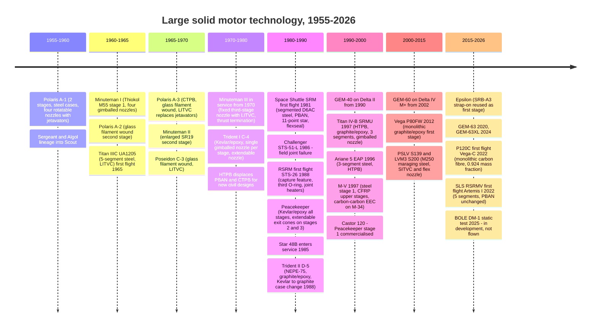

# Module 26 — Historical large solid motors
Part III · Prerequisites: modules 19–25 · Estimated time: 7 h

Every propulsion engineer eventually gets handed a table of "the great solid
motors" and asked to explain why one of them is better than another. The table
is almost always wrong. Not wrong in the sense of a typo — wrong in the sense
that half the thrust figures are per-vehicle and half are per-motor, some Isp
values are sea level and some vacuum, "burn time" silently switches between web
time and action time, and at least one apogee motor has two published specific
impulses six seconds apart because it flew with two different nozzles. I have
watched a trade study recommend the wrong booster because someone divided a
two-booster thrust by a one-booster mass. This module is the comparative
history — what was built, with what technology, and why — and it is also the
module where you learn to read a motor spec sheet like a hostile witness.

---

## 1. Learning objectives

After this module you should be able to:

- Classify any large solid motor by its five architecture axes — propellant
  binder family, case material and construction, nozzle and TVC concept, grain
  philosophy, and manufacturing/transport method — from a public description.
- Explain, quantitatively, why segmented steel cases persist despite a
  propellant mass fraction penalty of six to ten points against monolithic
  filament-wound composite.
- Convert between total impulse, average thrust, burn time and propellant mass,
  and detect an inconsistent published data set by doing so.
- State whether a quoted thrust is per-motor or per-vehicle, maximum or average,
  sea level or vacuum, and refuse to use one that is not tagged.
- Trace the four-step case-material progression (steel → glass filament wound →
  Kevlar/epoxy → graphite/epoxy) and estimate its effect on stage Δv.
- Trace the three-step solid TVC progression (jet deflection → liquid injection
  → gimballed flexseal nozzle) and name the loss mechanism each step removed.
- Describe the Shuttle SRM field-joint failure and the RSRM redesign at the
  architectural level: what rotated, what the capture feature does, and why the
  fix was geometric rather than chemical.
- Compute the payload consequence of a nozzle expansion-ratio change on an
  apogee kick motor, and say what inert-mass penalty would cancel it.
- Say which published figures in the solid-motor literature you would not print
  without a primary source, and why.

---

## 2. Terminology

| term | symbol | SI unit | definition |
|---|---|---|---|
| Total impulse | $I_t$ | N·s | time integral of thrust over the firing, $\int F\,dt$ |
| Average thrust | $\bar F$ | N | $I_t / t_b$ over a stated burn-time definition |
| Maximum thrust | $F_{max}$ | N | peak of the thrust trace, usually early |
| Web time | $t_w$ | s | ignition to web burnout (the knee of the trace) |
| Action time | $t_a$ | s | ignition to the point where $p_c$ falls to a stated low value (often 50 psi ≈ 0.345 MPa) |
| Specific impulse | $I_{sp}$ | s | $I_t/(m_p g_0)$; must be tagged vacuum or sea level |
| Propellant mass | $m_p$ | kg | mass of propellant loaded |
| Inert (burnout) mass | $m_i$ | kg | motor gross mass minus propellant |
| Propellant mass fraction | $\zeta$ | — | $m_p/(m_p+m_i)$ |
| Expansion ratio | $\varepsilon$ | — | $A_e/A_t$ |
| Nozzle deflection | $\delta$ | deg | maximum gimbal or vector angle |
| Grain web | $w$ | m | burning distance from initial port surface to insulation |
| Klemmung | $K_n$ | — | $A_b/A_t$, burning area over throat area |
| Segment | — | — | a case section with its own propellant casting, joined to others by a field joint |
| Field joint | — | — | a case joint made at the launch site, between flight segments |
| Factory joint | — | — | a case joint made and sealed at the factory, inside a flight segment |
| Flexseal | — | — | elastomer/shim laminated bearing that lets a nozzle pivot while sealing chamber pressure |
| LITVC / SITVC | — | — | liquid (secondary) injection thrust vector control: fluid injected into the divergent cone to create an asymmetric shock |
| Jetavator | — | — | a ring or vane moved into the exhaust to deflect it |
| EEC | — | — | extendable exit cone: a nozzle skirt deployed after stage separation to raise $\varepsilon$ |
| Thrust termination | — | — | deliberate depressurisation, usually by opening ports in the forward dome |
| PBAN | — | — | polybutadiene–acrylonitrile–acrylic acid terpolymer binder |
| HTPB | — | — | hydroxyl-terminated polybutadiene binder |
| CTPB | — | — | carboxyl-terminated polybutadiene binder |
| NEPE | — | — | nitrate-ester-plasticised polyether binder (high-energy class) |
| APCP | — | — | ammonium perchlorate composite propellant |
| D6AC | — | — | high-strength low-alloy steel used for large SRM cases |

---

## 3. Theory

### 3.1 First, how to read a spec sheet

Nothing in this module means anything until you can tag a number. Four
distinctions account for the overwhelming majority of published disagreements
in solid-motor data, and only the last one is a real disagreement.

**(a) Per-motor versus per-vehicle.** A vehicle with two boosters is routinely
described by the sum. Titan IV-A is the canonical trap: a widely reproduced
infobox gives "maximum thrust 14.234 MN (3,200,000 lbf)" for the UA1207, which
is the pair; a single UA1207 is about 7.1 MN [conf C on the number, B on the
architecture]. The same infobox habit gives the Titan IV-B SRMU as 15.12 MN,
again per-vehicle, ≈ 7.6 MN per motor. Ariane 5 is the second-worst offender.
Every thrust number in this module carries `/motor` or `/vehicle`. **[J]** If a
number in a document you are handed is not tagged this way, treat it as
untagged data, not as data you disagree with.

**(b) Maximum versus average.** Solid motors do not have "a thrust." They have a
trace. The ratio $F_{max}/\bar F$ is a direct read-out of grain philosophy: near
1.0 means a neutral grain, 1.3–1.5 means a deliberately progressive or
regressive shape. The LVM3 S200 publishes both — 5,150 kN max and 3,578 kN
average `/motor` — a ratio of 1.44, which tells you immediately that its trace
is nothing like the Shuttle SRB's [conf B] `[WP]` (ISRO material).

**(c) Sea level versus vacuum, and the flight average.** A first-stage solid
spends its life in between. The Shuttle RSRM is quoted at 242 s SL and 268 s
vac [conf B]; its flight-average lies between, and any total-impulse
reconstruction you do (see Worked Example 2) has to say which basis it used.

**(d) Web time versus action time.** The RSRM's ≈ 123–124 s is an *action time*
to 50 psi [conf A] `[NASA-SRB]`. Web time is shorter. Dividing total impulse by
action time and comparing with a thrust taken at the peak of the trace mixes
three conventions at once.

The genuine disagreements — the ones that survive tagging — are rarer and
worth naming when you hit them. Three examples used later in this module:

| quantity | value A | value B | resolution |
|---|---|---|---|
| RSRM propellant composition | AP 69.6 %, Fe₂O₃ 0.4 % | AP 69.8 %, Fe₂O₃ 0.2 % | NASA fact-sheet lineage gives the first [conf A]; the second is a single secondary [conf C]. Print the first, footnote the second. |
| RSRM case wall | 12.7 mm (0.5 in) nominal membrane [conf B] | "2 cm" [conf C] | 12.7 mm is consistent with published case mass and burst pressure. 2 cm is plausibly a local joint thickness. |
| Star 48B vacuum $I_{sp}$ | 286.2 s | 292.2 s | **Both are correct.** Short nozzle $\varepsilon \approx 47.7$ versus long nozzle $\varepsilon \approx 54.8$–70.4 [conf C]. Never quote "Star 48B Isp" without the nozzle. |

### 3.2 The five architecture axes

A large solid motor is fully specified, for comparative purposes, by five
choices. Everything else is sizing.

1. **Propellant binder family.** Polysulphide and polyurethane (1950s) →
   PBAA/PBAN (late 1950s–1970s) → CTPB (1960s) → HTPB (1970s onward) →
   nitramine-loaded and nitrate-ester-plasticised high-energy families for
   strategic applications. The trend is toward higher solids loading, better
   mechanical properties at low temperature, and longer pot life. **[H]**
2. **Case material and construction.** Steel monolithic → steel segmented →
   glass filament wound → Kevlar/epoxy → graphite (carbon)/epoxy, and
   orthogonally, monolithic versus segmented. **[H]**
3. **Nozzle and TVC concept.** Fixed nozzle (spin-stabilised or externally
   controlled stage) → jetavators/jet vanes → liquid or secondary injection →
   movable nozzle on a flexible bearing. Plus the submerged-versus-external
   nozzle choice and the extendable exit cone. **[H]**
4. **Grain philosophy.** What thrust trace the mission wants, and the port
   geometry that produces it: star, wagon wheel, finocyl, cylindrical bore,
   double-truncated-cone, end-burner. **[F]**
5. **Manufacturing and transport method.** Where the propellant is cast, how
   big a piece can leave the plant, and therefore whether the motor is
   segmented at all. This is the axis engineers underrate and programme
   managers never do.

#### Comparative table — propellant technology

| motor / family | binder family | published composition (where public) | decade of entry | conf |
|---|---|---|---|---|
| Shuttle SRM / RSRM | PBAN | AP 69.6 %, Al 16 %, Fe₂O₃ 0.4 %, PBAN 12.04 %, epoxy curative 1.96 % by mass | 1980s | A `[NASA-SRB]` |
| SLS RSRMV | PBAN — *unchanged from Shuttle* | same family | 2020s | A `[NASA-SLS-SRB]` |
| SLS BOLE (**in development**) | HTPB | not published | 2020s (claim) | B (claim) `[NG-BOLE]` |
| Titan UA1205/1206/1207 | PBAN | not published | 1960s–1980s | B |
| Titan SRMU | HTPB | not published | 1990s | B |
| Ariane 5 EAP | HTPB | AP 68 %, Al 18 %, HTPB 14 % | 1990s | B `[ESA-EAP]` |
| P120C / P160C | HTPB ("HTPB 1912") | Al 19 %, AP 69 %, HTPB 12 % — the name encodes 19 % Al, 12 % binder | 2020s | B |
| Vega P80FW, Zefiro 9A/23/40 | HTPB 1912 | as above | 2000s–2020s | B |
| GEM family | HTPB | not published | 1990s–2020s | B |
| Castor 120 | class 1.3 HTPB/AP | not published | 1990s | B |
| Star 48B | TP-H-3340 (HTPB/AP/Al) | not published | 1980s | C — **needs primary** |
| PSLV S139, LVM3 S200 | HTPB/AP/Al | not published | 1990s–2010s | B |
| M-V, Epsilon (SRB-A3) | HTPB composite (BP-207 family) | not published | 1990s–2010s | C |
| Minuteman I–III | AP/Al composite; stage 1 PBAN-class polybutadiene, later stages higher-energy binders | **not published beyond family** | 1960s–1970s | B (family only) |
| Peacekeeper | nitramine-loaded composite; open sources state HMX is present | **not published beyond family** | 1980s | C |
| Trident II D-5 | NEPE-75 (nitrate-ester-plasticised polyether) | **not published beyond family** | 1980s–90s | B (family only) `[FAS]` |

**Scope note.** For the strategic motors this course records the propellant
*family* name and nothing else — no percentages, no processing, no dimensions.
That is a deliberate stop, not a gap. Where an open source names an ingredient
family (HMX in Peacekeeper, NEPE-75 in D-5), the family name is recorded as
published architecture; anything finer is out of scope.

The technically interesting point across this table is how little the binder
chemistry moves for civil boosters after about 1980. HTPB won because it
tolerates 88–90 % solids loading with usable low-temperature elongation, and
nothing since has displaced it for large boosters. The energy gains available
from nitramine and nitrate-ester families are real — of order 10–20 s of
$I_{sp}$ — but they come with cost, hazard classification, ageing and
sensitivity penalties that a launch operator will not accept and a strategic
programme will. **[J]** The RSRMV is the extreme case: a motor first flown in
2022 using the 1970s PBAN formulation, because requalifying a propellant on a
crew-rated vehicle costs more than the performance is worth.

#### Comparative table — case technology

| motor | case material | construction | segments | $\zeta = m_p/m_{gross}$ | conf on masses |
|---|---|---|---|---|---|
| Shuttle RSRM | D6AC steel, ≈ 12.7 mm nominal membrane | segmented | 11 cast segments → **4 flight segments**, 3 field joints | **0.847** `[CALC]` (500 t of 590 t) | B |
| SLS RSRMV | D6AC steel — **refurbished Shuttle-era segments**, planned for the first eight flights | segmented | 5 | not computed — propellant mass not published on the NASA page | A on case, C on mass |
| SLS BOLE (**in development**) | carbon-fibre composite; DM-1 cases IM7/T300, DM-2 onward planned T1100 | segmented | 5 | not published | B (claim) |
| Titan UA1205/1207 | steel | segmented | 5 / 7 | not reliably published | B on architecture |
| Titan SRMU | graphite/epoxy filament wound | segmented | **3** | not reliably published | B on architecture |
| Ariane 5 EAP P241 | steel | segmented, bolted | 3 | **0.880** `[CALC]` (241 t of ≈ 274 t) | B/C |
| P120C | carbon-fibre filament wound | **monolithic — no segments, no field joints** | 1 | **0.924** `[CALC]` (141.4 t of 153 t) | B |
| Vega P80FW | graphite/epoxy filament wound | monolithic | 1 | **0.922** `[CALC]` | B |
| Zefiro 23 | carbon/epoxy filament wound | monolithic | 1 | **0.906** `[CALC]` | B |
| Zefiro 40 | carbon/epoxy filament wound | monolithic | 1 | **0.895** `[CALC]` | B |
| Zefiro 9A | carbon/epoxy filament wound | monolithic | 1 | **0.881** `[CALC]` | B |
| GEM-40 | carbon-fibre-reinforced polymer, filament wound | monolithic | 1 | **0.908** `[CALC]` | B |
| GEM-63XL | as above; "longest monolithic rocket motor produced to date" | monolithic | 1 | **0.902** `[CALC]` | B→A on $m_p$ `[NG-COMM]` |
| PSLV S139 | **M250 maraging steel** | segmented | multi | **0.821** `[CALC]` | B/C |
| LVM3 S200 | M250 maraging steel | segmented | 3 | not computed — inert mass not published | B |
| Star 48B | titanium (6Al-4V) | monolithic, near-spherical | 1 | **≈ 0.94** `[CALC]` | C on case material |
| Minuteman | stage 1 steel; stages 2 and 3 progressively to titanium then filament-wound composite | monolithic | 1 each | not recorded | C on the progression |
| Peacekeeper | **Kevlar/epoxy filament wound, all three solid stages** | monolithic | 1 each | not recorded | B |
| Trident I C-4 | Kevlar/epoxy | monolithic | 1 each | not recorded | B |
| Trident II D-5 | **graphite/epoxy** stages 1 and 2; stage 3 changed Kevlar → graphite/epoxy in 1988 | monolithic | 1 each | not recorded | B `[FAS]` |

This single table carries the most important quantitative claim in the module:
**a monolithic filament-wound composite case buys six to ten points of
propellant mass fraction over a segmented steel case of comparable size.**
0.924 for P120C against 0.847 for the RSRM. Worked Example 1 turns that into
Δv.

Two entries deserve a second look before you generalise.

- **PSLV S139 at 0.821** is the worst mass fraction in the table, and it is
  a maraging-steel segmented case carrying a secondary-injection TVC system
  with its injectant tanks. Maraging steel has an excellent
  strength-to-density ratio for a metal; the penalty is not the alloy, it is
  the joints and the TVC hardware.
- **Zefiro 9A at 0.881** is a composite case that scores *below* GEM-40's
  0.908. Small motors have worse mass fractions than large ones at the same
  technology level, because insulation, joints, the nozzle and the igniter do
  not scale with volume. Never compare $\zeta$ across a factor of ten in size
  and attribute the difference to case material. **[J]**

#### Comparative table — nozzle and TVC technology

| motor | nozzle | TVC concept | deflection | conf |
|---|---|---|---|---|
| Shuttle RSRM | carbon-phenolic and silica-phenolic ablative on steel/composite shell, **submerged** | flexible-bearing (flexseal) gimballed nozzle, two hydraulic actuators fed by two hydrazine APU/HPUs per booster | ±8° pitch and yaw | B |
| SLS RSRMV | **new nozzle design** vs RSRM | gimballed, hydraulic (Shuttle heritage) | not published | A / B |
| BOLE (**in development**) | not published; DM-1 saw a **nozzle anomaly near the end of the burn** | **electric** TVC, replacing hydraulic | not published | B (claim) |
| Titan UA1205/1207 | fixed | **LITVC**: N₂O₄ injected through exit-cone ports from external nacelles. Plus pyrotechnic thrust-termination ports in the forward dome | n/a | B |
| Titan SRMU | movable | **gimballed nozzle**, abandoning LITVC | not published | B |
| Ariane 5 EAP | carbon-phenolic ablative, flexseal joint | gimballed, hydraulic | **7.3°** (6° appears in some sources; use 7.3° and footnote) | B |
| P120C / Zefiro family | carbon-phenolic with **carbon–carbon throat insert** (Zefiro), flexseal joint | **electromechanical** actuators | not published | B/C |
| GEM-40/63/63XL | fixed | none (63XL vectorable variant cancelled) | — | B |
| GEM-46, GEM-60 | fixed **or** vectorable variant | vectorable variants exist | not published | B |
| Star 48B | carbon-phenolic, **fixed**; spin-stabilised stage | none (Star 48BV adds TVC and does not spin) | — | B |
| Orbus 6 / Orbus 21 (IUS) | **extendable exit cone (EEC)** | gimballed | not published | C — needs primary |
| PSLV S139 | fixed | **SITVC using aqueous strontium perchlorate** injected into the exit cone for pitch and yaw; roll by a separate liquid RCS module | n/a | B |
| LVM3 S200 | flexible joint | **flex nozzle, electro-hydraulic** | ±8° | B |
| M-V stage 1 | movable nozzle | gimballed | not published | C |
| M-V stage 3 (M-34b) | **carbon–carbon extendable exit cone** | — | — | C |
| Epsilon SRB-A3 | movable nozzle | gimballed | not published | B |
| Minuteman I stage 1 | **four gimballed nozzles** | four-nozzle gimbal | not published | B |
| Minuteman stage 2 | fixed | **liquid injection** (Freon-class injectant, II/III era) | n/a | B |
| Minuteman III stage 3 | **fixed nozzle with a liquid-injection TVC system**; thrust-termination ports in the forward dome | LITVC | n/a | B |
| Peacekeeper stages 2, 3 | **extendable exit cones** | not recorded | — | B |
| Polaris A-1 / A-2 | **four rotatable nozzles with jetavators** | jet deflection | — | C |
| Polaris A-3, Poseidon C-3 | fixed | **LITVC (Freon injection)** replacing jetavators | n/a | C |
| Trident I C-4 | **single gimballed nozzle per stage**, extendable nozzle | gimbal | — | B |
| Trident II D-5 | **one oscillating (gimballed) graphite-composite nozzle per stage** | gimbal | — | B `[FAS]` |

**The Trident "aerospike" is not an aerospike nozzle.** It is a telescoping
drag-reduction spike deployed from the nose of the missile, reported to cut
frontal drag by roughly 50 % and buy range [conf B]. The naming collision with
the aerospike nozzle of Module 09 catches students every year. Say it out loud
once and never confuse them again.

#### Comparative table — grain philosophy and thrust-trace shape

| motor | grain | trace shape | $F_{max}/\bar F$ | why |
|---|---|---|---|---|
| Shuttle RSRM | forward segment **11-point star**; aft segments **double-truncated-cone** perforation | rises to ≈ 14.7 MN `/motor` `max` SL at ≈ t+20 s, then falls substantially through mid-burn | ≈ 1.4–1.5 by reconstruction (WE2) | the star burns out deliberately to drop thrust through max-Q and hold vehicle loads inside the structural box |
| Ariane 5 EAP | forward segment star, aft segments cylindrical bore [conf C] | progressive then regressive | ≈ 1.5 by reconstruction [conf C inputs] | same max-Q logic, less aggressively |
| LVM3 S200 | 3 segments, published split: head-end 27,100 kg, middle 97,380 kg, nozzle-end 82,210 kg | strongly progressive then regressive | **1.44 published** | the only large motor with a public per-segment propellant split; use it for grain-design problems |
| P120C | monolithic single cast | regressive after peak | ≈ 1.6 by reconstruction [conf C inputs] | single cast, no segment tailoring available |
| GEM-40 | not published | near-neutral over a 63 s burn | ≈ 1.29 by reconstruction | strap-on augmentation wants a flat trace |
| GEM-46 | not published | **lower peak thrust than GEM-40 despite 43 % more propellant**, over a longer burn | — | a deliberate choice for the Delta III trajectory, not a transcription error |
| Star 48B | not published | near-neutral over ≈ 87 s | — | apogee kick wants low, steady thrust to limit gravity-loss-free but structurally gentle burn |
| Minuteman III stage 3 | not published | terminated, not burned out | — | **thrust termination**: shaped charges open forward-dome ports, chamber pressure collapses and thrust stops, setting final velocity |

The GEM-46 line is worth stopping on. It has 43 % more propellant than GEM-40
and *less* maximum thrust (611 kN vs 644 kN `max`), because its burn is 75.9 s
against 63.3 s. "Bigger motor" and "more thrust" are independent statements in
solid propulsion; the mission picks the trace and the grain delivers it. **[F]**

#### Comparative table — manufacturing method

| motor | where cast | how it ships | why |
|---|---|---|---|
| Shuttle RSRM | Promontory, Utah — **inland, 1,200 km from the launch site** | 11 casting segments by **rail** to KSC, stacked into 4 flight segments in the VAB | rail clearance and car length set the segment size. The segmentation is a transport decision first and a manufacturing decision second. |
| SLS RSRMV | Promontory | rail, 5 segments | inherited constraint, inherited case hardware |
| Ariane 5 EAP | **Regulus, Kourou** (loading) with cases from Europe | segments cast at the launch site; case segments shipped by sea | avoids shipping loaded segments across the Atlantic |
| P120C | **Regulus, Kourou and Avio, Colleferro** | cast at or near the launch site as **one monolithic piece** | site casting is what makes the monolith possible — a 13.5 m, 153 t single-piece motor cannot be rail-shipped |
| P120C case | wound in a climate-controlled hall: ≈ 3,500 km of carbon fibre over ≈ 33 days [conf C] | — | the case is the long-lead item, not the propellant |
| GEM family | Utah | road/rail; motors are ≤ 1.62 m diameter and ≤ 22 m | small enough to stay monolithic and still ship |
| Vega Zefiro | Colleferro, Italy → Kourou | sea | monolithic, but small |
| Star 48B | Elkton, Maryland | air/road; it is a 2 t motor | — |

The pattern is exact and it is the single most useful causal claim in this
module: **motors that must be transported over land in segments are segmented;
motors cast at or near the launch site are monolithic.** Everything else —
mass fraction, joint count, insulation strategy, failure modes — follows from
that.

#### Comparative table — reliability record, as far as the public record shows

| family | flights / record | conf |
|---|---|---|
| Shuttle SRM/RSRM | first flight STS-1, 1981-04-12; **one loss of vehicle, STS-51-L, 1986-01-28**, aft field joint of the right-hand booster; RSRM first flight STS-26, 1988-09-29; last flight STS-135, 2011-07-08, no further motor loss | B `[Rogers86]` |
| SLS RSRMV | first flight Artemis I, 2022-11-16 | B |
| BOLE | **not flown.** DM-1 static test 2025-06-26; **nozzle anomaly observed near the end of the burn** | A/B |
| Ariane 5 EAP | 1996–2023 | B |
| Vega / Vega-C | **VV15, 2019-07-11**: Zefiro 23 second-stage failure shortly after ignition, vehicle lost. **VV22, 2022-12-20**: Zefiro 40 under-pressure at second-stage burn, vehicle lost; independent inquiry attributed it to unexpected erosion of the **carbon–carbon nozzle throat insert**, traced to an insert material supplier change | B on the events, **C on the VV22 attribution detail — needs primary** |
| GEM family | GEM-40 1990-11-26 → 2018-09-15; GEM-63 2020-11-13 → 2026-07-02; GEM-63XL 2024-01-08 → active | B |
| Orion / Pegasus | Northrop Grumman states 14 Orion variants, ≈ 500 delivered, first flight 1990, **zero flight failures across 100+ launches** | B (manufacturer claim) |
| Titan SRMU | development troubled; a case **failed during a 1991 structural test, killing one worker**, and the programme slipped years, so early Titan IV-B flights used leftover UA1207s | **C — needs primary (GAO report or AIAA paper) before this is stated as fact** |

The VV22 failure is the best modern teaching case available: a materials
qualification decision inside a subcomponent — a throat insert supplier change
— destroyed a launch vehicle. It belongs in the nozzle-materials discussion of
Module 24 and in the quality-assurance discussion of Module 25 as much as here.

### 3.3 Timeline

### 3.4 Segmented versus monolithic: the decision, done properly

Take a motor of propellant mass $m_p$ and burnout mass $m_i$ pushing an upper
stack of mass $m_u$. Its contribution to vehicle Δv is

$$\Delta v = I_{sp}\,g_0 \ln\!\frac{m_p+m_i+m_u}{m_i+m_u}$$

> **Eq. 3.1** — variables: $I_{sp}$ specific impulse [s], $g_0 = 9.80665$ m/s²,
> $m_p$ propellant mass [kg], $m_i$ motor inert mass [kg], $m_u$ everything
> above the stage [kg]. Meaning: the ideal velocity increment from burning
> $m_p$. Assumes: constant $I_{sp}$, no gravity or drag losses, all of $m_i$
> carried to burnout. Fails when: the stage is a strap-on jettisoned before
> burnout, or when $I_{sp}$ varies strongly through the trajectory — for a
> first-stage solid it varies from SL to near-vacuum values, so use a
> flight-average and label it **[A]**.

Writing $m_i = m_p(1/\zeta - 1)$ makes the case-technology dependence explicit:

$$\Delta v = I_{sp}\,g_0 \ln\!\frac{m_p/\zeta + m_u}{m_p(1/\zeta - 1) + m_u}$$

> **Eq. 3.2** — variables as Eq. 3.1 plus $\zeta = m_p/(m_p+m_i)$ propellant
> mass fraction [—]. Meaning: Δv in terms of the two numbers a case designer
> actually controls, $m_p$ and $\zeta$. Assumes: everything in Eq. 3.1.
> Fails when: $m_i$ contains items that are not case — TVC injectant tanks,
> recovery parachutes, separation motors — which is exactly the PSLV S139 and
> Shuttle RSRM situation, so $\zeta$ is a *stage* property, not a case property.

Differentiating at fixed $m_p$ and $m_u$, an increase in $\zeta$ helps only
through the denominator, and the sensitivity is largest when $m_u$ is small
compared with $m_i$ — that is, for upper stages and kick motors. For a booster
carrying a heavy stack above it, a case-mass saving is diluted. **[F]** This is
why the composite-case revolution happened in strategic upper stages and apogee
motors a decade before it reached large boosters, and why the Shuttle could
tolerate a 0.847 mass fraction: the SRBs carry an Orbiter and an External Tank,
so $m_u$ dominates and the sensitivity to $\zeta$ is muted.

But the transport argument is stronger than the mass argument, and it runs the
other way. The RSRM is cast in Promontory, Utah, and fired in Florida. A
monolithic 45 m, 590 t steel or composite case cannot be moved. So the motor is
cast in eleven segments, shipped by rail, and stacked into four flight segments
with three field joints. Each field joint is a place where hot gas at 6.25 MPa
and ≈ 3,400 K is held back by elastomer, and where the case can rotate under
pressurisation. **The joint count is the price of the factory location.**

P120C inverts every term. It is cast at Kourou and at Colleferro, on or near
the coast, into a filament-wound monolith 13.5 m long and 3.4 m in diameter.
Nothing has to cross a continent. There are no field joints at all. Mass
fraction 0.924. **[M]**

If you want the decision as a rule: **you segment when the plant and the pad
are far apart and the motor is too big for the transport mode. Otherwise you do
not, and you should be suspicious of any new design that does.** **[J]**

### 3.5 The Shuttle SRM field joint and the RSRM redesign — architecture level

This is in Module 34 as a full case study; here it is only the architecture,
because the architecture is what generalises.

**Original SRM tang-and-clevis joint.** The upper segment's tang slid into the
lower segment's clevis; two fluorocarbon O-rings, primary and secondary, sat in
grooves in the clevis. Zinc-chromate putty upstream was intended to keep hot gas
off the rings.

**The mechanism.** Under ignition pressurisation the case bulges. Because the
tang and the clevis legs have different stiffnesses and the load path is
eccentric, the joint *rotates*: the tang and the inner clevis leg deflect apart,
momentarily **opening** the gap the O-rings must seal, at exactly the instant
the chamber is pressurising. The rings had to extrude into the growing gap
faster than the gap opened. That is a rate-dependent seal, and the extrusion
rate of a fluorocarbon elastomer falls sharply as temperature falls
[conf B, `[Rogers86]` ch. IV].

**The failure.** On STS-51-L, 1986-01-28, cold-stiffened O-rings failed to seat
in the aft field joint of the right-hand SRB. Hot gas blew by, burned through
the joint, and the resulting plume impinged on the External Tank aft attachment
and the tank itself [conf B, `[Rogers86]`].

**The redesign.** Architecturally, four changes:

1. A **capture feature** on the tang — an inner lip that engages the inside
   clevis leg and mechanically limits joint rotation. The gap can no longer open
   the way it did.
2. A **third O-ring** on the capture feature.
3. Redesigned **insulation** to shield the joint from hot gas.
4. **Joint heaters** to hold the seals above a minimum temperature.

Wikipedia notes the capture-feature concept was drawn from the "double tang"
joint of the abandoned filament-wound case booster; that provenance is
[conf C], the rest is [conf B].

**The lesson, and it is the reason this appears in a comparative history
module.** The seal was not the problem. The **rotation** was the problem. A
generation of engineers looked at a leaking joint and reached for a better
elastomer; the fix was geometric. When you see a seal failure in a pressurised
structure, your first question is what the structure does under pressure, not
what the seal is made of. **[J]** Note also that the monolithic composite cases
that dominate new civil design do not have this failure mode at all, because
they do not have the joint.

### 3.6 The two architectural arcs in strategic solid motors

Public history, architecture only. Stage count, propellant family, case family,
nozzle concept, decade, manufacturer — nothing else, per the course scope
boundary.

| system | stages | propellant family (open sources) | case family | nozzle / TVC concept | decade | conf |
|---|---|---|---|---|---|---|
| Polaris A-1 | 2 | polyurethane / PBAA-class AP composite | steel | four rotatable nozzles with jetavators | late 1950s | C |
| Polaris A-2 | 2 | AP composite; second stage toward higher-energy binder | steel; **glass filament wound second stage** | rotatable nozzles / jetavators | early 1960s | C |
| Polaris A-3 | 2 | CTPB-class composite, both stages | glass filament wound | **LITVC (Freon injection)** replacing jetavators | mid 1960s | C |
| Poseidon C-3 | 2 | high-energy composite (nitramine-loaded) | glass filament wound | LITVC | late 1960s–70s | C |
| Trident I C-4 | 3 | high-energy composite | **Kevlar/epoxy** | single gimballed nozzle per stage; extendable nozzle; aerospike (drag spike) | late 1970s | B |
| Trident II D-5 | 3 | **NEPE-75** | **graphite/epoxy** stages 1–2; stage 3 Kevlar → graphite/epoxy in 1988 | one oscillating gimballed graphite-composite nozzle per stage; aerospike (drag spike) | 1980s–90s | B `[FAS]` |
| Minuteman I | 3 | AP/Al composite; stage 1 PBAN-class | stage 1 steel; upper stages toward filament-wound composite | stage 1 four gimballed nozzles; stage 2 liquid injection; stage 3 LITVC | 1962–1969 | B / C on the case progression |
| Minuteman II | 3 | as above | as above | as above | 1965–1990s | B |
| Minuteman III | 3 | as above | as above | stage 3 **fixed nozzle with liquid-injection TVC**; thrust-termination ports | 1970– | B |
| Peacekeeper | 3 + liquid PBV | nitramine-loaded composite; HMX named in open sources [conf C] | **Kevlar/epoxy, all three solid stages** | **extendable exit cones on stages 2 and 3** | 1980s | B |

Manufacturers, as published: Minuteman stage 1 Thiokol (M55/M55A1), stage 2
Aerojet (SR19-AJ-1), stage 3 Aerojet/Thiokol then Hercules (SR73-AJ-1 / M57).
Peacekeeper stage 1 Thiokol SR118, stage 2 Aerojet General SR119, stage 3
Hercules SR120, post-boost vehicle a restartable storable-hypergolic liquid
stage by Rocketdyne. [conf B]

**Arc 1 — nozzle control.** Jetavators (1950s: simple, no moving seal, but they
sit in the exhaust and cost thrust continuously whether you are steering or
not) → liquid injection (1960s: no moving nozzle, no continuous loss, but you
carry injectant and tanks and the side force is limited by how much you brought)
→ single gimballed flexseal nozzle (1970s onward: efficient, no expendable
injectant, but it needs a flexible bearing that will survive years of submarine
or silo storage and then work once). Trident's *single* gimballed nozzle per
stage replacing four rotatable nozzles is a large inert-mass and complexity win.
[conf B]

**Arc 2 — case material.** steel → glass filament wound → Kevlar/epoxy →
graphite/epoxy. Each step is roughly a **20–30 % case-mass reduction at equal
burst pressure** [conf B]. That progression alone accounts for a large part of
the range growth from Polaris A-1 to Trident D-5, independent of any chemistry
change. The D-5 stage-3 Kevlar → graphite change of 1988 is documented in open
sources with two stated reasons: inert-weight reduction **and** elimination of
the electrostatic potential difference between Kevlar and graphite structures
[conf B, `[FAS]`]. The second reason is the kind of thing that never appears in
a textbook trade study and always appears in a real one.

**Extendable exit cones** are the other strategic-specific architecture worth
teaching. A silo or a launch tube is length-limited. An EEC lets a stage stow a
short nozzle and deploy a high-$\varepsilon$ skirt after separation, buying of
order 10–15 s of $I_{sp}$ for a deployment mechanism and its failure modes.
Peacekeeper stages 2 and 3 [conf B], Trident I [conf B], and on the civil side
the IUS Orbus 6 and Orbus 21 [conf C — needs primary] and the M-V M-34b
carbon–carbon EEC [conf C]. Very few solid EECs have flown; the IUS is the
flight-proven reference.

**Commercial transfer.** Castor 120 is the clearest public case of an ICBM
first-stage motor commercialised essentially unchanged — a direct derivative of
the Peacekeeper stage-1 motor, 2.34 m diameter, 1,900 kN, 83.4 s, $I_{sp}$
280 s, class 1.3 HTPB/AP, flown as Athena I/II stage 1 and Taurus stage 0
[conf B]. Note what transferred: the **architecture** — HTPB propellant,
filament-wound composite case, movable nozzle. Not a formulation. **[H]**

### 3.7 The non-US large solids

**Ariane 5 EAP (P230 → P238 → P241).** Three-segment bolted steel case, HTPB
(AP 68 %, Al 18 %, HTPB 14 %), carbon-phenolic flexseal nozzle, 31.6 m ×
3.06 m, 1996–2023. The designation is the propellant load in tonnes — P241
carries 241 t — and the P230→P241 series is a textbook demonstration of
squeezing performance out of a frozen case: **more propellant and a higher
expansion ratio (9.7 raised to 11.0 after 1997), no chemistry change, no case
change.** [conf B]

**A warning specific to Ariane 5.** A widely reproduced source gives "propellant
mass 270,000 kg" for P238 and 273,000 kg for P241. Those are **gross masses,
mislabelled**. By definition P*nnn* is the propellant load. Do not propagate
270/273 t as propellant mass; you will compute a mass fraction above 0.98 and
believe it.

**P120C and P160C.** Covered above. P160C is a stretched derivative at ≈ 160 t
propellant for later Ariane 6 and Vega-E, **in development / early flight**
[conf C]. Label it as such.

**Vega and Vega-C.** P80FW first stage (88,365 kg propellant, 2,261 kN max,
$I_{sp}$ 280 s, 107 s), Zefiro 23 (23,814 kg, 1,120 kN, 287.5 s, 77.1 s),
Zefiro 40 (36,239 kg, 1,304 kN, 293.5 s, 92.9 s), Zefiro 9A (10,567 kg, 317 kN,
295.9 s, 119.6 s) [all conf B]. Common architecture: 1.9 m or 2.4 m
carbon-epoxy filament-wound cases, **low-density EPDM insulation**,
carbon-phenolic nozzles with **carbon–carbon throat inserts**, flexible nozzle
joints, **electromechanical TVC**, HTPB 1912 throughout. The Zefiro family is
the cleanest example in the world of a *family* of solid stages built to one
architecture at three sizes.

**India.** PSLV S139 core: 138,200 kg HTPB/AP/Al in a **M250 maraging steel**
segmented case, 2.8 m diameter, 4,846.9 kN `/motor` `max` [conf C], 237 s SL /
269 s vac [conf C], with **SITVC using aqueous strontium perchlorate** injected
into the exit cone for pitch and yaw and a separate liquid RCS for roll
[conf B]. That injectant choice is genuinely distinctive: it is liquid-injection
TVC with a dense, cheap, non-toxic fluid, and it lets a very large motor keep a
fixed nozzle. LVM3 S200: 205,000 kg per booster, three segments, M250 maraging
steel, **flex nozzle ±8° on electro-hydraulic actuators**, 5,150 kN `max` /
3,578.2 kN `avg` `/motor`, 274.5 s vac, 128 s, 25 m × 3.2 m [conf B]. The
published per-segment split — 27,100 / 97,380 / 82,210 kg — is unusually
generous documentation and makes S200 the best available worked example for
grain and thrust-trace problems. Note it sums to 206,690 kg against a stated
205,000 kg; a 0.8 % inconsistency, which is what published data looks like.

**Japan.** M-V (1997–2006): four stages, HT-230M high-strength steel case on
stage 1, **CFRP filament-wound cases on the upper stages**, HTPB-bound
composite (BP-207 family), movable nozzle TVC on stage 1, and a
**carbon–carbon extendable exit cone on the M-34 third stage** [conf C
throughout — needs primary from JAXA/ISAS `[JAXA]`]. At retirement M-V was the
largest all-solid orbital launcher ever flown and carried the
highest-performing solid upper stage set in service (M-34b $I_{sp}$ ≈ 301 s
vac). Epsilon: stage 1 **SRB-A3** (65,900 kg, 2,271 kN max, 284 s, 116 s
[conf B]) — the H-IIA/H-IIB strap-on booster reused as an orbital first stage,
CFRP filament-wound monolithic case, HTPB, movable nozzle, IHI Aerospace —
with M-35 and KM-V2c upper stages descended from M-V. **Reusing a strap-on as a
first stage is the entire cost argument for Epsilon.** **[M]**

**One number in the M-V table that you must not use.** A widely mirrored M-V
infobox gives the M-24 second stage $I_{sp}$ as **203 s**. That is not
physically credible for an HTPB/AP/Al upper-stage motor with a high-expansion
nozzle sitting between a 246 s first stage and a 301 s third stage. It is
almost certainly a transcription error. The expected value is ~282–292 s.
Flagged unresolved [conf D]; do not use it.

**China.** Public data is thin and mostly non-primary. Long March 6A uses four
FG-112 solid strap-ons, 15.1 m × 2.0 m, 1,214 kN `max` `/motor`, 4,828 kN
`/vehicle` — the first Chinese launcher combining a liquid core with solid
strap-ons [conf C]. Long March 11 is an all-solid four-stage launcher derived
from road-mobile missile technology; open specifications are inconsistent and no
verified set exists, so **no numbers are tabulated here** [conf D]. The CZ-3 and
CZ-4 families use no solid strap-ons — they are hypergolic. That is the honest
extent of it.

**Israel.** Shavit: three solid stages (IMI LK-1 first and second stages, Rafael
RSA-3-3 third stage) plus an optional liquid fourth. All figures [conf C]. The
engineering point worth teaching is not the motors: Shavit launches
**retrograde, westward over the Mediterranean** for range-safety reasons, paying
roughly 2 × 460 m/s of Earth-rotation penalty. Geography, not propulsion, sets
its payload.

### 3.8 The all-solid pathfinder: Scout

Scout (NASA/LTV) is the reference case for **spin stabilisation of upper stages
in place of TVC**. Four stages — Algol (Aerojet General), Castor (Thiokol),
Antares (ABL/Hercules), Altair (ABL) — with stages 3 and 4 spun up and flown
unguided [conf B on architecture, C on the numbers]. That removes the actuator,
the hydraulics, the power and their mass, and pays for it in injection accuracy.
Scout is also the heritage line: Algol came from Polaris, Castor from Sergeant.
Almost every American solid stage traces to one of those two ancestors. **[H]**

### 3.9 Kick motors: why they look different

Apogee and perigee kick motors — the Star and Orbus families — are a separate
species and they show it in every axis.

- **Case geometry is near-spherical or short-cylindrical.** A sphere is the
  minimum-surface-area pressure vessel for a given volume, so it has the best
  mass fraction. You can only use it when the motor's length is not constrained
  by a stage stack and when the grain can be shaped inside it. Star 48B reaches
  $\zeta \approx 0.94$ this way [conf C on the titanium case material —
  **needs primary**].
- **Nozzles are fixed and $\varepsilon$ is large.** The stage is spin-stabilised,
  so no TVC hardware. $\varepsilon$ of 47.7 to 70.4 on Star 48B, against 7.16–7.72
  on the Shuttle SRB. Vacuum operation and no atmospheric back-pressure to
  worry about.
- **Burn times are long and thrust is low.** Star 48B: ≈ 66.0–66.4 kN vacuum
  over ≈ 87 s [conf B]. That is 3 % of an RSRM's peak thrust over two thirds of
  its burn.
- **The nozzle is the product variant.** Star 48B ships in short-nozzle and
  long-nozzle configurations with $I_{sp}$ 286.2 s and 292.2 s vacuum
  respectively [conf C]. Worked Example 3 converts those six seconds into
  payload.
- **Extendable exit cones appear here too.** The IUS Orbus 6 and Orbus 21 used
  Kevlar-epoxy cases with EECs and gimballed nozzles [conf C — needs primary];
  the IUS EEC is the flight-proven reference for the concept.

**Star 48B inert mass — a resolved disagreement worth showing your working on.**
One catalogue gives 28 kg, another 126 kg. Gross mass ≈ 2,137 kg and propellant
2,009–2,011 kg, so $m_i = 2137 - 2009 = 128$ kg. The 126 kg figure is
essentially right; the 28 kg figure is almost certainly a dropped leading digit.
Use ≈ 128 kg and $\zeta \approx 0.94$. **This is how you resolve a catalogue
disagreement: by an arithmetic identity the catalogue itself has to satisfy.**

**Star 37 family** — 37 in (0.94 m) class apogee motors (37E, 37F, 37FM,
37XFP); Star 37FM flew as the Lunar Prospector injection motor; titanium or
steel cases, TP-H-3340-class HTPB propellant, fixed carbon-phenolic nozzle,
$I_{sp}$ roughly 286–290 s vacuum. All [conf C] and **needs primary** — the
Northrop Grumman propulsion catalogue would settle it. **No Star 37 numbers are
used in any calculation in this module for that reason.**

---

## 4. Typical engineering ranges

| quantity | typical range for large solids | low extreme | high extreme |
|---|---|---|---|
| Propellant mass fraction $\zeta$, segmented steel booster | 0.82–0.88 | PSLV S139, **0.821** (maraging steel, segmented, SITVC tanks in the inert mass) | Ariane 5 P241, **0.880** |
| $\zeta$, monolithic filament-wound booster | 0.89–0.93 | Zefiro 9A, **0.881** (small motor, fixed overheads) | P120C, **0.924** |
| $\zeta$, spherical kick motor | 0.92–0.95 | — | Star 48B, **≈ 0.94** |
| Vacuum $I_{sp}$, large booster | 265–285 s | Shuttle RSRM 268 s | P120C ≈ 280 s |
| Vacuum $I_{sp}$, upper stage / kick motor | 280–302 s | Orion 38, 281.7 s | M-V M-34, ≈ 301 s |
| Chamber pressure, large booster | 4–7 MPa | — | Shuttle RSRM ≈ 6.25 MPa (906.8 psi) nominal, ≈ 6.4 MPa peak |
| Expansion ratio, booster | 7–11 | Shuttle RSRM 7.16–7.72 | Ariane 5 EAP 9.7 → 11.0 |
| Expansion ratio, kick motor | 45–75 | Star 48B short, 47.7 | Star 48B long, up to 70.4 |
| Burn time, large booster | 60–140 s | GEM-40, 63.3 s | Titan SRMU ≈ 140 s [conf C] |
| $F_{max}/\bar F$ | 1.0–1.6 | GEM-40, ≈ 1.29 | LVM3 S200, **1.44 published**; P120C ≈ 1.6 by reconstruction |
| Nozzle deflection, gimballed booster | 6–8° | Ariane 5 EAP, 7.3° | Shuttle RSRM and LVM3 S200, ±8° |
| Segment count, segmented booster | 3–7 | Ariane 5 EAP, Titan SRMU, LVM3 S200: **3** | Titan UA1207: **7** |
| Thrust `/motor` `max`, large booster | 2–16 MN | GEM-40, 0.64 MN | SLS RSRMV, ≈ 16.0 MN (3.6 Mlbf) |

Numbers in this table carry the confidence of their source entry; the mass
fractions marked in bold are `[CALC]` from tabulated propellant and gross
masses whose own confidence is B or C.

---

## 5. Worked examples

### WE1 — What a case material is worth, in Δv

**Problem.** A generic strap-on booster carries 100,000 kg of HTPB/AP/Al
propellant at a flight-average $I_{sp}$ of 275 s. Above it sits 50,000 kg of
vehicle (core stage, upper stage, payload — everything the booster must
accelerate). Compare the Δv contribution for (a) a segmented steel case giving a
stage propellant mass fraction $\zeta = 0.85$ and (b) a monolithic
filament-wound composite case giving $\zeta = 0.92$. These are generic values
chosen to bracket the real ones: the Shuttle RSRM computes to 0.847 and P120C
to 0.924.

**Step 1 — inert masses.**

$$m_i = m_p\left(\frac{1}{\zeta}-1\right)$$

Steel: $m_i = 100{,}000\,(1/0.85 - 1) = 100{,}000 \times 0.17647 = 17{,}647$ kg.
Composite: $m_i = 100{,}000\,(1/0.92 - 1) = 100{,}000 \times 0.086957 = 8{,}696$ kg.

The case change removes 8,951 kg of inert mass — 9 % of the propellant load.

**Step 2 — mass ratios.**

Steel: $m_0 = 100{,}000 + 17{,}647 + 50{,}000 = 167{,}647$ kg;
$m_f = 17{,}647 + 50{,}000 = 67{,}647$ kg; $m_0/m_f = 2.4783$.

Composite: $m_0 = 158{,}696$ kg; $m_f = 58{,}696$ kg; $m_0/m_f = 2.7037$.

**Step 3 — Δv, Eq. 3.1.**

$$\Delta v_{steel} = 275 \times 9.80665 \times \ln(2.4783) = 2696.8 \times 0.90766 = 2447.5\ \mathrm{m/s}$$
$$\Delta v_{comp} = 275 \times 9.80665 \times \ln(2.7037) = 2696.8 \times 0.99472 = 2682.3\ \mathrm{m/s}$$

**Result: +234.8 m/s, a 9.6 % Δv gain, from the case alone.** No propellant
change, no nozzle change, no extra propellant loaded.

**Step 4 — the framing that flatters composite even more.** Suppose instead the
gross booster mass is fixed at 200,000 kg by pad and structural limits, and the
case technology decides how much of that is propellant. Steel: 170,000 kg
propellant, 30,000 kg inert → Δv = 3,072.9 m/s. Composite: 184,000 kg
propellant, 16,000 kg inert → Δv = 3,591.7 m/s. **+518.8 m/s, 16.9 %.** Which
framing is honest depends on what is actually constrained — mass or volume — and
you must say which you assumed.

**Sanity check.** The full sweep at fixed $m_p = 100{,}000$ kg and
$m_u = 50{,}000$ kg:

| $\zeta$ | $m_i$ (kg) | Δv (m/s) |
|---|---|---|
| 0.82 | 21,951 | 2,349.5 |
| 0.85 | 17,647 | 2,447.5 |
| 0.88 | 13,636 | 2,547.1 |
| 0.90 | 11,111 | 2,614.3 |
| 0.92 | 8,696 | 2,682.3 |
| 0.94 | 6,383 | 2,751.1 |

Roughly **33 m/s per point of $\zeta$** in this configuration. Against the real
motors, the RSRM (0.847) to P120C (0.924) gap is 7.7 points ≈ 255 m/s of stage
Δv — and the sensitivity would be considerably higher for an upper stage where
$m_u$ is small. That matches the argument in §3.4 that composite cases won in
upper stages first.

### WE2 — Reconstructing RSRM average thrust from total impulse and burn time

**Problem.** Published RSRM figures: propellant mass ≈ 500,000 kg (1,100,000 lb)
[conf B], $I_{sp}$ 242 s SL and 268 s vacuum [conf B], action time ≈ 123–124 s
to 50 psi [conf A], maximum thrust ≈ 14.7 MN (3,300,000 lbf) `/motor` `max` at
sea level at about t+20 s [conf B], liftoff thrust ≈ 12.5 MN (2,800,000 lbf)
`/motor` sea level [conf B]. Reconstruct the average thrust and check it against
the published thrust figures.

**Step 1 — total impulse from propellant and $I_{sp}$.** By definition
$I_t = m_p\,I_{sp}\,g_0$. Because the booster flies from sea level to about
45 km, the true value lies between the two bases:

$$I_t^{SL} = 500{,}000 \times 242 \times 9.80665 = 1.1866\times10^{9}\ \mathrm{N\,s}$$
$$I_t^{vac} = 500{,}000 \times 268 \times 9.80665 = 1.3141\times10^{9}\ \mathrm{N\,s}$$

> **Eq. 5.1** — $I_t = m_p I_{sp} g_0$; variables: $I_t$ total impulse [N·s],
> $m_p$ propellant mass [kg], $I_{sp}$ [s], $g_0$ [m/s²]. Meaning: specific
> impulse *is* impulse per unit weight of propellant, so this is a definition,
> not a model. Assumes: all propellant is consumed and $I_{sp}$ is the
> delivered, mission-average value on the stated pressure basis. Fails when:
> there is significant slag or unburned sliver residual, or when the quoted
> $I_{sp}$ is a theoretical rather than delivered figure.

**Step 2 — average thrust.**

$$\bar F = \frac{I_t}{t_a}$$

| basis | $t_a$ = 123 s | $t_a$ = 124 s |
|---|---|---|
| sea level (242 s) | **9.65 MN** | 9.57 MN |
| vacuum (268 s) | **10.68 MN** | 10.60 MN |

**Step 3 — the check.** Published `max` is 14.7 MN and liftoff is 12.5 MN, both
sea level, both `/motor`. So

$$\frac{\bar F_{SL}}{F_{max}} = \frac{9.65}{14.7} = 0.656, \qquad
\frac{\bar F_{vac}}{F_{max}} = \frac{10.68}{14.7} = 0.727$$

**Is that credible?** Yes, and it is the whole point of the example. A ratio of
0.66–0.73 says the trace spends most of its life well below its peak. That is
exactly what the grain is designed to do: the **11-point star** in the forward
segment gives a high initial burning area that peaks the thrust around t+20 s,
then burns out and lets the thrust fall through the max-Q region so the vehicle
does not exceed its structural load box. A neutral-burning motor of the same
total impulse would peak at about 10 MN and hold it, and the Shuttle stack could
not have taken the resulting dynamic pressure at the same trajectory.

Note also that liftoff thrust (12.5 MN) is *below* peak (14.7 MN): the motor is
still building. Anyone who reads "SRB thrust = 12.5 MN" as a constant and
multiplies by 123 s gets $1.54\times10^9$ N·s, 17–30 % too high.

**Step 4 — inverting the check.** If you were handed only $F_{max}$, $t_a$ and
$m_p$ and assumed a neutral trace, you would infer
$I_{sp} = F_{max} t_a/(m_p g_0) = 14.7\times10^6 \times 123/(500{,}000 \times
9.80665) = 369$ s. For an aluminised APCP motor at $\varepsilon \approx 7.5$
that is impossible — the ceiling is around 270 s vacuum. **An implausible
back-computed $I_{sp}$ is the fastest way to detect that you have used a peak
thrust as an average.** [**J**]

**Sanity check on the inputs themselves.** Gross 590,000 kg minus propellant
500,000 kg = 90,000 kg inert, against a published inert of ≈ 91,000 kg. The data
set is internally consistent to about 1 %, which is as good as published solid
motor data gets. Contrast the LVM3 S200, whose three published segment masses
sum to 206,690 kg against a stated 205,000 kg (0.8 % off), and whose published
average thrust of 3,578.2 kN over 128 s implies
$I_{sp} = 3{,}578{,}200 \times 128/(205{,}000 \times 9.80665) = 228$ s against a
published 274.5 s vacuum — a 17 % gap that no amount of SL-versus-vacuum
argument fully closes. Something in that trio is on a different basis than
stated. Flag it; do not average it away.

### WE3 — Star 48B short versus long nozzle on a GTO kick

**Problem.** Star 48B, propellant mass 2,010 kg, inert mass ≈ 128 kg (resolved
in §3.9). It flies in two nozzle configurations: short, $\varepsilon \approx
47.7$, $I_{sp}$ = 286.2 s vacuum, and long, $\varepsilon \approx 54.8$–70.4,
$I_{sp}$ = 292.2 s vacuum [both conf C, and *both correct* — see §3.1]. The
stage performs a perigee kick from a low parking orbit to geostationary
transfer, Δv = 2,430 m/s. How much payload does each configuration deliver?

**Step 1 — required mass ratio.** From Eq. 3.1 rearranged,

$$\frac{m_0}{m_f} = \exp\!\left(\frac{\Delta v}{I_{sp} g_0}\right)$$

Short: $\exp\!\left(\dfrac{2430}{286.2 \times 9.80665}\right) = \exp(0.86592) = 2.37690$

Long: $\exp\!\left(\dfrac{2430}{292.2 \times 9.80665}\right) = \exp(0.84814) = 2.33502$

**Step 2 — solve for burnout mass.** With propellant fixed,
$m_0 = m_f + m_p$, so $m_f = m_p/(m_0/m_f - 1)$:

Short: $m_f = 2010/1.37690 = 1459.8$ kg
Long: $m_f = 2010/1.33502 = 1505.6$ kg

**Step 3 — payload.** Subtract the motor inert mass:

Short: $1459.8 - 128 = \mathbf{1331.8\ kg}$
Long: $1505.6 - 128 = \mathbf{1377.6\ kg}$

**Result: +45.8 kg, +3.4 % payload, from 6.0 s (+2.1 %) of $I_{sp}$.** The
payload leverage is larger than the $I_{sp}$ change because payload is the small
difference between two large numbers.

**Step 4 — what would cancel it.** The long nozzle is a longer, heavier cone
with more carbon-phenolic. If it adds 8 kg of inert mass, the payload becomes
$1505.6 - 136 = 1369.6$ kg — still +37.8 kg, so the trade survives comfortably.
It would take about 46 kg of extra nozzle mass to wipe out the gain, which is a
third of the entire motor inert mass and is not going to happen. **The long
nozzle wins whenever the stage fits in the fairing.** That "whenever" is the
real constraint, and it is why both variants exist.

**Sanity check against physics.** Is a 2.1 % $I_{sp}$ rise the right size for
that expansion-ratio change? Using ideal vacuum thrust coefficient at
$\gamma = 1.18$ (a reasonable value for aluminised APCP exhaust):

| $\varepsilon$ | $M_e$ | $C_F^{vac}$ | ratio to $\varepsilon = 47.7$ |
|---|---|---|---|
| 47.7 | 4.242 | 1.9218 | 1.0000 |
| 54.8 | 4.333 | 1.9335 | 1.0061 |
| 70.4 | 4.498 | 1.9538 | 1.0167 |

Ideal theory says 47.7 → 70.4 buys 1.67 %; the published pair differs by 2.10 %.
The published difference is slightly *larger* than ideal one-dimensional theory
predicts, which is the wrong direction for a pure area-ratio effect — real
nozzles lose to divergence and two-phase flow, so you expect *less* than ideal.
**[J]** The most likely explanation is that the long-nozzle variant differs in
more than $\varepsilon$ (contour, throat material, submergence), or that the two
published $I_{sp}$ figures were measured or derived on slightly different bases.
Both figures are [conf C]. The example is still sound as an exercise in payload
sensitivity; it is not sound as a claim about what area ratio alone delivers.

**Sanity check against a real mission.** Star 48B as the PAM-D upper stage
delivered spacecraft of order 1,250 kg to GTO from the Shuttle and Delta II.
Computing 1,330 kg for an idealised 2,430 m/s burn with no gravity loss, no
finite-burn loss and no adapter mass is comfortably in family — about 6 % high,
which is what the losses we ignored are worth.

---

## 6. Real engines — why did they design it that way?

### 6.1 Shuttle RSRM: a segmented steel case in 1975

**The choice.** Eleven cast segments of D6AC steel, assembled into four flight
segments with three field joints, ≈ 12.7 mm nominal membrane, PBAN propellant,
submerged flexseal nozzle, $\zeta = 0.847$.

**The alternatives available at the time.** A monolithic case (impossible to
move); a filament-wound composite case (a filament-wound-case booster was
actually studied and abandoned — its "double tang" joint later fed the RSRM
capture-feature concept [conf C]); a liquid booster; fewer, larger segments.

**Why it made sense.** Thiokol's plant was in Promontory, Utah, and the pad was
in Florida. That single fact makes segmentation mandatory and rail-car dimensions
set the segment size. Given segmentation, steel is the sensible case material:
composite technology in the mid-1970s could not yet deliver a bolted or
tang-and-clevis field joint at 3.7 m diameter that could be assembled at the
pad, disassembled, refurbished and reassembled — and the SRBs were to be
recovered from salt water and reflown, which is brutal on composite and merely
inconvenient for steel. The propellant mass fraction penalty was affordable
because the boosters push a very heavy stack ($m_u \gg m_i$; see §3.4), so the
Δv sensitivity to $\zeta$ was muted.

**Would a modern engineer choose the same?** For that plant and that pad, yes,
and NASA proved it: the SLS RSRMV **reuses refurbished Shuttle-era D6AC
segments** and the same PBAN propellant [conf A]. For a clean-sheet vehicle with
coastal casting, no. Everyone building a large booster today with a coastal
plant builds a monolith.

### 6.2 P120C: a monolithic composite case because of where it is cast

**The choice.** One-piece carbon-fibre filament-wound case, 13.5 m × 3.4 m,
141,400 kg of HTPB 1912 in a single casting, no field joints,
electromechanical TVC, $\zeta = 0.924$.

**The alternatives.** A segmented steel case in the Ariane 5 EAP tradition
(proven, European, in production); a segmented composite case; a smaller
monolith.

**Why it made sense.** Europropulsion casts at Regulus in Kourou and at Avio in
Colleferro. The Kourou plant is at the launch site. Once you can cast at the
pad, every argument for segmentation evaporates and every argument against it
bites: three field joints per motor is three sets of seals, three insulation
discontinuities, three assembly operations in a VAB, and six to eight points of
mass fraction. Sharing one motor between Vega-C's first stage and Ariane 6's
strap-ons then amortises the enormous fixed cost of the winding hall — ≈ 3,500 km
of carbon fibre laid over ≈ 33 days per case [conf C] is not a cheap process, and
it only pays at rate.

**Would a modern engineer choose the same?** Yes, and they do: GEM-63XL, SRB-A3,
the Zefiro family and the BOLE development article are all monolithic or
composite-cased. P120C is the current-practice reference. **[M]**

### 6.3 Titan SRMU: buying back everything the UA1205 gave away

**The choice.** Replace a 5- or 7-segment steel, PBAN, LITVC motor with a
3-segment graphite/epoxy, HTPB, gimballed-nozzle motor on the same vehicle for
the same job.

**Why it made sense.** The UA120 family's architecture was 1960s: LITVC
eliminated the moving nozzle at a time when large flexible bearings were not
trusted, and it worked, but you carry N₂O₄ injectant and nacelles and you get
side force only while you have injectant. PBAN was the mature binder of its
decade. Steel segments were what a 1960s plant could make. By the late 1980s all
three constraints were gone: flexseal nozzles had a decade of Shuttle service,
HTPB was the industry standard, and filament winding at 3 m diameter was
routine. The SRMU takes roughly **+14 s of $I_{sp}$** and a large inert-mass
saving out of that generational catch-up [conf C on the exact figures, B on the
direction].

**The honest footnote.** SRMU development was famously troubled — a case failed
in a 1991 structural test, killing one worker, and the programme slipped enough
that early Titan IV-B flights used leftover UA1207s. [conf C — this needs a GAO
report or an AIAA paper before it is stated as fact in a design review.] The
generational upgrade was correct and it was still expensive and dangerous to
execute. **[J]**

**Would a modern engineer choose the same?** Yes on all four axes, and would
also ask why it is still segmented — the answer is again transport, from a
Californian plant to Florida.

### 6.4 Star 48B: a near-spherical case and a fixed nozzle

**The choice.** A small, near-spherical/short-cylindrical titanium case
[conf C — needs primary], a fixed carbon-phenolic nozzle at $\varepsilon$ 47.7
or 70.4, no TVC, spin stabilisation, $\zeta \approx 0.94$.

**The alternatives.** A cylindrical case with a longer grain; a gimballed nozzle
(which exists — the Star 48BV); a liquid apogee engine.

**Why it made sense.** A kick motor lives in vacuum, fires once, and is thrown
away. It has no aerodynamic loads, no atmospheric back pressure, no need to
steer if the stage is spun. So: minimise pressure-vessel mass per unit volume
(sphere), maximise expansion ratio (nothing limits it but the fairing), delete
the entire TVC subsystem (spin instead), and accept the low, long thrust profile
that a fat short grain gives. Every one of those choices is wrong for a booster
and right here. That is the lesson: **architecture follows the flight regime,
not fashion.** [**F**]

**Would a modern engineer choose the same?** For a spin-stabilised solid kick,
yes. But the mission has largely moved: electric propulsion has taken most of the
GEO orbit-raising market, and where a solid kick survives it is often the
non-spinning, thrust-vectoring Star 48BV on a three-axis stage. **[M]**

### 6.5 Strategic motors: why composite cases and higher-energy propellants

**The choice.** Across three decades: steel → glass filament wound →
Kevlar/epoxy → graphite/epoxy, and AP/polyurethane → CTPB → nitramine-loaded and
NEPE-class propellants. Plus extendable exit cones and a move from four
rotatable nozzles to one gimballed nozzle per stage.

**Why it made sense.** A strategic missile's figure of merit is range for a
fixed throw weight in a fixed launch volume — a silo diameter, or a submarine
launch tube. Every term in that statement pushes the same way:

- **Fixed volume** means you cannot buy performance with propellant mass. You
  must buy it with density-impulse and with inert mass. That is precisely the
  regime where Eq. 3.2's sensitivity to $\zeta$ is highest, because $m_u$ (the
  re-entry vehicle bus) is small compared with stage inert mass. Each
  case-material step is worth 20–30 % of case mass at equal burst pressure
  [conf B], and it goes almost entirely into range.
- **Fixed length** is what motivates the extendable exit cone: you cannot fit a
  high-$\varepsilon$ nozzle in the tube, so you deploy it after separation and
  take 10–15 s of $I_{sp}$ for a mechanism.
- **A single warhead bus** means TVC hardware is a large fraction of stage inert
  mass, which is why four nozzles became one gimballed nozzle, and why LITVC —
  which carries injectant you may never use — lost to the flexseal once flexible
  bearings could survive storage.
- **The energy budget** is what pushes toward nitramine and nitrate-ester
  families, at a cost in hazard classification, ageing behaviour and cost that a
  commercial launcher will not pay and a strategic programme will.

The D-5 stage-3 Kevlar → graphite/epoxy change of 1988 is the single best
documented instance, and it carries two stated reasons: inert-weight reduction
**and** eliminating the electrostatic potential difference between Kevlar and
graphite structures [conf B, `[FAS]`]. The second reason exists nowhere in the
performance equations and would have driven the decision on its own.

**Would a modern engineer choose the same?** The architecture, yes — it is still
the architecture. And it has already come back the other way commercially:
Castor 120 is the Peacekeeper stage-1 motor sold as a launch vehicle stage
[conf B], and BOLE proposes carbon-fibre cases and HTPB for the SLS booster,
which is the strategic-motor architecture arriving in a heavy-lift booster forty
years late. **[M]**

### 6.6 SLS BOLE — in development, and labelled as such

Every number about BOLE in this module is a **contractor claim for an unflown
motor**, per hard rule 3 of the course template. What is public: five segments,
carbon-fibre composite cases (DM-1 used IM7/T300 fibre, DM-2 onward planned in
T1100), HTPB replacing PBAN, **electric** TVC replacing hydraulic, and a claimed
**+11 % total impulse** over the current five-segment booster [conf B, claim].
The DM-1 full-scale static test on 2025-06-26 ran a 156 ft motor for "just over
two minutes" and produced "more than 4 million pounds of thrust" from a single
booster — **and an anomaly was observed near the end of the burn, in the
nozzle** [conf B].

State the anomaly every time you state the +11 %. That is not editorialising; a
development motor's claimed performance and its test anomalies are one data set.
BOLE exists because the Shuttle-heritage steel cases run out after the eighth
SLS flight [conf B] — which is, once more, a manufacturing-inventory constraint
driving an architecture change, exactly as segmentation was in 1975.

---

## 7. Design trade-offs, failure modes, materials, manufacturing, testing

### 7.1 The three trade-offs that generate this whole history

1. **Mass fraction versus transportability.** §3.4. Segmentation costs 6–10
   points of $\zeta$ and buys the ability to build inland.
2. **TVC authority versus inert mass.** Jetavators cost thrust continuously;
   LITVC costs injectant mass and gives bounded authority; a flexseal costs a
   bearing, actuators, power and a qualification programme. Fixed nozzles cost
   nothing and give nothing — acceptable only when something else steers (spin,
   a gimballed core engine, aerodynamic surfaces, or a separate RCS).
3. **Propellant energy versus everything else.** Higher-energy binders and
   nitramine oxidisers raise $I_{sp}$ by of order 10–20 s and raise hazard
   classification, cost, ageing sensitivity and mechanical-property difficulty.
   Launch operators decline; strategic programmes accept.

### 7.2 Failure modes seen in this module

| mechanism | symptom | evidence | fix |
|---|---|---|---|
| **Joint rotation under pressurisation** opens the O-ring gap faster than a cold elastomer can extrude into it | hot-gas blow-by at a field joint, then burn-through | STS-51-L; soot and erosion on recovered joints from earlier flights; $O$-ring resiliency-versus-temperature test data | **Geometric**: capture feature limiting rotation, plus third O-ring, redesigned insulation, joint heaters [conf B, `[Rogers86]`] |
| **Nozzle throat insert erosion** beyond prediction | chamber under-pressure, thrust shortfall, loss of mission | Vega-C VV22, 2022-12-20; independent inquiry traced it to a carbon–carbon insert material supplier change [conf C on the attribution] | Requalify the insert material; treat a subcomponent supplier change as a design change |
| **Nozzle anomaly late in burn** on a development motor | observed in static test | BOLE DM-1, 2025-06-26 [conf B] | Under investigation; unflown |
| **Case structural failure in ground test** | test article destroyed, fatality | Titan SRMU case, 1991 [conf C — needs primary] | Redesign and requalification; programme slip |
| **Second-stage motor failure shortly after ignition** | loss of vehicle | Vega VV15, 2019-07-11 (Zefiro 23) [conf B] | Not publicly resolved at this file's confidence level |

Notice the pattern: **three of the five are at an interface** — a joint, an
insert, a nozzle — and none is a bulk-propellant failure. Solid propellant grain
itself is remarkably reliable. The things bolted to it are not. **[H]**

### 7.3 Materials

- **D6AC** on the Shuttle SRB and RSRMV: a high-strength low-alloy steel chosen
  for strength, toughness and — crucially for a recovered, refurbished,
  reflown motor — its behaviour under repeated proof testing and salt-water
  exposure. Heavy, and that is the entire point of the trade in §6.1.
- **M250 maraging steel** on PSLV S139 and LVM3 S200: excellent
  strength-to-density for a metal, and it is a metal, so the joints are
  conventional. The Indian choice reflects an industrial base with mature
  maraging-steel and segmented-case capability.
- **Glass, Kevlar and carbon fibre/epoxy**: each generation roughly 20–30 %
  lighter than the last at equal burst pressure [conf B]. Kevlar's exit from
  the Trident D-5 third stage in 1988 was driven partly by electrostatics, not
  only mass.
- **Titanium 6Al-4V** on Star 48B [conf C — needs primary]: a small,
  near-spherical, single-use vessel where machining and forming cost is
  affordable and mass fraction is everything.
- **Carbon-phenolic and silica-phenolic** ablatives for nozzle liners
  everywhere; **carbon–carbon throat inserts** on the Zefiro family and the M-34
  extendable cone. See `[SP-8115]` for the design methodology and Module 24 for
  the erosion physics.
- **Asbestos-filled NBR insulation** in the Shuttle motor, replaced by
  **asbestos-free insulation** in RSRMV [conf A, `[NASA-SLS-SRB]`], and
  **low-density EPDM** in the Zefiro family [conf B]. Insulation changes are
  never cosmetic: they change the char rate, the bond line and the grain
  structural boundary condition.

### 7.4 Manufacturing

The manufacturing story is §3.2's last table and §6.1–6.2. Two additional
points worth carrying:

- **Casting location determines architecture**, as argued throughout. It also
  determines schedule: the P120C case takes ≈ 33 days of winding [conf C], which
  makes the case, not the propellant, the long-lead item — the inverse of the
  segmented-steel situation where the case is a forging you can stockpile.
- **Refurbished hardware is an architecture constraint.** RSRMV flies on
  refurbished Shuttle-era D6AC segments for a planned first eight flights
  [conf A]. When that inventory is exhausted, the architecture has to change, and
  BOLE is that change. Programmes are shaped by warehouses more often than
  anyone admits. **[J]**

### 7.5 Testing

What a full-scale static test measures, and what it does not:

- **Measured:** chamber pressure versus time (the primary ballistic record),
  thrust versus time on a load cell stand, nozzle throat diameter before and
  after (erosion), case strain, joint temperatures, TVC actuator response.
  `[SP-8041]` is the methodology reference and remains valid even though its
  instrumentation technology is fifty years old.
- **Not measured:** flight thermal environment, flight vibration and acoustics,
  the effect of ascent aerodynamic loading on a joint, and — for a horizontally
  fired motor — the correct gravity vector on slag and grain sag.
- **What the data looks like when the thing is wrong:** an under-pressure trace
  that diverges from prediction partway through the burn, as at Vega-C VV22,
  points at a growing throat (erosion) rather than a propellant problem, because
  $p_c \propto (K_n)^{1/(1-n)}$ and a growing $A_t$ drops $K_n$. A pressure
  spike at ignition points at the igniter or the grain port; a late-burn
  pressure rise points at slag or a nozzle blockage.

---

## 8. Misconceptions and what engineers actually care about

**"The Shuttle SRB O-rings failed because they were the wrong material."** The
joint *rotated* under pressurisation, opening the gap the rings had to seal at
the moment of ignition. Cold made the elastomer too slow to follow. The fix was
a capture feature that stops the rotation — geometry, not chemistry.

**"Solid motors cannot be shut down."** They can be *terminated*: shaped charges
open ports in the forward dome, chamber pressure collapses and thrust stops.
Minuteman third stages and the Titan UA1205 (in the crewed MOL configuration)
carried thrust-termination systems [conf B]. It is violent, one-shot and
structurally destructive, and it is used to set final velocity, not to abort
gracefully.

**"Bigger motor means more thrust."** GEM-46 has 43 % more propellant than
GEM-40 and *less* maximum thrust, because it burns 20 % longer. Total impulse
scales with propellant; thrust is set by burning area and throat area.

**"Composite cases are always better."** They are lighter at equal burst
pressure, and they are worse at surviving field assembly, disassembly, salt
water, and repeated refurbishment. They also cannot be shipped in pieces as
easily, because a composite field joint at 3.7 m diameter is a harder problem
than a steel one. Which is why the segmented boosters that must travel inland
are still steel.

**"Star 48B has an Isp of 292 seconds."** Or 286.2 s. Both are published and
both are right — long nozzle and short nozzle. A specific impulse without a
nozzle configuration and a pressure basis is not a number.

**"The Trident aerospike is an aerospike nozzle."** It is a telescoping
drag-reduction spike on the nose of the missile. Different concept, different
end of the vehicle, same word.

**"Ariane 5's P238 carries 270 tonnes of propellant."** That is its gross mass,
mislabelled in a widely copied source. The designation P*nnn* *is* the
propellant load: 238 tonnes.

**"The five-segment SLS booster is a new motor."** It uses the same PBAN
propellant formulation as 1981 and refurbished Shuttle-era D6AC case segments.
What is new is a fifth segment, a redesigned nozzle, asbestos-free insulation, a
new liner and new avionics [conf A]. A 25 % propellant increase bought with
length, not chemistry.

### What engineers actually care about

1. **Propellant mass fraction, and what is hiding in the inert mass.** Is that
   0.85 a case problem, or is it a TVC injectant tank, a parachute pack and eight
   separation motors? PSLV S139 and the Shuttle RSRM are both "heavy cases" until
   you itemise.
2. **The thrust trace, not the thrust.** $F_{max}/\bar F$, when the peak occurs
   relative to max-Q, and whether the grain can deliver the shape the vehicle
   loads analysis wants.
3. **The joints.** Count them, know what seals each one, and know what the
   structure does at that joint when the case pressurises.
4. **Where it is cast and how it gets to the pad.** This decides segmentation,
   which decides joints, which decides most of the failure modes.
5. **Whether the number they are quoting is real.** Per-motor or per-vehicle,
   max or average, SL or vacuum, web or action time, and what the source's
   source was.

---

## 9. Mastery levels

**Level 1 — Familiarity.** Name the five architecture axes. State which of the
Shuttle RSRM, P120C, Ariane 5 EAP, Star 48B and Trident D-5 is segmented and
which is monolithic, and give the case material of each. Explain in plain
language why the Shuttle booster was segmented. State what happened to
Challenger's aft field joint and what a capture feature does. Give the
approximate mass-fraction gap between a segmented steel booster and a monolithic
composite one.

**Level 2 — Working engineering knowledge.** Given propellant mass, gross mass,
$I_{sp}$ and burn time, compute mass fraction, total impulse and average thrust,
and check the set for internal consistency. Convert a mass-fraction change into
Δv for a stated stack. Read a published motor table and tag every thrust as
per-motor/per-vehicle and max/average. Quote from memory: booster $\zeta$ ranges
for steel and composite, booster and kick-motor $I_{sp}$ ranges, booster and
kick-motor $\varepsilon$ ranges, typical gimbal angles, typical segment counts.
Describe the three-step TVC arc and the four-step case-material arc with the
loss mechanism removed at each step.

**Level 3 — Interview mastery.** Given an unfamiliar solid motor described only
by its dimensions, casting location and mission, predict its architecture on all
five axes and defend each prediction. Given a published data set, find the
inconsistency — as in the LVM3 S200 average-thrust example — and say which of
the three numbers you would trust. Argue both sides of segmented-steel versus
monolithic-composite for a named new vehicle, including the transport,
refurbishment, joint-count and schedule terms, and say what would change your
recommendation. Explain why the composite-case transition happened in strategic
upper stages before large boosters, from Eq. 3.2. Given a nozzle or joint
failure description, identify whether the failure is at an interface and what
structural behaviour, not what material, is likely responsible.

---

## 10. Problems

### Conceptual

**C1.** A published table gives a booster's thrust as 14.234 MN and its
propellant mass as 176,000 kg. The vehicle has two boosters. What is the first
question you ask, and what are the two possible interpretations of the thrust
figure?

**C2.** Explain why the propellant mass fraction gain from a composite case is
worth more Δv on a strategic missile upper stage than on a Shuttle-class strap-on
booster. Use Eq. 3.2 in your argument.

**C3.** The Shuttle SRM field joint failed by a mechanism that a better O-ring
material would not have fixed. Describe the mechanism, and name the *geometric*
feature added in the RSRM that addressed it.

**C4.** GEM-46 carries 43 % more propellant than GEM-40 but has lower maximum
thrust. Explain how both statements can be true, and what the designers were
optimising.

**C5.** Give three reasons an apogee kick motor uses a near-spherical case and a
fixed nozzle with $\varepsilon > 45$, none of which apply to a first-stage
booster.

**C6.** The Minuteman third stage and the Titan UA1205 both carried thrust
termination systems. Explain what these do physically, why they are not an abort
system, and what they cost.

**C7.** State the four-step case-material progression in strategic solid motors
and the approximate mass saving per step. Then give the one documented reason
for a case-material change in that history that has nothing to do with mass.

**C8.** Why is P120C monolithic while the Ariane 5 EAP — from the same
industrial consortium, at the same launch site — was segmented? Give the
technical reason, not the chronological one.

### Calculation

**P1.** From the table in §3.2, compute the propellant mass fraction of Zefiro
40 (36,239 kg propellant, 40,477 kg gross) and of GEM-63XL (47,853 kg,
53,030 kg). Which is higher, and give one reason unrelated to case material.

**P2.** A generic booster carries 60,000 kg of propellant at a flight-average
$I_{sp}$ of 272 s beneath a 40,000 kg upper stack. Compute its Δv contribution
at $\zeta = 0.86$ and at $\zeta = 0.93$, and give the difference in m/s and in
per cent.

**P3.** P120C: propellant mass 141,400 kg, $I_{sp}$ ≈ 280 s, burn time
130–140 s [conf C], quoted thrust ≈ 4,780 kN `/motor` `max` vacuum [conf B].
Compute the total impulse and the average thrust for both ends of the burn-time
range, then compute $F_{max}/\bar F$. Comment on whether the result is credible
for a monolithic single-cast grain and say which input you trust least.

**P4.** LVM3 S200: the three published segment propellant masses are 27,100 kg,
97,380 kg and 82,210 kg, and the published total is 205,000 kg. Compute the sum
and the discrepancy as a percentage. Then, using the published average thrust of
3,578.2 kN `/motor` and burn time 128 s, back-compute the implied $I_{sp}$ and
compare it with the published 274.5 s vacuum. State which published number you
would challenge first and why.

**P5.** Star 48B, propellant 2,010 kg, inert 128 kg. Compute the delivered Δv
for a 900 kg payload with (a) the short nozzle, $I_{sp}$ = 286.2 s, and (b) the
long nozzle, $I_{sp}$ = 292.2 s. Then compute how much extra inert mass the long
nozzle could carry before its Δv advantage vanishes.

**P6.** Reconstruct the total impulse and average thrust of one Ariane 5 EAP
P241 from the published propellant mass of 241,000 kg, $I_{sp}$ ≈ 275 s vacuum
and burn time ≈ 140 s [conf C]. Compare with the published ≈ 7.08 MN `/motor`
`max` sea level. What does the ratio tell you about the grain, and what
correction have you not applied?

**P7.** Using the RSRM data (500,000 kg propellant, 590,000 kg gross, 242 s SL,
268 s vacuum, 123 s action time), compute the inert mass, the mass fraction,
the total impulse on both bases and the average thrust on both bases. Then
compute what constant thrust over 123 s would be implied by the published
liftoff thrust of 12.5 MN, and state the percentage error that assumption
introduces in total impulse relative to the vacuum-basis reconstruction.

**P8.** A conceptual booster must deliver $2.0 \times 10^9$ N·s of total impulse
with $I_{sp}$ = 278 s vacuum. Compute the propellant mass required. Then compute
the gross mass at $\zeta$ = 0.85 and at $\zeta$ = 0.92, and state how many
tonnes of structure the case technology decision is worth.

### Engineering reasoning

**R1.** You are handed a data sheet for an unfamiliar 3.0 m diameter solid
booster: propellant mass 120 t, gross mass 148 t, cast in a plant 900 km inland,
$I_{sp}$ 271 s vacuum, thrust 3.9 MN, burn time 105 s. Predict its case material
and construction, its segment count to within one, its TVC concept, and the
approximate $F_{max}/\bar F$. Justify each prediction, and say which single
additional piece of data would most improve your predictions.

**R2.** A static-test pressure trace tracks prediction for the first 40 s, then
falls progressively below it, reaching 15 % low at 80 s, while the measured
thrust falls proportionally less than the pressure. Post-test inspection is not
yet available. Give the two most likely mechanisms, say which is more consistent
with thrust falling less than pressure, and state what measurement you would ask
for first.

**R3.** Two teams propose boosters for the same vehicle. Team A: segmented
maraging-steel case, $\zeta$ = 0.84, casting plant already built inland, first
flight in four years. Team B: monolithic carbon-fibre case, $\zeta$ = 0.92,
requires a new coastal casting and winding facility, first flight in seven years.
The vehicle's Δv shortfall is 180 m/s. Structure the comparison, state what
information is missing, and say what would make each option the right answer.

**R4.** Explain why three of the five failure modes tabulated in §7.2 are at
interfaces rather than in the propellant grain, and what that implies about
where a solid-motor programme should spend its qualification budget.

**R5.** The RSRMV uses 1970s PBAN propellant and refurbished 1980s steel case
segments, and first flew in 2022. Argue that this is good engineering. Then
argue that it is not. Say which argument you find stronger and what evidence
would change your mind.

### Mini trade study

**T1.** You are the propulsion lead for a new medium-lift launcher. It needs two
identical strap-on solid boosters, each delivering approximately
$4.0 \times 10^8$ N·s of total impulse over 110–130 s, with thrust vector control
of at least ±5°. Your company has an existing inland propellant plant 1,100 km
from the launch site, and a coastal greenfield site is available at a stated
capital cost equal to three years of the programme's booster production budget.
Four options:

- **A.** Segmented D6AC steel case, 4 segments, PBAN, hydraulic flexseal nozzle,
  cast inland, expected $\zeta$ = 0.85.
- **B.** Segmented maraging steel case, 3 segments, HTPB, SITVC with a
  non-toxic aqueous injectant, cast inland, expected $\zeta$ = 0.83.
- **C.** Monolithic carbon-fibre filament-wound case, HTPB, electromechanical
  flexseal nozzle, cast at a new coastal facility, expected $\zeta$ = 0.92.
- **D.** Buy an existing monolithic composite motor from an outside supplier at
  $\zeta$ = 0.90, no facility investment, no control over the roadmap.

Assume the stack above each booster is 55,000 kg and a flight-average $I_{sp}$
of 274 s. Recommend one, with a quantitative Δv comparison, an explicit
statement of the non-performance factors, and the two pieces of information you
would demand before signing.

---

## 11. Quiz (100 points)

**Q1 (8).** A source gives "Titan IV-A booster thrust: 14.234 MN." The vehicle
has two boosters. What is the per-motor figure, and what is the second
qualifier you still need before using it?

**Q2 (8).** Which of the following was the *architectural* fix to the Shuttle
SRM field joint?
(a) A more temperature-tolerant O-ring elastomer.
(b) A capture feature on the tang that mechanically limits joint rotation.
(c) Thicker zinc-chromate putty.
(d) Reduced chamber pressure.

**Q3 (10).** Compute the propellant mass fraction of the Shuttle RSRM from
500,000 kg propellant and 590,000 kg gross mass, and of P120C from 141,400 kg
and 153,000 kg. State the gap in percentage points.

**Q4 (12).** A booster carries 80,000 kg of propellant at $I_{sp}$ = 276 s under
a 45,000 kg stack. Compute the Δv gain from raising $\zeta$ from 0.85 to 0.92.

**Q5 (8).** Match each motor to its TVC concept: (i) Titan UA1205, (ii) PSLV
S139, (iii) LVM3 S200, (iv) Star 48B — from: fixed nozzle with no TVC; LITVC
with N₂O₄; SITVC with aqueous strontium perchlorate; flex nozzle ±8° with
electro-hydraulic actuators.

**Q6 (10).** Give the four-step case-material progression in strategic solid
motors, in order, with the approximate mass benefit per step. Then name a
documented non-mass reason for one of those steps.

**Q7 (12).** From 205,000 kg of propellant, an average thrust of 3,578.2 kN and
a burn time of 128 s, back-compute the implied $I_{sp}$. Compare with the
published 274.5 s vacuum and state, with reasoning, which of the three input
numbers you would challenge.

**Q8 (10).** Why is the P120C monolithic and the Shuttle RSRM segmented? Answer
in one sentence naming the governing constraint, then give one consequence of
that constraint for each motor's failure modes.

**Q9 (10).** Star 48B is published at both 286.2 s and 292.2 s vacuum $I_{sp}$.
Explain why both are correct, and state what a table that gives only one of them
without a qualifier has done wrong.

**Q10 (12).** A new development booster is announced with "+11 % total impulse"
over its predecessor. Its first full-scale static test ran for just over two
minutes and produced more than 4 million pounds of thrust, and an anomaly was
observed in the nozzle near the end of the burn. Write the two sentences you
would put in a trade study about this motor, and justify why both must appear
together.

---

## 12. Further reading

- `[Hunley07]` — Hunley, *The Development of Propulsion Technology for U.S.
  Space-Launch Vehicles, 1926–1991*. The single best source for how solid-motor
  technology moved between the missile programmes and the space launchers; read
  it for the Polaris → Algol → Scout and Peacekeeper → Castor 120 transfers, and
  for why segmentation happened where it did. See also his AIAA 99-2925, "The
  History of Solid-Propellant Rocketry: What We Do and Do Not Know," which is a
  candid map of what the open record cannot tell you — useful for calibrating
  your own confidence labels.
- `[Rogers86]` — *Report of the Presidential Commission on the Space Shuttle
  Challenger Accident*, Vol. 1, ch. IV. The technical account of the field
  joint: tang-and-clevis geometry, joint rotation under pressurisation, O-ring
  resiliency versus temperature, putty blow-by. Read chapter IV before you form
  any opinion about the RSRM redesign.
- `[NASA-SRB]` / `[NASA-SLS-SRB]` — the NASA Shuttle SRB reference material and
  the SLS Solid Rocket Booster reference page. Read for the propellant
  composition, grain geometry, action time, and for the RSRM → RSRMV change list
  (fifth segment, new nozzle, asbestos-free insulation, new liner, new avionics,
  no recovery).
- `[SP-8115]` — *Solid Rocket Motor Nozzles*. The design methodology behind
  every ablative and carbon–carbon nozzle in this module, including submerged
  and movable configurations. Still the standard free reference.
- `[SP-8025]` — *Solid Rocket Motor Metal Cases*. Read for why steel cases are
  designed the way they are, and for the joint-design section that makes the
  Challenger discussion make sense.
- `[SP-8076]` and `[SP-8039]` — grain design and internal ballistics, and
  performance analysis and prediction. Read for the $K_n$ and thrust-trace
  machinery that turns "11-point star" into a thrust curve.
- `[SP-8041]` — *Captive-Fired Testing of Solid Rocket Motors*. Read for what a
  published static-test curve does and does not measure. The instrumentation is
  dated; the measurement logic is not.
- `[Davenas]` — *Solid Rocket Propulsion Technology*. The European counterpart
  to the American literature, and the best single volume for the Ariane and
  Vega design tradition — case, grain, ballistics and processing in one book.
- `[P120C]` — Avio's P120C page. Manufacturer material, so treat the headline
  figures as nominal, but it is the current-practice reference for a large
  monolithic filament-wound motor.
- `[NG-COMM]` / `[NG-BOLE]` — Northrop Grumman commercial motor product pages
  and BOLE press material. Use the first for GEM and Star family architecture;
  use the second only with the "in development, contractor claim" label attached.
- `[FAS]` — Federation of American Scientists / GlobalSecurity strategic-forces
  pages. The open-source route to the Trident and Peacekeeper architecture facts
  used in §3.6, including the D-5 Kevlar → graphite case change and its two
  stated reasons.

**Note on citation tags.** `[NASA-SRB]`, `[NASA-SLS-SRB]`, `[NG-BOLE]`,
`[NG-COMM]`, `[ESA-EAP]`, `[FAS]`, `[JAXA]`, `[WP]` and `[JM-LV]` are the
working tags used in `reference/_verify-solid-coldgas.md` and are pending
reconciliation into `reference/sources.md`. `[JAXA]` denotes JAXA/ISAS public
material on M-V and Epsilon; every M-V figure in this module carries confidence
C or worse and is marked as needing a primary source.
