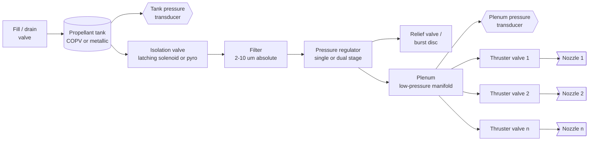

# Module 28 — Cold-Gas Principles
Part IV · Prerequisites: modules 01, 02, 03 · Estimated time: 6 h

A cold-gas thruster is the simplest rocket that exists and the one most often
sized wrong. It has no combustion, no ignition, no cooling, no mixture ratio,
and exactly one performance knob you cannot turn — the molecular mass of the
gas you chose. The failure I have watched most often is not a hardware failure:
it is a spreadsheet that budgeted 5 kg of nitrogen at 70 s of specific impulse,
forgot that the nitrogen must live inside a 300-bar titanium sphere, and
delivered a propulsion module that weighed twice what the mass budget allowed.
The second most common failure is a spreadsheet that got the propellant right
and then discovered, three months from delivery, that the minimum impulse bit
set by the valve's 4 ms opening transient was ten times larger than the
attitude-control deadband could absorb, so the satellite chattered its way
through its propellant budget in six weeks. Cold gas hides all of its
difficulty in the tank and the valve. This module is about learning to look
there first.

---

## 1. Learning objectives

By the end of this module you can:

1. Explain, from the steady-flow energy equation, why a cold-gas thruster's
   exhaust velocity is set entirely by stored enthalpy, and derive the ceiling
   $I_{sp}^{max} \propto \sqrt{T_0/M}$.
2. Compute ideal vacuum $I_{sp}$, choked mass flow, and thrust for any stored
   gas at a given $\gamma$, $M$, $T_0$, $p_0$, $A_t$ and $\varepsilon$, using
   `tools/rocket.py`, and apply the correct realization discount.
3. Size a stored-gas tank using the compressibility factor $Z$, and show that
   tank mass per kilogram of propellant scales as $Z R T$ — hence as $1/M$.
4. Predict whether a given gas cools or warms on throttling, using the
   Joule–Thomson coefficient and the inversion temperature, and state the
   design consequence for each.
5. Draw a stored-gas feed system from tank to nozzle, name every component and
   the failure it exists to prevent, and state what changes between a regulated
   and a blowdown architecture.
6. Compute impulse bit and minimum impulse bit from valve rise time, fall time,
   commanded on-time and downstream dead volume, and say which of those four
   dominates the scatter.
7. Size an attitude-control cold-gas system: convert deadband, moment of
   inertia, disturbance torque and slew requirement into a total-impulse and
   valve-cycle budget.
8. Select a propellant from N₂, He, Ar, CO₂, Kr, Xe, butane, a refrigerant, or
   air, and defend the choice on the five axes that actually decide it —
   $I_{sp}$, stored density, tank pressure, leak rate, and contamination.
9. Explain why MarCO flew R-236fa at 40 s of $I_{sp}$ and why that was the
   correct engineering decision.

---

## 2. Terminology

| term | symbol | SI unit | definition |
|---|---|---|---|
| Molar mass | $M$ | kg/kmol | mass of one kmol of the gas |
| Universal gas constant | $R_u$ | J/(kmol·K) | 8314.46 |
| Specific gas constant | $R$ | J/(kg·K) | $R = R_u/M$ |
| Ratio of specific heats | $\gamma$ | — | $c_p/c_v$; 1.667 monatomic, 1.40 diatomic, ~1.08–1.31 polyatomic |
| Stagnation (plenum) temperature | $T_0$ | K | gas total temperature upstream of the throat |
| Stagnation (plenum) pressure | $p_0$ | Pa | gas total pressure upstream of the throat |
| Throat area | $A_t$ | m² | minimum flow area of the nozzle |
| Exit area | $A_e$ | m² | nozzle exit plane area |
| Expansion ratio | $\varepsilon$ | — | $A_e/A_t$ |
| Mass flow rate | $\dot m$ | kg/s | propellant flow through the throat |
| Thrust | $F$ | N | axial force produced by the thruster |
| Characteristic velocity | $c^*$ | m/s | $p_0 A_t/\dot m$; measures the gas, not the nozzle |
| Thrust coefficient | $C_F$ | — | $F/(p_0 A_t)$; measures the nozzle, not the gas |
| Effective exhaust velocity | $c$ | m/s | $F/\dot m = c^* C_F$ |
| Specific impulse | $I_{sp}$ | s | $c/g_0$ |
| Standard gravity | $g_0$ | m/s² | 9.80665 |
| Compressibility factor | $Z$ | — | $pv/(RT)$; 1 for an ideal gas |
| Joule–Thomson coefficient | $\mu_{JT}$ | K/Pa | $(\partial T/\partial p)_h$ |
| Inversion temperature | $T_{inv}$ | K | temperature at which $\mu_{JT}$ changes sign |
| Vapour pressure | $p_{vap}$ | Pa | saturation pressure of a liquefied propellant at tank temperature |
| Latent heat of vaporization | $\Delta h_{vap}$ | J/kg | enthalpy to evaporate unit mass |
| Total impulse | $I_t$ | N·s | $\int F\,dt$ over the mission |
| Impulse bit | $I_{bit}$ | N·s | impulse delivered by one commanded pulse |
| Minimum impulse bit | $MIB$ | N·s | $I_{bit}$ at the shortest reliably repeatable command |
| Valve rise time | $t_r$ | s | command to 90 % steady thrust |
| Valve fall time | $t_f$ | s | command-off to 10 % thrust |
| Commanded on-time | $t_{on}$ | s | duration of the electrical command |
| Dead volume | $V_d$ | m³ | volume between the valve seat and the throat |
| Moment of inertia | $I$ | kg·m² | about the control axis (context distinguishes from $I_t$) |
| Moment arm | $L$ | m | perpendicular distance from thruster line of action to the c.m. |
| Control torque | $\tau$ | N·m | $2FL$ for a thruster couple |
| Angular momentum | $H$ | N·m·s | $I\omega$ |
| Disturbance torque | $\tau_d$ | N·m | external torque the control system must reject |
| Deadband | $\theta_{db}$ | rad | half-width of the attitude error band the controller tolerates |
| Limit-cycle rate | $\omega_{lc}$ | rad/s | body rate maintained by minimum-impulse limit cycling |
| Duty cycle | $D$ | — | fraction of time a thruster valve is open |
| Tank performance factor | $PV/W$ | m | $p V/(m_{tank}\,g_0)$; a pressure vessel's figure of merit |
| Storage density | $\rho_s$ | kg/m³ | propellant mass per unit tank internal volume |
| Impulse density | $\rho_s I_{sp} g_0$ | N·s/m³ | total impulse per unit propellant volume |

---

## 3. Theory

### 3.1 The operating principle: stored enthalpy and nothing else

Every rocket accelerates mass. The distinction between classes of rocket is
where the kinetic energy of the exhaust comes from. A chemical rocket makes it
by breaking and reforming bonds inside the chamber; an electric thruster makes
it from the power bus. A cold-gas thruster makes it from nowhere at all: the
energy was put into the propellant on the ground, by the compressor that filled
the tank, and the thruster's only job is to convert the stored enthalpy of a
static gas into directed kinetic energy through an isentropic nozzle.

Write the steady-flow energy equation between the plenum (state 0, effectively
at rest) and the nozzle exit:

$$h_0 = h_e + \tfrac{1}{2}v_e^2$$

> **Eq. 3.1** — variables: $h_0$, $h_e$ = specific stagnation and exit static
> enthalpy [J/kg]; $v_e$ = exit velocity [m/s]. Meaning: all the kinetic energy
> at the exit was enthalpy in the plenum. Assumes: adiabatic, no shaft work, no
> body forces, steady flow, single phase. Fails when: the flow condenses in the
> nozzle (a real risk for CO₂ and refrigerants), when the thruster is pulsing
> so fast that the flow is not quasi-steady, or when wall heat transfer is
> comparable to the enthalpy flux — which for a small cold-gas nozzle it can
> be, because the gas is cold and the wall is not.

For a calorically perfect gas $h = c_p T$ and $c_p = \gamma R/(\gamma-1)$, so

$$v_e = \sqrt{\frac{2\gamma}{\gamma-1}RT_0\left[1-\left(\frac{p_e}{p_0}\right)^{\frac{\gamma-1}{\gamma}}\right]}$$

> **Eq. 3.2** — the ideal exit velocity, identical in form to the one derived in
> Module 02 for a hot chamber. Variables: $R = R_u/M$ [J/(kg·K)]; $T_0$ [K];
> $p_e/p_0$ = exit-to-plenum static pressure ratio. Meaning: the nozzle converts
> $c_p T_0$ into $\tfrac12 v_e^2$ with an efficiency set by the pressure ratio.
> Assumes: isentropic, calorically perfect, frozen composition (trivially true
> here — nothing reacts), attached flow. Fails when: $\gamma$ varies
> significantly over the expansion (polyatomic refrigerants), when the boundary
> layer occupies a large fraction of the throat (Reynolds numbers in these
> nozzles are 10³–10⁴, not 10⁶), or when condensation releases latent heat and
> breaks the isentrope.

[F] Nothing in Eq. 3.2 knows or cares that there is no combustion. A cold-gas
thruster is a rocket engine whose chamber temperature happens to be 300 K
instead of 3300 K, and every relation from Modules 02 and 03 — choked flow,
$c^*$, $C_F$, area ratio, ideal expansion — carries over unchanged. That is the
good news, and it is why this part of the course is short. The bad news is the
factor $\sqrt{T_0}$.

### 3.2 The $\sqrt{T_0/M}$ ceiling

Take Eq. 3.2 to its limit, $p_e \to 0$ (infinite area ratio, vacuum), and
substitute $R = R_u/M$:

$$c_{max} = \sqrt{\frac{2\gamma}{\gamma-1}\cdot\frac{R_u T_0}{M}}, \qquad I_{sp}^{max} = \frac{c_{max}}{g_0}$$

> **Eq. 3.3** — variables as above; $R_u = 8314.46$ J/(kmol·K). Meaning: the
> absolute upper bound on specific impulse for a given gas at a given
> stagnation temperature, achievable only with an infinitely large nozzle in
> perfect vacuum. Assumes: everything Eq. 3.2 assumes, plus complete expansion.
> Fails when: the gas liquefies or solidifies before reaching that state — which
> it always does, so treat Eq. 3.3 as an asymptote you approach, never reach.

[F] This is the single most important equation in Part IV, and it should be
read as a statement about what you are *not allowed* to do. $I_{sp}$ scales as
$\sqrt{T_0/M}$. In a chemical rocket you buy performance by raising $T_0$: a
LOX/LH₂ engine runs at $T_0 \approx 3500$ K and $M \approx 13$ kg/kmol, so
$\sqrt{T_0/M} \approx 16.4$. A room-temperature nitrogen thruster has
$\sqrt{300/28.0} = 3.27$ — a factor of five down, and it shows up directly in
the specific impulse. Numerically, at $T_0 = 300$ K:

- N₂ ($\gamma = 1.400$, $M = 28.014$): $c_{max} = 789.5$ m/s, $I_{sp}^{max} = 80.5$ s.
- He ($\gamma = 1.667$, $M = 4.003$): $c_{max} = 1764.8$ m/s, $I_{sp}^{max} = 180.0$ s.
- R-236fa ($\gamma \approx 1.08$, $M = 152.04$): $c_{max} = 665.5$ m/s, $I_{sp}^{max} = 67.9$ s.

There are exactly three levers in Eq. 3.3 and two of them are weak.

**Raise $T_0$.** This works, and it is a $\sqrt{}$ law, so doubling the
temperature buys 41 %. But the moment you add a heater you are no longer
building a cold-gas thruster; you are building a resistojet, and you have
acquired a power budget, a thermal-control problem and a warm-up transient that
destroys the minimum impulse bit. The CHIPS unit (CU Aerospace/VACCO for AFRL)
does exactly this and reports 82 s from a refrigerant whose cold-gas ideal is
about 43 s [MarCO]. That factor of ~1.9 in $I_{sp}$ implies a factor of ~3.6 in
$T_0$, i.e. heating from 300 K to roughly 1100 K — which is the honest price of
the electrothermal upgrade, and is covered in Module 30, not here.

**Lower $M$.** This also works, and it is the same $\sqrt{}$ law, but it is a
trap, because $M$ appears in the tank mass with the opposite sign. §3.3 and
Worked Example 1 make this quantitative. It is the central trade of the whole
subject.

**Raise $\gamma$.** The prefactor $\sqrt{2\gamma/(\gamma-1)}$ is 3.74 for a
monatomic gas ($\gamma = 5/3$), 4.18 for a diatomic ($\gamma = 1.4$), and 5.20
for $\gamma = 1.08$. So *low* $\gamma$ raises the prefactor — a polyatomic gas
extracts more of its enthalpy per unit $RT_0$ because it has more degrees of
freedom to draw down. This partly compensates the heavy molecules, and it is
why n-butane ($M = 58.1$) reaches 69.2 s at $\varepsilon = 50$ while argon
($M = 39.9$) manages only 56.4 s despite being 30 % lighter. [F] Do not size a
system on $M$ alone; the group is $\sqrt{2\gamma/((\gamma-1)M)}$.

### 3.3 The gas in the tank is not ideal

The ideal-gas law is a low-density approximation, and a cold-gas tank is not a
low-density place. Write

$$pV = Z\,m\,R\,T \qquad\Longleftrightarrow\qquad \rho_s = \frac{p}{Z R T}$$

> **Eq. 3.4** — variables: $p$ = tank pressure [Pa]; $V$ = tank internal volume
> [m³]; $m$ = stored mass [kg]; $Z$ = compressibility factor [—]; $T$ = tank
> temperature [K]; $\rho_s$ = storage density [kg/m³]. Meaning: $Z$ is the
> correction between what the ideal gas law says you loaded and what you
> actually loaded. Assumes: single phase, thermal equilibrium. Fails when: the
> gas is near or below its critical point, where $Z$ is a strong function of
> both $p$ and $T$ and a single number is meaningless.

[F] $Z > 1$ means the gas is *harder to compress* than ideal — repulsive
intermolecular forces dominate — so a tank at that pressure holds *less* mass
than the ideal-gas law predicts. $Z < 1$ means attraction dominates and the
tank holds more.

Read $Z$ off the generalized compressibility chart in reduced coordinates
$T_r = T/T_c$, $p_r = p/p_c$, or better, off [NIST-WB] or [REFPROP] for the
actual fluid. For the two gases that matter most:

- **N₂ at 300 K, 300 bar.** $T_c = 126.2$ K, $p_c = 33.96$ bar, so $T_r = 2.38$,
  $p_r = 8.83$, giving $Z \approx 1.25$. [A]
- **He at 300 K, 300 bar.** Helium is a quantum fluid and the plain chart fails;
  with the Newton correction ($T_c + 8$ K, $p_c + 8$ atm) you get $T_r \approx 23$,
  $p_r \approx 29$, and $Z \approx 1.18$. [A]

Both are *penalties* of 18–25 %. A first-cut tank sized on the ideal gas law
comes up roughly a fifth short on propellant, which is exactly the size of
error that eats a mission's entire margin.

> **A caveat you must carry.** The stored-density column of
> `reference/_verify-solid-coldgas.md` §B.1 is labelled confidence **C** and
> `NEEDS PRIMARY`, and inspection shows why: its N₂ entry of 0.28 g/cm³ at
> 241 bar implies $Z \approx 0.97$, i.e. it was computed as an ideal gas. It
> also lists a *lower* density at 300 bar (0.25 g/cm³) than at 241 bar, which
> is thermodynamically impossible for a supercritical fluid at fixed
> temperature. Use that column for order-of-magnitude ranking only. Any real
> tank load must come from [NIST-WB] or [REFPROP] at the actual fill
> temperature. This is not pedantry: the difference between $Z=0.97$ and
> $Z=1.25$ is 22 % of your propellant.

**Why this matters more than it looks.** Combine Eq. 3.4 with the mass of a
thin-walled spherical pressure vessel. For a sphere of radius $r$, wall
thickness $t$, membrane stress $\sigma$, the hoop relation is $t = pr/(2\sigma)$
and the shell mass is $m_{tank} = \rho_m\,4\pi r^2 t$. Eliminating $r$ and $t$
in favour of the enclosed volume $V = \tfrac43\pi r^3$:

$$m_{tank} = \frac{3}{2}\,\frac{\rho_m}{\sigma_{allow}}\,p\,V$$

> **Eq. 3.5** — variables: $\rho_m$ = tank material density [kg/m³];
> $\sigma_{allow}$ = allowable membrane stress [Pa], i.e. ultimate strength
> divided by the burst factor of safety; $p$ [Pa]; $V$ [m³]. Meaning: pressure
> vessel mass is proportional to the *stored pressure–volume product*, not to
> pressure or volume separately, and the constant of proportionality is the
> inverse of the material's specific strength. Assumes: thin wall
> ($t/r \lesssim 0.1$), spherical, membrane-stress-limited, no bosses, no liner,
> no minimum gauge. Fails when: the design is governed by minimum manufacturable
> gauge (low-pressure tanks — see the R-236fa case), by fracture control, or by
> the boss and mounting hardware, which for a small tank can exceed the membrane
> mass.

Now substitute $pV = Z m_p R T$ from Eq. 3.4:

$$\boxed{\;\frac{m_{tank}}{m_p} = \frac{3}{2}\,\frac{\rho_m}{\sigma_{allow}}\,Z R T = \frac{3}{2}\,\frac{\rho_m}{\sigma_{allow}}\,\frac{Z R_u T}{M}\;}$$

> **Eq. 3.6** — variables as Eqs. 3.4–3.5; $m_p$ = stored propellant mass [kg].
> Meaning: **tank mass per kilogram of propellant depends on the gas only
> through $ZR_uT/M$, and is completely independent of the storage pressure.**
> Assumes: everything in Eq. 3.5, plus that the tank is stress-limited rather
> than gauge-limited. Fails when: minimum gauge governs, or when the pressure is
> high enough that $Z$ itself becomes a strong function of $p$ (above ~400 bar
> for N₂ this matters).

[F] Read Eq. 3.6 slowly, because it contains three results at once.

1. **Raising the storage pressure does not reduce tank mass.** It reduces tank
   *volume*, which may be what you need, but the membrane mass is set by $pV$
   and $pV$ is fixed by the propellant load. Every kilogram of nitrogen costs
   the same tank mass at 200 bar as at 400 bar. (In practice very high pressure
   is slightly *worse*, because $Z$ rises.)
2. **Tank mass per kilogram of propellant scales as $1/M$.** Helium's $R$ is
   seven times nitrogen's, so a helium tank weighs about seven times as much per
   kilogram of gas stored.
3. **$I_{sp}$ scales as $1/\sqrt{M}$ but tank mass scales as $1/M$.** The tank
   penalty beats the performance benefit. This is why nobody flies helium as a
   propellant and everybody flies it as a pressurant, where you only need a few
   hundred grams.

### 3.4 Joule–Thomson: why nitrogen chills the regulator and helium does not

When gas flows through a regulator or a partly-open valve, it undergoes a
throttling process: no work, negligible heat transfer, so it is
**isenthalpic**, not isentropic. The temperature change is governed by

$$\mu_{JT} \equiv \left(\frac{\partial T}{\partial p}\right)_h = \frac{1}{c_p}\left[T\left(\frac{\partial v}{\partial T}\right)_p - v\right]$$

> **Eq. 3.7** — variables: $\mu_{JT}$ [K/Pa]; $c_p$ [J/(kg·K)]; $v$ = specific
> volume [m³/kg]. Meaning: throttling cools the gas if $\mu_{JT} > 0$ and warms
> it if $\mu_{JT} < 0$. Assumes: adiabatic throttle, no kinetic-energy change
> across the restriction (true for a regulator, *not* true for a nozzle).
> Fails when: the process is not adiabatic (long lines, small flows), or when
> two phases are present.

[F] For an ideal gas $v = RT/p$, so $T(\partial v/\partial T)_p = v$ and
$\mu_{JT} = 0$ exactly: an ideal gas does not change temperature on throttling.
All Joule–Thomson behaviour is a real-gas effect, and its sign is a competition
between attraction (cools) and repulsion (warms). The temperature at which the
sign flips is the **inversion temperature**; for a van der Waals gas the maximum
inversion temperature is $T_{inv} = 2a/(Rb) = 6.75\,T_c$.

Approximate maximum inversion temperatures [E], to be confirmed against
[NIST-WB] before use in a thermal model:

| gas | $T_c$ (K) | $T_{inv,max}$ (K) | at 300 K, throttling… |
|---|---|---|---|
| He | 5.2 | ≈ 40 | **warms** |
| H₂ | 33.2 | ≈ 205 | **warms** |
| N₂ | 126.2 | ≈ 620 | cools |
| Ar | 150.7 | ≈ 720 | cools |
| CO₂ | 304.1 | ≈ 1500 | cools, strongly |

**The engineering consequences are asymmetric and both matter.**

*For nitrogen, argon and CO₂*, the regulator is a refrigerator. Every gram that
crosses it is chilled, and because the regulator body is small and thermally
isolated, its own temperature falls until it reaches a balance with conduction
from the structure. This is the mechanism that freezes regulator seats, drives
elastomer seals below their glass transition (where they stop sealing and stay
not-sealing until they warm up), and causes the notorious cold-gas symptom of a
regulated system whose set-point drifts downward during a long burn and then
recovers over the following hour. On CO₂ it is worse than a nuisance: expanding
CO₂ from a few bar into vacuum crosses the sublimation line (triple point
216.6 K, 5.18 bar), and dry ice will form in the throat and in the valve seat.
CO₂ cold-gas systems that work are the ones that heat the gas upstream of the
regulator. [J]

*For helium and hydrogen*, throttling warms the gas, which sounds like a gift
and is not one. It means you cannot use a Joule–Thomson expansion to precool
anything, and more practically it means that helium's low density and warming
behaviour combine so that a helium blowdown tank loses much less temperature
than intuition suggests. The real helium problem is elsewhere: it is the
smallest atom that is chemically inert, it permeates elastomers and even
diffuses measurably through some metals, and its leak rate through a given
defect is $\sqrt{28/4} = 2.6$ times nitrogen's for the same molecular-flow
geometry. A helium system that must hold propellant for a five-year mission
loses to a nitrogen system on the leak budget alone, entirely independently of
the tank-mass argument. [J]

Note carefully that Eq. 3.7 governs the *regulator*, not the *nozzle*. The
nozzle expansion is isentropic, not isenthalpic; every gas cools through a
nozzle, helium included, because it is doing work on the flow downstream of it.
Students confuse these constantly.

### 3.5 Blowdown thermodynamics and the pressure-decay problem

If the tank feeds the thrusters directly through no regulator, the system is a
**blowdown**. As gas leaves, the tank pressure falls, and — because the gas
remaining in the tank expands against nothing but itself — its temperature falls
too. The two bounding cases are:

$$\text{isothermal: } \frac{m_f}{m_i} = \frac{p_f}{p_i}, \qquad \text{adiabatic: } \frac{m_f}{m_i} = \left(\frac{p_f}{p_i}\right)^{1/\gamma},\quad \frac{T_f}{T_i} = \left(\frac{p_f}{p_i}\right)^{\frac{\gamma-1}{\gamma}}$$

> **Eq. 3.8** — variables: subscripts $i$, $f$ = initial and final tank state.
> Meaning: the usable mass fraction of a blowdown tank between two pressures,
> bounded by perfect wall heat transfer (isothermal, best case) and none
> (adiabatic, worst case). Assumes: ideal gas ($Z=1$ — for a real high-pressure
> blowdown you must integrate with $Z(p,T)$), uniform tank state, no residual
> heating. Fails when: the gas liquefies, when the discharge is fast compared
> with the tank's thermal time constant *and* the tank wall heat capacity is
> large — the real case is always between the bounds and usually much closer to
> isothermal for a metal tank emptying over hours.

Two numbers make the point. A nitrogen tank blown down 4:1, from 20 bar to
5 bar, gives up 75 % of its mass isothermally but only 63 % adiabatically. And a
nitrogen tank taken adiabatically from 300 bar to 100 bar cools from 300 K to
219 K, which knocks $\sqrt{219/300} = 0.855$ off $c^*$ — a 15 % $I_{sp}$ loss
that appears nowhere in the propellant budget unless you modelled it. Taken all
the way to 7 bar adiabatically it would reach 102 K, which is below nitrogen's
boiling point at that pressure; the tank would not actually get there, because
the wall would give up its heat first, but the calculation tells you that a
deep, fast blowdown is a *thermal* design problem, not just a pressure one.

**The pressure-decay problem** is the operational consequence. In a blowdown
system the plenum pressure is the tank pressure, so from Eq. 3.9 below,
$\dot m \propto p_0$ and $F \propto p_0$. A 4:1 blowdown means:

- Thrust falls 4:1 over the mission. Your last manoeuvre takes four times as
  long as your first.
- The impulse bit falls 4:1. If the attitude-control law was tuned for the
  beginning-of-life bit, it is badly mistuned at end of life, and vice versa.
  Either you make the controller pressure-aware — which requires a plenum
  transducer and a calibration — or you accept a 4:1 variation in your control
  authority.
- $I_{sp}$ is roughly *unaffected* (it depends on $\gamma$, $R$, $T_0$ and
  $\varepsilon$, not on $p_0$) except through the temperature drop and through
  the Reynolds-number degradation at low pressure, both of which make it worse
  at end of life. Do not let anyone tell you blowdown "costs no $I_{sp}$"; it
  costs a few percent at the low-pressure end where the boundary layer is a
  larger fraction of the throat.

This is the whole argument for a regulator, and §3.6 is where it lives.

**Liquefied propellants dodge the problem entirely — almost.** If the propellant
is stored as a saturated liquid (butane, R-134a, R-236fa, ammonia, and
marginally CO₂), the tank pressure is the *vapour pressure*, which depends only
on temperature, not on the amount of liquid left. Thrust is therefore constant
from beginning of life to the moment the last drop evaporates. That single
property is worth more to a small spacecraft than 30 s of $I_{sp}$.

The "almost" is **self-refrigeration**. Evaporating the liquid takes latent
heat out of the tank, so the tank cools, so the vapour pressure falls:

$$\frac{d\ln p_{vap}}{dT} = \frac{\Delta h_{vap}}{R T^2}, \qquad \Delta T \approx -\frac{m_{vap}\,\Delta h_{vap}}{m_{liq}c_{liq} + m_{tank}c_{tank}}$$

> **Eq. 3.9** — Clausius–Clapeyron (left) and a lumped tank energy balance
> (right). Variables: $p_{vap}$ [Pa]; $\Delta h_{vap}$ [J/kg]; $m_{vap}$ = mass
> evaporated in the burn [kg]; $c$ = specific heat capacity [J/(kg·K)].
> Meaning: a long continuous burn cools the tank and drops the feed pressure;
> a short pulse followed by a long coast does not, because the tank re-warms
> from the spacecraft. Assumes: uniform tank temperature, ideal vapour,
> $\Delta h_{vap}$ constant over the interval, no heater. Fails when: the burn
> is long enough that a thermal gradient forms in the liquid (stratification),
> or when the liquid runs low and the vapour space dominates.

[J] This is why the vapour-pressure architecture is perfect for attitude
control — thousands of millisecond pulses spread over years, with the tank in
thermal equilibrium with the bus the whole time — and poor for a single long
translational burn, where you will watch the thrust decay and then recover over
tens of minutes. MarCO's trajectory-correction manoeuvres were designed around
exactly this constraint.

### 3.6 System architecture

A stored-gas system is a chain of components, each of which exists to prevent a
specific failure. Learn the chain in order and learn what each one is *for*;
this is the fastest way to read an unfamiliar schematic.

**Tank.** Metallic (Ti-6Al-4V, 6061/7075 aluminium) or a composite-overwrapped
pressure vessel with a thin metal or polymer liner. The COPV wins on mass by
roughly a factor of two to three at these pressures and loses on cost,
inspection, and stress-rupture life; both are governed in flight programmes by
[AIAA-S-080] (metallic) and [AIAA-S-081] (COPV). For a liquefied propellant the
"tank" is a low-pressure can, often with a propellant management device or a
surface-tension vane structure to keep liquid off the outlet in zero gravity —
because a system that ingests liquid instead of vapour will deliver a thrust
spike, then a long cold tail, then nothing.

**Fill/drain valve.** Ground interface. Usually a manual valve with a separate
sealing cap; the cap, not the valve, is the flight seal. Its leak rate is on the
critical path of every long-duration mission.

**Isolation valve.** Keeps the propellant in the tank until the spacecraft is
clear of the launch vehicle. Range-safety authorities generally require at least
two independent inhibits between the propellant and the thruster; the isolation
valve is one of them. A **pyrotechnic** valve is single-shot, zero-leak and
cheap; a **latching solenoid** can be reclosed to isolate a leaking downstream
branch, which is worth a great deal if you have redundancy to switch to.

**Filter.** Absolute rating typically 2–10 μm. This exists because the throats
downstream are 0.1–0.5 mm and the valve seats close on gaps of a few microns. A
single machining chip is a stuck-open thruster and a lost vehicle. The filter is
upstream of the regulator because the regulator seat is the most contamination-
sensitive item in the system. [M]

**Regulator.** Drops 200–300 bar to a plenum pressure of typically 2–10 bar and
holds it. A regulator is a closed-loop mechanical servo (reference spring or
dome, sensing diaphragm, poppet) and it has its own failure modes: droop (outlet
pressure falls as flow rises), lockup (outlet pressure creeps up at zero flow
because the poppet cannot seal perfectly), and self-excited oscillation
("regulator buzz") when the downstream volume and the poppet dynamics form a
resonant pair. It is also the item Joule–Thomson cooling attacks (§3.4).

**Relief valve or burst disc.** Because a regulator that fails open puts tank
pressure into a plenum designed for 5 bar. Every regulated system needs a
downstream overpressure protection device, sized to pass the full flow the
failed-open regulator can deliver. This is not optional and it is the component
most often left off a student schematic.

**Plenum.** The low-pressure manifold feeding the thruster valves. Its volume is
a design variable with two opposed effects: a large plenum smooths the
regulator's response and decouples thrusters that fire simultaneously; a large
plenum also stores more gas that will continue to blow through the nozzle after
the valve shuts, degrading the minimum impulse bit and its repeatability
(§3.8). [J] Make it as small as the flow transients allow, and put the
transducer on it, because plenum pressure — not tank pressure — is what sets
thrust.

**Thruster valve and nozzle.** One solenoid per nozzle, normally closed. Everything
about impulse-bit quality lives here, and §3.8 and Module 30 take it apart. The
nozzle is usually a simple conical converging–diverging passage, often drilled
or EDM'd directly into the valve body to eliminate dead volume.

**Regulated versus blowdown, decided.**

| | regulated | blowdown |
|---|---|---|
| Thrust over life | constant | falls in proportion to tank pressure |
| Impulse bit over life | constant | falls in proportion to tank pressure |
| Usable propellant | down to regulator dropout (~97 % from 300 bar) | 1 − $p_f/p_i$, typically 60–80 % |
| Parts count | +regulator, +relief, +2 transducers | minimal |
| Dominant failure mode | regulator fails open → plenum overpressure | none added |
| Mass | regulator ≈ 0.3–1 kg | zero |
| Typical user | anything above ~1 kg of propellant; all crewed systems | CubeSats, and every liquefied-propellant system |

[J] The decision rule I use: if the propellant mass is small enough that the
regulator and its relief valve are a significant fraction of the system dry
mass, go blowdown and design the controller to be pressure-aware. If the mission
has a translational Δv requirement with a tight execution error, go regulated,
because a 4:1 thrust variation turns into a 4:1 variation in burn duration and
therefore in pointing-error-integrated cross-axis velocity. If the propellant is
a saturated liquid, the question does not arise: vapour pressure *is* the
regulator, and it is a better one than anything you can buy.

### 3.7 Thrust, choked mass flow, and $I_{sp}$ for a cold gas

Everything here is Module 02 and 03 material specialized to $T_0 \approx 300$ K.
A cold-gas nozzle is essentially always choked — plenum pressures of 2–10 bar
against a vacuum back-pressure give pressure ratios of 20–100, far above the
critical ratio of about 1.9 — so

$$\dot m = \Gamma\,\frac{p_0 A_t}{\sqrt{R T_0}}, \qquad \Gamma = \sqrt{\gamma}\left(\frac{2}{\gamma+1}\right)^{\frac{\gamma+1}{2(\gamma-1)}}$$

> **Eq. 3.10** — variables: $\dot m$ [kg/s]; $p_0$ [Pa]; $A_t$ [m²]; $R$
> [J/(kg·K)]; $T_0$ [K]; $\Gamma$ = the "gamma function" (0.6847 for
> $\gamma=1.4$, 0.7268 for $\gamma=5/3$, 0.6247 for $\gamma=1.08$). Meaning:
> mass flow is set by upstream *stagnation* conditions and the throat area
> alone; downstream pressure has no influence once choked. Assumes: choked,
> inviscid, one-dimensional, calorically perfect. Fails when: the throat
> Reynolds number is low enough that the boundary layer occupies an appreciable
> fraction of the throat area — which for a 0.2 mm throat at 3 bar it does. Real
> cold-gas throats have discharge coefficients of 0.85–0.98, and the small ones
> are at the bottom of that range. Multiply Eq. 3.10 by $C_d$.

The corresponding characteristic velocity and thrust are

$$c^* = \frac{\sqrt{R T_0}}{\Gamma}, \qquad F = C_F\,p_0 A_t = \dot m\, c^* C_F = \dot m\, I_{sp}\,g_0$$

> **Eq. 3.11** — variables as above; $C_F$ from Module 03 evaluated at the
> nozzle's $\varepsilon$ and ambient pressure. Meaning: the clean separation of
> gas properties ($c^*$) from nozzle geometry ($C_F$) that Module 03 established
> holds unchanged for cold gas. Assumes: as Eq. 3.10, plus attached, isentropic
> nozzle flow. Fails when: the nozzle is separated (only an issue for sea-level
> testing of a vacuum-optimized cold-gas nozzle — and it is a real issue,
> because $\varepsilon = 50$ against 1 bar separates violently).

**The realization discount.** Comparing the frozen-ideal calculation of §B.1 of
the verification worksheet against the measured values in the same table gives a
consistent ratio of about **0.90** across gases from hydrogen to xenon. That is
the number to teach [E]:

$$I_{sp}^{real} \approx 0.90 \times I_{sp}^{ideal}$$

> **Eq. 3.12** — [E], valid for continuous firing of a well-made cold-gas
> thruster with $\varepsilon$ between 20 and 100 at $T_0 \approx 300$ K.
> Meaning: about 10 % of the ideal impulse is lost. Assumes: steady operation.
> **Fails badly for pulsed operation**, where the realized $I_{sp}$ can fall to
> 50–70 % of ideal because a large fraction of every pulse is spent in the
> valve transient. SAFER's implied ~40 s against a 77 s ideal is exactly this
> effect [SAFER95].

Where does the 10 % go? Four places, in rough order of size for a small
thruster: (i) **boundary layer** — at throat Reynolds numbers of 10³–10⁴ the
displacement thickness is a percent or more of the throat radius and the
momentum deficit at the exit is several percent; (ii) **divergence loss** —
$\lambda = \tfrac12(1+\cos\alpha)$ for a conical nozzle, 0.983 for a 15°
half-angle; (iii) **heat transfer** — and here cold gas is unusual, because the
gas is colder than the wall, so heat flows *into* the flow, which slightly
*increases* thrust while degrading the accuracy of the isentropic model;
(iv) **non-equilibrium expansion** of polyatomic molecules, where the vibrational
modes cannot relax fast enough to stay in equilibrium through a 10⁻⁵ s
residence time, so the effective $\gamma$ during expansion is higher than the
equilibrium value and the gas delivers less work. That last one is why the
refrigerants and butane sit at the bottom of the efficiency band, and why their
$\gamma$ values in the property table are flagged confidence **C**.

### 3.8 Impulse bit, minimum impulse bit, and what the valve does to you

The impulse delivered by one commanded pulse is $I_{bit} = \int F\,dt$ over the
pulse. Model the thrust trace as a trapezoid: it rises over $t_r$ after the
command, holds at $F_{ss}$, and falls over $t_f$ after the command ends. Then

$$I_{bit} \approx F_{ss}\left(t_{on} - \tfrac{t_r}{2} + \tfrac{t_f}{2}\right) + \frac{m_d\,c}{1}$$

> **Eq. 3.13** — variables: $F_{ss}$ = steady-state thrust [N]; $t_{on}$ =
> commanded on-time [s]; $t_r$, $t_f$ = rise and fall times [s]; $m_d$ = gas
> mass resident in the dead volume between valve seat and throat [kg];
> $c = I_{sp}g_0$ = effective exhaust velocity [m/s]. Meaning: the impulse bit
> is the commanded on-time corrected for the two transients plus the tail from
> blowing down the dead volume. Assumes: linear rise and fall (real traces are
> S-shaped but the trapezoid integral is within a few percent), $t_{on} > t_r$,
> quasi-steady nozzle flow. Fails when: $t_{on} \lesssim t_r$, in which case the
> valve never reaches full lift, thrust never reaches $F_{ss}$, and the impulse
> bit becomes a strongly nonlinear and poorly repeatable function of $t_{on}$ —
> this is the regime the MIB definition exists to keep you out of.

Note the sign structure, because it is counter-intuitive and it is examinable.
The **rise time subtracts** roughly half its duration (you lose the area under
the ramp-up compared with an ideal step). The **fall time adds** roughly half
its duration (the valve keeps flowing after the command ends). If $t_f > t_r$,
as is usual for a solenoid whose return spring is weaker than its magnetic
pull-in, the impulse bit is *larger* than the naive $F_{ss}t_{on}$.

The **minimum impulse bit** is $I_{bit}$ at the shortest command the valve will
reliably execute — typically 3–10 ms for a small solenoid, and 1 ms or below for
a piezoelectric or a chemically-etched microvalve. MIB is not just "the smallest
pulse"; it is the smallest pulse whose *scatter* is acceptable, and scatter is
what determines pointing performance. The three scatter sources, in order:

1. **Valve opening jitter.** Solenoid pull-in time depends on coil temperature
   (resistance rises ~0.4 %/K for copper), on drive voltage, and on the
   differential pressure holding the poppet shut. A 10 % variation in $t_r$ on a
   5 ms pulse with $t_r = 4$ ms is a large fraction of the bit.
2. **Dead-volume tail.** The gas between the seat and the throat blows down after
   closure, and its contribution is $m_d c$ — independent of $t_{on}$, so it is a
   *fixed offset* that dominates at short pulses. Worked Example 2 shows it can
   be 20 % of the MIB.
3. **Plenum pressure.** In a blowdown system this drifts over the mission; in a
   regulated system it moves with regulator droop during multi-thruster firings.

[J] The design responses, in the order I would apply them: shrink the dead
volume (drill the nozzle into the valve body); characterize $t_r$ and $t_f$
versus temperature and voltage and put the calibration in flight software;
raise $\varepsilon$ and shrink $A_t$ so that $F_{ss}$ falls and the same
temporal jitter buys a smaller impulse error; and only then consider a faster
valve, because fast valves are expensive and leak more.

### 3.9 Attitude control, at the level needed to size a system

You are not designing the control law here; you are producing a total-impulse
number and a valve-cycle number. Five relations do it.

**Torque from a thruster pair.** A single thruster produces torque *and*
translation. Two thrusters firing anti-parallel with a separation $2L$ about the
centre of mass produce a pure couple:

$$\tau = 2FL, \qquad \alpha = \frac{\tau}{I}$$

> **Eq. 3.14** — variables: $F$ = thrust per thruster [N]; $L$ = moment arm from
> the centre of mass to each thruster's line of action [m]; $I$ = moment of
> inertia about that axis [kg·m²]; $\alpha$ = angular acceleration [rad/s²].
> Meaning: a couple rotates without translating, which is why attitude-control
> thrusters come in pairs. Assumes: rigid body, thrusters aligned, c.m. known.
> Fails when: the c.m. moves as propellant depletes (it does), when thrust
> mismatch between the two units leaves a residual force (it does — 5 % thrust
> mismatch on a 50 mN pair is a 2.5 mN net force, which over a year is 79 N·s of
> unwanted Δv), or when the alignment tolerance is comparable to $L/$length.

**Limit cycling in a deadband.** With no disturbance torque, an on/off
controller that fires only to reverse the rate at each deadband edge settles
into a symmetric limit cycle. If each firing delivers impulse $I_{bit}$ per
thruster, it changes the body rate by $\Delta\omega = 2I_{bit}L/I$, and since a
reversal must change the rate by $2\omega_{lc}$:

$$\omega_{lc} = \frac{I_{bit}L}{I}, \qquad t_{cycle} = \frac{2\theta_{db}}{\omega_{lc}}, \qquad \dot m_{lc} = \frac{I_{bit}^2 L}{I\,\theta_{db}\,I_{sp}g_0}$$

> **Eq. 3.15** — variables: $\omega_{lc}$ = limit-cycle rate [rad/s];
> $\theta_{db}$ = deadband half-width [rad]; $t_{cycle}$ = time to drift across
> the full deadband [s]; $\dot m_{lc}$ = time-averaged propellant consumption
> for one axis [kg/s]. Meaning: propellant cost of holding attitude with no
> external disturbance. Assumes: no disturbance torque, rate-reversal control
> law, one pair firing per boundary crossing, $I_{bit}$ repeatable.
> Fails when: a disturbance torque is present (then use Eq. 3.16 instead — the
> two regimes are different, not additive in a simple way), or when the sensor
> noise exceeds the deadband, in which case the controller fires on noise and
> the propellant consumption is set by the noise, not the physics.

[F] The $I_{bit}^2$ in the numerator is the important part: **halving the
minimum impulse bit quarters the limit-cycle propellant consumption.** This is
the single strongest argument for a fast, small-bit valve, and it is why
microvalve development is a real subject rather than a niche.

**Secular disturbance rejection.** If there is a disturbance torque with a
non-zero average in inertial space, momentum accumulates and must be dumped:

$$H = \tau_d\,t, \qquad I_{t,required} = \frac{2H}{2L}\cdot 2 = \frac{2\tau_d t}{L}$$

> **Eq. 3.16** — variables: $H$ = accumulated angular momentum [N·m·s];
> $\tau_d$ = secular disturbance torque [N·m]; $t$ = mission duration [s];
> $I_{t,required}$ = total *propellant* impulse (summed over both thrusters of
> the pair) needed to reject it [N·s]. Meaning: a constant-direction disturbance
> costs propellant at a fixed rate and the deadband does not help. Assumes: the
> disturbance is genuinely secular. Fails when: the disturbance is cyclic — a
> gravity-gradient torque on a nadir-pointing spacecraft averages to nearly zero
> over an orbit, so budgeting it as secular over-sizes the system by orders of
> magnitude. Deciding which components of $\tau_d$ are secular is the hardest
> judgment in the whole budget. [J]

The disturbance torques to evaluate, with representative low-Earth-orbit
magnitudes for a 0.5 m-class spacecraft at 500 km:

| source | expression | magnitude |
|---|---|---|
| Gravity gradient | $\tau = \tfrac{3\mu}{2r^3}\lvert I_z-I_y\rvert\sin 2\theta$ | $1.8\times10^{-6}\,\Delta I$ N·m per kg·m² |
| Aerodynamic | $\tau = \tfrac12\rho v^2 C_D A\,\ell_{cp}$ | ~8 × 10⁻⁷ N·m |
| Solar radiation pressure | $\tau = P_{SR}A(1+q)\ell_{cp}$ | ~2 × 10⁻⁷ N·m |
| Residual magnetic dipole | $\tau = m\times B$ | 10⁻⁶–10⁻⁵ N·m, depends entirely on the bus |

**Slew manoeuvres.** A rest-to-rest bang-bang slew through angle $\theta$ in
time $t_s$ accelerates for $t_s/2$ and decelerates for $t_s/2$:

$$\alpha = \frac{4\theta}{t_s^2}, \qquad H_{slew} = \frac{4I\theta}{t_s}, \qquad I_{t,slew} = \frac{H_{slew}}{L} = \frac{4I\theta}{L\,t_s}$$

> **Eq. 3.17** — variables: $\theta$ = slew angle [rad]; $t_s$ = slew duration
> [s]; $I_{t,slew}$ = propellant impulse summed over the pair, per slew [N·s].
> Meaning: the cost of a slew scales linearly with angle and inversely with the
> time allowed — fast slews are expensive. Assumes: rigid body, bang-bang
> profile, no coasting phase, thrust much larger than disturbances.
> Fails when: the slew is long enough that a coast phase is used (which reduces
> the cost, so this is conservative), or when flexible modes force a shaped
> command profile.

[J] In most real budgets for an agile spacecraft, slews dominate, secular
disturbance rejection is second, and limit cycling is a small remainder — the
opposite of what students expect. Worked Example 3 demonstrates this. It is also
the argument for reaction wheels: wheels do slews for free (electrically) and
only need thrusters for the secular momentum dump, which collapses the
propellant budget by an order of magnitude.

**Pulse-width modulation.** An on/off valve can synthesize a quasi-proportional
torque by firing for a fraction $D$ of each modulation period $T_{PWM}$, giving
an average torque $D\tau_{max}$. The constraint is that $D\,T_{PWM}$ can never
be less than the minimum on-time, so the *achievable* torque is quantized with a
floor:

$$\tau_{avg} = D\,\tau_{max}, \qquad D_{min} = \frac{t_{on,min}}{T_{PWM}}$$

Choosing $T_{PWM}$ is a trade: long periods give fine torque resolution (small
$D_{min}$) but inject a low-frequency ripple into the attitude that the
structure and the payload may not tolerate; short periods give clean control but
a coarse torque floor and a very high valve cycle count. [J] Pick $T_{PWM}$ an
order of magnitude faster than the slowest structural mode you care about, then
check the resulting cycle count against the valve's qualified life — that check
fails more often than you would think, and Worked Example 3 shows one failing.

### 3.10 Gas selection

The candidate propellants and the axes that decide between them. All ideal
$I_{sp}$ figures below are from the verification worksheet's §B.1 calculation at
$T_0 = 300$ K and the stated $\varepsilon$, reproduced with
`tools/rocket.py:ideal_isp_vac`; realized figures carry the ~0.90 discount of
Eq. 3.12 or, where flight data exists, the flight number.

**Helium.** Ideal 178.1 s at $\varepsilon = 50$; realized 150–165 s. The best
$I_{sp}$ of any practically storable cold gas. Loses on three counts: tank mass
per kilogram of propellant is ~7× nitrogen's (Eq. 3.6); it permeates and leaks
through everything, which makes multi-year storage a losing battle; and it is
expensive and, in the last decade, subject to genuine supply constraints. Its
real home in propulsion is as a pressurant, where the load is a few hundred
grams and the tank penalty is affordable.

**Nitrogen.** Ideal 76.8 s at $\varepsilon = 50$; realized 65–73 s continuous,
and as low as ~40 s in short-pulse operation (SAFER). The default. Inert,
cheap, non-condensing at any temperature a spacecraft sees, compatible with
every material in the system, benign to optics and solar arrays, and the fluid
every ground-support system already has. Almost every crewed and launch-vehicle
cold-gas system in history is GN₂ and that is not an accident.

**Air.** Ideal 75.6 s — within 2 % of nitrogen, because it is 78 % nitrogen.
Never used in flight: it contains oxygen (an ignition hazard adjacent to
lubricants and organics), water (which freezes in the throat), and CO₂. It is
common on test stands and in laboratory demonstrators, and it is a perfectly
good stand-in for nitrogen there.

**Argon.** Ideal 56.4 s. Denser than nitrogen in storage, monatomic, inert,
cheap. Its only virtue over nitrogen is storage density; its $I_{sp}$ is 27 %
worse. Occasionally chosen where the same tank must also feed an electric
thruster.

**Carbon dioxide.** Ideal 66.2 s. Attractive on paper because it is liquefiable
— vapour pressure ~67 bar at 300 K — so it stores at 0.6–0.7 g/cm³ and
self-pressurizes. Two hard problems. First, its critical temperature is 304.1 K,
barely above room temperature, so at any tank temperature above 31 °C there is
no liquid and the system reverts to a poorly-behaved supercritical blowdown at
high pressure — an unacceptable sensitivity to thermal control. Second, and
worse, expansion from feed pressure to vacuum takes it straight through the
sublimation line and dry ice forms in the throat and on the valve seat. Systems
that use CO₂ successfully heat it. [J] I would not choose it without a heater
and a tank thermostat, at which point I would ask why not butane.

**Krypton and xenon.** Ideal 38.9 s and 31.1 s. Terrible cold-gas propellants
and superb electric-propulsion propellants, which is the only reason they appear
here: on a spacecraft with a Hall thruster or a gridded ion engine, the xenon is
already aboard at 100–150 bar and tapping it for cold-gas attitude control adds
one valve and no tank. Xenon at 300 K is *supercritical* ($T_c = 289.7$ K), so
its storage behaviour is neither gas-like nor liquid-like and needs a real
equation of state. Its cost — comparable per kilogram to a precious metal — means
you do not spend it on limit cycling if you can avoid it.

**n-Butane.** Ideal 69.2 s at $\varepsilon = 50$, realized 60–70 s, and it beats
nitrogen at $\varepsilon = 100$ (71.9 s ideal). Liquefiable with a vapour
pressure of about 2.6 bar at 300 K, so it stores at ~0.57 g/cm³ in a thin can
and self-pressurizes at a constant, comfortable, low pressure. GomSpace's
NanoProp uses it, flew on TW-1 in 2015 and GOMX-4B in 2018, and gets ~60–70 s
with 1 mN thrusters and 5 μN impulse resolution [MarCO]. The objection to butane
is flammability, which matters to launch-safety review for a secondary payload,
and its relatively high vapour pressure sensitivity to temperature.

**Refrigerants: R-134a and R-236fa.** Ideal 50.5 s and 43.2 s at
$\varepsilon = 50$; realized ~40 s. The worst $I_{sp}$ in serious use and the
most-flown small-spacecraft cold gas propellants. Their case is entirely about
the tank: R-236fa stores at ~1.36 g/cm³ as a saturated liquid at 2.7 bar. That
is 34 times the density of helium at 241 bar, in a can that needs no COPV, no
high-pressure regulator, no relief valve, no pyro isolation valve, and no
high-pressure range-safety review. They are non-flammable (R-236fa is a fire
suppressant), non-toxic, and inert to spacecraft materials. §3.11 works the
number.

**Ammonia.** Ideal 104.7 s, vapour pressure ~10.6 bar at 300 K, stores at
0.60 g/cm³. On the numbers it is the best liquefiable propellant by a wide
margin. It is also toxic, corrosive to copper and its alloys, and a serious
contamination hazard to optics. It appears in warm-gas and resistojet systems
where the $I_{sp}$ is worth the handling problem, and essentially never in a
CubeSat.

**The decision axes, ranked by how often they decide.** [J]

1. **Volume, not mass.** For a CubeSat the tank is the system, and volume is the
   binding constraint. For a launch vehicle, mass binds and volume is free.
2. **Tank pressure.** Anything above about 100 bar drags in a COPV, a
   qualification programme, a range-safety review, and (for a rideshare) a host
   spacecraft that may simply refuse to carry it.
3. **Leak rate over mission life.** Multiply the seal leak rate by the mission
   duration before you compare $I_{sp}$. A 10⁻⁶ std·cm³/s helium leak is
   0.5 g over five years, which is nothing for a 10 kg load and everything for a
   60 g load.
4. **Contamination.** Anything that can condense on a cold optic, a radiator, or
   a solar array will eventually be found there. This eliminates ammonia near
   instruments and makes the refrigerants' non-condensibility at spacecraft
   temperatures a genuine selling point.
5. **$I_{sp}$.** Last, honestly, for most small systems — and first for anything
   with a real Δv requirement.

### 3.11 The density-versus-$I_{sp}$ trade, worked in the abstract

Define the **impulse density** — total impulse per unit propellant volume:

$$\Lambda = \rho_s\,I_{sp}\,g_0$$

> **Eq. 3.18** — variables: $\rho_s$ = storage density [kg/m³]; $I_{sp}$ [s].
> Units: N·s/m³. Meaning: how much impulse fits in a litre of tank. Assumes:
> tank internal volume is the binding constraint, tank wall thickness ignored.
> Fails when: mass, not volume, is the constraint — then use $I_{sp}$ directly.

Evaluate it for the two extremes of the table, using the realized $I_{sp}$
values and the tabulated storage densities:

- Helium at 241 bar, $\rho_s \approx 40$ kg/m³, realized $I_{sp} \approx 160$ s:
  $\Lambda = 40 \times 160 \times 9.80665 = 6.3\times10^{4}$ N·s/m³, i.e.
  **0.063 N·s per cm³**.
- R-236fa at 2.7 bar, $\rho_s \approx 1360$ kg/m³, realized $I_{sp} = 40$ s:
  $\Lambda = 1360 \times 40 \times 9.80665 = 5.3\times10^{5}$ N·s/m³, i.e.
  **0.53 N·s per cm³**.

[F] **The refrigerant beats helium on impulse density by a factor of 8.5.** Four
times the specific impulse loses badly, because the density difference runs the
other way by a factor of 34. And Eq. 3.18 has not yet counted the tank: the
helium needs a 241-bar composite-overwrapped pressure vessel with a
fracture-control programme around it, and the R-236fa needs a 2.7-bar welded
aluminium can. That is the whole argument, and it is why MarCO chose R-236fa.
Propellant choice for a small spacecraft is a systems decision, not a
performance decision.

> **A correction to the source worksheet, and you should check this yourself.**
> `reference/_verify-solid-coldgas.md` §B.1 states design rule 2 as "helium
> gives ~7.1 N·s per cm³ of propellant, R-236fa gives ~5.8 — nearly the same."
> Those two figures are each about 100× too large, and — more importantly — the
> conclusion drawn from them is wrong. Recomputing $\rho_s I_{sp} g_0$ from that
> file's own density and $I_{sp}$ columns gives 0.063 and 0.53 N·s/cm³, a factor
> of 8.5 apart, not "nearly the same." The worksheet's *architectural*
> conclusion — that every flown CubeSat cold-gas module uses a liquefiable
> propellant and no launcher uses one — is correct, and this correction makes it
> *more* strongly supported, not less. Recompute Eq. 3.18 yourself for every gas
> in §4.1 before you trust any published ranking of them; Problem P15 asks you
> to.

**Where the ranking turns over.** Impulse density and system mass do not rank the
same way, because Eq. 3.18 ignores the tank. Worked Example 1 shows nitrogen
beating R-236fa on total system mass once a COPV is allowed (10.7 kg against
13.4 kg for 5000 N·s), while losing to it on volume by a factor of three. [J] The
rule that falls out: **rank by impulse density when volume binds, and by
$I_{sp}$ corrected with Eq. 3.6's tank penalty when mass binds.** For a 6U
CubeSat, volume binds. For a 500 kg satellite with a real Δv line, mass binds,
and the answer flips to a light gas or, far more likely, out of cold gas
altogether.

---

## 4. Typical engineering ranges

All gas-property and ideal-performance figures below reproduce
`reference/_verify-solid-coldgas.md` §B.1, computed at $T_0 = 300$ K,
frozen ideal-gas isentropic expansion, at the stated $\varepsilon$, and
independently recomputed here with `tools/rocket.py:ideal_isp_vac`. **The
stored-density column of that table is confidence C and `NEEDS PRIMARY`; treat
it as ranking information only** (see §3.3).

### 4.1 Propellant properties and ideal performance

| gas | $M$ (kg/kmol) | $\gamma$ @300 K | $c^*$ (m/s) | $I_{sp}$ ideal, $\varepsilon$=20 (s) | $\varepsilon$=50 (s) | $\varepsilon$=100 (s) | typical realized (s) | liquefiable @300 K | $\rho_s$ (g/cm³) |
|---|---|---|---|---|---|---|---|---|---|
| H₂ | 2.016 | 1.405 | 1622.5 | 279.2 | **285.6** | 288.9 | ~250–272 | no ($T_c$ 33 K) | ~0.02 @ 241 bar |
| He | 4.003 | 1.667 | 1087.0 | 176.4 | **178.1** | 178.8 | ~150–165 | no ($T_c$ 5.2 K) | ~0.04 @ 241 bar |
| NH₃ | 17.031 | 1.31 | 572.0 | 101.5 | **104.7** | 106.5 | ~90–100 (warm) | yes, $p_{vap}$≈10.6 bar | ~0.60 liquid |
| N₂ | 28.014 | 1.400 | 435.8 | 75.1 | **76.8** | 77.8 | **65–73** | no ($T_c$ 126 K) | ~0.28 @ 241 bar |
| Air | 28.965 | 1.400 | 428.6 | 73.9 | **75.6** | 76.5 | ~63–71 | no | ~0.29 @ 241 bar |
| Ar | 39.948 | 1.667 | 344.1 | 55.8 | **56.4** | 56.6 | ~48–52 | no ($T_c$ 151 K) | ~0.44 @ 241 bar |
| CO₂ | 44.010 | 1.289 | 357.9 | 64.0 | **66.2** | 67.4 | ~50–60 | marginally, $T_c$ = 304.1 K | ~0.6–0.7 liquid |
| n-butane | 58.122 | 1.09 | 330.8 | 65.0 | **69.2** | 71.9 | **60–70** cold | yes, $p_{vap}$≈2.6 bar | ~0.57 liquid |
| Kr | 83.798 | 1.667 | 237.6 | 38.6 | **38.9** | 39.1 | ~33–36 | no ($T_c$ 209 K) | ~1.0 @ 241 bar |
| R-134a | 102.03 | ~1.12 | 247.2 | 47.8 | **50.5** | 52.3 | **40–50** cold | yes, $p_{vap}$≈7.0 bar | ~1.19 liquid |
| Xe | 131.29 | 1.667 | 189.8 | 30.8 | **31.1** | 31.2 | ~26–28 | supercritical, $T_c$ = 289.7 K | ~2.74 @ 241 bar |
| SF₆ | 146.06 | ~1.09 | 208.7 | 41.0 | **43.6** | 45.4 | ~35–42 | yes, $p_{vap}$≈21 bar | ~1.4 liquid |
| R-236fa | 152.04 | ~1.08 | 205.2 | 40.6 | **43.2** | 45.0 | **~40** cold | yes, $p_{vap}$≈2.7 bar | ~1.36 liquid |

Confidence: **A** on the ideal $I_{sp}$ columns (computed, reproducible);
**C** on the refrigerant and butane $\gamma$ values (real gases near saturation,
where $\gamma$ is a strong function of state) and **C** on $\rho_s$.

### 4.2 System-level ranges

| quantity | typical range | at the extremes |
|---|---|---|
| Thrust per thruster | 10 μN – 4 N | GomSpace NanoProp 1 mN with 5 μN resolution at the bottom; NASA's small-spacecraft envelope tops out at 3.6 N [MarCO] |
| $I_{sp}$, true cold gas | 30 – 75 s | Xe ~27 s; N₂ 65–73 s continuous |
| $I_{sp}$, warm gas / resistojet | 75 – 110 s | CHIPS 82 s from R-134a-class propellant, against a 43 s cold ideal |
| Storage pressure, gaseous | 150 – 350 bar | SAFER 224 bar; MMU ~207 bar (`NEEDS PRIMARY`) |
| Storage pressure, liquefied | 1 – 10 bar | GomSpace butane 1–4 bar; MarCO R-236fa ~2.7 bar |
| Plenum / regulated pressure | 2 – 10 bar | set by throat size and desired thrust |
| Expansion ratio | 20 – 100 | large $\varepsilon$ is cheap in a cold-gas nozzle; the limit is packaging and boundary-layer losses, not heat |
| Throat diameter | 0.1 – 1.0 mm | a 55 mN N₂ thruster at 5 bar needs 0.30 mm |
| Minimum impulse bit | 1 μN·s – 10 mN·s | microvalve systems at the bottom; SAFER-class solenoids at the top |
| Valve response, $t_r$ | 1 – 10 ms | piezo and chemically-etched microvalves ~1 ms; conventional solenoids 4–8 ms |
| Valve cycle life | 10⁵ – 2 × 10⁶ | VACCO quotes up to 880,000 firings (Standard MiPS) and 1,860,000 (Micro MiPS) [MarCO] |
| System total impulse | 40 – 10,000 N·s | VACCO Standard MiPS 44 N·s; MarCO 755 N·s; SAFER ≈ 550 N·s |
| System wet mass | 0.5 – 40 kg | VACCO 0.25U modules ~0.5 kg; MarCO 3.49 kg; SAFER 37.7 kg |
| Realization efficiency, continuous | 0.85 – 0.95 | ~0.90 is the number to use |
| Realization efficiency, pulsed | 0.5 – 0.7 | SAFER's ~40 s against a 77 s ideal |

---

## 5. Worked examples

### WE1 — Nitrogen versus helium for a fixed total impulse

**Problem.** A spacecraft requires $I_t = 5000$ N·s of total impulse from a
regulated cold-gas system. Storage is at 300 bar and 300 K in a spherical
Ti-6Al-4V tank ($\rho_m = 4430$ kg/m³, $\sigma_{ult} = 950$ MPa, burst factor of
safety 1.5). Nozzles are $\varepsilon = 50$. Compare N₂ and He on propellant
mass, tank volume, and tank mass. Then compare both against R-236fa stored as a
saturated liquid at 2.7 bar, $\rho_s = 1360$ kg/m³, realized $I_{sp} = 40$ s.

**Step 1 — specific gas constants.**
$R_{N_2} = 8314.46/28.014 = 296.8$ J/(kg·K);
$R_{He} = 8314.46/4.003 = 2077.1$ J/(kg·K).

**Step 2 — ideal and realized $I_{sp}$** (`rocket.ideal_isp_vac`, then Eq. 3.12).

| | $\gamma$ | $I_{sp}^{ideal}$ ($\varepsilon$=50) | ×0.90 → $I_{sp}$ |
|---|---|---|---|
| N₂ | 1.400 | 76.84 s | **69.16 s** |
| He | 1.667 | 178.06 s | **160.25 s** |

**Step 3 — propellant mass**, $m_p = I_t/(I_{sp}g_0)$:

$$m_{p,N_2} = \frac{5000}{69.16 \times 9.80665} = 7.373\ \mathrm{kg}, \qquad m_{p,He} = \frac{5000}{160.25 \times 9.80665} = 3.182\ \mathrm{kg}$$

Helium needs 4.19 kg less propellant. If the analysis stopped here — and in
student work it usually does — helium wins by a wide margin.

**Step 4 — tank volume**, from Eq. 3.4 with $Z_{N_2} = 1.25$, $Z_{He} = 1.18$
(§3.3):

$$ZRT\big|_{N_2} = 1.25 \times 296.8 \times 300 = 1.113\times10^5\ \mathrm{J/kg}, \qquad ZRT\big|_{He} = 1.18 \times 2077.1 \times 300 = 7.353\times10^5\ \mathrm{J/kg}$$

$$V_{N_2} = \frac{7.373 \times 1.113\times10^5}{300\times10^5} = 0.02735\ \mathrm{m^3} = \mathbf{27.4\ L}, \qquad V_{He} = \frac{3.182 \times 7.353\times10^5}{300\times10^5} = 0.07797\ \mathrm{m^3} = \mathbf{78.0\ L}$$

Helium needs 2.85 times the tank volume for 43 % of the propellant mass.

**Step 5 — tank mass**, from Eq. 3.6 with
$\sigma_{allow} = 950/1.5 = 633.3$ MPa:

$$\frac{3}{2}\frac{\rho_m}{\sigma_{allow}} = \frac{3}{2}\cdot\frac{4430}{633.3\times10^6} = 1.049\times10^{-5}\ \mathrm{s^2/m^2}$$

$$m_{tank,N_2} = 1.049\times10^{-5}\times 7.373 \times 1.113\times10^5 = \mathbf{8.61\ kg}$$
$$m_{tank,He} = 1.049\times10^{-5}\times 3.182 \times 7.353\times10^5 = \mathbf{24.54\ kg}$$

**Step 6 — system totals (tank + propellant).**

| | $m_p$ (kg) | $V$ (L) | $m_{tank}$, Ti (kg) | total (kg) | $m_{tank}$, COPV at $PV/W$ = 25,000 m (kg) | total, COPV (kg) |
|---|---|---|---|---|---|---|
| N₂ | 7.37 | 27.4 | 8.61 | **15.98** | 3.35 | **10.72** |
| He | 3.18 | 78.0 | 24.54 | **27.73** | 9.54 | **12.72** |
| R-236fa | 12.75 | 9.4 | ~0.6 (min gauge) | **13.4** | — | **13.4** |

The R-236fa tank is a 9.4 L sphere ($r = 131$ mm) at 2.7 bar; the
stress-limited membrane thickness from Eq. 3.5 would be about 6 μm, which is
absurd, so the tank is set by minimum manufacturable gauge — 1 mm of aluminium
gives 0.58 kg — and this is the "fails when" clause of Eq. 3.5 doing real work.

**Answer.** Helium loses to nitrogen on total system mass by 74 % in a metallic
tank and by 19 % in a COPV, and loses on volume by a factor of 2.8 in both
cases, despite having 2.3 times the specific impulse. R-236fa is the heaviest
option in a COPV-equipped system but occupies one third the volume of nitrogen
at a tank pressure two orders of magnitude lower.

**Sanity check.** The nitrogen tank has $PV/W = (300\times10^5 \times 0.02735)/(8.61 \times 9.80665) = 9{,}730$ m,
which is squarely in the 8,000–15,000 m band published for metallic Ti-6Al-4V
spheres and about a third of a good carbon COPV — so the tank model is
behaving. And the 3-to-1 volume advantage of the refrigerant is precisely the
argument in [MarCO]: at 6U, a 27 L nitrogen tank simply does not exist as an
option.

### WE2 — Impulse bit from valve timing

**Problem.** A nitrogen thruster runs from a plenum regulated to 5 bar at 300 K
through a 0.30 mm throat into an $\varepsilon = 50$ conical nozzle. The solenoid
valve has $t_r = 4$ ms and $t_f = 6$ ms; the shortest reliably repeatable
command is 5 ms. The dead volume between valve seat and throat is 20 mm³. Find
the steady thrust, the impulse bit for a 10 ms command, the minimum impulse bit,
and the fractional contribution of the dead volume.

**Step 1 — throat area.**
$A_t = \tfrac{\pi}{4}(0.30\times10^{-3})^2 = 7.069\times10^{-8}$ m² (0.0707 mm²).
Exit area $A_e = 50A_t = 3.534\times10^{-6}$ m², i.e. an exit diameter of
2.12 mm — the whole nozzle is smaller than a shirt button.

**Step 2 — choked mass flow** (Eq. 3.10, `rocket.choked_mdot`).
$\Gamma(1.4) = 0.6847$; $\sqrt{RT_0} = \sqrt{296.8\times300} = 298.4$ m/s.

$$\dot m = \frac{0.6847 \times 5\times10^5 \times 7.069\times10^{-8}}{298.4} = 8.110\times10^{-5}\ \mathrm{kg/s} = \mathbf{81.1\ mg/s}$$

**Step 3 — steady thrust.** With $I_{sp} = 69.16$ s from WE1,
$c = 69.16 \times 9.80665 = 678.2$ m/s:

$$F_{ss} = \dot m\,c = 8.110\times10^{-5} \times 678.2 = 0.0550\ \mathrm{N} = \mathbf{55.0\ mN}$$

**Step 4 — impulse bit for a 10 ms command** (Eq. 3.13, first term):

$$I_{bit} = 0.0550\,(0.010 - 0.002 + 0.003) = 0.0550 \times 0.011 = 6.05\times10^{-4}\ \mathrm{N\cdot s} = \mathbf{0.605\ mN\cdot s}$$

Note that the effective on-time is 11 ms, not 10 ms: the 6 ms fall adds more
than the 4 ms rise subtracts. Designing on $F_{ss}t_{on}$ would have
under-predicted the bit by 10 %.

**Step 5 — minimum impulse bit**, $t_{on} = 5$ ms:

$$MIB = 0.0550\,(0.005 - 0.002 + 0.003) = 0.0550 \times 0.006 = 3.30\times10^{-4}\ \mathrm{N\cdot s} = \mathbf{0.330\ mN\cdot s}$$

Halving the command from 10 ms to 5 ms only halves the bit *because* the
transient contributions happen to cancel here; at $t_{on} = 4$ ms the valve
would not reach full lift at all and Eq. 3.13 stops applying.

**Step 6 — dead-volume tail.** Gas resident between the seat and the throat:

$$m_d = \frac{p_0 V_d}{R T_0} = \frac{5\times10^5 \times 20\times10^{-9}}{296.8 \times 300} = 1.123\times10^{-7}\ \mathrm{kg} = 112\ \mathrm{\mu g}$$

Its impulse if it all leaves through the nozzle at $c$:

$$\Delta I = m_d\,c = 1.123\times10^{-7} \times 678.2 = 7.62\times10^{-5}\ \mathrm{N\cdot s} = 0.076\ \mathrm{mN\cdot s}$$

which is **23 % of the MIB** and **13 % of the 10 ms bit**.

**Answer.** $F_{ss} = 55.0$ mN; $I_{bit}(10\ \mathrm{ms}) = 0.605$ mN·s;
$MIB = 0.330$ mN·s; the 20 mm³ dead volume contributes 0.076 mN·s, a fixed
offset that is 23 % of the MIB and is the largest single obstacle to reducing
it further.

**Sanity check.** 55 mN against VACCO's published ">50 mN per thruster" for its
cold-gas line [MarCO] — right class. And the dead-volume result explains the
industry practice of machining the nozzle directly into the valve body: cutting
$V_d$ from 20 mm³ to 2 mm³ would take the fixed offset from 23 % of the MIB to
2.6 %, which is worth more than any plausible improvement in solenoid speed.

### WE3 — Attitude-control propellant budget for a generic small satellite

**Problem.** A 50 kg microsatellite in a 500 km orbit has $I = 3.0$ kg·m² about
each control axis, cold-gas thruster pairs with $L = 0.25$ m using the thruster
of WE2 (55 mN, MIB 0.330 mN·s, $I_{sp} = 69.16$ s), and a pointing deadband of
±1.0°. The worst-case secular disturbance torque is 3 × 10⁻⁶ N·m per axis. The
payload requires four 30° slews per day, each completed in 60 s. Budget the
propellant and the valve cycles for a 3-year mission.

**Step 0 — sanity on the disturbances.** Gravity gradient at 500 km gives
$3\mu/2r^3 = 1.84\times10^{-6}$ N·m per kg·m² of inertia asymmetry; drag with
$\rho = 5\times10^{-13}$ kg/m³, $v = 7.6$ km/s, $C_D = 2.2$, $A = 0.5$ m² is
$1.59\times10^{-5}$ N of force, or $7.9\times10^{-7}$ N·m at a 50 mm
centre-of-pressure offset; solar pressure adds $1.7\times10^{-7}$ N·m. The 3 μN·m
figure is a defensible worst case with all of them aligned. Treating it as fully
secular is conservative — a genuinely cyclic gravity-gradient torque on a
nadir-pointing spacecraft averages to nearly zero. [J]

**Step 1 — control authority.** Torque of a pair, Eq. 3.14:
$\tau = 2 \times 0.0550 \times 0.25 = 0.0275$ N·m;
$\alpha = 0.0275/3.0 = 9.17\times10^{-3}$ rad/s² = 0.525 °/s². The satellite can
slew 30° in a bang-bang manoeuvre in
$t = 2\sqrt{\theta/\alpha} = 2\sqrt{0.5236/0.00917} = 15.1$ s, so the 60 s
requirement has plenty of margin. Good.

**Step 2 — limit-cycle consumption** (Eq. 3.15).
$\theta_{db} = 1.0° = 0.01745$ rad.

$$\omega_{lc} = \frac{I_{bit}L}{I} = \frac{3.30\times10^{-4} \times 0.25}{3.0} = 2.75\times10^{-5}\ \mathrm{rad/s} = 5.67\ \mathrm{{}^\circ/hr}$$

$$t_{cycle} = \frac{2 \times 0.01745}{2.75\times10^{-5}} = 1269\ \mathrm{s} = 21.2\ \mathrm{min}$$

Pulses per axis per year: $3.156\times10^7/1269 = 2.49\times10^{4}$.
Propellant per axis per year (two thrusters fire per pulse):

$$m = \frac{2 I_{bit}\,N}{I_{sp}g_0} = \frac{2\times3.30\times10^{-4}\times2.49\times10^{4}}{678.2} = 0.0242\ \mathrm{kg}$$

Three axes: **0.073 kg/yr**. Essentially free.

**Step 3 — secular disturbance rejection** (Eq. 3.16).
$H = 3\times10^{-6} \times 3.156\times10^{7} = 94.7$ N·m·s per axis per year.
Torque impulse from a pair is $2 I_{th} L$ where $I_{th}$ is the impulse per
thruster, so $I_{th} = 94.7/(2\times0.25) = 189.4$ N·s, and the total propellant
impulse is $2I_{th} = 378.7$ N·s per axis per year. Propellant:

$$m = \frac{378.7}{678.2} = 0.558\ \mathrm{kg\ per\ axis\ per\ year}$$

**Step 4 — slews** (Eq. 3.17). Per slew,
$H_{slew} = 4 \times 3.0 \times 0.5236/60 = 0.1047$ N·m·s, so the propellant
impulse is $0.1047/0.25 = 0.419$ N·s. At 4 slews/day, 1461 slews/yr:
612 N·s/yr → $612/678.2 = 0.902$ kg/yr.

**Step 5 — totals.**

| contributor | N·s/yr | kg/yr | share |
|---|---|---|---|
| Limit cycling, 3 axes | 49 | 0.073 | 5 % |
| Secular disturbance, 1 axis | 379 | 0.558 | 36 % |
| Slews | 612 | 0.902 | 59 % |
| **Total** | **1040** | **1.53** | |

Three years: **4.60 kg of N₂, 3120 N·s of total impulse.** With a 20 % budget
margin, 5.5 kg — and from WE1's scaling that is a 20 L tank at 300 bar and about
6 kg of titanium, or 2.5 kg of COPV. The propulsion system is roughly a fifth of
the 50 kg spacecraft.

**Step 6 — the check that fails.** Valve cycles. If the disturbance-rejection
impulse is delivered entirely in minimum-impulse pulses,
$189.4/3.30\times10^{-4} = 5.74\times10^{5}$ pulses per thruster per year, or
1.7 million over three years. VACCO's qualified life for its Standard MiPS is
880,000 firings [MarCO]. **The budget closes on propellant and fails on valve
life by a factor of two.** The fix is not a better valve; it is to deliver the
secular momentum in longer pulses — at 50 ms instead of 5 ms the cycle count
drops by an order of magnitude at identical propellant cost, because the
propellant is set by the impulse, not by how it is chopped up.

**Answer.** 4.6 kg of nitrogen (5.5 kg with margin), 3120 N·s, dominated by
slews and secular disturbance rejection; limit cycling is 5 % of the budget; and
the design driver is valve cycle life, not propellant.

**Sanity check.** SAFER carries 1.4 kg of GN₂ for a single 3 m/s self-rescue
[SAFER95]; this spacecraft carries three times that for three years of
housekeeping, which is the right ratio for a job that is thousands of small
pulses rather than one continuous burn. Note also that adding reaction wheels
would remove the slew term entirely (59 %) and reduce the disturbance term to
periodic momentum dumps, cutting the propellant budget by roughly 4×. That is
the trade a real programme runs, and cold gas usually loses it above about
50 kg. [J]

---

## 6. Real engines — "why did they design it that way?"

### 6.1 MMU (1984) — GN₂, 24 thrusters, and a number that does not close

The Manned Maneuvering Unit flew on three Shuttle missions in 1984 — STS-41-B
(the first untethered EVA), STS-41-C (Solar Max), and STS-51-A (the Westar VI
and Palapa B2 retrievals). Gaseous nitrogen, two Kevlar-overwrapped aluminium
tanks holding 5.9 kg each (11.8 kg total), 24 nozzles in four clusters of six
giving full six-degree-of-freedom control, dual independent regulated systems
either of which could fly the unit alone, 148 kg loaded.

**The design choices and why.** Nitrogen because the propellant would be
exhausted centimetres from a pressurized suit, a payload bay full of hardware,
and an orbiter's thermal-protection tiles: any monopropellant would have brought
a toxicity and contamination problem that no amount of $I_{sp}$ could pay for.
Twenty-four thrusters because the Gemini hand-held manoeuvring unit had already
demonstrated the alternative — Ed White reported in 1965 that the HHMU's line of
action did not pass through his combined centre of mass, so every translation
came with an unwanted torque he had to fight. A rigid backpack with clusters at
the corners produces pure couples and pure translations on command. Full
redundancy in two regulated systems because there is no abort mode for an
astronaut 100 m from the orbiter.

**The number that does not close, and you should know it.**
`_verify-solid-coldgas.md` §B.2 records the published Δv as 110–130 ft/s
(33.5–39.6 m/s) on a ground charge. Against 11.8 kg of GN₂ and a combined
MMU-plus-suited-astronaut mass of roughly 340 kg, a credible cold-gas $I_{sp}$
of 70 s gives about 8,100 N·s and hence about 24 m/s — not 36. Either the quoted
Δv refers to a lighter reference mass (the 148 kg unit alone would give ~55 m/s),
or the tank load is larger than the published figure. The worksheet flags this
as contested item 6 and instructs that MMU **not** be used as a quantitative
worked example. Cite MMU for its architecture and its history; take your numbers
from SAFER.

**Would a modern engineer choose the same?** For the propellant, yes,
unreservedly. For the architecture, no: a modern equivalent would use far
smaller, faster valves and a digital controller with a much tighter deadband,
and would likely be sized around the SAFER philosophy — a self-rescue budget
rather than a free-flying work platform — because the operational conclusion
after 1984 was that the tether and the robotic arm did the job with less risk.

### 6.2 SAFER (1994–present) — the closed example

SAFER is the MMU's successor in every sense except ambition: a 37.7 kg backpack
with 1.4 kg of GN₂ at 224 bar, 24 thrusters, and 3.05 m/s of Δv. It exists to do
one thing — return a separated crew member to a handrail — and every number in
its specification follows from that.

**Work its implied $I_{sp}$**, because this is the honest cold-gas datum:
against a combined SAFER-plus-suited-crew mass of about 180 kg,

$$I_{sp} = \frac{\Delta v\,m}{m_p\,g_0} \approx \frac{3.05 \times 180}{1.4 \times 9.80665} \approx 40\ \mathrm{s}$$

That is 52 % of the 76.8 s frozen ideal for nitrogen at $\varepsilon = 50$, and
it is *credible* rather than a data error. SAFER fires in short bursts through
small, low-expansion nozzles; a large fraction of every pulse is valve transient
(Eq. 3.13), the gas gives heat to a warm structure through a very high
surface-to-volume nozzle, and the polyatomic-free but low-Reynolds-number
expansion loses several percent to the boundary layer. Eq. 3.12's 0.90 discount
applies to *continuous* firing. **A pulsed cold-gas system realizes 50–70 % of
ideal, and SAFER is the flight datum that proves it** [SAFER95].

**Why 224 bar and not more?** Because Eq. 3.6 says higher pressure buys no tank
mass, only volume, and a backpack has volume. Why nitrogen and not helium?
Because 1.4 kg of helium would need a 34 L tank instead of a 6 L one, and
because the unit sits in a pressurized airlock between uses where a helium leak
rate would be a maintenance burden. Why 24 thrusters for a device that only ever
needs to null a tumble and translate? Because the crew member's mass properties
are unknown and change with tool configuration, and 6-DOF authority means the
control law never has to care.

**Would a modern engineer choose the same?** Yes. SAFER is the design that a
first-principles analysis converges on, which is why it has flown essentially
unchanged for thirty years.

### 6.3 MarCO (2018) — R-236fa, and the best example in Part IV

MarCO-A and MarCO-B were 6U CubeSats that flew to Mars with InSight and relayed
its entry, descent and landing telemetry in real time — the first interplanetary
CubeSats. Their propulsion was a VACCO Micro CubeSat Propulsion System: a single
all-welded aluminium module containing propellant, valves and electronics, with
eight thrusters (four canted for attitude control, four axial for trajectory
correction), 755 N·s of total impulse, 3.49 kg wet, and > 40 m/s of Δv. The
propellant is **R-236fa**, a fire-suppression refrigerant, stored as a
self-pressurizing saturated liquid at about 2.7 bar. Specific impulse: about
40 s.

**Forty seconds. Why is that the right answer?** Run WE1's logic at MarCO's
scale. 755 N·s at 40 s needs 1.92 kg of R-236fa, occupying 1.4 L. The same
impulse from nitrogen at 69 s needs 1.11 kg — but at 300 bar and $Z = 1.25$
that is 4.1 L of tank internal volume plus a COPV wall plus a regulator plus a
relief valve plus a pyro isolation valve. A 6U CubeSat is 10 L *in total*. The
nitrogen system does not fit, and even if it did, a 300-bar pressure vessel on a
secondary payload triggers a launch-safety review that a rideshare schedule
cannot absorb. The refrigerant system is a low-pressure can with no regulator at
all — vapour pressure *is* the regulation (§3.5) — and it passed as a benign
payload.

**The alternatives available in 2016 and why they lost.** Butane: better $I_{sp}$
(60–70 s) at a similar vapour pressure, and GomSpace was already flying it — but
it is flammable, which is precisely the review MarCO could not afford. Warm gas:
CHIPS-class resistojet heating would have roughly doubled $I_{sp}$ to ~82 s, at
the cost of a power budget on a spacecraft whose power was already the binding
constraint for the X-band relay. Hydrazine: not on a secondary payload with this
schedule, at any $I_{sp}$. Cold-gas nitrogen: the volume argument above.

**The lesson, stated plainly.** Propellant choice for a small spacecraft is a
systems decision, not a performance decision. Volume, tank pressure, safety
review and integration all outranked $I_{sp}$, and the propellant with the worst
specific impulse on the table was the correct engineering answer.

**A number to handle carefully.** The Δv figures in circulation differ: the
verification worksheet records "> 40 m/s" from JPL/VACCO mission material, while
the bibliography entry [MarCO] records "~68.6 m/s total ΔV". Both can be true —
Δv is not a property of a propulsion module, it is a property of a module *plus a
spacecraft mass*, and 755 N·s gives 54 m/s against 14 kg and 68.6 m/s against
11 kg. Always ask "against what mass?" before quoting a Δv.

**Would a modern engineer choose the same?** Yes, and they do: the R-236fa
self-pressurizing architecture propagated from MarCO through CPOD and NEA Scout,
and BioSentinel flew the same propellant on Artemis I in 2022.

### 6.4 Falcon 9 first stage GN₂ — what is public and what is not

The Falcon 9 first stage carries gaseous-nitrogen cold-gas thrusters near the
top of the stage, in the interstage region, reported as two clusters of four.
They flip the booster after stage separation, hold attitude through the
exo-atmospheric coast, and supplement the grid fins where the fins have no
authority. **SpaceX publishes no thrust, $I_{sp}$, tank pressure, or total
impulse figures for this system, and the numbers circulating on enthusiast sites
have no traceable origin.** The verification worksheet grades all of them
confidence **D** and instructs that none be quoted. Respect that.

**What can be said, and it is the interesting part anyway,** is why cold gas
rather than anything else. Three requirements dominate. First, the thrusters
must work identically in hard vacuum at apogee and in dense atmosphere during
re-entry — a cold-gas nozzle's performance changes with back pressure but it
never fails to start. Second, they must not require ignition or propellant
settling: after stage separation the booster is in free fall, tumbling, with no
acceleration to settle a liquid propellant against a tank outlet, and a
monopropellant or bipropellant RCS would need either a positive-expulsion device
or a settling burn. A stored gas has no ullage problem at all. Third, they must
restart an arbitrary number of times over a ten-minute coast with no
conditioning. Cold gas is the only technology that satisfies all three with
essentially no development risk, and at booster scale the $I_{sp}$ penalty is
paid out of a stage that is being thrown away anyway.

**Would a modern engineer choose the same?** For a reusable booster's coast-phase
control, yes — this is now the standard answer, and it is worth noting that the
same argument (no ullage, no ignition, unlimited restarts) is why cold gas
survives on launch vehicles at all. The worksheet's blunt summary is right: cold
gas is *rare* on launch vehicles because the impulse-to-mass penalty is severe at
that scale, and Falcon 9's use is the notable exception rather than a trend.

### 6.5 CubeSat butane systems — GomSpace NanoProp

GomSpace's NanoProp CGP3 puts four 1 mN n-butane thrusters and 60 g of
propellant in a 3U CubeSat, self-pressurizing at 1–4 bar from butane's vapour
pressure, with 5 μN of impulse resolution and up to 15 m/s of Δv for a 2.66 kg
satellite. It flew on TW-1 in 2015, and the 6U variant flew on GOMX-4B in 2018,
where it demonstrated formation flying against GOMX-4A across roughly 4,500 km
of separation.

**Why butane rather than a refrigerant?** $I_{sp}$: 60–70 s against R-236fa's
~40 s, for the same low-pressure self-pressurizing architecture and a very
similar storage density (0.57 vs 1.36 g/cm³ — the refrigerant is denser, but at
this scale 60 g of propellant occupies about 100 cm³ either way and volume is
not binding). If the mission has an actual Δv requirement, as GOMX-4B's
formation-flying demonstration did, 65 s beats 40 s and the flammability review
is worth doing. If the mission's requirement is attitude control and a modest
correction, as MarCO's was, the non-flammable refrigerant removes a review and
wins.

**Why 5 μN of impulse resolution matters.** From Eq. 3.15, limit-cycle propellant
scales as $I_{bit}^2$. GomSpace's number is three orders of magnitude below the
solenoid-class MIB of WE2, which is what makes a 60 g propellant load last a
mission. The enabling technology is not the propellant; it is the valve.

**Would a modern engineer choose the same?** For a formation-flying or
rendezvous CubeSat with a genuine Δv line in the budget, yes. Note the pattern
across §6.3 and §6.5: two teams, the same architecture, different propellants,
and the difference is traceable entirely to whether the mission needed Δv or
needed to pass a safety review quickly.

---

## 7. Design trade-offs, failure modes, materials, manufacturing, testing

### 7.1 The trade-offs, compressed

| trade | one side | other side | who decides |
|---|---|---|---|
| Light gas vs heavy gas | $I_{sp} \propto M^{-1/2}$ | tank mass $\propto M^{-1}$, volume $\propto M^{-1}$ | Eq. 3.6 — heavy wins below about 10 kg of propellant |
| Gaseous vs liquefied | gas: no phase behaviour, wide temperature range | liquid: 10–30× density, constant feed pressure, no regulator | volume and pressure-vessel review |
| Regulated vs blowdown | constant thrust and $I_{bit}$, 97 % usable | fewer parts, no relief valve, no regulator failure mode | propellant mass vs regulator mass |
| Large vs small $\varepsilon$ | $\varepsilon$=100 buys ~1 % over $\varepsilon$=50 for N₂, 4 % for R-236fa | packaging, and separation during sea-level test | low-$\gamma$ gases justify large $\varepsilon$; monatomics do not |
| Fast vs slow valve | small MIB, quadratic saving on limit cycling | cost, leak rate, cycle life | mission pulse count |
| Big vs small plenum | smooths regulator transients and multi-thruster interaction | dead volume degrades MIB and its repeatability | §3.6, and it is usually resolved in favour of small |

### 7.2 Failure modes

**Regulator freeze-off.** *Mechanism:* Joule–Thomson cooling of N₂/Ar/CO₂ across
the regulator drops the seat and seal below the elastomer's glass transition or
below the frost point of residual moisture. *Symptom:* plenum pressure droops
during a long burn, then recovers over tens of minutes; in a bad case the
regulator sticks and does not reopen. *Evidence:* plenum transducer trace
correlated with a thermocouple on the regulator body; the recovery time constant
matches the regulator's thermal mass over its conductive path. *Fix:* heat the
regulator (a 1 W patch is usually enough), select seals qualified to the
predicted minimum temperature, or move to a metal-seated regulator.

**Thruster valve fails open.** *Mechanism:* a contaminant particle on the seat,
or a solenoid that welds. *Symptom:* continuous unbalanced thrust, an attitude
runaway the controller cannot null, propellant depleted in hours. *Evidence:*
plenum pressure decaying at a rate matching one thruster's $\dot m$ with no
commands issued; body rate building in a single direction. *Fix:* the filter,
sized absolute at a fraction of the seat gap, and a latching isolation valve per
branch so a stuck thruster can be isolated. This is the failure that kills
cold-gas spacecraft, and it is why the isolation valve architecture matters more
than the $I_{sp}$.

**Dry-ice or hydrate plugging.** *Mechanism:* CO₂ expanding through the throat
crosses the sublimation line; or trace water in a nitrogen system freezes at the
throat where the static temperature is $T_0/(1+(\gamma-1)/2)$ — 250 K at the
throat and far colder downstream. *Symptom:* thrust decays over seconds during a
long pulse, recovers after a coast; impulse-bit scatter rises. *Evidence:* mass
flow inferred from plenum decay falls below the choked-flow prediction at
constant $p_0$. *Fix:* propellant dryness specification (parts per million of
water), a heater, or do not use CO₂.

**Liquid ingestion in a vapour-pressure system.** *Mechanism:* in zero gravity
the liquid is not at the bottom of the tank; without a propellant management
device it can cover the outlet. *Symptom:* a thrust spike (liquid has ~10³ times
the density of vapour) followed by a cold tail as the liquid flashes in the
plenum, then reduced thrust while the tank recovers. *Evidence:* impulse bits
far outside the predicted distribution, correlated with vehicle acceleration
history. *Fix:* vanes, a sponge, or a phase separator at the outlet; and design
the plenum to tolerate a slug.

**Slow leak over mission life.** *Mechanism:* permeation through elastomer
seals, or a marginal metal-to-metal joint. *Symptom:* tank pressure decays with
no commanded firings. *Evidence:* the decay rate is temperature-correlated
(permeation is Arrhenius) rather than pressure-step-correlated. *Fix:* all-welded
construction — this is exactly why VACCO's modules are single all-welded
aluminium bodies and why the academic 3D-printed integrated tank-and-nozzle work
exists: every joint you delete is a leak path you delete. [M]

**Thrust mismatch in a pair.** *Mechanism:* manufacturing tolerance on throat
diameter — a 2 % diameter error is a 4 % area error and a 4 % thrust error.
*Symptom:* a slow, unexplained Δv accumulating perpendicular to the intended
direction; orbit determination shows a secular along-track drift. *Evidence:*
compare the residual acceleration vector with the geometry of the pairs that
have been firing. *Fix:* flow-match the thrusters as a set during acceptance,
and let the controller alternate which pair of a redundant set it uses.

### 7.3 Materials

**Tanks.** Ti-6Al-4V for metallic vessels (high specific strength, good fracture
toughness, weldable, compatible with everything on this propellant list);
6061-T6 or 7075 aluminium for low-pressure liquefied-propellant cans, where
minimum gauge governs and titanium's strength buys nothing. COPVs use a thin
aluminium or titanium liner with a carbon/epoxy overwrap; the governing concern
is stress-rupture life of the fibre, which is why [AIAA-S-081] exists and why
COPVs carry a maximum time-at-pressure limit that a five-year mission has to
respect.

**Seals.** The system has to seal at 300 bar and at cryogenic-adjacent
temperatures after Joule–Thomson cooling. Fluoroelastomers and PCTFE are the
common soft-seat choices; metal-to-metal (and all-welded) is the answer wherever
the leak budget is tight. Note the difference from a liquid engine: there is no
propellant compatibility problem to speak of with inert gases, so seal selection
is driven purely by temperature and permeation, not chemistry — a rare
simplification.

**Nozzles.** Anything: stainless steel, aluminium, even injection-moulded
polymer for a demonstrator. There is no heat load. This is why cold-gas nozzles
are the natural home for additive manufacturing and for micro-fabrication
techniques (LIGA, DRIE, chemically-etched laminates) that would be laughable in
a hot engine.

### 7.4 Manufacturing

Throats of 0.1–0.5 mm dominate the manufacturing conversation. Drilling is
feasible above ~0.2 mm with careful tooling; below that, EDM, laser drilling, or
etched-and-diffusion-bonded laminate stacks are used. The tolerance that matters
is throat *diameter*, because thrust goes as $D_t^2$ (Eq. 3.10) and a matched
pair needs matched throats (§7.2). Surface finish in the converging section
affects $C_d$ measurably at these Reynolds numbers.

The dominant modern trend is **integration**: printing or etching the plenum,
distribution passages and nozzles as one part, so that the only joints in the
system are the ones with a valve in them. That is a leak-budget decision as much
as a mass decision. VACCO's chemically-etched laminate ChEMS valve technology and
the JPL/Lightsey-lineage 3D-printed integrated modules are the two public
threads of this [MarCO]; the specific university papers are flagged `NEEDS
PRIMARY` in the verification worksheet.

### 7.5 Testing

**What is measured.** Thrust (on a milli-newton-class thrust stand — a torsional
balance or a flexure with a capacitive or optical displacement sensor, since a
55 mN thruster cannot be measured on a load cell designed for a real engine);
mass flow (usually inferred from plenum pressure decay in a calibrated volume,
because commercial flowmeters at 80 mg/s are slow and add dead volume); plenum
and tank pressure; valve current trace (which gives the pull-in and drop-out
times directly — the current dip when the armature moves is the valve actually
opening); and body temperatures at the regulator and nozzle.

**The hard part is vacuum.** A cold-gas nozzle at $\varepsilon = 50$ will
separate violently at sea level, so any meaningful $I_{sp}$ or $C_F$ measurement
requires a vacuum chamber with enough pumping speed to hold the back pressure
below roughly $p_0/(2\varepsilon^2)$ during firing. For 80 mg/s of nitrogen that
is a real pump. Programmes that skip this and test at ambient are measuring a
different nozzle.

**What the data looks like when it is wrong.** A healthy impulse-bit
distribution over a few hundred pulses is tight, unimodal and with a standard
deviation of a few percent. Bimodality means the valve is sometimes not reaching
full lift — reduce the pulse width until you find the cliff and set MIB above
it. A long tail to high impulse means dead-volume blowdown varying with the
preceding coast time. A downward drift across a long pulse train means the
plenum or the tank is cooling (§3.5), and the recovery time constant identifies
which. Thrust that is 10 % low with the mass flow correct means the nozzle, not
the gas: check the discharge coefficient and look for separation or a burr.

---

## 8. Misconceptions and what engineers actually care about

**"Cold gas has no specific impulse worth talking about, so $I_{sp}$ does not
matter."** $I_{sp}$ matters enormously — it just does not *win*. In WE3, 4.6 kg
of nitrogen for a 50 kg spacecraft is 9 % of the wet mass; at argon's 50 s it
would be 6.4 kg, and at xenon's 27 s it would be 11.8 kg. The point is not that
$I_{sp}$ is unimportant but that tank mass, tank volume, and pressure-vessel
review are comparably important, which is not true for any other class of
propulsion.

**"Store it at higher pressure and the tank gets lighter."** Eq. 3.6: tank mass
per kilogram of propellant is independent of storage pressure in the thin-wall
membrane limit. Higher pressure reduces *volume* and, because $Z$ rises with
pressure, slightly *increases* mass. Store high only when volume is the binding
constraint.

**"Helium is the best cold gas because it has the highest $I_{sp}$."** True on
$I_{sp}$ and wrong on everything else: 7× the tank mass per kilogram of
propellant, 2.9× the volume, and a leak rate that will not survive a long
mission. Helium's job in propulsion is pressurant, not propellant.

**"Nitrogen cools when it expands, so it will cool the tank, so helium is
better."** Two different processes are being conflated. Every gas cools through
a nozzle (isentropic expansion, work done on the downstream flow), helium
included. Joule–Thomson (isenthalpic throttling, §3.4) is what happens at the
*regulator*, and there helium warms while nitrogen cools. The nozzle behaviour
is identical in kind for both.

**"A liquefied propellant means constant thrust forever."** Constant while the
tank stays isothermal. A long burn evaporates enough liquid to cool the tank
(Eq. 3.9), the vapour pressure falls with it, and thrust decays until the tank
re-warms from the spacecraft. This is a design constraint on burn duration, not
a free lunch.

**"The impulse bit is thrust times commanded on-time."** Eq. 3.13: subtract half
the rise time, add half the fall time, and add the dead-volume tail. In WE2 the
naive calculation was 10 % low on a 10 ms pulse and 40 % low on the minimum bit
once the dead volume is counted.

**"Smaller deadband means more propellant."** Only in the disturbance-free limit
cycle, where consumption goes as $1/\theta_{db}$ — and that term was 5 % of the
budget in WE3. Once a secular disturbance dominates, propellant consumption is
set by $\tau_d t$ and the deadband does not appear in the equation at all.
Tightening pointing is often nearly free; it is the *slewing* that costs.

**"Cold gas is the simple option, so it needs less analysis."** It has the
fewest components and the most system-level coupling. The propellant choice sets
the tank pressure, which sets the pressure-vessel class, which sets the safety
review, which sets the schedule. The valve response sets the MIB, which sets the
limit-cycle propellant, which sets the tank size, which feeds back into the
volume budget that drove the propellant choice. There is no combustion to
analyse and there are more closed loops in the trade than in a monopropellant
system.

### What engineers actually care about

1. **Total impulse per unit volume, and per unit of pressure-vessel review.**
   Not $I_{sp}$. The first question in a real cold-gas trade is "what is the
   biggest tank I am allowed to fly, at what pressure," and everything follows.
2. **The minimum impulse bit and its scatter.** This is the number that decides
   whether the attitude-control system meets its pointing requirement, and the
   number that (squared) sets the limit-cycle propellant. Valve engineering, not
   nozzle engineering, is where cold-gas performance is won.
3. **Leak rate integrated over mission life.** A cold-gas system holds its entire
   propellant load behind a soft seat for years. The leak budget frequently
   drives the architecture (all-welded, latching isolation valves) more than the
   performance budget does.
4. **Valve cycle life against the predicted cycle count.** WE3's budget closed on
   propellant and failed on cycles. This check is skipped constantly and is a
   standard finding at preliminary design review.
5. **Contamination — both directions.** What the propellant deposits on the
   spacecraft, and what the spacecraft's own manufacturing debris deposits on a
   0.3 mm throat.

---

## 9. Mastery levels

**Level 1 — Familiarity.** You can explain in plain language why a cold-gas
thruster's specific impulse is limited to a few tens of seconds and why it
depends on the gas rather than on anything you do to the hardware; sketch the
tank-to-nozzle chain and name every component; state which way $I_{sp}$ and
storage density move with molar mass; and name two flown systems (e.g. SAFER
and MarCO) with their propellants and roughly their scale.

**Level 2 — Working engineering knowledge.** Given $\gamma$, $M$, $T_0$, $p_0$,
$A_t$ and $\varepsilon$, you can compute $c^*$, $\dot m$, $C_F$, thrust and ideal
$I_{sp}$ with correct units, apply the right realization discount for continuous
versus pulsed firing, and say why the discount differs. You can size a tank using
$Z$ and Eq. 3.6, compute an impulse bit from a valve timing specification, and
produce a three-term attitude-control propellant budget (limit cycle, secular
disturbance, slews) with a valve-cycle check. You can quote the property table's
ranges from memory to within 20 % and state the assumptions ($T_0 = 300$ K,
frozen ideal gas, stated $\varepsilon$) that the table depends on.

**Level 3 — Interview mastery.** Given an unfamiliar mission — a 12U rideshare
with a formation-flying requirement, a 400 kg satellite with a 20-year GEO life,
an EVA aid, a reusable booster's coast phase — you can select a propellant and an
architecture and defend both against the three strongest alternatives, naming
which constraint each alternative violates. You can look at an anomalous
impulse-bit distribution or a plenum-pressure trace and produce a ranked list of
candidate causes with the measurement that discriminates between them. You can
explain why MarCO's 40 s propellant was correct and under exactly what change of
requirement it would become wrong. And when someone quotes you a cold-gas Δv, you
ask what reference mass it was computed against before you believe it.

---

## 10. Problems

### Conceptual

**P1.** A colleague proposes doubling the storage pressure of a nitrogen system
from 200 bar to 400 bar "to save tank mass." Using Eq. 3.6, explain what
actually changes and what does not. Include the effect of $Z$.

**P2.** Explain, in terms of the process each undergoes, why helium warms as it
crosses a regulator but cools as it passes through a nozzle. Name the
thermodynamic property held constant in each case.

**P3.** Argon has a lower molar mass than n-butane (39.9 vs 58.1) but a lower
ideal specific impulse (56.4 s vs 69.2 s at $\varepsilon = 50$). Explain the
mechanism, identify the group in Eq. 3.3 that is responsible, and state the
physical reason that group favours butane.

**P4.** A student's schematic shows tank → isolation valve → regulator →
thrusters. Name the two components that are missing, state the specific failure
each prevents, and say why one of them is placed where it is relative to the
regulator.

**P5.** Explain why a vapour-pressure-fed system delivers constant thrust while
a gaseous blowdown system does not, and identify the one operating condition
under which the vapour-pressure system's thrust also decays.

**P6.** A cold-gas thruster is fired continuously and measured at 68 s of
$I_{sp}$. The same thruster in 5 ms pulses measures 41 s. Both measurements are
correct. Account for the difference with at least three distinct mechanisms and
rank them by expected magnitude.

**P7.** Why is a filter placed upstream rather than downstream of the regulator,
when the components most vulnerable to a stuck-open failure are the thruster
valves at the far end of the system?

**P8.** A reviewer objects that using a thruster *pair* to generate torque wastes
half the propellant compared with a single thruster, which produces the same
torque with half the mass flow. Give the counter-argument, and identify the one
mission type for which the reviewer is right.

### Calculation

**P9.** Compute the ideal vacuum $I_{sp}$ of argon ($\gamma = 1.667$,
$M = 39.948$) at $T_0 = 300$ K and $\varepsilon = 40$, then at
$T_0 = 250$ K. State the ratio and confirm it against the $\sqrt{T_0}$ scaling.

**P10.** A thruster must produce 250 mN of vacuum thrust using nitrogen at
$T_0 = 300$ K, $p_0 = 6$ bar, $\varepsilon = 60$. Find the required throat
diameter and the mass flow. Then find the exit diameter.

**P11.** A CubeSat carries 180 g of n-butane at 2.6 bar and 293 K. Using the
realized $I_{sp}$ range from §4.1 and a spacecraft wet mass of 4.0 kg, compute
the Δv range. Compute the tank internal volume required, using the storage
density from the table, and comment on whether it fits in 1U (1000 cm³).

**P12.** A solenoid thruster produces 120 mN steady thrust with $t_r = 6$ ms and
$t_f = 9$ ms, and its dead volume is 45 mm³ at a plenum pressure of 4 bar and
300 K (nitrogen, $I_{sp} = 68$ s). Compute the impulse bit for a 20 ms command
and the MIB for an 8 ms command, both including the dead-volume tail. What
fraction of the MIB is dead-volume tail?

**P13.** A 300 bar, 300 K nitrogen tank is blown down to 30 bar. Compute the
usable mass fraction under the isothermal and adiabatic bounds, and the final
gas temperature under the adiabatic bound. Estimate the resulting $I_{sp}$ at
end of life relative to beginning of life, assuming the thruster sees the tank
temperature.

**P14.** A 120 kg spacecraft has $I = 15$ kg·m² about the control axis,
thruster pairs at $L = 0.4$ m with $F = 0.5$ N each, a deadband of ±0.5°, and a
minimum impulse bit of 2.0 mN·s per thruster. Compute the limit-cycle rate, the
cycle period, and the annual propellant consumption for one axis at
$I_{sp} = 70$ s.

**P15.** Using the §4.1 table, compute the impulse density (Eq. 3.18) for N₂,
Ar, Xe, n-butane and R-236fa using the realized $I_{sp}$ midpoints and the
tabulated storage densities. Rank them. Then state which two entries in your
ranking you would refuse to defend in a design review, and why.

**P16.** A xenon-fed Hall-thruster spacecraft taps its xenon tank for cold-gas
attitude control. The xenon is at 120 bar and 300 K. Given 2.0 kg of xenon
allocated to the cold-gas function and a realized $I_{sp}$ of 27 s, compute the
total impulse available and the equivalent mass of nitrogen that would deliver
the same total impulse at 69 s. Then, given that the xenon is already aboard and
the nitrogen would need its own tank, argue whether the tap is worth it.

### Engineering reasoning

**P17.** A regulated nitrogen system shows the following in a 400 s ground firing
into vacuum: plenum pressure flat for the first 60 s, then drooping steadily to
88 % of set point by 300 s, then recovering to 97 % over the following 20 minutes
after the firing stops. Tank pressure falls smoothly throughout with no
inflection. Diagnose, state the measurement that would confirm your diagnosis,
and give the fix.

**P18.** Over 500 test pulses, the impulse-bit histogram of a cold-gas thruster
is bimodal: 78 % of pulses cluster at 0.42 mN·s and 22 % at 0.26 mN·s, with
almost nothing between. The plenum pressure is constant. What is happening, what
would you change first, and what would you expect the histogram to look like
afterwards?

**P19.** A 6U CubeSat propulsion module using a saturated refrigerant is
commanded to a 200 s continuous burn for a trajectory correction. Telemetry shows
thrust starting at 48 mN and ending at 31 mN, with tank pressure falling in
step. Twelve minutes after the burn ends, both have returned to their initial
values. Explain the mechanism quantitatively (which equation governs), and state
two design changes that would reduce the effect, with their costs.

**P20.** You are handed two cold-gas $I_{sp}$ figures for the same propellant
from two references: 80 s and 73 s. Both are described as "nitrogen cold gas."
Without any further information, list every question you would ask to reconcile
them, in the order you would ask them, and say which single question most often
resolves this particular discrepancy.

### Mini trade study

**P21.** You are the propulsion lead for a 12U (≈ 14 kg) technology-demonstration
CubeSat in a 550 km sun-synchronous orbit. Requirements: 25 m/s of Δv for a
phasing manoeuvre in the first 60 days; three-axis attitude control to ±0.5° for
a 2-year mission with a secular disturbance torque of 1.5 μN·m per axis;
$I = 0.35$ kg·m² per axis; thruster moment arm 0.11 m; total propulsion volume
allocation 3U (3000 cm³) including tank, valves and electronics; the launch is a
rideshare whose provider imposes a 12-bar cap on stored pressure unless a full
COPV qualification programme is flown, which the schedule cannot accommodate.

Evaluate these four options:

**(a)** Gaseous nitrogen at 12 bar, regulated.
**(b)** n-butane, self-pressurizing at ~2.6 bar.
**(c)** R-236fa, self-pressurizing at ~2.7 bar.
**(d)** R-134a with resistojet heating to ~82 s, self-pressurizing at ~7 bar,
requiring 15 W during firing from a bus that can supply 12 W average and 20 W
peak.

For each: compute the propellant mass and volume required for the Δv plus the
2-year attitude-control budget, state whether it fits the volume allocation,
and identify the binding constraint. Recommend one and defend it against the
runner-up. State explicitly what would change your recommendation.

---

## 11. Quiz (10 questions, 100 points)

**Q1 (8).** A cold-gas thruster's specific impulse is proportional to which
group?
(a) $\sqrt{\gamma T_0 M}$ (b) $\sqrt{T_0/M}$ (c) $T_0/M$ (d) $\sqrt{p_0/M}$

**Q2 (8).** Doubling the storage pressure of a gaseous cold-gas system, all else
equal, changes the tank membrane mass by approximately:
(a) halves it (b) leaves it unchanged (c) doubles it (d) quadruples it

**Q3 (10).** At 300 K, which of these gases *warms* when throttled through a
regulator, and why?
N₂, He, Ar, CO₂. Give the governing property and the numerical criterion.

**Q4 (12).** Compute the choked mass flow of helium ($\gamma = 1.667$,
$M = 4.003$) through a 0.25 mm throat at $p_0 = 4$ bar, $T_0 = 300$ K.
Then compute the thrust at $\varepsilon = 50$, taking the realization discount
from §4.1.

**Q5 (10).** A thruster has $F_{ss} = 40$ mN, $t_r = 5$ ms, $t_f = 8$ ms.
Compute the impulse bit for a 12 ms command, ignoring dead volume. State whether
it is larger or smaller than $F_{ss}t_{on}$ and why.

**Q6 (12).** A spacecraft has $I = 5$ kg·m², $L = 0.3$ m, thruster MIB of
1.0 mN·s per thruster, deadband ±0.75°, and $I_{sp} = 65$ s. Compute the
limit-cycle rate in °/hr and the annual limit-cycle propellant for one axis.

**Q7 (10).** MarCO chose R-236fa ($I_{sp} \approx 40$ s) over gaseous nitrogen
($I_{sp} \approx 69$ s). Give the two strongest quantitative arguments for that
choice, each with a number.

**Q8 (10).** The verification worksheet lists nitrogen's storage density as
0.28 g/cm³ at 241 bar and 0.25 g/cm³ at 300 bar, both at the same temperature.
State what is wrong with this pair of numbers, what it tells you about how they
were produced, and what you would do before using either.

**Q9 (10).** A regulated cold-gas system's schematic omits the relief valve
downstream of the regulator. Describe the failure sequence this permits, from
initiating event to loss of vehicle, and state the sizing requirement for the
relief device.

**Q10 (10).** [Judgment] A programme manager proposes replacing a spacecraft's
cold-gas attitude-control system with reaction wheels, arguing that wheels use no
propellant. Using WE3's budget structure, state what the wheels actually
eliminate, what they do *not* eliminate, and under what mass and mission-duration
conditions the substitution stops paying.

---

## 12. Further reading

- **[SB]**, chapters on nozzle theory and on auxiliary/attitude-control
  propulsion — for the derivation chain from the energy equation to $C_F$ that
  this module specializes to $T_0 = 300$ K, and for the standard treatment of
  reaction-control system sizing.
- **[Brown]**, *Spacecraft Propulsion* — the most directly applicable reference
  in this bibliography for cold-gas conceptual design: tank sizing, blowdown
  behaviour, and mass-estimating relationships for small on-board systems. Treat
  its component data as a 1990s snapshot.
- **[Humble]**, *Space Propulsion Analysis and Design* — for step-by-step sizing
  procedures and the mass-estimating relationships behind Eq. 3.5 and Eq. 3.6.
- **[SMAD]**, propulsion and Δv-budgeting chapters — read for the disturbance-
  torque expressions in §3.9 and for how a propulsion budget sits inside a
  spacecraft mass budget.
- **[SAFER95]** — Meade, "First Flight Test Results of the Simplified Aid For
  EVA Rescue Propulsion Unit." The flight datum behind the ~40 s pulsed-$I_{sp}$
  claim, and the best-documented small flown cold-gas system in the open
  literature.
- **[MarCO]** — the VACCO/JPL MarCO datasheet, and the NASA *State of the Art of
  Small Spacecraft Technology* propulsion chapter it links. Read the SoA chapter
  for the 10 μN – 3.6 N / 40 – 110 s envelope and for its explicit statement of
  the two governing trades. Vendor literature: nominal figures, not measured
  flight data.
- **[NIST-WB]** and **[REFPROP]** — where the $Z$, $\gamma$, vapour-pressure and
  latent-heat numbers this module flags as confidence C must actually come from
  before a design commits to them.
- **[AIAA-S-080]** and **[AIAA-S-081]** — the requirements documents a flight
  cold-gas tank is held to, metallic and COPV respectively. Read the scope and
  the fracture-control and stress-rupture sections; they explain why the tank
  decision is a schedule decision.
- **[Anderson-MCF]** — for the quasi-1D isentropic and area-ratio relations
  underlying Eqs. 3.2 and 3.10, and for a proper treatment of what low Reynolds
  number does to a small nozzle.
- **[Turner]** and **[Zandbergen]** — two independent secondary treatments of
  spacecraft cold-gas systems, useful for cross-checking a number before you
  trust it. Record the Zandbergen version you used; it circulates as a versioned
  reader.
