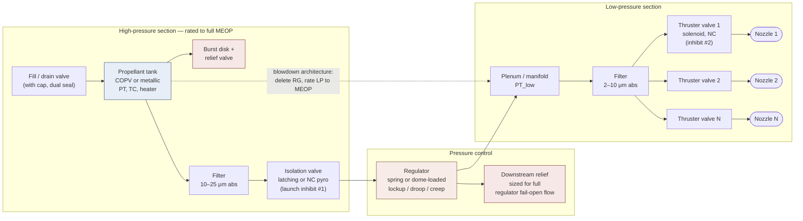

# Module 30 — Cold-Gas Hardware
Part IV · Prerequisites: modules 28, 29 · Estimated time: 7 h

A cold-gas thruster has no combustion, no ignition, no cooling, no turbomachinery and no chemistry. Everything that can go wrong with it is therefore a *hardware* problem, and hardware problems in this class of system have a nasty property: they are almost all silent. A regulator that creeps up 0.3 bar a month does not announce itself. A valve seat holding a 12 μm particle leaks at a rate you cannot hear, cannot see, and cannot measure with anything you flew. Three years later the tank is empty and the mission is over, and the telemetry shows a smooth, unremarkable pressure decay that looks exactly like normal consumption. I have watched a team spend six weeks arguing about propellant bookkeeping before someone finally put a helium mass spectrometer on the flight-spare manifold and found a B-nut that had been torqued by feel. This module is about the components — tanks, regulators, valves, filters, joints, nozzles — and about the four numbers that govern whether the assembly of them works: burst factor, leak rate, cycle life, and response time. Get those four right and cold gas is the most reliable propulsion there is. Get any one wrong and it is the least, because it has no margin anywhere to absorb the error.

---

## 1. Learning objectives

After this module you should be able to:

1. Size a spherical pressure vessel for a stated MEOP, volume and material, apply the burst factor from [AIAA-S-080]/[AIAA-S-081], and compute its mass and PV/W.
2. Argue quantitatively when a COPV beats a monolithic metallic tank and when it does not, including the small-satellite regime where the crossover reverses.
3. Explain leak-before-burst, state what design feature produces it, and say why a COPV cannot claim it the way a metallic tank can.
4. Write a system leak budget: convert an allowable propellant loss over a mission lifetime into a per-seat internal leakage specification in scc/h, and convert correctly between helium and nitrogen leak rates in both viscous and molecular regimes.
5. Derive the solenoid force balance, explain pull-in, drop-out, holding current and peak-and-hold drive, and estimate opening delay from the coil L/R time constant.
6. Compute the thrust uncertainty produced by a stated machining tolerance on a sub-millimetre throat, and combine it by RSS with regulation and discharge-coefficient uncertainty.
7. Compute a minimum impulse bit from valve response times, and identify from a vendor's quoted "number of firings" whether it is a demonstrated cycle count or an arithmetic artefact.
8. Predict the fractional pressure and thrust change of a stored-gas tank and of a self-pressurising saturated-liquid tank for a stated temperature swing, and size the thermal control accordingly.
9. Draw a single-fault-tolerant cold-gas schematic and state which faults each redundancy element covers and which it does not.
10. Name the vacuum-specific degradation mechanisms — outgassing, cold welding, lubricant loss — and the material and design choices that defeat each.

---

## 2. Terminology

| term | symbol | SI unit | definition |
|---|---|---|---|
| Maximum expected operating pressure | $p_\mathrm{MEOP}$ | Pa | Highest pressure the vessel sees in service including all thermal and dynamic effects; the reference pressure for every factor |
| Burst (ultimate) factor | $FS_u$ | — | Multiplier on MEOP that the vessel must survive without rupture |
| Proof factor | $FS_p$ | — | Multiplier on MEOP applied as an acceptance test to every flight unit |
| Performance factor | $PV/W$ | m | $p_\mathrm{MEOP}V/(m g_0)$; tank figure of merit, dimensionally a length |
| Wall thickness | $t$ | m | Membrane thickness of shell or overwrap |
| Ultimate tensile strength | $\sigma_\mathrm{tu}$ | Pa | Material allowable used in burst sizing |
| Fibre translated strength | $\sigma_f$ | Pa | Strength of the fibre as realised in a wound vessel, after translation losses |
| Internal leakage | $\dot{V}_\mathrm{leak}$ | scc/s, scc/h | Volumetric leak past a closed seat, referred to standard conditions (273.15 K, 101325 Pa) |
| External leakage | — | scc/s | Leak from the pressure boundary to ambient |
| Regulated (setpoint) pressure | $p_\mathrm{reg}$ | Pa | Nominal outlet pressure of the regulator |
| Lockup pressure | $p_\mathrm{lock}$ | Pa | Outlet pressure at zero flow after the regulator reseats |
| Droop | $\Delta p_\mathrm{droop}$ | Pa | Fall in outlet pressure from lockup to full rated flow |
| Creep | — | Pa/s | Slow rise of outlet pressure at zero flow caused by seat leakage |
| Supply pressure effect | $SPE$ | — | $\partial p_\mathrm{out}/\partial p_\mathrm{in}$; outlet sensitivity to inlet pressure |
| Sensing (diaphragm) area | $A_s$ | m² | Area on which outlet pressure acts to close the regulator |
| Seat diameter | $d_s$ | m | Diameter of the sealing land of a poppet valve |
| Poppet lift | $x$ | m | Axial displacement of poppet off its seat |
| Spring rate | $k$ | N/m | Stiffness of the loading spring |
| Magnetomotive force | $NI$ | A·turns | Turns times coil current |
| Air gap | $g$ | m | Working gap between armature and pole face |
| Pull-in current | $I_\mathrm{pi}$ | A | Coil current at which the armature starts to move |
| Drop-out current | $I_\mathrm{do}$ | A | Coil current below which the armature releases |
| Coil time constant | $\tau = L/R$ | s | Electrical rise time of the coil current |
| Opening / closing delay | $t_\mathrm{op}$, $t_\mathrm{cl}$ | s | Command-to-motion delays of the valve |
| Commanded on-time | $t_\mathrm{cmd}$ | s | Duration of the electrical command pulse |
| Effective on-time | $t_\mathrm{eff}$ | s | $t_\mathrm{cmd}-t_\mathrm{op}+t_\mathrm{cl}$ |
| Impulse bit | $I_\mathrm{bit}$ | N·s | Total impulse delivered by one pulse |
| Throat diameter / area | $D_t$, $A_t$ | m, m² | Geometric minimum-area section of the nozzle |
| Discharge coefficient | $C_d$ | — | Actual choked mass flow divided by ideal one-dimensional choked flow |
| Throat Reynolds number | $Re_t$ | — | $\rho^{*}a^{*}D_t/\mu^{*}$ evaluated at throat conditions |
| Thrust misalignment angle | $\theta_m$ | rad | Angle between the actual thrust vector and the nozzle axis |
| Filter rating | — | m (μm) | Largest spherical particle the element will pass, absolute or nominal |
| Compressibility factor | $Z$ | — | $pV/(mRT)$; departure from ideal-gas storage density |

---

## 3. Theory

### 3.1 The system, and why the schematic is the design

A cold-gas system is a pressure vessel, a pressure-control element, a set of on/off valves, and a set of nozzles, connected by tubing. That is the whole thing. The engineering content is entirely in *which* elements you include, in what order, and what each one fails to.

Read the dotted line first. In the blowdown architecture the regulator is deleted, the low-pressure section is rated to full tank MEOP, and the thrust decays as the tank empties. That is what almost every flown CubeSat cold-gas module does, and Module 29 gives the performance consequence. The regulated architecture buys constant thrust at the cost of the single most failure-prone component in the system and of a downstream relief path that must be sized for the regulator's full fail-open flow. **[J]** If your Δv budget closes with a decaying thrust, delete the regulator; it is the highest-value simplification available in this class of system.

Notice also that there are two normally-closed elements in series between propellant and vacuum (isolation valve and thruster valve). That is not conservatism, it is a launch-range requirement: two independent inhibits against inadvertent thrust. It falls out of the safety review, not the propulsion analysis, and it constrains the schematic before you have sized anything.

### 3.2 Pressure vessels

#### 3.2.1 Membrane sizing and the burst factor

For a thin-walled sphere of internal radius $r$ under internal pressure $p$, force balance on a hemisphere gives $p\pi r^2 = \sigma\,2\pi r t$, so

$$\sigma = \frac{p r}{2 t}, \qquad t = \frac{p r}{2\sigma}.$$

> **Eq. 3.1** — variables: $\sigma$ membrane stress [Pa], $p$ internal pressure [Pa], $r$ internal radius [m], $t$ wall thickness [m]. Meaning: a sphere carries pressure in pure biaxial membrane tension, equal in every direction. Assumes: $t/r \ll 1$ (below ~1/10 the error in peak stress is under 5 %), no bending, no discontinuity, uniform material. Fails at: the boss, the girth weld, and any thickness step — which is where real tanks actually fail, and why [SP-8088] spends most of its length on discontinuity stresses rather than on Eq. 3.1. **[F]**

A cylinder with hemispherical ends carries hoop stress $pr/t$ — twice the sphere's — so for a given material and pressure a cylindrical tank is roughly twice the wall thickness and, per unit volume, heavier. Cylinders exist because they package better, not because they are efficient.

The design pressure is not MEOP. Modern practice sets a **burst factor** on MEOP and requires the vessel to survive it without rupture, plus a **proof factor** applied to every flight article as an acceptance test. [AIAA-S-080] governs metallic pressure vessels, pressurised structures and pressure components; [AIAA-S-081] governs COPVs. **[M]** Typical values in current practice are $FS_u = 1.5$ and $FS_p = 1.25$ for metallic vessels with a fracture-control programme, and higher burst factors — commonly 1.5 to 2.0 depending on liner and fibre — for COPVs, whose extra margin buys down stress-rupture risk rather than static strength risk. *Do not quote a specific factor from memory in a design review.* The numbers have changed between revisions of [AIAA-S-080], [AIAA-S-081] and [STD-5001], and a margin computed against a superseded factor is worthless. Get the current revision.

The tank figure of merit is the **performance factor**

$$\frac{PV}{W} = \frac{p_\mathrm{MEOP} V}{m g_0},$$

> **Eq. 3.2** — variables: $p_\mathrm{MEOP}$ [Pa], $V$ internal volume [m³], $m$ vessel mass [kg], $g_0 = 9.80665$ m/s². Meaning: stored pressure-volume energy per unit weight; dimensionally a length, quoted in metres or inches. Assumes: nothing — it is a definition. Use: it collapses material choice, construction type and geometry into one comparable number. Fails as a criterion when volume, not mass, is the binding constraint — which at CubeSat scale it usually is. **[F]**

Substituting Eq. 3.1 into Eq. 3.2 for a sphere gives $PV/W = \sigma_\mathrm{tu}/(2 FS_u \rho g_0)$ — independent of size and pressure. **[F]** The performance factor of a membrane tank is a pure material property: specific strength divided by twice the burst factor. That single result explains the whole tank-material argument. Titanium 6Al-4V at $\sigma_\mathrm{tu} \approx 900$ MPa and $\rho = 4430$ kg/m³ gives about 6,900 m at $FS_u = 1.5$; a carbon overwrap at a translated fibre strength of 2,400 MPa and 1,600 kg/m³ gives about 51,000 m. The measured gap is smaller than that — bosses, liner and dome buildup are not membrane — but the direction is not in doubt.

#### 3.2.2 Metallic tanks, and leak-before-burst

A metallic vessel is a single load path in a material with known, statistically characterised allowables ([MMPDS]) and a fracture-mechanics description you can compute with. That last point is the whole argument. **Leak-before-burst (LBB)** is the design condition in which the critical crack length for unstable fracture exceeds the wall thickness, so a growing flaw penetrates the wall and vents the vessel *before* it reaches the length at which it would run catastrophically. The vessel announces its own end of life as a leak instead of a fragmentation event.

The condition, from linear-elastic fracture mechanics, is approximately

$$K_{Ic} > \sigma_\mathrm{op}\sqrt{\pi t}\,\cdot C,$$

> **Eq. 3.3** — variables: $K_{Ic}$ plane-strain fracture toughness [Pa·m^{1/2}], $\sigma_\mathrm{op}$ operating membrane stress [Pa], $t$ wall thickness [m], $C$ a geometry factor of order unity for a through-thickness flaw. Meaning: a through-wall crack of length comparable to the wall thickness must remain stable. Assumes: LEFM validity, plane strain, a specific flaw shape; the real assessment is a full damage-tolerance analysis with NASGRO-class software and a proof-test-screened initial flaw size, not this inequality. Fails when: the material is thick enough to be genuinely plane-strain and tough enough that LEFM under-predicts, or when the flaw is in a weld heat-affected zone with different properties from the parent. **[F]/[A]**

The engineering content of Eq. 3.3: LBB favours **thin walls in tough materials at moderate stress**. Titanium alloys and 6061/2219 aluminium in the annealed or solution-treated tempers give it comfortably; very high-strength steels do not, which is why 4130 and maraging steel bottles are rare in modern spaceflight even though their specific strength is good. **[M]**

Now the uncomfortable part. **A COPV cannot claim leak-before-burst in the same sense.** The overwrap carries most of the load, and the composite's failure mode is not a growing single crack in a homogeneous medium — it is stress-rupture: a time-dependent, statistically distributed failure of fibres under sustained load, with no ductile warning and no inspectable growing flaw. [AIAA-S-081] handles this with sustained-load life requirements, stress-ratio limits, and strict impact-damage control, not with an LBB argument. **[M]** That is why COPVs on crewed vehicles get a level of paperwork and handling discipline (impact-damage logs, dropped-hardware quarantine, keep-out zones) that a titanium sphere does not, and why the 2016 Falcon 9 pad loss — a COPV inside a LOX tank — put COPV design and loading practice under agency-wide review. If a COPV takes a hit from a dropped tool, you do not inspect it, you scrap it. There is no non-destructive test that reliably finds the damage that matters.

#### 3.2.3 COPVs: liners, permeation, and why titanium or aluminium

A COPV is classified by liner type: **Type II** metal-lined hoop-wrapped, **Type III** metal-lined fully-wrapped, **Type IV** polymer-lined fully-wrapped. Spaceflight uses Type III essentially exclusively. **[M]** Three reasons, in order of how often they decide the argument:

1. **Permeation.** Helium permeates polymers at rates that are irrelevant for a 5-minute automotive CNG cycle and fatal for a five-year mission. Steady-state permeation through a membrane is
   $$\dot{n} = \frac{P_\mathrm{perm} A \,\Delta p}{t_\mathrm{lin}},$$
   > **Eq. 3.4** — variables: $\dot n$ permeation rate [mol/s or scc/s], $P_\mathrm{perm}$ permeability of the liner material to the gas [mol·m/(m²·s·Pa)], $A$ liner area [m²], $\Delta p$ partial-pressure difference [Pa], $t_\mathrm{lin}$ liner thickness [m]. Meaning: solution-diffusion transport of gas through a solid wall — a true leak with no hole in it. Assumes: steady state, Fickian diffusion, no liner damage. Fails when: the liner has microcracked (which is exactly the condition a buckled liner produces), in which case transport is through cracks and the permeability model does not apply. **[F]**

   For metals at spacecraft temperatures $P_\mathrm{perm}$ for helium is small enough that a 0.4 mm titanium liner is effectively a perfect barrier. For a polymer liner it is not. This alone rules Type IV out of long-duration helium and hydrogen service.
2. **Liner buckling.** On depressurisation the overwrap springs back further than the liner, which has yielded in tension during autofrettage; the liner then goes into compression and can buckle inward. A buckled liner microcracks and the permeation argument collapses. Liner thickness, autofrettage pressure and the minimum allowable operating pressure are all set by this, and [AIAA-S-081] treats it explicitly.
3. **Weldability and boss integration.** The boss is the only mechanical interface on the vessel and it must be leak-tight, threadable, and joined to the liner. Ti-6Al-4V and 6061-T6 both weld to matching bosses with characterised properties. Polymers do not.

Titanium liners win on permeation margin, corrosion, and strength-to-weight; aluminium liners win on cost, formability, and — significantly — on being far easier to weld thin without embrittlement. **[J]** For a small helium or nitrogen bottle, either is defensible; for a hydrazine or NTO tank the propellant compatibility decides it and titanium usually wins.

#### 3.2.4 The small-satellite reversal: 3D-printed monolithic titanium tanks

Everything above says COPV. At CubeSat scale, much of it stops applying, and the reason is that **Eq. 3.2's size-independence is a membrane result and a small tank is not mostly membrane.** Scale a COPV down and three things happen:

- The liner hits a **minimum manufacturable gauge** — you cannot spin or weld a titanium liner much below about 0.3–0.5 mm — so liner mass stops scaling with the membrane requirement and becomes a fixed floor.
- The **boss** stops being a small correction. A 6 mm boss on a 200 mm sphere is a rounding error; on a 60 mm sphere it is a substantial fraction of the mass.
- The **dome buildup and doilies** — the extra winding at the poles where the fibre path crowds — likewise do not scale down.

Meanwhile the constraint changes character. A 6U CubeSat does not have a mass problem so much as a *volume and integration* problem, and a sphere is the worst possible shape for filling a rectangular bus. This is what makes **additively manufactured monolithic titanium tanks** attractive for smallsats, and why several suppliers now build them: laser powder-bed fusion in Ti-6Al-4V lets you print a *conformal* tank that fills the awkward volume, with the plenum, feed passages, mounting features and sometimes the nozzles integrated into the same part. **[M]/[R]**

The mass penalty against a COPV of the same pressure and volume is real and you should compute it (Worked Example 1). What you buy is: volumetric efficiency in a non-spherical envelope, a large reduction in joint count, and the elimination of the whole COPV handling and stress-rupture regime. The academic lineage here — the Georgia Tech / UT Austin work behind the BioSentinel-class R-236fa systems — makes the point explicitly that **printing the plenum, feed passages and nozzles as one part removes the joints that dominate the leak-rate budget in a system that must hold propellant for years** (verification worksheet §B.4; confidence C, primary SmallSat-conference sources not yet read). The counter-arguments are equally real: as-built printed Ti-6Al-4V has porosity and anisotropic properties, requires hot isostatic pressing plus surface finishing on any fatigue-critical or flow-critical surface, and does not yet have [MMPDS]-class design allowables across the board. See [GradlAM] for the state of AM qualification in propulsion generally. **[R]**

### 3.3 Regulators

A regulator is a valve that closes itself with its own outlet pressure. That one sentence contains all of its behaviour and all of its failure modes.

#### 3.3.1 The force balance

Take a single-stage, spring-loaded, direct-acting regulator with a poppet of seat diameter $d_s$, a sensing diaphragm of area $A_s$, and a loading spring of rate $k$ preloaded to force $F_0$. Outlet pressure acts on $A_s$ to close; the spring acts to open; inlet pressure acts on the small unbalanced seat area $A_\mathrm{seat} = \pi d_s^2/4$ in whichever sense the poppet is oriented. Neglecting friction and flow forces:

$$p_\mathrm{out} A_s = F_0 - k x \pm p_\mathrm{in} A_\mathrm{seat}.$$

> **Eq. 3.5** — variables: $p_\mathrm{out}$, $p_\mathrm{in}$ outlet and inlet pressures [Pa], $A_s$ sensing area [m²], $F_0$ spring preload at zero lift [N], $k$ spring rate [N/m], $x$ poppet lift [m], $A_\mathrm{seat}$ unbalanced seat area [m²]. Meaning: a quasi-static force balance on the moving assembly; the sign on the last term depends on whether the poppet opens with or against inlet pressure. Assumes: quasi-static (no dynamics), frictionless, no flow-induced force, diaphragm effective area constant with deflection. Fails when: the regulator is oscillating (then it is a dynamic problem and this equation tells you nothing), or when diaphragm effective area changes appreciably with stroke. **[F]**

Three consequences fall straight out of Eq. 3.5.

**Lockup.** At zero flow, $x \to 0$ and $p_\mathrm{lock} = (F_0 \pm p_\mathrm{in}A_\mathrm{seat})/A_s$. Lockup is *above* the flowing setpoint, always, because the poppet must be seated to stop flow and the spring is at maximum extension. Every downstream component must be rated to lockup, not to setpoint. **[F]**

**Droop.** With flow, the poppet must lift, the spring compresses, and outlet pressure falls:

$$\Delta p_\mathrm{droop} = \frac{k x}{A_s}.$$

Combine with choked flow through the seat annulus, $\dot m = C_d\,(\pi d_s x)\,\Gamma\, p_\mathrm{in}/\sqrt{R T}$:

$$\Delta p_\mathrm{droop} = \frac{k\,\dot m \sqrt{R T}}{A_s\,C_d\,\pi d_s\,\Gamma\, p_\mathrm{in}}.$$

> **Eq. 3.6** — variables: $\dot m$ mass flow [kg/s], $\Gamma = \sqrt{\gamma}\,(2/(\gamma+1))^{(\gamma+1)/2(\gamma-1)}$, $R$ specific gas constant [J/(kg·K)], $T$ gas temperature [K], $C_d$ seat discharge coefficient, others as Eq. 3.5. Meaning: droop is proportional to demanded flow and inversely proportional to inlet pressure, sensing area, and seat circumference. Assumes: the seat annulus is choked (true whenever $p_\mathrm{in}/p_\mathrm{out} > \sim 2$), lift small compared with $d_s/4$ so the annulus and not the seat bore is the throat. Fails when: lift approaches full open (the bore chokes instead and droop saturates), or at low pressure ratio. **[F]/[A]**

The important term is $1/p_\mathrm{in}$. **Droop is worst at end of life**, when the tank is nearly empty and the poppet must lift furthest for the same flow. A regulator that looks flat on the bench at 300 bar inlet can be visibly drooping at 40 bar. Test it at end-of-life inlet pressure or you have not tested it.

**Supply pressure effect (SPE).** Differentiating Eq. 3.5 at fixed flow, $\partial p_\mathrm{out}/\partial p_\mathrm{in} = \pm A_\mathrm{seat}/A_s$. A 1 mm seat and a 25 mm diaphragm give $SPE = (1/25)^2 = 0.0016$: as the tank falls 300 → 50 bar, the setpoint shifts by $0.0016 \times 250$ bar $= 0.4$ bar, or 2 % of a 20 bar setpoint. **[F]** Making the seat small and the diaphragm large reduces SPE — and increases droop's sensitivity in the opposite direction through $d_s$ in Eq. 3.6. That is the central regulator trade and it is why **two-stage regulators exist**: two stages each with $SPE = 0.02$ give $0.0004$ overall, and the first stage delivers a nearly constant inlet pressure to the second so the second's droop term stops varying over the mission. The cost is mass, volume, one more set of seats to leak, and a coupled dynamic system that can chatter between stages.

**Dome loading** replaces the spring with a gas volume above the diaphragm. A gas dome of volume $V_d$ has effective rate $k_\mathrm{eff} = \gamma p_d A_s^2 / V_d$, which for a generous dome volume is far softer than any practical spring — so droop nearly vanishes, and the setpoint can be commanded by changing dome pressure. Dome-loaded regulators dominate ground test facilities and large launch-vehicle pressurisation. **[M]** They are rare on small spacecraft because the dome is one more pressurised volume that must be filled, held, and not leak.

#### 3.3.2 Creep, and why a regulator failing open is a system hazard

**Creep** is the slow rise of outlet pressure at zero flow caused by leakage past a closed regulator seat. It is not droop's opposite and it is not a setpoint error; it is a seat leak integrating into a closed volume. In a system that pulses for milliseconds and then sits for hours, **the downstream volume is closed almost all the time**, so even a tiny seat leak walks the low-pressure section up toward inlet pressure. Given long enough, and no relief path, it walks it all the way to tank pressure.

That is the hazard, and it deserves stating plainly: **a regulator does not fail safe.** Its failure mode is to pass full inlet pressure downstream into plumbing, valves and nozzles designed for a fraction of it. The consequences run from an over-thrusting, non-commandable spacecraft (the thruster valves may not even close against 300 bar — see §3.4.1) to a burst low-pressure line inside the bus. There are exactly three defences and real systems use combinations of them:

1. **Rate the downstream section to full tank MEOP.** Complete and unconditional. Costs mass everywhere downstream.
2. **A relief valve or burst disk downstream, sized to pass the regulator's full fail-open flow.** Note the sizing requirement — a relief valve sized for thermal expansion of a trapped volume is orders of magnitude too small to protect against a regulator flowing wide open, and this is a mistake people actually make. Note also that a relief valve is a component with a seat, so it is itself a leak source in a system where the leak budget is the mission.
3. **Series regulators, or a latching isolation valve upstream that the fault-management logic closes** on a low-pressure-sensor over-range. This is the only defence that also handles creep, because it removes the pressure source. It requires the sensor, the logic, and the assumption that the fault is detected in time.

[SP-8080] is the reference and it treats regulator droop, lockup, chatter and cracking-pressure behaviour properly; it is a liquid-rocket document but the physics is identical and the failure catalogue is the same. **[H]/[M]**

### 3.4 Valves

#### 3.4.1 Solenoid valve physics

A direct-acting solenoid valve is a magnetic circuit that must generate more force than the sum of the spring preload and the pressure force on the poppet. The force across a working gap $g$ with $N$ turns carrying current $I$ over pole area $A_p$, in the unsaturated linear regime, is

$$F_\mathrm{mag} = \frac{\mu_0 N^2 I^2 A_p}{2 g^2}.$$

> **Eq. 3.7** — variables: $\mu_0 = 4\pi\times10^{-7}$ H/m, $N$ turns, $I$ coil current [A], $A_p$ pole face area [m²], $g$ air gap [m], $F$ [N]. Meaning: force is the gradient of stored magnetic energy with gap; it goes as the square of ampere-turns and inversely as the square of the gap. Assumes: all reluctance in the air gap (iron infinitely permeable), no saturation, no fringing, single gap. Fails when: the iron saturates — above roughly 1.5–2.0 T in soft magnetic iron or 430F stainless the force stops rising as $I^2$ and goes nearly linear, which is why brute-forcing a marginal valve with more current stops working. **[F]/[A]**

The $1/g^2$ is the whole story of solenoid behaviour:

- **Pull-in is a snap.** At the open gap the force is weakest; as soon as the armature starts to close, the gap shrinks and the force rises steeply, so motion is fast and unstable in the good sense. There is no proportional region in an on/off solenoid.
- **Drop-out current is far below pull-in current.** Once closed, $g$ is a residual gap of tens of micrometres and the force is enormous for the same current. Hysteresis between pull-in and drop-out is typically a factor of 3–6.
- **Therefore: peak-and-hold drive.** Apply full voltage to pull in, then chop the current down to a holding level. For the example in §5.4 the pull-in dissipation is ~20 W and the hold is ~0.4 W. A CubeSat cannot dissipate 20 W continuously; it can dissipate it for 5 ms. Peak-and-hold is not an optimisation, it is what makes a solenoid usable on a small spacecraft at all. **[M]**

The **pressure force** on the poppet is $p\,A_\mathrm{seat}$ and it sets the hard scaling limit. A 1 mm seat at 20 bar is 1.6 N — trivial. The same seat at 300 bar is 24 N, which is the entire output of a well-designed small solenoid (§5.4). This is why:

- Thruster valves live **downstream** of the regulator, at 2–25 bar, where they can be small, fast and low-power.
- High-pressure isolation uses **latching** valves (which need force only during the transition, and a magnetic latch or over-centre spring to hold state), **pilot-operated** valves (where a small solenoid vents a control volume and the line pressure does the work), or **pyrotechnic** valves (where a cartridge does the work once).
- A direct-acting solenoid on the high-pressure side is either physically large, power-hungry, or **pressure-balanced** — and a balanced poppet needs a dynamic seal on the balance stem, which is a second leak path.

**Response time** has an electrical part and a mechanical part. The coil current rises as $I(t) = (V/R)(1-e^{-t/\tau})$ with $\tau = L/R$, so the time to reach pull-in current is

$$t_\mathrm{elec} = \tau \ln\!\left(\frac{1}{1 - I_\mathrm{pi}R/V}\right).$$

> **Eq. 3.8** — variables: $\tau = L/R$ [s], $L$ coil inductance [H], $R$ coil resistance [Ω], $V$ drive voltage [V], $I_\mathrm{pi}$ pull-in current [A]. Meaning: first-order electrical rise of a series R-L circuit. Assumes: constant $L$ — which is false, because $L$ depends on the gap and therefore changes as the armature moves; the honest treatment solves the coupled electromechanical problem. Fails when: $I_\mathrm{pi}R \geq V$ (the valve never pulls in), or when eddy currents in a solid magnetic circuit slow the flux rise appreciably beyond $L/R$. **[F]/[A]**

Then the armature must physically travel, against inertia, spring, pressure and gas damping in the working volume: typically another 0.5–2 ms for a small valve. Total opening delay for a small spacecraft solenoid is 2–5 ms; closing delay is usually shorter but depends strongly on how you switch the coil off (§3.4.2).

**Overdriving** — running at 28 V a coil designed for 12 V, for a few milliseconds only — cuts $t_\mathrm{elec}$ substantially and is standard practice. It is limited by insulation, by the peak-and-hold circuit, and by the fact that faster pull-in means a harder armature impact, which is a cycle-life and particle-generation problem.

#### 3.4.2 The flyback trade: EMI against impulse-bit repeatability

When the coil switches off, the stored energy $\tfrac12 L I^2$ must go somewhere. Left unclamped, $V = -L\,dI/dt$ spikes to hundreds of volts, arcs the switch, and radiates and conducts broadband noise — which is exactly what shows up as a failure on conducted-emission testing to the [SMC-S-016] environment. Clamping with a simple flyback diode holds the coil voltage near zero and the current decays slowly through the diode, which keeps the armature held in *longer* and lengthens the closing delay. Clamping with a Zener or TVS at, say, 60 V forces $dI/dt = V_\mathrm{clamp}/L$ and collapses the current fast — a 30 mH coil at 0.45 A decays in about 0.22 ms — at the price of a higher, faster transient and more EMI.

**[J]** This is a genuine, unavoidable trade and you should make it deliberately: a plain flyback diode for a system where impulse-bit repeatability does not matter much and EMI margin is tight; a clamped (Zener/TVS) drive for a system whose minimum impulse bit and pointing stability depend on a crisp closing edge. Whichever you choose, the clamp voltage belongs in the impulse-bit model, because it changes $t_\mathrm{cl}$ in Eq. 3.10 and therefore changes $I_\mathrm{bit}$ (§5.5).

#### 3.4.3 Seats, leakage and cycle life

Internal leakage is the number that decides whether a cold-gas system holds propellant for years, and it is a property of the seat. Two families:

**Soft seats** — PTFE, PCTFE (Kel-F), PEEK, polyimide (Vespel), Torlon. A polymer land is compliant enough to conform around a small trapped particle and around the surface finish of the mating land, so achievable leak rates are low: 10⁻⁴ to 10⁻⁶ scc/s GHe is routine. The costs are creep (the polymer cold-flows under sustained seat load, so the seat load relaxes and leakage rises with time and temperature), a temperature-limited operating range, and outgassing that must be qualified per ASTM E595 (TML ≤ 1.0 %, CVCM ≤ 0.1 %). Elastomers — EPDM, Viton, nitrile — give the best seal of all and are largely disqualified for multi-year vacuum service by compression set and outgassing. **[M]**

**Hard seats** — metal-to-metal, typically a lapped or coined land in a hard stainless, or a ceramic/carbide land. Higher cycle life, no creep, wide temperature range; and worse leakage, because two hard surfaces seal only where their asperities and form errors let them. A metal seat that achieves 10⁻³ scc/s GHe is a good one. **[M]** Hard seats also lose the particle-tolerance argument entirely: a soft seat embeds a 10 μm particle, a hard seat is propped open by it. This is why the filtration requirement is set by the seat type, not by an abstract cleanliness ideal (§3.5).

**Cycle life** for a small on/off valve is governed by impact wear at the seat and at the armature stop, by fatigue of the spring and of any bellows or diaphragm, and by particle generation from the impacting surfaces — which then contaminates the seat that generated them. Published figures for micro-valves in this class run into the 10⁵–10⁶ range, and §5.5 shows how to tell whether such a figure is a demonstrated cycle count or an arithmetic construction.

#### 3.4.4 Latching, proportional, isolation and pyro valves

**Latching valves** are bistable: a pulse in one direction opens, a pulse in the other closes, and a permanent magnet or a mechanical over-centre holds state with **zero holding power**. Two consequences that matter more than the power saving. First, the valve keeps its state through a spacecraft reset or a power dropout — which is a hazard as much as a feature, since a latch valve left open by an unlucky reset is an open propellant path. Second, its state is not implied by its command, so it needs a **position telemetry** (usually a Hall sensor or a microswitch); a latch valve without position telemetry is an item of hardware whose configuration you do not actually know.

**Proportional valves** modulate flow continuously — a solenoid or piezo actuator against a spring, with lift proportional to current. They give continuously variable thrust and therefore fine control authority without pulse-width modulation, and they eliminate impact wear. They cost: continuous power, a control loop, hysteresis and dead-band around the closed position, and — decisively for a long mission — they generally do **not** seal to the leak rate an on/off valve does, because the sealing land is a control surface. Standard practice is a proportional valve in series with an on/off or latching isolation valve that provides the actual long-term seal. **[M]**

**Isolation valves** are the ones that separate the tank from everything else. **Pyrotechnic (pyro) valves** — normally-closed, opened once by a cartridge that drives a ram to shear a barrier — are the only genuinely zero-leak isolation available, because there is no seat at all until they fire: the pressure boundary is a solid metal diaphragm. That is worth a lot in a leak budget covering years of ground storage plus years of flight. The prices are: single use, a pyrotechnic device with all its handling, safe-and-arm and shock-environment implications (the firing shock is a real load on nearby components), and the debris the shearing operation produces — which is why a pyro valve is always followed immediately by a filter. **Normally-open pyro valves** exist too, used to permanently isolate a failed leg.

### 3.5 Filters, contamination and particle control

Filtration in a cold-gas system exists to protect valve seats, and its requirement therefore comes from the seat, not from a general desire for cleanliness. **[J]** The working rule: the filter's **absolute** rating must be smaller than the particle size that will hold the seat open at the achievable seat load — for a hard seat that is single-digit micrometres, for a soft seat somewhat more forgiving. Note *absolute*: a "nominal 10 μm" element passes a defined but non-zero fraction of 10 μm particles and is not a specification you can budget against. Use absolute ratings, and state the beta ratio if the vendor publishes one.

Typical practice: a 10–25 μm absolute element on the high-pressure side (protecting the regulator and latch valve, catching the fill-operation debris and the pyro-valve debris), and a 2–10 μm absolute element immediately upstream of the thruster valve manifold. Filters go **immediately downstream of every debris source** — the fill port, the pyro valve, any component that has been cut, brazed or crimped.

Filter pressure drop follows the usual porous-medium form, $\Delta p \propto \mu \dot{V}$ in the viscous regime with a quadratic correction at higher flow. The useful conclusion at this scale is a null result: at CubeSat flow rates (10⁻⁵–10⁻⁴ kg/s) the ΔP across a properly sized element is milli-bar, i.e. negligible against a 2–20 bar feed pressure. **Filters are effectively free in cold gas; put them everywhere.** They are not free on a launch-vehicle-scale system, where filter ΔP is a real term in the feed-pressure budget ([SP-8123]).

Cleanliness is specified to IEST-STD-CC1246 levels (e.g. "Level 100" — no particle larger than 100 μm, with a defined size distribution below) plus a non-volatile-residue limit. Precision-clean, assemble in a cleanroom, purge with filtered gas, cap every port the instant it is opened, and keep the assembly records. **[M]** The dominant real-world contamination source in flight hardware is not the factory air; it is the machining chips and burrs left inside components, and the debris generated by the assembly operations themselves — thread galling, ferrule swaging, welding spatter.

### 3.6 Tubing, fittings and joints

Every joint is a leak path, and the leak budget is dominated by joint count (§5.3). The hierarchy, best to worst:

| joint | typical achievable external leakage | comment |
|---|---|---|
| Orbital-TIG or EB weld | < 10⁻⁹ scc/s GHe (below detection) | Permanent; requires access, and a weld is a fracture-control item |
| Brazed joint | 10⁻⁸–10⁻⁶ scc/s | Permanent; braze voids are the failure mode and are hard to inspect |
| Metal face seal (VCR-type, crushed gasket) | 10⁻⁸–10⁻⁷ scc/s | Demountable, gasket replaced each make-up, the best mechanical joint |
| Flareless / bite-type (AS4395 family) | 10⁻⁶–10⁻⁴ scc/s | Demountable, sensitive to ferrule set and re-make |
| 37° flare (AN/MS) | 10⁻⁶–10⁻⁴ scc/s | Demountable, sensitive to torque and to tube-end finish |
| Tapered pipe thread (NPT) | 10⁻⁴ and worse | **Never in flight hardware.** Seals on a thread interference with sealant |

**[E]/[J]** — these are order-of-magnitude bands drawn from general practice, not from a single tabulated source; [SP-8119] is the reference document for joint types, seal selection and leakage criteria and should be read before you commit a joint schedule.

Design rules that follow:

- **Weld what never has to come apart.** Every demountable joint in the schematic should have a written reason to exist (test access, replaceable component, integration break).
- **Machine or print manifolds as one part** rather than assembling them from fittings. Replacing six tee fittings with one manifold block removes twelve leak paths and a lot of mass.
- **Torque is not optional and feel is not torque.** B-nut torque values are specified, with a witness mark and a torque-stripe applied afterwards, because "tight" is a range that spans two orders of magnitude in leak rate.
- **Do not re-make mechanical joints casually.** A flareless ferrule that has set on a tube has a matching plastic deformation; remaking it against a different surface is where the leak comes from.
- **Bends, not elbows.** A bent tube has no joint. [SP-8123] covers the line-sizing, vibration and bellows-fatigue side.

### 3.7 Nozzles at very small scale

Module 29 gives the performance model. Here we care about what the hardware does to it.

**Reynolds number.** The throat Reynolds number

$$Re_t = \frac{\rho^{*} a^{*} D_t}{\mu^{*}}$$

> **Eq. 3.9** — variables: $\rho^{*}$, $a^{*}$, $\mu^{*}$ density [kg/m³], sonic velocity [m/s] and dynamic viscosity [Pa·s] at throat conditions, $D_t$ throat diameter [m]. Meaning: the ratio of inertial to viscous transport at the throat; it sets the boundary-layer thickness as a fraction of the throat radius. Assumes: choked flow, throat properties from isentropic relations. Fails when: the flow is not choked, or when the gas is not adequately ideal (a saturated refrigerant near its vapour dome is not). **[F]**

Since $\rho^{*} \propto p_c$ and $a^{*}$ is fixed by the gas and $T_0$, $Re_t \propto p_c D_t$. A cold-gas thruster is small *and* runs at a few bar, so both factors push it down: the 0.30 mm / 5 bar nitrogen example in §5.4 gives $Re_t \approx 2.3\times10^{4}$, and a 1 mN butane thruster at 2 bar with a 0.1 mm throat is down near 10³. Below about 10³ the boundary layer occupies a substantial fraction of the throat and the nozzle stops being a nozzle in the one-dimensional sense.

The consequence is captured by the **discharge coefficient**, for which the standard laminar-boundary-layer form is

$$C_d \approx 1 - \frac{C}{\sqrt{Re_t}}, \qquad C \approx 2.5\!-\!3.5,$$

> **Eq. 3.9b** — variables: $C_d$ dimensionless, $Re_t$ from Eq. 3.9, $C$ an empirical constant depending on throat radius-of-curvature ratio and on wall temperature. Meaning: the displacement thickness of the throat boundary layer shrinks the effective flow area. Assumes: laminar throat boundary layer, smooth wall, axisymmetric throat. Fails when: the throat boundary layer transitions (higher $Re_t$, rough wall), or when $Re_t \lesssim 300$ and the whole flow is viscous-dominated so no boundary-layer decomposition is valid. This is the same functional form ISO 9300 uses for critical-flow venturi nozzles. **[E]/[A]**

At $Re_t = 2.3\times10^{4}$, $C_d \approx 0.98$; at $10^3$, $C_d \approx 0.91$; and the *divergence* side degrades faster still, since the diverging section is longer, colder and at lower Reynolds number than the throat, so a large geometric $\varepsilon$ stops paying. That is the hardware reason cold-gas micro-nozzles rarely exceed $\varepsilon \approx 50$–100 no matter what the ideal-performance table (Module 28) says: past that, the added boundary layer costs more than the added area ratio returns. **[E]**

Two further scale effects:

- **Contour is irrelevant below about 1 mm throat diameter.** A bell contour buys 1–2 % over a 15° cone on a large nozzle. At sub-millimetre scale the boundary-layer and manufacturing errors are several percent, so a conical nozzle — which you can actually inspect and measure — is the right choice. **[J]**
- **Manufacturing route sets the achievable tolerance.** Micro-drilling and EDM give a few micrometres on a throat diameter; DRIE/LIGA MEMS nozzles give sub-micrometre in-plane but a rectangular cross-section with its own boundary-layer penalty; additive manufacturing does *not* currently give you a sub-millimetre throat to tolerance and must be followed by a machining or EDM operation on the throat itself. **[M]**

**Throat tolerance is the dominant thrust uncertainty**, because $A_t \propto D_t^2$ and so $\delta A_t/A_t = 2\,\delta D_t/D_t$. Worked Example 3 does the arithmetic; the headline is that a ±10 μm tolerance — which is a good machine-shop number — on a 0.30 mm throat is ±6.7 % in thrust before anything else is counted.

**Thrust misalignment** has two sources: *angular*, from non-concentricity of the throat and exit planes and from the nozzle axis not being normal to its mounting face; and *lateral*, from the thrust vector not passing through the intended point. Both convert directly into a disturbance torque that the attitude-control system must absorb. A burr on one side of the throat is not a cosmetic defect — it biases the flow and puts a permanent torque on the spacecraft. §5.4 quantifies it.

### 3.8 System-level design constraints

#### 3.8.1 Leak-rate budgeting

Write the budget as an allowable *mass* loss, convert to a standard volumetric rate, then allocate. The conversion uses the standard density $\rho_\mathrm{std} = p_\mathrm{std}M/(R_u T_\mathrm{std})$ at 273.15 K and 101325 Pa — for nitrogen 1.2498×10⁻³ g/cm³. Worked Example 2 does this end-to-end.

The subtlety that catches people is **which gas the specification is written in**. Leak specs are almost always quoted in GHe, because helium is the tracer gas a mass spectrometer leak detector actually detects. Converting a helium spec to nitrogen service requires knowing the flow regime:

- **Molecular (Knudsen) flow** — very small leaks, where the mean free path exceeds the leak path dimension. Flow $\propto 1/\sqrt{M}$, so helium leaks $\sqrt{28.014/4.003} = 2.65\times$ faster than nitrogen at the same standard conditions.
- **Viscous (laminar) flow** — larger leaks. Flow $\propto 1/\mu$, and $\mu_\mathrm{He} = 19.9$ μPa·s against $\mu_{N_2} = 17.8$ μPa·s, so helium leaks $0.89\times$ — *slower* than nitrogen.

> **[F]** The helium-to-nitrogen conversion factor is therefore anywhere between 0.89 and 2.65 depending on the leak's size, and there is no single correct number. Specifying in GHe and testing in GHe is conservative for small (molecular-regime) leaks, which are the ones a multi-year budget cares about. Never convert a leak spec across gases without stating which regime you assumed.

#### 3.8.2 Thermal environment

For a stored gas at constant volume, ideal-gas behaviour gives $\Delta p/p = \Delta T/T$: a −10 °C to +50 °C swing raises tank pressure by 23 %. Three consequences. MEOP is defined at the **maximum** predicted temperature, so the tank is sized by the hot case. Regulated systems absorb the swing through SPE only, so downstream conditions barely move. **Blowdown systems pass it straight through to thrust**, so a blowdown thruster's thrust is a function of tank temperature and any thrust calibration must carry a temperature.

For a **self-pressurising saturated liquid** — butane, R-134a, R-236fa — the feed pressure is the vapour pressure, which follows Clausius–Clapeyron:

$$\frac{d \ln p_v}{dT} = \frac{\Delta H_\mathrm{vap}}{R T^2} \quad\Rightarrow\quad \frac{\Delta p_v}{p_v} \approx \frac{\Delta H_\mathrm{vap}}{R T}\,\frac{\Delta T}{T}.$$

> **Eq. 3.10** — variables: $p_v$ vapour pressure [Pa], $\Delta H_\mathrm{vap}$ molar enthalpy of vaporisation [J/mol], $R = 8.31446$ J/(mol·K), $T$ [K]. Meaning: vapour pressure is exponential in temperature, with the sensitivity set by the latent heat. Assumes: $\Delta H_\mathrm{vap}$ constant over the interval, ideal vapour, incompressible liquid. Fails near the critical point, where $\Delta H_\mathrm{vap}\to 0$ and the relation collapses — relevant for CO₂ (critical 304.1 K) and xenon (289.7 K), both of which are *supercritical or nearly so at room temperature* and must not be modelled as saturated liquids there. **[F]/[A]**

For R-236fa, Trouton's rule ($\Delta S_\mathrm{vap} \approx 85$ J/(mol·K) at a normal boiling point of 271.7 K) gives $\Delta H_\mathrm{vap} \approx 23.1$ kJ/mol, so $\Delta H_\mathrm{vap}/(RT) \approx 9.3$ at 300 K. A 10 K rise raises the feed pressure by ~37 %, against 3.4 % for a stored gas. **That factor of eleven is the reason every self-pressurising cold-gas module has a thermostatically controlled heater and a tank thermistor, and why its thrust must always be quoted with a tank temperature.** It also means the tank must not be allowed to go cold: below the temperature at which vapour pressure falls under the value the thruster needs, the system simply stops producing useful thrust. Typical heater power for a CubeSat propulsion module is a fraction of a watt to a couple of watts — small, but it is a continuous orbit-average load on a bus that may have only 10–20 W, and it must be in the power budget from day one. **[M]**

A second-order effect that matters in long burns: expansion cools the remaining propellant (Joule–Thomson plus the enthalpy of vaporisation drawn from the liquid), so feed pressure and thrust decay *during* a burn even at constant tank fill. For a saturated-liquid system this self-cooling is the dominant within-burn transient.

#### 3.8.3 Vacuum operation

- **Outgassing.** Every polymer in the system — seat, seal, wire insulation, conformal coating, adhesive — outgasses in vacuum. Qualify to ASTM E595 (TML ≤ 1.0 %, CVCM ≤ 0.1 %) and remember that a cold-gas thruster's plume is one of the few things on the spacecraft that can deposit condensables directly onto optics. Outgassing also *changes the seat*: a PTFE seat that loses absorbed species relaxes its seat load and its leak rate moves.
- **Cold welding.** Two clean like-metal surfaces in vacuum, pressed together with no oxide layer between them, can diffusion-bond. The classic mitigations are: never slide like metals against like (Ti-on-Ti is the notorious case), use dissimilar hardnesses, use a hard coating (TiN, DLC, hard anodise), or interpose a polymer. In an on/off valve this applies to the armature stop, the guide bearing and any anti-rotation feature — not usually to the seat itself, which is generally a polymer or has a pressure-driven separation.
- **Lubricant loss.** Wet lubricants evaporate, migrate and contaminate. Dry-film lubricants — MoS₂, ion-plated lead, DLC — or no sliding contact at all. This is one of the arguments for VACCO's chemically-etched flexure-based micro-valve architecture, which VACCO describes as *frictionless*: replace sliding contacts with elastic flexures and there is nothing to lubricate and nothing to cold-weld (verification worksheet §B.4, confidence B).

#### 3.8.4 Redundancy and single-fault tolerance

Two failures matter and they demand opposite architectures:

- **Fail-to-open (a valve stuck open, or a leaking seat)** is defeated by valves **in series**. Two normally-closed valves in series both have to fail before propellant escapes.
- **Fail-to-close (a valve that will not open)** is defeated by valves **in parallel**. Either one opening gives you flow.

You cannot have both with two valves. Full single-fault tolerance against both failure modes requires the **series-parallel (quad) arrangement** — four valves, two parallel legs of two in series — which is standard on crewed and high-value RCS and is essentially never affordable on a CubeSat. **[M]**

What smallsats do instead is exploit the fact that the two failures are not equally bad. Inadvertent thrust (fail-open) can tumble or de-orbit the spacecraft and is a range-safety concern *before* launch; loss of thrust (fail-closed) usually costs only the propulsive part of the mission. So the money goes into series inhibits: a latching or pyro isolation valve in series with each thruster's own valve, giving two inhibits against inadvertent thrust and no redundancy at all against a stuck-closed thruster. **[J]** That is a deliberate, defensible asymmetry, and you should be able to state it out loud in a review rather than have it discovered.

Three more architectural points:
- **Thruster-level redundancy is usually geometric.** With eight thrusters arranged for 6-DOF control, the loss of one leaves a degraded but controllable set; the redundancy lives in the arrangement, not in duplicated hardware.
- **A relief valve is a seat, and a burst disk is not.** If the leak budget is critical, prefer a burst disk (a solid diaphragm, zero leak until it ruptures) and accept that it is single-use and vents the tank completely.
- **Never let a single command open two series inhibits.** Independent inhibits require independent command paths, independent drivers, and ideally independent power domains. Otherwise the "two inhibits" are one inhibit with two mechanisms.

---

## 4. Typical engineering ranges

| quantity | typical range | who sits at the extreme |
|---|---|---|
| Tank MEOP, stored gas | 150–350 bar (2,200–5,100 psi) | SAFER at 224 bar (3,250 psi) is mid-range; ground charge for MMU quoted ≈ 207 bar (conf. C) |
| Tank MEOP, self-pressurising liquid | 1–10 bar | GomSpace NanoProp butane at 1–4 bar is the low end; SF₆ at ≈ 21 bar the high end |
| Burst factor $FS_u$ | 1.5 (metallic, fracture-controlled) to ~2.0 (COPV) | Check the current revision of [AIAA-S-080]/[AIAA-S-081]; do not quote from memory |
| Proof factor $FS_p$ | 1.25–1.5 | Every flight article, not a sample |
| $PV/W$, monolithic Ti-6Al-4V sphere | 6,000–12,000 m | Small tanks at the low end (boss and minimum gauge dominate) |
| $PV/W$, Type III COPV | 20,000–40,000 m | Large-volume, high-pressure vessels at the top |
| COPV liner thickness | 0.3–1.0 mm | Set by minimum manufacturable gauge and buckling, not by strength |
| Regulated pressure, small systems | 2–25 bar | Set by nozzle $p_c$ requirement |
| Regulator droop, full flow | 1–5 % of setpoint | Worst at end-of-life inlet pressure |
| Regulator SPE | 0.1–2 % of inlet change, single-stage | Two-stage reduces this by the product of stages |
| Solenoid valve opening delay | 2–5 ms | Overdriven small valves toward 1–2 ms |
| Solenoid valve closing delay | 1–4 ms | Strongly dependent on flyback clamp voltage |
| Minimum impulse bit | 10⁻⁵–10⁻³ N·s | VACCO MiPS-class implied bit ≈ 5×10⁻⁵ N·s (see §5.5) |
| Thrust, CubeSat cold gas | 1–100 mN | GomSpace NanoProp 1 mN/thruster with 5 μN resolution; VACCO "> 50 mN"/thruster |
| Thrust, EVA/crewed cold gas | ~3–8 N per thruster | MMU ≈ 7.6 N and SAFER ≈ 3.6 N — **both derived, not sourced; NEEDS PRIMARY** |
| Thrust class, whole cold-gas category | 10 μN – 3.6 N | NASA *State of the Art* small-spacecraft envelope [NASA-SOA] |
| Isp, realized cold gas | 40–75 s | R-236fa ≈ 40 s (MarCO); GN₂ ≈ 65–73 s; warm gas reaches ~82 s (CHIPS) |
| Internal leakage spec, soft seat | 10⁻⁴–10⁻⁶ scc/s GHe | The tight end needs lapped lands and controlled seat load |
| Internal leakage spec, hard seat | 10⁻³–10⁻⁴ scc/s GHe | Better cycle life, worse seal |
| Filter rating, absolute | 2–25 μm | 2–10 μm immediately upstream of thruster valves |
| Filter ΔP at CubeSat flow | < 0.01 bar | Effectively free at this scale |
| Valve cycle life | 10⁵–10⁶ firings | VACCO quotes 880,000 (Standard MiPS) and 1,860,000 (Micro MiPS) — see §5.5 for what that figure is |
| Throat diameter, CubeSat nozzle | 0.05–0.5 mm | 1 mN class at the small end |
| Achievable throat tolerance | ±3 to ±15 μm | EDM and micro-drilling at the tight end |
| Throat Reynolds number | 10³–10⁵ | 1 mN butane thruster near 10³; 50 mN N₂ at 5 bar ≈ 2×10⁴ |
| Nozzle area ratio, cold gas | 20–100 | Beyond ~100 the boundary layer eats the gain |
| Thrust misalignment, as-built | 0.3–1.5° | Sets the disturbance-torque budget |
| Heater power, propulsion module | 0.2–2 W orbit-average | Mandatory for self-pressurising propellants |

Numbers for real systems are from the course verification worksheet, Part B; the ideal-performance figures agree with the frozen-flow calculation at $T_0 = 300$ K given there and in Module 28.

---

## 5. Worked examples

### 5.1 Worked Example 1 — COPV against a monolithic titanium tank

**Problem.** Size a spherical 5.00 L (0.005 m³) tank for GN₂ at $p_\mathrm{MEOP} = 310$ bar (4,500 psia), burst factor 1.5, two ways: (a) monolithic Ti-6Al-4V, $\sigma_\mathrm{tu} = 900$ MPa, $\rho = 4430$ kg/m³; (b) Type III COPV with a 0.40 mm Ti-6Al-4V liner and a carbon/epoxy overwrap at a translated fibre design strength of 2,400 MPa and $\rho = 1600$ kg/m³. Allow +20 % on the metallic shell for the boss and knuckle, +25 % on the COPV for boss, doilies and dome buildup. Compare masses and $PV/W$, and state how much nitrogen the tank holds.

**Step 1 — geometry.**
$$r = \left(\frac{3V}{4\pi}\right)^{1/3} = \left(\frac{3(0.005)}{4\pi}\right)^{1/3} = 0.10608\ \mathrm{m}$$
$$A = 4\pi r^2 = 4\pi (0.10608)^2 = 0.14140\ \mathrm{m^2}$$
So a 212 mm diameter sphere. **Note this now**: it will not fit in a 100 mm CubeSat cross-section, which is the point of §5.2's cross-check.

**Step 2 — burst pressure.**
$$p_b = FS_u\, p_\mathrm{MEOP} = 1.5 \times 310\ \mathrm{bar} = 465\ \mathrm{bar} = 46.5\ \mathrm{MPa}$$

**Step 3 — metallic shell (Eq. 3.1).**
$$t = \frac{p_b r}{2\sigma_\mathrm{tu}} = \frac{(46.5\times10^{6})(0.10608)}{2(900\times10^{6})} = 2.740\times10^{-3}\ \mathrm{m} = 2.74\ \mathrm{mm}$$
$$m_\mathrm{shell} = A\,t\,\rho = (0.14140)(2.740\times10^{-3})(4430) = 1.717\ \mathrm{kg}$$
$$m_\mathrm{Ti} = 1.20 \times 1.717 = \boxed{2.06\ \mathrm{kg}}$$
Check $t/r = 0.026 \ll 0.1$, so the thin-wall assumption behind Eq. 3.1 holds comfortably.

**Step 4 — COPV overwrap and liner.**
$$t_\mathrm{ov} = \frac{p_b r}{2\sigma_f} = \frac{(46.5\times10^{6})(0.10608)}{2(2400\times10^{6})} = 1.028\times10^{-3}\ \mathrm{m} = 1.03\ \mathrm{mm}$$
$$m_\mathrm{ov} = (0.14140)(1.028\times10^{-3})(1600) = 0.2325\ \mathrm{kg}$$
$$m_\mathrm{lin} = (0.14140)(0.40\times10^{-3})(4430) = 0.2506\ \mathrm{kg}$$
$$m_\mathrm{COPV} = 1.25\,(0.2325 + 0.2506) = \boxed{0.604\ \mathrm{kg}}$$

**Step 5 — compare.**
$$\frac{m_\mathrm{Ti}}{m_\mathrm{COPV}} = \frac{2.06}{0.604} = 3.41$$
$$\left(\frac{PV}{W}\right)_\mathrm{Ti} = \frac{(31\times10^{6})(0.005)}{(2.06)(9.80665)} = 7.67\times10^{3}\ \mathrm{m}$$
$$\left(\frac{PV}{W}\right)_\mathrm{COPV} = \frac{(31\times10^{6})(0.005)}{(0.604)(9.80665)} = 2.62\times10^{4}\ \mathrm{m}$$

**Step 6 — propellant held.** Ideal gas at 293.15 K, $R = R_u/M = 8314.46/28.014 = 296.80$ J/(kg·K):
$$m_{N_2} = \frac{pV}{RT} = \frac{(31\times10^{6})(0.005)}{(296.80)(293.15)} = 1.78\ \mathrm{kg}$$
Nitrogen at 310 bar and room temperature is *not* an ideal gas; $Z \approx 1.17$, so the real stored mass is $1.78/1.17 = 1.52$ kg. **Using the ideal gas law here over-predicts the propellant load by 15 %** — one of the most common quantitative errors in cold-gas sizing, and a mission-affecting one. Use [NIST-WB] or [REFPROP] for $Z$.

**Result.** The COPV is 3.4× lighter and its $PV/W$ is 3.4× higher (26,000 m against 7,700 m).

**Sanity check.** Published $PV/W$ for flight Type III COPVs is roughly 20,000–40,000 m, and for monolithic titanium spheres roughly 7,000–12,000 m; both computed values land inside those bands. The 3–4× mass ratio is the number you should carry in your head for this trade.

**But read Step 1 again.** The tank alone is 212 mm across and 2.06 kg (or 0.60 kg) *empty*, holding 1.52 kg of nitrogen for about 765 N·s at a realized 65 s Isp. MarCO delivered 755 N·s — the same total impulse — with a **3.49 kg complete wet module including tanks, valves, thrusters and electronics**, in a package that fits a 6U bus ([MarCO], worksheet §B.4). The GN₂ version's *tank alone* does not fit in the 100 mm CubeSat dimension. That is the entire argument for R-236fa at 40 s Isp, and it is a volume argument, not a performance argument.

### 5.2 Worked Example 2 — leak budget for 5 % loss in 3 years

**Problem.** A smallsat carries 1.20 kg of GN₂. Requirement: no more than 5 % of the propellant may be lost to leakage over a 3.0-year mission. The system has six thruster valve seats, one latch valve seat, one fill-valve seat, one relief valve seat, and about twenty mechanical joints. Allocate the budget and state the required per-seat internal leakage specification, in both GN₂ and GHe.

**Step 1 — allowable mass loss and rate.**
$$m_\mathrm{loss} = 0.05 \times 1.20 = 0.0600\ \mathrm{kg} = 60.0\ \mathrm{g}$$
$$t = 3.0 \times 365.25 \times 24 \times 3600 = 9.4673\times10^{7}\ \mathrm{s} = 26{,}298\ \mathrm{h}$$
$$\dot m_\mathrm{leak} = \frac{0.0600}{9.4673\times10^{7}} = 6.34\times10^{-10}\ \mathrm{kg/s} = 2.281\times10^{-3}\ \mathrm{g/h}$$

**Step 2 — convert to standard volumetric flow.** Standard conditions 273.15 K, 101325 Pa:
$$\rho_\mathrm{std} = \frac{p_\mathrm{std} M}{R_u T_\mathrm{std}} = \frac{(101325)(28.014)}{(8314.46)(273.15)} = 1.2498\ \mathrm{kg/m^3} = 1.2498\times10^{-3}\ \mathrm{g/cm^3}$$
$$\dot V_\mathrm{total} = \frac{2.281\times10^{-3}\ \mathrm{g/h}}{1.2498\times10^{-3}\ \mathrm{g/cm^3}} = 1.825\ \mathrm{scc/h} = 5.07\times10^{-4}\ \mathrm{scc/s}\ (\mathrm{GN_2})$$

**Step 3 — allocate.** [J] A defensible split: 50 % to the six thruster seats (they are the ones that see cycling and particle exposure), 20 % to the other three seats, 20 % to the twenty joints, 10 % unallocated margin.

| item | count | share | per-item budget (GN₂) |
|---|---|---|---|
| Thruster valve seats | 6 | 0.913 scc/h | **0.152 scc/h** = 4.23×10⁻⁵ scc/s |
| Latch, fill, relief seats | 3 | 0.365 scc/h | 0.122 scc/h = 3.4×10⁻⁵ scc/s |
| Mechanical joints | 20 | 0.365 scc/h | 0.018 scc/h = 5.1×10⁻⁶ scc/s |
| Margin | — | 0.183 scc/h | — |

**Step 4 — convert the seat number to a helium specification.** A seat leak this small is in the molecular regime, so helium flows $\sqrt{M_{N_2}/M_\mathrm{He}} = \sqrt{28.014/4.003} = 2.645\times$ faster. Requiring the *nitrogen* leak to be ≤ 0.152 scc/h means the *measured helium* leak must be
$$\dot V_\mathrm{He} \le 2.645 \times 0.152 = 0.402\ \mathrm{scc/h} = \boxed{1.12\times10^{-4}\ \mathrm{scc/s\ GHe}}$$

**Result.** Each thruster valve must be specified at ≤ 1.1×10⁻⁴ scc/s GHe internal leakage, and each mechanical joint at ≤ 1.4×10⁻⁵ scc/s GHe external leakage.

**Sanity check and the engineering conclusion.** 10⁻⁴ scc/s GHe is squarely inside what a good soft-seat micro-valve achieves (§3.4.3 band: 10⁻⁴ to 10⁻⁶), so the seat requirement closes with margin — *provided you specify a soft seat*. A hard metal seat at 10⁻³ scc/s GHe would blow the entire system budget with a single valve. Meanwhile 1.4×10⁻⁵ scc/s GHe per joint is inside the flareless/flare band but not comfortably, and twenty of them is where the risk actually lives: **the joints, not the valves, are the hard part of this budget**, and the fix is to weld them or delete them by machining a manifold. That is precisely the design argument behind printing plenum, passages and nozzles as a single part (§3.2.4).

Note the sensitivity: had the requirement been 1 % instead of 5 %, every number above tightens by 5× and the soft-seat margin disappears. Leak budgets are the constraint that most often forces a cold-gas architecture change, and they should be written in the first week of the design, not the last.

### 5.3 Worked Example 3 — throat tolerance to thrust uncertainty

**Problem.** A nitrogen cold-gas thruster has a nominal throat diameter $D_t = 0.300$ mm with a machining tolerance of ±0.010 mm, an area ratio $\varepsilon = 50$, and a nominal chamber pressure $p_c = 5.00$ bar at $T_0 = 290$ K. The regulator holds $p_c$ to ±2 %, and the discharge coefficient is known to ±2 %. Find the nominal thrust, the thrust uncertainty from the throat tolerance alone, and the combined thrust uncertainty. Then compute the throat Reynolds number and check whether $C_d$ is where you assumed.

**Step 1 — nominal geometry and thrust.**
$$A_t = \frac{\pi}{4}D_t^2 = \frac{\pi}{4}(3.00\times10^{-4})^2 = 7.069\times10^{-8}\ \mathrm{m^2} = 0.0707\ \mathrm{mm^2}$$
For $\gamma = 1.40$ and $\varepsilon = 50$, the vacuum thrust coefficient (Module 02/03 relations, computed with `rocket.Cf`) is $C_{F,\mathrm{vac}} = 1.7292$. Then
$$F = C_F\, p_c\, A_t = (1.7292)(5.00\times10^{5})(7.069\times10^{-8}) = 6.11\times10^{-2}\ \mathrm{N} = 61.1\ \mathrm{mN}$$
(ideal, $C_d = 1$). Mass flow $\dot m = \Gamma p_c A_t/\sqrt{RT_0} = 8.25\times10^{-5}$ kg/s, giving an ideal $I_{sp} = 75.5$ s — consistent with the Module 28 table value of 76.8 s at $T_0 = 300$ K.

**Step 2 — throat tolerance.** $A_t \propto D_t^2$ so
$$\frac{\delta A_t}{A_t} = 2\,\frac{\delta D_t}{D_t} = 2\left(\frac{0.010}{0.300}\right) = 0.0667 = \pm 6.67\ \%$$
and since $F \propto A_t$ at fixed $p_c$ and $C_F$, the thrust spread from machining alone is **±6.67 %**, i.e. 57.0 to 65.2 mN.

**Step 3 — combined uncertainty (RSS of independent terms).**
$$\frac{\delta F}{F} = \sqrt{(0.0667)^2 + (0.020)^2 + (0.020)^2} = \sqrt{0.00445+0.00040+0.00040} = 0.0724 = \pm7.2\ \%$$
The throat term contributes $0.00445/0.00525 = 85$ % of the variance. Nothing else matters until you fix the throat.

**Step 4 — Reynolds number check.** Throat conditions for $\gamma = 1.40$:
$$T^{*} = \frac{T_0}{1+(\gamma-1)/2} = \frac{290}{1.20} = 241.7\ \mathrm{K},\qquad p^{*} = p_c\left(\frac{2}{\gamma+1}\right)^{\gamma/(\gamma-1)} = 5.00\times10^{5}(0.5283) = 2.641\times10^{5}\ \mathrm{Pa}$$
$$\rho^{*} = \frac{p^{*}}{R T^{*}} = \frac{2.641\times10^{5}}{(296.80)(241.7)} = 3.683\ \mathrm{kg/m^3},\qquad a^{*} = \sqrt{\gamma R T^{*}} = \sqrt{(1.4)(296.8)(241.7)} = 316.9\ \mathrm{m/s}$$
With $\mu^{*} \approx 15.5\ \mu$Pa·s for N₂ at 242 K,
$$Re_t = \frac{(3.683)(316.9)(3.00\times10^{-4})}{15.5\times10^{-6}} = 2.26\times10^{4}$$
From Eq. 3.9b with $C = 3$: $C_d \approx 1 - 3/\sqrt{22{,}600} = 0.980$. So the ±2 % assumed on $C_d$ is the right order, and the real thrust is about $0.98 \times 61.1 = 59.9$ mN before nozzle divergence and boundary-layer losses in the diverging section.

**Result.** 61 mN ideal, ~60 mN with the throat $C_d$, ±7.2 % overall, of which 85 % of the variance is the throat tolerance.

**Sanity check and the design consequence.** A ±7 % thruster is fine for a coarse Δv burn and disastrous for a paired-thruster torque couple: two nominally identical thrusters firing against each other, each ±6.7 %, produce a net force of up to 13 % of one thruster's output in a random direction. **The fix is not a tighter tolerance, it is calibration**: measure each flight nozzle's actual throat (optical or air-gauge), record it, and use the measured $A_t$ in the flight software's thrust model. That reduces the throat term to the *measurement* uncertainty — a fraction of a percent — and costs nothing but bookkeeping. Note also the scaling trap: halving $D_t$ to 0.15 mm at the same ±10 μm tolerance doubles the fractional throat error to ±13.3 %, so the tolerance requirement tightens as the thruster shrinks, and below about 0.1 mm the tolerance becomes the design driver rather than the aerodynamics.

Now the misalignment. Suppose the nozzle exit centroid is offset 0.050 mm laterally from the throat centreline over a 3.0 mm nozzle length. The resulting thrust-vector angle is
$$\theta_m \approx \arctan\!\left(\frac{0.050}{3.0}\right) = 0.955^\circ$$
On a 6U spacecraft with the thruster 0.15 m from the centre of mass, a 50 mN thruster then produces a disturbance torque
$$T = F\sin\theta_m\,L = (0.050)(0.01667)(0.15) = 1.25\times10^{-4}\ \mathrm{N\,m}$$
A 10 s burn dumps $1.25\times10^{-3}$ N·m·s into the attitude system. A CubeSat reaction wheel of this class stores order 10⁻² N·m·s, so **a handful of such burns saturates the wheel** and forces a desaturation — using more propellant. Nozzle concentricity is an attitude-control requirement, not a cosmetic one.

### 5.4 Worked Example 4 — solenoid force and response

**Problem.** A thruster solenoid has $N = 800$ turns, coil resistance $R = 40\ \Omega$, inductance $L = 30$ mH at the open gap, pole-face diameter 6.0 mm, working gap 0.30 mm, driven from 28 V. Pull-in requires 0.45 A. Find: the magnetic force at pull-in current; whether it can hold against 20 bar and against 300 bar on a 1.0 mm seat; the electrical component of the opening delay; and the holding current and power with the gap closed to 0.05 mm.

**Step 1 — magnetic force at the open gap (Eq. 3.7).**
$$A_p = \frac{\pi}{4}(6.0\times10^{-3})^2 = 2.827\times10^{-5}\ \mathrm{m^2}$$
$$F_\mathrm{mag} = \frac{\mu_0 N^2 I^2 A_p}{2g^2} = \frac{(4\pi\times10^{-7})(800)^2(0.45)^2(2.827\times10^{-5})}{2(3.0\times10^{-4})^2} = 25.6\ \mathrm{N}$$

**Step 2 — pressure force on the seat.**
$$A_\mathrm{seat} = \frac{\pi}{4}(1.0\times10^{-3})^2 = 7.854\times10^{-7}\ \mathrm{m^2}$$
$$F_p(20\ \mathrm{bar}) = (7.854\times10^{-7})(2.0\times10^{6}) = 1.57\ \mathrm{N}$$
$$F_p(300\ \mathrm{bar}) = (7.854\times10^{-7})(3.0\times10^{7}) = 23.6\ \mathrm{N}$$
At 20 bar the valve has a 16:1 margin over the pressure force and plenty left for the return spring. At 300 bar the pressure force alone is 92 % of the available magnetic force: **this valve cannot be used as a high-pressure isolation valve**, which is exactly the argument of §3.4.1 for putting thruster valves downstream of the regulator and using latching or pyro valves upstream.

**Step 3 — electrical delay (Eq. 3.8).**
$$I_\mathrm{final} = V/R = 28/40 = 0.700\ \mathrm{A},\qquad \tau = L/R = 0.030/40 = 7.5\times10^{-4}\ \mathrm{s} = 0.75\ \mathrm{ms}$$
$$t_\mathrm{elec} = \tau\ln\!\left(\frac{1}{1-0.45/0.70}\right) = (0.75)\ln(2.80) = 0.77\ \mathrm{ms}$$
Add armature travel — 0.30 mm against inertia, spring and gas damping, typically 1–2 ms for a valve of this size — and the total opening delay is about **2–3 ms**, which is the number used in §5.5.

**Step 4 — holding.** With the gap closed to 0.05 mm, force scales as $1/g^2$, so the same 25.6 N needs only
$$I_\mathrm{hold} = I_\mathrm{pi}\frac{g_\mathrm{closed}}{g_\mathrm{open}} = 0.45\left(\frac{0.05}{0.30}\right) = 0.075\ \mathrm{A}$$
Take 0.10 A for margin. Dissipation: pull-in $I_\mathrm{final}^2 R = (0.70)^2(40) = 19.6$ W; hold $(0.10)^2(40) = 0.40$ W — a factor of **49**.

**Result.** 25.6 N at pull-in, adequate at 20 bar and inadequate at 300 bar; ~0.8 ms electrical plus 1–2 ms mechanical delay; peak-and-hold cuts steady dissipation from 19.6 W to 0.4 W.

**Sanity check.** A continuous 19.6 W is more than the entire orbit-average power of many 3U CubeSats; 0.4 W is a rounding error. The measured opening delays of small spacecraft solenoids are consistently in the 2–5 ms band, which brackets the computed 2–3 ms. Also note the flyback consequence: 30 mH at 0.45 A stores $\tfrac12 L I^2 = 3.0$ mJ, and clamping at 60 V gives $dI/dt = V/L = 2000$ A/s, so the current collapses in $0.45/2000 = 0.22$ ms — that is the fast-close case of §3.4.2.

### 5.5 Worked Example 5 — valve response to minimum impulse bit

**Problem.** The 50 mN thruster of §5.4 has an opening delay $t_\mathrm{op} = 3.0$ ms, a closing delay $t_\mathrm{cl} = 2.0$ ms, and rise and fall transitions of 1.0 ms each. Command timing jitter is ±0.3 ms. Find the impulse bit for a 10 ms command, the impulse bit as a function of command length, the minimum reproducible impulse bit, and check the result against a vendor's quoted firing count.

**Step 1 — effective on-time.** The valve opens $t_\mathrm{op}$ after the command starts and closes $t_\mathrm{cl}$ after it ends, so
$$t_\mathrm{eff} = t_\mathrm{cmd} - t_\mathrm{op} + t_\mathrm{cl} = 10.0 - 3.0 + 2.0 = 9.0\ \mathrm{ms}$$

**Step 2 — trapezoidal impulse (`rocket.impulse_bit`).**
$$I_\mathrm{bit} = F\left(t_\mathrm{eff} - \tfrac12 t_\mathrm{rise} + \tfrac12 t_\mathrm{fall}\right) = 0.050\,(0.0090 - 0.0005 + 0.0005) = 4.50\times10^{-4}\ \mathrm{N\,s}$$
$= 0.450$ mN·s. The equal rise and fall cancel; when they are not equal — and with a plain flyback diode the fall is much longer than the rise — they do not, and the impulse bit is biased upward by the slow close.

**Step 3 — the pulse-length map.**

| $t_\mathrm{cmd}$ (ms) | $t_\mathrm{eff}$ (ms) | $I_\mathrm{bit}$ (mN·s) | jitter-driven spread |
|---|---|---|---|
| 2 | 1 | 0.050 | ±30 % |
| 5 | 4 | 0.200 | ±7.5 % |
| 10 | 9 | 0.450 | ±3.3 % |
| 50 | 49 | 2.45 | ±0.6 % |
| 100 | 99 | 4.95 | ±0.3 % |

**Step 4 — the minimum reproducible bit.** The floor is not where $I_\mathrm{bit}$ becomes small, it is where it becomes *unrepeatable*. Two limits bite together. First, jitter: at $t_\mathrm{eff} = 1$ ms a ±0.3 ms timing error is ±30 % on the delivered impulse. Second, valve physics: as $t_\mathrm{cmd}$ approaches $t_\mathrm{op}$ the valve barely cracks, lift never reaches full open, and $F$ is no longer the steady-state thrust at all — the trapezoidal model breaks down entirely and the pulse-to-pulse scatter grows without bound. **[J]** Take $t_\mathrm{eff} \geq 1$ ms as the practical floor and accept ±30 %, or $t_\mathrm{eff}\geq 4$ ms for a ±7.5 % bit. So:
$$I_\mathrm{bit,min} \approx (0.050)(1.0\times10^{-3}) = 5.0\times10^{-5}\ \mathrm{N\,s} = 0.050\ \mathrm{mN\,s}$$

**Step 5 — the vendor cross-check, and what it reveals.** The verification worksheet (§B.4) records VACCO's figures: the Standard MiPS at **44 N·s total impulse and up to 880,000 firings**, and the Micro MiPS at **93 N·s and up to 1,860,000 firings** (confidence B, vendor literature). Divide:
$$\frac{44}{880{,}000} = 5.0\times10^{-5}\ \mathrm{N\,s},\qquad \frac{93}{1{,}860{,}000} = 5.0\times10^{-5}\ \mathrm{N\,s}$$
Both give *exactly* 5.0×10⁻⁵ N·s. That is not a coincidence and it is not a measurement. **The quoted firing count is total impulse divided by a nominal minimum impulse bit of 0.05 mN·s** — it is an arithmetic statement of "how many minimum bits fit in the tank", not a demonstrated cycle-life test result. **[J]** That distinction matters enormously: a system whose duty cycle uses 5 ms rather than 1 ms pulses will exhaust its propellant in a fifth of the quoted firings and may still be nowhere near the valve's mechanical life; conversely, if your mission needs two million *actuations* of a valve, this number is not evidence that the valve survives them. Ask the vendor for the qualification cycle count, separately, in writing.

**Result.** $I_\mathrm{bit} = 0.450$ mN·s at a 10 ms command; minimum reproducible bit ≈ 0.05 mN·s; the vendor's "880,000 firings" is total impulse ÷ minimum impulse bit.

**Sanity check.** The independently derived 0.05 mN·s floor matches the value implied by VACCO's own numbers to one significant figure — encouraging, since they were obtained from completely different inputs (valve response times here, catalogue arithmetic there). And a 1.20 kg GN₂ system with 765 N·s of total impulse would, on the same convention, be advertised as "15 million firings", which should immediately tell you what kind of number that is.

---

## 6. Real engines

### 6.1 SAFER (1994–present) — historical, and the honest cold-gas datapoint

SAFER is a 37.7 kg EVA self-rescue backpack carrying **1.4 kg of GN₂ at 224 bar (3,250 psi)**, 24 thrusters, delivering **3.05 m/s (10 ft/s)** of Δv ([SAFER95], worksheet §B.2, confidence A). The implied specific impulse against a ~180 kg suited crewmember plus pack is about **40 s** — barely half the frozen-ideal 76.8 s for nitrogen.

*Why that design?* Every element follows from "get back to the handrail, once." Twenty-four thrusters give full 6-DOF authority with no attitude knowledge beyond the crewmember's hand controller. A single stored-gas bottle at 224 bar is the simplest thing that holds 1.4 kg of nitrogen in a wearable volume. Nitrogen, not helium: helium's 2.3× Isp advantage is irrelevant when the Δv requirement is 3 m/s, and helium would demand a larger bottle for the same mass and would leak past every seat far faster over the months SAFER sits unused on the airlock wall.

*The alternatives available.* Hydrazine (rejected: toxic, next to a crewmember, needs a catalyst bed at temperature); high-pressure oxygen (used on the Gemini HHMU, and attractive because the suit already has an oxygen supply — rejected on fire hazard); helium (rejected as above).

*Would a modern engineer choose the same?* Yes, essentially unchanged, and the reason is instructive: the design is not performance-limited, it is **safety- and reliability-limited**, and cold nitrogen is the least dangerous energetic thing you can strap to a person. The one change worth making is architectural rather than chemical — modern latching valves and better seats would reduce the standby leak rate and lengthen the recertification interval.

*The hardware lesson from the 40 s.* That number is where all of this module's content shows up at once: millisecond pulses in which the valve dead-volume gas is expelled unexpanded, a plenum that never reaches steady state, heat transfer from the warm hardware into cold gas, and a low-area-ratio nozzle sized for packaging rather than performance. **Use SAFER, not MMU, when you want an honest cold-gas number.** The MMU's published 110–130 ft/s Δv cannot be reconciled with its published 11.8 kg GN₂ load and a suited-astronaut reference mass at any credible cold-gas Isp (worksheet §B.2 and the contested-figures list, item 6); MMU is worth studying for its 24-thruster, four-cluster 6-DOF architecture and its two independent regulated systems — either alone flyable — not for its performance figures.

### 6.2 MarCO / VACCO MiPS (2018) — modern, and the whole hardware argument in one box

MarCO-A and -B, the first interplanetary CubeSats, each flew a VACCO Micro CubeSat Propulsion System: **R-236fa** stored as a **self-pressurising saturated liquid** at roughly 2.7 bar, **8 thrusters** (4 canted for attitude, 4 axial for TCMs), **755 N·s total impulse**, **3.49 kg wet**, **> 40 m/s** of Δv, in a **single-tank all-welded aluminium module** with the valves and electronics integrated ([MarCO], worksheet §B.4, confidence A). Isp ≈ 40 s. Note a documentation discrepancy the course carries openly: the bibliography entry for [MarCO] quotes ~68.6 m/s total Δv while the verification worksheet records "> 40 m/s for TCMs"; these are probably total-capability versus TCM-allocated figures, but until a primary source settles it, quote the worksheet value with the caveat.

*Why that design?* Read §5.1 again. A GN₂ system of the same total impulse needs about 1.5 kg of nitrogen in a ~4 L, ~200 mm-diameter, 310-bar vessel. That does not fit in a 6U bus, and a 310-bar COPV as a secondary payload on a planetary launch is a launch-safety conversation nobody wanted. R-236fa at 2.7 bar removes the COPV, removes the regulator (self-pressurising blowdown), removes the high-pressure section of the schematic entirely, and lets the entire system be one welded aluminium part — which, per §5.2, is also how you win the leak budget.

*The price.* 40 s Isp instead of 70. They paid it and flew to Mars.

*The valves.* VACCO's ChEMS chemically-etched micro-valves are flexure-based rather than sliding — no lubricant, nothing to cold-weld (§3.8.3) — and are offered in latching and solenoid variants (worksheet §B.4, confidence B).

*Would a modern engineer choose the same?* Yes, and most do: the R-236fa self-pressurising architecture propagated through JPL (CPOD, NEA Scout) and the Lightsey-group academic lineage into BioSentinel, which flew on Artemis I in 2022. The open question is whether an additively manufactured conformal titanium tank (§3.2.4) beats the welded aluminium module on volumetric packaging; that is a live argument, not a settled one.

### 6.3 GomSpace NanoProp (2015–) — modern, the low-thrust extreme

The NanoProp CGP3 / CubeProp 3U module uses **n-butane**, self-pressurising at **1–4 bar**, with **4 thrusters at 1 mN each and 5 μN resolution**, 60 g of propellant, giving up to 15 m/s for a 2.66 kg satellite; flown on TW-1 (2015), and the 6U variant on GOMX-4B (2018) where it demonstrated formation flying with GOMX-4A across ~4,500 km (worksheet §B.4, confidence B).

*Why that design?* Butane's vapour pressure at room temperature is a couple of bar — low enough that the tank is a thin-walled can and the whole module is outside the high-pressure regime. Its liquid density (~0.57 g/cm³) gives good impulse density. And 1 mN with 5 μN resolution is a *proportional or finely-pulsed* thruster, not a bang-bang one: this is a precision-pointing and formation-flying device, and the resolution figure is the specification that matters, not the thrust.

*The hardware consequences.* At 1 mN the throat is around 0.1 mm and $Re_t$ is near 10³, where Eq. 3.9b gives $C_d \approx 0.90$ and the diverging section is deep in the viscous-loss regime; the realized Isp of ~60–70 s against butane's ideal 69 s at $\varepsilon=50$ is doing well, and warm-gas operation is what would push it further. At 1–4 bar the tank pressure is also close enough to the vapour-pressure-versus-temperature knee (Eq. 3.10) that tank thermal control is not optional.

*Would a modern engineer choose the same?* For a formation-flying or fine-pointing 3U/6U mission, yes. For a mission needing tens of m/s, no — butane at 60 g is a 15 m/s device by construction, and you would go to a larger self-pressurising module or leave cold gas entirely.

### 6.4 CU Aerospace / VACCO CHIPS — the boundary of the category

CHIPS (AFRL) uses R-134a / R-236fa / SO₂ at **30 mN and 82 s Isp**, in **1.2 kg wet with 0.7 kg propellant** (worksheet §B.4, confidence B). It is a **warm-gas resistojet**, not a pure cold-gas thruster, and it belongs here for exactly one reason: 82 s against the ~43 s ideal for R-236fa is a **factor of 1.9 in Isp bought with electrical power**. Since $I_{sp}\propto\sqrt{T_0}$, doubling Isp needs roughly four times the stagnation temperature — from 300 K to ~1,100 K — and that is why the hardware changes character completely: the heater, its power supply, the thermal isolation of the heated section from the valve seats, and a plenum that must survive the temperature. **[R]/[M]** The top of the NASA *State of the Art* cold-gas band (110 s) is only reachable this way, and quoting it as a cold-gas number is a category error.

### 6.5 Marotta CGMT on ST-5 (2006), and Falcon 9 — what can and cannot be said

Marotta Controls' CGMT-000-9 GN₂ thruster flew on NASA's Space Technology 5 mission in 2006 (worksheet §B.4, confidence B). No performance figures are carried in the course's verification worksheet, so none are quoted here.

Falcon 9's first stage uses **gaseous nitrogen** cold-gas thrusters in two clusters of four in the interstage region, to flip the booster after separation, hold attitude through the exo-atmospheric coast, and supplement the grid fins where those have no authority. **Thrust, Isp, tank pressure and total impulse are not published by SpaceX**, and the figures circulating on enthusiast sites have no traceable origin (worksheet §B.3, confidence D on all numbers). What can be said is the design rationale, and it is a clean statement of why cold gas exists at all: the thrusters must work in vacuum *and* in dense atmosphere, must need no ignition and no ullage settling, and must restart an arbitrary number of times across a ten-minute coast. Nothing else does all four. Cold gas is otherwise **rare on launch vehicles**, because the impulse-per-unit-mass penalty is punitive at that scale.

Moog is a major supplier of small solenoid and latching valves in this class; the course's verification worksheet carries no Moog entry, so no Moog figures are quoted anywhere in this module.

---

## 7. Design trade-offs, failure modes, materials, manufacturing, testing

### 7.1 The four trade-offs that structure the design

1. **Regulated against blowdown.** Regulated buys constant thrust and full propellant utilisation at any downstream rating; blowdown buys the deletion of the least reliable component in the system, at the cost of a thrust that falls with tank pressure and a low-pressure section rated to MEOP. At CubeSat scale blowdown wins almost always. **[J]**
2. **Light gas against dense storage.** Isp scales as $M^{-1/2}$; impulse *density* scales the other way, and the tank mass and volume scale with storage pressure. Helium and R-236fa deliver nearly the same total impulse per unit of propellant volume (~7.1 against ~5.8 N·s/cm³ from the worksheet's B.1 table) — but one needs a 241-bar COPV and the other a 2.7-bar can. **For a small satellite, the tank is the system.**
3. **Soft seat against hard seat.** Soft: 10⁻⁴–10⁻⁶ scc/s, particle-tolerant, creeps and outgasses. Hard: 10⁻³ scc/s, no creep, wide temperature range, propped open by a single particle. The leak budget (§5.2) usually forces soft, and the filter specification then follows from that choice.
4. **Fast close against low EMI.** A clamped flyback drive gives a crisp closing edge and a repeatable impulse bit; a plain diode gives low conducted emissions and a slow, temperature-dependent close. Choose deliberately (§3.4.2).

### 7.2 Failure modes

| mechanism | symptom | evidence | fix |
|---|---|---|---|
| Particle on a valve seat | Continuous low-level thrust; slow, unexplained tank-pressure decay; attitude drift with all valves commanded closed | Pressure decay rate constant and independent of duty cycle; often clears after a firing (particle dislodges) then returns | Absolute filtration upstream sized below the seat's tolerance; precision-clean assembly; soft seat that embeds rather than props |
| Regulator seat creep | Low-pressure telemetry walks up between firings, asymptoting toward tank pressure | Downstream PT trace shows a slow monotonic rise with no commanded flow; rate proportional to inlet pressure | Downstream relief sized for full fail-open flow; latch valve upstream commanded closed between activity; series regulators |
| Regulator fail-open | Over-thrust, burst low-pressure line, or thruster valves unable to close | Sudden low-pressure PT step to near tank pressure; loss of thruster control authority | Rate downstream to MEOP, or relief valve sized for fail-open flow, or fault-managed upstream latch valve (§3.3.2) |
| COPV overwrap impact damage | None until rupture | Nothing detectable in flight; the mitigation is entirely procedural | Handling controls, keep-out zones, dropped-hardware quarantine and scrap per [AIAA-S-081]; do not attempt to inspect and accept |
| Liner buckling in a COPV | Rising helium loss over months, out of family with the seat leak model | Permeation-like loss with no locatable leak; correlates with a prior depressurisation below the minimum operating pressure | Enforce a minimum operating pressure; set liner thickness and autofrettage per [AIAA-S-081] |
| Cold welding at armature stop or guide | Valve fails to open, or fails to close, after a long dormant period | Failure follows dormancy, not cycles; often clears once and then repeats | Dissimilar materials, hard coatings (TiN/DLC), dry-film lubricant, flexure architecture with no sliding contact |
| Soft-seat creep / compression set | Internal leakage rises slowly over the mission, worse after hot soaks | Leak rate correlates with cumulative time at temperature, not with cycles | Seat material with low cold-flow (PCTFE, polyimide over PTFE); control seat stress; qualify at maximum predicted temperature |
| Loose or re-made mechanical joint | External leak; tank-pressure decay that continues with the isolation valve closed | Helium sniff or bagged mass-spectrometer test on the ground; in flight, decay with all internal paths isolated | Weld it, or replace with a metal face seal; torque control with witness marks; never re-make casually |
| Throat burr or chip | Thrust bias and a permanent disturbance torque; paired thrusters do not cancel | Attitude-control momentum accumulating in a fixed direction during every burn; borescope or optical throat inspection on the ground | Post-machining deburr and inspect every throat; measure and record each flight $A_t$ and use it in the thrust model |
| Frozen or starved self-pressurising tank | Thrust falls off, then stops; recovers when the tank warms | Thrust correlates with tank thermistor; feed-pressure trace follows the vapour-pressure curve | Heater and thermostat sized to the worst cold case; keep the tank above the minimum useful vapour pressure |
| Unclamped solenoid flyback | Intermittent resets or comms errors coincident with thruster firings | Conducted-emissions test failure on the ground; correlation of bus anomalies with firing times in flight | Flyback diode or TVS clamp at the driver; twisted-pair, shielded valve harness; separate the valve power return |

### 7.3 Materials

- **Ti-6Al-4V**: tanks, liners, high-pressure bodies. Best combination of specific strength, toughness (leak-before-burst), and corrosion resistance. Do not slide it against itself in vacuum.
- **6061-T6 / 2219 aluminium**: low-pressure structure, welded manifolds and modules (MarCO's whole propulsion module is welded aluminium). Weldable thin, cheap, easy to machine; low strength, so unsuitable for high-pressure vessels at small scale.
- **300-series and 15-5PH / 17-4PH stainless**: tubing, fittings, valve bodies, poppets. Weldable, well-characterised, non-magnetic (300 series) where the solenoid's magnetic circuit must not be shorted.
- **Soft magnetic iron, 430F stainless, permendur**: solenoid cores and armatures. Chosen for saturation flux density and low coercivity — Eq. 3.7's linear regime lasts longer in a high-$B_\mathrm{sat}$ material, and low coercivity means a clean drop-out.
- **PTFE, PCTFE, PEEK, polyimide (Vespel), Torlon**: seats. Trade sealing compliance against cold flow, temperature range and outgassing.
- **Carbon fibre (T700/T1000-class) in epoxy**: COPV overwrap. The translated strength — what the fibre achieves in a wound vessel, after fibre-path and crossover losses — is what you design to, and it is meaningfully below the fibre's tow strength.

### 7.4 Manufacturing

- **Tanks:** spin-forming and welding for metallic liners and shells; filament winding for overwrap, with autofrettage after cure; laser powder-bed fusion for conformal small-satellite tanks, followed by HIP and surface finishing on any critical surface. AM does not yet come with [MMPDS]-class allowables everywhere and each application carries its own qualification burden ([GradlAM]). **[R]**
- **Nozzles:** micro-drilling and EDM for sub-millimetre throats (few-micrometre tolerance); DRIE/LIGA for MEMS-scale planar nozzles; AM for the plenum and diverging section, with the throat itself finished by a subtractive operation.
- **Manifolds:** machine from solid or print, then deburr and clean *exhaustively* — internal passages you cannot see are where the chips are. This is the single largest contamination risk in an integrated module.
- **Joints:** orbital TIG for tube-to-tube and tube-to-fitting; EB for thick sections; brazing where geometry forbids welding, accepting the inspection difficulty.

### 7.5 Testing

| test | instrument | what right looks like | what wrong looks like |
|---|---|---|---|
| Proof pressure | Hydrostatic pump, pressure transducer, DIC or strain gauges | No yield, no permanent set beyond allowance, pressure holds | Permanent set at the boss or a weld; a pressure trace that will not hold at plateau |
| External leak | Helium mass-spectrometer leak detector, bagged article or vacuum-chamber "hood" mode | Reading at the detector's noise floor, typically 10⁻⁹–10⁻¹⁰ scc/s | A localisable signal when the probe passes a joint; a rising background that means the article, not the joint, is leaking |
| Internal (seat) leak | Helium leak detector downstream of a closed valve; or pressure-decay in a calibrated volume | Below the spec from §5.2, stable over hours | A rate that drops after the first firing and then returns — that is a particle, not a seat |
| Valve response | Current-shunt trace plus a fast downstream pressure transducer or thrust stand | Two clean knees in the current trace (the inflection where the armature moves), consistent delay across cycles | Delay creeping up over a cycle-life test (wear, or magnetisation); missing armature knee (valve did not move) |
| Impulse bit | Torsional or pendulum micro-thrust stand, or accumulated-mass method in a vacuum chamber | Scatter consistent with the jitter analysis of §5.5 | Scatter growing faster than the model as pulses shorten — the trapezoidal assumption has failed |
| Thrust and Isp | Micro-thrust stand in a vacuum chamber with a cold-trapped pump; the chamber must be pumped hard enough that the back pressure does not unchoke or over-expand the nozzle | Measured Isp about 0.90 of frozen-ideal at the same $\varepsilon$ and $T_0$ | Isp far below 0.90 → check chamber back pressure before blaming the thruster |
| Vibration / shock | Shaker to [STD-7001] / [SMC-S-016] levels, followed by a repeat leak test | Leak rate unchanged after the environment | Leak rate stepping after vibration — a joint or seat has moved |
| Thermal vacuum | TVAC chamber, tank thermistors, feed-pressure transducer | Feed pressure follows Eq. 3.10 with the propellant's vapour-pressure curve; heaters hold setpoint at the cold case | Feed pressure lagging the tank temperature → the liquid, not the wall, is the thermal mass; size the heater to it |
| EMI/EMC | LISN and conducted-emission receiver per the programme's [SMC-S-016]-derived environment | Firing transients below the limit line | Broadband spikes at each valve switching edge — the flyback clamp is missing or wrong |

**The one test that catches most of it:** a long-duration pressure-decay hold on the fully assembled, flight-configuration system at flight pressure, at the maximum predicted temperature, after vibration. It is slow and unglamorous and it is the only test that integrates every leak path in the schematic at once.

---

## 8. Misconceptions and what engineers actually care about

**"A COPV is always the right answer for a pressure vessel."** It is the right answer when mass is the binding constraint and volume is spherical-friendly. At small satellite scale the liner hits minimum gauge, the boss stops being negligible, the envelope is rectangular, and the whole COPV handling and stress-rupture regime arrives as overhead. A monolithic or additively manufactured conformal titanium tank can win on total system terms while losing on $PV/W$ by 3×.

**"Leak-before-burst means it will not burst."** It means that *if* a flaw grows through the wall, the vessel vents rather than fragments — provided the flaw is where the analysis assumed, the material is the material the analysis assumed, and the loading is quasi-static. It is a design condition demonstrated by a damage-tolerance analysis and a proof test, not a property you get by choosing titanium. And it is not available to a COPV.

**"The regulator holds the pressure constant."** It holds it within droop, above setpoint at lockup, drifting with supply pressure through SPE, and rising indefinitely through creep when there is no flow. Four distinct behaviours, three of which are not the setpoint. A regulator on the bench at 300 bar inlet and steady flow is being tested in the one condition where it looks best.

**"A regulator fails safe."** A regulator's characteristic failure is to pass full inlet pressure downstream. There is nothing safe about it, and defending against it costs either downstream mass, a correctly sized relief path, or an upstream isolation valve with fault-management logic behind it.

**"Cold gas has no failure modes because there is no combustion."** Cold gas has no *energetic* failure modes and every *silent* one. Leakage, contamination, cold welding, creep and thermal drift do not announce themselves; they show up as a mission that quietly runs out of propellant a year early.

**"Specific impulse is what we are optimising."** At CubeSat scale the binding constraints are volume, storage pressure, launch safety, integration, and leak rate. MarCO chose a 40 s propellant over a 70 s one and flew to Mars. Isp is a term in the objective function, not the objective function.

**"A vendor's quoted firing count is a cycle-life test result."** Frequently it is total impulse divided by the minimum impulse bit (§5.5). Two vendor lines quoting 880,000 and 1,860,000 firings that both reduce to exactly 5.0×10⁻⁵ N·s per firing are telling you how the number was made. Ask for the qualification cycle count separately.

**"Helium leaks about twice as fast as nitrogen, so divide by two."** The factor is 2.65 in molecular flow and 0.89 in viscous flow — a spread of 3× spanning unity. There is no universal conversion. Specify and test in the same gas, and state the assumed regime whenever you must convert.

**"A bigger area ratio always gives more Isp."** In an ideal nozzle, yes. In a 0.1 mm-throat nozzle at $Re_t \sim 10^3$ the diverging section's boundary layer grows faster than the area ratio pays, so realized Isp peaks somewhere around $\varepsilon = 50$–100 and then falls. The optimum is a hardware property, not a thermodynamic one.

### What engineers actually care about

1. **The leak rate, integrated over the mission.** It is the number that decides whether the system still works in year three. Everything about seat material, filtration, joint schedule and manufacturing route is downstream of it.
2. **The minimum impulse bit and its repeatability.** It sets the achievable pointing stability and the propellant cost of attitude control, and it is set by valve response times and command jitter, not by the nozzle.
3. **Margin against the pressure boundary, at every point in the schematic.** MEOP at the hot case, lockup rather than setpoint downstream of the regulator, and a defined answer to "what happens when the regulator fails open."
4. **Volume, not mass.** In a small satellite the propulsion system's packaging fight is with the bus, and the tank shape usually loses. This is what drives propellant selection more than Isp does.
5. **Whether the system is single-fault tolerant against the failure that matters** — which is inadvertent thrust before it is loss of thrust, and which is decided by the range-safety review as much as by the propulsion analysis.

---

## 9. Mastery levels

**Level 1 — Familiarity.** You can draw the cold-gas schematic from memory with tank, filter, isolation valve, regulator, relief, manifold, thruster valves and nozzles in the right order; explain in plain language what droop, lockup, creep and SPE are; state why a solenoid valve uses peak-and-hold drive; say what leak-before-burst means and why a COPV does not have it; and name two flown cold-gas systems and their propellants.

**Level 2 — Working engineering knowledge.** You can size a spherical tank for a stated MEOP, volume, material and burst factor and compute its mass and $PV/W$; write a leak budget from an allowable propellant loss and allocate it across seats and joints with the correct helium/nitrogen conversion and stated regime; compute a thrust uncertainty from a throat tolerance and combine it by RSS; compute an impulse bit from valve response times and identify the pulse length below which it becomes unrepeatable; predict the pressure and thrust change of both a stored-gas and a self-pressurising tank for a stated temperature swing; and read a vendor data sheet critically enough to tell a measured number from a derived one.

**Level 3 — Interview mastery.** Given an unfamiliar cold-gas system — a schematic, a data sheet, or a flight anomaly — you can identify which component is the leak-budget driver and why; argue the regulated-versus-blowdown and COPV-versus-monolithic trades in both directions with numbers, and say what would change your recommendation; diagnose a described anomaly (slow tank decay, creeping downstream pressure, accumulating attitude momentum, a valve that opens only when warm) to a mechanism with the evidence you would gather to confirm it; state what redundancy the architecture actually provides and against which failure, and what it does not; and name the historical programme that met the same problem and what it did — SAFER for the honest performance floor, MMU for 6-DOF architecture and dual regulated systems, MarCO for the propellant-choice-is-a-systems-decision argument, CHIPS for where warm gas starts to pay.

---

## 10. Problems

### Conceptual

**C1.** Explain why $PV/W$ for a membrane pressure vessel is independent of size and pressure, and identify three real effects that break that independence at small scale.

**C2.** A colleague proposes a Type IV (polymer-lined) COPV for a five-year helium storage application, arguing that it is lighter and cheaper. Give the two strongest technical objections and say which one is decisive.

**C3.** State the mechanism of regulator creep, explain why it is a more serious problem in a pulsing attitude-control system than in a continuously flowing one, and name two independent defences.

**C4.** A direct-acting solenoid valve works reliably on a 20 bar manifold and will not seal when moved upstream of the regulator at 300 bar. Explain the physics, and give two hardware architectures that solve the problem.

**C5.** Explain why a hard metal valve seat has better cycle life but worse leakage than a soft polymer seat, and why the choice between them determines the filtration requirement rather than the other way round.

**C6.** Why does adding a flyback diode across a solenoid coil improve EMI but degrade impulse-bit repeatability? What would you use instead, and what does it cost?

**C7.** Two nominally identical thrusters are mounted to fire in opposite directions to produce a pure torque couple. Explain the two independent hardware mechanisms by which they can fail to cancel, and state which one is fixed by calibration and which is not.

**C8.** A spacecraft has two normally-closed valves in series between tank and nozzle. State exactly which failure this protects against and which it makes *more* likely, and say what a four-valve arrangement would add.

### Calculation

**N1.** Size a spherical tank for 2.00 L at MEOP 200 bar in 6061-T6 aluminium ($\sigma_\mathrm{tu} = 310$ MPa, $\rho = 2700$ kg/m³) with $FS_u = 1.5$. Report wall thickness, membrane mass, and $PV/W$. Then repeat in Ti-6Al-4V (900 MPa, 4430 kg/m³) and comment on why aluminium tanks of this pressure class exist at all.

**N2.** A system holds 0.80 kg of R-236fa. The requirement is ≤ 2 % propellant loss to leakage over 5.0 years. There are four thruster seats and twelve joints. Compute the total allowable leak rate in scc/h (use $M = 152.04$ kg/kmol for the standard density), then allocate 60 % to the seats and 30 % to the joints and give the per-item budgets. Convert the per-seat number to a GHe specification assuming molecular flow.

**N3.** A thruster has a nominal 0.150 mm throat, $\varepsilon = 40$, nitrogen at $p_c = 3.0$ bar and $T_0 = 285$ K. Compute $A_t$, the ideal vacuum thrust using $C_F$ from the isentropic relations, the throat Reynolds number ($\mu^{*} \approx 15.2\ \mu$Pa·s), the discharge coefficient from Eq. 3.9b with $C = 3$, and the corrected thrust. Then compute the thrust uncertainty for a ±8 μm throat tolerance.

**N4.** A solenoid has $N = 1200$ turns, $R = 60\ \Omega$, $L = 45$ mH, driven at 12 V, working gap 0.25 mm, pole diameter 5.0 mm. Find the steady current, the magnetic force at that current, the electrical delay to reach a pull-in current of 0.15 A, and the holding current needed at a closed gap of 0.04 mm. State whether the valve can hold against 25 bar on a 1.2 mm seat.

**N5.** A 30 mN thruster has $t_\mathrm{op} = 4.0$ ms, $t_\mathrm{cl} = 1.5$ ms, rise 1.2 ms, fall 0.6 ms. Compute the impulse bit for commanded pulses of 5, 10 and 40 ms. Note that rise and fall are unequal — quantify the bias this introduces, in percent, at each pulse length.

**N6.** A blowdown GN₂ system starts at 250 bar and is usable down to 40 bar. Using the isothermal relation, find the usable propellant fraction and the ratio of final to initial thrust. Then find the tank pressure ratio and thrust ratio produced by a tank temperature swing from −15 °C to +45 °C at fixed fill, and state which effect dominates the thrust budget.

**N7.** A regulator has $k = 8000$ N/m, a 20 mm diaphragm, a 1.5 mm seat with $C_d = 0.8$, and delivers nitrogen at 290 K. The system flows 1.2×10⁻³ kg/s. Compute the poppet lift and the droop at inlet pressures of 250 bar and 45 bar, and comment. Then compute the SPE and the setpoint shift over that inlet range.

**N8.** From the Module 28 / worksheet gas table, take helium ($M = 4.003$) and R-236fa ($M = 152.04$). Compute the tank internal volume needed to store 500 N·s of total impulse of each, assuming realized Isp of 155 s (He, at 241 bar, stored density 0.04 g/cm³) and 40 s (R-236fa, stored as liquid at 1.36 g/cm³). Then estimate the tank mass for each using $PV/W$ = 26,000 m for the helium COPV and a thin-walled 3 bar aluminium can for the R-236fa (assume $FS_u = 1.5$, $\sigma_\mathrm{tu} = 310$ MPa, and a 0.5 mm minimum gauge floor). Which system is lighter? Which is smaller?

### Engineering reasoning

**R1.** A 6U spacecraft's tank pressure telemetry shows a smooth exponential-looking decay with a time constant of about 400 days, beginning at launch, with no correlation to commanded firings. The latch valve has been commanded closed for the past 60 days and the decay rate is unchanged. List the candidate mechanisms in order of likelihood, state what each predicts for the decay curve's shape and its temperature correlation, and name the one ground test that would have caught the true cause.

**R2.** A thruster's measured impulse bit is 0.62 mN·s at a 20 ms command and 0.31 mN·s at 10 ms, but 0.09 mN·s (not 0.16) at 5 ms, with pulse-to-pulse scatter rising from 2 % to 22 %. Interpret. What does the departure from linearity tell you about the valve, and what would you change to extend the usable range downward?

**R3.** Two flight units of the same design are leak-tested. Unit A reads 3×10⁻⁵ scc/s GHe at the thruster valve and holds that value over a 100-hour test. Unit B reads 2×10⁻⁶ scc/s initially, rises to 4×10⁻⁴ over ten hours, then drops back to 5×10⁻⁶ after the valve is cycled ten times, then begins rising again. Diagnose both, and say which unit you would fly.

**R4.** A programme wants to delete the regulator from a 200 bar GN₂ system to save mass and improve reliability, moving to blowdown. The mission needs 45 m/s of Δv from a 12 kg spacecraft, and the ACS requires the thrust to be known to ±5 % at any time. Argue both sides and state what additional information would settle it.

**R5.** During thermal-vacuum testing, a self-pressurising R-236fa module produces the correct thrust at +25 °C, 60 % of nominal at 0 °C, and nothing at −15 °C. The tank thermistor reads the commanded temperature throughout. Explain, and state what is wrong with the test setup or the design — being explicit about which of the two it is and how you would tell.

### Mini trade study

**T1.** You are designing the propulsion module for a 12U Earth-observation smallsat, wet mass 18 kg, needing **120 N·s of total impulse** for drag make-up and momentum dumping over a **4-year** mission, with a **minimum impulse bit ≤ 0.2 mN·s**, an available envelope of **1.5 U (1.5 litres) including all hardware**, a **2 W** orbit-average power allocation, and a hard requirement of **two inhibits against inadvertent thrust**. Total propellant loss to leakage must not exceed 3 %.

Evaluate these four options:

**A.** GN₂ at 300 bar in a Type III COPV, regulated to 6 bar, six solenoid thrusters.
**B.** GN₂ at 300 bar in an additively manufactured conformal Ti-6Al-4V tank, blowdown to 30 bar, six solenoid thrusters.
**C.** R-236fa self-pressurising at ~2.7 bar in a welded aluminium module, eight micro-solenoid thrusters.
**D.** n-butane self-pressurising at ~2.5 bar with four proportional thrusters, plus a latching isolation valve.

Recommend one. Your answer must include: the propellant mass and tank volume for each; whether each fits the 1.5 U envelope; how each meets the two-inhibit requirement; the leak budget in scc/h and whether the seat technology closes it; the minimum impulse bit and how it is achieved; the heater power implication; and the single strongest argument *against* your recommendation.

---

## 11. Quiz

Ten questions, 100 points total. Show working where a calculation is asked for.

**Q1 (8).** A spherical titanium tank has $PV/W = 8{,}000$ m. What is the approximate $PV/W$ of a geometrically similar tank of twice the volume at the same MEOP and burst factor, and why?
(a) 4,000 m (b) 8,000 m (c) 11,300 m (d) 16,000 m

**Q2 (8).** Which of the following is *not* a reason spaceflight COPVs use metallic rather than polymer liners?
(a) Helium permeation through polymers over multi-year missions
(b) Liner buckling on depressurisation
(c) Boss welding and interface integrity
(d) Polymer liners cannot survive the burst-pressure strain

**Q3 (12).** A cold-gas system holds 2.4 kg of GN₂ and must lose no more than 4 % to leakage in 4.0 years. Compute the total allowable leak rate in scc/h. If 40 % of that is allocated across eight thruster seats, give the per-seat budget in scc/s GN₂ and the equivalent GHe specification for molecular flow.

**Q4 (10).** A regulator has a 1.2 mm seat and a 30 mm sensing diaphragm. Compute the supply pressure effect, and the shift in setpoint as the tank falls from 280 bar to 40 bar. Express the shift as a percentage of a 15 bar setpoint.

**Q5 (10).** State which architecture — series valves, parallel valves, or series-parallel quad — defends against each of: (i) a valve that fails to open; (ii) a valve seat that leaks; (iii) both. For a CubeSat that can afford only two valves, which do you choose and on what grounds?

**Q6 (12).** A nozzle has a nominal throat diameter of 0.200 mm held to ±6 μm. Chamber pressure is regulated to ±1.5 % and $C_F$ is known to ±2.5 %. Compute the fractional thrust uncertainty from the throat alone and the combined RSS uncertainty, and state the fraction of the total *variance* contributed by the throat.

**Q7 (10).** A valve has $t_\mathrm{op} = 2.5$ ms, $t_\mathrm{cl} = 3.5$ ms, and equal 1 ms rise and fall, on a 40 mN thruster. Compute the impulse bit for a 6 ms command. Then explain what happens physically as the command length is reduced toward 2.5 ms, and why the trapezoidal model stops being valid there.

**Q8 (10).** A self-pressurising propellant has $\Delta H_\mathrm{vap} = 21$ kJ/mol and sits at 295 K. Estimate the fractional change in feed pressure for a +8 K excursion, and compare it with the fractional change a stored-gas tank at constant volume would show for the same excursion. State the design consequence in one sentence.

**Q9 (10).** You are shown a vendor data sheet for a cold-gas module: total impulse 220 N·s, "up to 2,200,000 firings", minimum impulse bit 0.1 mN·s, thrust 25 mN. Two of those four numbers are not independent. Identify them, show the relationship, and state what you would ask the vendor for instead.

**Q10 (10).** A CubeSat's attitude system accumulates momentum in a fixed body direction during every propulsive burn, at about 1.5×10⁻³ N·m·s per 10-second burn, with the thrusters commanded in a nominally balanced pair. The thrusters are 60 mN each, mounted 0.20 m from the centre of mass. Compute the implied effective thrust-vector misalignment angle (assume it is all on one thruster), state the two hardware causes, and say which one you can correct after the fact and how.

---

## 12. Further reading

- **[AIAA-S-080]** — ANSI/AIAA S-080A-2018, metallic pressure vessels. Read for what a modern programme is actually held to: design factors, damage tolerance and fracture control, proof and burst testing, and life. Check the current revision before quoting any factor.
- **[AIAA-S-081]** — ANSI/AIAA S-081B-2018, COPVs. Read for stress-rupture life, liner buckling, impact-damage control, and why COPV handling discipline is what it is. The DTIC implementation guidance for the earlier revision is public and unusually readable.
- **[SP-8080]** — *Liquid Rocket Pressure Regulators, Relief Valves, Check Valves, Burst Disks, and Explosive Valves*. The single best treatment of regulator droop, lockup, chatter and cracking pressure. Written for liquid engines; the physics is identical for cold gas.
- **[SP-8094]** and **[SP-8097]** — valve components and valve assemblies. Component level: seats, seals, poppets, bellows, springs, bearings — where leakage and galling actually come from. Assembly level: sequencing, surge and the dynamics of opening and closing.
- **[SP-8090]** — *Liquid Rocket Actuators and Operators*. Read with the two above for actuation sizing, response and failure modes.
- **[SP-8119]** — *Liquid Rocket Disconnects, Couplings, Fittings, Fixed Joints, and Seals*. Read before you commit a joint schedule; it is the reference for the leak-rate hierarchy in §3.6.
- **[SP-8123]** — *Liquid Rocket Lines, Bellows, Flexible Hoses, and Filters*. Line sizing, flow-induced vibration, and the filtration section behind §3.5.
- **[SP-8088]** — *Liquid Rocket Metal Tanks and Tank Components*. Superseded as a requirements document by [AIAA-S-080] but still the best explanation of *why* — membrane and discontinuity stresses, bosses, outlets.
- **[MarCO]** — the VACCO/JPL MarCO data sheet, plus NASA's *State of the Art of Small Spacecraft Technology* propulsion chapter that it points to. Read the data sheet as vendor literature: nominal figures, not measured flight data, and note the Δv discrepancy flagged in §6.2.
- **[SAFER95]** — first flight test results for SAFER. The one flown cold-gas system in this class with published performance you can close a mass and Δv budget against.
- **[Brown]** — *Spacecraft Propulsion*, AIAA Education Series. Best single source for conceptual sizing of small on-board systems, blowdown behaviour and mass estimating relationships. Its component tables are a 1990s snapshot; do not treat them as current.
- **[GradlAM]** — for the state of additive manufacturing qualification in propulsion, which is what stands between the conformal printed titanium tank of §3.2.4 and routine flight use.
- **[NIST-WB]** / **[REFPROP]** — for the compressibility factor $Z$ and real-gas densities. Worked Example 1 shows what ignoring $Z$ costs you: 15 % of your propellant load, on paper.
