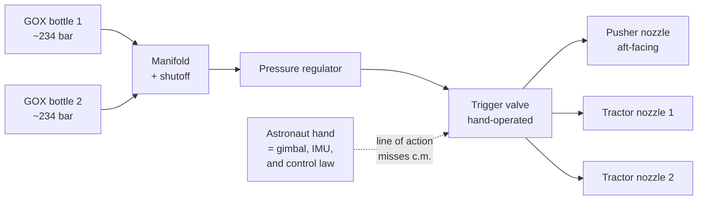
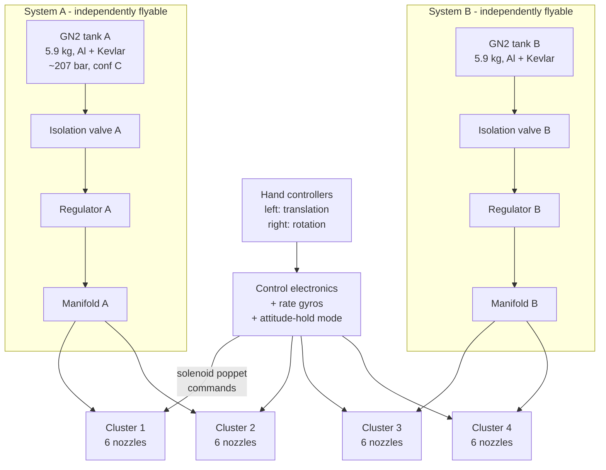
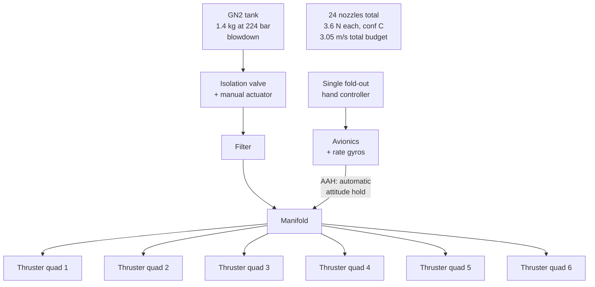
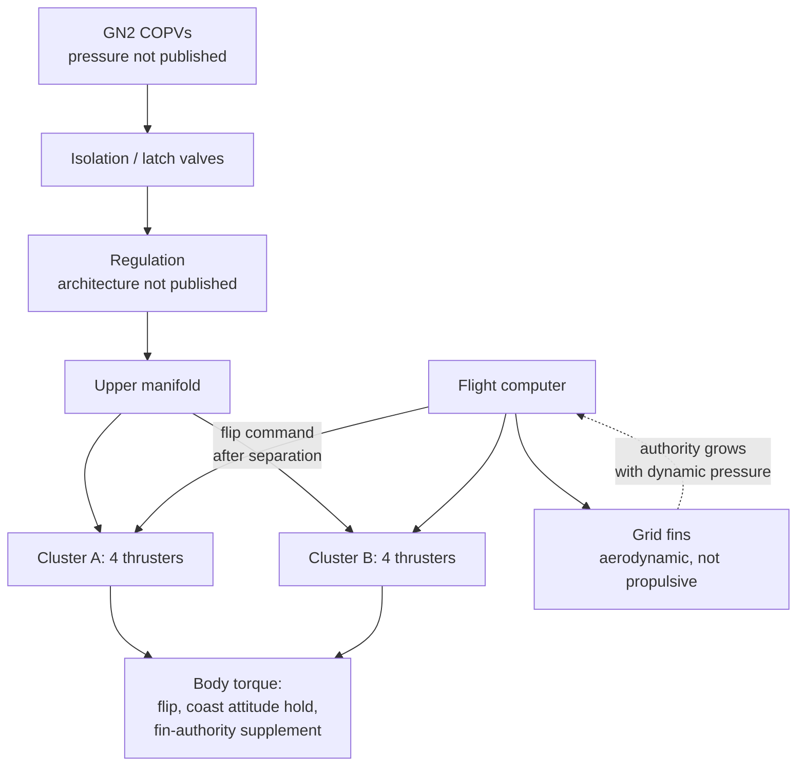
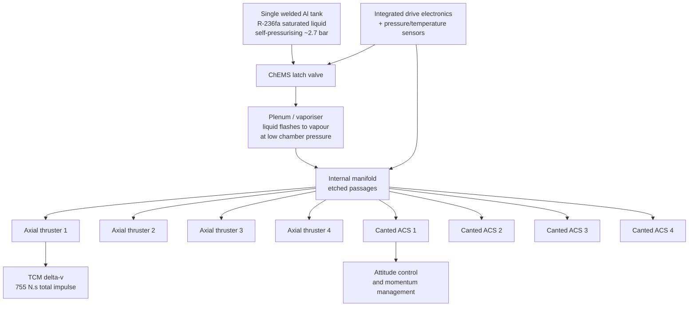
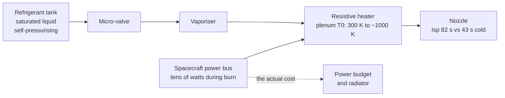

# Module 31 — Real Cold-Gas Systems
Part IV · Prerequisites: modules 28, 29, 30 · Estimated time: 6 h

Every number in this chapter has been checked against a source, and about a
third of the numbers that "everybody knows" did not survive. The published
Δv of the Manned Maneuvering Unit does not close against its published
propellant load at any credible cold-gas specific impulse — not at the ideal
77 s, not at the realized 70 s, not at anything. Hubble does not have cold-gas
thrusters and never did. Centaur's settling thrusters are not cold gas. If you
build a sizing spreadsheet out of the first three search results for "cold gas
thruster examples," roughly half your inputs will be wrong, and the ones that
are wrong are wrong by factors of two, not percentages. So this module does
two things at once: it walks the real flown cold-gas systems, and it teaches
you the five-line arithmetic that tells you within a minute whether a
published cold-gas specification is internally consistent. That arithmetic is
the actual skill. The catalogue is just where you practise it.

---

## 1. Learning objectives

After this module you should be able to:

1. **Draw the block diagram** of a flown cold-gas system — crewed maneuvering
   unit, launcher attitude system, or CubeSat module — from tank to nozzle,
   naming every component and saying what fails if it is removed.
2. **Reconstruct a published Δv** from a published propellant mass, system
   mass, and specific impulse using the rocket equation, and state to which
   reference mass the published figure must refer for it to close.
3. **Diagnose a non-closing specification**: given a system whose stated Δv,
   propellant mass and Isp are mutually inconsistent, identify which of the
   three is most likely misreported and by roughly how much.
4. **Compute the impulse density** $\rho I_{sp}$ of a candidate cold-gas
   propellant and use it, rather than $I_{sp}$ alone, to select a propellant
   for a volume-limited spacecraft.
5. **Quantify the Δv penalty** of substituting a stored high-pressure gas for
   a self-pressurising liquefied propellant at fixed propellant volume, and
   separately account for the tank mass that the substitution drags in.
6. **Justify a regulated versus blowdown architecture** for a stated mission,
   naming the failure mode each one buys and each one avoids.
7. **Identify the standard misattributions** in the cold-gas literature
   (Hubble, Centaur, Sputnik/Vanguard) and state what those vehicles actually
   used.
8. **Read a blowdown pressure–time trace** and separate consumption from
   leakage, computing a leak rate in kg/s and in standard cm³/min.
9. **Argue the MMU-versus-SAFER design divergence** from mission requirements
   alone, without reference to the hardware.

---

## 2. Terminology

| term | symbol | SI unit | definition |
|---|---|---|---|
| specific impulse | $I_{sp}$ | s | total impulse per unit weight of propellant, $I_t/(m_p g_0)$ |
| effective exhaust velocity | $c$ | m/s | $I_{sp} g_0$; thrust per unit mass flow |
| characteristic velocity | $c^*$ | m/s | $p_0 A_t/\dot m$; measures the gas, not the nozzle |
| thrust coefficient | $C_F$ | — | $F/(p_0 A_t)$; measures the nozzle, not the gas |
| total impulse | $I_t$ | N·s | $\int F\,dt$ over the life of the system |
| impulse bit | $I_{bit}$ | N·s | impulse of one minimum-width commanded pulse |
| propellant mass | $m_p$ | kg | mass of expelled working fluid |
| initial / final vehicle mass | $m_0$, $m_f$ | kg | before and after the manoeuvre; $m_0-m_f=m_p$ |
| velocity increment | $\Delta v$ | m/s | $c\ln(m_0/m_f)$ for a single impulsive burn |
| molar mass | $M$ | kg/kmol | of the working gas |
| specific gas constant | $R$ | J/(kg·K) | $R_u/M$, $R_u=8314.46$ J/(kmol·K) |
| ratio of specific heats | $\gamma$ | — | $c_p/c_v$ at the storage/plenum condition |
| plenum (chamber) stagnation state | $p_0$, $T_0$ | Pa, K | upstream of the nozzle throat |
| nozzle area ratio | $\varepsilon$ | — | $A_e/A_t$ |
| stored gas density | $\rho$ | kg/m³ | mass per unit tank internal volume at storage state |
| impulse density | $\rho I_{sp}$ | kg·s/m³ | total impulse per unit propellant volume, $\div g_0$ |
| vapour pressure | $p_v$ | Pa | saturation pressure of a liquefied propellant at its bulk temperature |
| tank performance factor | $pV/W$ | m | burst pressure × volume ÷ tank weight; a tankage figure of merit |
| usable mass fraction | $\eta_u$ | — | fraction of stored gas expelled before the plenum falls below the minimum useful pressure |
| leak rate | $\dot m_L$ | kg/s | mass loss with all valves commanded closed |
| standard volumetric leak rate | $\dot V_{std}$ | scc/min | leak rate expressed as gas volume at 273.15 K, 101.325 kPa |
| degrees of freedom | DOF | — | independently controllable rigid-body axes (3 translation + 3 rotation) |

---

## 3. Theory

### 3.1 The audit: how to check a cold-gas specification in five lines

A cold-gas system is the only kind of rocket propulsion whose entire
performance can be audited from four published numbers. There is no
combustion, no mixture ratio, no characteristic length, no c\* efficiency
buried in a chamber that nobody outside the programme has measured. There is a
gas, a temperature, a nozzle, and the rocket equation. That makes cold gas the
best pedagogical subject in the course for *source criticism* — and it means
that when a published cold-gas specification does not close, the fault is in
the specification, not in your understanding.

The audit is this. **[F]**

$$I_t = I_{sp}\, g_0\, m_p \qquad\text{and}\qquad \Delta v = I_{sp}\, g_0 \ln\!\frac{m_0}{m_0-m_p}$$

> **Eq. 3.1** — variables: $I_t$ total impulse [N·s]; $I_{sp}$ specific impulse
> [s]; $g_0=9.80665$ m/s²; $m_p$ expelled propellant mass [kg]; $m_0$ initial
> total mass of everything being accelerated [kg]; $\Delta v$ velocity
> increment [m/s]. Meaning: the first is the definition of $I_{sp}$; the second
> is Tsiolkovsky. Assumes: a single impulsive burn, constant $I_{sp}$, no
> external forces, and — the assumption that actually breaks — that $m_0$ is
> *the mass the published Δv referred to*. Fails when: the manoeuvre is a long
> low-thrust burn against gravity gradient or drag, when $I_{sp}$ varies over
> a blowdown (it does, by 5–15 %), or when the thrusters are fired in
> opposing pairs for attitude control, in which case propellant is consumed
> with zero net Δv.

For $\Delta v \ll c$ — true of every system in this chapter — the logarithm
linearises and the audit becomes a one-liner: **[A]**

$$\Delta v \approx \frac{I_t}{m_0} = \frac{I_{sp}\,g_0\,m_p}{m_0}$$

> **Eq. 3.2** — variables as above. Meaning: for small mass ratios, Δv is just
> total impulse divided by the mass being pushed. Assumes: $m_p/m_0 \ll 1$.
> Fails when: $m_p/m_0 \gtrsim 0.2$, where it under-predicts by more than 10 %.
> For every system in this chapter $m_p/m_0 < 0.15$, so Eq. 3.2 is good to a
> few per cent and you can do it in your head. **Use it as the first pass, and
> Eq. 3.1 when you are writing the number down.**

The audit has one degree of freedom that catches almost every error in the
literature: **the reference mass**. A crewed maneuvering unit's Δv can be
quoted against the unit alone or against the unit plus a suited astronaut — a
factor of 2.3 in mass and therefore in Δv. A CubeSat propulsion module's Δv
can be quoted against the module or against the whole spacecraft — often a
factor of 4. **A cold-gas Δv figure without a stated reference mass is not a
specification, it is a rumour.** [J] Half this module is that sentence with
worked examples attached.

### 3.2 The two numbers: $I_{sp}$ scales as $1/\sqrt{M}$, impulse density does not

From Module 28, for an ideal frozen expansion the characteristic velocity is
$c^*=\sqrt{RT_0}/\Gamma$ with $R=R_u/M$, so at fixed storage temperature and
fixed $\gamma$:

$$I_{sp} \propto \sqrt{\frac{T_0}{M}}$$

> **Eq. 3.3** — variables: $T_0$ plenum stagnation temperature [K], $M$ molar
> mass [kg/kmol]. Meaning: a cold-gas thruster's performance is set almost
> entirely by what the gas weighs, because $T_0$ is fixed at whatever the
> spacecraft happens to be. Assumes: ideal gas, frozen flow, same $\gamma$ and
> same $\varepsilon$ across the comparison. Fails when: $\gamma$ differs
> substantially (polyatomic refrigerants at $\gamma\approx1.08$ have a
> noticeably higher $C_F$ than diatomics at 1.40, which claws back part of the
> molar-mass penalty), or when the gas is heated (a resistojet raises $T_0$
> and breaks the "cold" in cold gas).

Table B.1 of the verification worksheet gives the ideal vacuum $I_{sp}$ at
$T_0=300$ K and $\varepsilon=50$ for thirteen candidate gases. The two ends of
that table are hydrogen at 285.6 s and xenon at 31.1 s — a factor of 9.2,
which is the square root of the molar-mass ratio (65.1) to within 13 %, the
residual being the $\gamma$ difference. [CALC, conf A]

Now the counter-scaling. What a spacecraft actually has is a **volume**, not a
propellant mass, and volume is filled at the stored density:

$$\frac{I_t}{V} = \rho\, I_{sp}\, g_0$$

> **Eq. 3.4** — variables: $I_t/V$ total impulse per unit *propellant* volume
> [N·s/m³]; $\rho$ stored density of the propellant at its storage state
> [kg/m³]; $I_{sp}$ [s]. Meaning: this, not $I_{sp}$, is the figure of merit
> for a volume-limited vehicle. Assumes: the whole stored mass is usable (it
> is not; multiply by $\eta_u$) and that the tank volume equals the propellant
> volume (it does not; the tank wall, boss, and mounting add volume and, more
> importantly, mass). Fails when: tank mass is comparable to propellant mass,
> which for high-pressure gas at CubeSat scale it always is — see §3.7 and
> Worked Example 4.

Run the numbers. Multiplying the worksheet's stored-density column by its
ideal-$I_{sp}$ column and $g_0$ gives impulse per cubic centimetre of
propellant:

| propellant | storage state | $\rho$ (g/cm³) | ideal $I_{sp}$, ε = 50 (s) | $\rho I_{sp} g_0$ (N·s/cm³) |
|---|---|---|---|---|
| H₂ | gas, 241 bar | 0.02 | 285.6 | **0.056** |
| He | gas, 241 bar | 0.04 | 178.1 | **0.070** |
| N₂ | gas, 241 bar | 0.28 | 76.8 | **0.211** |
| Ar | gas, 241 bar | 0.44 | 56.4 | **0.243** |
| n-butane | saturated liquid, 2.6 bar | 0.57 | 69.2 | **0.387** |
| CO₂ | liquid, ~67 bar | 0.65 | 66.2 | **0.422** |
| R-236fa | saturated liquid, 2.7 bar | 1.36 | 43.2 | **0.576** |
| R-134a | saturated liquid, 7.0 bar | 1.19 | 50.5 | **0.589** |
| SF₆ | saturated liquid, 21 bar | 1.40 | 43.6 | **0.599** |
| Xe | supercritical, 241 bar | 2.74 | 31.1 | **0.836** |

[CALC from the worksheet's §B.1 columns. Conf **C** — the stored-density
column is literature-recalled and flagged `NEEDS PRIMARY` against NIST
REFPROP, so treat these as order-of-magnitude and recompute against
[NIST-WB]/[REFPROP] before using them in a real trade study.]

> **A correction to the source.** The verification worksheet's §B.1 states
> that helium gives "~7.1 N·s per cm³" and R-236fa "~5.8 N·s/cm³" and
> concludes the two are "nearly the same." **That arithmetic does not
> reproduce.** $\rho I_{sp} g_0$ for helium at 0.04 g/cm³ and 178.1 s is
> 0.070 N·s/cm³, not 7.1 — a factor of 100 — and R-236fa's is 0.576, so the
> ratio is not 1.2 in helium's favour but **8.2 in R-236fa's**. The
> worksheet's *conclusion* survives and is in fact strengthened; its numbers
> do not. Recompute this one yourself before quoting it. [CALC]

The corrected ordering is the central fact of applied cold-gas engineering.
**Impulse density runs almost exactly opposite to specific impulse.** Helium
has 2.3× nitrogen's $I_{sp}$ and one third of its impulse density. R-236fa
has 24 % of helium's $I_{sp}$ and 8.2× its impulse density. And the
comparison is worse than that for the light gas, because the two numbers being
compared are impulse per cm³ *of propellant*, and the propellant is not what
occupies the volume — the tank is. The helium needs a 241-bar
composite-overwrapped pressure vessel, a regulator, a burst disc, a relief
path, a range-safety review, and a fill-and-drain operation on the pad with a
high-pressure cart; the R-236fa needs a thin-walled 2.7-bar aluminium can and
a fill port. **For a CubeSat, the tank is the system.** [J] That is why every
flown CubeSat cold-gas module in the catalogue below uses a liquefiable
propellant, and why no launch vehicle uses one — at launcher scale the tank
mass is amortised over enough impulse that the higher $I_{sp}$ of the stored
gas wins back what the pressure vessel costs.

### 3.3 The 0.90 rule, and where it fails

Cross-checking the ideal table against the measured column of the standard
cold-gas tables gives a **measured-to-theoretical ratio of about 0.91,
consistent across gases from hydrogen to xenon**. [E, conf B] So:

$$I_{sp,\ \mathrm{real}} \approx 0.90\; I_{sp,\ \mathrm{ideal}}$$

> **Eq. 3.5** — variables as above. Meaning: a well-designed steady-flow
> cold-gas thruster delivers about 90 % of its frozen-ideal specific impulse.
> Assumes: steady flow, a nozzle large enough that the boundary layer does not
> dominate the throat, and a plenum at ambient spacecraft temperature.
> **Fails badly when the thruster is pulsed.** This is the single most
> important caveat in the chapter.

Where does the 10 % go? Three places, all covered in Module 29: the throat
boundary layer (a cold gas has a high viscosity-to-momentum ratio at these
small Reynolds numbers, and the displacement thickness eats real throat area),
heat transfer *into* the gas from a spacecraft-temperature wall (which helps
slightly) and *out of* the gas during expansion, and non-equilibrium
expansion — a polyatomic refrigerant cannot relax its vibrational modes fast
enough in a millisecond-residence-time nozzle, so part of the internal energy
never converts to directed kinetic energy.

In **pulse mode** the discount is far worse, and this is where the literature
misleads. Every valve opening has to fill the dead volume between the seat and
the throat before the nozzle chokes properly, and that charge is expelled at
low velocity or vented as an unchoked puff. Every valve closing leaves a
plenum-full of gas that bleeds out at falling pressure. If the dead volume
between seat and throat holds a mass comparable to the mass flowed during the
commanded pulse, the delivered $I_{sp}$ collapses. **SAFER's implied specific
impulse is about 40 s against an ideal of 76.8 s — a ratio of 0.52, not 0.90.**
[CALC from published figures, conf B] That is not a bad thruster; it is a
thruster whose duty cycle is millisecond bursts, and it is the honest number
to teach.

### 3.4 Crewed maneuvering units

Three systems, twenty years, and a complete reversal of design philosophy.

#### 3.4.1 Gemini HHMU — the hand-held maneuvering unit, 1965

The first cold-gas thruster a human ever flew was held in the hand.

| field | value | conf |
|---|---|---|
| Propellant | **Oxygen** on the Gemini 4 unit (two bottles at 3,400 psi ≈ 234 bar); later units used **nitrogen**; Freon was also used in the family | B |
| Nozzles | **3** — one pusher (aft), two tractor (on extenders) | B |
| Construction | Aluminium and stainless steel | B |
| Mass | 6.8 lb (3.1 kg) | B |
| Flights | Carried on Gemini 4, 8, 10, 11; **used on Gemini 4** (White, 3 June 1965) **and Gemini 10** | B |
| Thrust | commonly quoted at ~2 lbf (8.9 N) — **not confirmed in any source read**; do not quote it as fact | **D** |

Two engineering points, neither of which is about performance.

**First, the propellant choice is a life-support decision, not a propulsion
decision.** Gaseous oxygen is a mediocre cold-gas propellant ($M=32$, so
$I_{sp}$ sits between nitrogen and argon) and an actively hostile one to have
in a high-pressure bottle next to a pure-oxygen-environment spacecraft. It was
used because the Gemini spacecraft already had high-pressure gaseous oxygen,
already had the fill hardware, and already had crew trained to handle it, and
because a leak of the propellant into the cabin was a survivable event rather
than an asphyxiation hazard. That reasoning recurs, inverted, on the MMU. [H]

**Second — and this is why the HHMU is in the chapter — a hand-held thruster
cannot be flown open-loop.** The thrust vector passes through wherever the
astronaut is holding it, which is never the combined centre of mass of
astronaut plus suit plus umbilical. Every translation command therefore
produces a torque, and the astronaut has to null that torque by feel, in a
pressurised glove, while tumbling. White reported exactly this on Gemini 4 and
ran the unit dry in a few minutes. The engineering response — a rigid backpack
with fixed thrusters arranged around the body so that the control system, not
the human, resolves force and torque — is the MMU.

*Figure 31.1 — Gemini HHMU. The dashed path is the point: the only thing
resolving the torque produced by an off-c.m. thrust line is the astronaut's
proprioception. Regulator presence and set pressure are inferred from
architecture, conf C.*

#### 3.4.2 Manned Maneuvering Unit (MMU), 1984

| field | value | conf |
|---|---|---|
| Propellant | Gaseous nitrogen (GN₂) | A |
| Thrusters | **24 nozzles in 4 clusters of 6**, giving full 6-DOF | A |
| Tanks | 2 × aluminium, Kevlar-overwrapped | A |
| Propellant mass | **5.9 kg per tank, 11.8 kg total** | A |
| Tank pressure | ≈ 3,000 psi (207 bar) ground charge | **C — NEEDS PRIMARY** |
| Regulation | Regulated; two independent regulated systems, **either alone flyable** | C |
| Valve type | solenoid-actuated poppet | C |
| Total mass | 148 kg loaded | A |
| Published Δv | **110–130 ft/s (33.5–39.6 m/s)** on a ground charge; ≥ 72 ft/s (22 m/s) on an on-orbit recharge | A |
| Translational acceleration | 0.3 ± 0.05 ft/s² (0.091 m/s²) at nominal mass | A |
| Rotational acceleration | 10.0 ± 3.0 °/s² | A |
| Thrust per thruster | ≈ 7.6 N (1.7 lbf) — **derived here, not sourced** | **C — NEEDS PRIMARY** |
| Flights | STS-41-B (7 Feb 1984, McCandless and Stewart — first untethered EVA); STS-41-C (Solar Max); STS-51-A (Westar VI, Palapa B2 retrieval) | A |

**The MMU Δv does not close. This is not a rounding disagreement and you
must not paper over it.** With 11.8 kg of GN₂ at a realistic realized
$I_{sp}$ of 70 s, total impulse is about 8,100 N·s. Against a combined MMU +
suited-astronaut mass of roughly 340 kg that is **24 m/s (80 ft/s)** — well
below the published 110–130 ft/s. Against the MMU alone at 148 kg it is
**57 m/s (187 ft/s)** — well above. The published figure therefore refers to
some reference mass between the two, or to a propellant load larger than
11.8 kg, and no source read in the verification pass says which. Worked
Example 2 does this arithmetic properly and shows what each hypothesis
implies. **Until a primary source (the Martin Marietta MMU description, or
NASA MSFC documentation) resolves it, the honest statement is: the published
MMU Δv cannot be reconciled with the published propellant load without
knowing the reference mass.** [conf C on the reconciliation; the individual
figures are conf A]

The thrust-per-thruster figure in the table is likewise derived, not sourced:
0.091 m/s² × ~340 kg ÷ ~4 thrusters firing in a pure translation ≈ 7.7 N.
It is a plausible reconstruction and it is *not* a citation.

*Figure 31.2 — MMU. Two fully independent regulated legs, each able to fly the
unit home alone; 24 nozzles in four corner clusters give 6-DOF with the
redundancy to lose a cluster. The control electronics, not the astronaut,
decide which nozzles open for a commanded force or torque — the direct answer
to the HHMU problem.*

#### 3.4.3 SAFER — Simplified Aid For EVA Rescue, 1994–present

| field | value | conf |
|---|---|---|
| Propellant | GN₂ | A |
| Thrusters | **24** | A |
| Tank pressure | **224 bar (3,250 psi)** | A |
| Propellant mass | **1.4 kg (3 lb)** | A |
| Δv | **3.05 m/s (10 ft/s)** | A |
| System mass | **37.7 kg (83–85 lb)** | A |
| Thrust per thruster | ≈ 3.6 N (0.8 lbf) | **C — NEEDS PRIMARY** |
| Implied $I_{sp}$ | ≈ **40 s** against a ~180 kg SAFER + suited crew | CALC |

**SAFER closes.** 1.4 kg of GN₂ delivering 3.05 m/s to a ~180 kg suited
crewmember implies $I_{sp} \approx 39.8$ s (Worked Example 1), which is
about 52 % of the ideal 76.8 s. That is a *credible* number for a thruster
that fires in millisecond bursts through a small nozzle with valve and plenum
dead volume ahead of the throat. Where MMU's specification raises a question
it does not answer, SAFER's answers it. **Use SAFER, not MMU, as the worked
cold-gas example, and use the pair to make the design point.**

The design point is that SAFER is not a small MMU. It is a different machine
that happens to share a propellant. Its entire specification follows from one
requirement: *a crewmember who has become separated from the structure gets
back to a handrail, once.* From that:

- **3 m/s of Δv** is enough to arrest a plausible separation rate and close a
  few tens of metres. There is no reason to carry more, and every kilogram of
  nitrogen is a kilogram on the crewmember's back through the whole EVA.
- **A single-use budget** means no on-orbit recharge, no redundant regulated
  legs, no crossfeed. A failure that spends the propellant is mission-ending
  for the aid, but the aid was already the contingency.
- **24 thrusters and automatic attitude hold** are non-negotiable even at this
  tiny impulse, because the user is by definition tumbling. Attitude hold burns
  propellant against the tumble first, then the crewmember translates.
- **Blowdown, not regulated.** A regulator is a moving part with a failure mode
  in a system that must work after months of dormancy strapped to a suit. The
  Isp penalty of blowdown is real (thrust decays as the tank empties), but the
  budget was written against the delivered impulse, not the initial thrust.
  [J — the blowdown/regulated choice for SAFER is architectural inference, conf C]

*Figure 31.3 — SAFER. One tank, one leg, no regulator, 24 nozzles. The
automatic-attitude-hold path is the functional core: without it the device
cannot be used by a tumbling crewmember.*

### 3.5 Launch-vehicle cold-gas systems

Cold gas is **rare on launch vehicles**, and the reason is Eq. 3.4 run
backwards. At launcher scale the impulse required for attitude control during
coast is large enough that a 70-second-$I_{sp}$ propellant plus its
high-pressure tankage costs more mass than a 230-second hydrazine system plus
its tankage, catalyst beds and thermal control. The exception is the case
where the *number of restarts* and the *absence of any conditioning
requirement* dominate — and that is exactly Falcon 9's booster return.

#### 3.5.1 Falcon 9 first-stage GN₂ thrusters

| field | value | conf |
|---|---|---|
| Propellant | **gaseous nitrogen** | B |
| Configuration | **two clusters of four thrusters** in the interstage region near the top of the first stage | C |
| Function | flip the booster after stage separation; hold attitude through the exo-atmospheric coast; supplement the grid fins outside their control authority | B |
| Tank | high-pressure COPVs | C |
| **Thrust, $I_{sp}$, tank pressure, total impulse** | **not published by SpaceX** | **D** |

**No performance numbers are quoted here and none should be quoted anywhere
else.** SpaceX does not publish them, and the figures circulating on
enthusiast sites have no traceable origin. What the module can say honestly is
architectural, and it is enough to teach from:

The Falcon 9 booster's post-separation job is to rotate roughly 180° in
vacuum, hold that attitude through a ballistic coast of several minutes, then
transition to aerodynamic control on the grid fins as dynamic pressure builds,
with the cold-gas system continuing to trim where the fins have no authority.
The requirements that fall out are:

1. **Works in vacuum and in dense atmosphere.** A monopropellant catalyst bed
   works in both too, but must be preheated and is single-fluid-path.
2. **No ignition, no ullage settling, no conditioning.** A cold-gas thruster
   is a valve. It is ready in the microsecond the solenoid pulls, at any
   attitude, at any acceleration, including zero-g, including tumbling.
3. **Effectively unlimited restarts over ten minutes.** The flip alone is a
   large number of pulses, and the coast is a continuous limit-cycle. Cycle
   life is a valve-seat problem, and cold gas puts nothing across the seat but
   clean dry nitrogen.
4. **Benign on the pad and benign in a failure.** Nitrogen is inert. There is
   no hypergol handling, no catalyst bed to poison, no toxic-vapour exclusion
   zone around a stage that is going to be caught, inspected, and reflown by
   people.

The price is specific impulse of order 70 s where hydrazine would give 230 s,
and a set of high-pressure COPVs. SpaceX evidently judged that price worth
paying for a stage whose propulsive job is measured in tens of seconds of
firing and whose *operational* job is to be turned around quickly. [J]

*Figure 31.4 — Falcon 9 first-stage GN₂ system, architecture only. Every box
whose contents would require a number is labelled as unpublished. Cluster
count and placement are conf C; function is conf B.*

#### 3.5.2 What is **not** cold gas: Centaur, Ariane, and the misattribution problem

This subsection exists because these three errors appear constantly and each
one is a **category error**, not a numerical one.

**Centaur is not a cold-gas stage.** Centaur's settling and attitude system
uses **hydrogen peroxide monopropellant** thrusters on the early vehicles and
**hydrazine** on later ones. Gaseous hydrogen and helium appear on Centaur for
**tank pressurisation**, and on some variants for settling thrust via vented
GH₂ — which is the closest thing in the launcher world to a cold-gas
settling system, but it is a vent, not a propulsion subsystem, and cataloguing
it properly requires ULA Centaur documentation that was not reachable in the
verification pass. **Confidence D as written. Do not put Centaur in the
cold-gas chapter.** The failure mode of doing so is that a student learns
"upper stages settle with cold gas," which is false in general and will be
marked wrong in an interview.

**Ariane 5 EPS and the Ariane 6 upper stage are not cold gas either** — EPS
uses storable hypergols with hydrazine attitude control, and the Ariane 6 APU
is a gas-generator system. [conf B on the exclusion]

**Hubble does not have thrusters at all.** HST attitude control is **reaction
wheels and magnetic torquers**. It appears in cold-gas lists because it is a
famous spacecraft that manoeuvres without a visible plume, and because "no
thrusters" is a harder fact to search for than "thrusters." Hubble's absence
of thrusters was a deliberate contamination decision: the optics could not
tolerate plume deposition, and the mission had no Δv requirement that wheels
and torquers could not meet. **It is the best example in the course of an
attitude-control system that solved the problem by having no propulsion at
all**, and it belongs in a reaction-wheel chapter, not this one. [conf B]

**Sputnik 1 and Vanguard 1 did not carry cold-gas thrusters.** Sputnik 1 was
uncontrolled; Vanguard 1 was passively stabilised. No citable evidence for a
cold-gas system on either was found. [conf B on the exclusion] The genuine
early cold-gas milestones are the **Gemini HHMU (1965)** and the reaction
control systems of early attitude-controlled scientific satellites — and for
the latter, this course does not yet have a primary source and therefore does
not name one. That is the honest position, and stating it is better than
naming a spacecraft you cannot cite.

> **On early spacecraft attitude control.** The claim "early satellites used
> cold-gas attitude control" is almost certainly true in general and is
> repeated everywhere, but the verification pass could not attach it to a
> specific named vehicle with a primary source. The module therefore teaches
> the *architecture* — a regulated or blowdown nitrogen bottle feeding six to
> twelve solenoid nozzles, sized for years of limit-cycle impulse against a
> gravity-gradient or magnetic disturbance torque — and names no early
> vehicle. The first flown, sourced, named cold-gas systems in this chapter
> are the Gemini HHMU (1965) and, in the small-satellite era, the Marotta
> CGMT unit on NASA's ST-5 (2006).

### 3.6 CubeSat and small-satellite systems

This is where cold gas is not a legacy technology but the *current best answer*
to a real problem.

#### 3.6.1 The envelope

NASA's *State of the Art of Small Spacecraft Technology* gives the cold-gas
class as **10 μN – 3.6 N thrust** and **40 – 110 s $I_{sp}$**, and states the
two governing trades explicitly: lower molar mass gives higher specific
impulse but requires more voluminous storage; and saturated liquids are stored
at low pressure and vaporised when introduced into a low-pressure chamber.
[conf A]

**The top of that Isp band is not cold gas.** 110 s is unreachable with an
unheated gas of any molar mass a CubeSat would fly (hydrogen would do it, and
no CubeSat flies 241-bar hydrogen). It is a *warm-gas* number — resistojet
heating — and the band as published silently merges the two technologies. See
CHIPS below, where the 43 s → 82 s jump is the whole argument for adding a
heater.

#### 3.6.2 MarCO — the reference design

MarCO-A and MarCO-B were the first interplanetary CubeSats, launched with
InSight on 5 May 2018 and relaying InSight's entry, descent and landing
telemetry at Mars flyby on 26 November 2018. Their propulsion was a VACCO
Micro CubeSat Propulsion System.

| field | value | conf |
|---|---|---|
| Supplier | VACCO Industries | A |
| Propellant | **R-236fa** (a fire-suppression refrigerant), stored as a **self-pressurising saturated liquid** | A |
| Thrusters | **8** — 4 canted for attitude control, 4 axial for trajectory correction | A |
| **Total impulse** | **755 N·s** | A |
| **Wet mass** | **3.49 kg** | A |
| **Δv** | **> 40 m/s** for TCMs | A |
| Construction | single-tank all-welded aluminium module housing propellant, valves and electronics; fits a 6U bus | A |
| Regulation | **self-pressurising blowdown** at the vapour pressure of the saturated liquid, ≈ 2.7 bar at room temperature — no regulator, no high-pressure COPV | B |
| Valve type | VACCO **ChEMS** chemically-etched micro-valves, frictionless, latching/solenoid | B |
| Thrust per thruster | VACCO states **> 50 mN per thruster** across its cold-gas line; **~25 mN is quoted for MarCO specifically in some accounts** | **C** |
| $I_{sp}$ | ≈ **40 s** (consistent with the ε = 20–50 ideal of 40.6–43.2 s at ~90 % efficiency) | B/CALC |

> **Two source disagreements you will hit immediately, and their resolution.**
> (1) **Propellant.** The verification worksheet has R-236fa at confidence A;
> the course bibliography's annotation of the VACCO datasheet describes the
> propellant as "R-134a class." Both refrigerants are in VACCO's cold-gas
> product line and both appear in CHIPS literature. **The module uses R-236fa**
> (higher confidence, and consistent with the ~40 s $I_{sp}$: R-134a's ideal
> at ε = 50 is 50.5 s, R-236fa's is 43.2 s, and 0.9 × 43.2 = 38.9 s is the
> better match). Flag the disagreement when you cite it.
> (2) **Δv.** The worksheet has "> 40 m/s" at confidence A; the bibliography
> annotation has 68.6 m/s. **These are not in conflict** — they are the same
> total impulse quoted against different spacecraft masses, and Worked
> Example 3 shows that 68.6 m/s falls out of 755 N·s at 40 s $I_{sp}$ against
> a **12.0 kg** spacecraft, while "> 40 m/s" is satisfied for anything up to
> **19.9 kg**. This is Eq. 3.1's reference-mass degree of freedom, in the
> wild, in a source pair you will actually encounter. [CALC]

**Why MarCO matters pedagogically.** It is the proof that a 40-second-$I_{sp}$
propellant is the *right* engineering answer when the constraint is volume,
safety and integration rather than Δv efficiency. A GN₂ system of the same
total impulse would have needed a ~200-bar COPV; it would not have fit in the
6U envelope alongside the radio and the reflectarray, and it would have faced
a materially harder launch-safety review as a secondary payload on a
planetary mission. **Propellant choice is a systems decision, not a
performance decision.** This is the single best example in Part IV.

*Figure 31.5 — MarCO MiPS. Note what is absent: no regulator, no COPV, no
pressurant, no external plumbing. The tank, valves, manifold and electronics
are one welded module — "system in a tank." Every joint removed is a leak path
removed from a system that had to hold propellant for a seven-month cruise.*

#### 3.6.3 The rest of the flown catalogue

| system | supplier | propellant | thrust | $I_{sp}$ | total impulse | wet mass | notes | conf |
|---|---|---|---|---|---|---|---|---|
| Standard MiPS (0.3U) | VACCO | R-236fa | > 50 mN/thruster | ~40 s | **44 N·s**, up to 880,000 firings | — | modular; the product line scales **82–515 N·s** | B |
| Micro MiPS (0.25U) | VACCO | R-236fa | > 50 mN | ~40 s | **93 N·s**, up to 1,860,000 firings | — | | B |
| MarCO MiPS | VACCO | R-236fa | see §3.6.2 | ~40 s | **755 N·s** | 3.49 kg | flown to Mars | A |
| **CHIPS** | CU Aerospace + VACCO (AFRL) | R-134a / R-236fa / SO₂ | **30 mN** | **82 s** | — | **1.2 kg wet, 0.7 kg propellant** | **warm gas / resistojet — electrothermal, not pure cold gas** | B |
| **NanoProp CGP3 / CubeProp (3U)** | GomSpace | **n-butane** | **1 mN per thruster**, 4 thrusters, **5 μN resolution** | ~60–70 s | — | 60 g propellant | self-pressurising, **1–4 bar**; Δv up to 15 m/s for a 2.66 kg satellite; flown on TW-1 (2015) | B |
| **NanoProp 6U** | GomSpace | n-butane | — | — | — | — | flown on **GOMX-4B (2018)**; demonstrated formation flying with GOMX-4A over ~4,500 km separation | B |
| CGMT-000-9 | Marotta Controls | GN₂ | — | — | — | — | flew on NASA **ST-5** (2006) | B |
| BioSentinel ACS | Lightsey Space Research lineage (Georgia Tech / UT Austin) | R-236fa | — | — | — | — | 6U CubeSat, flown on **Artemis I** (2022) | B |
| I2T5 | ThrustMe | **iodine, subliming** | — | — | — | — | **not strictly cold gas** — solid→vapour sublimation feed; flown 2019+ | B |

Dashes are not zeros. They are figures that were not reachable at confidence B
in the verification pass and are therefore not printed. **Printing a wrong
number with a caveat is worse than printing no number.**

Three observations across the catalogue:

**The refrigerant architecture is dominant and the lineage is traceable.** The
R-236fa self-pressurising design runs through JPL (MarCO, CPOD, NEA Scout) and
the Lightsey group's academic work (BioSentinel, and earlier Georgia Tech /
UT Austin 3D-printed integrated designs). The distinguishing academic
contribution is **printing the plenum, feed passages and nozzles as a single
part**, which removes the joints that dominate the leak-rate budget of a
system that must hold propellant for years. [conf C — NEEDS PRIMARY, the
SmallSat conference papers]

**Butane is the European answer to the same question.** GomSpace's NanoProp
uses n-butane at a vapour pressure of 1–4 bar — even gentler than R-236fa's
2.7 bar — accepting a molar mass of 58 (versus 152) in exchange for an ideal
$I_{sp}$ of 69 s against R-236fa's 43. Butane's stored density (0.57 g/cm³) is
42 % of R-236fa's (1.36), so on impulse density the two are again close, and
the choice comes down to the tank pressure, the thermal management of the
vaporiser, and whether the customer wants a flammable hydrocarbon on a
rideshare manifest. [J]

**The 1 mN / 5 μN resolution line is the real product.** NanoProp's headline
number is not thrust or $I_{sp}$; it is a **5 μN impulse-resolution** capable
of holding a 3U CubeSat's pointing. That is a valve-and-electronics
achievement, not a nozzle achievement, and it is why cold gas has survived
into the era of electric propulsion: nothing else delivers a clean,
repeatable, contamination-free micronewton impulse bit.

#### 3.6.4 CHIPS and the warm-gas boundary

CHIPS (CU Aerospace with VACCO, for AFRL) is the system that defines the edge
of this chapter. It uses the same refrigerants in the same self-pressurising
architecture — and then puts a resistive heater in the flow path before the
nozzle. Result: **82 s $I_{sp}$ from a propellant whose cold ideal is 43 s.**
[conf B]

That is a factor of 1.9, and Eq. 3.3 tells you exactly what it cost:
$I_{sp}\propto\sqrt{T_0}$, so a factor 1.9 in $I_{sp}$ (after allowing for the
efficiency change) requires roughly a factor of 3–4 in absolute plenum
temperature — from ~300 K to something like 1,000–1,200 K. That heat has to
come from the spacecraft's power budget, at some tens of watts, continuously
during a burn, from a CubeSat that has a few tens of watts total. **The
resistojet does not buy performance; it trades power and thermal complexity
for performance.** Whether that trade closes depends entirely on whether the
mission has power to spare during the burn — which is why CHIPS is a
technology demonstration and MarCO, which had to work seven months from Earth
with a fixed array and a demanding radio, is not electrothermal. [J]

*Figure 31.6 — CHIPS-class warm gas. The only architectural difference from
Figure 31.5 is the heater block and the power feed into it, and that one block
is where the entire trade lives.*

### 3.7 Proximity operations and formation flying

The modern reason to choose cold gas is not Δv and not mass. It is
**contamination, safety, and impulse granularity near another object.**

**Contamination.** A monopropellant plume deposits ammonia and hydrazine
decomposition products; a bipropellant plume deposits worse. If you are
station-keeping fifty metres from a telescope aperture, a solar array, a
docking sensor, or another spacecraft's radiator, a plume that condenses is a
mission-limiting hazard for the *other* vehicle. Nitrogen and, to a lesser
degree, a refrigerant vapour do not condense on a warm surface and carry no
reactive species. [J, standard proximity-operations reasoning]

**Safety near crew and near a crewed vehicle.** This is the MMU logic (§3.4.2,
§6.1) generalised: a propulsion system operating within metres of a
pressurised habitat or an EVA crewmember is subject to a hazard analysis in
which "the propellant is inert nitrogen" collapses whole branches of the fault
tree. There is no toxic-exposure case, no hypergolic-contact case, no catalyst
bed to run away.

**Impulse granularity.** Formation flying and rendezvous need a *small,
repeatable* impulse bit. From Module 30,

$$I_{bit} \approx F\left(t_{on} - \tfrac{1}{2}t_{rise} + \tfrac{1}{2}t_{fall}\right)$$

> **Eq. 3.6** — variables: $I_{bit}$ impulse of one pulse [N·s]; $F$ steady
> thrust [N]; $t_{on}$ commanded valve-open time [s]; $t_{rise}$, $t_{fall}$
> valve opening and closing transient durations [s]. Meaning: the trapezoidal
> approximation to the pulse. Assumes: the thruster reaches steady flow within
> the pulse, i.e. $t_{on} \gg t_{rise}$. **Fails when $t_{on}$ approaches
> $t_{rise}$**, which is precisely the regime the micronewton-resolution
> systems operate in — there the impulse bit is dominated by the transient and
> must be characterised by test, not computed.

A cold-gas thruster has no ignition transient, no catalyst-bed warm-up, and no
chamber thermal soak, so its $t_{rise}$ is the valve's mechanical response —
of order a millisecond — and its pulse-to-pulse repeatability is limited only
by valve repeatability and plenum pressure decay. That is how GomSpace gets to
5 μN resolution and why GOMX-4A/4B could hold and vary a ~4,500 km formation
with 60 g of butane. The cost, as always, is $I_{sp}$: you are paying about
three times the propellant mass of a hydrazine system for the privilege of a
clean, granular, inert impulse. For a formation-flying CubeSat with a small
total Δv budget, that is a bargain. For a station-keeping GEO satellite with a
15-year budget, it is not. [J]

### 3.8 Comparison across the flown systems

**Table 31.1 — Crewed maneuvering units.**

| | Gemini HHMU (1965) | MMU (1984) | SAFER (1994–) |
|---|---|---|---|
| gas | O₂ (Gemini 4), later N₂ / Freon | GN₂ | GN₂ |
| nozzles | 3 | 24 (4 clusters of 6) | 24 |
| DOF | none — human in the loop | 6, with attitude hold | 6, with automatic attitude hold |
| storage | 2 bottles at ~234 bar | 2 tanks, ~207 bar (conf C) | 1 tank, 224 bar |
| regulation | regulated (inferred, conf C) | **regulated**, two independent legs | **blowdown** (inferred, conf C) |
| propellant mass | not sourced | 11.8 kg | 1.4 kg |
| system mass | 3.1 kg | 148 kg loaded | 37.7 kg |
| thrust/thruster | ~8.9 N (**conf D — do not quote**) | ~7.6 N (**derived, conf C**) | ~3.6 N (**conf C**) |
| total impulse | not sourced | ~8,100 N·s at 70 s $I_{sp}$ [CALC] | ~549 N·s at 40 s $I_{sp}$ [CALC] |
| published Δv | not sourced | 33.5–39.6 m/s | 3.05 m/s |
| **does it close?** | insufficient data | **no** — see §3.4.2 and WE2 | **yes**, at $I_{sp}\approx40$ s |
| problem solved | first EVA mobility at all | untethered satellite servicing and retrieval | get back to the handrail, once |
| what it gave up | control authority; the human resolved all torques | 148 kg and a Shuttle-scale support infrastructure | any capability beyond one self-rescue |

**Table 31.2 — Small-spacecraft systems.**

| | MarCO MiPS | NanoProp CGP3 | CHIPS | Marotta CGMT (ST-5) |
|---|---|---|---|---|
| gas | R-236fa | n-butane | R-134a / R-236fa / SO₂ | GN₂ |
| storage | saturated liquid, ~2.7 bar | saturated liquid, 1–4 bar | saturated liquid | high-pressure gas |
| regulation | self-pressurising blowdown | self-pressurising blowdown | self-pressurising blowdown + heater | not sourced |
| thrust | >50 mN/thruster (25 mN quoted for MarCO, conf C) | 1 mN ×4, 5 μN resolution | 30 mN | not sourced |
| $I_{sp}$ | ~40 s | ~60–70 s | **82 s (warm)** | not sourced |
| total impulse | **755 N·s** | not sourced | not sourced | not sourced |
| wet mass | 3.49 kg | 60 g propellant | 1.2 kg (0.7 kg prop) | not sourced |
| problem solved | interplanetary TCM + ACS in 6U, no COPV | micronewton pointing and formation flying | double the $I_{sp}$ of a refrigerant | flight-qualified GN₂ ACS for a small NASA mission |
| what it gave up | $I_{sp}$ (40 s) | thrust (1 mN — manoeuvres take hours) | power (tens of watts) and thermal complexity | volume and tank mass |

**Table 31.3 — The architecture decision, summarised.**

| if the binding constraint is… | choose | because | flown example |
|---|---|---|---|
| propellant *mass* and nothing else | lightest gas you can store (He, H₂) | Eq. 3.3 | none at these scales — the tank always bites |
| propellant *volume* and tank *pressure* | liquefiable refrigerant or butane | Eq. 3.4 plus a 2.7-bar can instead of a 241-bar COPV | MarCO, NanoProp |
| operational simplicity and inertness at scale | GN₂ | no conditioning, unlimited restarts, benign | Falcon 9 booster, SAFER |
| impulse granularity | any gas, with a fast micro-valve | Eq. 3.6 — $t_{rise}$ is the whole story | NanoProp (5 μN) |
| $I_{sp}$ from a dense propellant | add heat | $I_{sp}\propto\sqrt{T_0}$ | CHIPS (43 → 82 s) |
| total impulse per kilogram of *system* | **do not use cold gas** | hydrazine at 230 s wins above a few thousand N·s | every launcher upper stage |

---

## 4. Typical engineering ranges

**Table 31.4 — Cold-gas systems: realistic ranges and who sits at each
extreme.** Ideal $I_{sp}$ values are at $T_0=300$ K and stated $\varepsilon$;
realized values include the ~0.90 steady-flow efficiency, or worse in pulse
mode.

| quantity | typical range | low end | high end |
|---|---|---|---|
| thrust per thruster | 10 μN – 8 N | NanoProp CGP3, 1 mN (5 μN resolution) | MMU, ~7.6 N derived (conf C) |
| $I_{sp}$, true cold gas | 30 – 75 s realized | Xe ~26–28 s | N₂ ~65–73 s (He ~150–165 s if you can store it) |
| $I_{sp}$, warm gas | 75 – 110 s | — | CHIPS, 82 s |
| ideal $I_{sp}$, N₂, ε = 20/50/100 | 75.1 / 76.8 / 77.8 s | — | note how weakly ε matters for γ = 1.4 |
| pulse-mode efficiency $I_{sp,real}/I_{sp,ideal}$ | 0.50 – 0.90 | SAFER, ≈ 0.52 | steady-flow, well-designed, ≈ 0.90 |
| storage pressure, high-pressure gas | 200 – 310 bar | MMU ~207 bar (conf C) | modern COPVs to ~310 bar |
| storage pressure, liquefied | 1 – 21 bar | NanoProp butane, 1–4 bar | SF₆, ~21 bar |
| stored density | 0.02 – 2.7 g/cm³ | H₂ at 241 bar, ~0.02 | Xe at 241 bar, ~2.74 (conf C on the column) |
| total impulse, CubeSat module | 40 – 800 N·s | VACCO Standard MiPS, 44 N·s | MarCO MiPS, 755 N·s |
| total impulse, crewed unit | 500 – 10,000 N·s | SAFER, ~549 N·s [CALC] | MMU, ~8,100 N·s [CALC] |
| system wet mass | 0.06 – 150 kg | NanoProp, 60 g propellant | MMU, 148 kg |
| propellant mass fraction of module | 0.35 – 0.60 | — | MarCO MiPS, ≈ 0.55 [CALC] |
| Δv delivered | 3 – 70 m/s | SAFER, 3.05 m/s | MarCO, > 40 m/s (68.6 m/s at 12 kg) |
| cycle life | 10⁵ – 2×10⁶ firings | — | VACCO Micro MiPS, 1.86 M firings |
| nozzle area ratio | 20 – 100 | — | ε above ~100 buys <2 % for γ = 1.4 |

Two of these ranges deserve a sentence. **The pulse-mode efficiency range
(0.50–0.90) is wider than the whole spread of cold-gas propellant $I_{sp}$
between nitrogen and butane.** If you are sizing a system that will fire in
short bursts, getting the duty cycle right matters more than getting the
propellant right. And **the ε row shows why cold-gas nozzles are short**: from
ε = 20 to ε = 100, nitrogen's ideal $I_{sp}$ gains 3.5 %. On a CubeSat, that
3.5 % is not worth the length, and every flown module uses a stubby nozzle.

---

## 5. Worked examples

All four are recomputed by `tools/examples/31.py` against `tools/rocket.py`.
$g_0 = 9.80665$ m/s², $R_u = 8314.46$ J/(kmol·K).

### Worked Example 1 — Reconstruct SAFER's Δv from propellant mass and $I_{sp}$

**Problem.** SAFER carries $m_p = 1.4$ kg of GN₂ at 224 bar and its published
capability is $\Delta v = 3.05$ m/s (10 ft/s). Take the mass being accelerated
as SAFER plus a suited crewmember, $m_0 \approx 180$ kg. (a) Predict Δv from
the ideal cold-gas $I_{sp}$; (b) predict it from the 0.90 steady-flow rule;
(c) invert the published Δv for the actually-delivered $I_{sp}$; (d) say which
number to believe and why.

**(a) Ideal.** GN₂: $M = 28.014$ kg/kmol, so

$$R = \frac{R_u}{M} = \frac{8314.46}{28.014} = 296.80\ \mathrm{J/(kg\,K)}$$

At $\gamma = 1.400$, $T_0 = 300$ K, $\varepsilon = 50$ the worksheet's
ideal-performance calculation gives $c^* = 435.8$ m/s, $C_F^{vac} = 1.729$,
hence

$$I_{sp,ideal} = \frac{c^* C_F}{g_0} = \frac{435.8 \times 1.729}{9.80665} = 76.84\ \mathrm{s}$$

Rocket equation:

$$\Delta v = I_{sp} g_0 \ln\frac{m_0}{m_0 - m_p}
= 76.84 \times 9.80665 \times \ln\frac{180.0}{178.6}$$

$$\ln\frac{180.0}{178.6} = \ln(1.007838) = 7.8074\times10^{-3}$$

$$\Delta v = 753.55 \times 7.8074\times10^{-3} = \boxed{5.88\ \mathrm{m/s}}$$

**(b) With the 0.90 steady-flow rule.** $I_{sp} = 0.90 \times 76.84 = 69.16$ s:

$$\Delta v = 69.16 \times 9.80665 \times 7.8074\times10^{-3} = \boxed{5.29\ \mathrm{m/s}}$$

**(c) Invert the published Δv.**

$$I_{sp,actual} = \frac{\Delta v}{g_0 \ln[m_0/(m_0-m_p)]}
= \frac{3.05}{9.80665 \times 7.8074\times10^{-3}} = \boxed{39.8\ \mathrm{s}}$$

Delivered fraction: $39.8/76.84 = 0.518$.

**(d) Which number to believe.** The published 3.05 m/s, and therefore the
39.8 s. The prediction in (b) over-predicts by 73 %, and the discrepancy is
not a source error — it is the pulse-mode penalty of §3.3. SAFER fires 24
thrusters in millisecond bursts, mostly in the automatic-attitude-hold mode
that runs *before* the crewmember gets any translation, and much of that
attitude-hold impulse produces couples with zero net Δv. A delivered-to-ideal
ratio of 0.52 for a device with that duty cycle is entirely credible.

Note what happens if you go the other way and *trust* the 0.90 rule: you would
conclude that SAFER only needs $m_p = m_f(e^{\Delta v/c}-1) = 178.6 \times
(e^{3.05/678.2}-1) = 0.81$ kg of nitrogen, and you would size the tank 42 %
small. **This is exactly the error that the 0.90 rule invites, and it is why
Δv budgets for pulsed cold-gas systems are written against measured
impulse bits, not against $I_{sp}$.** [J]

> **Sanity check.** Total impulse $I_t = I_{sp} g_0 m_p = 39.8 \times 9.80665
> \times 1.4 = 546$ N·s. A single VACCO Standard MiPS CubeSat module carries
> 44 N·s; MarCO carried 755 N·s. SAFER — a crew-rated self-rescue backpack
> weighing 37.7 kg — carries about three-quarters of the total impulse of a
> 3.5 kg CubeSat propulsion module. That is the honest scale of a
> nitrogen system, and it is a good number to keep in your head.

### Worked Example 2 — Diagnose the MMU: which published number is wrong?

**Problem.** MMU: $m_p = 11.8$ kg GN₂ (two tanks of 5.9 kg), loaded system mass
148 kg, published $\Delta v = 110$–130 ft/s (33.5–39.6 m/s). Assume a suited
astronaut plus equipment brings the accelerated mass to $m_0 \approx 340$ kg.
Test the specification for consistency and identify the least-implausible
resolution.

**Step 1 — Total impulse available.** Take MMU's realized $I_{sp}$ as 70 s.
This is *more* generous than SAFER's 39.8 s and is justified: MMU manoeuvres
are longer, smoother translations at 0.091 m/s² rather than millisecond
rescue pulses, so the steady-flow regime applies.

$$I_t = I_{sp} g_0 m_p = 70 \times 9.80665 \times 11.8 = 8{,}100\ \mathrm{N\,s}$$

**Step 2 — Δv against the two candidate reference masses.**

$$\Delta v(m_0 = 340) = 70 \times 9.80665 \times \ln\frac{340}{328.2}
= 686.47 \times 0.035326 = 24.25\ \mathrm{m/s} = 79.6\ \mathrm{ft/s}$$

$$\Delta v(m_0 = 148) = 686.47 \times \ln\frac{148}{136.2}
= 686.47 \times 0.083085 = 57.04\ \mathrm{m/s} = 187.1\ \mathrm{ft/s}$$

**The published 110–130 ft/s lies between them and equals neither.** The
specification is not internally consistent with either obvious reference mass.

**Step 3 — Solve for the reference mass that would make it close.** Taking the
midpoint $\Delta v = 36$ m/s at $I_{sp} = 70$ s, and writing
$m_0 = m_p\,k/(k-1)$ with $k = e^{\Delta v/(I_{sp}g_0)}$:

$$k = e^{36/686.47} = e^{0.052442} = 1.053841,
\qquad m_0 = 11.8 \times \frac{1.053841}{0.053841} = 231.0\ \mathrm{kg}$$

So the published figure closes against a 231 kg vehicle — heavier than the MMU
alone (148 kg), lighter than MMU plus a fully suited and equipped crewmember
(~340 kg). No source read states which mass was intended.

**Step 4 — Solve instead for the propellant load.** Hold $m_0 = 340$ kg and
$I_{sp} = 70$ s:

$$m_p = m_0\left(1 - e^{-\Delta v/(I_{sp} g_0)}\right)
= 340\left(1 - e^{-36/686.47}\right) = 17.37\ \mathrm{kg}$$

For the published range 33.5–39.6 m/s the required load is **16.2–19.1 kg**,
i.e. 37–62 % more than the stated 11.8 kg.

**Step 5 — Rule out the third hypothesis.** Could the $I_{sp}$ simply be
higher? No: 76.84 s is the *ideal* ceiling at $\varepsilon = 50$ and
$T_0 = 300$ K, and at 76.84 s with $m_0 = 340$ kg the answer is still only
26.6 m/s (87.3 ft/s). Conversely, could the $I_{sp}$ be SAFER-like at 40 s? At
40 s, 36 m/s requires $m_0 = 134.6$ kg — **less than the MMU's own loaded mass
of 148 kg**, which is physically impossible. So a low $I_{sp}$ is excluded,
and the delivered $I_{sp}$ must indeed be in the steady-flow band.

**Conclusion.** Two of the four published numbers can be reconciled with the
other two, but not all four simultaneously. The two candidate resolutions are
*(i)* the Δv is quoted against a ~230 kg reference mass, or *(ii)* the tanks
hold appreciably more than 11.8 kg. **State the discrepancy; do not silently
pick one.** Resolving it needs the Martin Marietta MMU description or NASA
MSFC documentation, neither of which was reachable in the verification pass.

> **Sanity check.** MMU's translational acceleration is published at
> 0.091 m/s². At 340 kg that is 31 N of net thrust, or ~7.7 N from each of four
> thrusters — the derivation behind the conf-C thrust figure in §3.4.2. At
> 231 kg the same acceleration implies 21 N net, or 5.3 N per thruster.
> **The acceleration and thrust figures are themselves reference-mass
> dependent, so they cannot be used to break the tie.** This is the whole
> lesson: one unstated reference mass propagates into every derived quantity
> in the specification.

### Worked Example 3 — MarCO Δv budget check

**Problem.** MarCO's VACCO module: total impulse $I_t = 755$ N·s, wet mass
3.49 kg, $I_{sp} \approx 40$ s, published $\Delta v > 40$ m/s for trajectory
correction manoeuvres. A second source quotes 68.6 m/s. (a) Back out the
propellant mass and check it against the module's wet mass; (b) find the
spacecraft mass consistent with each Δv figure; (c) reconcile.

**(a) Propellant mass.**

$$m_p = \frac{I_t}{I_{sp} g_0} = \frac{755}{40 \times 9.80665}
= \frac{755}{392.27} = 1.925\ \mathrm{kg}$$

Dry module mass: $3.49 - 1.925 = 1.565$ kg. Propellant mass fraction of the
module: $1.925/3.49 = 0.551$.

**This is the check that matters.** A 55 % propellant mass fraction for an
all-welded aluminium module containing tank, eight thrusters, micro-valves,
manifold and drive electronics is high but not absurd for a 2.7-bar tank —
a thin-walled low-pressure can weighs very little. **Had the same 755 N·s
been stored as GN₂ at 200 bar**, the propellant mass would be
$755/(70\times9.80665) = 1.10$ kg, and the COPV alone would swallow the
remaining budget. The consistency of the 55 % fraction is direct evidence
that the self-pressurising architecture is real and that the $I_{sp}$ is in
fact around 40 s, not 50+.

**(b) Spacecraft mass consistent with each Δv.** Rearranging Eq. 3.1 with
$m_p$ fixed at 1.925 kg and $c = 392.27$ m/s:

$$m_0 = m_p \frac{k}{k-1}, \qquad k = e^{\Delta v/c}$$

For $\Delta v = 40$ m/s: $k = e^{0.101972} = 1.107353$, so
$m_0 = 1.925 \times 1.107353/0.107353 = \boxed{19.9\ \mathrm{kg}}$.

For $\Delta v = 68.6$ m/s: $k = e^{0.174874} = 1.191093$, so
$m_0 = 1.925 \times 1.191093/0.191093 = \boxed{12.0\ \mathrm{kg}}$.

**(c) Reconciliation.** MarCO was a 6U CubeSat. A 6U bus is of order 12–14 kg.
Therefore:

- **68.6 m/s is the module's capability against a ~12 kg spacecraft** — it is
  a vendor performance figure at a stated (or, more usually, unstated) bus
  mass.
- **"> 40 m/s" is a mission statement**: the TCM allocation MarCO's navigation
  team could count on. It is satisfied for any spacecraft up to 19.9 kg, and
  is therefore conservative by roughly 50 % against a real 6U bus.

**The two figures are the same total impulse against different masses. They
are not in conflict, and neither is wrong.** For a 13.5 kg spacecraft the
delivered figure would be

$$\Delta v = 392.27 \times \ln\frac{13.5}{11.575} = 392.27 \times 0.153834
= 60.3\ \mathrm{m/s}$$

> **Sanity check.** Use the linearised Eq. 3.2: $\Delta v \approx I_t/m_0 =
> 755/13.5 = 55.9$ m/s, against the exact 60.3 m/s. The linear form
> under-predicts by 7.3 %, which is what you expect at $m_p/m_0 = 0.14$.
> Good enough for a first pass, not good enough for a navigation budget.

### Worked Example 4 — Replace a CubeSat butane system with GN₂ at equal volume

**Problem.** A GomSpace NanoProp-class 3U system carries **60 g of n-butane**
as a self-pressurising saturated liquid at 1–4 bar, on a 2.66 kg satellite,
and delivers **up to 15 m/s**. A reviewer proposes replacing the butane with
gaseous nitrogen at 241 bar "because nitrogen has higher $I_{sp}$ and is
inert." **At the same propellant volume**, compute the Δv penalty, and then
account for the tank.

**Step 0 — Validate the baseline.** Butane realized $I_{sp}$ is 60–70 s; take
65 s. Dry satellite $= 2.66 - 0.060 = 2.60$ kg.

$$\Delta v_{butane} = 65 \times 9.80665 \times \ln\frac{2.660}{2.600}
= 637.43 \times 0.0228145 = 14.5\ \mathrm{m/s}$$

against the published "up to 15 m/s." **The baseline closes**, which is what
licenses using the same method on the substitute.

**Step 1 — Propellant volume.** Butane liquid density 0.57 g/cm³:

$$V = \frac{m_p}{\rho} = \frac{60\ \mathrm{g}}{0.57\ \mathrm{g/cm^3}}
= 105.3\ \mathrm{cm^3}$$

**Step 2 — Nitrogen mass at the same volume.** GN₂ at 241 bar and ~300 K
stores ~0.28 g/cm³:

$$m_{p,N_2} = 105.3 \times 0.28 = 29.5\ \mathrm{g}$$

**The substitution loses 51 % of the propellant mass before any propulsion
argument is made.** This is Eq. 3.4 doing its work.

**Step 3 — Δv with nitrogen.** Realized GN₂ $I_{sp}$ 65–73 s; take 70 s, the
generous end. New wet mass $2.600 + 0.0295 = 2.6295$ kg.

$$\Delta v_{N_2} = 70 \times 9.80665 \times \ln\frac{2.6295}{2.6000}
= 686.47 \times 0.0112822 = 7.74\ \mathrm{m/s}$$

$$\text{penalty} = 1 - \frac{7.74}{14.54} = \boxed{47\ \%\ \text{of the } \Delta v \text{ lost}}$$

**and this is with nitrogen given an 8 % $I_{sp}$ advantage.** Equivalently, in
impulse terms: butane delivers $65 \times 9.80665 \times 0.060 = 38.2$ N·s;
nitrogen delivers $70 \times 9.80665 \times 0.0295 = 20.2$ N·s — a ratio of
0.53, which is just the density ratio (0.49) times the $I_{sp}$ ratio (1.08).

**Step 4 — Now account for the tank, which is where the argument actually
ends.** [A, order of magnitude] A pressure vessel's mass follows from its
performance factor $pV/W$ (burst pressure × volume ÷ weight), a figure of
merit in metres:

$$m_{tank} \approx \frac{p V}{g_0\,(pV/W)}$$

> **Eq. 5.1** — variables: $m_{tank}$ [kg]; $p$ design pressure [Pa]; $V$
> internal volume [m³]; $pV/W$ tank performance factor [m]. Meaning: for a
> membrane pressure vessel the wall mass scales with the stored $pV$ product,
> so $pV/W$ is nearly constant across sizes for a given material and design.
> Assumes: membrane-dominated design at the stated burst factor. **Fails at
> small scale**, where minimum gauge, the boss, and the liner dominate and the
> achieved $pV/W$ collapses — exactly the CubeSat regime. See [AIAA-S-080] for
> the governing requirements.

$$pV = 241\times10^5 \times 105.3\times10^{-6} = 2{,}537\ \mathrm{J}$$

| assumed $pV/W$ | implied tank mass |
|---|---|
| 15,000 m (good large COPV) | 17 g |
| 10,000 m | 26 g |
| 5,000 m (realistic at 105 cm³ with min-gauge and boss) | 52 g |

**The 241-bar nitrogen tank weighs between 0.6 and 1.8 times its own
propellant load.** The butane can, at 2.6 bar, is a factor of ~90 lower in
$pV$ and its mass is set by handling stiffness, not pressure — call it a few
grams. So the honest system-level comparison is not 20.2 N·s versus 38.2 N·s;
it is 20.2 N·s in a ~55–80 g package versus 38.2 N·s in a ~65 g package.

**Recommendation.** Reject the substitution. [J] The reviewer's premise —
"nitrogen has higher $I_{sp}$" — is true and irrelevant, because the binding
constraint on a 3U CubeSat is volume and pressure-vessel qualification, not
propellant mass. The correct rebuttal is one line: *at fixed volume, impulse
scales as $\rho I_{sp}$, and butane's $\rho I_{sp}$ is 1.8× nitrogen's at
241 bar.* If the reviewer's real concern is flammability of a hydrocarbon on
a rideshare manifest, the answer is not GN₂ but R-236fa — a non-flammable
fire-suppression agent with 1.5× butane's impulse density at a similar tank
pressure, which is precisely why MarCO used it.

> **Sanity check.** From the §3.2 table, $\rho I_{sp} g_0$: butane 0.387,
> GN₂ at 241 bar 0.211 N·s/cm³. Ratio 1.83. Multiply by the 105.3 cm³ volume:
> 40.8 versus 22.2 N·s, against the 38.2 and 20.2 computed above. The 6 %
> difference is because the table uses ideal $I_{sp}$ and the worked example
> used realized. **The table's ordering is what you should remember; the
> worked example is what you should write down.**

---

## 6. Real systems: why did they design it that way?

### 6.1 MMU — why gaseous nitrogen, at 24 nozzles, next to the Orbiter?

**The design choice.** An unheated GN₂ blowdown-fed-through-regulators system
at ~70 s $I_{sp}$, when hydrazine monopropellant at ~230 s was mature, flight
proven, and already flying on the Orbiter's own vernier RCS.

**The alternatives available in 1980.** Hydrazine monopropellant (3× the
$I_{sp}$, therefore a third of the propellant mass for the same impulse, or
three times the Δv in the same tank); a hybrid where translation used
hydrazine and attitude used cold gas; or a tethered system with no propulsion
at all.

**Why GN₂ won.** Three arguments, in descending order of force. [H, with [J]
on the ordering]

1. **Toxicity next to a suit and next to the Orbiter.** Hydrazine is acutely
   toxic and readily absorbed through the skin, and the MMU's whole purpose
   was to fly a human, in a suit, within metres of a crewed vehicle and then
   bring both back inside the payload bay. A hydrazine MMU would have created
   an EVA contamination case (a crewmember returning to the airlock carrying
   condensed propellant on the suit), a plume-impingement case on the
   Orbiter's radiators and windows, and a servicing case on the pad and in the
   bay. Nitrogen makes all three disappear. The propellant that leaks is the
   propellant you are already breathing an inert component of.
2. **Catalyst beds and duty cycle.** A hydrazine thruster wants a preheated
   catalyst bed and degrades under very large numbers of cold short pulses.
   The MMU's flight profile is thousands of short pulses across a multi-hour
   EVA, with long dwells. A cold-gas solenoid does not care.
3. **The Δv requirement was small and the mass budget was not tight.** MMU had
   to fly a few tens of metres to a spinning satellite and back. At 148 kg the
   unit was heavy, but it was carried in a Shuttle payload bay, and mass was
   not the binding constraint. Where mass is not binding, $I_{sp}$ is not
   binding either, and safety wins by default.

**The 24-nozzle architecture** is a direct answer to the HHMU failure (§3.4.1):
with four clusters of six around a rigid backpack, the control electronics can
synthesise any commanded force or torque, hold attitude automatically, and
tolerate the loss of a whole cluster. **The two independent regulated legs**,
each flyable alone, are the same logic applied to the feed system: an
untethered astronaut cannot be rescued by a system that has a single-point
failure between the tank and the nozzle.

**Would a modern engineer choose the same?** Yes on the propellant, no on the
scale. [J] The inertness argument is stronger now, not weaker — human
spaceflight hazard analysis has become more, not less, conservative about
toxic propellants near crew. But nobody would build a 148 kg untethered
maneuvering unit today, because the mission it existed for (untethered
satellite retrieval by a human) was retired after 1984 and its risk case never
survived Challenger. The modern descendant is SAFER: same propellant, same
nozzle count, 4 % of the impulse, and a completely different mission.

### 6.2 SAFER — why blowdown, and why 3 m/s?

**The design choice.** One tank, no redundant leg, no regulator, 1.4 kg of
nitrogen, and a 3.05 m/s budget on a 37.7 kg system.

**Why.** Because the requirement is a *contingency*, and contingency hardware
is optimised for a different objective function than mission hardware: it must
work after months of dormancy, must not itself become a hazard, and must not
impose a weight or volume penalty on the EVA it is protecting. Every one of
those pushes toward fewer parts. A regulator is a moving part that must be
right the first time after 180 days of doing nothing; blowdown replaces it
with a tank and a valve, and pays for it in thrust decay across the discharge
— which is acceptable because the budget was written against delivered
impulse. [J on the regulator argument; the blowdown architecture itself is
conf C]

**The 3 m/s is not a performance limit, it is a requirement.** A separated
crewmember's plausible departure rate is small; arresting it and closing tens
of metres is a few m/s of work. Carrying 10 m/s would triple the nitrogen for
capability that is never used and that a tumbling crewmember could not exploit
anyway.

**Would a modern engineer choose the same?** Yes, and they did — SAFER is
still the flown article, three decades on. The design has not been improved
because there is nothing in it to improve: it is a bottle, a valve, 24
nozzles and an attitude-hold law.

### 6.3 MarCO — why density over $I_{sp}$?

**The design choice.** R-236fa, molar mass 152, ideal $I_{sp}$ 43 s, realized
~40 s — very nearly the worst specific impulse available from any
non-noble-gas propellant — for an *interplanetary* mission.

**The alternatives.** GN₂ at ~70 s (COPV, regulator, high-pressure
qualification); butane at ~65 s (flammable); a hydrazine or green-monoprop
microthruster at 200+ s (catalyst bed, preheat power, toxic-propellant loading
on a secondary payload).

**Why R-236fa won.** [M]

1. **Volume, not mass, was binding.** A 6U bus carrying an X-band radio, a
   deployable reflectarray, solar arrays and a full avionics stack has almost
   no volume left. R-236fa's impulse density (0.576 N·s/cm³) is 2.7× GN₂'s at
   241 bar. At MarCO's 755 N·s, the same impulse in nitrogen needs roughly
   3,600 cm³ of tank volume against ~1,400 cm³ — and the nitrogen figure is
   *propellant* volume, before the COPV wall.
2. **The tank pressure sets the qualification path.** A 2.7-bar can is, for
   range-safety purposes, barely a pressure vessel. A 200-bar COPV on a
   secondary payload riding with a flagship planetary mission is a
   documentation and review burden with real schedule risk, and MarCO was a
   fast, low-cost demonstration flying alongside InSight.
3. **Zero-part feed system.** Self-pressurising means no regulator, no
   pressurant tank, no fill of a second fluid. The propellant pressurises
   itself at its own vapour pressure, and that pressure is nearly constant
   while liquid remains — a *better* thrust profile than a gas blowdown, for
   free.
4. **Non-flammable, non-toxic, low vapour pressure.** R-236fa is a fire
   suppression agent. Handling it on the integration floor requires nothing
   special.
5. **All-welded single module.** With one fluid at low pressure, the whole
   system can be built as one welded aluminium part with etched internal
   passages. Joints are the dominant leak path in a system that must hold
   propellant through a seven-month cruise (see §7.2), and this architecture
   removes almost all of them.

**What it gave up.** Everything Δv-related. 40 s means MarCO could never have
done Mars orbit insertion, a large deep-space manoeuvre, or anything but small
trajectory corrections and attitude control. That was the mission, so it cost
nothing. **Propellant choice is a systems decision, not a performance
decision.**

**Would a modern engineer choose the same?** For a 6U interplanetary relay
with a <100 m/s budget, yes, and they keep doing so — the same architecture
recurs on CPOD, NEA Scout and BioSentinel. For a 12U with a 500 m/s budget,
no: that is an iodine or green-monoprop or electric-propulsion problem, and
40 s does not close it at any tank volume.

### 6.4 Falcon 9 first stage — why GN₂ despite ~70 s $I_{sp}$?

**The design choice.** Gaseous nitrogen cold gas for a booster attitude-control
task that a hydrazine RCS would do at three times the specific impulse.

**Why.** The impulse required is small and the *operational* requirements are
severe. [J — the numbers are unpublished, so this argument is architectural
throughout.]

1. **No conditioning, no ullage, no ignition.** The flip begins seconds after
   stage separation, in vacuum, on a stage that has just shut down nine
   engines and is tumbling in whatever attitude separation left it. A cold-gas
   thruster is ready when the solenoid is commanded; there is nothing to
   settle, preheat, or ignite. A monopropellant system would need bed heaters
   powered through ascent and would have to be sized for a cold-start case.
2. **Restart count is effectively unbounded.** Flip plus several minutes of
   limit-cycle attitude hold plus fin-authority supplementation is a very large
   number of pulses. Cycle life for a cold-gas system is a valve-seat problem
   with clean dry nitrogen across the seat; for a monoprop it is a
   catalyst-bed-life problem.
3. **Works in vacuum and in the dense atmosphere on the way down.** The system
   must trim in regimes where the grid fins have no authority — including the
   transonic and high-dynamic-pressure portions.
4. **Reuse and ground handling.** The stage is caught or landed, inspected,
   and reflown by people. Nitrogen leaves nothing to decontaminate, no toxic
   exclusion zone, no residuals to drain, no catalyst to replace.
5. **The mass penalty is bounded.** The firing time is measured in tens of
   seconds, not the tens of minutes an upper stage would need. At that impulse,
   the $I_{sp}$ penalty costs tens of kilograms — real, but small against a
   first-stage return that is already carrying landing legs, grid fins and
   reserve propellant.

**What it gave up.** Specific impulse, and the mass of high-pressure COPVs. The
trade is: buy reliability, restartability, and turnaround simplicity with
propellant mass, on the one stage in the vehicle where propellant mass is
cheapest because it is not being carried to orbit.

**Would a modern engineer choose the same?** Yes, and this is the notable
exception that proves the launcher rule: cold gas is rare on launch vehicles
because the impulse-to-mass penalty is severe at that scale, and Falcon 9's
booster is the case where restart count and operational simplicity outweigh
it. **No performance numbers should be quoted for this system in any
direction** — SpaceX does not publish them, and figures circulating on
enthusiast sites have no traceable origin.

### 6.5 CHIPS — why add a heater to a cold-gas system?

**The design choice.** Keep the refrigerant, keep the self-pressurising tank,
add a resistive heater, and take the $I_{sp}$ from ~43 s to **82 s**.

**Why.** Because $I_{sp}\propto\sqrt{T_0}$ is the only lever left once the
propellant is fixed by volume and safety, and heating is the only way to pull
it. Roughly, a factor of 1.9 in $I_{sp}$ needs a factor of ~3.6 in $T_0$:
300 K → ~1,100 K.

**What it gave up.** Power — tens of watts, continuously, during every burn,
from a CubeSat with a few tens of watts of array. And thermal design: a
1,100 K element millimetres from a tank of saturated refrigerant is a real
thermal-isolation problem, and the heater's thermal mass sets a warm-up time
that destroys the microsecond-response advantage that made cold gas attractive
for fine pointing in the first place.

**Would a modern engineer choose the same?** Only if the mission's burns are
few, long, and scheduled when power is available. [J] For fine attitude
control — many short pulses, unpredictable timing — the heater cannot be kept
hot economically and you are back to 43 s. **That is why CHIPS is a
technology demonstration and MarCO is not electrothermal.** The general
lesson: a resistojet is not a better cold-gas thruster, it is a small electric
thruster wearing a cold-gas system's plumbing, and it should be traded against
other electric options, not against cold gas.

---

## 7. Trade-offs, failure modes, materials, manufacturing, testing

### 7.1 The trade-offs, stated as decisions

| decision | option A | option B | who wins, and when |
|---|---|---|---|
| propellant | light gas (He, N₂) | liquefiable (butane, R-236fa) | light gas when mass is binding and volume is free (rare); liquefiable when volume or tank pressure is binding (CubeSats, always) |
| feed | regulated | blowdown | regulated when constant thrust matters for the control law or when the mission needs the last 20 % of the tank at full thrust; blowdown when part count and dormancy reliability matter (SAFER, every CubeSat) |
| pressurisation | stored high-pressure gas | self-pressurising vapour | vapour, unless the propellant will not liquefy at the spacecraft's temperature |
| thruster count | few, larger | many, smaller | many when 6-DOF and single-fault tolerance are required (MMU, SAFER, MarCO's 8) |
| nozzle ε | 20 | 100 | 20–50; above ~50, γ = 1.4 gains under 1.3 % and the length costs more than it returns |
| heating | none | resistojet | heat only if burns are long, few and power-scheduled |
| valve | solenoid poppet | latching micro-valve | latching where quiescent power is precious and dormancy is long; solenoid where response time and pulse repeatability dominate |

### 7.2 Failure modes

**Leakage through the seat — mechanism → symptom → evidence → fix.**
*Mechanism:* a particle on the poppet seat, a scored seat from repeated
high-cycle impact, or an elastomer seal that has taken a compression set
during dormancy, leaves a flow path with all valves commanded closed.
*Symptom:* tank pressure falls monotonically between commanded firings; on a
spacecraft, an unexplained secular attitude drift or momentum build-up in the
direction opposite the leaking nozzle. *Evidence:* the pressure–time trace
shows a steady droop *between* the discrete steps caused by firings, and the
droop rate is independent of duty cycle (see Problem E3 and Worked Example
mathematics in §5). *Fix:* filtration upstream of every valve (MarCO and
SAFER both carry filters), a latching isolation valve upstream of the
manifold so that a leaking thruster valve does not drain the tank, and
hard particulate-cleanliness control during assembly.

**Regulator lock-up creep.** *Mechanism:* a regulator's outlet pressure creeps
upward when flow stops, as the seat relaxes. *Symptom:* downstream pressure
rises during dormancy toward tank pressure, over-pressurising components rated
for the regulated pressure. *Evidence:* downstream transducer climbing with no
commanded flow. *Fix:* a relief valve downstream of the regulator, and this is
part of why blowdown architectures are attractive — no regulator, no lock-up.

**Freezing at the throat on a liquefiable propellant.** *Mechanism:* the latent
heat of vaporisation is drawn from the propellant and the hardware; a
sustained burn drops the bulk liquid temperature, which drops the vapour
pressure, which drops the thrust — and in the extreme, condensation or
freezing in the nozzle. *Symptom:* thrust decays during a long burn and
recovers after a dwell. *Evidence:* tank temperature and pressure fall
together along the saturation line; thrust recovers on the same time constant
as the tank re-warms from the spacecraft. *Fix:* duty-cycle limits, a thermal
path from the bus into the tank, or a vaporiser heater. **This is the failure
mode that a resistojet quietly also solves.**

**Plume impingement and contamination.** *Mechanism:* a nozzle whose plume
strikes a deployable, a radiator, or another spacecraft. *Symptom:* disturbance
torque that scales with commanded thrust, or slow degradation of an optical
surface. *Evidence:* attitude control effort correlating with thruster
selection; witness-plate or optical-throughput degradation. *Fix:* cant the
nozzles (MarCO's four ACS thrusters are canted for exactly this reason among
others) and analyse the plume against the deployed configuration, not the
stowed one.

**Zero-g liquid position in a self-pressurising tank.** *Mechanism:* without
settling, liquid may cover the outlet and be expelled as liquid rather than
vapour. *Symptom:* an impulse bit far larger than commanded, then a cold tank.
*Evidence:* impulse-bit scatter that correlates with vehicle attitude.
*Fix:* a vapour-side pickup with a phase separator, wick or vane device — a
real design problem in every liquefiable-propellant CubeSat module and one of
the reasons the flight-proven vendor modules command a premium.

### 7.3 Materials

**Aluminium alloys** dominate: 6061-T6 and 7075 for low-pressure liquefiable
tanks, because the strength requirement is modest, the material is weldable,
it is compatible with refrigerants and butane, and the whole module can be
machined and then welded closed. **Stainless steels (300 series)** appear in
valve bodies and seats where cycle life and seat hardness matter. **Kevlar or
carbon overwrap on an aluminium liner** is the standard for high-pressure gas —
the MMU's tanks were aluminium with Kevlar overwrap in 1984, and the modern
equivalent is a carbon-overwrapped aluminium- or polymer-lined COPV governed by
[AIAA-S-080]. **Elastomeric seat materials** are the weak link in dormancy: a
seal that takes a compression set over months is a leak, which is why several
CubeSat modules use metal-to-metal or chemically-etched frictionless valve
elements instead (VACCO's ChEMS).

### 7.4 Manufacturing

The interesting manufacturing story in modern cold gas is **joint elimination**.
A cold-gas system's mission-limiting parameter is often not $I_{sp}$ but
*leak rate over years of dormancy*, and leak rate is dominated by mechanical
joints — fittings, B-nuts, flanges, o-ring bosses. Two responses:

- **All-welded integrated modules** (VACCO MiPS, MarCO): tank, manifold,
  valves and electronics in one welded assembly with chemically-etched internal
  passages. Chemical etching produces the flow passages without drilling and
  without the cross-drilled plugs that each constitute a joint.
- **Additively manufactured integrated tank-plenum-nozzle parts**, the
  distinguishing contribution of the university lineage (Georgia Tech /
  UT Austin, feeding into BioSentinel). Printing the plenum, feed passages and
  nozzles as one part removes the joints entirely. [conf C — NEEDS PRIMARY,
  the SmallSat conference papers]

The limits: welded and printed assemblies cannot be disassembled for repair, so
every internal component must be qualified before the lid goes on; and printed
throats at CubeSat scale (sub-millimetre) sit at the edge of what AM surface
finish and dimensional tolerance can hold, which directly affects discharge
coefficient and thus $c^*$ efficiency.

### 7.5 Testing

**What is measured.** Thrust on a torsional or flexure balance in a vacuum
chamber (μN-to-N range, so the balance is the hard part, not the thruster);
mass flow by tank weight loss or by a Coriolis meter for larger flows;
plenum pressure and temperature; valve current trace for actuation timing;
tank pressure and temperature over hours-to-months for leak rate.

**Which instrument.** For a 1 mN thruster, a thrust stand resolving 1 μN needs
thermal drift control at the microkelvin-of-effect level and is calibrated in
situ by electrostatic comb or by a known weight through a pulley — this is a
metrology programme, not a fixture. For leak rate, the standard method is
**pressure decay in a fixed known volume**: hold the system at operating
pressure with valves closed, record $p(t)$ and $T(t)$, and compute
$\dot m_L = (V/RT)\,dp/dt$ with temperature correction. **Helium mass
spectrometry** finds the location; pressure decay quantifies the rate.

**What the data looks like when it is wrong.**
- A **healthy blowdown discharge** is a smooth monotonic pressure decay with
  discrete steps at commanded firings and *flat* segments between them.
- A **leak** replaces the flat segments with a constant-slope droop whose rate
  does not change with duty cycle. (Problem E3.)
- A **temperature artefact** looks like a leak but the droop rate tracks
  $dT/dt$; correcting $p$ to a common temperature via $p/T$ flattens it.
- **Liquid ingestion** in a self-pressurising system shows as impulse bits 5–20×
  commanded, followed by a tank temperature drop and a thrust deficit lasting
  minutes.
- **Seat erosion from high cycle count** shows as a slowly rising leak rate
  across a life test, not a step — plot leak rate against cumulative cycles,
  not against time.

---

## 8. Misconceptions and what engineers actually care about

### 8.1 Misconceptions

**"Hubble uses cold-gas thrusters."** Hubble has no thrusters. Its attitude
control is reaction wheels and magnetic torquers, and that was a deliberate
contamination decision — the optics could not tolerate plume deposition and
the mission had no Δv requirement that wheels could not meet. Hubble belongs
in a momentum-management chapter, not this one. [conf B]

**"Centaur uses cold gas for settling."** Centaur's settling and attitude
thrusters are hydrogen peroxide monopropellant on the early vehicles and
hydrazine on later ones. Gaseous hydrogen and helium appear on Centaur for
*tank pressurisation*, and on some variants for vented-GH₂ settling thrust,
which is a vent, not a cold-gas propulsion subsystem. Ariane 5 EPS and the
Ariane 6 upper stage are likewise hypergolic/hydrazine and gas-generator
systems, not cold gas. Calling any of them "cold gas" is a category error, and
it teaches the false general rule that upper stages settle with cold gas.
[conf D as written on Centaur specifics — do not cite Centaur in this chapter
at all]

**"Sputnik and Vanguard pioneered cold-gas attitude control."** No citable
evidence supports this. Sputnik 1 was uncontrolled; Vanguard 1 was passively
stabilised. The sourced early milestone is the Gemini HHMU (1965). [conf B on
the exclusion]

**"Higher $I_{sp}$ is always the better propellant."** For a volume-limited
spacecraft the figure of merit is $\rho I_{sp}$, and it runs *opposite* to
$I_{sp}$ across the cold-gas propellant set. R-236fa at 43 s beats nitrogen at
77 s by a factor of 2.7 on impulse per unit propellant volume, before you
count the tank. Worked Example 4.

**"Cold gas gets about 90 % of ideal $I_{sp}$."** True in steady flow. In
pulse mode it can be half. SAFER delivers ~40 s against an ideal 76.8 s — a
ratio of 0.52. If you size a pulsed system with the 0.90 rule you will
under-size the tank by 40 % or more.

**"The MMU's specification tells you what a nitrogen system can do."** It does
not, because it does not close: 11.8 kg of GN₂ at any credible $I_{sp}$ does
not produce 110–130 ft/s against either the MMU alone or the MMU plus a suited
crewmember. Use SAFER as the reference system. Worked Example 2.

**"Blowdown is just a cheap regulated system."** Blowdown is a different
*control* problem. Thrust falls with tank pressure across the discharge, so
the impulse bit at end-of-life may be a third of the beginning-of-life value,
and a control law tuned at BOL will limit-cycle differently at EOL. Systems
that need constant impulse bits regulate; systems whose budgets are written
against total impulse do not. A self-pressurising liquefiable propellant is
the third option and the best of both, because vapour pressure is nearly
constant while liquid remains.

**"Cold gas is obsolete."** Cold gas is the *only* technology that delivers a
clean, inert, contamination-free, sub-10 μN impulse bit with no warm-up, and
that is exactly what formation flying, proximity operations and precision
pointing need. GomSpace's 5 μN resolution and MarCO's Mars flyby are both from
the last decade.

### 8.2 What engineers actually care about

1. **Total impulse, and against what mass.** Not $I_{sp}$. The first question
   asked of any cold-gas proposal is "$I_t$ = ? and $m_0$ = ?", because those
   two determine whether the mission closes and everything else is detail.
2. **Leak rate over the mission dormancy.** A CubeSat module may be built
   eighteen months before launch and used three years after it. At MarCO's
   1.9 kg of propellant, a 0.3 sccm leak is a rounding error; at
   NanoProp's 60 g, it is the mission. Leak-rate budgets — per joint, per
   valve, integrated — are where cold-gas programme time actually goes.
3. **The impulse bit and its repeatability**, because that, not thrust, is
   what a pointing or formation-flying control law consumes. It has to be
   measured, not calculated (Eq. 3.6 fails at short $t_{on}$).
4. **Tank pressure, because it sets the qualification path.** Below a few bar
   you have a can; above ~100 bar you have a pressure vessel with a
   [AIAA-S-080] compliance programme, a burst test article, a proof-test
   history, and a range-safety review. That distinction changes schedule and
   cost more than any propulsion parameter.
5. **What the plume hits.** Contamination and impingement torque on
   deployables, optics, radiators and the other vehicle, analysed in the
   *deployed* configuration.

---

## 9. Mastery levels

**Level 1 — Familiarity.** You can name the three crewed maneuvering units in
order and say what each was for; state that cold gas gives roughly 40–75 s of
$I_{sp}$; explain in plain language why a CubeSat uses a refrigerant and a
booster uses nitrogen; and correctly answer "does Hubble have cold-gas
thrusters?" and "is Centaur's settling system cold gas?" with *no* and *no*,
and say what they actually use.

**Level 2 — Working engineering knowledge.** Given a published cold-gas
specification, you can run the audit of §3.1 in five lines, state whether it
closes, and identify which figure is suspect if it does not. You can compute
$\rho I_{sp}$ for a candidate propellant and use it to size a volume-limited
system, size a tank with Eq. 5.1 and know why that equation is optimistic at
CubeSat scale, and read a blowdown pressure–time trace to separate consumption
from leakage and quote a leak rate in both kg/s and sccm. You can draw the
block diagram of any system in §3 from memory and say what each component's
absence would cost.

**Level 3 — Interview mastery.** Given an unfamiliar mission — a proximity
operations vehicle, a formation-flying pair, a lunar smallsat — you can argue
cold gas in or out from first principles, name the binding constraint
(volume, dormancy, contamination, restart count, or Δv) that decides it, pick
a propellant and a feed architecture and defend both against the two nearest
alternatives, and say which flown system faced the same constraint and what
they did. You can take a published Δv that does not close and reason out the
two or three hypotheses that would explain it, rank them, and state what
measurement or document would settle it. And you can say, unprompted, why
the answer to "should we use helium, it has the best $I_{sp}$?" is no.

---

## 10. Problems

### Conceptual

**C1.** The Gemini HHMU used gaseous oxygen on Gemini 4 and the MMU used
gaseous nitrogen twenty years later. Both are mediocre cold-gas propellants.
Explain each choice in terms of the constraint that dominated it, and say why
the two constraints pointed at *different* gases.

**C2.** A colleague proposes helium for a 6U CubeSat cold-gas system, arguing
that at ~178 s ideal $I_{sp}$ it more than doubles nitrogen's performance.
Give the two-sentence rebuttal, then give the quantitative version.

**C3.** SAFER uses a blowdown feed; MMU used two independently regulated legs.
Both are crew-safety-critical. Explain how the *same* safety objective led to
opposite feed architectures.

**C4.** Explain why the NASA small-spacecraft $I_{sp}$ band of "40–110 s" for
cold gas is misleading, and what physically has to be true for a system to
reach the top of it.

**C5.** Why is cold gas rare on launch vehicles, and what is different about
the Falcon 9 first stage's return phase that makes it the exception? Answer
without quoting any Falcon 9 performance number.

**C6.** A reviewer says "Hubble and Centaur both use cold-gas systems, so cold
gas clearly scales to large spacecraft." Correct both halves of the claim and
state what each vehicle actually uses.

**C7.** Explain physically why a cold-gas thruster delivers ~90 % of ideal
$I_{sp}$ in steady flow but can deliver ~50 % in millisecond pulses. Name the
three loss mechanisms in the steady case and the two additional ones in the
pulsed case.

**C8.** MarCO's four attitude-control thrusters are canted rather than
body-normal. Give two independent reasons a designer would cant them.

### Calculation

**N1.** A GN₂ blowdown system has a 2.0 L tank charged to 250 bar at 293 K.
The thrusters stop working below a plenum pressure of 4 bar. Using the ideal
gas law and an isothermal blowdown, compute (a) the initial stored mass, (b)
the usable mass fraction, (c) the usable mass, and (d) the total impulse at a
realized $I_{sp}$ of 70 s. Then redo (b) for an adiabatic blowdown with
γ = 1.4 and comment on which bounds reality.

**N2.** Using the §3.2 table, compute the propellant volume needed for
500 N·s of total impulse with (a) GN₂ at 241 bar, (b) n-butane, (c) R-236fa.
Then, using Eq. 5.1 with $pV/W = 8{,}000$ m, estimate the tank mass for case
(a) and compare it with the propellant mass.

**N3.** A 4 kg 3U CubeSat carries a self-pressurising butane system with 80 g
of propellant at a realized $I_{sp}$ of 65 s. Compute the delivered Δv exactly
and with the linearised Eq. 3.2, and state the error of the linearisation.

**N4.** SAFER's implied $I_{sp}$ is ~40 s against a ~180 kg reference mass.
If the reference mass were instead 140 kg (a lighter crewmember and suit
configuration), what $I_{sp}$ would the published 3.05 m/s imply? Comment on
whether the answer changes your view of the specification.

**N5.** A CubeSat thruster has a steady thrust of 50 mN, a valve rise time of
1.2 ms and a fall time of 0.9 ms. Compute the impulse bit for commanded
on-times of 100 ms, 10 ms and 2 ms using Eq. 3.6, and state at which of the
three you would stop trusting the equation and why.

**N6.** Take MMU's published translational acceleration of 0.091 m/s². Compute
the net thrust required at reference masses of 148, 231 and 340 kg, and the
implied thrust per thruster if four thrusters fire. Comment on what this tells
you about the reliability of any published per-thruster thrust figure for the
MMU.

**N7.** A resistojet raises a refrigerant's plenum temperature from 300 K to
1,050 K. Using $I_{sp}\propto\sqrt{T_0}$ and an ideal cold $I_{sp}$ of 43.2 s
at 300 K, estimate the heated ideal $I_{sp}$. Compare with CHIPS' published
82 s and account for the difference in one sentence.

**N8.** A 12 kg spacecraft carries a module with 755 N·s of total impulse at
40 s $I_{sp}$. It must perform a 25 m/s trajectory correction and then hold
attitude for six months at an average of 0.4 N·s per day of limit-cycle
impulse. Does the budget close? Show the arithmetic and state your margin.

### Engineering reasoning

**E1.** You are handed a specification for a cold-gas maneuvering aid: 2.2 kg
of GN₂, 55 kg system mass, "Δv 8 m/s." Run the §3.1 audit. State whether it
closes, against what reference mass, and what you would ask the vendor for.

**E2.** Two 6U CubeSats must fly in formation at 1–10 km separation for two
years, with a total Δv budget of 30 m/s and a requirement to avoid depositing
anything on the partner's optical payload. Compare a cold-gas refrigerant
system, a green-monopropellant system, and an electric propulsion system
against the *stated* constraints. Which do you recommend, and what single test
result would change your mind?

**E3 (data interpretation).** A 3U CubeSat carries a GN₂ blowdown system:
**1.20 L tank, initially 200 bar, temperature steady at 293 K**. Telemetry
returns tank pressure once per day for thirty days. The trace behaves as
follows:

- Days 0–5: pressure falls from **200.0 bar to 198.3 bar** in a straight line,
  with **no thruster firings commanded** in this period.
- Day 6: a commanded 40-second attitude-recovery burn produces an abrupt drop
  from 198.0 bar to **176.5 bar**.
- Days 6–14: pressure falls from 176.5 bar to **173.7 bar** in a straight line,
  **no firings commanded**.
- Day 15: a second commanded burn drops the pressure to **152.0 bar**.
- Days 15–30: pressure falls from 152.0 bar to **146.7 bar** in a straight
  line, **no firings commanded**.
- The spacecraft's temperature telemetry is flat at 293 ± 0.5 K throughout.

Answer:
(a) What is the trace telling you? Distinguish the two distinct mechanisms
    visible in it.
(b) Compute the leak rate in kg/s and in standard cm³/min (scc/min at
    273.15 K, 101.325 kPa).
(c) Compute the mass consumed by each of the two commanded burns.
(d) Estimate how much propellant will be lost to the leak over the remaining
    two-year mission if the rate is constant, and express that as a Δv loss for
    an 8 kg spacecraft at a realized $I_{sp}$ of 70 s.
(e) The project asks whether the droop could instead be a thermal artefact.
    What in the data rules that out, and what *additional* measurement would
    you request to be certain?
(f) Name the two most probable physical causes of what you have found, and
    state the design change that would have contained each.

**E4.** A vendor datasheet for a CubeSat module lists: "propellant R-236fa;
total impulse 220 N·s; $I_{sp}$ 65 s; wet mass 1.1 kg." Identify the internal
inconsistency, quantify it, and say which of the four numbers you would trust
least and why.

**E5.** You are reviewing a proposal that cites the MMU's 110–130 ft/s as
evidence that "a nitrogen system can deliver 35 m/s to a 150 kg vehicle."
Write the three-sentence review comment.

### Mini trade study

**T1.** A 12U technology-demonstration satellite (18 kg wet, launching as a
rideshare to a 550 km sun-synchronous orbit) must perform: a 20 m/s
drift-and-phasing manoeuvre in the first month; three-axis attitude control
with a 20 μN·s impulse-bit resolution for a 12-month optical payload campaign;
and a de-orbit manoeuvre of 15 m/s at end of life. It has 25 W of orbit-average
power, a 1.5 L volume allocation for propulsion, and a rideshare provider that
charges a significant schedule penalty for any pressure vessel above 100 bar.

Options:
- **(A)** GN₂ cold gas at 241 bar, regulated.
- **(B)** R-236fa self-pressurising cold gas.
- **(C)** n-butane self-pressurising cold gas.
- **(D)** R-236fa self-pressurising warm gas (CHIPS-class resistojet, 82 s).

Recommend one. Your answer must: size the propellant mass and volume for the
35 m/s total Δv plus a stated attitude-control allocation for each option;
apply Eq. 5.1 where a pressure vessel is involved; state which requirement
each rejected option fails; identify the single largest risk in your
recommendation and the test that would retire it; and say explicitly which of
your inputs are conf-C or worse and how that limits the confidence of the
recommendation.

---

## 11. Quiz (100 points)

**Q1 (8).** Which of the following is a genuine flown cold-gas system?
(a) Hubble Space Telescope attitude control
(b) Centaur upper-stage settling thrusters
(c) SAFER EVA self-rescue unit
(d) Ariane 5 EPS attitude control

**Q2 (8).** Nitrogen's ideal vacuum $I_{sp}$ at $T_0 = 300$ K and
$\varepsilon = 50$ is 76.8 s. Its value at $\varepsilon = 100$ is closest to:
(a) 77.8 s (b) 84 s (c) 92 s (d) 76.8 s

**Q3 (10).** SAFER carries 1.4 kg of GN₂ and delivers 3.05 m/s to a ~180 kg
suited crewmember. Compute the implied $I_{sp}$ and state, in one sentence,
why it is so far below the ideal 76.8 s.

**Q4 (10).** A CubeSat has 200 cm³ of propellant volume. Using the §3.2 table,
which propellant gives the greater total impulse, and by what factor: GN₂ at
241 bar, or R-236fa? Show the arithmetic.

**Q5 (8).** The published MMU Δv of 110–130 ft/s does not close against 11.8 kg
of GN₂. Which of the following is *excluded* by the analysis in this module?
(a) the Δv is quoted against a ~230 kg reference mass
(b) the tanks hold more than 11.8 kg
(c) the delivered $I_{sp}$ is SAFER-like at ~40 s
(d) the published Δv is an over-estimate

**Q6 (12).** A GN₂ blowdown tank of 0.8 L is charged to 300 bar at 293 K and
usable down to 6 bar. Compute the usable propellant mass (isothermal) and the
total impulse at $I_{sp} = 68$ s.

**Q7 (10).** Give the three requirements that make gaseous nitrogen the right
choice for a reusable booster's post-separation attitude control, and name the
one performance parameter it sacrifices. Do not quote any numbers for that
vehicle.

**Q8 (12).** A self-pressurising R-236fa module's tank pressure and temperature
both fall during a long burn, and thrust decays by 30 %; after a twenty-minute
dwell, thrust recovers. Name the mechanism, say what data you would plot to
confirm it, and give two fixes with their costs.

**Q9 (12).** A 6U CubeSat programme is choosing between GN₂ at 200 bar and
R-236fa for a 400 N·s system. The programme's binding constraints are a 1.0 L
volume allocation and a rideshare provider that treats >100 bar vessels as a
schedule risk. Make the recommendation and justify it with one calculation and
one non-numerical argument.

**Q10 (10).** You read that a new smallsat cold-gas module delivers "120 s
$I_{sp}$ with argon." State immediately why this cannot be true as written,
what the vendor most likely means, and what you would ask them to send you.

---

## 12. Further reading

- **[SAFER95]** — Meade, "First Flight Test Results of the Simplified Aid For
  EVA Rescue (SAFER) Propulsion Unit," 1995. The primary flight-results
  document for the one crewed cold-gas system whose numbers close. Read it for
  the delivered-performance data and for how a contingency system's
  requirements were written.
- **MMU literature on NTRS** — Stewart, "Orbital Flight Test of the Manned
  Maneuvering Unit," 1984 (`19860036330`), and the earlier MMU technology
  survey NASA CR-144444 (`19750024686`). Read these specifically to try to
  close the Δv discrepancy of §3.4.2; if you succeed, the module's conf-C
  entries can be upgraded.
- **[MarCO]** — VACCO, *JPL MarCO Micro CubeSat Propulsion System* datasheet.
  The reference document for the self-pressurising refrigerant architecture.
  Read it for the module-level integration (tank, valves and electronics as one
  welded part) and note that it is vendor literature: nominal figures, not
  measured flight data, and its propellant designation should be read against
  the R-236fa/R-134a discrepancy noted in §3.6.2.
- **[NASA-SOA]** — NASA, *State of the Art of Small Spacecraft Technology*,
  propulsion chapter (`sst-soa.arc.nasa.gov/04-propulsion`). The single best
  survey of the smallsat propulsion envelope. Read chapter 4 for the cold-gas
  class boundaries — and read them critically, remembering that the top of the
  quoted $I_{sp}$ band is warm gas.
- **[SB §7]** — Sutton & Biblarz, *Rocket Propulsion Elements*, the cold-gas
  and reaction-control sections. Read for the general framing of RCS sizing and
  for the standard cold-gas propellant table, which is where the ~0.90
  measured-to-theoretical ratio originates.
- **[Zandbergen]** — Read for a systematic treatment of thruster performance
  parameters and for the definitions used consistently across the small-thruster
  literature.
- **[NIST-WB]** and **[REFPROP]** — the real-gas property sources you need to
  replace the conf-C stored-density and $\gamma$ columns used in §3.2. Do this
  before any real trade study; the refrigerants are well away from ideal near
  saturation.
- **[AIAA-S-080]** — ANSI/AIAA S-080A, *Metallic Pressure Vessels, Pressurized
  Structures, and Pressure Components*. Read for what a >100 bar tank actually
  commits a programme to; it is the document behind the "tank pressure sets the
  qualification path" argument in §8.2.
- **[SMAD]** — Read the ADCS and propulsion chapters for how RCS impulse
  budgets are built from disturbance torques, which is the input this module
  takes as given.
- **`reference/_verify-solid-coldgas.md` Part B** — the verification worksheet
  behind every figure in this chapter, with per-number confidence labels and an
  explicit list of what still needs a primary source. Read §B.1 for the
  ideal-performance table and its caveats, and note the impulse-density
  correction recorded in §3.2 of this module.

---

*Every figure in this module carries the confidence label assigned in
`reference/_verify-solid-coldgas.md` Part B. Entries marked* NEEDS PRIMARY
*have not been read from a primary source and are not fit to quote outside this
course. Where a number was not reachable at confidence B or better, the table
cell reads "not sourced" rather than carrying a plausible-looking value.*
