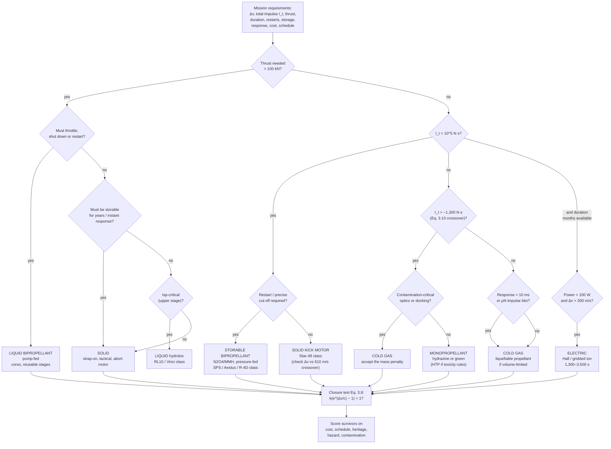

# Module 32 — Liquid vs Solid vs Cold Gas
Part V · Prerequisites: Parts I–IV (modules 01–31) · Estimated time: 8 h

The most expensive mistakes in propulsion are not made inside an engine. They
are made in the two weeks at the start of a program when somebody picks the
class of propulsion, writes it into the system requirements document, and
everything downstream — the structure, the avionics, the ground infrastructure,
the range safety package, the launch site, the crew training — gets designed
around it. By the time the first injector element is drawn, that decision is
unappealable. I have watched a spacecraft program spend eighteen months
qualifying a cold-gas system for a Δv budget that cold gas could not physically
deliver at any tank mass, because the person who wrote "cold gas, heritage,
low risk" into the trade matrix in month one had never computed
$k(e^{\Delta v/c}-1)$ and noticed that it exceeded unity. This module is the
one that teaches you to check that in ninety seconds. It is also the module
that makes you say *why* — because "solids have lower Isp" is a fact a
first-year student can recite, and "solids have lower Isp because the aluminium
that gives you the density and the flame temperature also gives you a
condensed-phase exhaust that carries kinetic and thermal energy it cannot give
back" is the sentence that gets you hired.

---

## 1. Learning objectives

After this module you should be able to:

1. **Reproduce the master comparison table** from memory to within a factor
   consistent with the stated ranges, and for every row state the *physical*
   mechanism that sets the range — not the correlation, the mechanism.
2. **Compute the closure condition** $k(e^{\Delta v/c}-1)<1$ for a stated
   inert-mass model and declare a propulsion class infeasible before sizing
   anything.
3. **Size and compare** cold-gas, monopropellant, bipropellant and solid
   solutions to the same Δv requirement on the same spacecraft, including
   inert mass, and explain which wins and by how much.
4. **Locate the crossover points** — the total impulse at which cold gas loses
   to monopropellant, the Δv at which a solid kick motor loses to a storable
   bipropellant stage — and show how each moves when the inert-mass
   assumptions move.
5. **Compute a demonstrated reliability** from a flight record using a binomial
   point estimate and a Clopper–Pearson lower confidence bound, and state what
   that number does and does not cover.
6. **Argue the throttling, restart and response-time capability** of each class
   from its physics: why a solid cannot be throttled after ignition, why a
   pump-fed liquid takes seconds to reach mainstage, why a cold-gas thruster
   answers in milliseconds.
7. **Place hybrids, monopropellant hydrazine and HTP, and electric propulsion**
   correctly on the same map, and say what requirement would drive you to each.
8. **Justify the propulsion class actually flown** on a booster, an upper
   stage, a spacecraft main engine, an RCS, a launch escape system, a reusable
   first stage and a small launcher, naming the requirement that decided it.
9. **Walk a stated mission requirement set through a selection flow** and
   produce a recommendation with a quantitative justification and a named
   second choice.

---

## 2. Terminology

| term | symbol | SI unit | definition |
|---|---|---|---|
| specific impulse | $I_{sp}$ | s | total impulse per unit propellant weight, $I_t/(m_p g_0)$ |
| effective exhaust velocity | $c$ | m/s | $I_{sp}g_0$; thrust per unit mass flow |
| characteristic velocity | $c^*$ | m/s | $p_c A_t/\dot m$; a property of the propellant and chamber, not the nozzle |
| thrust coefficient | $C_F$ | — | $F/(p_c A_t)$; a property of the nozzle, not the propellant |
| total impulse | $I_t$ | N·s | $\int F\,dt$ over the life of the system |
| velocity increment | Δ$v$ | m/s | $c\ln(m_0/m_f)$ for one impulsive burn |
| initial / final mass | $m_0$, $m_f$ | kg | before and after the manoeuvre |
| propellant mass | $m_p$ | kg | expelled working fluid, $m_0-m_f$ |
| inert (dry) mass | $m_i$ | kg | tanks, valves, engine, structure — everything that is not expelled |
| variable inert fraction | $k$ | — | inert mass that scales with propellant, $m_i = k\,m_p + m_{fix}$ |
| fixed inert mass | $m_{fix}$ | kg | inert mass independent of propellant load (engine, controller, valves) |
| propellant mass fraction | $\zeta$ | — | $m_p/(m_p+m_i)$ for a stage or motor; $\zeta = 1/(1+k)$ when $m_{fix}=0$ |
| bulk propellant density | $\rho_b$ | kg/m³ | mass of the full propellant load ÷ its volume, at the stated mixture ratio |
| density impulse | $\rho_b I_{sp}$ | kg·s/m³ | total impulse per unit propellant volume ÷ $g_0$ |
| impulse density | $\rho_b I_{sp} g_0$ | N·s/m³ | same quantity in impulse units; quoted here per litre |
| thrust-to-weight (engine) | $\mathcal{T}_e$ | — | $F/(m_{engine}g_0)$ |
| thrust-to-weight (stage) | $\mathcal{T}_s$ | — | $F/(m_{stage,wet}g_0)$ |
| mixture ratio | $O\!/\!F$ | — | oxidizer-to-fuel mass flow ratio |
| chamber pressure | $p_c$ | Pa | injector-face stagnation pressure unless stated |
| burn-rate exponent | $n$ | — | in Vieille's law $r=ap_c^n$; sets solid-motor pressure stability |
| throat-to-burn area ratio | $K_n$ | — | $A_b/A_t$; the solid designer's throttle, fixed at cast time |
| ignition transient | $t_{ign}$ | s | command to 90 % of steady chamber pressure |
| minimum impulse bit | $I_{bit}$ | N·s | impulse of the shortest commandable pulse |
| demonstrated reliability | $\hat p$ | — | successes ÷ trials from a flight or test record |
| lower confidence bound | $p_L$ | — | one-sided Clopper–Pearson bound on $\hat p$ at stated confidence |
| single-point failure | SPF | — | a component whose failure alone loses the mission |
| thrust vector control | TVC | — | the mechanism that steers the thrust line |
| stored energy | $E_s$ | J | $pV$ for a pressure vessel; the mechanical hazard scale |
| total impulse density (system) | — | N·s/kg | $I_t/m_{wet}$ of the whole propulsion system, the honest figure of merit |

---

## 3. Theory

### 3.1 What "class of propulsion" actually means

A propulsion class is not a propellant. It is a *coupled choice* of energy
source, storage state, feed mechanism and control authority, and the four are
not independently selectable. Choose a solid propellant and you have chosen:
the energy and the working fluid live in the same solid grain; there is no feed
system because the grain is inside the chamber; the mass flow schedule is
geometry, cast in place months earlier; and once ignited, the only control
authority you retain is where the thrust vector points, not how large it is.
Choose a cold gas and you have chosen: no chemical energy at all, only the
enthalpy of a compressed inert fluid; the tank *is* the system mass; and the
control authority is superb because the only thing between the command and the
thrust is a solenoid.

That coupling is why the comparison in this module is not a list of
independent trades. Almost every row of the master table below is a consequence
of one or two of the others. [F]

The three classes in the course title are the corners of the design space, and
three more sit between them:

- **Liquid bipropellant** — separate fuel and oxidizer, combined and burned on
  demand. Highest $I_{sp}$ in chemical propulsion, full control authority,
  most parts.
- **Solid** — fuel, oxidizer and binder pre-mixed and cast into the chamber.
  Highest density impulse, highest thrust density, fewest moving parts, no
  control after ignition.
- **Cold gas** — an inert stored fluid expanded through a nozzle. No
  combustion, therefore no ignition, no contamination, no plume heating, no
  thermal management, and no performance.
- **Monopropellant** (hydrazine, HTP, and the modern "green" ionic-liquid
  blends) — one liquid decomposed catalytically. Half the $I_{sp}$ of a
  bipropellant with a fraction of the plumbing.
- **Hybrid** — solid fuel grain, liquid or gaseous oxidizer. Throttleable and
  restartable like a liquid, insensitive like a solid, and with the mixture
  ratio wandering as the port opens.
- **Electric** — externally powered, so the propellant is only reaction mass
  and the exhaust velocity is decoupled from any flame temperature. Isp an
  order of magnitude higher, thrust three to five orders lower.

### 3.2 The master comparison table

Read the table, then read §3.3–§3.18, which explain every row. Ranges are for
*flight-qualified* hardware in each class; the extreme entries name the engine
that sits there. All Isp figures are vacuum unless marked SL. [E][M]

| row | cold gas | monopropellant | solid | liquid bipropellant | hybrid | electric |
|---|---|---|---|---|---|---|
| **Isp (s)** | 40–75 (He 150–165) | 150–235 | 240–300 | 300–465 | 250–350 | 800–3,000+ |
| Isp extremes | R-236fa ≈ 40 (MarCO); He ≈ 165 | HTP-90 ≈ 150; N₂H₄ ≈ 235 | SRB 242 SL/268 vac; Zefiro 9A 295.9 | Aestus 324; RL10B-2 **465.5** | test hardware only | Hall ≈ 1,600; gridded ion ≈ 3,000 |
| **Thrust per unit** | 1 mN – 4 N | 0.5 N – 4 kN | 30 kN – 16 MN | 400 N – 7.8 MN | 1 kN – 1 MN class | 0.1 mN – 0.5 N |
| Thrust extremes | GomSpace 1 mN; NASA SOA cap 3.6 N | Orion 38-class is solid; monoprop tops out at the descent-engine class | Orion 38 ≈ 36 kN; SLS RSRMV ≈ 16.0 MN`/motor` | Draco 400 N; F-1 7.77 MN vac | — | — |
| **Engine T/W** | n/a (tank-dominated) | 10–50 | **50–200+** (case + nozzle only) | 25–185 | 20–60 | ≪ 1 |
| **Stage/system T/W** | 0.001–0.01 | 0.01–0.1 | 2–4 | 1–2 (booster) | 1–2 | ≪ 0.001 |
| **Bulk density (kg/m³)** | 40 (He) – 1,360 (R-236fa) | 1,004 (N₂H₄); 1,390 (HTP-90) | **1,750–1,850** | 361 (LOX/LH₂) – 1,162 (N₂O₄/MMH) | 900–1,100 | n/a (Xe 1,600 stored) |
| **Impulse density (N·s/L)** | 0.18–0.53 k | 2.0–2.2 k | **4.8–5.0 k** | 1.6 k (hydrolox) – 3.6 k (storable) | 2.5–3.0 k | very high per litre, low per watt |
| **Restarts** | unlimited (10⁶ pulses) | 10³–10⁵ | **0** (multi-pulse: 2–3) | 1–3 (cryo upper stage) to 10³ (OMS) / 2×10⁴ (R-4D) | many | ~unlimited |
| **Throttling** | on/off + PWM | on/off + PWM; some 4:1 | **none after ignition** | 100:40 typical; 100:10 (LMDE) | 10:1 routine | continuous via power |
| **Response (command→90 % F)** | **2–5 ms** | 10–50 ms (warm cat bed); seconds cold | 50–300 ms igniter transient, then uncommandable | 10–50 ms pressure-fed; **2–6 s** pump-fed | 50–200 ms | seconds (PPU) |
| **Storage life** | years, leak-limited | 5–15 yr (storables) | **10–25 yr** with surveillance | 10–20 yr storable; hours–days cryogenic | years (fuel); oxidizer-limited | years |
| **Moving parts** | 1 per thruster + regulator | 1–2 per thruster | **0–2** (TVC actuators) | 10²–10³ incl. turbomachinery | 5–20 | pumps/valves for feed only |
| **Ground handling hazard** | high-pressure stored energy | toxic (N₂H₄) / decomposition (HTP) | energetic material, class-based | cryogenic or toxic + high pressure | oxidizer only | inert |
| **Dominant cost driver** | tankage qualification | propellant handling infrastructure | **case + nozzle + facility**, and production rate | **engine development and test** | development (immature) | power system |
| **Where it wins** | µN–mN control, contamination-free, cheap | 10²–10⁴ N·s spacecraft ACS/Δv | boosters, kick stages, tactical | cores, upper stages, reuse, crew | education, sounding, niche | GEO/deep-space Δv over months |

> **Table 3.2** — variables: as defined in §2; assumes flight-qualified hardware
> and vacuum Isp unless marked SL; fails when a class is pushed outside its
> demonstrated envelope (e.g. cold gas above ~10⁴ N·s, monopropellant above
> ~10⁵ N·s, hybrids at any flown orbital scale). Engine figures traced to
> `reference/_verify-liquid.md` and `reference/_verify-solid-coldgas.md`; ranges
> for hybrid and electric are textbook-level [SB §7, §17–19][Humble][NASA-SOA].

### 3.3 Specific impulse: the ranges and the physical reason

For an ideal nozzle,

$$I_{sp} = \frac{c^{*}C_F}{g_0},\qquad c^{*}=\frac{\sqrt{R T_c}}{\Gamma}
= \frac{1}{\Gamma}\sqrt{\frac{R_u T_c}{\mathcal{M}}}$$

> **Eq. 3.1** — variables: $c^*$ [m/s]; $C_F$ [—]; $T_c$ chamber temperature
> [K]; $\mathcal{M}$ exhaust molar mass [kg/kmol]; $R_u = 8314.46$ J/(kmol·K);
> $\Gamma=\sqrt{\gamma}\,(2/(\gamma+1))^{(\gamma+1)/2(\gamma-1)}$. Meaning:
> everything the propellant contributes to performance enters through
> $\sqrt{T_c/\mathcal{M}}$, and everything the nozzle contributes enters
> through $C_F$. Assumes: one-dimensional, chemically frozen or shifting
> equilibrium as declared, calorically perfect, no condensed phase. Fails when
> the exhaust carries a condensed phase (solids), when the gas is not
> calorically perfect (cold refrigerants near saturation), or when boundary
> layers are a large fraction of the throat (µN thrusters, Module 29). [F]

Every Isp difference in Table 3.2 is $\sqrt{T_c/\mathcal{M}}$ plus a nozzle
correction. Work through the four corners:

**Cold gas, 40–75 s.** $T_c$ is ambient, ~290 K, because there is no chemistry.
That is a factor of ten below a bipropellant flame and therefore a factor of
$\sqrt{10}\approx3.2$ in $c^*$ before molar mass is considered. Nitrogen at
$\mathcal{M}=28.014$ and $T_0=300$ K gives $c^*=435.8$ m/s and an ideal vacuum
$I_{sp}$ of 76.8 s at $\varepsilon=50$ [CALC, Module 28]. Realized performance
is about 0.90 of the frozen ideal, giving 65–73 s; short-pulse operation is
much worse, and SAFER's flight numbers invert to ≈ 40 s [SAFER95][CALC].
Helium buys $\sqrt{28.014/4.003}=2.65$ on $c^*$ and reaches 178 s ideal — and
loses it all again on storage density, §3.6.

**Monopropellant, 150–235 s.** Hydrazine decomposition is *exothermic but
limited*: N₂H₄ → NH₃ + N₂ + H₂ releases enough enthalpy for roughly 900–1,400 K
depending on the ammonia dissociation fraction, which itself is set by catalyst
bed residence time. The designer trades $T_c$ against $\mathcal{M}$: more
ammonia dissociation raises $T_c$ and lowers $\mathcal{M}$ (good for Isp) but
attacks the bed. 90 % HTP decomposes to steam and oxygen at ~1,020 K with
$\mathcal{M}\approx22$, giving ~150 s — lower than hydrazine, and its
compensation is density (§3.6) and non-toxicity, not performance. [E][SB §7.4]

**Solid, 240–300 s.** An AP/Al/HTPB composite reaches $T_c\approx3,300$ K,
comparable to kerolox, yet delivers 40–60 s less. Three mechanisms, in order of
size:

1. **Condensed-phase loss.** 16–19 % aluminium by mass burns to Al₂O₃, which
   leaves the nozzle as liquid or solid droplets. Those droplets carry mass and
   momentum but expand isentropically only in the limit of infinitely small
   particles: they lag the gas in velocity (*velocity lag*) and stay hotter than
   the gas (*thermal lag*), so a two-phase flow gives up 2–6 % of Isp depending
   on particle size and nozzle length [SP-8039][Davenas]. This is the largest
   single term and it has no analogue in a liquid engine.
2. **Molar mass.** The exhaust is loaded with HCl and Al₂O₃; $\mathcal{M}$ is
   ~26–29 kg/kmol against ~22–24 for kerolox and ~10–13 for hydrolox.
3. **Expansion ratio.** A booster nozzle must survive sea level and start
   unseparated, so ε is small — the Shuttle SRB flew ε ≈ 7.16–7.72 against
   RS-25's 69–78 [WP][NASA-SRB]. This is a *packaging* penalty, not a
   propellant penalty, and upper-stage solids recover most of it: Zefiro 9A
   reaches 295.9 s and Star 48B's long nozzle 292.2 s against the same
   propellant family's 286.2 s on the short nozzle [WP][JM-LV].

That last pair is the single best teaching example in the module: **the same
Star 48B propellant gives 286.2 s or 292.2 s depending only on which nozzle is
bolted to it.** Isp is a property of the motor and its nozzle, never of the
propellant alone. [F]

**Liquid bipropellant, 300–465 s.** Hydrolox wins on the denominator, not the
numerator: LOX/LH₂ burns *cooler* than kerolox at the mixture ratios actually
flown (fuel-rich to protect the chamber and to reduce $\mathcal{M}$), and its
exhaust molar mass of ~10–13 kg/kmol is what buys 450+ s. RL10B-2 holds the
flown record at **465.5 s** at ε = 285:1 deployed, and it needs an extendible
carbon–carbon nozzle 2.5 m long to get there [WP]. Vinci reaches 457.2 s at
ε = 240:1 [WP]. Compare storables: Aestus, at $p_c$ = 11 bar — nothing — reaches
324 s on N₂O₄/MMH at ε = 84:1 [WP]. That comparison should permanently kill the
idea that chamber pressure sets Isp: **chamber pressure buys you the
opportunity to package a large area ratio into a small engine; the area ratio
buys the Isp.** [F]

### 3.4 Thrust: ranges and what limits scaling

Thrust is $F = C_F p_c A_t$, so it scales with throat area at fixed pressure.
The scaling *limits* are different for each class and they are the interesting
part.

$$F = C_F\,p_c A_t = \dot m\, c$$

> **Eq. 3.2** — variables: $F$ [N]; $C_F$ [—]; $p_c$ [Pa]; $A_t$ [m²];
> $\dot m$ [kg/s]; $c$ [m/s]. Meaning: thrust is a pressure–area product, or
> equivalently a momentum flux. Assumes choked throat and quasi-1D flow. Fails
> in the transitional and slip-flow regimes where $Re_t \lesssim 10^3$ (Module
> 29) and for unchoked operation at end-of-blowdown. [F]

**Cold gas is limited at the top by mass flow, not by area.** You can build a
large cold-gas throat trivially; you cannot feed it, because the mass in the
tank is $pV/(ZRT)$ and it runs out in seconds. NASA's small-spacecraft survey
caps the class at 3.6 N [NASA-SOA]; the flown CubeSat units sit at 1–50 mN per
thruster [VACCO][NASA-SOA]. At the bottom, cold gas goes lower than anything
else chemical: GomSpace's butane unit resolves 5 µN [WP].

**Monopropellant is limited by the catalyst bed.** Bed loading (kg/s per m² of
bed frontal area) has an upper limit set by pressure drop and by the mechanical
attrition of the catalyst pellets; above it the bed washes out. That is why the
class tops out around the few-kN level and why every large "monopropellant"
concept in history became a bipropellant.

**Solids are limited only by what you can build and transport.** There is no
feed system to scale, no injector to keep stable, no turbomachinery. Thrust
grows with burning surface area, and burning surface grows with the cube of the
motor's linear dimension for a given geometry family. This is why the largest
rocket motors ever built are solid: the SLS five-segment RSRMV at ≈ 16.0 MN
`/motor` `max` [NASA-SLS-SRB], the Shuttle SRB at ≈ 14.7 MN `/motor` `max`
[WP]. The real constraints are *casting pit depth*, *rail-car clearance* (which
is why the Shuttle SRB was segmented at all) and the quantity-distance arc
around the casting facility. [M]

**Liquid thrust is limited by combustion stability and by turbomachinery.**
The F-1 at 6.77 MN SL took years of injector-baffle development to stabilize;
the failure mode was a tangential acoustic mode, not a structural one
[SP-194][Hunley07]. Above that scale, engineers chose multiple chambers on one
turbopump — the RD-170's four chambers — precisely to keep each chamber inside
a stability envelope they understood. [H]

**The honest way to compare thrust across classes is thrust density**, not
thrust: newtons per cubic metre of installed propulsion volume, or per unit
vehicle cross-section. A solid booster delivers 3–4 g of vehicle acceleration
from a package with a propellant mass fraction over 0.90 and no feed system
volume at all. Nothing else comes close, and that is the whole argument for
strap-ons (§3.20).

### 3.5 Thrust-to-weight

Two numbers, always distinguish them.

**Engine T/W** flatters liquids. Merlin 1D is 845 kN from 470 kg dry: 184:1,
the highest of any flown orbital-class engine [WP]. RD-191 is 89:1; RL10B-2 is
37:1; Vinci ≈ 33:1 [WP][CALC]. Those numbers exclude tanks, pressurization,
lines and — for Rutherford's electric pump cycle — the batteries. Rutherford's
72.8:1 engine T/W is real and the stage-level figure is much worse, which is
the honest criticism of the electric-pump cycle and Rocket Lab does not hide it
[WP].

**Stage or system T/W** is what the vehicle feels, and it inverts the ranking.
A solid motor's "engine" *is* the tank: GEM-63XL is 2,061 kN from a 53,030 kg
gross motor, i.e. a stage-level T/W of 3.96 at ignition [CALC from WP figures].
P120C is 4,780 kN from 153,000 kg gross, ~3.2. A kerolox booster stage sits at
1.2–1.8. **The solid wins the launch-pad comparison by a factor of two to
three, and it wins it because there is no feed system, no pressurization gas,
and a propellant mass fraction of 0.90–0.924** [P120C][WP][CALC].

For spacecraft the same split appears as N·s per kilogram of *wet propulsion
system* — total impulse density — which is the number that actually decides
small-satellite trades and which no data sheet publishes. Compute it yourself;
Worked Example 3 shows how.

### 3.6 Energy density and density impulse

Isp is impulse per unit propellant *weight*. Volume-limited vehicles — which
is nearly all of them, because fairings and buses are volume-constrained long
before they are mass-constrained — care about impulse per unit propellant
*volume*:

$$I_v = \rho_b\,I_{sp}\,g_0 \quad[\mathrm{N\,s/m^3}]$$

> **Eq. 3.3** — variables: $\rho_b$ bulk propellant density [kg/m³] at the
> flight mixture ratio; $I_{sp}$ [s]; $g_0$ = 9.80665 m/s². Meaning: total
> impulse obtainable from one cubic metre of propellant. Assumes the tank
> volume is dominated by propellant (false for cold gas, where the tank *wall*
> is the mass). Fails as a figure of merit whenever the tank mass, not the
> propellant mass, closes the design — see §3.3 and Worked Example 1. [F]

For a bipropellant the bulk density is the mixture-ratio-weighted harmonic mean:

$$\rho_b = \frac{1+O\!/\!F}{\dfrac{O\!/\!F}{\rho_{ox}}+\dfrac{1}{\rho_{f}}}$$

> **Eq. 3.4** — variables: $O\!/\!F$ [—]; $\rho_{ox},\rho_f$ [kg/m³] at the
> storage temperature. Meaning: the density of the propellant *pair* as loaded.
> Assumes no ullage and no residuals. Fails if the tanks are not sized to the
> flight mixture ratio (deliberate propellant bias, Module 12). [F]

| propellant system | $\rho_b$ (kg/m³) | $I_{sp}$ (s) | $I_v$ (N·s per litre) |
|---|---|---|---|
| GN₂ at 241 bar | 280 | 65 | **179** |
| n-butane (self-pressurising) | 570 | 65 | 363 |
| R-236fa (self-pressurising) | 1,360 | 40 | 534 |
| Hydrazine monopropellant | 1,004 | 220 | 2,166 |
| 90 % HTP monopropellant | 1,390 | 150 | 2,045 |
| LOX/LH₂ at $O\!/\!F$ = 6 | 361 | 452 | 1,600 |
| LOX/RP-1 at $O\!/\!F$ = 2.34 | 1,016 | 311 | 3,099 |
| N₂O₄/MMH at $O\!/\!F$ = 1.65 | 1,162 | 320 | 3,647 |
| AP/Al/HTPB solid | 1,800 | 280 | **4,942** |

Densities: cold-gas column from `_verify-solid-coldgas.md` §B.1 (confidence C,
literature-recalled, **not NIST-verified** — do not quote to three figures);
propellant densities standard values [SB App. 2][NIST-WB]; all $I_v$ are
[CALC]. Note that the file's 0.25 g/cm³ entry for GN₂ at 300 bar is *lower*
than its 0.28 g/cm³ at 241 bar, which cannot be right for a gas at fixed
temperature; the 241-bar figure is the one used here and the 300-bar entry
should be treated as an error until re-derived from REFPROP.

**Read that table twice.** A solid delivers **28× the impulse per litre of a
GN₂ cold-gas system and 3.1× that of a hydrolox stage.** Hydrolox has the
highest Isp of anything chemical and nearly the *worst* impulse density, which
is why hydrolox stages are enormous, why the Delta IV looked the way it did,
and why every hydrolox stage carries a tank mass penalty that partly eats the
Isp advantage. Kerolox at 3,099 N·s/L against hydrolox at 1,600 is the whole
first-stage propellant argument in two numbers. [F]

The cold-gas row needs one further correction, and it is the correction that
decides CubeSat propulsion. **For cold gas the tank is the system.** A COPV's
mass follows from its performance factor $pV/W$:

$$m_{tank} = \frac{pV}{g_0\,(pV/W)}$$

> **Eq. 3.5** — variables: $p$ operating pressure [Pa]; $V$ internal volume
> [m³]; $pV/W$ tank performance factor [m], 5,000 m for a conservative
> metallic vessel to 15,000 m for a flight COPV (Module 30). Meaning: tank mass
> is proportional to stored energy, not to stored mass. Assumes membrane-mode
> stress, no boss/mount mass. Fails for small tanks where minimum-gauge and
> boss mass dominate. [E]

At 241 bar, GN₂ at 280 kg/m³ and $pV/W$ = 8,000 m, the tank masses **1.10 kg
per kilogram of nitrogen** [CALC]. R-236fa at 2.7 bar vapour pressure needs a
thin-walled can. That single comparison is why every flown CubeSat cold-gas
module uses a liquefiable propellant and no launcher uses one [MarCO][VACCO].

### 3.7 Restart capability

- **Cold gas: unlimited, and the limit is the valve.** VACCO's catalogued
  micro-modules quote up to 880,000 and 1,860,000 firings [VACCO]. Nothing is
  consumed by a start except a few milligrams of gas and one valve cycle.
- **Monopropellant: 10³–10⁵.** The limit is catalyst bed integrity — thermal
  cycling shatters pellets, and a cold start on a cold bed produces a hard
  pressure spike. Bed heaters exist for exactly this reason.
- **Bipropellant: architecture-dependent, and the spread is enormous.** The
  Shuttle OMS AJ10-190 was qualified for **1,000 starts and 15 hours cumulative
  burn** over 100 missions; the R-4D family is qualified for **20,000
  individual firings and 40,000 s accumulated** [WP]. A cryogenic upper stage,
  by contrast, gets 2–4: Vinci is qualified for up to 3 restarts and 900 s
  [WP]; the limit there is not the engine but *settling, chill-down and
  pressurization* — you must re-settle the propellant, re-chill the pump to
  avoid cavitation, and you carry finite helium and finite battery.
- **Solid: zero.** Once the grain is burning, the flame is self-sustaining at
  chamber pressure and there is no valve between the propellant and the throat.
  Multi-pulse motors exist — two or three grains separated by a bulkhead that
  is ruptured or burned through on command — and they are used in tactical
  applications, but each pulse is still a fixed, uncommandable impulse. Thrust
  *termination* is achieved by blowing ports in the forward dome to depressurize
  the chamber (a destructive, one-way action) rather than by shutting anything
  off. [M][SB §12]

The engineering consequence: **any mission whose Δv is not known precisely in
advance cannot use a solid for that Δv.** Orbit insertion accuracy from a solid
kick motor is set by motor total-impulse dispersion (typically ±0.5–1 % from
propellant temperature and grain manufacturing tolerance) and must be trimmed
afterwards by a liquid system, or absorbed by the mission.

### 3.8 Throttling

**Liquid deep throttling** is a coupled problem, and it is worth stating the
mechanics because interviewers ask.

Reduce the propellant flow and you reduce $p_c$ roughly proportionally
(Eq. 3.2 at fixed $A_t$). Three things then go wrong simultaneously:

1. **Injector pressure drop collapses as the square of flow.** For an orifice,
   $\dot m = C_d A\sqrt{2\rho\,\Delta p}$, so throttling to 20 % flow leaves 4 %
   of the design $\Delta p$. Since injector $\Delta p$ is what decouples the
   feed system from chamber acoustics, the engine becomes *chug*-unstable at low
   thrust unless something restores the stiffness. The fixes are a variable-area
   injector (a movable pintle sleeve — the TRW lineage that runs from the LMDE
   to the Merlin), dual-manifold injectors, or gas injection into the manifold.
2. **Atomization degrades.** Drop size scales roughly as $\Delta p^{-0.4}$;
   coarse sprays lengthen the combustion zone, drop $c^*$ efficiency, and move
   the heat load downstream into the throat.
3. **Feed system margin vanishes.** A pump-fed engine at 20 % is running its
   turbopump far off design point, near stall on the pump and with reduced NPSH
   margin.

The reference case is the **Apollo LMDE**: throttleable 10–60 % with a **10:1
chamber-pressure turndown, 110 psia to 11 psia (7.6 to 0.76 bar)**, and Isp
falling from 311 s at full thrust to 285 s at 10 % [WP]. Note the detail that
is usually omitted: **the 60–100 % band was operationally prohibited because of
nozzle erosion.** The engine ran either at full thrust or in the throttle band,
never between. Modern practice is more modest and more honest: Merlin 1D
40–100 % (SL), MVac 39–100 %, SuperDraco 20–100 %, RD-191 **27–105 %**, which
is exceptional for a staged-combustion engine [WP].

**Solid non-throttling** is absolute. The mass flow is $\dot m = \rho_p A_b r$
with $r = ap_c^n$, and $A_b$ is geometry:

$$p_c = \left(a\,\rho_p\,c^{*}\,K_n\right)^{1/(1-n)},\qquad K_n = A_b/A_t$$

> **Eq. 3.6** — variables: $a$ burn-rate coefficient [m/s·Pa⁻ⁿ]; $\rho_p$
> propellant density [kg/m³]; $c^*$ [m/s]; $K_n$ [—]; $n$ [—]. Meaning: the
> equilibrium chamber pressure of a solid motor is fixed entirely by geometry
> and propellant chemistry. Assumes $n<1$ for stable equilibrium, quasi-steady
> burning, no erosive burning. Fails during the ignition transient, during
> erosive burning at high port Mach number, and near burnout with slivers. [F]

Nothing on the right-hand side is commandable in flight. $K_n$ is cast in.
The designer *does* shape the thrust–time curve — progressive, neutral,
regressive, dual-thrust, via grain geometry (Module 21) — but the schedule is
frozen at cast time and it varies with propellant bulk temperature through
$\sigma_p$ at roughly 0.1–0.3 %/K in burn rate, amplified by $1/(1-n)$ in
pressure. A motor conditioned at 288 K and one at 308 K fly measurably
different trajectories. That is why solid-boosted vehicles carry thermal
conditioning requirements on the pad. [E][SP-8076]

**Cold-gas "throttling" is pulse-width modulation.** The valve is on or off; you
control the *average* thrust by duty cycle. The resolution of that control is
the minimum impulse bit, which is set by valve open/close times (Module 30):
for a 50 mN thruster with 3 ms opening and 2 ms closing, a 10 ms command gives
$I_{bit}\approx 4.9\times10^{-4}$ N·s. Below about 3× the valve transient time
the pulse is all transient and the delivered impulse becomes badly repeatable —
which sets the floor on pointing performance, not the thruster's steady thrust.

### 3.9 Response time

This row decides control-system architecture more often than Isp does.

| class | command → 90 % thrust | what sets it |
|---|---|---|
| cold gas | **2–5 ms** | solenoid armature travel + plenum fill |
| monopropellant, warm bed | 10–50 ms | valve + bed residence + decomposition kinetics |
| monopropellant, cold bed | 0.3–2 s and a pressure spike | bed must reach light-off temperature |
| pressure-fed hypergolic | 10–50 ms | valve + manifold fill + hypergolic ignition delay |
| pressure-fed with igniter | 50–300 ms | igniter sequence, purge, manifold prime |
| **pump-fed liquid** | **2–6 s** | tank-head start, turbine spin-up, thermal conditioning, mainstage ramp |
| solid | 50–300 ms | igniter output, flame spread over the grain surface, chamber fill |

**The pump-fed number is the one that surprises people.** An SSME start is a
choreographed several-second sequence: bootstrap on tank head, controlled
turbine acceleration, staged valve opening, and a closed-loop ramp to
mainstage, and it is the highest-risk part of the whole operating envelope
[Biggs89]. That is why launch vehicles start their engines *before* releasing
the hold-downs and verify mainstage on the pad — the start transient is too
slow and too failure-prone to be part of an abort response.

Which is exactly why launch escape systems are solid. A solid's transient is
milliseconds-to-hundreds-of-milliseconds, and it is *uncommandable but
reliable*: the igniter fires, the flame spreads, and full thrust arrives long
before a turbopump could have spooled. §3.20 returns to this.

### 3.10 Storage

**Solids: 10–25 years** with a surveillance program. The grain is a filled
elastomer; it ages by binder oxidation and by chain scission, its modulus
climbs, and its failure strain falls. The failure mode is a *grain crack*,
which multiplies burning surface, raises $K_n$, and over-pressurizes the case
— the aging limit is structural, not chemical. Surveillance means periodically
withdrawing motors from the stockpile, doing non-destructive inspection
(radiography, ultrasonic bond-line inspection) and static-firing a sample.
[Davenas][Kubota][SP-8073]

**Cold gas: years, and the limit is leakage.** Nothing degrades; the gas simply
escapes. A leak of 0.5 g/day out of a 0.6 kg inventory ends the mission in
three years. This is why the flown CubeSat modules are all-welded single-piece
assemblies and why the academic contribution that mattered was printing the
plenum, feed passages and nozzles as one part — it deletes the joints that
dominate the leak budget [VACCO][NASA-SOA].

**Storables: 5–20 years.** N₂O₄/MMH and N₂O₄/Aerozine-50 are the reason the
Apollo SPS, the Shuttle OMS and every geostationary satellite look the way they
do. The limits are material compatibility (nitrate ester formation, stress
corrosion of titanium by N₂O₄ — solved by adding NO), and slow permeation
through elastomeric seals.

**Cryogens: hours to days, and it is a *system* problem.** LH₂ at 20 K boils
under any realistic insulation; LOX at 90 K is easier but not free. Boil-off
sets the coast duration of every hydrolox upper stage, drives the choice of
multi-layer insulation and (in modern designs) active cooling, and forces the
"load late, launch soon" ground flow that makes cryogenic vehicles poor at
responsive launch. **This one row is the whole reason solids own the strategic
mission** (§3.20): a vehicle that must sit fuelled for a decade and fly on
minutes of notice cannot be cryogenic and, in practice, has not been liquid at
all since the retirement of the storable-fuelled Titan II. [H][M]

### 3.11 Reliability, and how the number is actually computed

There are more bad reliability numbers in propulsion marketing than in any
other part of aerospace. Here is how to compute one and how to read one.

**Point estimate.** From $n$ independent trials with $f$ failures,
$\hat p = (n-f)/n$. This is a maximum-likelihood estimate and it is nearly
useless on its own, because $\hat p = 1.000$ from ten flights and
$\hat p = 1.000$ from a thousand are the same number and utterly different
evidence.

**Lower confidence bound.** The honest figure is the one-sided Clopper–Pearson
lower bound $p_L$ at a stated confidence $1-\alpha$, defined as the $p$ for
which $\Pr(X\ge n-f\mid p)=\alpha$. For the zero-failure case it collapses to a
line you should memorise:

$$p_L = \alpha^{1/n}\qquad(f=0)$$

> **Eq. 3.7** — variables: $\alpha$ = 1 − confidence [—]; $n$ trials [—].
> Meaning: the smallest reliability consistent with observing $n$ consecutive
> successes at the stated confidence. Assumes independent, identically
> distributed trials with a single binary outcome. Fails when trials are not
> independent (a common-cause manufacturing lot), when the configuration
> changed mid-record, or when "success" is defined after the fact. [F]

| record | $\hat p$ | $p_L$ at 90 % | $p_L$ at 95 % |
|---|---|---|---|
| 10 flights, 0 failures | 1.000 | 0.794 | 0.741 |
| 50 flights, 0 failures | 1.000 | 0.955 | 0.942 |
| 100 flights, 0 failures | 1.000 | **0.977** | 0.970 |
| 270 motor-flights, 1 failure (Shuttle SRB record) | 0.996 | 0.986 | 0.983 |
| 369 engine-flights, 0 failures (Rutherford, to Apr 2024) | 1.000 | 0.994 | 0.992 |

All [CALC]; the flight records from [WP] and `_verify-liquid.md`. **To
demonstrate 0.99 at 90 % confidence with no failures you need 230 consecutive
successes.** Very few propulsion units in history have that record. When a
brochure claims 0.98 reliability for a motor with fourteen flights, it is not
reporting a measurement; it is reporting an allocation from a reliability
model, and you should ask to see the model.

**The "solids are simpler therefore more reliable" argument, and the
counter-argument.** The argument: a solid has no feed system, no injector, no
turbopump, no ignition timing, and typically zero to two moving parts. Fewer
elements, fewer failure modes, and the failure modes it has are structural
rather than dynamic. That is genuinely true and it is why solids are chosen for
escape motors and for weapons.

The counter-argument, which is stronger than most students expect: **a solid
motor cannot be inspected in the state in which it will be used, and it cannot
be tested without being destroyed.** You can hot-fire a liquid engine, take it
apart, look at it, and fly it — the Shuttle OMS engine was qualified for 1,000
starts and 100 missions [WP]. You cannot hot-fire *this* solid motor and then
fly *this* solid motor. You fire a sample from the lot and infer. Every claim
about the motor you are about to fly rests on (a) process control at
manufacture, (b) non-destructive inspection that can see voids, unbonds and
cracks but cannot see burn rate, and (c) lot-acceptance firings of *siblings*.
Add that the grain has been aging in a warehouse for a decade and the inference
chain is long.

And when a solid does fail, the failure is usually not survivable: there is
nothing to shut down. The canonical case is STS-51-L, where the failure was not
a bad O-ring but a *joint that rotated open under ignition pressure faster than
a cold-stiffened elastomer could extrude into the gap* [Rogers86]. The redesign
added a capture feature to limit rotation, a third O-ring, redesigned
insulation and joint heaters. The lesson generalizes: in a solid, the
single-point failures are the case, the joints, the insulation bond line, the
nozzle throat and the igniter — all of them structural, all of them latent, and
none of them observable in flight until the pressure trace departs.

**Single-point failures by class** [J]:

| class | canonical SPFs |
|---|---|
| cold gas | regulator fails open (over-pressure downstream); valve fails open (loss of all propellant); COPV burst |
| monopropellant | catalyst bed washout or freezing; latch valve fails closed; tank diaphragm rupture |
| solid | case or joint burn-through; grain crack; nozzle throat or insulation failure; igniter no-fire; TVC actuator |
| pressure-fed biprop | regulator failure; helium depletion; check-valve reverse flow (the SuperDraco 2019 ground-test loss was traced to NTO leaking past a check valve into a helium line [WP]) |
| pump-fed biprop | turbopump bearing/seal/turbine blade; start-transient failures; combustion instability; controller |
| deployable nozzle | the deployment mechanism itself — RL10B-2's extendible carbon–carbon extension has no abort mode if it does not translate [WP] |

### 3.12 Complexity: part counts and moving parts

Count *moving parts in the flight article*, because that is what correlates
with failure modes:

- **Cold gas:** one solenoid valve per thruster (typically 4–24), one or two
  latch/isolation valves, one regulator (or none, in blowdown), one fill/drain
  valve. Everything else is a welded pressure boundary. MarCO's entire
  propulsion module is a single all-welded aluminium block with etched
  micro-valves and eight nozzles, 3.49 kg wet [MarCO].
- **Monopropellant:** the above plus a catalyst bed, bed heaters and their
  control, and a propellant management device in the tank.
- **Solid:** zero moving parts in the *propulsion* path. One or two TVC
  actuators if the nozzle is steerable, plus the safe-and-arm device and
  igniter initiator. A fixed-nozzle strap-on such as GEM-63 has, functionally,
  none [WP].
- **Pressure-fed bipropellant:** two propellant valves per thruster, pressurant
  regulator, check valves, relief valves, latch valves, fill/drain, burst
  discs.
- **Pump-fed bipropellant:** all of the above plus turbomachinery. The Merlin's
  single-shaft dual-impeller turbopump runs at ~36,000 rpm and ~7,500 kW; the
  RD-170's turbopump is quoted at 170 MW or 192 MW depending on the source
  (a genuine open disagreement, see `_verify-liquid.md`) [WP]. Add preburners,
  gas generators, gimbal actuators, purge systems, an engine controller and a
  harness.

The scaling is not linear in "parts" but in *interfaces that must seal and
sequence correctly*. A useful [J] heuristic: a cold-gas system has a handful of
sealed interfaces, a pressure-fed bipropellant spacecraft system has tens, and
a pump-fed engine has hundreds — and every one is a leak path, a
contamination-entry point and an assembly step.

### 3.13 Manufacturing

**Solid: cast.** Propellant is mixed as a slurry and cast under vacuum into the
lined, insulated case around a mandrel, then cured for days at elevated
temperature, then the mandrel is extracted. The dominant characteristics are:
enormous fixed capital (mixers, casting pits, cure ovens, X-ray bays,
quantity-distance real estate), very low marginal cost per unit, and a
production rate set by cure time and pit occupancy rather than by machining
hours. The P120C's carbon case is filament-wound — ~3,500 km of fibre over
about 33 days in a climate-controlled hall [WP] — and that winding time, not
the propellant, sets the takt time. Segmented steel cases (Shuttle, SLS) exist
for one reason: the motor was too large to ship assembled. [M][SP-8075]

**Liquid: machined, welded, and increasingly printed.** Historically a liquid
engine was a machining- and brazing-dominated article: the RS-25's tube-wall
nozzle, the F-1's brazed tube bundle. Modern practice has moved decisively to
additive manufacturing for the parts with internal passages nobody could
otherwise make. Rutherford was the first engine to fly with essentially the
entire primary structure additively manufactured — chamber, injectors, pumps
and main valves by laser powder bed fusion [WP]. SuperDraco's chamber is
printed Inconel and was the first printed combustion chamber to fly on a crewed
spacecraft [WP]. Vinci's restart APU uses a 3D-printed gas generator [WP].
The consequence is a step change in *production rate*: SpaceX builds hundreds
of Merlins a year, an output no other liquid-engine program has matched [WP].
[M][GradlAM]

**Cold gas: machined or printed, and dominated by leak-tightness.** The parts
are small and simple; the manufacturing problem is joints. Hence single-piece
printed tank-plenum-nozzle assemblies and all-welded modules.

**Production rate is a first-class trade parameter, not an afterthought.** A
constellation that needs 400 propulsion modules a year and a launcher that
needs eight boosters a year are different engineering problems even if the
hardware is identical. Solids amortize a fixed plant; liquids amortize a test
stand and a supply chain of precision parts; cold gas amortizes almost nothing
and is therefore the cheapest thing to build in ones and twos. [J]

### 3.14 Testing

The asymmetry here is the deepest structural difference between the classes and
you should be able to state it in one sentence: **you acceptance-test the
liquid engine you are going to fly; you acceptance-test a sibling of the solid
motor you are going to fly.**

- **Liquid: acceptance hot-fire.** Every flight engine is fired, typically for
  tens to hundreds of seconds, instrumented, inspected, and shipped. The data
  set — chamber pressure, pump speeds, turbine temperatures, mixture ratio,
  start and shutdown transients — is compared against a signature from the
  qualification engines. Anomaly detection is signature-based: it is not the
  absolute value that matters but the departure from the family. [SP-8052][SMC-S-016]
- **Solid: destructive lot sampling.** Motors are static-fired horizontally or
  vertically on a thrust stand from a lot; the flight motors from the same lot
  are accepted on the sample's performance plus non-destructive inspection —
  radiography for voids and cracks, ultrasonic and tap testing for bond-line
  unbonds, and dimensional inspection. Nothing about the flight article's
  ballistics is directly measured. [SP-8041][SP-8064]
- **Cold gas: leak and functional test.** Helium mass-spectrometer leak testing
  to the 10⁻⁶–10⁻⁹ std·cm³/s class, proof pressure, valve cycle life, minimum
  impulse bit characterization on a thrust balance or by plenum blowdown, and a
  long-duration leak-down at flight pressure. There is no hot fire because
  there is nothing hot. [Brown][NASA-SOA]

The consequence for schedule: a solid program's risk is concentrated in a small
number of very expensive, unrepeatable static firings, and a bad one costs
months and a motor. A liquid program's risk is spread across many cheaper
firings on a stand you already own — which is why liquid development *looks*
more failure-prone (you see every failure) and often is not.

### 3.15 Cost drivers

| class | dominant recurring cost | dominant non-recurring cost | what makes it cheaper |
|---|---|---|---|
| cold gas | tank and valve procurement | qualification of the tank and the leak budget | buying a catalogue module |
| monopropellant | propellant handling infrastructure and PPE | catalyst qualification | flight-heritage thruster |
| solid | case, nozzle (carbon–phenolic and carbon–carbon are expensive), propellant ingredients, facility overhead | facility, tooling, static-fire campaign | **production rate** — the fixed plant dominates |
| liquid pressure-fed | tanks, valves, engine | engine qualification | catalogue thruster (R-4D has been in production 60 years) |
| liquid pump-fed | engine build hours, acceptance firing, propellant | **engine development and test — this is the largest single number in the class** | reuse, and additive manufacturing |

Two [J] observations that survive contact with real programs:

1. **For solids, unit cost is a strong function of rate and a weak function of
   design.** The plant is the cost. A motor line at four units a year and the
   same line at forty are different businesses.
2. **For pump-fed liquids, development cost dominates lifetime cost unless the
   engine flies a lot.** Vinci took 26 years from start to first flight [WP].
   That is not an outlier; it is what a clean-sheet high-performance
   turbomachine costs in schedule. The counter-example is instructive:
   Rutherford went from first test firing in 2013 to first flight in 2017,
   partly because electric pumps removed the turbine, the gas generator and
   their start transient entirely [WP].

### 3.16 Thermal challenges

- **Solid:** the chamber wall is protected by *ablative insulation and by the
  unburnt grain itself*. The thermal problem is the nozzle, which sees ~3,300 K
  with alumina particles in it for a hundred seconds and has no coolant. The
  answer is carbon–phenolic that chars and recedes at a predicted rate, and a
  carbon–carbon throat insert. When the material qualification is wrong, you
  lose the vehicle: Vega-C VV22 was lost to unexpected erosion of the
  carbon–carbon nozzle throat insert, traced to a supplier change [WP] (the
  attribution detail is confidence C; the independent enquiry report is the
  primary source to read).
- **Liquid:** you have a coolant — the propellant — and the problem becomes a
  heat-balance design. Regenerative cooling, film cooling, ablative liners and
  radiative extensions are all in play; the RS-25 rejects heat fluxes on the
  order of 10⁸ W/m² at the throat into hydrogen. The class-specific hazard is
  that the coolant is also the propellant: a coolant-channel burnthrough is an
  immediate, energetic failure.
- **Small storable thrusters:** the whole design is a thermal design. R-4D's
  chamber material history — molybdenum → silicide-coated niobium →
  iridium-lined rhenium — is a materials-driven Isp story: raising the
  allowable wall temperature let the designers cut the fuel-film-cooling
  fraction and buy ~10 s of Isp [WP].
- **Cold gas:** the thermal problem runs the *other* way. Expansion cools the
  gas; a blowdown tank chills as it empties, dropping the delivered mass flow
  and Isp; and at small scale, heat conducted *into* the gas from the warm
  thruster body is a first-order effect on performance (Module 29). Nothing is
  in danger of melting; everything is in danger of freezing, including
  liquefiable propellants that can condense in the feed line.

### 3.17 Control: TVC options by class

| class | TVC options | typical authority | notes |
|---|---|---|---|
| solid, large | flexible-bearing (flexseal) gimballed nozzle | ±5–8° | Shuttle SRB ±8°, two hydraulic actuators fed by hydrazine APUs per booster [WP] |
| solid, modern European | flexseal + **electromechanical actuators** | ±5–6° | P120C, Zefiro family — EMA removes the hydraulic system entirely [WP] |
| solid, historical | liquid injection TVC (LITVC), jet vanes, jetevators, secondary gas injection | ±3–6° | LITVC needs an injectant tank and gives side force by asymmetric shock; obsolete for large motors [H][SB §16] |
| solid, strap-on | **none** — fixed nozzle | 0 | GEM-63 is fixed; the core steers the stack. Cheapest possible motor [WP] |
| liquid, main engine | gimbal on the engine | ±5–10° | RD-191 gimbals to 8° [WP] |
| liquid, cluster | differential throttle plus gimbal | — | Falcon 9 landing burns; also roll control |
| liquid, vernier | small dedicated engines | — | RD-107/108 heritage |
| monopropellant / cold gas | none — thrust is body-fixed | n/a | control by *selecting* which thrusters fire; 24 nozzles in 4 clusters gives 6-DOF (MMU) [WP] |

The system-level point: **a fixed-nozzle solid strap-on is only viable if
something else on the vehicle has the control authority to trim its thrust
misalignment.** Motor-to-motor thrust mismatch and nozzle misalignment produce
a net moment that the core's gimbal must absorb, and that requirement sizes the
core's actuators. This is a real coupling that appears in every strap-on
vehicle's loads analysis. [J]

### 3.18 Safety: three different kinds of stored energy

Three hazards, three different mitigations, and they do not trade against each
other — you get one of them whatever you choose.

1. **Energetic material (solids).** A cast grain is an explosive article and is
   handled under a hazard classification framework: the concepts you need are
   *hazard division* (does the article mass-detonate, or does it burn
   propulsively with fragment and thermal hazards?), *compatibility group*, and
   *quantity–distance* — the separation distance from inhabited buildings and
   public roads that follows from the net explosive weight. The classification
   drives the entire facility layout, transport routing and the number of
   people allowed near the article. This module deliberately stops at the
   conceptual level; the tables are in the applicable national and allied
   regulations, and using them is a licensed activity, not a textbook exercise.
   [M]
2. **Cryogens and toxics (liquids).** Cryogenic hazards are oxygen enrichment,
   asphyxiation, cold burns, and hydrogen's wide flammability limits with a
   nearly invisible flame [G-095]. Storable hazards are toxicity — hydrazine
   and its methylated derivatives are acutely toxic and are handled in SCAPE
   suits — and hypergolicity, which means a fuel–oxidizer leak into a common
   space is an immediate fire. The Shuttle's OMS pods were a persistent
   inter-flight maintenance and toxic-handling burden, and that operational
   cost is a real part of the trade [WP].
3. **High-pressure gas (cold gas, and every pressure-fed system's pressurant).**
   The hazard is purely mechanical and it is quantified by stored energy $pV$.
   A 5-litre COPV at 310 bar stores 155 kJ — about 37 g TNT-equivalent [CALC].
   That will not level a building, but it will kill a technician, and the
   failure is instantaneous with no warning. COPVs are qualified to [AIAA-S-081]
   with damage-tolerance and stress-rupture life analyses; the stress-rupture
   life of a composite overwrap held at high load for years is a genuine and
   non-obvious limiting factor for long-duration missions.

**The safety trade is not "solid dangerous, cold gas safe."** It is: the solid's
hazard is concentrated at the factory, the range and the recovery site, and is
regulated; the storable liquid's hazard is concentrated in the servicing crew
and is chronic; the cold-gas hazard is concentrated in the pressurization
operation and is instantaneous. Programs choose which of those they are
equipped to manage. [J]

### 3.19 The neighbours on the map

**Monopropellant hydrazine.** One tank, one latch valve, one catalyst bed per
thruster, 220–235 s, 1,004 kg/m³, and sixty years of flight heritage. It is the
default for spacecraft in the 10³–10⁵ N·s total-impulse band and it is the class
that cold gas loses to (§3.21). The catalyst — Shell 405 / LCH-202-class
iridium-on-alumina — is spontaneous at ambient temperature, which is what makes
the class work: no igniter, no oxidizer, no mixture ratio to control. The
liabilities are toxicity (which is what drives the "green monopropellant"
programs toward ionic-liquid blends of higher density and Isp but requiring a
pre-heated catalyst bed) and the fact that Isp is capped by the decomposition
enthalpy at roughly 235 s no matter what you do. [SB §7.4][Brown]

**High-test peroxide (HTP).** 85–98 % H₂O₂ over a silver or perovskite catalyst
decomposes to steam and oxygen at ~1,000 K for ~150 s Isp — worse than
hydrazine — with two compensating advantages: bulk density ~1,390 kg/m³ (so its
*impulse density* of 2,045 N·s/L nearly matches hydrazine's 2,166) and
non-toxicity, so it is handled without SCAPE. It also works as an oxidizer for a
bipropellant or hybrid. Its historical problem is decomposition in storage
catalysed by trace contamination, which makes materials cleanliness a program
requirement rather than a shop practice. Black Arrow's Gamma engines ran
HTP/kerosene; Centaur's early settling thrusters were HTP monopropellant
[WP][Clark]. [H][M]

**Hybrids.** A solid fuel grain (typically HTPB, sometimes paraffin) with a
liquid or gaseous oxidizer (LOX, N₂O, HTP) injected at the head end. You get
throttling, shutdown and restart from the oxidizer valve, and you get the solid's
insensitivity — the fuel grain alone is not an energetic material, which
collapses the hazard classification and the transport problem. The costs are
real and they are why no hybrid has flown an orbital mission:

- **Regression rate is low** — the fuel regresses at roughly $\dot r \propto
  G_{ox}^{n}$ with $n\approx0.5$–0.8, an order of magnitude slower than a solid
  propellant's burn rate — so a hybrid needs multiple ports or complex grain
  geometry to get enough burning area, which wrecks the volumetric loading.
- **Mixture ratio drifts** through the burn as the port area grows at roughly
  constant oxidizer flow, so $O\!/\!F$ and therefore $I_{sp}$ and $c^*$ shift
  during the burn. You can compensate with an oxidizer flow schedule, but only
  if you have modelled the regression correctly.
- **Combustion efficiency is poor** without a mixing device, because the flame
  sits in a boundary layer over the fuel surface rather than in a well-stirred
  volume. Aft mixing chambers help and cost length.

Hybrids are excellent teaching and sounding-rocket propulsion, and they own the
niche where "throttleable, restartable, and legally not an explosive" is worth
more than performance. [SB §16][Humble]

**Electric propulsion, in one paragraph.** In a chemical rocket the energy and
the reaction mass are the same substance, so $I_{sp}$ is bounded by the
propellant's chemistry through $\sqrt{T_c/\mathcal{M}}$. Electric propulsion
breaks that coupling: the energy comes from solar arrays, so the exhaust
velocity is set by how much power you are willing to put into each kilogram of
propellant. Hall thrusters run 1,300–2,000 s and gridded ion thrusters
2,500–3,500 s, an order of magnitude above anything chemical, and propellant
mass for a given Δv collapses accordingly [SB §17–19][NASA-SOA]. The price is
thrust: power $P \approx F I_{sp}g_0/(2\eta)$, so at 50 % efficiency a 1 kW
thruster at 1,600 s produces about 64 mN. Manoeuvres take weeks to months of
continuous thrusting, the power system and its radiators become part of the
propulsion mass, and the thruster cannot do anything on a timescale shorter
than the spacecraft's power budget allows. **For the student's purposes here,
electric propulsion's role in this module is to bound the map on the
high-$I_{sp}$/low-thrust corner so that cold gas can be placed correctly on the
low-$I_{sp}$/*fast*/*cheap*/*contamination-free* corner.** Cold gas and electric
propulsion are not competitors and they frequently fly on the same spacecraft:
electric for Δv, cold gas or reaction wheels for attitude.

### 3.20 Why each class dominates where it does

**Boosters and strap-ons: solids.** Three reasons, in order. (1) *Thrust
density*: stage-level T/W of 3–4 against a liquid's 1.2–1.8, from a package
with $\zeta$ = 0.90–0.924 [P120C][WP][CALC]. (2) *Cost at rate*: a wound case,
a cast grain and a fixed nozzle, with no engine to develop. GEM-63's nozzle
does not even gimbal. (3) *Integration*: a strap-on is a self-contained article
that bolts on; it shares no fluid with the core. The cost is that the vehicle
must fly the thrust trace the grain gives it, and the trace has a temperature
sensitivity you must condition for.

**Cores: liquids.** Because the core must *steer* the stack, throttle through
max-Q, shut down on command for staging, and — for anything crewed or reusable
— be shut down safely. Isp matters most on the stage that burns longest, and
the core does. That division of labour (solid strap-ons for lift-off thrust,
liquid core for Isp and control) is why Ariane 5, Ariane 6, Atlas V, Vulcan,
Delta IV Heavy Medium+, H-IIA and SLS all look the same from the outside. [M]

**Upper stages: hydrolox liquids for performance, solids for kick.** On an upper
stage, $I_{sp}$ has maximum leverage — every second of Isp is multiplied by the
full mass ratio of the last stage — and the ambient pressure is zero, so you
can hang a 240:1 or 285:1 nozzle on it. That is the entire argument for
hydrolox upper stages: RL10B-2 at 465.5 s, Vinci at 457.2 s [WP]. The
counter-argument is that hydrolox has the worst impulse density of anything
chemical (1,600 N·s/L, Table 3.6) so the stage is physically enormous, and that
boil-off caps its coast.

A **solid kick stage** takes the opposite trade: 286–296 s, but $\zeta$ ≈ 0.94
(Star 48B: 2,137 kg gross, 2,009 kg propellant, ≈128 kg inert [JM-LV][EA] —
note the 28 kg figure circulating in one catalogue is almost certainly a dropped
digit), storable for years, no tanks to insulate, no ullage, no chill-down, and
one command to fire. For a fixed, known Δv delivered once — an apogee kick, a
planetary injection — that is often the lighter and always the simpler answer.
New Horizons' third stage was a Star 48B [WP].

**Spacecraft main propulsion: storable bipropellant, or electric.** N₂O₄/MMH at
310–325 s with 3,647 N·s/L, hypergolic (no igniter to fail after seven years in
transit), infinitely restartable in practice, and pressure-fed so there is no
turbomachinery to spin up in deep space. Apollo's SPS is the archetype: a
deliberately conservative unbaffled impinging-doublet injector, an ablative
chamber, 91.19 kN at 314.5 s, designed for absolute reliability rather than
performance because it was the only way home [WP]. Aestus is the European
equivalent for upper-stage duty: 29.6 kN, 324 s, ε = 84:1, at a chamber pressure
of **11 bar**, with 1,100 s burn time and multiple re-ignitions [WP]. For
station-keeping over a 15-year GEO life the arithmetic now favours electric —
the propellant saving over a decade and a half exceeds the mass of the power
electronics — and essentially all new GEO platforms are electric or hybrid
chemical/electric.

**Attitude control: cold gas vs monopropellant vs bipropellant RCS.** Decide on
three axes:

- *Total impulse.* Below the crossover (≈1,300 N·s for the fractions in §3.21)
  cold gas is lighter. Above it, monopropellant. Above ~10⁵ N·s, share the
  bipropellant main-propulsion tanks and run bipropellant RCS — which is why
  the Shuttle carried 38 R-40 primary thrusters at 3.87 kN and 6 vernier R-1E,
  all on N₂O₄/MMH from the OMS-fed system [WP].
- *Contamination.* Cold gas deposits nothing. A hydrazine thruster deposits
  ammonia and unburnt hydrazine on nearby surfaces; a bipropellant thruster
  deposits combustion products and, in pulse mode, unburnt propellant. For
  optical instruments, star trackers, solar arrays and any docking or
  proximity operation, that is a mission-level constraint — and it is why a
  cold-gas system sometimes wins a trade it loses on mass.
- *Response and impulse bit.* Cold gas gives the smallest, most repeatable
  impulse bits and the fastest response. Fine pointing is a cold-gas or
  reaction-wheel job.

**Tactical and strategic: solids, and the reason is not performance.**
Readiness and storage. A weapon must sit in a canister, a silo or a tube for a
decade or more and fly on minutes of notice, in any temperature the storage
environment allows, with no servicing crew and no propellant loading. Solids
give storage measured in years-with-surveillance, an ignition transient of
milliseconds, and no fluids at all. The performance penalty relative to a
storable liquid is real and it was accepted deliberately; the transition from
liquid to solid strategic systems in the early 1960s is the single clearest
case in propulsion history of an *operational* requirement overruling a
*performance* preference [Hunley07]. The commercial afterlife is instructive:
Castor 120 is the Peacekeeper first-stage motor commercialised essentially
unchanged, and what transferred was the *architecture* — HTPB, filament-wound
composite case, movable nozzle — not a formulation [WP].

**Crewed vehicles and abort: the sharpest trade in the module.** A launch
escape system must produce very high thrust within tens of milliseconds of an
abort command, at any point on the ascent, after sitting on the pad. Two
architectures have flown:

- **Solid escape tower** (Mercury, Apollo, Soyuz, Orion LAS). One or more
  solid motors on a jettisonable tower. The transient is the igniter's, not a
  turbopump's; there is nothing to keep warm, nothing to pressurize, nothing to
  leak, and the article can sit fuelled indefinitely. The costs: the tower is
  dead mass that must be jettisoned (and the jettison is itself a critical
  event), thrust is uncommandable and unthrottleable, and coverage typically
  ends when the tower is jettisoned early in the flight.
- **Integrated liquid escape** (Crew Dragon SuperDraco). Eight pressure-fed
  hypergolic engines at 71 kN each, 20–100 % throttleable, in four pods
  integrated into the spacecraft, drawing on a 1,388 kg MMH/N₂O₄ load [WP].
  The advantages are real: abort coverage through the *whole* ascent rather
  than just the tower phase, no jettison event, throttling for a controlled
  abort trajectory, and (originally) the same engines for propulsive landing.
  The costs are equally real: toxic propellant rides all the way to orbit and
  back, the system must remain pressurized and leak-free for the mission
  duration, and the class carries failure modes a solid does not — the April
  2019 ground-test explosion was traced to NTO leaking past a check valve into
  a helium line [WP].

**The trade in one line [J]:** the solid tower buys you the shortest and most
certain path from command to thrust, at the cost of a jettisoned mass and no
control; the liquid integrated system buys you full-ascent coverage and control,
at the cost of carrying a live hypergolic system through the entire mission. Both
are defensible; a program that values simplicity of the abort chain picks the
tower, and a program that values coverage and reuse picks the liquid.

**Reusable launchers: liquids only, and it is not close.** Reuse requires four
things a solid cannot give: (1) *shutdown on command* — you must be able to end
the burn precisely to hit a return trajectory; (2) *restart* — boost-back,
re-entry and landing burns; (3) *deep throttling* — a landing burn on a nearly
empty stage needs thrust well below one engine's full output (Merlin throttles
to 40 %, and Falcon 9 lands on one of nine); (4) *inspectability* — you must be
able to take the article apart, look at it, and re-certify it. Solids fail all
four by construction. The Shuttle SRBs were "reused," which meant recovered
from salt water, disassembled, cleaned, re-lined, re-cast and re-assembled — a
refurbishment, not a reflight, and one whose cost benefit was contested for the
whole program. [M]

**Small launchers: three answers, all currently flying.**

- **Electric-pump kerolox (Rutherford / Electron).** Removes the turbine, gas
  generator and their development and start-transient risk; the battery mass is
  parasitic and partly jettisoned in flight. 24.9 kN SL, 311 s SL / 343 s vac,
  35 kg dry, 72.8:1 engine T/W, essentially entirely 3D-printed [WP]. It is
  the first fundamentally new feed architecture to reach orbit since the
  turbopump, and it is viable *because the vehicle is small* — battery mass
  scales badly.
- **Pressure-fed liquid.** Simplest possible liquid vehicle; the price is that
  tank mass scales with chamber pressure, which caps $p_c$ and therefore
  performance and packaging. Aestus at 11 bar shows how far you can push
  performance at low $p_c$ with a big nozzle, but only in vacuum [WP].
- **All-solid (Vega, Epsilon, Scout historically).** Vega's four stages are
  P80FW / Zefiro 23 / Zefiro 9A plus a liquid AVUM upper module for precision
  insertion [WP]. This is the honest architecture: solids for the impulse,
  a small storable liquid stage for the accuracy the solids cannot give. The
  same logic drove Scout in the 1960s.

**Rutherford versus Vega is the clean comparison [J].** Both are small-launch
answers. Electron chose liquid and got restart, throttle, precise shutdown,
engine-out capability in principle, recoverability, and a manufacturing model
built on printing engines by the hundred — at the cost of cryogenic LOX
handling and a fuelled-shortly-before-launch ground flow. Vega chose solids and
got storage, a simple pad, and enormous thrust density — at the cost of needing
a fourth liquid stage to place the payload accurately, and of the two vehicle
losses (VV15, VV22) both being solid-motor failures in stages that could not be
shut down [WP].

### 3.21 Selection methodology

Work in this order. It is a filter, not a scoring matrix; each step *eliminates*
classes, and only the survivors get scored.

**Step 1 — compute the total impulse.** $I_t = m_f\,c\,\ln(m_0/m_f)$ is not
available yet because you do not know $c$; iterate from a guess, or work from
$I_t \approx m_{spacecraft}\Delta v$ for small Δv. Total impulse, not Δv, is the
quantity that sorts the classes at spacecraft scale.

**Step 2 — apply the closure test.** For an inert-mass model
$m_i = k\,m_p + m_{fix}$, the propellant that closes the design is

$$m_p = \frac{(m_{pay}+m_{fix})\left(e^{\Delta v/c}-1\right)}{1-k\left(e^{\Delta v/c}-1\right)}$$

> **Eq. 3.8** — variables: $m_{pay}$ everything that is not the propulsion
> system [kg]; $m_{fix}$ fixed inert mass [kg]; $k$ variable inert fraction
> [—]; $c = I_{sp}g_0$ [m/s]. Meaning: solve the rocket equation and the
> mass-model equation simultaneously. Assumes a single impulsive burn and that
> $k$ is constant with scale. **Fails — and this is the point — when
> $k(e^{\Delta v/c}-1)\ge 1$: the denominator goes to zero or negative and no
> finite propellant mass closes the design.** That is a physical statement, not
> an algebra artifact: each extra kilogram of propellant drags in more than a
> kilogram of tank. [F]

The closure limit is

$$\Delta v_{max} = c\,\ln\!\left(1+\frac{1}{k}\right)$$

> **Eq. 3.9** — variables: as above. Meaning: the asymptotic Δv ceiling of a
> propulsion class with variable inert fraction $k$, at infinite mass. Assumes
> $m_{fix}$ negligible; the practical ceiling is far below this. Fails as a
> design target — approaching it means an absurd mass. [F]

For GN₂ cold gas at $I_{sp}$ = 65 s and $k$ = 1.10, $\Delta v_{max}$ = **412
m/s** *at infinite spacecraft mass*. Any cold-gas Δv requirement above ~150 m/s
should be treated as a red flag on inspection.

**Step 3 — apply the hard filters.** Restart required? Solids out. Throttle
required? Solids out. Storage over five years with no servicing? Cryogens out.
Response under 100 ms? Pump-fed liquids out. Contamination-sensitive optics
nearby? Bipropellant RCS in doubt. Human-rated abort? Solids or pressure-fed
storables only. These filters are binary and they are usually decisive.

**Step 4 — locate the crossovers.** Two quantitative ones matter most:

*Cold gas versus monopropellant, by total impulse.* Wet system mass is
$m_{sys}(I_t) = (1+k)\,I_t/(I_{sp}g_0) + m_{fix}$. Equating two classes:

$$I_t^{*} = \frac{m_{fix,2}-m_{fix,1}}{\dfrac{1+k_1}{I_{sp,1}g_0}-\dfrac{1+k_2}{I_{sp,2}g_0}}$$

> **Eq. 3.10** — variables: subscript 1 the lighter-fixed-mass, lower-Isp class
> (cold gas), 2 the heavier-fixed-mass, higher-Isp class (monopropellant).
> Meaning: the total impulse at which the higher-performing class's fixed mass
> is paid back. Assumes both $k$ values are scale-independent and that both
> classes can meet the non-mass requirements. Fails when the fixed masses are
> themselves functions of total impulse (true at the extremes). [F]

With cold gas at $I_{sp}$ = 65 s, $k$ = 1.10, $m_{fix}$ = 1.0 kg and hydrazine
at 220 s, $k$ = 0.20, $m_{fix}$ = 4.5 kg, the crossover is $I_t^{*}$ ≈ **1,280
N·s** [CALC]. Below it, cold gas is lighter; above it, hydrazine. MarCO's
755 N·s sits below the line, and MarCO flew cold gas [MarCO]. That is not a
coincidence — it is the trade being done correctly. The crossover moves
proportionally with the fixed-mass difference: raise the monopropellant fixed
mass to 6.0 kg and it moves to 1,830 N·s; drop it to 3.0 kg and it moves to
730 N·s. Quote the crossover with its assumptions or do not quote it.

*Solid kick stage versus storable bipropellant, by Δv.* Same method, both sized
by Eq. 3.8. For a 500 kg payload with a solid at 286.2 s, $k$ = 0.11,
$m_{fix}$ = 8 kg and a bipropellant at 320 s, $k$ = 0.14, $m_{fix}$ = 18 kg, the
crossover is **Δv ≈ 610 m/s** [CALC]. Below it the solid is lighter (its fixed
mass and inert fraction are smaller); above it the Isp advantage compounds and
the bipropellant wins. **But look at the margin**: between 400 and 800 m/s the
two answers differ by under 3 % of added mass. In that band mass does not
decide — restartability, insertion accuracy, schedule and cost do. Saying "the
crossover is 610 m/s and it does not matter within ±200 m/s of it" is a better
answer than the number alone.

**Step 5 — score the survivors** on cost, schedule, heritage and program risk,
and write down which requirement you would relax first if the winner fails
qualification.

---

## 4. Typical engineering ranges

| quantity | cold gas | monoprop | solid | liquid biprop | at the extreme |
|---|---|---|---|---|---|
| $I_{sp}$, vac (s) | 40–75 | 150–235 | 240–300 | 300–465 | RL10B-2 465.5 s [WP] |
| $c^*$ (m/s) | 190–1,090 | 1,100–1,400 | 1,500–1,600 | 1,700–2,400 | GN₂ 435.8 [CALC] |
| $p_c$ (bar) | 1–7 plenum | 5–25 | 40–70 | 8.6–258 | RD-191 258 bar; OMS 8.6 bar [WP] |
| $\varepsilon$ | 20–100 | 40–100 | 7–70 | 16–285 | RL10B-2 285:1; SRB 7.16 [WP] |
| bulk $\rho_b$ (kg/m³) | 40–1,360 | 1,004–1,390 | 1,750–1,850 | 361–1,162 | LOX/LH₂ 361 |
| $I_v$ (N·s/L) | 0.18–0.53 k | 2.0–2.2 k | 4.8–5.0 k | 1.6–3.6 k | APCP ≈ 4,942 [CALC] |
| $\zeta$ (stage/motor) | 0.3–0.5 | 0.75–0.85 | 0.85–0.94 | 0.88–0.96 | P120C 0.924; SRB 0.85 [P120C][WP] |
| engine T/W | n/a | 10–50 | 50–200 | 25–185 | Merlin 1D 184:1 [WP] |
| response (ms) | 2–5 | 10–50 | 50–300 | 10–50 / 2,000–6,000 | SSME start seconds [Biggs89] |
| starts (qualified) | 10⁵–10⁶ | 10³–10⁵ | 1 | 3–2×10⁴ | R-4D 20,000 [WP] |
| throttle range | on/off | on/off | none | 100:20 typical | LMDE 100:10 [WP] |
| storage (yr) | 3–10 | 5–15 | 10–25 | 0.001 (cryo) – 20 | Titan/Minuteman-class silo storage [Hunley07] |

Sea-level and vacuum figures are always distinguished. Every real-engine number
in this table is traceable to `reference/_verify-liquid.md` or
`reference/_verify-solid-coldgas.md`; where those files mark a figure
low-confidence it is not printed here.

---

## 5. Worked examples

### WE1 — Four ways to do 500 m/s on a 500 kg spacecraft

**Given.** A spacecraft whose everything-except-propulsion mass is
$m_{pay}$ = 500 kg needs a single Δv = 500 m/s manoeuvre. Compare four classes
with these inert-mass models [J], each defensible for the class and each stated
so it can be argued with:

| option | $I_{sp}$ (s) | $k$ | $m_{fix}$ (kg) | basis for $k$ |
|---|---|---|---|---|
| A. Cold gas, GN₂ at 241 bar | 65 | 1.10 | 3 | COPV at $pV/W$ = 8,000 m over 280 kg/m³ gas, Eq. 3.5 |
| B. Hydrazine monopropellant | 220 | 0.20 | 6 | Ti diaphragm tank + He, blowdown |
| C. N₂O₄/MMH bipropellant | 320 | 0.16 | 20 | two tanks, regulated He, 490 N engine |
| D. Solid kick motor | 286.2 | 0.0638 | 15 | Star 48B mass fraction 0.94 [JM-LV] |

**Step 1 — the tank fraction for cold gas, from first principles.** One kg of
N₂ at 280 kg/m³ occupies $V = 1/280 = 3.571\times10^{-3}$ m³. At 241 bar,
$pV = 2.41\times10^{7}\times3.571\times10^{-3} = 8.61\times10^{4}$ J. By
Eq. 3.5 with $pV/W$ = 8,000 m:

$$m_{tank} = \frac{8.61\times10^{4}}{9.80665\times8{,}000} = 1.10\ \mathrm{kg\ per\ kg\ of\ N_2}$$

**Step 2 — the closure test, Eq. 3.8 denominator, for each option.**
$c = I_{sp}g_0$, $R = e^{\Delta v/c}$:

| option | $c$ (m/s) | $R$ | $R-1$ | $k(R-1)$ | closes? |
|---|---|---|---|---|---|
| A cold gas | 637.4 | 2.1911 | 1.1911 | **1.310** | **no** |
| B monoprop | 2,157.5 | 1.2608 | 0.2608 | 0.052 | yes |
| C biprop | 3,138.1 | 1.1727 | 0.1727 | 0.028 | yes |
| D solid | 2,807.2 | 1.1950 | 0.1950 | 0.012 | yes |

**Option A has no solution.** $k(R-1) = 1.31 > 1$: the denominator of Eq. 3.8 is
negative. Physically, each additional kilogram of nitrogen requires 1.10 kg of
tank, and at this Δv each kilogram of *delivered* mass requires 1.19 kg of
nitrogen, so the spiral diverges. Eq. 3.9 gives the ceiling:
$\Delta v_{max} = 637.4\ln(1+1/1.10) = 412$ m/s — and that is the asymptote at
infinite mass, not an achievable target. **Cold gas is eliminated in one line of
arithmetic, before any sizing.**

**Step 3 — size the survivors** with Eq. 3.8:

| option | $m_p$ (kg) | $m_i$ (kg) | wet system (kg) | wet as % of payload |
|---|---|---|---|---|
| B hydrazine | 139.2 | 33.8 | **173.1** | 34.6 % |
| C N₂O₄/MMH | 92.4 | 34.8 | **127.1** | 25.4 % |
| D solid kick | 101.7 | 21.5 | **123.2** | 24.6 % |

Check option D against the rocket equation directly:
$m_0 = 500+101.7+21.5 = 623.2$ kg, $m_f = 500+21.5 = 521.5$ kg,
$\Delta v = 2807.2\ln(623.2/521.5) = 500.0$ m/s. ✓

**Step 4 — read the result.** The solid is the lightest by 3 %, and the
bipropellant is 3.1 % heavier despite 12 % more Isp — because its fixed mass is
20 kg against the motor's 15 kg and its variable fraction is more than double.
Hydrazine costs 40 % more wet mass than either. **And the 3 % difference between
C and D is smaller than the uncertainty in the inert-mass models, so mass does
not decide this trade.** What decides it is that option D fires once, cannot be
stopped, and delivers Δv with a ±0.5–1 % total-impulse dispersion, while option
C can be commanded to a cut-off, restarted for a trim burn, and shared with the
RCS.

**Sanity check.** A 500 kg spacecraft with a 100 kg solid kick motor is
geometrically the Star 37 class — smaller than a Star 48B, whose 2,009 kg of
propellant would deliver 500 m/s to a payload roughly ten times larger. The
scaling is right. Hydrazine at 139 kg for 500 m/s on 500 kg is also right: this
is the regime where GEO satellites historically stopped using monopropellant
for orbit-raising and went bipropellant.

### WE2 — Solid strap-on versus liquid strap-on at equal total impulse

**Given.** GEM-63XL: propellant 47,853 kg, gross 53,030 kg, $I_{sp}$ = 280.3 s,
max thrust 2,061 kN `/motor`, burn 87.3 s [WP][NG-COMM]. Design a kerolox
strap-on of equal total impulse using one Merlin-1D-class engine (845 kN SL,
470 kg dry, 282 s SL / 311 s vac [WP]) and compare.

**Step 1 — total impulse of the solid.**

$$I_t = m_p I_{sp} g_0 = 47{,}853 \times 280.3 \times 9.80665 = 1.315\times10^{8}\ \mathrm{N\,s}$$

Cross-check against the thrust trace: $I_t/t_b = 1.315\times10^{8}/87.3 =
1.507\times10^{6}$ N, i.e. an *average* thrust of 1.51 MN against a *maximum* of
2.06 MN. A ratio of 0.73 average-to-peak is normal for a progressive-then-
regressive booster trace and is exactly why the `/motor` `max` tag matters.
Inert mass 53,030 − 47,853 = 5,177 kg; $\zeta$ = 0.902.

**Step 2 — propellant for the liquid strap-on.** A strap-on burns from sea
level into thinning atmosphere; take a trajectory-average $I_{sp}$ = 297 s [A]
between the 282 s SL and 311 s vac figures.

$$m_p = \frac{I_t}{I_{sp}g_0} = \frac{1.315\times10^{8}}{297\times9.80665} = 45{,}162\ \mathrm{kg}$$

**Step 3 — inert mass.** Take a kerolox booster tank/structure fraction
$k$ = 0.055 [J] plus the 470 kg engine:
$m_i = 0.055\times45{,}162 + 470 = 2{,}954$ kg. Gross = 48,116 kg,
$\zeta$ = 0.939.

**Step 4 — compare.**

| | solid GEM-63XL | liquid kerolox strap-on |
|---|---|---|
| propellant | 47,853 kg | 45,162 kg |
| inert | 5,177 kg | 2,954 kg |
| **gross** | **53,030 kg** | **48,116 kg** (−9.3 %) |
| $\zeta$ | 0.902 | 0.939 |
| thrust | 2,061 kN max | 845 kN |
| burn time | 87.3 s | 148 s |
| stage T/W at ignition | **3.96** | **1.79** |
| moving parts | 0 (fixed nozzle) | turbopump + gimbal + valves |
| pad interfaces | mechanical only | LOX and RP-1 fill, drain, vent, purge, TEA-TEB |

**Step 5 — a cost proxy.** Dollar figures are not published for either article,
so use a transparent [J] proxy and say so: recurring cost ∝ inert mass × a
complexity weight, with weight 1 for a wound case, cast grain and fixed nozzle,
and 6 for pump-fed engine hardware and cryogenic tankage. Solid index
5,177 × 1 = **5,177**; liquid index 2,954 × 6 = **17,724**, a ratio of **3.4:1
in the solid's favour**. This proxy is illustrative only — it has no source
behind it, it ignores propellant cost (where the solid loses: AP and aluminium
are far more expensive per kilogram than RP-1 and LOX), and it ignores the
liquid's larger non-recurring cost. State the proxy's construction whenever you
use one, or the number is worse than useless.

**Step 6 — read it.** The liquid strap-on is 9 % lighter and delivers *less
than half the thrust over 70 % more time*. If the vehicle needs thrust at
lift-off — which is the entire purpose of a strap-on — the solid gives it from
a package with no pad fluid interfaces, and the mass penalty is 5 tonnes on a
53-tonne article. **The strap-on trade is not won on mass. It is won on thrust
density, pad simplicity and unit cost.**

**Sanity check.** GEM-63XL's stage T/W of 3.96 against a kerolox booster's ~1.8
matches the ratio you see on any strap-on-equipped vehicle: the solids lift the
stack off the pad and the core takes over.

### WE3 — The cold-gas / monopropellant crossover

**Given.** Cold gas: $I_{sp}$ = 65 s, $k$ = 1.10, $m_{fix}$ = 1.0 kg (valves,
lines, four thrusters, controller). Hydrazine: $I_{sp}$ = 220 s, $k$ = 0.20,
$m_{fix}$ = 4.5 kg (tank, cat-bed heaters, latch valves, filter, service
valves, thermostats). Find the total impulse at which the two systems weigh the
same, and the mass at that point.

**Step 1 — mass per unit total impulse.**

$$\frac{dm_{sys}}{dI_t} = \frac{1+k}{I_{sp}g_0}$$

Cold gas: $(1+1.10)/(65\times9.80665) = 3.294\times10^{-3}$ kg per N·s.
Hydrazine: $(1+0.20)/(220\times9.80665) = 5.562\times10^{-4}$ kg per N·s.
The cold-gas system is **5.9× heavier per unit of impulse delivered.**

**Step 2 — crossover, Eq. 3.10.**

$$I_t^{*} = \frac{4.5-1.0}{3.294\times10^{-3}-5.562\times10^{-4}}
= \frac{3.5}{2.738\times10^{-3}} = 1{,}278\ \mathrm{N\,s}$$

**Step 3 — mass and propellant at the crossover.**
$m_{sys} = 3.294\times10^{-3}\times1{,}278 + 1.0 = 5.21$ kg either way.
Cold gas carries $1{,}278/(65\times9.80665) = 2.01$ kg of nitrogen; hydrazine
carries 0.59 kg. The cold-gas system is 39 % propellant by mass and the
hydrazine system 11 %.

**Step 4 — sensitivity.** Move only the monopropellant fixed mass:

| $m_{fix}$ hydrazine | $I_t^{*}$ |
|---|---|
| 3.0 kg | 730 N·s |
| 4.5 kg | 1,278 N·s |
| 6.0 kg | 1,826 N·s |

The crossover is *linear* in the fixed-mass difference and therefore soft. Any
statement of the form "cold gas loses above 1,300 N·s" is only as good as the
fixed-mass estimate behind it, and the fixed mass of a monopropellant system is
exactly the number that varies most between suppliers.

**Sanity check.** MarCO's flight system delivered 755 N·s at 3.49 kg wet
[MarCO] — below the crossover, and its actual wet mass of 3.49 kg is lighter
than this model's 3.5 kg prediction at 755 N·s ($3.294\times10^{-3}\times755+1.0
= 3.49$ kg). The model reproduces a flown system to three figures, which is
luck at that precision but confirms the coefficients are the right size. The
VACCO Standard MiPS at 44 N·s and Micro MiPS at 93 N·s are far below the
crossover and are correctly cold gas [VACCO].

### WE4 — Density impulse decides a volume-limited spacecraft

**Given.** A 6U CubeSat has 1.5 litres of volume available for propellant
(*not* for the whole system) and needs the maximum possible total impulse.
Compare GN₂ at 241 bar, n-butane, R-236fa, and hydrazine.

**Step 1 — impulse per litre**, Eq. 3.3, using Table §3.6:

| propellant | $\rho_b$ (kg/m³) | $I_{sp}$ (s) | $I_v$ (N·s/L) | $I_t$ in 1.5 L (N·s) |
|---|---|---|---|---|
| GN₂ @ 241 bar | 280 | 65 | 179 | **268** |
| n-butane | 570 | 65 | 363 | **545** |
| R-236fa | 1,360 | 40 | 534 | **801** |
| hydrazine | 1,004 | 220 | 2,166 | **3,249** |

**Step 2 — now add the tank.** GN₂ needs a 241-bar COPV: 1.5 L at
$pV/W$ = 8,000 m gives $m_{tank} = 2.41\times10^{7}\times1.5\times10^{-3}/
(9.80665\times8{,}000) = 0.461$ kg around 0.42 kg of gas. R-236fa needs a
2.7-bar can, which at the same performance factor would be 5 g and in practice
is minimum-gauge — call it 0.15 kg for a machined 1.5 L module including
structure. **The tank is heavier than the propellant for GN₂ and a tenth of the
propellant mass for R-236fa.**

**Step 3 — read it.** R-236fa delivers **3.0× the impulse of GN₂ from the same
volume** despite having 62 % of its specific impulse, and it does it in a
low-pressure vessel that will pass a secondary-payload safety review without a
COPV qualification campaign. That is precisely the MarCO argument [MarCO], and
it is why "pick the highest Isp" is the wrong first instinct on a
volume-limited spacecraft.

**Step 4 — and the honest caveat.** Hydrazine delivers 4× R-236fa's impulse
from the same volume. If 800 N·s is not enough, the answer is not a better cold
gas; the answer is a different class, with everything that implies for
toxicity, catalyst heaters and secondary-payload paperwork.

**Sanity check.** VACCO's flown MarCO module put 755 N·s into a 3.49 kg,
sub-1U-class package of R-236fa [MarCO], consistent with the 801 N·s per 1.5 L
computed here once ullage and residuals are allowed for.

---

## 6. Real engines: why did they design it that way?

**Space Shuttle SRB (1981–2011) — segmented steel, and why.** A four-flight-
segment steel case with three field joints, $\zeta$ ≈ 0.85, ε 7.16–7.72,
242 s SL / 268 s vac, ≈14.7 MN `/motor` `max` [WP][NASA-SRB]. The alternatives
in 1973 were a monolithic filament-wound composite case (lighter, $\zeta$ > 0.90)
or a liquid booster. Segmented steel won because the motors were built in Utah
and had to travel by rail to Florida, and because steel was the material the
program understood and could recover from salt water. The choice bought the
field joint, and the field joint bought STS-51-L [Rogers86]. **Would a modern
engineer choose the same?** No — and did not: P120C at the same era's technology
level is a *monolithic filament-wound* motor with $\zeta$ = 0.924 and no field
joints at all [P120C][WP]. The counter-argument is that P120C is 141 t of
propellant against the SRB's 500 t, and nobody has yet built a monolithic case
at Shuttle scale and shipped it.

**P120C (2022–) — the mass-fraction argument made concrete.** Carbon-fibre
filament-wound monolithic case, HTPB 1912 propellant, flexseal nozzle with
electromechanical TVC, 141,400 kg propellant in a 153,000 kg motor, $\zeta$
= 0.924, ≈4,780 kN `/motor` `max` vac [P120C][WP]. Serving simultaneously as the
Vega-C first stage and the Ariane 6 strap-on is itself the design decision:
a single motor line amortized across two vehicles, which is the production-rate
economics of §3.15 made into a procurement strategy. The EMA TVC deletes the
hydraulic power unit that the Shuttle SRB needed (two hydrazine-fuelled
APU/HPUs per booster [WP]) — a whole fluid system removed by an actuator
change.

**RL10B-2 (1998–) — buying Isp with geometry.** Closed expander, 110.1 kN,
465.5 s vacuum, 301 kg dry, and an extendible carbon–carbon nozzle that
translates after stage separation to take ε from 77:1 to 285:1, worth about
30 s of Isp [WP]. The alternative was a fixed nozzle at 77:1 and 435 s, or a
longer interstage. They chose a deployment mechanism with no abort mode,
because on an upper stage the Isp leverage is worth a single-point failure that
happens once, in vacuum, with the whole stage's mass ratio riding on it. **A
modern engineer facing the same trade would likely make the same call** — Vinci
uses a deployable extension too, at ε = 240:1 [WP] — but would ask harder
questions about the deployment reliability data.

**Apollo SPS AJ10-137 (1966–1975) — designed against the failure, not the
spec.** N₂O₄/Aerozine-50, pressure-fed from 1.11 m³ of helium at 25 MPa,
91.19 kN, 314.5 s, ablative chamber, and a deliberately *conservative, unbaffled
impinging-doublet injector* [WP]. Higher-performing injector designs existed.
They were not used, because the SPS was the only way home from lunar orbit and
the design was optimized for the probability of a successful start after a week
in space, not for Isp. The modern equivalent of that reasoning is visible in
every deep-space storable system, and the R-4D — 490 N, 312 s, in continuous
production in derivative form for sixty years — is its component-level
expression [WP].

**SuperDraco (2015–) versus a solid escape tower.** Eight pressure-fed
MMH/N₂O₄ engines, 71 kN each, $p_c$ = 69 bar (extraordinarily high for a
pressure-fed engine, which is why the helium system is so substantial),
20–100 % throttle, regeneratively cooled, printed Inconel chamber [WP]. The
alternative was the Mercury/Apollo/Orion solid tower. SpaceX chose the liquid
because it buys abort coverage through the entire ascent with no jettison
event, and because the engines were originally also intended for propulsive
landing. The cost is a live hypergolic system on a crewed vehicle for the whole
mission, and the class's failure modes are not hypothetical — the April 2019
ground-test loss traced to NTO leaking past a check valve into a helium line
[WP]. **Would a modern engineer choose the same?** It depends entirely on
whether propulsive landing is still in the requirement set. Orion, which never
had that requirement, uses a solid LAS.

**Rutherford (2017–) versus Vega's solids.** Electric-pump-fed LOX/RP-1,
24.9 kN SL, 311 s SL / 343 s vac, 35 kg dry, essentially entirely additively
manufactured, and the first fundamentally new feed architecture to reach orbit
since the turbopump [WP]. The alternative for a small launcher was an all-solid
vehicle (Vega, Epsilon, Scout). Rocket Lab chose liquid because the electric
pump removed the turbine, the gas generator and the start transient — the three
things that make a small turbopump engine disproportionately hard — and because
restart and throttle enable recovery. The batteries are pure parasitic mass and
that is the honest criticism; the approach does not scale, and Rocket Lab
itself went to oxidizer-rich staged combustion for the larger Neutron [WP].
Vega made the opposite choice and needs a fourth *liquid* stage (AVUM) to place
payloads accurately, because its three solid stages cannot [WP].

---

## 7. Design trade-offs, failure modes, materials, manufacturing, testing

### 7.1 The trade-offs that recur

- **Isp against density impulse.** Hydrolox wins the first and loses the second
  by 3:1 against a solid. Any vehicle whose sizing is volume-driven should
  suspect its Isp-driven propellant choice.
- **Control authority against simplicity.** Every mechanism that gives you
  control — a throttle valve, a gimbal, a restartable igniter — is a mechanism
  that can fail. Solids trade all control for having almost nothing to fail.
- **Response against performance.** The fastest classes (cold gas, pressure-fed
  hypergolic) are the low-performing ones; the highest-performing (pump-fed
  cryogenic) is the slowest to start.
- **Storage against performance.** Cryogens have the Isp and cannot be stored;
  solids and storables can be stored and give up 100–200 s.
- **Testability against part count.** You can test the liquid engine you will
  fly and cannot test the solid you will fly — but the liquid has a hundred
  times as many things to test.

### 7.2 Failure modes, cross-class

| mechanism | symptom | evidence | fix |
|---|---|---|---|
| Solid case joint rotates under ignition pressure, seal cannot follow | blow-by, side burn-through, plume impingement | soot between O-rings on recovered hardware; joint rotation in test | capture feature limiting rotation, third seal, joint heaters [Rogers86] |
| Solid nozzle throat insert erodes faster than predicted | chamber under-pressure, thrust shortfall, trajectory divergence | pressure trace below the predicted band from ignition | material re-qualification and supplier control (Vega-C VV22 [WP]) |
| Grain crack from aging or thermal cycling | over-pressure, case rupture | modulus/strain surveillance data; radiography | age limits, surveillance firings [SP-8073] |
| Cold-gas seat leak | slow tank droop with valves commanded closed | pressure telemetry droop at flat temperature; distinguish from thermal artefact by $\Delta p/p = \Delta T/T$ | all-welded construction, redundant latch valves |
| COPV stress rupture | burst with no warning after long high-load storage | none in flight; only lifetime analysis | qualification to [AIAA-S-081], load-time limits |
| Catalyst bed washout / cold start | rough starts, pressure spikes, falling Isp | chamber pressure roughness, declining $c^*$ across the life | bed heaters, start temperature limits |
| Injector $\Delta p$ collapse at deep throttle | chug instability, thrust oscillation at 10–300 Hz | low-frequency $p_c$ oscillation correlated with feed line | variable-area (pintle) injector, dual manifold |
| Pump cavitation on restart | thrust shortfall or pump damage | pump inlet pressure below NPSH required | chill-down, settling burn, inducer design |
| Check-valve reverse flow in a pressurant line | propellant migrates into the helium system; energetic failure | post-test debris and chemistry | series check valves, isolation, sequencing [WP] |

### 7.3 Materials, in one paragraph each

**Solid:** D6AC steel for segmented recoverable cases (tough, weldable,
inspectable, heavy); carbon/epoxy filament-wound for everything else (mass
fraction, and no joints); EPDM or NBR insulation, asbestos-free in modern
motors; carbon–phenolic ablative nozzle liners with a carbon–carbon throat
insert. **Liquid:** copper alloys (GRCop-84 and NARloy-Z class) for
regeneratively cooled chamber liners because thermal conductivity dominates;
nickel superalloys and Inconel for turbomachinery and printed chambers;
niobium and silicide-coated columbium for radiatively cooled extensions;
iridium-lined rhenium for the highest-temperature small thrusters.
**Cold gas:** aluminium and stainless for wetted parts; carbon-overwrapped
aluminium or titanium liners for COPVs; the material problem is not strength
but permeability and seat sealing.

### 7.4 Manufacturing and testing, condensed

See §3.13 and §3.14. The single thing to carry away: **the manufacturing
process determines the inspection method, and the inspection method determines
what you can claim about the flight article.** Cast solid → radiography and
lot-sample firing → statistical claims. Printed liquid chamber → CT and process
qualification → part-specific claims plus an acceptance firing. Welded cold gas
→ helium leak test → a direct measurement of the only property that matters.

---

## 8. Misconceptions and what engineers actually care about

**"Solids have lower Isp because their propellants are worse."** No — their
flame temperature is comparable to kerolox. They lose to two-phase flow losses
from the aluminium (2–6 %), to a high exhaust molar mass, and, for boosters, to
a small expansion ratio forced by sea-level operation. Change the nozzle and
the same propellant gains 6 s (Star 48B, 286.2 → 292.2 s [WP]).

**"Higher chamber pressure means higher Isp."** Only indirectly. Aestus gets
324 s at 11 bar with ε = 84:1 [WP]. High $p_c$ lets you package a large area
ratio into a small, light engine and reduces the nozzle exit diameter needed for
a given ε; it does not raise $c^*$ much at all.

**"Cold gas is the simple, safe choice for a small spacecraft."** It is
simple. It is not safe from a systems perspective if the Δv requirement is
non-trivial: the closure test kills it above a few hundred m/s, the COPV is a
qualification campaign in itself, and 241-bar stored energy is a real hazard.
It is *safe* in the sense that matters most for secondary payloads only when
the propellant is a low-pressure liquefied gas.

**"Solids are more reliable than liquids."** The demonstrated records do not
support a blanket statement, and the two classes fail differently: liquids fail
more often in ways you can see coming and sometimes shut down safely; solids
fail rarely and almost never survivably. What is defensible is that solids have
*fewer* failure modes and *less inspectable* ones.

**"A solid can't be throttled, but you can control it by varying the throat."**
Throat-area modulation has been demonstrated in research and in some tactical
hardware, but in flight practice a solid's thrust schedule is fixed at cast time
by grain geometry and $K_n$, and the only in-flight variable is propellant bulk
temperature, which you do not control — you condition for it.

**"Hybrids give you the best of both."** They give you throttling and a benign
fuel grain, and they cost you regression rate, mixture-ratio drift, combustion
efficiency and volumetric loading. No hybrid has flown an orbital mission, and
that is evidence, not an accident.

**"Electric propulsion is a replacement for chemical propulsion."** It replaces
chemical propulsion for Δv that can be spread over weeks or months. It cannot
insert into orbit, cannot abort, and cannot point a spacecraft on a
control-loop timescale. Almost every electric spacecraft carries a chemical or
cold-gas system too.

**"Total impulse per kilogram of propellant is the figure of merit."** It is
the figure of merit for the propellant. The figure of merit for the *system* is
total impulse per kilogram of wet propulsion system, and for cold gas those two
numbers differ by more than a factor of two.

### What engineers actually care about

1. **Does it close?** Eq. 3.8's denominator, computed on the back of an
   envelope before anyone draws anything.
2. **What is the wet system mass, including everything?** Not Isp. Not thrust.
   The wet mass of the whole propulsion system against the mass budget line.
3. **What happens on the day it does not work?** Which failures are detectable,
   which are recoverable, which end the mission. This is the question that
   decides crew vehicles.
4. **Can we build it at the rate we need, in the time we have?** Production
   rate and schedule kill more architectures than performance does.
5. **What does it do to everything else?** Contamination on the optics, hazard
   classification at the range, toxic servicing on the pad, boil-off on the
   coast, thermal conditioning on the grain. Propulsion choices propagate.

---

## 9. Mastery levels

**Level 1 — Familiarity.** State the Isp, thrust, restart, throttle and storage
ranges of the three main classes to within the bands of Table 3.2. Explain in
plain language why a solid cannot be throttled and why a cold-gas thruster is
fast. Name a flown example of each class and one where the "obvious" choice was
not taken.

**Level 2 — Working engineering knowledge.** Given a Δv, a payload mass and
inert-mass models, size all four candidate systems with Eq. 3.8, apply the
closure test, compute both crossovers, and produce a ranked recommendation with
the assumptions written down. Compute a demonstrated reliability with a lower
confidence bound and say what it does not cover. Compute density impulse for a
bipropellant from mixture ratio and component densities.

**Level 3 — Interview mastery.** Given an unfamiliar mission, derive the
propulsion class from the requirement set without looking anything up, identify
which single requirement is load-bearing, state what you would relax first, and
argue the losing option's case well enough that the interviewer believes you
considered it. Given a real vehicle, explain why *that* architecture — including
the parts that look suboptimal — and name the constraint that made it right at
the time. Given a published reliability or Isp figure, say how it was computed
and what would make it wrong.

---

## 10. Problems

### Conceptual

**C1.** A solid motor and a kerolox engine have the same chamber temperature.
Explain, in mechanism-level terms, the three separate reasons the solid delivers
40–60 s less specific impulse, and rank them by magnitude.

**C2.** Why does a pump-fed liquid engine take seconds to reach mainstage while
a pressure-fed hypergolic engine takes tens of milliseconds? Name the four
physical processes in the pump-fed start sequence that consume that time.

**C3.** A colleague proposes controlling a solid motor's thrust in flight by
varying the nozzle throat area. Explain what Eq. 3.6 says would happen to
chamber pressure, why the burn-rate exponent $n$ matters, and what would go
wrong structurally and thermally.

**C4.** Hydrolox has the highest specific impulse of any flown chemical
propellant combination and the lowest impulse density of any in Table 3.6.
Explain both facts from the same two physical properties, and say what vehicle
consequence follows.

**C5.** State the "solids are simpler and therefore more reliable" argument in
its strongest form, then state the strongest counter-argument. Say which you
would present to a crewed-program safety board and why.

**C6.** A spacecraft carries a science instrument with an uncoated optical
surface and a 3-year mission with 40 m/s of Δv and continuous fine pointing.
Argue for cold gas even though the total impulse is above the crossover of
Eq. 3.10.

**C7.** Why is it that no hybrid rocket has flown an orbital mission, despite
hybrids offering throttling, restart and a non-energetic fuel grain? Give three
technical reasons, not commercial ones.

**C8.** Explain why the *average* thrust of a solid booster is typically 70–80 %
of its *maximum* thrust, and why quoting a booster's thrust without the
`max`/`avg` and `/motor`/`/vehicle` qualifiers is an error of a factor of two
in the worst case.

### Calculation

**N1.** A 250 kg spacecraft (excluding propulsion) requires Δv = 120 m/s. Using
$I_{sp}$ = 70 s, $k$ = 1.05, $m_{fix}$ = 2.0 kg for cold gas and $I_{sp}$ = 225 s,
$k$ = 0.18, $m_{fix}$ = 5.0 kg for hydrazine, size both systems and give the wet
mass of each. State which closes and by what margin.

**N2.** For the cold-gas system of N1, compute $\Delta v_{max}$ from Eq. 3.9 and
the Δv at which the wet system mass reaches 100 kg.

**N3.** Compute the bulk density and impulse density of LOX/LCH₄ at
$O\!/\!F$ = 3.6, taking $\rho_{LOX}$ = 1,141 kg/m³, $\rho_{LCH_4}$ = 423 kg/m³
and $I_{sp}$ = 370 s. Compare with the LOX/RP-1 and LOX/LH₂ rows of Table 3.6
and comment on why methane is attractive for a reusable booster.

**N4.** A motor line has flown 63 times with one failure. Compute the point
estimate and the 90 % lower confidence bound. How many additional consecutive
successes would be needed to reach a 90 % lower bound of 0.99?

**N5.** Using Eq. 3.10, find the total impulse at which a 45 s R-236fa cold-gas
system ($k$ = 0.25, $m_{fix}$ = 0.8 kg) loses to a 225 s hydrazine system
($k$ = 0.18, $m_{fix}$ = 4.0 kg). Compare with the GN₂ crossover of WE3 and
explain the difference.

**N6.** A 6-litre COPV is charged with nitrogen to 300 bar at 293 K. Compute the
stored mechanical energy and its TNT equivalent (4.184 MJ/kg). Then compute the
ideal-gas mass of nitrogen it holds, and state why the real stored mass is lower
than the ideal-gas answer.

**N7.** Take the GEM-63 (44,087 kg propellant, 49,342 kg gross, $I_{sp}$ = 279.1
s, 1,649.6 kN max, 97.6 s burn [WP]). Compute its total impulse, propellant mass
fraction, average thrust, average-to-peak ratio, and stage T/W at ignition.
Compare each with the GEM-63XL figures used in WE2.

**N8.** A 500 kg payload needs Δv. Using the solid model (286.2 s, $k$ = 0.11,
$m_{fix}$ = 8 kg) and the storable bipropellant model (320 s, $k$ = 0.14,
$m_{fix}$ = 18 kg), tabulate wet system mass at Δv = 200, 400, 600, 800 and
1,200 m/s and identify the crossover to the nearest 10 m/s.

### Engineering reasoning

**E1.** You are handed a booster data sheet quoting "thrust 15.12 MN, Isp 286 s,
burn time 140 s, propellant mass 300 t." Check it for internal consistency using
$I_t = m_p I_{sp}g_0$ and $I_t = \bar F t_b$. State what is most likely wrong
with the sheet and what qualifier is missing.

**E2.** A spacecraft's cold-gas telemetry shows tank pressure falling 0.4 bar
per day with all valves commanded closed, while tank temperature telemetry is
flat at 291 ± 0.4 K. The tank is 1.5 L at an initial 210 bar. Determine whether
the droop is a leak or a thermal artefact, quantify the leak rate in kg/s and
scc/min if it is a leak, and estimate time to depletion.

**E3.** A program proposes replacing a solid kick motor with a storable
bipropellant stage on a mission delivering 550 m/s to a 480 kg payload,
justifying it as "higher Isp, therefore lighter." Using the models of N8,
evaluate that claim quantitatively and write the two-sentence engineering
response you would send.

**E4.** A described data plot: during a solid motor static firing, chamber
pressure follows the predicted band for 40 s, then falls 8 % below it and stays
low for the remaining 55 s, while the thrust trace falls by a similar
percentage and burn time extends by 4 s. Total impulse is within 1 % of
prediction. Give at least two candidate mechanisms consistent with all four
observations and say what inspection would distinguish them.

**E5.** A crewed-vehicle program is choosing between a jettisonable solid
escape tower and an integrated liquid abort system. List the requirements that
favour each, identify the single requirement whose presence or absence flips the
decision, and state what you would need to see in the liquid system's data
package to accept it.

### Mini trade study

**T1 — LEO smallsat, 3-year life, 150 m/s Δv plus attitude control.**
A 120 kg (excluding propulsion) Earth-observation smallsat in a 500 km
sun-synchronous orbit. Requirements: Δv = 150 m/s total across the mission
(drag make-up, one phasing manoeuvre, and an end-of-life deorbit burn); attitude
control by thrusters totalling 600 N·s over the life, in impulse bits no larger
than 0.05 N·s; 3-year design life; a multispectral imager with an exposed front
optic; a 250 W orbit-average power budget of which at most 120 W is available to
propulsion; launch as a rideshare secondary payload; and a schedule that needs
hardware delivered in 14 months.

Evaluate at least four options: (A) GN₂ cold gas, (B) n-butane or R-236fa cold
gas, (C) hydrazine monopropellant, (D) storable bipropellant, (E) a Hall-effect
electric system with cold gas or reaction wheels for attitude. For each, size
the propellant and wet system mass, and assess against every stated requirement
— not just mass. Recommend one, name your second choice, state the single
requirement that would change your recommendation if it were relaxed, and
identify the largest uncertainty in your own analysis.

---

## 11. Quiz (100 points)

**Q1 (8).** Rank cold gas, monopropellant hydrazine, solid APCP, N₂O₄/MMH and
LOX/LH₂ by *impulse density* (N·s per litre), highest first, and give the
approximate value for the highest and the lowest.

**Q2 (10).** A propulsion class has $I_{sp}$ = 70 s and an inert-mass fraction
$k$ = 1.2. Compute the maximum Δv the class can deliver at infinite spacecraft
mass, and state what happens to the sizing arithmetic above that value.

**Q3 (8).** Multiple choice. The Shuttle SRB's expansion ratio of ~7.2 compared
with the RS-25's ~69–78 is primarily a consequence of:
(a) solid propellant's higher molar mass; (b) the booster operating at sea level
where a large ε would separate; (c) the segmented case limiting nozzle length;
(d) two-phase flow losses. Justify in one sentence.

**Q4 (12).** A system has flown 84 times with zero failures. Compute the 90 %
one-sided lower confidence bound on its reliability. A competitor claims 0.995
reliability from 30 flights with no failures. Evaluate that claim.

**Q5 (10).** Multiple choice. A launch escape system is most commonly solid
because: (a) solids have higher Isp than pressure-fed hypergolics; (b) solids
have higher thrust-to-weight and a millisecond-class ignition transient with no
fluids to maintain; (c) solids can be throttled during the abort; (d) solid
propellant is cheaper. Then name the flown counter-example and the requirement
that drove it.

**Q6 (12).** A 300 kg spacecraft (excluding propulsion) needs 250 m/s. Using
$I_{sp}$ = 220 s, $k$ = 0.20, $m_{fix}$ = 6 kg, compute the propellant mass,
inert mass and wet system mass, and verify your answer against the rocket
equation.

**Q7 (10).** Explain in three sentences why injector pressure drop collapses as
the square of flow rate during deep throttling, why that threatens stability,
and what design feature the LMDE and Merlin share that addresses it.

**Q8 (10).** Engineering judgement. A CubeSat team has 1.2 litres of propellant
volume, needs 400 N·s of total impulse, must pass a secondary-payload safety
review with minimum paperwork, and has an optical payload. Recommend a
propellant and justify it with two quantitative arguments.

**Q9 (10).** Give the response time (command to 90 % thrust) for a cold-gas
thruster, a pressure-fed hypergolic thruster, a large solid motor and a pump-fed
cryogenic engine, each to within the correct order of magnitude, and state the
physical process that dominates each.

**Q10 (10).** Engineering judgement. A mission requires 900 m/s delivered to a
600 kg payload, in a single burn, after a seven-year cruise, with a ±0.3 %
accuracy requirement on the delivered Δv. Recommend a propulsion class and
justify it; then state which of the four requirements you would challenge first
and why.

---

## 12. Further reading

- **[SB]** Sutton & Biblarz, *Rocket Propulsion Elements* — chapters 7 (liquid
  propellants), 12 (solid propellant rocket fundamentals), 16 (hybrids and TVC)
  and 17–19 (electric). The single best cross-class comparison in print; read
  its selection tables against Table 3.2 here and note where the ranges differ.
- **[Humble]** *Space Propulsion Analysis and Design* — read for the explicit
  mass-estimating relationships. This is where you get defensible $k$ and
  $m_{fix}$ values instead of the illustrative ones used in this module.
- **[Brown]** *Spacecraft Propulsion* — the practical sizing text for cold-gas,
  monopropellant and small bipropellant systems, including blowdown behaviour.
  Its component tables are a 1990s snapshot; use the method, not the data.
- **[SMAD]** *Space Mission Analysis and Design*, propulsion chapter — read for
  Δv budgeting and for how propulsion selection sits inside a mission design
  loop.
- **[Davenas]** *Solid Rocket Propulsion Technology* — read for two-phase flow
  losses, aging and the mechanics of why a solid's Isp sits where it does.
- **[Hunley07]** *The Development of Propulsion Technology for U.S.
  Space-Launch Vehicles* — read for the historical record of the liquid-to-solid
  transition in strategic systems and what actually drove it.
- **[Rogers86]** Rogers Commission Report, Vol. I ch. IV — read the joint
  rotation analysis, not the summary. It is the reference case for "the seal was
  not the problem."
- **[NASA-SOA]** NASA *State of the Art of Small Spacecraft Technology*,
  in-space propulsion chapter — the current catalogue of what small-spacecraft
  propulsion actually achieves, with the class envelopes used in §3.4.
- **[SP-8041]** *Captive-Fired Testing of Solid Rocket Motors* — read for why
  the solid acceptance-test philosophy is what it is.
- **[Biggs89]** "Space Shuttle Main Engine: The First Ten Years" — read for the
  start transient and for what a decade of pump-fed engine operation actually
  looks like.
