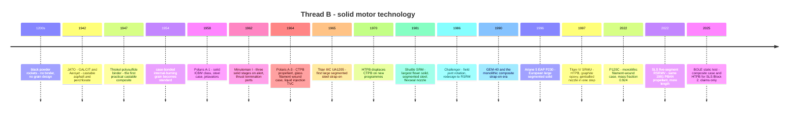
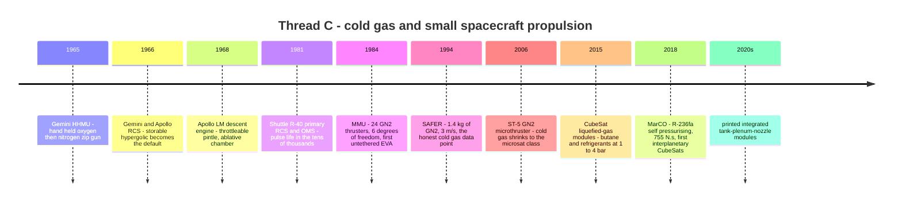

# Module 35 — Historical evolution of rocket propulsion
Part V · Prerequisites: Parts I–IV (modules 01–31) · Estimated time: 8 h

Somebody in a design review will eventually ask you why you are not proposing
a 400-bar full-flow staged-combustion engine, and if the only answer you have
is "that's hard", you will lose the room to whoever says it is easy. History is
the cheapest experimental data set in propulsion. Every architecture in this
course was tried, and most of them were tried more than once, in different
decades, by people with different materials and different budgets — and the
reason a given architecture won *when it won* is almost never the reason it is
attractive *now*. I have watched a programme spend two years rediscovering that
an oxidiser-rich turbine eats its own blades, a fact that cost the Soviet Union
roughly a decade in the 1950s and is written down. This module is the timeline,
but it is organised as an engineering argument: for each transition, what
physically changed, what enabling technology made the change possible, and what
programme pressure paid for it. If you can answer those three questions for
twenty transitions, you can make a defensible guess about the twenty-first.

---

## 1. Learning objectives

After this module you should be able to:

- Place any of about forty flown engines and motors on a dated timeline and
  name the immediate predecessor whose limitation it was built to remove.
- For a given transition (e.g. film-cooled double-wall → brazed tube wall),
  name the **enabling technology** and classify it as materials, manufacturing,
  analysis, propellant, or economics, and separately name the **programme
  pressure** that funded it.
- Explain why chamber pressure rose by a factor of ten in twenty years and then
  by a factor of two in the sixty years after, using cycle and materials
  arguments rather than a trend line.
- Decompose a measured specific-impulse difference between two engines into
  propellant, chamber-pressure, expansion-ratio and combustion-efficiency
  contributions, and state why that decomposition is path-dependent.
- State the sequence of solid-propellant binder families and case materials
  with dates, and quantify what each case-material step bought in propellant
  mass fraction and stage $\Delta v$.
- Explain the oxidiser-rich staged-combustion metallurgy bottleneck: what the
  failure mechanism is, why it delayed Western adoption by three decades, and
  what the Soviet solution was at the level the open literature supports.
- Distinguish a verified historical figure from a company claim, and present a
  claimed figure without laundering it into fact.
- Read a "performance versus year" scatter plot and say whether year is
  explaining the variance or a hidden architectural variable is.
- Argue, for a stated mission and decade, which of two competing architectures
  a rational engineer would have chosen *at the time*, and whether the same
  choice survives today.

---

## 2. Terminology

| term | symbol | SI unit | definition |
|---|---|---|---|
| Chamber pressure | $p_c$ | Pa | stagnation pressure at the injector face unless stated |
| Specific impulse | $I_{sp}$ | s | $c/g_0$; always tagged vacuum or sea level |
| Characteristic velocity | $c^*$ | m/s | $p_c A_t/\dot m$; a chamber-and-propellant figure of merit |
| $c^*$ efficiency | $\eta_{c^*}$ | — | measured $c^*$ over CEA-ideal $c^*$ at the same $p_c$, $r$ |
| Thrust coefficient | $C_F$ | — | $F/(p_c A_t)$; a nozzle figure of merit |
| Expansion ratio | $\varepsilon$ | — | $A_e/A_t$ |
| Mixture ratio | $r$ | — | oxidiser mass flow over fuel mass flow |
| Thrust-to-weight | $T/W$ | — | engine thrust over engine dry weight; must state which mass and which thrust |
| Propellant mass fraction | $\zeta$ | — | $m_p/(m_p+m_i)$ for a motor or stage |
| Cycle closure | — | — | whether turbine drive gas is exhausted overboard (open) or into the main chamber (closed) |
| GG | — | — | gas generator: open cycle, separate fuel-rich burner |
| ORSC | — | — | oxidiser-rich staged combustion: closed, oxygen-rich preburner |
| FRSC | — | — | fuel-rich staged combustion: closed, fuel-rich preburner(s) |
| FFSC | — | — | full-flow staged combustion: two preburners, all propellant passes a turbine |
| Expander (closed) | — | — | jacket-heated fuel drives the turbine, then enters the chamber |
| Expander bleed | — | — | jacket-heated fuel drives the turbine and is dumped overboard |
| Tap-off | — | — | turbine driven by hot gas bled from the main chamber |
| Enabling technology | — | — | the capability without which a transition is impossible, not merely harder |
| Programme pressure | — | — | the mission or budget requirement that paid for the transition |
| Film cooling | — | — | coolant injected along the wall to form a low-temperature gas layer |
| Tube wall | — | — | chamber formed from brazed thin-wall tubes carrying regenerative coolant |
| Channel wall | — | — | chamber formed from a liner with milled coolant channels and a closeout |
| L-PBF | — | — | laser powder-bed fusion additive manufacturing |
| DED | — | — | directed energy deposition (blown-powder) additive manufacturing |
| APCP | — | — | ammonium perchlorate composite propellant |
| PBAN / CTPB / HTPB | — | — | binder families: see module 19 §3 |
| Segmented case | — | — | motor case assembled from sections joined by field joints |
| Monolithic case | — | — | single-piece case, usually filament-wound composite |
| LITVC | — | — | liquid injection thrust vector control |
| Flexseal | — | — | laminated elastomer bearing allowing a nozzle to gimbal under pressure |
| Blowdown | — | — | unregulated gas feed in which tank pressure falls as propellant is used |
| Self-pressurising | — | — | liquefied propellant whose own vapour pressure feeds the thrusters |

---

## 3. Theory

### 3.1 How to read a technology history without lying to yourself

There are three claims you can make about a historical transition, and they
have very different evidential standards.

1. **"X happened in year Y."** A dated fact. Cheap, checkable, and the least
   interesting thing you can say.
2. **"X was enabled by Z."** An engineering claim. It is defensible only if
   you can show that without $Z$ the design is not merely worse but
   *impossible* — that some physical constraint is violated. A brazed tube-wall
   chamber is not enabled by "better engineering"; it is enabled by furnace
   brazing of thin-wall nickel-alloy tubes with controlled fillets, because
   without a reliable braze the chamber leaks at the first thermal cycle.
3. **"X happened because of programme pressure P."** A historical claim, and
   the one people get wrong most often, because engineers like to believe
   technology pulls itself along. It does not. Somebody paid. [J]

The useful discipline is to insist that every transition in the tables below
carries **both** an enabler and a pressure. Where I cannot name a genuine
enabler I say the transition was a **choice**, not a breakthrough — the
gas-generator cycle on RS-68 and Merlin is the clearest modern example, and
so is Europe's decision never to attempt staged combustion on Ariane
[SLPRE ch. 4].

Enablers in this module are classified into five families:

| family | examples in this module |
|---|---|
| **Materials** | NARloy-Z and GRCop copper alloys, D6AC steel, niobium and rhenium/iridium, ox-rich-passivating alloys and enamels, carbon–carbon and carbon-phenolic, Kevlar and graphite/epoxy |
| **Manufacturing** | furnace brazing, milled channel walls, filament winding, propellant casting at 100-tonne scale, L-PBF and DED additive manufacturing |
| **Analysis** | Bartz correlation and boundary-layer heat transfer, combustion-stability theory and baffle/cavity design, CEA equilibrium chemistry, finite-element grain structural analysis, CFD of injectors and turbines |
| **Propellant** | ethanol → kerosene → LH2 → storables → methane; polysulfide → PBAN → CTPB → HTPB; compressed gas → liquefied refrigerant |
| **Economics** | mass production, design-for-cost, reuse, commoditised launch |

A fair warning about the data. Much of what follows rests on
`reference/_verify-liquid.md` and `reference/_verify-solid-coldgas.md`, which
carry confidence labels and disagreements. Where a figure is a **company claim
for an engine still in development or without independent corroboration**, it
is labelled as a claim every single time it appears, including in the trend
tables. That is not pedantry: half the interesting recent data points are
claims, and a trend line fitted through unverified numbers is an opinion with
error bars drawn on it.

---

### 3.2 Thread A — liquid rocket engines, 1926–present

```mermaid
timeline
    title Thread A - liquid engine architecture, by first flight or first hot fire
    1926 : Goddard first liquid flight - LOX and gasoline, pressure fed
    1931 : VfR Repulsor and GIRD-09 - regenerative cooling first tried
    1942 : V-2 A-4 engine - turbopump, regen plus film cooling, 18 burner cups, 15.2 bar
    1950 : XLR43 Navaho - flat-face impinging injector replaces the 18 pots
    1957 : RD-107 R-7 - four chambers per turbopump, 60 bar
    1958 : Redstone A-7 and Thor and Atlas - brazed tube walls, kerosene, single-shaft pumps
    1962 : RL10 - closed expander, LOX and LH2, 32.8 bar
    1965 : RD-253 Proton - first flown oxidiser-rich staged combustion, 147 bar
    1965 : Titan LR87 storable - N2O4 and Aerozine 50, silo-ready
    1967 : F-1 and J-2 Saturn V - scale, coaxial LH2 injectors, instability programme
    1972 : NK-33 - ORSC at 148 bar and thrust-to-weight 137
    1979 : HM7B and Viking - Europe enters with GG hydrogen and water-cooled storables
    1981 : RS-25 SSME - fuel-rich staged combustion, 206 bar, reusable, milled copper liner
    1985 : RD-170 - ORSC at 245 bar, four chambers, reusable ambitions
    1987 : RD-0120 - Soviet large hydrogen FRSC at 219 bar
    1994 : LE-7 - Japan flies fuel-rich staged combustion
    1996 : Vulcain - Europe chooses gas generator on purpose
    1998 : LE-5A and LE-5B - expander bleed cycle invented and flown
    2000 : RD-180 imported to Atlas III and V - 267 bar
    2002 : RS-68 - design for minimum cost, 80 percent fewer parts
    2013 : Merlin 1D - pintle injector at production scale, reuse, 97 bar
    2015 : SuperDraco - first printed flight engine chamber
    2017 : Rutherford - electric pump fed, end-to-end additive manufacturing
    2021 : Raptor 2 - full-flow staged combustion on methane, 300 bar claimed
    2024 : BE-4 - first American oxidiser-rich staged combustion to fly
```

#### 3.2.1 Before the V-2 — Goddard, GIRD, and the VfR

Goddard's 1926 flight established only that a liquid rocket could be built at
all: LOX and gasoline, pressure-fed, a few seconds of burn, no cooling worth
the name. The genuinely important pre-war work was the discovery, arrived at
independently in the American, German and Soviet groups between 1929 and 1935,
that **the fuel can cool the chamber it is about to burn in**. Regenerative
cooling is the single idea that separates a rocket engine from a firework: it
converts a wall-temperature problem into a pressure-drop problem, and pressure
drop is something a pump can supply. [F] [SLPRE ch. 1–2]

What none of the pre-war groups had was a way to make a chamber that survived
more than a handful of firings. The limiting quantities are the ones you
derived in module 10: gas-side heat flux scales roughly as $p_c^{0.8}$
(Bartz), so at 15 bar the flux is manageable with mild steel and a generous
film-cooling fraction, and at 200 bar it is not manageable with anything except
a high-conductivity copper alloy and a thin wall. Every step in this thread is
downstream of that scaling. [E] [Bartz57]

#### 3.2.2 The V-2 and what it fixed and did not fix

The A-4 engine (1942) is the architectural vocabulary of everything after it:
turbopump, regeneratively cooled chamber, gimballed thrust (via jet vanes, but
the intent is there), a start sequence with a preliminary stage. Its numbers,
from `_verify-liquid.md`: 245 kN sea level, $p_c = 15.2$ bar (220 psia),
$\varepsilon \approx 3.5$, $I_{sp} \approx 203$ s sea level and ~239 s vacuum
(medium confidence — secondary tables span 199–210 s at sea level), dry mass
~1,126 kg, so $T/W \approx 22$. LOX with 75 % ethanol / 25 % water at
$r \approx 1.18$. [H]

Three design features are worth naming because they were all abandoned:

- **The 18 burner cups.** Eighteen separate pre-mixing centrifugal-swirl
  injection heads on a domed face, each a small engine. This kept combustion
  stable by keeping each combustion volume small, and it capped chamber
  pressure and made the chamber a manufacturing nightmare. Combustion
  efficiency was about 94 % of $c^*$.
- **The film-cooling fraction.** Four rings of holes injected roughly 10 % of
  the fuel along the wall. The regenerative jacket alone was insufficient; the
  film did most of the work, and paid for it in $I_{sp}$.
- **Hydrogen-peroxide steam turbine drive.** A third fluid — 80 % H₂O₂
  decomposed over permanganate — driving a 4,000 rpm single-shaft pump at about
  430 kW. It is a gas generator only in the loosest sense: no bipropellant
  burner, no mixture-ratio control problem, and a separate tank and its own
  handling hazards.

The V-2 is a materials-limited design pretending to be an architecture. The
water in the ethanol is there to hold flame temperature down to what mild steel
plus film cooling can survive. [J]

#### 3.2.3 The American line: Navaho → Redstone → Atlas/Thor, and the tube wall

The decisive American contribution is the **flat-face impinging injector**.
Rocketdyne's XLR43-NA-1 (first successful test 15 November 1950, 334 kN,
$p_c = 21.9$ bar / 318 psia, $\varepsilon = 3.61$, dry mass 668 kg) replaced the
eighteen pots with one flat face carrying concentric rings of drilled holes in
a fuel–oxidiser–fuel triplet pattern. The mass consequence is the headline:
**668 kg against the V-2's 1,126 kg for 34 % more thrust**, i.e. $T/W$ from 22
to about 51. Nothing about the propellant or the cycle changed. The whole gain
is manufacturing and injector architecture. [H]

The Redstone A-7 (1958) is the same engine industrialised: 369 kN sea level as
flown, $p_c$ unchanged at 21.9 bar, $I_{sp}$ 235 s sea level / ~265 s vacuum,
$T/W$ 56. Its innovation is explicitly *not* performance. Note also the
"which thrust?" trap recorded in `_verify-liquid.md`: 75,000 lbf is the
nameplate, 78,000 lbf includes ~3,000 lbf of steam-generator exhaust thrust,
and 82,977 lbf is the uprated engine as flown. All three are correct and they
mean different things.

The **brazed tube-wall chamber** is the enabling manufacturing technology of
the whole American 1950s–60s fleet. Instead of a double-wall shell with an
annular gap, the chamber is a bundle of tapered thin-wall tubes, brazed
together, each carrying coolant. Three things follow immediately:

1. The coolant channel cross-section can be tailored station by station, so the
   coolant velocity is highest where the heat flux is highest (throat).
2. The pressure-containing structure and the heat-transfer structure become the
   same part, which removes the double-wall gap tolerance problem that limits
   $p_c$ in a V-2-style jacket.
3. It is mass-producible. The F-1 chamber is 178 tubes; the RS-25 nozzle is
   1,080. [M] [SP-8087]

With tube walls, kerosene (RP-1) instead of ethanol, and single-shaft
turbopumps, the American booster engines of 1958–1967 move from 22 bar to
40–70 bar and from $I_{sp,SL}$ 235 s to 263 s. The Rocketdyne lineage is
continuous: XLR43 → A-6/A-7 → S-3D (Thor/Jupiter) → LR-89/LR-105 (Atlas,
~40 bar, 259 s SL booster) → H-1 (43.6–48.3 bar, 255 s SL, 289 s vac,
deliberately cost-engineered) → RS-27/RS-27A (48 bar, an assembled-from-the-
parts-bin engine with no innovation, by design) → F-1. [SLPRE ch. 3]
[Hunley07 ch. 3–5]

#### 3.2.4 Titan and the storables

The Titan LR87/LR91 line answers a different question: not "how efficient?" but
"how long can it sit in a silo?" Converting the LR87 from LOX/RP-1 to
N₂O₄/Aerozine 50 gives up roughly 13 s of vacuum $I_{sp}$ (302 s vs the
kerolox class's ~310 s at similar $\varepsilon$) and buys indefinite storage,
hypergolic ignition with no igniter, and a start sequence with essentially no
failure modes. LR87-AJ-11: 968.4 kN sea level, $p_c = 59.1$ bar, $I_{sp}$
250 s SL / 302 s vac, $\varepsilon = 15$, dry mass 700 kg, $T/W \approx 141$.
LR91-AJ-11: 467 kN vacuum, 59.3 bar, 316 s, $\varepsilon = 49.2$, with a
**regeneratively cooled chamber and a separate ablative skirt** — a cost/mass
split that reappears sixty years later on RS-68. [H]

The programme pressure here is not space at all; it is missile alert rates, and
the entire storable-propellant industry — including everything in module 05's
hypergolic section and every spacecraft thruster in §3.4 below — exists because
of it. [Clark] is the honest account of how the propellant chemistry got
selected, and it should be read for the reasoning, not the numbers.

#### 3.2.5 Saturn: scale, hydrogen, and the instability programme

The F-1 (first flight 1967) is not architecturally novel. It is a
gas-generator LOX/RP-1 engine with a tube-wall chamber and an impinging
injector — 1950s technology at 6,770 kN sea level. Everything hard about it is
scale: 8,400 kg dry, $T/W = 94.1$, $\varepsilon = 16$, $I_{sp}$ 263 s SL /
304 s vac, and a chamber pressure whose published value is genuinely contested
(965 / 982 / 1,015 / 1,125 psia; **print ≈70 bar / 1,015 psia at the injector
end and footnote the range**, because the spread is a measurement-station and
programme-phase artefact, not a disagreement about the hardware).

The enabling work was **analysis and test methodology for combustion
instability**, not materials. Rocketdyne ran on the order of two thousand
full-scale injector tests with bomb-pulsed stability rating, and converged on a
baffled, mixed doublet-and-triplet face. The output of that programme is the
design methodology in [SP-194] and the reason your instability module exists.
The cost was schedule and money on a scale no commercial programme has since
repeated. [H] [SP-4206 ch. 4–5] [OY93]

The J-2 (1966) is the more consequential engine. LOX/LH2, gas generator,
1,033 kN vacuum, $p_c = 52.6$ bar, $\varepsilon = 27.5$, $I_{sp} = 421$ s,
dry mass 1,788 kg. Its enabling technologies were:

- **Coaxial (concentric shear) injection**, 614 hollow oxidiser posts with
  annular hydrogen. Impinging elements do not work well with a gas-phase fuel
  600 times less dense than the liquid oxidiser; the coaxial element replaces
  impingement momentum exchange with shear-driven atomisation of the LOX jet by
  the high-velocity hydrogen annulus. Every hydrogen engine since uses it.
- **Cryogenic hydrogen handling as an operational discipline** — tankage,
  insulation, chilldown, materials embrittlement. This is what [SP-4404] and
  [SP-4230] are about, and it took NACA/NASA Lewis and the Centaur programme
  roughly fifteen years.
- **Restart in flight**, which is why the S-IVB could do trans-lunar injection.

The H-1, meanwhile, is the economics data point: eight engines per S-IB stage,
deliberately engineered for production cost rather than performance, and it is
the direct ancestor of the RS-27 that flew Delta for thirty years. [SP-4206]

#### 3.2.6 RL10 and the expander cycle (1962)

The RL10 is the first flight LOX/LH2 engine of any kind and the first closed
expander. There is no preburner and no gas generator: hydrogen picks up heat in
the chamber jacket, expands through the turbine, and is then injected and
burned. RL10A-3-3A: 73.4 kN vacuum, $p_c = 32.8$ bar (475 psia),
$\varepsilon = 61$, $I_{sp}$ 444–445 s, $r = 5.0$, geared single-shaft
turbopump.

The chamber pressure is low **by construction**, and this is the cleanest
example in the course of a cycle imposing a physical ceiling. Turbine power
available scales with the heat picked up in the jacket, which scales roughly
with chamber surface area, i.e. with a characteristic length squared; the pump
power demanded scales with mass flow times pressure rise, i.e. with area times
pressure. Push $p_c$ up and the required pump power grows faster than the
available jacket heat. That is the closed expander's thrust and pressure
ceiling, and it is why the RL10's descendants either stay small (Vinci at
180 kN and 60 bar, RD-0146 at 68.6 kN and 59 bar) or abandon closure
(expander bleed). [F] [SB §6.6] [SP-125 §4]

The RL10 family is also the best long-baseline example of *nozzle* progress
rather than *chamber* progress: RL10A-3-3A $\varepsilon = 61$ at 444 s (1963);
RL10B-2 with a deployable carbon–carbon extension at 285:1 deployed / 77:1
retracted, 465.5 s (1998) — the highest specific impulse of any flown chemical
rocket engine; RL10C-1 at 130:1 fixed, 449.7 s (2014), an industrial
consolidation rather than a performance step. Note that RL10B-2's and RL10C-1's
chamber pressures are **not published** by the manufacturer; do not guess them.

#### 3.2.7 The Soviet path: Glushko, four chambers, and oxidiser-rich closure

The Soviet line diverges early and for good reasons.

**Multi-chamber-per-turbopump.** The RD-107/RD-108 (first flight 15 May 1957)
put four combustion chambers on one turbopump. At the time, chamber diameter
was limited by combustion stability — a large single chamber has low-order
acoustic modes that couple to the combustion, exactly the problem that cost the
F-1 programme years. Four small chambers have their acoustic modes at four
times the frequency and much lower gain. The Soviets bought stability with
plumbing; the Americans bought it with a decade of injector development.
Both answers are defensible; the Soviet one shipped in 1957. RD-107A: 839 kN
SL, $p_c = 60$ bar, $I_{sp}$ 263.3 s SL / 320.2 s vac, dry mass 1,190 kg for
the whole four-chamber assembly, $T/W \approx 72$. [H] [SLPRE ch. 6]

**Oxidiser-rich staged combustion.** The RD-253 (first flight July 1965,
Proton) is the first flown ORSC engine: N₂O₄/UDMH, $p_c = 147$ bar, 1,470 kN
sea level, $I_{sp}$ 285 s SL / 316 s vac, $\varepsilon = 26.2$, dry mass
~1,070–1,080 kg, **$T/W = 156$**. Read that thrust-to-weight against the F-1's
94 and the RS-25's 73 and you have the entire argument for ORSC in one number.

Why oxidiser-rich rather than fuel-rich? Two reasons, both physical:

1. With a hydrocarbon fuel, a fuel-rich preburner at useful turbine
   temperatures deposits carbon (coking) on turbine blades and in the injector
   passages. An oxygen-rich preburner does not coke. For hydrogen there is no
   coking problem, which is exactly why the American and Soviet **hydrogen**
   staged-combustion engines (RS-25, RD-0120, LE-7) are fuel-rich and the
   **kerosene** ones (RD-253, RD-170, RD-180, NK-33, YF-100) are oxidiser-rich.
2. Oxygen-rich drive gas is denser and cooler for a given turbine power, so the
   turbomachinery is small. That is where the 156:1 comes from.

The price is that hot, high-pressure oxygen attacks essentially every
structural metal, and once ignition starts in an oxygen-rich passage it
propagates. This is the **metallurgy bottleneck** of §3.5.7. Glushko's solution
— passivating enamels and specific alloy selections — was closely held, and the
absence of it is the reason no American ORSC engine flew until the BE-4 in
2024, fifty-nine years after the RD-253. [H] [M]

The rest of the Soviet line follows from those two decisions:

| engine | first flight | $p_c$ (bar) | thrust SL (kN) | $I_{sp}$ SL/vac (s) | $T/W$ | note |
|---|---|---|---|---|---|---|
| RD-107A | 1957 | 60 | 839 | 263.3 / 320.2 | ~72 | 4 chambers, H₂O₂ steam drive |
| RD-253 | 1965 | 147 | 1,470 | 285 / 316 | 156 | first flown ORSC |
| NK-33 | 1972 (NK-15 1969) | 148.3 | 1,510 | 297 / 331 | 137 | ORSC, aviation design practice |
| RD-170 | 1985 | 245.2 | 7,250 | 309 / 337 | 82 | 4 chambers, 1 turbopump, ~170–190 MW |
| RD-0120 | 1987 | 219 | 1,526 | 354 / 455 | 57.9 | LH2, FRSC, single-shaft |
| RD-180 | 2000 | 267 | 3,830 | 311 / 338 | 78.4 | half an RD-170 |
| RD-191 | 2014 | 258 | 1,920 | 310.7 / 337 | 89 | single chamber |

The RD-170's turbopump — one shaft feeding four chambers at 245 bar, drawing
somewhere between 170 and 190 MW (the same Wikipedia article gives both; print
the range) — is the most powerful rocket turbopump ever built. The RD-180 is
that machine halved, and it is the highest chamber pressure of any engine
independently documented in this course's reference file.

Two cautions from `_verify-liquid.md` that matter for every US–Soviet
comparison you will ever make: American Apollo-era practice quotes
**injector-end** chamber pressure and Russian practice quotes **nozzle
stagnation** pressure, which is a few percent lower, so 267 versus 206 bar
slightly overstates the gap; and the RD-170 out-thrusts the F-1 in total but
across four chambers, so **the F-1 remains the highest-thrust single-chamber
engine ever flown**. State which record you mean, every time.

#### 3.2.8 The Shuttle main engine: closure, reuse, and 206 bar

The RS-25 (contract 1971, first engine test 1977, first flight 1981) is
fuel-rich staged combustion with two independent preburners, dual shafts, and
the following: 2,279 kN vacuum at 109 % power level, $p_c = 206.4$ bar
(2,994 psia), $I_{sp}$ 452.3 s vac / 366 s SL, $r = 6.03$, throttle 67–109 %.
Dry mass is **contested**: 3,177 kg (Wikipedia, bare) versus 3,526 kg
(L3Harris, installed), which is why the published $T/W$ of 73.1 becomes ~66
on the manufacturer's mass. The expansion ratio is the classic contested
figure: **69:1 geometric** per the manufacturer, with ~77.5:1 widely quoted in
the analysis literature; print 69:1 and footnote the other.

Its enabling technologies, in order of how hard they were:

- **A milled-channel copper-alloy liner.** 390 channels machined into a
  **NARloy-Z** (Cu–Ag–Zr) liner with an electroformed nickel closeout. At
  206 bar the Bartz throat heat flux is of order 100 MW/m², and no steel or
  nickel wall survives it; you need the conductivity of copper and a wall thin
  enough that the through-wall $\Delta T$ stays inside the alloy's low-cycle
  fatigue capability, which then forces you to solve the "blanching" and
  creep-ratchetting problems that copper has and steel does not. [GRCop]
  [SP-8087]
- **Turbomachinery at absurd power density.** HPFTP: three-stage centrifugal,
  ~35,360 rpm, 53 MW from a unit the size of a car engine. The bearing and
  rotordynamic failures during development are catalogued honestly in
  [Biggs89], and that document is the best answer available to "how much does
  a staged-combustion engine cost to develop?"
- **Reusability as a requirement, not an aspiration**, which drove
  instrumentation, inspection and the engine controller.

The verdict is written in the programme: the RS-25 is now flown **expendably**
on SLS. Reusable staged combustion at 206 bar was achieved and it was not
economic in that form. That is a real result, not a failure of nerve. [J]

#### 3.2.9 Europe and Japan: deliberate architectural conservatism

Europe's Ariane line is the best available controlled experiment in *choosing
not to*. Viking (Ariane 1–4, from 1979): N₂O₄ with UDMH or UH 25, gas
generator, $p_c$ 55–58 bar, $I_{sp,vac}$ 281–301 s — and **water cooling**, with
a dedicated water tank and a third pump coaxial on the turbopump shaft. It is
the canonical "there are more than four cooling methods" example, and it
produced **two failures in 958 engines across 144 launches**. HM7B (1979):
gas-generator hydrogen, only 37 bar, but $\varepsilon = 83.1$ and 444.6 s
vacuum from 165 kg of engine. Vulcain 1 (1996) and Vulcain 2 (2002): gas
generator by explicit decision, 100 and 117.3 bar, 431 and 429 s.

Note the Vulcain 1 → 2 result carefully, because it is counter-intuitive and it
is a real lesson: **chamber pressure went up and vacuum $I_{sp}$ went down**
(431 → 429 s), because the mixture ratio was richened from 5.3 to 6.1 to buy
density and thrust. The engine optimum and the vehicle optimum are different
optima. Vulcain 2.1 (2018-ish) goes further in the same direction: it is a
*manufacturing* change — a nozzle with 90 % fewer parts and ~40 % lower cost —
and its thrust is slightly *lower* than Vulcain 2's. Vinci (first flight
9 July 2024, after a 26-year development) is Europe's closed expander:
180 kN, 60 bar, 457.2 s, $\varepsilon = 240$ with a deployable extension.

Japan's line is the most interesting technically, because Japan **invented a
cycle**. LE-7 (1994) and LE-7A (2001) are fuel-rich staged combustion at 127
and 120 bar — note the LE-7A runs at *lower* pressure than the LE-7, a
deliberate reliability-driven de-rating after the H-II Flight 8 turbopump
inducer failure. But the LE-5A/5B and LE-9 are **expander bleed**: the jacket
heats a *portion* of the fuel, drives the turbine, and dumps it overboard. The
Isp penalty is small and explicit (LE-5B 446.8 s versus LE-5A's 452 s) and in
exchange the cycle escapes the closed expander's thrust ceiling entirely,
because the turbine no longer has to be fed by the entire fuel flow. The LE-9
(1,471 kN vacuum, 100 bar, 426 s, $\varepsilon = 37$) is a booster-class engine
with no preburner and no gas generator, which would have been considered
impossible in 1970. [M]

#### 3.2.10 The 1990s expendables and the cost turn

Two engines define the 1990s American position, and neither is a performance
step:

- **RS-68** (first flight 2002): LOX/LH2, **gas generator**, 102.6 bar,
  $\varepsilon = 21.5$, $I_{sp}$ 365 s SL / 410 s vac (RS-68A 411.9 s), dry
  mass 6,600–6,740 kg, $T/W$ 45–47 — the lowest of any modern large engine.
  It was designed under an explicit "minimum cost" brief with roughly 80 %
  fewer parts than the RS-25, and it uses an **ablative** nozzle downstream of
  a regeneratively cooled chamber. Accepting a worse engine to get a cheaper
  one is a legitimate systems answer, and RS-68 is the reference case for it.
- **RD-180 import** (2000): rather than develop a domestic high-pressure
  kerolox engine, Atlas III/V bought Russian ORSC hardware. That decision
  bought two decades of the best booster-engine performance in the world and
  ended with a geopolitical supply cut, which is a failure mode you will not
  find in [SB] but which killed a launch vehicle line all the same.

#### 3.2.11 SpaceX, the pintle, and the economics enabler

Merlin 1D (first flight 2013; Block 5 rating from 2018): LOX/RP-1, gas
generator, 845 kN SL / 981 kN vac, $p_c = 97$ bar (company figure),
$\varepsilon = 16$ (SL) or 165 (MVac), $I_{sp}$ 282 s SL / 311 s vac
(MVac 348 s vac), dry mass 470 kg, **$T/W = 184$** — the highest of any flown
orbital-class engine. Single-shaft dual-impeller turbopump at ~36,000 rpm.

On the performance axis Merlin is unremarkable: an open-cycle kerolox engine at
97 bar will never be efficient, and SpaceX did not try to make it one. What is
novel is:

- **The pintle injector at production scale.** A single central pintle post
  with an annular sheet impinging on a radial one. It is inherently
  throttleable, inherently stable (the recirculation structure it creates does
  not support the transverse acoustic coupling that kills flat-face injectors),
  and it is *one part* instead of thousands of drilled orifices. SpaceX traces
  it directly to the TRW Lunar Module descent engine — the same lineage,
  six decades on. [Dressler00]
- **Cadence.** Hundreds of engines a year. No other liquid-engine programme has
  matched it, and the manufacturing rate is what makes reuse economically
  meaningful rather than merely possible.
- **Recovery and reflight**, which changes the objective function of engine
  design from "minimum mass for one flight" to "minimum cost per flight over
  N flights", and therefore changes what margin is worth.

The enabler here is **economics and manufacturing**, not physics. Nothing in
Merlin could not have been built in 1975. [J]

#### 3.2.12 The additive-manufacturing turn

| year | milestone | process | significance |
|---|---|---|---|
| 2014 | SuperDraco qualification (first flight, pad abort, 6 May 2015) | L-PBF Inconel | first printed **flight** engine chamber; 71 kN, $p_c$ 69 bar, regeneratively cooled hypergolic — all three of those are unusual together |
| 2016–17 | Rutherford flight qualification (Mar 2016), first flight 25 May 2017 | L-PBF, essentially the whole engine | electric pump-fed, 24.9 kN SL, 35 kg dry, $T/W$ 72.8 engine-only (batteries excluded) |
| 2018– | NASA MSFC AM combustion-device programme | L-PBF + DED | hot-fire data across injectors, chambers, nozzles [Gradl18] |
| 2020– | RAMPT | blown-powder DED + composite overwrap | large channel-wall nozzles and chambers, the size class AM could not previously reach [RAMPT] |
| 2020s | Relativity Aeon, Rocket Lab Archimedes, Raptor 3 | mixed | AM as the default fabrication route rather than a novelty |

What AM actually changes, mechanically, is **part count and internal geometry
freedom**, not material properties — printed GRCop and Inconel are generally
somewhat *worse* than wrought equivalents in fatigue and require hot isostatic
pressing and careful qualification [GradlAM]. The wins are:

- An injector that was 200 brazed parts becomes one part, and the brazed joints
  that used to be the leak and failure population disappear.
- Coolant channels can be curved, variable-section and closed out in one build,
  which removes the closeout braze or electroform that limited channel-wall
  chambers.
- Iteration time collapses from months to weeks, which changes how much
  development *testing* you can afford — the real lever, since propulsion
  development cost is dominated by test campaigns.

The honest caveats: part-to-part variability is the qualification problem, not
average properties; surface roughness in small coolant channels changes both
friction factor and heat transfer relative to a machined channel, in
directions that partly cancel and must be measured; and AM has not so far
raised anybody's chamber pressure. It lowered cost and schedule. [R]/[M]
[GradlAM ch. 1, 9]

#### 3.2.13 The methane era, and why methane now

Methane was studied in the 1960s and rejected. What changed is not the
propellant — CH₄'s properties have been in the tables the whole time — but the
objective function.

From module 05's CEA table: LOX/CH₄ at $r = 3.45$ gives $c^* = 1{,}832$ m/s,
$I_{sp,vac} \approx 360$ s at $\varepsilon = 40$, bulk density 825 kg/m³;
LOX/RP-1 gives 1,792 m/s, ~355 s, and 1,026 kg/m³; LOX/LH2 gives 2,287 m/s,
~442 s, and 362 kg/m³. Methane sits between kerosene and hydrogen on $I_{sp}$
and much closer to kerosene on density. On $I_{sp}$ alone that is not a
compelling reason to change. The reasons that *are* compelling all come from
reuse and operations:

1. **No coking.** RP-1 cracks and deposits carbon in cooling channels and on
   injector faces. Between flights that means inspection or replacement.
   Methane does not coke, so a methane engine can be reflown with far less
   attention — this is the single biggest argument and it only exists if you
   intend to reuse the engine.
2. **A usable cooling fluid.** Methane's heat capacity and its supercritical
   behaviour at chamber-jacket conditions make it a better regenerative coolant
   than kerosene, which matters more the higher $p_c$ goes.
3. **It permits fuel-rich staged combustion without coking**, which is the
   precondition for FFSC (you need *both* a fuel-rich and an oxidiser-rich
   preburner). With kerosene, FFSC is a coking problem on one side; with
   hydrogen, density and tank volume are the problem; methane is the
   combination that closes.
4. **Common-temperature propellants.** LOX at 90 K and LCH₄ at 112 K share a
   thermal regime — common bulkheads, common insulation, simpler ground
   systems — where LOX/LH2 does not.
5. **In-situ production on Mars** is the stated SpaceX rationale, and it is a
   real one for that mission and irrelevant for everyone else. [J]

| engine | status | cycle | $p_c$ | evidentiary status |
|---|---|---|---|---|
| Raptor 2 / 3 | flying | FFSC | 300 / 330 bar | **SpaceX claim.** Thrust has indirect corroboration via FAA documents and third-party telemetry analysis; $p_c$, $I_{sp}$, dry mass and $T/W$ have **none**. Several figures originate in social-media posts. |
| BE-4 | flying (2024) | ORSC | 140 bar | Company figure. Deliberately *low* $p_c$ for an ORSC engine — a life and margin choice. Hydrostatic bearings, ~56 MW turbopump. |
| Prometheus | unflown | gas generator | 100 bar | ESA/ArianeGroup target. Cost is the primary design variable. |
| Archimedes | unflown | ORSC | not published | Rocket Lab claim; deliberately de-rated ORSC. |
| YF-215 (Chinese FFSC) | development | FFSC claimed | not reliably published | **Not in this course's verified reference file.** Treat every circulating figure as unverified; the architecture claim is all that can be repeated. |

Raptor is the frontier *and* the object lesson. Present it as both.

#### 3.2.14 Thread A — what changed and what enabled it

| # | transition | what physically changed | enabling technology | class | programme pressure |
|---|---|---|---|---|---|
| A1 | Uncooled → regeneratively cooled (1929–35) | wall heat load carried away by the fuel | thin-wall jacket fabrication; recognition that $\Delta p$ is cheap | manufacturing | none yet — private and army research |
| A2 | Pressure-fed → turbopump-fed (V-2, 1942) | tank pressure decoupled from $p_c$ | H₂O₂/permanganate steam turbine; centrifugal pump design | materials + propellant | German ballistic-missile programme |
| A3 | 18 burner cups → flat-face impinging injector (XLR43, 1950) | one combustion volume instead of 18 pre-mixers; engine mass halved | precision drilling and manifold design; impinging-jet mixing understanding | manufacturing + analysis | Navaho / USAF cruise-missile work |
| A4 | Double-wall jacket → brazed tube wall (Atlas/Thor/H-1/F-1, 1955–67) | coolant velocity tailored station by station; wall is the structure | furnace brazing of thin-wall tubes | manufacturing | ICBM programmes, then Apollo |
| A5 | Ethanol/water → RP-1 (1955–58) | higher $T_0$ and $c^*$; higher density | refined kerosene specification (thermal stability, low olefins) | propellant | ICBM range requirement |
| A6 | LOX/RP-1 → storables (Titan II, 1962) | indefinite storage, hypergolic start | N₂O₄ and hydrazine-family production and handling | propellant | silo alert-rate requirement |
| A7 | Single chamber → four chambers per pump (RD-107, 1957) | acoustic modes moved up in frequency; stability bought geometrically | none required — an architectural choice | (choice) | R-7 schedule; unwillingness to fight instability |
| A8 | Hydrocarbon → LOX/LH2 (RL10 1962, J-2 1966) | $c^*$ from ~1,790 to ~2,290 m/s | cryogenic hydrogen handling, coaxial shear injectors, tube-wall H₂ jackets | propellant + analysis | upper-stage $\Delta v$ for lunar mission |
| A9 | Open cycle → closed expander (RL10, 1962) | no turbine exhaust dumped | jacket heat balance analysis; small high-speed geared pumps | analysis | Centaur upper-stage performance |
| A10 | Open cycle → ORSC (RD-253, 1965) | all propellant burned in the main chamber at 147 bar; $T/W$ 156 | **ox-rich-compatible alloys and passivating coatings** | materials | Proton heavy-lift; Glushko's institutional bet on storables |
| A11 | Scale to 6.8 MN single chamber (F-1, 1967) | one chamber at 1.5 Mlbf | bomb-pulsed stability rating methodology, baffled injector | analysis | Apollo schedule, effectively unlimited budget |
| A12 | Tube wall → milled-channel copper liner (RS-25, 1981) | ~100 MW/m² throat flux survivable | NARloy-Z; electroformed nickel closeout; LCF life prediction | materials + manufacturing | Shuttle reusability requirement |
| A13 | Expendable → reusable staged combustion (RS-25, 1981) | inspection, controller, life-limited parts | engine controller, instrumentation, HPFTP redesigns | analysis + materials | Shuttle flight-rate promise (unmet) |
| A14 | Closed expander → expander bleed (LE-5A 1991, LE-9 2023) | turbine sized independently of total fuel flow | jacket/turbine matching analysis; accepting a small $I_{sp}$ dump loss | analysis | Japanese need for a cheap, safe large upper/first stage |
| A15 | Performance-optimal → cost-optimal (RS-68, 2002) | 80 % fewer parts, ablative nozzle, $T/W$ 45 | design-to-cost discipline; accepting ablative loss | economics | EELV competition |
| A16 | Domestic development → import (RD-180, 2000) | 267 bar bought, not built | post-Soviet technology transfer | economics | EELV cost and schedule |
| A17 | Drilled-face → pintle at production scale (Merlin, 2013) | one injector part; throttling and stability by geometry | TRW pintle heritage [Dressler00]; CNC and flow-test capacity | manufacturing | commercial launch cost |
| A18 | Expendable → recovered and reflown (Falcon 9, 2015–) | objective function becomes cost per flight | landing GNC, engine restart, thermal margin for reentry | economics | commercial launch cost |
| A19 | Machined/brazed → additive (SuperDraco 2014, Rutherford 2017) | part count collapse; internal geometry freedom | L-PBF, then DED for large parts; AM qualification methodology | manufacturing | schedule and unit cost for small launch |
| A20 | Turbine → electric pump (Rutherford, 2017) | no turbine, no power-cycle propellant loss | Li-polymer energy density and brushless motor power density | materials (batteries) | small-launch simplicity |
| A21 | Kerolox/hydrolox → methalox (BE-4 2024, Raptor 2021) | no coking; better coolant; FFSC becomes closable | none new — a propellant/objective choice enabled by the reuse requirement | propellant + economics | rapid reuse; Mars ISRU (SpaceX-specific) |
| A22 | ORSC/FRSC → FFSC (Raptor, 2021) | both preburners; no fuel-oxidiser dynamic seal between turbine and pump | methane; AM; decades of ORSC and FRSC experience | propellant + manufacturing | Starship reuse cadence |

---

### 3.3 Thread B — solid rocket motors

#### 3.3.1 From black powder to a castable composite

Black powder is a pressed, mechanically weak, low-$I_{sp}$ propellant whose
grain cannot be shaped into anything that produces a controlled thrust trace at
useful scale. The whole of modern solid propulsion follows from one idea:
**make the propellant a filled polymer, cast it into the case, and bond it to
the insulation.** That converts the grain from a stack of pressed increments
into a structural, machinable, case-bonded elastomeric composite with a design
surface. [Kubota ch. 4] [Davenas ch. 1]

The first step was the JATO work at GALCIT (1942) and the Aerojet/Thiokol
industrialisation that followed: asphalt-and-perchlorate, then **polysulfide**
binders from the late 1940s — the first genuinely castable composite. The
binder progression that follows is in module 19 §3 and is driven by mechanical
properties and solids loading, **not by energy**:

| binder | era | solids loading | low-T strain | representative motor |
|---|---|---|---|---|
| polysulfide | 1940s–50s | ~75 % | poor | early JATO, Sergeant heritage |
| PBAA/PBAN | 1960s–present | ~86 % | fair | Titan UA120, Shuttle SRM, SLS RSRMV |
| CTPB | 1960s–70s | ~87 % | good | Polaris A-3 class |
| HTPB | 1970s–present | ~88–90 % | very good | SRMU, GEM family, P120C, Vega |
| energetic (NEPE and relatives) | 1980s– | comparable | variable, generally worse | Trident II D-5 |

The mechanism, spelled out because "better mechanical properties" is a banned
sentence: the isocyanate–hydroxyl cure of HTPB is close to stoichiometric and
produces a controllable, uniform network, whereas carboxyl cures interact with
the filler surface — and the filler is ~87 % of the material — so the network
has more mechanically inert chain ends. A more uniform network at the same
crosslink density fails at higher strain. Separately, low-viscosity HTPB
prepolymers allow a higher solids loading before the mix becomes uncastable,
and every extra point of solids is roughly a point of density and a fraction of
a second of $I_{sp}$. [E] [Davenas ch. 2–3]

#### 3.3.2 Polaris, the composite case, and the submarine constraint

Polaris is where solids became strategic. The programme pressure is brutally
specific: a missile must fit inside a submarine hull, be launched from
underwater, and be stored for years in a salt-spray environment with no
maintenance access. Liquids lose this argument on every count.

The technology arc, at the architecture level the open literature supports:

| system | decade | propellant family | case | nozzle/TVC |
|---|---|---|---|---|
| Polaris A-1 | late 1950s | polyurethane/PBAA-class AP composite | steel | four rotatable nozzles with jetavators |
| Polaris A-2 | early 1960s | AP composite | steel; glass-filament-wound 2nd stage | jetavators |
| Polaris A-3 | mid 1960s | CTPB-class | glass filament wound | liquid injection TVC |
| Poseidon C-3 | late 1960s–70s | nitramine-loaded composite | glass filament wound | LITVC |
| Trident I C-4 | late 1970s | high-energy composite | Kevlar/epoxy | single gimballed nozzle; extendable nozzle |
| Trident II D-5 | 1980s–90s | NEPE-75 | graphite/epoxy (Kevlar on stage 3 until 1988) | single gimballed graphite-composite nozzle |

Two arcs, and nothing more should be taught from this material:

1. **Nozzle control**: jetavators (simple, lossy — you are putting a body in
   the exhaust) → liquid injection (no moving nozzle, but you carry injectant
   mass and get a nonlinear side-force characteristic) → a single gimballed
   flexseal nozzle (efficient, no injectant, but requires an elastomeric
   bearing that survives decades of storage). Replacing four nozzles with one
   is a large inert-mass and complexity win.
2. **Case material**: steel → glass filament wound → Kevlar/epoxy →
   graphite/epoxy, each step roughly a 20–30 % case-mass reduction at equal
   burst pressure. This progression alone accounts for a large part of the
   range growth from A-1 to D-5, independent of chemistry.

The Trident "aerospike" is a telescoping **drag-reduction spike** deployed from
the nose, not an aerospike nozzle. Students confuse these every year. [H]

Minuteman adds the architectural feature worth teaching from ICBMs: **thrust
termination ports** on the upper stage — shaped charges open the forward dome,
chamber pressure collapses, thrust ends. A solid motor *can* be shut down, at
the cost of a violent, one-shot, structurally destructive event. That is the
honest answer to "solids can't be turned off."

#### 3.3.3 Segmented steel: Titan, Shuttle, and the transport constraint

The large segmented motor exists because of **railcars and factories**, not
because segmenting is good. You cannot cast a 500-tonne grain in one piece and
ship it, so you cast segments, ship them, and join them at the launch site with
field joints. Everything bad about the architecture follows from the joints.

Titan's UA1205 (Titan IIIC, 1965): 3.05 m diameter, five segments, steel case,
PBAN, **LITVC with N₂O₄ injected through the exit cone**, thrust-termination
ports retained for the crewed configurations. The Shuttle SRM/RSRM: 3.71 m,
four flight segments (eleven casting segments), three field joints, D6AC steel
at ~12.7 mm nominal wall, PBAN/AP/Al at AP 69.6 %, Al 16 %, Fe₂O₃ 0.4 %,
PBAN 12.04 %, epoxy 1.96 %; 14.7 MN max thrust per motor at sea level,
$p_c \approx 6.25$ MPa, $I_{sp}$ 242 s SL / 268 s vac, ~500 t propellant,
~590 t gross, so $\zeta \approx 0.847$. Forward segment an 11-point star,
aft segments double-truncated-cone, to hold the thrust trace inside the max-Q
structural box.

**Challenger (28 January 1986) and the redesign** is the case study that
belongs in every propulsion curriculum, and the correct framing is not "an
O-ring failed":

- **Mechanism.** Under ignition pressurisation the tang-and-clevis joint
  *rotated*: the legs deflected apart and momentarily opened the gap the
  O-rings had to seal. The seal was therefore rate-dependent — the elastomer
  had to extrude into an opening gap faster than the gap opened — and the
  extrusion rate of a fluorocarbon elastomer is strongly temperature-dependent.
- **Symptom.** Cold-stiffened rings failed to seat in the aft field joint of
  the right-hand booster; hot gas blew by, burned through, and the plume
  impinged on the External Tank and its aft attachment.
- **Evidence.** Recovered hardware, blow-by soot on prior flights' joints, and
  the O-ring resiliency-versus-temperature test data — the point being that the
  evidence of the mechanism existed *before* the accident and was managed
  rather than fixed. [Rogers86 ch. IV]
- **Fix.** A **capture feature** on the tang — an inner lip engaging the inside
  clevis leg that mechanically limits rotation — plus a third O-ring on that
  feature, redesigned joint insulation, and joint heaters. The fix is
  **geometric**: the seal was not the problem; the rotation was the problem.

Every subsequent large solid design treats joint rotation as a primary load
case, and the cheapest way to have no joint-rotation load case is to have no
field joints. Which brings us to the composite monolith.

#### 3.3.4 Monolithic composite and the mass-fraction payoff

Titan IV's SRMU (1997) is the cleanest side-by-side in the field: same vehicle,
same job, same diameter class, and simultaneously PBAN → HTPB, steel →
graphite/epoxy, LITVC → gimballed nozzle, and 5–7 segments → 3. Roughly +14 s
of $I_{sp}$ and a large inert-mass saving. The development was famously
troubled — a case failed in a 1991 structural test, killing a worker, and the
programme slipped years — which is itself the lesson about changing four
architectural variables at once.

P120C (Vega-C first stage and Ariane 6 strap-on, first flight 13 July 2022) is
the modern end state: **monolithic filament-wound carbon-fibre case, no
segments, no field joints**, HTPB 1912 (Al 19 %, AP 69 %, HTPB 12 %),
electromechanical TVC on a flexseal nozzle, ~4,780 kN max vacuum thrust,
$I_{sp} \approx 280$ s, 141,400 kg propellant in 153,000 kg gross —
**$\zeta = 0.924$**. Against the Shuttle SRM's 0.847, that is the single most
useful number-pair in the solid-motor field.

Why is anyone still building segmented steel then? SLS's five-segment RSRMV
answers it: 16.0 MN per motor from **the same PBAN formulation as 1981**, using
refurbished Shuttle-era D6AC cases, because the cases exist, the tooling
exists, the qualification exists, and 25 % more propellant in the same diameter
is bought with length and a redesigned nozzle rather than chemistry. That is an
economics argument, and it wins until the case inventory runs out — at which
point BOLE proposes exactly the transition this section describes: composite
case, HTPB, electric TVC, **+11 % total impulse claimed**. Note the claim
label, and note that the June 2025 DM-1 static test observed a **nozzle anomaly
near the end of the burn**. Contractor figures for an unflown motor. [M]

#### 3.3.5 Thread B — what changed and what enabled it

| # | transition | what physically changed | enabling technology | class | programme pressure |
|---|---|---|---|---|---|
| B1 | Black powder → castable composite (1942–47) | grain becomes a designable, case-bondable elastomer | polysulfide binder chemistry; casting and cure control | propellant | JATO; wartime and post-war ordnance |
| B2 | End-burning/free-standing → case-bonded internal-burning grain (~1954) | web and burn-area profile become design variables; case insulated by the grain | liner and insulation adhesion chemistry; grain structural analysis | analysis + materials | missile packaging density |
| B3 | Polysulfide → PBAA/PBAN (1950s–60s) | solids loading 75 → 86 % | terpolymer chemistry and epoxy cure | propellant | ICBM range |
| B4 | PBAN/CTPB → HTPB (1970s) | solids loading ~88–90 %, much better cold strain | isocyanate–polyol cure; low-viscosity prepolymers | propellant | wide-temperature storage; larger grains |
| B5 | Steel → glass filament wound (early 1960s) | case mass down ~20–30 % at equal burst pressure | filament winding with controlled resin content | manufacturing | submarine-launched range |
| B6 | Glass → Kevlar → graphite/epoxy (1970s–80s) | further 20–30 % steps; higher specific strength | aramid and carbon fibre availability; NDE for composite cases | materials | Trident range and throw-weight |
| B7 | Jetavators → LITVC (mid-1960s) | drag body removed from the exhaust | injectant storage/valving; side-force characterisation | analysis | ICBM/SLBM accuracy at lower loss |
| B8 | LITVC → gimballed flexseal nozzle (1970s–) | no injectant mass; linear control authority | laminated elastomer bearings surviving long storage | materials | inert-mass reduction |
| B9 | Monolithic → segmented (Titan 1965, Shuttle 1981) | motors larger than a railcar become possible | field-joint design, insulation, casting at 100-t scale | manufacturing | heavy-lift thrust demand |
| B10 | Tang-and-clevis → capture-feature joint (RSRM, 1988) | joint rotation mechanically limited | structural analysis of joint rotation; joint heaters | analysis | Challenger |
| B11 | Segmented steel → monolithic composite (SRMU 1997, P120C 2022) | $\zeta$ from ~0.85 to ~0.92; joints eliminated | large-mandrel filament winding; single-cast 140-t grains | manufacturing | commercial launch cost; European autonomy |
| B12 | Hydraulic → electromechanical TVC (Vega/P120C, BOLE) | no hydraulic power unit, no working fluid | high-power brushless actuators and batteries | materials (power electronics) | cost, reliability, ground handling |
| B13 | Fixed nozzle → extendable exit cone (IUS, Peacekeeper upper stages) | high $\varepsilon$ inside a length-limited bay or silo | deployable structure surviving motor ignition | manufacturing | silo length limit; upper-stage $I_{sp}$ |

---

### 3.4 Thread C — cold gas and spacecraft propulsion

#### 3.4.1 Why cold gas exists at all and where it stops

Cold gas is the only propulsion architecture with **no combustion, no ignition,
no pyrotechnics, and no chemical hazard**. Its $I_{sp}$ is set entirely by
$\sqrt{RT_0}$: from module 28, at $T_0 = 300$ K and $\varepsilon = 50$ the
ideal frozen values are H₂ 285.6 s, He 178.1 s, N₂ 76.8 s, Ar 56.4 s,
n-butane 69.2 s, R-236fa 43.2 s, Xe 31.1 s. Real thrusters deliver about
**90 %** of frozen-ideal. That factor is where boundary layers, wall heat
transfer into a cold gas, and non-equilibrium expansion go. [CALC from
`_verify-solid-coldgas.md` B.1]

So cold gas is never chosen for performance. It is chosen when the *system*
cost of any alternative — a catalyst bed that must be preheated, a hypergolic
pair that requires propellant-compatible seals and a hazardous-processing
facility, a solid that cannot be turned off — exceeds the mass penalty. And the
history of cold gas is therefore the history of that comparison shifting.

#### 3.4.2 The crewed-EVA line

The **Gemini HHMU** (1965) is the first flown human-directed cold-gas device:
a hand-held gun, oxygen on the Gemini 4 unit from two 3,400 psi bottles,
nitrogen on later ones, three nozzles (one pusher, two tractor), 3.1 kg. Its
engineering lesson is not performance but control authority — a hand-held
thruster whose line of action misses the combined centre of mass produces a
torque, and Ed White reported exactly that. That observation is the direct
argument for MMU's architecture.

**MMU** (1984): 24 GN₂ thrusters in four clusters of six giving six-DOF
control, two Kevlar-overwrapped aluminium tanks, 11.8 kg of nitrogen, 148 kg
loaded, translational acceleration 0.091 m/s². **Its published $\Delta v$ of
110–130 ft/s cannot be reconciled with 11.8 kg of GN₂ at any credible cold-gas
$I_{sp}$ without knowing the reference mass** — against a suited astronaut plus
MMU (~340 kg) the arithmetic gives roughly 24 m/s, not 36. Cite MMU for its
architecture and its history; do not use it as a worked example.

**SAFER** (1994–95): 24 thrusters, 1.4 kg of GN₂ at 224 bar, 3.05 m/s,
37.7 kg system. Implied $I_{sp} \approx 40$ s against a ~180 kg suited crew
member — **well below** the ~77 s frozen ideal, and entirely credible for a
device firing millisecond pulses through a small, low-$\varepsilon$ nozzle,
where valve and plenum dead volume, heat transfer and non-equilibrium
expansion all bite. SAFER is the honest cold-gas data point; use it. [SAFER95]

The design difference between the two is a requirements difference, not a
technology one: MMU is a maneuvering unit, SAFER is a self-rescue device whose
entire specification follows from "get back to the handrail once."

#### 3.4.3 The Gemini/Apollo/Shuttle storable RCS line

Cold gas lost the spacecraft-RCS argument almost immediately, and it is worth
knowing why. From Gemini onward the default became **storable hypergolic
bipropellant**: N₂O₄ with a hydrazine derivative, film-cooled or ablative
chambers, radiatively cooled niobium skirts, pressure-fed. Representative
flown hardware:

| unit | era | propellant | thrust | $p_c$ | $I_{sp,vac}$ | cooling |
|---|---|---|---|---|---|---|
| Marquardt R-4D | 1960s– | NTO/MMH | 490 N | 6.93 bar | 312 s | fuel film + radiative |
| Apollo LM ascent (APS) | 1968–72 | NTO/A-50 | 15.6 kN | 8.3 bar | 311 s | ablative |
| Apollo LM descent (LMDE) | 1968–72 | NTO/A-50 | 46.7 kN, throttled 10–60 % | 7.6 bar (0.76 at 10 %) | 311 s (285 s at 10 %) | ablative + radiative skirt |
| Apollo SPS (AJ10-137) | 1966–75 | NTO/A-50 | 91.2 kN | ~6.9 bar | 314.5 s | ablative + radiative Nb |
| Shuttle OMS (AJ10-190) | 1981–2011 | NTO/MMH | 26.7 kN | 8.6 bar | 316 s | regen + radiative Nb |
| Shuttle primary RCS (R-40) | 1981–2011 | NTO/MMH | 3.87 kN | 10.5 bar | 280 s at $\varepsilon = 22$ | fuel film + radiative Nb |

The ratio that decides it: 300+ s against cold gas's 40–70 s, at the cost of
toxicity and ground handling. For anything with a $\Delta v$ budget above a few
tens of m/s, hypergolics win and it is not close. Cold gas survives only where
$\Delta v$ is small and the hazard, ignition, or restart-count requirements
dominate.

Two hardware notes with long consequences. The **LMDE pintle injector**
(Gerard Elverum, TRW) is the ancestor of Merlin — a variable-area central
pintle that throttles by changing the annular gap rather than by changing
$\Delta p$, and is stable because of the recirculation structure it sets up.
And **R-4D's iridium/rhenium chamber** in later variants is the materials line
that lets a radiation-cooled hypergolic thruster run hotter, cut film cooling,
and gain 10–15 s of $I_{sp}$ — the same "reduce the film-cooling fraction"
lever the V-2 could not pull.

#### 3.4.4 The CubeSat revolution and liquefied gas

Cold gas came back because the constraint changed. A CubeSat flying as a
secondary payload must pass launch-safety review inside somebody else's
vehicle; a 200–300 bar COPV and a hypergolic system are both, in practice,
disqualifying. The answer is a **self-pressurising liquefied propellant**:
store a refrigerant or butane as a saturated liquid at its vapour pressure
(2–7 bar), and let the vapour feed the thrusters. No regulator, no COPV, a
thin-walled tank, and the propellant is a fire suppressant.

The flagship data point is **MarCO** (MarCO-A and -B, launched with InSight
5 May 2018, Mars flyby 26 November 2018) — the first interplanetary CubeSats.
VACCO Micro CubeSat Propulsion System: **R-236fa** as a self-pressurising
saturated liquid at ~2.7 bar, eight thrusters (four canted for attitude
control, four axial for TCMs), **755 N·s total impulse**, 3.49 kg wet, **> 40
m/s $\Delta v$**, $I_{sp} \approx 40$ s, chemically-etched micro-valves, the
whole thing a single all-welded aluminium module in a 6U bus. [MarCO]

**A 40-second propellant was the right engineering answer.** A GN₂ system of
the same total impulse would have needed a 200-bar COPV and would not have fit
or passed review. Propellant choice is a systems decision, not a performance
decision — this is the best single example of that principle in the course.

The rest of the class, all flown: GomSpace NanoProp on **n-butane** at 1–4 bar
(1 mN per thruster, 5 µN resolution, ~60–70 s, flown on TW-1 in 2015 and
GOMX-4B in 2018); VACCO Standard and Micro MiPS modules on R-236fa at
44–880 N·s; Marotta GN₂ on NASA ST-5 (2006); Lightsey-lineage R-236fa on
BioSentinel (Artemis I, 2022). And **CHIPS** (CU Aerospace/VACCO) is the
boundary case: an electrothermal **warm-gas** resistojet reaching **82 s** on
the same refrigerants whose cold ideal is ~43 s. Doubling $I_{sp}$ by adding
30 W of heater is the entire argument for warm gas, and it is why NASA's
small-spacecraft state-of-the-art band tops out at 110 s — the top of that band
is not cold. [MarCO]

On **launch vehicles** cold gas is rare, because the impulse-to-mass penalty is
severe at that scale. Falcon 9's first stage is the notable exception: GN₂
thrusters in the interstage region flip the booster after separation and hold
attitude through the exo-atmospheric coast. The requirements that select cold
gas there are precise — must work in vacuum and in dense atmosphere, must need
no ignition and no ullage settling, must restart an arbitrary number of times
over a ten-minute coast. **SpaceX publishes no thrust, $I_{sp}$ or tank
pressure for it and neither should you.**

#### 3.4.5 Thread C — what changed and what enabled it

| # | transition | what physically changed | enabling technology | class | programme pressure |
|---|---|---|---|---|---|
| C1 | No control → hand-held cold gas (HHMU, 1965) | astronaut translation possible | high-pressure bottle and hand valve | (none new) | Gemini EVA objectives |
| C2 | Hand-held → body-mounted 24-thruster (MMU, 1984) | torque-free 6-DOF control | Kevlar-overwrapped tanks; redundant regulated systems | manufacturing | satellite servicing and retrieval |
| C3 | Maneuvering unit → minimal self-rescue (SAFER, 1995) | mass and volume cut by 4× at 1/10 the $\Delta v$ | requirements discipline, not technology | economics | Shuttle/ISS EVA safety with no MMU |
| C4 | Cold gas → storable hypergolic RCS (Gemini onward) | $I_{sp}$ 70 → 310 s | NTO/hydrazine handling, ablative and film-cooled chambers, Nb skirts | propellant + materials | Apollo $\Delta v$ budgets |
| C5 | Fixed-thrust → deeply throttleable (LMDE, 1968) | 10:1 throttling without instability | variable-area pintle injector [Dressler00] | analysis | lunar landing |
| C6 | Film-cooled Nb → Ir/Re chambers (R-4D derivatives) | less film cooling, +10–15 s | iridium-lined rhenium chamber fabrication | materials | GEO station-keeping propellant mass |
| C7 | Compressed GN₂ → self-pressurising liquefied gas (2015–) | tank pressure 200 bar → 2–7 bar; density 0.28 → 1.2–1.4 g/cm³ | refrigerant selection; micro-valves; blowdown-tolerant thruster design | propellant | CubeSat launch-safety review and volume |
| C8 | Assembled feed system → printed integrated module | joints eliminated, leak budget closed over years | L-PBF of plenum, passages and nozzle as one part | manufacturing | multi-year smallsat missions |
| C9 | Cold gas → warm gas/resistojet (CHIPS class) | $I_{sp}$ 43 → 82 s on the same propellant | ~30 W heater and thermal design in a 1U volume | materials (power) | CubeSat $\Delta v$ demand growth |

---

### 3.5 Synthesis — the recurring patterns

#### 3.5.1 Pattern 1: chamber pressure rises, and then it stops rising

| engine | first flight | $p_c$ (bar) | propellant | cycle | note |
|---|---|---|---|---|---|
| V-2 | 1942 | 15.2 | LOX/ethanol | steam GG | |
| XLR43 | 1951 (test) | 21.9 | LOX/ethanol | steam GG | |
| Redstone A-7 | 1958 | 21.9 | LOX/ethanol | steam GG | |
| H-1 | 1961 | 43.6–48.3 | LOX/RP-1 | GG | block-dependent |
| Atlas LR-89 | 1962 | ~40 | LOX/RP-1 | GG | medium confidence |
| J-2 | 1966 | 52.6 | LOX/LH2 | GG | |
| RD-107A | 1957 | 60 | LOX/RG-1 | steam GG | |
| LR87-AJ-11 | 1965 | 59.1 | N₂O₄/A-50 | GG | |
| F-1 | 1967 | ≈70 | LOX/RP-1 | GG | contested 66.5–77.6 |
| RD-253 | 1965 | 147 | N₂O₄/UDMH | ORSC | |
| NK-33 | 1972 | 148.3 | LOX/RP-1 | ORSC | |
| YF-100 | 2016 | 180 | LOX/RP-1 | ORSC | |
| RS-25 | 1981 | 206.4 | LOX/LH2 | FRSC | |
| RD-0120 | 1987 | 219 | LOX/LH2 | FRSC | |
| RD-170 | 1985 | 245.2 | LOX/RG-1 | ORSC | |
| RD-191 | 2014 | 258 | LOX/RP-1 | ORSC | |
| RD-180 | 2000 | 267 | LOX/RP-1 | ORSC | highest independently documented |
| LE-7 | 1994 | 127 | LOX/LH2 | FRSC | LE-7A de-rated to 120 |
| Vulcain 2 | 2002 | 117.3 | LOX/LH2 | GG | |
| RS-68 | 2002 | 102.6 | LOX/LH2 | GG | cost-driven |
| Merlin 1D | 2013 | 97 | LOX/RP-1 | GG | company figure |
| BE-4 | 2024 | 140 | LOX/CH₄ | ORSC | deliberately low for ORSC |
| Raptor 2 | 2021 | 300 | LOX/CH₄ | FFSC | **SpaceX claim, unverified** |
| Raptor 3 | 2026 | 330 | LOX/CH₄ | FFSC | **SpaceX claim, unverified** |

The frontier (best-in-class at the time) runs 15.2 (1942) → 147 (1965) → 206
(1981) → 267 (2000) → 300 claimed (2021). Worked example 1 fits it. The
qualitative result: **an order of magnitude in the first two decades, and less
than a factor of two in the six decades since.** Chamber pressure is not
following a Moore's-law curve; it is asymptoting against three walls
simultaneously — throat heat flux ($\propto p_c^{0.8}$) against copper-alloy
life, turbopump discharge pressure against bearing and seal capability, and
oxygen-rich gas temperature against alloy compatibility. [J]

And note what $p_c$ actually buys, because this is the most common
misunderstanding in the subject: **at a fixed expansion ratio, raising $p_c$
does essentially nothing to vacuum $I_{sp}$** (worked example 2 shows the term
is identically zero in the ideal model). Chamber pressure buys (i) a smaller
engine for a given thrust, hence $T/W$ and gimbal envelope; (ii) a larger
$\varepsilon$ before sea-level separation, which *does* buy $I_{sp}$; (iii) a
small $c^*$ gain from suppressed dissociation. If you want vacuum $I_{sp}$,
buy area ratio and a better propellant, not pressure.

#### 3.5.2 Pattern 2: cycle closure, one rung at a time

The ladder, in order of turbine-gas disposal:

1. **Monopropellant steam GG** (V-2, RD-107, X-15 XLR99, Gamma): a third fluid,
   its own tank, no mixture-ratio control problem. Abandoned once bipartite
   gas generators were understood.
2. **Bipropellant GG, open** (F-1, J-2, Vulcain, RS-68, Merlin): 1–3 % of
   propellant dumped at low $I_{sp}$. Simple, cheap, and still the majority of
   flown engines.
3. **Tap-off** (BE-3PM, J-2S): turbine gas bled from the main chamber. No
   preburner hardware; turbine inlet temperature is set by the chamber, which
   is a hard constraint.
4. **Expander bleed** (LE-5A/5B, LE-9, BE-3U): jacket-heated fuel drives the
   turbine and dumps. Small explicit $I_{sp}$ loss, no thrust ceiling.
5. **Closed expander** (RL10, Vinci, RD-0146, YF-75D): everything burned, but
   $p_c$ ceiling set by the jacket heat balance.
6. **Staged combustion, fuel-rich** (RS-25, RD-0120, LE-7): everything burned
   at high $p_c$; needs hydrogen (or a non-coking fuel) and hot-hydrogen-
   compatible turbines.
7. **Staged combustion, oxidiser-rich** (RD-253, RD-170/180/191, NK-33,
   YF-100, BE-4): everything burned, best $T/W$, blocked for decades on
   ox-rich metallurgy.
8. **Full-flow staged combustion** (Raptor; RD-270 never flew; IPD test only):
   both preburners; every gram passes a turbine; no fuel/ox interpropellant
   seal on either shaft, which is a genuine reliability argument.

Note that the ladder is **not a chronology**. The industry did not climb it;
it fanned out. 2024's newest American engines include an ORSC (BE-4), a GG
(the last Vulcains and Prometheus), and an FFSC (Raptor), and the cheapest
successful engine of the last decade is an open-cycle GG. Closure buys $I_{sp}$
and $T/W$ and costs development money and inspection; which side of that trade
you want depends on whether you are optimising a vehicle or a business.

Terminology warning, because the secondary literature gets it wrong constantly:
**"expander cycle" names three different cycles** — closed expander, expander
bleed, and tap-off — with materially different thrust ceilings and $I_{sp}$
penalties. Always name the variant.

#### 3.5.3 Pattern 3: thrust-to-weight, and the ORSC premium

| engine | year | $T/W$ | basis |
|---|---|---|---|
| V-2 | 1942 | ~22 | computed, SL thrust / 1,126 kg |
| XLR43 | 1951 | ~51 | computed |
| Redstone A-7 | 1958 | 56 | published, SL |
| H-1 | 1961 | ~90 | computed; dry mass low confidence |
| F-1 | 1967 | 94.1 | published, SL |
| LR87-AJ-11 | 1965 | ~141 | computed, SL |
| RD-253 | 1965 | 156.2 | published |
| NK-33 | 1972 | 137 | published |
| RS-25 | 1981 | 73.1 or ~66 | **depends which dry mass** |
| RD-170 | 1985 | 82 | published, SL |
| RD-180 | 2000 | 78.4 | published |
| RS-68A | 2012 | 47.4 | published |
| Merlin 1D | 2013 | 184 | published (company), SL |
| Rutherford | 2017 | 72.8 | engine only, **excludes batteries** |
| BE-4 | 2024 | ~46 | computed from company mass |
| Raptor 2 / 3 | 2021 / 2026 | 141 / 164 | **SpaceX claims** |

Three things to read off this table. First, **never quote a $T/W$ without
saying which mass and which thrust** — the RS-25 moves from 73 to 66 on the
manufacturer's installed mass, and Rutherford's 72.8 becomes far worse if you
include the batteries that make it work. Second, the ORSC premium is real and
large: RD-253's 156 in 1965 against RS-25's 73 in 1981 is not a chronology, it
is a cycle. Third, hydrogen engines are always heavy for their thrust, because
hydrogen's low density forces enormous pumps and jackets — RS-68A at 47 is not
badly designed, it is a large hydrogen engine designed to be cheap.

#### 3.5.4 Pattern 4: specific impulse by propellant class

**Kerolox** (sea level / vacuum, s):

| engine | year | SL | vac | $\varepsilon$ | $p_c$ (bar) |
|---|---|---|---|---|---|
| RD-107A | 1957 | 263.3 | 320.2 | not published | 60 |
| Atlas LR-89 (booster) | 1962 | 259 | 292 | ~8 | ~40 |
| H-1 | 1961 | 255 | 289 | 8 | 43.6–48.3 |
| F-1 | 1967 | 263 | 304 | 16 | ≈70 |
| NK-33 | 1972 | 297 | 331 | not published | 148.3 |
| RD-170 | 1985 | 309 | 337 | 36.87 | 245.2 |
| RD-180 | 2000 | 311 | 338 | 36.87 | 267 |
| Merlin 1D | 2013 | 282 | 311 | 16 | 97 |
| Merlin 1D Vacuum | 2013 | — | 348 | 165 | 97 |
| YF-100 | 2016 | 300 | 335 | 35 | 180 |

**Hydrolox** (vacuum, s):

| engine | year | vac $I_{sp}$ | $\varepsilon$ | $p_c$ (bar) | cycle |
|---|---|---|---|---|---|
| RL10A-3-3A | 1963 | 444–445 | 61 | 32.8 | closed expander |
| J-2 | 1966 | 421 | 27.5 | 52.6 | GG |
| HM7B | 1979 | 444.6 | 83.1 | 37 | GG |
| RS-25 | 1981 | 452.3 | 69 (geometric) | 206.4 | FRSC |
| RD-0120 | 1987 | 455 | 85.7 | 219 | FRSC |
| LE-7 | 1994 | 446 | 52 | 127 | FRSC |
| Vulcain 1 | 1996 | 431 | 45.1 | 100 | GG |
| RL10B-2 | 1998 | 465.5 | 285 deployed / 77 retracted | not published | closed expander |
| LE-7A (long nozzle) | 2001 | 440 | 51.9 | 120 | FRSC |
| Vulcain 2 | 2002 | 429 | 58.2 | 117.3 | GG |
| RS-68A | 2012 | 411.9 | 21.5 | 102.6 | GG |
| RL10C-1 | 2014 | 449.7 | 130 | not published | closed expander |
| LE-9 | 2023 | 426 | 37 | 100 | expander bleed |
| Vinci | 2024 | 457.2 | 240 | 60 | closed expander |
| RD-0146 | **never flown** | 470 (test stand) | not published | 59 | closed expander |

**Methalox** — every entry is a claim:

| engine | status | SL | vac | $p_c$ | status of figures |
|---|---|---|---|---|---|
| Raptor 1 | flown 2019– | 327 | 350 | 250 bar | SpaceX claim |
| Raptor 2 | flown 2021– | 347 | — | 300 bar | SpaceX claim |
| BE-4 | flown 2024 | 340 | — | 140 bar | Blue Origin figure |
| Prometheus | unflown | — | 360 (condition unstated) | 100 bar | ESA/ArianeGroup target |
| Archimedes | unflown | 329 | 365 | not published | Rocket Lab claim |

Read these three tables together and the honest summary is: **hydrolox
specific impulse peaked around 1998 and has not moved**; kerolox climbed
sharply to 1985 with the ORSC step and has been flat since; methalox arrived at
roughly kerolox-plus-15-seconds, which is what CEA said it would do in 1965.
Nobody is winning $I_{sp}$ any more. The competition moved to cost, reuse and
$T/W$, which is exactly what §3.5.5 and §3.5.6 are about.

Note also two systemic reading rules visible in the hydrolox table: Vulcain 1 →
2 *lost* 2 s while gaining 17 bar (mixture ratio richened for vehicle-level
reasons), and RL10B-2's 465.5 s comes almost entirely from $\varepsilon = 285$,
not from the chamber. **$I_{sp}$ is a property of the engine and its nozzle,
not of the propellant.**

#### 3.5.5 Pattern 5: the cost and reuse turn

The objective function changed twice.

- **1942–1970: performance at any cost.** The customer was a government with a
  strategic requirement, and the binding constraint was payload mass. Every
  transition in §3.2.14 up to A13 is bought with development money.
- **1970–2010: cost at fixed performance.** H-1 (1961) is early evidence of
  this, RS-27 (1974) is a parts-bin engine by design, and RS-68 (2002) is the
  explicit statement: 80 % fewer parts, $T/W$ 45, ablative nozzle, and it won
  the contract. Vulcain 2.1 is the European version — 90 % fewer nozzle parts,
  40 % lower cost, *slightly less thrust*.
- **2010–: cost per flight, over N flights.** Reuse changes the design
  variables, not just the price. Margin that used to be waste becomes life;
  inspection access becomes a design requirement; the coking behaviour of your
  fuel becomes a first-order propellant-selection criterion (which is most of
  why methane); and the manufacturing rate becomes a design input, because you
  cannot reuse what you cannot afford to build enough of to learn from.

The uncomfortable historical verdict is that the Shuttle attempted step three
in 1981 with step-one technology and a step-one procurement model, achieved the
engineering (a reusable 206-bar staged-combustion engine, genuinely) and failed
the economics so completely that the same engine now flies expendably.

#### 3.5.6 Pattern 6: the additive-manufacturing turn

AM has not raised chamber pressure, has not raised $I_{sp}$, and generally
*lowers* material fatigue properties relative to wrought. What it changes is
the cost and the calendar of the development loop, by collapsing part counts
and permitting internal geometry that no subtractive route can make. Its
history is short and dated: printed flight chamber 2014 (SuperDraco), fully
printed flying engine 2017 (Rutherford), NASA hot-fire data corpus 2018
[Gradl18], large DED channel-wall nozzles 2020– [RAMPT], default fabrication
route by the mid-2020s. The open qualification problem is **part-to-part
variability**, not mean properties. [GradlAM]

#### 3.5.7 Pattern 7: the metallurgy bottleneck in oxidiser-rich turbines

This is the single clearest case in propulsion history of a **materials**
problem gating an **architecture** for decades.

The mechanism: in an oxygen-rich preburner and turbine, the working fluid is
hot (roughly 700–800 K in flown designs), high-pressure oxygen with combustion
products. Every structural alloy — nickel superalloys included — has a
temperature and pressure above which it will ignite and burn in oxygen once
locally heated, and the resulting reaction is self-sustaining because the metal
oxide is not protective under those conditions. The initiating event is
usually frictional or particle-impact heating: a rub, a fragment, a
contaminant. Once started, an oxygen fire consumes the turbine.

The Soviet solution, at the level the open literature supports: alloy selection
plus **passivating enamel coatings** on ox-rich gas-path surfaces, backed by
brutally strict cleanliness and particulate control in manufacture and
operation. Glushko's bureau held this closely, and the West's judgment — stated
publicly by American engineers into the 1980s — was that ORSC was not
practical. Inspection of NK-33 hardware in 1993 forced a wholesale revision of
that judgment. [SLPRE ch. 6] [Hunley07]

The dated consequences: RD-253 flies ORSC in **1965**; the first American ORSC
engine to fly is **BE-4 in 2024**, fifty-nine years later, and America bought
the RD-180 in the interim rather than build one. The related failure record is
also instructive: the Antares Orb-3 failure (28 October 2014) was traced to the
AJ26/NK-33 turbopump, and the NK-33 requires **subcooled liquid oxygen for
bearing cooling** — an operational constraint that is itself a consequence of
running oxygen-rich machinery at the edge.

The general lesson: when an architecture is blocked, ask whether it is blocked
by physics, by materials, or by institutional belief. Those three fail
differently and take different lengths of time to unblock. [J]

#### 3.5.8 What did not change

Worth stating, because a timeline invites the belief that everything moves:

- **The rocket equation.** Every architectural gain above is a few percent of
  $I_{sp}$ or a few points of mass fraction, fed through an exponential.
- **The coaxial shear injector** for hydrogen (J-2, 1966 → RS-25 → Vinci) and
  the **impinging doublet** for hypergolics (Titan → SPS → OMS → R-4D) are
  unchanged in concept for sixty years.
- **Ablative and film cooling** never went away; RS-68's nozzle is ablative in
  2002 for the same reason the V-2's chamber was film-cooled in 1942, namely
  that it is cheap.
- **Solid propellant chemistry** is essentially frozen: SLS in 2022 burns the
  same PBAN/AP/Al formulation Thiokol qualified for 1981, and the gains since
  came entirely from cases, nozzles and grain design.
- **Hypergolic storables** still fly every spacecraft that needs multi-year
  restartable propulsion, at 310–320 s, exactly as in 1966.

---

## 4. Typical engineering ranges

Every figure below is a *historical envelope*, not a design rule. Confidence
labels follow `reference/_verify-liquid.md` and
`reference/_verify-solid-coldgas.md`.

| quantity | 1940s | 1960s | 1980s | 2020s | extremes and who holds them |
|---|---|---|---|---|---|
| Liquid $p_c$ (bar) | 15–22 | 40–150 | 100–267 | 60–330 (claimed) | low: Aestus 11; high: RD-180 267 verified, Raptor 3 330 claimed |
| Liquid $T/W$ | 20–25 | 55–156 | 47–137 | 46–184 | low: RS-68A 47; high: Merlin 1D 184 (company) |
| Kerolox $I_{sp,SL}$ (s) | — | 255–263 | 297–311 | 282–311 | low: Merlin 1D 282 (low $p_c$, open cycle); high: RD-180 311 |
| Hydrolox $I_{sp,vac}$ (s) | — | 421–445 | 429–455 | 411–465.5 | low: RS-68A 411.9 ($\varepsilon$ 21.5); high: RL10B-2 465.5 ($\varepsilon$ 285) |
| Storable $I_{sp,vac}$ (s) | — | 302–316 | 316–324 | 300–324 | low: SuperDraco 235 (abort, tiny $\varepsilon$); high: Aestus 324 |
| Methalox $I_{sp}$ (s) | — | — | — | 327–365 (all claims) | all figures unverified |
| Engine $\varepsilon$ | 3.5 | 8–61 | 16–285 | 16–285 | low: V-2 3.5; high: RL10B-2 285 deployed |
| Liquid engine dry mass (kg) | 1,126 | 136–8,400 | 165–9,750 | 35–6,740 | low: Rutherford 35; high: RD-170 9,750 |
| Solid $\zeta$ | — | ~0.82–0.85 | 0.85–0.94 | 0.88–0.93 | low: PSLV S139 0.82; high: Star 48B 0.94 (small, titanium) |
| Solid $I_{sp,vac}$ (s) | — | 260–272 | 268–286 | 275–296 | low: Shuttle SRM 268; high: Zefiro 9A 295.9 |
| Solid $p_c$ (MPa) | — | ~4–6 | ~6.25 | ~6–10 | Shuttle RSRM 6.25 nominal |
| Cold-gas $I_{sp}$ (s) | — | ~65–70 (GN₂) | ~40 realised (SAFER) | 40–82 | low: R-236fa ~40; high: CHIPS 82 (warm gas) |
| Cold-gas storage (bar) | 235 | 207–224 | 224 | 2.7–7 (liquefied) | the whole modern change is in this row |

---

## 5. Worked examples

### 5.1 Worked example 1 — the chamber-pressure trend, and what each jump cost

**Problem.** Fit an exponential to the chamber-pressure frontier and use it to
predict $p_c$ in 2025. Then decide whether the fit is meaningful.

**Frontier points** (best-in-class flown at the time, from §3.5.1):

| year | engine | $p_c$ (bar) |
|---|---|---|
| 1942 | V-2 | 15.2 |
| 1965 | RD-253 | 147 |
| 1981 | RS-25 | 206.4 |
| 2000 | RD-180 | 267 |

**Step 1 — least squares on $\ln p_c$ versus year.** Using the 1942/1963/1981/2000
frontier (taking RD-253's design completion year 1963 as the technology date):

$$\ln p_c = a + k\,t,\qquad k = 0.04725\ \mathrm{yr^{-1}},\qquad t_{2} = \frac{\ln 2}{k} = 14.7\ \mathrm{yr}$$

> **Eq. 5.1** — $p_c$ chamber pressure [bar]; $t$ calendar year; $k$ fitted
> exponential rate [yr⁻¹]; $t_2$ doubling time [s → yr here]. Assumes the
> frontier is a single exponential process. Fails, as we are about to show,
> whenever the process is bounded.

**Step 2 — evaluate the fit.** The fitted curve gives 26.1 bar in 1942 (actual
15.2), 70.5 bar in 1963 (actual 147), 165 bar in 1981 (actual 206.4), 405 bar
in 2000 (actual 267), and **1,320 bar in 2025**. The 2025 prediction is roughly
four times the highest pressure anyone has claimed and about five times the
highest verified. The fit is not merely imprecise; it is the wrong model.

**Step 3 — piecewise rates.** Compute $k$ between consecutive frontier points:

| interval | $p_c$ (bar) | factor | $k$ (yr⁻¹) | doubling time (yr) |
|---|---|---|---|---|
| 1942 → 1963 | 15.2 → 147 | 9.67 | 0.1081 | **6.4** |
| 1963 → 1981 | 147 → 206.4 | 1.40 | 0.0189 | 36.8 |
| 1981 → 2000 | 206.4 → 267 | 1.29 | 0.0135 | 51.2 |
| 2000 → 2021 | 267 → 300 (claim) | 1.12 | 0.0055 | **124.9** |

The doubling time lengthens by a factor of twenty across the record. This is a
saturating process, and the saturation is physical, not sociological.

**Step 4 — what each jump cost.**

| jump | technical content | what it cost |
|---|---|---|
| 15.2 → ~70 bar (1942–67) | tube-wall regenerative chambers, RP-1, flat-face injectors, larger single-shaft pumps | the entire ICBM and Apollo industrial base; ~2,000 full-scale F-1 injector tests to make 70 bar stable at 6.8 MN |
| ~70 → 147 bar (1965) | oxidiser-rich staged combustion | a decade of Soviet ox-rich metallurgy, held closely enough that the West did not replicate it for 59 years |
| 147 → 206 bar (1981) | fuel-rich staged combustion, milled copper liner, 53 MW turbopump | the SSME development programme; [Biggs89] is the itemised bill in turbopump bearings, whirl, and LOX-post failures |
| 206 → 267 bar (1985–2000) | ORSC scaled, then halved into RD-180 | essentially nothing new — RD-170 heritage hardware sold to a foreign customer |
| 267 → 300–330 bar (claimed, 2021–) | FFSC on methane, AM hardware, high iteration rate | unknown; the figures are unaudited company claims |

**Sanity check.** A trend line through the frontier over-predicts 2025 by ~5×
against the best *verified* engine (RD-180, 267 bar) and ~4× against the best
*claimed* one. Any argument of the form "pressures have always risen, so ours
will" is refuted by its own data. The correct statement is that $p_c$ growth is
gated by heat flux, turbomachinery and oxygen compatibility, and each of those
gates has been pushed roughly as far as materials allow. [J]

---

### 5.2 Worked example 2 — decomposing the V-2 → RD-180 specific-impulse gain

**Problem.** The V-2 delivered $I_{sp}$ ≈ 203 s at sea level and ≈ 239 s in
vacuum; the RD-180 delivers 311 s and 338 s. Attribute the 108 s sea-level gain
to propellant, chamber pressure, expansion ratio, and combustion efficiency.

**Model.** $I_{sp} = \eta\, c^*_{ideal}\, C_F/g_0$ with

$$c^* = \frac{\sqrt{R T_0}}{\Gamma},\quad \Gamma = \sqrt{\gamma}\left(\frac{2}{\gamma+1}\right)^{\frac{\gamma+1}{2(\gamma-1)}},\quad R = \frac{R_u}{\mathcal M}$$

$$C_F = \sqrt{\frac{2\gamma^2}{\gamma-1}\left(\frac{2}{\gamma+1}\right)^{\frac{\gamma+1}{\gamma-1}}\left[1-\left(\frac{p_e}{p_c}\right)^{\frac{\gamma-1}{\gamma}}\right]} + \frac{p_e-p_a}{p_c}\varepsilon$$

> **Eq. 5.2** — $c^*$ [m/s]; $R$ specific gas constant [J/(kg·K)];
> $T_0$ chamber stagnation temperature [K]; $\mathcal M$ molar mass [kg/kmol];
> $\gamma$ ratio of specific heats; $\varepsilon = A_e/A_t$; $p_a$ ambient
> [Pa]; $\eta$ lumped $c^*$ efficiency. Assumes calorically perfect gas, frozen
> composition, isentropic attached flow, one-dimensional exit. Fails at
> separated exit conditions and understates real gas effects; use CEA for
> design.

**Inputs** (module 05 §4.3 equilibrium table; `_verify-liquid.md` for hardware):

| | V-2 | RD-180 |
|---|---|---|
| propellant | LOX / 75 % ethanol | LOX / RP-1 |
| $T_0$ (K) | 3,000 | 3,670 |
| $\mathcal M$ (kg/kmol) | 22.6 | 23.3 |
| $\gamma$ | 1.19 | 1.15 |
| $p_c$ (bar) | 15.2 | 267 |
| $\varepsilon$ | 3.5 | 36.87 |
| $\eta_{c^*}$ | 0.94 | 0.98 |

**Step 1 — ideal $c^*$.** $R_1 = 8314.46/22.6 = 367.9$ J/(kg·K),
$R_2 = 8314.46/23.3 = 356.8$ J/(kg·K).

$$c^*_{V\text{-}2} = 1{,}624.8\ \mathrm{m/s},\qquad c^*_{RD\text{-}180} = 1{,}791.9\ \mathrm{m/s}$$

**Step 2 — walk the chain, sea level ($p_a = 101{,}325$ Pa).** Change one
variable at a time, in the order propellant → $p_c$ → $\varepsilon$, and apply
efficiency last.

| state | configuration | $C_F$ | ideal $I_{sp,SL}$ (s) | $\Delta$ (s) |
|---|---|---|---|---|
| S0 | V-2 propellant, 15.2 bar, $\varepsilon = 3.5$ | 1.3524 | 224.1 | — |
| S1 | swap to LOX/RP-1 | 1.3626 | 249.0 | **+24.9** |
| S2 | raise $p_c$ to 267 bar | 1.5826 | 289.2 | **+40.2** |
| S3 | raise $\varepsilon$ to 36.87 | 1.7933 | 327.7 | **+38.5** |
| — | apply $\eta$: 0.94 → 0.98 | — | 321.1 | **+13.1** |

Sum of attributions: 24.9 + 40.2 + 38.5 + 13.1 = **116.7 s** against a measured
gain of 108 s, i.e. the ideal model over-predicts by about 8 %. The endpoints
themselves check out: S0 with $\eta = 0.94$ gives 210.6 s against a published
203 s (+3.7 %), and S3 with $\eta = 0.98$ gives 321.1 s against 311 s (+3.2 %).
Both errors are in the same direction and of the size you expect from a frozen,
calorically-perfect, one-dimensional model — divergence, boundary layer, and
finite-rate chemistry all subtract.

**Step 3 — the same chain in vacuum, and the surprise.**

| state | $C_F$ | ideal $I_{sp,vac}$ (s) | $\Delta$ (s) |
|---|---|---|---|
| S0 | 1.5857 | 262.7 | — |
| S1 propellant | 1.5959 | 291.6 | +28.9 |
| S2 $p_c$ | 1.5959 | 291.6 | **+0.0** |
| S3 $\varepsilon$ | 1.9332 | 353.2 | +61.6 |
| $\eta$ | — | 346.2 | +14.1 |

**Chamber pressure contributes exactly zero to vacuum $I_{sp}$ at fixed
$\varepsilon$.** That is not a numerical accident: with $p_a = 0$, $C_F$
depends only on $\gamma$ and $p_e/p_c$, and $p_e/p_c$ is a function of
$\varepsilon$ and $\gamma$ alone. Raising $p_c$ raises $p_e$ in exact
proportion. [F]

**Step 4 — why the decomposition is path-dependent, and what that means.**
Reverse the last two steps — raise $\varepsilon$ to 36.87 *first*, at
$p_c = 15.2$ bar, at sea level — and the model returns a *negative* $I_{sp}$
of about −96 s, attributing −345 s to $\varepsilon$ and +424 s to $p_c$. The
arithmetic is not wrong; the intermediate state is unphysical. At 15.2 bar and
$\varepsilon = 36.87$ the exit pressure is

$$p_e = \frac{p_c}{(p_{0}/p)|_{M_e}} = 4.27\ \mathrm{kPa}$$

against a Summerfield separation floor of $0.4\,p_a = 40.5$ kPa. The nozzle
separates violently; there is no such engine. At 267 bar the same $\varepsilon$
gives $p_e = 75.0$ kPa, comfortably attached.

**This is the real result of the example.** The 40 s attributed to $p_c$ and
the 38.5 s attributed to $\varepsilon$ are not independent: **chamber pressure
does not raise $I_{sp}$ directly, it raises the expansion ratio you are allowed
to use**, and the expansion ratio is what raises $I_{sp}$. Any single-variable
attribution in a coupled system is an ordering convention, and you must say
which ordering you used. [J]

**Sanity check.** Optimum sea-level expansion is $\varepsilon = 3.0$ at 15.2
bar and $\varepsilon = 28.9$ at 267 bar (`optimum_eps_for_pa`). The V-2's
actual 3.5 and the RD-180's 36.87 are each modestly over-expanded relative to
sea-level optimum, exactly as booster nozzles are designed to be. The model is
behaving.

---

### 5.3 Worked example 3 — solid-motor mass fraction versus year

**Problem.** Is solid-motor propellant mass fraction improving with time?

**Data** (from `reference/_verify-solid-coldgas.md`; $\zeta = m_p/m_{gross}$):

| motor | year | $m_p$ (kg) | $m_{gross}$ (kg) | $\zeta$ | case architecture |
|---|---|---|---|---|---|
| Shuttle RSRM | 1981 | 500,000 | 590,000 | 0.8475 | segmented steel |
| Star 48B | 1985 | 2,009 | 2,137 | 0.9401 | monolithic titanium |
| GEM-40 | 1990 | 11,770 | 12,962 | 0.9080 | monolithic composite |
| GEM-60 | 2002 | 29,698 | 33,183 | 0.8950 | monolithic composite |
| Ariane 5 P241 | 2006 | 241,000 | 274,000 | 0.8796 | segmented steel |
| P80FW | 2012 | 88,365 | 95,800 | 0.9224 | monolithic composite |
| Zefiro 23 | 2012 | 23,814 | 26,300 | 0.9055 | monolithic composite |
| Zefiro 40 | 2022 | 36,239 | 40,477 | 0.8953 | monolithic composite |
| P120C | 2022 | 141,400 | 153,000 | 0.9242 | monolithic composite |
| GEM-63XL | 2024 | 47,853 | 53,030 | 0.9024 | monolithic composite |

**Step 1 — regress $\zeta$ on year.**

$$\zeta = b_0 + b_1 t,\qquad b_1 = 3.98\times10^{-4}\ \mathrm{yr^{-1}} = 0.004\ \text{per decade},\qquad R^2 = 0.059$$

> **Eq. 5.3** — ordinary least squares; $\zeta$ dimensionless, $t$ in years.
> Assumes year is the explanatory variable. $R^2 = 0.059$ says it explains
> 5.9 % of the variance, i.e. essentially none.

**Step 2 — regress on architecture instead.** Split the same ten motors:

$$\bar\zeta_{\text{segmented steel}} = 0.8636\ (n=2),\qquad \bar\zeta_{\text{monolithic}} = 0.9075\ (n=8)$$

$$\Delta\zeta = 0.044$$

Four and a half points of mass fraction, from one architectural variable, with
no time trend inside either group — the 1985 Star 48B at 0.940 beats every
motor built since, and the 2006 P241 at 0.880 is beaten by the 1990 GEM-40.

**Step 3 — what 0.044 is worth.** Take a P120C-class stage: $m_p = 141{,}400$ kg,
$I_{sp} = 280$ s, upper stack 60,000 kg.

- At $\zeta = 0.8636$: $m_i = m_p(1-\zeta)/\zeta = 22{,}333$ kg, so
  $\Delta v = 280 \times 9.80665 \times \ln\!\frac{223{,}733}{82{,}333} = 2{,}745$ m/s.
- At $\zeta = 0.9075$: $m_i = 14{,}413$ kg, $\Delta v = 2{,}924$ m/s.

$$\Delta(\Delta v) = 179\ \mathrm{m/s}$$

for the same propellant load and the same chemistry.

**Sanity check and interpretation.** 179 m/s is roughly 2 % of a launcher's
budget and it comes entirely from not having field joints. Compare with what
the propellant chemistry contributed over the same period: SLS's boosters in
2022 burn the same PBAN/AP/Al formulation qualified in 1981. **The right
conclusion from a "performance versus year" plot is usually that year is a
proxy for something, and your job is to find out what.** Here it is a proxy for
case architecture, and the reason segmented steel persists is transport and
tooling, not performance. [J]

---

## 6. Real engines — why did they design it that way?

### 6.1 V-2 A-4 engine (1942) — eighteen burner cups

**The choice.** Eighteen pre-mixing centrifugal injection pots on a domed face,
with ~10 % of the fuel used for film cooling and 75 % ethanol / 25 % water as
the fuel.

**The alternatives available.** A single flat-face injector was conceivable but
untried; nobody had a stability methodology, and Thiel's team had watched large
single chambers destroy themselves. Pure ethanol would have raised $T_0$ by a
few hundred kelvin.

**Why it made sense.** Each pot is a small combustion volume with high-frequency
acoustic modes far from the pressure-coupled response of the propellants, so
the design is stable by geometry. The water dilution and heavy film cooling
hold the wall inside what mild steel survives, because there is no copper-alloy
liner technology, no brazing capability for tube walls, and no way to compute
the heat flux beforehand — [Bartz57] is fifteen years away.

**Would a modern engineer choose it?** No, and the industry answered within
eight years: the XLR43 replaced the eighteen pots with one flat face and halved
the engine mass. But the underlying logic — subdivide the combustion volume to
move acoustic modes — is exactly what baffles do, and what the RD-107's four
chambers do. The idea survived; the implementation did not.

### 6.2 RD-253 (1965) — oxidiser-rich staged combustion first

**The choice.** Closed-cycle ORSC on N₂O₄/UDMH at 147 bar, giving $T/W = 156$.

**The alternatives.** A gas-generator storable engine in the LR87 class — 59 bar,
$T/W$ ~141, and a known quantity. Or fuel-rich staged combustion, which
Glushko's bureau could not use with UDMH without coking the turbine.

**Why it made sense.** Proton needed heavy-lift performance from a storable,
six-engine first stage, and Glushko had spent a decade on ox-rich materials
compatibility. Given that materials work as sunk cost, ORSC gives a chamber
pressure two and a half times the Western state of the art and a turbomachine
small enough to make $T/W = 156$ possible. It is the correct answer *if you
have the metallurgy*, and nobody else did.

**Would a modern engineer choose it?** For a kerosene or methane booster engine
where $T/W$ and $I_{sp}$ both matter, yes — BE-4 and Archimedes are ORSC, and
the RD-180 was bought by the United States for twenty years. Not with
N₂O₄/UDMH: the toxicity cost is no longer acceptable for a launch vehicle.

### 6.3 RS-25 (1981) — reusable staged combustion at 206 bar

**The choice.** Dual-preburner fuel-rich staged combustion, milled-channel
NARloy-Z liner, 67–109 % throttling, designed for 55 flights.

**The alternatives.** A gas-generator hydrogen engine — which is what Europe
chose (Vulcain, 100 bar, 431 s) and what America itself chose twenty years later
(RS-68, 102.6 bar, 410 s). The performance difference is about 20 s of vacuum
$I_{sp}$ and about 100 bar.

**Why it made sense.** The orbiter carried its main engines to orbit and back, so
engine mass is payload mass with a much higher exchange rate than on an
expendable, and the promised flight rate (dozens per year) amortised a very
expensive engine over many flights. Under those two assumptions staged
combustion is correct.

**Would a modern engineer choose it?** Only if both assumptions held, and
neither did: the flight rate was an order of magnitude below plan, and
between-flight inspection was enormous. The engine now flies expendably on SLS,
which is the programme's own verdict. The *technology* was vindicated — 206 bar
FRSC works — and the *economic premise* was not. [J]

### 6.4 Merlin 1D (2013) — the worst-performing engine that won

**The choice.** Open gas-generator cycle, 97 bar, pintle injector, $\varepsilon
= 16$, 282 s at sea level — worse than the RD-180 by 29 s and worse than the
F-1 in 1967 by 19 s at sea level.

**The alternatives.** ORSC kerolox (RD-180 class) at 267 bar and 311 s, or a
staged-combustion development programme of SpaceX's own.

**Why it made sense.** The design variable was cost per flight, not $I_{sp}$.
An open GG cycle has no preburner, no ox-rich metallurgy problem, a simple
start, and a single-shaft dual-impeller turbopump. The pintle is one part and
inherently throttleable and stable, which matters enormously when you intend to
land on the engine. And nine engines per stage with a production rate in the
hundreds per year gives a learning curve that no low-rate high-performance
engine can access. Losing 9 % of $I_{sp}$ costs a few percent of payload;
winning an order of magnitude on cost and cadence wins the market.

**Would a modern engineer choose it?** For an expendable heavy-lift vehicle,
no. For a reusable booster where the engine must restart three times, throttle
deeply, and be inspected quickly, this is close to the right answer — and note
that SpaceX's *next* engine (Raptor) went to FFSC on methane once the reuse
cadence, not the unit cost, became the binding constraint.

### 6.5 P120C (2022) — the monolithic composite motor

**The choice.** One-piece filament-wound carbon-fibre case, single 141-tonne
cast, HTPB 1912, electromechanical TVC on a flexseal nozzle. $\zeta = 0.924$.

**The alternatives.** A segmented steel motor in the Ariane 5 EAP tradition
(P241, $\zeta = 0.880$), which Europe had been building successfully for 25
years and could have stretched again.

**Why it made sense.** The motor is 3.4 m in diameter and 13.5 m long, which is
transportable by sea from Colleferro and Kourou, so the transport constraint
that forced segmentation on the Shuttle SRB does not bind. Removing the field
joints removes the dominant structural and thermal failure mode, removes the
launch-site stacking operation, and buys 4.4 points of mass fraction. The case
takes ~3,500 km of carbon fibre wound over ~33 days, which is a capital and
schedule cost, not a technical risk.

**Would a modern engineer choose it?** Yes, wherever transport allows. The
counter-case is SLS, where refurbished Shuttle-era steel segments already exist
and are already qualified, and the economics of using them beat the physics of
replacing them — until the inventory runs out, which is precisely why BOLE
exists and proposes exactly this architecture.

### 6.6 MarCO propulsion module (2018) — the 40-second engine that was right

**The choice.** R-236fa stored as a self-pressurising saturated liquid at
~2.7 bar, eight thrusters, 755 N·s, 3.49 kg wet, $I_{sp} \approx 40$ s.

**The alternatives.** GN₂ at 200+ bar (~65–70 s realised), or a hydrazine
monopropellant system (~220 s).

**Why it made sense.** MarCO flew as a secondary payload. A 200-bar COPV and a
hydrazine system each carry launch-safety, integration and volume costs that a
6U rideshare cannot absorb. The requirement was ~40 m/s of trajectory
correction with high restart count and multi-year storage, and at that
$\Delta v$ the propellant mass difference between 40 s and 70 s is small in
absolute terms while the tank difference is decisive. A thin-walled can of fire
suppressant beat a pressure vessel on every axis except $I_{sp}$.

**Would a modern engineer choose it?** For a CubeSat, yes, and everyone does.
For anything with a $\Delta v$ budget above ~100 m/s, no — the exponential
catches up, and you move to warm gas (82 s, CHIPS class) or to a chemical or
electric system.

---

## 7. Design trade-offs, failure modes, materials, manufacturing, testing

### 7.1 The three trade-offs that recur in every decade

1. **Closure versus development cost.** Each rung up the cycle ladder buys
   3–8 % of $I_{sp}$ and a large $T/W$ gain, and costs a preburner, a hot-gas
   manifold, a harder start transient, and a materials problem. Programmes with
   a strategic requirement climb; programmes with a cost requirement do not.
2. **Chamber pressure versus life.** $q \propto p_c^{0.8}$ at the throat, and
   liner low-cycle-fatigue life falls steeply with through-wall $\Delta T$.
   Every reusable engine in history runs below the pressure its materials would
   momentarily survive. BE-4's deliberately modest 140 bar for an ORSC engine
   is the current explicit statement of this trade.
3. **Mass fraction versus manufacturability and transport.** In solids this is
   segmented steel versus monolithic composite; in liquids it is the same
   argument about welded versus printed structures. In both cases the winner
   depends on the size of the object and the width of the road.

### 7.2 Failure modes this history is made of

| failure | mechanism | symptom | evidence | fix |
|---|---|---|---|---|
| F-1 combustion instability (1959–63) | transverse acoustic mode coupled to the injector's mixing response | chamber destruction within milliseconds of a bomb pulse | high-frequency $p_c$ traces; bomb-rated stability tests | baffled injector face, mixed doublet/triplet element pattern; empirical, at the cost of ~2,000 tests |
| SRM field-joint blow-by (1977–86) | ignition pressurisation rotates the tang-and-clevis joint, opening the gap faster than a cold O-ring can extrude into it | soot and erosion on recovered joints; burn-through on 51-L | recovered hardware; O-ring resiliency vs temperature data known beforehand | capture feature limiting rotation, third O-ring, joint heaters [Rogers86 ch. IV] |
| SSME HPFTP bearing and whirl failures (1976–81) | subsynchronous whirl and bearing wear at 35,000 rpm in hydrogen | vibration signatures, test-stand failures | development test record [Biggs89] | damped bearing supports, redesigned turbopump (Block II) |
| LE-7 turbopump inducer failure (H-II Flight 8, 1999) | cavitation-driven inducer fatigue | vehicle loss; recovered engine from the seabed | recovered hardware | LE-7A: redesigned inducer **and de-rated $p_c$ from 127 to 120 bar** |
| Ox-rich turbine ignition | frictional or particle heating initiates metal combustion in hot high-pressure O₂ | turbine consumed; usually total | post-test hardware | alloy selection, passivating coatings, cleanliness control |
| AJ26/NK-33 turbopump failure (Antares Orb-3, 2014) | turbopump failure in refurbished 1970s ORSC hardware | vehicle loss at ~15 s | flight video and debris | engine replaced with RD-181 |
| Vega-C Zefiro 40 nozzle throat erosion (2022) | carbon–carbon throat insert eroded faster than designed after a supplier change | under-pressure at second-stage burn; vehicle lost | flight pressure trace; independent enquiry | insert material requalification |

The pattern across the list: **five of seven were known problems being managed
rather than fixed.** That is the actual historical lesson of this module, and it
is a management lesson expressed in engineering terms. [J]

### 7.3 Materials, in the order they unlocked things

| material | era | what it unlocked |
|---|---|---|
| mild steel, double wall | 1940s | any regenerative chamber at all, at ~15 bar with heavy film cooling |
| brazed nickel-alloy tube bundles | 1950s–60s | 40–70 bar with tailored coolant velocity |
| NARloy-Z (Cu–Ag–Zr) | 1970s | ~100 MW/m² throat flux at 206 bar |
| GRCop-84 / GRCop-42 (Cu–Cr–Nb) | 2000s– | printable liners with better creep and blanching resistance than NARloy-Z [GRCop] |
| niobium (C-103) | 1960s– | radiation-cooled skirts on spacecraft thrusters and MVac |
| iridium-lined rhenium | 1990s– | radiation-cooled hypergolic chambers hot enough to cut film cooling |
| ox-rich-compatible alloys plus passivating enamels | 1960s (USSR) | ORSC at all |
| D6AC steel | 1960s– | large segmented solid cases |
| glass → Kevlar → graphite/epoxy | 1960s–90s | ~20–30 % case mass per step |
| carbon–carbon, carbon-phenolic | 1970s– | solid throats and deployable high-$\varepsilon$ extensions (RL10B-2) |

### 7.4 Manufacturing processes and the limits they set

- **Furnace brazing** made tube walls, and set the pressure limit by the
  reliability of thousands of joints.
- **Milling plus electroformed or brazed closeout** made channel walls, and set
  the limit by minimum land width and closeout integrity.
- **Filament winding** made composite cases, and set the limit by mandrel size
  and winding hall throughput (~33 days per P120C case).
- **Bulk propellant casting** set the segment size, which set the segmented
  architecture, which set the field joint, which set Challenger.
- **L-PBF** collapses part counts and sets the limit by build volume, powder
  quality, and part-to-part variability; **DED** raises the size limit at the
  cost of resolution [RAMPT].

### 7.5 Testing — what each era could measure

Historical performance claims are only as good as the instrumentation behind
them, which is why old numbers disagree.

- **1940s–50s:** thrust by load cell, $p_c$ by mechanical gauge or low-bandwidth
  transducer. No high-frequency pressure data, so instability was diagnosed by
  hardware damage. This is why V-2 and early-Rocketdyne $I_{sp}$ figures come
  with ±5 s of honest uncertainty.
- **1960s:** high-frequency piezoelectric $p_c$ transducers and **bomb-pulsed
  stability rating** — deliberately perturb the chamber and measure the damping.
  This single methodology is what made the F-1 possible [SP-194].
- **1970s–80s:** engine controllers with closed-loop mixture-ratio and thrust
  control (RS-25), plus flight instrumentation good enough to trend
  component health between flights.
- **2000s–:** full CFD of injector and turbine flowfields, optical diagnostics
  in subscale hardware, and — the actual modern change — enough test cadence
  that statistical rather than deterministic qualification becomes possible.

When a source quotes a 1958 $I_{sp}$ to four significant figures, it is
reporting a nameplate, not a measurement.

---

## 8. Misconceptions and what engineers actually care about

**"Chamber pressure is the figure of merit for an engine."** It is a figure of
merit for the *engine's size and cycle*, not for its efficiency. At fixed
expansion ratio, chamber pressure contributes nothing to vacuum specific
impulse (worked example 2). What it buys is a smaller engine and the ability to
run a large area ratio at sea level without separation.

**"Technology progresses; newer engines are better."** Merlin 1D (2013) has a
lower sea-level $I_{sp}$ than the F-1 (1967) and a much lower chamber pressure
than the RD-253 (1965). RS-68 (2002) has a lower $T/W$ than the V-2's
successor XLR43 in the sense that matters least and the highest cost-efficiency
in the sense that matters most. Engines are optimised against an objective
function, and the objective function changed twice.

**"The Soviets used four chambers because they couldn't build big ones."**
They used four chambers because combustion instability scales with chamber
diameter and they chose to buy stability geometrically rather than through a
decade of injector development. It is a defensible engineering trade, and it
shipped in 1957 while the F-1 was still exploding.

**"Additive manufacturing improved engine performance."** It has not raised any
engine's chamber pressure or specific impulse, and printed alloys are generally
*worse* in fatigue than wrought. AM changed part count, internal geometry
freedom, and development calendar time — which is a bigger deal, but it is a
different deal.

**"Methane is a higher-performance propellant than kerosene."** It is worth
about 5 s of vacuum $I_{sp}$ at equal conditions and is *less* dense. The
reasons for methane are coking, coolant behaviour, common-temperature
propellants, FFSC feasibility, and Mars ISRU — all of them operational or
mission arguments, none of them $I_{sp}$.

**"Solid propellant chemistry has advanced a lot since the Shuttle."** SLS burns
the same PBAN/AP/Al formulation. The gains since 1981 came from cases (steel →
composite, $\zeta$ 0.85 → 0.92), nozzles, and TVC. Chemistry moved for
*defense* motors, where energetic binders bought range, and that literature is
mostly closed.

**"The Challenger accident was caused by an O-ring."** The O-ring was the last
item in a chain whose first item was a joint that rotated open under ignition
pressure. The fix was a capture feature that limits rotation — geometry, not
elastomer. Framing it as a seal failure is how you build the same joint again.

**"A published engine figure is a fact."** Roughly a third of the interesting
numbers in the modern era are unaudited company claims, several traceable to
social-media posts. A number without a stated basis — injector-end or nozzle
stagnation, per-motor or per-vehicle, geometric or effective area ratio, bare
or installed mass — is not a fact, it is a rumour with units.

### What engineers actually care about

1. **What is the objective function this decade?** Payload mass, unit cost, or
   cost per flight over N flights. Every architectural argument is downstream
   of this and most disagreements are really disagreements about it.
2. **Which constraint is currently binding?** Heat flux, turbine materials,
   transport width, launch-safety review, or schedule. Naming it correctly is
   most of the design work.
3. **Is this transition enabled or merely chosen?** If you cannot name a
   capability that did not exist before, you are looking at a preference, and
   preferences can be argued with.
4. **What is the provenance of this number?** Primary document, manufacturer
   datasheet, secondary aggregator, or press release — and on what basis.
5. **What did the last three people who tried this find out?** Almost every
   "new" architecture has a test record somewhere, usually with the failure
   modes already characterised.

---

## 9. Mastery levels

**Level 1 — Familiarity.** You can place the V-2, F-1, J-2, RL10, RD-253,
RS-25, RD-180, Merlin, Raptor, the Shuttle SRB and P120C on a timeline within a
decade; state each one's cycle and propellant; and name one thing each was the
first to do. You can say what film cooling, a tube wall, and a field joint are,
and name the accident associated with the last one.

**Level 2 — Working engineering knowledge.** You can, for any transition in the
tables of §3.2.14, §3.3.5 and §3.4.5, name the enabling technology and the
programme pressure and defend the classification. You can compute an $I_{sp}$
decomposition like worked example 2 with the library and state why the
attribution is path-dependent. You can look at a performance-versus-year data
set, run the obvious regression, and identify the hidden categorical variable
when $R^2$ is small. You can quote chamber pressure, $T/W$ and $I_{sp}$ ranges
by era from memory to within ~15 %, with the right engine at each extreme.

**Level 3 — Interview mastery.** Given an unfamiliar engine or an unfamiliar
decade, you can reason to a defensible architecture choice: name the binding
constraint, name the two or three architectures available *at that time*, argue
the trade both ways, and identify the historical programme that faced the same
choice and what it did. You can say, without looking it up, why no American
ORSC engine flew for fifty-nine years after the RD-253, and what would have had
to be true for that to have gone differently. Given a modern claimed
performance figure you can state what independent evidence would be needed to
believe it and what the claim implies if true.

---

## 10. Problems

### Conceptual

**C1.** The V-2 injected roughly 10 % of its fuel as film coolant; the RS-25
injects a much smaller fraction and the R-4D's rhenium-chamber variants cut it
further still. Explain the mechanism by which each design change reduced the
required film-cooling fraction, and state the $I_{sp}$ consequence in each
case.

**C2.** Name the enabling technology for each of the following transitions, and
classify it as materials, manufacturing, analysis, propellant or economics.
For any that you believe was a *choice* rather than an enabled transition, say
so and defend it. (a) Double-wall jacket → brazed tube wall. (b) Gas generator
→ oxidiser-rich staged combustion. (c) Segmented steel case → monolithic
filament-wound case. (d) Compressed GN₂ → self-pressurising R-236fa on
CubeSats. (e) RS-25 → RS-68.

**C3.** The RD-107 used four combustion chambers on one turbopump; the F-1 used
one chamber of ten times the thrust. Both engines flew successfully. State the
physical quantity that drove the Soviet choice, explain why it scales the way
it does with chamber diameter, and say what the Americans spent instead.

**C4.** Explain why the kerosene staged-combustion engines in this module are
oxidiser-rich and the hydrogen ones are fuel-rich. Your answer must identify
the specific chemical process that rules out the other choice for each
propellant.

**C5.** The LE-7A runs at a *lower* chamber pressure than the LE-7 it replaced,
and Vulcain 2.1 produces *less* thrust than the Vulcain 2 it replaced. Explain
each, and state what general principle about engineering "progress" they
illustrate.

**C6.** A colleague argues that because chamber pressure rose from 15 bar to
267 bar between 1942 and 2000, a 500-bar engine is a reasonable 2040 target.
Give three independent physical arguments against, each naming the specific
quantity that saturates.

**C7.** Explain in two or three sentences why the Challenger field-joint fix was
geometric rather than material, and what the equivalent error would be in a
liquid engine — that is, describe a failure mode where treating the last item
in the chain would leave the mechanism intact.

**C8.** Cold gas lost the spacecraft-RCS argument to storable hypergolics in the
1960s and won it back for CubeSats in the 2010s. Neither propellant's physics
changed. Identify precisely what did change, and state the general principle.

### Calculation

**N1.** Using the module 05 equilibrium table values for LOX/RP-1
($T_0 = 3{,}670$ K, $\mathcal M = 23.3$, $\gamma = 1.15$), compute ideal $c^*$,
then compute vacuum $I_{sp}$ at $\varepsilon = 8$ (H-1) and at
$\varepsilon = 36.87$ (RD-180). Compare the difference with the published
vacuum $I_{sp}$ difference (289 s vs 338 s) and attribute the residual.

**N2.** The F-1's chamber pressure is quoted as 965, 982, 1,015 and 1,125 psia
in different sources. Taking thrust as 6,770 kN at sea level, $C_F$ at
$\varepsilon = 16$ and $p_a = 101{,}325$ Pa from the library, compute the
implied throat area for the lowest and highest values. Express the difference
as a percentage of throat diameter, and say whether it is large enough to
matter for a preliminary sizing exercise.

**N3.** Compute the propellant mass fraction of the Ariane 5 P241 (241 t
propellant, ~33 t empty) and of the P120C (141,400 kg propellant, 153,000 kg
gross). For a stage carrying 40,000 kg of upper stack at $I_{sp} = 280$ s,
compute the $\Delta v$ each would deliver with its *own* propellant load, and
then with a common propellant load of 141,400 kg. Explain why the two
comparisons give different-looking answers.

**N4.** Using the frontier chamber-pressure points in §5.1, compute the
exponential rate $k$ and doubling time for the interval 1942→1963 and for
2000→2021. Then compute what year the 1942–1963 rate would have predicted for
the first 267-bar engine, and compare with 2000.

**N5.** SAFER carries 1.4 kg of GN₂ and delivers 3.05 m/s to a ~180 kg suited
crew member. Compute the implied $I_{sp}$. Compare with the frozen ideal for
N₂ at $T_0 = 300$ K and $\varepsilon = 50$ from module 28, and account for the
difference by naming and ranking the loss mechanisms.

**N6.** A 1965-technology storable booster engine has $p_c = 59$ bar,
$\varepsilon = 15$, and $\eta_{c^*} = 0.96$, burning N₂O₄/A-50
($T_0 = 3{,}390$ K, $\mathcal M = 22.0$, $\gamma = 1.17$). Compute sea-level and
vacuum $I_{sp}$ and compare with the LR87-AJ-11's published 250 s / 302 s.
State what the residual tells you about the model.

**N7.** Take the ten solid motors in §5.3. Recompute the regression of $\zeta$
on year *after removing the two segmented-steel motors*. Report the new slope
and $R^2$, and state what the change means.

**N8.** The RD-180 delivers 3,830 kN at sea level and 4,150 kN in vacuum with a
dry mass of 5,480 kg; the F-1 delivers 6,770 kN at sea level and 7,770 kN in
vacuum at 8,400 kg. Compute the sea-level thrust-to-weight ratio of each from
those figures, compare with the published values of 78.44 and 94.1, and explain
the discrepancy. Then compute what dry mass the F-1 would have needed to match
the RD-180 on a consistent basis, and comment on whether cycle or era is the
better explanation for the gap.

### Engineering reasoning

**R1.** You are handed a scatter plot of liquid-engine vacuum $I_{sp}$ against
first-flight year for 40 engines, showing a weak upward trend with enormous
scatter. Describe the two categorical variables you would colour the points by
before drawing any conclusion, and predict what the plot will look like after
you do.

**R2.** A programme manager proposes to raise an existing 140-bar ORSC methane
engine to 220 bar to "match the competition", keeping the same expansion ratio
and the same turbomachinery envelope. Enumerate what breaks, in order of how
soon it breaks, and state which single quantity you would measure first on the
existing engine to size the risk.

**R3.** Two sources give an engine's thrust-to-weight as 73.1 and 66. Neither is
wrong. Explain how both arise, describe the general class of error, and give
two other examples from this module where the same class of ambiguity produces
apparently contradictory published figures.

**R4.** In 1970 you are asked whether the United States should attempt an
oxidiser-rich staged-combustion kerosene engine. Argue both sides using only
information available at that date, then state what you would have to learn
before committing, and how you might have learned it.

**R5.** A vendor's datasheet gives a new methalox engine as 350 s vacuum
$I_{sp}$, 350 bar chamber pressure, and $T/W = 200$. Without accusing anyone of
anything, list the internal consistency checks you would run on those three
numbers, name the additional parameters you would need, and state what each
check would tell you.

### Mini trade study

**T1.** A national agency is specifying the first-stage engine for a new
medium-lift launcher, first flight in eight years, targeting 15 launches per
year, with first-stage recovery as a stated goal from flight 20 onward. The
agency has no staged-combustion experience and a fixed, modest development
budget. Four options are on the table:

- **(a)** LOX/RP-1 open gas generator, ~100 bar, in the Merlin class.
- **(b)** LOX/CH₄ oxidiser-rich staged combustion, ~140 bar, in the BE-4 class.
- **(c)** LOX/CH₄ open gas generator, ~100 bar, in the Prometheus class.
- **(d)** Licence and import an existing foreign ORSC engine.

Recommend one. Your answer must: identify the binding constraint and say how
you decided it was binding; use at least three dated historical precedents from
this module, including at least one where the analogous choice went badly;
quantify the $I_{sp}$ and $T/W$ consequences of your choice against the best
alternative using the tables in §3.5; state explicitly which of your inputs are
company claims rather than verified figures; and name the single technical
result that would make you change your recommendation.

---

## 11. Quiz

Ten questions, 100 marks total. Calculators and the module's tables allowed;
the answer key is a separate file.

**Q1 (8).** Which of the following contributed *nothing* to the RD-180's vacuum
specific impulse relative to a V-2-configuration engine burning the same
propellant, at fixed expansion ratio?
(a) chamber pressure (b) expansion ratio (c) combustion efficiency
(d) propellant molar mass. Justify in one sentence.

**Q2 (8).** The first flown oxidiser-rich staged-combustion engine and the first
*American* oxidiser-rich staged-combustion engine to fly are separated by how
many years, and what single technical factor best explains the gap?

**Q3 (12).** Compute the ideal vacuum specific impulse of a LOX/LH2 engine with
$T_0 = 3{,}550$ K, $\mathcal M = 13.5$, $\gamma = 1.19$ at $\varepsilon = 27.5$
(J-2) and at $\varepsilon = 240$ (Vinci). Compare the difference with the
published difference (421 s vs 457.2 s) and comment.

**Q4 (10).** Rank these four by propellant mass fraction, highest first, and
give each value: Shuttle RSRM, P120C, Ariane 5 P241, GEM-40. Then state which
architectural variable explains the ranking better than the dates do.

**Q5 (10).** A colleague cites "Raptor 3: 330 bar, 350 s, $T/W$ 164." State the
evidentiary status of each of the three numbers, name the one for which any
independent corroboration exists, and say what form that corroboration takes.

**Q6 (12).** For each of the following, name the cycle precisely (there are
eight distinct cycles in §3.5.2): RL10, LE-9, BE-3PM, RD-253, RS-25, Merlin 1D,
Raptor, Vinci.

**Q7 (10).** The Shuttle SRM field joint failed because of a mechanism, not a
part. State the mechanism in one sentence, and state the geometric feature
added in the redesign and what it constrains.

**Q8 (12).** A stage carries 100,000 kg of solid propellant at $I_{sp} = 280$ s
above a 45,000 kg upper stack. Compute the $\Delta v$ at $\zeta = 0.86$ and at
$\zeta = 0.92$, and state in one sentence what physical change in the motor
delivers the difference.

**Q9 (10).** Vulcain 2 has a higher chamber pressure than Vulcain 1 and a lower
vacuum specific impulse. Explain, and name the design variable responsible.

**Q10 (8).** Give one historical example each of a transition enabled by
(a) materials, (b) manufacturing, (c) analysis, (d) economics, with dates, and
in each case name the programme that paid for it.

---

## 12. Further reading

- **[SLPRE]** — Sutton, *History of Liquid Propellant Rocket Engines* (2006).
  The country-by-country account of who built what and why. Read it for the
  institutional reasoning behind house styles — why Rocketdyne impinges,
  why Energomash goes oxidiser-rich. It stops in the mid-2000s and therefore
  predates the entire commercial era, which is itself instructive.
- **[Hunley07]** — Hunley, *The Development of Propulsion Technology for U.S.
  Space-Launch Vehicles, 1926–1991*. The scholarly technical history with real
  engineering content; the best single source for how solid-motor technology
  moved between the missile programmes and the space launchers.
- **[SP-4206]** — Bilstein, *Stages to Saturn*. Read chapters 4–5 for the F-1
  combustion-instability programme and the J-2 development, and the industrial
  chapters for what "programme pressure" actually looks like.
- **[SP-4404]** and **[SP-4230]** — Sloop, *Liquid Hydrogen as a Propulsion
  Fuel, 1945–1959*, and Dawson & Bowles, *Taming Liquid Hydrogen* (the Centaur
  and RL10 history). Together they are the fifteen-year story of turning a
  laboratory fluid into an operational propellant. Note they are different
  books by different authors and are frequently confused.
- **[Rogers86]** — the Challenger commission report, Vol. 1 ch. IV. Read it for
  the joint mechanism and for the anatomy of a known problem being managed
  rather than fixed.
- **[Biggs89]** — "Space Shuttle Main Engine: The First Ten Years." An insider's
  catalogue of what a staged-combustion development programme actually costs in
  failures. Pair it with [SSME-Orient] for the flow schematic.
- **[Clark]** — *Ignition!* Read it for why the surviving propellant
  combinations survived. It is a memoir; do not cite its numbers.
- **[GradlAM]** and **[RAMPT]** — the AM reference book and the NASA
  large-scale AM project reports. Read them for what additive manufacturing
  does and does not change, and for the qualification problem.
- **[Davenas]** and **[Kubota]** — for the solid-propellant binder and
  processing history behind §3.3.1.
- **[MarCO]** and **[SAFER95]** — the two flown cold-gas systems with published
  numbers that actually close. Everything else in that field is vendor
  literature.
- **`reference/_verify-liquid.md` §"Contested figures"** — twenty worked
  examples of how published engine data disagrees and what to do about it.
  Read this before you quote any engine number anywhere.
