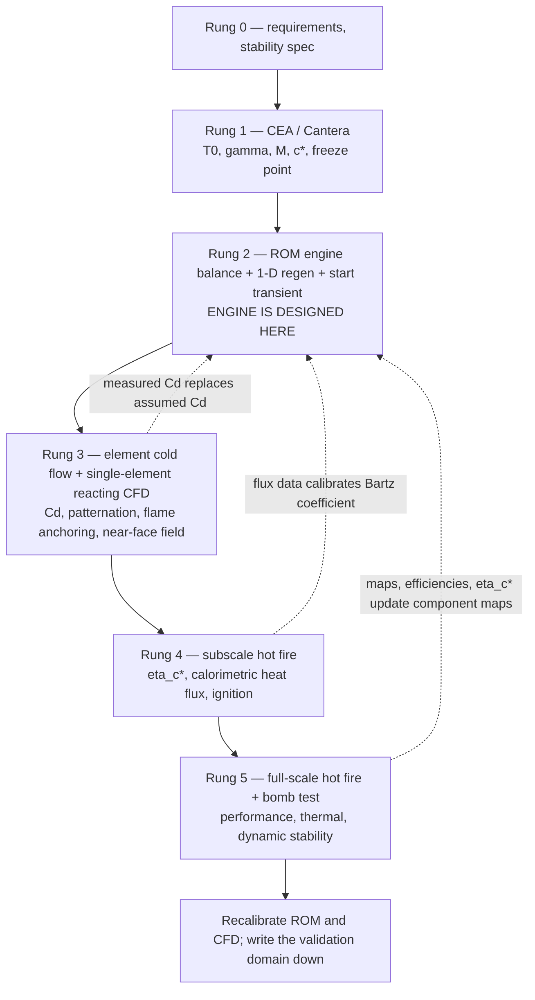

# Module 36 — Modern Engineering Methods
Part V · Prerequisites: Parts I–IV (modules 01–31) · Estimated time: 8 h

I have twice watched a programme lose a year to a picture. The first time it
was a beautifully rendered LES of a single injector element, coloured by
temperature, shown at a design review as evidence that the mixing was fine.
It was one element out of 217, run at a chamber pressure 40 bar below the
operating point because that was what would converge, with a two-step global
mechanism and no wall heat loss, and nobody in the room asked what the
grid-convergence study looked like because there wasn't one. The second time
it was a thermostructural FEA of a liner that predicted 340 cycles to
first-crack; the chamber cracked at 41, because the analyst had used the
Bartz-average heat flux around the circumference and the real hardware had a
streak from an off-design element that ran 55 % hotter over a 12 mm band.
Both models were *correct implementations of what they modelled*. Both were
believed past the edge of what they had been validated against. This module
is about the tools that dominate modern propulsion engineering — CFD, FEA,
cycle codes, optimisation, additive design, digital twins, machine learning,
uncertainty quantification — and, more importantly, about the discipline that
makes them worth having: knowing what each one computes, what it needs, what
it has been checked against, and which of the classical hand methods from
Modules 01–31 you still have to run to catch it when it lies.

**How to read this module.** Everything here is a *method*, not a phenomenon.
The physics was in Parts I–IV. What follows is an engineering-management and
numerical-methods chapter: for each method, six questions — what it computes,
how (at a working level), what inputs it needs, what it has been validated
against, where it earns its cost, and where it fails or misleads. Nothing in
this module replaces a single equation from the earlier modules. Several of
those equations are the only reason you will catch a bad simulation.

---

## 1. Learning objectives

After this module you should be able to:

- State the difference between **verification**, **validation**, and
  **qualification** in the sense of NASA-STD-7009, and place any given
  analysis result on that ladder.
- Choose between RANS, URANS, LES and DNS for a stated propulsion question,
  and estimate the grid-count and wall-clock cost of each to within an order
  of magnitude from the Reynolds number and the resolution requirement.
- Explain what a flamelet/FGM combustion model assumes, when a rocket
  chamber violates those assumptions, and what finite-rate chemistry costs
  instead.
- Set up a lumped-parameter engine balance: write the algebraic and
  differential equations that a cycle code solves, name the closure
  correlations it needs, and say why the whole engine is sized in this model
  before any CFD is run.
- Perform a Bartz cross-check on a conjugate-heat-transfer CFD result and
  state the three things that would make you believe the CFD over Bartz, and
  the three that would make you believe Bartz over the CFD.
- Compute a low-cycle-fatigue life estimate from a Coffin–Manson relation
  and explain why liner LCF predictions are systematically optimistic.
- Propagate stated input uncertainties through a $c^*$/$C_F$ performance
  chain by Monte Carlo, report the result as a distribution, decompose the
  variance by input (first-order Sobol indices), and contrast that with a
  deterministic margin-stacking policy.
- Estimate the mass a topology-optimised, stiffness-driven bracket can
  reach, using beam theory as a lower bound, and state why real topology
  optimisation lands above that bound.
- Describe what an engine digital twin actually contains, what test data
  updates in it, and name three things it cannot predict.
- Argue, with specific cases, where classical analytical methods remain
  necessary regardless of computing power: combustion instability, ignition
  transients, cavitation inception, and additively manufactured material
  properties.

---

## 2. Terminology

| term | symbol | SI unit | definition |
|---|---|---|---|
| Verification | — | — | did I solve the equations right? (numerical accuracy, code correctness) |
| Validation | — | — | did I solve the right equations? (agreement with physical experiment, with stated uncertainty) |
| Model-form uncertainty | — | — | error from the equations chosen, not from their inputs or their solution |
| Numerical uncertainty | — | — | error from discretisation, iteration and round-off |
| Parametric uncertainty | — | — | uncertainty in the model's inputs, propagated to its outputs |
| Reynolds number | $Re$ | — | $\rho u L/\mu$; ratio of inertial to viscous momentum transport |
| Kolmogorov length | $\eta_K$ | m | smallest dynamically significant turbulent eddy, $\eta_K = (\nu^3/\epsilon)^{1/4}$ |
| Turbulent dissipation rate | $\epsilon$ | m²/s³ | rate of turbulent kinetic energy conversion to heat |
| Kinematic viscosity | $\nu$ | m²/s | $\mu/\rho$ |
| Wall coordinate | $y^+$ | — | $y u_\tau/\nu$; non-dimensional distance of the first cell centre from a wall |
| Friction velocity | $u_\tau$ | m/s | $\sqrt{\tau_w/\rho}$ |
| Grid convergence index | GCI | — | Roache's estimator of discretisation error from two or three grid levels |
| Order of convergence | $p$ | — | observed exponent in $\text{error}\propto h^p$ for cell size $h$ |
| Mixture fraction | $Z$ | — | conserved scalar, 1 in pure fuel, 0 in pure oxidiser |
| Scalar dissipation rate | $\chi$ | 1/s | $2D\lvert\nabla Z\rvert^2$; local strain on the flame in mixture-fraction space |
| Damköhler number | $Da$ | — | ratio of flow time to chemical time; $Da\gg1$ is fast chemistry |
| Karlovitz number | $Ka$ | — | ratio of chemical time to Kolmogorov time; $Ka>1$ means turbulence penetrates the flame |
| Gas-side heat-transfer coefficient | $h_g$ | W/(m²·K) | $q/(T_{aw}-T_{wg})$ |
| Adiabatic wall temperature | $T_{aw}$ | K | recovery temperature seen by the wall |
| Heat flux | $q$ | W/m² | wall-normal energy flux |
| Cycles to failure | $N_f$ | — | number of thermal or mechanical load cycles to a defined crack |
| Plastic strain range | $\Delta\varepsilon_p$ | — | per-cycle plastic strain amplitude (peak-to-peak) |
| Campbell diagram | — | — | plot of rotor natural frequencies vs speed, with engine-order excitation lines |
| Design variable vector | $\mathbf{x}$ | mixed | the quantities an optimiser is allowed to change |
| Objective | $f(\mathbf{x})$ | mixed | the scalar being minimised |
| Pareto front | — | — | the set of designs where no objective improves without another worsening |
| Density field (topology optimisation) | $\rho_e$ | — | per-element pseudo-density in $[0,1]$; 1 = solid, 0 = void |
| Penalisation exponent | $p_{\text{SIMP}}$ | — | exponent in $E_e = \rho_e^{p}E_0$ that drives densities to 0 or 1 |
| Compliance | $C$ | J | $\mathbf{u}^\mathsf{T}\mathbf{K}\mathbf{u}$; strain energy, the inverse measure of stiffness |
| Surrogate / metamodel | $\hat f$ | mixed | cheap function fitted to expensive simulation or test samples |
| Gaussian process | GP | — | surrogate that returns a mean and a variance at every query point |
| First-order Sobol index | $S_i$ | — | fraction of output variance explained by input $i$ alone |
| Total Sobol index | $S_{Ti}$ | — | fraction of output variance involving input $i$, including interactions |
| Coefficient of variation | $CV$ | — | $\sigma/\mu$ of a distribution |
| Digital twin | — | — | a model of a *specific serial-numbered article*, updated with that article's own data |
| Model credibility | — | — | NASA-STD-7009's structured assessment of how much weight a decision may put on a model |

---

## 3. Theory

### 3.1 The vocabulary that keeps a model honest

Before any specific tool, the frame. Three words are used loosely in
industry and precisely in the standards, and using them loosely is how a
programme talks itself into flying an unvalidated model.

**Verification** asks: *did I solve the equations I wrote down, correctly?*
It is a mathematics question with no experiment in it. It splits into **code
verification** (does the solver reproduce an analytic or manufactured
solution at the design order of accuracy?) and **solution verification**
(for this particular run, how large is the discretisation and iterative
error?). Solution verification is the grid-convergence study, and its
standard estimator is Roache's Grid Convergence Index [Roache98,
ASME-V&V-20]:

$$\mathrm{GCI}_{\text{fine}} = \frac{F_s\,\lvert \epsilon_{21}\rvert}{r^{\,p}-1},\qquad \epsilon_{21}=\frac{\phi_2-\phi_1}{\phi_1},\qquad r=\frac{h_2}{h_1}$$

> **Eq. 3.1** — variables: $\phi_1,\phi_2$ the quantity of interest on the
> fine and coarse grids [any unit], $h$ representative cell size [m], $r$
> refinement ratio [—], $p$ observed order of accuracy [—], $F_s$ a safety
> factor (1.25 with three grids, 3 with two) [—]. Meaning: an error band on
> the fine-grid answer expressed as a percentage. Assumes: the grids are in
> the **asymptotic range**, i.e. the error is already dominated by the
> leading truncation term; the solution is smooth; the refinement is
> uniform. Fails when: the three grid answers are not monotone (very common
> in separated or reacting flow), when the observed $p$ comes out negative
> or far above the scheme's formal order, or when limiters and shock
> capturing make the scheme locally first-order. [F] for the estimator,
> [J] for the safety factor.

The blunt engineering consequence: **a CFD result quoted without a grid
study has no error bar, and a number without an error bar cannot be
compared to a requirement.** If a vendor or a colleague cannot tell you the
observed order of convergence for the quantity you care about, you are
being shown an illustration, not a calculation.

**Validation** asks: *are the equations I solved the right description of the
physical world, for this application, within what tolerance?* It requires an
experiment, and — this is the part routinely skipped — it requires the
*experiment's* uncertainty as well as the simulation's. ASME V&V 20 defines
the validation comparison error $E = S - D$ (simulation minus data) and the
validation uncertainty $u_{\text{val}}$ combining numerical, input and
experimental uncertainties; the model is validated at the level
$\lvert E\rvert + u_{\text{val}}$, and *that* number, not zero, is the
accuracy you are entitled to claim [ASME-V&V-20]. A CFD run that lands 4 %
from a test point measured to $\pm6\,\%$ has demonstrated agreement at the
10 % level, not at the 4 % level.

**Qualification** asks: *may this article fly?* It is a programmatic question
answered by test, inspection and analysis together. Analysis alone qualifies
almost nothing in propulsion; what analysis does is decide *which* tests to
run, interpolate between the tests you ran, and extrapolate the small number
of dimensions where extrapolation is defensible.

NASA formalised this in **NASA-STD-7009**, *Standard for Models and
Simulations*, written after the agency noticed that models were entering
flight-decision processes with no traceable statement of how much they
should be trusted [STD-7009]. Its core artefact is the **Credibility
Assessment Scale**: eight factors — verification, validation, input pedigree,
results uncertainty, results robustness, use history, M&S management,
people qualifications — each scored on a defined ladder, with the
requirement that the score be *reported alongside the result* to the
decision-maker. It does not tell you the model is right. It tells the
programme manager how far out on a limb they are standing. [M]

Two more distinctions that matter more in propulsion than almost anywhere:

- **Prediction vs postdiction.** A model tuned until it matches a hot-fire
  test has demonstrated that it has enough free parameters, not that it has
  the right physics. The only honest validation is a *blind* prediction
  submitted before the test data is opened. The programmes that do this
  (and there are few) learn something; the ones that "calibrate" learn their
  own calibration.
- **Interpolation vs extrapolation.** Every validated model has a validation
  *domain* — the region of the input space where it was checked. Almost all
  catastrophic simulation failures in this field are extrapolations: a
  chamber model validated at 40 bar run at 100 bar, a spray model validated
  on water/air run on subcritical LOX, a fatigue model validated on wrought
  material applied to a printed part. [J] Write the validation domain on the
  same slide as the result, every time.

### 3.2 The cost hierarchy, and why the engine is designed in a ROM

Every method in this module sits somewhere on a curve of cost versus
resolution. The numbers below are order-of-magnitude and will age, but the
*ratios* are stable and they are what determine how a programme is run.

| method | typical wall-clock for one answer | typical cost | what it resolves |
|---|---|---|---|
| CEA / equilibrium call | 10 ms – 1 s | free | thermochemical state, $c^*$, $T_0$, $\gamma$, $\mathcal{M}$ |
| 0-D/1-D engine balance (steady) | 0.1 – 10 s | free | whole-engine pressures, flows, powers, $I_{sp}$ |
| 1-D transient engine model (start) | minutes | free–low | valve sequencing, spin-up, chill-down, priming |
| 1-D regen cooling channel model | seconds | free | coolant $\Delta p$, $\Delta T$, wall temperature vs axial station |
| 2-D axisymmetric RANS, non-reacting | minutes – 1 h | low | nozzle contour performance, separation, boundary layer |
| 3-D RANS, reacting, single element | 1 – 10 h × 10²–10³ cores | moderate | mean flame position, mean wall flux |
| 3-D RANS, reacting, full injector face | days × 10³–10⁴ cores | high | mixture-ratio maldistribution, streaks |
| 3-D LES, reacting, single element | days – weeks × 10³–10⁴ cores | high | unsteady flame dynamics, response to acoustics |
| 3-D LES, reacting, multi-element chamber | weeks – months × 10⁴–10⁵ cores | very high | instability mechanism (research only) |
| DNS, reacting | not feasible at engine $Re$ | — | everything; used only on model problems |

> **Note on the table.** These are [E]/[J] figures assembled from what is
> publicly reported of academic and agency campaigns; a specific case can be
> an order of magnitude either way. Treat the *ordering* as reliable and the
> absolute numbers as indicative. [Slotnick14] is the honest agency
> assessment of where this curve is going and how slowly.

The consequence is the single most important structural fact about modern
engine design, and it surprises people who come in expecting CFD to be the
centre of the process:

> **The entire engine is designed, sized, balanced and mostly frozen inside
> a reduced-order model before a single CFD case is run.** CFD is then
> applied, selectively and expensively, to the three or four questions the
> ROM cannot answer and the classical correlations cannot bound.

The reason is not conservatism, it is arithmetic. A cycle balance takes
seconds, so a designer can run 10⁵ of them: sweep chamber pressure, mixture
ratio, pump efficiencies, turbine inlet temperature, expansion ratio,
channel geometry, and see the whole design space. A reacting LES of the
chamber takes a month, so you get perhaps four of them in a development
programme, and you must know in advance which four. Any process that
inverts this ordering — "let's CFD it and see" — burns the schedule on
questions that a 1-D model would have answered in an afternoon, and arrives
at the real question with no budget left.

### 3.3 Chemical equilibrium software: CEA, RPA, Cantera

**What it computes.** Given a propellant pair, a mixture ratio, a chamber
pressure and (for CEA's rocket problem) an expansion condition, an
equilibrium code returns the composition, temperature, transport properties
and derived performance ($c^*$, $C_F$, $I_{sp}$, $\gamma_s$, $\mathcal{M}$)
of the combustion products. Module 04 derived the method; this section is
about it as a *tool* in the modern chain.

**How.** Not by solving reaction equations. By minimising Gibbs free energy
at fixed $(T,p)$ or maximising entropy at fixed $(H,p)$, subject to element
conservation, over the mole numbers $n_j$ of all considered species:

$$\min_{n_j}\ G=\sum_j n_j\left(\mu_j^\circ(T)+R_uT\ln\frac{n_j p}{n_{\text{tot}}p^\circ}\right)\quad\text{s.t.}\quad \sum_j a_{ij}n_j=b_i$$

> **Eq. 3.2** — variables: $n_j$ moles of species $j$ [kmol], $\mu_j^\circ$
> standard chemical potential [J/kmol] from the NASA polynomial fits,
> $a_{ij}$ atoms of element $i$ in species $j$ [—], $b_i$ total moles of
> element $i$ [kmol], $R_u=8314.46$ J/(kmol·K). Meaning: chemical equilibrium
> is the composition of lowest free energy consistent with the atoms you put
> in. Assumes: ideal-gas mixture (with optional condensed phases), infinite
> residence time, uniform state, and — critically — that every relevant
> species is *in the species list*. Fails when: chemistry is slow relative to
> the flow (recombination freeze in a nozzle), when the mixture is not
> uniform (every real injector), when real-gas effects matter (dense LOX
> near the injector), or when a species that should have been included was
> not. [F] for the thermodynamics; [RP-1311 Part I] for the derivation.

**Inputs it needs.** Reactant enthalpies of formation and reference
temperatures, an element budget, the thermodynamic polynomial database
([JANAF]-derived), and the transport database if you want $\mu$ and $k$.
The single most common user error is mixing a fitted RP-1 empirical formula
with a heat of formation fitted to a *different* formula (Module 04 §3).

**Validation status.** The equilibrium calculation itself is the best-verified
model in propulsion — it is thermodynamics with tabulated data, and CEA has
been cross-checked against independent implementations for thirty years.
What is *not* validated is the leap from theoretical performance to engine
performance. That gap is what JANNAF's efficiency decomposition exists to
book-keep [CPIA-246]: energy release efficiency, divergence, boundary layer,
kinetics, and the reference One-Dimensional-Equilibrium baseline against
which each is defined. A quoted "$\eta_{c^*}=0.97$" is meaningless unless
you know which reference it is 97 % of.

**Where it is genuinely valuable.** Everywhere, at the front of everything.
It is free, instant, and it sets the thermodynamic boundary conditions for
every downstream method: the ROM's chamber state, the CFD's inlet enthalpy
and species, the CHT's $T_{aw}$, the FEA's thermal load. It is also the only
place where the *ideal* performance is defined, and therefore the only place
where you can say how much of the shortfall is the injector's fault.

**Where it misleads.** Three places.

1. **Equilibrium vs frozen vs finite-rate.** CEA offers equilibrium and
   frozen expansion as bounds. Real nozzles are between: recombination
   proceeds until the flow cools and the residence time falls below the
   chemical time, and then freezes. The equilibrium–frozen spread is 1.5–4 %
   in $I_{sp}$, largest for hydrogen at high $\varepsilon$ (Module 04 §4).
   Quoting the equilibrium number as "the" theoretical performance
   systematically flatters the engine. **Cantera** is the modern way to
   settle this: integrate the finite-rate chemistry along the nozzle
   streamline with a real mechanism and find where the composition actually
   stops changing [Cantera]. That is a 1-D calculation that takes seconds and
   almost nobody does it, which is why "frozen or equilibrium?" is still an
   argument in design reviews.
2. **Uniformity.** CEA computes one mixture ratio. A real injector delivers a
   *distribution* of local mixture ratios; the mass-averaged performance of a
   distribution is always below the performance at the mean mixture ratio,
   because $c^*(r)$ is concave near its peak. This is the single largest
   term in $\eta_{c^*}$ for most engines and equilibrium software cannot see
   it at all.
3. **Real-fluid states.** Near the injector face of a high-pressure engine,
   oxygen is a supercritical dense fluid, not an ideal gas — for LOX,
   $p_c=5.04$ MPa, and a 100–300 bar chamber is 2–6 times critical. Ideal-gas
   equilibrium is fine for the burnt products and useless for the injection
   process [OY93].

**Tool notes.** [CEA]/[CEARUN] is the reference implementation and the thing
to cite for published theoretical performance. [RPA] wraps a CEA-equivalent
solver in engine sizing, nozzle contour generation, regen analysis and cycle
balance — it is the fastest honest route from a propellant choice to a
preliminary engine, and its author describes it as a conceptual-design tool,
which is exactly right. [Cantera] is a scriptable kinetics/thermo library:
same NASA polynomials, but it will also integrate finite-rate chemistry,
which makes it the right tool for freeze-point questions, ignition delay,
and building reduced mechanisms for CFD. [M]

### 3.4 Reduced-order models: the engine balance and the start transient

This is the workhorse and the least glamorous entry in the module. A
**reduced-order model** (ROM) of an engine represents each component as a
lumped element with a small number of states and an algebraic or
first-order-ODE constitutive law, and solves the resulting system for a
consistent operating point.

**Steady cycle balance.** The unknowns are the pressures, temperatures and
flows at every station; the equations are conservation plus component maps.
For a gas-generator engine the closure set is roughly:

$$\dot m = C_d A\sqrt{2\rho\,\Delta p}\ \ \text{(every orifice and injector)}$$
$$\Delta p_{\text{pump}} = \rho g H(\dot Q,N),\qquad P_{\text{pump}}=\frac{\dot m\,\Delta p}{\rho\,\eta_p}$$
$$P_{\text{turb}} = \eta_t\,\dot m_t c_p T_{t,\text{in}}\left[1-\left(\frac{1}{\Pi}\right)^{(\gamma-1)/\gamma}\right]$$
$$P_{\text{turb}} = P_{\text{pump,ox}}+P_{\text{pump,fuel}} \ \ \text{(shaft power balance)}$$
$$\dot m_{\text{total}} = \frac{p_c A_t}{c^*(r,p_c)}\ \ \text{(choked throat, } c^* \text{ from CEA)}$$

> **Eq. 3.3a–e** — variables as in Modules 12–13; $H$ pump head [m], $N$ shaft
> speed [rad/s], $\eta_p,\eta_t$ efficiencies [—], $\Pi$ turbine pressure
> ratio [—], $c^*$ [m/s] interpolated from an equilibrium table. Meaning: the
> engine's operating point is the simultaneous solution of "everything that
> must add up". Assumes: quasi-steady flow, lumped components, incompressible
> pumps, no distributed dynamics, maps valid at the operating point. Fails
> when: any element is choked in a way the map does not represent, when
> two-phase flow appears (chill-down, cavitation, coolant boiling), when the
> pump operates far off its map, or during any transient faster than the
> component filling times. [F] for the conservation statements, [E] for the
> maps.

That is a nonlinear algebraic system of perhaps 30–200 equations, solved by
Newton–Raphson with a good initial guess. Its virtues: it takes milliseconds,
every variable in it is a quantity an engineer names in a design review, and
its sensitivities are exact and instantly available. Its vice: **every
component map in it is empirical, and the model is only as good as the maps.**
For a new engine, the maps are scaled from previous hardware, and the scaling
is where the error lives.

**Transient models.** The start transient is where ROMs earn their keep and
where nothing else works at all. Adding capacitance and inertia to each
lumped volume gives a differential-algebraic system:

$$V\frac{d\rho}{dt} = \dot m_{\text{in}}-\dot m_{\text{out}},\qquad \frac{d}{dt}(\rho e V) = \dot H_{\text{in}}-\dot H_{\text{out}}+\dot Q$$
$$L\frac{d\dot m}{dt} = A\,(p_1-p_2) - \Delta p_{\text{loss}},\qquad I\frac{dN}{dt}=\frac{P_{\text{turb}}-P_{\text{pump}}}{N}$$

> **Eq. 3.4a–d** — variables: $V$ lumped volume [m³], $\rho$ density [kg/m³],
> $e$ specific internal energy [J/kg], $L=\ell/A$ line inertance [1/m],
> $I$ rotor polar inertia [kg·m²], $N$ shaft speed [rad/s]. Meaning: mass,
> energy and momentum storage in every volume and line, plus rotor
> spin-up. Assumes: one-dimensional lines, lumped volumes small compared to
> the acoustic wavelength of interest, a valid equation of state (usually
> [REFPROP]/[NIST] for cryogens). Fails when: acoustic behaviour matters
> (this model cannot represent a chamber acoustic mode), when the volume is
> not well-mixed, or when two-phase flow needs a real slip model rather than
> homogeneous equilibrium. [F].

This is what **ROCETS**, **NPSS**, and **EcosimPro/ESPSS** are. ROCETS
(Rocket Engine Transient Simulation) was developed under NASA MSFC contract
around 1990 as a modular transient engine simulation framework and was used
extensively on Shuttle-era and post-Shuttle engine work; **NPSS** (Numerical
Propulsion System Simulation) began at NASA Glenn as an object-oriented
airbreathing-engine framework and has been extended to rockets [NPSS];
**EcosimPro with the ESPSS library** is the European equivalent, an
equation-based DAE environment with a validated propulsion component library
used across ESA programmes [ESPSS]. All three do the same job: assemble
components into a plant, generate the DAE system, integrate it.

**What a transient ROM is used for, concretely:**

- **Valve sequencing.** The order and rate at which main valves open sets the
  mixture ratio history during start. Get it wrong and you either detonate a
  hard start (oxidiser lead with too much accumulated propellant) or fail to
  light. This is a scheduling problem in a 10–200 ms window and it is solved
  entirely in a ROM, then checked on a test stand.
- **Turbomachinery spin-up.** Does the turbine make enough power to
  accelerate the rotor through the low-flow region before the pump stalls or
  the seals overheat? Eq. 3.4d, plus off-design maps.
- **Chill-down.** How much cryogen do you dump to get the pump and lines cold
  enough that the pump does not cavitate on start? Two-phase, wall-heat-capacity
  dominated, and impossible to do in your head.
- **Priming and water-hammer.** Filling a dry line with a dense propellant
  generates a pressure surge $\Delta p=\rho a \Delta u$ that has burst
  hardware on more than one programme; the ROM predicts it, and the valve
  ramp is then designed to keep it under the proof pressure.
- **Shutdown and dribble volume.** Post-cutoff impulse and its repeatability,
  which is a guidance-accuracy requirement, not an engine requirement.

**1-D regenerative cooling models.** A special and very important ROM.
Discretise the channel axially; at each station solve

$$q = \frac{T_{aw}-T_{c}}{\dfrac{1}{h_g}+\dfrac{t_w}{k_w}+\dfrac{1}{\eta_f h_c}},\qquad \dot m_c c_p \frac{dT_c}{dx}=q\,P_{\text{heated}},\qquad \frac{dp_c}{dx}=-f\frac{\rho u^2}{2D_h}$$

> **Eq. 3.5a–c** — variables: $t_w$ wall thickness [m], $k_w$ wall
> conductivity [W/(m·K)], $h_c$ coolant-side coefficient [W/(m²·K)] from a
> Dittus–Boelter-type correlation, $\eta_f$ fin efficiency of the channel
> rib [—], $P_{\text{heated}}$ heated perimeter per unit length [m], $f$
> Darcy friction factor [—], $D_h$ hydraulic diameter [m]. Meaning: a series
> thermal resistance at every axial station, marched downstream with the
> coolant's energy and momentum. Assumes: 1-D conduction through the wall,
> circumferentially uniform gas-side flux, fully developed single-phase
> coolant, correlations valid at the local state. Fails when: the coolant is
> near-critical (methane at 100–200 bar is *not* near-critical, hydrogen at
> 40 bar is), when there is a circumferential streak, when curvature or
> secondary flows matter, when the channel is not straight, and when
> nucleate boiling or film boiling appears. [F] for the resistance network,
> [E] for every correlation in it.

This model, with Bartz for $h_g$, sizes essentially every regeneratively
cooled chamber ever built, including all the ones in the engine database. It
runs in seconds. Its known systematic weaknesses — circumferential streaks,
curvature enhancement in the throat, fin efficiency at high aspect ratio —
are exactly what conjugate CFD (§3.7) is brought in to quantify.

**Validation status of ROMs.** Excellent *within a family*, poor across
families. A cycle code tuned on Shuttle-era hydrogen turbomachinery will
reproduce the next hydrogen engine's balance to a few percent and will be
wrong about a methalox oxidiser-rich preburner in ways nobody can predict
until they test one. This is why the first thing any engine programme does
with early test data is not "did we hit the performance target" but
"**recalibrate the model**" — every hot fire is, among other things, a
validation point for the ROM that will design the next iteration.

### 3.5 CFD for injectors and chambers

#### 3.5.1 The three levels, and what separates them

All three solve the same conservation laws — mass, momentum, energy, species:

$$\frac{\partial \rho}{\partial t}+\nabla\!\cdot(\rho\mathbf{u})=0,\qquad
\frac{\partial(\rho\mathbf{u})}{\partial t}+\nabla\!\cdot(\rho\mathbf{u}\mathbf{u})=-\nabla p+\nabla\!\cdot\boldsymbol{\tau}$$
$$\frac{\partial(\rho Y_k)}{\partial t}+\nabla\!\cdot(\rho\mathbf{u}Y_k)=\nabla\!\cdot(\rho D_k\nabla Y_k)+\dot\omega_k$$

> **Eq. 3.6a–c** — variables: $\rho$ [kg/m³], $\mathbf{u}$ [m/s], $p$ [Pa],
> $\boldsymbol{\tau}$ viscous stress [Pa], $Y_k$ mass fraction of species $k$
> [—], $D_k$ diffusivity [m²/s], $\dot\omega_k$ net chemical production rate
> [kg/(m³·s)]. Meaning: the Navier–Stokes equations with reacting species.
> Assumes: continuum ($Kn\ll1$ — true everywhere in a chamber, not true in
> the far plume of a cold-gas thruster, see Module 30), Newtonian fluid,
> Fickian diffusion. Fails when: the equation of state is wrong (dense
> supercritical injection), when radiation is a significant energy path
> (soot-forming propellants), or when the species set is inadequate. [F].

The difference between DNS, LES and RANS is **what fraction of the turbulent
spectrum you resolve, and therefore what you must model**.

**DNS** resolves everything down to $\eta_K$. The required cell count scales
as $Re_L^{9/4}$ in three dimensions and the time-step count as $Re_L^{3/4}$,
so total work scales roughly as $Re_L^{3}$.

$$N_{\text{cells}}\sim\left(\frac{L}{\eta_K}\right)^{3}\sim Re_L^{9/4}$$

> **Eq. 3.7** — variables: $L$ integral length scale [m], $\eta_K$ Kolmogorov
> length [m], $Re_L=uL/\nu$ [—]. Meaning: resolving every eddy costs the cube
> of the scale separation. Assumes: homogeneous isotropic turbulence scaling;
> a wall-bounded flow is worse. Fails to be even a bound when combustion adds
> a flame thickness smaller than $\eta_K$, which it often does. [F].

Put a number on it. A 100 mm chamber at $Re\sim10^6$: $Re^{9/4}\approx
10^{13.5}$ cells. There is no computer. **DNS is not an engineering tool for
rocket chambers and will not become one in your career.** It is a tool for
*model development* on canonical problems — a temporally evolving jet, a
counterflow flame, a single droplet — from which the closures used by LES
and RANS are derived and tested [Poinsot].

**RANS** resolves nothing of the turbulence: it solves for the time-averaged
(or, for URANS, slowly-varying-in-time) field, and models the entire
turbulent spectrum with an eddy viscosity. The workhorse in propulsion is
Menter's **SST $k$–$\omega$** [Menter94], which uses $k$–$\omega$ near walls
(good for adverse pressure gradients and separation) and blends to
$k$–$\epsilon$ in the free stream (no free-stream sensitivity):

$$-\overline{\rho u_i'u_j'} = \mu_t\left(\frac{\partial \bar u_i}{\partial x_j}+\frac{\partial \bar u_j}{\partial x_i}-\frac{2}{3}\frac{\partial \bar u_k}{\partial x_k}\delta_{ij}\right)-\frac{2}{3}\rho k\,\delta_{ij},\qquad \mu_t=\frac{\rho a_1 k}{\max(a_1\omega,\;S F_2)}$$

> **Eq. 3.8** — variables: $\mu_t$ turbulent viscosity [Pa·s], $k$ turbulent
> kinetic energy [m²/s²], $\omega$ specific dissipation rate [1/s], $S$
> strain-rate magnitude [1/s], $a_1=0.31$, $F_2$ a blending function [—].
> Meaning: the Boussinesq hypothesis — turbulent momentum transport is
> represented as a large extra viscosity aligned with the mean strain.
> Assumes: local equilibrium of turbulence production and dissipation, and
> alignment of the Reynolds stress tensor with the mean strain tensor.
> Fails when: the flow has strong streamline curvature, strong swirl,
> significant rotation, large separated regions, or strong density gradients
> — i.e. in every one of the flows a rocket injector produces. [E], and this
> is a *calibrated* model, not a derived one.

**LES** resolves the energy-containing eddies and models only the subgrid
scales, whose behaviour is closer to universal. The filtered equations look
like Eq. 3.6 with a subgrid stress $\tau^{sgs}_{ij}$ requiring closure
(Smagorinsky with dynamic coefficient, WALE, sigma). The cost scaling is
$Re^{1.8}$–$Re^{2}$ for wall-resolved LES and roughly $Re^{0.4}$–$Re^{1}$ for
wall-modelled LES — the difference between "impossible" and "expensive"
[Slotnick14, Pitsch06]. Hybrids (DES, DDES, IDDES) run RANS in the boundary
layer and LES in the separated core, which is the practical compromise for
chamber and nozzle work.

**The judgment, plainly stated.** [J]

- If you want a **mean** field — mean wall heat flux, mean mixture-ratio
  distribution, pressure drop, mean thrust — use RANS, and cross-check it
  against a correlation.
- If you want an **unsteady** field — flame response to an acoustic
  perturbation, mixing intermittency, ignition kernel transport, side loads
  during nozzle start — RANS cannot give it to you at any grid resolution,
  because the closure has already averaged out what you are asking for. You
  need LES, and you must budget accordingly.
- If someone shows you a RANS combustion-instability prediction, the model
  either has a separately supplied flame-response function (i.e. the answer
  was an input) or it is not predicting instability.

#### 3.5.2 Chemistry closure: the real cost driver

Rocket combustion is fast, hot, and (in a real chamber) not close to any
canonical regime. The choices:

**Finite-rate chemistry with a mechanism.** Integrate $\dot\omega_k$ directly
from an Arrhenius mechanism. The source term is stiff — chemical timescales
span 10⁻⁹ to 10⁻² s — so it is usually operator-split and integrated with an
implicit ODE solver per cell. Cost scales roughly with the *square* of the
species count (the chemical Jacobian) and this dominates everything else:
a detailed methane mechanism (GRI-Mech 3.0: 53 species, 325 reactions) is
already painful in 3-D; a detailed kerosene mechanism has hundreds of
species and is out of the question. Hence **reduced mechanisms**: 15–25
species skeletal sets derived by sensitivity analysis and validated against
the detailed mechanism for ignition delay, laminar flame speed and
extinction strain over the pressure and equivalence-ratio range of interest.
[M] Building and validating that reduced mechanism is a real piece of work
and is often the difference between a defensible chamber CFD and a
decorative one.

**Flamelet models (SLFM, FPV, FGM).** Assume the flame is thin relative to
the turbulence and that its local structure is that of a laminar
counterflow diffusion flame parameterised by mixture fraction $Z$ and scalar
dissipation $\chi$ (or a progress variable $C$). Precompute a library of
flamelets offline with detailed chemistry; in the CFD, transport only $Z$,
its variance, and $C$, then look up temperature and composition:

$$\tilde\phi = \int\!\!\int \phi(Z,C)\,\tilde P(Z)\,\tilde P(C)\,dZ\,dC$$

> **Eq. 3.9** — variables: $\phi$ any thermochemical quantity, $\tilde P$
> presumed sub-filter PDFs (usually a beta function for $Z$, a delta or beta
> for $C$). Meaning: replace an expensive chemistry integration with a table
> lookup and a presumed-PDF convolution. Assumes: thin flame ($Ka<1$),
> unity-ish Lewis numbers, statistical independence of $Z$ and $C$,
> equilibrium of the flame structure with the local strain. Fails when: the
> flame is thickened by turbulence ($Ka>1$), during ignition and extinction
> (transient flamelets), for partially premixed and multi-stream problems
> (a staged-combustion chamber has *three* streams — main oxidiser, main
> fuel, and preburner gas — and a single $Z$ cannot describe three streams),
> and near walls. [E]/[A]; see [Peters00], [Pitsch06].

The cost difference is roughly two orders of magnitude, which is why
flamelet-type closures dominate industrial chamber CFD. The failure modes
above are also why flamelet chamber CFD is not trusted for ignition,
blow-off, or instability — all three violate the core assumption.

**Well-stirred-reactor / EDC-type models.** Cheap, robust, and physically
crude: assume mixing controls and burn whatever mixes at a rate set by
turbulence. Reasonable for a global heat release field, useless for
temperature-sensitive outputs like NOx or wall flux in a hydrocarbon flame.
[A]

#### 3.5.3 Spray and dense-phase injection: Euler–Lagrange

For a subcritical liquid injection — LOX/RP-1 at moderate pressure, storables,
anything at start-up — the liquid arrives as a sheet or jet that breaks into
ligaments and then drops. The standard industrial treatment is
**Euler–Lagrange**: solve the gas phase on the Eulerian grid, and track
statistical **parcels** of droplets as Lagrangian points with their own
equations of motion, heating and vaporisation:

$$m_d\frac{d\mathbf{u}_d}{dt}=\frac{1}{2}C_D\rho_g A_d\lvert\mathbf{u}_g-\mathbf{u}_d\rvert(\mathbf{u}_g-\mathbf{u}_d)+m_d\mathbf{g},\qquad \frac{dm_d}{dt}=-\pi d\,\rho_g D\,\mathrm{Sh}\,\ln(1+B_M)$$

> **Eq. 3.10a–b** — variables: $m_d$ droplet mass [kg], $d$ diameter [m],
> $C_D$ drag coefficient [—], $A_d$ frontal area [m²], $\mathrm{Sh}$ Sherwood
> number [—], $B_M$ Spalding mass-transfer number [—]. Meaning: a droplet is
> a point that feels drag and evaporates, exchanging mass, momentum and
> energy with the gas cell it occupies. Assumes: dilute spray (droplets do
> not see each other), spherical drops much smaller than the cell, a
> subcritical droplet with a distinct surface, and a known initial droplet
> size distribution. Fails when: the spray is dense near the injector (it
> always is — the region where breakup actually happens is precisely where
> the dilute assumption is invalid), when the drop is supercritical (no
> surface, no latent heat — the whole formulation collapses), and when
> the cell size is comparable to the drop. [E]/[A]; [LM] is the reference for
> the atomisation correlations underneath.

**The honest statement about spray CFD:** the answer is dominated by the
**injected droplet size distribution**, which the CFD does not compute — it is
an *input*, taken from a correlation ([LM]) or, at best, from a cold-flow
patternation and Phase-Doppler measurement of that specific element. Primary
atomisation — the physics of how the sheet becomes ligaments — is not
resolved in any production rocket CFD. So the standing joke is fair: spray
CFD tells you what happens downstream of the assumption you made. [J]

For **supercritical** injection (LOX in any modern high-pressure chamber),
Euler–Lagrange is not merely inaccurate, it is inapplicable: above the
critical pressure there is no surface tension, no latent heat and no
droplet. The correct treatment is a single-phase real-fluid (Eulerian)
calculation with a cubic or higher equation of state and correct
high-pressure transport properties, in which the "spray" appears as
turbulent mixing of a dense fluid — the "finger" structures observed in
optically accessible experiments. [OY93] is the review that established this
framing; getting it wrong (using a droplet model above $p_c$) produces
plausible-looking, systematically wrong mixing lengths.

#### 3.5.4 The Purdue/AFRL model-combustor validation history

Because chamber CFD cannot be validated against a full engine — you cannot
put optical access and a hundred thermocouples into a flight chamber — the
community built **model combustors** whose whole purpose is to be measurable.
The most important open example in American work is the Purdue/AFRL family
of single- and multi-element combustors, of which the best documented is the
**Continuously Variable Resonance Combustor (CVRC)** [Yu12].

Its design logic is worth understanding because it is the template for how
this kind of validation is done:

- **One element**, so the geometry is unambiguous and the boundary conditions
  are knowable.
- **A translating oxidiser-post length**, which continuously varies the
  coupling between the injector's acoustic response and the chamber's
  longitudinal mode. The combustor can therefore be driven *deliberately*
  from stable to unstable and back within a single test, producing a
  continuous stability map rather than a binary result.
- **Measurable, publishable, unclassified**: gaseous or simple propellants at
  pressures high enough to be relevant, with high-bandwidth pressure
  instrumentation and, in related rigs, optical access for chemiluminescence
  and PIV.

What the campaign delivered, and what it did not: it produced a public data
set against which unsteady CFD could be tested on the *right question* —
does the simulation predict the onset of instability, the limit-cycle
amplitude, and the frequency, without being told the answer? Results across
the community established the pattern that: (i) URANS with a flamelet
closure could reproduce the *frequency* (that is mostly acoustics and
geometry) but not reliably the *amplitude* or the stability boundary;
(ii) LES with finite-rate chemistry could reproduce onset and limit-cycle
amplitude in specific cases, at a cost of large parallel machine time per
configuration; (iii) the answers remained sensitive to the chemical
mechanism, the subgrid model and the inflow boundary treatment at a level
comparable to the effect being predicted. [R]/[M]

The engineering lesson is the one that matters: **after decades of effort,
predicting combustion instability from first principles for a new chamber is
still a research capability, not a design tool.** That is why Module 15's
classical methods — the $n$–$\tau$ sensitive time-lag framework [CC56],
Culick's modal analysis [Culick68], and the empirical stability-rating bomb
test — remain the operational basis for stability, and why every new engine
is still bomb-tested. See §3.18.

#### 3.5.5 What a converged answer actually costs

A "converged answer" in reacting chamber CFD means four separate things,
and programmes routinely deliver one and claim all four:

1. **Iterative convergence** — residuals dropped several orders and, more
   importantly, the *quantity of interest* has stopped moving. Residuals
   alone are not evidence; monitor integrated wall heat flux or mean
   chamber pressure and show it flat.
2. **Statistical convergence** (LES/URANS) — enough flow-through times, after
   the initial transient is discarded, that the time-averaged statistics
   have settled. For a chamber with a 3 ms residence time, meaningful
   statistics need tens of milliseconds of simulated time, at time steps of
   10⁻⁸–10⁻⁷ s. That is 10⁵–10⁶ time steps.
3. **Grid convergence** — Eq. 3.1, on the quantity of interest, with at least
   three grids. In reacting LES this is almost never done, because
   refining the grid in LES changes the *model* (the filter width), not just
   the discretisation. The honest substitute is a sensitivity study plus a
   resolution metric (e.g. fraction of turbulent kinetic energy resolved
   $>80\,\%$).
4. **Model convergence** — the answer no longer changes when you change the
   subgrid model, the mechanism, or the inflow turbulence specification. This
   is the one that is almost always skipped and almost always the largest
   term.

The practical budget, [E]/[J], for a reacting multi-element chamber LES that
would survive a technical review: 10⁷–10⁹ cells, 10⁵–10⁶ time steps,
10³–10⁵ cores, weeks to months, and a team that has done it before. For a
single-element RANS case with a flamelet table: hours on a few hundred cores.
The factor between them is why the multi-element case gets run once, at the
end, to confirm a decision that was already made on other grounds.

### 3.6 Nozzle CFD: method of characteristics versus RANS

The nozzle is the one place in the engine where a classical analytic method
is *not* merely a sanity check — it is still the design method.

**Method of characteristics (MOC).** For steady, supersonic, irrotational,
isentropic flow, the governing PDE is hyperbolic and its characteristics are
the left- and right-running Mach lines, along which the compatibility
relations reduce to ordinary differential equations. The two-dimensional
irrotational relations are

$$\theta \pm \nu(M) = \text{const along } C_\mp,\qquad \nu(M)=\sqrt{\frac{\gamma+1}{\gamma-1}}\arctan\!\sqrt{\frac{\gamma-1}{\gamma+1}(M^2-1)}-\arctan\!\sqrt{M^2-1}$$

> **Eq. 3.11** — variables: $\theta$ flow angle [rad], $\nu$ Prandtl–Meyer
> function [rad], $M$ Mach [—]. Meaning: in supersonic irrotational flow,
> $\theta\pm\nu$ is constant along characteristic lines, which turns contour
> design into a marching algebra problem. Assumes: steady, supersonic
> throughout, irrotational, isentropic, calorically perfect (or a corrected
> $\gamma$), no viscosity. Fails when: shocks appear inside the nozzle, in
> the transonic throat region (handled by a separate transonic start line),
> when the flow separates, or where the boundary layer is thick. [F]; see
> [ZH Vol. 2] and Module 09.

MOC gives you an *exact* inviscid contour: the shortest nozzle producing
uniform parallel exit flow, or — the practically important case — Rao's
thrust-optimised parabolic contour, obtained by a variational condition on
the characteristic net [Rao58, Rao60]. Nobody has improved on this. Every
production bell nozzle contour in the engine database began life as an
MOC/Rao contour, then received a **boundary-layer displacement correction**
(add $\delta^*$ to the wall) and a manufacturing smoothing.

**So what is RANS for?** Four things MOC cannot do:

1. **Boundary layer and its performance debit.** A 2-D axisymmetric RANS gives
   the momentum-thickness drag and wall heat flux directly rather than by a
   correlation. Typical boundary-layer loss in $I_{sp}$: 0.3–1.5 %, larger for
   small throats.
2. **Real-gas and finite-rate effects.** Recombination along the nozzle,
   varying $\gamma$, condensation of alumina in solid motors.
3. **Off-design and separated operation.** The one that matters most.
4. **Film-cooling and turbine-exhaust dump interactions.** The F-1's
   gas-generator exhaust curtain, the RS-68's ablative-skirt film, the
   nozzle-extension mixing layer — none of it is MOC-able.

**Separation prediction.** An overexpanded nozzle at sea level separates, and
predicting *where* determines the side load, which determines the gimbal
bearing and the nozzle structure. The classical criteria (Module 09) —
Summerfield's $p_{\text{sep}}\approx0.4\,p_a$ [SFS54], Schmucker's
$p_{\text{sep}}/p_a=(1.88M_e-1)^{-0.64}$ [Schmucker73] — are correlations
fitted to particular families of nozzles.

RANS does better in a specific and limited sense: with a well-behaved
turbulence model (SST is standard here, because $k$–$\epsilon$ notoriously
delays separation) and an adequately resolved boundary layer
($y^+\lesssim1$), 2-D axisymmetric RANS predicts the *mean* separation
location in cold-flow subscale nozzles to within a few percent of the exit
radius. What it does **not** reliably predict is:

- the transition between **free shock separation (FSS)** and **restricted
  shock separation (RSS)**, which is the physical origin of the large
  transient side loads in thrust-optimised contours, and which involves a
  bistable, hysteretic reattachment [OMK05, Ostlund02];
- the *unsteady* side load amplitude, which is a fluctuating asymmetric
  pressure integral and therefore needs at minimum a DDES/LES treatment with
  a long sample;
- separation with significant film cooling or a dumped turbine exhaust
  altering the near-wall gas.

[J] The working practice is: MOC/Rao for the contour, 2-D RANS for
performance and mean separation, an empirical criterion as the design bound
because it is conservative and traceable, and a **hot-fire side-load
measurement** as the actual qualification. This is a good example of a field
where forty years of CFD has moved the classical method from "the answer" to
"the bound", and no further.

### 3.7 Conjugate heat transfer, and the Bartz check

**What it computes.** A CHT analysis solves the gas-side flow, conduction in
the wall, and the coolant-side flow *simultaneously*, with the interfaces
enforcing continuity of temperature and heat flux rather than a prescribed
boundary condition:

$$T_{g,\text{wall}}=T_{s,\text{wall}},\qquad -k_g\left.\frac{\partial T}{\partial n}\right|_g=-k_s\left.\frac{\partial T}{\partial n}\right|_s$$

> **Eq. 3.12** — variables: $k_g,k_s$ gas and solid conductivity [W/(m·K)],
> $n$ wall-normal coordinate [m]. Meaning: the wall temperature is an
> *output* of the coupled problem, not an input to a decoupled one.
> Assumes: no contact resistance (a real issue at braze joints and in
> AM part-to-part interfaces), and that all three domains are resolved
> adequately. Fails when: the thermal time constants of the three domains
> differ by orders of magnitude and the coupling scheme is not designed for
> it (gas-side response is microseconds, wall conduction is milliseconds,
> the coolant bulk is tens of milliseconds), and whenever the coupling is
> under-relaxed to the point of a converged-looking but unconverged answer.
> [F].

**Why it matters and what it adds.** The decoupled 1-D model (Eq. 3.5)
assumes a circumferentially uniform gas-side flux and 1-D conduction. Both
are wrong in specific, quantifiable ways that CHT exposes:

- **Circumferential streaks.** A finite number of injector elements produces a
  finite number of hot stripes. The peak-to-mean flux ratio at the wall is
  the single most consequential number in liner life, and 1-D models do not
  contain it. Values of 1.3–2.0 are commonly reported for the peak/mean
  ratio in the near-injector region [J]; the number depends on element type,
  spacing, and the film-cooling scheme.
- **Rib conduction.** Heat entering the land between channels is conducted
  circumferentially into the channel side walls; the 1-D fin-efficiency
  correction is a decent approximation but degrades at high channel aspect
  ratio, which is exactly the direction modern (especially AM) channels have
  gone.
- **Curvature enhancement at the throat.** Concave streamline curvature on
  the converging side destabilises the boundary layer and raises flux;
  convex curvature downstream suppresses it. Bartz's $(D_t/r_c)^{0.1}$ term
  is a crude nod to this.
- **Coolant-side non-uniformity.** Channel-to-channel flow maldistribution
  from the manifold — a real and frequently underestimated failure path.

**The Bartz check — do this every time.** Before you believe a CHT result,
recompute the throat flux with Bartz [Bartz57]:

$$h_g=\frac{0.026}{D_t^{0.2}}\left(\frac{\mu^{0.2}c_p}{Pr^{0.6}}\right)_0\left(\frac{p_c}{c^*}\right)^{0.8}\left(\frac{D_t}{r_c}\right)^{0.1}\left(\frac{A_t}{A}\right)^{0.9}\sigma$$

> **Eq. 3.13** — as in Module 10; $\sigma$ is the property-variation
> correction. Meaning: a Dittus–Boelter-type turbulent pipe correlation
> reshaped for a nozzle. Assumes: attached turbulent boundary layer,
> chamber-stagnation properties, no film cooling, no injector-driven
> maldistribution. Fails: everywhere those hold poorly; the paper itself
> calls it a *rapid estimate*, and the honest band is $\pm20$–$30\,\%$ at the
> throat and worse elsewhere. [E].

The check is not "does the CFD match Bartz". It is: **is the CFD inside the
Bartz band, and if not, is there a physical reason I can name?** Legitimate
reasons for the CFD to sit below Bartz: film cooling, a fuel-rich boundary
layer, a low-conductivity soot layer (kerolox), a low wall temperature ratio
handled properly. Legitimate reasons to sit above: a hot streak, a
recirculation zone impinging on the wall, curvature. Illegitimate reasons —
and these are the ones you find — a first cell at $y^+=80$ with a wall
function that was never intended for a 3000 K gradient; radiation switched
off in a soot-forming flame; a mesh that is fine in the chamber and coarse
through the throat because that is where the geometry generator put the
cells. Worked Example 2 (§5.2) runs the check numerically.

### 3.8 Finite element analysis in propulsion

FEA discretises a continuum into elements, assembles a stiffness matrix, and
solves $\mathbf{K}\mathbf{u}=\mathbf{f}$ (statics), $\mathbf{K}\boldsymbol\phi_i=
\omega_i^2\mathbf{M}\boldsymbol\phi_i$ (modes), or a time-marched
$\mathbf{M}\ddot{\mathbf{u}}+\mathbf{C}\dot{\mathbf{u}}+\mathbf{K}\mathbf{u}=
\mathbf{f}(t)$ (dynamics). The method is mature; what distinguishes
propulsion FEA is the **loads**, which are usually the least certain part of
the analysis, and the **material behaviour**, which is nonlinear,
rate-dependent and cyclic.

#### 3.8.1 Thermostructural analysis of a cooled liner, and LCF

This is the canonical hard problem. A regeneratively cooled liner runs with
its hot wall near 800–900 K and its cold wall near 200–500 K across
0.7–1.5 mm of copper alloy. The hot wall wants to expand, the surrounding
structure will not let it, so it goes into **compressive plastic strain** at
temperature; on shutdown, the reverse. That is a fully-reversed plastic
cycle and it is why chamber liners fail by **low-cycle fatigue** with the
characteristic "doghouse" thinning and eventual rupture of the channel land
[Quentmeyer77].

The elastic thermal stress bound is the one from Module 16:

$$\sigma_{\text{th}}=\frac{E\,\alpha\,\Delta T}{2(1-\nu)}$$

> **Eq. 3.14** — variables: $E$ Young's modulus [Pa], $\alpha$ coefficient of
> thermal expansion [1/K], $\Delta T$ through-thickness temperature drop [K],
> $\nu$ Poisson's ratio [—]. Meaning: a fully constrained wall with a linear
> through-thickness gradient. Assumes: elastic, fully constrained, linear
> gradient, temperature-independent properties. Fails: immediately — for a
> copper liner at 250 K gradient this predicts stresses far above yield, so
> the real answer is plastic and the equation's only use is to tell you *how
> far* into plasticity you are. [F] as a bound, [A] as an answer.

For copper at $\Delta T\approx200$–300 K the elastic prediction is several
times yield, so the analysis must be **elastic–plastic with kinematic
hardening** (to capture the Bauschinger effect and ratcheting), with
temperature-dependent properties, and cycled for several load cycles until
the response shakes down or is shown to ratchet. This is the analysis, and
it is expensive and delicate. The life estimate then comes from
Coffin–Manson:

$$\frac{\Delta\varepsilon_p}{2}=\varepsilon_f'\,(2N_f)^{c}$$

> **Eq. 3.15** — variables: $\Delta\varepsilon_p$ plastic strain range [—],
> $\varepsilon_f'$ fatigue ductility coefficient [—], $c$ fatigue ductility
> exponent (typically $-0.5$ to $-0.7$) [—], $N_f$ cycles to failure [—].
> Meaning: log-linear relation between plastic strain amplitude and life.
> Assumes: isothermal, uniaxial, fully reversed cycling on the material the
> coefficients were measured on; no creep, no environment, no mean stress.
> Fails when: the cycle is thermomechanical rather than isothermal (TMF is
> materially worse than isothermal LCF at the same strain range), when
> hold-time creep interacts, when the environment attacks the surface
> (**hydrogen blanching** of copper liners is precisely this), and when the
> material is not the coupon material — which for an AM liner it is not.
> [E]; see [GRCop] for the alloy data and Module 16.

**Why liner LCF predictions are systematically optimistic**, and you should
assume yours is: (i) the thermal load used is a mean, not a streak;
(ii) the coupon data is isothermal and the hardware is TMF; (iii) blanching
and oxidation are not in the coefficients; (iv) AM material has different
ductility, anisotropy and defect population than the wrought coupon; and
(v) the analysis usually assumes the channel geometry as designed, while the
hardware has the as-built geometry with its own tolerance stack. Programmes
that treat a 300-cycle prediction as 300 cycles get a surprise; programmes
that treat it as an *ordering* tool — design A lasts twice as long as design
B — get value from it.

#### 3.8.2 Pump rotordynamics

A rocket turbopump is a lightly damped, high-speed rotor in a fluid
environment that supplies most of both the stiffness and the destabilising
forces. The eigenvalue problem is

$$\left(\mathbf{K}+\mathbf{K}_{\text{fluid}}(N)+i\,\Omega\,\mathbf{C}_{\text{fluid}}(N)-\omega^2\mathbf{M}\right)\boldsymbol\phi=0$$

and it is solved repeatedly across the speed range to produce a **Campbell
diagram**: natural frequencies versus shaft speed, with engine-order lines
(1×, 2×, blade-pass) overlaid. Crossings are potential resonances.

The propulsion-specific content is not the FEA; it is the fluid coefficients.
Seal and impeller-clearance forces supply cross-coupled stiffness that can
drive **subsynchronous whirl**, and the cross-coupling grows with the
pressure rise and the swirl entering the seal. This is the mechanism behind
the Shuttle-era high-pressure fuel turbopump's subsynchronous whirl
difficulties [Biggs89], and the reason modern designs use swirl brakes,
damper (honeycomb) seals, and — as on the BE-4 — hydrostatic bearings, which
buy stiffness and damping at the cost of a high-pressure supply circuit
[Brennen-Pumps]. Validation is by **whirl-rig testing** and by
accelerometer/proximity-probe data on the real pump; the fluid coefficients
are calibrated to that data, not predicted from first principles.

#### 3.8.3 Modal analysis for instability hardware

Acoustic and structural modal analysis supports two different jobs.
**Chamber acoustics**: solve the Helmholtz equation
$\nabla^2\hat p+ (\omega/a)^2\hat p=0$ in the chamber volume with the correct
speed-of-sound field and end conditions to get the longitudinal, tangential
and radial mode frequencies. This is cheap, it is the basis of Module 15's
mode identification, and it is how acoustic **cavity/resonator** dimensions
are set — a quarter-wave or Helmholtz absorber must be tuned to the mode you
intend to damp, and the tuning depends on the *hot* speed of sound in the
cavity, which depends on what gas is in it. The RS-25's injector-face
resonator cavities are the standard example. **Baffle** design is the other
half: a baffle's job is to raise the frequency of, and add loss to, the
tangential modes near the injector, and its length is chosen against the
computed mode shape [SP-8113].

**Structural modes** matter for feedlines and for POGO: the coupled
structure/feedline/engine dynamics that destroyed the ride quality of more
than one vehicle. That analysis is a low-order transfer-function model of
the pump, line and tank, plus an FEA of the vehicle structure — again, a ROM
plus an FEA, not a CFD.

#### 3.8.4 Hot-fire strain validation

The closing of the loop. Thermostructural models are validated against
hardware by:

- **Strain gauges** on the outside of the jacket (the hot wall is
  inaccessible), which measure the structural response the model must
  reproduce, though not the quantity of interest directly;
- **Thermocouples** in the wall and in the coolant, plugged into machined
  pockets at known depths — these give the temperature field the model must
  match before any stress result is credible;
- **Post-test metrology**: channel-wall thinning measured by CMM or CT
  between hot fires, which is the direct measurement of the ratcheting the
  model predicts;
- **Cut-ups**: sectioning a fired chamber and measuring the plastic
  deformation and crack initiation directly. Destructive, expensive, and the
  only unambiguous data.

[J] Instrument for what validates the model, not for what is easy to
instrument. A thermocouple 0.5 mm from the hot wall, correctly located and
correctly corrected for the disturbance it causes, is worth ten strain
gauges on the jacket.

### 3.9 Multidisciplinary design optimisation

**What it computes.** The best design in a space where the disciplines are
coupled: a change to chamber pressure changes the cycle balance, which
changes the pump discharge pressure, which changes the pump mass and the
turbine flow, which changes the $I_{sp}$, which changes the propellant mass,
which changes the tank mass and the vehicle. Optimising any one discipline
alone gets the wrong answer, and the classic evidence is that
single-discipline optima are usually *infeasible* in the coupled problem.

The general statement:

$$\min_{\mathbf{x}}\ f(\mathbf{x},\mathbf{y})\quad\text{s.t.}\quad \mathbf{g}(\mathbf{x},\mathbf{y})\le0,\quad \mathbf{h}(\mathbf{x},\mathbf{y})=0,\quad \mathbf{y}=\mathbf{Y}(\mathbf{x},\mathbf{y})$$

> **Eq. 3.16** — variables: $\mathbf{x}$ design variables, $\mathbf{y}$
> coupling variables (outputs of one discipline that are inputs to another),
> $\mathbf{g},\mathbf{h}$ inequality and equality constraints. Meaning: the
> last equation is what makes it *multidisciplinary* — the coupling variables
> must be self-consistent, which is a fixed-point problem nested inside the
> optimisation. Assumes: the disciplinary analyses are deterministic,
> reasonably smooth, and cheap enough to be called many times. Fails when:
> a disciplinary analysis is noisy (CFD with a convergence tolerance is a
> noisy function), when it is discontinuous (a design change that switches
> which constraint is active), or when it takes hours (then you need
> surrogates, §3.15). [F] as a statement, [M] as a practice; see
> [Martins13, Martins].

**Architectures.** Monolithic (MDF — converge the multidisciplinary analysis
at every optimiser iteration; IDF — let the optimiser enforce consistency
with equality constraints) versus distributed (collaborative optimisation,
BLISS, ATC), which exist mainly to let separate organisations own separate
disciplines. In propulsion the practical answer is nearly always MDF with a
fast ROM as the analysis, because the cycle balance converges in
milliseconds and the whole point is to run 10⁵ designs.

**What the objective actually is.** Rarely $I_{sp}$. In real programmes the
objective is a mission-level or business-level scalar: payload to a reference
orbit, $/kg to orbit, or a weighted combination including development cost
and schedule risk. Getting the objective right is a bigger lever than the
optimisation algorithm, and it is a systems-engineering decision (Module 33),
not a numerical one.

**Pareto fronts.** With two or more objectives — say $I_{sp}$ and engine
dry mass, or performance and unit cost — there is no single optimum. The
Pareto front is the set of non-dominated designs, and its value is
*diagnostic*: the shape tells you the exchange rate. A front with a sharp
knee says there is a natural design point and small deviations are cheap; a
flat, nearly straight front says the choice is a pure management preference
and the engineering cannot settle it. [J] The single most useful output of
an MDO study is usually not the optimum but the local gradient at the
chosen point: "each additional bar of chamber pressure buys 0.09 s of
$I_{sp}$ and costs 1.4 kg of pump and 2 % of turbine life."

**Where MDO misleads.** It optimises the model, not the engine. Any physics
absent from the model is free, so the optimiser will exploit it: if the
model has no combustion-stability constraint, the optimiser will happily
shrink $L^*$ and raise the injector element density until it produces an
engine that cannot be made stable. Every MDO result must be examined for
*which constraint is active* — if the optimum sits on a bound that is an
artefact (a variable range you typed in), the answer is meaningless.

### 3.10 Topology optimisation

**What it computes.** Not the size of a member — the *existence* of it. Given
a design domain, loads, supports and a material budget, topology optimisation
decides where material should be.

The dominant formulation is **SIMP** (Solid Isotropic Material with
Penalisation) [Bendsoe]: assign each element a pseudo-density $\rho_e\in
[\rho_{\min},1]$, interpolate stiffness as

$$E_e = \rho_e^{\,p}\,E_0,\qquad p\approx3$$

and minimise compliance subject to a volume fraction:

$$\min_{\boldsymbol\rho}\ C=\mathbf{u}^\mathsf{T}\mathbf{K}(\boldsymbol\rho)\mathbf{u}\quad\text{s.t.}\quad \mathbf{K}(\boldsymbol\rho)\mathbf{u}=\mathbf{f},\quad \sum_e \rho_e v_e \le V^{*}$$

> **Eq. 3.17** — variables: $\rho_e$ element pseudo-density [—], $p$
> penalisation exponent [—], $C$ compliance [J], $v_e$ element volume [m³],
> $V^*$ volume budget [m³]. Meaning: the penalisation makes intermediate
> densities structurally inefficient, so the optimiser drives elements to 0
> or 1 and a discrete shape emerges. Assumes: linear elasticity, a single
> load case (or a weighted set), stiffness as the objective. Fails when:
> the real driver is strength, buckling, fatigue or a thermal gradient
> rather than stiffness — compliance minimisation will happily produce thin
> members that buckle or notch-sensitive junctions that crack. Also
> mesh-dependent and prone to checkerboarding without a density filter of
> radius $r_{\min}$, which then sets the minimum feature size. [F]/[E].

**Where it is genuinely valuable in propulsion.**

- **Brackets, mounts, gimbal fittings, thrust structure lugs.** Stiffness- or
  frequency-driven, single-load-path, non-pressure-containing, and now
  cheaply printable. Mass reductions of 30–60 % against a conventionally
  designed machined part are routinely reported, and the parts are usually
  *also* cheaper because they replace an assembly of several machined pieces
  and fasteners. This is the least controversial win in the whole module.
- **Manifolds and flow paths.** Here the objective is fluid, not structural:
  minimise pressure drop or equalise flow split across $N$ outlets. The
  method is the same idea with a fluid (Darcy-penalised Stokes/Navier-Stokes)
  formulation, and the outputs are the organic-looking manifolds now common
  on AM engines.
- **Injector internal passages.** Combining the two: an element body that
  must hold pressure, distribute flow evenly and survive thermal cycling.
  In practice this is done as *parametric* shape optimisation of a
  hand-chosen topology far more often than as true topology optimisation,
  because the manufacturing and inspection constraints are so restrictive.

**Where it fails or misleads.**

1. **Compliance is not the requirement.** Almost no propulsion part fails by
   being insufficiently stiff. They fail by yielding, buckling, cracking, or
   melting. A compliance-optimised result is a *starting shape*, and it must
   then be re-analysed against the real failure modes, which usually adds
   material back.
2. **Manufacturability constraints change the answer, not just the shape.**
   Overhang angle limits, minimum wall thickness, powder-removal access for
   internal voids, and support-structure accessibility are hard constraints
   in AM. An unconstrained topology result is frequently unbuildable, and a
   build-orientation-constrained one is a genuinely different, heavier
   design.
3. **Surface finish and fatigue.** Topology-optimised parts have organic,
   often un-machinable surfaces. As-built AM surface roughness ($R_a$ of
   order 10–25 µm before finishing) is a fatigue-life multiplier of 2–10×
   *reduction* against machined surfaces. If the part is fatigue-critical,
   either the surfaces must be finished (often impossible in internal
   passages) or the allowable must be knocked down hard.
4. **Inspectability.** A lattice or a bio-organic bracket cannot be
   ultrasonically inspected in any conventional way, and CT has a
   part-size/resolution ceiling. "It is 45 % lighter and we cannot inspect
   it" is not a win on a human-rated vehicle.

Worked Example 3 (§5.3) derives the beam-theory *lower bound* on what
topology optimisation can achieve for a stiffness-driven bracket, which is
the number to have in your head before someone shows you a result.

### 3.11 Additive manufacturing as a design method

Module 17 covered AM as a process. This section is about AM as a *method*:
the way it changes what you are allowed to draw.

**Design for AM (DfAM).** The classical design vocabulary is a set of
subtractive constraints — a tool must reach it, a drill must be straight, a
braze joint must be accessible, a casting must draw. AM removes most of
those and imposes different ones:

| AM constraint | typical value | design consequence |
|---|---|---|
| Minimum printable wall (L-PBF) | 0.3–0.5 mm | sets thinnest liner, channel rib and lattice strut |
| Minimum unsupported overhang | ~45° from build plate | internal channels become teardrop/diamond, not round |
| Minimum internal channel for powder removal | ~0.5–1.0 mm, with a drain path | every internal void needs an escape route |
| Build-volume limit (L-PBF) | typically ≲0.5 m | drives to DED, or to split-and-join, at chamber scale |
| Anisotropy (build vs transverse) | commonly 5–15 % in strength, more in ductility | build orientation is a *structural* decision |
| As-built roughness $R_a$ | ~10–25 µm | fatigue knockdown; heat-transfer *enhancement* in channels |
| Residual stress | high, distortion-driving | needs stress-relief cycle, sometimes on the build plate |

**The four things AM actually buys a propulsion designer.** [M]

1. **Integrated cooling channels without a braze or a closeout.** Historically
   a regen chamber was 178 brazed tubes (F-1) or 390 milled channels with an
   electroformed nickel closeout (RS-25). Both are multi-month, high-scrap
   processes. Printing the liner with the channels *in* it removes the entire
   closeout operation. This is the single largest schedule and cost effect
   of AM in combustion devices [Gradl18, GradlAM].
2. **Part-count collapse.** An injector that was 100+ machined and brazed
   pieces becomes one or a few prints. Every joint removed is a leak path,
   a failure mode and an inspection removed. Rutherford is the extreme public
   case — chamber, injector, pumps and main valves all printed — and it is
   why Rocket Lab could iterate engine hardware at a cadence no
   conventionally-manufactured programme matches.
3. **Geometries that were previously undrawable.** Variable-cross-section
   channels that follow the heat-flux profile rather than a constant
   geometry; conformal manifolds; lattice-cored structures; graded-density
   regions. This is where topology optimisation and AM meet, and it is real
   value, not marketing.
4. **Scale, via directed energy deposition.** L-PBF caps out below a metre.
   Blown-powder DED and related processes print channel-wall nozzles and
   chambers at booster scale, which is the point of NASA's RAMPT project
   [RAMPT]. The deposition rates are orders of magnitude higher and the
   resolution correspondingly coarser, so DED is for the large, thick,
   channel-wall structure and L-PBF for the small, fine, injector-scale
   parts.

**Build orientation as a design variable.** This is the DfAM point students
most often miss. Orientation simultaneously sets: which surfaces need
support (and therefore which internal surfaces will be rough or damaged on
support removal), the direction of the anisotropy relative to the principal
stress, the residual-stress and distortion pattern, the build time (and
therefore cost), and the defect population (lack-of-fusion defects have an
orientation-dependent projected area under a given stress). Two identical
CAD files built at different orientations are, for qualification purposes,
**two different materials**. This is why the AM qualification frameworks
require the build orientation to be part of the frozen process definition,
witness coupons to be built in the same orientation and the same build as the
part, and a re-qualification if the orientation changes [GradlAM].

**Lattices.** Useful for stiffness-per-mass in non-pressure, non-thermal
structure, and for tailored energy absorption. Widely oversold. In a
propulsion context the honest assessment is: they are excellent in brackets
and secondary structure, they are attractive in heat exchangers (huge
surface-area density), and they are very hard to qualify anywhere fatigue or
NDE matters, because a lattice is a dense forest of stress concentrations
each with its own defect probability, and you cannot inspect it. [J]

### 3.12 Digital engineering and MBSE

**What it is.** Model-Based Systems Engineering replaces the document as the
authoritative artefact with a **model** — a linked, queryable structure of
requirements, functions, logical and physical architecture, interfaces,
behaviour and verification, usually expressed in **SysML** and held in a
repository. The US Department of Defense's Digital Engineering Strategy
(2018) and NASA's parallel push made it a contractual expectation on many
programmes rather than an option [DoD-DES, NASA-SE].

**What a propulsion MBSE model actually contains.** Requirements with unique
identifiers and traceable parent/child links; interface definitions (the
engine-to-stage mechanical, fluid, electrical and data interfaces, each with
owner and verification method); a functional decomposition; a physical
breakdown structure that matches the parts list; behaviour models (state
machines for start/shutdown sequencing, activity diagrams for operational
modes); and a verification matrix mapping every requirement to a test,
analysis, inspection or demonstration.

**What it genuinely fixes.** Four things, all of them real:

1. **Requirements traceability.** "Why is the LOX inlet pressure requirement
   34.5 bar?" becomes answerable by query rather than by archaeology, and a
   change to a parent requirement flags every child automatically. On a
   programme with 5,000 requirements this is not a convenience, it is the
   difference between a coherent design and a pile of unlinked assertions.
2. **Interface control.** The single largest source of integration failure in
   propulsion systems is an interface that two organisations understood
   differently. A model with a single authoritative interface definition,
   owned by one party, removes the most common version of that failure.
3. **Change impact analysis.** Which tests, analyses and documents are
   invalidated by moving the gimbal ring 8 mm? A linked model answers in
   minutes.
4. **Verification bookkeeping.** Nothing flies with an unverified
   requirement, and knowing *which* requirements are unverified, at any
   moment, is a genuine management need that spreadsheets do badly.

**What it does not fix, and what it can make worse.** [J]

- It does not make the design right. A perfectly traced requirement can be
  physically wrong. MBSE has no physics in it; the physics is in the
  analyses the model *points at*.
- It does not remove the need for the analyses. A digital thread that links
  a requirement to a CFD result does not tell you the CFD was any good — that
  is what NASA-STD-7009 credibility scoring is for, and the two are
  complementary, not substitutes.
- It has a real cost, and the cost lands early. Modelling effort front-loads;
  a small programme can spend a significant fraction of its early engineering
  capacity building a model whose value only appears at integration.
- It can create false confidence through completeness. A green verification
  matrix means every requirement has an *assigned* method, not that the
  hardware works. The Challenger and Columbia reports are, among other
  things, studies in processes that were formally complete and
  substantively broken [Rogers86].

The correct posture: MBSE is a bookkeeping and communication technology of
substantial value on any programme above a certain complexity, and it is
orthogonal to whether the engineering is correct. Treat it as the filing
system, not as the engineering.

### 3.13 Automated geometry generation

An underrated method that quietly enables all the others. If a nozzle
contour, chamber profile or injector element is generated by a **script**
from a small parameter set, then:

- The optimiser (§3.9) can vary the geometry, which it cannot do if the
  geometry is a hand-built CAD model.
- The mesh can be regenerated automatically, which is the actual bottleneck
  in any CFD-in-the-loop process.
- The geometry is reproducible and version-controlled — you can diff two
  designs.
- The link from the ROM's outputs (throat area, expansion ratio, contraction
  ratio, $L^*$) to a solid model is automatic and cannot be transcribed
  wrongly.

**What such a generator contains, concretely, for a thrust chamber:** an
input block ($F$, $p_c$, $r$, $\varepsilon$, $L^*$, contraction ratio,
throat radius-of-curvature ratios); a CEA call for $c^*$ and $\gamma$; throat
sizing from Eq. 3.3e; a converging section (usually a circular arc plus a
conical or spline section); an MOC/Rao supersonic contour with the Rao
initial and exit wall angles; a channel-geometry routine that lays $N$
channels of specified width/height/land distribution along the contour;
and an output stage that writes a STEP/IGES solid, a mesh definition or a
build file directly.

The engineering caution is [J]: a parametric generator makes it trivially
easy to produce a geometry that is *valid* and *stupid* — a contraction
ratio of 1.4 with an $L^*$ of 1.5 m, a channel aspect ratio of 12 with a
0.2 mm land. Parameter ranges must carry their own sanity bounds, and the
generator must refuse, not silently produce. Every automated design chain
that has embarrassed a programme did so by producing something nobody looked
at.

### 3.14 Digital twins

**The definition matters, because the word is abused.** A digital twin is a
model of a **specific, serial-numbered physical article**, kept current with
that article's own measured data over its life. A model of the *design* is
not a twin; it is a model. If the model does not change when engine S/N 0037
runs a hot fire, it is not S/N 0037's twin [Glaessgen12, Grieves].

**What an engine twin actually contains.** In practice, and stripped of
marketing:

1. **As-built geometry and configuration.** Which part serial numbers are
   installed, the measured throat area (it is never exactly nominal), the
   measured channel dimensions where they were inspected, the build
   orientation and build ID of every AM part, the actual braze/weld records.
2. **A calibrated ROM.** The lumped engine balance of §3.4, with its
   component maps adjusted so it reproduces *this engine's* acceptance-test
   data: this pump's head-flow, this turbine's efficiency, this injector's
   $C_d$, this chamber's $\eta_{c^*}$.
3. **A load and life accumulator.** Every start, every second at each power
   level, every thermal cycle, integrated into a damage state: LCF cycles
   consumed on the liner, bearing DN-hours, seal cycles, turbine creep-rupture
   time at temperature.
4. **Anomaly and maintenance history.** What was found, what was replaced,
   what was re-torqued.
5. **A parameter-estimation layer.** Something — a Kalman filter, a Bayesian
   update, or a plain least-squares recalibration — that turns new test data
   into updated model parameters and, importantly, updated *uncertainties* on
   those parameters.

**How test data updates it.** The honest version is Bayesian: prior
parameter distributions from the design and the fleet, likelihood from this
engine's measurements, posterior parameters that are narrower and shifted.
In production practice it is usually simpler — a regression of the
acceptance-test data onto a small set of adjustable model parameters — but
the logic is the same, and the valuable output is the same: **a model of this
engine whose residuals against this engine's data are small and stationary.**
Once you have that, the twin's real job becomes possible: **detecting when
the residuals stop being stationary.** A pump efficiency drifting 0.4 % over
five flights is invisible in raw data and obvious in a twin's parameter
history.

**What a twin genuinely buys.**

- Condition-based rather than calendar-based maintenance, which is the
  economic case for reusable engines. If you can show that this engine's
  liner has consumed 41 % of its LCF life rather than assuming the fleet
  worst case, you fly it again instead of scrapping it.
- Anomaly detection with a physical rather than statistical basis. "The
  measured chamber pressure is 1.2 % below the twin's prediction at the same
  inlet conditions" is a much stronger signal than "chamber pressure is
  within the fleet band."
- Better test planning: the twin predicts what a test will show, so a test
  that disagrees is informative.

**Limits, and they are severe.**

1. **A twin can only track what is instrumented.** Turbine blade metal
   temperature, hot-wall liner temperature, and internal channel flow split
   are the quantities that actually determine life, and none of them is
   measured on a flight engine. The twin infers them through a model, and
   the inference carries the model's error.
2. **It cannot predict a mechanism it does not contain.** A twin calibrated
   on nominal operation has no term for a crack initiating at a lack-of-fusion
   defect in a printed manifold. It will show nothing until the failure is
   already expressed in a measurable variable, at which point the useful
   warning time may be a fraction of a second.
3. **It extrapolates badly, like every calibrated model.** Calibrating on
   90–100 % power does not license a prediction at 40 %.
4. **Data volume is not fidelity.** Streaming 10⁴ channels at 10 kHz into a
   database is a data-management achievement, not a physics achievement.
5. **Configuration control becomes the hard problem.** A twin that does not
   match the article — because a part was swapped and the record was not
   updated — is worse than no twin, because it is trusted.

[J] The realistic assessment: engine twins are genuinely valuable for
**reusable** hardware, where the economic question ("can this engine fly
again?") is exactly the question a calibrated, life-accumulating model can
help answer. For expendable engines the case is much weaker and mostly
reduces to acceptance-test screening, which programmes have done since the
1960s under a different name.

### 3.15 Surrogate models and machine learning

**What a surrogate is.** A cheap function $\hat f(\mathbf{x})$ fitted to a
set of expensive evaluations $\{(\mathbf{x}_i,f_i)\}$ — from CFD, FEA, or
test — used in place of the expensive model inside an optimisation loop, a
Monte Carlo, or a real-time controller.

**Gaussian processes (kriging).** The most defensible choice for small
propulsion data sets, because it returns an uncertainty as well as a value.
Model the function as a realisation of a Gaussian process with mean $m$ and
covariance kernel $k$; the posterior at a new point $\mathbf{x}_*$ is

$$\hat\mu(\mathbf{x}_*)=\mathbf{k}_*^\mathsf{T}(\mathbf{K}+\sigma_n^2\mathbf{I})^{-1}\mathbf{y},\qquad \hat\sigma^2(\mathbf{x}_*)=k(\mathbf{x}_*,\mathbf{x}_*)-\mathbf{k}_*^\mathsf{T}(\mathbf{K}+\sigma_n^2\mathbf{I})^{-1}\mathbf{k}_*$$

> **Eq. 3.18** — variables: $\mathbf{K}$ the $n\times n$ covariance matrix of
> the training inputs [—], $\mathbf{k}_*$ the covariance vector between
> $\mathbf{x}_*$ and the training points, $\sigma_n^2$ observation noise,
> $\mathbf{y}$ the training outputs. Meaning: the prediction is a weighted
> average of nearby observations, and the variance grows as you move away
> from data. Assumes: the chosen kernel's smoothness and stationarity are
> appropriate; the data is noise-consistent. Fails when: the function has a
> discontinuity or a sharp regime change (a stationary kernel cannot
> represent it), when dimensionality is high (>15–20 without structure), and
> — importantly — the variance estimate is only valid *under the assumed
> kernel*, so a confidently wrong kernel gives confidently wrong error bars.
> Cost is $O(n^3)$ to fit. [F]/[E]; [Rasmussen06], [Forrester08].

The property that makes GPs worth the trouble is that $\hat\sigma$ supports
**adaptive sampling**: run the next expensive CFD case where the surrogate is
most uncertain, or where expected improvement is greatest. That turns a
50-case CFD budget into something like a 200-case design space.

**Neural surrogates.** Feed-forward or convolutional networks trained on
large CFD databases to predict a field (a wall-flux distribution, a mixing
field) rather than a scalar. Genuinely useful where the training set can be
generated cheaply and densely — parametric families of nozzle contours,
channel geometries, injector element spacings — and where the goal is
*interpolation within a family*. Physics-informed variants add the PDE
residual to the loss, which helps with data efficiency and does *not* make
the result a solution of the PDE. [R]

**The risks, and they are the whole story.**

1. **Extrapolation.** A surrogate has no physics. Outside the convex hull of
   its training data it produces a smooth, confident, meaningless number.
   Every surrogate deployment must include an explicit in-domain test, and
   the answer must be refused, not extrapolated, when the query is outside.
   A GP at least tells you (variance explodes); a neural network typically
   does not.
2. **It inherits every error of its trainer.** A network trained on RANS
   results is a fast RANS emulator, including RANS's model-form error. It is
   not a fast experiment. Programmes forget this within about six months of
   deploying one.
3. **Training-set design matters more than architecture.** A Latin hypercube
   or Sobol sequence over the *right* variables with the *right* ranges beats
   a bigger network on a lazily sampled set, every time.
4. **Optimising against a surrogate finds the surrogate's errors.** The
   optimiser is an adversary: it will drive to the region where the
   surrogate most over-predicts performance, which is exactly where it is
   least accurate. The fix is the standard one — validate the optimum with
   the real model, add it to the training set, refit, repeat.
5. **Nothing about ML changes validation.** A neural surrogate used in a
   flight decision needs the same NASA-STD-7009 treatment as any other
   model, and it scores badly on most of the factors because its use history
   is short and its results-robustness is hard to argue.

[J] Use surrogates for search and for uncertainty propagation. Do not use
them for the final number. The final number comes from the high-fidelity
model, or from a test.

### 3.16 Uncertainty quantification

**The problem.** Every input to every model above is uncertain, and the
traditional way of handling that — apply a margin to each input, stack the
worst cases — produces designs whose actual risk is unknown and usually
absurdly conservative, because the joint probability of every input being
simultaneously at its worst is negligible.

**Forward propagation by Monte Carlo.** Assign a distribution to each
uncertain input, sample the joint distribution $N$ times, evaluate the model
each time, and characterise the output distribution:

$$\hat\mu=\frac{1}{N}\sum_{i=1}^{N}f(\mathbf{x}_i),\qquad \mathrm{SE}(\hat\mu)=\frac{\hat\sigma}{\sqrt{N}}$$

> **Eq. 3.19** — variables: $N$ sample count [—], $\hat\sigma$ sample standard
> deviation of the output. Meaning: the estimate's own error falls as
> $N^{-1/2}$, independent of dimension — which is why Monte Carlo beats
> quadrature above about five uncertain inputs. Assumes: independent samples
> from a correctly specified joint input distribution; the model is
> deterministic and defined everywhere in the sample space. Fails when: the
> input distributions are guessed (the usual case — the answer's credibility
> is capped by the inputs' credibility), when inputs are correlated and the
> correlation is ignored, and when the quantity of interest is a far tail
> probability, where $N^{-1/2}$ is ruinously slow and importance sampling or
> a limit-state method is needed instead. [F].

For a smooth model and small relative uncertainties, the first-order
propagation formula (Module 18) gives the same answer far more cheaply:

$$\left(\frac{\sigma_f}{f}\right)^2\approx\sum_i\left(\frac{\partial \ln f}{\partial \ln x_i}\right)^2\left(\frac{\sigma_{x_i}}{x_i}\right)^2$$

> **Eq. 3.20** — variables: logarithmic sensitivities $\partial\ln f/\partial
> \ln x_i$ [—]. Meaning: for a product-of-powers relationship, relative
> uncertainties add in quadrature weighted by the exponents. Assumes: linear
> response over the uncertainty range, independent inputs, and that the
> output distribution is approximately normal. Fails when: the model is
> nonlinear over the input range (an engine balance near a constraint
> boundary certainly is), when a constraint activates, or when the output
> distribution is skewed — and it can never produce the tail shape, only a
> variance. [F].

Worked Example 1 (§5.1) does both, on the $I_{sp}$ chain, and they agree to
within 0.01 percentage points — which is the point: **when they agree, use
the cheap one; when they disagree, the disagreement is telling you the model
is nonlinear over your uncertainty range, which is itself the useful
result.**

**Sensitivity analysis.** Once you have samples, decompose the variance.
The first-order **Sobol index** is

$$S_i=\frac{\mathrm{Var}_{x_i}\!\left(\mathbb{E}[f\mid x_i]\right)}{\mathrm{Var}(f)},\qquad S_{Ti}=1-\frac{\mathrm{Var}_{\mathbf{x}_{\sim i}}\!\left(\mathbb{E}[f\mid \mathbf{x}_{\sim i}]\right)}{\mathrm{Var}(f)}$$

> **Eq. 3.21** — variables: $\mathbf{x}_{\sim i}$ all inputs except $i$.
> Meaning: $S_i$ is the fraction of output variance removed by learning
> $x_i$ exactly; $S_{Ti}$ additionally includes $x_i$'s interactions, so
> $S_{Ti}-S_i$ measures interaction. Assumes: independent inputs (correlated
> inputs need a generalised decomposition). Fails to be interpretable when
> inputs are strongly correlated. [F]; [Sobol01], [Saltelli08].

This is the output that changes programme decisions, because it says **where
to spend money**. If 51 % of the $I_{sp}$ variance comes from $\eta_{c^*}$,
then a better injector characterisation campaign is worth more than any
amount of nozzle contour refinement. That is a budget argument made with
numbers, and it is the most valuable thing UQ produces.

**Margin policy versus UQ.** The classical approach (Module 33, [STD-5001])
is deterministic: define a worst-case load, apply a factor of safety, show
positive margin. It is auditable, cheap, and has flown everything. Its
weaknesses: the actual reliability is unknown, the conservatism is
unquantified and uneven, and stacking independent worst cases can produce
combined margins of 3–5× where the requirement was 1.4×, with all the mass
that implies.

Probabilistic design instead states a **reliability target** and demonstrates
it: $P(\text{capability} < \text{load}) < 10^{-4}$, say. Its weaknesses are
equally real: the answer depends on the *tails* of the input distributions,
which are exactly what nobody has data for; a lognormal versus a Weibull
assumption on a material allowable can move a $10^{-4}$ answer by an order of
magnitude; and it is much harder to audit.

[J] The mature practice is both. Keep the deterministic factors as the
requirement — they are the traceable, certifiable floor — and run UQ
alongside to answer the questions the factors cannot: which margins are
doing work, which are free, where the real risk sits, and how much a
proposed test would reduce the uncertainty. When UQ says a design that
passes the deterministic checks has a 12 % chance of missing the $I_{sp}$
requirement, that is a programme-level fact the factors of safety never
would have surfaced.

**How UQ changes qualification.** Three concrete ways, all visible in current
practice [M]:

1. **Test count justification.** "How many hot fires before flight?" becomes
   answerable: run the qualification decision through the model with the
   remaining uncertainty, and show what each additional test buys. It also
   exposes tests that buy nothing.
2. **Analysis in place of test, with a stated basis.** Where a model is
   validated and its uncertainty is quantified, some qualification credit can
   be taken by analysis. This is precisely what NASA-STD-7009 credibility
   scoring exists to gate: no credibility assessment, no analysis credit.
3. **Acceptance limits with a probabilistic basis.** Acceptance-test
   red-lines set from a propagated model plus measurement uncertainty, rather
   than from a fleet-percentile rule of thumb, catch more real anomalies and
   scrap fewer good engines.

### 3.17 The V&V ladder: a new methalox injector, rung by rung

The abstractions above only mean something in sequence. Here is the sequence
for a concrete, generic case: a new LOX/methane injector for a 100 kN-class,
100 bar, regeneratively cooled thrust chamber. At each rung, the question is
**what does this stage retire, and what does it not?**

**Rung 0 — Requirements and architecture.** Thrust, mixture ratio, throttle
range, restart requirement, life, envelope, and the stability requirement
(usually stated as: recovers from a defined bomb pulse within a defined time
to a defined amplitude). Nothing is computed. Everything downstream is
traced to this. Retires: nothing. Establishes: what "done" means.

**Rung 1 — Chemical equilibrium (CEA / Cantera).** Sweep mixture ratio;
obtain $T_0$, $\gamma$, $\mathcal{M}$, $c^*_{\text{ideal}}$ and the
equilibrium-versus-frozen $I_{sp}$ spread. Pick the operating $r$ from the
$I_{sp}$–$\rho I_{sp}$–cooling trade, not from the $I_{sp}$ peak.
*Retires:* the propellant thermochemistry, the theoretical performance
baseline, and the thermal boundary condition for everything else.
*Does not retire:* anything about the injector. CEA cannot tell you whether
the element will mix.
*Cost:* minutes.

**Rung 2 — Reduced-order model.** Build the engine balance (Eq. 3.3): pump
discharge pressures, injector $\Delta p$ (start at 15–20 % of $p_c$ — the
classical stability rule of thumb from Module 15), chamber $L^*$, throat
area, channel geometry and the 1-D regen model (Eq. 3.5) with Bartz for
$h_g$. Iterate the whole engine until it closes. Add the transient model and
design the start sequence.
*Retires:* the engine architecture, the sizing of every component, whether
the cycle closes at all, the coolant $\Delta p$ and bulk temperature rise,
the first-cut wall temperature, and the start sequence. This is where the
engine is actually designed.
*Does not retire:* mixture-ratio uniformity, local wall flux, atomisation,
stability, and anything three-dimensional.
*Cost:* days to weeks of engineering; seconds per run.

**Rung 3 — Element-level cold flow and single-element CFD.** Now the injector
element. Cold-flow the candidate element with water or gaseous simulants:
measure $C_d$ versus $\Delta p$, spray angle, and — the important one —
**patternation**, the spatial distribution of each propellant downstream of
the face. In parallel, run a single-element 3-D reacting RANS (real-fluid
equation of state for the LOX side; a reduced methane mechanism or a
flamelet table) to get the flame anchoring location, the near-face
recirculation, and the wall flux distribution the 1-D model cannot produce.
*Retires:* element discharge coefficients (these are then *measured* numbers
in the ROM, not assumptions), gross geometric errors, obvious flame-anchoring
problems, and the near-face mixture-ratio field to within the CFD's stated
band.
*Does not retire:* element-to-element interaction, manifold flow
distribution, chamber-scale acoustics, or the real wall flux at the throat.
*Cost:* weeks; a cold-flow rig plus 10²–10³ core-hours per CFD case.

**Rung 4 — Subscale hot fire.** A small-scale, often 1–7-element or
single-element chamber at as near the real chamber pressure and mixture
ratio as the facility allows, heavily instrumented: high-bandwidth pressure
transducers (multiple, circumferentially spaced, for mode identification),
wall thermocouples, calorimetric chamber sections that measure heat flux
directly by coolant $\Delta T$, and, where possible, optical access.
*Retires:* the element's $\eta_{c^*}$ at the real thermodynamic state; the
gas-side heat flux at subscale (compare to Bartz — this is the calibration
that makes the 1-D model trustworthy); ignition behaviour of *this* element;
and the CFD's validation, if a blind prediction was recorded first.
*Does not retire:* **scaling**. The classical warning holds: performance and
stability do not scale by geometric similarity, because $\eta_{c^*}$ depends
on residence time and mixing length while stability depends on the ratio of
chamber acoustic frequencies to the injector's characteristic times, and
those scale differently [Hulka08, SP-194]. Subscale stability is *weak*
evidence about full-scale stability, and the literature is full of subscale
articles that were stable and full-scale articles that were not.
*Cost:* months; a test cell.

**Rung 5 — Full-scale hot fire.** The real injector, the real chamber, the
real manifolds. Instrumented for performance ($c^*$, $C_F$, $I_{sp}$ by the
[CPIA-245]/[CPIA-246] reduction methods, with a stated uncertainty),
thermal (wall and coolant temperatures), structural (jacket strain), and
dynamic (multiple high-bandwidth chamber pressure transducers).
Stability-rated by **bomb test**: detonate a defined charge and require the
induced oscillation to damp to below a defined amplitude within a defined
time. The F-1 standard — damp within 45 ms — is the historical benchmark
and its origin is worth remembering: it came out of roughly 2,000 tests
across 210 injector designs, not out of an analysis.
*Retires:* performance at the operating point, the wall thermal environment
at full scale, the manifold distribution, dynamic stability at the tested
conditions, and — through the model recalibration that follows — the
credibility of the ROM for the next engine.
*Does not retire:* life (that needs the full cycle count), off-nominal
conditions not tested, or long-duration effects. And it does not retire
stability at *untested* operating points; stability boundaries are notoriously
local in $(p_c, r, \Delta p/p_c)$ space.
*Cost:* the programme.

**What the ladder is really for.** Each rung's job is to make the next rung's
test *informative*. If you arrive at a full-scale hot fire without having
retired the element $C_d$, the patternation and the subscale flux, then a
bad test result has a dozen possible causes and you learn nothing except
that it failed. The ladder is not bureaucracy; it is the discipline that
makes each expensive test answer exactly one question. [J]

### 3.18 Where traditional analysis remains necessary

The argument of this section is not nostalgia. It is that four classes of
propulsion problem have a structure that defeats simulation on grounds that
more computing power does not remove, and in each of them a classical
analytic or empirical method is still the operational basis of design.

**1. Combustion instability.** The physics is a coupling between unsteady
heat release and chamber acoustics, and the quantity that decides
stability — the *phase* between pressure and heat release perturbations —
is a small difference between large, poorly known quantities. LES of a
multi-element chamber, at the cost described in §3.5.5, produces an answer
whose sensitivity to the subgrid model and mechanism is comparable to the
effect being predicted [Yu12 and the surrounding literature]. Meanwhile
Crocco's $n$–$\tau$ framework [CC56] with $n$ and $\tau$ obtained from
subscale testing, plus Culick's modal analysis of the driving and damping
terms [Culick68], plus the empirical design rules (injector $\Delta p/p_c
\ge 0.15$–0.20, baffle compartments sized against the tangential mode,
acoustic cavities tuned to the mode of concern [SP-8113, SP-194]) is what
actually gets engines certified — and the certification itself is empirical:
**bomb the engine and watch it recover**. Every flying engine in the database
was stability-rated this way. [M] A field where the empirical method is the
certification basis after seventy years of theory is telling you something
about the theory's predictive standing.

**2. Ignition transients.** Ignition is a stiff, multi-physics,
strongly-3-D, strongly-transient problem in which the ignition kernel is
millimetres across, the relevant chemistry is at its most temperature
sensitive, the propellants may be two-phase, and the geometry contains
accumulated propellant in corners the mesh does not resolve. Every
assumption a flamelet model makes is violated during ignition, and a
finite-rate LES of an ignition transient in a full chamber is a research
exercise. So ignition is designed with: energy-balance sizing of the igniter
(is the deposited energy several times the minimum ignition energy of the
worst-case local mixture?), the classical hard-start rule (limit the mass of
unburnt propellant accumulated before ignition — the "$\Delta p$ spike
versus accumulated mass" curve is empirical), an oxidiser-lead or fuel-lead
sequencing choice made in a 1-D transient model, and then **test, at every
condition in the box, dozens of times**, because ignition is statistical.
Hypergolic ignition sidesteps the problem by construction, which is why
TEA-TEB slugs and hypergolic cartridges survive on modern engines.

**3. Cavitation and inducer performance.** Cavitation inception is set by
nucleation on microscopic sites, by dissolved-gas content, by the thermal
depression effect in cryogens, and by surface finish — none of which a CFD
model contains without empirical input. What CFD gives you is the pressure
field; whether that pressure field cavitates, and what the resulting
two-phase structure does to head, depends on parameters you must supply.
Worse, the failure modes of interest — **rotating cavitation** and
**cavitation surge** — are unsteady, whole-machine phenomena requiring
transient two-phase simulation of a full inducer at a cost nobody pays in
design. So the design basis remains: **suction specific speed** correlations
and NPSH-required curves from [Brennen-Pumps] and [SP-8109], a required
NPSH margin (typically 2× NPSH-required as a design rule [J]), inducer
design from established families, and **water-rig testing** to measure the
head-drop curve directly. The 2 % head-drop point is a measured quantity, not
a computed one.

**4. Additively manufactured material properties.** This one is different in
kind: it is not that simulation is too expensive, it is that **the input
does not exist**. A thermostructural model needs $E(T)$, $\alpha(T)$, the
cyclic stress-strain curve, the Coffin–Manson coefficients, the creep
behaviour and the fracture-mechanics properties of the material *as built,
in this orientation, on this machine, with this powder lot, with this
post-processing*. AM material is anisotropic, has an as-built defect
population that depends on the parameter set, and has properties sensitive to
HIP and heat-treat schedules. There is no MMPDS-style A-basis allowable for
most printed alloys in most orientations [MMPDS, GradlAM]. So the method is
the oldest one in engineering: **build coupons in the same build, in the same
orientation, from the same powder lot, and test them.** Witness coupons,
process-control specimens, statistical allowables developed programme by
programme, and generous knockdowns until the database exists. No amount of
computational sophistication substitutes for a tensile bar.

**The common structure.** In all four cases the obstacle is the same: the
governing behaviour depends on a quantity that is either (a) a small
difference between large terms, (b) set by physics below the resolution of
any affordable model, or (c) an empirical material or process property that
has to be measured. Simulation is superb at interpolating within a validated
regime and useless at supplying a missing input. **The classical methods
survive not because they are more accurate — they usually are not — but
because they are traceable, cheap, conservative in a known direction, and
anchored to test data.** That combination is what a certification argument is
made of. [J]

---

## 4. Typical engineering ranges

**Method cost and fidelity.** [E]/[J] — indicative, and the absolute numbers
will age faster than the ratios.

| quantity | typical range | low end | high end |
|---|---|---|---|
| Cells, 2-D axisymmetric nozzle RANS | 5×10⁴ – 5×10⁵ | coarse contour check | resolved BL, $y^+<1$, real gas |
| Cells, 3-D single-element reacting RANS | 2×10⁶ – 3×10⁷ | wall-function mesh | resolved wall + refined shear layer |
| Cells, 3-D multi-element chamber LES | 10⁸ – 10⁹ | wall-modelled, few elements | wall-resolved research case |
| Time steps, chamber LES for statistics | 10⁵ – 10⁶ | short sample | instability limit-cycle study |
| Core-hours, one chamber LES | 10⁵ – 10⁷ | small sector | full annulus, finite-rate |
| Species in a CFD mechanism | 5 – 60 | global 1–2 step | skeletal methane (GRI-derived) |
| Bartz accuracy at throat | ±20 – 30 % | well-behaved gas, no film | film-cooled, streaked, sooting |
| Peak/mean circumferential wall flux | 1.3 – 2.0 | many small elements, good film | few large elements, near face |
| CFD $y^+$ for resolved wall heat transfer | < 1 | required | > 30 needs a wall function |
| Grid convergence index on a good case | 1 – 5 % | 2-D non-reacting | reacting 3-D rarely reported |
| Engine cycle balance runtime | 1 ms – 10 s | algebraic GG cycle | staged combustion with maps |
| Start-transient simulation runtime | s – minutes | warm start | cryogenic chill-down with 2-phase |
| Monte Carlo samples for a mean | 10³ – 10⁴ | 0.1 % SE on the mean | tails need 10⁶ or importance sampling |
| $I_{sp}$ 1σ from propagated inputs | 0.8 – 2 % | mature engine, measured maps | new propellant/cycle, assumed maps |
| Topology-optimisation mass saving, bracket | 25 – 60 % | strength-driven | stiffness-driven, generous envelope |
| AM as-built $R_a$, L-PBF | 10 – 25 µm | downskin-free, fine parameters | downskin surfaces, coarse layers |
| AM anisotropy, strength | 5 – 15 % | HIP'd, optimised | as-built, unfavourable orientation |
| Structural FoS, deterministic (NASA) | 1.25 – 2.0 | ultimate on tested structure | pressure vessels, [STD-5001] |
| Reliability target, probabilistic | 10⁻³ – 10⁻⁶ | expendable secondary structure | human-rated pressure boundary |

**Real-engine anchors for the methods.** Numbers below are from
`reference/_verify-liquid.md`; see §6 for the argument.

| engine | era | representative method fact |
|---|---|---|
| F-1 | 1959–67 | injector stability solved by ~2,000 tests / 210 injector designs, not analysis |
| RS-25 | 1971–81 | 390 milled channels + electroformed closeout; 206 bar; extensive but pre-modern analysis |
| RL10 | 1958–63 | expander cycle designed on hand and early-computer cycle balances |
| Merlin 1D | 2011–13 | pintle injector (TRW lineage), high test cadence, T/W 184:1 |
| Rutherford | 2013–17 | chamber, injector, pumps and valves all printed; AM as the design method |
| Raptor 3 | 2016–26 | claimed 330 bar; secondary plumbing integrated into prints |
| BE-4 | 2011–24 | 140 bar chosen *below* capability for life; hydrostatic bearings |

---

## 5. Worked examples

### 5.1 Worked Example 1 — Monte Carlo of $I_{sp}$ through the $c^*$/$C_F$ chain

**Problem.** A LOX/methane upper-stage engine is being sized. The performance
chain is the one from Module 03:

$$I_{sp,\text{vac}}=\frac{\eta_{c^*}\,c^*_{\text{ideal}}(\gamma,R,T_0)\ \cdot\ C_F(\gamma,\varepsilon,p_c,p_a=0)}{g_0},\qquad R=\frac{R_u}{\mathcal{M}}$$

Nominal inputs, from a CEA run at $r=3.6$, $p_c=10.0$ MPa (100 bar):

| input | nominal | 1σ (relative) | why it is uncertain |
|---|---|---|---|
| $T_0$ | 3500 K | 1.5 % | CEA equilibrium vs real (finite mixing, heat loss, non-uniform $r$) |
| $\gamma$ | 1.16 | 0.5 % | which $\gamma$ — chamber, throat, or an exit-averaged value |
| $\mathcal{M}$ | 21.5 kg/kmol | 0.7 % | shifts with local mixture ratio and with freeze point |
| $\eta_{c^*}$ | 0.980 | 1.0 % | injector mixing; the dominant *engineering* unknown |
| $\varepsilon$ | 40.0 | 0.5 % | as-built throat and exit area tolerance |
| $p_c$ | 10.0 MPa | 1.0 % | measurement station and engine-to-engine variation |

Inputs are taken independent and normal. Find the distribution of
$I_{sp,\text{vac}}$, and decompose its variance.

**Procedure.**

1. Compute the nominal answer with `rocket.py`.
2. Draw $N=2\times10^5$ samples of the six inputs from their distributions.
3. For each sample: $R=R_u/\mathcal{M}$; `c_star(gamma, R, T0)`;
   `Cf(gamma, eps, pc, pa=0)`; `isp_from_c(c_eff(eta*c_star, Cf))`.
4. Report mean, standard deviation and percentiles of the sample.
5. Separately, perturb each input by $+1\sigma$ alone to get its logarithmic
   sensitivity, and combine by Eq. 3.20 (`rocket.rss`).

**Nominal.**

$$R=\frac{8314.46}{21.5}=386.72\ \mathrm{J/(kg\,K)}$$
$$c^*_{\text{ideal}}=\frac{\sqrt{RT_0}}{\Gamma(\gamma)}=\frac{\sqrt{386.72\times3500}}{\Gamma(1.16)}=1815.99\ \mathrm{m/s}$$
$$C_{F,\text{vac}}(\gamma=1.16,\ \varepsilon=40)=1.9294$$
$$I_{sp,\text{vac}}=\frac{0.980\times1815.99\times1.9294}{9.80665}=350.14\ \mathrm{s}$$

**Monte Carlo result** (seed fixed; $N=2\times10^5$):

| statistic | value |
|---|---|
| mean | 350.16 s |
| standard deviation | 4.92 s |
| coefficient of variation | **1.406 %** |
| 2.28th percentile (−2σ) | 340.4 s |
| 50th percentile | 350.1 s |
| 97.7th percentile (+2σ) | 360.1 s |
| 0.13th percentile (−3σ) | 335.6 s |

**One-at-a-time sensitivities and the analytic check.** Perturbing each
input by $+1\sigma$ alone:

| input | $+1\sigma$ gives | $\Delta I_{sp}$ | relative | first-order Sobol $S_i$ |
|---|---|---|---|---|
| $\eta_{c^*}$ | 353.64 s | +3.501 s | +1.000 % | **0.508** |
| $T_0$ | 352.76 s | +2.616 s | +0.747 % | 0.284 |
| $\gamma$ | 348.27 s | −1.877 s | −0.536 % | 0.146 |
| $\mathcal{M}$ | 348.92 s | −1.219 s | −0.348 % | 0.062 |
| $\varepsilon$ | 350.23 s | +0.088 s | +0.025 % | 0.0003 |
| $p_c$ | 350.14 s | 0.000 s | 0.000 % | 0.000 |

Root-sum-square (Eq. 3.20, `rocket.rss`):

$$\frac{\sigma_{I_{sp}}}{I_{sp}}=\sqrt{1.000^2+0.747^2+0.536^2+0.348^2+0.025^2}\ \%=1.4025\ \%$$

against the Monte Carlo's **1.406 %**. Agreement to 0.004 percentage points
confirms the response is effectively linear over these ranges — so for *this*
problem the cheap first-order formula is sufficient and the Monte Carlo was a
verification of it, not a necessity. That will stop being true the moment a
constraint activates (e.g. if the cycle cannot deliver $p_c$ at the low
end of the $\eta$ distribution).

**Three things to take from the numbers.**

1. **$\eta_{c^*}$ owns half the variance** ($S=0.51$). Everything else
   together is the other half. The programme decision that follows is
   concrete: spend money on injector characterisation — cold-flow
   patternation, subscale calorimetric hot fire — because a 1 % → 0.5 %
   reduction in $\eta_{c^*}$ uncertainty cuts the total $I_{sp}$ 1σ from
   1.40 % to 1.06 %, which is worth more than any other available action.
2. **$p_c$ contributes nothing, and this is not a bug.** In vacuum with
   isentropic attached flow, $C_F$ depends only on $\gamma$ and $\varepsilon$
   (the exit pressure scales with $p_c$, so $p_e/p_c$ is fixed), and $c^*$
   does not contain $p_c$ at all in the ideal formulation. Chamber pressure
   buys *thrust density and expansion ratio at fixed length*, not vacuum
   $I_{sp}$ directly. Repeat this at sea level and $p_c$ immediately becomes
   a significant contributor through the $\varepsilon(p_e-p_a)/p_c$ term.
   [F] — and it is a good check that your propagation is wired correctly.
3. **$\varepsilon$ contributes almost nothing at $\varepsilon=40$**, because
   $dC_F/d\varepsilon$ has nearly flattened. At $\varepsilon=8$ it would
   matter substantially. Sensitivities are local; never carry them across a
   design change.

**Sanity check.** 350 s vacuum for a 100 bar methalox engine at
$\varepsilon=40$ is right in the expected band: the Raptor family is claimed
at ~350 s vacuum (a company claim, at higher $p_c$ and $\varepsilon\approx34$
for the sea-level variant), and Archimedes is stated at 365 s vacuum for the
vacuum-optimised version. A ±5 s 1σ band on a paper engine is also realistic:
it is exactly why programmes carry 1–2 % $I_{sp}$ margin at PDR.

### 5.2 Worked Example 2 — Bartz versus a described CFD result

**Problem.** The same engine: $F=100$ kN vacuum, $p_c=10.0$ MPa,
$T_0=3500$ K, $\gamma=1.16$, $\mathcal{M}=21.5$ kg/kmol, $\varepsilon=40$,
$\eta_{c^*}=0.98$. Chamber gas properties at stagnation:
$\mu_0=9.5\times10^{-5}$ Pa·s, $c_{p,0}=2.90$ kJ/(kg·K), $Pr_0=0.55$. Throat
radius of curvature $r_c=1.5D_t$. The liner is GRCop-42, hot-wall target
$T_{wg}=1225$ K ($=0.35\,T_0$), wall thickness 0.9 mm, $k_w=290$ W/(m·K).

A vendor delivers a conjugate RANS analysis reporting a **circumferentially
averaged throat heat flux of 61.7 MW/m²** and a **local peak of 95.6 MW/m²**
on a band aligned with the injector element pattern. Do you believe it?

**Step 1 — size the throat.**

$$C_{F,\text{vac}}=1.9294\ \Rightarrow\ A_t=\frac{F}{p_c C_F}=\frac{100{,}000}{10.0\times10^6\times1.9294}=5.183\times10^{-3}\ \mathrm{m^2}$$
$$D_t=2\sqrt{A_t/\pi}=0.08123\ \mathrm{m}\ (81.2\ \mathrm{mm}),\qquad r_c=1.5D_t=0.1219\ \mathrm{m}$$

**Step 2 — Bartz property correction at the throat** ($M=1$,
$T_{wg}/T_0=0.35$):

$$\sigma=\frac{1}{\left[\tfrac12\tfrac{T_{wg}}{T_0}\left(1+\tfrac{\gamma-1}{2}\right)+\tfrac12\right]^{0.68}\left[1+\tfrac{\gamma-1}{2}\right]^{0.12}}=1.2764$$

**Step 3 — Bartz $h_g$** with $c^*_{\text{eff}}=0.98\times1815.99=1779.67$ m/s:

$$h_g=\frac{0.026}{0.08123^{0.2}}\left(\frac{(9.5\!\times\!10^{-5})^{0.2}\times2900}{0.55^{0.6}}\right)\left(\frac{10^{7}}{1779.67}\right)^{0.8}\left(\frac{0.08123}{0.1219}\right)^{0.1}(1)^{0.9}(1.2764)$$
$$h_g=3.427\times10^{4}\ \mathrm{W/(m^2\,K)}$$

**Step 4 — driving temperature and flux.** With recovery factor $r=0.9$ at
$M=1$:

$$T_{aw}=T_0\frac{1+r\frac{\gamma-1}{2}}{1+\frac{\gamma-1}{2}}=3500\times\frac{1.072}{1.080}=3474\ \mathrm{K}$$
$$q_{\text{Bartz}}=h_g(T_{aw}-T_{wg})=3.427\times10^4\times(3474-1225)=\boxed{77.1\ \mathrm{MW/m^2}}$$

Wall $\Delta T$ across 0.9 mm of GRCop-42: $q t/k = 77.1\times10^6\times
9\times10^{-4}/290=239$ K.

**Step 5 — the comparison.**

| quantity | value | ratio to Bartz |
|---|---|---|
| Bartz estimate | 77.1 MW/m² | 1.00 |
| CFD circumferential mean | 61.7 MW/m² | 0.80 |
| CFD local peak | 95.6 MW/m² | 1.24 |
| Bartz band (±25 %) | 57.8 – 96.4 MW/m² | — |

**Interpretation — which do you trust, where?**

- **The CFD mean sits at 0.80× Bartz, inside the ±25 % band.** That is not
  agreement, it is *consistency*. It is also the direction you should expect
  if the design has fuel-film cooling or a fuel-rich boundary layer, because
  Bartz knows nothing about either. So: plausible, and the deviation has a
  nameable physical cause. **Believe the CFD mean, provisionally**, and demand
  the two pieces of evidence that would make it more than provisional: the
  near-wall resolution ($y^+$ at the throat — if it is not below about 1, or
  a properly validated wall treatment is not in use, the wall flux is a
  wall-function artefact and the number is worthless), and the grid study on
  *heat flux specifically*, not on residuals.
- **The local peak is the number that matters, and only the CFD has it.**
  Bartz cannot produce a circumferential distribution — it is a
  one-dimensional correlation and there is no term in it that knows how many
  injector elements you have. A peak/mean ratio of 1.55 is within the
  1.3–2.0 band reported for near-face streaking. **Believe the CFD's
  *existence* of a peak; be sceptical of its magnitude**, because peak flux
  is precisely the quantity most sensitive to the turbulence model, the
  chemistry closure and the element-resolution of the mesh.
- **Design to the peak, not the mean.** The wall $\Delta T$ is 191 K at the
  CFD mean and 297 K at the peak, and the thermal strain range — hence the
  LCF life through Eq. 3.15 — scales with $\Delta T$. Using the mean would
  under-predict the strain range by ~35 % and over-predict life by far more
  than that, since $N_f\propto(\Delta\varepsilon_p)^{1/c}$ with $c\approx-0.6$
  gives roughly $N_f\propto\Delta\varepsilon_p^{-1.7}$: a 35 % strain
  under-estimate is a factor of ~1.8 over-estimate in life. That is the
  arithmetic behind the story in this module's opening paragraph.
- **What would make you trust Bartz over the CFD?** If the CFD's near-wall
  mesh is a wall-function mesh; if the CFD used a $k$–$\epsilon$ model
  through a strongly accelerated throat (it will under-predict flux); if the
  reported flux is *above* the Bartz band with no film cooling and no
  identified impingement (something is unphysical); or if the CFD was run
  without the real chamber gas properties. In any of those cases, size the
  cooling with Bartz plus a peaking factor and treat the CFD as unusable
  until fixed.

**Sanity check.** 77 MW/m² at the throat of a 100 bar chamber is in the right
place. The RS-25 at 206 bar is generally quoted in the 100–160 MW/m² range at
the throat; scaling by $p_c^{0.8}$ from 100 to 206 bar multiplies by
$(2.06)^{0.8}=1.78$, giving 137 MW/m² — consistent. The Bartz correlation is
doing its job as a *scale check*, which is exactly the job it should be given.

### 5.3 Worked Example 3 — Topology-optimisation mass bound for a bracket

**Problem.** A gimbal-actuator support bracket is to be printed in Ti-6Al-4V
($E=113.8$ GPa, $\rho=4430$ kg/m³, yield ≈ 880 MPa). It is a cantilever of
length $L=250$ mm carrying a tip load $F=5.0$ kN, and the requirement is
**stiffness**: tip deflection $\delta \le 0.25$ mm, i.e. $k \ge 20$ MN/m.
The available envelope allows a structural depth up to $h_{\max}=100$ mm and
a width of 60 mm. Minimum printable wall is 0.5 mm; use 0.7 mm for a shear
web. What mass can topology optimisation reach, and what should you expect
in practice?

**Step 1 — required second moment of area.** For a tip-loaded cantilever,
$\delta=FL^3/(3EI)$, so

$$I_{\text{req}}=\frac{FL^3}{3E\delta}=\frac{kL^3}{3E}=\frac{2.0\times10^{7}\times0.25^{3}}{3\times113.8\times10^{9}}=9.153\times10^{-7}\ \mathrm{m^4}$$

**Step 2 — the naive baseline: a solid rectangular section.** With $b=60$ mm,
$I=bh^3/12$ gives

$$h=\left(\frac{12I}{b}\right)^{1/3}=\left(\frac{12\times9.153\times10^{-7}}{0.060}\right)^{1/3}=0.0568\ \mathrm{m}$$
$$m_{\text{solid}}=\rho\,b\,h\,L=4430\times0.060\times0.0568\times0.25=\boxed{3.77\ \mathrm{kg}}$$

**Step 3 — the ideal material distribution (the bound).** In pure bending,
material is only useful at the extreme fibres. Put the depth at the envelope
limit $h_{\max}=100$ mm and place two flanges of area $A_f$ each at
$\pm h/2$:

$$I\approx 2A_f\left(\frac{h}{2}\right)^2=\frac{A_f h^2}{2}\ \Rightarrow\ A_f=\frac{2I}{h^2}=\frac{2\times9.153\times10^{-7}}{0.01}=1.831\times10^{-4}\ \mathrm{m^2}\ (183\ \mathrm{mm^2})$$
$$m_{\text{flanges}}=\rho\,(2A_f)\,L=4430\times3.661\times10^{-4}\times0.25=0.406\ \mathrm{kg}$$

The web carries shear only: $\tau=F/(h t_w)=5000/(0.100\times0.0007)=71.4$ MPa,
comfortably below any Ti allowable, so the web is set by printability, not
strength:

$$m_{\text{web}}=\rho\,h\,t_w\,L=4430\times0.100\times0.0007\times0.25=0.0775\ \mathrm{kg}$$
$$m_{\text{const-section}}= 0.406+0.078=\boxed{0.48\ \mathrm{kg}}$$

**Step 4 — allow the section to taper (the true optimum).** With variable
$I(x)$, minimise $\int A\,dx$ subject to
$\delta=(F/E)\int_0^L (L-x)^2/I(x)\,dx$. The Lagrange condition gives
$I(x)\propto(L-x)$ — the optimal cantilever's second moment is *linear* in
distance from the tip. Substituting back:

$$\frac{V_{\text{taper}}}{V_{\text{const}}}=\frac{3}{4}\ \Rightarrow\ m_{\text{flanges}}=0.75\times0.406=0.304\ \mathrm{kg}$$
$$m_{\text{ideal}}=0.304+0.078=\boxed{0.38\ \mathrm{kg}}$$

**Step 5 — the reality factor.** The 0.38 kg figure is a *lower bound* for a
single load case in pure bending. Real topology optimisation on this part
will land somewhere around **0.6–0.8 kg**, i.e. 1.5–2× the bound, because:

- there are multiple load cases (actuator push, actuator pull, lateral,
  and a launch random-vibration case) and the optimum for several load cases
  is heavier than the optimum for any one;
- load introduction needs real pads and bolt bosses at both ends, which the
  beam idealisation ignores and which are pure added mass;
- thin flanges in compression buckle, so the flange must be thickened or
  stabilised — compliance minimisation does not know this;
- a frequency requirement (keep the first mode above the engine's excitation)
  usually binds before the deflection requirement does;
- AM constraints — 45° overhang, powder escape, minimum wall — force material
  into places the mathematics did not want it;
- surface roughness knocks down fatigue allowables, so fatigue-critical
  junctions get radii and thickness back.

**Step 6 — the honest comparison.** The relevant baseline is not the 3.77 kg
solid block; it is what a competent designer would machine, which for this
part would be a lightened I-section or a webbed casting at perhaps
**1.3–1.6 kg**. Against *that*, a topology-optimised printed bracket at
0.7 kg is a **~50 % saving**, which is exactly the range reported in
practice, and it also removes an assembly of several machined pieces and
fasteners. The stress result confirms why the saving is available at all:
flange stress at the root is $M/(2A_f\,h/2)=(5000\times0.25)/(2\times
1.831\times10^{-4}\times0.05)=68$ MPa, less than 8 % of yield. **The part is
stiffness-driven by a factor of twelve**, and stiffness-driven parts are
where topology optimisation and AM pay. A strength-driven part in the same
envelope would show a far smaller saving.

**Sanity check.** Structural efficiency: 0.38 kg supporting a 5 kN load over
250 mm at 0.25 mm deflection corresponds to a specific stiffness of
$20\ \mathrm{MN/m}/0.38\ \mathrm{kg}=53$ MN/(m·kg). For comparison, a solid
Ti block in the same envelope gives 5.3 MN/(m·kg) — a factor of ten worse,
which is the whole argument for putting the material at the extreme fibres,
and it is the same argument that made the I-beam the default section in 1850.
Topology optimisation is not magic; on a simple load path it rediscovers
beam theory, and its value appears when the load path is *not* simple.

---

## 6. Real engines: why did they use those methods?

The question in this module is not "why that hardware" but "why *that
method*", and the honest answer for every engine is: because of what
computing and what test capacity cost at the time.

### 6.1 F-1 (Rocketdyne, 1959–67) — the empirical extreme

The F-1's stability problem was solved by roughly **2,000 tests across 210
injector designs, 15 baffle designs and 14 injector configurations** under
"Project Go" in 1962–64, and the certification method was to **detonate a
bomb near the injector centre at full thrust and require damping within
45 ms**. There was no alternative: no computer of the era could resolve a
reacting flow, and the theory available — Crocco's $n$–$\tau$ [CC56] — could
tell you whether a mode was driven but not what to do about it.

*Alternatives available at the time:* more theory (insufficient), scale-model
testing (used, and misleading — subscale stability did not predict full-scale
stability), or a fundamentally more stable injector concept (the pintle
existed at TRW but was not a Rocketdyne technology and not obviously scalable
to 6.7 MN at the time).

*Would a modern engineer do the same?* **Yes, and they do.** Modern
programmes have LES, and they still bomb-test. What has changed is the *cost
of each iteration*: an AM injector can be redesigned and printed in weeks
rather than machined and brazed in months, so a modern programme reaches a
stable design in tens of iterations rather than hundreds. The method is
unchanged; the loop got faster. That is the single most accurate one-line
summary of what modern methods have actually bought propulsion.

### 6.2 RS-25 (1971–81) — analysis at the edge of the possible

206 bar, fuel-rich staged combustion, 390 milled channels in a NARloy-Z
liner with an electroformed nickel closeout, 600 coaxial shear elements, an
HPFTP delivering 53 MW at 35,360 rpm. Almost everything in that list was
beyond the analysis of its day: the turbopump rotordynamics were not
predicted and the subsynchronous whirl was found on the test stand
[Biggs89]; the liner life was found by cutting up fired chambers; the
throat heat flux was sized with Bartz plus test calibration.

*Would a modern engineer do it the same way?* The hardware, arguably yes; the
process, no. A modern equivalent would run CHT on the liner, rotordynamics
with measured seal coefficients, and a full ROM of the start transient before
the first test — and would still find several things on the stand. The RS-25's
real methodological legacy is negative and valuable: it is the standing
example of what it costs to develop a machine whose behaviour you cannot
predict, and the reason the BE-4 was deliberately built at **140 bar rather
than at its structural capability**, trading performance for life and for
predictability. That is a *methods* decision expressed as a hardware
parameter.

### 6.3 RL10 (1958–63) — the ROM as the whole design

The expander cycle is a closed loop in which the chamber's heat flux drives
the turbine that drives the pumps that set the chamber pressure that sets
the heat flux. It has no free energy source; it either closes or it does
not. That is a fixed-point problem in a handful of variables, and it was
solved with hand calculations and early machine computation — a reduced-order
model in the purest sense. The RL10's remarkable longevity (in service since
1963) partly reflects that a cycle whose design basis is a small,
well-understood balance is a cycle whose derivatives are predictable.

*Modern practice:* identical in structure, executed in EcosimPro or NPSS,
with the difference that the regen model inside the loop is now a discretised
1-D channel model (Eq. 3.5) rather than a lumped heat-load assumption, and
that the whole balance is now wrapped in an optimiser and a Monte Carlo.

### 6.4 Merlin 1D (2011–13) — test cadence as a method

Merlin's design choices are conservative — gas generator, 97 bar, pintle
injector from the TRW/LMDE lineage, $\varepsilon=16$ — and its performance
follows: 311 s vacuum for the sea-level engine, which no one would call
efficient. What is remarkable is the T/W of 184:1 and a production rate no
other liquid engine programme has matched. The method behind that is not
simulation; it is **iteration count**. A pintle is inherently stable and
throttleable, which removes the highest-risk development item (stability)
from the critical path, and a company that can build and fire engines
frequently can converge by measurement rather than by prediction.

*The methodological point:* choosing an architecture with fewer
hard-to-predict failure modes is itself a methods decision, and it is often
worth more than better analysis. [J]

### 6.5 Rutherford (2013–17) — AM as the design method

Chamber, injectors, pumps and main propellant valves all printed; an
electric-pump cycle with no turbine, no gas generator and no power-cycle
propellant loss; 35 kg dry; 369 engines flown across 47 Electron flights by
April 2024. The electric cycle exists *because* the pump could be small, and
the small engine exists because printing made it cheap to iterate.

*Alternatives at the time:* a conventional gas-generator engine of the same
thrust (heavier, more parts, slower to iterate) or a pressure-fed stage
(much heavier tanks). The battery mass is carried as parasitic weight, which
caps the approach at small vehicles — and Rocket Lab itself moved to ORSC
(Archimedes) for the larger Neutron, which is the honest verdict on the
scaling limit.

*Would a modern engineer choose it again?* At Electron's scale, yes. It is
the clearest example in the database of a manufacturing method changing what
architectures are viable.

### 6.6 Raptor 3 and BE-4 — the two modern method philosophies

**Raptor** (all figures company claims): full-flow staged combustion at a
claimed 250→300→330 bar across three versions, with T/W claimed to rise from
88.9 to 163.9 and dry mass to fall from 2,080 to 1,525 kg, much of the later
reduction from integrating secondary plumbing into the printed castings. The
method is **rapid iteration at high tempo with heavy manufacturing
integration**, and the version history is not documented in any stable public
record — which is itself the point: an internal, fast, test-driven method
does not produce citable engineering literature.

**BE-4**: oxidiser-rich staged combustion on methane at **140 bar, chosen
deliberately below capability for life**, with hydrostatic bearings instead
of rolling-element bearings, and a head-pressure start that removes the
start cartridge. The method is **design for predictability and life**, at a
cost of T/W ≈ 46:1, which is modest.

Both are defensible; they optimise different objectives, and an MDO study
with the right objective function would produce each from the other's
requirements. This is the cleanest available illustration of §3.9's warning
that **getting the objective right matters more than the optimiser**.

---

## 7. Design trade-offs, failure modes, materials, manufacturing, testing

### 7.1 The trade-offs specific to methods

| trade | one way | the other way | who usually wins |
|---|---|---|---|
| fidelity vs iteration count | one LES | a thousand ROM runs | ROM, until the ROM's assumption is the question |
| model accuracy vs traceability | tuned high-fidelity model | conservative correlation with a known bias | correlation, for certification; model, for design |
| deterministic margin vs UQ | stacked factors of safety | reliability target | both — factors certify, UQ allocates |
| optimise for performance vs for predictability | Raptor at 330 bar | BE-4 at 140 bar | mission-dependent; reuse pushes to predictability |
| AM freedom vs inspectability | lattice-cored organic part | printed part with conventional geometry | inspectability, on anything human-rated |
| surrogate speed vs extrapolation risk | neural surrogate in the loop | high-fidelity in the loop | surrogate for search, high-fidelity for the answer |
| MBSE rigour vs early-programme velocity | full SysML model at ATP | spreadsheets until PDR | scale-dependent; MBSE wins above ~10² requirements |

### 7.2 Failure modes of the methods themselves

Mechanism → symptom → evidence → fix.

- **Wall-function abuse in CHT.** Mechanism: first cell at $y^+\gg1$ with a
  wall function derived for near-isothermal, incompressible flow, applied
  across a 2,200 K near-wall gradient. Symptom: heat flux that is smooth,
  plausible and 30–50 % low, and that barely changes with grid refinement in
  the *core*. Evidence: plot $y^+$ over the wall; refine only the wall-normal
  spacing and watch the flux move. Fix: resolve to $y^+<1$, or use a
  validated compressible thermal wall model, and always Bartz-check.
- **Grid-converged-looking non-convergence in reacting LES.** Mechanism:
  refining an LES changes the filter width, hence the model, so results move
  without approaching an asymptote. Symptom: three grids, three answers, no
  monotone trend, and a reported "GCI" computed anyway. Evidence: the
  observed order $p$ comes out nonsensical. Fix: report resolved-TKE
  fraction and a model-sensitivity study instead of a GCI; do not claim a
  discretisation error bar you cannot compute.
- **Flamelet applied to ignition.** Mechanism: the flamelet library contains
  only burning and extinguished steady solutions; ignition is a transient
  through the unstable branch. Symptom: the simulation either lights
  instantly everywhere or never lights, with almost no sensitivity to igniter
  energy. Evidence: the predicted ignition delay is independent of the
  igniter model. Fix: finite-rate chemistry, or do not use CFD for this.
- **Spray model above the critical pressure.** Mechanism: a Lagrangian
  droplet model with latent heat and surface tension applied where neither
  exists. Symptom: unphysically long or short mixing lengths; strong
  sensitivity to an assumed initial drop size that has no physical meaning.
  Evidence: check $p_c$ against the propellant's critical pressure (LOX:
  5.04 MPa). Fix: real-fluid single-phase treatment [OY93].
- **Surrogate extrapolation.** Mechanism: optimiser drives outside the
  training hull. Symptom: an optimum that the high-fidelity model does not
  reproduce, always in the optimistic direction. Evidence: check the query
  point against the training convex hull, or the GP variance. Fix: trust
  region, hull check, refuse-don't-extrapolate, and validate every optimum.
- **Calibration mistaken for validation.** Mechanism: model parameters tuned
  to a test, then the model is quoted as validated by that test. Symptom:
  excellent agreement with the calibration set, poor with anything else.
  Evidence: ask whether the prediction was recorded before the data was
  opened. Fix: hold out data; make blind predictions a programme
  requirement.
- **Digital twin configuration drift.** Mechanism: hardware changed, model
  did not. Symptom: residuals step at a maintenance action. Fix:
  configuration management as a first-class part of the twin.

### 7.3 Materials

Methods interact with materials in one place above all others: **allowables**.
Classical design uses A- and B-basis allowables from [MMPDS], which are
statistically derived from large, standardised datasets. AM alloys mostly do
not have them, in most orientations, for most parameter sets. GRCop-84 is the
well-documented copper-alloy baseline and GRCop-42 the more printable variant
now common in AM chambers, with property data still consolidating [GRCop,
GradlAM]. Until a printed alloy has a real allowables database, the honest
method is programme-specific coupon testing with the process frozen — which
is a *method* constraint expressed as a material fact, and it is why AM
qualification schedules are dominated by coupon and witness-specimen testing
rather than by part testing.

### 7.4 Manufacturing

Two effects run in both directions.

**Manufacturing constrains the method.** Build orientation, minimum wall,
overhang angle and powder removal are hard constraints that must enter the
optimiser, not be applied afterwards. An unconstrained topology result that
is then "made printable" by hand is neither optimal nor validated.

**The method constrains manufacturing.** Once a geometry is generated by
script (§3.13) and optimised, the resulting part is often un-drawable in the
classical sense: there is no dimensioned drawing that fully defines an
organic surface. The definition becomes the model file plus the process
definition, which is a genuine change in how hardware is specified,
inspected and accepted, and it is one of the real motivations behind the
digital-engineering push.

### 7.5 Testing

Testing does not go away; its *role* changes. In a well-run modern
programme, tests are designed to be **model-discriminating**: instrumented
and conditioned so that the result distinguishes between competing model
hypotheses, rather than merely confirming that the hardware works.
Concretely, that means:

- **Calorimetric chamber sections**, where heat flux is measured directly
  from coolant $\dot m c_p \Delta T$ over a known area, are worth more to a
  thermal model than any number of wall thermocouples.
- **Multiple circumferentially distributed high-bandwidth pressure
  transducers**, because a single one cannot distinguish a first tangential
  mode from a first longitudinal mode.
- **Cold-flow patternation** before hot fire, because it separates mixing
  errors from combustion errors.
- **Recorded blind predictions** before every test, with the prediction
  uncertainty stated. A programme that does this accumulates a validation
  record; one that does not accumulates anecdotes.
- **Uncertainty-quantified data reduction** per [CPIA-245], so that a measured
  $\eta_{c^*}$ arrives with an error bar that can be compared to the model's.

---

## 8. Misconceptions and what engineers actually care about

**"CFD has replaced the correlations."** No. Correlations size the hardware
and bound the CFD; CFD answers the specific multi-dimensional questions the
correlations cannot pose. Every regeneratively cooled chamber flying today
was sized with a Bartz-based 1-D model, including the ones whose CFD is
excellent.

**"A finer mesh gives a more accurate answer."** Only for the discretisation
error, and only in the asymptotic range. It does nothing about model-form
error, which usually dominates in reacting flow. A perfectly grid-converged
answer from a $k$–$\epsilon$ model in a separated flow is a precise wrong
number. In LES, refinement changes the model itself.

**"LES can predict combustion instability."** It can reproduce it in
specific, heavily studied configurations at very large cost, with residual
sensitivity to modelling choices comparable to the effect. It cannot yet
serve as a design tool that tells you whether *your* new chamber will be
stable. Bomb testing remains the certification basis.

**"Machine learning learns the physics."** A surrogate learns the mapping
present in its training data, including that data's errors, and has no
mechanism for behaving sensibly outside it. A network trained on RANS is a
fast RANS.

**"A digital twin predicts failures."** It detects departures from its own
calibrated behaviour in instrumented quantities. It has no term for a
mechanism it does not model, and the quantities that determine engine life
are mostly not instrumented on flight hardware.

**"Topology optimisation finds the lightest part."** It finds the lightest
distribution of material for the objective and constraints you gave it,
usually compliance under one load case. That is rarely the requirement, and
the result is a starting shape.

**"MBSE / digital engineering reduces technical risk."** It reduces
*coordination* risk — interfaces, traceability, change impact. Technical
risk is reduced by analysis and test, which MBSE organises but does not
perform. A fully green verification matrix has never made a chamber stable.

**"More margin is safer."** Unquantified stacked margin produces designs
whose actual risk is unknown and whose mass is certainly higher. Sometimes
extra mass moves risk elsewhere — a heavier bracket changes a modal
frequency into an excitation. Margin should be allocated where the
uncertainty is, which requires knowing where the uncertainty is.

### What engineers actually care about

1. **What is the error bar, and where did it come from?** Not the number —
   the band, and its basis. This is the question that separates an engineer
   from an operator of software.
2. **What is the validation domain of this model, and am I inside it?**
   Almost every serious analysis failure is an extrapolation.
3. **Which input dominates the answer?** Because that is where the next
   dollar of test or characterisation money goes. Sobol indices, or even
   one-at-a-time sensitivities, answer a budget question.
4. **What is the cheapest calculation that would catch this being wrong?**
   Bartz against CHT, a hand momentum balance against a CFD thrust, a
   $\Gamma p_c A_t/\sqrt{RT_0}$ check against a simulated mass flow. Keep a
   short list and run it every time.
5. **Which test would retire the most risk per dollar?** The V&V ladder is a
   sequencing problem, and sequencing it well is worth more than any single
   tool in this module.

---

## 9. Mastery levels

**Level 1 — Familiarity.** You can name the main method families (equilibrium
codes, ROM/cycle codes, RANS/LES/DNS, CHT, FEA, MDO, topology optimisation,
surrogates, UQ, MBSE, digital twins), say in one sentence what each computes,
and place them in cost order. You know that verification and validation are
different questions, and that the engine is designed in a ROM before any CFD.
You can name one real engine associated with each of: empirical stability
development, AM as a design method, and design-for-predictability.

**Level 2 — Working engineering knowledge.** You can set up and run a Bartz
cross-check on a CHT result and state what would make you believe each; write
down the equations a cycle balance solves and the closures it needs; compute
a first-order uncertainty propagation through a $c^*$/$C_F$ chain and
interpret the variance decomposition; estimate the cell count and cost class
of a proposed CFD study from $Re$ and the resolution requirement; state the
assumptions of a flamelet model and name three rocket situations that violate
them; and compute a stiffness-driven beam-theory mass bound for a bracket.
You can read a CFD or FEA report and list the three questions whose absence
makes it uninterpretable.

**Level 3 — Interview mastery.** Given an unfamiliar engine development
problem, you can lay out the V&V ladder for it — what is retired at each
rung, what each rung costs, and where the ladder should stop — and defend the
sequencing against an alternative. You can argue both sides of "should this
be qualified by analysis?" using NASA-STD-7009 language and a specific
credibility argument. Given a simulation result that disagrees with a
correlation, you can enumerate the physical and numerical explanations for
the disagreement, say which is testable and how, and state what you would do
if the test were unavailable. You can explain, with cases, why combustion
instability, ignition, cavitation and AM allowables remain empirical, and
what would have to change for that to stop being true.

---

## 10. Problems

### Conceptual

**C1.** Distinguish verification, validation and qualification. For each,
name one artefact that constitutes evidence, and one thing that is commonly
mistaken for that evidence.

**C2.** A colleague refines a reacting LES from 40 million to 320 million
cells and the predicted mean wall heat flux changes by 18 %. They compute a
GCI from the two grids and report ±9 %. State two reasons this number is not
a discretisation error bar, and say what should be reported instead.

**C3.** Explain why chamber pressure has essentially no effect on ideal
vacuum $I_{sp}$ in the $c^*\!\cdot\!C_F$ formulation, but a substantial
effect on sea-level $I_{sp}$. What does chamber pressure actually buy?

**C4.** A flamelet-based chamber CFD reproduces the measured mean wall heat
flux to 6 % but predicts a stable chamber that is in fact unstable. Is the
model validated? Answer in terms of validation domain and quantity of
interest.

**C5.** Give three reasons a liner low-cycle-fatigue prediction is
systematically optimistic, and rank them by expected magnitude for an
additively manufactured GRCop-42 chamber.

**C6.** Why is a Lagrangian droplet spray model inapplicable to LOX injection
at 100 bar? What replaces it, and what changes about the answer?

**C7.** State what a digital twin of a reusable engine contains that a model
of the engine *design* does not, and name two quantities that determine
engine life which the twin must infer rather than measure.

**C8.** Your MDO study returns an optimum sitting exactly on the upper bound
of the "injector element count" design variable. What are the two possible
interpretations, and how do you tell them apart?

### Calculation

**N1.** For the engine of §5.1 ($\gamma=1.16$, $\mathcal{M}=21.5$,
$T_0=3500$ K, $\varepsilon=40$, $\eta_{c^*}=0.98$), recompute the $I_{sp}$
1σ if a subscale hot-fire campaign reduces the $\eta_{c^*}$ uncertainty from
1.0 % to 0.4 % and improves the $T_0$ uncertainty from 1.5 % to 1.0 %,
leaving the others unchanged. By how many seconds does the 3σ low bound move?

**N2.** Using Eq. 3.7, estimate the DNS cell count for a chamber with
integral scale $L=0.10$ m at $Re_L=8\times10^5$. If a machine sustains
10⁵ cell-updates per core-second and you have 10⁵ cores, how long is one
time step? Comment.

**N3.** Repeat the Bartz calculation of §5.2 for the same engine at
$p_c=20.0$ MPa with all other inputs unchanged (recompute $A_t$, $D_t$,
$r_c$, $h_g$, $q$). By what factor does throat heat flux rise, and how does
that compare with the naive $p_c^{0.8}$ scaling? Explain the difference.

**N4.** A CFD study reports throat flux on three grids: 58.2, 61.7 and
62.9 MW/m² for cell sizes in ratio 4:2:1. Compute the observed order of
convergence and the GCI on the finest grid ($F_s=1.25$). Is this in the
asymptotic range?

**N5.** For the bracket of §5.3, the requirement changes from a deflection
limit to a first-mode frequency limit of 400 Hz with a 2.0 kg tip mass
(treat as $f_1=\frac{1}{2\pi}\sqrt{k/m}$). Compute the required stiffness and
the new ideal (tapered, $h=100$ mm) mass bound. Which requirement drives?

**N6.** A Coffin–Manson fit gives $\varepsilon_f'=0.30$, $c=-0.60$. A liner
analysis predicts $\Delta\varepsilon_p=0.014$ using the circumferentially
averaged heat flux. A CHT analysis shows a local peak/mean flux ratio of
1.55; assume the plastic strain range scales linearly with $\Delta T$ and
therefore with flux. Compute $N_f$ for both, and the ratio.

**N7.** An engine balance has six uncertain inputs with logarithmic
sensitivities on chamber pressure of $+0.9, -0.5, +0.3, +0.25, -0.2, +0.1$
and relative 1σ of $1.0\,\%, 1.5\,\%, 2.0\,\%, 0.8\,\%, 3.0\,\%, 1.2\,\%$
respectively. Compute the 1σ on $p_c$ and the first-order Sobol index of each
input. Which two inputs would you characterise better, and what does that buy?

**N8.** A Monte Carlo of 5,000 samples gives a mean $I_{sp}$ of 350.1 s with
$\sigma=4.9$ s. Compute the standard error on the mean, and the number of
samples needed to estimate the 0.13th percentile ($-3\sigma$) with a
comparable relative precision. Comment on why tail estimation is expensive.

### Engineering reasoning

**R1.** A vendor delivers a CHT analysis of your chamber reporting a
circumferentially averaged throat flux 45 % *above* your Bartz estimate, with
no film cooling in the design. List, in the order you would check them, the
physical and numerical explanations. What single plot would you ask for
first?

**R2.** You have budget for exactly one of: (a) a reacting LES of the full
injector face; (b) a subscale calorimetric hot-fire campaign at three
mixture ratios; (c) a coupon programme characterising your printed GRCop-42
in three build orientations. The programme risk register lists, as its top
three items, liner life, $\eta_{c^*}$ shortfall, and AM material scatter.
Choose, and justify in terms of what each option retires and what the
alternatives to each are.

**R3.** A described plot: measured chamber pressure from twelve acceptance
tests of the same engine design sits within a ±1.5 % band, but the digital
twin's residual for one engine drifts monotonically by −0.9 % across its five
tests while remaining inside the band. Interpret. What would you do, and what
would you *not* conclude?

**R4.** Argue the case *against* your own position in §3.18 for one of the
four areas (instability, ignition, cavitation, AM allowables): state the
strongest argument that simulation is now, or will shortly be, the design
basis, and then say why you do or do not accept it.

**R5.** An optimiser working against a Gaussian-process surrogate of a
CFD-predicted $\eta_{c^*}$ returns a design 1.8 % better than anything in the
training set. The GP variance at that point is three times the mean training
variance. What do you do next, in order, and what are you looking for?

### Mini trade study

**T1.** You are the chief engineer for a new 250 kN methalox upper-stage
engine, first hot fire in 30 months. You must choose the **analysis and test
strategy** for the injector and thrust chamber. Four options, and you have
funding for approximately one and a half of them:

- **Option A — heavy CFD.** Build a validated reacting-CFD capability:
  real-fluid single-element RANS plus one multi-element LES, with a reduced
  methane mechanism developed and validated in-house.
- **Option B — heavy subscale test.** Build a subscale calorimetric hot-fire
  rig with optical access and a translating oxidiser post (CVRC-style) and
  run a broad matrix of element geometries and operating points.
- **Option C — heritage-scaled ROM plus fast AM iteration.** Buy or build a
  strong ROM, scale the element from a known-good heritage design, and rely
  on printing three full-scale injector variants and hot-firing them.
- **Option D — surrogate-driven MDO.** Build a parametric geometry generator
  and a GP surrogate over a moderate CFD database, and optimise the element
  and chamber together against performance, wall flux and a stability proxy.

Constraints: the stability requirement is a bomb test with 40 ms damping;
the liner life requirement is 25 full-duration cycles; the $I_{sp}$
requirement carries 1.5 % margin at PDR; there is no in-house CFD team and no
existing methalox element database.

Recommend a strategy, state what each rung of your V&V ladder retires, name
the risk you are accepting, and say what would make you change your mind.

---

## 11. Quiz (100 points)

**Q1 (8).** In one sentence each, define verification and validation, and
state which one requires an experiment.

**Q2 (10).** A 3-D reacting RANS uses a first cell at $y^+=60$ with a
standard wall function and reports a throat heat flux. Give two reasons the
reported flux is unreliable and one cheap check that would expose it.

**Q3 (12).** *Calculation.* An $I_{sp}$ chain has relative 1σ contributions of
1.0 % ($\eta_{c^*}$), 0.75 % ($T_0$), 0.54 % ($\gamma$) and 0.35 %
($\mathcal{M}$). Compute the total 1σ and the first-order Sobol index of
$\eta_{c^*}$. If $\eta_{c^*}$ uncertainty is halved, what is the new total?

**Q4 (10).** Which of the following can a steady RANS calculation predict, in
principle? (i) mean wall heat flux; (ii) limit-cycle amplitude of a 1T
instability; (iii) mean separation location in an overexpanded nozzle;
(iv) side-load amplitude during start-up; (v) mixture-ratio maldistribution
across an injector face. Justify each answer in a phrase.

**Q5 (12).** *Calculation.* A cantilever bracket must have $k\ge30$ MN/m over
$L=0.20$ m in Ti-6Al-4V ($E=113.8$ GPa, $\rho=4430$ kg/m³) with structural
depth limited to $h=80$ mm. Compute $I_{\text{req}}$, the ideal two-flange
constant-section flange area, and the flange mass. Ignore the web.

**Q6 (8).** Multiple choice. The single largest reason a flamelet model is
inappropriate for simulating ignition in a rocket chamber is:
(a) it is too expensive; (b) the flamelet library contains only steady
burning and extinguished states; (c) it cannot handle three inlet streams;
(d) it neglects radiation. Justify.

**Q7 (10).** *Judgment.* Your programme must decide whether to take
qualification credit by analysis for a component's thermal margin. Using
NASA-STD-7009 concepts, list the four things you would require before saying
yes, and the one that most often is missing.

**Q8 (10).** *Calculation.* Estimate the ratio of DNS to wall-modelled-LES
cost for a flow at $Re=10^6$, taking DNS work $\propto Re^3$ and WMLES work
$\propto Re$. Express as a power of ten and comment on what it implies about
DNS in engine design.

**Q9 (10).** Name three quantities a digital twin of a reusable engine must
*infer* rather than measure, and for each say what the inference depends on.

**Q10 (10).** *Judgment.* You are shown a topology-optimised, printed
injector manifold that is 42 % lighter than the machined baseline, with a
lattice-cored web and internal passages 0.8 mm across. It is for a
human-rated vehicle. Give the three questions you ask before approving it,
and state which single answer would most likely stop the design.

---

## 12. Further reading

- **[STD-7009]** — NASA-STD-7009, *Standard for Models and Simulations*. Read
  the Credibility Assessment Scale and its eight factors; then score a model
  you have actually used. It is uncomfortable and instructive.
- **[ASME-V&V-20]** and **[Roache98]** — the mechanics of solution
  verification and the validation-uncertainty framework. Read for the GCI and
  for the definition of $u_{\text{val}}$.
- **[Slotnick14]** — NASA's *CFD Vision 2030* study. Read for a sober,
  agency-level assessment of what CFD can and cannot do, and how slowly the
  hard parts are moving.
- **[Poinsot]** and **[Peters00]** — the standard texts on turbulent
  combustion. Read Peters for the flamelet concept and its regime diagram;
  Poinsot for the numerics and boundary conditions that decide whether a
  reacting CFD is even well-posed.
- **[Pitsch06]** — LES of turbulent combustion, review. Read for what LES
  closures actually assume and where they break.
- **[OY93]** — supercritical droplet and injection behaviour. Read before you
  ever apply a spray model to a high-pressure LOX injector.
- **[Yu12]** — the CVRC model-combustor instability work. Read as the template
  for how a validation experiment is designed to be informative.
- **[Casiano10]** — throttling review. Read as an example of how a
  comprehensive survey of real hardware substitutes for a predictive theory
  that does not exist.
- **[CPIA-246]** and **[CPIA-245]** — the JANNAF performance prediction and
  test-data-interpretation manuals. Read to learn what a quoted efficiency
  legally means and how a measured $I_{sp}$ acquires an uncertainty.
- **[GradlAM]** and **[Gradl18]**, with **[RAMPT]** — AM for combustion
  devices: process, alloys, hot-fire results, and the large-scale
  channel-wall direction. Read [Gradl18] first for "what has actually been
  fired".
- **[Martins]** and **[Martins13]** — engineering design optimisation and the
  MDO architecture survey. Read Martins & Ning's book for the mechanics,
  the survey for why the architectures differ.
- **[Bendsoe]** — topology optimisation, the reference. Read chapter 1 for
  SIMP and then look at the compliance objective critically.
- **[Rasmussen06]** and **[Forrester08]** — Gaussian processes, and surrogate
  modelling for engineering design. Read Forrester for the design-of-
  experiments and infill criteria that make a small CFD budget go further.
- **[Sobol01]** and **[Saltelli08]** — variance-based sensitivity analysis.
  Read Saltelli's primer; it is short and it will change how you report
  results.
- **[Glaessgen12]** — the paper that put "digital twin" into aerospace
  vocabulary. Read for the original, disciplined definition, then compare it
  with what vendors now sell.
