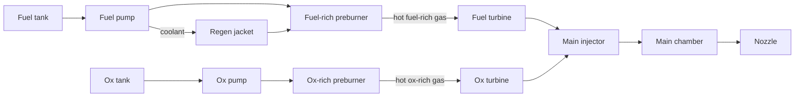

# Oral Exam Question Bank — Examiner's Key

Part VI · Companion to [`oral-exam.md`](oral-exam.md)

This is not a set of model answers. An oral exam has no script, and a candidate
reciting one is transparent from the far side of the table. For each of the
sixty items the key gives:

- **What a strong answer contains** — the content, equations and numbers an
  examiner is listening for, and the trade-offs they want you to raise
  unprompted. Bulleted, because that is how it is scored: as a checklist of
  things you either said or did not.
- **Per-follow-up notes** — what each follow-up is actually testing, which is
  usually not the surface topic, and the answer that satisfies it.
- **What ends the line of questioning early** — the one observation that makes
  further pushing pointless. Examiners stop when the candidate demonstrably
  owns the mechanism; they keep going when they suspect recall. Saying the
  ending line early is the difference between a fifteen-minute item and a
  four-minute one.
- **Classic wrong turn** — the failure the examiner has seen most often on
  this material, and what it reveals.

**Numbers.** Every quantitative figure below was computed with
[`tools/rocket.py`](../tools/rocket.py) and is registered in
[`tools/examples/oral.py`](../tools/examples/oral.py); run
`python3 tools/check_examples.py` to reproduce the set. Real-engine figures
come only from [`reference/engine-database.md`](../reference/engine-database.md),
carrying that file's confidence labels, `inj`/`noz` pressure-station flags,
`/motor` versus `/vehicle` tags, and contested-figure notes. Where the database
records a company claim, this key says "claim" every time it uses the number.
Citation tags in brackets refer to [`reference/sources.md`](../reference/sources.md).

**Epistemic tags** are as in the course README: [F] fundamental, [E] empirical,
[H] historical, [M] modern practice, [R] research, [A] approximation,
[J] judgment.

**A standing warning about the reference chamber.** Items 2, 3, 5, 12, 13, 22
and 23 all use one consistent LOX/RP-1 chamber — γ = 1.20, M = 23 kg/kmol,
T₀ = 3600 K, p_c = 97 bar, F_SL = 845 kN — chosen so the answers cannot drift
apart across items. The 97 bar and 845 kN inputs are SpaceX's published Merlin
1D figures, which the database records as a **claim with no primary source and
no stated pressure station** `[engine-database A.3]`. Everything computed from
them is arithmetic on a claim. A candidate who quotes 260.9 mm of throat
diameter as a fact about a real Merlin has made exactly the error this course
spends thirty-six modules trying to prevent.

---

# Block A — Foundations (items 1–8)

## Item 1 — Thrust from first principles `[M01, M03]`

**What a strong answer contains**

- The control volume drawn *before* the algebra, cutting the propellant inlets
  (where inflow momentum is negligible if the vehicle frame is used) and the
  nozzle exit plane, with the outside surface at ambient pressure. [F]
- $F = \dot m v_e + (p_e - p_a)A_e$, with each term identified: momentum flux
  out, plus the residual of integrating pressure over the whole closed surface.
  [F] `[SB §2.2]`
- A statement of which frame the answer is in, and the observation that thrust
  is what the *mount* feels, not what the exhaust "does".
- The magnitude: for a first-stage nozzle the pressure term is worth roughly
  10–20 % of sea-level thrust; the V-2 was rated ~245 kN SL rising to ~285 kN
  vac, a 16 % altitude gain `[engine-database A.1, A.1.5]`.

**F1 — "the exhaust pushes on the atmosphere".** This is a screen for whether
the pressure term is understood as bookkeeping. It is not the exhaust shoving
against air: $p_a$ acts everywhere on the engine's exterior *except* the exit
disc, and the term is what is left over. A rocket in vacuum has the largest
pressure term of all, which disposes of the claim in one sentence.

**F2 — the alternative control volume.** Extend the surface downstream until
the plume has expanded to ambient. Then $p_e = p_a$ identically, the pressure
term vanishes, and all the thrust is momentum flux at a higher $v_e$. Two
control volumes, one thrust: the split between the terms is a choice of
accounting surface, not physics. [F]

**F3 — the A-7 thrust triple.** 75,000 lbf is the NAA 75-110 nameplate rating;
78,000 lbf is that plus roughly 3,000 lbf of steam-generator exhaust thrust;
82,977 lbf (369 kN) SL / 93,565 lbf (416 kN) vac is the uprated A-7 as flown on
Mercury-Redstone `[engine-database A.1.1]`. Three control-volume boundaries and
two engine blocks. The right answer names *which* boundary each figure uses.

**F4 — turbine exhaust dumped overboard.** It is thrust, it is inside any
control volume that cuts the vehicle rather than the engine, and it is measured
directly by a stand load cell that carries the whole engine — which is why
stand thrust and "chamber thrust" from $C_F p_c A_t$ disagree on
gas-generator engines. The RS-68's GG exhaust goes through a side duct
`[engine-database A.2]`; the F-1's went into the nozzle extension as a film
curtain and is inside the nozzle's own accounting `[engine-database A.2]`.

**Ends the line early.** "The pressure term is the residual of a surface
integral, so it depends on where I put the surface — here is a second control
volume with no pressure term at all and the same thrust."

**Classic wrong turn.** Deriving the equation correctly and then explaining it
as action–reaction against the air. It reveals that the derivation was
memorised, and it predicts the wrong sign for the altitude trend.

## Item 2 — Why performance splits into c\* and C_F `[M03]`

**What a strong answer contains**

- $I_{sp} g_0 = c = c^{*} C_F$, with $c^{*} = p_c A_t/\dot m$ and
  $C_F = F/(p_c A_t)$. [F] `[SB §3.3]`
- The split is diagnostic, not cosmetic: it separates *how well the propellant
  released its energy and how well it was mixed* from *how well the nozzle
  turned that into axial momentum*. Two subsystems, two owners, two fixes.
- The reference chamber worked: γ = 1.20, R = 361.4983 J/(kg·K) (M = 23),
  T₀ = 3600 K gives Γ = 0.648531 and c\* = **1759.03 m/s**; at ε = 16 and
  p_c = 97 bar, sea-level $C_F$ = **1.62995**, so c = **2867.1 m/s** and
  Isp_SL = **292.4 s**. Merlin 1D's published SL Isp is 282 s
  `[engine-database A.3, claim]` — the ideal is ~4 % optimistic, which is the
  loss budget of item 7.

**F1 — which is propellant, which is geometry.** c\* is *nearly* pure
propellant and chamber: it depends on γ, R and T₀, which the mixture ratio and
the chamber pressure set, and on how completely combustion finished, which the
injector and L\* set. $C_F$ is *nearly* pure geometry: γ, ε and $p_a/p_c$. The
impurity in each is worth saying — c\* has a weak chamber-pressure dependence
through dissociation, and $C_F$ inherits γ from the chemistry.

**F2 — computing both efficiencies.** $\eta_{c^*} = c^*_{meas}/c^*_{ideal}$
indicts the injector, the chamber length and the mixture-ratio distribution.
$\eta_{C_F}$ indicts the nozzle contour, the divergence angle and the boundary
layer. Worked case for the reference chamber: a measured $\dot m$ of 306.0 kg/s
against the ideal 294.72 kg/s gives
$c^*_{meas} = 97\times10^5 \times 0.05344557/306.0 = 1693.6$ m/s and
$\eta_{c^*} = 0.963$ — a typical, unremarkable, *acceptable* number.

**F3 — where to spend the money.** $\eta_{c^*} = 0.96$ leaves 4 % on the table;
$\eta_{C_F} = 0.99$ leaves 1 %, and most of that 1 % is boundary-layer loss you
cannot buy back. Injector redesign is where the money goes. The strong answer
adds that injector changes threaten stability and therefore drag in a bomb-test
campaign — a 2 % Isp gain that costs a stability requalification may not close
`[SP-194]`.

**F4 — η > 1.** It means the "ideal" was computed wrong, or $A_t$ has eroded
(so the real throat is bigger than the drawing), or the pressure tap is reading
a different station from the one the ideal assumed, or the flowmeter is under-
reading. On a solid, throat erosion is the usual answer; on a liquid, the
pressure station is `[engine-database, "What Pc means"]`.

**Ends the line early.** "The split exists so that a bad number points at a
subsystem. Give me p_c, A_t, ṁ and F and I will tell you whether to go and see
the injector team or the nozzle team."

**Classic wrong turn.** Saying c\* is "the propellant's specific impulse". It
is not an impulse, it has no nozzle in it, and treating it that way makes the
candidate unable to explain why c\* is unchanged when you bolt on an extension.

## Item 3 — Choking and what the throat controls `[M02]`

**What a strong answer contains**

- Choking stated as a physical mechanism, not a formula: information travels at
  the local speed of sound relative to the fluid, so once the throat reaches
  M = 1 no downstream disturbance can propagate upstream past it. [F]
  `[Anderson-MCF §5]`
- $\dot m = \Gamma p_0 A_t/\sqrt{R T_0}$ with
  $\Gamma = \sqrt{\gamma}\,(2/(\gamma+1))^{(\gamma+1)/2(\gamma-1)}$ — linear in
  $p_0$ and $A_t$, inverse-square-root in $T_0$, and *nothing* about the
  downstream. [F]
- The reference chamber: **294.72 kg/s** at 97 bar through 0.05345 m². Doubling
  to 194 bar gives **589.44 kg/s** exactly — the linearity is the point.

**F1 — doubling chamber pressure.** Mass flow doubles. Thrust
($F = C_F p_c A_t$) roughly doubles — only *roughly*, because $C_F$ creeps up
as the ambient-pressure term becomes a smaller fraction: at ε = 34.34 and
γ = 1.20, $C_F^{SL}$ goes from **1.6393** at 150 bar to **1.7553** at 300 bar, a
7 % gain. Isp therefore rises by that same ~7 %, not by a factor of two. A
candidate who says "Isp doubles" has confused thrust with efficiency; one who
says "Isp is unchanged" has forgotten the ambient term.

**F2 — 6 % throat erosion, solid versus pressure-fed liquid.** Solid: the
burning area does not care, so pressure re-equilibrates at
$p_2/p_1 = (A_{t1}/A_{t2})^{1/(1-n)} = (1/1.06)^{1/0.65} = 0.9143$, an 8.6 %
pressure drop — the erosion is *amplified* by the exponent. [E] Pressure-fed
liquid: the injector Δp is what sets flow, so a bigger throat means lower
chamber pressure, more injector Δp, *more* flow, and the system finds a new
point with higher ṁ and lower p_c. Different in kind because the solid's
"injector" is the propellant surface itself and its flow rises with pressure.

**F3 — where the sonic point really is.** Slightly downstream of the geometric
minimum, displaced by wall curvature and by the boundary-layer displacement
thickness; the sonic line is curved, not flat. You care when computing $A_t$
from a drawing for a c\* determination — a 1 % area error is a 1 % c\* error,
which is the size of the effect you are trying to measure. `[ZH Vol. 1]`

**F4 — 3 % low mass flow at correct p_c.** Candidates: (i) $A_t$ smaller than
drawing — measure it; (ii) flowmeter calibration — cross-check with tank
level/weight; (iii) T₀ higher than assumed, i.e. mixture ratio off — check the
two flows independently; (iv) the pressure tap is reading a different station.
The separating measurement is a tank-gauging mass balance against the
integrated flowmeter signal, because it is independent of both.

**Ends the line early.** "Choked flow makes ṁ a boundary condition set entirely
upstream — that is why $A_t$ is the one dimension you machine to a tenth of a
percent."

**Classic wrong turn.** Saying flow chokes "because the gas cannot go faster
than sound". It can and does, immediately downstream. The constraint is on
information, not on speed.

## Item 4 — What CEA gives you and what it does not `[M04, M01]`

**What a strong answer contains**

- What was solved: minimisation of Gibbs free energy over a species set at
  fixed enthalpy and pressure, then an isentropic expansion, giving equilibrium
  composition, T₀, γ (an effective one), M, c\*, and Isp at stated ε.
  `[CEA]`, `[RP-1311]`
- What to trust: c\* and T₀ to a couple of percent, *given* correct thermo data
  and the assumption of complete mixing. What not to trust: any implication
  that the injector achieves that mixing, any two-phase or particle effects
  unless asked for, and Isp quoted without stating frozen or shifting.
- The habit of stating the assumption set out loud: adiabatic, one-dimensional,
  chemical equilibrium at every station, no boundary layer, no droplets.

**F1 — frozen versus shifting.** Shifting (composition re-equilibrates as the
gas cools, releasing recombination energy) is the optimistic bound; frozen
(composition locked at the throat) is the pessimistic one. For a large
hydrocarbon engine the gap is roughly 2–4 % of Isp; for hydrolox it is larger
because there is more dissociation to recombine. Real engines land between and
nearer shifting. [A] `[SB §5.4]`, `[CPIA-246]`

**F2 — off-optimum mixture ratio.** Five reasons, all worth points: (i) the
Isp optimum and the *density-impulse* optimum are at different O/F, and vehicle
mass cares about the second; (ii) running fuel-rich lowers T₀ and buys cooling
margin; (iii) fuel-rich exhaust is less aggressive to the turbine and the wall;
(iv) film and barrier cooling deliberately runs the near-wall zone rich; (v)
the flame temperature optimum and the c\* optimum are not at the same O/F
because M is falling as you go rich. The F-1 ran 2.27 and the RD-180 runs 2.72
`noz`† `[engine-database A.2, A.6]`.

**F3 — doubling chamber pressure 100 → 200 bar.** T₀ rises a little (less
dissociation at higher pressure), c\* rises a little for the same reason —
both effects are a percent or two. Isp at fixed ε rises mostly because $C_F$
improves against a fixed ambient. The *smallest* of the three effects is the
c\* gain. A candidate who claims a large c\* gain from pressure has not
internalised that c\* is nearly pressure-independent. [F]

**F4 — verifying CEA against a hot fire.** Measure p_c, A_t and ṁ, form
$c^*_{meas}$, and compare to CEA's c\* at the *measured* mixture ratio — which
means you need both flows accurately, so the flowmeters are the experiment.
State that you are measuring $\eta_{c^*}$, a product of CEA error and injector
performance, and that separating them needs either a very long chamber (drive
η → 1) or a second chamber length.

**Ends the line early.** "CEA tells me the best the chemistry can do with
perfect mixing. Everything between that and my test data belongs to the
injector."

**Classic wrong turn.** Quoting a CEA Isp as the engine's Isp. It has no
boundary layer, no divergence loss, no film cooling and no mixing shortfall,
and it is 4–8 % high for a real engine.

## Item 5 — Expansion ratio and the altitude compromise `[M02, M03, M09]`

**What a strong answer contains**

- The two competing terms in $C_F$: the momentum term grows with ε, the
  pressure term $-(p_a/p_c)\varepsilon$ punishes it at low altitude. [F]
- Optimum ε is where $p_e = p_a$; the proof is that $dF/d\varepsilon$ has the
  factor $(p_e - p_a)$, so thrust is stationary exactly there. [F] `[SB §3.4]`
- Numbers for the reference chamber: at 97 bar the sea-level-optimum ε is
  **11.48**; at the RS-25's 206.4 bar `inj` it is **20.5**. Real first stages
  fly higher than that — Merlin 1D at 16, Raptor at ~34.3 (claim) — because the
  vehicle spends most of the burn above sea level and the integral, not the
  liftoff instant, is what matters `[engine-database A.3]`.
- Vacuum $C_F$ at γ = 1.20: **1.7971** at ε = 16, **1.8843** at 40, **1.9349**
  at 77.5, **2.0040** at 240; at γ = 1.19, **2.0299** at ε = 285. The diminishing
  return is visible without a plot.

**F1 — why nobody flies at the sea-level optimum.** Because the objective is
mission Δv, not liftoff thrust. Over-expanding slightly costs a little at t = 0
and pays for the rest of the burn. The constraint that stops you is flow
separation and side loads, not performance.

**F2 — break-even altitude, set up.** Equate the two $C_F$ values:
$p_{a,BE} = p_c\,[C_F^{vac}(\varepsilon_2) - C_F^{vac}(\varepsilon_1)]/(\varepsilon_2-\varepsilon_1)$,
then invert the troposphere,
$h = (T_0/L)\,[1 - (p_a/p_{SL})^{R_{air}L/g_0}]$ with T₀ = 288.15 K,
L = 0.0065 K/m, $R_{air}$ = 287.05 J/(kg·K). For 100 bar between ε = 16 and 60
this lands near 10 km. [A]

**F3 — why stop at ε = 285.** Four limits, and the strong answer gives at least
three: nozzle mass grows faster than the Isp gain (the $C_F$ curve is flat out
there — 240 → 285 is worth under 1 %); the exit diameter must fit the stage and
the fairing, which is why RL10B-2's extension is deployable
`[engine-database A.2.7]`; the boundary layer thickens and eats the ideal gain;
and an uncooled radiative extension has a temperature limit set by the material,
which for the RL10B-2 is 3D carbon–carbon.

**F4 — later staging.** Later separation means more of the burn happens higher
up, so the optimum first-stage ε goes **up**. It depends on payload only through
the trajectory it forces — a heavier payload flies a lofted, lower-dynamic-
pressure profile and shifts the answer again. [J]

**Ends the line early.** "$C_F$ is flat near the optimum and the ambient
penalty is linear in ε, so the design point is set by separation and by nozzle
mass, not by the optimum."

**Classic wrong turn.** Designing to $p_e = p_a$ at sea level for a first
stage. It is the textbook optimum for a single instant that the vehicle spends
almost none of its burn at.

## Item 6 — Molecular weight, gamma, temperature `[M01, M04]`

**What a strong answer contains**

- $c^{*} = \sqrt{R T_0}/\Gamma$ with $R = R_u/M$, so $c^{*}\propto\sqrt{T_0/M}$
  at fixed γ. [F]
- The asymmetry of the two levers: T₀ is bounded above by materials, cooling
  and dissociation and is roughly the same 3,300–3,700 K for every practical
  chemistry; M varies by a factor of ten between hydrolox (~13.5) and a
  metallised solid (~28–29). M is where the freedom is.
- Worked contrast: LOX/LH2 at γ = 1.19, M = 13.5, T₀ = 3550 K gives
  c\* = **2286.9 m/s**; the reference LOX/RP-1 chamber gives **1759.0 m/s**.
  A 30 % c\* advantage from molecular weight alone.

**F1 — cooler and better.** Hydrolox at O/F ≈ 6 burns near 3,300–3,600 K,
cooler than LOX/RP-1's ~3,600 K, but at M ≈ 13.5 against ~23. The ratio
$\sqrt{T_0/M}$ favours hydrogen by about $\sqrt{(3550/13.5)/(3600/23)} = 1.30$.
Molecular weight beats temperature, and it beats it by more than the
temperature deficit costs.

**F2 — what γ does, twice, with opposite sign.** In c\*, low γ *helps*: Γ falls
as γ falls, and c\* = √(RT₀)/Γ. In $C_F$, low γ also helps, because a softer
gas converts more enthalpy per unit pressure ratio. But low γ comes from
polyatomic, heavy species, which raises M and hurts c\* — so the γ preference
is real but usually dominated by what γ implies about M. Saying "γ appears in
both and I have to be careful about which effect wins" is the answer; picking
a side without justification is not.

**F3 — cold helium against hydrolox.** Helium at 300 K, γ = 1.667, M = 4.003
gives ideal vacuum Isp **178.1 s** at ε = 50; hydrolox gets ~450 s. The ratio is
2.5. Account: $\sqrt{T_0}$ contributes $\sqrt{3550/300} = 3.44$; $\sqrt{1/M}$
runs the *other* way, $\sqrt{4.003/13.5} = 0.54$; Γ and $C_F$ differences make
up the rest. Temperature is doing all the work, and helium's tiny molecular
weight is the only reason cold gas is not worse still.

**F4 — fuel-rich as a lever.** For hydrolox, going rich adds free H₂ (M = 2) to
the exhaust, dropping mean M sharply — a big lever, which is why the optimum
O/F for Isp (~4.5–5) sits well below stoichiometric (8). For a hydrocarbon, the
excess fuel decomposes to CO, CH₄ and carbon, which do not drop M much and can
condense — a weak lever, and one that eventually costs you c\* to soot. The J-2
exploited exactly this, shifting O/F 4.5–5.5 with a PU valve to trade thrust
780–1,000 kN against Isp `[engine-database A.2]`.

**Ends the line early.** "T₀ is capped by materials at roughly the same value
for every chemistry, so the whole game is molecular weight — which is why
hydrogen wins and why every cold-gas system is a molecular-weight argument."

**Classic wrong turn.** "Hydrogen is better because it burns hotter." It burns
cooler at its operating point, and a candidate who says otherwise cannot then
explain why hydrolox chambers are easier to cool than kerolox ones.

## Item 7 — The Isp loss budget `[M03, M09]`

**What a strong answer contains**

- The named terms, roughly in order for a large booster: combustion/mixing
  inefficiency (1–4 %), boundary-layer/friction (0.5–1.5 %), divergence
  (0.5–2 %), two-phase or kinetic (0–2 %, chemistry-dependent), film-cooling
  dilution (0–3 %, if used), and cycle losses if the accounting includes
  turbine flow. `[CPIA-246]`, `[SB §3.5]`
- The 366 → 348 s example: 18 s is ~4.9 %, which is a *normal* stack for a
  gas-generator engine, not a sign of anything wrong.
- The candidate should ask what the 366 s was — frozen or shifting, and at
  what ε — before allocating anything to it.

**F1 — multiply or add.** Physically they multiply: each is an efficiency on
what survives the previous one. Numerically it barely matters at these sizes —
a multiplicative stack on 366 s gives 349.1 s where the additive one gives
348.8 s, a 0.3 s difference. Saying "they multiply, and here is the arithmetic
showing that it does not matter here" is a stronger answer than either
convention alone. [A]

**F2 — reordering for two engines.** Pressure-fed hypergolic upper stage:
divergence and boundary layer dominate (large ε, small size, low Reynolds
number, thick boundary layer), combustion loss is small because hypergols mix
and react fast, and there is no cycle loss at all. Staged-combustion booster:
combustion loss is small (high p_c, good atomisation), cycle loss is zero by
definition, and the biggest term is boundary layer plus whatever film cooling
is spent. The item is testing whether "the loss budget" is a memorised list or
a physical model.

**F3 — divergence factor derived.** Integrate the axial component of exit
momentum over a spherical cap of half-angle α:
$\lambda = (1 + \cos\alpha)/2$, which is 0.9830 for α = 15°, a 1.7 % loss. [F]
Say that a bell recovers most of it by turning the flow back toward axial.

**F4 — what a bigger engine has less of.** Boundary-layer loss, because the
boundary layer is a surface effect and thrust is a volume/area effect — the
wetted-area-to-throat-area ratio falls with size. Also relatively less film
cooling for the same wall margin, for the same reason. This is the same scaling
argument as the expander-cycle ceiling in item 29, and saying so out loud is
worth points.

**Ends the line early.** "Before I allocate anything I need to know whether 366
is frozen or shifting and at what area ratio — otherwise I am budgeting against
a number that may already contain half the answer."

**Classic wrong turn.** Attributing the whole shortfall to "combustion
efficiency". It puts 18 s on the injector when a third of it belongs to the
boundary layer and the divergence angle, and it sends the wrong team to work.

## Item 8 — Reading a hot-fire record `[M03, M18]`

**What a strong answer contains**

- An order, stated as a procedure: (i) did the sequence execute — valve
  positions and timings; (ii) chamber pressure trace shape — start transient,
  overshoot, steady value; (iii) both flows and therefore mixture ratio;
  (iv) thrust against $C_F p_c A_t$ for consistency; (v) wall temperatures last,
  because they are slow and they are the *consequence* of everything above.
- The instinct to check consistency between independent channels before
  believing any of them. `[SP-8041]`, `[CPIA-246]`
- Sample-rate awareness: chamber pressure needs kHz-class sampling to see chug
  and screech; thermocouples at 10 Hz are fine and anything faster is a lie
  about their response time.

**F1 — 4 % C_F disagreement.** In likelihood order: (i) throat area differs
from drawing (erosion, thermal growth, or it was never measured); (ii) the
pressure tap station — injector-end versus nozzle-stagnation is worth a few
percent by itself `[engine-database, "What Pc means"]`; (iii) load-cell
alignment or tare, including line-tension restraint from propellant hoses;
(iv) real nozzle losses that the ideal $C_F$ omits; (v) transducer
calibration drift.

**F2 — uncertainty combination.** Isp = F/(ṁ g₀): with ±0.25 % on thrust and
±0.5 % on total flow, RSS gives **±0.56 %**. c\* = p_c A_t/ṁ: with ±0.3 % on
pressure and ±0.5 % on flow (area taken as exact), RSS gives **±0.58 %**. Then
the point the examiner wants: a 1 % Isp improvement is *inside* the noise of a
single test, so acceptance is on a population of tests, not one.

**F3 — one thermocouple 150 K hot from t = 0.4 s.** First hypothesis: a local
hot streak from injector maldistribution — a plugged or misdrilled element, or
an element running locally ox-rich. Second, which must be ruled out first
because it is cheaper: the instrument itself — debonded thermocouple, changed
contact resistance, or a wiring fault. Check whether the offset appeared at the
same instant as anything in the sequence, and whether the channel's noise
character changed. Only then go near hardware. `[SP-8089]`

**F4 — what you refuse to accept on.** Anything with a stability event, however
brief; anything where the sequence did not execute as written; any test where
the instrumentation set was incomplete for the parameter being accepted; any
excursion outside the qualified box even if performance was nominal. The
principle: acceptance tests demonstrate conformance, they do not discover
whether the design works. `[SMC-S-016]`

**Ends the line early.** "I look for consistency between channels first,
because a trace that disagrees with another trace tells me more than either
trace's absolute value."

**Classic wrong turn.** Going straight to the wall temperatures because they
look alarming. They are the slowest, most derived, least trustworthy channel on
the stand, and they cannot be interpreted until the mixture ratio is known.

---

# Block B — Liquid rocket engines (items 9–33)

## Item 9 — Propellant selection `[M05, M32]`

**What a strong answer contains**

- A shortlist with reasons: LOX/RP-1 (dense, cheap, mature, coking-limited),
  LOX/CH₄ (clean burning, good coolant, benign reuse, ISRU story),
  LOX/LH2 (best Isp, worst everything else for a booster).
- The deciding quantities named before Isp: **density impulse** (stage volume
  and therefore dry mass), **reusability** (coking, cleanliness, restart),
  **operability** (boil-off, ground handling, turnaround), **cost per kg**, and
  **cooling capacity of the fuel**.
- Numbers: LOX/RP-1 bulk density ≈ 1,030 kg/m³ at Isp_vac 311 s gives a density
  impulse of **320,330 kg·s/m³** `[engine-database A.3]`; a solid at
  1,770 kg/m³ and 268 s gives **474,360 kg·s/m³** — 48 % more impulse per unit
  volume than kerolox despite 14 % less Isp.

**F1 — defending Isp not being first.** Isp enters Δv logarithmically; inert
mass enters it through the mass ratio, and propellant *density* sets tank
volume, which sets structural mass, which sets inert mass. For a first stage,
where Δv is small and dry mass is large, density and operability dominate. For
an upper stage the ordering reverses, and saying so is what separates a
considered answer from a slogan.

**F2 — methane against kerosene, the full ledger.** Methane: ~6 % better Isp,
much better coolant (no coking limit, supercritical over the whole channel),
burns clean so reuse inspection is cheap, single-fluid autogenous
pressurisation possible, common cryogenic ground system with LOX. Costs: ~40 %
lower density so bigger tanks; cryogenic handling and boil-off where RP-1 is
ambient; larger pumps for the same mass flow; a two-cryogen pad. The database
records Raptor at 250–330 bar across blocks and BE-4 at 140 bar `n.s.`, both
**claims** `[engine-database A.3]`.

**F3 — density impulse.** $\rho I_{sp}$, units kg·s/m³ (or the impulse-per-
volume form $\rho I_{sp} g_0$ in N·s/m³). It beats Isp as a figure of merit
wherever volume, not mass, is the binding constraint: strap-on boosters, a
first stage inside a fixed vehicle diameter, and any missile in a launch tube —
which is the whole argument for solids in item 34.

**F4 — 30 days fuelled on the pad.** Cryogens are out unless you accept
topping and a boil-off budget; storables come back into contention with their
Isp and toxicity penalties; a hybrid architecture with a storable upper stage
appears. This is where the candidate should notice that the requirement has
quietly changed the vehicle, not just the propellant.

**F5 — what you would refuse to fly crewed.** The defensible refusals are on
toxicity and abort behaviour: NTO/hydrazine ground operations near a crew, or
anything whose failure mode is a detonable mixed-propellant volume. Note that
the industry has flown all of them crewed — Titan II on Gemini, hypergolic
Apollo SPS — so a candidate who says "never" without acknowledging the history
is weaker than one who argues the modern cost of the ground operation.
`[Clark]`, `[SLPRE]`

**Ends the line early.** "For this stage the objective function is stage dry
mass per unit Δv with a turnaround constraint, and Isp is the third term in it."

**Classic wrong turn.** Ranking by vacuum Isp and stopping. It picks hydrolox
for a reusable booster, which is the one answer the industry has repeatedly
declined to adopt.

## Item 10 — The hydrogen tax `[M05, M11, M12]`

**What a strong answer contains**

- Density: ~71 kg/m³ liquid against ~810 for RP-1. At O/F 6 the bulk density of
  a hydrolox stage is roughly a third of a kerolox one.
- Consequences enumerated as *systems*, not adjectives: tank volume →
  insulation area → boil-off and dry mass; low density → enormous volumetric
  pump flow → many stages; 20 K storage → materials, purge, and pad
  complexity; wide flammability limits and small ignition energy → hazard
  distances `[G-095]`.
- The counter-case, which the strong answer volunteers: hydrogen is unbeatable
  on upper stages where Isp compounds, and it is the best regenerative coolant
  known.

**F1 — quantifying the tankage penalty.** Volume ratio is the easy part.
Beyond it: insulation mass scales with tank *area*, and area grows as
$V^{2/3}$, so the penalty is sublinear but real; boil-off scales with area and
mission duration; and the low density means the tank is pressure-stabilised
against a much smaller hydrostatic head, which changes the buckling problem
`[SP-8007]`.

**F2 — pump stages.** Head rise for a given Δp goes as $1/\rho$:
$H = \Delta p/(\rho g_0)$. To make 200 bar in hydrogen you need roughly eleven
times the head of the same Δp in kerosene, and stage head rise is limited by
tip speed and material strength — hence the RS-25's **three-stage** centrifugal
HPFTP at ~35,360 rpm and 53 MW against a single-stage kerosene pump
`[engine-database A.2]`.

**F3 — the best coolant, and when that becomes a constraint.** High specific
heat, huge available temperature rise, no coking limit, and low viscosity give
enormous coolant-side film coefficients. It becomes a constraint in the
expander cycle: the cycle's power comes from heat picked up in the jacket, so
the engine's size is limited by the wall area available to heat the hydrogen —
the ceiling derived in item 29. The RL10A-3-3A's 32.8 bar chamber pressure is
that ceiling, by design `[engine-database A.2]`.

**F4 — where hydrogen still wins.** Upper stages and in-space: RL10B-2 at
**465.5 s** vacuum is the highest Isp of any flown chemical engine, Vinci at
457.2 s, LE-5B at 446.8 s `[engine-database A.2, A.4, A.5]`. The RL10 survives
because the expander cycle is inherently benign — no preburner, nothing dumped,
mild turbine temperatures — which makes it cheap to qualify and easy to restart.

**Ends the line early.** "Hydrogen's problem is that everything except Isp
scales with volume, and a booster is a volume-limited machine."

**Classic wrong turn.** Blaming "cryogenic complexity" generically. LOX is
cryogenic too and nobody minds; the argument has to be specifically about 20 K,
71 kg/m³, and the pump head.

## Item 11 — Hypergols and storables `[M05, M08]`

**What a strong answer contains**

- The real figure of merit in space is not Isp, it is **ignition reliability
  after months of cold soak, on the thousandth restart**. Hypergols deliver it
  with no igniter, no ignition energy, no spark exciter, and no torch feed
  system to fail.
- Storability: no boil-off, no insulation, no venting, no thermal management of
  a cryogen through a coast.
- The costs, stated honestly: Isp_vac ~314.5 s for the Apollo SPS on
  NTO/Aerozine 50, ~316 s for the Shuttle OMS on NTO/MMH, ~312 s for the R-4D
  (~322 s for the rhenium-iridium version) `[engine-database A.8]`, against
  450+ for hydrolox; plus toxicity, ground handling, and materials
  compatibility.

**F1 — what hypergolic buys.** It removes an entire subsystem *and its failure
modes*: igniter power, igniter propellant, igniter sequencing, ignition
detection, and the hard-start risk from an ignition delay. On a spacecraft with
a thousand RCS pulses, an igniter with 0.999 reliability per firing is a
certainty of failure; a hypergolic pair has no per-firing ignition event to
fail.

**F2 — ignition delay too long or too short.** Too long: propellant accumulates
unburnt in the chamber and detonates when it does light — the classic hard
start, with a pressure spike that can exceed the chamber's burst margin. Too
short: reaction occurs in the injector face region before mixing, giving poor
c\*, face erosion, and sometimes reactive stream separation that prevents
impingement entirely. `[Clark]`, `[SP-8089]`

**F3 — justifying 6.9 bar.** Chamber pressure buys Isp mainly through $C_F$
against ambient, and in vacuum there is no ambient — a large ε does the same
job. Low p_c means: a pressure-fed system with light tanks (tank pressure
scales with p_c), no turbomachinery at all, ablative or radiative cooling
sufficient because heat flux scales roughly with $p_c^{0.8}$, and a chamber
that can be built cheaply and qualified once. The SPS is 6.9 bar `inj` at
ε = 62.5 `[engine-database A.8]`. It is the correct answer to its requirement.

**F4 — a new lunar descent engine.** For: heritage, restartability, deep
throttling demonstrated (LMDE throttled 46.7 kN to ~10 %, p_c 7.6 bar down to
0.76 bar `[engine-database A.8]`), storable through a long coast. Against:
toxicity drives crew and ground cost; methalox offers ~40 s more Isp, ISRU
compatibility, and non-toxic handling; deep throttling has since been
demonstrated on pump-fed cryogenic engines. A defensible answer exists either
way; an answer with only one side does not.

**Ends the line early.** "In space the figure of merit is ignition reliability
per firing, and a hypergolic pair has no ignition event to fail."

**Classic wrong turn.** Treating hypergols as a legacy choice that modern
programmes have moved past. Every crewed spacecraft flying today uses them for
RCS.

## Item 12 — Chamber sizing and L\* `[M06]`

**What a strong answer contains**

- $V_c = L^{*} A_t$, with L\* an empirical stand-in for the residence time
  needed to atomise, vaporise, mix and burn. [E] `[SB §8.1]`, `[SP-8120]`
- The honest statement that L\* is a *correlation*, not a physical length, and
  that its real content is $t_{res} = V_c \rho_c/\dot m$.
- Typical values: 0.8–1.3 m for LOX/RP-1, ~0.6–0.9 m for LOX/LH2 (hydrogen
  vaporises fast), 0.8–1.0 m for storables, and 1.5–2.5 m for early
  1950s-vintage designs.

**F1 — the arithmetic.** $V_c = 1.0 \times 0.05344557 =$ **0.05345 m³**.
Chamber gas density $\rho_c = p_c/(R T_0) = 97\times10^5/(361.4983\times3600) =$
**7.4535 kg/m³**. Residence time
$t_{res} = V_c\rho_c/\dot m = 0.05345\times7.4535/294.72 =$ **1.352 ms**. Is it
plausible? Yes — millisecond-class residence is exactly what droplet vaporisation
needs, and it is the number that makes the whole L\* concept intelligible.

**F2 — why L\* fell.** Better injectors. Finer atomisation and faster mixing
mean the same completeness in less time: element design moved from drilled
showerheads to designed impinging patterns and coaxial elements, orifice
tolerances tightened, and cold-flow characterisation `[Rupe65]` let designers
predict mixture-ratio distribution instead of discovering it. Higher chamber
pressure also helps by raising density and shortening droplet lifetimes.

**F3 — mechanisms at both ends.** Too small: incomplete vaporisation and mixing
at the throat, so c\* efficiency falls and unburnt propellant burns in the
nozzle, where it does no useful work and heats the wall. Too large: more wetted
area (more heat load and more coolant Δp), more mass, more stagnation-pressure
loss, and — the one candidates miss — a longer chamber supports lower-frequency
longitudinal acoustic modes, moving you into a régime where the combustion
response can couple. `[SP-194]`

**F4 — double p_c at constant thrust.** $A_t$ halves, so at constant L\*, $V_c$
halves. $\rho_c$ doubles and ṁ is unchanged, so $t_{res}$ is unchanged — which
is the reassuring part. Chamber *mass* falls less than volume does because wall
thickness must rise with pressure; and heat flux per unit area rises as
$p_c^{0.8}$, so the cooling problem gets harder even as the chamber gets
smaller. That last clause is what the examiner is waiting for.

**Ends the line early.** "L\* is a proxy for residence time; here is the
residence time, and it is a millisecond, which is the number that actually has
physics in it."

**Classic wrong turn.** Treating L\* as a fundamental constant of the
propellant. It is a correlation that has moved by a factor of two within one
propellant combination as injectors improved.

## Item 13 — Contraction ratio `[M06, M02]`

**What a strong answer contains**

- $\varepsilon_c = A_c/A_t$, typically 2–4 for large engines and up to 8–10 for
  small ones.
- The upper limit is set by chamber mass, wetted area and heat load; the lower
  limit by chamber Mach number, which costs stagnation pressure and, at the
  extreme, chokes the chamber.
- Injector face area is $A_c$, so contraction ratio and element count are the
  same decision seen twice.

**F1 — where Mach number starts to cost.** Subsonic root at γ = 1.20:
$\varepsilon_c = 3$ gives M = **0.2018** and $p_0/p =$ **1.0247**, a 2.4 %
stagnation-to-static difference. At $\varepsilon_c = 2$, M = **0.3122** and
$p_0/p =$ **1.0599**, ~6 %. Below about 2 the loss becomes a real Isp term and
the injector-face pressure and the throat stagnation pressure are meaningfully
different numbers — which is the pressure-station problem in miniature.

**F2 — small engines run higher.** Two reasons. Geometric: element size does
not scale down indefinitely (orifices below ~0.5 mm plug and are hard to drill
consistently), so a small engine needs relatively more face area per unit
throat area. Thermal: small chambers have a worse surface-to-volume ratio, so
designers accept a fatter chamber to keep local flux down. `[SP-8089]`

**F3 — coupling to elements and stability.** Face area sets how many elements
fit at a given element pitch; element count sets per-element flow, which sets
orifice size and injection velocity; those set atomisation and the
characteristic time of the combustion response, which is what couples to
acoustics. A designer who changes contraction ratio has changed the stability
problem whether they meant to or not. `[SP-194]`, `[SP-8113]`

**Ends the line early.** "Contraction ratio is the injector's area budget
disguised as a gas-dynamics parameter."

**Classic wrong turn.** Choosing it "from the handbook range" with no statement
of what binds at each end.

## Item 14 — Injector element selection `[M07]`

**What a strong answer contains**

- The candidate set with the physics of each: coaxial shear (a slow central
  liquid stream stripped by a fast annular gas — needs a large velocity ratio,
  which needs a gasified or very light outer fluid), impinging doublets and
  triplets (momentum exchange at the impingement point, mixing set by momentum
  ratio and impingement angle), swirl coax (centrifugal sheet breakup, common
  in Russian practice), pintle (a single annular slot against a radial sheet).
- The choice justified against *this* engine: high-p_c staged combustion with
  ox-rich or fuel-rich preburner gas on one side means one propellant arrives
  gaseous, which points hard at coaxial or swirl-coax.
- Awareness that element choice is a stability decision as much as a
  performance one. `[SP-8089]`, `[LRTC]`

**F1 — coax for hydrogen, not for kerosene.** Coaxial shear needs a large
gas/liquid velocity ratio to strip the central jet. Hydrogen enters the injector
as a warm, low-density gas at hundreds of m/s against LOX at tens of m/s — the
ratio is enormous. Kerosene against gaseous oxygen gives a far smaller ratio,
so the shear layer does not atomise the core, and the element under-performs.
The J-2 used 614 hollow LOX posts with concentric fuel annuli; the F-1 used
mixed impinging doublets and triplets `[engine-database A.2]`.

**F2 — what sets impinging mixing.** The momentum ratio of the two streams and
the impingement angle. For the item's numbers,
$(\dot m_o v_o)/(\dot m_f v_f) = (0.70\times35)/(0.30\times25) =$ **3.267** —
far from unity, so the resulting fan will be skewed and the local mixture ratio
will not be the intended one. Cold-flow rigs measure exactly this: collect the
spray on a segmented patternator and compute the mixture-ratio distribution
$E_m$. `[Rupe65]`

**F3 — defending the pintle.** It throttles deeply and stably (one moving
sleeve changes both areas together), it is inherently stable to high-frequency
modes because there is one element rather than a face full of them, it is cheap,
and it has flight heritage from the LMDE to Merlin. What you give up: c\*
efficiency (a single element mixes less completely than a good multi-element
face), a strongly non-uniform wall environment, and design margin that is hard
to compute — pintle design is empirical. `[Dressler00]`

**F4 — 3,000 elements versus 600.** Fewer, larger elements mean coarser
atomisation, so droplets last longer, so you need more residence time, so L\*
and chamber volume go up. It also lowers the characteristic frequency of the
combustion response and increases the chance of coupling with a chamber
acoustic mode — fewer elements is generally *worse* for high-frequency
stability, not better. The manufacturing saving is real and the performance
cost is real; the answer is to quantify both, not to concede.

**F5 — doubling p_c at constant Δp fraction.** Δp doubles in absolute terms.
For fixed per-element flow, $\dot m = C_d A\sqrt{2\rho\Delta p}$ means the area
per element falls as $1/\sqrt{2}$, so orifice diameter falls by $2^{-1/4}$ ≈
16 %. But total flow doubled too, so element count roughly doubles at fixed
orifice size, or the orifices grow. State which you are holding fixed — the
examiner is checking that you noticed there are two free variables.

**Ends the line early.** "One of my propellants arrives as a hot gas, so the
velocity ratio is there for free and the element chooses itself — the real
question is the stability margin, not the element type."

**Classic wrong turn.** Picking the element by which engine the candidate has
read about most recently, with no statement of the fluid states at the injector
face.

## Item 15 — Injector stiffness and feed coupling `[M07, M15]`

**What a strong answer contains**

- The mechanism: the injector Δp decouples the chamber from the feed system. A
  chamber pressure perturbation $\delta p_c$ modulates flow by roughly
  $\delta\dot m/\dot m = -\tfrac12\,\delta p_c/\Delta p$ — so the *larger* the
  Δp, the weaker the feedback. [F]
- The rule of thumb: Δp ≈ 15–25 % of p_c for pump-fed, often 20–30 % for
  pressure-fed low-p_c engines. [E] `[SP-8089]`, `[SP-194]`
- The cost, quantified: Δp is pump work you pay for on every kilogram, and at
  20 % of 200 bar it is 40 bar of pump head you built turbomachinery to make.

**F1 — the physics behind the number.** Chug is a feed-system/chamber coupled
oscillation whose gain depends on how much flow modulation a given chamber
pressure oscillation produces, and whose phase depends on the combustion time
lag and the line dynamics. The Δp fraction is the gain term. The number 20 % is
where the gain is small enough that realistic lags do not close the loop, for
typical line lengths. It is empirical, and the strong answer says so.

**F2 — does the fraction hold when p_c doubles?** Not necessarily. The coupling
is governed by the *ratio*, so a constant fraction preserves the gain — but the
combustion time lag falls with pressure (faster vaporisation), and the feed
system's acoustic behaviour does not scale with p_c at all. So the fraction is
a reasonable starting point and the actual margin must be re-established. A
candidate who says "20 % always" has quoted the rule; one who says "the gain
term scales, the lag and the line dynamics do not" has understood it.

**F3 — cutting Δp from 20 % to 8 %.** Demand: (i) a chug stability analysis
with the actual line lengths, compliances and the measured combustion time lag,
not a rule of thumb; (ii) evidence about what happens to injector
mixture-ratio *distribution* at the lower injection velocity, because that is
a c\* loss that shows up as a performance miss; (iii) the start-transient
analysis, because low stiffness is worst during the fill and light phase;
(iv) what 40 kW is actually worth — on an engine of this size it is a rounding
error against the cost of a chug event.

**F4 — cavitating venturis.** A cavitating venturi chokes the liquid line, so
flow becomes independent of downstream pressure entirely — perfect decoupling
of *flow rate* from chamber pressure, at the cost of a permanent pressure loss
and a device that must stay cavitating across the whole throttle range. It
solves feed-system coupling; it does not solve anything about high-frequency
chamber acoustics, which do not involve the feed system at all.

**Ends the line early.** "Δp is the gain term in the feed-coupling loop, and I
am buying stability margin with pump work — so the number is set by the chug
analysis, not by a handbook fraction."

**Classic wrong turn.** Justifying the Δp as "needed for good atomisation".
Atomisation is a benefit, not the reason; a designer who believes that will
happily cut it when a better-atomising element appears and will then meet chug.

## Item 16 — Atomization and mixing `[M07]`

**What a strong answer contains**

- The chain: jet issues → surface instability grows (Rayleigh, then
  wind-induced, then atomisation régime) → primary breakup into ligaments →
  secondary breakup of drops → vaporisation → mixing at the molecular scale →
  reaction. Each step has a governing group. `[LM]`
- Weber $We = \rho_g v^2 L/\sigma$ (aerodynamic force against surface tension),
  Ohnesorge $Oh = \mu/\sqrt{\rho\sigma L}$ (viscous damping), Reynolds
  $Re = \rho v L/\mu$ (jet turbulence at the orifice exit).
- The worked numbers: $We = 3.0\times30^2\times10^{-3}/0.030 =$ **90**;
  $Re = 810\times30\times10^{-3}/1.5\times10^{-3} =$ **16,200**. We ≈ 90 is
  well into the atomisation régime (bag/multimode breakup begins near We ≈ 12
  and shear stripping above ~100), and Re is fully turbulent at the orifice.

**F1 — the numbers.** As above, with the régime named. A candidate who computes
We and then cannot say what régime it implies has done arithmetic, not physics.

**F2 — the d² law.** $d^2(t) = d_0^2 - Kt$, so lifetime goes as $d_0^2/K$ —
halving drop size quarters the required residence time and therefore the
chamber length. It breaks down at supercritical chamber pressure, where there
is no surface tension and no droplet, only a diffusing dense fluid; that is the
régime most modern high-p_c engines actually operate in, and saying so is the
Level 3 answer. `[OY93]`

**F3 — C_d dropping 0.80 → 0.62.** Cavitation in the orifice. The hot-fire
condition has a lower downstream pressure or a warmer, higher-vapour-pressure
liquid, the orifice inlet goes cavitating, the vena contracta detaches, and
$C_d$ collapses toward the ~0.61 inviscid contraction value. It is not
necessarily bad — cavitating orifices decouple flow from chamber pressure — but
it must be *known*, because the flow number changed. `[Nurick76]`

**F4 — atomisation or mixing.** Mixing, usually: modern elements atomise well
enough that the residual c\* loss is dominated by mixture-ratio non-uniformity
across the face, which is why cold-flow patternation measures $E_m$ rather than
drop size. The settling experiment is two chambers of different L\* with the
same injector — if c\* efficiency rises with length, vaporisation was limiting;
if it plateaus below 1, mixing is. That experimental design is the answer the
examiner wants.

**Ends the line early.** "We ≈ 90 puts me in the atomisation régime, so drop
size is not my problem — the mixture-ratio distribution across the face is, and
here is the cold-flow test that measures it."

**Classic wrong turn.** Reciting the dimensionless groups without evaluating
them, or evaluating them without naming the régime. Both leave the examiner
unable to tell whether the candidate has ever used them.

## Item 17 — Ignition `[M08]`

**What a strong answer contains**

- The requirement stated quantitatively: deliver enough energy, in the right
  place, for long enough, to establish a self-sustaining flame before the
  chamber fills with an ignitable mixture. Typical torch igniters are 0.1–1 %
  of main flow; the energy criterion is usually expressed as an ignition energy
  density or as a demonstrated ignition envelope over mixture ratio and
  pressure. `[SP-8051]` (solid analogue), `[HH §4]`
- The candidates: spark torch (augmented spark igniter), pyrotechnic, hypergolic
  slug (TEA/TEB), and catalytic for monopropellants.
- The choice for a relightable methalox booster: **spark torch**, because a
  pyrotechnic cartridge is single-use and a hypergolic slug is a consumable
  with a finite count — both fail the relight requirement. The RS-25 and J-2
  use augmented spark igniters `[engine-database A.2]`.

**F1 — what an igniter must deliver.** Energy above the minimum ignition energy
of the local mixture, in a region where the mixture is within flammability
limits, sustained longer than the ignition delay, and positioned so that the
resulting flame propagates into the main spray rather than being blown off.
Blow-off is the failure mode candidates forget.

**F2 — what lights the torch.** A spark exciter and plugs, on its own small
propellant feed tapped from the main circuit or from a dedicated bottle. At
altitude the failure modes are: exciter energy falling with the ambient
pressure at the plug gap, the torch propellant being at the wrong temperature
after a coast, and the torch flame blowing off in a low-pressure chamber.
Detection and a defined abort are mandatory, which is F4.

**F3 — TEA/TEB on a non-hypergolic pair.** Triethylaluminium/triethylborane is
pyrophoric in oxygen: it makes the propellant pair *behave* hypergolic for the
duration of the slug. On the F-1 this removed the need for an igniter that
could survive a 6,770 kN chamber and gave a sharply defined, repeatable light.
Merlin inherited it, and the H-1's pyrophoric TEA cartridge is the direct
ancestor `[engine-database A.2, A.3]`. The cost is a consumable: a fixed number
of starts per vehicle, which is exactly why a *relightable* engine wants a
torch.

**F4 — detection logic.** Sense chamber pressure rise above a threshold within
a time window from the ignition command, cross-checked against an optical or
ionisation sensor and against igniter-circuit current. Timescale: tens of
milliseconds. On no-confirm, close the main valves in the safe order (fuel
last or ox last depending on which residual is more dangerous), purge, and
inhibit restart. The essential content is that the logic has a *timeout* and a
defined safe state, not that it has a sensor.

**Ends the line early.** "The requirement says relight in flight, which
eliminates every single-use igniter before I look at performance."

**Classic wrong turn.** Choosing pyrotechnic because it is simple and cheap,
having missed that the requirement contains the word "relight".

## Item 18 — Hard start `[M08, M18]`

**What a strong answer contains**

- A structured investigation: preserve and time-align the data first; establish
  the valve sequence actually executed against the commanded one; reconstruct
  the propellant mass in the chamber at the moment of light; only then form
  hypotheses.
- The mechanisms: (i) accumulation of unburnt propellant before ignition, then
  near-instantaneous energy release; (ii) ox-rich or fuel-rich pooling from a
  valve-sequence error; (iii) igniter delay or a weak igniter that lights late;
  (iv) a trapped-volume or waterhammer overpressure that is not a combustion
  event at all.
- The discriminating signature: a combustion accumulation spike has a
  characteristic delay after the ignition command and a very fast rise; a
  waterhammer spike appears at valve motion and is visible in the *feed line*
  transducers first.

**F1 — mechanisms and signatures.** As above, with the explicit statement that
the feed-line transducers are what separate the hydraulic from the combustion
explanation. Sample rate matters: a 100 Hz channel cannot see either.

**F2 — 25 ms ox lead.** Argue both ways, which is what the examiner wants. For:
an ox lead on a hydrocarbon engine floods the chamber with oxidiser, and the
subsequent fuel arrival into a hot ox-rich volume is exactly the accumulation
mechanism; ox-rich starts also attack the injector face. Against: ox leads are
*deliberately* used on many engines precisely because a fuel lead can pool
liquid fuel and give a worse spike, and 25 ms may be well inside the qualified
sequence. The answer is that 25 ms is meaningless without knowing the fill
times of both manifolds — the relevant quantity is the mass of each propellant
in the chamber at t_ignition, not the valve timing.

**F3 — first design change, and proving it.** Change the sequence or add a
staged/throttled start (open valves to an intermediate position, light at low
flow, then ramp). Prove it on a subscale or on a heavily instrumented
"ignition-only" test at reduced tank pressure, where the stored energy is too
small to destroy hardware — plus a fill-time model validated against manifold
pressure traces. The principle: do not re-run the same test with a hope.

**F4 — hypergolic version.** The list shortens and changes. Igniter mechanisms
vanish. What remains: excessive ignition delay from cold propellant (delay is
strongly temperature-dependent), reactive stream separation preventing
impingement, and manifold fill imbalance. Cold-soak conditioning becomes the
dominant test variable. `[Clark]`

**Ends the line early.** "The number I need is the propellant mass in the
chamber when it lit, and I can get that from the manifold fill traces — valve
timing on its own does not tell me that."

**Classic wrong turn.** Blaming the ox lead immediately because the number
looks large. It is the most common hypothesis and it is unfalsifiable without
the fill analysis.

## Item 19 — Nozzle contour `[M09]`

**What a strong answer contains**

- A cone wastes thrust by leaving the exit flow divergent:
  $\lambda = (1+\cos\alpha)/2$, **0.9830** at 15°.
- Rao solved a constrained optimisation with the method of characteristics: for
  a given length (or a given surface area / mass) find the wall contour
  maximising thrust, subject to the flow being shock-free. The answer is a
  contour that turns the flow sharply just after the throat and then turns it
  back toward axial. `[Rao58]`, `[Rao60]`
- The parabolic approximation and the "percent bell" convention: an 80 % bell
  is 80 % of the length of a 15° cone of the same ε.

**F1 — derive, then explain the bell.** Integrate exit momentum over a conical
cap; the axial fraction gives λ. The bell recovers most of the 1.7 % by
delivering nearly axial flow at the exit plane, at the price of a curved wall
that is harder to make and a slightly longer wetted length near the throat.

**F2 — over-turning.** Turn too hard near the throat and the compression waves
generated as the wall turns back coalesce into an internal shock, which shows
up as a total-pressure loss and a non-uniform exit plane — a Mach-disc-like
structure visible in the plume and in exit-plane pressure surveys. The Isp is
below the design intent and no amount of contour smoothing downstream fixes it.

**F3 — 80 % versus 100 % bell.** Roughly 0.5–1 % of Isp between them, against a
significant length and mass difference; the 80 % is usually the right answer
for a first stage, where nozzle mass is carried the whole way, and the longer
bell for upper stages. The trade is Isp against nozzle mass and against the
structural/side-load problem of a longer overhung cone. [J]

**F4 — a conical nozzle today.** Yes: solid motor exit cones, where the wall is
ablative and thickness is set by erosion allowance rather than by contour;
small thrusters where manufacturing cost dominates a fraction of a percent; and
anything where the contour must survive being eroded into a different shape
anyway. Saying "never" is wrong and saying "only historically" is wrong.

**Ends the line early.** "The divergence loss is 1.7 % on a 15° cone and Rao's
contour buys most of it back for a length penalty — so the question is really
about nozzle mass, and the answer differs by stage."

**Classic wrong turn.** Describing the bell as "smoother, so less friction".
The gain is turning the exit flow axial; skin friction is a separate and
smaller term that a bell slightly *increases* per unit length.

## Item 20 — Overexpansion, separation and side loads `[M09, M16]`

**What a strong answer contains**

- What overexpansion is: $p_e < p_a$, so the flow is recompressed by an oblique
  shock system near the exit and the exit-pressure term in $C_F$ is negative.
- Why it is tolerated: the vehicle spends most of the burn where the same
  nozzle is near-optimum or under-expanded, and the integral of thrust over the
  trajectory beats the liftoff instant.
- The two régimes: free shock separation (FSS), where the boundary layer
  separates and the flow does not reattach, and restricted shock separation
  (RSS), where it reattaches and forms a trapped recirculation — RSS is what
  generates the largest side loads and it is transient. `[Ostlund02]`, `[OMK05]`

**F1 — two criteria, and a computation.** Summerfield: separation when
$p_e \lesssim 0.4\,p_a$, giving **40,530 Pa** at sea level `[SFS54]`. Schmucker:
$p_{sep}/p_a = (1.88 M_e - 1)^{-0.64}$, giving **27,105 Pa** at
$M_e =$ **4.7066** (the exit Mach at ε = 77.5, γ = 1.20) `[Schmucker73]`. They
disagree by 50 %, and the disagreement is the point: Summerfield ignores exit
Mach number entirely. Quote both and say which is conservative for what.

**F2 — where side loads come from.** An asymmetric or unsteady separation line
puts a net lateral pressure force on the nozzle wall. It is worst during start
and shutdown because the chamber pressure sweeps through the whole range of
separation conditions, the separation line moves rapidly, and RSS↔FSS
transitions can occur — a hysteretic, high-amplitude, broadband load. In steady
state the separation line is stationary and the load is small.

**F3 — reducing the load versus the response.** Reducing the load: contour
design (a truncated ideal contour separates more symmetrically than an
aggressive thrust-optimised one), start/shutdown sequencing that sweeps p_c
faster through the dangerous band, and chamber-pressure ramp shaping. Reducing
the response: stiffening the nozzle and its attachment, gimbal-bearing and
actuator stiffness, and detuning the structural modes away from the excitation
band. The J-2S, RS-25 and Vulcain episodes are all in the public literature
`[Ostlund02]`.

**F4 — instrumenting for side loads.** Strain gauges on the gimbal actuators
and on the nozzle attachment ring; accelerometers on the nozzle exit; a
circumferential array of wall static-pressure taps at several axial stations to
locate the separation line and see whether it is symmetric; high-speed video of
the plume. The essential point: side load is inferred from a *distribution*, so
one gauge is useless.

**Ends the line early.** "Steady overexpansion is a performance question;
side loads are a transient structural one, and they are governed by the
separation line moving, not by where it sits."

**Classic wrong turn.** Treating separation as purely a performance loss. It is
tolerable as a performance loss and dangerous as a structural load, and
conflating them means designing the wrong margin.

## Item 21 — Altitude compensation `[M09, M32]`

**What a strong answer contains**

- The problem stated precisely: a fixed-geometry nozzle can be optimum at
  exactly one ambient pressure, and a first stage traverses two orders of
  magnitude of ambient pressure during its burn.
- The three approaches compared by *what they vary*: aerospike varies the
  effective ε continuously via a free plume boundary; dual-bell switches
  discretely between two contours at a designed transition; EEC extends the
  physical nozzle once.
- The honest bound on the prize, and the observation that only one of the three
  has flight heritage.

**F1 — how much Isp is available.** Bound it from the $C_F$ curve: perfect
compensation over a first-stage trajectory is worth roughly 5–15 s of
trajectory-averaged Isp, i.e. 1.5–4 %, depending on how badly the fixed nozzle
was compromised. A candidate who claims 30 s has not looked at how flat $C_F$
is: from ε = 40 to 240 at γ = 1.20 the vacuum $C_F$ moves only **1.8843 →
2.0040**, 6 %, and that is the whole vacuum end of the range.

**F2 — why EEC flies and aerospike does not.** The EEC changes one thing (nozzle
length) once, in vacuum, with a mechanism that can be tested to completion on
the ground; the RL10B-2's 3D carbon–carbon extension is ~2.5 m long, translates
after separation, and is worth roughly 30 s `[engine-database A.2]`. The
aerospike changes the whole thermal, structural and manufacturing problem: a
large, curved, actively cooled surface with the highest heat flux of any part
of the engine, and a base-pressure behaviour that is hard to predict. It has
never been a performance problem; it has always been a cooling and mass problem.

**F3 — heat transfer on an aerospike.** Enormously worse. The spike is bathed
in the hot flow over a large area with no free convective relief, and it must
be cooled — so you carry cooling channels, coolant Δp and mass on the very
component whose purpose was to save mass. The base region adds an unsteady
recirculation with its own thermal environment.

**F4 — compensation or chamber pressure.** Chamber pressure, in almost every
case: it raises thrust density, shrinks the engine, and improves $C_F$ at fixed
ε by reducing the ambient term's relative size — and the technology to do it
(turbomachinery, cooling) has an established development path. Altitude
compensation buys a few percent for a new and unqualified failure surface. [J]

**Ends the line early.** "The $C_F$ curve is flat, so perfect compensation is
worth a few percent — which is why the one version that flies is the one that
is a mechanism rather than a new thermal problem."

**Classic wrong turn.** Presenting the aerospike as suppressed good technology.
The public record is a cooling, mass and manufacturing problem, and a candidate
who cannot name those has read advocacy rather than engineering.

## Item 22 — Heat flux at the throat `[M10]`

**What a strong answer contains**

- Bartz stated with its inputs and the assumptions declared as they are used:
  $h_g = \frac{0.026}{D_t^{0.2}}\left(\frac{\mu^{0.2}c_p}{Pr^{0.6}}\right)
  \left(\frac{p_c}{c^{*}}\right)^{0.8}\left(\frac{D_t}{r_c}\right)^{0.1}
  \left(\frac{A_t}{A}\right)^{0.9}\sigma$. [E] `[Bartz57]`
- The full worked chain for the reference chamber: $c_p = \gamma R/(\gamma-1) =$
  **2168.99 J/(kg·K)**, $Pr = 4\gamma/(9\gamma-5) =$ **0.8276**,
  $\mu = 1.0\times10^{-4}$ Pa·s, $r_c = 1.5 r_t =$ 0.1956 m, $T_{wg}$ = 800 K
  so $\sigma =$ **1.3651**, giving $h_g =$ **18,118 W/(m²·K)**.
- $T_{aw} = $ **3567.3 K** at M = 1 with r = 0.9, hence
  $q =$ **50.1 MW/m²**. Sanity: throat fluxes of 40–100 MW/m² are the
  published range for high-pressure engines, and the RS-25 is at the top of it.
- The explicit caveat that this is ±20–30 % at best.

**F1 — Bartz's provenance and worst case.** A 1957 correlation built on
turbulent pipe-flow heat transfer (Nusselt–Dittus–Boelter form) with a
property-variation correction and a curvature term, calibrated against then-
available rocket data. It is best at the throat, which is what it was fitted
for, and worst in the chamber (where the flow is not a developed pipe flow and
the injector's near-field dominates) and far downstream (where the boundary
layer has its own history). It knows nothing about film cooling, soot layers,
or injector-induced streaks.

**F2 — doubling p_c.** Flux scales as $p_c^{0.8}$, so it rises by
$2^{0.8} =$ **74 %**. *Total* heat load does not: at constant thrust, doubling
p_c halves $A_t$ and shrinks all areas by the same factor, so total
$Q \sim q A \sim p_c^{0.8}\cdot p_c^{-1} = p_c^{-0.2}$ — total load actually
falls slightly. Local flux is the problem; total load is not. This is the
single most important scaling in the item.

**F3 — moving to A/A_t = 10.** The $(A_t/A)^{0.9}$ term gives
$10^{-0.9} =$ **0.126**, so $h_g$ falls from 18,118 to **2,281 W/(m²·K)**. The
0.9 exponent comes from the pipe-flow Nusselt scaling with local mass flux
$G = \dot m/A$: $h \sim G^{0.8}\!/D^{0.2} \sim A^{-0.8}A^{-0.1}$.
Deriving the exponent rather than quoting it is the Level 3 answer.

**F4 — through-wall ΔT.** $\Delta T = q t/k = 50.1\times10^6\times0.0008/340 =$
**118 K**. Believable? Only if $k$ = 340 W/(m·K) is right for the alloy at
temperature — NARloy-Z and GRCop are well below pure copper's 400, and
conductivity falls with temperature. And the flux itself is ±25 %. So: 118 K is
the right *order*, quoted to no better than ±30 K. `[GRCop]`, `[engine-database A.2]`

**F5 — adiabatic wall temperature.** $T_{aw}$ is the temperature a perfectly
insulated wall reaches: the free-stream static temperature plus a recovery
fraction $r \approx Pr^{1/3} \approx 0.89$ of the dynamic temperature rise. It
is below $T_0$ because recovery is imperfect — 3567 K against a 3600 K
stagnation temperature at M = 1. Using $T_0$ instead overestimates the driving
potential by a percent at the throat and by much more downstream, where the
Mach number is high.

**Ends the line early.** "Flux scales as $p_c^{0.8}$ but total heat load scales
as $p_c^{-0.2}$ at constant thrust — so raising chamber pressure makes the
throat harder and the jacket easier."

**Classic wrong turn.** Using $T_0$ as the driving temperature and quoting
Bartz to four significant figures. The first is a real error downstream; the
second tells the examiner the candidate does not know the correlation's
accuracy.

## Item 23 — Regenerative cooling design `[M11, M10]`

**What a strong answer contains**

- The decisions that precede any channel sizing: which propellant is the
  coolant and what its temperature limit is; the coolant pressure budget
  (jacket Δp is pump work and it sets the pump discharge pressure); the wall
  material and its conductivity/strength at temperature; and the flow direction
  relative to the heat-flux profile.
- The governing balance: $q = h_g(T_{aw}-T_{wg}) = (k/t)(T_{wg}-T_{wc})
  = h_c(T_{wc}-T_{bulk})$, solved for wall temperatures given the two film
  coefficients. [F]
- Numbers: Dittus–Boelter with k = 0.10 W/(m·K), D = 3 mm, Re = 3×10⁵, Pr = 2
  gives $h_c =$ **24,362 W/(m²·K)**; a 60 MW load into 140 kg/s of a
  2,000 J/(kg·K) coolant is a **214 K** bulk rise.

**F1 — why channels narrow at the throat.** Because $h_c \sim G^{0.8}/D^{0.2}$
and the flux peaks there: narrowing the channel raises mass flux and thus the
coolant-side film coefficient exactly where it is needed. Deepening keeps the
flow area from collapsing (which would cost unacceptable Δp) while raising the
fin area. What stops you: manufacturability of high aspect ratio (>8–10 is hard
to mill and to close out), the structural strength of the thin land between
channels, and Δp — which grows as roughly $G^2$ and can become the pump's
problem. `[SP-8087]`, `[GradlAM]`

**F2 — flow direction.** Counterflow (coolant entering at the nozzle exit and
exiting at the injector) means the coolant is *coldest* where flux is lowest
and hottest where flux is highest, which is exactly wrong; the standard
arrangement therefore routes coolant so it arrives at the throat still
relatively cold — often up-pass from the nozzle to the throat then down, or a
split circuit. The F-1 used an up-pass/down-pass 178-tube arrangement
`[engine-database A.2]`. The general rule: what matters is the *local* margin
$T_{wg} < T_{limit}$ at the throat, not the average.

**F3 — three ways Dittus–Boelter is wrong here.** (i) It assumes constant
properties, and the coolant's properties vary enormously across the film
(supercritical methane, or hydrogen going from 40 K to 700 K); (ii) it assumes
fully developed flow in a smooth round tube, and these are short, curved,
high-aspect-ratio rectangular channels with entrance effects everywhere;
(iii) it does not know about the enormous wall-to-bulk temperature ratio, which
demands a property-ratio correction of the same kind Bartz's σ provides. Add
that at high heat flux the coolant near the wall may be in a different
thermodynamic state from the bulk.

**F4 — a 200 K bulk rise, by fluid.** Hydrogen: fine, even welcome — that is
the expander cycle's power source, and hydrogen has no decomposition limit in
this range. Methane: acceptable; supercritical methane stays a single dense
phase, though property variation makes the Δp prediction poor. Kerosene: not
fine — RP-1 coking begins in the 500–600 K wall region, and a 200 K bulk rise
puts the wall film well into it, so RP-1 circuits are designed around a wall
temperature limit rather than a bulk rise. `[SB §8.5]`

**F5 — the failure mode.** Local overheating thins and weakens the hot wall;
the pressure difference between coolant and chamber bows it inward; cyclic
operation ratchets it (the "dog-house" or dog-bone deformation), thinning the
wall further until it splits and the coolant blows through into the chamber.
The post-test hardware shows a bulged, thinned, often cracked land with the
channel visibly deformed — not a melted hole. `[GRCop]`, `[Biggs89]`

**Ends the line early.** "The design variable is $T_{wg}$ at the throat, and
everything — channel width, aspect ratio, flow direction, coolant choice — is
in service of that one number and the Δp I can afford to buy it with."

**Classic wrong turn.** Sizing the jacket on the *total* heat load and a bulk
temperature rise. The engine fails at a local hot spot, and the average tells
you nothing about it.

## Item 24 — Film and transpiration cooling `[M11, M03]`

**What a strong answer contains**

- The mechanism of the cost: film coolant is propellant that does not
  participate in core combustion at the design mixture ratio, so it contributes
  exhaust at a lower effective Isp. The engine's Isp is the mass-weighted
  average.
- The mechanism of the benefit: a cool, fuel-rich layer next to the wall lowers
  $T_{aw}$ locally and, if it vaporises, absorbs heat; it also lowers the
  effective gas-side driving temperature far more cheaply than more coolant
  flow through the jacket would.
- The decision rule: spend film cooling only where the regenerative circuit
  cannot make margin, and quantify it as an Isp trade, not a comfort factor.

**F1 — the mass-weighted penalty.** 10 % of flow at 60 % of core Isp:
$0.90\times348 + 0.10\times0.6\times348 =$ **334.1 s**, a **13.9 s** penalty —
4 % of Isp for one tenth of the flow. That is a large bill and it is why film
cooling is rationed.

**F2 — V-2 versus F-1.** Not the same decision. The V-2's four film rings spent
roughly 10 % of the *fuel* because 1940s steel and a double-wall regen circuit
could not carry the flux — it is cooling bought with performance
`[engine-database A.1]`. The F-1 dumped **gas-generator exhaust** into the
nozzle extension: that flow had already done its work in the turbine and was
going to be dumped anyway, so using it as a curtain is nearly free — it is
waste-heat reuse, and the Isp is charged to the cycle, not to the cooling
`[engine-database A.2]`. Distinguishing "spending propellant" from "reusing
already-spent propellant" is the whole answer.

**F3 — where the film breaks down.** It is entrained and mixed away by
turbulence in the core flow; the protected length scales with injection
momentum ratio, the density ratio, and the local turbulence, and is commonly
correlated as an effectiveness decaying with $x/(M s)$ for slot injection. In a
nozzle the acceleration thins it further. Practical answer: it protects a
finite length, so multiple injection stations are used down the chamber — the
V-2's four rings, again.

**F4 — ablative over regenerative.** When the burn is short (the cooling is
paid once, in mass, not continuously in Isp), when the engine is expendable and
cheap, when there is no suitable coolant (a pressure-fed storable at low p_c),
or when the nozzle is large and mass-limited — the RS-68 uses a regen chamber
with an **ablative** nozzle for exactly this reason and accepts ε = 21.5, very
low for hydrolox `[engine-database A.2]`. Solids have no alternative at all.

**Ends the line early.** "Ten percent film flow costs about fourteen seconds,
so I will spend it only where the jacket cannot make throat margin — and I will
spend the gas-generator exhaust first, because that flow is already paid for."

**Classic wrong turn.** Adding film cooling to fix a hot spot without computing
the Isp bill, then being unable to explain a performance shortfall that the
candidate created.

## Item 25 — Coolant chemistry and compatibility `[M11, M05, M16]`

**What a strong answer contains**

- Coking: RP-1 pyrolyses at hot-wall temperatures and deposits carbon inside
  the channel; the deposit is an insulator, so wall temperature rises, so
  deposition accelerates — a positive-feedback failure. Design limit is a
  *wall* temperature, commonly quoted around 500–600 K for RP-1 depending on
  residence time and sulphur content. [E]
- Hydrogen embrittlement: hydrogen diffuses into susceptible alloys (many
  steels, some nickel alloys) and reduces ductility and fracture toughness;
  mitigations are material selection, plating/barrier layers, and design
  against sustained tensile stress at temperature. `[G-095]`, `[MMPDS]`
- Methane: supercritical over most of the circuit at engine pressures, so no
  boiling crisis and no two-phase instability — but property variation near the
  pseudo-critical line makes Δp and $h_c$ prediction poor.

**F1 — RP-1's wall limit.** The number comes from rig testing of heated tubes
at representative flux, velocity and residence time, not from bulk chemistry —
which is why it is quoted as a range and why it depends on the fuel spec (RP-1
versus RP-2, sulphur content) and on residence time in the hot zone. Exceeding
it *locally* is worse than on average, because coking is local, self-reinforcing
and invisible until the wall temperature runs away.

**F2 — hydrogen 40 K to 700 K.** It crosses from a dense supercritical fluid to
a low-density gas: density drops by more than an order of magnitude, velocity
rises correspondingly at constant area, and Δp — which scales as $\rho v^2$,
i.e. as $\dot m^2/\rho$ — climbs sharply down the circuit. The heat transfer
also degrades in the "deteriorated heat transfer" régime near the pseudo-critical
region. That is why hydrogen circuits are hard to predict and are always
rig-validated.

**F3 — the most benign fluid.** Methane, and yes, it is a genuine part of why
methalox engines are winning: no coking limit, single-phase supercritical
behaviour, good specific heat, and clean combustion products that do not foul
the engine between flights. The strong answer notes that this is a
*reusability* argument as much as a cooling one.

**F4 — materials and a service failure.** Copper alloys (NARloy-Z, GRCop-84/42)
for the liner because conductivity is the whole game; nickel electroformed
close-outs; stainless or Inconel for hydrogen-wetted structure with
embrittlement screening. A service example: the RS-25's liner cracking and
"blanching" life limits, which drove inspection intervals and eventually
material and process changes `[Biggs89]`, `[GRCop]`, `[engine-database A.2]`.

**Ends the line early.** "Each of these three is a *local wall temperature*
constraint, not a bulk one, which is why they all get designed against the
throat and validated in a heated-tube rig."

**Classic wrong turn.** Treating coking as a bulk-fuel-temperature limit. It is
a wall-film phenomenon, and a design that meets a bulk limit can still coke.

## Item 26 — Pressure-fed versus pump-fed `[M12]`

**What a strong answer contains**

- The x-axis: the product of chamber pressure and propellant *volume* — really,
  the tank pressure–volume energy that must be contained. Small total impulse
  and low p_c favours pressure feed; large volume or high p_c makes tank mass
  explode.
- The scaling argument: tank wall mass $\sim p_{tank}V$ for a given material
  and shape (thin-wall: $m \sim \rho_m p r^3/\sigma \sim (\rho_m/\sigma)pV$), and
  $p_{tank} \approx p_c + \Delta p_{inj} + \Delta p_{lines}$. So tank mass grows
  linearly with chamber pressure while a turbopump's mass grows far more slowly.
- The examples: Apollo SPS and OMS pressure-fed at 6.9 and 8.6 bar `inj`;
  every booster engine pump-fed `[engine-database A.8, A.2]`.

**F1 — the derivation.** As above, explicitly: hoop stress $\sigma = pr/t$ gives
$t = pr/\sigma$, tank mass $= \rho_m \times 4\pi r^2 t = 4\pi\rho_m p r^3/\sigma
= 3(\rho_m/\sigma)pV$. Linear in both p and V, with a material figure of merit
$\sigma/\rho_m$. `[SP-8088]`, `[AIAA-S-080]`

**F2 — pressurant mass.** Ideal gas, no heat transfer, helium at 250 K to expel
2 m³ at 30 bar: $m = pV/(R_gT) = 3.0\times10^6\times2.0/(2077\times250) =$
**11.56 kg**. The real number is larger because: the gas cools as it expands in
the *storage* bottle (so you must store more), it is warmed by the propellant
and tank walls in ways that are hard to predict, some dissolves in the
propellant, and residual gas is left at the end. A factor of 1.3–1.8 on the
ideal figure is the usual outcome. `[SP-8112]`

**F3 — blowdown versus regulated.** Blowdown deletes the regulator, the
high-pressure bottle and a large part of the failure set; it costs a falling
tank pressure, so chamber pressure and thrust fall through the mission and the
engine must be qualified across the whole box. It is standard on small
spacecraft and on cold gas (item 49), and it is unacceptable where thrust must
be repeatable.

**F4 — LMDE pump-fed instead.** A pump-fed engine would have given higher p_c,
smaller tanks and better Isp — but throttling 10:1 with a pump means the pump
must operate stably from 100 % to 10 % flow, which in 1965 was harder than
building a throttling pressure-fed engine with a variable-area pintle. The
LMDE's real innovation was the throttling injector, and the pressure-fed
architecture is what made deep throttling tractable `[engine-database A.8]`,
`[Dressler00]`.

**Ends the line early.** "Tank mass is linear in chamber pressure and volume,
and turbopump mass is not — so the trade is decided by how much propellant you
have to hold, not by the engine."

**Classic wrong turn.** Comparing engine dry masses. The pressure-fed engine is
lighter and the *stage* is heavier; the trade lives in the tanks.

## Item 27 — Cavitation, NPSH and inducers `[M12]`

**What a strong answer contains**

- $NPSH_a = (p_{tank}-p_{vap}-\Delta p_{line})/(\rho g_0) + z\,a/g_0$, in metres
  of head — the margin between the fluid's actual pressure at the pump inlet and
  its vapour pressure. [F] `[Brennen-Pumps]`, `[SP-8109]`
- It is the tank designer's problem because $p_{tank}$, the line losses and the
  vehicle acceleration all appear in it — the pump can only make the required
  $NPSH_r$ smaller, not the available larger.
- The inducer: a low-head axial stage ahead of the main impeller, designed to
  tolerate partial cavitation without losing head, so the main impeller sees a
  pressurised inlet. It buys suction specific speed, which buys shaft speed,
  which buys stage head and therefore pump size.
- Numbers: 3 bar tank, 0.2 bar vapour pressure, ρ = 810 kg/m³ gives
  $NPSH_a =$ **35.25 m**. At ω = 3000 rad/s and Q = 0.1728 m³/s that is a
  suction specific speed of **15.56** (SI, dimensionless form) — well beyond
  what a bare impeller tolerates, which is exactly why the inducer is there.

**F1 — the computation and what it permits.** As above. Then the interpretation:
$N_{ss}$ is the figure of merit for how hard you are running the inlet, and
values in this range are inducer territory. Head rise across the pump is
$H = \Delta p/(\rho g_0) =$ **1,888 m** for 150 bar in this fluid, at
$P = \dot m\Delta p/(\rho\eta) =$ **3.70 MW** for 140 kg/s at 70 % efficiency.

**F2 — the failure mode and its speed.** Head breakdown first (the pump stops
making pressure, so the engine loses chamber pressure), then blade erosion from
bubble collapse, then — the fast one — cavitation-induced instabilities
(rotating cavitation, cavitation surge) that put large unsteady loads on blades
and bearings. Blade failure from these can occur in seconds, not hours. A
candidate who describes only slow pitting erosion has the wrong timescale for a
rocket pump.

**F3 — LOX versus kerosene.** LOX sits close to its boiling point in the tank
by construction, so $p_{tank}-p_{vap}$ is small and any heat leak or line loss
eats directly into the margin; its vapour pressure is also steeply
temperature-dependent, so a small warming is a large margin loss. Kerosene at
ambient temperature has a vapour pressure of order 1 kPa — effectively zero —
so almost the entire tank pressure is available. Sub-cooling the LOX is the
standard countermeasure.

**F4 — when a booster pump earns its place.** When the required tank pressure to
give the main pump its $NPSH_r$ would drive unacceptable tank mass — which is
the usual case for large hydrogen and oxygen stages. The RS-25 carries low-
pressure fuel and ox turbopumps ahead of the high-pressure ones for exactly
this reason `[engine-database A.2]`. The trade is tank mass against two extra
rotating machines.

**Ends the line early.** "NPSH available is set almost entirely outside the
pump — tank pressure, line losses and vehicle acceleration — so the inducer
exists to make the *required* value small enough that the tank can stay light."

**Classic wrong turn.** Describing cavitation only as erosion damage. The
engine-killing failure is head breakdown and rotating cavitation, and both
happen far faster than erosion.

## Item 28 — Turbines and gas generators `[M12, M13]`

**What a strong answer contains**

- What sets GG temperature: the turbine blade material's stress-rupture limit
  at the required tip speed, moderated by whether the blades are cooled and by
  the required life. Typical fuel-rich GG outlet temperatures are 900–1,200 K —
  far below the main chamber's 3,600 K, and that is the whole point.
- What fights: hotter gas gives more power per unit flow (so less flow diverted,
  so less Isp penalty) but costs turbine life and material; cooler gas is safe
  but forces higher GG flow, and the dumped flow is the Isp penalty.
- Numbers: 20 kg/s at 900 K through a 20:1 pressure ratio at 65 % efficiency,
  γ = 1.30, $c_p$ = 2000 J/(kg·K) gives **11.68 MW** of shaft power. Sanity: the
  F-1's turbine made 41 MW (55,000 bhp) at 5,488 rpm, the RS-25's HPFTP 53 MW
  `[engine-database A.2]` — so 11.7 MW is a small-to-medium booster turbine.

**F1 — the computation and its check.** As above, with the check against real
engines stated out loud. A power figure with no comparison is an unfinished
answer.

**F2 — fuel-rich versus ox-rich.** Fuel-rich is the Western default because
hot oxygen-rich gas attacks every structural alloy: an ox-rich turbine needs
materials and coatings that will not ignite in the flow. The Soviet programme
solved it — ZhRD ox-rich staged combustion is the architecture of the RD-170
family and the RD-180 at 267 bar `noz`† `[engine-database A.6]` — and the fact
that they solved it is a statement about their metallurgy and burn-resistant
coating programme, not about their thermodynamics. Ox-rich buys you a denser
turbine drive gas and avoids carbon deposition; it costs you a materials
programme.

**F3 — choked, partial admission.** Partial admission (only some nozzle arcs
flowing) is used when the required flow is small relative to the annulus; it
raises blade loading per active passage, introduces a large unsteady load as
blades pass in and out of the active arc (a fatigue driver), and costs
efficiency through pumping and filling/emptying losses. Efficiency estimates
from full-admission correlations will be optimistic. `[SP-8110]`

**F4 — the GG Isp penalty.** 3 % of flow at 40 % of core Isp:
$0.97\times348 + 0.03\times0.4\times348 =$ **341.7 s**, a **6.3 s** penalty
(1.8 %). Staged combustion pays none of it because the turbine exhaust goes
into the main chamber and is expanded through the full nozzle — which is the
entire performance argument for the cycle, and it is worth about the same 1–2 %
that the item's arithmetic produces.

**Ends the line early.** "GG temperature is set by turbine stress rupture, and
the flow it forces is the cycle's Isp penalty — those two sentences are the
whole trade."

**Classic wrong turn.** Claiming staged combustion is "much" more efficient. It
is 1–2 % on Isp; its real advantages are chamber pressure headroom and not
throwing propellant away, and a candidate who says "much" cannot then explain
why the RS-68 chose a gas generator.

## Item 29 — Cycle selection `[M13]`

**What a strong answer contains**

- The candidates and their defining constraint: gas generator (simple, some
  flow dumped, turbine temperature limited, chamber pressure limited by pump
  discharge); staged combustion, fuel- or ox-rich (nothing dumped, highest p_c,
  hardest turbomachinery and materials); full-flow staged combustion (both
  turbines, both propellants gasified into the chamber, lowest turbine
  temperatures for a given power, most plumbing); expander and expander bleed
  (no preburner at all, area-limited).
- A choice with a reason: for a **reusable** methalox booster, full-flow staged
  combustion is defensible because it gives the lowest turbine inlet
  temperatures for the power, has no fuel-rich soot in the turbine, and gives
  gas–gas injection which is benign for the injector; gas generator is equally
  defensible on cost and schedule grounds. The examiner is grading the argument.
- Real anchors: Raptor is FFSC at 250–330 bar across blocks (**all claims**);
  BE-4 is ox-rich staged at 140 bar `n.s.` (**claim**); RS-68 is a gas
  generator at 102.6 bar chosen explicitly for cost `[engine-database A.2, A.3]`.

**F1 — the FFSC flow path with the temperature limits marked.**

The binding limits: fuel-turbine inlet (blade stress rupture, plus coking of a
hydrocarbon at temperature), ox-turbine inlet (ignition of the alloy in
oxygen-rich gas — the materials problem), and the jacket exit temperature that
feeds the fuel preburner.

**F2 — GG versus SC, with a number.** Mechanism: the GG dumps a few percent of
propellant through a nozzle with a tiny expansion ratio and low temperature, so
that flow contributes maybe 40 % of core Isp. Number: item 28's arithmetic, 3 %
at 40 % gives 6.3 s on 348 s, i.e. **1.8 %**. Add the second, larger effect:
staged combustion supports much higher chamber pressure because the pump
discharge is not wasted, and the resulting $C_F$ and thrust-density gains are
worth more than the direct dump penalty.

**F3 — RS-68's choice.** Defensible, and the database supports the reasoning:
~80 % fewer parts than the RS-25, T/W of **47.4:1** — the lowest of any modern
large booster engine — and an ablative nozzle at ε = 21.5 that is very low for
hydrolox `[engine-database A.2]`. It bought cost and schedule with performance
and mass, on a vehicle whose economics were about production cost. A candidate
who calls it simply wrong has not weighed the programme's objective function.

**F4 — the expander ceiling.** Cycle power comes from heat picked up in the
jacket: $Q \sim q\times A_{wall}$, and $q \sim p_c^{0.8}$ while wall area
$\sim D^2 \sim A_t$. Required pump power $\sim \dot m\Delta p \sim
(p_cA_t)(p_c)$. So available power scales as $p_c^{0.8}A_t$ and required power
as $p_c^{2}A_t$ — the ratio falls as $p_c^{-1.2}$, and there is a chamber
pressure above which the cycle cannot close. The RL10A-3-3A's 32.8 bar is that
ceiling in hardware; the database says so explicitly `[engine-database A.2]`.

**F5 — doubling p_c, which turbomachinery hurts most.** Staged combustion:
pump discharge must exceed chamber pressure plus preburner Δp plus injector Δp,
so discharge pressure rises faster than p_c, and the turbine pressure ratio and
power both climb — the RS-25's HPFTP at ~7,000 psi discharge is the exemplar
`[engine-database A.2]`. Gas generator suffers less on the turbine and more on
the pump; the expander cannot follow at all.

**Ends the line early.** "The cycle question is really 'where does the turbine
exhaust go', and everything else — turbine temperature, achievable chamber
pressure, part count — follows from that one answer."

**Classic wrong turn.** Choosing full-flow staged combustion because it is the
most advanced. The examiner will then ask what it costs to develop, and a
candidate with no answer has revealed that the choice was fashion.

## Item 30 — Valves, sequencing and transients `[M14, M08]`

**What a strong answer contains**

- A sequence with reasons, roughly: purge and chill-down (cryogens) → spin
  start or tank-head start to get the pumps turning → igniter on and confirmed
  → one propellant valve cracked to establish a light → second valve → ramp to
  mainstage → close the loop on chamber pressure or mixture ratio. Timings tens
  to hundreds of milliseconds.
- The reason each step is where it is: the igniter must be *confirmed* before
  bulk propellant arrives; chill-down must complete before the pump sees
  two-phase flow; the sequence must guarantee that no ignitable mass accumulates
  unburnt. `[SP-8090]`, `[SP-8097]`
- Awareness that the start transient is where most engines are lost.

**F1 — spin start and alternatives.** Spin start uses a stored energy source to
get the turbopump to a self-sustaining speed: the H-1 used a solid-propellant
gas generator (SPGG) `[engine-database A.2]`, others use a helium spin bottle or
a ground-supplied start cartridge. Alternatives: tank-head start (open the
valves and let tank pressure produce enough flow to light the chamber and
bootstrap the turbine — standard on expander cycles and on the RL10 family),
and a bootstrap from the gas generator itself. Each is a different answer to
"where does the first joule come from".

**F2 — why shutdown is harder.** Because the cooling stops before the hardware
does. Chamber pressure falls faster than the wall cools, so the coolant flow
that was carrying 50 MW/m² is decaying while the wall is still hot; residual
propellant in the manifolds burns in an uncontrolled mixture ratio; the pumps
decelerate through their own unstable operating range; and the nozzle sweeps
back down through the separation band, giving side loads at the exact moment
the structure is least loaded axially. Shutdown sequencing exists to bound all
four.

**F3 — 120 ms against 200 bar.** Pneumatic actuation with a helium supply is
the usual answer for main valves: high force, fast, no hydraulic fluid to
manage, but it needs a helium system and a stored volume for an emergency
close. Hydraulic gives fine positional control (needed if the valve also
throttles) at the cost of a power unit; electromechanical is increasingly used
and gives clean control-loop integration with no fluid at all. Cost to the
engine: mass of the actuator and its supply, plus the control loop bandwidth
that 120 ms allows — which is slow compared with a chug frequency, so the valve
cannot be part of a stability fix.

**F4 — waterhammer.** Joukowsky: $\Delta p = \rho a \Delta v$. For kerosene,
ρ = 810 kg/m³, a ≈ 1,200 m/s, a 10 m/s velocity change gives
$\Delta p \approx 9.7$ MPa — 97 bar of transient on top of line pressure, from
one valve closing quickly. Mitigations: slow the valve, add an accumulator or a
compliant section, size the line so velocity is lower, and *design the
structure for it* — because the transient will happen during an abort whether
you designed for it or not.

**Ends the line early.** "The sequence exists to guarantee that the chamber
never holds an ignitable mass without a flame in it, and every timing in it is
derived from a manifold fill time."

**Classic wrong turn.** Giving a sequence with plausible timings but no
statement of what each step is preventing. It reads as memorised from a
specific engine and does not transfer.

## Item 31 — Combustion instability `[M15]`

**What a strong answer contains**

- The three families, by frequency, mechanism and consequence:
  **chug** (tens to a few hundred Hz; feed-system/chamber coupling; shakes the
  vehicle and the feed system, can unport a tank, rarely destroys the chamber),
  **buzz / intermediate** (hundreds of Hz; longitudinal acoustic coupling with
  the injector or the manifold), **screech / high frequency** (kHz; transverse
  chamber acoustic modes coupled to the combustion response; destroys the
  injector face and the wall in *milliseconds* by driving heat transfer up by an
  order of magnitude). `[SP-194]`, `[CC56]`, `[Culick68]`
- The Rayleigh criterion as the organising idea: energy is added to an
  oscillation when heat release is in phase with pressure. [F]
- The awareness that stability is demonstrated, not calculated, and that the
  demonstration is a dynamic one.

**F1 — the first tangential mode.** $f = \alpha_{mn}a/(\pi D)$ with
$\alpha_{1T} = 1.8412$ (first zero of $J_1'$): for D = 0.6 m and a = 1,100 m/s,
$f =$ **1,074 Hz**. The mode constants are Bessel-function zeros from the
solution of the wave equation in a cylinder — 1.8412 for 1T, 3.8317 for 1R,
3.0542 for 2T. A candidate who knows where 1.8412 comes from is at a different
level from one who has it memorised.

**F2 — baffles, cavities, redesign.** Baffles physically prevent the transverse
mode from organising across the face and shield the injector's sensitive
near-field; they are a *damping and mode-blocking* device, and they cost
performance and are themselves cooled hardware — the F-1's copper baffle
assembly divided the face into 13 compartments `[engine-database A.2]`. Acoustic
resonators/cavities absorb energy at a tuned frequency and are elegant when the
mode is known — the RS-25 has cavities in the injector face
`[engine-database A.2]`, `[SP-8113]`. Injector redesign attacks the *driving*
term rather than the damping, by changing the combustion response time — it is
the only one that fixes the physics. Baffles are the admission of defeat, and
the honest answer says so while noting they work.

**F3 — bomb testing and dynamic stability.** A small explosive charge (or a
pulse gun) is detonated in the chamber during steady operation to introduce a
finite-amplitude disturbance; the criterion is that the resulting oscillation
decays to below a stated amplitude within a stated time — typically tens of
milliseconds, e.g. damping to <10 % of the peak within ~40 ms, over a specified
number of pulses at several operating points. Dynamic stability means stable to
a *finite* perturbation, not merely linearly stable, and the distinction matters
because many engines are linearly stable and non-linearly unstable. `[SP-194]`

**F4 — the F-1 programme, and today.** The F-1 took years, roughly 2,000
full-scale tests and a compartmented baffle to stabilise, plus deliberate
bombing to find the boundary `[SP-4206]`, `[engine-database A.2]`. Today the
honest answer is partly: LES and detailed injector-response modelling reduce the
number of blind iterations, screen candidate geometries, and explain results
after the fact. It does not yet replace the demonstration, because the
combustion response function is what you cannot predict, and the acceptance
criterion is dynamic. `[LRTC]`, `[Casiano10]`

**F5 — doubling p_c.** Generally *worse*. Higher pressure shortens combustion
time lags and raises the energy density available to the oscillation, and the
acoustic amplitudes scale with mean pressure so the destructive potential rises;
against that, higher pressure improves atomisation and can move the response
out of phase. There is no universal sign, and saying "it depends on how the
time lag moves relative to the mode period" is the correct answer.

**Ends the line early.** "Rayleigh's criterion tells me the sign of the energy
transfer, so every fix is either changing the phase of heat release or adding
damping — and only the first is an actual solution."

**Classic wrong turn.** Treating all three families as one phenomenon called
"instability". They have different frequencies, different physics, different
fixes, and only one of them destroys hardware in milliseconds.

## Item 32 — Materials and manufacturing `[M16, M17]`

**What a strong answer contains**

- The objective: minimise $T_{wg}$, which for a given flux means maximising
  $k/t$ — so the figure of merit is thermal conductivity, and copper alloys are
  three to eight times better than any structural nickel alloy.
- The alloys and why they are alloys: pure copper has the conductivity but no
  strength and no creep resistance, so NARloy-Z (Cu–Ag–Zr) and GRCop-84/GRCop-42
  (Cu–Cr–Nb, dispersion strengthened) trade a little conductivity for strength
  at temperature and for low-cycle-fatigue life. `[GRCop]`
- The structural jacket as a separate part: electroformed nickel or a welded
  outer shell carries the pressure; the copper carries the heat.

**F1 — how copper survives 3,500 K gas.** It does not see it. The gas-side wall
temperature is held near 700–900 K by conducting the flux straight through a
sub-millimetre wall into the coolant; from item 22, 50 MW/m² through 0.8 mm of
k = 340 material is a **118 K** through-wall drop. The material never approaches
its melting point because the thermal resistance in series with it is dominated
by the gas-side film, not by the wall.

**F2 — life-limiting mode and the dog-house.** Low-cycle thermal fatigue with
ratcheting: each start/stop cycle puts the hot wall into compressive yield when
hot and tensile when cold, and the accumulated plastic strain thins and bows the
land into the characteristic "dog-house" cross-section, ending in a through-wall
crack and coolant leakage into the chamber. It tells you the failure is
*cycle*-driven, not time-driven — so the life limit is in starts, not seconds,
which is exactly what a reusable engine cares about. `[Biggs89]`, `[GRCop]`

**F3 — additive GRCop-42.** Solves: part count and lead time (a channel-and-
jacket assembly that was a hundred brazed operations becomes one build),
geometric freedom in channel shape and aspect ratio, and rapid iteration.
Creates: porosity and lack-of-fusion defects that are fatigue initiation sites;
anisotropic properties along the build direction; surface roughness inside
channels that changes both $h_c$ and Δp from the smooth-tube correlations;
powder removal from closed channels; and an inspection problem — CT of a thick
copper part is hard, so process qualification and in-situ monitoring carry the
burden that inspection used to. `[GradlAM]`, `[Gradl18]`, `[RAMPT]`

**F4 — brazed tubes versus milled channels.** Tube walls (F-1's 178 brazed
tubes, J-2, RL10) were the 1950s–60s answer: tubes are individually formable and
brazing was a mature process, but every braze joint is a leak path and the wall
shape is constrained by what a tube can be. Milled channels in a forged liner
with an electroformed close-out (RS-25's 390 channels, J-2X's deliberate change
from J-2's tube wall) give arbitrary channel geometry, better structural
integrity and higher pressure capability `[engine-database A.2]`. What was lost:
the tube wall's tolerance to a local burn-through (one tube leaks, the rest
carry on) and a simpler repair path.

**Ends the line early.** "The design variable is $k/t$ at the throat, and every
alloy and process choice in the chamber is a negotiation between conductivity,
low-cycle-fatigue life, and whether you can actually build the geometry."

**Classic wrong turn.** Explaining copper as "high melting point" or "it
handles heat well". Copper melts at 1,358 K, lower than the nickel alloys it
replaced; it is chosen for conductivity and *in spite of* its melting point.

## Item 33 — Test campaigns `[M18]`

**What a strong answer contains**

- A campaign in stages, each with a purpose: component tests (valves,
  injectors in cold flow, igniters, turbopump on a waterflow or gas rig) →
  subscale hot fire (injector element and stability screening) → workhorse
  chamber at full scale with heavy instrumentation → integrated engine, short
  duration → duration and life demonstration → off-nominal box (mixture ratio,
  inlet conditions, throttle) → qualification to the specified margins →
  acceptance for each flight unit. `[SP-8041]`, `[SMC-S-016]`
- The idea that each stage exists to retire a specific risk, and that testing
  which retires no risk is a schedule item, not a test.
- Instrumentation reasoning tied to the physics rather than a shopping list.

**F1 — measurements and rates.** Chamber pressure at 10–50 kHz on at least two
independent transducers (stability requires resolving kHz modes — this is the
rate that must be justified, and Nyquist plus anti-alias margin is the
justification); propellant flows via turbine or Coriolis meters at 100–1,000 Hz;
thrust on a calibrated load cell at 1 kHz with in-situ calibration; wall
thermocouples at 10–100 Hz (faster is meaningless against their time constant);
accelerometers on the turbopump at 20+ kHz for bearing and blade signatures;
valve positions and igniter current at 1 kHz for sequence reconstruction.

**F2 — sea-level stand versus altitude cell.** A sea-level stand cannot run a
high-ε nozzle without separation, so it either tests a truncated nozzle (and
measures nothing about the real exit flow) or accepts separation and side loads.
An altitude cell (diffuser plus ejectors) gives real expansion and real Isp but
is expensive, limits run duration, and introduces its own start-up and
back-pressure transients. The compromise — test the chamber at sea level and
qualify the nozzle analytically plus a short altitude run — is common and is
worth naming as a compromise.

**F3 — how many engines, how many seconds.** Argue from the failure modes to be
retired rather than from a number: enough units to see unit-to-unit variation
(three or more), enough cumulative seconds to cover the flight duration with the
required margin (typically several times the flight profile), enough *cycles* to
cover the life-limiting low-cycle fatigue mode, and enough off-nominal points to
bound the box. Against a manager who wants half: state which specific risk goes
un-retired and what its consequence is. That is the only argument that ever
works.

**F4 — one extra measurement.** Defensible answers include high-frequency
chamber pressure at a second circumferential station (so transverse modes can
be identified, not just detected), or dynamic strain on the turbopump shaft, or
an optical port for injector-face imaging. What matters is the justification:
name a failure mode that is currently invisible.

**Ends the line early.** "Every test in the campaign exists to retire a named
risk; if I cannot name the risk, the test is schedule, not engineering."

**Classic wrong turn.** Listing instrumentation without sample rates and
without saying what phenomenon each channel resolves. It is the single easiest
way to reveal that the candidate has never had to interpret a trace.

---

# Block C — Solid rocket motors (items 34–46)

## Item 34 — Why solids `[M19, M32]`

**What a strong answer contains**

- The affirmative case, in the order that actually decides procurements:
  **thrust density and volumetric impulse** (impulse per unit envelope, which is
  what a launch tube or a strap-on bay constrains), **readiness** (no
  propellant loading, no cryogens, seconds from command to launch),
  **storability** (years in a sealed container across a wide temperature band),
  **simplicity in operation** (no feed system, no valves, no turbomachinery,
  nothing to fail during the coast), and **cost per unit impulse at high
  production rate**.
- The quantitative anchor: density impulse **474,360 kg·s/m³** for a 1,770 kg/m³
  propellant at 268 s, against **320,330 kg·s/m³** for LOX/RP-1 at 1,030 kg/m³
  and 311 s — 48 % more impulse per litre despite 14 % less Isp
  `[engine-database B.1, A.3]`.
- Mass fraction: P120C carries 141,400 kg of propellant in a 153,000 kg gross
  motor, **0.924** `CALC`; the Shuttle SRB ≈ **0.85** `CALC`
  `[engine-database B.1, B.3]`.

**F1 — ranking by what actually decides.** For a strategic or tactical missile:
readiness and storability, first and second, with everything else distant. For a
launch-vehicle strap-on: cost per unit impulse and thrust density. For an
apogee-kick motor: mass fraction and total-impulse repeatability. Isp is rarely
the deciding term for any of them, which is the point.

**F2 — mass fraction, and why solids win it on short burns.** The case is the
pressure vessel *and* the structure, so there is no separate tank; there is no
feed system, no turbopump, no cryogenic insulation and no ullage. On a short
burn the inert mass does not grow with burn time the way a liquid's does. Quote
P120C at 0.924 and Star 48B at ≈0.94 `[engine-database B.3, B.4]` — and note the
database's warning that Star 48B's inert mass is ≈128 kg, **not** the widely
repeated 28 kg `[engine-database B.4.1]`, which is exactly the kind of number
this course exists to catch.

**F3 — where "cannot be shut down" breaks.** Thrust termination ports: the
UA1205 carried pyrotechnic termination ports in the forward dome, retained for
the crewed MOL/Titan IIIM configurations `[engine-database B.2]`. Blowing ports
drops chamber pressure and effectively ends thrust. It is a real capability with
a real cost (structure, pyrotechnics, a catastrophic failure mode of its own),
and it was built because a crewed vehicle needed it.

**F4 — solids on a crewed vehicle.** Both answers are historically defensible.
Yes: the Shuttle flew 135 times on two SRBs; SLS flies five-segment boosters
today `[engine-database B.1]`. No: you cannot shut them down, you cannot test
the flight article, the failure mode is fast, and STS-51-L is what that looks
like. A strong answer takes a side and states the mitigations the side requires
— for "yes", that means abort systems that outrun the failure, process control
as the primary reliability mechanism, and joint designs that do not depend on a
single seal.

**Ends the line early.** "Solids sell on impulse per litre and on readiness, not
on Isp — and the number that shows it is density impulse, where they beat
kerolox by half."

**Classic wrong turn.** Arguing the case on cost alone. Large solids are not
obviously cheap per unit impulse at low rate; the case is readiness, density and
operational simplicity.

## Item 35 — Propellant families `[M19]`

**What a strong answer contains**

- The constituents and their roles: **oxidiser** (ammonium perchlorate, usually
  60–70 % by mass, in a bimodal particle-size distribution to reach high solids
  loading), **metal fuel** (aluminium, 16–20 %, for energy and density),
  **polymeric binder** (HTPB or the older PBAN, 10–14 %, which is both the fuel
  and the structural matrix), **curative** (epoxy or isocyanate), and small
  additives — **burn-rate catalyst** (iron oxide), plasticiser, and bonding
  agent.
- Real compositions from the public record: Shuttle SRB PBAN-bound —
  **AP 69.6 %, Al 16 %, Fe₂O₃ 0.4 %, PBAN 12.04 %, epoxy 1.96 %** (a competing
  published figure is AP 69.8 / Fe₂O₃ 0.2, differing only in catalyst loading)
  `[engine-database B.1.1]`; Ariane 5 EAP HTPB-bound, ESA-published
  **AP 68 %, Al 18 %, HTPB 14 %**; Vega/Ariane "HTPB 1912" is 19 % Al, 12 %
  binder `[engine-database B.1, B.3]`.
- The scope discipline: these are published fact-sheet compositions, and the
  course does not go beyond them.

**F1 — what aluminium costs.** It raises flame temperature and lowers mean
molecular weight of the *gas* less than it adds mass, so the real gain is
density and energy per unit volume. The cost is **two-phase flow loss**:
condensed Al₂O₃ particles do not expand in the nozzle, lag the gas in both
velocity and temperature, and typically cost 1–3 % of Isp; molten alumina also
attacks insulation and the nozzle throat, and the slag can accumulate in the aft
dome. [E] `[SP-8039]`, `[Davenas]`

**F2 — PBAN versus HTPB.** HTPB has better mechanical properties (higher strain
capability, so a more robust grain), better processing, and generally higher
solids loading capability, and it became the standard from the 1970s. The
Shuttle programme did not switch because the motor was qualified on PBAN and a
binder change requalifies the entire internal ballistics, grain structural
analysis, ageing model and production process for a human-rated system — the
change is never worth it once flying. SLS's boosters still use PBAN; BOLE
switches to HTPB precisely because it is a new motor with new composite cases
`[engine-database B.1]`.

**F3 — double-base, composite, CMDB.** Double-base (nitrocellulose/
nitroglycerine) is smokeless and clean-burning, used where plume signature or
minimum smoke matters; composite (AP/Al/binder) gives the highest performance
and density and dominates large motors; composite-modified double-base combines
them for intermediate performance with reduced smoke. Signature, not Isp, is
usually what selects among them for tactical applications. `[Kubota]`

**F4 — the solids-loading ceiling.** Around 86–89 % by mass. Above it the
mixture cannot be processed: viscosity rises past the point where it can be
cast and can flow into the grain, and there is not enough binder to wet the
particle surfaces, so mechanical properties collapse and the grain cracks. The
limit is why particle-size distributions are bimodal or trimodal — packing
efficiency is the whole game. The cost of stopping there is the Isp and density
you leave on the table. `[SP-8064]`, `[SP-8075]`

**Ends the line early.** "The binder is structural *and* fuel, which is why the
solids-loading limit is a rheology problem rather than a chemistry one."

**Classic wrong turn.** Describing the binder as inert filler. It is a fuel and
it is the grain's structural material, and a candidate who treats it as filler
cannot explain why the loading limit exists.

## Item 36 — Burn rate and the pressure exponent `[M20]`

**What a strong answer contains**

- $r = a p^n$ (Saint-Robert / Vieille), with $r$ in m/s, $p$ in Pa, $n$
  dimensionless, and $a$ carrying whatever units make the equation balance —
  m·s⁻¹·Pa⁻ⁿ. The units of $a$ are the first thing an examiner checks. [E]
  `[SB §12.2]`, `[SP-8076]`
- The physical meaning of $n$: the sensitivity of the surface regression rate
  to pressure, arising from how the flame stand-off distance shrinks as
  pressure rises (the gas-phase reaction zone moves closer to the surface, so
  the conductive feedback grows). Typical modern composites: n = 0.2–0.5.
  `[BDP70]`
- The worked case: a = 3.5×10⁻⁵ SI, n = 0.35, ρ_p = 1,770 kg/m³,
  c\* = 1,550 m/s, $A_b$ = 5.0 m², $A_t$ = 0.020 m² (K_n = 250) gives
  $p_c = (a\rho_p c^{*}K_n)^{1/(1-n)} =$ **5.482 MPa (54.8 bar)**, at which
  $r =$ **7.99 mm/s**. Sanity: the Shuttle SRB runs ≈62.5 bar average
  `[engine-database B.1]`, so the example sits in the right neighbourhood.

**F1 — proving n < 1.** At equilibrium, mass generated equals mass discharged:
$\rho_p A_b a p^n = p A_t/c^{*}$. Perturb $p$. The generation term scales as
$p^n$, the discharge term as $p^1$. If $n < 1$, a pressure rise increases
discharge faster than generation and the perturbation decays — stable. If
$n > 1$, generation outruns discharge and the pressure runs away to burst. The
argument must be made as a *rate comparison*, not asserted. [F]

**F2 — the 10 % burning-area step.** $p \propto K_n^{1/(1-n)}$, so
$1.1^{1/0.65} =$ **1.1579**: 54.8 bar becomes **63.5 bar**, a 15.8 % pressure
rise from a 10 % area change. The exponent amplifies everything, which is the
lesson.

**F3 — the same step at n = 0.6.** $1.1^{1/0.4} =$ **1.2691**, a 26.9 % rise —
nearly double the sensitivity. (The *absolute* equilibrium pressure at n = 0.6
with this coefficient is physically absurd, ~10¹¹ Pa, because $a$ and $n$ are
not independent — a real n = 0.6 propellant has a very different $a$. Say so;
quoting the absurd number without noticing is the trap.) The design lesson:
low-n propellants are forgiving of area and throat-area errors, ageing, and
temperature; high-n propellants amplify every one of them, and that is why
large motors use n ≈ 0.3.

**F4 — measuring n.** Strand burner (Crawford bomb) at several pressures gives
a and n for the *chemistry*; small ballistic test motors give the values that
actually apply to the motor. They disagree — typically the motor burns faster —
because of erosive burning, grain-surface roughness, initial-temperature
differences, and the strand's one-dimensional geometry. The correction is
sometimes called a burn-rate scale factor and it is determined per propellant
per motor family. [E] `[SP-8064]`

**Ends the line early.** "n < 1 is a rate-comparison argument, and everything
else in solid internal ballistics is $1/(1-n)$ amplifying whatever went wrong."

**Classic wrong turn.** Quoting $a$ without units or without a pressure unit
convention. The same propellant has wildly different $a$ in SI, in
in/s·psi⁻ⁿ and in mm/s·bar⁻ⁿ, and mixing them is the most common numerical
error in the whole subject.

## Item 37 — Erosive burning `[M20, M21]`

**What a strong answer contains**

- The mechanism: high-velocity gas flowing parallel to the burning surface
  thins the thermal and reaction layer above it, raising convective heat
  feedback and therefore the regression rate above the $ap^n$ value. It is a
  *local* augmentation that depends on local mass flux, not on chamber pressure.
  [E] `[LR57]`, `[SP-8039]`
- Where and when: in the aft port of a long, low-port-to-throat-area motor,
  early in the burn when the port is smallest — exactly where mass flux peaks.
- The trace signature: an early pressure hump above the equilibrium value,
  decaying as the port opens up.

**F1 — the group and the threshold.** The correlating parameter is the
port mass flux $G = \dot m/A_{port}$, often normalised as a threshold
velocity or a ratio $J = G/G_{th}$; Lenoir–Robillard writes the augmentation as
an additive convective term $r = ap^n + \alpha G^{0.8}D^{-0.2}e^{-\beta\rho_p r/G}$.
Onset is typically quoted around a port Mach number of 0.2–0.3 or a threshold
mass flux of a few hundred kg/(m²·s), propellant-dependent. [E]

**F2 — worst location, and long thin motors.** Worst at the aft end, because
mass flux accumulates along the port. In a long, thin motor the port-to-throat
area ratio is small and the effect is large, so designs compensate by tapering
the port (larger cross-section aft), by using a shorter web aft, or by
progressive grain design that puts less burning area forward early on.

**F3 — structural, performance, or both.** Both, and they are not equally
important. Performance: the impulse is not lost — the propellant still burns —
but the trace shape changes and the *predicted* trace is wrong, which matters
for guidance and staging. Structural: the early pressure hump is a real
overpressure the case and the grain must be designed for, and it arrives at the
moment of maximum grain stress. The structural consequence is the one that
sizes hardware.

**F4 — suppression.** Increase port area (lower loading fraction — a direct
performance cost), taper the port aft, use a lower-n and less
erosion-sensitive propellant, add an inhibitor on the aft surfaces, or split the
grain so no single port carries the full flux. All of them cost either
propellant mass or complexity.

**Ends the line early.** "It is driven by local mass flux, not chamber pressure,
which is why it appears at the aft end early in the burn and disappears as the
port opens."

**Classic wrong turn.** Treating erosive burning as a chamber-pressure effect
and trying to design it out by changing throat area. Changing $A_t$ changes
$K_n$ and the whole trace, and does nothing about the local flux that causes it.

## Item 38 — Temperature sensitivity `[M20]`

**What a strong answer contains**

- Two coefficients, and the distinction between them:
  $\sigma_p = (\partial \ln r/\partial T_i)_p$, the burn-rate sensitivity at
  constant pressure (typical 0.001–0.004 K⁻¹), and
  $\pi_K = (\partial \ln p_c/\partial T_i)_{K_n} = \sigma_p/(1-n)$, the chamber
  pressure sensitivity at constant $K_n$ — the one the case designer cares
  about. [E] `[SB §12.3]`, `[SP-8039]`
- The physical origin: the propellant's initial temperature sets the enthalpy
  the conductive feedback has to supply to bring the surface to pyrolysis
  temperature, so a warmer grain regresses faster for the same heat flux.
- Numbers: with σ_p = 0.002 K⁻¹ and n = 0.35, $\pi_K =$ **0.003077 K⁻¹**. Over
  a 40 K swing the burn rate changes by $e^{0.002\times40}-1 =$ **8.3 %** and
  the chamber pressure by $e^{0.003077\times40}-1 =$ **13.1 %**.

**F1 — the computation.** As above, with the two numbers kept distinct. A
candidate who applies σ_p to pressure has made the error the item exists to
find.

**F2 — why high n amplifies.** Directly from $\pi_K = \sigma_p/(1-n)$: at
n = 0.35 the divisor is 0.65; at n = 0.6 it is 0.4, so the same burn-rate
sensitivity produces 1.6× the pressure swing. Same amplification factor as item
36, from the same place.

**F3 — consequences for design and qualification.** The case must be designed to
the **maximum expected operating pressure** at the hot conditioning limit with
the safety factor applied on top, so temperature sensitivity directly buys case
mass. The qualification matrix must include hot- and cold-conditioned firings
at the specification temperature limits — typically something like 233 K and
311 K — and the cold end matters for ignition and grain strain as well as for
performance. `[SP-8025]`, `[SMC-S-016]`

**F4 — buying sensitivity down.** Formulation: catalysts and oxidiser particle
size affect σ_p; a lower-n propellant reduces the amplification. Design: thermal
conditioning and insulated storage narrow the temperature range the motor sees,
which is often cheaper than reformulating. On tactical systems, conditioning is
frequently the real answer.

**Ends the line early.** "σ_p is the burn-rate coefficient and π_K = σ_p/(1−n)
is the pressure one — and it is π_K, not σ_p, that sizes the case."

**Classic wrong turn.** Quoting one coefficient for both, or quoting π_K as a
propellant property. π_K depends on n and therefore on how the motor is
operated, not on the chemistry alone.

## Item 39 — Grain geometry `[M21]`

**What a strong answer contains**

- The chain: required $F(t)$ → required $p_c(t)$ given a fixed throat →
  required $K_n(t) = A_b(t)/A_t$ → required burning-area history → a
  cross-section whose perimeter evolves that way as the surface regresses
  normal to itself. [F] `[SP-8076]`
- The vocabulary used correctly: **progressive** (area rises), **neutral**
  (constant), **regressive** (falls); **web** (the burn distance to
  breakthrough); **sliver** (unburnt propellant left when parts of the grain
  break through before others).
- Real examples: the Shuttle SRB's **11-point star forward segment** with
  **double-truncated-cone aft segments**, giving a head-end regressive-then-
  neutral trace `[engine-database B.1]`.

**F1 — three geometries and the sliver.** A simple cylindrical bore is strongly
progressive (perimeter grows with radius). A star is initially regressive as the
points burn back, then neutralises — the classic way to make a neutral trace.
A wagon-wheel achieves a high initial area in a short motor. The sliver problem:
when the star points break through to the insulation before the bore does, the
remaining propellant between points burns with a rapidly changing, uncontrolled
area, producing a ragged tail-off and carrying dead mass. Sliver fraction is a
design metric, usually a few percent.

**F2 — why the SRB's combination.** The forward star produces a regressive early
trace that reduces thrust through **max-Q**, limiting aerodynamic loads on the
stack, while the aft double-truncated cones keep the overall trace near-neutral
for the rest of the burn `[engine-database B.1]`. The constraint that drove it is
a vehicle load constraint, not a propulsion one — which is the systems-engineering
point the examiner is fishing for.

**F3 — web and burn time.** $t_b = w/\bar r$. At $\bar r$ = 8.0 mm/s (item 36's
equilibrium point), a 0.42 m web burns for **52.5 s**. To shorten burn time at
fixed total impulse: reduce the web and increase the burning area (more star
points, more ports, a longer motor), which raises $K_n$ and therefore chamber
pressure — so the case gets heavier. Total impulse is fixed, so you are trading
burn time against inert mass. Say that explicitly.

**F4 — doubling p_c at fixed impulse and envelope.** Burn rate rises as $p^n$
(15 % for a doubling at n = 0.35, since $2^{0.35} = 1.27$ — actually 27 %), so
burn time falls; $K_n$ must rise as $p^{1-n}$, so either burning area goes up or
throat area comes down; the case wall thickness scales linearly with pressure, so
case mass rises; and the nozzle throat gets smaller and hotter. In a fixed
envelope the usual outcome is a heavier motor with a shorter, punchier trace —
which is sometimes exactly what a tactical requirement wants and almost never
what a launch vehicle wants.

**Ends the line early.** "The grain is a geometry problem whose objective
function is $A_b(t)$, and every named shape is just a way of making the
perimeter evolve the way the trajectory needs."

**Classic wrong turn.** Designing the cross-section for the initial thrust and
never checking the area history, then discovering a large sliver and a ragged
tail-off.

## Item 40 — Grain structural integrity `[M21, M23]`

**What a strong answer contains**

- The load cases, all before ignition: **cure shrinkage and thermal cool-down**
  from cure temperature (the dominant one — the propellant shrinks against a
  stiff case and the bore goes into tension), **storage thermal cycling**,
  **gravity slump** for a large horizontal motor, **transport and handling
  vibration**, **ignition pressurisation** (bore strain as the case expands),
  and **flight acceleration and vibration**.
- The material reality: propellant is a filled elastomer with a strain
  capability of a few tens of percent that *falls* with age and with low
  temperature, and its modulus is strongly rate- and temperature-dependent —
  so the analysis is viscoelastic, not elastic. `[SP-8073]`
- The bond lines — propellant-to-liner and liner-to-insulation — as the usual
  failure location.

**F1 — cure shrinkage.** Highest strain at the **bore surface**, and especially
at stress concentrations: star-point fillets and the ends of the grain where it
meets the case. The failure is a bore crack or a debond at the case wall, and
star-point radii exist to manage exactly this. Cold conditioning makes it worse,
because the propellant is stiffer and less compliant when cold, which is why
cold is the critical structural case and hot is the critical ballistic one.

**F2 — a bore crack.** It adds burning area, instantly and unpredictably. From
item 36's amplification, a 10 % area increase is a 16 % pressure rise; a large
crack can be much more, and the pressure rise further opens the crack. The
signature is a pressure trace above prediction from ignition, sometimes with a
sharp early spike, and in the worst case case burst within the first seconds.
It is fast — a crack is not a slow degradation.

**F3 — verifying without cutting.** Non-destructive evaluation: X-ray or
computed tomography for voids and cracks, ultrasonic C-scan for the bond lines,
and — for large motors — a proof of the *structure* rather than the grain
(hydroproof of the case) plus process controls on the cast. Add periodic
surveillance of stored units, including instrumented ageing specimens cast from
the same batch. `[SP-8075]`, `[SP-8073]`

**F4 — ageing.** Continued cure and cross-linking stiffens the binder;
plasticiser migrates; oxidative degradation at surfaces; and the bond lines
weaken. The surveilled property is the **mechanical property set** — modulus,
maximum stress, and above all **strain capability**, because the failure mode is
strain-driven — measured on witness samples and on cut-up units from the same
production lots, correlated to age and storage temperature history.

**Ends the line early.** "The critical case is cold, and it is cure shrinkage
plus thermal contraction against a stiff case, which puts the bore surface into
tension — everything else is a smaller number on top of that."

**Classic wrong turn.** Analysing the grain elastically. Propellant is
viscoelastic; its modulus depends on rate and temperature, and an elastic
analysis is wrong in both directions depending on the load case.

## Item 41 — Motor cases `[M22]`

**What a strong answer contains**

- The trade axes: **mass** (composite wins decisively — specific strength is
  several times steel's), **cost and rate** (steel is cheaper at low rate;
  filament winding is capital-intensive but scales), **reusability** (the
  Shuttle SRB's steel cases were recovered and reflown; composite is generally
  not), **segmentation** (steel segments can be transported and joined;
  monolithic composite must be built and shipped whole), and **damage
  tolerance and inspection** (steel's failure modes are understood and
  inspectable; composite delamination is neither).
- The real examples in tension: Shuttle SRB, **D6AC steel, ~12.7 mm nominal
  membrane, 11 casting segments assembled into 4 flight segments with 3 field
  joints** `[engine-database B.1]`; P120C, **carbon-fibre filament-wound,
  monolithic, one piece, no field joints**, 13.5 m × 3.4 m, ≈3,500 km of fibre
  wound over ≈33 days `[engine-database B.1]`; SRMU, graphite/epoxy in 3
  segments `[engine-database B.2]`; BOLE moving SLS boosters from refurbished
  steel to composite `[engine-database B.1]`.

**F1 — the membrane calculation and what it ignores.** Thin-wall hoop:
$t = p r\,SF/\sigma = 6.5\times10^6 \times 1.7 \times 1.4/1400\times10^6 =$
**11.05 mm**. What it ignores: the domes (which are not membrane-simple and are
where the mass actually concentrates), the joints, the polar bosses and
attachment hardware, the insulation and liner inside it, the buckling case under
external or bending load, discontinuity stresses where thickness changes, and
fracture-mechanics-based thickness for a flaw-tolerant design — which for a
high-strength steel like D6AC is often the *governing* criterion rather than
yield. `[SP-8025]`, `[STD-5001]`, `[AIAA-S-080]`

**F2 — P120C monolithic versus SRB segmented.** The SRB was segmented because it
was too large to transport assembled from Utah to Florida and had to be cast in
manageable pieces — a logistics constraint that created the field joints that
destroyed Challenger. P120C is built at the launch site region (Kourou/Colleferro)
and is small enough to go monolithic, so it simply deletes the field joint and
its failure mode `[engine-database B.1]`. The general lesson: the joint existed
for a manufacturing and transport reason, and removing the reason removed the
joint.

**F3 — segment joints.** Failure mode: **joint rotation** under internal
pressure opens the gap the seal must bridge, at high rate, at ignition. Design
features that address it: the capture feature added in the RSRM redesign (which
mechanically limits rotation), a third O-ring, joint heaters to keep elastomer
above its glass-transition-limited response temperature, and improved insulation
that keeps hot gas away from the seal entirely `[engine-database B.1]`,
`[Rogers86]`.

**F4 — the real mass driver.** Not the membrane. At large diameter the domes,
the joints, the polar bosses, the skirt and attachment structure, and the
insulation dominate. A candidate who computes a membrane thickness and reports a
case mass from it will be off by a large factor, and the examiner is checking
whether they know that.

**Ends the line early.** "The membrane is the easy part and it is not where the
mass is — the domes, the joints and the insulation are, and the joint is where
the reliability is too."

**Classic wrong turn.** Choosing composite purely on specific strength. The
Shuttle chose steel partly because it was recoverable and reflyable, and the
inspection story for a recovered composite case is much worse.

## Item 42 — Insulation and liners `[M23]`

**What a strong answer contains**

- The distinction: **insulation** is the thermal barrier between the combustion
  gas and the case, sized by ablation and heat-soak over the burn plus a margin;
  the **liner** is the thin adhesive layer that bonds propellant to insulation
  and provides a controlled, inhibited burning interface. Different materials,
  different functions, different failure modes.
- What each survives: insulation sees a several-thousand-kelvin gas, particle
  impingement, and shear; the liner mainly has to maintain a bond under grain
  strain for the whole storage life.
- Materials: NBR- or EPDM-based rubber with silica, asbestos-replacement fibres
  or carbon fillers for insulation; the liner is typically a filled version of
  the binder chemistry so it bonds to both sides. `[SP-8115]`, `[Davenas]`

**F1 — sizing insulation.** By local ablation rate integrated over the local
**exposure time**, plus a heat-soak allowance so the case never exceeds its
strength-limited temperature, plus a margin — commonly a factor of 1.5–2 on
thickness. The key subtlety is exposure time: propellant covers most of the
insulation for most of the burn, so the aft dome (exposed from ignition) needs
far more than the forward cylinder (exposed only at the end). Design margin
protects mainly against **exposure-time uncertainty** — grain regression that
does not go quite as predicted — more than against the ablation rate itself.

**F2 — molten alumina.** Al₂O₃ condenses at around 2,300 K and is liquid in the
chamber; it is centrifuged and deposited where the flow turns and slows —
the aft dome and the nozzle entry region — where it forms **slag**. Slag
accumulation attacks insulation mechanically as well as thermally, changes the
mass balance, and in a submerged nozzle can pool in the annular cavity. This is
why aft-dome and nozzle-entry insulation is the thickest and most carefully
qualified in the motor.

**F3 — insulation as a fraction of inert mass.** It is commonly 20–40 % of the
inert mass of a large motor, because it lines almost the entire internal surface
and the aft regions are thick. Newcomers expect the case to dominate; on a
composite-case motor especially, the insulation can outweigh the structure.

**F4 — an insulation failure.** In the trace: usually nothing until the very end
— insulation failures are burn-through events that appear late, when the
insulation has been exposed longest, and they show as a pressure drop (if the
case breaches) or nothing at all (if the case survives). In hardware: a local
char depth approaching or exceeding the design, a hot spot on the case exterior,
or paint discolouration and case metallurgy changes found in post-flight
inspection of a recovered motor. Recovered Shuttle SRB hardware is the classic
data source for exactly this.

**Ends the line early.** "Insulation is sized by *local exposure time*, not by
burn time, and that is why the aft dome is an order of magnitude thicker than
the forward cylinder."

**Classic wrong turn.** Sizing insulation uniformly for the full burn duration.
It produces a motor that is far too heavy and still misses the local hot spots
where the real exposure is longest.

## Item 43 — Solid nozzles and throat erosion `[M24]`

**What a strong answer contains**

- Why ablative: there is no coolant. A solid motor has no propellant flowing
  through a jacket, so the wall must survive by ablating (endothermic
  pyrolysis and a char layer that insulates and blows gas into the boundary
  layer) or by being a refractory that erodes slowly.
- The design drivers: throat erosion rate (which changes $A_t$ and therefore the
  whole ballistic prediction), char depth in the exit cone, structural integrity
  of the char, and particle impingement from alumina.
- The materials: carbon-phenolic and silica-phenolic ablatives on a structural
  shell, with a **carbon–carbon** or bulk-graphite throat insert where erosion
  must be minimised — Vega's P80FW uses a carbon-phenolic nozzle with a
  carbon–carbon throat insert `[engine-database B.3]`.
- The vacuum/sea-level $C_F$ contrast at the SRB's area ratio: γ = 1.14,
  ε = 7.72, p_c = 62.5 bar gives $C_F^{SL} =$ **1.6160** and
  $C_F^{vac} =$ **1.7411** — an 8 % altitude gain on a motor whose ε is small
  precisely because it must work at sea level `[engine-database B.1]`.

**F1 — 6 % throat growth.** Pressure falls as
$(A_{t1}/A_{t2})^{1/(1-n)} = (1/1.06)^{1/0.65} =$ **0.9143**, an 8.6 % drop.
Thrust: $F = C_F p_c A_t$, and $p_c A_t$ has fallen by
$0.9143\times1.06 = 0.9692$, so thrust falls about 3 % — less than pressure,
because the bigger throat partly compensates. $C_F$ also improves slightly as ε
falls... no: ε falls when the throat grows at fixed exit area, so $C_F$ gets
*worse* in vacuum and better at sea level. Working that sign correctly is what
the follow-up is for.

**F2 — the throat insert trade.** Bulk graphite: cheap, isotropic, machinable,
moderate erosion, brittle and thermal-shock-sensitive. Carbon–carbon: lowest
erosion, excellent thermal shock resistance, very expensive and long lead.
Carbon-phenolic: cheapest, ablates by design, acceptable where erosion tolerance
is loose (large motors with low-n propellant and short burns). The choice is set
by how much $A_t$ change the ballistic prediction can tolerate — which is
$1/(1-n)$ again.

**F3 — submerged nozzles.** The nozzle entry is pushed forward inside the case,
shortening the overall motor length for a given expansion — valuable when the
stage length is constrained. Costs: an annular cavity where slag collects, a
more complex and heavier nozzle structure, additional insulation in the cavity,
and a more difficult flow field at the entry. The Shuttle SRB uses a submerged
flexseal nozzle `[engine-database B.1]`.

**F4 — why particles change everything.** A liquid engine's nozzle sees a clean
gas; a metallised solid's sees a two-phase flow with molten alumina droplets
that impinge, especially where the flow turns. That adds mechanical erosion on
top of thermochemical ablation, concentrates damage at the throat entry and on
any surface facing the flow, and makes erosion rate depend on motor geometry and
particle size distribution rather than on gas properties alone. It also puts a
two-phase Isp loss into the performance prediction.

**Ends the line early.** "There is no coolant, so the wall is consumed by
design — and the number that matters is how much $A_t$ growth the ballistic
prediction can absorb, amplified by $1/(1-n)$."

**Classic wrong turn.** Treating throat erosion as a performance loss only. Its
first-order effect is on chamber pressure and therefore on the whole trace and
on the case's design pressure.

## Item 44 — Thrust vector control `[M24]`

**What a strong answer contains**

- **Flexseal (flexible bearing) gimballing**: the nozzle pivots on a laminated
  elastomer-and-shim bearing that carries the axial pressure load while allowing
  a few degrees of rotation. Efficient (all the thrust is vectored), no
  consumables, but it needs actuators sized against the bearing's torsional
  stiffness plus the aerodynamic and pressure moments — and that stiffness rises
  with pressure.
- **LITVC**: a liquid (N₂O₄ on the Titan UA120 family) injected through ports in
  the exit cone creates an oblique shock and an asymmetric wall pressure field,
  giving side force with no moving nozzle. Simple, fast, no bearing — but it
  carries a consumable, its side-force efficiency is modest, and the injectant
  tanks and valves are dead mass after the burn.
- The real examples: Shuttle SRB **submerged flexseal, ±8° pitch and yaw**, two
  hydraulic actuators per booster fed by hydrazine APUs `[engine-database B.1]`;
  Ariane 5 EAP flexseal, hydraulic, up to 7.3°; P120C and the Vega family
  flexseal with **electromechanical** actuators `[engine-database B.1, B.3]`;
  UA1205/1206/1207 LITVC with no moving nozzle `[engine-database B.2]`.

**F1 — actuator power for a flexseal.** Set by the moment required: the bearing's
torsional stiffness (which increases with the pressure load it must carry, hence
with chamber pressure and nozzle size), plus the offset pressure moment, plus
aerodynamic loads on the exit cone, all times the required slew rate. Power
scales roughly with moment × angular rate, so a higher-pressure motor with the
same deflection requirement needs a stiffer, more powerful actuation system — a
real mass and power penalty of raising p_c that candidates rarely mention.

**F2 — LITVC efficiency and the mass budget.** Side-force amplification (side
force per unit injectant momentum) is typically 1.5–3, so it does better than a
cold jet, but the injectant is consumed continuously whenever vectoring is
commanded. Over a 100+ second burn with an active guidance loop the injectant
and its tankage become a significant inert mass, and — the operational problem —
the budget is *duty-cycle dependent*, so a dispersion-heavy flight can exhaust
it.

**F3 — why Titan switched.** The UA120 family used LITVC; the SRMU that replaced
it on Titan IV-B used a **gimballed nozzle** `[engine-database B.2]`. What
changed: flexible-bearing technology matured and was proven at scale (the
Shuttle SRB flew it from 1981), composite cases and higher performance made the
LITVC injectant mass relatively more expensive, and the toxic N₂O₄ injectant
system was an operational burden. Also the SRMU was a new motor, so the
requalification cost that normally blocks such a change did not apply.

**F4 — electromechanical versus hydraulic today.** Electromechanical, for most
new designs: no hydraulic fluid, no APU or hot-gas power unit, better health
monitoring, cleaner ground operations, and power electronics have caught up on
force density. Hydraulic retains the advantage at the very largest forces and
has decades of qualification heritage. Vega/P120C uses EMA; the Shuttle used
hydraulic with hydrazine APUs; SLS BOLE moves to electric TVC
`[engine-database B.1, B.3]`.

**Ends the line early.** "Flexseal vectors all the thrust and carries no
consumable; LITVC carries a consumable whose budget depends on the flight's
dispersions — that asymmetry is the whole trade."

**Classic wrong turn.** Comparing them on deflection angle. The comparison is
consumable-versus-actuator-power, and the maximum angle is a requirement both
can be designed to meet.

## Item 45 — Solid motor manufacturing `[M25]`

**What a strong answer contains**

- The sequence: case preparation and insulation layup → liner application →
  propellant mixing (oxidiser grinding and classification, binder and curative,
  vacuum mixing) → casting into the case around a mandrel, under vacuum, with
  controlled flow → cure at elevated temperature for days → mandrel extraction →
  machining of the bore ends and inhibitor application → NDE → nozzle and
  igniter installation. `[SP-8075]`
- Where the risk concentrates: the **bond lines** (insulation-to-case,
  liner-to-insulation, propellant-to-liner), **voids** introduced during casting,
  and the **cure profile**, because it sets both the mechanical properties and
  the residual stress state.
- The scope boundary observed: process *science* and quality logic, not
  procedures or formulations.

**F1 — the mixing and casting hazard.** An energetic mixture under mechanical
work: the controls are remote operation behind barricades, temperature and
torque monitoring with automatic shutdown, conductive/grounded equipment and
controlled humidity against electrostatic initiation, limits on batch size so
that a worst-case event is bounded, and vacuum casting that avoids trapped gas.
The design principle is that the process is arranged so no credible single
failure puts a person in the hazard volume.

**F2 — voids and unbonds.** Found by X-ray/CT for volumetric defects and
ultrasonic C-scan for bond lines, with the accept criterion derived from
**fracture and ballistic analysis**: a void is acceptable if the resulting local
stress concentration keeps grain strain below capability with margin, and if the
added burning area from a surface-connected void is within the ballistic
tolerance. The criterion is analysis-based, not "no defects" — that is the part
candidates get wrong.

**F3 — why process dominates reliability.** Because the design is simple and
static and the failure modes are almost all introduced during manufacture: a
void, an unbond, a contaminated bond line, a cure excursion, an insulation
thickness shortfall. There is no functional test of the flight article — you
cannot hot-fire it and then fly it — so the only evidence you will ever have that
this specific motor is good is the process record and the NDE. That is a
qualitatively different reliability argument from a liquid engine's, where the
flight article can be acceptance-fired.

**F4 — a lot 3 % high on burn rate.** Do: characterise it (strand and ballistic
test motors from that lot), determine whether the resulting pressure — amplified
to ~4.7 % by $1/(1-n)$ at n = 0.35 — stays within the qualified MEOP and within
the trajectory's tolerance, adjust the **throat diameter** for motors made from
that lot if the design allows it (this is standard practice: throat sizing is
the ballistic trim), and document. Do **not**: accept it on the argument that
3 % is small, blend lots without requalifying, or adjust the ballistic
prediction to match without understanding why the lot moved.

**Ends the line early.** "The flight article is never functionally tested, so
the process record *is* the reliability argument — which is why solids are a
manufacturing discipline more than a design one."

**Classic wrong turn.** Treating NDE accept criteria as "find and remove all
defects". They are analysis-derived limits, and a programme that cannot state
the analysis behind its criteria cannot defend a disposition.

## Item 46 — Historical motors and the lessons `[M26, M34]`

**What a strong answer contains**

- A programme chosen and a specific transferable lesson, not a narrative.
  Defensible picks: the Shuttle SRB (field joints, and the organisational
  handling of an out-of-family observation), Minuteman (mass production and
  ageing surveillance of a fielded fleet), Polaris/Poseidon/Trident (packaging
  and the move to composite cases), Titan UA120/SRMU (LITVC to gimbal, PBAN to
  HTPB, steel to composite), P120C (monolithic composite deleting the joint).
- Evidence handled with the database's cautions attached.

**F1 — the Challenger field joint.** The chain: cold ambient (about 2 °C at
launch, far below prior experience) stiffened the O-ring elastomer and slowed its
response; at ignition, internal pressure caused **joint rotation** — the tang and
clevis deflect apart, opening the gap the seal must follow — and the stiffened
primary O-ring could not extrude into the gap fast enough; hot gas blew by,
eroded the seal, and produced a plume from the aft field joint that impinged on
the External Tank attachment structure and the tank itself, leading to structural
failure of the stack `[Rogers86]`. Both parts matter: temperature set the seal's
response *rate*, and joint rotation set the *demand* on it.

**F2 — trace and film order.** The chamber-pressure traces of the two boosters
diverged slightly (the failing booster running marginally low as gas escaped);
the film shows a puff of black smoke from the aft field joint region within the
first second, then nothing for most of a minute, then a growing flame plume
around 58 s that grew and impinged. The sequence — early blow-by, temporary
sealing by combustion products, then failure of that plug — is the part that is
hard to reconstruct from pressure data alone and is why the imagery mattered.

**F3 — the general lesson about seals.** A seal in a joint that **opens under
the load it is sealing against** is a fundamentally bad architecture: the seal
must chase a moving gap at exactly the moment of highest pressure. The fix is
structural, not elastomeric — limit the rotation (the RSRM capture feature),
or delete the joint (P120C's monolithic case). Adding a third O-ring is
mitigation, not a fix.

**F4 — the most-often-wrong number.** `/vehicle` versus `/motor` thrust. The
database flags it repeatedly: Wikipedia's UA1207 figure of 14,234 kN is the
two-booster Titan IV total, not one motor (≈7,100 kN each); the SRMU's 15,120 kN
is likewise per vehicle (≈7,600 kN per motor) `[engine-database B.2.1]`. Catch it
by dividing by the motor count and checking against the propellant mass and burn
time: $\bar F \approx m_p g_0 I_{sp}/t_b$ must close, and if it is out by exactly
a factor of two you have found it. Also watch `max` versus `avg` — the LVM3 S200
has max/avg = 1.44 `[engine-database, thrust tags]`.

**Ends the line early.** "The joint rotated under the pressure it was sealing,
so the seal had to chase a moving gap — the temperature only determined whether
it could keep up."

**Classic wrong turn.** Reducing STS-51-L to "the O-rings got cold". Temperature
was the trigger; the design flaw was a pressure-actuated joint that opened, and a
programme that had normalised blow-by observed on earlier flights.
