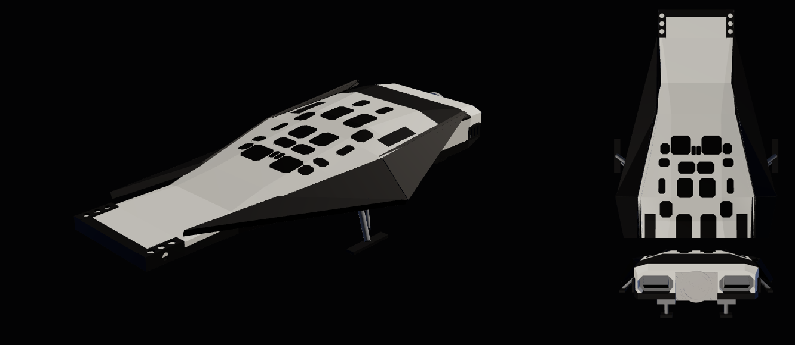

# RANGER

A parametric CAD model of the **Ranger** from *Interstellar* (2014). It is the
spaceplane that carries the crew from the Endurance down to Miller's water
planet and Mann's ice planet, and back up to dock. It exports a STEP file for
CAD and a watertight STL for printing. The default scale is **1:72**, the
scale of the Moebius kit, which makes it 254 mm long and 128 mm across the
wings. With the gear down it stands 42 mm tall.

Live viewer: https://daxjdavis526.github.io/Projects/ranger/



## Files

| file | what |
|---|---|
| `models/ranger_1-72_step.zip` | The CAD model, zipped. Named, coloured bodies: `upper_fuselage` (white), `black_surfaces` (wings, nose frame, belly, grille, panels), `windows`, `hatch`, `engines`, `landing_gear`, `landing_feet`. Units mm. |
| `models/ranger_1-72.stl` | The print model, gear down: everything unioned into one watertight body (checked with manifold3d, 0 non-manifold edges). |
| `models/ranger.glb` | The CAD model tessellated for `index.html`. |
| `build_model.py` | The generator. Every file above comes out of it. |
| `index.html` | A three.js viewer, with download links. |

## Building

```
pip install cadquery manifold3d
python3 ranger/build_model.py               # 1:72 into ranger/models/
python3 ranger/build_model.py --scale 48    # 1:48, 381 mm long
python3 ranger/build_model.py --gear-up     # in flight (ranger_*_gear_up files)
python3 ranger/build_model.py --shell 0     # solid body
```

It takes about ten seconds.

Axes: the origin is the centre of the nose's front face. +X runs aft, +Y to
port and +Z up.

## Printing

- **Gear down,** it stands on its four feet; print it right way up with
  supports under the belly and wings.
- **Gear up** (`--gear-up`), print it right way up with the belly on
  supports, or standing on its rear face.
- The body is hollow, with 1/8 in (3.175 mm) walls and a closed cavity. That
  is fine for FDM. For resin, drill a drain hole in the belly or trapped
  resin will cure inside and crack it.
- At 1:72 the thinnest parts are the gear struts (1.9–3.3 mm) and the wing
  plates (3.9 mm). The window recesses and belly louvres stand 0.8–1.1 mm
  deep, so they show on a 0.4 mm nozzle.

## What is in the model

**Body.** A faceted lifting body, lofted through ten measured cross-sections:
- a flat black belly, vertical sides, chamfered shoulders and a flat top;
- a thin, square-ended nose slab (the nose is the flat end);
- the cabin hump rising from 4.2 m back to its top at 14.9 m, then the
  ribbed black grille ramping down to the tail.

**Wings.** Two canted black plates per side, 0.28 m thick. Each wing tip dips
to belly level at mid-length, which gives the side view its big "V". Each
forward plate rises into the free blade spike near the nose, which stands up
in every shot of the Ranger on the water.

**Nose.** The black U-frame around the nose slab, with the nose-corner
thruster ports.

**Cockpit.** 22 windows in the web on top of the hump (two small centreline
slits and ten per side), laid out from the Moebius paint guide's top view.
The 1/5 miniature shows the same pattern.

**Rear.** The docking hatch plate stands proud of the rear face. It carries
the toothed docking ring, a recessed inner door with radial struts, and the
four corner lock-pin ports. The Ranger docks tail-first. Either side of the
hatch is a main engine: a chamfered opening recessed about 0.9 m, with a
wedge plug inside like a linear aerospike.

**Other detail.**
- Black manoeuvring-jet panels on the hump shoulders.
- Vent panels on the rear flanks.
- The louvred vent field in the forward belly.

**Landing gear** (default; `--gear-up` removes it):
- A short rear pair on boxy fairings.
- A long forward pair splayed out to skid feet just outboard of the wing
  tips, each with its silver retraction cylinder.
- The belly sits 1 m off the ground.

## What is accurate and what is not

The Ranger is a film prop. "Accurate" here means faithful to the film's own
sources:
- the full-size practical Ranger, shown in Iceland and at Udvar-Hazy;
- New Deal Studios' 1/5 pyro miniature, the 12 ft model now shown at the BFI
  IMAX;
- the Moebius 1/72 kit, built from the production CG files;
- film frames.

No official dimension sheet exists.

**Length: 18.3 m** (60 ft).
- Both the 12 ft 1/5 miniature and the "over 10 in" 1/72 kit give 18.3 m.
- A photo of the full-size prop in Iceland, with crew for scale, gives
  about 18 m.
- A press figure of "46 ft (14 m)" for the full-size prop contradicts all
  three and is not used.

**Measured from the kit paint guide and photographs.** These are right in
proportion, not to the centimetre:
- span (9.2 m), heights, and the ten cross-sections;
- the wing vertices;
- window positions;
- engine and hatch sizes;
- gear positions.

Typical error is ±5% on lengths, ±8% on widths and ±15% on heights. The two
top views measured disagree by about 13% on span.

**Inferred:**
- The exact wing facet planes. The plates are modelled as flat triangles.
- The gear roots.
- The docking ring's tooth count, which is left out.

**Simplified or left out:**
- The quilted thermal-blanket surface, the belly tile grid and panel lines.
- Markings: RF-31D, the NASA logos, placards.
- The ribs inside the engines and on the grille.
- The small ports in the side vents.
- The yellow hatch-handle edges.
- The windows are chamfered rectangles; the real ones are pentagons, hexagons
  and parallelograms, in the same places.

## Sources

- [fxguide: the miniature effects behind Interstellar](https://www.fxguide.com/fxfeatured/real-and-raw-the-miniature-fx-behind-interstellar/)
- [Art of VFX: New Deal Studios interview](https://www.artofvfx.com/?p=11161)
- [IPMS USA: Moebius 1/72 Ranger review](https://reviews.ipmsusa.org/comment/25)
- [Interstellar wiki: Ranger](https://interstellarfilm.fandom.com/wiki/Ranger)
- The Moebius Models kit paint guide and instructions (2015), and photos of
  the full-size prop at the Smithsonian Udvar-Hazy Center (November 2014).

`vendor/three/` is three.js r180 (the minified core, `OrbitControls`, and
`GLTFLoader` with the one utility it imports), copied from `starship/`.
