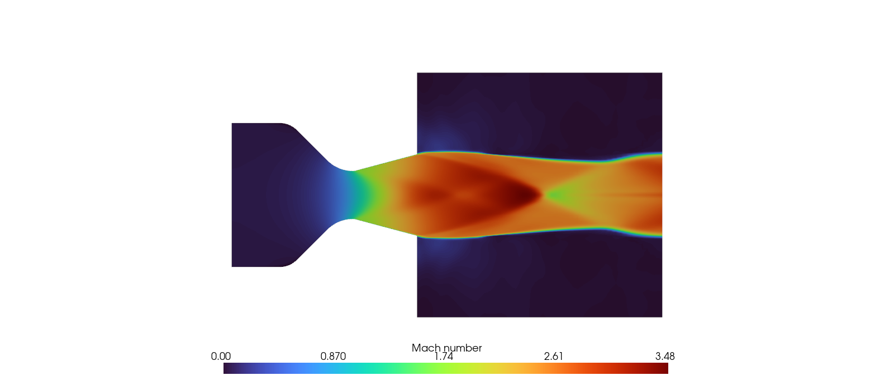
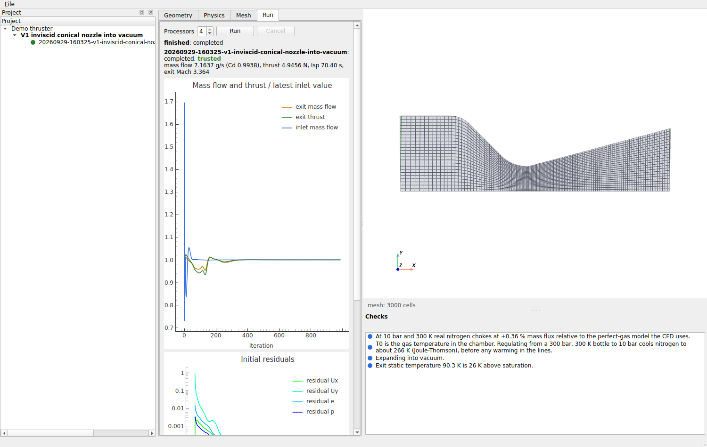
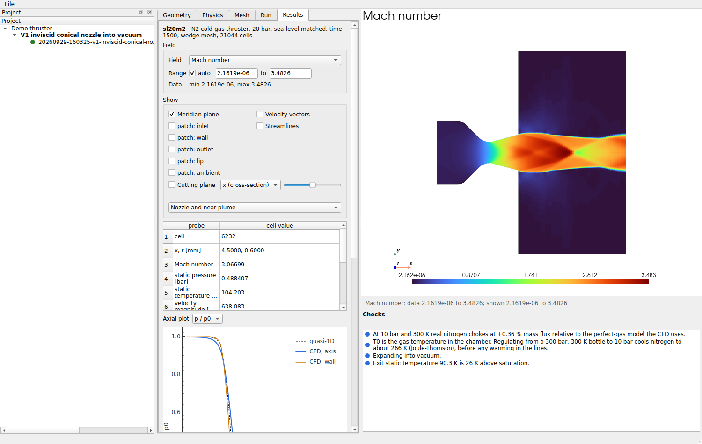
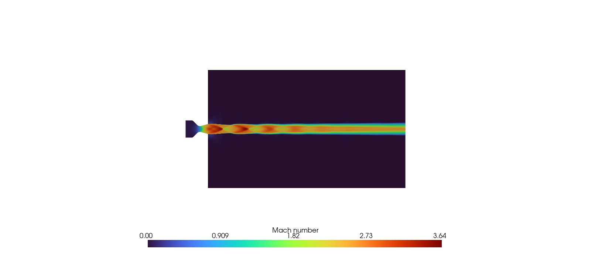
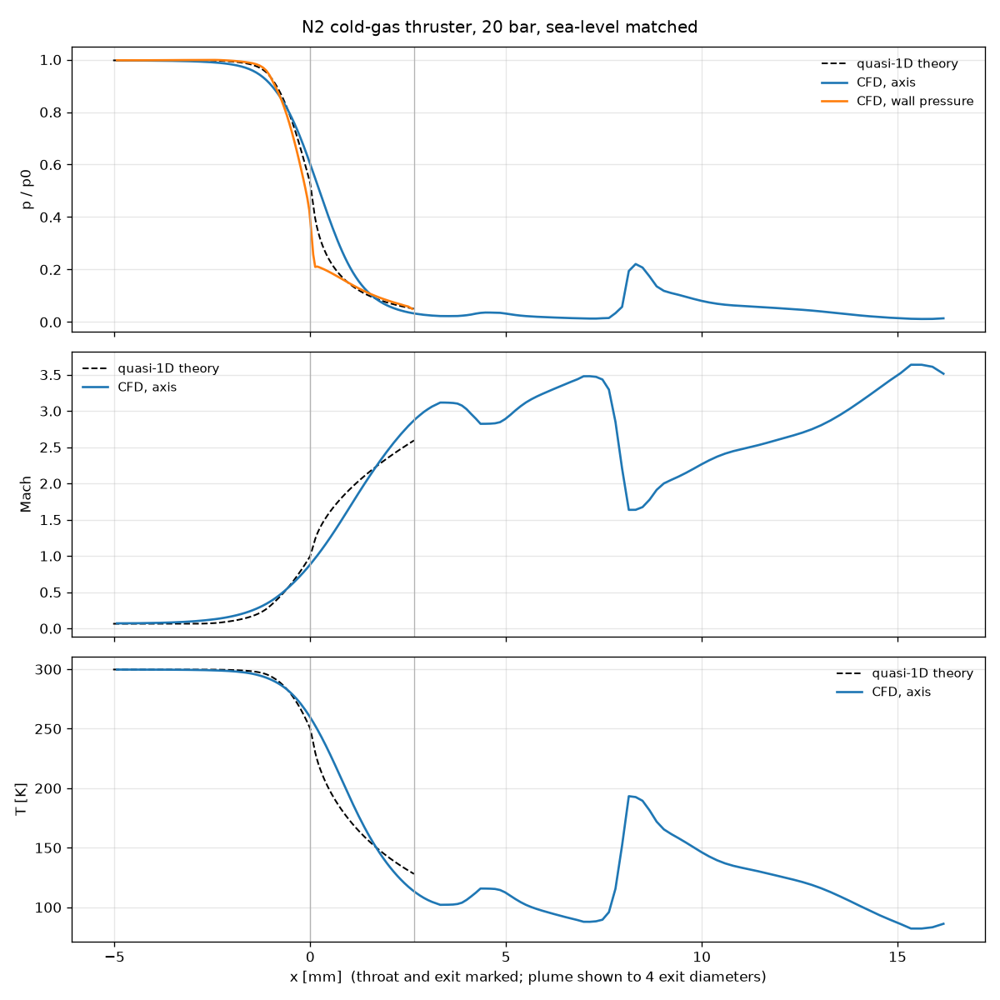

# SONICLINE

A focused CFD application for nitrogen cold-gas thrusters. Give it a thruster
geometry, a chamber pressure and the ambient conditions; it meshes the
nozzle and its plume, runs OpenFOAM, and reports what the gas is doing and
what the thruster delivers: mass flow, thrust, Isp, exit state, whether the
throat is choked, and whether the numbers can be trusted.

OpenFOAM is the numerical backend and nothing more. Geometry handling,
meshing, case generation, solver control, monitoring, post-processing, the
propulsion calculations, verification and (from M3) the interface are this
project.

**Status: milestones M1 to M4 of [DESIGN.md](DESIGN.md) are complete.** The
whole pipeline runs from the command line or the desktop application: a
STEP file or a parametric nozzle in, verified numbers, field views and a
report out. Sections 10–13 of the design record what building each
milestone taught.



## What it does

```
pip install -e "./sonicline[geometry,post]"

sonicline import nozzle.step --p0 "20 bar"     # analyse the CAD, write a definition
sonicline check  nozzle.json                   # quasi-1D prediction + pre-flight checks
sonicline run    nozzle.json --processors 4    # mesh, solve, post-process, judge
sonicline study  nozzle.json --processors 4    # three meshes: grid-convergence index
sonicline report runs/nozzle                   # PDF, PNG and JSON report of a run
sonicline verify                               # verification cases vs analytical theory
```

### The desktop application

```
pip install -e "./sonicline[geometry,post,ui]"
sonicline ui MyThruster.sonicline        # opens (or creates) a project
```

A project folder holds its geometry (content-addressed), its simulation
definitions and every run made from them. The window has four stages:

- **Geometry:** a parametric conical nozzle, or an imported STEP fluid
  volume. The analysis suggests which end is the inlet; confirm it, or click
  an end in the 3D view.
- **Physics:** chamber, surroundings, exit domain, viscous model, gas,
  solver. The quasi-1D prediction updates as you type.
- **Mesh:** form, quality, wall resolution, and a preview of the mesh.
- **Run:** processors, run and cancel, live plots of mass flow, thrust and
  residuals, the log, and the verdict with its reasons.

The checks panel re-runs every pre-flight check on each edit. Each stage's
tab carries a badge when a check there warns or blocks. A run is a separate
process, the same `sonicline run` as the command line, so a solver crash
never takes the window down. Past runs are listed under their simulation
with their verdict and thrust.



The **Results** stage shows a finished run's fields:

- any field, with the range shown and the data's own min and max;
- the meridian plane (mirrored, so axisymmetric and planar runs show the
  whole nozzle), each boundary patch on or off, and a cutting plane;
- velocity vectors and streamlines;
- a probe: click the view to read the cell there, as the solver computed
  it (never interpolated);
- centreline and wall plots against quasi-1D theory;
- the engineering summary and the verdict;
- report export.

The view frames the nozzle and three exit diameters of plume; the whole
domain is one click away. Anything else is in ParaView (File, Open run in
ParaView).



`sonicline report <run-dir>` writes the same report without the window:
report.json, contour and axial PNGs, and a PDF that opens with the verdict.

### What a run produces

`run` produces a self-describing run directory:

- the definition, the generated OpenFOAM case, the mesh report
- the convergence history
- `metrics.json`: mass flow at inlet, throat and exit; the thrust split into
  momentum and pressure terms, cross-checked from both sides of the control
  volume; Isp; Cd against theory; throat and exit state; extremes; wall y⁺
  and shear; real-gas correction; the trust verdict
- a manifest recording exactly which software and settings produced it
- images: Mach, pressure and temperature on the nozzle and the plume, and
  axial plots against quasi-1D theory

Every run ends **trusted**, **trusted with warnings**, or **not trustworthy**,
with the reasons. A run that did not converge, whose mesh failed its gates,
or whose inviscid Cd exceeds the theoretical bound is never presented as a
result.

## The reference case: 20 bar at sea level

Nitrogen at 20 bar and 300 K through a conical nozzle:

- 2 mm throat and exit-to-throat area ratio of 2.88, which expands to
  ambient at 20 bar
- 45° converge and 15° diverge
- exhausting into 1 atm through a plume region 20 exit diameters long
- k-ω SST, wall-resolved (y⁺ max 0.42), a 21 000-cell wedge
- converged in about 1500 iterations, about 3 minutes on 4 cores

| | CFD | ideal quasi-1D |
|---|---|---|
| mass flow | 14.275 g/s | 14.416 g/s |
| discharge coefficient | 0.990 | — |
| thrust | 8.363 N (momentum 8.323, pressure +0.040) | 8.621 N |
| Isp | 59.7 s | 61.0 s |
| exit Mach (mass-averaged) | 2.541 | 2.594 |
| adiabatic-wall recovery factor (diverging section) | 0.877 (0.82–0.90) | 0.83–0.88 (Pr^½–Pr^⅓) |
| total temperature, exit vs inlet | −0.06 % | 0 |
| thrust, exit plane vs wall force + feed | agree to 0.02 % | |

Thrust is 97.0 % of ideal. The throat's discharge coefficient accounts for
1.0 %; the rest comes from the 15° cone's divergence (1.7 % for ideal
source flow) and wall friction (0.08 N on the wall, 0.9 % of thrust). These
overlap, because friction also reduces the exit momentum, and the CFD does
not separate them. Real nitrogen
at 20 bar chokes at +0.71 % mass flux against the perfect gas the CFD uses,
so the real-gas estimate is 14.376 g/s. The same nozzle imported from STEP
gave the same answer to 0.01 % (M1).




The wall temperature's last cell drops to 207 K where the boundary layer
turns and expands around the sharp exit lip.

## Verification

`sonicline verify` runs these cases on standard meshes (about 25 minutes on
4 cores); CI runs V1 and V4a end to end through OpenFOAM on every change. Every reference is
computed without the CFD.

| case | what | check | error | tolerance |
|---|---|---|---|---|
| V1 | inviscid conical nozzle into vacuum, wedge | Cd vs Kliegel–Levine | −0.022 % | 0.2 % |
| | | thrust vs 1D × Cd × divergence factor | +0.040 % | 0.5 % |
| V1 | same, 3D O-grid | Cd vs Kliegel–Levine | −0.055 % | 0.2 % |
| | | thrust vs 1D × Cd × divergence factor | −0.085 % | 0.5 % |
| V1 | same, rhoCentralFoam | Cd vs Kliegel–Levine | −0.077 % | 0.2 % |
| | | thrust vs 1D × Cd × divergence factor | +0.106 % | 0.5 % |
| V2 | inviscid NPARC nozzle, normal shock in the diverging section (pe/p0 = 0.75) | shock position vs quasi-1D, axis / wall | +0.23 % / −0.11 % of the diverging length | 2 % |
| | | Cd vs Kliegel–Levine | +0.003 % | 0.2 % |
| V3 | inviscid 20 bar reference nozzle, shock held inside by pb = 10 / 14 bar | shock position vs quasi-1D, axis and wall | within −7.1 % … +6.3 % of the diverging length | 10 % (the shock is curved; see below) |
| V4a | inviscid converging nozzle, choked, into a sea-level plume | Cd vs Kliegel–Levine | +0.054 % | 0.2 % |
| V4b | same, subsonic, with a straight throat section | mass flow vs isentropic | −0.16 % | 0.5 % |
| V5 | inviscid throat Cd, Rc/Rt = 0.625, 1, 2, 4 (three-mesh studies) | extrapolated Cd vs Kliegel–Levine | within 4×10⁻⁵ | 5×10⁻⁴ |
| V6 | 3D O-grid vs wedge on V1 | mass flow / thrust | −0.03 % / −0.12 % | 0.2 % / 0.3 % |
| V7 | rhoCentralFoam vs rhoPimpleFoam on V1 | mass flow / thrust | −0.055 % / +0.066 % | 0.1 % / 0.2 % |
| V9 | ISO 9300 toroidal venturi, Re_d 5×10⁴ and 2.6×10⁵, laminar and SST | Cd vs ISO 9300 | −0.07 % … +0.10 % | 0.3 % (the standard's uncertainty) |
| V10 | V1 nozzle at 30 bar, Peng–Robinson vs perfect gas | mass-flow ratio vs the Peng–Robinson isentrope (+1.314 %) | −0.009 % | 0.02 % |
| V11 | **experiment:** NASA TP-1704 planar nozzle B1, NPR 8.91 (attached) and 2.46 (separated), SST with wall functions | wall p/pt at 10 orifices within the test's spanwise spread ± 0.02 | 9 of 10 at both (the miss: 0.6 mm past the sharp throat); separation between the same orifices as the test | 9 of 10 |
| all | | mass conservation, inlet vs exit | ≤ 2×10⁻⁵ | 10⁻⁴ (3×10⁻⁴ for V4b) |
| all | | thrust, exit plane vs wall + feed | ≤ 0.04 % | 0.5 % |

The full table is in [doc/verification-standard.md](doc/verification-standard.md).

**What V2 found.** rhoPimpleFoam, the pressure-based solver SONICLINE
uses for shock-free nozzles, does not hold this shock. Run steady or
time-accurate, it either pushes the shock out of the nozzle or settles 30 %
of the diverging length downstream. rhoCentralFoam puts it within 0.3 %, so
SONICLINE now picks rhoCentralFoam by itself whenever a shock is expected
inside the nozzle, and a rhoPimpleFoam run there is marked not trustworthy.

**What V5 found.** On one standard mesh a sharp throat (Rc/Rt = 0.625)
reads 0.26 % below the Kliegel–Levine Cd. On three systematically refined
meshes the error falls at order 1.3–1.6, and the extrapolated Cd matches
the correlation to 4×10⁻⁵ at every curvature tested. The single-mesh
shortfall is discretisation error: about 0.25 % for a sharp throat and
0.06 % for a gentle one. `sonicline study` measures it for any case.

**What V3 cannot do.** In a 15° cone the normal shock is curved, 5–10 % of
the diverging length further downstream on the axis than at the wall. No
simple theory predicts that shape, so V3 checks the position only to 10 %.
V2 is the precise test.

**What V11 shows.** Against measured wall pressures in a planar nozzle
(Mason, Putnam and Re, NASA TP-1704, 1980), the CFD reproduces:

- the attached expansion to within 0.02 at nine of ten orifices;
- at NPR 2.46, the separation between the same two orifices as the test,
  and the pressure plateau behind it to 0.015.

The miss is the orifice 0.6 mm past the sharp throat, 0.04–0.05 low on
every mesh, where a two-dimensional model cannot see the sidewalls. The
separated case never settles; SONICLINE says so and reports averages.

**What V4b found.** A subsonic converging nozzle that ends at its curved
throat does not deliver quasi-1D mass flow: the streamlines are still
converging as they leave, so the jet keeps contracting past the exit (a vena
contracta). Its exit plane sat 7.6 % above ambient and its mass flow 5.8 %
below theory. The CFD was right; the first version of the test case was not.
With two diameters of straight throat the flow leaves parallel and the error
is 0.16 %.

## What is exact and what is approximated

The house rule: say plainly where the model stops.

- **Gas.** A calorically perfect gas (cp = 1039.7 J/(kg·K), γ = 1.3995) with
  Sutherland viscosity for N₂. The theory uses the same constants.
  - Real nitrogen chokes at a higher mass flux: +0.36 % at 10 bar, +0.71 % at
    20 bar, +1.05 % at 30 bar (reference equation of state, via CoolProp).
    Every run reports this correction.
  - The chamber temperature is not the bottle temperature: throttling from
    300 bar to 20 bar cools nitrogen to about 268 K.
- **Energy equation.** OpenFOAM's rhoPimpleFoam omits viscous work
  (checked in its v2512 source), so friction never heats the gas. SONICLINE
  adds the missing term with its own small OpenFOAM extension, compiled on
  first use (it needs `openfoam2512-dev`).
  - The adiabatic wall now recovers 0.88 of the dynamic temperature, where
    0.83–0.88 is physical and 0.25 was the uncorrected value. Viscous runs
    report wall temperature and the recovery factor.
  - Every run checks energy conservation: with adiabatic walls, total
    temperature leaving the nozzle must match what enters to 0.2 %.
- **Real gas in the CFD.** Optional (`"gas": {"equation_of_state":
  "peng_robinson"}`, shock-free nozzles only). Peng–Robinson over-predicts
  nitrogen's real-gas mass flux by about a quarter (+0.89 % against the
  reference equation of state's +0.71 % at 20 bar), so the default stays
  the perfect gas with the reference correction reported beside it.
- **Solvers.** rhoPimpleFoam (pressure-based) for shock-free nozzles;
  rhoCentralFoam (density-based) wherever quasi-1D theory expects a shock or
  separation inside the nozzle, because rhoPimpleFoam puts a normal shock in
  the wrong place (30 % of the diverging length off in V2). The two agree to
  0.05 % on a shock-free nozzle (V7). The shock cells in a rhoPimpleFoam
  plume image are qualitative; thrust does not depend on them.
- **Turbulence.** k-ω SST, resolved to the wall.
  - Throat Reynolds numbers of 10⁵–10⁶ put small thrusters where boundary
    layers may be laminar or relaminarising. Run laminar, the 20 bar case
    gives +0.07 % mass flow and +0.18 % thrust; that spread is the
    turbulence-model uncertainty, and the pre-flight check says so.
  - The ISO 9300 venturi (V9) matches both models within the standard's
    0.3 %, so discharge coefficients cannot decide between them.
  - Separated flow (a vacuum nozzle at sea level) is flagged as
    model-sensitive before the run.
- **Axisymmetry.** The default wedge assumes the flow is axisymmetric, which
  is exact for a revolved nozzle unless separation turns asymmetric.
  - The 3D O-grid is available and agrees with the wedge to 0.03 % in mass
    flow.
  - Its wall is a polygon scaled to preserve the circle's area; its vertices
    sit 0.14 % outside the surface.
- **Convergence.** Integrals decide it: inlet and exit mass flow and exit
  thrust must be steady, and mass must balance. Global residuals often stall
  near 10⁻³ in the plume's shear layer while the nozzle is converged to 10⁻⁶;
  that is reported, not hidden. The far plume develops long after the
  nozzle. It does not affect thrust, but plume images from such a run are
  labelled unconverged.
- **Quasi-1D theory** is exact for integral quantities of an ideal nozzle and
  wrong for local ones. At the throat the wall pressure departs from it by
  tens of percent; the axial plot shows both.
- **Separation** is estimated before the run (Summerfield and Schmucker),
  not predicted.
- **Condensation** is detected, not modelled. It does not arise for
  sea-level nozzles at 15–30 bar, where the exit is at 115–140 K. It does
  arise for vacuum nozzles beyond an area ratio of about 15–25.

## Geometry

**STEP** fluid volumes are read through gmsh's OpenCASCADE kernel, in a
separate process so a malformed file cannot crash the application.
**STL** surfaces are read with trimesh and checked before anything is
measured on them: watertight, manifold, consistently wound, one body, no
duplicate or zero-area triangles (slivers are counted). OpenFOAM's
`surfaceCheck` then looks for self-intersection when the run starts, since
trimesh cannot. An STL file has no units: `--unit` (default mm) says what
they are.

The analyser, for either format:

- finds the axis: the line through two coaxial planar end faces when there
  are some (a side port or a boss skews the inertia tensor, and the end
  faces still say where the nozzle points), otherwise the distinct
  principal axis of inertia
- slices the volume to recover the wall profile and whether it is a body of
  revolution
- refines the throat by golden section on the section area
- picks the inlet end from the steeper wall

The geometry is pinned by the SHA-256 of the file, so a changed file cannot
silently change a saved simulation.

**Volumes that are not bodies of revolution** (a side port, a non-round
section) get the radius of a circle of the same section area as their
profile. That is what quasi-1D theory, the initial field and the checks use,
and it is an approximation wherever the section is far from round. They are
meshed by the **unstructured (Tier 2) mesher**:

- **snappyHexMesh** carves a Cartesian grid aligned with the nozzle axis
  (grid planes exactly at the throat and exit), refined to 10, 14 or 20
  cells across the throat radius (coarse, standard, fine).
- Wall layers are accepted only if they cover 95 % of the wall and every
  face near the throat, measured on the finished mesh. snappy's layer
  addition collapses to about one layer on these nozzles, whatever its
  settings.
- **cfMesh** (`cartesianMesh`) is therefore the first choice for viscous
  runs. Its layers put the wall-function first cell (1.6 µm at 20 bar) on
  every wall face, throat included.
- **gmsh** is the last resort: prism layers on the nozzle and tetrahedra
  filling the rest. Its layered meshes pass the gate in vacuum but not
  against a sea-level plume.
- A rejected mesh passes the run to the next mesher, with the reason
  recorded.
- checkMesh gates the result like any other mesh.
- V14 checks it against the structured wedge on V1.

Two other ways to give the wall, besides a CAD file or the parametric
conical nozzle:

- **`wall_profile`:** a table of (x, r) points, for a nozzle defined by a
  formula or a method-of-characteristics contour.
- **Planar nozzles** (`"mesh": {"form": "planar", "planar_width": ...}`): a
  rectangular two-dimensional nozzle. The profile is then the half-height
  and area ratios are ratios of heights. See
  `examples/planar-tp1704-b1-npr2.46.json`, the V11 validation nozzle.

A **solid thruster body** (a block with a bore through it) is recognised and
rejected with advice: export the internal gas volume. Automatic extraction
is planned as a previewed, user-confirmed step (M6).

## Layout

```
DESIGN.md       the plan, decisions, evidence, and the M1 record (section 10)
src/sonicline/
  core/         units, gas, real gas, profiles, theory, definition, validation
                (no OpenFOAM, Qt or VTK: tests/test_architecture.py enforces it)
  geometry/     STEP analysis in a worker process; STEP writing
  mesh/         structured revolved meshes (wedge and O-grid, with plume)
  foam/         the only package that knows OpenFOAM syntax: writers, case
                builder, parsers, and the viscous-work extension (C++)
  run/          runners (local, WSL2), convergence, mesh gates, the pipeline
  post/         integrals from solver fluxes, field views, reports, images
  metrics/      propulsion metrics and the trust verdict
  verification/ the verification cases
  project/      the project store and the editable draft (no Qt)
  ui/           the desktop application (PySide6, pyvista, pyqtgraph)
  cli.py
tests/          about 310 tests; the OpenFOAM, UI and rendering ones skip without them
examples/       sea-level-20bar.json (parametric), nozzle-2mm.step + .json (CAD),
                planar-tp1704-b1-npr2.46.json (planar, separated)
doc/            images and the verification table
```

## Requirements

Python 3.11+, and ESI OpenFOAM v2512 for `run` and `verify`.

- **Linux:** `apt install openfoam2512 openfoam2512-dev` from the ESI
  repository. The development package compiles SONICLINE's viscous-work
  extension on the first viscous run.
- **Windows:** the application runs natively and drives OpenFOAM inside WSL2
  (Ubuntu 24.04 with the same package).
  - The WSL2 runner is built and its command construction is tested.
  - It has not yet been exercised on a Windows machine; that is an M2 item.

The core, geometry and meshing tests run on Linux and Windows in CI; the
OpenFOAM tests run on Linux.
