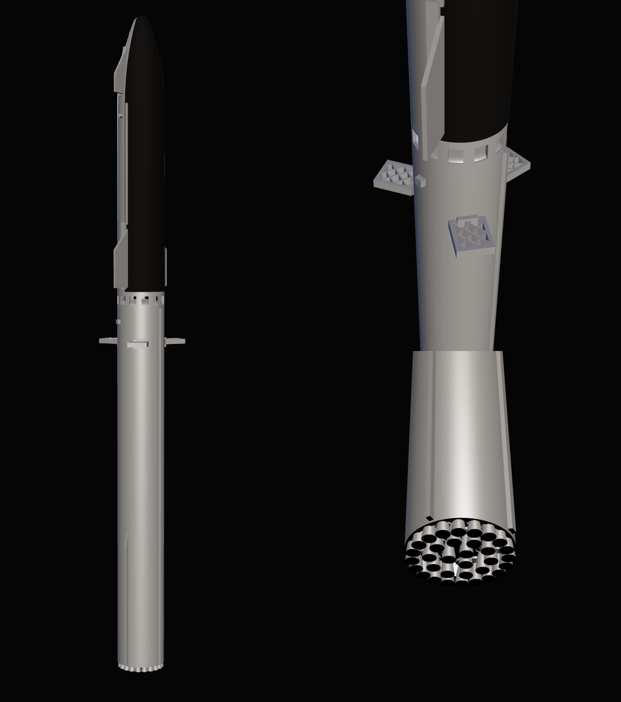

# STARSHIP

A parametric CAD model of SpaceX's **Starship V3 upper stage stacked on a
Super Heavy Block 3 booster**, exported as STEP (for CAD) and watertight STL
(for printing). The default scale is **1:500**: the stack comes out 249 mm tall
and 18 mm across the hull, 34 mm across the flaps, which fits the Z axis
of most desktop printers.

Live viewer: https://daxjdavis526.github.io/Projects/starship/



## Files

| file | what |
|---|---|
| `models/starship_stack_1-500.step` | The stack as three named, coloured solids: `super_heavy`, `starship`, `heat_shield`. Units mm. |
| `models/starship_stack_1-500.stl` | The whole stack fused into one watertight body. |
| `models/super_heavy_1-500.stl` | Booster only, 144.6 mm. |
| `models/starship_ship_1-500.stl` | Ship only (heat shield fused on), 104.4 mm. |
| `models/starship_stack.glb` | The same assembly as the STEP, for `index.html`. |
| `build_model.py` | The generator. Every file above comes out of it. |
| `index.html` | A three.js viewer for the GLB, with download links. |

All three STLs have zero non-manifold edges, and the STEP re-imports as three
valid solids.

## Building

```
pip install cadquery
python3 starship/build_model.py              # 1:500 into starship/models/
python3 starship/build_model.py --scale 200  # 1:200, 622 mm tall
python3 starship/build_model.py --scale 350 --min-wall 0.6
```

It takes about ten seconds. Geometry is written in real metres; the scale is
applied only on export, so changing it changes nothing else. `--min-wall`
sets the thinnest wall the printer can manage (default 0.8 mm, two perimeters
with a 0.4 mm nozzle).

Axes: +Z up the stack, origin at the booster's engine exit plane. +X is the
ship's windward (heat shield) side, so the flaps sit on the ±Y tile line.

## Printing

Split it. The stack is a 249 mm pencil; the two stages print more reliably
apart, upright, standing on their engines, and they sit on each other the same
way they do on the pad (the ship's skirt lands on the booster's hot-staging
ring). Support the grid fins, the undersides of the flaps, and the engine
bells. A 0.2 mm layer height or finer is worth it for the fin lattice. For
colour, paint the heat shield: in the STEP it is its own body, and in the STL
it stands 0.2 mm proud of the steel, so the tile line is a ridge you can mask
along.

## What is in the model

**Super Heavy** (72.3 m)
- 33 Raptor 3 engines in the real 3 / 10 / 20 layout: 3 centre, a ring of 10
  gimballing engines, 20 fixed outer engines, powerheads above the bells.
- Aft skirt shrouding the outer ring, with the engine bay heat shield above it.
- Three grid fins, 120° apart and lower down the forward tank than V2's four,
  with a through-cut lattice and a hinge/actuator housing at each root.
- The integrated hot-staging adapter at the top: an open ring with twelve
  vent windows and the forward dome visible through them.
- A full-length raceway, two aft chines, and two catch hardpoints.

**Starship** (52.1 m)
- Six Raptor 3s: three sea-level engines in the middle, three Raptor Vacuums
  with their large bells outboard, inside the aft skirt.
- A spherically blunted tangent-ogive nose, 17 m long.
- Two aft flaps on the tile line with leeward hinge fairings; two smaller
  forward flaps shifted leeward onto the ogive (the V2/V3 layout), with
  fairings that follow the curve of the nose.
- The heat shield over the windward 192°, as a separate body.
- Chines along the tile line between the flaps, and the V3 catch pins.

## What is accurate and what is not

SpaceX publishes a handful of numbers and no drawings, so "replica" here means
the published dimensions are exact and the rest is measured off photographs.
In detail:

**Published, and used exactly:** 9 m diameter; 124.4 m stack; 72.3 m booster;
52.1 m ship (the difference); 33 + 6 engines and their arrangement; three
grid fins on Block 3; Raptor 3 at 3.1 m long and 1.3 m across.

**Estimated from photographs and renders — right in proportion, not to the
centimetre:**
- Nose length (17 m) and tip radius (1.5 m). The real nose is not a textbook
  ogive; this is the closest simple curve.
- Flap planforms, spans and positions. Starship's flaps are drawn as flat
  plates; the real ones have thickness taper and curved aerocovers.
- Grid fin size (4.2 × 3.6 × 0.9 m) and position (63 m up). SpaceX says only
  "50% larger" and "lower".
- Raptor nozzle profiles, the Raptor Vacuum bell (2.4 m exit, 4.6 m long), and
  how far each engine sits inside its skirt.
- The number and size of the hot-staging vents, the raceway, chine and
  hardpoint geometry.

**Simplified or left out:**
- Hull walls are solid. The tanks, domes (except the booster's forward dome),
  downcomer and everything inside do not exist.
- The heat shield is a smooth shell. There are ~18,000 hexagonal tiles on a
  real ship; at 1:500 each would be 0.3 mm across.
- No weld seams, stringers, vents, QD plates, the payload door, the V3
  docking adapters, or plumbing on the skirt.
- The heat shield wraps the nose as a plain 192° wedge; the real tile boundary
  curves around the nose and the flap roots.

**Changed to print at 1:500** (the `--min-wall` clamp, scale-dependent — at
1:200 almost none of this happens):
- Every wall thinner than 0.4 m real is thickened to 0.4 m: the skirts, the
  hot-staging ring, the engine bell walls. A 1.2 m sea-level bell cannot be
  hollowed around a 0.4 m wall, so at 1:500 those bells are solid with a flat
  exit; only the big Raptor Vacuum bells stay open. From about 1:250 up, all
  of them are hollow.
- The grid fin lattice is coarsened from ~0.6 m cells to ~1.4 m cells so the
  webs are still printable and the holes still open. A real fin has far more,
  far thinner cells.
- The heat shield is raised 0.1 m (0.2 mm) off the steel rather than its
  real ~0.08 m, so the tile line survives as a paintable ridge. This is also
  why the model is 249.0 mm tall rather than 248.8.

## Sources

- [Wikipedia: SpaceX Starship](https://en.wikipedia.org/wiki/SpaceX_Starship),
  [Super Heavy](https://en.wikipedia.org/wiki/SpaceX_Super_Heavy),
  [Raptor](https://en.wikipedia.org/wiki/SpaceX_Raptor)
- [Space.com: how Starship V3 differs from its predecessors](https://www.space.com/space-exploration/launches-spacecraft/the-worlds-biggest-rocket-how-spacexs-new-starship-v3-differs-from-its-predecessors)
- [New Space Economy: detailed review of Starship V3](https://newspaceeconomy.ca/2026/04/16/detailed-review-of-starship-v3/)

`vendor/three/` is three.js r180 (the minified core, `OrbitControls`, and
`GLTFLoader` with the one utility it imports), fetched from npm.
