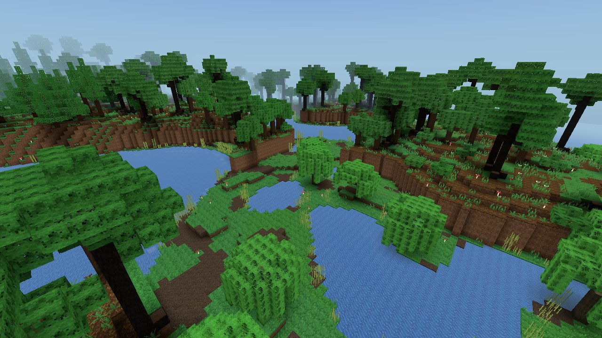
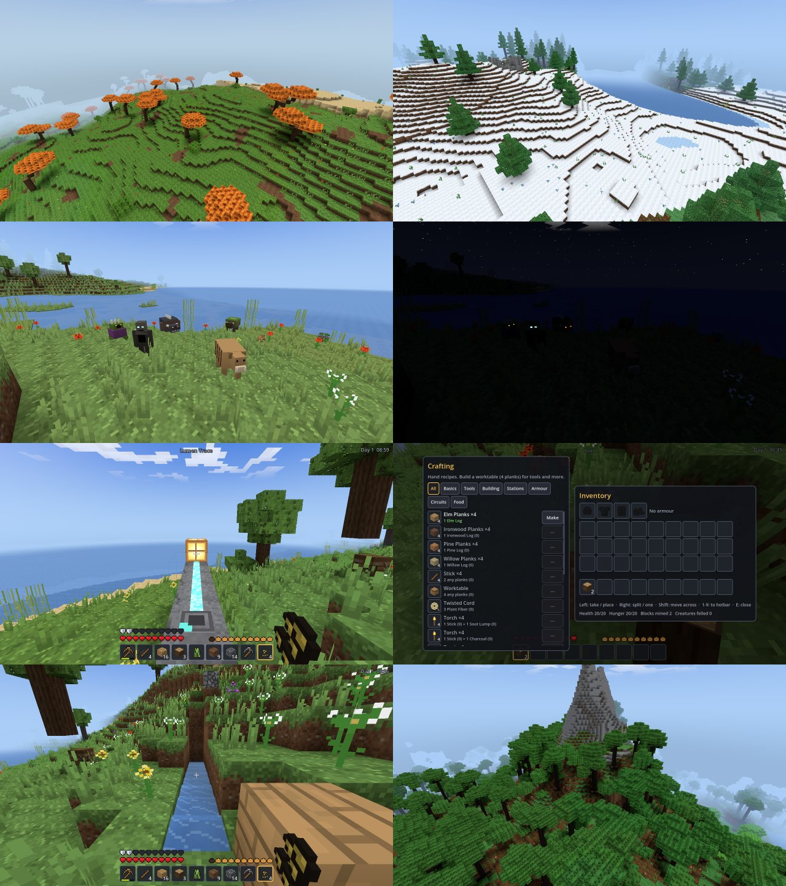

# STRATA — an original voxel survival sandbox

A complete block-world survival game: an endless generated world of fourteen
biomes, caves and ores, flowing water, day and night, weather, eight original
creatures, tools in five tiers, armour, a hunting bow, cooking, smelting,
farming, storage, building, lumen circuits that switch lamps and doors, and a
world that saves and loads. Every texture, model, sound, piece of music, name
and line of code was made for this project. No assets, code or names come from
any other block game, and none of it is a clone of one.

**This one is a desktop game, not a web page.** Unlike everything else in this
repository it is a Godot 4 project written in C#, so there is no GitHub Pages
link. It is built and tested for Windows and Linux; Godot also targets macOS,
but that has not been tried.

## Running it

You need the **.NET edition** of Godot 4.7 (the standard edition cannot run C#)
and the **.NET 8 SDK**.

1. Install the .NET 8 SDK: <https://dotnet.microsoft.com/download/dotnet/8.0>
2. Download **Godot 4.7 – .NET** from <https://godotengine.org/download>
3. Open `strata/project.godot` in Godot (Import → select the file) and press
   **F5**. On the first run Godot compiles the C# for you; that takes a few seconds.

From a terminal the same thing is:

    cd strata
    dotnet build Strata.csproj        # optional: Godot builds on launch anyway
    godot --path .                    # "godot" = your Godot .NET executable

### Making a standalone build

`export_presets.cfg` holds presets for **Windows Desktop** and **Linux**. In
the editor: Editor → Manage Export Templates → Download, then Project →
Export → pick a preset → Export Project. Or from a terminal, once the
templates are installed:

    godot --headless --path . --export-release "Windows Desktop" build/windows/Strata.exe
    godot --headless --path . --export-release "Linux" build/linux/Strata.x86_64

A .NET export is the executable plus a `data_Strata_*` folder next to it (the
.NET runtime and the game's assemblies). Ship the whole folder; the `.exe`
alone will not start. Players do not need Godot or .NET installed.

GitHub Actions does all of this on every push that touches `strata/`
(`.github/workflows/strata.yml`): it runs the test suite, exports both
platforms, and attaches **STRATA-windows** and **STRATA-linux** to the run as
downloads (Actions tab → "STRATA builds" → the latest run → Artifacts).

## Controls

| Input | Action |
|---|---|
| mouse | look |
| W A S D | walk |
| Space | jump · swim up · climb a ladder |
| Ctrl (hold, moving forward) | sprint (needs hunger above 6) |
| Shift | sneak — you will not step off an edge; swim down |
| left mouse (hold) | mine · attack |
| right mouse | place · use: open a worktable, furnace, crate or door, throw a switch, till, plant, sleep, feed an animal, put on armour · hold to eat · hold to draw a bow, let go to shoot |
| middle mouse | pick the block you are looking at into your hand, if you carry it |
| 1 – 9 · mouse wheel | hotbar slot |
| E | inventory and crafting |
| Q · Ctrl+Q | drop one · drop the stack |
| Esc | pause menu · close a screen |
| F1 | hide the HUD |
| F2 | screenshot (saved under the user data folder, `screenshots/`) |
| F3 | debug overlay |

**In the inventory:** left-click picks up, puts down, swaps or merges a stack;
right-click takes half, or puts down one; shift-click moves a stack straight
across (inventory ↔ hotbar ↔ crate or furnace); hover over a slot and press
1–9 to swap it with that hotbar slot; click outside the panel to drop what you
are holding. The recipe list on the right shows what you can make
with what you carry — click once to craft one, shift-click to craft as many as
you can. Recipes you cannot afford yet are listed dimmed, so the list doubles
as a recipe book.

## A first day

1. **Wood.** Hold left mouse on a tree trunk. Logs come off faster with an axe,
   but hands work.
2. **Planks, sticks, a worktable.** Press E. Planks and sticks craft by hand;
   so does the worktable. Place it and right-click it for the bigger list.
3. **Wooden pick.** Dig down to stone. Stone drops cobblestone, which makes
   stone tools and a **furnace**.
4. **Light.** Soot seams (black-flecked stone near the surface) give soot;
   a stick and soot make four torches. Charcoal, from logs in the furnace,
   works too.
5. **Food.** Mossbacks, brindles, burrowkits and pipwings drop meat; cook it in
   the furnace. Tall grass sometimes drops goldgrain seeds: till soil with a
   hoe, plant, wait, harvest, and make hearth bread at the worktable.
   Emberblooms sometimes come up with an emberroot, and frostbells shed
   frostleaf seeds — two more crops. Duskberries grow on bushes; mushrooms
   grow in the woods.
6. **Before dark,** build a room with a door and a torch. A day lasts twenty
   minutes. At night hollows and thornspitters come out, and once in a while
   something much bigger. Underground, in the dark, lurkers wait at any hour.
7. **A bedroll** (hide, planks, fiber) lets you sleep through the night and
   makes that spot your respawn point.
8. **Down.** Copper, then iron, then silver and gold, deep lumen crystal, and
   at the very bottom, rarely, starmetal. Each metal tier mines faster, hits
   harder and lasts longer.
9. **Armour and a bow.** Hide from animals makes a first set of armour;
   copper, iron and starmetal make better ones. A hunting bow (sticks and
   cord) shoots arrows made from a stick, a feather and flint — gravel
   sometimes gives flint when you dig it.

If you die, everything you carried stays where you fell, as items on the
ground — go back for it before it despawns (five minutes).

## The world

Columns are 16 × 16 blocks and 256 tall; sea level is 62. The world is a pure
function of its seed, so the same seed always gives the same world, whatever
order you explore it in.

**Terrain** comes from five climate fields sampled per column —
continentalness (sea to inland), erosion (flat to broken), temperature,
humidity and ruggedness — plus a river field that carves winding channels
down to the water table. Rugged high ground is bent into cliffs and overhangs
by 3D noise. Biomes are picked from the climate, so they sit where they make
sense: frozen seas next to snowfields, dunes where it is hot and dry.

| Biome | What is there |
|---|---|
| Verdant Meadow | open grass, flowers, lone elms; lots of animals |
| Elderwood | dense elm and ironwood forest, ferns, mushrooms |
| Mirewood | willows over mud and shallow water; murky fog |
| Pinereach | pine and tall pine, ferns, frostbells |
| Frostveld | snow-covered grass, sparse pines, snowfall |
| Sunscorch Dunes | sand over sandstone, cacti, no rain, desert shrines |
| Ember Savanna | tall grass, ember trees, emberblooms, herds |
| Ashlands | cinder and ashstone, dead trees, a smoky haze |
| Stonecrown Peaks | bare stone mountains with snowy tops, a few pines |
| Shore, River | sand, clay, reeds |
| Shallow Sea, Deep Sea, Frozen Sea | sand or gravel floors; sea ice where it is cold |

**Caves** are three systems layered together: large caverns from 3D noise that
open up with depth, long winding tunnels from a pair of noise fields, and
"worm" tunnels grown by random walks, some of which pitch up into shafts that
break the surface. Some regions flood their caves into underground lakes, and
below y = 10 every open space is lava.

**Ores** grow as veins by short random walks, densest around a preferred depth:

| Ore | Found | Needs at least | Gives |
|---|---|---|---|
| Soot seam | y 5–128, most at 70 | wooden pick | soot: torches, fuel |
| Copper | y 0–96, most at 48 | stone pick | copper tools |
| Iron | y 0–72, most at 28 | copper pick | iron tools |
| Silver | y 0–40, most at 16 | copper pick | the silver blade |
| Gold | y 0–32, most at 12 | iron pick | lumen lamps, gold blocks |
| Lumen crystal | on cave walls, y 3–30 | iron pick | light: torches, lamps, glowing blocks |
| Starmetal | y 2–16, in slatestone, rare | iron pick | the best tools |

**Structures** are placed per 128-block region by hash, and every column they
cross builds its own part from the same plan: camps and ruins in the
grasslands and forests, stone towers and ruins in the cold north and the
mountains, ruins in the ashlands and the mire, shrines in the dunes, and vaults
buried deep underground. Each has crates filled from its own loot table the
first time they are opened.

**Trees** are grown procedurally per kind — elm, ironwood, pine, tall pine,
willow, ember, dead, and shrubs — so no two are the same. Saplings dropped by
leaves grow into new ones.

**Water** is still where the world made it. Once you disturb it, it moves:
sources spread up to seven blocks across flat ground, thinning as they go, and
pour straight down any drop. Cut the source and the flow drains away. A
one-block gap between two sources refills with a new source, so a hole dug in
a lake heals over. Water washes away plants it runs into.

## Creatures

| Creature | Kind | Where and when | Behaviour | Drops |
|---|---|---|---|---|
| Mossback | grazer | grassland by day | a slow shelled grazer that crops the grass | meat, hide |
| Brindle | livestock | meadow and savanna | follows anyone holding goldgrain; feed two to breed a calf | meat, hide |
| Burrowkit | small forest animal | grassland and woods | bolts if you come close, unless you sneak | meat |
| Pipwing | bird | grassland and woods | takes off when startled and glides back down | fowl, feathers |
| Hollow | night melee | surface at night, caves | spots you by sight, hunts you along a path, strikes up close | bone, soot |
| Thornspitter | night ranged | surface at night, caves | keeps its distance and spits thorns | glands, fiber, seeds |
| Lurker | cave predator | underground in the dark, any hour | fast, pounces from a few blocks away | bone, hide, lumen |
| Gravemaw | rare, powerful | surface at night, rare | seventy health; slams the ground around it | iron, starmetal, hide, bone |

Night-walkers come apart in direct sunlight. Hunters need a line of sight to
notice you and give up if they lose you for long enough. Nothing wanders off
cliffs or into lava; animals avoid water. Creatures spawn only where the light
is right (animals on sunlit grass, hunters in darkness) and never within 18
blocks of you; animals and hunters each have a cap on how many can be around,
and creatures despawn once you are far away. Animals you have fed or bred stay
forever. Their eyes give the hunters away in the dark.

## Survival

| | |
|---|---|
| Health | 20. Heals while hunger is 18 or more — quickly when well fed. |
| Hunger | 20. Drains with sprinting, jumping, mining and fighting; at 0 you starve slowly, down to your last point of health. Sprinting needs more than 6. |
| Breath | 10 seconds under water, then drowning damage. |
| Falling | one point per metre beyond three. |
| Hazards | lava, cactus spines, creatures, starvation, drowning. |
| Death | inventory dropped where you fell; respawn at your bedroll or the world spawn. |

**Armour** has four slots (head, chest, legs, feet) and four sets: hide,
copper, iron and starmetal, worth 6, 10, 13 and 18 protection points. Each
point turns aside 4% of a blow from a creature, an arrow or a cactus, up to
80%; falls, lava, drowning and hunger go straight through. Every piece wears a
little with each blow it turns, and falls apart when worn out. Right-click a
piece to put it on, or shift-click it in the inventory.

**The hunting bow** draws in 0.9 seconds while you hold right mouse, slowing
you to a walk and narrowing your view; let go to shoot. A full draw sends an
arrow at 48 m/s for 9 damage, a quick one much less. Arrows fall under
gravity, so aim high at range. Three in four survive hitting the ground or a
wall and can be picked up again.

**Lumen circuits** are the game's own signal system. Crush a lumen shard into
eight **lumen traces** and lay them on the ground as wiring. A **switch**
(right-click to throw it) or a **tread plate** (powered while anything stands
on it — you, or a creature) drives the traces beside it at strength 15, and
each trace along the line is one weaker, so a signal carries fifteen blocks.
Traces join their neighbours on the level and climb or drop one-block steps
(not under a roof). A **signal lamp** lights, and a **door** swings open,
while anything beside it is powered. Doors follow *changes* in power, so you
can still open and shut one by hand, and a door never swings shut on someone
standing in it. The traces glow when they carry a signal, and draw themselves
toward whatever they connect to.

Tools have a kind (pick, axe, shovel, hoe, blade), a tier (wooden, stone,
copper, iron, starmetal) and durability. Mining time depends on the block's
hardness, whether the tool suits it, and the tool's tier; some blocks need a
minimum tier to drop anything. The silver blade hits night-walkers twice as
hard.

The furnace takes fuel (logs, planks, sticks, charcoal, soot, wooden tools) and smelts
ore to ingots, sand to glass, clay to bricks, cobblestone back to stone, logs
to charcoal, and cooks every raw meat and emberroot. Crates hold 27 stacks.
Everything you place, the contents of every crate and furnace, dropped items,
creatures, the time of day and the weather are saved with the world.

## Menus, saving, settings

The main menu lists your worlds with name, seed, time played and when last
played; creates a world from a name and an optional seed (a word or a number;
empty or **Random** picks one); deletes with a confirmation. Esc in game opens
Resume · Settings · Save · Save and Quit to Menu · Save and Exit Game. The world
also autosaves every five minutes.

Settings (kept in the user data folder, `settings.json`): mouse sensitivity and
invert Y, field of view, render distance (3–16 columns), brightness, master and
music volume, graphics quality (Fast · Balanced · Fancy), view bobbing, an FPS
counter, vsync, fullscreen and resolution.

Worlds live in the user data folder, under `worlds/<name>/`:

    world.json        seed, player, time, weather, drops, creatures (with world.json.bak)
    chunks/c_X_Z.bin  every column that differs from what the seed would generate

The user data folder is `%APPDATA%\Godot\app_userdata\Strata` on Windows,
`~/.local/share/godot/app_userdata/Strata` on Linux and
`~/Library/Application Support/Godot/app_userdata/Strata` on macOS. Every
file is written to a temporary name and then moved into place, and
`world.json` keeps its previous version as a backup, so a crash in the middle
of a save cannot leave a world unloadable.

## How it works

    project.godot, Main.tscn     settings and the one node that boots everything
    shaders/                     voxel (opaque, cutout, water), sky, clouds, creatures, held items
    src/Core/                    boot, app state, game loop, settings, saving, tests, self test, screenshot tools
    src/Data/                    the block, item and recipe registries; inventories
    src/Gen/                     noise, climate and biomes, terrain and caves, ores, trees, structures
    src/World/                   columns, the column pipeline, lighting, meshing, fluids, disk store
    src/Entity/                  player, collision, ray casts, creatures and their AI, dropped items
    src/Render/                  procedural textures and icons, sky and atmosphere, particles, weather, overlays
    src/UI/                      HUD, inventory and crafting screens, menus
    src/Audio/                   synthesised sound effects, ambience and music

**Data-driven registries.** Blocks, items, recipes, smelting, creatures, loot
tables and biomes are tables in `src/Data`, `src/Entity/MobDefs.cs` and
`src/Gen`. A block is one `ushort`; its variants (facing, growth stage, lit,
open, water level) are separate ids, so there is no side table of metadata.
Column files store a palette of block *names*, so ids can be reordered without
breaking saved worlds.

**The column pipeline.** Each column moves through Generating → Generated →
Lighting → Lit → Meshing → Meshed on a pool of worker threads (one fewer than
your CPU's cores). Generation runs to render distance + 3, lighting to +2 and
meshing to the render distance; columns past +4.5 are saved if changed and
unloaded. Generation never reads another column: a tree or tunnel that crosses
a border is re-derived from the seed by every column it touches. Lighting
needs a column's neighbours, meshing needs lit neighbours; the pipeline
guarantees both.

**Lighting** has two channels, sky and block, 0–15 each, flood-filled per
column over a 46 × 46 window so light can cross borders. Placing or breaking a
block relights just the affected area by breadth-first add and remove passes,
and a unit test checks that the result matches a full recompute exactly.
Corners take smooth light (the average of the four cells around them) and
three-neighbour ambient occlusion. Daylight and the colour of the sky are
applied in the shader, so night falls without remeshing anything.

**Meshing** is greedy: a face is only drawn where the neighbour lets you see
it, and coplanar faces with the same texture, tint, light and occlusion at
every corner merge into one rectangle. Each column is four 64-tall slabs so an
edit remeshes a quarter of the column. Opaque blocks, cut-out blocks (leaves,
glass, plants) and water go to separate meshes with their own shaders;
emissive blocks ignore light; plants and leaves sway. Water is drawn at its
level, with risers between steps.

**Textures** are painted in code at start-up — 16 × 16 pixel art from noise,
palettes and a few drawing primitives — into a `Texture2DArray`, one layer per
texture. Because every face samples its own layer, merged faces tile without
bleeding into neighbours, and mipmaps are built so a layer's coverage survives
minification (leaves don't dissolve at a distance). Item icons, block icons
and the creatures' coloured-box models are generated the same way.

**Sound** is synthesised at start-up at 22 kHz from oscillators, noise and
envelopes: footsteps, digging, breaking and placing per material, splashes and
swimming, hits and hurts, eating, doors, crates, thunder, a voice (idle, hurt,
death) for each of the eight creatures, loops of wind, rain, cave air and
underwater murk, and slow generative music for day, night and underground.

**Physics** is swept axis-aligned boxes in double precision against the voxel
grid, one axis at a time, with step-up, sneak edges, ladders and swimming. It
cannot tunnel at any frame rate (a frame is capped at a quarter of a second)
and never pushes you into walls. The block you are looking at comes from an
exact voxel ray walk (DDA), out to 5 blocks; creatures can be hit out to 3.6.

**Creatures** are small state machines (idle, wander, graze, flee, follow,
chase, fly) over the same collision as the player. Hunters path with A* over
walkable cells in a short radius and re-plan as you move.

## Testing

Nothing here needs a person to check it.

    godot --headless --path . -- --test                # 494 checks, in a couple of seconds
    godot --path . -- --selftest OUTDIR                # plays the game; 61 checks and screenshots
    godot --headless --path . -- --bench               # pipeline costs per column

`--test` covers coordinates and indexing, column storage, seed repeatability,
generation being deterministic and independent of load order, save and load of
columns and world files (including recovery from a corrupt file), inventory
stacking and every kind of click, exact crafting, smelting, break times and
harvest rules, ray casts, incremental light against a full recompute,
collision (landing, walls, speed, stepping), survival rules, the mesher's
culling and merging, loot tables, creature AI at 4, 8 and 30 fps, water
flow (including flows saved mid-way), armour and arrows, and lumen circuits
(strength, range, breaks, steps, roofs, and a plate-worked door that will not
close on you).

`--selftest` starts a real world with real rendering and plays the core loop
with scripted input, the way a person would: chop a tree, craft planks through
the screen, drag a stack and hotkey it, build a worktable, make tools, dig to
stone, build a furnace and smelt, hunt, put on armour and shoot a bow, cook and
eat, pour water into a channel, wire a switch to a lamp and a plate to a door,
fight off a night attacker, light a room, store
things in a crate, farm, fall, die and respawn, save, quit to the menu, reload,
and check that everything is where it was.

`--shots OUTDIR [--tour]` flies a camera through fixed viewpoints — every
biome, a structure, a cave, dawn, dusk, night, the creatures up close — and
saves pictures. Screenshots found several bugs that no test could have.

### Performance

Measured with `--bench` on one core of a 4-core cloud machine, on land around
the spawn point:

| Stage | Per column |
|---|---|
| generate | 4.3 ms |
| light | 4.3 ms |
| mesh (4 slabs, ~3,900 triangles) | 7.3 ms |
| encode for disk | 3.3 ms (2.5 KiB) |

That is about 16 ms of work per column spread over the worker threads, so a
render distance of 10 (441 columns) fills in a couple of seconds on four
cores. The main thread only uploads finished meshes, within a 5 ms budget per
frame.
No frame rate numbers are given here because the only GPU available while
building this was a software renderer.

## What is original, and what is borrowed

Borrowed: the genre. Breaking and placing blocks in a generated world, a
crafting table, a furnace, tools in tiers, and night monsters are conventions
shared by a whole family of games, the way platforms and jumping are.

Everything concrete is new: the biomes and their names, all blocks and items,
the creatures (their look, their names and how they behave), the recipes and
their shapes, the ore ladder with starmetal and lumen crystal, the textures,
sounds and music, and every algorithm's implementation. Crafting is a recipe
list rather than a pattern grid. Nothing was ported, decompiled, traced or
copied.

## What is approximated

- **Light** is a 16-level flood fill, not physically based. It bends round
  corners and fades one level per block; the sun casts no shadows beyond
  "open to the sky or not".
- **Water** is a cellular automaton ticked four times a second. It has no
  pressure or volume: a source never runs dry, flows fill at most seven blocks
  out, and generated seas and lakes do not move until something nearby
  changes. Lava does not flow at all.
- **Weather** is a per-biome choice of rain, snow or none, with storms and
  lightning. Rain darkens the sky and hides the sun; it does not fill
  anything, and snow does not settle.
- **The sky** is painted, not simulated: a gradient, a sun and a moon on a
  fixed tilted path, an eight-day moon cycle, noise stars and layered clouds.
- **Creature AI** plans a few dozen blocks ahead at most. Hunters don't
  cooperate, dig, climb ladders or open doors (so a door really does keep
  them out), and animals don't swim across wide water.
- **Crops** grow on random ticks and need light (level 9 or more), not water.
  Trees grow from saplings the same way.
- **Sound** is synthesised; it is recognisable (a splash sounds like a
  splash) but it will not fool anyone.

## Known limitations

- Single player only. Of the stretch goals, armour, the bow, the bedroll and
  a small signal system are built; multiplayer is not. Circuits stop at
  switches, plates, traces, lamps and doors: there are no pistons, timers or
  logic gates, and a network is capped at 4,096 traces.
- Water only moves in loaded columns; a flow at the edge of the world you
  have loaded waits until you come back.
- Columns are 256 tall: nothing above y = 255, and the Rootstone floor at
  y = 0 cannot be broken.
- Performance has been measured on the CPU side only (see above). The Linux
  export was run end to end during development (all tests and the scripted
  play-through pass inside the exported build); the Windows export builds
  cleanly but has not been run on real Windows hardware, and macOS has not
  been tried.
