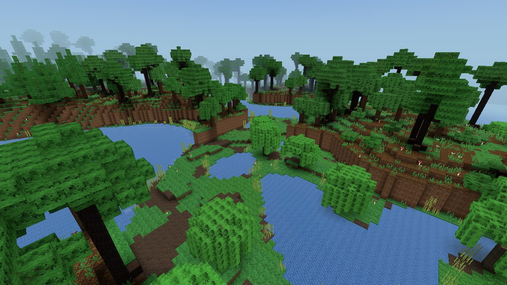
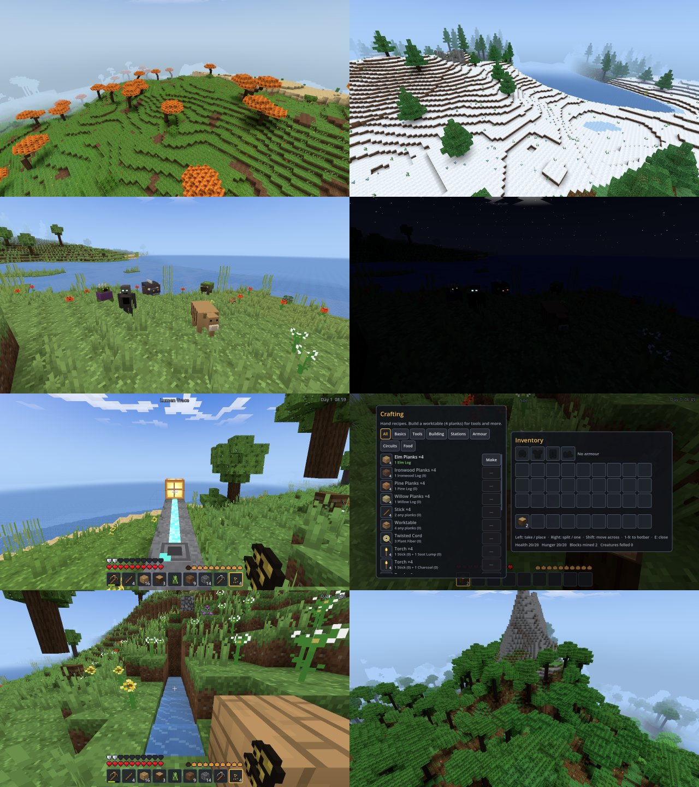
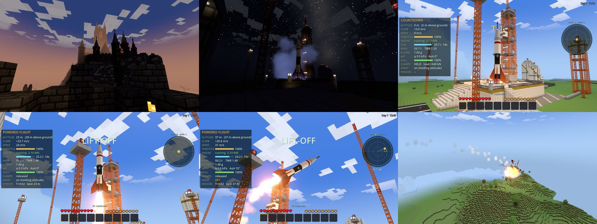
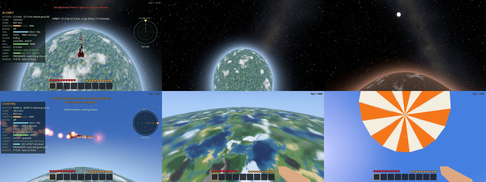
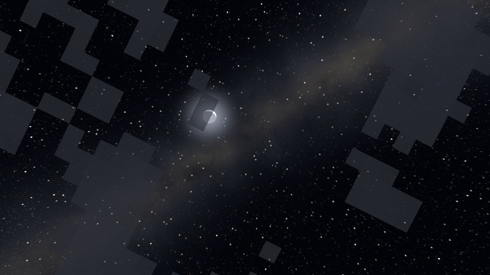

# STRATA — an original voxel survival sandbox

A complete block-world survival game: an endless generated world of fourteen
biomes, caves and ores, flowing water, day and night, weather, eight original
creatures, tools in five tiers, armour, a hunting bow, cooking, smelting,
farming, storage, building, lumen circuits that switch lamps and doors, and a
world that saves and loads. Every texture, model, sound, piece of music, name
and line of code was made for this project. No assets, code or names come from
any other block game, and none of it is a clone of one.

**This one is a desktop game, not a web page.** Unlike everything else in this
repository it is a Godot 4 project written in C#, so there is no GitHub Pages
link. It is built and tested for Windows and Linux; Godot also targets macOS,
but that has not been tried.

## Running it

You need the **.NET edition** of Godot 4.7 (the standard edition cannot run C#)
and the **.NET 8 SDK**.

1. Install the .NET 8 SDK: <https://dotnet.microsoft.com/download/dotnet/8.0>
2. Download **Godot 4.7 – .NET** from <https://godotengine.org/download>
3. Open `strata/project.godot` in Godot (Import → select the file) and press
   **F5**. On the first run Godot compiles the C# for you; that takes a few seconds.

From a terminal the same thing is:

    cd strata
    dotnet build Strata.csproj        # optional: Godot builds on launch anyway
    godot --path .                    # "godot" = your Godot .NET executable

### Making a standalone build

`export_presets.cfg` holds presets for **Windows Desktop** and **Linux**. In
the editor: Editor → Manage Export Templates → Download, then Project →
Export → pick a preset → Export Project. Or from a terminal, once the
templates are installed:

    godot --headless --path . --export-release "Windows Desktop" build/windows/Strata.exe
    godot --headless --path . --export-release "Linux" build/linux/Strata.x86_64

A .NET export is the executable plus a `data_Strata_*` folder next to it (the
.NET runtime and the game's assemblies). Ship the whole folder; the `.exe`
alone will not start. Players do not need Godot or .NET installed.

GitHub Actions does all of this on every push that touches `strata/`
(`.github/workflows/strata.yml`): it runs the test suite, exports both
platforms, and attaches **STRATA-windows** and **STRATA-linux** to the run as
downloads (Actions tab → "STRATA builds" → the latest run → Artifacts).

## Controls

| Input | Action |
|---|---|
| mouse | look |
| W A S D | walk |
| Space | jump · swim up · climb a ladder |
| Ctrl (hold, moving forward) | sprint (needs hunger above 6) |
| Shift | sneak — you will not step off an edge; swim down |
| left mouse (hold) | mine · attack |
| right mouse | place · use: open a worktable, furnace, crate or door, throw a switch, till, plant, sleep, feed an animal, put on armour, work a launch console, board a rocket through its hatch · hold to eat · hold to draw a bow, let go to shoot |
| middle mouse | pick the block you are looking at into your hand, if you carry it |
| 1 – 9 · mouse wheel | hotbar slot |
| E | inventory and crafting |
| Q · Ctrl+Q | drop one · drop the stack |
| Esc | pause menu · close a screen |
| F1 | hide the HUD |
| F2 | screenshot (saved under the user data folder, `screenshots/`) |
| F3 | debug overlay |

Aboard a rocket the keys change: see [Flying the rocket](#flying-the-rocket).

**In the inventory:** left-click picks up, puts down, swaps or merges a stack;
right-click takes half, or puts down one; shift-click moves a stack straight
across (inventory ↔ hotbar ↔ crate or furnace); hover over a slot and press
1–9 to swap it with that hotbar slot; click outside the panel to drop what you
are holding. The recipe list on the right shows what you can make
with what you carry — click once to craft one, shift-click to craft as many as
you can. Recipes you cannot afford yet are listed dimmed, so the list doubles
as a recipe book.

## A first day

1. **Wood.** Hold left mouse on a tree trunk. Logs come off faster with an axe,
   but hands work.
2. **Planks, sticks, a worktable.** Press E. Planks and sticks craft by hand;
   so does the worktable. Place it and right-click it for the bigger list.
3. **Wooden pick.** Dig down to stone. Stone drops cobblestone, which makes
   stone tools and a **furnace**.
4. **Light.** Soot seams (black-flecked stone near the surface) give soot;
   a stick and soot make four torches. Charcoal, from logs in the furnace,
   works too.
5. **Food.** Mossbacks, brindles, burrowkits and pipwings drop meat; cook it in
   the furnace. Tall grass sometimes drops goldgrain seeds: till soil with a
   hoe, plant, wait, harvest, and make hearth bread at the worktable.
   Emberblooms sometimes come up with an emberroot, and frostbells shed
   frostleaf seeds — two more crops. Duskberries grow on bushes; mushrooms
   grow in the woods.
6. **Before dark,** build a room with a door and a torch. A day lasts twenty
   minutes. At night hollows and thornspitters come out, and once in a while
   something much bigger. Underground, in the dark, lurkers wait at any hour.
7. **A bedroll** (hide, planks, fiber) lets you sleep through the night and
   makes that spot your respawn point.
8. **Down.** Copper, then iron, then silver and gold, deep lumen crystal, and
   at the very bottom, rarely, starmetal. Each metal tier mines faster, hits
   harder and lasts longer.
9. **Armour and a bow.** Hide from animals makes a first set of armour;
   copper, iron and starmetal make better ones. A hunting bow (sticks and
   cord) shoots arrows made from a stick, a feather and flint — gravel
   sometimes gives flint when you dig it.

If you die, everything you carried stays where you fell, as items on the
ground — go back for it before it despawns (five minutes).

## The world

Columns are 16 × 16 blocks and 256 tall; sea level is 62. The world is a pure
function of its seed, so the same seed always gives the same world, whatever
order you explore it in.

**Terrain** comes from five climate fields sampled per column —
continentalness (sea to inland), erosion (flat to broken), temperature,
humidity and ruggedness — plus a river field that carves winding channels
down to the water table. Rugged high ground is bent into cliffs and overhangs
by 3D noise. Biomes are picked from the climate, so they sit where they make
sense: frozen seas next to snowfields, dunes where it is hot and dry.

| Biome | What is there |
|---|---|
| Verdant Meadow | open grass, flowers, lone elms; lots of animals |
| Elderwood | dense elm and ironwood forest, ferns, mushrooms |
| Mirewood | willows over mud and shallow water; murky fog |
| Pinereach | pine and tall pine, ferns, frostbells |
| Frostveld | snow-covered grass, sparse pines, snowfall |
| Sunscorch Dunes | sand over sandstone, cacti, no rain, desert shrines |
| Ember Savanna | tall grass, ember trees, emberblooms, herds |
| Ashlands | cinder and ashstone, dead trees, a smoky haze |
| Stonecrown Peaks | bare stone mountains with snowy tops, a few pines |
| Shore, River | sand, clay, reeds |
| Shallow Sea, Deep Sea, Frozen Sea | sand or gravel floors; sea ice where it is cold |

**Caves** are three systems layered together: large caverns from 3D noise that
open up with depth, long winding tunnels from a pair of noise fields, and
"worm" tunnels grown by random walks, some of which pitch up into shafts that
break the surface. Some regions flood their caves into underground lakes, and
below y = 10 every open space is lava.

**Ores** grow as veins by short random walks, densest around a preferred depth:

| Ore | Found | Needs at least | Gives |
|---|---|---|---|
| Soot seam | y 5–128, most at 70 | wooden pick | soot: torches, fuel |
| Copper | y 0–96, most at 48 | stone pick | copper tools |
| Iron | y 0–72, most at 28 | copper pick | iron tools |
| Silver | y 0–40, most at 16 | copper pick | the silver blade |
| Gold | y 0–32, most at 12 | iron pick | lumen lamps, gold blocks |
| Lumen crystal | on cave walls, y 3–30 | iron pick | light: torches, lamps, glowing blocks |
| Starmetal | y 2–16, in slatestone, rare | iron pick | the best tools |

**Structures** are placed per 128-block region by hash, and every column they
cross builds its own part from the same plan: camps and ruins in the
grasslands and forests, stone towers and ruins in the cold north and the
mountains, ruins in the ashlands and the mire, shrines in the dunes, and vaults
buried deep underground. Each has crates filled from its own loot table the
first time they are opened.

**Trees** are grown procedurally per kind — elm, ironwood, pine, tall pine,
willow, ember, dead, and shrubs — so no two are the same. Saplings dropped by
leaves grow into new ones.

**Water** is still where the world made it. Once you disturb it, it moves:
sources spread up to seven blocks across flat ground, thinning as they go, and
pour straight down any drop. Cut the source and the flow drains away. A
one-block gap between two sources refills with a new source, so a hole dug in
a lake heals over. Water washes away plants it runs into.

## The showcase world: Castle Vorhaal and the launch complex

**Create Showcase World** on the title screen makes a world with two large
builds laid into it by the generator. Everything else about the world (seed,
biomes, creatures, survival) is normal. You arrive on a watchtower above a dead
village, looking up at the castle.

**Castle Vorhaal** is the last stop of a dark fantasy game that does not exist:
a gothic fortress on a crag 50 m above the valley, reached by a road that
spirals up a rock spur and crosses a gorge on a stone bridge to a gatehouse
with drum towers and a portcullis. Inside the curtain wall (towers of
different heights and ages, one of them ruined) are a bailey with a well,
a graveyard, a mausoleum and a gallows; the entrance hall with galleries and a
rose window; the throne hall under the keep; a long dining hall and its
kitchen; an armoury; a library with a gallery and a study behind a tapestry;
an alchemist's room; a chapel with its bell spire; bedchambers; a dungeon with
cells and a torture room; crypts, catacombs and an ossuary; hidden passages
behind false walls, a hidden spiral stair, an escape tunnel out through the
cliff; the count's chambers near the top of the keep (a coffin under a
canopy, a treasury nobody is meant to find); and at the very top, the Crimson
Crown, a boss arena ringed by a moat of lava under four great windows. Crates
throughout fill from their own loot tables (armoury, treasury, alchemy,
crypt, larder). Windows glow ember red at night. The castle is built by a
small procedural toolkit (`src/Gen/Landmarks/Gothic.cs`: towers, spires,
steep roofs, pointed arches, rose windows, buttresses, spiral stairs,
furniture) driven by a hand-written plan (`Castle.cs`), so its wings differ
in masonry, age and state of repair.

**The launch complex** lies east along the paved road: a raised concrete pad
with a flame trench, a 40 m launch tower with a crew arm, a fuel farm, a water
tower, a 44 m assembly building, a launch control bunker with blast-slit
windows, floodlight and lightning masts, roads and a parking lot. A rocket
stands on the pad, fuelled and clamped down.

## Flying the rocket

The rocket is not an animation. It is a rigid body with mass, inertia and a
changing centre of mass, pushed by an engine through a gimbal, pulled by
gravity, pushed back by the air, held by clamps until it can lift itself, and
stopped by the blocks it hits.

**Getting in.** Climb the ladder in the tower's spine to the crew arm, 24 m
up, walk to the end of the arm and right-click the hatch. Inside, R arms the
rocket, G starts a ten-second count. The engine lights at T-3 while the
hold-down clamps take the thrust; at T-0 the flight computer checks that the
thrust is more than the weight and lets go, or holds the launch and shuts the
engine down if it is not (try it at half throttle).

| Key | Aboard the rocket |
|---|---|
| R · G · B | arm / disarm · start the countdown · abort |
| Shift · Ctrl | throttle up · down (hold) |
| Z · X | full throttle · cut the engine |
| Space | light or shut down the engine (off the pad) |
| W S · A D | tip the nose away from you / toward you · left / right (relative to the view) |
| Q · E | roll |
| T | stability assist on / off |
| P | what the assist holds: the attitude you left it in · prograde (the nose along the path) · retrograde (against it) |
| V | camera: chase · capsule window · pad camera |
| mouse · wheel | look around · zoom the chase camera |
| H | show all of this on screen |
| F | climb out; in flight, bail out with the seat's parachute (not in space: there is no spacesuit, so it asks twice) |

**The instruments** show altitude above the pad and above the ground, climb
rate, speed, throttle, engine state and thrust, propellant and burn time left,
mass and thrust-to-weight ratio, g-load (what an accelerometer aboard reads),
dynamic pressure and angle of attack, hull integrity, the clamps' load, and a
tilt dial with the nose and the flight path on it. Once off the pad they show
the orbit as well: the highest point of the path and the time to it, the
lowest point (under the ground, in the air, or clear of it), and the speed
across the ground against the speed an orbit at this height needs, or, in
orbit, the time a lap takes and the laps done. Warnings flash for sink rate,
attitude, low fuel, structural overload, hull damage, re-entry heating and
escape.

**Things that go wrong.** Land faster than 10 m/s and the hull takes damage in
proportion to the square of the excess; much faster and it breaks up. Let it
lean too far on the ground and it topples. Turn hard at high speed and the
airflow tears it apart. Run the tanks dry and the engine flames out. Whatever
destroys it, the tank goes up: a blast that grows with the propellant left,
a crater in the ground (hard blocks resist, bedrock does not go), fire,
smoke, a flash that lights the landscape, wreckage that tumbles and burns
(the engine, both tank sections, the capsule, the fins, panels), and damage and
knock-back to anything nearby, you included. Standing in the exhaust burns.
The launch console at the foot of the tower (and in the bunker) rolls out a
new rocket when the pad is empty, or refuels and repairs the one on it.

### To orbit and back

The world is a flat map of a round planet 40 km in radius, and high up and
fast the difference starts to matter. Gravity weakens with height (a quarter
of it one planet-radius up), the air thins out and ends at 18 km, and
anything moving sideways fast enough finds the ground curving away beneath it
as fast as it falls. That is an orbit: about 860 m/s, 20 km up, once round the
planet in seven and a half minutes.

**Getting there.** Lift off at full throttle and, a few hundred metres up,
tip the nose about ten degrees toward where you want to go (east is a good
choice: see below), then press P for prograde: the assist holds the nose along the path, and gravity bends the path
over for you. Watch HIGHEST: when it reaches about 21 km, cut the engine (X)
and coast up. Near the top, light it again (Space) and burn level until
LOWEST climbs clear of the air. **IN ORBIT**, the instruments say. A careful
flight gets there with a tenth to a fifth of the propellant left. Straight up
at full throttle does not reach orbit: it leaves the planet for good.

**Going round.** In orbit nothing pushes or drags; the engine can stay off
for as long as you like. The map repeats for anything in orbit, east–west
and north–south, so the world has a far side you can see and come round
from. Launched due east (or west, north or south), a lap brings you back over
the launch complex; on a slant, each lap passes over different ground. The whole planet is drawn below you, out to its limb:
the generator's own ground, seen from high up, bent round the curve of the
planet, under a black sky full of stars, with a thin blue rim of air and the
planet's clouds painted on it. Dusk walks across it as the day goes by.

**Coming home.** Press P until the assist says RETROGRADE, let the nose
swing round, and burn until LOWEST is well down into the air. Then P round to
PROGRADE again before the air thickens (a finned rocket wants to fly nose
first; tail first, the fins try to flip it over, and broadside the air tears
it apart). Coming back into the air at orbital speed, the hull glows and
trails plasma. The air slows it less than you might hope: nose first, a
rocket this heavy and this slim still falls at several hundred metres a
second near the ground. Landing it on its engine takes more propellant than
a careful climb to orbit leaves, and a very good hand on the throttle. The
sure way home is the seat's parachute.

**Leaving.** There is no spacesuit. Above about 14 km, F only warns you;
pressing it again steps you out into nothing, which in survival is the end of
you (in creative it sends you home). Below that, F bails out and you take the
seat's parachute with you. You fall at up to 60 m/s, and the far ground gives
way to the real one as you come down, loaded before you get there. The
parachute opens by itself 350 m above the ground and lets you down at
5.5 m/s (the movement keys steer a little). The rocket goes on without you.

**Too fast.** Burn too long and you pass the planet's escape speed: the
warning says to cut the engine or burn retrograde, and past 300 km the
rocket, and you, are not coming back.

**How it works.** `src/Vehicle/` is a small general vehicle system; nothing in
it but `Rocket.cs` and its drawing knows about rockets.

- `RigidBody` — position in double precision, velocity, orientation as a
  quaternion, angular velocity, mass and principal inertia; forces and
  torques gathered each step, applied at points; semi-implicit integration
  with the gyroscopic term.
- `Vehicle` — a body plus parts plus a hull of contact points, stepped in
  fixed sub-steps of 1/120 s. Each step it adds up mass and centre of mass
  from its parts (the tank's contents sink as it drains), applies gravity,
  lets every part push, integrates, then either holds the body in its clamps
  or resolves the hull against the blocks. Hard contacts, aerodynamic
  overload and anything else a subclass checks become damage. At rest it
  sleeps until something pushes it or the ground under it goes.
- `Planet` — gravity falling off as 1/r², the air (density 1.2 kg/m³ at sea
  level, thinning by e every 2.5 km, gone at 18 km), circular and escape
  speeds, and `Orbit`: from a position and a velocity, the highest and lowest
  points of the path, its period and the time to the top, from its energy
  and angular momentum. The round planet reaches the flat map through two
  extra forces on every vehicle: a lift of v²/r from its speed across the
  ground, and a drag of v·vup/r that keeps its angular momentum
  as it climbs or falls. With those, and ground speed scaled by R/r (a lap
  up high is longer than one at sea level but crosses the same map), motion
  on the map is exactly motion round a sphere in the plane of travel. Above
  12 km a vehicle that runs off one side of the lap comes back on the other.
- `VoxelCollider` — hull points found inside solid blocks are pushed out
  through the nearest open face; the contacts are solved together with a few
  rounds of sequential impulses (normal and friction, accumulated and
  clamped), so a box on four corners settles and a toppling rocket rolls
  instead of jittering.
- Parts: `PropellantTank`, `Thruster` (throttle with a minimum, spool-up and
  spool-down, a gimbal that swings at a limited rate, mass flow of thrust ÷
  exhaust velocity, flame-out when dry), `ReactionControl` (wheels: torque
  without thrust), `AeroBody` (axial and cross-flow drag and a fin normal
  force at the centre of pressure, so a finned rocket points into the wind by
  itself; air thins with height), `Seat`, `HoldDown`.
- `Rocket` — the configuration, the launch sequence, and a stability-assist
  loop that turns the stick into turn rates (and holds attitude when the stick
  is released) by swinging the gimbal and spinning the wheels.
- `Wreck` — a tumbling box, the same physics; the pieces of a rocket.
- `Explosions` — the crater. `Exhaust` — fire and smoke puffs that are
  stopped by blocks one axis at a time and spread along whatever stopped
  them, so the exhaust runs down the flame trench and billows out of its
  open end. The flame lights the terrain through a moving light in the voxel
  shaders.

| The rocket | |
|---|---|
| height · diameter · fin span | 33.5 m · 3.4 m · 8.4 m |
| mass: dry · propellant · full | 26 t · 50 t · 76 t |
| thrust · exhaust velocity | 2.8 MN · 2,600 m/s (1,077 kg/s at full throttle) |
| throttle range · gimbal | 20–100 % · ±5° |
| thrust-to-weight at lift-off · at burn-out (sea-level gravity) | 1.32 · 3.8 |
| burn time at full throttle · Δv | 46 s · 2,790 m/s |
| straight up at full throttle | escapes the planet |
| a gravity turn to orbit | about 90 s, 10–20 % of the propellant left |

| The planet | |
|---|---|
| radius · circumference | 40 km · 251 km |
| gravity at sea level · 20 km up | 28 m/s² · 12.4 m/s² |
| air: sea level · scale height · top | 1.2 kg/m³ · 2.5 km · 18 km |
| circular orbit at 20 km: speed · lap | 864 m/s · 7.3 minutes |
| escape speed at sea level · at 20 km | 1,497 m/s · 1,222 m/s |

## Creatures

| Creature | Kind | Where and when | Behaviour | Drops |
|---|---|---|---|---|
| Mossback | grazer | grassland by day | a slow shelled grazer that crops the grass | meat, hide |
| Brindle | livestock | meadow and savanna | follows anyone holding goldgrain; feed two to breed a calf | meat, hide |
| Burrowkit | small forest animal | grassland and woods | bolts if you come close, unless you sneak | meat |
| Pipwing | bird | grassland and woods | takes off when startled and glides back down | fowl, feathers |
| Hollow | night melee | surface at night, caves | spots you by sight, hunts you along a path, strikes up close | bone, soot |
| Thornspitter | night ranged | surface at night, caves | keeps its distance and spits thorns | glands, fiber, seeds |
| Lurker | cave predator | underground in the dark, any hour | fast, pounces from a few blocks away | bone, hide, lumen |
| Gravemaw | rare, powerful | surface at night, rare | seventy health; slams the ground around it | iron, starmetal, hide, bone |

Night-walkers come apart in direct sunlight. Hunters need a line of sight to
notice you and give up if they lose you for long enough. Nothing wanders off
cliffs or into lava; animals avoid water. Creatures spawn only where the light
is right (animals on sunlit grass, hunters in darkness) and never within 18
blocks of you; animals and hunters each have a cap on how many can be around,
and creatures despawn once you are far away. Animals you have fed or bred stay
forever. Their eyes give the hunters away in the dark once they are close,
within about a dozen blocks; further off a hunter is only a shape, so the
night sky is not dotted with little lights.

## Survival

| | |
|---|---|
| Health | 20. Heals while hunger is 18 or more — quickly when well fed. |
| Hunger | 20. Drains with sprinting, jumping, mining and fighting; at 0 you starve slowly, down to your last point of health. Sprinting needs more than 6. |
| Breath | 10 seconds under water, then drowning damage. |
| Falling | one point per metre beyond three. |
| Hazards | lava, cactus spines, creatures, starvation, drowning. |
| Death | inventory dropped where you fell; respawn at your bedroll or the world spawn. |

**Armour** has four slots (head, chest, legs, feet) and four sets: hide,
copper, iron and starmetal, worth 6, 10, 13 and 18 protection points. Each
point turns aside 4% of a blow from a creature, an arrow or a cactus, up to
80%; falls, lava, drowning and hunger go straight through. Every piece wears a
little with each blow it turns, and falls apart when worn out. Right-click a
piece to put it on, or shift-click it in the inventory.

**The hunting bow** draws in 0.9 seconds while you hold right mouse, slowing
you to a walk and narrowing your view; let go to shoot. A full draw sends an
arrow at 48 m/s for 9 damage, a quick one much less. Arrows fall under
gravity, so aim high at range. Three in four survive hitting the ground or a
wall and can be picked up again.

**Lumen circuits** are the game's own signal system. Crush a lumen shard into
eight **lumen traces** and lay them on the ground as wiring. A **switch**
(right-click to throw it) or a **tread plate** (powered while anything stands
on it — you, or a creature) drives the traces beside it at strength 15, and
each trace along the line is one weaker, so a signal carries fifteen blocks.
Traces join their neighbours on the level and climb or drop one-block steps
(not under a roof). A **signal lamp** lights, and a **door** swings open,
while anything beside it is powered. Doors follow *changes* in power, so you
can still open and shut one by hand, and a door never swings shut on someone
standing in it. The traces glow when they carry a signal, and draw themselves
toward whatever they connect to.

Tools have a kind (pick, axe, shovel, hoe, blade), a tier (wooden, stone,
copper, iron, starmetal) and durability. Mining time depends on the block's
hardness, whether the tool suits it, and the tool's tier; some blocks need a
minimum tier to drop anything. The silver blade hits night-walkers twice as
hard.

The furnace takes fuel (logs, planks, sticks, charcoal, soot, wooden tools) and smelts
ore to ingots, sand to glass, clay to bricks, cobblestone back to stone, logs
to charcoal, and cooks every raw meat and emberroot. Crates hold 27 stacks.
Everything you place, the contents of every crate and furnace, dropped items,
creatures, the time of day and the weather are saved with the world.

## Creative mode

Pick **Creative** when you make a world, or switch any world over from the
pause menu (and back again).

| Input | In creative |
|---|---|
| Space, twice quickly | take off · land |
| Space · Shift (flying) | climb · sink; touching the ground lands you |
| Ctrl (flying) | fly fast (26 m/s instead of 11) |
| left mouse | break any block at once (hold for about six a second); nothing drops |
| right mouse | place; the stack in your hand never runs out |
| middle mouse | a full stack of whatever you are looking at |
| E | every block and item: click to take a stack, shift-click to put it on the hotbar, hover and press 1–9 to fill that slot, click with something in hand to throw it away; filter by blocks or items, or search by name |

Nothing hurts you in creative (except falling out of the bottom of the world),
and hunger and breath never run down. Creatures, weather, water, circuits and
rockets all work as they do in survival.

## Menus, saving, settings

The main menu lists your worlds with name, seed, time played and when last
played; creates a world from a name, an optional seed (a word or a number;
empty or **Random** picks one) and a game mode (survival or creative); deletes
with a confirmation. Esc in game opens Resume · Settings · Game mode (switch
between survival and creative at any time) · Save · Save and Quit to Menu ·
Save and Exit Game. The world also autosaves every five minutes.

Settings (kept in the user data folder, `settings.json`): mouse sensitivity and
invert Y, field of view, render distance (3–16 columns), brightness, master and
music volume, graphics quality (Fast · Balanced · Fancy), bloom (the glow round
lamps, fire and the sun), view bobbing, an FPS counter, vsync, fullscreen and
resolution.

Worlds live in the user data folder, under `worlds/<name>/`:

    world.json        seed, player, time, weather, drops, creatures (with world.json.bak)
    chunks/c_X_Z.bin  every column that differs from what the seed would generate

The user data folder is `%APPDATA%\Godot\app_userdata\Strata` on Windows,
`~/.local/share/godot/app_userdata/Strata` on Linux and
`~/Library/Application Support/Godot/app_userdata/Strata` on macOS. Every
file is written to a temporary name and then moved into place, and
`world.json` keeps its previous version as a backup, so a crash in the middle
of a save cannot leave a world unloadable.

## How it works

    project.godot, Main.tscn     settings and the one node that boots everything
    shaders/                     voxel (opaque, cutout, water), sky, clouds, the planet from afar, creatures, held items
    src/Core/                    boot, app state, game loop, settings, saving, tests, self test, screenshot tools
    src/Data/                    the block, item and recipe registries; inventories
    src/Gen/                     noise, climate and biomes, terrain and caves, ores, trees, structures
    src/World/                   columns, the column pipeline, lighting, meshing, fluids, disk store
    src/Entity/                  player, collision, ray casts, creatures and their AI, dropped items
    src/Render/                  procedural textures and icons, sky and atmosphere, the far terrain, particles, weather, overlays
    src/UI/                      HUD, inventory and crafting screens, menus
    src/Audio/                   synthesised sound effects and ambience; the piano, the hall and the soundtrack

**Data-driven registries.** Blocks, items, recipes, smelting, creatures, loot
tables and biomes are tables in `src/Data`, `src/Entity/MobDefs.cs` and
`src/Gen`. A block is one `ushort`; its variants (facing, growth stage, lit,
open, water level) are separate ids, so there is no side table of metadata.
Column files store a palette of block *names*, so ids can be reordered without
breaking saved worlds.

**The column pipeline.** Each column moves through Generating → Generated →
Lighting → Lit → Meshing → Meshed on a pool of worker threads (one fewer than
your CPU's cores). Generation runs to render distance + 3, lighting to +2 and
meshing to the render distance; columns past +4.5 are saved if changed and
unloaded. Generation never reads another column: a tree or tunnel that crosses
a border is re-derived from the seed by every column it touches. Lighting
needs a column's neighbours, meshing needs lit neighbours; the pipeline
guarantees both.

**Lighting** has two channels, sky and block, 0–15 each, flood-filled per
column over a 46 × 46 window so light can cross borders. Placing or breaking a
block relights just the affected area by breadth-first add and remove passes,
and a unit test checks that the result matches a full recompute exactly.
Corners take smooth light (the average of the four cells around them) and
three-neighbour ambient occlusion. Daylight and the colour of the sky are
applied in the shader, so night falls without remeshing anything.

**Meshing** is greedy: a face is only drawn where the neighbour lets you see
it, and coplanar faces with the same texture, tint, light and occlusion at
every corner merge into one rectangle. Each column is four 64-tall slabs so an
edit remeshes a quarter of the column. Opaque blocks, cut-out blocks (leaves,
glass, plants) and water go to separate meshes with their own shaders;
emissive blocks ignore light; plants and leaves sway. Water is drawn at its
level, with risers between steps.

**Textures** are painted in code at start-up — 16 × 16 pixel art from noise,
palettes and a few drawing primitives — into a `Texture2DArray`, one layer per
texture. Because every face samples its own layer, merged faces tile without
bleeding into neighbours, and mipmaps are built so a layer's coverage survives
minification (leaves don't dissolve at a distance). Item icons, block icons
and the creatures' coloured-box models are generated the same way.

**The night sky** is drawn in the sky shader, on a sphere that follows the
camera. It has three layers of stars: a dust of faint ones, thickest along the
Milky Way, then common ones, then a few bright ones. The stars vary in
brightness and colour, from blue-white through white and yellow to orange,
and shimmer gently. The Milky Way is a band of cloudy light with a dark rift
of dust down its middle. It arches overhead around midnight, and the whole
sky turns with the moon through the night. About once every forty seconds a
shooting star crosses the sky. Every star is drawn at least a pixel and a
half wide, and one drawn wider than it is gets fainter to match, so turning
the view never makes stars wink on and off. By night the clouds are dim grey
shapes that hide the stars behind them.

**The planet from high up.** On the ground the fog hides the edge of the
loaded world, as block games do. Climb a few hundred metres and there is no
hiding it, so the fog lifts and gives way to the air's own haze (worked out
along the line of sight through air that thins with height over the round
planet), and the rest of the world is drawn out to the horizon by
`FarTerrain`: five square rings round the camera, each four times coarser than
the one inside it (8 m to 2 km between points), sampled from the world
generator itself on worker threads. Each point stands for the whole cell round
it (an average of up to nine samples across it, placed at random within it),
so from high up rivers and clearings do not turn into a mottle of specks.
Each ring hides where the next finer one is drawn and wherever real block
columns are loaded, and toward its edge it turns into the next ring out, so
where one ends and the next begins there is no step and no seam. The shader
bends the flat map round the planet below the camera, so from a rocket the
ground curves away to a limb of blue haze; the sky goes black with height, the
stars come out in daylight, a rim of air glows along the limb, and the
planet's clouds are painted onto the ground from above. While the camera is
high, or low and racing past, no new block columns are loaded: the far
terrain stands in until you come down.

**Sound** is synthesised at start-up at 22 kHz from oscillators, noise and
envelopes: footsteps, digging, breaking and placing per material, splashes and
swimming, hits and hurts, eating, doors, crates, thunder, a voice (idle, hurt,
death) for each of the eight creatures, and loops of wind, rain, cave air and
underwater murk.

**Music** is seven original pieces for a soft piano in a large hall: quiet,
unhurried, mostly major sevenths and ninths, a melody over a gently rolling
left hand. They are written out in `src/Audio/Music.cs` as chord symbols and
melody lines (`Dmaj9 Gmaj7 Bm7 Aadd9`, `F#5:3 E5:1 | D5:2 B4:1 D5:1 |`) and
performed by code. The left hand plays each chord in a pattern, with the
chord's notes moved as little as possible from the last chord's. The melody
sits a touch behind the beat, the pedal lifts at every change of chord, the
last two bars slow down and the final chord is rolled. Timing and touch vary
by a few milliseconds, the same way every time.

| Piece | Plays | Key, time, tempo |
|---|---|---|
| Hearthlight | title screen, day | D major, 4/4, 64 |
| Morning Field | title screen, day | G major, 4/4, 72 |
| Clearwater | day | C major, 3/4, 84 |
| Long Road | day | F major, 4/4, 60 |
| Lanterns | night, deep underground | E minor, 4/4, 58 |
| Night Garden | night | B minor, 3/4, 66 |
| Undercroft | deep underground | A minor, 4/4, 48 |

The piano (`Piano.cs`) is additive synthesis. Each note is up to two dozen
partials of a stiff string, which sit a little sharp of true harmonics. It is
played on two strings about a cent apart, so the tone beats slowly as it
rings. The felt hammer strikes about a seventh of the way along the string,
which weakens every seventh partial, and a harder blow wakes more of the
upper ones. The sound falls quickly and then rings on, for longer in the
bass. The hall (`Reverb.cs`) is a Schroeder–Moorer reverb: eight damped combs
and four all-passes a side. The lows below about 220 Hz are rolled off before
the reverb, so the tail stays clear. A few pieces add a quiet two-voice pad
under the chords.

`MusicPlayer` picks a piece a couple of seconds after the title screen
opens, then after 40–90 s of quiet. In a world it waits 30–75 s, then leaves
2–5 minutes between pieces, choosing by where you are: deep underground (out
of the sky's reach, well below sea level), night or day. It never plays the
same piece twice running and fades out when you leave for the menu or a world.
Each piece is rendered on a worker thread when it is wanted (two to six
seconds of one core, about 20 MB) and let go when it ends. Nothing is
recorded, sampled or loaded from disk.

**Physics** is swept axis-aligned boxes in double precision against the voxel
grid, one axis at a time, with step-up, sneak edges, ladders and swimming. It
cannot tunnel at any frame rate (a frame is capped at a quarter of a second)
and never pushes you into walls. The block you are looking at comes from an
exact voxel ray walk (DDA), out to 5 blocks; creatures can be hit out to 3.6.

**Creatures** are small state machines (idle, wander, graze, flee, follow,
chase, fly) over the same collision as the player. Hunters path with A* over
walkable cells in a short radius and re-plan as you move. Each creature is
lit through its own two materials (body and eyes), not through per-instance
shader parameters: on some graphics drivers those arrived corrupted and
turned whole herds into glowing white blobs. The creature, item and hand
shaders also clamp their output to white and replace any invalid pixel. The
bloom only picks out things brighter than white, so nothing on a creature
can set it off.

## Testing

Nothing here needs a person to check it.

    godot --headless --path . -- --test                # 727 checks, in a few seconds
    godot --path . -- --selftest OUTDIR                # plays the game; 79 checks and screenshots
    godot --path . -- --flighttest OUTDIR              # flies rockets at the launch complex and to orbit; checks and screenshots
                                                       # (--orbit: only the orbit; --creative: only creative mode)
    godot --headless --path . -- --bench               # pipeline costs per column
    godot --headless --path . -- --music OUTDIR        # the soundtrack as WAV files (--stems: melody, accompaniment, pad apart)

`--test` covers coordinates and indexing, column storage, seed repeatability,
generation being deterministic and independent of load order, save and load of
columns and world files (including recovery from a corrupt file), inventory
stacking and every kind of click, exact crafting, smelting, break times and
harvest rules, ray casts, incremental light against a full recompute,
collision (landing, walls, speed, stepping), survival rules, the mesher's
culling and merging, loot tables, creature AI at 4, 8 and 30 fps, water
flow (including flows saved mid-way), armour and arrows, lumen circuits
(strength, range, breaks, steps, roofs, and a plate-worked door that will not
close on you), and the music: the notation reader, every piece's bars and
melodies lining up, piano notes that ring down cleanly, and an excerpt that
renders in stereo without clipping and fades to silence. The vehicle physics
is checked the same way: free fall against ½gt², bounce and rest, a spinning
body keeping its angular momentum, a nudged post toppling, flung panels
settling; the rocket's mass and thrust-to-weight, the clamps holding and
measuring the load, the thrust check holding a weak launch, ignition before
T-0 and release at it, a climb under its own thrust with the assist keeping
it upright, mass flow equal to thrust over exhaust velocity, acceleration
rising as the tanks empty, the stick turning it the right way and the assist
holding the new attitude, flame-out when dry, a vertical flight leaving the
planet, a short drop surviving and a long one not, a leaning rocket toppling,
a broadside break-up in the airflow, a crater, and a whole flight under uneven
frames never going not-a-number. The planet: gravity and air with height, the
orbit maths against the textbook (a circle, an ellipse and its period and
time to the top, a fall, an escape), a body in circular orbit holding its
height for a whole lap, weightless, and coming back over where it started
after crossing the seam of the map, and a gravity turn to orbit flown by the
rocket's own controls, keeping the sideways load well inside the structure's
limit. The far terrain: it is the generator's ground, it repeats after a lap,
it has no cliff at the seam, and a ring's edge meets the next ring out
exactly.

`--selftest` starts a real world with real rendering and plays the core loop
with scripted input, the way a person would: hear a title piece start and fade
as the world opens, then a piece chosen for the place, chop a tree, craft planks through
the screen, drag a stack and hotkey it, build a worktable, make tools, dig to
stone, build a furnace and smelt, hunt, put on armour and shoot a bow, cook and
eat, pour water into a channel, wire a switch to a lamp and a plate to a door,
fight off a night attacker, light a room, store
things in a crate, farm, fall, die and respawn, save, quit to the menu, reload,
and check that everything is where it was.

`--flighttest` makes a showcase world and does what a player would: climbs
onto the crew arm, boards through the hatch with the use button, arms and
counts down with the keys, watches the engine light under the clamps and the
clamps let go, steers with W, cuts the engine and rides it into the ground
(checking the wreckage and the crater), then botches a launch on purpose with
the assist off and full rudder, has a launch held at half
throttle and climbs out, and then goes to orbit: puts a rocket on a circular
path 21 km up, checks the instruments call it an orbit, holds prograde with
P, finds F only warns up there, flies it across the seam of the map (the
camera and the planet below come with it), brings it back into the air fast
enough to glow, steps out 6 km up and falls (the ground under the fall is
loaded before it arrives). Then it switches to creative mode: takes off with
a double tap, climbs, hovers and flies, breaks a block with one click (no
drop), opens the block palette and places a block that is not used up.

`--shots OUTDIR [--tour] [--landmarks]` flies a camera through fixed viewpoints — every
biome, a structure, a cave, dawn, dusk, night, the creatures up close — and
saves pictures. Screenshots found several bugs that no test could have.

### Performance

Measured with `--bench` on one core of a 4-core cloud machine, on land around
the spawn point:

| Stage | Per column |
|---|---|
| generate | 4.3 ms |
| light | 4.3 ms |
| mesh (4 slabs, ~3,900 triangles) | 7.3 ms |
| encode for disk | 3.3 ms (2.5 KiB) |

That is about 16 ms of work per column spread over the worker threads, so a
render distance of 10 (441 columns) fills in a couple of seconds on four
cores. The main thread only uploads finished meshes, within a 5 ms budget per
frame.
No frame rate numbers are given here because the only GPU available while
building this was a software renderer.

## What is original, and what is borrowed

Borrowed: the genre. Breaking and placing blocks in a generated world, a
crafting table, a furnace, tools in tiers, and night monsters are conventions
shared by a whole family of games, the way platforms and jumping are.

Everything concrete is new: the biomes and their names, all blocks and items,
the creatures (their look, their names and how they behave), the recipes and
their shapes, the ore ladder with starmetal and lumen crystal, the textures,
sounds and music, and every algorithm's implementation. Crafting is a recipe
list rather than a pattern grid. Nothing was ported, decompiled, traced or
copied.

## What is approximated

- **Light** is a 16-level flood fill, not physically based. It bends round
  corners and fades one level per block; the sun casts no shadows beyond
  "open to the sky or not". Lamps, fire and glowing blocks bloom only up close: past
  about 20 blocks they are held to plain white, since a lamp that is a pixel
  wide would otherwise bloom into a white disc that winks as you move.
- **Water** is a cellular automaton ticked four times a second. It has no
  pressure or volume: a source never runs dry, flows fill at most seven blocks
  out, and generated seas and lakes do not move until something nearby
  changes. Lava does not flow at all.
- **Weather** is a per-biome choice of rain, snow or none, with storms and
  lightning. Rain darkens the sky and hides the sun; it does not fill
  anything, and snow does not settle.
- **The sky** is painted, not simulated: a gradient, a sun and a moon on a
  fixed tilted path, an eight-day moon cycle and layered clouds. The stars
  and the Milky Way are procedural noise, not a star catalogue. There are no
  real constellations, and the sky turns about a horizontal axis, as it
  would seen from the equator.
- **Creature AI** plans a few dozen blocks ahead at most. Hunters don't
  cooperate, dig, climb ladders or open doors (so a door really does keep
  them out), and animals don't swim across wide water.
- **Crops** grow on random ticks and need light (level 9 or more), not water.
  Trees grow from saplings the same way.
- **Sound** is synthesised; it is recognisable (a splash sounds like a
  splash) but it will not fool anyone.
- **The piano** is a model of a soft felt piano, not a recording of one. It
  has no sympathetic resonance between strings and no pedal or key noise. A
  note struck again while it still rings adds a second voice rather than
  restarting the string. It is pleasant, but close listening gives it away.
- **The rocket** is a rigid body with real forces, but its numbers are
  chosen for this world, whose gravity is 28 m/s² (2.9 times Earth's, so
  that jumping feels right). A single stage with an exhaust velocity of
  2,600 m/s (a little under a real kerosene engine's in vacuum, and the same
  at every height) reaches orbit here only because the planet is tiny. The
  air is a single exponential with a 2.5 km scale height that fades to
  nothing between 13 and 18 km; drag coefficients are constants with no Mach
  effects, and the fins' lift is one linear slope with angle of attack.
  Re-entry heating is a glow and a trail of plasma, worked out from speed and
  air density, and nothing more: it does no damage, and there is no heat
  shield to think about (the airflow's sideways load can still break the
  rocket). The seat's parachute is a limit on how fast you sink, with a
  little steering: it has no canopy physics, it ignores the wind, and it
  cannot be packed again. Inertia comes from fixed radii of gyration scaled by the
  current mass. Only the rocket, its wreckage and the ground collide:
  rockets do not hit each other, wreckage does not stack, and creatures and
  players do not stand on them. Rigid bodies touch the world only at their
  hull points, so a block's corner can poke between two of them.
- **The planet** is round for anything moving fast and high, and flat for
  everything else. The map is not wrapped onto a sphere: it is a flat plane
  whose motion is corrected to be motion round a sphere in the plane of
  travel, which is exact for any one orbit but not for the map as a whole.
  Flying north and then east is not the same as on a globe, there are no
  poles, and the map repeats in both directions every 251 km (it is a torus,
  not a sphere) for anything above 12 km. Walking, the world goes on for ever
  as before and never repeats; seen from orbit, the ground within 12 km of the
  seam, 125 km out from the world's centre, is a blend of the two sides so
  that there is no cliff, and it is not what you would find if you walked
  there. The planet does not turn, so there is no free speed from launching
  east and no Coriolis force, and the sun's path does not care where you
  are. At 40 km across (in radius), it is tiny, so the horizon curves visibly
  from a kilometre up and the planet looks like a ball from 20 km; a planet
  the size of the Earth with this gravity would need orbits at 13 km/s. The
  far terrain seen from above is the generator's ground only: no trees,
  buildings or changes you made (though forests darken it), coarsening with
  distance, and the painted clouds from above are not the clouds you fly
  through near the ground.
- **Explosions** remove blocks inside a ragged sphere shrunk by each block's
  hardness; nothing is shaken loose beyond that, and there is no fire spread.
- **Exhaust and smoke** are soft billboards, not a fluid; they are stopped
  and deflected by whole blocks only, and the flame's light is one moving
  point light added to the baked voxel light, without shadows.
- **The music** is written in the calm, sparse piano style that block games
  made familiar, but every melody and chord progression here is new. None of
  it is an arrangement of, or borrowed from, any existing soundtrack.

## Known limitations

- Single player only. Of the stretch goals, armour, the bow, the bedroll and
  a small signal system are built; multiplayer is not. Circuits stop at
  switches, plates, traces, lamps and doors: there are no pistons, timers or
  logic gates, and a network is capped at 4,096 traces.
- The showcase buildings exist only in a showcase world, and only one of
  each. The rocket is the only vehicle; the vehicle code would take others
  (a cart, a glider) but none are built.
- A vehicle over ground that has not loaded yet collides with the terrain
  the generator would make there (buildings, caves and player changes not
  included), and a crater there is dug once the ground has loaded.
- Only vehicles go round the planet: you can not walk or fly (in creative)
  off the map's lap and come back round, and there is no spacesuit for
  stepping out in space. A rocket in orbit is saved with the world and is
  still going round when you come back to it.
- Water only moves in loaded columns; a flow at the edge of the world you
  have loaded waits until you come back.
- Columns are 256 tall: nothing above y = 255, and the Rootstone floor at
  y = 0 cannot be broken.
- Performance has been measured on the CPU side only (see above). The Linux
  export was run end to end during development (all tests and the scripted
  play-through pass inside the exported build); the Windows export builds
  cleanly but has not been run on real Windows hardware, and macOS has not
  been tried.
